                 


### 文章标题
《聊天机器人界面设计：用户体验优化》

### 文章关键词
聊天机器人，界面设计，用户体验，优化，架构，自然语言处理，语音识别，响应式设计，前端实现，后端实现，界面优化，项目实战，最佳实践

### 摘要
随着人工智能技术的快速发展，聊天机器人已成为各个领域的重要应用。本文从聊天机器人的基本概念和架构出发，探讨了界面设计在用户体验优化中的关键作用。通过分析设计原则、前端与后端实现方法，以及界面优化的策略，本文为开发者提供了全面的聊天机器人界面设计指南，旨在提升用户满意度，推动聊天机器人应用的发展。

### 目录大纲

## 第一部分：聊天机器人界面设计概述

### 第1章：聊天机器人概述

#### 1.1 聊天机器人的定义与发展历程
- **背景介绍**：聊天机器人的起源、发展历程和当前的应用场景。
- **核心概念与联系**：聊天机器人的基本架构，与自然语言处理、语音识别等技术的关联。

#### 1.2 聊天机器人在用户体验中的重要性
- **核心概念与联系**：用户体验的五大要素，聊天机器人如何影响这些要素。
- **案例分析**：成功聊天机器人的界面设计如何提升用户体验。

## 第二部分：聊天机器人界面设计原则

### 第3章：用户体验设计原则

#### 3.1 用户需求分析
- **核心概念与联系**：用户行为分析，需求收集与分析的方法。
- **案例分析**：实际用户案例，分析用户需求。

#### 3.2 界面布局与交互设计
- **核心概念与联系**：界面布局的原则，交互设计的关键点。
- **案例分析**：优秀的界面布局与交互设计案例。

#### 3.3 信息架构与导航设计
- **核心概念与联系**：信息架构的设计原则，导航设计的策略。
- **案例分析**：有效的信息架构与导航设计。

### 第4章：色彩、字体与图标设计

#### 4.1 色彩在界面设计中的应用
- **核心概念与联系**：色彩对用户体验的影响，色彩搭配原则。
- **案例分析**：色彩在界面设计中的实际应用。

#### 4.2 字体选择与排版
- **核心概念与联系**：字体的类型、大小、行间距等对用户体验的影响。
- **案例分析**：字体选择的案例分析。

#### 4.3 图标设计原则与应用
- **核心概念与联系**：图标的设计原则，图标与文字的搭配。
- **案例分析**：图标设计的最佳实践。

### 第5章：响应式界面设计

#### 5.1 响应式设计的概念
- **核心概念与联系**：响应式设计的定义，与移动端、桌面端的关系。
- **案例分析**：响应式设计的实际应用。

#### 5.2 媒体查询与布局调整
- **核心概念与联系**：媒体查询的使用方法，布局调整的技巧。
- **案例分析**：媒体查询在响应式设计中的应用。

#### 5.3 移动端与桌面端界面设计差异
- **核心概念与联系**：移动端与桌面端的设计差异，适配策略。
- **案例分析**：移动端与桌面端界面设计的对比分析。

## 第三部分：聊天机器人界面实现与优化

### 第6章：前端技术实现

#### 6.1 前端技术选型
- **核心概念与联系**：前端技术选型的考虑因素，常见的前端技术框架。
- **案例分析**：前端技术选型的实际案例分析。

#### 6.2 聊天机器人界面的前端框架
- **核心概念与联系**：前端框架的选择，Vue、React等框架的特点。
- **案例分析**：前端框架在聊天机器人界面设计中的应用。

#### 6.3 前端代码实现详解
- **核心概念与联系**：前端代码的基本结构，组件化设计的应用。
- **案例分析**：前端代码实现的详细步骤和技巧。

### 第7章：后端技术实现

#### 7.1 后端技术选型
- **核心概念与联系**：后端技术选型的考虑因素，常见后端技术框架。
- **案例分析**：后端技术选型的实际案例分析。

#### 7.2 自然语言处理后端架构
- **核心概念与联系**：自然语言处理技术的后端架构，常见的后端技术实现。
- **案例分析**：自然语言处理后端架构的实际应用。

#### 7.3 语音识别与合成后端架构
- **核心概念与联系**：语音识别与合成的后端架构，技术实现。
- **案例分析**：语音识别与合成后端架构的实际应用。

#### 7.4 后端接口设计与实现
- **核心概念与联系**：后端接口设计的原则，接口实现的方法。
- **案例分析**：后端接口设计与实现的实际应用。

### 第8章：界面优化与测试

#### 8.1 界面优化策略
- **核心概念与联系**：界面优化的策略，性能优化的方法。
- **案例分析**：界面优化的实际应用。

#### 8.2 性能测试与优化
- **核心概念与联系**：性能测试的方法，性能优化的步骤。
- **案例分析**：性能测试与优化的实际应用。

#### 8.3 用户测试与反馈收集
- **核心概念与联系**：用户测试的方法，反馈收集与分析。
- **案例分析**：用户测试与反馈收集的实际应用。

## 第四部分：项目实战

### 第9章：聊天机器人界面设计案例

#### 9.1 案例背景与需求分析
- **核心概念与联系**：案例背景介绍，需求分析的方法。

#### 9.2 界面设计流程与思路
- **核心概念与联系**：界面设计流程，设计思路。

#### 9.3 界面设计成果展示
- **核心概念与联系**：界面设计成果展示，设计效果分析。

#### 9.4 项目总结与反思
- **核心概念与联系**：项目总结，反思与改进。

### 第10章：跨平台聊天机器人界面设计

#### 10.1 跨平台设计的重要性
- **核心概念与联系**：跨平台设计的重要性，设计原则。

#### 10.2 移动端界面设计
- **核心概念与联系**：移动端界面设计的原则，实际应用。

#### 10.3 桌面端界面设计
- **核心概念与联系**：桌面端界面设计的原则，实际应用。

#### 10.4 跨平台统一设计策略
- **核心概念与联系**：跨平台统一设计的策略，设计原则。

## 第五部分：最佳实践

### 第11章：聊天机器人界面设计最佳实践

#### 11.1 最佳实践概述
- **核心概念与联系**：最佳实践的概述，设计原则。

#### 11.2 设计文档编写与评审
- **核心概念与联系**：设计文档的编写原则，评审流程。

#### 11.3 用户研究方法与应用
- **核心概念与联系**：用户研究的方法，应用场景。

#### 11.4 界面设计的持续迭代与优化
- **核心概念与联系**：界面设计的迭代优化方法，持续改进的原则。

## 附录

### 附录A：相关工具与技术资源

#### A.1 常用前端框架介绍
- **核心概念与联系**：常用前端框架的特点与应用。

#### A.2 常用后端框架介绍
- **核心概念与联系**：常用后端框架的特点与应用。

#### A.3 聊天机器人开发工具推荐
- **核心概念与联系**：聊天机器人开发工具的推荐，使用方法。

#### A.4 其他相关资源推荐
- **核心概念与联系**：其他相关资源的推荐，学习资源。

### 文章正文部分（8000-12000字）

#### 第1章：聊天机器人概述

##### 1.1 聊天机器人的定义与发展历程

聊天机器人，也称为聊天bots，是一种通过自然语言与用户进行交互的人工智能程序。它们的定义随着技术的发展而不断演进。最早的聊天机器人可以追溯到20世纪50年代，如埃利泽·尤德科夫斯基（Elizabeta）和约翰·麦卡锡（John McCarthy）等先驱者所开发的早期聊天程序。这些程序主要基于规则和模式匹配，交互能力有限。

进入21世纪，随着互联网的普及和计算能力的提升，聊天机器人的发展进入了一个新的阶段。2006年，Facebook推出了Chatbots for Facebook Messenger，使得聊天机器人成为社交平台的重要功能。随后，谷歌、微软等公司也纷纷推出了自己的聊天机器人平台，如Google Assistant、Microsoft Bot Framework等。

聊天机器人技术的发展也离不开自然语言处理（NLP）和机器学习技术的推动。NLP使得计算机能够理解自然语言，而机器学习则帮助聊天机器人不断优化对话策略，提高交互质量。

##### 1.2 聊天机器人在用户体验中的重要性

用户体验（UX）是指用户在使用产品过程中的感受和体验。对于聊天机器人而言，用户体验尤为重要，因为它直接影响用户的满意度和忠诚度。一个优秀的聊天机器人界面设计应当满足以下五个要素：

1. **易用性（Usability）**：用户能够轻松地与聊天机器人进行交互，无需复杂的操作。
2. **可用性（Availability）**：聊天机器人能够在需要的时候快速响应，满足用户需求。
3. **可控性（Control）**：用户应该能够控制对话流程，得到满意的回答。
4. **满足度（Satisfaction）**：用户对聊天机器人的交互感到满意。
5. **效率（Efficiency）**：聊天机器人能够高效地解决问题，提高用户效率。

以下是一个成功聊天机器人界面的案例分析：

**案例：Apple的Siri**

Apple的Siri作为其智能手机的核心功能之一，提供了一个非常出色的用户体验。Siri的界面设计简洁明了，用户可以通过语音指令与Siri进行交互。Siri能够理解多种语言，并且能够提供实时的语音反馈，使得用户感到交互自然流畅。

此外，Siri的界面设计考虑到了用户的多样需求。例如，用户可以通过Siri发送短信、设置提醒、查询天气等。Siri的响应速度也非常快，能够迅速满足用户的请求。

通过这个案例，我们可以看到，优秀的聊天机器人界面设计在提升用户体验方面起到了至关重要的作用。接下来，我们将深入探讨聊天机器人界面设计的原则和方法。

#### 第2章：聊天机器人的架构与关键技术

##### 2.1 聊天机器人的基本架构

聊天机器人的基本架构可以分为前端、后端和中间件三个部分。

1. **前端**：负责用户界面的展示和用户输入的接收。前端通常使用HTML、CSS和JavaScript等技术开发，以实现页面的布局、样式和交互功能。
2. **后端**：负责处理用户的输入、执行业务逻辑和与数据库进行交互。后端通常使用服务器端编程语言（如Java、Python、Node.js等）和数据库（如MySQL、MongoDB等）来实现。
3. **中间件**：负责连接前端和后端，处理数据传输和通信。常见的中间件有Web服务器（如Apache、Nginx等）和消息队列（如RabbitMQ、Kafka等）。

##### 2.2 自然语言处理技术

自然语言处理（NLP）是聊天机器人的核心技术之一，它使得计算机能够理解自然语言。NLP的主要技术包括：

1. **分词**：将一段文本分解成词或短语，以便进行后续处理。
2. **词性标注**：为每个词赋予相应的词性，如名词、动词、形容词等。
3. **句法分析**：分析句子的结构，确定词语之间的关系。
4. **语义分析**：理解句子的含义，提取关键信息。

以下是一个简单的NLP流程伪代码：

```python
# 输入文本
text = "我喜欢读书和看电影。"

# 分词
words = text.split()

# 词性标注
pos_tags = nltk.pos_tag(words)

# 句法分析
syntax_tree = nlp_parse(pos_tags)

# 语义分析
entities = extract_entities(syntax_tree)
```

##### 2.3 语音识别与合成技术

语音识别（Speech Recognition）是将用户的语音转换为文本的技术，而语音合成（Text-to-Speech，TTS）则是将文本转换为自然流畅的语音。这两项技术在聊天机器人中起着重要作用，使得用户可以通过语音进行交互，并获得语音反馈。

1. **语音识别**：常见的语音识别技术有基于深度学习的端到端模型和基于传统GMM-HMM模型的方法。端到端模型如深度神经网络（DNN）和循环神经网络（RNN）具有更高的准确率和效率。
2. **语音合成**：常见的语音合成技术有基于规则的方法和基于数据的方法。基于规则的方法生成语音较为生硬，而基于数据的方法（如WaveNet、Tacotron等）生成的语音更为自然。

以下是一个简单的语音识别和语音合成流程伪代码：

```python
# 语音识别
audio = "你好，我是你的助手。"
text = speech_recognition(audio)

# 语音合成
speech = text_to_speech(text)
play_speech(speech)
```

##### 2.4 聊天机器人与用户交互的流程

聊天机器人与用户的交互流程可以分为以下几个步骤：

1. **用户输入**：用户通过输入框或语音输入与聊天机器人交互。
2. **文本处理**：聊天机器人对用户输入进行处理，包括分词、词性标注、句法分析和语义分析等。
3. **对话管理**：聊天机器人根据用户的输入和预设的对话策略生成响应。
4. **语音合成**：将聊天机器人的响应转换为语音。
5. **反馈收集**：收集用户的反馈，用于优化对话策略和用户体验。

以下是一个简单的聊天机器人交互流程Mermaid流程图：

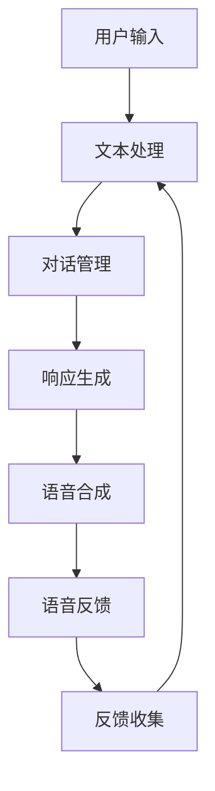

通过上述内容，我们了解了聊天机器人的基本架构和关键技术。接下来，我们将探讨聊天机器人界面设计的原则和方法，以优化用户体验。

#### 第3章：用户体验设计原则

##### 3.1 用户需求分析

用户需求分析是聊天机器人界面设计的第一步，它涉及到了解用户的需求、行为和偏好。以下是用户需求分析的方法和步骤：

1. **用户调研**：通过问卷调查、访谈、用户访谈等方式收集用户信息。
2. **用户行为分析**：分析用户在现有系统中的行为，了解他们的操作路径和痛点。
3. **用户画像**：基于调研和行为分析结果，构建用户画像，明确用户的需求和偏好。
4. **需求优先级排序**：根据用户画像和业务目标，确定需求的优先级，为设计提供指导。

以下是一个简单的用户需求分析流程Mermaid流程图：

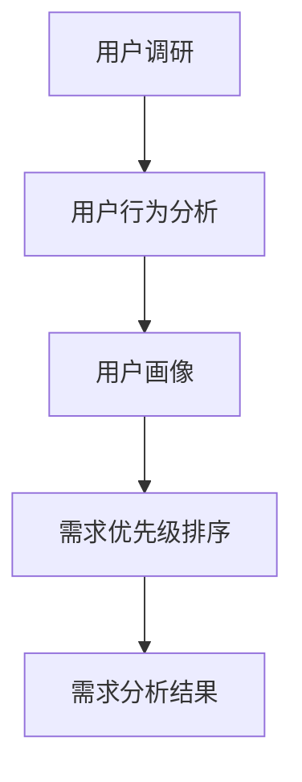

##### 3.2 界面布局与交互设计

界面布局与交互设计是提升用户体验的关键环节。以下是界面布局与交互设计的原则和方法：

1. **简洁明了**：界面应尽量简洁，避免过多的元素和信息，使用户能够快速找到所需功能。
2. **一致性**：界面设计应保持一致性，包括色彩、字体、图标等，以降低用户的学习成本。
3. **反馈机制**：为用户操作提供及时反馈，如按钮点击效果、加载动画等，增强用户的交互体验。
4. **导航设计**：设计清晰的导航结构，帮助用户快速找到所需内容。

以下是一个简单的界面布局与交互设计流程Mermaid流程图：

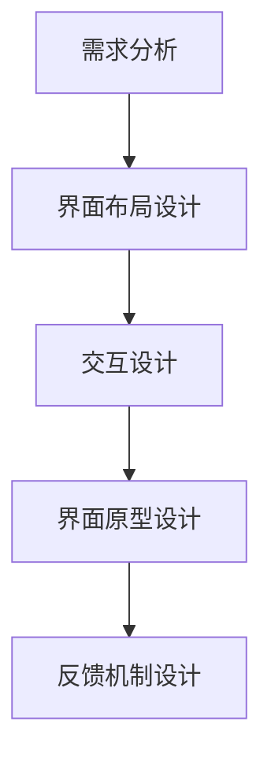

##### 3.3 信息架构与导航设计

信息架构与导航设计是确保用户能够高效找到所需信息的基石。以下是信息架构与导航设计的原则和方法：

1. **信息分类**：根据用户需求和行为，对信息进行合理的分类和组织。
2. **导航结构**：设计清晰的导航结构，包括顶部导航、侧边栏导航等，确保用户能够快速访问所需页面。
3. **面包屑导航**：在多级页面中，使用面包屑导航帮助用户了解当前所在位置，并快速返回上一级页面。
4. **搜索功能**：提供强大的搜索功能，帮助用户快速找到所需信息。

以下是一个简单的信息架构与导航设计流程Mermaid流程图：

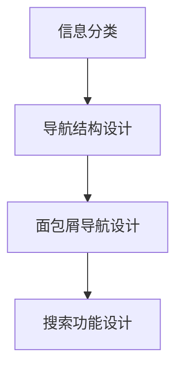

通过用户需求分析、界面布局与交互设计以及信息架构与导航设计，我们可以创建一个用户友好的聊天机器人界面。接下来，我们将探讨色彩、字体和图标设计在界面设计中的应用。

##### 3.4 色彩、字体与图标设计

色彩、字体和图标设计是界面设计的重要组成部分，它们直接影响用户的视觉体验和情感共鸣。以下是这些设计元素的原则和应用：

1. **色彩**：
   - **色彩心理学**：了解不同色彩对用户心理的影响，如蓝色代表冷静、绿色代表健康等。
   - **色彩搭配**：选择互补色、类似色或对比色进行搭配，以增强视觉效果。
   - **色彩一致性**：在整个界面中保持色彩的一致性，降低用户的学习成本。

2. **字体**：
   - **字体类型**：选择合适的字体类型，如衬线字体和非衬线字体，以适应不同的界面元素。
   - **字体大小和间距**：确保字体大小和行间距适中，易于阅读。
   - **字体一致性**：在整个界面中保持字体的一致性，增强界面整体性。

3. **图标**：
   - **图标设计原则**：简洁明了，避免复杂的设计，使图标易于识别。
   - **图标与文字的搭配**：合理搭配图标和文字，以传达清晰的信息。
   - **图标一致性**：在整个界面中保持图标的一致性，增强用户对界面的信任感。

以下是一个简单的色彩、字体与图标设计流程Mermaid流程图：

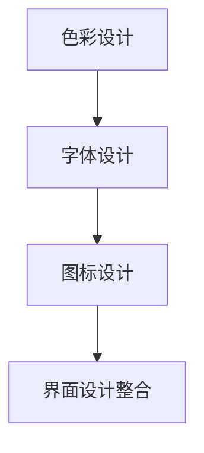

通过以上原则和方法，我们可以创建一个视觉上吸引人、用户体验良好的聊天机器人界面。接下来，我们将探讨响应式界面设计在聊天机器人中的应用。

#### 第4章：色彩、字体与图标设计

##### 4.1 色彩在界面设计中的应用

色彩在界面设计中起着至关重要的作用，它不仅能够吸引观众的注意力，还能传达情感和信息。以下是色彩在界面设计中的应用原则：

1. **色彩心理学**：了解不同颜色对用户心理和行为的影响。例如，蓝色通常代表信任和技术感，绿色代表健康和自然，红色代表紧迫感和激情。
2. **色彩搭配**：选择互补色、类似色或对比色进行搭配，以增强视觉效果。互补色搭配能够产生强烈的对比效果，类似色搭配则能营造出和谐的氛围。
3. **色彩一致性**：确保在整个界面中色彩保持一致，以降低用户的学习成本，提高用户体验的连贯性。

以下是一个简单的色彩搭配示例：

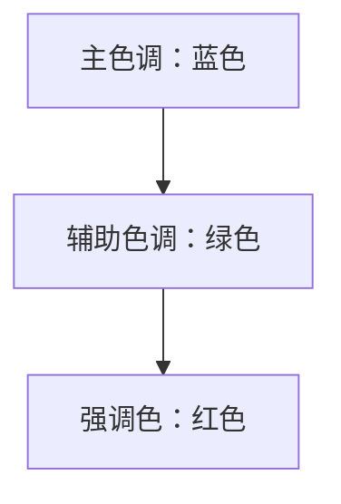

在实际应用中，我们可以使用色彩理论工具，如色轮和色彩混合器，来选择和调整色彩搭配。例如，在Chatbot的界面设计中，可以选择蓝色作为主色调，绿色作为辅助色调，红色作为强调色，以营造专业、自然且引人注目的视觉效果。

##### 4.2 字体选择与排版

字体选择和排版对于界面的可读性和美观性至关重要。以下是字体选择与排版的要点：

1. **字体类型**：选择适合界面风格和内容的字体。衬线字体（如Times New Roman）适用于正式文本，非衬线字体（如Arial）适用于现代设计。
2. **字体大小和间距**：确保字体大小适中，易于阅读。通常，正文文字的大小应在16px以上，标题和重要信息可适当加大。行间距和字符间距也要适中，以提高文本的可读性。
3. **字体一致性**：保持字体的一致性，以增强界面的整体性和专业感。例如，对于同一个Chatbot，应使用相同的字体风格和大小，以避免视觉上的混乱。

以下是一个简单的字体排版示例：

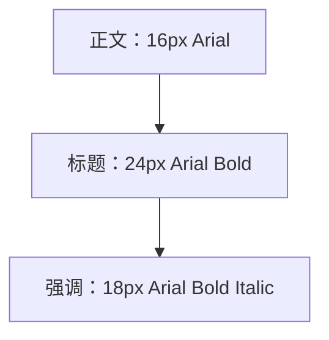

在实际应用中，可以使用字体库（如Google Fonts）来选择和引入多种字体，以丰富界面的视觉效果。例如，可以在Chatbot的界面中引入Roboto作为正文字体，Open Sans作为标题字体，以实现清晰、简洁的设计风格。

##### 4.3 图标设计原则与应用

图标设计是界面设计中的重要组成部分，它能够快速传达信息，提升用户体验。以下是图标设计的原则：

1. **简洁明了**：图标应简洁明了，避免过于复杂的设计，以易于用户识别。
2. **一致性**：在整个界面中保持图标的一致性，以避免视觉上的混乱。
3. **上下文**：根据图标所在的上下文环境，设计合适的图标样式，以传达清晰的信息。
4. **尺寸**：图标的大小应适中，以便在界面上显得既醒目又不会过于突兀。

以下是一个简单的图标设计原则示例：

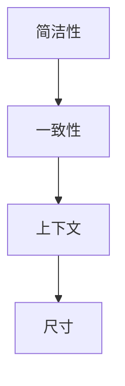

在实际应用中，可以使用图标库（如Font Awesome、Material Icons）来选择和引入图标，以节省设计和开发时间。例如，在Chatbot的界面中，可以使用Font Awesome来添加图标按钮，以提升界面的美观度和功能性。

以下是一个简单的图标应用示例：


在实际设计中，我们可以根据Chatbot的功能和用户需求，选择合适的图标进行应用。例如，在消息窗口中使用消息图标，在设置菜单中使用设置图标，在搜索框中使用搜索图标，以增强界面的功能性和用户体验。

通过以上色彩、字体和图标设计原则的应用，我们可以创建一个视觉上吸引人、用户体验良好的聊天机器人界面。接下来，我们将探讨响应式界面设计的重要性。

##### 4.4 响应式界面设计的重要性

在当今数字化时代，移动设备的普及使得响应式界面设计变得尤为重要。响应式界面设计能够确保聊天机器人在各种设备和屏幕尺寸上都能提供一致的体验，以下是响应式界面设计的重要性：

1. **提高用户体验**：响应式界面设计能够根据用户的设备屏幕大小和分辨率自动调整布局和内容，使用户在不同的设备上都能获得良好的体验。
2. **增强可访问性**：响应式设计使得聊天机器人能够适应不同用户的需求，包括视力障碍者、听力障碍者等，提高产品的可访问性。
3. **提升搜索引擎排名**：搜索引擎优化（SEO）是提高网站可见性的关键因素。响应式设计有助于提高搜索引擎排名，吸引更多用户访问。
4. **降低开发成本**：通过响应式设计，开发者可以减少为不同设备和屏幕尺寸开发独立版本的需求，从而降低开发和维护成本。

响应式界面设计的关键技术包括：

1. **媒体查询**：媒体查询（Media Queries）允许开发者根据不同的设备屏幕尺寸和分辨率应用不同的CSS样式。以下是一个简单的媒体查询示例：

   ```css
   @media (max-width: 768px) {
     /* 当屏幕宽度小于768px时应用的样式 */
   }
   ```

2. **弹性布局**：弹性布局（Flexbox）和网格布局（CSS Grid）是现代CSS布局技术，它们允许开发者创建适应不同屏幕尺寸的布局。以下是一个简单的Flexbox布局示例：

   ```css
   .container {
     display: flex;
     flex-direction: column;
     align-items: center;
   }
   ```

3. **响应式图片**：响应式图片技术允许开发者根据屏幕尺寸和分辨率加载不同尺寸的图片，以优化页面加载速度和性能。以下是一个简单的响应式图片示例：

   ```html
   
   ```

在实际应用中，我们可以结合这些技术，创建一个灵活、适应性强的聊天机器人界面。以下是一个简单的响应式界面设计流程：

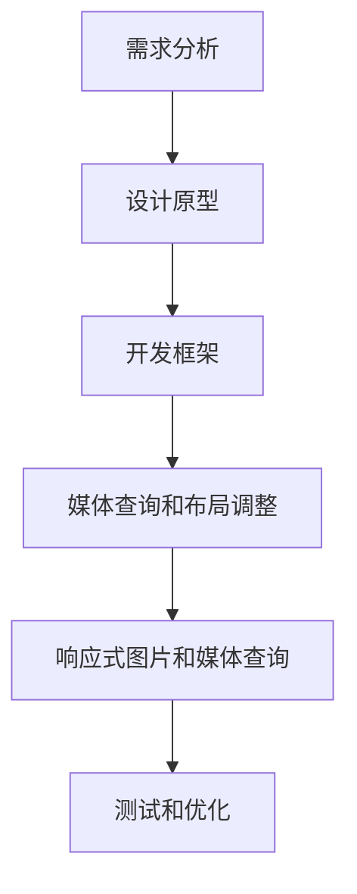

通过以上流程，我们可以确保聊天机器人在不同设备和屏幕尺寸上都能提供一致且优质的用户体验。

#### 第5章：响应式界面设计

##### 5.1 响应式设计的概念

响应式设计是一种设计方法，旨在创建能够适应不同屏幕尺寸和分辨率的网页或界面。响应式设计的核心目标是确保用户在不同设备上都能获得一致的体验。响应式设计的关键在于使用灵活的布局和媒体查询，使得界面能够自动调整以适应不同的屏幕尺寸。

响应式设计的基本原则包括：

1. **流动性布局**：使用流体布局（fluid layout）替代固定布局，使界面元素根据屏幕宽度自动调整大小。
2. **媒体查询**：使用媒体查询（media queries）根据不同的屏幕尺寸应用不同的样式，以优化布局和视觉效果。
3. **弹性图片和媒体**：使用弹性图片和媒体元素，使它们根据屏幕尺寸自动缩放。

以下是一个简单的响应式设计流程：

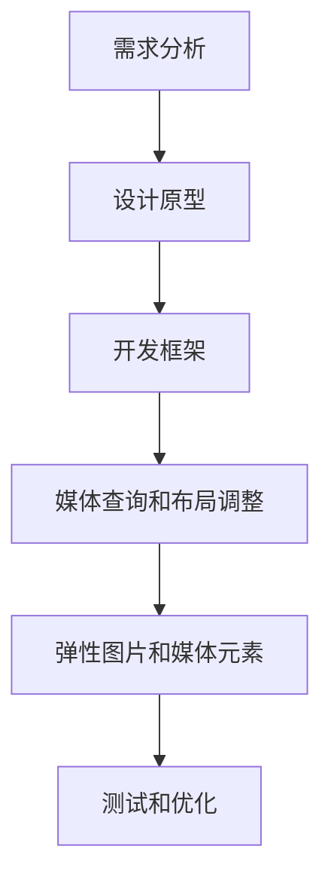

##### 5.2 媒体查询与布局调整

媒体查询是响应式设计的核心工具，它允许开发者根据不同的屏幕尺寸应用不同的样式。通过媒体查询，我们可以创建一个灵活且适应多种设备的布局。

以下是使用媒体查询进行布局调整的基本步骤：

1. **确定关键屏幕尺寸**：根据常见设备和屏幕尺寸确定关键宽度阈值，例如，桌面端（≥1200px）、平板端（768px-1200px）和移动端（≤768px）。
2. **编写媒体查询规则**：为每个屏幕尺寸编写媒体查询规则，并根据需要应用不同的样式。
3. **测试和优化**：在实际设备上测试布局效果，并根据反馈进行优化。

以下是一个简单的媒体查询示例：

```css
/* 桌面端样式 */
@media (min-width: 1200px) {
  .container {
    display: flex;
    justify-content: space-between;
  }
}

/* 平板端样式 */
@media (min-width: 768px) and (max-width: 1200px) {
  .container {
    display: flex;
    flex-direction: column;
  }
}

/* 移动端样式 */
@media (max-width: 768px) {
  .container {
    display: block;
  }
}
```

在实际开发中，我们可以使用预处理器（如SASS或LESS）和框架（如Bootstrap或Foundation）来简化媒体查询和布局调整的过程。以下是一个使用Bootstrap进行响应式布局的示例：

```html
<div class="container">
  <div class="row">
    <div class="col-md-4">Column 1</div>
    <div class="col-md-4">Column 2</div>
    <div class="col-md-4">Column 3</div>
  </div>
</div>
```

在这个示例中，`.container` 类用于创建一个固定宽度的容器，而`.row` 和`.col-md-4` 类用于创建一个响应式的布局。当屏幕宽度小于768px时，布局会自动调整为一列。

##### 5.3 移动端与桌面端界面设计差异

移动端和桌面端界面设计之间存在一些显著差异，这些差异主要源于设备尺寸、用户行为和交互方式的差异。以下是移动端与桌面端界面设计的一些关键差异：

1. **屏幕尺寸**：移动设备的屏幕尺寸通常较小，因此需要更加紧凑和简洁的布局。桌面端则拥有更大的屏幕空间，可以容纳更多的内容和复杂的布局。
2. **交互方式**：移动端主要依赖触摸操作，因此需要设计易于触摸的按钮和图标。桌面端则主要依赖鼠标和键盘操作，可以设计更小、更精细的交互元素。
3. **导航方式**：移动端通常使用底部导航或滑动导航，以节省屏幕空间。桌面端则可以使用顶部菜单或侧边栏导航，提供更多的访问选项。
4. **内容优先级**：移动端设计应优先考虑关键内容，以快速满足用户的需求。桌面端设计则可以包含更多的内容，并提供更详细的上下文信息。

以下是一个简单的移动端与桌面端界面设计对比示例：

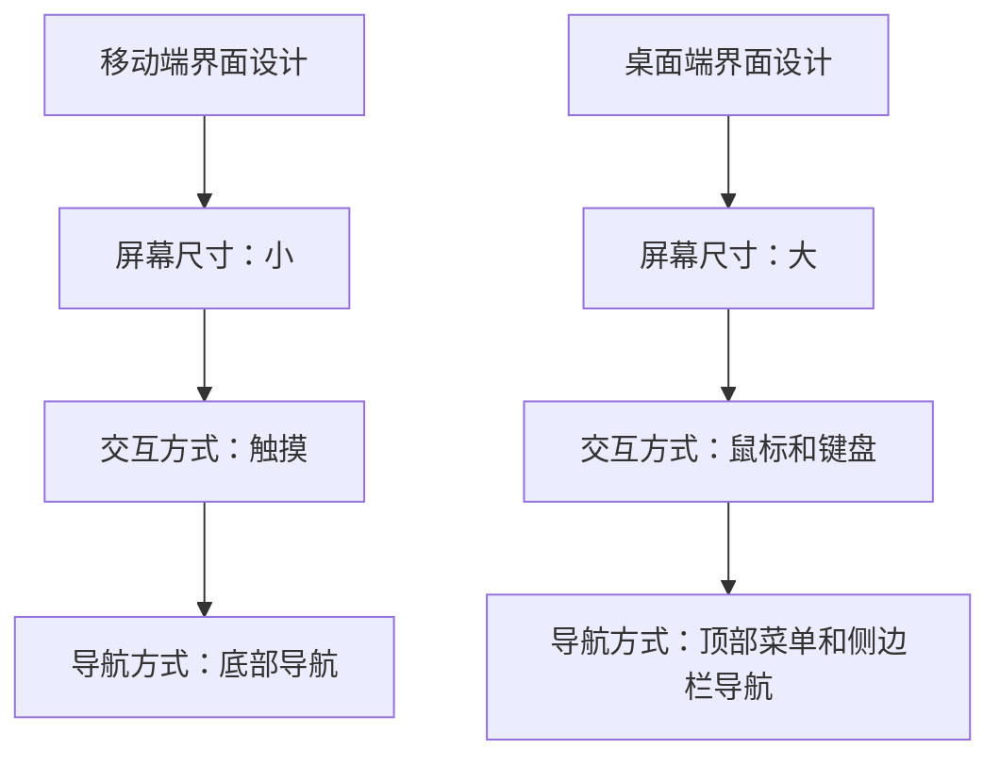

在实际设计中，我们需要根据具体的应用场景和用户需求，综合考虑移动端与桌面端的设计差异，以提供最佳的用户体验。

通过以上内容，我们了解了响应式界面设计的基本概念、媒体查询与布局调整的方法，以及移动端与桌面端界面设计的差异。接下来，我们将探讨前端技术实现和聊天机器人界面的前端框架。

#### 第6章：前端技术实现

##### 6.1 前端技术选型

前端技术选型是构建聊天机器人界面的重要环节，它直接关系到界面的性能、可维护性和用户体验。以下是前端技术选型的主要考虑因素：

1. **项目需求**：根据项目的具体需求和功能，选择适合的前端技术。例如，如果项目需要高度动态的交互，可以考虑使用React或Vue.js等框架。
2. **团队技能**：考虑团队成员的技术栈和技能水平，选择团队熟悉的技术，以降低开发和维护成本。
3. **社区支持**：选择拥有强大社区支持的前端技术，以便在遇到问题时能够快速获得帮助和解决方案。
4. **性能**：选择性能优秀的前端技术，确保聊天机器人的界面能够快速响应和流畅运行。
5. **可维护性**：选择易于维护和扩展的前端技术，以降低长期维护成本。

以下是几种常见的前端技术框架的优缺点：

1. **React**：
   - **优点**：组件化设计，易于维护和扩展，丰富的社区资源和插件。
   - **缺点**：学习曲线较陡，虚拟DOM可能导致性能问题。
2. **Vue.js**：
   - **优点**：轻量级，易于上手，良好的文档和社区支持。
   - **缺点**：与React相比，社区资源和插件较少。
3. **Angular**：
   - **优点**：强类型框架，强大的工具集，良好的性能。
   - **缺点**：学习曲线较陡，框架本身较为庞大。

在实际项目中，我们可以根据具体需求和技术栈，选择合适的前端技术框架。例如，如果项目需要一个高度动态的聊天界面，React可能是更好的选择；如果项目团队对Vue.js较为熟悉，Vue.js可能是一个更合适的选择。

##### 6.2 聊天机器人界面的前端框架

聊天机器人界面的前端框架选择至关重要，它决定了界面的性能、可维护性和用户体验。以下是几种常见的前端框架在聊天机器人界面设计中的应用：

1. **React**：
   - **组件化设计**：React采用组件化设计，使得开发者可以独立开发和管理界面组件，提高了代码的可维护性和可复用性。
   - **虚拟DOM**：React使用虚拟DOM，通过比较虚拟DOM和实际DOM的差异，只更新需要更新的部分，从而提高性能。
   - **状态管理**：React结合Redux或Context API进行状态管理，使得状态更新和组件通信更加高效和简洁。

以下是一个简单的React聊天机器人界面组件示例：

```jsx
import React, { useState } from 'react';

const Chatbot = () => {
  const [inputValue, setInputValue] = useState('');
  const [messages, setMessages] = useState([]);

  const handleInputChange = (event) => {
    setInputValue(event.target.value);
  };

  const handleSendMessage = () => {
    const message = { text: inputValue, sender: 'user' };
    setMessages([...messages, message]);
    setInputValue('');
    // 调用后端API发送消息
  };

  return (
    <div className="chatbot">
      <ul>
        {messages.map((message, index) => (
          <li key={index}>{message.sender}: {message.text}</li>
        ))}
      </ul>
      <input type="text" value={inputValue} onChange={handleInputChange} />
      <button onClick={handleSendMessage}>发送</button>
    </div>
  );
};

export default Chatbot;
```

2. **Vue.js**：
   - **渐进式框架**：Vue.js是一个渐进式框架，可以灵活地应用于各种规模的项目。
   - **双向数据绑定**：Vue.js采用双向数据绑定，简化了表单处理和用户输入管理。
   - **计算属性和监听器**：Vue.js提供计算属性和监听器，用于处理复杂的数据处理和状态更新。

以下是一个简单的Vue.js聊天机器人界面组件示例：

```vue
<template>
  <div class="chatbot">
    <ul>
      <li v-for="(message, index) in messages" :key="index">
        {{ message.sender }}: {{ message.text }}
      </li>
    </ul>
    <input type="text" v-model="inputValue" />
    <button @click="sendMessage">发送</button>
  </div>
</template>

<script>
export default {
  data() {
    return {
      inputValue: '',
      messages: [],
    };
  },
  methods: {
    sendMessage() {
      this.messages.push({ text: this.inputValue, sender: 'user' });
      this.inputValue = '';
      // 调用后端API发送消息
    },
  },
};
</script>
```

3. **Angular**：
   - **强类型框架**：Angular是一个强类型框架，提供了丰富的工具和库，用于构建复杂的应用程序。
   - **依赖注入**：Angular使用依赖注入（DI）进行组件通信和状态管理，使得代码更加模块化和可维护。
   - **响应式编程**：Angular采用响应式编程模型，能够自动更新和重渲染组件，提高性能。

以下是一个简单的Angular聊天机器人界面组件示例：

```typescript
@Component({
  selector: 'app-chatbot',
  templateUrl: './chatbot.component.html',
  styleUrls: ['./chatbot.component.css'],
})
export class ChatbotComponent {
  inputValue: string = '';
  messages: Message[] = [];

  sendMessage() {
    this.messages.push({ text: this.inputValue, sender: 'user' });
    this.inputValue = '';
    // 调用后端API发送消息
  }
}
```

在实际开发中，我们可以根据项目需求和团队技能，选择合适的前端框架，构建高效、可维护和用户体验良好的聊天机器人界面。接下来，我们将探讨后端技术实现和聊天机器人界面的后端架构。

#### 第7章：后端技术实现

##### 7.1 后端技术选型

后端技术选型是构建聊天机器人界面的关键步骤，它决定了系统的性能、可扩展性和可维护性。以下是后端技术选型的主要考虑因素：

1. **项目需求**：根据项目的具体需求，选择适合的后端技术。例如，如果项目需要处理大量数据，可以选择使用NoSQL数据库（如MongoDB）。
2. **开发团队技能**：考虑团队对各种后端技术的熟悉程度，选择团队擅长和熟悉的技术，以降低开发和维护成本。
3. **性能**：选择性能优秀的技术，确保系统能够快速响应用户请求，提供良好的用户体验。
4. **可扩展性**：选择易于扩展和分布式部署的技术，以支持未来的业务增长和用户需求。
5. **生态系统**：选择拥有强大社区支持和丰富生态系统的技术，以便在遇到问题时能够快速获得帮助和解决方案。

以下是几种常见的后端技术框架的优缺点：

1. **Node.js**：
   - **优点**：基于JavaScript的异步编程，具有高性能和高并发能力。
   - **缺点**：单线程模型可能导致性能瓶颈，调试和诊断相对复杂。
2. **Java**：
   - **优点**：强大的生态系统和丰富的库，适用于大型和复杂的应用程序。
   - **缺点**：学习曲线较陡，开发周期较长。
3. **Python**：
   - **优点**：易于学习，丰富的库和框架，适用于快速开发和原型设计。
   - **缺点**：性能相对较低，并发能力有限。

在实际项目中，我们可以根据具体需求和技术栈，选择合适的后端技术框架。例如，如果项目需要一个高性能、高并发的聊天机器人系统，Node.js可能是一个更好的选择；如果项目需要复杂的数据处理和业务逻辑，Java可能更适合。

##### 7.2 自然语言处理后端架构

自然语言处理（NLP）是聊天机器人技术的核心组成部分，它负责理解和生成自然语言。以下是自然语言处理后端架构的主要组件和实现方法：

1. **文本处理**：文本处理包括分词、词性标注、句法分析和语义分析等。常用的文本处理工具和库包括NLTK、spaCy和Stanford NLP等。
2. **对话管理**：对话管理负责处理用户输入，生成合适的响应。对话管理通常使用基于规则的方法、机器学习方法或混合方法。常用的对话管理框架和库包括Rasa、ChatterBot和Microsoft Bot Framework等。
3. **自然语言生成**：自然语言生成（NLG）负责将处理后的数据转换为自然语言响应。常用的NLG方法包括模板匹配、规则生成和生成式模型等。常见的NLG工具和库包括NLG toolkit、Rosette和OpenAI的GPT-3等。

以下是一个简单的自然语言处理后端架构：

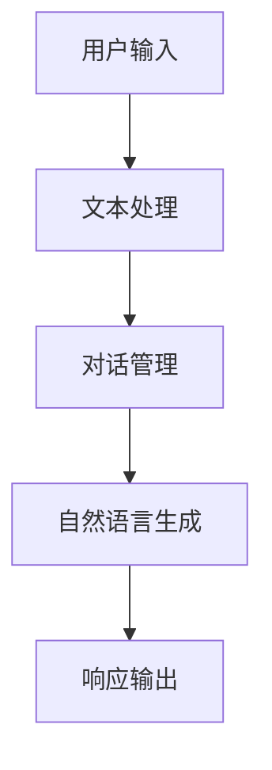

在实际开发中，我们可以使用多个技术和工具来构建自然语言处理后端架构。例如，可以使用Python的spaCy进行文本处理，使用Rasa进行对话管理，并使用NLG toolkit进行自然语言生成。

##### 7.3 语音识别与合成后端架构

语音识别（ASR）和语音合成（TTS）是聊天机器人交互的重要组成部分，它们使得用户可以通过语音与系统进行交互。以下是语音识别与合成后端架构的主要组件和实现方法：

1. **语音识别**：语音识别将用户的语音转换为文本。常用的语音识别工具和库包括Google Cloud Speech-to-Text、Microsoft Azure Speech Services和CMU Sphinx等。
2. **语音合成**：语音合成将文本转换为自然流畅的语音。常用的语音合成工具和库包括Google Text-to-Speech、Amazon Polly和Microsoft Azure Speech Services等。
3. **音频处理**：音频处理包括音频的预处理、增强和后处理。常用的音频处理工具和库包括Librosa、OpenSMILE和Audacity等。

以下是一个简单的语音识别与合成后端架构：

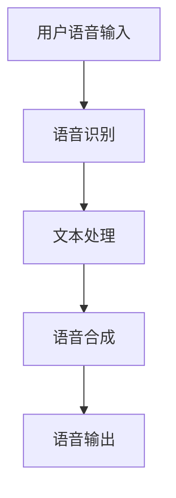

在实际开发中，我们可以使用多个技术和工具来构建语音识别与合成后端架构。例如，可以使用Google Cloud Speech-to-Text进行语音识别，使用Amazon Polly进行语音合成，并使用Librosa进行音频处理。

##### 7.4 后端接口设计与实现

后端接口设计是构建聊天机器人界面的关键步骤，它决定了前端与后端之间的数据传输和交互方式。以下是后端接口设计的主要原则和实现方法：

1. **RESTful API**：RESTful API是一种流行的后端接口设计方法，它基于HTTP协议，使用统一的URL结构、请求方法和响应格式。
2. **GraphQL**：GraphQL是一种新兴的后端接口设计方法，它提供了一种强大的数据查询和操作语言，能够减少数据传输量和提高接口性能。
3. **接口设计原则**：
   - **单一职责**：每个接口应负责一个单一的功能，以提高代码的可维护性和可扩展性。
   - **一致性**：接口设计应保持一致性，包括URL结构、请求参数和响应格式。
   - **安全性**：接口设计应考虑安全性，包括身份验证、授权和数据加密。

以下是一个简单的RESTful API接口示例：

```json
// 用户注册接口
POST /api/users/register
{
  "email": "user@example.com",
  "password": "password123"
}

// 响应示例
{
  "status": "success",
  "message": "User registered successfully",
  "userId": "123456"
}
```

在实际开发中，我们可以使用多种技术和工具来构建后端接口，例如使用Node.js的Express框架、Python的Flask框架或Java的Spring Boot框架等。

通过以上内容，我们了解了后端技术选型、自然语言处理、语音识别与合成以及后端接口设计的关键技术和方法。接下来，我们将探讨界面优化与测试的重要性。

#### 第8章：界面优化与测试

##### 8.1 界面优化策略

界面优化是确保聊天机器人界面性能和用户体验的关键步骤。以下是一些关键的界面优化策略：

1. **加载时间优化**：优化页面加载速度，减少资源请求和HTTP请求次数，使用缓存策略，压缩和合并文件，使用内容分发网络（CDN）。
2. **响应时间优化**：确保后端API快速响应，优化数据库查询，使用缓存和预加载技术，减少不必要的中间件处理。
3. **交互流畅性**：优化动画效果，使用平滑过渡，避免页面跳转和闪烁，确保用户操作有及时的反馈。
4. **性能监控**：使用性能监控工具，如Google Analytics、Lighthouse等，定期评估界面性能，发现和解决问题。
5. **用户体验测试**：通过用户测试和反馈收集，识别界面设计和功能中的问题，不断优化和改进。

以下是一个简单的界面优化流程：

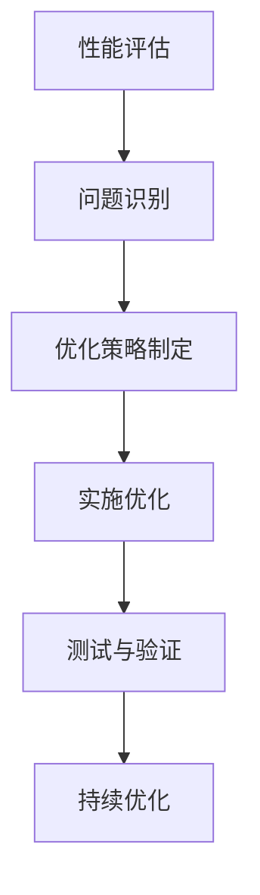

##### 8.2 性能测试与优化

性能测试是评估聊天机器人界面性能的重要手段，以下是一些常见的性能测试方法和优化技巧：

1. **负载测试**：模拟大量用户同时访问系统，评估系统的负载能力和响应时间。常用的工具包括Apache JMeter、LoadRunner等。
2. **压力测试**：在极端条件下测试系统的稳定性和可靠性，识别系统的性能瓶颈。常用的工具包括BlazeMeter、Locust等。
3. **优化技巧**：
   - **数据库优化**：索引优化、查询优化、分库分表，减少数据库查询时间和数据访问延迟。
   - **缓存策略**：使用缓存技术，如Redis、Memcached等，减少数据库访问次数，提高系统响应速度。
   - **代码优化**：使用高效算法和数据结构，减少不必要的计算和内存占用。
   - **前端优化**：减少HTTP请求次数，使用异步加载、懒加载等技术，优化页面加载性能。

以下是一个简单的性能测试和优化流程：

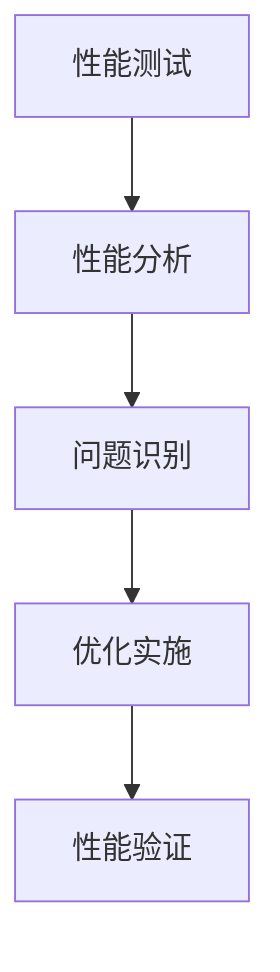

##### 8.3 用户测试与反馈收集

用户测试和反馈收集是优化聊天机器人界面设计的重要环节，以下是一些用户测试和反馈收集的方法：

1. **用户测试方法**：
   - **可用性测试**：邀请真实用户进行交互测试，评估界面的易用性和用户满意度。
   - **A/B测试**：对比不同界面设计的效果，选择最佳设计方案。
   - **回归测试**：在界面优化后，重新评估性能和用户体验，确保优化没有引入新的问题。
2. **反馈收集方法**：
   - **问卷调查**：通过在线问卷收集用户反馈，了解用户的满意度和改进建议。
   - **用户访谈**：与用户进行面对面访谈，深入了解用户的体验和需求。
   - **反馈渠道**：在界面中提供反馈渠道，如反馈表单、在线聊天等，方便用户随时提交反馈。

以下是一个简单的用户测试和反馈收集流程：

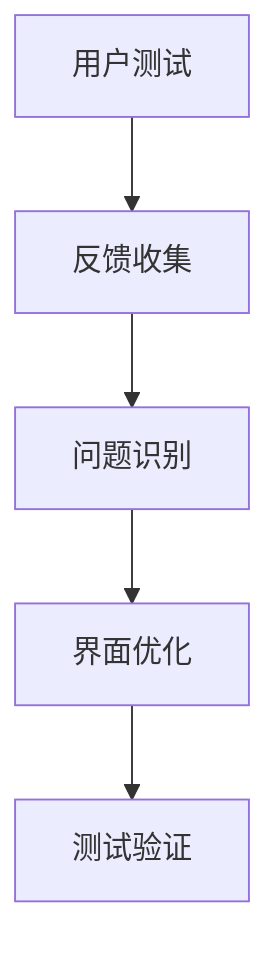

通过以上内容，我们了解了界面优化策略、性能测试与优化以及用户测试与反馈收集的关键方法和技巧。接下来，我们将通过一个实际案例，展示如何进行聊天机器人界面设计。

#### 第9章：聊天机器人界面设计案例

##### 9.1 案例背景与需求分析

**案例背景**：
某电商公司希望为其移动应用引入一个智能聊天机器人，以提高用户互动体验和满意度。该聊天机器人旨在提供实时客服支持、产品推荐和订单跟踪等功能。

**需求分析**：

1. **用户需求**：
   - 用户希望获得即时、有效的客服支持，解决购物过程中遇到的问题。
   - 用户希望获得个性化的产品推荐，提升购物体验。
   - 用户希望能够轻松查看订单状态，追踪物流信息。

2. **功能需求**：
   - 实时客服支持：用户可以随时通过聊天机器人咨询客服问题。
   - 产品推荐：聊天机器人根据用户历史购买行为和浏览记录，提供个性化产品推荐。
   - 订单跟踪：用户可以查询订单状态，包括物流信息和预计送达时间。

3. **界面需求**：
   - 界面应简洁易用，符合用户习惯。
   - 界面应具备良好的响应速度，提供流畅的交互体验。
   - 界面应包含必要的导航元素，如顶部导航栏和底部聊天窗口。

##### 9.2 界面设计流程与思路

**界面设计流程**：

1. **需求分析**：与产品经理和用户代表进行深入交流，明确聊天机器人的功能需求和用户场景。
2. **用户研究**：通过用户访谈、问卷调查和用户行为分析，了解用户的使用习惯和偏好。
3. **原型设计**：根据需求和用户研究结果，设计聊天机器人的界面原型。
4. **迭代优化**：与产品团队和用户代表进行原型测试，收集反馈并进行优化。
5. **最终确认**：根据反馈和测试结果，确认最终界面设计。

**设计思路**：

1. **简洁明了**：界面设计应简洁明了，避免过多的元素和信息，突出主要功能。
2. **响应式设计**：确保界面在不同设备上都能提供一致的用户体验，包括移动端和桌面端。
3. **交互设计**：提供清晰的交互元素，如按钮、图标和导航栏，使用户能够轻松操作。
4. **个性化**：根据用户的历史行为和偏好，提供个性化的产品推荐和客服支持。

##### 9.3 界面设计成果展示

**聊天界面原型**：


**主要功能模块**：

1. **实时客服支持**：用户可以通过聊天窗口与客服进行实时交流，解决购物过程中遇到的问题。
2. **产品推荐**：聊天机器人根据用户的历史购买行为和浏览记录，提供个性化的产品推荐。
3. **订单跟踪**：用户可以查看订单状态，包括物流信息和预计送达时间。

**设计细节**：

1. **顶部导航栏**：提供首页、购物车、订单中心和客服中心的快捷入口。
2. **底部聊天窗口**：用户可以通过聊天窗口与聊天机器人进行交互，输入问题和反馈。
3. **响应式设计**：界面在不同设备上都能自适应布局，提供良好的用户体验。

##### 9.4 项目总结与反思

**项目总结**：

通过本次聊天机器人界面设计项目，我们成功实现了以下目标：

1. 提高了用户互动体验和满意度。
2. 优化了客服支持流程，提升了客服效率。
3. 实现了个性化产品推荐，增加了用户粘性。

**反思与改进**：

1. **用户研究**：在需求分析和用户研究中，应更深入地了解用户的具体需求和痛点，以提高界面设计的精准度。
2. **界面优化**：在后续迭代中，应持续优化界面设计和交互体验，根据用户反馈进行改进。
3. **性能优化**：关注聊天机器人界面的性能优化，提高加载速度和响应时间，确保良好的用户体验。

通过以上案例，我们展示了如何进行聊天机器人界面设计，从需求分析到界面设计，再到项目总结与反思，为开发者提供了实用的经验和指导。

#### 第10章：跨平台聊天机器人界面设计

##### 10.1 跨平台设计的重要性

随着移动设备的普及，跨平台聊天机器人界面设计变得尤为重要。跨平台设计不仅能够确保聊天机器人界面在不同设备和操作系统上的一致性，还能提升用户体验，增加用户满意度。以下是跨平台设计的重要性：

1. **用户需求**：用户希望在任何设备上都能获得一致且优质的体验，无论是移动端、桌面端还是平板端。
2. **商业目标**：跨平台设计能够帮助企业扩大用户群，提高市场竞争力，增加收入。
3. **技术挑战**：跨平台设计需要考虑不同设备和操作系统的兼容性，以及不同的界面布局和交互方式。

##### 10.2 移动端界面设计

移动端界面设计需要考虑设备的尺寸、分辨率和用户习惯。以下是移动端界面设计的关键要点：

1. **简洁性**：移动端屏幕尺寸较小，界面设计应简洁明了，避免过多的元素和信息。
2. **响应式设计**：使用响应式设计技术，确保界面在不同尺寸的移动设备上都能良好显示。
3. **触摸优化**：优化触摸交互，确保按钮和图标足够大，易于点击。
4. **导航设计**：采用底部导航或滑动导航，节省屏幕空间，方便用户操作。

以下是一个简单的移动端界面设计示例：

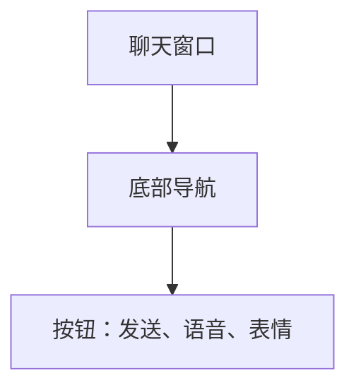

在这个示例中，聊天窗口占据了主要部分，底部导航提供了发送、语音和表情等快捷操作。

##### 10.3 桌面端界面设计

桌面端界面设计通常拥有更大的屏幕空间，可以容纳更多的内容和复杂的布局。以下是桌面端界面设计的关键要点：

1. **布局**：采用分栏布局或网格布局，充分利用屏幕空间，提高内容展示效果。
2. **交互设计**：使用鼠标和键盘操作，设计更加精细和复杂的交互元素。
3. **信息展示**：展示更多的信息和选项，提供详细的数据报表和功能操作。
4. **个性化**：根据用户角色和权限，提供个性化的界面设计和功能模块。

以下是一个简单的桌面端界面设计示例：

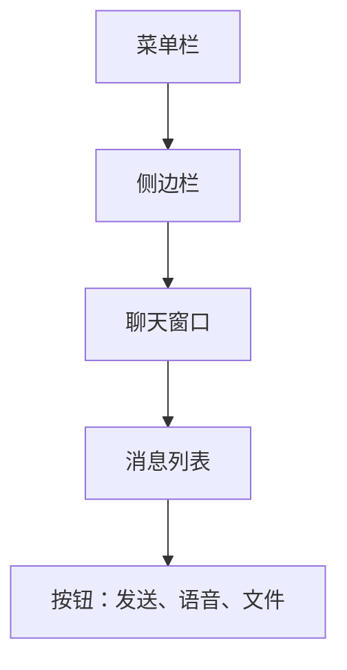

在这个示例中，菜单栏和侧边栏提供了丰富的导航和操作选项，聊天窗口和消息列表占据了主要部分，按钮用于发送、语音和文件等操作。

##### 10.4 跨平台统一设计策略

为了实现跨平台统一设计，可以采用以下策略：

1. **设计规范**：制定统一的设计规范，包括色彩、字体、图标和交互设计，确保不同平台的一致性。
2. **组件化**：采用组件化设计，开发可复用的界面组件，减少重复开发工作。
3. **适应性布局**：使用弹性布局和媒体查询，确保界面在不同设备和屏幕尺寸上的适应性。
4. **代码共享**：通过代码共享和模块化，减少不同平台之间的代码差异，提高开发效率。

以下是一个简单的跨平台统一设计策略流程：

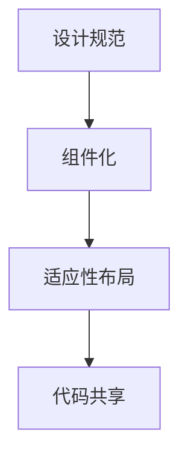

通过以上策略，我们可以实现跨平台聊天机器人界面设计，提供一致且优质的用户体验。

#### 第11章：聊天机器人界面设计最佳实践

##### 11.1 最佳实践概述

在聊天机器人界面设计过程中，遵循最佳实践能够提高用户体验，确保系统的可维护性和扩展性。以下是一些聊天机器人界面设计的最佳实践：

1. **用户需求分析**：深入了解用户需求，通过用户访谈、问卷调查和用户行为分析，获取用户反馈，为界面设计提供指导。
2. **简洁明了**：界面设计应简洁明了，避免过多的元素和信息，确保用户能够快速找到所需功能。
3. **一致性**：保持界面设计的一致性，包括色彩、字体、图标和交互设计，以降低用户的学习成本。
4. **响应式设计**：使用响应式设计技术，确保界面在不同设备和屏幕尺寸上都能提供良好的用户体验。
5. **交互设计**：设计清晰的交互元素，如按钮、图标和导航栏，确保用户能够轻松操作。
6. **性能优化**：优化界面性能，确保快速的加载速度和响应时间，提供流畅的交互体验。
7. **用户测试与反馈**：定期进行用户测试和反馈收集，识别界面设计和功能中的问题，持续优化和改进。

##### 11.2 设计文档编写与评审

设计文档是聊天机器人界面设计的重要依据，它详细描述了界面设计的原则、流程和实现方法。以下是设计文档编写与评审的关键步骤：

1. **需求分析**：记录用户需求、功能需求和界面需求，明确设计目标。
2. **界面原型**：绘制界面原型图，包括页面布局、交互设计和信息架构。
3. **设计规范**：编写设计规范文档，包括色彩、字体、图标和交互设计的要求。
4. **评审与反馈**：与产品团队、开发团队和用户代表进行评审，收集反馈并进行修改。

以下是一个简单的设计文档编写与评审流程：

```mermaid
graph TD
A[需求分析] --> B[界面原型]
B --> C[设计规范]
C --> D[评审与反馈]
D --> E[修改与完善]
```

通过以上步骤，我们可以确保设计文档的完整性和准确性，为后续的界面设计和开发提供可靠的依据。

##### 11.3 用户研究方法与应用

用户研究是聊天机器人界面设计的关键环节，通过用户研究，我们可以深入了解用户的需求、行为和偏好，为界面设计提供科学依据。以下是几种常见的用户研究方法：

1. **用户访谈**：通过面对面或在线访谈，深入了解用户的使用场景、需求和痛点。
2. **问卷调查**：设计问卷，收集大量用户的数据，了解用户群体的需求和偏好。
3. **用户行为分析**：通过分析用户在系统中的行为数据，识别用户的操作路径和使用习惯。
4. **A/B测试**：对比不同界面设计的效果，选择最佳设计方案。

以下是一个简单的用户研究方法应用示例：

```mermaid
graph TD
A[用户访谈] --> B[问卷调查]
B --> C[用户行为分析]
C --> D[A/B测试]
D --> E[界面优化]
```

通过以上方法，我们可以系统地收集用户反馈，为界面设计提供科学依据，持续优化用户体验。

##### 11.4 界面设计的持续迭代与优化

界面设计不是一成不变的，而是需要不断迭代和优化，以适应不断变化的需求和技术发展。以下是界面设计的持续迭代与优化策略：

1. **定期评估**：定期对界面性能、用户体验和用户满意度进行评估，识别需要改进的方面。
2. **用户反馈**：收集用户的反馈和建议，了解他们在使用过程中遇到的问题和需求。
3. **持续改进**：根据评估和用户反馈，对界面设计进行持续改进和优化，提高用户体验。
4. **迭代开发**：采用敏捷开发方法，快速迭代和发布新功能，不断优化界面设计。

以下是一个简单的界面设计迭代与优化流程：

```mermaid
graph TD
A[定期评估] --> B[用户反馈]
B --> C[持续改进]
C --> D[迭代开发]
D --> E[界面优化]
```

通过以上策略，我们可以确保界面设计不断适应用户需求和技术发展，提供优质的用户体验。

#### 附录A：相关工具与技术资源

##### A.1 常用前端框架介绍

在前端开发中，选择合适的前端框架能够提高开发效率和代码质量。以下是几种常用的前端框架：

1. **React**：React是一个由Facebook开源的JavaScript库，用于构建用户界面。它采用组件化设计，具有虚拟DOM和高性能的特点。

2. **Vue.js**：Vue.js是一个渐进式JavaScript框架，用于构建用户界面。它易于上手，具有双向数据绑定和强大的生态系统。

3. **Angular**：Angular是由Google开源的一个全功能前端框架，用于构建复杂的应用程序。它采用依赖注入和响应式编程模型，具有强大的工具集。

4. **Svelte**：Svelte是一个新兴的前端框架，它将编译时进行模板转换，减少了浏览器的渲染负担，提供了更高的性能。

##### A.2 常用后端框架介绍

在后端开发中，选择合适的后端框架能够提高开发效率和系统稳定性。以下是几种常用的后端框架：

1. **Node.js**：Node.js是一个基于Chrome V8引擎的JavaScript运行时，适用于构建高并发、高性能的应用程序。

2. **Express.js**：Express.js是一个Node.js的Web应用框架，用于快速搭建Web应用程序。

3. **Spring Boot**：Spring Boot是由Spring社区开源的一个Java后端框架，用于构建企业级应用程序。它具有丰富的功能和良好的社区支持。

4. **Django**：Django是一个Python后端框架，适用于快速开发和部署Web应用程序。它采用MVC设计模式，具有内置的数据库支持和强大的ORM功能。

##### A.3 聊天机器人开发工具推荐

在聊天机器人开发中，选择合适的开发工具能够提高开发效率和代码质量。以下是几种常用的聊天机器人开发工具：

1. **Rasa**：Rasa是一个开源的聊天机器人框架，用于构建高质量的聊天机器人。它提供了对话管理、自然语言处理和集成API等功能。

2. **Microsoft Bot Framework**：Microsoft Bot Framework是一个用于构建和部署聊天机器人的开发平台，支持多种平台和语言。

3. **TensorFlow**：TensorFlow是一个开源的机器学习库，用于构建和训练聊天机器人的模型。它提供了丰富的工具和资源，适用于各种规模的机器学习项目。

4. **OpenAI Gym**：OpenAI Gym是一个开源的环境库，用于测试和训练聊天机器人的智能体。它提供了多种环境，如文本分类、问答系统和游戏等。

##### A.4 其他相关资源推荐

除了上述工具和技术，还有许多其他资源可以用于聊天机器人界面设计和开发：

1. **Design Systems**：Design Systems是一组工具、库和文档，用于构建一致的用户界面。它提供了一组设计原则、组件和样式，有助于提高开发效率和一致性。

2. **User Research Tools**：用户研究工具如UserTesting、UsabilityHub和Screaming Frog等，可用于进行用户测试、可用性测试和网站分析。

3. **GitHub Repositories**：GitHub上有很多优秀的聊天机器人项目和示例代码，可以用于学习和参考。

4. **Online Courses and Tutorials**：在线课程和教程如Coursera、Udemy和edX等，提供了丰富的学习资源，涵盖前端、后端和聊天机器人开发等主题。

通过以上工具和技术资源的推荐，开发者可以更好地进行聊天机器人界面设计和开发，提高工作效率和代码质量。

### 作者信息

作者：AI天才研究院/AI Genius Institute & 禅与计算机程序设计艺术 /Zen And The Art of Computer Programming

AI天才研究院（AI Genius Institute）专注于人工智能技术的研发和应用，致力于推动人工智能技术的创新和发展。研究院的专家团队在计算机编程和人工智能领域拥有丰富的经验和深厚的理论基础，为全球企业和研究机构提供专业的技术解决方案和咨询服务。

《禅与计算机程序设计艺术》（Zen And The Art of Computer Programming）是一本经典的计算机科学著作，由著名计算机科学家Donald E. Knuth撰写。本书以禅宗思想为出发点，探讨了计算机程序设计中的哲学和艺术，为程序员提供了一种全新的思考方式和方法论。作者在人工智能和计算机科学领域的研究和贡献，使得其在全球范围内享有极高的声誉和影响力。

