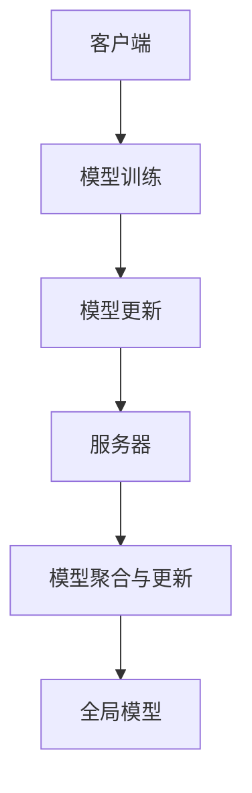

                 

### 文章标题：联邦学习：隐私保护下的分布式机器学习

> 关键词：联邦学习，分布式机器学习，隐私保护，数据分布，去中心化，加密技术

> 摘要：本文将深入探讨联邦学习这一隐私保护下的分布式机器学习框架。我们将从基础概念入手，逐步分析联邦学习的核心架构、关键技术以及隐私保护机制，并展望其研究现状与发展趋势。

---

### 第一部分：联邦学习基础知识

#### 第1章：联邦学习概述

##### 1.1 联邦学习的基本概念

**1.1.1 联邦学习的定义**

联邦学习（Federated Learning）是一种分布式机器学习框架，它允许多个参与者通过聚合模型更新来共同训练一个全局模型，而不需要直接共享他们的数据。这种框架尤其适用于隐私敏感的场景，如医疗、金融等领域。

**1.1.2 联邦学习的特点**

- **隐私保护**：参与者无需共享原始数据，只需共享模型更新，有效保护数据隐私。
- **数据分布**：能够处理数据分布在多个不同地理位置的情景，无需集中化数据。
- **去中心化**：模型训练过程不需要中心服务器，减少了单点故障风险。

##### 1.2 联邦学习的架构

**1.2.1 联邦学习的基本架构**

在联邦学习中，通常存在以下三个主要角色：

- **客户端**：负责收集本地数据、训练本地模型并生成模型更新。
- **服务器**：负责聚合客户端提交的模型更新，更新全局模型。
- **全局模型**：由服务器维护，是所有客户端训练结果的汇总。

**1.2.2 联邦学习的挑战与解决方案**

- **通信效率**：解决客户端与服务器之间的通信问题，如模型大小和通信频率。
- **隐私保护**：确保模型更新过程不泄露参与者数据。

**1.2.3 联邦学习的关键技术**

- **加密技术**：如差分隐私、同态加密等，确保数据在传输和存储过程中的隐私。
- **模型聚合**：如联邦平均算法、梯度压缩等，提高模型更新效率。

##### 1.3 联邦学习的研究现状与发展趋势

**1.3.1 联邦学习的应用领域**

- **医疗健康**：隐私保护的患者数据共享，疾病预测和治疗研究。
- **金融保险**：欺诈检测、风险评估和个性化推荐。
- **工业制造**：设备故障预测、生产优化和供应链管理。

**1.3.2 联邦学习的挑战和未来研究方向**

- **可解释性**：提高模型的可解释性，帮助用户理解模型决策过程。
- **异构数据融合**：处理不同类型和格式数据之间的融合问题。
- **实时性**：提高联邦学习的实时响应能力，满足实时应用需求。

---

##### 1.4 联邦学习的核心概念与架构图

**1.4.1 联邦学习的核心概念**

联邦学习的核心概念可以概括为以下几个部分：

- **客户端**：本地设备或服务器，负责数据的收集和模型训练。
- **服务器**：中心节点，负责模型聚合和更新。
- **模型更新**：客户端训练完成后，将模型更新发送到服务器。

**1.4.2 联邦学习的架构图**



---

##### 1.5 联邦学习的关键算法

**1.5.1 联邦平均算法**

联邦平均算法是联邦学习中最为基础和常用的算法。其基本思想是将全局模型与每个客户端的本地模型进行聚合，更新全局模型。

**伪代码：**

```python
for each round in [1, T]:
    for each client in [1, N]:
        client_train_model()
        client_send_model_update()
    server_aggregate_model_updates()
    server_update_global_model()
```

**1.5.2 梯度压缩算法**

梯度压缩算法是在联邦平均算法的基础上进行改进的。其主要目的是通过控制全局模型的更新步长，提高模型收敛速度。

**伪代码：**

```python
for each round in [1, T]:
    for each client in [1, N]:
        client_train_model()
        client_send_model_update()
    server_aggregate_model_updates()
    server_update_global_model(delta = alpha * aggregate_gradient)
```

其中，\( \alpha \) 是梯度压缩系数。

---

##### 1.6 联邦学习中的隐私保护技术

**1.6.1 差分隐私**

差分隐私是一种重要的隐私保护技术，其基本思想是在查询结果中加入噪声，以保护数据库中个体的隐私。

**定义：** 在统计数据库中，对查询结果施加一定的噪声，以保护数据库中个体的隐私。

**机制：** 在查询结果中加入噪声，使得隐私泄露的风险降低。

**1.6.2 同态加密**

同态加密是一种在加密环境下执行计算操作的加密技术。其基本思想是，通过对数据进行加密，使得计算过程对加密数据透明，同时确保数据隐私。

**定义：** 在加密的环境下，可以直接对加密数据执行计算操作，而无需解密。

**机制：** 利用加密算法，使得计算过程对加密数据透明，同时确保数据隐私。

---

##### 1.7 联邦学习中的异构数据融合

**1.7.1 数据类型和来源**

在联邦学习中，数据通常可以分为以下几类：

- **结构化数据**：如数据库中的表和关系。
- **非结构化数据**：如图像、文本等。
- **时序数据**：如股票价格、传感器数据等。

这些数据的类型和来源各不相同，因此在联邦学习中进行数据融合时，需要针对不同类型的数据采取不同的处理方法。

---

**作者：AI天才研究院/AI Genius Institute & 禅与计算机程序设计艺术 /Zen And The Art of Computer Programming**

