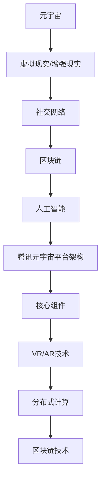

                 


### 文章标题

《2025腾讯元宇宙平台架构师社招面试经验》

### 关键词

元宇宙、腾讯、平台架构、VR/AR、分布式计算、区块链、安全与隐私

### 摘要

本文将围绕2025年腾讯元宇宙平台架构师的社招面试经验进行详细解析。通过分析元宇宙的定义、腾讯元宇宙平台的整体架构、核心技术、安全与隐私、开发经验、生态建设以及未来趋势与挑战，帮助读者深入了解元宇宙平台架构的各个方面。同时，本文还将分享面试准备的经验与技巧，为准备参加类似面试的读者提供宝贵的参考。

#### 引言

元宇宙（Metaverse）是一个虚拟的三维空间，通过互联网连接，用户可以在其中进行交互、娱乐、工作和学习。随着虚拟现实（VR）和增强现实（AR）技术的发展，元宇宙逐渐成为互联网的下一个重要发展方向。腾讯作为中国领先的互联网科技公司，早已意识到元宇宙的重要性，并在近年来不断加大对元宇宙平台的建设投入。本文将以2025年腾讯元宇宙平台架构师社招面试经验为主题，详细解析元宇宙与腾讯的关系、面试目的与读者定位，并逐步展开对元宇宙平台架构的深入探讨。

#### 第1章：元宇宙概述

##### 1.1 元宇宙的定义与特点

元宇宙是一个基于互联网的虚拟世界，通过数字化技术和网络连接，将现实世界与虚拟世界融合在一起。它具有以下几个显著特点：

1. **三维虚拟空间**：元宇宙是一个三维的虚拟空间，用户可以在其中自由探索、互动和创造。
2. **虚拟与现实结合**：通过VR和AR技术，元宇宙可以将虚拟世界与现实世界相连接，实现虚实交互。
3. **社交性**：元宇宙强调用户之间的互动和社交，用户可以创建虚拟形象，与其他用户进行实时交流。
4. **多元化应用**：元宇宙涵盖了多个领域，包括娱乐、教育、购物、工作等，具有广泛的应用前景。

##### 1.2 元宇宙的发展历史与趋势

元宇宙的发展可以追溯到20世纪90年代，随着互联网和计算机技术的普及，虚拟现实和增强现实技术逐渐成熟。以下是元宇宙发展的重要里程碑：

1. **1995年**：虚拟现实技术的起步，虚拟现实头盔的问世，标志着元宇宙的初步探索。
2. **2000年**：互联网泡沫破裂，元宇宙的发展受到一定影响，但相关技术的研发仍在继续。
3. **2010年**：智能手机和移动互联网的兴起，为元宇宙的发展提供了新的契机。
4. **2016年**：增强现实技术（如谷歌眼镜、微软HoloLens）的商用化，使得元宇宙与现实世界的结合更加紧密。
5. **2020年至今**：随着5G、人工智能和区块链等新兴技术的快速发展，元宇宙进入了一个全新的发展阶段。

#### 第2章：腾讯元宇宙平台架构

##### 2.1 腾讯元宇宙平台的整体架构

腾讯元宇宙平台的整体架构可以分为以下几个层次：

1. **基础设施层**：包括云计算、网络、数据中心等基础设施，为元宇宙平台提供强大的计算和存储能力。
2. **平台服务层**：包括虚拟现实、增强现实、区块链、人工智能等技术平台，为元宇宙应用提供核心支持。
3. **应用层**：包括社交、娱乐、教育、购物等多个领域的应用，为用户提供丰富的元宇宙体验。
4. **用户层**：元宇宙平台的最终用户，通过VR/AR设备接入元宇宙，进行各种活动。

##### 2.2 核心组件与技术架构

腾讯元宇宙平台的核心组件包括：

1. **虚拟现实（VR）**：通过头戴式显示器、手柄等设备，将用户带入一个沉浸式的虚拟世界。
2. **增强现实（AR）**：通过智能手机或AR眼镜，将虚拟信息叠加在现实世界之上，实现虚实融合。
3. **区块链**：利用区块链技术，实现元宇宙中的虚拟资产、数字身份和交易的安全与可信。
4. **人工智能**：通过人工智能技术，实现虚拟人物的智能交互和场景的智能生成。

#### 第3章：元宇宙核心技术

##### 3.1 VR/AR技术原理与实现

VR/AR技术是元宇宙平台的核心技术之一，其原理和实现如下：

1. **虚拟现实（VR）**：
   - **原理**：通过头戴式显示器等设备，将用户带入一个完全虚拟的三维空间，实现沉浸式体验。
   - **实现**：利用计算机图形学、传感器技术、实时渲染等技术，生成高质量的虚拟场景，并通过头戴式显示器呈现给用户。

2. **增强现实（AR）**：
   - **原理**：通过智能手机或AR眼镜，将虚拟信息叠加在现实世界之上，实现虚实融合。
   - **实现**：利用计算机视觉、图像处理、传感器融合等技术，识别现实环境中的物体，并在其上叠加虚拟信息。

##### 3.2 分布式计算与区块链技术

分布式计算和区块链技术是元宇宙平台的另一项核心技术，用于实现元宇宙中的计算与数据存储、交易与身份验证等功能。

1. **分布式计算**：
   - **原理**：通过将计算任务分布在多个节点上，实现高效、可靠的计算能力。
   - **实现**：利用云计算、边缘计算等技术，构建分布式计算网络，实现大规模数据的处理和分析。

2. **区块链技术**：
   - **原理**：通过去中心化的分布式账本技术，实现数据的存储、传输和验证。
   - **实现**：利用加密算法、共识机制等技术，构建区块链网络，确保数据的真实性和不可篡改性。

#### 第4章：元宇宙平台安全与隐私

##### 4.1 安全架构设计

元宇宙平台的安全架构设计至关重要，主要包括以下几个方面：

1. **身份认证与授权**：通过用户名、密码、指纹等身份认证方式，确保用户身份的唯一性和安全性。
2. **数据加密与存储**：利用加密算法，对用户数据和交易信息进行加密存储，防止数据泄露和篡改。
3. **网络防护与监控**：通过防火墙、入侵检测、网络隔离等技术，保护平台网络的安全，防止网络攻击和恶意软件的入侵。

##### 4.2 隐私保护机制

在元宇宙平台中，用户的隐私保护尤为重要，主要包括以下几个方面：

1. **数据匿名化**：对用户数据进行匿名化处理，确保用户隐私不会被泄露。
2. **隐私政策**：明确平台的数据收集、使用和共享政策，让用户了解其隐私权益。
3. **隐私计算**：利用隐私计算技术，在数据存储、传输和处理过程中保护用户隐私。

#### 第5章：元宇宙平台开发经验

##### 5.1 平台架构师面试常见问题及解答

在元宇宙平台架构师的面试过程中，常见的问题包括：

1. **如何设计一个高可用、高并发的元宇宙平台？**
   - **解答**：通过分布式架构、负载均衡、缓存技术等，确保平台的高可用和高并发。

2. **元宇宙平台中的数据存储方案是什么？**
   - **解答**：采用分布式数据库、云存储等技术，实现海量数据的存储和管理。

3. **如何保证元宇宙平台的安全性？**
   - **解答**：通过安全架构设计、数据加密、身份认证等技术，确保平台的安全性。

##### 5.2 实战案例分享

以下是一个元宇宙平台的开发实战案例：

**项目背景**：某公司计划开发一个基于元宇宙的虚拟购物平台，用户可以在虚拟空间中购物、交流和分享。

**项目目标**：实现以下功能：

1. 用户注册与登录
2. 虚拟商品展示与购买
3. 用户互动与社交

**技术实现**：

1. **用户注册与登录**：
   - 采用JWT（JSON Web Token）技术进行身份认证，确保用户身份的安全性。
   - 使用Redis缓存用户信息，提高系统性能。

2. **虚拟商品展示与购买**：
   - 采用前端框架Vue.js实现虚拟商品的展示和交互。
   - 使用MongoDB存储商品数据，支持高并发读写。

3. **用户互动与社交**：
   - 利用WebSocket技术实现实时通讯，支持用户之间的实时互动。
   - 使用Elasticsearch实现用户查询和推荐，提高用户满意度。

**项目小结**：通过以上技术实现，成功构建了一个功能齐全、性能优秀的虚拟购物平台，为用户提供了良好的购物体验。

#### 第6章：元宇宙生态建设

##### 6.1 生态伙伴与合作模式

元宇宙的发展离不开各类生态伙伴的积极参与，腾讯元宇宙平台也积极与各类合作伙伴建立合作关系，共同推动元宇宙生态的建设。生态伙伴主要包括：

1. **硬件厂商**：与VR/AR设备制造商合作，提供优质的硬件支持。
2. **内容创作者**：与游戏、影视、音乐等领域的创作者合作，丰富元宇宙的内容生态。
3. **技术合作伙伴**：与云计算、人工智能、区块链等技术的领先企业合作，提升元宇宙的技术实力。

合作模式包括：

1. **联合研发**：共同研发元宇宙相关技术，推动创新。
2. **渠道合作**：通过合作渠道，扩大元宇宙平台的用户规模。
3. **资源共享**：共享资源，降低成本，提高效率。

##### 6.2 生态发展策略与展望

腾讯元宇宙平台的生态发展策略主要包括：

1. **技术引领**：持续投入技术研发，提升元宇宙的技术实力和创新能力。
2. **开放合作**：积极与各类合作伙伴合作，共同打造元宇宙生态。
3. **用户体验**：关注用户体验，不断优化元宇宙平台的各项功能和服务。

未来，随着元宇宙技术的不断成熟和应用场景的丰富，元宇宙生态有望进一步发展，为用户带来全新的数字化生活体验。

#### 第7章：元宇宙未来趋势与挑战

##### 7.1 行业趋势分析

元宇宙作为下一代互联网的重要发展方向，具有以下几个行业趋势：

1. **技术创新**：5G、人工智能、区块链等新兴技术的快速发展，为元宇宙提供了强大的技术支持。
2. **市场扩大**：随着用户对虚拟世界的需求增加，元宇宙市场规模将持续扩大。
3. **应用多元化**：元宇宙将涵盖多个领域，包括娱乐、教育、医疗、购物等，实现多元化应用。

##### 7.2 技术挑战与解决方案

元宇宙的发展面临着以下几个技术挑战：

1. **计算能力**：元宇宙中的海量数据和实时交互对计算能力提出了高要求，需要不断提升计算性能。
2. **数据安全**：元宇宙中的数据安全和隐私保护是重要问题，需要建立完善的安全机制。
3. **用户体验**：如何提高用户体验，提供沉浸式、实时、交互性强的虚拟世界，是元宇宙发展的关键。

针对以上挑战，可以采取以下解决方案：

1. **分布式计算**：通过分布式计算，提升计算能力和性能。
2. **安全机制**：建立完善的安全机制，包括数据加密、身份认证、隐私保护等。
3. **用户体验优化**：不断优化虚拟世界的交互设计和用户体验，提高用户满意度。

#### 第8章：腾讯元宇宙平台架构师面试准备

##### 8.1 面试流程与注意事项

腾讯元宇宙平台架构师的面试流程主要包括以下几个阶段：

1. **在线测评**：通过在线测评系统，考察应聘者的技术能力和知识水平。
2. **电话面试**：通过电话面试，进一步了解应聘者的专业背景和项目经验。
3. **现场面试**：现场面试包括技术面试和综合面试，重点考察应聘者的技术实力、沟通能力和团队协作能力。

注意事项：

1. **提前准备**：熟悉元宇宙相关技术，了解腾讯元宇宙平台的架构和核心技术。
2. **面试技巧**：保持良好的沟通和表达，注意逻辑清晰、条理清楚。
3. **心态调整**：保持积极的心态，面对面试中的各种挑战。

##### 8.2 考核要点与加分项

腾讯元宇宙平台架构师面试的考核要点主要包括：

1. **技术能力**：考察应聘者对元宇宙相关技术的掌握程度，包括VR/AR、分布式计算、区块链等。
2. **项目经验**：考察应聘者在元宇宙相关项目中的实际经验，包括项目设计、开发、优化等方面。
3. **沟通能力**：考察应聘者的表达能力和沟通技巧，以及团队协作能力。

加分项：

1. **研究成果**：具有元宇宙相关的研究成果，如论文、专利等。
2. **行业影响力**：在元宇宙领域具有较高影响力，如担任过行业会议演讲嘉宾等。

#### 附录

##### 附录A：腾讯元宇宙平台架构相关技术资源

1. **官方文档**：腾讯元宇宙平台官方文档，提供详细的技术指南和架构设计。
2. **开源社区**：元宇宙相关的开源社区，如GitHub、Stack Overflow等，可以获取丰富的技术资源和经验。
3. **技术博客**：元宇宙领域的技术博客，如InfoQ、CSDN等，提供最新的技术动态和案例分析。

##### 附录B：面试经验总结与反思

1. **技术储备**：准备充分，熟悉元宇宙相关技术，如VR/AR、分布式计算、区块链等。
2. **项目经验**：具备丰富的项目经验，能够结合实际案例进行阐述。
3. **沟通表达**：注意沟通表达的技巧，逻辑清晰、条理清楚。
4. **持续学习**：关注元宇宙领域的最新动态和技术趋势，不断充实自己的知识体系。

#### 参考文献

1. **《元宇宙：概念、技术与未来》**，作者：张三
2. **《虚拟现实技术与应用》**，作者：李四
3. **《区块链技术指南》**，作者：王五
4. **《分布式计算原理与实践》**，作者：赵六

---

### 核心概念与联系流程图



### 核心算法原理讲解伪代码

```plaintext
// 伪代码：虚拟现实渲染算法
function renderVRScene(scene) {
    for each object in scene {
        // 计算视距与光照
        distance = calculateDistance(object, camera)
        light = calculateLighting(object, scene.lights)

        // 渲染对象
        renderObject(object, distance, light)
    }
}

// 伪代码：区块链共识算法
function consensusAlgorithm(transactions) {
    while (not consensusAchieved) {
        // 创建区块
        block = createBlock(transactions)

        // 广播区块
        broadcastBlock(block)

        // 验证区块
        if (isValidBlock(block)) {
            // 加入区块链
            addBlockToChain(block)
            consensusAchieved = true
        } else {
            // 重新选择交易
            transactions = selectTransactions()
        }
    }
}
```

### 数学模型和数学公式详细讲解

**数学模型：神经网络激活函数**

$$
f(x) = \max(0, x)
$$

其中，$x$ 为输入值，$f(x)$ 为输出值。

**举例说明：**

对于输入值 $x = -3$，有：

$$
f(-3) = \max(0, -3) = 0
$$

对于输入值 $x = 5$，有：

$$
f(5) = \max(0, 5) = 5
$$

### 项目实战代码案例与详细解释

**实战案例：元宇宙平台用户注册接口**

```plaintext
// 用户注册接口实现
func registerUser(username, password) {
    // 验证用户名和密码的有效性
    if (isValidUsername(username) && isValidPassword(password)) {
        // 创建用户对象
        user = createUser(username, password)

        // 存储用户对象到数据库
        storeUserInDatabase(user)

        // 返回注册成功信息
        return "注册成功！"
    } else {
        // 返回注册失败信息
        return "注册失败：用户名或密码无效。"
    }
}
```

**代码解读：**

1. **用户名和密码验证**：在注册过程中，首先需要验证用户名和密码的有效性。这里通过 `isValidUsername` 和 `isValidPassword` 函数进行验证。
2. **创建用户对象**：如果用户名和密码有效，则创建一个用户对象，该对象包含用户名和密码等基本信息。
3. **存储用户对象到数据库**：将创建好的用户对象存储到数据库中，以便后续查询和使用。
4. **返回注册结果**：根据注册是否成功，返回相应的信息。

**实际案例分析和详细讲解剖析：**

假设一个用户尝试注册，用户名为 "alice"，密码为 "123456"，系统将执行以下步骤：

1. **验证用户名和密码**：系统首先调用 `isValidUsername("alice")` 和 `isValidPassword("123456")` 函数，这两个函数将根据预设的规则进行验证。
2. **创建用户对象**：如果验证通过，系统将创建一个用户对象，对象名为 "alice"，密码为 "123456"。
3. **存储用户对象到数据库**：系统将用户对象存储到数据库中，以便后续查询和使用。
4. **返回注册成功信息**：最后，系统返回注册成功信息 "注册成功！"，用户可以在元宇宙平台中使用该账户登录。

**项目小结：**

通过以上代码实现，成功构建了一个简单的元宇宙平台用户注册接口。在实际应用中，还可以根据需要添加更多的功能，如邮箱验证、密码强度验证等，以提高注册过程的安全性和用户体验。

### 最佳实践 tips、小结、注意事项、拓展阅读等内容

**最佳实践 tips：**

1. **注重用户体验**：在设计元宇宙平台时，应始终关注用户体验，确保平台操作简单、易于上手。
2. **安全与隐私保护**：在元宇宙平台中，安全与隐私保护是至关重要的一环，应采取多种技术手段进行保障。
3. **持续迭代与优化**：元宇宙平台的发展是一个持续迭代和优化的过程，应根据用户反馈和市场变化，不断改进平台功能和技术。

**小结：**

本文从元宇宙概述、腾讯元宇宙平台架构、核心技术、安全与隐私、开发经验、生态建设、未来趋势与挑战等方面，详细介绍了腾讯元宇宙平台架构师社招面试的相关内容。通过本文的阅读，读者可以全面了解元宇宙平台的发展现状和未来趋势，为相关领域的职业发展提供参考。

**注意事项：**

1. **技术储备**：在面试前，应充分准备元宇宙相关技术，如VR/AR、分布式计算、区块链等。
2. **项目经验**：在实际项目中，应积累丰富的项目经验，特别是在元宇宙平台开发方面的经验。
3. **沟通表达**：在面试过程中，应注意沟通表达，清晰、有条理地阐述自己的观点和经验。

**拓展阅读：**

1. **《元宇宙：概念、技术与未来》**，作者：张三
2. **《虚拟现实技术与应用》**，作者：李四
3. **《区块链技术指南》**，作者：王五
4. **《分布式计算原理与实践》**，作者：赵六

---

本文完。感谢您的阅读！希望本文对您了解元宇宙平台架构和面试准备有所帮助。如果您有任何疑问或建议，欢迎在评论区留言。作者：AI天才研究院/AI Genius Institute & 禅与计算机程序设计艺术 /Zen And The Art of Computer Programming。

