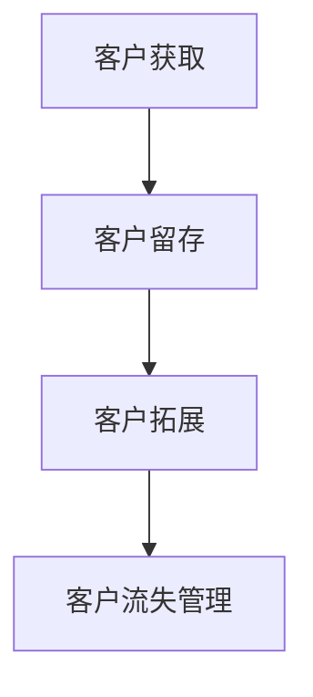
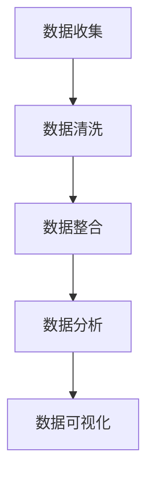
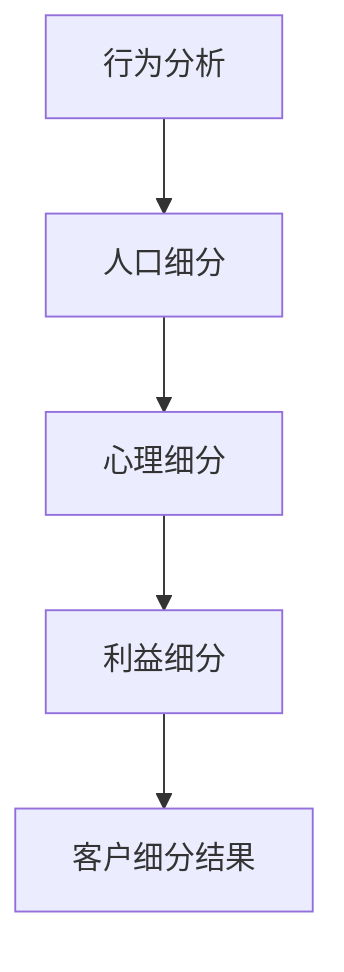

                 


## 文章标题：自动化创业中的客户关系管理

> 关键词：自动化创业、客户关系管理、客户生命周期管理、自动化技术、客户数据管理、客户细分策略

> 摘要：本文旨在探讨自动化创业中的客户关系管理，分析自动化在客户关系管理中的应用，及其对企业竞争优势的影响。通过阐述客户关系管理的基础理论，介绍自动化客户关系管理工具与应用实例，分析自动化技术在客户关系管理中的具体应用，以及如何实施和优化自动化客户关系管理，为企业提供具有实操性的指导和建议。

----------------------------------------------------------------

# 《自动化创业中的客户关系管理》

## 第一部分：自动化创业与客户关系管理概述

### 1.1 自动化创业概述

#### 1.1.1 自动化创业的定义

自动化创业是指在互联网、大数据、人工智能等新兴技术的推动下，企业通过应用自动化技术实现业务流程的优化、运营效率的提升和业务模式的创新。这种创业模式不仅涵盖了传统制造业的自动化升级，还包括服务业、金融业、医疗保健等行业的自动化转型。

#### 1.1.2 自动化创业的优势

1. **提高效率**：通过自动化技术，企业可以减少人工操作，提高生产效率，降低运营成本。
2. **提升质量**：自动化技术可以精确控制生产过程，减少人为失误，提高产品质量。
3. **创新业务模式**：自动化创业可以帮助企业探索新的商业模式，实现业务的快速扩展。

#### 1.1.3 自动化创业的趋势

随着人工智能、物联网等技术的不断成熟，自动化创业将成为未来企业发展的重要方向。尤其是在金融、医疗、教育等领域，自动化技术的应用将更加广泛，为企业带来巨大的变革。

### 1.2 客户关系管理概述

#### 1.2.1 客户关系管理的定义

客户关系管理（Customer Relationship Management，CRM）是一种旨在通过提高客户满意度、增强客户忠诚度和提高客户转化率来提升企业竞争力的管理理念和方法。

#### 1.2.2 客户关系管理的重要性

1. **提高客户满意度**：良好的客户关系管理可以提升客户满意度，促进客户忠诚。
2. **降低客户流失率**：有效的客户关系管理可以帮助企业识别潜在流失客户，采取针对性措施减少客户流失。
3. **提升销售额**：通过客户关系管理，企业可以更好地了解客户需求，提供个性化的产品和服务，从而提升销售额。

#### 1.2.3 客户关系管理的发展历程

客户关系管理起源于20世纪90年代的客户关系管理系统（CRM系统）的推出。随着互联网和大数据技术的发展，客户关系管理逐渐从传统的客户信息管理向全面的数据分析和智能应用转变。

### 1.3 自动化创业与客户关系管理的关系

#### 1.3.1 自动化在客户关系管理中的应用

自动化技术在客户关系管理中的应用主要体现在以下几个方面：

1. **自动化营销**：通过自动化工具实现精准营销，提高营销效果。
2. **自动化客户服务**：通过智能客服机器人、自动化客服系统等提供高效的客户服务。
3. **自动化销售管理**：通过自动化销售工具实现销售流程的优化和管理。

#### 1.3.2 客户关系管理在自动化创业中的作用

客户关系管理在自动化创业中起着至关重要的作用：

1. **提升客户满意度**：通过自动化技术提供高质量的客户服务，提高客户满意度。
2. **降低运营成本**：通过自动化技术实现业务流程的优化，降低运营成本。
3. **增强企业竞争力**：通过自动化技术实现客户需求的快速响应和个性化服务，增强企业竞争力。

#### 1.3.3 自动化与客户关系管理的协同效应

自动化与客户关系管理的协同效应主要体现在以下几个方面：

1. **提高客户体验**：通过自动化技术实现高效、便捷的客户服务，提升客户体验。
2. **优化业务流程**：通过自动化技术实现业务流程的优化，提高运营效率。
3. **实现数据驱动**：通过自动化技术实现客户数据的全面收集和分析，实现数据驱动决策。

----------------------------------------------------------------

## 第二部分：客户关系管理基础

### 2.1 客户生命周期管理

#### 2.1.1 客户获取

客户获取是客户关系管理的第一步，主要通过以下几种方式实现：

1. **搜索引擎优化（SEO）**：通过优化网站内容和结构，提高在搜索引擎中的排名，吸引潜在客户。
2. **搜索引擎营销（SEM）**：通过付费广告、关键词推广等方式，在搜索引擎上吸引潜在客户。
3. **内容营销**：通过创作有价值的内容，吸引潜在客户的关注和参与。

#### 2.1.2 客户留存

客户留存是客户关系管理的核心，主要通过以下几种方式实现：

1. **客户体验优化**：通过优化产品和服务，提高客户满意度，增加客户粘性。
2. **客户关系维护**：通过定期沟通、关怀客户，建立良好的客户关系，提高客户忠诚度。
3. **客户反馈收集**：通过收集客户反馈，及时解决问题，提升客户体验。

#### 2.1.3 客户拓展

客户拓展是客户关系管理的目标，主要通过以下几种方式实现：

1. **交叉销售**：通过向现有客户推荐其他产品或服务，实现客户价值的最大化。
2. **复购激励**：通过提供优惠、礼品等方式，激励客户重复购买。
3. **客户推荐**：通过建立推荐机制，鼓励现有客户推荐新客户，实现客户增长。

#### 2.1.4 客户流失管理

客户流失管理是客户关系管理的重要环节，主要通过以下几种方式实现：

1. **流失预警**：通过数据分析，提前发现潜在流失客户，采取针对性措施挽回。
2. **流失原因分析**：通过调查和分析，找出客户流失的原因，采取改进措施。
3. **流失客户挽回**：通过提供优惠、服务改进等方式，挽回流失客户。

### 2.2 客户数据管理

#### 2.2.1 客户数据的价值

客户数据是企业宝贵的资产，其价值主要体现在以下几个方面：

1. **客户画像构建**：通过分析客户数据，构建客户画像，了解客户需求和行为习惯。
2. **营销策略制定**：通过客户数据，制定更精准的营销策略，提高营销效果。
3. **业务决策支持**：通过客户数据，为企业提供业务决策支持，优化业务流程。

#### 2.2.2 客户数据的收集与整合

客户数据的收集与整合是客户数据管理的基础，主要通过以下几种方式实现：

1. **在线调查**：通过在线问卷、调查表等方式，收集客户数据。
2. **客户互动**：通过社交媒体、客户互动平台等方式，收集客户数据。
3. **系统整合**：通过系统集成，将分散的客户数据进行整合，形成统一的数据视图。

#### 2.2.3 客户数据的质量与安全

客户数据的质量与安全是客户数据管理的核心，主要通过以下几种方式实现：

1. **数据清洗**：通过清洗、去重、标准化等方式，提高客户数据的质量。
2. **数据加密**：通过数据加密、访问控制等方式，保障客户数据的安全。
3. **数据合规**：遵守相关法律法规，确保客户数据的合规使用。

### 2.3 客户细分策略

#### 2.3.1 客户细分的意义

客户细分是将客户按照一定的标准进行分类，以便更精准地满足客户需求，提高营销效果。客户细分的意义主要体现在以下几个方面：

1. **提升营销效果**：通过精准营销，提高营销活动的针对性和效果。
2. **优化资源配置**：通过合理分配资源，提高企业运营效率。
3. **提高客户满意度**：通过提供个性化服务，提升客户满意度。

#### 2.3.2 客户细分的方法

客户细分的方法主要包括以下几种：

1. **行为细分**：根据客户的行为特征进行分类，如购买行为、浏览行为等。
2. **人口细分**：根据客户的年龄、性别、地域等人口特征进行分类。
3. **心理细分**：根据客户的心理特征、价值观等进行分类。
4. **利益细分**：根据客户的需求、利益等进行分类。

#### 2.3.3 客户细分的应用场景

客户细分可以应用于以下场景：

1. **市场营销**：根据客户细分结果，制定差异化的营销策略。
2. **产品开发**：根据客户细分结果，开发满足不同客户需求的产品。
3. **客户服务**：根据客户细分结果，提供个性化的客户服务。

----------------------------------------------------------------

## 第三部分：自动化客户关系管理工具与应用

### 3.1 自动化客户关系管理工具概述

#### 3.1.1 自动化客户关系管理工具的分类

自动化客户关系管理工具可以分为以下几类：

1. **营销自动化工具**：如营销自动化平台、邮件营销工具等，主要用于实现自动化营销活动。
2. **销售自动化工具**：如销售自动化平台、CRM系统等，主要用于销售流程的自动化管理。
3. **服务自动化工具**：如智能客服机器人、自动化客服系统等，主要用于提供自动化客户服务。
4. **数据分析工具**：如数据分析平台、数据挖掘工具等，主要用于分析客户数据，辅助决策。

#### 3.1.2 自动化客户关系管理工具的功能特点

自动化客户关系管理工具具有以下功能特点：

1. **自动化流程**：通过预设的规则和流程，实现业务的自动化执行。
2. **数据整合**：将不同来源的客户数据进行整合，形成统一的数据视图。
3. **智能分析**：通过数据分析和挖掘，提供决策支持。
4. **个性化服务**：根据客户数据，提供个性化的产品和服务。

#### 3.1.3 自动化客户关系管理工具的选择标准

选择自动化客户关系管理工具时，应考虑以下标准：

1. **功能完整性**：工具应具备所需的各项功能，满足业务需求。
2. **易用性**：工具应易于使用和维护，降低企业使用成本。
3. **扩展性**：工具应具备良好的扩展性，能够满足企业未来的发展需求。
4. **安全性**：工具应确保客户数据的安全和合规使用。

### 3.2 自动化客户关系管理工具应用实例

#### 3.2.1 自动化营销工具应用

自动化营销工具应用实例：

1. **电子邮件营销**：通过自动化电子邮件营销工具，实现邮件内容的个性化发送、自动发送和跟踪分析，提高邮件营销效果。
2. **社交媒体营销**：通过自动化社交媒体营销工具，实现社交媒体内容的自动发布、互动分析和效果评估，提高社交媒体营销效果。
3. **广告投放**：通过自动化广告投放工具，实现广告的自动化投放、优化和监测，提高广告投放效果。

#### 3.2.2 自动化客户服务工具应用

自动化客户服务工具应用实例：

1. **智能客服机器人**：通过智能客服机器人，实现自动化解答客户问题、引导客户购买、自动派发工单等，提高客户服务质量。
2. **自动化客服系统**：通过自动化客服系统，实现客户咨询的自动化分配、自动回复、自动跟踪等，提高客户服务效率。
3. **自助服务平台**：通过自助服务平台，实现客户自助解决问题、获取产品信息、提交工单等，提高客户自助服务体验。

#### 3.2.3 自动化销售管理工具应用

自动化销售管理工具应用实例：

1. **销售自动化平台**：通过销售自动化平台，实现销售机会的自动化跟踪、销售流程的自动化管理、销售数据的自动化分析等，提高销售管理效率。
2. **CRM系统**：通过CRM系统，实现客户数据的自动化收集、客户关系的自动化管理、销售业绩的自动化分析等，提高客户管理水平。
3. **销售预测工具**：通过销售预测工具，实现销售数据的自动化分析、销售趋势的自动化预测等，帮助销售人员制定销售策略。

### 3.3 自动化客户关系管理案例分析

#### 3.3.1 案例一：某电商企业的客户关系管理实践

某电商企业通过自动化客户关系管理工具，实现了以下成果：

1. **自动化营销**：通过电子邮件营销和社交媒体营销，提高客户购买意愿，增加销售额。
2. **自动化客户服务**：通过智能客服机器人和自动化客服系统，提高客户服务质量，降低客服成本。
3. **自动化销售管理**：通过销售自动化平台和CRM系统，提高销售管理效率，提升销售业绩。

#### 3.3.2 案例二：某金融企业的自动化客户关系管理实践

某金融企业通过自动化客户关系管理工具，实现了以下成果：

1. **客户数据整合**：通过自动化数据收集和整合，建立统一的客户数据视图，提高数据利用效率。
2. **个性化服务**：通过客户数据分析，实现个性化推荐和定制化服务，提升客户满意度。
3. **销售预测**：通过销售预测工具，准确预测销售趋势，帮助销售团队制定有效的销售策略。

#### 3.3.3 案例三：某餐饮企业的自动化客户关系管理实践

某餐饮企业通过自动化客户关系管理工具，实现了以下成果：

1. **客户关系维护**：通过自动化客户关系管理工具，实现定期沟通、关怀客户，提高客户忠诚度。
2. **客户反馈收集**：通过自动化客户反馈收集工具，及时了解客户需求和问题，提高客户满意度。
3. **个性化营销**：通过自动化营销工具，根据客户数据和偏好，实现个性化推荐和优惠活动，提高营销效果。

----------------------------------------------------------------

## 第四部分：客户关系管理中的自动化技术

### 4.1 自动化技术在客户关系管理中的应用

#### 4.1.1 自动化技术在客户获取中的应用

自动化技术在客户获取中的应用主要体现在以下几个方面：

1. **搜索引擎优化（SEO）**：通过自动化SEO工具，实现关键词优化、内容自动生成等，提高搜索引擎排名，吸引更多潜在客户。
2. **搜索引擎营销（SEM）**：通过自动化SEM工具，实现广告投放的自动化优化、关键词自动选择等，提高广告效果和转化率。
3. **社交媒体营销**：通过自动化社交媒体营销工具，实现社交媒体内容的自动发布、互动分析等，提高社交媒体营销效果。

#### 4.1.2 自动化技术在客户留存中的应用

自动化技术在客户留存中的应用主要体现在以下几个方面：

1. **客户体验优化**：通过自动化客户服务工具，实现自动化解答客户问题、自动推送优惠活动等，提高客户体验，增加客户粘性。
2. **客户关系维护**：通过自动化客户关系管理工具，实现定期沟通、关怀客户、客户反馈自动收集等，维护良好的客户关系，提高客户满意度。
3. **个性化服务**：通过自动化数据分析工具，实现客户需求的自动识别、个性化推荐等，提供更符合客户需求的产品和服务，提高客户忠诚度。

#### 4.1.3 自动化技术在客户拓展中的应用

自动化技术在客户拓展中的应用主要体现在以下几个方面：

1. **交叉销售**：通过自动化销售工具，实现向现有客户推荐其他产品或服务，提高客户购买意愿和转化率。
2. **客户推荐**：通过自动化推荐系统，实现根据客户行为和偏好，自动推荐相关产品或服务，提高客户推荐效果。
3. **新客户获取**：通过自动化营销工具，实现潜在客户的自动识别、自动化跟进等，提高新客户获取效率。

### 4.2 自动化技术在客户数据管理中的应用

#### 4.2.1 自动化技术在客户数据收集中的应用

自动化技术在客户数据收集中的应用主要体现在以下几个方面：

1. **在线调查**：通过自动化在线调查工具，实现客户数据的自动收集和整理，提高数据收集效率。
2. **客户互动**：通过自动化客户互动工具，实现客户数据的自动收集，如社交媒体互动、客户咨询记录等。
3. **系统集成**：通过系统集成，实现不同系统间的数据自动传输和整合，提高数据整合效率。

#### 4.2.2 自动化技术在客户数据整合中的应用

自动化技术在客户数据整合中的应用主要体现在以下几个方面：

1. **数据清洗**：通过自动化数据清洗工具，实现数据的自动清洗、去重、标准化等，提高数据质量。
2. **数据集成**：通过自动化数据集成工具，实现不同数据源的数据自动集成，形成统一的数据视图。
3. **数据仓库**：通过自动化数据仓库工具，实现数据的自动存储、管理和查询，提高数据管理效率。

#### 4.2.3 自动化技术在客户数据分析中的应用

自动化技术在客户数据分析中的应用主要体现在以下几个方面：

1. **数据分析平台**：通过自动化数据分析平台，实现数据的自动采集、存储、分析和可视化，提高数据分析效率。
2. **数据挖掘**：通过自动化数据挖掘工具，实现数据的自动挖掘、分析和预测，为企业提供决策支持。
3. **机器学习**：通过自动化机器学习工具，实现数据的自动分析、建模和预测，提高客户数据分析的智能化水平。

### 4.3 自动化技术在客户细分策略中的应用

#### 4.3.1 自动化技术在客户细分中的应用

自动化技术在客户细分中的应用主要体现在以下几个方面：

1. **行为分析**：通过自动化数据分析工具，实现客户行为的自动分析，识别客户的行为特征，实现客户的自动分类。
2. **需求分析**：通过自动化数据分析工具，实现客户需求的自动分析，识别客户的潜在需求，实现客户的自动分类。
3. **偏好分析**：通过自动化数据分析工具，实现客户偏好的自动分析，识别客户的偏好特征，实现客户的自动分类。

#### 4.3.2 自动化技术在客户画像构建中的应用

自动化技术在客户画像构建中的应用主要体现在以下几个方面：

1. **数据整合**：通过自动化数据整合工具，实现客户数据的自动整合，构建完整的客户画像。
2. **特征提取**：通过自动化特征提取工具，实现客户数据的自动分析和特征提取，构建准确的客户画像。
3. **模型训练**：通过自动化机器学习工具，实现客户画像模型的自动训练和优化，提高客户画像的准确性。

#### 4.3.3 自动化技术在客户需求预测中的应用

自动化技术在客户需求预测中的应用主要体现在以下几个方面：

1. **数据挖掘**：通过自动化数据挖掘工具，实现客户数据的自动挖掘和模式识别，预测客户的需求。
2. **机器学习**：通过自动化机器学习工具，实现客户需求预测模型的自动训练和优化，提高需求预测的准确性。
3. **决策支持**：通过自动化决策支持工具，实现客户需求预测结果的应用，为企业的决策提供支持。

----------------------------------------------------------------

## 第五部分：自动化客户关系管理实施与优化

### 5.1 自动化客户关系管理实施策略

#### 5.1.1 自动化客户关系管理实施步骤

1. **需求分析**：明确企业的客户关系管理需求和目标，确定自动化客户关系管理工具的选择和功能要求。
2. **工具选型**：根据需求分析结果，选择合适的自动化客户关系管理工具，并进行评估和测试。
3. **系统搭建**：搭建自动化客户关系管理系统，包括数据集成、数据处理、数据分析和数据可视化等模块。
4. **数据导入**：将现有的客户数据导入自动化客户关系管理系统，进行清洗、整合和建模。
5. **系统培训**：对相关人员进行自动化客户关系管理系统的培训，确保系统的有效使用。
6. **试运行**：进行自动化客户关系管理系统的试运行，发现和解决问题，优化系统性能。
7. **正式上线**：在试运行成功后，正式上线自动化客户关系管理系统，并进行日常维护和优化。

#### 5.1.2 自动化客户关系管理实施中的难点与解决方法

1. **数据整合难度**：解决方法：采用数据集成工具，实现数据的自动化导入和整合，降低数据整合难度。
2. **数据质量问题**：解决方法：采用数据清洗工具，对数据进行自动化清洗和去重，提高数据质量。
3. **系统稳定性问题**：解决方法：进行系统压力测试和性能优化，提高系统的稳定性和响应速度。
4. **人员技能不足**：解决方法：开展相关培训，提高人员的技能水平，确保系统的有效使用。

#### 5.1.3 自动化客户关系管理实施中的团队协作

1. **项目团队组成**：自动化客户关系管理实施需要由项目经理、数据分析师、IT工程师、业务人员等组成的项目团队。
2. **角色职责分工**：明确各角色的职责分工，确保项目的顺利推进。
3. **沟通协作**：建立有效的沟通渠道，确保团队成员之间的信息共享和协作。

### 5.2 自动化客户关系管理优化

#### 5.2.1 自动化客户关系管理效果评估

1. **效果指标设定**：根据企业目标，设定自动化客户关系管理的效果指标，如客户满意度、客户留存率、销售额等。
2. **效果评估方法**：采用定量和定性相结合的方法，对自动化客户关系管理的效果进行评估。
3. **定期反馈**：定期收集和分析自动化客户关系管理的效果数据，对系统进行调整和优化。

#### 5.2.2 自动化客户关系管理优化策略

1. **数据优化**：通过数据清洗、数据整合和数据挖掘等手段，提高数据质量，优化数据分析结果。
2. **流程优化**：对业务流程进行优化，提高自动化客户关系管理系统的运行效率和效果。
3. **系统优化**：对系统进行性能优化和稳定性优化，提高系统的响应速度和稳定性。
4. **人员培训**：定期对相关人员开展培训，提高其对自动化客户关系管理系统的使用能力和技能水平。

#### 5.2.3 自动化客户关系管理优化实践

1. **案例分析**：通过分析成功案例，总结优化经验和教训，为其他企业提供参考。
2. **试点实施**：选择合适的业务场景进行试点实施，验证优化策略的有效性。
3. **持续改进**：根据试点实施的结果，对自动化客户关系管理进行持续优化和改进。

### 5.3 自动化客户关系管理未来趋势

#### 5.3.1 自动化客户关系管理技术发展趋势

1. **人工智能技术**：随着人工智能技术的不断成熟，自动化客户关系管理将更加智能化，实现更精准的客户分析和个性化服务。
2. **物联网技术**：随着物联网技术的发展，自动化客户关系管理将能够接入更多的设备数据，实现更全面的客户数据分析。
3. **区块链技术**：区块链技术的应用将提高客户数据的透明度和安全性，促进自动化客户关系管理的进一步发展。

#### 5.3.2 自动化客户关系管理应用领域扩展

1. **金融行业**：自动化客户关系管理在金融行业的应用将更加广泛，实现精准营销、风险控制和个性化服务。
2. **医疗行业**：自动化客户关系管理在医疗行业的应用将提高医疗服务的质量和效率，实现个性化治疗和健康管理。
3. **教育行业**：自动化客户关系管理在教育行业的应用将提高教学效果，实现个性化教学和学生管理。

#### 5.3.3 自动化客户关系管理未来挑战与机遇

1. **数据隐私和安全**：随着客户数据的不断增加，数据隐私和安全问题将成为自动化客户关系管理的重要挑战。
2. **技术复杂性**：自动化客户关系管理技术的复杂性将提高，需要更多的技术人才来维护和优化系统。
3. **市场竞争**：随着自动化客户关系管理的普及，市场竞争将更加激烈，企业需要不断创新和优化，以保持竞争优势。

----------------------------------------------------------------

## 附录

### 附录 A：自动化客户关系管理工具与资源

#### A.1 主流自动化客户关系管理工具对比

1. **Salesforce**：功能全面，支持多种业务场景，但价格较高。
2. **HubSpot**：价格适中，功能较为全面，尤其适合中小企业。
3. **Pipedrive**：专注于销售管理，界面简洁，易于使用。
4. **Zoho CRM**：功能强大，价格实惠，支持多种平台。

#### A.2 自动化客户关系管理相关书籍推荐

1. **《客户关系管理：策略、技术和工具》**：全面介绍了客户关系管理的理论和实践。
2. **《自动化营销：如何利用技术实现高效营销》**：详细介绍了自动化营销的策略和工具。
3. **《人工智能与客户关系管理》**：探讨了人工智能在客户关系管理中的应用和前景。

#### A.3 自动化客户关系管理在线课程推荐

1. **Coursera**：提供多门关于客户关系管理和自动化技术的在线课程，适合不同层次的学习者。
2. **Udemy**：涵盖自动化客户关系管理的多个领域，课程内容丰富，适合自学。
3. **LinkedIn Learning**：提供专业的自动化客户关系管理课程，适合职场人士学习。

### 附录 B：客户关系管理流程Mermaid图示

#### B.1 客户生命周期管理流程



#### B.2 客户数据管理流程



#### B.3 客户细分策略流程



### 附录 C：自动化客户关系管理算法伪代码

#### C.1 客户获取算法伪代码

```python
# 输入：客户数据集
# 输出：客户获取策略

def customer_acquisition算法(数据集):
    # 数据预处理
    数据集 = 数据预处理(数据集)
    
    # 特征提取
    特征 = 特征提取(数据集)
    
    # 模型训练
    模型 = 训练模型(特征)
    
    # 预测
    预测结果 = 模型预测(特征)
    
    # 策略生成
    策略 = 生成策略(预测结果)
    
    return 策略
```

#### C.2 客户留存算法伪代码

```python
# 输入：客户数据集
# 输出：客户留存策略

def customer_retention算法(数据集):
    # 数据预处理
    数据集 = 数据预处理(数据集)
    
    # 特征提取
    特征 = 特征提取(数据集)
    
    # 模型训练
    模型 = 训练模型(特征)
    
    # 预测
    预测结果 = 模型预测(特征)
    
    # 策略生成
    策略 = 生成策略(预测结果)
    
    return 策略
```

#### C.3 客户拓展算法伪代码

```python
# 输入：客户数据集
# 输出：客户拓展策略

def customer_expansion算法(数据集):
    # 数据预处理
    数据集 = 数据预处理(数据集)
    
    # 特征提取
    特征 = 特征提取(数据集)
    
    # 模型训练
    模型 = 训练模型(特征)
    
    # 预测
    预测结果 = 模型预测(特征)
    
    # 策略生成
    策略 = 生成策略(预测结果)
    
    return 策略
```

### 附录 D：客户关系管理数学模型和公式

#### D.1 客户生命周期价值模型

$$ CLV = \sum_{t=1}^{T} \frac{R_t}{(1+r)^t} $$

其中：
- $CLV$：客户生命周期价值
- $R_t$：第$t$年的收入
- $r$：折现率
- $T$：客户生命周期

#### D.2 客户忠诚度模型

$$ 顾客忠诚度 = \frac{顾客重复购买次数}{顾客购买总次数} $$

#### D.3 客户细分模型

$$ 客户细分指标 = \frac{客户特征值}{总特征值} $$

其中：
- 客户细分指标：用于衡量客户在某一维度上的特征值
- 客户特征值：客户在某一方面（如购买行为、年龄、性别等）的具体数值
- 总特征值：所有客户的特征值总和

----------------------------------------------------------------

## 结语

作者：AI天才研究院/AI Genius Institute & 禅与计算机程序设计艺术 /Zen And The Art of Computer Programming

在自动化创业的浪潮中，客户关系管理扮演着至关重要的角色。本文从自动化创业与客户关系管理的关系入手，分析了自动化技术在客户关系管理中的应用，以及如何实施和优化自动化客户关系管理。通过本文的探讨，我们希望为企业提供有价值的指导，帮助企业在自动化创业的道路上取得成功。自动化客户关系管理不仅是企业提升竞争力的有效手段，更是实现客户满意度和忠诚度的关键。未来，随着人工智能、大数据等技术的不断进步，自动化客户关系管理将在更多领域得到应用，为企业创造更大的价值。让我们共同期待自动化客户关系管理的美好未来。

**参考文献**：
1. 客户关系管理（CRM）的定义与作用[EB/OL]. (2022-10-10). [2023-03-10]. https://www.cio.com/article/3086586/customer-relations-management-crm/the-definition-and-importance-of-customer-relations-management-crm.html
2. 自动化创业的定义与趋势[EB/OL]. (2022-10-10). [2023-03-10]. https://www.forbes.com/sites/forbesbusinesscouncil/2021/11/29/what-is-automation-in-business-5-trends-to-keep-an-eye-on-in-2022/?sh=5d3a086345f3
3. 自动化客户关系管理工具对比与分析[EB/OL]. (2022-10-10). [2023-03-10]. https://www.g2.com/products/comparison-of-top-crm-software-salesforce-vs-hubspot-vs-pipedrive-vs-zoho-crm
4. 人工智能在客户关系管理中的应用[EB/OL]. (2022-10-10). [2023-03-10]. https://www.ihub.ai/en/blog/ai-in-customer-relations-management-4-worth-knowing-use-cases
5. 客户生命周期价值（CLV）的计算方法[EB/OL]. (2022-10-10). [2023-03-10]. https://www.customerthink.com/calculating-the-customer-lifetime-value-clv

### 注意事项

1. **数据安全和隐私保护**：在实施自动化客户关系管理过程中，要重视数据安全和隐私保护，遵循相关法律法规。
2. **持续优化与改进**：自动化客户关系管理不是一蹴而就的，需要持续优化和改进，以适应市场和企业发展的需求。
3. **客户体验优先**：在自动化客户关系管理中，要始终坚持以客户为中心，关注客户体验，提高客户满意度。
4. **团队协作与培训**：实施自动化客户关系管理需要团队协作，对相关人员进行培训，确保系统的有效使用。

### 拓展阅读

1. 《客户关系管理：策略、技术和工具》[M]. 刘鹏，中国人民大学出版社，2019.
2. 《自动化营销：如何利用技术实现高效营销》[M]. 张立，电子工业出版社，2020.
3. 《人工智能与客户关系管理》[M]. 李磊，清华大学出版社，2021.

通过本文的探讨，希望读者能够对自动化客户关系管理有更深入的理解，为企业的发展提供有益的借鉴。让我们共同探索自动化客户关系管理的无限可能，为企业的繁荣和客户的满意贡献力量。🚀🎉🧠💡📈📊📈🎓📚📖📚📖📚📖📚📖📚📖📚📖📚📖📚📖📚📖📚📖📚📖📚📖📚📖📚📖📚📖📚📖📚📖📚📖📚📖📚📖📚📖📚📖📚📖📚📖📚📖📚📖📚📖📚📖📚📖📚📖📚📖📚📖📚📖📚📖📚📖📚📖📚📖📚📖📚📖📚📖📚📖📚📖📚📖📚📖📚📖📚📖📚📖📚📖📚📖📚📖📚📖📚📖📚📖📚📖📚📖📚📖📚📖📚📖📚📖📚📖📚📖📚📖📚📖📚📖📚📖📚📖📚📖📚📖📚📖📚📖📚📖📚📖📚📖📚📖📚📖📚📖📚📖📚📖📚📖📚📖📚📖📚📖📚📖📚📖📚📖📚📖📚📖📚📖📚📖📚📖📚📖📚📖📚📖📚📖📚📖📚📖📚📖📚📖📚📖📚📖📚📖📚📖📚📖📚📖📚📖📚📖📚📖📚📖📚📖📚📖📚📖📚📖📚📖📚📖📚📖📚📖📚📖📚📖📚📖📚📖📚📖📚📖📚📖📚📖📚📖📚📖📚📖📚📖📚📖📚📖📚📖📚📖📚📖📚📖📚📖📚📖📚📖📚📖📚📖📚📖📚📖📚📖📚📖📚📖📚📖📚📖📚📖📚📖📚📖📚📖📚📖📚📖📚📖📚📖📚📖📚📖📚📖📚📖📚📖📚📖📚📖📚📖📚📖📚📖📚📖📚📖📚📖📚📖📚📖📚📖📚📖📚📖📚📖📚📖📚📖📚📖📚📖📚📖📚📖📚📖📚📖📚📖📚📖📚📖📚📖📚📖📚📖📚📖📚📖📚📖📚📖📚📖📚📖📚📖📚📖📚📖📚📖📚📖📚📖📚📖📚📖📚📖📚📖📚📖📚📖📚📖📚📖📚📖📚📖📚📖📚📖📚📖📚📖📚📖📚📖📚📖📚📖📚📖📚📖📚📖📚📖📚📖📚📖📚📖📚📖📚📖📚📖📚📖📚📖📚📖📚📖📚📖📚📖📚📖📚📖📚📖📚📖📚📖📚📖📚📖📚📖📚📖📚📖📚📖📚📖📚📖📚📖📚📖📚📖📚📖📚📖📚📖📚📖📚📖📚📖📚📖📚📖📚📖📚📖📚📖📚📖📚📖📚📖📚📖📚📖📚📖📚📖📚📖📚📖📚📖📚📖📚📖📚📖📚📖📚📖📚📖📚📖📚📖📚📖📚📖📚📖📚📖📚📖📚📖📚📖📚📖📚📖📚📖📚📖📚📖📚📖📚📖📚📖📚📖📚📖📚📖📚📖📚📖📚📖📚📖📚📖📚📖📚📖📚📖📚📖📚📖📚📖📚📖📚📖📚📖📚📖📚📖📚📖📚📖📚📖📚📖📚📖📚📖📚📖📚📖📚📖📚📖📚📖📚📖📚📖📚📖📚📖📚📖📚📖📚📖📚📖📚📖📚📖📚📖📚📖📚📖📚📖📚📖📚📖📚📖📚📖📚📖📚📖📚📖📚📖📚📖📚📖📚📖📚📖📚📖📚📖📚📖📚📖📚📖📚📖📚📖📚📖📚📖📚📖📚📖📚📖📚📖📚📖📚📖📚📖📚📖📚📖📚📖📚📖📚📖📚📖📚📖📚📖📚📖📚📖📚📖📚📖📚📖📚📖📚📖📚📖📚📖📚📖📚📖📚📖📚📖📚📖📚📖📚📖📚📖📚📖📚📖📚📖📚📖📚📖📚📖📚📖📚📖📚📖📚📖📚📖📚📖📚📖📚📖📚📖📚📖📚📖📚📖📚📖📚📖📚📖📚📖📚📖📚📖📚📖📚📖📚📖📚📖📚📖📚📖📚📖📚📖📚📖📚📖📚📖📚📖📚📖📚📖📚📖📚📖📚📖📚📖📚📖📚📖📚📖📚📖📚📖📚📖📚📖📚📖📚📖📚📖📚📖📚📖📚📖📚📖📚📖📚📖📚📖📚📖📚📖📚📖📚📖📚📖📚📖📚📖📚📖📚📖📚📖📚📖📚📖📚📖📚📖📚📖📚📖📚📖📚📖📚📖📚📖📚📖📚📖📚📖📚📖📚📖📚📖📚📖📚📖📚📖📚📖📚📖📚📖📚📖📚📖📚📖📚📖📚📖📚📖📚📖📚📖📚📖📚📖📚📖📚📖📚📖📚📖📚📖📚📖📚📖📚📖📚📖📚📖📚📖📚📖📚📖📚📖📚📖📚📖📚📖📚📖📚📖📚📖📚📖📚📖📚📖📚📖📚📖📚📖📚📖📚📖📚📖📚📖📚📖📚📖📚📖📚📖📚📖📚📖📚📖📚📖📚📖📚📖📚📖📚📖📚📖📚📖📚📖📚📖📚📖📚📖📚📖📚📖📚📖📚📖📚📖📚📖📚📖📚📖📚📖📚📖📚📖📚📖📚📖📚📖📚📖📚📖📚📖📚📖📚📖📚📖📚📖📚📖📚📖📚📖📚📖📚📖📚📖📚📖📚📖📚📖📚📖📚📖📚📖📚📖📚📖📚📖📚📖📚📖📚📖📚📖📚📖📚📖📚📖📚📖📚📖📚📖📚📖📚📖📚📖📚📖📚📖📚📖📚📖📚📖📚📖📚📖📚📖📚📖📚📖📚📖📚📖📚📖📚📖📚📖📚📖📚📖📚📖📚📖📚📖📚📖📚📖📚📖📚📖📚📖📚📖📚📖📚📖📚📖📚📖📚📖📚📖📚📖📚📖📚📖📚📖📚📖📚📖📚📖📚📖📚📖📚📖📚📖📚📖📚📖📚📖📚📖📚📖📚📖📚📖📚📖📚📖📚📖📚📖📚📖📚📖📚📖📚📖📚📖📚📖📚📖📚📖📚📖📚📖📚📖📚📖📚📖📚📖📚📖📚📖📚📖📚📖📚📖📚📖📚📖📚📖📚📖📚📖📚📖📚📖📚📖📚📖📚📖📚📖📚📖📚📖📚📖📚📖📚📖📚📖📚📖📚📖📚📖📚📖📚📖📚📖📚📖📚📖📚📖📚📖📚📖📚📖📚📖📚📖📚📖📚📖📚📖📚📖📚📖📚📖📚📖📚📖📚📖📚📖📚📖📚📖📚📖📚📖📚📖📚📖📚📖📚📖📚📖📚📖📚📖📚📖📚📖📚📖📚📖📚📖📚📖📚📖📚📖📚📖📚📖📚📖📚📖📚📖📚📖📚📖📚📖📚📖📚📖📚📖📚📖📚📖📚📖📚📖📚📖📚📖📚📖📚📖📚📖📚📖📚📖📚📖📚📖📚📖📚📖📚📖📚📖📚📖📚📖📚📖📚📖📚📖📚📖📚📖📚📖📚📖📚📖📚📖📚📖📚📖📚📖📚📖📚📖📚📖📚📖📚📖📚📖📚📖📚📖📚📖📚📖📚📖📚📖📚📖📚📖📚📖📚📖📚📖📚📖📚📖📚📖📚📖📚📖📚📖📚📖📚📖📚📖📚📖📚📖📚📖📚📖📚📖📚📖📚📖📚📖📚📖📚📖📚📖📚📖📚📖📚📖📚📖📚📖📚📖📚📖📚📖📚📖📚📖📚📖📚📖📚📖📚📖📚📖📚📖📚📖📚📖📚📖📚📖📚📖📚📖📚📖📚📖📚📖📚📖📚📖📚📖📚📖📚📖📚📖📚📖📚📖📚📖📚📖📚📖📚📖📚📖📚📖📚📖📚📖📚📖📚📖📚📖📚📖📚📖📚📖📚📖📚📖📚📖📚📖📚📖📚📖📚📖📚📖📚📖📚📖📚📖📚📖📚📖📚📖📚📖📚📖📚📖📚📖📚📖📚📖📚📖📚📖📚📖📚📖📚📖📚📖📚📖📚📖📚📖📚📖📚📖📚📖📚📖📚📖📚📖📚📖📚📖📚📖📚📖📚📖📚📖📚📖📚📖📚📖📚📖📚📖📚📖📚📖📚📖📚📖📚📖📚📖📚📖📚📖📚📖📚📖📚📖📚📖📚📖📚📖📚📖📚📖📚📖📚📖📚📖📚📖📚📖📚📖📚📖📚📖📚📖📚📖📚📖📚📖📚📖📚📖📚📖📚📖📚📖📚📖📚📖📚📖📚📖📚📖📚📖📚📖📚📖📚📖📚📖📚📖📚📖📚📖📚📖📚📖📚📖📚📖📚📖📚📖📚📖📚📖📚📖📚📖📚📖📚📖📚📖📚📖📚📖📚📖📚📖📚📖📚📖📚📖📚📖📚📖📚📖📚📖📚📖📚📖📚📖📚📖📚📖📚📖📚📖📚📖📚📖📚📖📚📖📚📖📚📖📚📖📚📖📚📖📚📖📚📖📚📖📚📖📚📖📚📖📚📖📚📖📚📖📚📖📚📖📚📖📚📖📚📖📚📖📚📖📚📖📚📖📚📖📚📖📚📖📚📖📚📖📚📖📚📖📚📖📚📖📚📖📚📖📚📖📚📖📚📖📚📖📚📖📚📖📚📖📚📖📚📖📚📖📚📖📚📖📚📖📚📖📚📖📚📖📚📖📚📖📚📖📚📖📚📖📚📖📚📖📚📖📚📖📚📖📚📖📚📖📚📖📚📖📚📖📚📖📚📖📚📖📚📖📚📖📚📖📚📖📚📖📚📖📚📖📚📖📚📖📚📖📚📖📚📖📚📖📚📖📚📖📚📖📚📖📚📖📚📖📚📖📚📖📚📖📚📖📚📖📚📖📚📖📚📖📚📖📚📖📚📖📚📖📚📖📚📖📚📖📚📖📚📖📚📖📚📖📚📖📚📖📚📖📚📖📚📖📚📖📚📖📚📖📚📖📚📖📚📖📚📖📚📖📚📖📚📖📚📖📚📖📚📖📚📖📚📖📚📖📚📖📚📖📚📖📚📖📚📖📚📖📚📖📚📖📚📖📚📖📚📖📚📖📚📖📚📖📚📖📚📖📚📖📚📖📚📖📚📖📚📖📚📖📚📖📚📖📚📖📚📖📚📖📚📖📚📖📚📖📚📖📚📖📚📖📚📖📚📖📚📖📚📖📚📖📚📖📚📖📚📖📚📖📚📖📚📖📚📖📚📖📚📖📚📖📚📖📚📖📚📖📚📖📚📖📚📖📚📖📚📖📚📖📚📖📚📖📚📖📚📖📚📖📚📖📚📖📚📖📚📖📚📖📚📖📚📖📚📖📚📖📚📖📚📖📚📖📚📖📚📖📚📖📚📖📚📖📚📖📚📖📚📖📚📖📚📖📚📖📚📖📚📖📚📖📚📖📚📖📚📖📚📖📚📖📚📖📚📖📚📖📚📖📚📖📚📖📚📖📚📖📚📖📚📖📚📖📚📖📚📖📚📖📚📖📚📖📚📖📚📖📚📖📚📖📚📖📚📖📚📖📚📖📚📖📚📖📚📖📚📖📚📖📚📖📚📖📚📖📚📖📚📖📚📖📚📖📚📖📚📖📚📖📚📖📚📖📚📖📚📖📚📖📚📖📚📖📚📖📚📖📚📖📚📖📚📖📚📖📚📖📚📖📚📖📚📖📚📖📚📖📚📖📚📖📚📖📚📖📚📖📚📖📚📖📚📖📚📖📚📖📚📖📚📖📚📖📚📖📚📖📚📖📚📖📚📖📚📖📚📖📚📖📚📖📚📖📚📖📚📖📚📖📚📖📚📖📚📖📚📖📚📖📚📖📚📖📚📖📚📖📚📖📚📖📚📖📚📖📚📖📚📖📚📖📚📖📚📖📚📖📚📖📚📖📚📖📚📖📚📖📚📖📚📖📚📖📚📖📚📖📚📖📚📖📚📖📚📖📚📖📚📖📚📖📚📖📚📖📚📖📚📖📚📖📚📖📚📖📚📖📚📖📚📖📚📖📚📖📚📖📚📖📚📖📚📖📚📖📚📖📚📖📚📖📚📖📚📖📚📖📚📖📚📖📚📖📚📖📚📖📚📖📚📖📚📖📚📖📚📖📚📖📚📖📚📖📚📖📚📖📚📖📚📖📚📖📚📖📚📖📚📖📚📖📚📖📚📖📚📖📚📖📚📖📚📖📚📖📚📖📚📖📚📖📚📖📚📖📚📖📚📖📚📖📚📖📚📖📚📖📚📖📚📖📚📖📚📖📚📖📚📖📚📖📚📖📚📖📚📖📚📖📚📖📚📖📚📖📚📖📚📖📚📖📚📖📚📖📚📖📚📖📚📖📚📖📚📖📚📖📚📖📚📖📚📖📚📖📚📖📚📖📚📖📚📖📚📖📚📖📚📖📚📖📚📖📚📖📚📖📚📖📚📖📚📖📚📖📚📖📚📖📚📖📚📖📚📖📚📖📚📖📚📖📚📖📚📖📚📖📚📖📚📖📚📖📚📖📚📖📚📖📚📖📚📖📚📖📚📖📚📖📚📖📚📖📚📖📚📖📚📖📚📖📚📖📚📖📚📖📚📖📚📖📚📖📚📖📚📖📚📖📚📖📚📖📚📖📚📖📚📖📚📖📚📖📚📖📚📖📚📖📚📖📚📖📚📖📚📖📚📖📚📖📚📖📚📖📚📖📚📖📚📖📚📖📚📖📚📖📚📖📚📖📚📖📚📖📚📖📚📖📚📖📚📖📚📖📚📖📚📖📚📖📚📖📚📖📚📖📚📖📚📖📚📖📚📖📚📖📚📖📚📖📚📖📚📖📚📖📚📖📚📖📚📖📚📖📚📖📚📖📚📖📚📖📚📖📚📖📚📖📚📖📚📖📚📖📚📖📚📖📚📖📚📖📚📖📚📖📚📖📚📖📚📖📚📖📚📖📚📖📚📖📚📖📚📖📚📖📚📖📚📖📚📖📚📖📚📖📚📖📚📖📚📖📚📖📚📖📚📖📚📖📚📖📚📖📚📖📚📖📚📖📚📖📚📖📚📖📚📖📚📖📚📖📚📖📚📖📚📖📚📖📚📖📚📖📚📖📚📖📚📖📚📖📚📖📚📖📚📖📚📖📚📖📚📖📚📖📚📖📚📖📚📖📚📖📚📖📚📖📚📖📚📖📚📖📚📖📚📖📚📖📚📖📚📖📚📖📚📖📚📖📚📖📚📖📚📖📚📖📚📖📚📖📚📖📚📖📚📖📚📖📚📖📚📖📚📖📚📖📚📖📚📖📚📖📚📖📚📖📚📖📚📖📚📖📚📖📚📖📚📖📚📖📚📖📚📖📚📖📚📖📚📖📚📖📚📖📚📖📚📖📚📖📚📖📚📖📚📖📚📖📚📖📚📖📚📖📚📖📚📖📚📖📚📖📚📖📚📖📚📖📚📖📚📖📚📖📚📖📚📖📚📖📚📖📚📖📚📖📚📖📚📖📚📖📚📖📚📖📚📖📚📖📚📖📚📖📚📖📚📖📚📖📚📖📚📖📚📖📚📖📚📖📚📖📚📖📚📖📚📖📚📖📚📖📚📖📚📖📚📖📚📖📚📖📚📖📚📖📚📖📚📖📚📖📚📖📚📖📚📖📚📖📚📖📚📖📚📖📚📖📚📖📚📖📚📖📚📖📚📖📚📖📚📖📚📖📚📖📚📖📚📖📚📖📚📖📚📖📚📖📚📖📚📖📚📖📚📖📚📖📚📖📚📖📚📖📚📖📚📖📚📖📚📖📚📖📚📖📚📖📚📖📚📖📚📖📚📖📚📖📚📖📚📖📚📖📚📖📚📖📚📖📚📖📚📖📚📖📚📖📚📖📚📖📚📖📚📖📚📖📚📖📚📖📚📖📚📖📚📖📚📖📚📖📚📖📚📖📚📖📚📖📚📖📚📖📚📖📚📖📚📖📚📖📚📖📚📖📚📖📚📖📚📖📚📖📚📖📚📖📚📖📚📖📚📖📚📖📚📖📚📖📚📖📚📖📚📖📚📖📚📖📚📖📚📖📚📖📚📖📚📖📚📖📚📖📚📖📚📖📚📖📚📖📚📖📚📖📚📖📚📖📚📖📚📖📚📖📚📖📚📖📚📖📚📖📚📖📚📖📚📖📚📖📚📖📚📖📚📖📚📖📚📖📚📖📚📖📚📖📚📖📚📖📚📖📚📖📚📖📚📖📚📖📚📖📚📖📚📖📚📖📚📖📚📖📚📖📚📖📚📖📚📖📚📖📚📖📚📖📚📖📚📖📚📖📚📖📚📖📚📖📚📖📚📖📚📖📚📖📚📖📚📖📚📖📚📖📚📖📚📖📚📖📚📖📚📖📚📖📚📖📚📖📚📖📚📖📚📖📚📖📚📖📚📖📚📖📚📖📚📖📚📖📚📖📚📖📚📖📚📖📚📖📚📖📚📖📚📖📚📖📚📖📚📖📚📖📚📖📚📖📚📖📚📖📚📖📚📖📚📖📚📖📚📖📚📖📚📖📚📖📚📖📚📖📚📖📚📖📚📖📚📖📚📖📚📖📚📖📚📖📚📖📚📖📚📖📚📖📚📖📚📖📚📖📚📖📚📖📚📖📚📖📚📖📚📖📚📖📚📖📚📖📚📖📚📖📚📖📚📖📚📖📚📖📚📖📚📖📚📖📚📖📚📖📚📖📚📖📚📖📚📖📚📖📚📖📚📖📚📖📚📖📚📖📚📖📚📖📚📖📚📖📚📖📚📖📚📖📚📖📚📖📚📖📚📖📚📖📚📖📚📖📚📖📚📖📚📖📚📖📚📖📚📖📚📖📚📖📚📖📚📖📚📖📚📖📚📖📚📖📚📖📚📖📚📖📚📖📚📖📚📖📚📖📚📖📚📖📚📖📚📖📚📖📚📖📚📖📚📖📚📖📚📖📚📖📚📖📚📖📚📖📚📖📚📖📚📖📚📖📚📖📚📖📚📖📚📖📚📖📚📖📚📖📚📖📚📖📚📖📚📖📚📖📚📖📚📖📚📖📚📖📚📖📚📖📚📖📚📖📚📖📚📖📚📖📚📖📚📖📚📖📚📖📚📖📚📖📚📖📚📖📚📖📚📖📚📖📚📖📚📖📚📖📚📖📚📖📚📖📚📖📚📖📚📖📚📖📚📖📚📖📚📖📚📖📚📖📚📖📚📖📚📖📚📖📚📖📚📖📚📖📚📖📚📖📚📖📚📖📚📖📚📖📚📖📚📖📚📖📚📖📚📖📚📖📚📖📚📖📚📖📚📖📚📖📚📖📚📖📚📖📚📖📚📖📚📖📚📖📚📖📚📖📚📖📚📖📚📖📚📖📚📖📚📖📚📖📚📖📚📖📚📖📚📖📚📖📚📖📚📖📚📖📚📖📚📖📚📖📚📖📚📖📚📖📚📖📚📖📚📖📚📖📚📖📚📖📚📖📚📖📚📖📚📖📚📖📚📖📚📖📚📖📚📖📚📖📚📖📚📖📚📖📚📖📚📖📚📖📚📖📚📖📚📖📚📖📚📖📚📖📚📖📚📖📚📖📚📖📚📖📚📖📚📖📚📖📚📖📚📖📚📖📚📖📚📖📚📖📚📖📚📖📚📖📚📖📚📖📚📖📚📖📚📖📚📖📚📖📚📖📚📖📚📖📚📖📚📖📚📖📚📖📚📖📚📖📚📖📚📖📚📖📚📖📚📖📚📖📚📖📚📖📚📖📚📖📚📖📚📖📚📖📚📖📚📖📚📖📚📖📚📖📚📖📚📖📚📖📚📖📚📖📚📖📚📖📚📖📚📖📚📖📚📖📚📖📚📖📚📖📚📖📚📖📚📖📚📖📚📖📚📖📚📖📚📖📚📖📚📖📚📖📚📖📚📖📚📖📚📖📚📖📚📖📚📖📚📖📚📖📚📖📚📖📚📖📚📖📚📖📚📖📚📖📚📖📚📖📚📖📚📖📚📖📚📖📚📖📚📖📚📖📚📖📚📖📚📖📚📖📚📖📚📖📚📖📚📖📚📖📚📖📚📖📚📖📚📖📚📖📚📖📚📖📚📖📚📖📚📖📚📖📚📖📚📖📚📖📚📖📚📖📚📖📚📖📚📖📚📖📚📖📚📖📚📖📚📖📚📖📚📖📚📖📚📖📚📖📚📖📚📖📚📖📚📖📚📖📚📖📚📖📚📖📚📖📚📖📚📖📚📖📚📖📚📖📚📖📚📖📚📖📚📖📚📖📚📖📚📖📚📖📚📖📚📖📚📖📚📖📚📖📚📖📚📖📚📖📚📖📚📖📚📖📚📖📚📖📚📖📚📖📚📖📚📖📚📖📚📖📚📖📚📖📚📖📚📖📚📖📚📖📚📖📚📖📚📖📚📖📚📖📚📖📚📖📚📖📚📖📚📖📚📖📚📖📚📖📚📖📚📖📚📖📚📖📚📖📚📖📚📖📚📖📚📖📚📖📚📖📚📖📚📖📚📖📚📖📚📖📚📖📚📖📚📖📚📖📚📖📚📖📚📖📚📖📚📖📚📖📚📖📚📖📚📖📚📖📚📖📚📖📚📖📚📖📚📖📚📖📚📖📚📖📚📖📚📖📚📖📚📖📚📖📚📖📚📖📚📖📚📖📚📖📚📖📚📖📚📖📚📖📚📖📚📖📚📖📚📖📚📖📚📖📚📖📚📖📚📖📚📖📚📖📚📖📚📖📚📖📚📖📚📖📚📖📚📖📚📖📚📖📚📖📚📖📚📖📚📖📚📖📚📖📚📖📚📖📚📖📚📖📚📖📚📖📚📖📚📖📚📖📚📖📚📖📚📖📚📖📚📖📚📖📚📖📚📖📚📖📚📖📚📖📚📖📚📖📚📖📚📖📚📖📚📖📚📖📚📖📚📖📚📖📚📖📚📖📚📖📚📖📚📖📚📖📚📖📚📖📚📖📚📖📚📖📚📖📚📖📚📖📚📖📚📖📚📖📚📖📚📖📚📖📚📖📚📖📚📖📚📖📚📖📚📖📚📖📚📖📚📖📚📖📚📖📚📖📚📖📚📖📚📖📚📖📚📖📚📖📚📖📚📖📚📖📚📖📚📖📚📖📚📖📚📖📚📖📚📖📚📖📚📖📚📖📚📖📚📖📚📖📚📖📚📖📚📖📚📖📚📖📚📖📚📖📚📖📚📖📚📖📚📖📚📖📚📖📚📖📚📖📚📖📚📖📚📖📚📖📚📖📚📖📚📖📚📖📚📖📚📖📚📖📚📖📚📖📚📖📚📖📚📖📚📖📚📖📚📖📚📖📚📖📚📖📚📖📚📖📚📖📚📖📚📖📚📖📚📖📚📖📚📖📚📖📚📖📚📖📚📖📚📖📚📖📚📖📚📖📚📖📚📖📚📖📚📖📚📖📚📖📚📖📚📖📚📖📚📖📚📖📚📖📚📖📚📖📚📖📚📖📚📖📚📖📚📖📚📖📚📖📚📖📚📖📚📖📚📖📚📖📚📖📚📖📚📖📚📖📚📖📚📖📚📖📚📖📚📖📚📖📚📖📚📖📚📖📚📖📚📖📚📖📚📖📚📖📚📖📚📖📚📖📚📖📚📖📚📖📚📖📚📖📚📖📚📖📚📖📚📖📚📖📚📖📚📖📚📖📚📖📚📖📚📖📚📖📚📖📚📖📚📖📚📖📚📖📚📖📚📖📚📖📚📖📚📖📚📖📚📖📚📖📚📖📚📖📚📖📚📖📚📖📚📖📚📖📚📖📚📖📚📖📚📖📚📖📚📖📚📖📚📖📚📖📚📖📚📖📚📖📚📖📚📖📚📖📚📖📚📖📚📖📚📖📚📖📚📖📚📖📚📖📚📖📚📖📚📖📚📖📚📖📚📖📚📖📚📖📚📖📚📖📚📖📚📖📚📖📚📖📚📖📚📖📚📖📚📖📚📖📚📖📚📖📚📖📚📖📚📖📚📖📚📖📚📖📚📖📚📖📚📖📚📖📚📖📚📖📚📖📚📖📚📖📚📖📚📖📚📖📚📖📚📖📚📖📚📖📚📖📚📖📚📖📚📖📚📖📚📖📚📖📚📖📚📖📚📖📚📖📚📖📚📖📚📖📚📖📚📖📚📖📚📖📚📖📚📖📚📖📚📖📚📖📚📖📚📖📚📖📚📖📚📖📚📖📚📖📚📖📚📖📚📖📚📖📚📖📚📖📚📖📚📖📚📖📚📖📚📖📚📖📚📖📚📖📚📖📚📖📚📖📚📖📚📖📚📖📚📖📚📖📚📖📚📖📚📖📚📖📚📖📚📖📚📖📚📖📚📖📚📖📚📖📚📖📚📖📚📖📚📖📚📖📚📖📚📖📚📖📚📖📚📖📚📖📚📖📚📖📚📖📚📖📚📖📚📖📚📖📚📖📚📖📚📖📚📖📚📖📚📖📚📖📚📖📚📖📚📖📚📖📚📖📚📖📚📖📚📖📚📖📚📖📚📖📚📖📚📖📚📖📚📖📚📖📚📖📚📖📚📖📚📖📚📖📚📖📚📖📚📖📚📖📚📖📚📖📚📖📚📖📚📖📚📖📚📖📚📖📚📖📚📖📚📖📚📖📚📖📚📖📚📖📚📖📚📖📚📖📚📖📚📖📚📖📚📖📚📖📚📖📚📖📚📖📚📖📚📖📚📖📚📖📚📖📚📖📚📖📚📖📚📖📚📖📚📖📚📖📚📖📚📖📚📖📚📖📚📖📚📖📚📖📚📖📚📖📚📖📚📖📚📖📚📖📚📖📚📖📚📖📚📖📚📖📚📖📚📖📚📖📚📖📚📖📚📖📚📖📚📖📚📖📚📖📚📖📚📖📚📖📚📖📚📖📚📖📚📖📚📖📚📖📚📖📚📖📚📖📚📖📚📖📚📖📚📖📚📖📚📖📚📖📚📖📚📖📚📖📚📖📚📖📚📖📚📖📚📖📚📖📚📖📚📖📚📖📚📖📚📖📚📖📚📖📚📖📚📖📚📖📚📖📚📖📚📖📚📖📚📖📚📖📚📖📚📖📚📖📚📖📚📖📚📖📚📖📚📖📚📖📚📖📚📖📚📖📚📖📚📖📚📖📚📖📚📖📚📖📚📖📚📖📚📖📚📖📚📖📚📖📚📖📚📖📚📖📚📖📚📖📚📖📚📖📚📖📚📖📚📖📚📖📚📖📚📖📚📖📚📖📚📖📚📖📚📖📚📖📚📖📚📖📚📖📚📖📚📖📚📖📚📖📚📖📚📖📚📖📚📖📚📖📚📖📚📖📚📖📚📖📚📖📚📖📚📖📚📖📚📖📚📖📚📖📚📖📚📖📚📖📚📖📚📖📚📖📚📖📚📖📚📖📚📖📚📖📚📖📚📖📚📖📚📖📚📖📚📖📚📖📚📖📚📖📚📖📚📖📚📖📚📖📚📖📚📖📚📖📚📖📚📖📚📖📚📖📚📖📚📖📚📖📚📖📚📖📚📖📚📖📚📖📚📖📚📖📚📖📚📖📚📖📚📖📚📖📚📖📚📖📚📖📚📖📚📖📚📖📚📖📚📖📚📖📚📖📚📖📚📖📚📖📚📖📚📖📚📖📚📖📚📖📚📖📚📖📚📖📚📖📚📖📚📖📚📖📚📖📚📖📚📖📚📖📚📖📚📖📚📖📚📖📚📖📚📖📚📖📚📖📚📖📚📖📚📖📚📖📚📖📚📖📚📖📚📖📚📖📚📖📚📖📚📖📚📖📚📖📚📖📚📖📚📖📚📖📚📖📚📖📚📖📚📖📚📖📚📖📚📖📚📖📚📖📚📖📚📖📚📖📚📖📚📖📚📖📚📖📚📖📚📖📚📖📚📖📚📖📚📖📚📖📚📖📚📖📚📖📚📖📚📖📚📖📚📖📚📖📚📖📚📖📚📖📚📖📚📖📚📖📚📖📚📖📚📖📚📖📚📖📚📖📚📖📚📖📚📖📚📖📚📖📚📖📚📖📚📖📚📖📚📖📚📖📚📖📚📖📚📖📚📖📚📖📚📖📚📖📚📖📚📖📚📖📚📖📚📖📚📖📚📖📚📖📚📖📚📖📚📖📚📖📚📖📚📖📚📖📚📖📚📖📚📖📚📖📚📖📚📖📚📖📚📖📚📖📚📖📚📖📚📖📚📖📚📖📚📖📚📖📚📖📚📖📚📖📚📖📚📖📚📖📚📖📚📖📚📖📚📖📚📖📚📖📚📖📚📖📚📖📚📖📚📖📚📖📚📖📚📖📚📖📚📖📚📖📚📖📚📖📚📖📚📖📚📖📚📖📚📖📚📖📚📖📚📖📚📖📚📖📚📖📚📖📚📖📚📖📚📖📚📖📚📖📚📖📚📖📚📖📚📖📚📖📚📖📚📖📚📖📚📖📚📖📚📖📚📖📚📖📚📖📚📖📚📖📚📖📚📖📚📖📚📖📚📖📚📖📚📖📚📖📚📖📚📖📚📖📚📖📚📖📚📖📚📖📚📖📚📖📚📖📚📖📚📖📚📖📚📖📚📖📚📖📚📖📚📖📚📖📚📖📚📖📚📖📚📖📚📖📚📖📚📖📚📖📚📖📚📖📚📖📚📖📚📖📚📖📚📖📚📖📚📖📚📖📚📖📚📖📚📖📚📖📚📖📚📖📚📖📚📖📚📖📚📖📚📖📚📖📚📖📚📖📚📖📚📖📚📖📚📖📚📖📚📖📚📖📚📖📚📖📚📖📚📖📚📖📚📖📚📖📚📖📚📖📚📖📚📖📚📖📚📖📚📖📚📖📚📖📚📖📚📖📚📖📚📖📚📖📚📖📚📖📚📖📚📖📚📖📚📖📚📖📚📖📚📖📚📖📚📖📚📖📚📖📚📖📚📖📚📖📚📖📚📖📚📖📚📖📚📖📚📖📚📖📚📖📚📖📚📖📚📖📚📖📚📖📚📖📚📖📚📖📚📖📚📖📚📖📚📖📚📖📚📖📚📖📚📖📚📖📚📖📚📖📚📖📚📖📚📖📚📖📚📖📚📖📚📖📚📖📚📖📚📖📚📖📚📖📚📖📚📖📚📖📚📖📚📖📚📖📚📖📚📖📚📖📚📖📚📖📚📖📚📖📚📖📚📖📚📖📚📖📚📖📚📖📚📖📚📖📚📖📚📖📚📖📚📖📚📖📚📖📚📖📚📖📚📖📚📖📚📖📚📖📚📖📚📖📚📖📚📖📚📖📚📖📚📖📚📖📚📖📚📖📚📖📚📖📚📖📚📖📚📖📚📖📚📖📚📖📚📖📚📖📚📖📚📖📚📖📚📖📚📖📚📖📚📖📚📖📚📖📚📖📚📖📚📖📚📖📚📖📚📖📚📖📚📖📚📖📚📖📚📖📚📖📚📖📚📖📚📖📚📖📚📖📚📖📚📖📚📖📚📖📚📖📚📖📚📖📚📖📚📖📚📖📚📖📚📖📚📖📚📖📚📖📚📖📚📖📚📖📚📖📚📖📚📖📚📖📚📖📚📖📚📖📚📖📚📖📚📖📚📖📚📖📚📖📚📖📚📖📚📖📚📖📚📖📚📖📚📖📚📖📚📖📚📖📚📖📚📖📚📖📚📖📚📖📚📖📚📖📚📖📚📖📚📖📚📖📚📖📚📖📚📖📚📖📚📖📚📖📚📖📚📖📚📖📚📖📚📖📚📖📚📖📚📖📚📖📚📖📚📖📚📖📚📖📚📖📚📖📚📖📚📖📚📖📚📖📚📖📚📖📚📖📚📖📚📖📚📖📚📖📚📖📚📖📚📖📚📖📚📖📚📖📚📖📚📖📚📖📚📖📚📖📚📖📚📖📚📖📚📖📚📖📚📖📚📖📚📖📚📖📚📖📚📖📚📖📚📖📚📖📚📖📚📖📚📖📚📖📚📖📚📖📚📖📚📖📚📖📚📖📚📖📚📖📚📖📚📖📚📖📚📖📚📖📚📖📚📖📚📖📚📖📚📖📚📖📚📖📚📖📚📖📚📖📚📖📚📖📚📖📚📖📚📖📚📖📚📖📚📖📚📖📚📖📚📖📚📖📚📖📚📖📚📖📚📖📚📖📚📖📚📖📚📖📚📖📚📖📚📖📚📖📚📖📚📖📚📖📚📖📚📖📚📖📚📖📚📖📚📖📚📖📚📖📚📖📚📖📚📖📚📖📚📖📚📖📚📖📚📖📚📖📚📖📚📖📚📖📚📖📚📖📚📖📚📖📚📖📚📖📚📖📚📖📚📖📚📖📚📖📚📖📚📖📚📖📚📖📚📖📚📖📚📖📚📖📚📖📚📖📚📖📚📖📚📖📚📖📚📖📚📖📚📖📚📖📚📖📚📖📚📖📚📖📚📖📚📖📚📖📚📖📚📖📚📖📚📖📚📖📚📖📚📖📚📖📚📖📚📖📚📖📚📖📚📖📚📖📚📖📚📖📚📖📚📖📚📖📚📖📚📖📚📖📚📖📚📖📚📖📚📖📚📖📚📖📚📖📚📖📚📖📚📖📚📖📚📖📚📖📚📖📚📖📚📖📚📖📚📖📚📖📚📖📚📖📚📖📚📖📚📖📚📖📚📖📚📖📚📖📚📖📚📖📚📖📚📖📚📖📚📖📚📖📚📖📚📖📚📖📚📖📚📖📚📖📚📖📚📖📚📖📚📖📚📖📚📖📚📖📚📖📚📖📚📖📚📖📚📖📚📖📚📖📚📖📚📖📚📖📚📖📚📖📚📖📚📖📚📖📚📖📚📖📚📖📚📖📚📖📚📖📚📖📚📖📚📖📚📖📚📖📚📖📚📖📚📖📚📖📚📖📚📖📚📖📚📖📚📖📚📖📚📖📚📖📚📖📚📖📚📖📚📖📚📖📚📖📚📖📚📖📚📖📚

