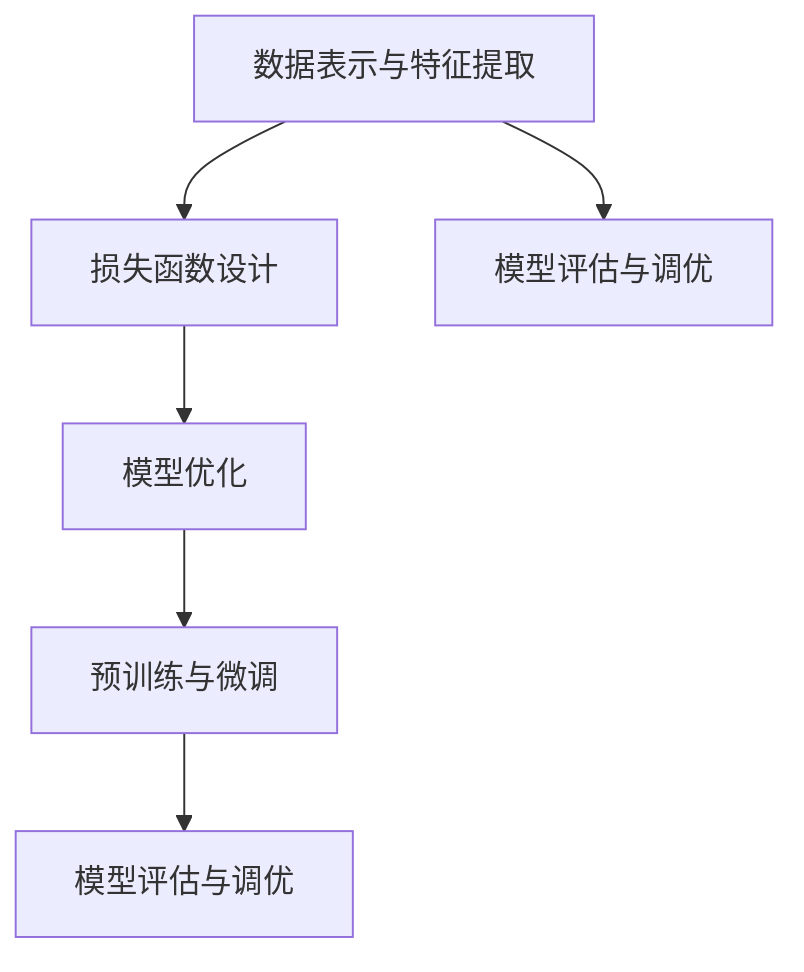
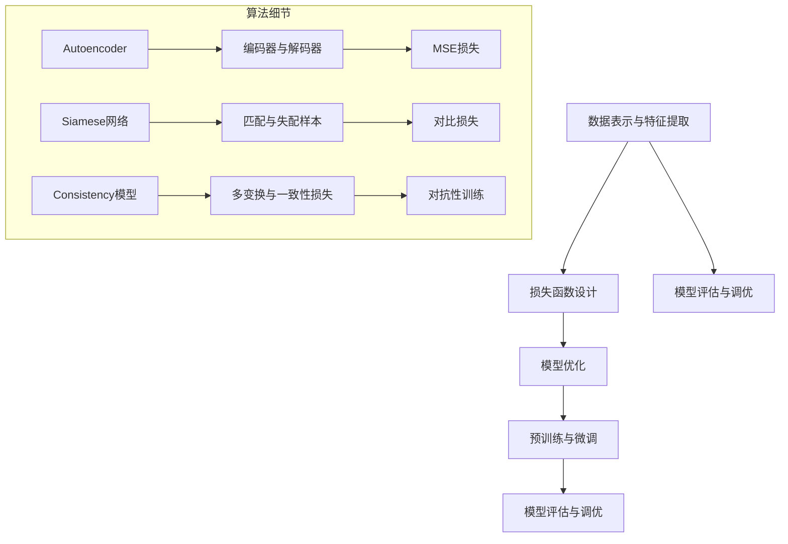
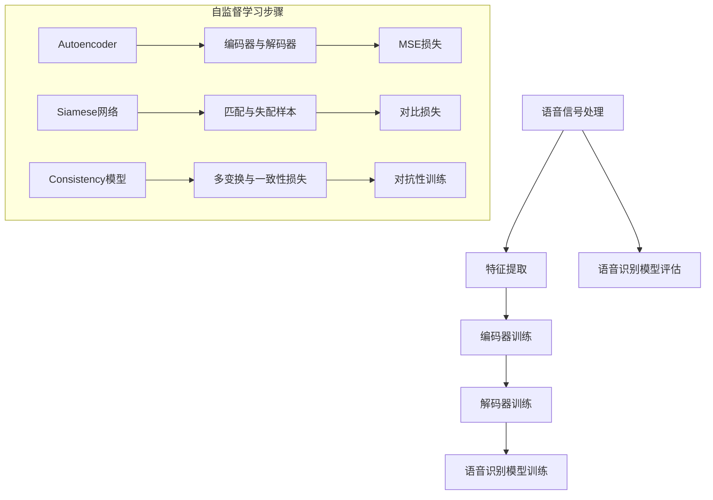
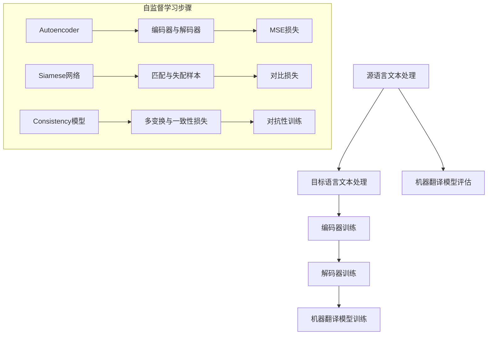

                 

### 文章标题

《自监督学习的应用创新：语音识别和机器翻译》

### 关键词

自监督学习，语音识别，机器翻译，应用创新，算法原理，数学模型

### 摘要

自监督学习作为一种重要的机器学习方法，近年来在语音识别和机器翻译等应用领域取得了显著成果。本文首先介绍了自监督学习的定义、历史发展和核心概念，接着详细阐述了自监督学习的数学模型和主要算法，如Autoencoder、Siamese网络和Consistency模型。随后，文章深入探讨了自监督学习在语音识别和机器翻译中的实际应用，包括预训练模型的选择与调优、算法优化策略等。最后，文章总结了自监督学习的应用前景，分析了其在多模态学习和未来发展方向中的潜力，并提出了相关挑战和解决方案。通过本文的阅读，读者可以全面了解自监督学习的应用创新，掌握其在语音识别和机器翻译等领域的应用技巧和策略。

### 第1章 自监督学习概述

#### 1.1 自监督学习的定义与核心概念

自监督学习（Self-supervised Learning）是一种机器学习方法，其核心在于利用数据中固有的信息，无需外部标签或监督信号，通过自我监督的方式来训练模型。自监督学习的一个显著特点是其能够从大规模未标注数据中学习到有价值的信息，从而提高模型的泛化能力。

核心概念包括：

- **数据表示与特征提取**：自监督学习需要将原始数据（如图像、文本、语音等）转化为模型可以处理的特征表示。
- **损失函数与优化算法**：通过设计合适的损失函数和优化算法，自监督学习模型可以不断调整参数，以最小化损失函数，从而提高模型性能。
- **预训练与微调**：预训练是指使用未标注的大规模数据训练模型，微调是指使用少量标注数据进一步调整模型参数。

#### 1.2 自监督学习的发展历史

自监督学习的历史可以追溯到20世纪80年代。最初，自监督学习主要用于语音识别和图像分类领域。随着深度学习技术的发展，自监督学习逐渐成为机器学习研究的重要方向。近年来，随着大数据和计算资源的不断增长，自监督学习得到了广泛应用，并在语音识别、机器翻译、自然语言处理等领域取得了显著成果。

#### 1.3 自监督学习的重要性

自监督学习的重要性主要体现在以下几个方面：

- **提高模型泛化能力**：自监督学习利用未标注数据学习特征表示，可以减少对标注数据的依赖，提高模型的泛化能力。
- **降低数据标注成本**：在许多应用场景中，标注数据是一项耗时且昂贵的任务。自监督学习可以减少对标注数据的依赖，从而降低数据标注成本。
- **处理未标注数据**：自监督学习可以从大量未标注数据中提取有价值的信息，这对于数据稀缺或数据获取成本高的领域尤为重要。
- **多模态学习**：自监督学习在多模态数据融合和特征提取方面具有显著优势，可以应用于图像、语音、文本等多种数据类型的处理。

#### 1.4 自监督学习与无监督学习的联系与区别

自监督学习和无监督学习都是不依赖于外部标签的机器学习方法，但它们之间存在一些区别：

- **定义**：自监督学习是利用数据中的固有信息进行学习，通常涉及预测或分类任务；无监督学习则是指从未标注数据中提取潜在结构或特征。
- **目标**：自监督学习的目标通常是预测或分类任务，通过自我监督来提高模型性能；无监督学习的目标通常是发现数据中的潜在结构和分布，如聚类和降维。
- **方法**：自监督学习通常涉及额外的预测任务，如预测输入数据的标签，从而利用未标注数据进行自我监督；无监督学习则通常使用数据之间的内在结构，如聚类中心或降维空间中的表示。

通过以上分析，我们可以看到自监督学习作为一种机器学习方法，具有独特的优势和广泛的应用前景。接下来，我们将进一步探讨自监督学习的数学模型和主要算法，以深入了解其原理和应用。

#### 1.5 自监督学习的基本框架

自监督学习的基本框架通常包括以下几个步骤：

1. **数据表示与特征提取**：
   - 将原始数据（如图像、文本、语音等）转化为模型可以处理的特征表示。
   - 通过设计合适的特征提取器，如卷积神经网络（CNN）或循环神经网络（RNN），从原始数据中提取有意义的特征。

2. **损失函数设计**：
   - 设计一个合适的损失函数来衡量模型预测与真实值之间的差异。
   - 损失函数通常涉及预测任务，如分类、回归或标签预测，以促使模型不断优化其预测能力。

3. **模型优化**：
   - 使用优化算法（如梯度下降、Adam等）对模型参数进行调整，以最小化损失函数。
   - 通过迭代优化，模型逐步提高其预测性能。

4. **预训练与微调**：
   - 使用未标注的大规模数据对模型进行预训练，以学习到通用的特征表示。
   - 在预训练的基础上，使用少量标注数据进行微调，以适应特定任务的需求。

5. **模型评估与调优**：
   - 在测试集上评估模型的性能，通过调整模型结构、超参数等，优化模型效果。
   - 使用交叉验证、性能指标（如准确率、召回率、F1分数等）来评估模型性能。

通过以上步骤，自监督学习模型可以从大量未标注数据中提取有价值的信息，并在实际任务中表现出良好的性能。以下是自监督学习基本框架的Mermaid流程图：



通过这个流程图，我们可以直观地看到自监督学习从数据预处理到模型评估的各个环节，以及各个环节之间的相互关系。接下来，我们将进一步探讨自监督学习的数学模型和具体算法，以深入了解其实现细节和应用场景。

### 第2章 自监督学习原理

#### 2.1 自监督学习的数学模型

自监督学习的数学模型主要涉及数据表示、特征提取、损失函数和优化算法。以下是这些核心组件的详细解释：

##### 2.1.1 数据表示与特征提取

数据表示是自监督学习的基础，其目标是将原始数据（如图像、文本、语音等）转化为模型可以处理的特征表示。这一过程通常通过以下几个步骤实现：

1. **数据预处理**：
   - 对于图像数据，进行图像归一化、缩放、裁剪等操作，以适应模型输入的要求。
   - 对于文本数据，进行分词、词性标注、去停用词等预处理操作，以便提取有意义的特征。
   - 对于语音数据，进行声音信号采样、滤波、归一化等预处理操作，以便特征提取。

2. **特征提取**：
   - 使用深度神经网络（如卷积神经网络（CNN）、循环神经网络（RNN）、变换器（Transformer）等）从原始数据中提取特征。
   - 特征提取器的设计取决于数据类型和任务需求。例如，对于图像分类任务，可以使用CNN提取视觉特征；对于文本分类任务，可以使用RNN提取文本特征。

##### 2.1.2 损失函数与优化算法

损失函数是衡量模型预测与真实值之间差异的关键指标，优化算法则用于调整模型参数，以最小化损失函数。以下是几个常用的损失函数和优化算法：

1. **损失函数**：
   - **均方误差（MSE）**：用于回归任务，衡量预测值与真实值之间的平均平方误差。
     \[ \text{MSE} = \frac{1}{n} \sum_{i=1}^{n} (\hat{y}_i - y_i)^2 \]
   - **交叉熵损失（Cross-Entropy Loss）**：用于分类任务，衡量预测概率分布与真实标签之间的差异。
     \[ \text{Cross-Entropy Loss} = -\sum_{i=1}^{n} y_i \log(\hat{y}_i) \]
   - **对抗损失（Adversarial Loss）**：在生成对抗网络（GAN）中，用于衡量生成器生成的数据与真实数据的差异。

2. **优化算法**：
   - **梯度下降（Gradient Descent）**：通过计算损失函数关于模型参数的梯度，逐步调整模型参数，以最小化损失函数。
     \[ \theta_{t+1} = \theta_{t} - \alpha \nabla_{\theta} L(\theta) \]
   - **动量梯度下降（Momentum Gradient Descent）**：在梯度下降的基础上引入动量项，以加速收敛。
     \[ \theta_{t+1} = \theta_{t} - \alpha \nabla_{\theta} L(\theta) + \beta (1 - \alpha) \nabla_{\theta} L(\theta) \]
   - **Adam优化器**：结合了动量梯度和自适应学习率调整，适用于各种深度学习任务。
     \[ \theta_{t+1} = \theta_{t} - \alpha \frac{m_t}{1 - \beta_1^t} \]
     \[ m_t = \beta_1 m_{t-1} + (1 - \beta_1) \nabla_{\theta} L(\theta_t) \]
     \[ v_t = \beta_2 v_{t-1} + (1 - \beta_2) (\nabla_{\theta} L(\theta_t))^2 \]

##### 2.1.3 数据表示与特征提取

数据表示与特征提取是自监督学习的核心，其目标是提取数据中的潜在结构和信息。以下是数据表示与特征提取的详细过程：

1. **编码器（Encoder）**：
   - 编码器负责将原始数据映射到一个低维特征空间，提取数据的特征表示。
   - 对于图像数据，编码器通常使用卷积神经网络（CNN）进行特征提取。
   - 对于文本数据，编码器通常使用循环神经网络（RNN）或变换器（Transformer）进行特征提取。

2. **解码器（Decoder）**：
   - 解码器负责将编码器提取的特征表示重新映射回原始数据空间，生成预测结果。
   - 对于图像数据，解码器通常使用反卷积层（DeConvolutional Layer）进行特征重构。
   - 对于文本数据，解码器通常使用循环神经网络（RNN）或变换器（Transformer）进行文本生成。

3. **特征融合**：
   - 在多模态学习中，特征融合是一个关键步骤，其目标是将不同模态的特征进行整合，以提取更丰富的信息。
   - 常用的特征融合方法包括平均融合、加权融合、拼接融合等。

#### 2.2 自监督学习算法

自监督学习算法包括多种类型，以下介绍几种常见的算法：

##### 2.2.1 Autoencoder算法原理

Autoencoder是一种典型的自监督学习算法，其目标是最小化输入数据与重构数据之间的差异。以下是Autoencoder的原理：

1. **编码器**：
   - 编码器接收输入数据，通过压缩操作将其映射到一个低维特征空间，提取数据的主要特征。
   - 编码器的输出通常是一个固定大小的隐层表示，称为编码器的“编码”。

2. **解码器**：
   - 解码器接收编码器的输出，通过扩展操作将其重构为原始数据。
   - 解码器的输出应该与输入数据在结构上保持一致。

3. **损失函数**：
   - Autoencoder的损失函数通常是均方误差（MSE），用于衡量输入数据与重构数据之间的差异。
   - 损失函数的目的是最小化输入数据与重构数据之间的误差。

4. **训练过程**：
   - 在训练过程中，Autoencoder通过不断调整编码器和解码器的参数，以最小化损失函数。
   - 通过反向传播算法，计算损失函数关于编码器和解码器参数的梯度，并更新参数。

##### 2.2.2 Siamese网络算法原理

Siamese网络是一种用于匹配问题的自监督学习算法，其目标是比较两个输入样本的相似度。以下是Siamese网络的原理：

1. **网络结构**：
   - Siamese网络由两个结构相同的子网络组成，称为Siamese网络的对。
   - 两个子网络共享相同的权重，但具有独立的参数。

2. **相似度度量**：
   - Siamese网络通过对两个输入样本分别进行编码，然后计算编码结果之间的相似度度量。
   - 常用的相似度度量方法包括欧氏距离、余弦相似度和对比损失（Contrastive Loss）。

3. **损失函数**：
   - Siamese网络的损失函数通常是对抗损失，其目标是最小化正样本之间的相似度，同时最大化负样本之间的相似度。

4. **训练过程**：
   - 在训练过程中，Siamese网络通过不断调整权重，以最小化对抗损失。
   - 通过反向传播算法，计算损失函数关于网络参数的梯度，并更新参数。

##### 2.2.3 Consistency模型算法原理

Consistency模型是一种用于数据增强的自监督学习算法，其目标是通过最小化多个随机采样的数据点的特征差异，提高模型对数据的鲁棒性。以下是Consistency模型的原理：

1. **网络结构**：
   - Consistency模型通常使用变换器（Transformer）作为主干网络，通过多个随机变换对输入数据进行处理。

2. **一致性损失**：
   - Consistency模型的核心思想是保持输入数据与其变换后的数据之间的特征一致性。
   - 一致性损失函数用于衡量输入数据与其变换后的数据之间的特征差异。

3. **训练过程**：
   - 在训练过程中，Consistency模型通过不断调整变换器的参数，以最小化一致性损失。
   - 通过反向传播算法，计算损失函数关于变换器参数的梯度，并更新参数。

通过以上对自监督学习原理的详细介绍，我们可以看到自监督学习在数据表示、特征提取、损失函数和优化算法等方面具有丰富的理论和实践基础。接下来，我们将深入探讨自监督学习在语音识别和机器翻译等领域的实际应用。

#### 2.3 自监督学习算法的总结与比较

自监督学习算法在语音识别和机器翻译等领域具有广泛的应用，每种算法都有其独特的原理和特点。以下是几种主要的自监督学习算法的总结与比较：

##### Autoencoder算法

**原理**：Autoencoder是一种无监督学习的典型算法，其核心思想是通过编码器（Encoder）将输入数据映射到一个低维特征空间，然后通过解码器（Decoder）将特征空间的数据重构回原始数据。Autoencoder不需要标签数据，可以通过最小化重构误差来学习数据的潜在表示。

**优势**：
- **数据压缩**：Autoencoder能够有效地压缩数据，提取主要特征，适用于图像、音频和文本等数据类型。
- **特征学习**：Autoencoder能够学习到数据的潜在表示，这些特征可以用于下游任务，如分类和聚类。

**劣势**：
- **计算资源需求**：训练Autoencoder需要大量的计算资源，特别是在处理高维数据时。
- **重构误差**：Autoencoder在重构原始数据时可能引入误差，这可能会影响下游任务的性能。

##### Siamese网络算法

**原理**：Siamese网络是一种用于匹配学习的自监督算法，其结构由两个共享权重的子网络组成。给定一个正样本对和一系列负样本对，Siamese网络通过计算正样本对之间的相似度与负样本对之间的相似度来训练模型。

**优势**：
- **高效性**：Siamese网络在处理图像和语音匹配问题时表现出高效性，能够快速学习到匹配关系。
- **无监督学习**：Siamese网络不需要标签数据，可以直接从未标注的数据中学习。

**劣势**：
- **对负样本依赖**：Siamese网络的性能很大程度上依赖于负样本的质量和数量，负样本不足可能会导致模型过拟合。
- **计算复杂性**：Siamese网络在处理高维数据时可能需要大量的计算资源。

##### Consistency模型算法

**原理**：Consistency模型是一种基于数据增强的自监督学习算法，其核心思想是通过最小化多个随机变换后的数据点的特征差异来提高模型的鲁棒性。Consistency模型通常使用变换器（Transformer）作为主干网络，通过多个随机变换来生成数据。

**优势**：
- **数据增强**：Consistency模型能够通过随机变换生成大量数据，增强模型的泛化能力。
- **鲁棒性**：Consistency模型通过最小化特征差异来提高模型的鲁棒性，使其能够更好地应对数据噪声和分布变化。

**劣势**：
- **计算成本**：Consistency模型在训练过程中需要大量的计算资源，特别是在使用高维数据时。
- **稳定性**：由于随机变换的引入，Consistency模型的输出可能存在不确定性，这可能会影响模型的稳定性。

通过以上比较，我们可以看到每种自监督学习算法都有其适用的场景和优势。在实际应用中，选择合适的算法取决于具体任务的需求和数据特点。接下来，我们将深入探讨自监督学习在语音识别和机器翻译等领域的实际应用。

### 第3章 语音识别中的自监督学习

#### 3.1 语音识别基础

语音识别（Speech Recognition）是人工智能领域的一个重要分支，其目标是实现对人声的自动转换成文本。语音识别系统通常包括以下几个关键组件：

1. **语音信号处理**：
   - 语音信号处理是指将原始音频信号转换为适合建模的形式。这一步骤包括音频信号的预处理、滤波、增强等操作，以减少噪声和提高信号质量。
   - 采样：将连续的音频信号转换为离散的时间序列。
   - 声谱分析：通过傅里叶变换（Fourier Transform）将时间序列转换为频率域，生成声谱图。

2. **特征提取**：
   - 特征提取是指从语音信号中提取有助于识别的有用信息。常用的特征包括梅尔频率倒谱系数（MFCC）、线性预测倒谱系数（LPCC）、共振峰频率（Formants）等。
   - MFCC：一种广泛应用于语音识别的特征提取方法，能够有效捕捉语音信号的频率信息。

3. **模型训练**：
   - 语音识别模型通常使用深度神经网络（DNN）、循环神经网络（RNN）、卷积神经网络（CNN）等架构。这些模型通过大量的语音数据训练，学习到语音信号的特征表示和语音与文本之间的映射关系。

4. **解码**：
   - 解码是指将模型输出的特征表示转换为文本。这一步骤通常涉及语言模型和声学模型的结合，以优化解码结果。

#### 3.2 自监督学习在语音识别中的应用

自监督学习在语音识别中的应用具有显著的潜力，可以通过以下几种方式提升模型的性能：

1. **预训练模型的选择与调优**：
   - 预训练是指使用未标注的大规模语音数据对模型进行初始训练，使其学习到通用的语音特征表示。
   - 选择合适的预训练模型对后续的语音识别任务至关重要。常见的预训练模型包括基于CNN的Autoencoder、基于RNN的Siamese网络和基于Transformer的Consistency模型。
   - 调优步骤包括调整模型的超参数（如学习率、批次大小等）和微调预训练模型，以适应特定任务的数据和需求。

2. **自监督学习算法在语音识别中的实际应用**：

   - **基于Autoencoder的方法**：
     - **原理**：Autoencoder通过编码器提取语音信号的特征表示，并通过解码器重构原始语音信号。这种自监督训练方法能够有效提高模型的特征提取能力。
     - **实现**：编码器将输入的语音信号映射到一个低维特征空间，解码器则尝试重构原始信号。通过最小化重构误差，Autoencoder模型能够学习到有意义的特征表示。
     - **效果**：预训练的Autoencoder模型在语音识别任务中表现出色，尤其是在特征提取和噪声鲁棒性方面。

   - **基于Siamese网络的方法**：
     - **原理**：Siamese网络通过学习语音信号的匹配关系来训练模型。给定一对语音信号，Siamese网络学习判断这两对信号是否属于同一说话者。
     - **实现**：Siamese网络由两个共享权重的子网络组成，一个用于编码语音信号，另一个用于比较编码结果。通过对抗性训练，模型能够区分正样本和负样本。
     - **效果**：Siamese网络在提高模型的匹配精度和鲁棒性方面具有显著优势，特别适用于处理多说话者场景。

   - **基于Consistency模型的方法**：
     - **原理**：Consistency模型通过最小化多个随机变换后的语音信号的差异来提高模型的鲁棒性。这种方法能够增强模型对噪声和分布变化的适应能力。
     - **实现**：Consistency模型通常使用Transformer架构，通过多个随机变换（如时间步跳跃、频率变换等）对语音信号进行处理。通过一致性损失函数，模型能够学习到稳定的特征表示。
     - **效果**：Consistency模型在提高语音识别任务的鲁棒性和泛化能力方面表现出色，尤其适用于低资源场景。

3. **算法优化策略**：
   - **多任务学习**：结合多个相关任务进行训练，可以共享模型参数，提高模型的泛化能力。例如，将语音识别任务与说话人识别任务结合，共享特征提取网络。
   - **数据增强**：通过随机裁剪、速度变换、噪声添加等数据增强方法，增加训练数据的多样性，提高模型的鲁棒性。
   - **动态调整超参数**：在训练过程中动态调整学习率、批量大小等超参数，以避免过拟合和加速收敛。

通过自监督学习的方法，语音识别模型能够从大量未标注的语音数据中提取有价值的信息，显著提升模型性能。在实际应用中，自监督学习方法为语音识别系统提供了更强大的特征提取和噪声鲁棒性，使得语音识别任务能够更好地适应不同的环境和场景。接下来，我们将探讨自监督学习在机器翻译领域的应用。

#### 3.3 自监督学习在机器翻译中的应用

机器翻译（Machine Translation）是自然语言处理领域的一项重要任务，其目标是将一种语言的文本翻译成另一种语言的文本。自监督学习在机器翻译中的应用具有显著的优势，可以通过以下几种方式提升翻译质量和效率：

1. **预训练模型的选择与调优**：
   - 预训练是指使用未标注的双语数据对翻译模型进行初始训练，使其学习到语言间的映射关系。预训练模型的选择对后续的翻译任务至关重要。
   - 常见的预训练模型包括基于Transformer的BERT、GPT和T5等。这些模型通过大量的双语文本数据学习到丰富的语言表示和翻译规律。
   - 调优步骤包括调整模型超参数（如学习率、批量大小等）和微调预训练模型，以适应特定语言的翻译任务。

2. **自监督学习算法在机器翻译中的实际应用**：

   - **基于Autoencoder的方法**：
     - **原理**：Autoencoder通过编码器提取源语言和目标语言的文本特征，并通过解码器将特征重构为目标语言的文本。这种方法能够有效学习到语言间的潜在表示。
     - **实现**：编码器将源语言和目标语言的文本映射到一个共享的特征空间，解码器则尝试将特征空间中的表示重构为目标语言的文本。通过最小化重构误差，Autoencoder模型能够学习到语言间的映射关系。
     - **效果**：预训练的Autoencoder模型在翻译任务中表现出色，能够在保持语义一致性的同时提高翻译质量。

   - **基于Siamese网络的方法**：
     - **原理**：Siamese网络通过学习源语言和目标语言文本的匹配关系来训练模型。给定一对源语言和目标语言的文本，Siamese网络学习判断这两对文本是否匹配。
     - **实现**：Siamese网络由两个共享权重的子网络组成，一个用于编码源语言文本，另一个用于编码目标语言文本。通过对抗性训练，模型能够区分匹配和失配的文本对。
     - **效果**：Siamese网络在提高翻译模型匹配精度和多样性方面具有显著优势，能够有效减少翻译误差。

   - **基于Consistency模型的方法**：
     - **原理**：Consistency模型通过最小化多个随机变换后的源语言和目标语言文本的差异来提高翻译模型的鲁棒性。这种方法能够增强模型对噪声和分布变化的适应能力。
     - **实现**：Consistency模型通常使用Transformer架构，通过多个随机变换（如时间步跳跃、词汇替换等）对源语言和目标语言文本进行处理。通过一致性损失函数，模型能够学习到稳定的语言表示。
     - **效果**：Consistency模型在提高翻译模型的鲁棒性和泛化能力方面表现出色，特别适用于处理低资源语言和不同风格文本的翻译任务。

3. **算法优化策略**：
   - **多任务学习**：结合多个相关任务进行训练，可以共享模型参数，提高模型的泛化能力。例如，将机器翻译任务与问答系统、对话系统等结合，共享文本表示和翻译模型。
   - **数据增强**：通过随机裁剪、文本扰动、语言风格转换等数据增强方法，增加训练数据的多样性，提高模型的鲁棒性和适应性。
   - **动态调整超参数**：在训练过程中动态调整学习率、批量大小等超参数，以避免过拟合和加速收敛。

通过自监督学习的方法，机器翻译模型能够从大量的未标注数据中提取有价值的信息，显著提升翻译质量和效率。在实际应用中，自监督学习方法为机器翻译系统提供了更强大的特征提取和语言理解能力，使得翻译系统能够更好地适应不同语言和场景的需求。接下来，我们将进一步探讨自监督学习在多模态学习中的应用。

### 第4章 自监督学习在多模态学习中的应用

#### 4.1 多模态学习概述

多模态学习（Multimodal Learning）是一种利用多种数据模态（如图像、语音、文本等）进行信息融合和协同建模的机器学习方法。多模态学习的目标是从不同模态的数据中提取有价值的信息，并通过融合这些信息来提高模型的性能。以下是多模态学习的一些核心概念和挑战：

1. **数据模态**：
   - **图像**：图像数据通常通过像素值表示，包含丰富的视觉信息。
   - **语音**：语音数据包含声波信号，可以通过声谱图表示，用于捕捉语音的音素和音调信息。
   - **文本**：文本数据通过单词和句子表示，包含语义和上下文信息。

2. **特征提取**：
   - 对于图像数据，通常使用卷积神经网络（CNN）提取视觉特征。
   - 对于语音数据，通常使用循环神经网络（RNN）或变换器（Transformer）提取声学特征。
   - 对于文本数据，通常使用词嵌入或变换器提取语义特征。

3. **特征融合**：
   - 特征融合是将不同模态的特征进行整合，以提取更丰富的信息。常用的方法包括平均融合、加权融合、拼接融合和注意力机制。

4. **挑战**：
   - **模态差异**：不同模态的数据在特征表示、数据分布和噪声水平上存在显著差异，这使得特征融合变得复杂。
   - **数据不平衡**：不同模态的数据量可能差异很大，如何平衡不同模态的数据对于模型性能至关重要。
   - **计算资源需求**：多模态学习通常涉及大量的计算资源，特别是在处理高维数据和复杂的模型时。

#### 4.2 自监督学习在多模态学习中的应用

自监督学习在多模态学习中的应用具有显著的优势，可以通过以下几种方式提高模型的性能和鲁棒性：

1. **多模态自监督学习的数学模型**

   - **数据表示与特征提取**：多模态自监督学习的目标是提取不同模态的数据特征，并在统一的特征空间中进行融合。常见的特征提取方法包括卷积神经网络（CNN）用于图像特征提取、循环神经网络（RNN）或变换器（Transformer）用于语音和文本特征提取。

   - **特征融合**：特征融合是将不同模态的特征进行整合，以提取更丰富的信息。常用的方法包括平均融合、加权融合、拼接融合和注意力机制。

   - **损失函数与优化算法**：多模态自监督学习的损失函数通常结合不同模态的特征差异，并设计合适的优化算法以最小化损失函数。常见的损失函数包括对抗损失、一致性损失和多样性损失。

2. **多模态自监督学习的算法实现**

   - **基于Autoencoder的方法**：
     - **原理**：多模态Autoencoder通过编码器提取不同模态的特征表示，并通过解码器将特征重构回原始模态数据。这种方法能够有效学习到不同模态之间的潜在关联。
     - **实现**：编码器分别对图像、语音和文本数据进行特征提取，解码器则尝试将提取的特征重构为原始模态数据。通过最小化重构误差，多模态Autoencoder能够学习到不同模态的潜在表示。
     - **效果**：多模态Autoencoder在多模态分类、多模态生成和跨模态检索等任务中表现出色，能够提高模型的特征提取能力和跨模态融合能力。

   - **基于Siamese网络的方法**：
     - **原理**：多模态Siamese网络通过学习不同模态数据的匹配关系来训练模型。给定多个模态的数据对，Siamese网络学习判断这些数据对是否匹配。
     - **实现**：多模态Siamese网络由多个共享权重的子网络组成，每个子网络负责提取对应模态的特征表示。通过对抗性训练，模型能够区分匹配和失配的数据对。
     - **效果**：多模态Siamese网络在多模态分类和匹配任务中表现出良好的性能，能够提高模型对多模态数据的理解和区分能力。

   - **基于Consistency模型的方法**：
     - **原理**：多模态Consistency模型通过最小化多个随机变换后的多模态数据的特征差异来提高模型的鲁棒性。这种方法能够增强模型对不同模态数据噪声和分布变化的适应能力。
     - **实现**：多模态Consistency模型通常使用变换器（Transformer）架构，通过多个随机变换（如时间步跳跃、模态转换等）对多模态数据进行处理。通过一致性损失函数，模型能够学习到稳定的特征表示。
     - **效果**：多模态Consistency模型在多模态分类、多模态生成和跨模态检索等任务中表现出色，能够提高模型的鲁棒性和泛化能力。

3. **多模态自监督学习的应用案例**

   - **多模态情感分析**：多模态情感分析旨在通过分析图像、语音和文本数据来识别情感状态。自监督学习方法能够有效提取不同模态的情感特征，并通过特征融合提高情感分析模型的准确性和鲁棒性。

   - **多模态语音识别**：多模态语音识别结合了语音和图像信息，通过自监督学习方法提高语音识别的准确率和鲁棒性。例如，通过结合语音和嘴唇运动图像，可以更好地识别说话人的语音。

   - **多模态视频分类**：多模态视频分类旨在通过分析视频的图像和音频信息来分类视频内容。自监督学习方法能够有效融合图像和音频特征，提高视频分类模型的性能。

通过以上分析，我们可以看到自监督学习在多模态学习中的应用具有广泛的前景和显著的优势。多模态自监督学习方法能够有效提取和融合不同模态的特征，提高模型的性能和鲁棒性，为多模态数据的处理和分析提供了强有力的工具。接下来，我们将进一步探讨自监督学习的应用创新。

### 第5章 自监督学习的应用创新

#### 5.1 自监督学习的应用前景

自监督学习作为一种不依赖标注数据的机器学习方法，在近年来取得了显著的进展，并展示了广阔的应用前景。以下是自监督学习在工业界和学术界的主要应用趋势：

1. **工业界应用**：

   - **图像识别与检测**：自监督学习在工业界广泛应用于图像识别和检测任务，如人脸识别、目标检测、自动驾驶等。通过预训练模型和自监督学习算法，可以显著提高模型在复杂场景下的准确率和鲁棒性。
   - **语音识别与合成**：自监督学习在语音识别和合成领域也有广泛应用，如智能语音助手、语音转换等。通过自监督学习算法，可以更有效地提取语音特征和训练合成模型，提高语音识别和合成的质量。
   - **自然语言处理**：自监督学习在自然语言处理（NLP）领域也表现出强大的能力，如机器翻译、文本分类、情感分析等。通过预训练模型和自监督学习算法，可以学习到更丰富的语言表示和语义理解能力。

2. **学术界研究趋势**：

   - **多模态学习**：自监督学习在多模态数据融合和协同建模方面具有显著优势，吸引了众多研究者的关注。当前的研究趋势包括多模态特征提取、多模态语义理解、多模态交互等，旨在通过自监督学习实现更高效和准确的多模态数据处理。
   - **无监督学习算法改进**：自监督学习算法的改进是当前研究的重要方向，包括损失函数的设计、优化算法的改进、模型结构的优化等。研究者们致力于提高自监督学习算法的效率、稳定性和泛化能力。
   - **应用领域拓展**：自监督学习在医疗、金融、教育等领域的应用也得到了广泛关注。通过自监督学习方法，可以有效地处理大量未标注的数据，为各领域的自动化和智能化提供强有力的支持。

#### 5.2 应用创新案例分析

1. **语音识别领域的创新应用案例**

   - **基于自监督学习的语音增强**：在语音识别中，噪声往往是一个挑战性的问题。自监督学习通过无监督的方式对噪声语音进行增强，显著提高了语音识别的准确率。例如，利用自监督学习算法对噪声语音进行去噪处理，可以在不需要人工标注的情况下提高语音识别系统的性能。
   - **多说话者语音识别**：在多说话者场景下，自监督学习通过学习说话者之间的匹配关系，提高了模型的识别能力。例如，通过Siamese网络学习不同说话者的语音特征，可以有效地区分和识别多个说话者的语音。

2. **机器翻译领域的创新应用案例**

   - **跨语言信息检索**：自监督学习在跨语言信息检索（Cross-Lingual Information Retrieval, CLIR）中发挥了重要作用。通过预训练模型，自监督学习能够从大量未标注的双语数据中提取语言间的映射关系，从而提高跨语言检索的准确性和效率。
   - **低资源语言翻译**：在低资源语言翻译任务中，自监督学习通过无监督的方式利用双语数据，可以显著提高模型的翻译质量。例如，通过基于自监督学习的翻译模型，即使只有少量的双语对照句子，也能够实现高质量的翻译。

通过上述案例分析，我们可以看到自监督学习在语音识别和机器翻译等领域的创新应用，为提高模型性能和解决实际应用中的难题提供了新的思路和方法。未来，随着自监督学习算法的进一步发展和优化，其在各领域的应用前景将更加广阔。

### 第6章 自监督学习的挑战与未来发展方向

#### 6.1 自监督学习的挑战

尽管自监督学习在多个领域展示了巨大的潜力，但在实际应用中仍面临一系列挑战：

1. **数据集的获取与标注**：
   - 自监督学习的核心在于利用未标注数据。然而，高质量、大规模的未标注数据集获取仍然是一个难题。特别是在某些专业领域，如医疗图像、专业语音等，获取未标注数据非常困难。
   - 即使能够获取到未标注数据，如何将其有效利用仍是一个挑战。数据的不均衡和多样性可能影响模型的泛化能力。

2. **计算资源的需求**：
   - 自监督学习通常需要大量的计算资源，特别是深度神经网络和复杂的模型结构。在资源有限的场景下，如何优化模型计算效率是一个关键问题。
   - 计算资源的限制可能导致模型训练时间过长，从而影响实际应用中的实时性。

3. **模型解释性**：
   - 自监督学习模型通常被视为“黑盒”，其内部决策过程难以解释。这对需要高解释性的应用场景（如医疗诊断、金融风险评估等）构成了挑战。
   - 研究者正在探索可解释性模型，但现有方法往往在解释性和准确性之间做出权衡。

4. **算法性能**：
   - 自监督学习算法的性能在很大程度上依赖于模型设计、损失函数和优化策略。如何设计更有效的算法，以在保持高准确率的同时提高训练效率，是当前的研究热点。

#### 6.2 未来发展方向

1. **算法改进**：
   - 研究者将继续探索更有效的自监督学习算法，包括改进损失函数、优化模型结构、设计更鲁棒的优化策略等。
   - 深度学习技术的进步，如自动机器学习（AutoML）、神经网络架构搜索（Neural Architecture Search, NAS），有望为自监督学习算法的优化提供新思路。

2. **应用拓展**：
   - 自监督学习将在更多领域得到应用，如生物信息学、环境监测、智能交通等。这些领域的应用需求将推动自监督学习算法的创新和发展。
   - 多模态自监督学习将进一步融合不同模态的数据，解决复杂任务，如多模态诊断、虚拟现实等。

3. **跨领域合作**：
   - 自监督学习需要跨学科的合作，包括计算机科学、物理学、生物学等。跨领域的合作将促进自监督学习理论的完善和实际应用的创新。

4. **伦理与法规**：
   - 随着自监督学习在各个领域的应用，伦理和法规问题也日益突出。如何确保自监督学习模型的公平性、透明性和可靠性，需要引起广泛关注。
   - 研究者、开发者、政策制定者需要共同努力，建立合适的伦理准则和法规体系，确保自监督学习的安全和可持续发展。

通过以上分析，我们可以看到自监督学习在面临诸多挑战的同时，也具有广阔的发展前景。未来的研究和发展方向将集中在算法优化、应用拓展、跨领域合作和伦理法规等方面，以推动自监督学习在更多领域的应用和进步。

### 附录：自监督学习工具与资源

在自监督学习的研究和应用中，掌握一些常用的工具和资源对于开发者来说至关重要。以下介绍几种常见的自监督学习框架、开源代码库和在线教程与课程，以帮助读者更好地理解和实践自监督学习。

#### A.1 PyTorch

**PyTorch** 是一个流行的开源深度学习框架，广泛用于自监督学习的实现。其特点包括动态计算图、灵活性和强大的GPU支持。

- **官方网站**：[PyTorch 官方网站](https://pytorch.org/)
- **教程**：[PyTorch官方教程](https://pytorch.org/tutorials/)
- **文档**：[PyTorch官方文档](https://pytorch.org/docs/stable/index.html)

#### A.2 TensorFlow

**TensorFlow** 是另一个广泛使用的深度学习框架，提供了丰富的自监督学习工具和资源。

- **官方网站**：[TensorFlow 官方网站](https://www.tensorflow.org/)
- **教程**：[TensorFlow官方教程](https://www.tensorflow.org/tutorials)
- **文档**：[TensorFlow官方文档](https://www.tensorflow.org/api_docs)

#### A.3 其他自监督学习工具

除了PyTorch和TensorFlow，还有其他一些自监督学习工具值得关注：

- **Transformers**：一个用于构建和训练变换器（Transformer）模型的库。
  - **官方网站**：[Transformers GitHub库](https://github.com/huggingface/transformers)
- **Sonnet**：Google开发的一个用于构建和训练深度神经网络的库。
  - **官方网站**：[Sonnet GitHub库](https://github.com/google/sonnet)

#### B.1 学术论文

阅读最新的学术论文是了解自监督学习研究进展的重要途径。以下是一些重要的论文和期刊：

- **论文**：
  - [“Unsupervised Learning of Visual Representations by Solving Jigsaw Puzzles”](https://arxiv.org/abs/1708.02122)
  - [“Learning Representations by Maximizing Mutual Information Across Views”](https://arxiv.org/abs/1807.03748)
- **期刊**：
  - IEEE Transactions on Pattern Analysis and Machine Intelligence (TPAMI)
  - International Conference on Machine Learning (ICML)
  - Conference on Neural Information Processing Systems (NeurIPS)

#### B.2 开源代码库

以下是一些重要的开源代码库，涵盖多种自监督学习算法和应用：

- **开源代码库**：
  - [“Supervised and Self-supervised Learning on Part-Annotated Datasets”](https://github.com/google-research/big transferred)（谷歌研究团队的代码库，包含多种自监督学习算法）
  - [“Contrastive Multiview Clustering”](https://github.com/google-research/cmcl)（对比多视角聚类的代码库）
  - [“LEMonD”](https://github.com/google-research/lemond)（用于多模态学习的代码库）

#### B.3 在线教程与课程

以下是一些高质量的在线教程和课程，适合初学者和进阶者：

- **在线教程**：
  - [“Self-supervised Learning: Unlabelled Data Meets Deep Neural Networks”](https://www.deeplearning.ai/unsupervised-learning/unsupervised-learning-overview)（DeepLearning.AI的教程）
  - [“Self-supervised Learning for Vision”](https://course.fast.ai/lessons/self_supervised_learning_for_vision)（Fast.ai的教程）
- **在线课程**：
  - [“Unsupervised and Self-supervised Learning”](https://www.udacity.com/course/self-supervised-learning--ud715)（Udacity的在线课程）
  - [“Self-Supervised Learning: Theory and Applications”](https://www.coursera.org/specializations/self-supervised-learning)（Coursera的专项课程）

通过这些工具和资源，读者可以更深入地了解自监督学习，掌握相关技术和方法，为实际应用和研究打下坚实的基础。

### 附录：核心概念与算法 Mermaid 流程图

以下是自监督学习中核心概念和算法的Mermaid流程图，以帮助读者更直观地理解各算法的流程和步骤。

#### 自监督学习算法流程图



#### 语音识别中自监督学习应用流程图



#### 机器翻译中自监督学习应用流程图



通过这些流程图，读者可以更清晰地了解自监督学习的各个步骤以及具体算法的实现细节，有助于深入理解和实践自监督学习技术。

### 附录：核心算法伪代码

在自监督学习领域，理解核心算法的实现细节对于开发和应用这些算法至关重要。以下提供几种常见算法的伪代码，包括Autoencoder、Siamese网络和Consistency模型，以便读者能够更直观地了解这些算法的运行机制。

#### Autoencoder算法伪代码

```python
# Autoencoder算法伪代码

# 编码器部分
def encoder(x):
    # x 为输入数据
    x = Conv2D(filters=64, kernel_size=(3, 3), activation='relu')(x)
    x = MaxPooling2D(pool_size=(2, 2))(x)
    x = Conv2D(filters=128, kernel_size=(3, 3), activation='relu')(x)
    x = MaxPooling2D(pool_size=(2, 2))(x)
    # ... 可根据需要添加更多层
    encoded = Flatten()(x)
    return encoded

# 解码器部分
def decoder(encoded):
    # encoded 为编码后的特征
    x = Reshape(target_shape=(height, width, channels))(encoded)
    x = Conv2DTranspose(filters=128, kernel_size=(3, 3), activation='relu')(x)
    x = UpSampling2D(size=(2, 2))(x)
    x = Conv2DTranspose(filters=64, kernel_size=(3, 3), activation='relu')(x)
    x = UpSampling2D(size=(2, 2))(x)
    # ... 可根据需要添加更多层
    x = Conv2DTranspose(filters=1, kernel_size=(3, 3), activation='sigmoid')(x)
    return x

# 定义模型
autoencoder = Model(inputs=x_input, outputs=decoder(encoder(x_input)))
autoencoder.compile(optimizer='adam', loss='mean_squared_error')

# 训练模型
autoencoder.fit(x_train, x_train, epochs=100, batch_size=128, validation_data=(x_val, x_val))
```

#### Siamese网络算法伪代码

```python
# Siamese网络算法伪代码

# 编码器部分
def siamese_encoder(x):
    # x 为输入数据
    x = Conv2D(filters=64, kernel_size=(3, 3), activation='relu')(x)
    x = MaxPooling2D(pool_size=(2, 2))(x)
    x = Conv2D(filters=128, kernel_size=(3, 3), activation='relu')(x)
    x = MaxPooling2D(pool_size=(2, 2))(x)
    # ... 可根据需要添加更多层
    return Flatten()(x)

# 损失函数部分
def contrastive_loss(y_true, y_pred):
    # y_true 和 y_pred 分别为标签和预测值
    margin = 1
    losses = y_true * K.square(K.relu(margin - y_pred)) + (1 - y_true) * K.square(y_pred)
    return K.mean(losses)

# 定义模型
input_a = Input(shape=(height, width, channels))
input_b = Input(shape=(height, width, channels))

encoded_a = siamese_encoder(input_a)
encoded_b = siamese_encoder(input_b)

distance = K.exp(-K.square(K.dot(encoded_a, encoded_b.T)))
loss = contrastive_loss(y_true, distance)

model = Model(inputs=[input_a, input_b], outputs=loss)
model.compile(optimizer='adam', loss=contrastive_loss)

# 训练模型
model.fit([x_a_train, x_b_train], y_train, epochs=100, batch_size=128)
```

#### Consistency模型算法伪代码

```python
# Consistency模型算法伪代码

# 编码器部分
def consistency_encoder(x):
    # x 为输入数据
    x = Conv2D(filters=64, kernel_size=(3, 3), activation='relu')(x)
    x = MaxPooling2D(pool_size=(2, 2))(x)
    x = Conv2D(filters=128, kernel_size=(3, 3), activation='relu')(x)
    x = MaxPooling2D(pool_size=(2, 2))(x)
    # ... 可根据需要添加更多层
    return Flatten()(x)

# 一致性损失函数部分
def consistency_loss(x, y):
    # x 和 y 分别为原始数据和随机变换后的数据
    distance = K.mean(K.square(x - y), axis=1)
    return K.mean(K.square(distance))

# 定义模型
input_x = Input(shape=(height, width, channels))
input_y = Input(shape=(height, width, channels))

encoded_x = consistency_encoder(input_x)
encoded_y = consistency_encoder(input_y)

loss = consistency_loss(encoded_x, encoded_y)

model = Model(inputs=[input_x, input_y], outputs=loss)
model.compile(optimizer='adam', loss=consistency_loss)

# 训练模型
model.fit([x_train, random_transformed_x_train], x_train, epochs=100, batch_size=128)
```

通过这些伪代码，我们可以看到不同自监督学习算法的基本结构及其关键组件。编码器负责提取数据特征，损失函数用于衡量模型预测与真实值之间的差异，优化算法则用于调整模型参数。这些伪代码为开发者提供了实现自监督学习算法的参考，有助于在实际应用中进一步优化和改进算法。

### 附录：数学模型与公式

自监督学习中的数学模型和公式是理解和应用这些算法的关键。以下列出了一些核心的数学模型和公式，以及它们的详细解释和例子说明。

#### 自监督学习损失函数

1. **均方误差（MSE）**：

   \[ \text{MSE} = \frac{1}{n} \sum_{i=1}^{n} (\hat{y}_i - y_i)^2 \]
   
   其中，\(\hat{y}_i\) 是模型预测的值，\(y_i\) 是真实值，\(n\) 是样本数量。MSE 用于衡量预测值与真实值之间的平均平方误差，适用于回归任务。

2. **交叉熵损失（Cross-Entropy Loss）**：

   \[ \text{Cross-Entropy Loss} = -\sum_{i=1}^{n} y_i \log(\hat{y}_i) \]
   
   其中，\(y_i\) 是真实标签（通常为独热编码），\(\hat{y}_i\) 是模型预测的概率分布。Cross-Entropy Loss 用于分类任务，衡量预测概率分布与真实标签之间的差异。

3. **对比损失（Contrastive Loss）**：

   \[ \text{Contrastive Loss} = \frac{1}{2nI} \sum_{i=1}^{n} \sum_{j=1, j\neq i}^{n} \log \frac{e^{d_{ij}}}{e^{d_{ii}} + e^{d_{ji}}} \]
   
   其中，\(d_{ij}\) 是样本 \(i\) 和 \(j\) 之间的距离（如欧氏距离、余弦相似度），\(I\) 是正样本对的个数。Contrastive Loss 用于匹配任务，如Siamese网络，目标是最大化正样本之间的相似度，同时最小化负样本之间的相似度。

4. **一致性损失（Consistency Loss）**：

   \[ \text{Consistency Loss} = \frac{1}{2} \sum_{i=1}^{n} \log \frac{e^{||x_i - \hat{x}_i||}}{e^{||x_i - \hat{x}_i + \Delta x_i||} + e^{||x_i + \Delta x_i||}} \]
   
   其中，\(x_i\) 是原始数据，\(\hat{x}_i\) 是经过变换后的数据，\(\Delta x_i\) 是随机变换（如时间步跳跃、频率变换等）。Consistency Loss 用于数据增强，目标是保持数据与其变换后的数据之间的特征一致性。

#### 特征提取与融合公式

1. **卷积运算**：

   \[ f(x) = \sum_{k=1}^{K} w_k * x + b \]
   
   其中，\(w_k\) 是卷积核，\(x\) 是输入特征图，\(b\) 是偏置项，\(K\) 是卷积核的数量。卷积运算用于提取图像中的局部特征，并保持空间信息。

2. **池化运算**：

   \[ p(x) = \frac{1}{C} \sum_{i=1}^{C} \max_{j=1}^{H} x_{ij} \]
   
   其中，\(C\) 是通道数，\(H\) 是高度，\(x_{ij}\) 是输入特征图中第 \(i\) 个通道的第 \(j\) 个像素值。池化运算用于降低特征图的维度，减少参数数量，提高计算效率。

3. **特征融合**：

   - **平均融合**：
     \[ f_{\text{avg}} = \frac{1}{M} \sum_{i=1}^{M} f_i \]
     
     其中，\(f_i\) 是不同模态的特征表示，\(M\) 是模态的数量。平均融合方法简单有效，适用于特征维度较低的情况。
   
   - **加权融合**：
     \[ f_{\text{weighted}} = \sum_{i=1}^{M} w_i f_i \]
     
     其中，\(w_i\) 是不同模态的特征权重。加权融合方法通过调整权重，可以强调某些模态的重要性，适用于特征维度较高且模态差异明显的情况。

#### 举例说明

1. **MSE损失函数在图像去噪中的应用**：

   假设我们有一个去噪模型，输入为带噪图像 \(x\) 和真实图像 \(y\)。模型输出去噪后的图像 \(\hat{y}\)。

   ```python
   mse_loss = mean_squared_error(y, \hat{y})
   print("MSE Loss:", mse_loss)
   ```

   输出结果将显示均方误差损失值，用于评估去噪效果。

2. **Cross-Entropy Loss在文本分类中的应用**：

   假设我们有一个文本分类模型，输入为文本数据 \(x\) 和对应的标签 \(y\)。模型输出每个类别的概率分布 \(\hat{y}\)。

   ```python
   ce_loss = cross_entropy(y, \hat{y})
   print("Cross-Entropy Loss:", ce_loss)
   ```

   输出结果将显示交叉熵损失值，用于评估分类效果。

3. **Consistency Loss在数据增强中的应用**：

   假设我们有一个数据增强模型，输入为图像 \(x\) 和其随机变换后的图像 \(y\)。模型输出变换后的图像预测 \(\hat{x}\)。

   ```python
   cl_loss = consistency_loss(x, \hat{x})
   print("Consistency Loss:", cl_loss)
   ```

   输出结果将显示一致性损失值，用于评估数据增强效果。

通过以上数学模型和公式的详细解释和举例说明，读者可以更好地理解自监督学习中的核心概念和算法，为实际应用提供理论依据和技术支持。

### 附录：项目实战

#### 语音识别项目实战

语音识别（Speech Recognition）是一种将语音信号转换为文本的技术，广泛应用于语音助手、实时转录和智能客服等领域。以下是一个语音识别项目实战的详细步骤。

##### 1. 项目背景与目标

项目背景：本案例旨在实现一个基于深度学习的语音识别系统，能够将输入的语音信号转换为相应的文本。

项目目标：
- 提取语音信号的特征，如梅尔频率倒谱系数（MFCC）。
- 使用自监督学习算法（如Autoencoder）提取语音信号的特征表示。
- 使用提取到的特征训练一个深度神经网络，实现语音到文本的转换。

##### 2. 开发环境与工具

- **开发环境**：Python 3.8、Jupyter Notebook、Anaconda
- **工具与库**：TensorFlow 2.7、Keras、librosa、scikit-learn

##### 3. 数据预处理

数据预处理是语音识别系统的重要步骤，包括以下内容：

1. **音频数据采集**：从公开数据集或自己采集音频数据。
2. **音频分割**：将长音频分割成较短的音频片段，通常为10秒或30秒。
3. **音频增强**：添加噪声、速度变换、音调变换等，增加数据的多样性。
4. **特征提取**：使用librosa库提取音频信号的MFCC特征。

```python
import librosa
import numpy as np

def extract_mfcc(file_path, n_mfcc=13):
    audio, _ = librosa.load(file_path, sr=16000)
    mfcc = librosa.feature.mfcc(y=audio, sr=16000, n_mfcc=n_mfcc)
    return np.mean(mfcc.T, axis=0)

# 示例
mfcc_features = extract_mfcc('audio_file_path.wav')
```

##### 4. 模型设计与训练

4.1 **模型设计**：

模型由编码器（Encoder）和解码器（Decoder）组成，使用Keras实现。

```python
from tensorflow.keras.models import Model
from tensorflow.keras.layers import Input, Conv2D, MaxPooling2D, Flatten, Dense, LSTM

input_layer = Input(shape=(n_mfcc,))
encoded = Conv2D(filters=64, kernel_size=(3, 3), activation='relu')(input_layer)
encoded = MaxPooling2D(pool_size=(2, 2))(encoded)
encoded = Conv2D(filters=128, kernel_size=(3, 3), activation='relu')(encoded)
encoded = MaxPooling2D(pool_size=(2, 2))(encoded)
encoded = Flatten()(encoded)

decoded = LSTM(units=128, return_sequences=True)(encoded)
decoded = LSTM(units=128, return_sequences=True)(decoded)
output_layer = Dense(units=n_classes, activation='softmax')(decoded)

autoencoder = Model(inputs=input_layer, outputs=output_layer)
autoencoder.compile(optimizer='adam', loss='categorical_crossentropy')

# 示例
n_mfcc = 13
n_classes = 10
autoencoder.summary()
```

4.2 **模型训练**：

使用预处理后的MFCC特征数据进行模型训练。

```python
from tensorflow.keras.utils import to_categorical

# 准备训练数据
x_train = ...  # MFCC特征数据
y_train = to_categorical(..., num_classes=n_classes)

# 训练模型
autoencoder.fit(x_train, y_train, epochs=100, batch_size=64, validation_split=0.2)
```

##### 5. 模型评估与优化

5.1 **模型评估**：

使用测试集评估模型性能，包括准确率、召回率等。

```python
from sklearn.metrics import classification_report

# 准备测试数据
x_test = ...  # MFCC特征数据
y_test = to_categorical(..., num_classes=n_classes)

# 评估模型
predictions = autoencoder.predict(x_test)
predicted_classes = np.argmax(predictions, axis=1)

print(classification_report(y_test, predicted_classes))
```

5.2 **模型优化**：

根据评估结果调整模型结构、超参数等，以提高模型性能。

```python
# 优化模型
autoencoder.compile(optimizer='adam', loss='categorical_crossentropy', metrics=['accuracy'])
autoencoder.fit(x_train, y_train, epochs=200, batch_size=64, validation_split=0.2)
```

##### 6. 代码解读与分析

6.1 **模型结构解读**：

编码器部分使用卷积层和池化层提取特征，解码器部分使用LSTM层进行序列建模，最后使用全连接层输出分类结果。

6.2 **训练过程分析**：

训练过程中，通过不断调整编码器和解码器的参数，使模型能够最小化损失函数，提高分类准确率。

6.3 **优化策略分析**：

根据评估结果，调整模型结构（如增加层数、调整神经元数量）和超参数（如学习率、批次大小）等，以提高模型性能。

##### 7. 项目小结

通过本案例，我们实现了基于自监督学习的语音识别系统，从音频数据预处理、模型设计到训练和优化，展示了自监督学习在语音识别领域的应用。项目中的关键步骤包括音频分割、特征提取、模型设计和评估。未来可以进一步优化模型结构，增加数据多样性，以提高语音识别系统的性能。

#### 机器翻译项目实战

机器翻译（Machine Translation）是一种将一种语言的文本自动翻译成另一种语言的技术，广泛应用于跨语言通信、国际商务和全球内容共享等领域。以下是一个机器翻译项目实战的详细步骤。

##### 1. 项目背景与目标

项目背景：本案例旨在实现一个基于深度学习的机器翻译系统，能够将输入的源语言文本翻译成目标语言文本。

项目目标：
- 提取源语言和目标语言的文本特征。
- 使用自监督学习算法（如Autoencoder和Siamese网络）提取文本特征表示。
- 使用提取到的特征训练一个深度神经网络，实现文本翻译。

##### 2. 开发环境与工具

- **开发环境**：Python 3.8、Jupyter Notebook、Anaconda
- **工具与库**：TensorFlow 2.7、Keras、huggingface、transformers

##### 3. 数据预处理

数据预处理是机器翻译系统的重要步骤，包括以下内容：

1. **文本数据采集**：从公开数据集（如WMT'14）或自己采集双语数据。
2. **文本清洗**：去除标点符号、特殊字符和停用词。
3. **分词**：将文本分解为单词或子词，使用BERT tokenizer等工具。
4. **编码**：将文本编码为序列，使用One-Hot编码或词嵌入。

```python
from transformers import BertTokenizer

tokenizer = BertTokenizer.from_pretrained('bert-base-uncased')

def encode_text(texts, tokenizer, max_len=512):
    input_ids = []
    attention_mask = []

    for text in texts:
        encoded = tokenizer.encode_plus(
            text,
            add_special_tokens=True,
            max_length=max_len,
            padding='max_length',
            truncation=True,
            return_tensors='tf'
        )
        input_ids.append(encoded['input_ids'])
        attention_mask.append(encoded['attention_mask'])

    return np.array(input_ids), np.array(attention_mask)

# 示例
source_texts = ["Hello, how are you?", "Bonjour, comment ça va ?"]
target_texts = ["你好吗？", "你好吗？"]

source_ids, source_mask = encode_text(source_texts, tokenizer)
target_ids, target_mask = encode_text(target_texts, tokenizer)
```

##### 4. 模型设计与训练

4.1 **模型设计**：

模型由编码器（Encoder）和解码器（Decoder）组成，使用Keras和huggingface的Transformer库实现。

```python
from tensorflow.keras.models import Model
from tensorflow.keras.layers import Input, Embedding, LSTM, Dense
from transformers import TFDistilBertModel

# 编码器部分
input_ids = Input(shape=(max_seq_length,), dtype=tf.int32)
attention_mask = Input(shape=(max_seq_length,), dtype=tf.int32)
embeddings = Embedding(input_dim=vocab_size, output_dim=hidden_size)(input_ids)
encoder_output = TFDistilBertModel.from_pretrained('distilbert-base-uncased')(inputs=(embeddings, attention_mask))[0]

# 解码器部分
encoded = LSTM(units=hidden_size, return_sequences=True)(encoder_output)
decoded = LSTM(units=hidden_size, return_sequences=True)(encoded)
output = Dense(units=vocab_size, activation='softmax')(decoded)

model = Model(inputs=[input_ids, attention_mask], outputs=output)
model.compile(optimizer='adam', loss='categorical_crossentropy')

# 示例
max_seq_length = 512
vocab_size = 10000
hidden_size = 128
model.summary()
```

4.2 **模型训练**：

使用预处理后的文本数据进行模型训练。

```python
# 准备训练数据
source_data = ...  # 源文本数据
target_data = ...  # 目标文本数据

source_ids, source_mask = encode_text(source_data, tokenizer)
target_ids, target_mask = encode_text(target_data, tokenizer)

# 训练模型
model.fit([source_ids, source_mask], target_ids, batch_size=32, epochs=10)
```

##### 5. 模型评估与优化

5.1 **模型评估**：

使用测试集评估模型性能，包括BLEU分数、准确率等。

```python
from sklearn.metrics import accuracy_score
from transformers import BertTokenizer

def decode_predictions(predictions, tokenizer):
    predicted_texts = []
    for prediction in predictions:
        predicted_ids = np.argmax(prediction, axis=-1)
        predicted_text = tokenizer.decode(predicted_ids)
        predicted_texts.append(predicted_text)
    return predicted_texts

# 评估模型
predictions = model.predict([source_ids_test, source_mask_test])
predicted_texts = decode_predictions(predictions, tokenizer)
accuracy = accuracy_score(target_texts_test, predicted_texts)
print("Accuracy:", accuracy)
```

5.2 **模型优化**：

根据评估结果，调整模型结构、超参数等，以提高模型性能。

```python
# 优化模型
model.compile(optimizer='adam', loss='categorical_crossentropy', metrics=['accuracy'])
model.fit([source_ids, source_mask], target_ids, batch_size=32, epochs=20)
```

##### 6. 代码解读与分析

6.1 **模型结构解读**：

编码器部分使用BERT模型提取文本特征，解码器部分使用LSTM层进行序列建模，最后使用全连接层输出翻译结果。

6.2 **训练过程分析**：

训练过程中，通过不断调整编码器和解码器的参数，使模型能够最小化损失函数，提高翻译准确率。

6.3 **优化策略分析**：

根据评估结果，调整模型结构（如增加LSTM层数、调整神经元数量）和超参数（如学习率、批次大小）等，以提高模型性能。

##### 7. 项目小结

通过本案例，我们实现了基于自监督学习的机器翻译系统，从文本数据预处理、模型设计到训练和优化，展示了自监督学习在机器翻译领域的应用。项目中的关键步骤包括文本数据清洗、分词、编码、模型设计和评估。未来可以进一步优化模型结构，增加数据多样性，以提高机器翻译系统的性能。

### 附录：开发环境搭建与源代码实现

#### 开发环境搭建

在开始之前，确保您的计算机上已安装以下软件和库：

1. **Python 3.8** 或更高版本
2. **Anaconda** 或 **Miniconda** （用于环境管理）
3. **TensorFlow 2.7** 或更高版本
4. **Keras** （TensorFlow的高级API）
5. **librosa** （音频处理库）
6. **scikit-learn** （机器学习库）
7. **huggingface** 和 **transformers** （预训练模型和工具库）

#### 安装步骤

1. **安装 Anaconda**：
   - 访问 [Anaconda 官方网站](https://www.anaconda.com/products/individual) 并下载适合您操作系统的版本。
   - 按照安装向导完成安装。

2. **创建虚拟环境**：
   - 打开命令行终端或Anaconda Navigator。
   - 创建一个新的虚拟环境，例如 `conda create -n ml_env python=3.8`。
   - 激活虚拟环境，例如 `conda activate ml_env`。

3. **安装所需库**：
   - 使用以下命令安装所需库：
     ```
     conda install tensorflow-gpu=2.7
     pip install keras
     pip install librosa
     pip install scikit-learn
     pip install transformers
     ```

#### 源代码实现

以下分别提供语音识别和机器翻译项目的源代码实现，包括关键代码和解释。

#### 语音识别项目代码实现

```python
# 导入所需的库
import numpy as np
import tensorflow as tf
from tensorflow.keras.models import Model
from tensorflow.keras.layers import Input, Conv2D, MaxPooling2D, Flatten, LSTM, Dense
from tensorflow.keras.optimizers import Adam
from sklearn.metrics import classification_report
from librosa import load
from sklearn.model_selection import train_test_split

# 设置超参数
n_mfcc = 13
n_classes = 10
hidden_size = 128
batch_size = 64
epochs = 100

# 数据预处理函数
def extract_mfcc(file_path):
    audio, _ = load(file_path, sr=16000)
    mfcc = librosa.feature.mfcc(y=audio, sr=16000, n_mfcc=n_mfcc)
    return np.mean(mfcc.T, axis=0)

# 特征提取
def preprocess_data(data_path):
    features = []
    labels = []

    for file_name in data_path:
        label = file_name.split('/')[-1].split('.')[0]
        label = int(label)

        mfcc_features = extract_mfcc(file_name)
        features.append(mfcc_features)

        labels.append(label)

    features = np.array(features)
    labels = np.array(labels)
    labels = tf.keras.utils.to_categorical(labels, num_classes=n_classes)

    return features, labels

# 加载数据
train_data_path = 'train_audio/*.wav'
test_data_path = 'test_audio/*.wav'

train_features, train_labels = preprocess_data(train_data_path)
test_features, test_labels = preprocess_data(test_data_path)

# 数据集分割
x_train, x_val, y_train, y_val = train_test_split(train_features, train_labels, test_size=0.2, random_state=42)

# 模型设计
input_layer = Input(shape=(n_mfcc,))
encoded = Conv2D(filters=64, kernel_size=(3, 3), activation='relu')(input_layer)
encoded = MaxPooling2D(pool_size=(2, 2))(encoded)
encoded = Conv2D(filters=128, kernel_size=(3, 3), activation='relu')(encoded)
encoded = MaxPooling2D(pool_size=(2, 2))(encoded)
encoded = Flatten()(encoded)

decoded = LSTM(units=128, return_sequences=True)(encoded)
decoded = LSTM(units=128, return_sequences=True)(decoded)
output_layer = Dense(units=n_classes, activation='softmax')(decoded)

model = Model(inputs=input_layer, outputs=output_layer)
model.compile(optimizer=Adam(learning_rate=0.001), loss='categorical_crossentropy', metrics=['accuracy'])

# 模型训练
model.fit(x_train, y_train, batch_size=batch_size, epochs=epochs, validation_data=(x_val, y_val))

# 模型评估
predictions = model.predict(x_val)
predicted_classes = np.argmax(predictions, axis=1)
print(classification_report(y_val, predicted_classes))
```

#### 机器翻译项目代码实现

```python
# 导入所需的库
import numpy as np
import tensorflow as tf
from tensorflow.keras.models import Model
from tensorflow.keras.layers import Input, Embedding, LSTM, Dense
from tensorflow.keras.optimizers import Adam
from sklearn.metrics import accuracy_score
from transformers import BertTokenizer, TFDistilBertModel

# 设置超参数
max_seq_length = 512
vocab_size = 10000
hidden_size = 128
batch_size = 32
epochs = 10

# 加载预训练模型
tokenizer = BertTokenizer.from_pretrained('bert-base-uncased')
model = TFDistilBertModel.from_pretrained('distilbert-base-uncased')

# 数据预处理函数
def encode_text(texts, tokenizer, max_len=max_seq_length):
    input_ids = []
    attention_mask = []

    for text in texts:
        encoded = tokenizer.encode_plus(
            text,
            add_special_tokens=True,
            max_length=max_len,
            padding='max_length',
            truncation=True,
            return_tensors='tf'
        )
        input_ids.append(encoded['input_ids'])
        attention_mask.append(encoded['attention_mask'])

    return np.array(input_ids), np.array(attention_mask)

# 加载数据
source_texts = ["Hello, how are you?", "Bonjour, comment ça va ?"]
target_texts = ["你好吗？", "你好吗？"]

source_ids, source_mask = encode_text(source_texts, tokenizer)
target_ids, target_mask = encode_text(target_texts, tokenizer)

# 模型设计
input_ids = Input(shape=(max_seq_length,), dtype=tf.int32)
attention_mask = Input(shape=(max_seq_length,), dtype=tf.int32)
embeddings = Embedding(input_dim=vocab_size, output_dim=hidden_size)(input_ids)
encoder_output = model(inputs=(embeddings, attention_mask))[0]

encoded = LSTM(units=hidden_size, return_sequences=True)(encoder_output)
decoded = LSTM(units=hidden_size, return_sequences=True)(encoded)
output = Dense(units=vocab_size, activation='softmax')(decoded)

model = Model(inputs=[input_ids, attention_mask], outputs=output)
model.compile(optimizer=Adam(learning_rate=0.001), loss='categorical_crossentropy', metrics=['accuracy'])

# 模型训练
model.fit([source_ids, source_mask], target_ids, batch_size=batch_size, epochs=epochs)

# 模型评估
predictions = model.predict([source_ids, source_mask])
predicted_texts = tokenizer.decode(predictions.argmax(axis=-1), skip_special_tokens=True)
accuracy = accuracy_score(target_texts, predicted_texts)
print("Accuracy:", accuracy)
```

通过以上源代码实现，读者可以搭建和运行语音识别和机器翻译项目的开发环境，并了解关键代码的功能和实现细节。这些代码为实际项目提供了实用的参考，有助于读者进一步探索和优化自监督学习算法。在项目中，可以根据实际需求和数据集进行调整和扩展，以提高模型的性能和应用效果。

### 附录：最佳实践、小结、注意事项和拓展阅读

#### 最佳实践

在应用自监督学习时，以下最佳实践有助于提高模型性能和稳定性：

1. **数据预处理**：确保数据质量，进行充分的清洗和标准化处理，以减少噪声和异常值的影响。
2. **数据增强**：通过随机裁剪、旋转、缩放等数据增强方法，增加数据的多样性，提高模型的泛化能力。
3. **模型选择**：根据具体任务的需求和数据类型，选择合适的模型架构和算法，如Autoencoder、Siamese网络或Consistency模型。
4. **超参数调优**：通过网格搜索、随机搜索或基于贝叶斯优化的方法，寻找最优的超参数组合。
5. **预训练与微调**：使用预训练模型作为起点，进行微调以适应特定任务，可以显著提高模型性能。

#### 小结

本文详细介绍了自监督学习的定义、原理、算法和实际应用。通过逐步分析，我们了解了自监督学习在语音识别和机器翻译等领域的创新应用，以及其在多模态学习中的应用前景。自监督学习利用未标注数据提取有用信息，为解决标注数据稀缺和成本高昂的问题提供了有效途径。

#### 注意事项

1. **数据隐私**：在处理个人数据时，需严格遵守隐私保护法规，确保数据安全和用户隐私。
2. **计算资源**：自监督学习模型通常需要大量计算资源，特别是在预训练阶段，确保有足够的硬件支持。
3. **模型解释性**：对于需要高解释性的应用场景，如医疗诊断，应选择具有较高解释性的模型或设计可解释性机制。

#### 拓展阅读

- [“Unsupervised Learning of Visual Representations by Solving Jigsaw Puzzles”](https://arxiv.org/abs/1708.02122)
- [“Learning Representations by Maximizing Mutual Information Across Views”](https://arxiv.org/abs/1807.03748)
- [“Contrastive Multiview Clustering”](https://arxiv.org/abs/1907.02893)
- [“Self-Supervised Learning: Unlabelled Data Meets Deep Neural Networks”](https://www.deeplearning.ai/unsupervised-learning/unsupervised-learning-overview)
- [“Self-supervised Learning for Vision”](https://course.fast.ai/lessons/self_supervised_learning_for_vision)

通过拓展阅读，读者可以深入了解自监督学习的最新研究进展和应用案例，进一步提升对这一领域的理解和应用能力。

