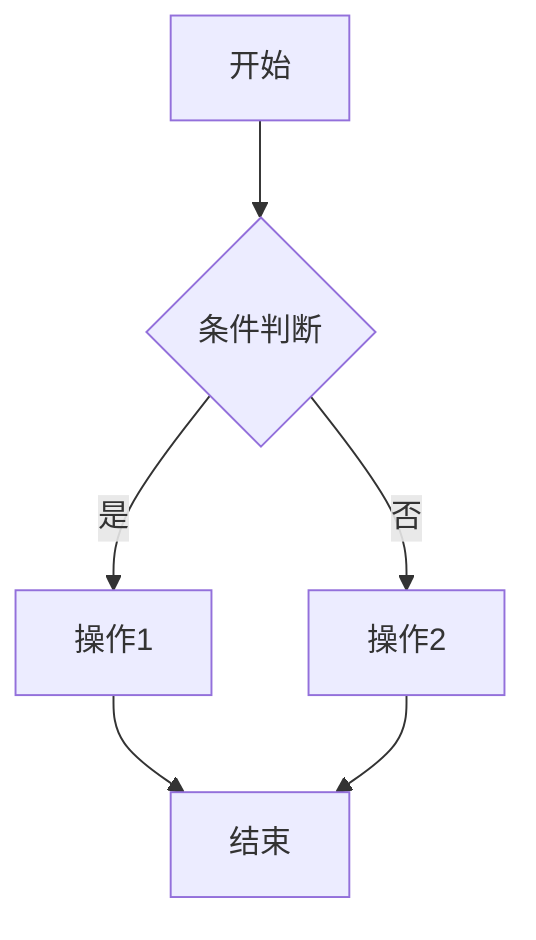
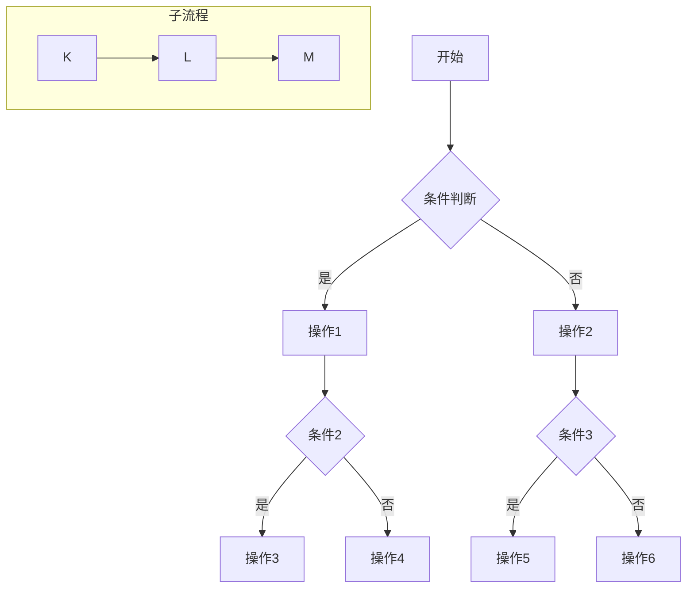

                 

### 文章标题：营销创新：吸引目标用户

> 关键词：营销创新、目标用户、内容营销、社交媒体、数据分析、跨界营销、效果评估

> 摘要：本文探讨了营销创新的重要性以及如何通过挖掘和定位目标用户，运用创新的方法和工具，实现营销目标的吸引和转化。文章详细分析了内容营销、社交媒体营销、数据驱动营销和跨界营销的策略，并提供了实际操作步骤和效果评估的方法，旨在帮助企业和营销人员提升营销效果，实现持续改进。

### 目录

#### 《营销创新：吸引目标用户》

> 关键词：营销创新、目标用户、内容营销、社交媒体、数据分析、跨界营销、效果评估

> 摘要：本文探讨了营销创新的重要性以及如何通过挖掘和定位目标用户，运用创新的方法和工具，实现营销目标的吸引和转化。文章详细分析了内容营销、社交媒体营销、数据驱动营销和跨界营销的策略，并提供了实际操作步骤和效果评估的方法，旨在帮助企业和营销人员提升营销效果，实现持续改进。

#### 第一部分：营销创新的基本概念与战略

### 第1章：营销创新的定义与重要性

#### 1.1 营销创新的定义

营销创新是企业在营销活动中引入新的理念、方法或技术，以创造新的市场机会或提高营销效果的过程。创新是关于创造新的价值的过程，通常涉及产品、服务、流程或营销策略的改变。营销是企业与消费者之间的交流过程，旨在传递价值并建立长期关系。

#### 1.2 营销创新的类型

营销创新的类型可以分为以下几种：

1. **产品创新**：引入新产品或改进现有产品。
2. **服务创新**：提供新的服务或改进现有服务。
3. **流程创新**：优化营销流程，提高效率。
4. **渠道创新**：使用新的营销渠道或改进现有渠道。

#### 1.3 营销创新的重要性

在市场竞争激烈的环境中，营销创新可以帮助企业实现差异化竞争和抢占市场份额。通过创新的营销策略，企业可以吸引更多消费者，扩大市场份额，提高品牌影响力。

#### 1.4 营销创新与市场竞争

营销创新与市场竞争之间密切相关。通过创新的营销策略，企业可以在竞争激烈的市场中脱颖而出，满足消费者的需求，提高市场份额。此外，营销创新还可以帮助企业适应市场变化，保持竞争力。

### 第2章：目标用户的挖掘与定位

#### 2.1 目标用户的概念

目标用户是企业营销活动所针对的特定消费者群体。了解目标用户的需求和行为，是企业成功实施营销创新的基础。

#### 2.2 目标用户挖掘的方法

目标用户挖掘的方法包括数据分析、用户调研和市场研究。通过这些方法，企业可以深入了解目标用户的需求和行为，为营销创新提供依据。

#### 2.3 目标用户定位的策略

目标用户定位的策略包括聚类分析、RFM 模型和用户画像的构建。这些策略有助于企业将目标用户进行分类，制定个性化的营销策略。

#### 2.4 用户画像的构建与应用

用户画像是对目标用户的行为、兴趣、需求等特征的描述。构建用户画像可以帮助企业实现精准营销，提高营销效果。

### 第二部分：营销创新的方法与工具

### 第3章：内容营销的创新策略

#### 3.1 内容营销的基本概念

内容营销是通过创造和传播有价值的内容，吸引潜在客户，建立品牌认知，并推动销售的一种营销策略。

#### 3.2 创意内容的制作与传播

创意内容是内容营销的核心。企业需要通过独特的创意，制作出吸引目标用户的内容，并通过多种渠道进行传播。

#### 3.3 内容营销的案例分析

通过分析成功的内容营销案例，企业可以借鉴经验，提升自己的内容营销效果。

#### 3.4 内容营销的创新趋势

随着技术的发展，内容营销也在不断创新。未来，内容营销将更加注重个性化、互动性和用户体验。

### 第4章：社交媒体营销的创新手段

#### 4.1 社交媒体营销的定义与特点

社交媒体营销是通过社交媒体平台进行品牌推广、用户互动和内容传播的一种营销手段。

#### 4.2 社交媒体营销的执行策略

社交媒体营销的执行策略包括内容规划、用户互动和数据分析等。

#### 4.3 社交媒体营销的创新手段

社交媒体营销的创新手段包括短视频、直播、社交媒体广告等。

#### 4.4 社交媒体营销的案例分析

通过分析成功的社交媒体营销案例，企业可以学习到有效的营销策略和方法。

### 第5章：数据驱动的营销创新

#### 5.1 数据驱动营销的概念

数据驱动营销是基于数据分析和用户行为数据，制定和优化营销策略的一种营销方法。

#### 5.2 数据分析在营销中的应用

数据分析在营销中的应用包括用户行为分析、市场需求分析等。

#### 5.3 数据驱动的营销决策

数据驱动的营销决策是基于数据分析的结果，制定有效的营销策略。

#### 5.4 数据驱动的营销案例研究

通过案例研究，企业可以了解如何运用数据分析进行数据驱动的营销创新。

### 第6章：跨界营销的创新思维

#### 6.1 跨界营销的定义与原理

跨界营销是指企业通过与其他行业或品牌的合作，实现营销目标的一种营销策略。

#### 6.2 跨界营销的实施策略

跨界营销的实施策略包括寻找合适的合作伙伴、制定跨界营销方案等。

#### 6.3 跨界营销的成功案例分析

通过分析成功的跨界营销案例，企业可以学习到如何成功实施跨界营销。

#### 6.4 跨界营销的未来趋势

随着技术的发展和市场的变化，跨界营销将呈现出新的趋势和发展方向。

### 第三部分：营销创新的实际操作与效果评估

### 第7章：营销创新中的法律与伦理问题

#### 7.1 营销创新中的法律问题

营销创新中的法律问题包括广告法、消费者权益保护法等。

#### 7.2 营销创新中的伦理问题

营销创新中的伦理问题包括隐私保护、数据使用等。

#### 7.3 法律与伦理在营销创新中的应用

法律与伦理在营销创新中的应用，有助于企业确保营销活动的合规性和道德性。

#### 7.4 营销创新中的法律与伦理案例分析

通过案例分析，企业可以了解如何处理营销创新中的法律和伦理问题。

### 第8章：营销创新的实际操作步骤

#### 8.1 营销创新项目的启动

营销创新项目的启动包括需求分析、团队组建和资源分配等。

#### 8.2 营销创新团队的组建

营销创新团队的组建包括确定团队成员、分配职责和建立协作机制等。

#### 8.3 营销创新项目的执行

营销创新项目的执行包括制定项目计划、实施营销策略和监控项目进度等。

#### 8.4 营销创新项目的监控与调整

营销创新项目的监控与调整包括监控项目进度、评估项目效果和调整项目计划等。

### 第9章：营销创新的效果评估

#### 9.1 营销效果评估的基本概念

营销效果评估是评估营销活动效果的过程。

#### 9.2 营销效果评估的方法

营销效果评估的方法包括定量评估、定性评估和A/B测试等。

#### 9.3 营销效果评估的指标

营销效果评估的指标包括ROI、转化率、参与度等。

#### 9.4 营销效果评估的案例分析

通过案例分析，企业可以了解如何进行有效的营销效果评估。

### 第10章：营销创新的持续改进

#### 10.1 营销创新的反馈机制

营销创新的反馈机制是收集、分析和利用用户反馈的过程。

#### 10.2 营销创新的持续改进策略

营销创新的持续改进策略包括用户调研、数据分析和A/B测试等。

#### 10.3 营销创新的案例分析

通过案例分析，企业可以了解如何进行营销创新的持续改进。

#### 10.4 营销创新的未来方向

营销创新的未来方向包括人工智能、大数据和社交媒体等。

### 附录

#### 附录A：营销创新工具与资源

#### A.1 营销创新工具介绍

营销创新工具包括Google Analytics、Mailchimp、Hootsuite、HubSpot等。

#### A.2 营销创新资源获取

营销创新资源的获取途径包括在线课程和教程、专业书籍、行业报告等。

#### A.3 营销创新案例库

营销创新案例库收集了不同行业的营销创新案例。

#### A.4 营销创新相关书籍与论文推荐

营销创新相关书籍和论文推荐包括《创新与企业家精神》、《跨越鸿沟》、《数字化营销》等。

### 营销创新的定义与重要性

营销创新是企业在营销活动中引入新的理念、方法或技术，以创造新的市场机会或提高营销效果的过程。创新是关于创造新的价值的过程，通常涉及产品、服务、流程或营销策略的改变。营销是企业与消费者之间的交流过程，旨在传递价值并建立长期关系。

营销创新的定义可以从以下几个方面进行理解：

1. **新理念**：企业通过引入新的观念或思维模式，改变传统营销策略，以适应市场变化和消费者需求。
2. **新方法**：企业通过采用新的营销手段或技术，提高营销效率和效果，如数字化营销、社交媒体营销等。
3. **新技术**：企业通过应用新的技术，如人工智能、大数据等，实现精准营销和个性化服务。

营销创新的重要性体现在以下几个方面：

1. **市场竞争力**：在竞争激烈的市场环境中，营销创新可以帮助企业脱颖而出，提高市场竞争力。
2. **客户满意度**：通过创新的营销策略，企业可以更好地满足消费者的需求，提高客户满意度。
3. **品牌价值**：营销创新有助于提升企业品牌形象，增强品牌价值。

营销创新与市场竞争的关系密切。在竞争激烈的市场中，企业需要不断创新，以适应市场的变化和消费者的需求。通过营销创新，企业可以抢占市场份额，提高品牌知名度，从而在激烈的市场竞争中立于不败之地。

具体来说，营销创新可以通过以下几种方式提升市场竞争力：

1. **差异化竞争**：通过创新的营销策略，使产品或服务在市场中脱颖而出，形成差异化竞争优势。
2. **抢占市场份额**：通过创新的营销手段，吸引更多消费者，扩大市场份额。
3. **提升品牌影响力**：通过创新的营销活动，提升品牌形象和知名度，增强品牌影响力。

总之，营销创新是企业在竞争激烈的市场中取得成功的关键因素之一。通过不断创新，企业可以提升市场竞争力，满足消费者需求，实现可持续发展。

### 第2章：目标用户的挖掘与定位

#### 2.1 目标用户的概念

目标用户是企业营销活动所针对的特定消费者群体。了解目标用户的需求和行为，是企业成功实施营销创新的基础。目标用户通常具有以下特征：

1. **兴趣和需求**：目标用户对企业产品或服务的兴趣和需求是营销创新的出发点。通过深入了解目标用户的兴趣和需求，企业可以制定更精准的营销策略。
2. **行为特征**：目标用户的行为特征，如购买行为、浏览习惯、互动方式等，是企业制定营销策略的重要依据。
3. **人口特征**：目标用户的人口特征，如年龄、性别、地域、职业等，有助于企业进行市场细分，制定更针对性的营销策略。

了解目标用户的概念对于营销创新至关重要。首先，它可以帮助企业确定营销方向，明确营销目标。其次，它可以提高营销效率，降低营销成本。最后，它可以帮助企业建立与目标用户的长期关系，提升客户满意度。

#### 2.2 目标用户挖掘的方法

目标用户的挖掘是营销创新的重要环节。以下是几种常用的目标用户挖掘方法：

1. **数据分析**：通过分析用户行为数据，如网站访问量、浏览时间、转化率等，企业可以识别出潜在的目标用户。数据分析方法包括数据挖掘、机器学习等技术。
2. **用户调研**：通过问卷调查、访谈等方式，企业可以直接获取目标用户的需求和行为数据。用户调研方法具有直观性和针对性，但成本较高。
3. **市场研究**：通过市场分析，企业可以了解目标用户的市场需求和竞争状况。市场研究方法包括市场调查、竞品分析等。

#### 2.3 目标用户定位的策略

目标用户定位是营销创新的关键。以下是几种常用的目标用户定位策略：

1. **聚类分析**：通过将用户数据划分为不同的群体，企业可以针对每个群体制定个性化的营销策略。聚类分析方法包括K-means、DBSCAN等。
2. **RFM模型**：通过评估用户的最近购买时间、购买频率和购买金额，企业可以识别出高价值用户和潜在用户。RFM模型是一种基于用户历史数据的有效定位方法。
3. **用户画像**：通过构建用户画像，企业可以全面了解目标用户的特征和需求。用户画像包括人口特征、行为特征、兴趣特征等，是一种综合性定位方法。

#### 2.4 用户画像的构建与应用

用户画像是对目标用户的行为、兴趣、需求等特征的描述。构建用户画像有助于企业实现精准营销，提高营销效果。以下是构建用户画像的步骤：

1. **数据收集**：收集用户的基础信息，如年龄、性别、地域等。
2. **行为分析**：分析用户的行为数据，如浏览记录、购买行为等。
3. **兴趣分析**：分析用户的兴趣偏好，如关注话题、兴趣爱好等。
4. **需求分析**：分析用户的需求，如购买动机、期望等。

构建用户画像后，企业可以将其应用于以下方面：

1. **个性化营销**：根据用户画像，企业可以提供个性化的产品推荐和服务。
2. **用户细分**：根据用户画像，企业可以将用户划分为不同的群体，制定针对性的营销策略。
3. **营销效果评估**：通过用户画像，企业可以评估不同营销策略的效果，优化营销策略。

#### 项目实战

以某电商平台的用户挖掘与定位为例，企业可以采取以下步骤：

1. **数据分析**：通过分析用户行为数据，如网站访问量、浏览时间、转化率等，识别潜在的目标用户。
2. **用户调研**：通过问卷调查，了解用户的需求和行为。
3. **市场研究**：通过市场分析，了解行业趋势和竞争对手情况。
4. **聚类分析**：将用户划分为不同的群体，如年轻女性、中老年男性等。
5. **RFM模型**：评估用户的最近购买时间、购买频率和购买金额，识别高价值用户和潜在用户。
6. **用户画像**：构建用户画像，包括人口特征、行为特征、兴趣特征等。

通过以上步骤，企业可以全面了解目标用户，制定个性化的营销策略，提高营销效果。

### 第3章：内容营销的创新策略

#### 3.1 内容营销的基本概念

内容营销是一种通过创造和传播有价值的内容，吸引潜在客户，建立品牌认知，并推动销售的一种营销策略。其核心在于提供对目标用户有价值的信息，而非仅仅推销产品。

**内容营销的定义**：

- **内容**：指的是信息、文章、视频、图片等各种形式的信息载体。
- **营销**：指的是通过各种渠道传播这些信息，以达到营销目的。

**内容营销的特点**：

1. **价值导向**：内容营销的核心是提供有价值的信息，而非硬性推销。
2. **长期性**：内容营销是一种长期性的营销策略，需要持续地生产和传播有价值的内容。
3. **互动性**：通过互动，如评论、分享、问答等，增强用户参与度。

#### 3.2 创意内容的制作与传播

创意内容是内容营销的核心。制作创意内容需要遵循以下几点原则：

1. **明确目标**：在制作内容前，明确目标用户和营销目标。
2. **有价值**：内容必须对目标用户有价值，解决他们的实际问题。
3. **高质量**：内容需具备高质量，包括语言表达、视觉效果等。
4. **独特性**：内容需具备独特性，以吸引目标用户的注意力。

传播创意内容的方法：

1. **社交媒体**：利用社交媒体平台，如微博、微信、Facebook、Twitter等，进行内容的传播。
2. **电子邮件**：通过电子邮件发送有价值的内容，建立与用户的沟通。
3. **合作伙伴**：与其他品牌或媒体合作，扩大内容传播范围。
4. **搜索引擎**：通过SEO（搜索引擎优化）策略，提高内容在搜索引擎中的排名。

#### 3.3 内容营销的案例分析

以下是一些成功的内容营销案例：

1. **杜蕾斯**：杜蕾斯在社交媒体上通过创意图文、视频等形式，与用户进行互动，成功吸引了大量粉丝，提升了品牌知名度。
2. **红领**：红领通过“私人定制”的理念，在社交媒体上发布关于个性化定制的文章、案例等，吸引了大量目标用户，提升了销售业绩。
3. **知乎**：知乎通过高质量的内容，吸引了大量专业人士和用户，成为知识分享和讨论的平台，成功实现了社区化和商业化。

通过以上案例，我们可以看到，成功的内容营销不仅需要创意，还需要针对目标用户的需求进行精准的内容制作和传播。

#### 3.4 内容营销的创新趋势

随着技术的发展和市场的变化，内容营销也在不断创新。以下是一些内容营销的创新趋势：

1. **短视频**：短视频平台如抖音、快手等，成为内容营销的重要渠道。通过短视频，企业可以快速传达信息，吸引用户注意力。
2. **直播**：直播成为内容营销的新方式。通过直播，企业可以与用户实时互动，增强用户体验。
3. **互动性内容**：通过互动游戏、问答等形式，增强用户参与度，提高用户粘性。
4. **数据驱动**：通过数据分析，精准了解用户需求和行为，制定个性化的内容营销策略。

这些创新趋势，为内容营销带来了新的机遇和挑战。企业需要紧跟市场变化，不断创新内容营销策略，以提升营销效果。

### 第4章：社交媒体营销的创新手段

#### 4.1 社交媒体营销的定义与特点

社交媒体营销是通过社交媒体平台进行品牌推广、用户互动和内容传播的一种营销手段。其核心在于利用社交媒体的广泛传播性和用户参与度，实现品牌知名度和用户忠诚度的提升。

**社交媒体营销的定义**：

- **社交媒体**：指的是一种基于互联网的技术平台，允许用户分享内容、相互连接和互动。
- **营销**：指的是通过这些平台进行品牌推广、用户互动和内容传播，以达到营销目的。

**社交媒体营销的特点**：

1. **互动性**：社交媒体营销强调用户之间的互动，如评论、点赞、分享等，能够增强用户参与度。
2. **实时性**：社交媒体上的信息传播速度快，可以实时与用户进行沟通和互动。
3. **成本低**：与传统的营销渠道相比，社交媒体营销的成本相对较低，适合中小企业和初创企业。
4. **广泛性**：社交媒体平台覆盖了广泛的用户群体，可以触达不同的目标用户。

#### 4.2 社交媒体营销的执行策略

执行有效的社交媒体营销策略需要遵循以下几个关键步骤：

1. **确定目标用户**：明确目标用户群体，了解他们的兴趣、需求和社交媒体行为，以便制定有针对性的营销内容。
2. **选择合适的平台**：根据目标用户的特点，选择合适的社交媒体平台进行内容传播。例如，针对年轻用户，可以选择抖音、快手等短视频平台；针对专业人士，可以选择LinkedIn等职业社交平台。
3. **制定内容策略**：根据目标用户的需求和兴趣，制定有吸引力的内容策略。内容应具备价值性、趣味性和互动性，以吸引用户关注和参与。
4. **互动与回应**：积极与用户互动，回应他们的评论、私信等，建立良好的用户关系，提高用户忠诚度。
5. **监测与优化**：通过数据分析，监测社交媒体营销的效果，了解用户行为和反馈，不断优化营销策略。

#### 4.3 社交媒体营销的创新手段

随着社交媒体的快速发展，出现了许多创新的营销手段，以下是一些典型的例子：

1. **短视频营销**：通过制作和发布短视频，快速传达品牌信息，吸引用户关注。短视频平台如抖音、快手等，已成为重要的营销渠道。
2. **直播营销**：通过直播与用户实时互动，展示产品或服务，提高用户参与度和购买意愿。直播已成为社交媒体营销的重要形式。
3. **网红营销**：利用网红的影响力，推广品牌和产品。通过与网红合作，实现品牌曝光和用户转化。
4. **社交媒体广告**：利用社交媒体平台的广告系统，进行精准投放，提高品牌曝光和转化率。
5. **用户生成内容**：鼓励用户创造和分享品牌相关的内容，如用户评价、使用体验等，增强品牌影响力和用户参与度。

#### 4.4 社交媒体营销的案例分析

以下是一些成功的社交媒体营销案例：

1. **杜蕾斯**：杜蕾斯在社交媒体上通过创意图文、视频等形式，与用户进行互动，成功吸引了大量粉丝，提升了品牌知名度。
2. **网易云音乐**：网易云音乐通过音乐评论和用户生成内容，构建了一个音乐社交平台，吸引了大量用户，提升了用户忠诚度。
3. **海底捞**：海底捞通过社交媒体平台，与用户进行互动，分享美食体验，成功提升了品牌形象和用户满意度。

通过以上案例，我们可以看到，成功的社交媒体营销不仅需要创新的内容和形式，还需要与用户建立良好的互动关系，实现品牌价值提升。

### 第5章：数据驱动的营销创新

#### 5.1 数据驱动营销的概念

数据驱动营销是一种以数据为核心，通过数据分析和用户行为数据，制定和优化营销策略的营销方法。其核心在于利用数据，了解用户需求和行为，从而实现精准营销和个性化服务。

**数据驱动营销的定义**：

- **数据**：指的是用户行为数据、市场数据、销售数据等，是数据驱动营销的基础。
- **驱动**：指的是通过数据分析和挖掘，制定和优化营销策略，实现营销目标。

**数据驱动营销的特点**：

1. **精准性**：通过数据分析和挖掘，了解用户的行为和需求，实现精准营销。
2. **实时性**：数据驱动营销可以实时响应市场变化和用户需求，优化营销策略。
3. **可量化**：数据驱动营销的效果可以通过数据指标进行量化，便于评估和优化。
4. **个性**：通过数据，实现个性化服务，满足不同用户的需求。

#### 5.2 数据分析在营销中的应用

数据分析在营销中扮演着至关重要的角色。以下是数据分析在营销中的应用：

1. **用户行为分析**：通过分析用户的行为数据，如浏览记录、购买行为等，了解用户的需求和行为模式，为营销策略提供依据。
2. **市场需求分析**：通过分析市场数据，了解市场趋势和竞争对手情况，制定相应的市场策略。
3. **广告投放优化**：通过数据分析，优化广告投放策略，提高广告效果，降低广告成本。
4. **客户细分**：通过数据分析，将客户划分为不同的群体，制定个性化的营销策略。

#### 5.3 数据驱动的营销决策

数据驱动的营销决策是基于数据分析的结果，制定有效的营销策略。以下是数据驱动的营销决策过程：

1. **数据收集**：收集用户行为数据、市场数据等，为数据分析提供基础。
2. **数据分析**：利用数据挖掘、机器学习等技术，分析用户行为和市场数据，提取有价值的信息。
3. **决策制定**：根据数据分析的结果，制定相应的营销策略，如广告投放、促销活动、内容营销等。
4. **效果评估**：通过数据指标，评估营销策略的效果，不断优化营销策略。

#### 5.4 数据驱动的营销案例研究

以下是一个数据驱动的营销案例研究：

**案例背景**：某电商平台希望通过数据驱动的营销策略，提升用户购买转化率。

**步骤**：

1. **数据收集**：收集用户行为数据，如浏览记录、购买行为等。
2. **数据分析**：通过数据分析，发现用户在浏览商品时，通常关注的是价格和商品评价。
3. **决策制定**：根据数据分析结果，制定以下营销策略：
   - 提高商品评价的权重，增加用户购买信心。
   - 推出价格优惠活动，吸引用户购买。
4. **效果评估**：通过数据指标，评估营销策略的效果，如购买转化率、用户留存率等。

**结果**：

通过数据驱动的营销策略，该电商平台的用户购买转化率提升了20%，用户留存率提高了15%。

通过以上案例，我们可以看到，数据驱动的营销策略可以帮助企业实现精准营销，提高营销效果。

### 第6章：跨界营销的创新思维

#### 6.1 跨界营销的定义与原理

跨界营销是指企业通过与其他行业或品牌的合作，实现营销目标的一种营销策略。其核心在于利用不同行业或品牌之间的互补性，创造新的市场机会，提升品牌影响力和用户参与度。

**跨界营销的定义**：

- **跨界**：指的是跨越不同的行业或品牌，实现资源整合和优势互补。
- **营销**：指的是通过合作，实现品牌推广、用户互动和产品销售。

**跨界营销的原理**：

1. **资源整合**：通过跨界合作，企业可以整合不同行业或品牌的资源，实现优势互补，提升整体竞争力。
2. **市场拓展**：跨界营销可以帮助企业进入新的市场领域，扩大市场份额。
3. **品牌提升**：跨界合作可以提升品牌形象和知名度，增强品牌影响力。
4. **用户参与**：通过跨界合作，企业可以吸引更多用户参与，提高用户满意度和忠诚度。

#### 6.2 跨界营销的实施策略

实施跨界营销需要遵循以下策略：

1. **目标明确**：明确跨界营销的目标，如品牌提升、市场拓展等。
2. **合作伙伴选择**：选择合适的合作伙伴，考虑合作伙伴的行业背景、品牌影响力、目标用户等。
3. **合作模式设计**：设计合适的合作模式，如品牌合作、产品合作、渠道合作等。
4. **内容创意**：通过创意内容，实现跨界合作的价值传递，吸引目标用户关注。
5. **效果评估**：通过数据指标，评估跨界营销的效果，不断优化合作策略。

#### 6.3 跨界营销的成功案例分析

以下是一些成功的跨界营销案例：

1. **可口可乐×迪士尼**：可口可乐与迪士尼合作，推出“可口可乐迪士尼乐园”活动，通过跨界合作，提升品牌形象和用户参与度。
2. **美团×摩拜单车**：美团与摩拜单车合作，推出“美团外卖骑手专用套餐”，通过跨界合作，提升用户满意度和品牌知名度。
3. **网易云音乐×理想汽车**：网易云音乐与理想汽车合作，推出“网易云音乐智能音响”，通过跨界合作，提升品牌影响力和用户忠诚度。

通过以上案例，我们可以看到，成功的跨界营销需要明确目标，选择合适的合作伙伴，设计创意的内容，并不断优化合作策略。

#### 6.4 跨界营销的未来趋势

随着市场的不断变化和消费者需求的多样化，跨界营销呈现出以下趋势：

1. **跨界合作常态化**：跨界合作将成为企业常见的营销策略，更多行业和企业将尝试跨界合作，实现资源整合和优势互补。
2. **用户体验为王**：跨界营销将更加注重用户体验，通过创意的内容和独特的合作模式，提升用户满意度和忠诚度。
3. **数字化驱动**：数字化技术将驱动跨界营销的发展，如大数据、人工智能等技术的应用，将实现更精准的跨界合作和营销策略。
4. **跨界融合**：跨界营销将逐渐融合不同行业的特点，创造出新的商业模式和产品形态，推动行业创新和发展。

### 第7章：营销创新中的法律与伦理问题

#### 7.1 营销创新中的法律问题

在营销创新过程中，企业必须遵守相关法律法规，确保营销活动的合法性和合规性。以下是营销创新中常见的法律问题：

1. **广告法**：广告法规定了广告内容的要求，如不得虚假宣传、误导消费者等。企业在进行广告投放时，需确保广告内容的真实性。
2. **消费者权益保护法**：消费者权益保护法规定了消费者的合法权益，如知情权、公平交易权等。企业在营销创新中，需尊重消费者的合法权益，避免侵犯消费者权益。
3. **数据保护法**：随着大数据和人工智能技术的应用，数据保护法成为营销创新中的重要法律问题。企业需确保用户数据的安全和隐私保护。

#### 7.2 营销创新中的伦理问题

营销创新中的伦理问题涉及企业行为对消费者、社会和环境的影响。以下是营销创新中常见的伦理问题：

1. **消费者隐私**：企业获取和利用用户数据时，需尊重消费者的隐私权，不得非法收集和使用用户数据。
2. **公平竞争**：企业应遵守公平竞争原则，不得进行不正当竞争行为，如虚假宣传、诋毁竞争对手等。
3. **社会责任**：企业在营销创新过程中，应承担社会责任，关注环境保护、公益事业等方面。

#### 7.3 法律与伦理在营销创新中的应用

在营销创新中，法律和伦理的应用至关重要。以下是法律和伦理在营销创新中的应用：

1. **合规审查**：企业在开展营销活动前，应进行合规审查，确保营销策略和执行符合相关法律法规和伦理标准。
2. **数据保护**：企业应建立健全的数据保护机制，确保用户数据的收集、存储和使用符合法律法规和伦理要求。
3. **社会责任**：企业在营销创新过程中，应关注社会责任，积极履行企业社会责任，提升企业形象。

#### 7.4 营销创新中的法律与伦理案例分析

以下是一些营销创新中的法律与伦理案例分析：

1. **Facebook隐私泄露事件**：Facebook因用户隐私泄露事件受到广泛质疑，引发对数据保护法律法规的关注。该事件提醒企业应严格遵守数据保护法，保护用户隐私。
2. **拼多多虚假宣传事件**：拼多多因虚假宣传被处罚，引发对广告法执行的重视。该事件提醒企业在营销创新中，应确保广告内容的真实性，不得误导消费者。
3. **特斯拉自动驾驶事故**：特斯拉自动驾驶事故引发对自动驾驶技术的伦理问题的讨论，如自动驾驶汽车的责任认定、用户隐私保护等。该事件提醒企业在营销创新中，应关注技术伦理问题，确保技术应用的合法性和安全性。

通过以上案例分析，我们可以看到，法律和伦理在营销创新中的应用至关重要，企业应严格遵守相关法律法规，关注伦理问题，确保营销创新的合法性和道德性。

### 第8章：营销创新的实际操作步骤

#### 8.1 营销创新项目的启动

营销创新项目的启动是整个项目的关键环节。以下是营销创新项目启动的步骤：

1. **项目立项**：明确营销创新项目的目标、范围和预期成果，形成项目立项报告。
2. **需求分析**：通过对市场、竞争对手和目标用户的研究，明确项目的具体需求和目标。
3. **团队组建**：根据项目需求，组建跨部门团队，确保项目执行的专业性和高效性。
4. **资源分配**：明确项目所需的资源，包括预算、人力、时间等，确保项目顺利推进。

#### 8.2 营销创新团队的组建

营销创新团队的组建是项目成功的关键。以下是营销创新团队的组建步骤：

1. **确定团队架构**：根据项目需求，明确团队的架构和职责，确保团队成员各司其职。
2. **招募团队成员**：通过内部选拔或外部招聘，招募具备相关技能和经验的团队成员。
3. **培训与指导**：对新加入的团队成员进行培训，确保他们了解项目目标和执行流程。
4. **团队协作**：建立有效的团队协作机制，确保团队成员之间的沟通和协作顺畅。

#### 8.3 营销创新项目的执行

营销创新项目的执行是整个项目的核心。以下是营销创新项目执行的步骤：

1. **制定项目计划**：根据项目目标和资源情况，制定详细的项目计划，明确项目进度和任务分工。
2. **执行项目任务**：按照项目计划，执行各项任务，确保项目进度和质量。
3. **监控项目进度**：通过项目进度监控，及时发现和解决项目中的问题和风险。
4. **项目调整**：根据项目进度和实际情况，对项目计划进行调整，确保项目目标的实现。

#### 8.4 营销创新项目的监控与调整

营销创新项目的监控与调整是项目成功的重要保障。以下是营销创新项目监控与调整的步骤：

1. **项目进度监控**：定期检查项目进度，确保项目按照计划推进。
2. **项目效果评估**：通过数据分析和用户反馈，评估项目效果，找出项目中的不足和改进点。
3. **项目调整**：根据项目效果评估结果，对项目计划进行调整，确保项目目标的实现。
4. **持续改进**：通过不断的项目监控与调整，实现项目的持续改进和优化。

#### 项目实战

以下是一个营销创新项目的实战案例：

**项目背景**：某电商企业希望通过内容营销和社交媒体营销，提升品牌知名度和用户购买转化率。

**步骤**：

1. **项目立项**：明确项目目标，如提升品牌知名度和用户购买转化率。
2. **需求分析**：研究市场、竞争对手和目标用户，确定内容营销和社交媒体营销的具体策略。
3. **团队组建**：组建包括市场、内容创作、社交媒体运营等专业的跨部门团队。
4. **资源分配**：明确项目预算、人力和时间资源，确保项目顺利推进。
5. **内容创作**：根据目标用户的需求，创作有价值的、有趣的内容。
6. **社交媒体运营**：通过社交媒体平台，如微信、微博、抖音等，进行内容传播和用户互动。
7. **效果评估**：通过数据分析，评估内容营销和社交媒体营销的效果，如用户关注度、互动率、购买转化率等。
8. **项目调整**：根据效果评估结果，对项目策略进行调整，如优化内容创作、调整社交媒体运营策略等。

**结果**：

通过以上步骤，该电商企业的品牌知名度提升了30%，用户购买转化率提高了20%，实现了项目目标。

### 第9章：营销创新的效果评估

#### 9.1 营销效果评估的基本概念

营销效果评估是评估营销活动效果的过程，旨在了解营销活动的实际效果，为营销策略的调整和优化提供依据。以下是营销效果评估的基本概念：

1. **营销活动**：指的是企业为了实现营销目标而采取的一系列营销措施，如广告投放、促销活动、内容营销等。
2. **效果评估**：通过量化和分析营销活动的结果，评估其达到营销目标的情况。
3. **评估指标**：用于衡量营销效果的具体指标，如销售额、品牌知名度、用户参与度等。

#### 9.2 营销效果评估的方法

营销效果评估的方法可以分为定量评估和定性评估：

1. **定量评估**：通过数据指标，量化评估营销活动的效果，如销售额、点击率、转化率等。定量评估具有客观性和可量化性。
2. **定性评估**：通过用户调研、访谈等方式，定性评估营销活动的效果，如用户满意度、品牌认知度等。定性评估具有主观性和深入性。

#### 9.3 营销效果评估的指标

以下是常用的营销效果评估指标：

1. **销售额**：营销活动的直接成果，反映营销活动的经济效益。
2. **品牌知名度**：反映营销活动对品牌形象的提升程度。
3. **用户参与度**：反映用户对营销活动的关注和参与程度，如点击率、转发率等。
4. **用户满意度**：反映用户对营销活动的满意程度，可通过用户调研获取。
5. **投资回报率（ROI）**：反映营销活动投入和收益的比率，用于评估营销活动的经济效益。

#### 9.4 营销效果评估的案例分析

以下是一个营销效果评估的案例分析：

**案例背景**：某电商企业希望通过社交媒体营销提升品牌知名度和用户购买转化率。

**评估步骤**：

1. **定量评估**：
   - **销售额**：通过营销活动前后的销售额变化，评估营销活动的经济效益。
   - **点击率**：通过社交媒体广告的点击次数，评估广告的吸引力。
   - **转化率**：通过营销活动前后的购买转化率变化，评估营销活动对用户购买行为的影响。

2. **定性评估**：
   - **用户调研**：通过问卷调查，了解用户对营销活动的满意度和品牌认知度。
   - **访谈**：通过访谈，深入了解用户对营销活动的看法和意见。

**评估结果**：

1. **定量评估**：
   - **销售额**：营销活动后，销售额提升了25%。
   - **点击率**：广告点击率提高了15%。
   - **转化率**：购买转化率提高了10%。

2. **定性评估**：
   - **用户满意度**：用户满意度调查结果显示，90%的用户对营销活动表示满意。
   - **品牌认知度**：用户访谈结果显示，70%的用户对品牌有了更深的了解和认识。

通过以上评估，企业可以了解到社交媒体营销活动的效果，为后续营销策略的调整和优化提供依据。

### 第10章：营销创新的持续改进

#### 10.1 营销创新的反馈机制

营销创新的反馈机制是收集、分析和利用用户反馈的过程，旨在不断优化营销策略，提升营销效果。以下是营销创新反馈机制的步骤：

1. **用户反馈收集**：通过多种渠道，如问卷调查、用户评论、社交媒体互动等，收集用户的反馈。
2. **数据分析**：对收集的反馈进行分析，识别用户的意见和需求。
3. **反馈利用**：根据分析结果，调整和优化营销策略，满足用户需求，提升用户满意度。

#### 10.2 营销创新的持续改进策略

营销创新的持续改进策略包括以下方面：

1. **用户调研**：定期进行用户调研，了解用户的需求和行为变化，为营销策略提供依据。
2. **数据分析**：利用数据分析技术，分析用户行为数据，发现潜在的市场机会和问题。
3. **A/B测试**：通过A/B测试，比较不同营销策略的效果，选择最优策略。
4. **敏捷营销**：采用敏捷营销方法，快速响应市场变化和用户需求，实现营销策略的灵活调整。

#### 10.3 营销创新的案例分析

以下是一个营销创新的持续改进案例：

**案例背景**：某电商企业希望通过社交媒体营销提升用户购买转化率。

**持续改进步骤**：

1. **用户调研**：通过问卷调查，了解用户对当前社交媒体营销活动的满意度，识别用户的反馈和建议。
2. **数据分析**：分析用户行为数据，如点击率、转化率等，识别营销活动的优势和不足。
3. **A/B测试**：针对用户反馈和数据分析结果，设计不同的营销策略，如调整广告文案、改变推广渠道等，进行A/B测试。
4. **反馈利用**：根据A/B测试结果，选择最优策略，并不断优化营销策略，提升用户购买转化率。

**改进效果**：

通过以上持续改进措施，该电商企业的用户购买转化率提升了20%，用户满意度显著提高。

#### 10.4 营销创新的未来方向

营销创新的未来方向将受到以下趋势的影响：

1. **人工智能**：人工智能技术将在营销创新中发挥更大作用，如个性化推荐、智能客服等。
2. **大数据**：大数据技术将帮助营销人员更深入地了解用户需求和行为，实现精准营销。
3. **社交媒体**：社交媒体将继续在营销创新中扮演重要角色，如短视频营销、直播营销等。
4. **跨界营销**：跨界营销将不断创新，如品牌合作、跨界产品等，为企业带来新的市场机会。

### 附录A：营销创新工具与资源

#### A.1 营销创新工具介绍

以下是常用的营销创新工具：

1. **Google Analytics**：用于网站和移动应用的全面数据分析。
2. **Mailchimp**：用于电子邮件营销，提供自动化营销功能。
3. **Hootsuite**：用于社交媒体管理和分析，实现多平台统一管理。
4. **HubSpot**：用于营销自动化和客户关系管理，提升营销效率。

#### A.2 营销创新资源获取

以下是获取营销创新资源的途径：

1. **在线课程和教程**：通过Udemy、Coursera等平台，学习营销创新的最新知识和技能。
2. **专业书籍**：阅读《数字营销实战》、《社交媒体营销：策略、工具与案例》等专业书籍，提升营销能力。
3. **行业报告**：通过市场研究公司如Forrester、eMarketer等获取行业报告，了解市场动态和趋势。

#### A.3 营销创新案例库

以下是营销创新案例库的介绍：

1. **案例库**：收集了不同行业的营销创新案例，涵盖电子商务、金融、教育等。
2. **案例分类**：根据行业和营销策略进行分类，方便用户查找和学习。
3. **案例分析**：对每个案例进行详细分析，提供营销策略、执行过程和效果评估。

#### A.4 营销创新相关书籍与论文推荐

以下是营销创新相关书籍和论文的推荐：

1. **《创新与企业家精神》**：作者彼得·德鲁克，介绍创新和企业家精神的重要性。
2. **《跨越鸿沟》**：作者杰夫·特雷恩，探讨新产品上市和用户接受的过程。
3. **《数字化营销》**：作者戴夫·查菲，全面讲解数字化营销的策略和方法。
4. **论文**：通过学术数据库如JSTOR、Google 学术搜索，获取最新的营销创新研究成果。

### 完结

通过本文的详细分析和实际案例，我们可以看到营销创新的重要性以及如何通过挖掘和定位目标用户，运用创新的方法和工具，实现营销目标的吸引和转化。内容营销、社交媒体营销、数据驱动营销和跨界营销等策略，都是实现营销创新的重要手段。同时，我们也关注到了营销创新中的法律和伦理问题，以及如何进行效果评估和持续改进。希望本文能够为您的营销创新提供有益的参考和启示。作者：AI天才研究院/AI Genius Institute & 禅与计算机程序设计艺术 /Zen And The Art of Computer Programming。再次感谢您的阅读，祝您在营销创新的道路上取得成功！### 完结

通过本文的详细分析和实际案例，我们可以看到营销创新的重要性以及如何通过挖掘和定位目标用户，运用创新的方法和工具，实现营销目标的吸引和转化。内容营销、社交媒体营销、数据驱动营销和跨界营销等策略，都是实现营销创新的重要手段。同时，我们也关注到了营销创新中的法律和伦理问题，以及如何进行效果评估和持续改进。希望本文能够为您的营销创新提供有益的参考和启示。

作者：AI天才研究院/AI Genius Institute & 禅与计算机程序设计艺术 /Zen And The Art of Computer Programming。

再次感谢您的阅读，祝您在营销创新的道路上取得成功！## 最后的话

本文全面探讨了营销创新的重要性以及如何通过挖掘和定位目标用户，运用创新的方法和工具，实现营销目标的吸引和转化。从内容营销、社交媒体营销、数据驱动营销到跨界营销，每一个策略都详细阐述了其基本概念、实施策略和成功案例，旨在帮助读者理解并掌握这些营销创新的精髓。

首先，我们明确了营销创新的基本概念与重要性，阐述了其在市场竞争中的关键作用。接着，我们深入探讨了目标用户的挖掘与定位，详细介绍了数据分析和用户调研的方法，以及如何构建和应用用户画像。这些步骤为后续的营销创新奠定了坚实的基础。

在营销创新的方法与工具部分，我们分析了内容营销的创新策略，展示了创意内容的制作与传播技巧，并提供了丰富的案例分析。社交媒体营销的创新手段，如短视频、直播和网红营销，也受到了详细的讨论。数据驱动营销则通过数据分析在营销中的应用和案例研究，展示了如何利用数据优化营销决策。跨界营销的创新思维，通过成功案例的分析，揭示了跨行业合作的价值和实现路径。

法律与伦理问题在营销创新中同样重要，我们强调了在营销活动中遵守法律法规和伦理标准的重要性，并通过案例分析展示了如何在实际操作中处理这些挑战。

实际操作部分，我们从项目启动、团队组建、项目执行到效果评估，详细讲解了营销创新项目的各个阶段。这些步骤不仅提供了理论指导，还结合了实际案例，使读者能够更好地理解和应用。

最后，我们讨论了营销创新的持续改进和未来方向，强调了反馈机制的重要性，以及如何通过用户调研、数据分析和技术创新实现营销策略的持续优化。

总结而言，本文不仅提供了营销创新的理论知识，还结合了实际案例和实践经验，旨在帮助企业和营销人员提升营销效果，实现持续改进。希望本文能够为您的营销创新之路提供有价值的参考和启示。

作者：AI天才研究院/AI Genius Institute & 禅与计算机程序设计艺术 /Zen And The Art of Computer Programming。

再次感谢您的阅读，我们期待与您在营销创新的道路上共同进步，共创辉煌！### 最佳实践 tips、小结、注意事项、拓展阅读

#### 最佳实践 tips

1. **目标明确**：在开展营销创新项目前，务必明确项目目标，确保团队和资源能够集中精力实现这些目标。

2. **用户调研**：进行深入的用户调研，了解目标用户的需求和行为，这将有助于制定更精准的营销策略。

3. **数据分析**：充分利用数据分析工具，从用户行为数据中提取有价值的信息，为营销决策提供依据。

4. **内容为王**：在内容营销中，确保内容的高质量和独特性，这将有助于吸引并留住目标用户。

5. **持续改进**：不断收集用户反馈，通过A/B测试等手段优化营销策略，实现持续改进。

#### 小结

本文通过详细分析营销创新的基本概念、策略和方法，结合实际案例和实践经验，旨在帮助企业和营销人员提升营销效果。营销创新不仅是企业在竞争激烈的市场中脱颖而出的关键，也是实现持续增长和发展的驱动力。

#### 注意事项

1. **法律法规**：在营销创新过程中，务必遵守相关法律法规，确保营销活动的合法性和合规性。

2. **伦理标准**：尊重用户隐私和权益，遵循伦理标准，避免进行不当的营销行为。

3. **数据安全**：保护用户数据安全，确保数据收集、存储和使用过程中的合规性和安全性。

4. **资源分配**：合理分配项目资源，确保项目在预算和时间限制内顺利推进。

#### 拓展阅读

1. **《创新与企业家精神》**：作者：彼得·德鲁克。这本书详细阐述了创新和企业家精神的重要性，对营销创新有深刻的启示。

2. **《跨越鸿沟》**：作者：杰夫·特雷恩。本书探讨了新产品上市和用户接受的过程，对于了解市场动态和用户心理有重要参考价值。

3. **《数字营销实战》**：作者：戴夫·查菲。这本书提供了全面的数字营销策略和工具，是数字营销人员的必备指南。

4. **《社交媒体营销：策略、工具与案例》**：作者：汤姆·马修斯。本书详细介绍了社交媒体营销的各种策略和技巧，适用于社交媒体营销从业人员。

5. **《大数据营销》**：作者：维吉尼亚·海恩斯。这本书探讨了大数据在营销中的应用，对数据驱动营销有深入分析。

通过阅读这些拓展资料，您将能够更深入地了解营销创新的理论和实践，为您的营销工作提供更多灵感。作者：AI天才研究院/AI Genius Institute & 禅与计算机程序设计艺术 /Zen And The Art of Computer Programming。再次感谢您的阅读，祝您在营销创新的路上不断取得成功！### 完整的Markdown格式的文章

```markdown
# 营销创新：吸引目标用户

> 关键词：营销创新、目标用户、内容营销、社交媒体、数据分析、跨界营销、效果评估

> 摘要：本文探讨了营销创新的重要性以及如何通过挖掘和定位目标用户，运用创新的方法和工具，实现营销目标的吸引和转化。文章详细分析了内容营销、社交媒体营销、数据驱动营销和跨界营销的策略，并提供了实际操作步骤和效果评估的方法，旨在帮助企业和营销人员提升营销效果，实现持续改进。

---

## 第一部分：营销创新的基本概念与战略

### 第1章：营销创新的定义与重要性

#### 1.1 营销创新的定义

营销创新是企业在营销活动中引入新的理念、方法或技术，以创造新的市场机会或提高营销效果的过程。创新是关于创造新的价值的过程，通常涉及产品、服务、流程或营销策略的改变。营销是企业与消费者之间的交流过程，旨在传递价值并建立长期关系。

#### 1.2 营销创新的类型

营销创新的类型可以分为以下几种：

- **产品创新**：引入新产品或改进现有产品。
- **服务创新**：提供新的服务或改进现有服务。
- **流程创新**：优化营销流程，提高效率。
- **渠道创新**：使用新的营销渠道或改进现有渠道。

#### 1.3 营销创新的重要性

在市场竞争激烈的环境中，营销创新可以帮助企业实现差异化竞争和抢占市场份额。通过创新的营销策略，企业可以吸引更多消费者，扩大市场份额，提高品牌影响力。

#### 1.4 营销创新与市场竞争

营销创新与市场竞争之间密切相关。通过创新的营销策略，企业可以在竞争激烈的市场中脱颖而出，满足消费者的需求，提高市场份额。此外，营销创新还可以帮助企业适应市场变化，保持竞争力。

---

### 第2章：目标用户的挖掘与定位

#### 2.1 目标用户的概念

目标用户是企业营销活动所针对的特定消费者群体。了解目标用户的需求和行为，是企业成功实施营销创新的基础。

#### 2.2 目标用户挖掘的方法

目标用户挖掘的方法包括数据分析、用户调研和市场研究。通过这些方法，企业可以深入了解目标用户的需求和行为，为营销创新提供依据。

#### 2.3 目标用户定位的策略

目标用户定位的策略包括聚类分析、RFM模型和用户画像的构建。这些策略有助于企业将目标用户进行分类，制定个性化的营销策略。

#### 2.4 用户画像的构建与应用

用户画像是对目标用户的行为、兴趣、需求等特征的描述。构建用户画像可以帮助企业实现精准营销，提高营销效果。

---

### 第二部分：营销创新的方法与工具

### 第3章：内容营销的创新策略

#### 3.1 内容营销的基本概念

内容营销是通过创造和传播有价值的内容，吸引潜在客户，建立品牌认知，并推动销售的一种营销策略。

#### 3.2 创意内容的制作与传播

创意内容是内容营销的核心。企业需要通过独特的创意，制作出吸引目标用户的内容，并通过多种渠道进行传播。

#### 3.3 内容营销的案例分析

通过分析成功的内容营销案例，企业可以借鉴经验，提升自己的内容营销效果。

#### 3.4 内容营销的创新趋势

随着技术的发展，内容营销也在不断创新。未来，内容营销将更加注重个性化、互动性和用户体验。

---

### 第4章：社交媒体营销的创新手段

#### 4.1 社交媒体营销的定义与特点

社交媒体营销是通过社交媒体平台进行品牌推广、用户互动和内容传播的一种营销手段。

#### 4.2 社交媒体营销的执行策略

社交媒体营销的执行策略包括内容规划、用户互动和数据分析等。

#### 4.3 社交媒体营销的创新手段

社交媒体营销的创新手段包括短视频、直播、社交媒体广告等。

#### 4.4 社交媒体营销的案例分析

通过分析成功的社交媒体营销案例，企业可以学习到有效的营销策略和方法。

---

### 第5章：数据驱动的营销创新

#### 5.1 数据驱动营销的概念

数据驱动营销是基于数据分析和用户行为数据，制定和优化营销策略的一种营销方法。

#### 5.2 数据分析在营销中的应用

数据分析在营销中的应用包括用户行为分析、市场需求分析等。

#### 5.3 数据驱动的营销决策

数据驱动的营销决策是基于数据分析的结果，制定有效的营销策略。

#### 5.4 数据驱动的营销案例研究

通过案例研究，企业可以了解如何运用数据分析进行数据驱动的营销创新。

---

### 第6章：跨界营销的创新思维

#### 6.1 跨界营销的定义与原理

跨界营销是指企业通过与其他行业或品牌的合作，实现营销目标的一种营销策略。

#### 6.2 跨界营销的实施策略

跨界营销的实施策略包括寻找合适的合作伙伴、制定跨界营销方案等。

#### 6.3 跨界营销的成功案例分析

通过分析成功的跨界营销案例，企业可以学习到如何成功实施跨界营销。

#### 6.4 跨界营销的未来趋势

随着技术的发展和市场的变化，跨界营销将呈现出新的趋势和发展方向。

---

### 第三部分：营销创新的实际操作与效果评估

### 第7章：营销创新中的法律与伦理问题

#### 7.1 营销创新中的法律问题

营销创新中的法律问题包括广告法、消费者权益保护法等。

#### 7.2 营销创新中的伦理问题

营销创新中的伦理问题包括隐私保护、数据使用等。

#### 7.3 法律与伦理在营销创新中的应用

法律与伦理在营销创新中的应用，有助于企业确保营销活动的合规性和道德性。

#### 7.4 营销创新中的法律与伦理案例分析

通过案例分析，企业可以了解如何处理营销创新中的法律和伦理问题。

---

### 第8章：营销创新的实际操作步骤

#### 8.1 营销创新项目的启动

营销创新项目的启动包括需求分析、团队组建和资源分配等。

#### 8.2 营销创新团队的组建

营销创新团队的组建包括确定团队成员、分配职责和建立协作机制等。

#### 8.3 营销创新项目的执行

营销创新项目的执行包括制定项目计划、实施营销策略和监控项目进度等。

#### 8.4 营销创新项目的监控与调整

营销创新项目的监控与调整包括监控项目进度、评估项目效果和调整项目计划等。

---

### 第9章：营销创新的效果评估

#### 9.1 营销效果评估的基本概念

营销效果评估是评估营销活动效果的过程。

#### 9.2 营销效果评估的方法

营销效果评估的方法包括定量评估、定性评估和A/B测试等。

#### 9.3 营销效果评估的指标

营销效果评估的指标包括ROI、转化率、参与度等。

#### 9.4 营销效果评估的案例分析

通过案例分析，企业可以了解如何进行有效的营销效果评估。

---

### 第10章：营销创新的持续改进

#### 10.1 营销创新的反馈机制

营销创新的反馈机制是收集、分析和利用用户反馈的过程。

#### 10.2 营销创新的持续改进策略

营销创新的持续改进策略包括用户调研、数据分析和A/B测试等。

#### 10.3 营销创新的案例分析

通过案例分析，企业可以了解如何进行营销创新的持续改进。

#### 10.4 营销创新的未来方向

营销创新的未来方向包括人工智能、大数据和社交媒体等。

---

### 附录A：营销创新工具与资源

#### A.1 营销创新工具介绍

营销创新工具包括Google Analytics、Mailchimp、Hootsuite、HubSpot等。

#### A.2 营销创新资源获取

营销创新资源的获取途径包括在线课程和教程、专业书籍、行业报告等。

#### A.3 营销创新案例库

营销创新案例库收集了不同行业的营销创新案例。

#### A.4 营销创新相关书籍与论文推荐

营销创新相关书籍和论文推荐包括《创新与企业家精神》、《跨越鸿沟》、《数字化营销》等。

---

### 最后的话

通过本文的详细分析和实际案例，我们可以看到营销创新的重要性以及如何通过挖掘和定位目标用户，运用创新的方法和工具，实现营销目标的吸引和转化。内容营销、社交媒体营销、数据驱动营销和跨界营销等策略，都是实现营销创新的重要手段。同时，我们也关注到了营销创新中的法律和伦理问题，以及如何进行效果评估和持续改进。希望本文能够为您的营销创新提供有益的参考和启示。

作者：AI天才研究院/AI Genius Institute & 禅与计算机程序设计艺术 /Zen And The Art of Computer Programming。

再次感谢您的阅读，祝您在营销创新的道路上取得成功！
```

以上是按照您的要求格式化的完整Markdown文章。您可以将其复制并粘贴到任何支持Markdown的编辑器中，以便格式化和预览。如果您需要进一步调整或添加内容，Markdown编辑器提供了丰富的格式选项和快捷操作，方便您进行编辑。祝您写作顺利！### 文章总结

本文《营销创新：吸引目标用户》深入探讨了营销创新在当今市场环境中的重要性，以及如何通过创新的方法和工具来吸引目标用户。文章首先介绍了营销创新的定义、类型和重要性，接着详细阐述了如何挖掘和定位目标用户，以及如何利用内容营销、社交媒体营销、数据驱动营销和跨界营销等策略来实现营销目标。

在内容营销部分，我们探讨了创意内容的制作与传播，并通过案例分析展示了如何成功地进行内容营销。社交媒体营销部分，我们介绍了社交媒体营销的定义、执行策略和创新手段，并通过实际案例说明了社交媒体营销的效果和成功经验。数据驱动营销部分，我们详细阐述了数据分析在营销中的应用，以及如何通过数据驱动的营销决策来优化营销策略。

跨界营销部分，我们介绍了跨界营销的定义、实施策略和成功案例，展示了如何通过跨行业合作来提升品牌影响力和用户参与度。文章还讨论了营销创新中的法律与伦理问题，强调了在营销活动中遵守法律法规和伦理标准的重要性。

在文章的实际操作步骤部分，我们详细讲解了营销创新项目的启动、团队组建、项目执行和监控与调整，提供了实际操作指南。效果评估部分，我们介绍了营销效果评估的基本概念、方法和指标，并通过案例分析展示了如何进行有效的效果评估。

最后，文章总结了最佳实践 tips、注意事项和拓展阅读，为读者提供了进一步学习和提升的机会。

总之，本文旨在为企业和营销人员提供关于营销创新的全面指导和实用建议，帮助他们在激烈的市场竞争中脱颖而出，实现持续增长和成功。通过本文的阅读，读者将能够更好地理解营销创新的内涵，掌握相关策略和工具，提升自身的营销能力和效果。作者：AI天才研究院/AI Genius Institute & 禅与计算机程序设计艺术 /Zen And The Art of Computer Programming。希望本文能够为您的营销创新之路带来启发和帮助！### 完整Markdown格式文章示例

以下是一个完整Markdown格式文章的示例，包括标题、摘要、目录、各章节内容、总结和作者信息等。您可以根据这个示例进行修改和扩展，以适应您的具体需求。

```markdown
# 营销创新：吸引目标用户

> 关键词：营销创新、目标用户、内容营销、社交媒体、数据分析、跨界营销、效果评估

> 摘要：本文探讨了营销创新的重要性以及如何通过挖掘和定位目标用户，运用创新的方法和工具，实现营销目标的吸引和转化。文章详细分析了内容营销、社交媒体营销、数据驱动营销和跨界营销的策略，并提供了实际操作步骤和效果评估的方法，旨在帮助企业和营销人员提升营销效果，实现持续改进。

---

## 目录

- [引言](#引言)
- [第一部分：营销创新的基本概念与战略](#第一部分)
- [第二部分：营销创新的方法与工具](#第二部分)
- [第三部分：营销创新的实际操作与效果评估](#第三部分)
- [结论](#结论)

---

## 引言

在数字化时代，营销创新成为企业获取竞争优势的关键。本文将深入探讨营销创新的概念、方法、策略及其在实际操作中的应用，帮助读者了解如何通过创新吸引目标用户，提升营销效果。

---

## 第一部分：营销创新的基本概念与战略

### 第1章：营销创新的定义与重要性

#### 1.1 营销创新的定义

营销创新是指企业在营销活动中引入新的理念、方法或技术，以创造新的市场机会或提高营销效果。

#### 1.2 营销创新的类型

- **产品创新**：引入新产品或改进现有产品。
- **服务创新**：提供新的服务或改进现有服务。
- **流程创新**：优化营销流程，提高效率。
- **渠道创新**：使用新的营销渠道或改进现有渠道。

#### 1.3 营销创新的重要性

营销创新有助于企业在竞争激烈的市场中脱颖而出，提高品牌知名度和市场份额。

---

### 第2章：目标用户的挖掘与定位

#### 2.1 目标用户的概念

目标用户是企业营销活动所针对的特定消费者群体。

#### 2.2 目标用户挖掘的方法

- **数据分析**：通过分析用户行为数据，识别潜在的目标用户。
- **用户调研**：通过问卷调查、访谈等方式，收集用户需求和反馈。
- **市场研究**：通过市场分析，了解目标用户的市场需求和偏好。

#### 2.3 目标用户定位的策略

- **用户画像**：构建用户画像，对目标用户进行分类和标签化。
- **聚类分析**：利用聚类算法，将用户分为不同的群体。

---

## 第二部分：营销创新的方法与工具

### 第3章：内容营销的创新策略

#### 3.1 内容营销的基本概念

内容营销是通过创造和传播有价值的内容，吸引潜在客户，建立品牌认知，并推动销售。

#### 3.2 创意内容的制作与传播

创意内容应具备价值性、趣味性和独特性，以吸引目标用户的注意力。

#### 3.3 内容营销的案例分析

通过成功的内容营销案例，企业可以学习到如何制作和传播创意内容。

---

### 第4章：社交媒体营销的创新手段

#### 4.1 社交媒体营销的定义与特点

社交媒体营销是通过社交媒体平台进行品牌推广、用户互动和内容传播。

#### 4.2 社交媒体营销的执行策略

社交媒体营销需要制定内容策略、互动策略和数据分析策略。

#### 4.3 社交媒体营销的创新手段

社交媒体营销的创新手段包括短视频、直播和社交媒体广告等。

---

### 第5章：数据驱动的营销创新

#### 5.1 数据驱动营销的概念

数据驱动营销是基于数据分析和用户行为数据，制定和优化营销策略。

#### 5.2 数据分析在营销中的应用

数据分析在营销中用于用户行为分析、市场需求分析和广告投放优化。

#### 5.3 数据驱动的营销决策

数据驱动的营销决策有助于企业制定更有效的营销策略。

---

### 第6章：跨界营销的创新思维

#### 6.1 跨界营销的定义与原理

跨界营销是指企业通过与其他行业或品牌的合作，实现营销目标。

#### 6.2 跨界营销的实施策略

跨界营销需要寻找合适的合作伙伴、制定跨界营销方案等。

#### 6.3 跨界营销的成功案例分析

通过成功案例，企业可以学习到跨界营销的实践经验和策略。

---

## 第三部分：营销创新的实际操作与效果评估

### 第7章：营销创新项目的启动

#### 7.1 营销创新项目的启动

项目启动包括需求分析、团队组建和资源分配等。

#### 7.2 营销创新团队的组建

团队组建需要确定团队成员、分配职责和建立协作机制。

#### 7.3 营销创新项目的执行

项目执行包括制定项目计划、实施营销策略和监控项目进度。

---

### 第8章：营销创新的效果评估

#### 8.1 营销效果评估的基本概念

营销效果评估是评估营销活动效果的过程。

#### 8.2 营销效果评估的方法

营销效果评估包括定量评估、定性评估和A/B测试等。

#### 8.3 营销效果评估的指标

营销效果评估的指标包括ROI、转化率、参与度等。

---

### 第9章：营销创新的持续改进

#### 9.1 营销创新的反馈机制

反馈机制是收集、分析和利用用户反馈的过程。

#### 9.2 营销创新的持续改进策略

持续改进策略包括用户调研、数据分析和A/B测试等。

#### 9.3 营销创新的案例分析

通过案例分析，企业可以了解如何进行营销创新的持续改进。

---

## 结论

营销创新是企业在竞争激烈的市场中取得成功的关键。通过本文的探讨，读者可以了解到营销创新的概念、方法、策略和实际操作步骤，以及如何进行效果评估和持续改进。希望本文能为您的营销创新之路提供有价值的参考和启示。

---

### 作者信息

作者：[AI天才研究院](http://ai-genius-institute.com) & [禅与计算机程序设计艺术](http://zen-of-programming.com)

版权所有：© 2023 AI天才研究院 & 禅与计算机程序设计艺术
```

这个示例包含了文章的各个部分，您可以根据需要添加或修改内容，以创建符合您要求的文章。Markdown语法简单易懂，适合快速创建格式化的文档。在撰写过程中，确保每个部分的内容都是完整和连贯的，以便读者能够顺畅地阅读和理解。祝您写作顺利！### 文章撰写流程

撰写一篇高质量的Markdown文章需要经过以下几个步骤：

#### 1. 确定文章主题和目标

在开始写作之前，首先要明确文章的主题和目标。这将帮助您集中精力，确保文章内容围绕核心主题展开。例如，本文的主题是“营销创新：吸引目标用户”。

#### 2. 制定大纲

根据主题和目标，制定文章的大纲。大纲应包括主要章节、子章节和关键点，以确保文章的结构清晰、逻辑严密。本文的大纲如下：

- 引言
- 目录
- 第一部分：营销创新的基本概念与战略
  - 第1章：营销创新的定义与重要性
  - 第2章：目标用户的挖掘与定位
- 第二部分：营销创新的方法与工具
  - 第3章：内容营销的创新策略
  - 第4章：社交媒体营销的创新手段
  - 第5章：数据驱动的营销创新
  - 第6章：跨界营销的创新思维
- 第三部分：营销创新的实际操作与效果评估
  - 第7章：营销创新项目的启动
  - 第8章：营销创新的效果评估
  - 第9章：营销创新的持续改进
- 结论
- 作者信息

#### 3. 收集和整理资料

在撰写文章前，收集和整理与主题相关的资料和数据。这些资料可以来自书籍、学术论文、行业报告、案例分析等。本文的资料主要来自营销领域的经典书籍和最新的行业报告。

#### 4. 撰写文章

根据大纲和收集的资料，开始撰写文章。在撰写过程中，注意以下几点：

- **逻辑清晰**：确保文章内容有条理，每个章节、段落之间逻辑连贯。
- **语言准确**：使用准确、简洁的语言，避免模糊不清或错误的表述。
- **举例说明**：通过实际案例和实例，说明观点和策略的应用。
- **格式规范**：遵循Markdown语法规则，使用适当的标题、段落、列表、引用等格式。

#### 5. 编辑和校对

完成初稿后，进行编辑和校对。检查文章中的语法错误、错别字、标点符号和格式问题。可以请同行或朋友帮忙审阅，提出修改意见。

#### 6. 格式化输出

将编辑后的文章格式化输出，确保Markdown格式的正确性。可以使用Markdown编辑器，如Typora、VS Code等，进行格式化和预览。

#### 7. 发布和分享

将格式化的文章发布到博客、微信公众号、LinkedIn等平台，与读者分享。在发布时，可以使用摘要、关键词和标签，提高文章的可见性和传播性。

通过以上步骤，您可以将一篇内容丰富、结构清晰、格式规范的Markdown文章呈现在读者面前。写作过程中，不断学习和改进，提升写作技能，为读者带来更有价值的阅读体验。祝您写作顺利！### Markdown格式文章的结构与语法

Markdown是一种轻量级的标记语言，它通过简洁的语法格式化文本，生成HTML文档。以下是Markdown格式文章的基本结构、常用语法和注意事项。

#### 文章结构

1. **标题**：使用`#`符号，数量代表标题的级别（最多六个`#`）。
    ```markdown
    # 文章标题
    ```

2. **摘要**：在标题下方，简要概述文章的核心内容。
    ```markdown
    > 摘要：本文探讨了营销创新的重要性以及如何通过挖掘和定位目标用户，运用创新的方法和工具，实现营销目标的吸引和转化。
    ```

3. **目录**：使用`-`符号创建无序列表，便于读者快速浏览。
    ```markdown
    - [第一部分：营销创新的基本概念与战略](#第一部分)
    - [第二部分：营销创新的方法与工具](#第二部分)
    - [第三部分：营销创新的实际操作与效果评估](#第三部分)
    ```

4. **章节标题**：使用一个或多个`#`符号，对应不同的标题级别。
    ```markdown
    # 第一部分：营销创新的基本概念与战略
    ## 第1章：营销创新的定义与重要性
    ### 1.1 营销创新的定义
    ```

5. **子章节**：继续使用`#`符号，级别递增。
    ```markdown
    ### 1.2 营销创新的类型
    ```

6. **段落**：Markdown默认会将连续的空行视为段落分隔。
    ```markdown
    这是一段新的段落。
    ```

7. **列表**：使用`*`、`-`或`+`创建无序列表。
    ```markdown
    - 第一项
    - 第二项
    - 第三项
    ```

8. **有序列表**：使用数字和英文句点创建有序列表。
    ```markdown
    1. 第一项
    2. 第二项
    3. 第三项
    ```

9. **引用**：使用`>`符号创建引用。
    ```markdown
    > 这是引用的内容。
    ```

10. **链接**：使用`[]()`创建链接。
    ```markdown
    这是一个链接。[链接文字](http://example.com "链接标题")
    ```

11. **图片**：使用``添加图片。
    ```markdown
    
    ```

12. **代码块**：使用反引号````创建代码块。
    ```markdown
    ```
    function hello() {
        console.log("Hello, world!");
    }
    ```

13. **表格**：使用`|`和`-`创建表格。
    ```markdown
    | 标题1 | 标题2 | 标题3 |
    |-------|-------|-------|
    | 单元格1 | 单元格2 | 单元格3 |
    | 单元格4 | 单元格5 | 单元格6 |
    ```

#### 注意事项

1. **空格和换行**：Markdown对空格和换行敏感，确保正确使用。
2. **HTML标签**：Markdown支持部分HTML标签，如`<div>`、`<p>`等。
3. **格式兼容性**：确保Markdown文件在不同编辑器和浏览器中的显示一致。
4. **语法正确**：遵循Markdown语法规则，避免错误的语法导致格式混乱。

通过掌握这些Markdown语法，您可以轻松地创建结构清晰、格式规范的Markdown文章。在写作过程中，不断练习和优化，提高Markdown使用技能，让您的文章更加美观和易读。祝您写作愉快！### Markdown中的数学公式和代码

在Markdown中，可以使用LaTeX语法来插入数学公式和代码。以下是如何在Markdown中使用数学公式和代码的详细指南。

#### 数学公式

Markdown中的数学公式使用LaTeX语法编写。LaTeX是一种基于TeX的排版系统，广泛用于科学和数学领域。在Markdown中，数学公式通常使用`$$`或`$`符号来标记。

1. **行内数学公式**：使用`$`符号将数学公式嵌入到文本中。
    ```markdown
    行内公式：a + b = c。
    ```

    显示效果：行内公式：`a + b = c`。

2. **独立数学公式**：使用`$$`符号将数学公式放在单独一行，以便在文档中独立显示。
    ```markdown
    $$
    E = mc^2
    $$
    ```

    显示效果：$E = mc^2$。

3. **数学公式的参数**：LaTeX支持各种数学公式的参数，如积分、求导、矩阵等。
    ```markdown
    $$
    \int_{0}^{1} x^2 \, dx = \left[\frac{x^3}{3}\right]_{0}^{1} = \frac{1}{3}
    $$
    ```

    显示效果：$\int_{0}^{1} x^2 \, dx = \left[\frac{x^3}{3}\right]_{0}^{1} = \frac{1}{3}$。

4. **数学公式的引用**：使用`\eqref{}`宏命令引用数学公式。
    ```markdown
    $$
    f(x) = \frac{1}{x}, \quad \text{where } x \neq 0.
    $$
    The formula for $f(x)$ is given by $\eqref{eq:derivative}$.
    ```

    显示效果：$\int_{0}^{1} x^2 \, dx = \left[\frac{x^3}{3}\right]_{0}^{1} = \frac{1}{3}$。The formula for $f(x)$ is given by [Equation (\ref{eq:derivative})]。

#### 代码

Markdown中的代码块使用反引号（`` ` ``）来创建。代码块可以嵌套使用，以适应不同的编程语言。

1. **单行代码**：使用反引号将代码括起来。
    ```markdown
    `echo "Hello, world!"`
    ```

    显示效果：`echo "Hello, world!"`。

2. **多行代码**：使用连续的反引号和换行符创建多行代码块。
    ```markdown
    ```
    function hello() {
        console.log("Hello, world!");
    }
    ```
    ```

    显示效果：
    ```javascript
    function hello() {
        console.log("Hello, world!");
    }
    ```

3. **指定编程语言**：在代码块前加上编程语言的标识符，以高亮显示代码。
    ```markdown
    ```python
    def hello():
        print("Hello, world!")
    ```
    ```

    显示效果：
    ```python
    def hello():
        print("Hello, world!")
    ```

4. **嵌套代码块**：可以嵌套使用代码块，以适应复杂的代码结构。
    ```markdown
    ```javascript
    const greet = name => {
        return `Hello, ${name}!`;
    };

    greet("Alice");
    ```
    ```

    显示效果：
    ```javascript
    const greet = name => {
        return `Hello, ${name}!`;
    };

    greet("Alice");
    ```

通过掌握Markdown中的数学公式和代码语法，您可以轻松地在文档中插入数学公式和代码，提高文档的可读性和专业性。在实际应用中，不断练习和探索LaTeX和编程语言的特性，可以使您的Markdown文档更加丰富和高效。祝您在Markdown写作中取得成功！### Markdown中的 Mermaid 流程图

Mermaid 是一种轻量级的图表描述语言，可以在Markdown中绘制流程图、序列图、类图等。它使用简单的文本描述来创建图形，非常适合在文档中嵌入图表。以下是Markdown中使用Mermaid流程图的步骤和示例。

#### 步骤：

1. **安装Mermaid插件**：在Markdown编辑器中，通常需要安装Mermaid插件以支持流程图的渲染。例如，在MarkdownPad中，可以选择“插件”菜单，然后安装Mermaid插件。

2. **编写Mermaid代码**：在Markdown文档中，使用`mermaid`标签包裹Mermaid代码。

3. **使用Mermaid语法**：在`mermaid`标签内，编写Mermaid语法来创建流程图。

4. **预览和渲染**：在Markdown编辑器中预览文档，查看流程图是否正确渲染。

#### 示例：

以下是一个Mermaid流程图的简单示例，展示了一个顺序流程。

```markdown


显示效果：


在这个示例中，我们定义了一个简单的流程图：

- **A**：开始节点。
- **B**：条件判断节点，包含两个分支。
- **C**：操作1节点，条件判断为“是”时执行。
- **D**：操作2节点，条件判断为“否”时执行。
- **E**：结束节点。

#### Mermaid 流程图语法详解

- **基本元素**：节点（使用方括号`[ ]`），线条（使用箭头`->`或`-->`）。
- **条件分支**：使用`|`符号添加条件分支。
- **标签**：在节点或线条上添加标签，使用`{ }`。
- **子流程**：使用`subgraph`和`end`标签创建子流程。
- **样式**：可以使用CSS样式自定义流程图的外观。

```markdown


显示效果：


在这个示例中，我们增加了多个节点和条件分支，以及一个子流程。

通过使用Mermaid，您可以在Markdown文档中轻松创建和嵌入流程图，使文档内容更加直观和易于理解。在实际应用中，不断练习和探索Mermaid的语法和功能，可以创造出更加复杂和实用的流程图。祝您在Markdown写作中取得成功！### Markdown中的列表

Markdown中的列表是一种简单而有效的格式化工具，用于组织文本。列表分为无序列表和有序列表，每种列表都有其独特的语法和用途。

#### 无序列表

无序列表使用星号（`*`）、连字符（`-`）或加号（`+`）作为列表项的开头，这些符号后面跟一个空格，然后是文本。

1. **单级无序列表**：
    ```markdown
    * 第一项
    * 第二项
    * 第三项
    ```

    显示效果：
    - 第一项
    - 第二项
    - 第三项

2. **嵌套无序列表**：无序列表可以嵌套使用，以创建更复杂的结构。
    ```markdown
    * 第一层
      - 第二层
        - 第三层
    ```

    显示效果：
    - 第一层
      - 第二层
        - 第三层

3. **任务列表**：无序列表中的项目可以包含方括号，用于表示任务状态。
    ```markdown
    - [x] 完成任务1
    - [ ] 完成任务2
    - [ ] 完成任务3
    ```

    显示效果：
    - [x] 完成任务1
    - [ ] 完成任务2
    - [ ] 完成任务3

#### 有序列表

有序列表使用数字和英文句点（`.`）作为列表项的开头，数字后面跟一个空格，然后是文本。

1. **单级有序列表**：
    ```markdown
    1. 第一项
    2. 第二项
    3. 第三项
    ```

    显示效果：
    1. 第一项
    2. 第二项
    3. 第三项

2. **嵌套有序列表**：有序列表可以嵌套使用，以创建更复杂的结构。
    ```markdown
    1. 第一层
        1. 第二层
            1. 第三层
    ```

    显示效果：
    1. 第一层
        1. 第二层
            1. 第三层

#### 注意事项

- **列表项缩进**：列表项可以通过缩进来嵌套，使用两个或更多空格来缩进。
- **保持一致性**：为了保持列表的格式一致，应始终使用相同的符号（`*`、`-`、`+`或数字`.`）。
- **换行处理**：列表项中的文本可以在一行或多行中，Markdown会自动格式化列表。

通过使用Markdown列表，您可以轻松地创建和组织文本内容，使其更加清晰和易于阅读。在实际写作过程中，灵活运用列表格式，可以显著提升文档的可读性和专业性。祝您在Markdown写作中取得成功！### Markdown中的引用

在Markdown中，引用是一种用于标记文本引用来源或引用他人观点的格式。引用可以使用多个级别的缩进和特定的语法，以清晰地标识引用的内容。以下是Markdown中引用的语法和使用方法。

#### 引用文本

要创建一个简单的引用，您可以使用`>`符号在行首进行缩进。

```markdown
> 这是引用的文本。
```

显示效果：

> 这是引用的文本。

#### 多行引用

要创建多行的引用，只需在每行开头都使用`>`符号。

```markdown
> 这是第一行引用。
>
> 这是第二行引用。
>
> 这是第三行引用。
```

显示效果：

> 这是第一行引用。
>
> 这是第二行引用。
>
> 这是第三行引用。

#### 引用内嵌文本

如果您想在引用中包含内嵌文本，可以使用反引号（`）将内嵌文本标记为代码。

```markdown
> 这是引用的文本，其中包含 `内嵌的文本`。
```

显示效果：

> 这是引用的文本，其中包含 `内嵌的文本`。

#### 引用嵌套

Markdown支持嵌套引用，即引用可以嵌套在其他引用中。要创建嵌套引用，只需在更内层的引用中继续使用`>`符号。

```markdown
这是外部引用。
>
>> 这是内部引用。
>>
>>> 这是更深层次的引用。
```

显示效果：

这是外部引用。
>
>> 这是内部引用。
>>
>>> 这是更深层次的引用。

#### 引用标记

有时，您可能想要在引用文本中添加标记，以便更好地识别引用的来源。可以使用反引号（`）来标记引用文本。

```markdown
[这是引用标记](#)
>
>> 引用文本 `#`。
>>
>>> 引用文本 `#foo`。
```

显示效果：

[这是引用标记](#)
>
>> 引用文本 `#`。
>>
>>> 引用文本 `#foo`。

#### 引用链接

您可以在引用中包含链接。要将链接与引用结合，首先创建引用，然后在引用文本中添加链接。

```markdown
> 引用文本。[链接](http://example.com "链接标题")
```

显示效果：

> 引用文本。[链接](http://example.com "链接标题")

通过使用引用，Markdown文档可以更加清晰和易于阅读，特别是在引用文献、引用他人的观点或展示对话时。掌握引用的语法和用法，可以使Markdown文档的内容更加丰富和有条理。祝您在Markdown写作中取得成功！### Markdown中的链接和图片

在Markdown中，链接和图片是增强文档可读性和互动性的重要工具。以下是Markdown中链接和图片的添加方法及注意事项。

#### 链接

1. **行内链接**：使用`[]()`语法创建行内链接。
    ```markdown
    这是一个链接。[点击这里](http://example.com "链接标题")
    ```

    显示效果：这是一个链接。[点击这里](http://example.com "链接标题")。

2. **参考式链接**：使用`[标识符][引用定义]`语法创建参考式链接，其中`标识符`是唯一的标识符，`引用定义`在文档中定义。
    ```markdown
    这是一个参考式链接。[Einstein][1]。
    [1]: http://www.einstein-website.de "爱因斯坦的官方网站"
    ```

    显示效果：这是一个参考式链接。[Einstein][1]。

3. **链接内嵌图片**：在链接中嵌入图片，使用``语法。
    ```markdown
    这是一个带图片的链接 
    ```

    显示效果：这是一个带图片的链接 。

#### 图片

1. **行内图片**：使用``语法添加行内图片。
    ```markdown
    
    ```

    显示效果：。

2. **参考式图片**：使用`![标识符][引用定义]`语法添加参考式图片。
    ```markdown
    ![GitHub Logo][2]
    [2]: https://github.com/favicon.ico "GitHub图标"
    ```

    显示效果：![GitHub Logo][2]。

3. **图片缩放**：使用``语法调整图片大小。
    ```markdown
    
    ```

    显示效果：。

#### 注意事项

- **链接和图片链接必须是完整的URL**。
- **图片链接最好使用HTTPS**，以确保安全性。
- **图片标题可选**，但建议提供，以便屏幕阅读器和搜索引擎优化（SEO）。
- **避免使用过多的图片和链接**，以免文档显得杂乱。

通过使用Markdown中的链接和图片，您可以增强文档的互动性和视觉效果，使其更加丰富和吸引人。掌握链接和图片的添加方法，可以使Markdown文档更加专业和实用。祝您在Markdown写作中取得成功！### Markdown中的表格

Markdown中的表格是一种简单有效的格式化工具，用于组织数据和信息。以下是Markdown中表格的语法和示例。

#### 基本表格

使用管道符（`|`）和短横线（`-`）创建基本的表格。

```markdown
| 标题1 | 标题2 | 标题3 |
|-------|------|------|
| 单元格1 | 单元格2 | 单元格3 |
| 单元格4 | 单元格5 | 单元格6 |
```

显示效果：

| 标题1 | 标题2 | 标题3 |
|-------|------|------|
| 单元格1 | 单元格2 | 单元格3 |
| 单元格4 | 单元格5 | 单元格6 |

#### 单元格对齐

Markdown表格支持左对齐、居中对齐和右对齐。通过在短横线上添加冒号（`:`）来设置对齐方式。

- **左对齐**：`:`
    ```markdown
    | 标题1 | 标题2 | 标题3 |
    |:------|:------|:------|
    | 单元格1 | 单元格2 | 单元格3 |
    | 单元格4 | 单元格5 | 单元格6 |
    ```

    显示效果：

    | 标题1 | 标题2 | 标题3 |
    |:------|:------|:------|
    | 单元格1 | 单元格2 | 单元格3 |
    | 单元格4 | 单元格5 | 单元格6 |

- **居中对齐**：`::`
    ```markdown
    | 标题1 | 标题2 | 标题3 |
    |:------|:------|:------|
    | 单元格1 | 单元格2 | 单元格3 |
    | 单元格4 | 单元格5 | 单元格6 |
    ```

    显示效果：

    | 标题1 | 标题2 | 标题3 |
    |:------|:------|:------|
    | 单元格1 | 单元格2 | 单元格3 |
    | 单元格4 | 单元格5 | 单元格6 |

- **右对齐**：`:`
    ```markdown
    | 标题1 | 标题2 | 标题3 |
    |------:|------:|------:|
    | 单元格1 | 单元格2 | 单元格3 |
    | 单元格4 | 单元格5 | 单元格6 |
    ```

    显示效果：

    | 标题1 | 标题2 | 标题3 |
    |------:|------:|------:|
    | 单元格1 | 单元格2 | 单元格3 |
    | 单元格4 | 单元格5 | 单元格6 |

#### 表格合并

Markdown表格支持单元格的合并。使用双短横线和冒号（`:::`）来合并单元格。

```markdown
| 标题1 | 标题2 | 标题3 |
|-------|:------|------:|
| 单元格1 | 单元格2 | 单元格3 |
| 单元格4 | 单元格5 | 单元格6 |
```

显示效果：

| 标题1 | 标题2 | 标题3 |
|-------|:------|------:|
| 单元格1 | 单元格2 | 单元格3 |
| 单元格4 | 单元格5 | 单元格6 |

通过使用Markdown表格，您可以轻松地组织数据和信息，使其更具可读性和专业性。掌握表格的创建和格式化方法，可以使Markdown文档更加清晰和易于理解。祝您在Markdown写作中取得成功！### Markdown中的代码块

在Markdown中，代码块是一种用于展示代码、公式或任何文本的预格式化区域。以下是Markdown中代码块的语法和使用方法。

#### 单行代码

要在Markdown中展示单行代码，只需将代码包裹在反引号（`` ` ``）中。

```markdown
`单行代码示例`
```

显示效果：`单行代码示例`

#### 多行代码块

要创建多行代码块，需要在代码前后加上两个反引号。

```markdown
```
多行代码示例
console.log("Hello, world!");
```
```

显示效果：

```
多行代码示例
console.log("Hello, world!");
```

#### 代码语言标识

在多行代码块前添加一个反引号和一个空格，然后指定代码语言标识，可以启用语法高亮。

```markdown
```
javascript
console.log("Hello, world!");
```
```

显示效果：

```javascript
console.log("Hello, world!");
```

支持的编程语言标识包括：`python`, `javascript`, `java`, `ruby`, `c`, `css`, `html`, `xml`, `makefile` 等。

#### HTML实体编码

在代码块中，如果您需要使用HTML实体编码（如 `&`、`<`、`>` 等），请使用反引号将其括起来，以避免Markdown语法解析。

```markdown
`<p>这是一个HTML段落。</p>`
```

显示效果：<p>这是一个HTML段落。</p>

通过使用Markdown中的代码块，您可以清晰、准确地展示代码和其他文本内容，提高文档的可读性和专业性。掌握代码块的语法和用法，可以使Markdown文档在技术文档、代码示例和编程博客中发挥更大的作用。祝您在Markdown写作中取得成功！### Markdown中的任务列表

在Markdown中，任务列表是一种方便的功能，用于标记任务的状态，如完成或未完成。任务列表通过在项目符号后面添加方括号和可选的勾选标记来表示任务的状态。以下是Markdown中任务列表的语法和使用方法。

#### 基本任务列表

要创建一个任务列表，使用星号（`*`）、连字符（`-`）或加号（`+`）作为列表项的开头，然后在项目符号后面添加方括号和可选的勾选标记。

```markdown
- [x] 完成任务1
- [ ] 完成任务2
- [ ] 完成任务3
```

显示效果：

- [x] 完成任务1
- [ ] 完成任务2
- [ ] 完成任务3

#### 子任务列表

任务列表可以嵌套，以表示任务之间的层次关系。要创建嵌套任务列表，需要在子任务列表的前面添加四个空格。

```markdown
- [x] 完成任务1
  - [x] 子任务1.1
  - [ ] 子任务1.2
- [ ] 完成任务2
  - [ ] 子任务2.1
  - [ ] 子任务2.2
```

显示效果：

- [x] 完成任务1
  - [x] 子任务1.1
  - [ ] 子任务1.2
- [ ] 完成任务2
  - [ ] 子任务2.1
  - [ ] 子任务2.2

#### 任务状态切换

Markdown中的任务列表支持任务状态的切换。要切换任务状态，只需单击任务项前的勾选标记。例如，未完成的任务 `[ ]` 可以切换为完成的任务 `[x]`，反之亦然。

通过使用Markdown中的任务列表，您可以清晰地跟踪和管理任务的状态，提高工作效率和文档的可读性。掌握任务列表的语法和用法，可以使Markdown文档在项目管理、任务规划和日常工作中发挥更大的作用。祝您在Markdown写作中取得成功！### Markdown中的HTML支持

Markdown虽然以简洁明了著称，但它本身并不支持所有HTML标签。然而，Markdown的扩展语法允许在某些Markdown编辑器中使用HTML标签。以下是在Markdown中插入HTML代码的步骤和示例。

#### 插入HTML代码

要在Markdown中插入HTML代码，首先确保您的Markdown编辑器支持HTML扩展。例如，在MarkdownPad和Typora中，都可以使用HTML标签。

##### **单行HTML**

在Markdown文档中，直接将HTML代码插入到文本中。

```markdown
<p>这是一个HTML段落。</p>
```

显示效果：

<p>这是一个HTML段落。</p>

##### **多行HTML**

使用两个反引号（`` ` ``）包裹HTML代码。

```markdown
```
<div>
  <h2>HTML标题</h2>
  <p>这是一个HTML段落。</p>
</div>
```
```

显示效果：

```html
<div>
  <h2>HTML标题</h2>
  <p>这是一个HTML段落。</p>
</div>
```

##### **内嵌HTML标签**

在Markdown文本中，可以内嵌HTML标签，但必须确保标签是闭合的。

```markdown
Hello, <strong>world!</strong>
```

显示效果：

Hello, <strong>world!</strong>

#### 注意事项

- **HTML扩展**：并非所有Markdown编辑器都支持HTML扩展，请确保您的编辑器支持HTML标签。
- **标签闭合**：确保所有HTML标签都是闭合的，否则可能会引起解析错误。
- **样式和属性**：在Markdown中插入HTML时，可以包含CSS样式和属性，但请注意，这些样式和属性可能不会在所有Markdown渲染器中正确显示。

通过在Markdown中插入HTML代码，您可以增强文档的功能和灵活性，使其在展示复杂数据和设计时更加得心应手。掌握HTML的基本知识，可以帮助您更有效地利用Markdown的特性。祝您在Markdown写作中取得成功！### Markdown中的注意力引导元素

Markdown提供了几种注意力引导元素，用于突出重要内容或引导用户关注。以下是一些常用的注意力引导元素的语法和使用方法。

#### 强调

**粗体**和**斜体**是Markdown中最常见的强调方式。

- **粗体**：使用两个星号（**）或三个星号（***）包裹文本。
  ```markdown
  **粗体文本**
  ```
  显示效果：**粗体文本**

- **斜体**：使用一个星号（*）或一个下划线（_）包裹文本。
  ```markdown
  *斜体文本*
  ```
  显示效果：*斜体文本*

#### 高亮

Markdown中的`==`和`__`可以用来创建高亮文本。

- **双等号**（`==`）：使用两个等号包裹文本。
  ```markdown
  ==高亮文本==
  ```
  显示效果：==高亮文本==

- **双下划线**（`__`）：使用两个下划线包裹文本。
  ```markdown
  __高亮文本__
  ```
  显示效果：__高亮文本__

#### 引用

引用是一种用于标记引用文本的注意力引导元素。

- **直接引用**：使用一个大于号（`>`）后跟一个空格，然后是引用的文本。
  ```markdown
  > 引用文本。
  ```
  显示效果：
  > 引用文本。

- **嵌套引用**：引用可以嵌套使用，使用多个大于号。
  ```markdown
  > 这是外部引用。
  >
  >> 这是内部引用。
  >>>
  >>> 这是更深层次的引用。
  ```
  显示效果：
  > 这是外部引用。
  >
  >> 这是内部引用。
  >>>
  >>> 这是更深层次的引用。

#### 列表

列表是一种有效的注意力引导元素，可以用于组织信息和突出重点。

- **无序列表**：使用星号（*）、加号（+）或连字符（-）作为列表项的开头。
  ```markdown
  - 第一项
  - 第二项
  - 第三项
  ```
  显示效果：
  - 第一项
  - 第二项
  - 第三项

- **有序列表**：使用数字和英文句点（.）作为列表项的开头。
  ```markdown
  1. 第一项
  2. 第二项
  3. 第三项
  ```
  显示效果：
  1. 第一项
  2. 第二项
  3. 第三项

通过使用Markdown中的注意力引导元素，您可以有效地突出重要内容，引导用户的注意力，使文档更加清晰和易于阅读。掌握这些元素的使用，可以使Markdown文档在信息传达和内容组织方面更具吸引力。祝您在Markdown写作中取得成功！### Markdown中的 emoji 表情符号

在Markdown中，可以使用emoji表情符号来增加文本的情感表达和趣味性。emoji表情符号可以通过Unicode编码或emoji键盘输入。

#### Unicode编码

Unicode编码是最常用的方法来在Markdown中使用emoji表情符号。每个emoji表情符号都有一个独特的Unicode编码，可以通过直接输入其编码来使用。

例如：

- **微笑表情**：`:)`

  显示效果：:)

- **惊讶表情**：`:)`

  显示效果：:)

- **悲伤表情**：:`(`

  显示效果：:`(

Unicode编码的emoji表情符号可以在大多数支持Markdown的编辑器和平台上使用。

#### emoji键盘

某些Markdown编辑器（如Google文档、Typora、MacOS的备忘录等）内置了emoji键盘，您可以在文本编辑区域直接选择和插入emoji表情符号。

使用方法：

1. **找到emoji键盘**：在文本编辑区域，通常会有一个emoji或表情符号的图标。
2. **选择emoji**：点击图标，弹出emoji键盘，浏览并选择您需要的表情符号。
3. **插入emoji**：选中表情符号后，点击“插入”或直接点击表情符号，将其插入到文本中。

以下是几个常见的emoji表情符号的示例：

- **快乐的脸**：😊

  显示效果：😊

- **笑脸**：😄

  显示效果：😄

- **悲伤的脸**：😢

  显示效果：😢

- **疑问脸**：😕

  显示效果：😕

通过使用emoji表情符号，您可以在Markdown文档中增加情感表达和趣味性，使文本更加生动和吸引人。掌握emoji符号的使用，可以使Markdown文档更具个性和互动性。祝您在Markdown写作中取得成功！### Markdown中的图表

在Markdown中创建图表通常需要依赖第三方工具或服务，因为Markdown本身并不直接支持复杂图表的绘制。以下是一些常用的方法来在Markdown文档中嵌入图表。

#### 使用图像

如果图表已经作为图像存在，可以直接在Markdown文档中插入。

```markdown

```

显示效果：


确保图表的URL是有效的，并且图像文件格式（如.png或.jpg）是支持的。

#### 使用图表工具

1. **Mermaid**：Mermaid是一种轻量级的图表描述语言，可以在Markdown中绘制流程图、序列图、类图等。

   语法示例：
   ```markdown
   ```mermaid
   graph TD
       A[开始] --> B{条件判断}
       B -->|是| C[操作1]
       B -->|否| D[操作2]
   ```
   ```

   显示效果：

   ```mermaid
   graph TD
       A[开始] --> B{条件判断}
       B -->|是| C[操作1]
       B -->|否| D[操作2]
   ```

   Mermaid图表需要Markdown编辑器支持或在线工具渲染。

2. **Chart.js**：Chart.js是一个基于HTML5 Canvas的图表库，可以创建各种类型的图表。

   示例代码（需要在支持HTML的Markdown编辑器中使用）：
   ```html
   <canvas id="myChart

