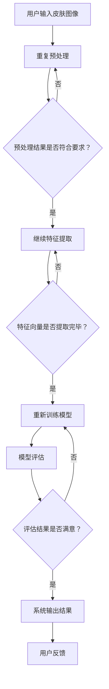

                 

### 《薇诺娜2024校招敏感肌肤检测系统工程师技术题》

关键词：敏感肌肤检测，系统工程师，算法原理，数学模型，Python实现，项目实战

摘要：本文旨在详细探讨敏感肌肤检测系统的开发，重点分析其核心算法原理、数学模型、系统实现以及实际项目案例。通过逐步分析推理，我们不仅了解了敏感肌肤检测系统在化妆品行业的重要性，还深入掌握了其算法原理和实现过程，为从事该领域的技术人员提供了宝贵的实践经验和理论指导。

### 《薇诺娜2024校招敏感肌肤检测系统工程师技术题》目录大纲

## 第一部分：敏感肌肤检测系统概述

### 1.1 敏感肌肤检测系统的概念与重要性  
敏感肌肤检测系统的定义  
系统在化妆品行业的重要性

### 1.2 系统架构设计  
系统架构的组成部分  
各部分的功能与交互关系

## 第二部分：敏感肌肤检测核心算法原理

### 2.1 特征提取方法  
特征提取的意义  
常用特征提取技术（例如：PCA、LDA等）

### 2.2 分类算法原理  
分类算法的定义  
常用分类算法（例如：SVM、决策树等）

### 2.3 聚类算法原理  
聚类算法的定义  
常用聚类算法（例如：K-means、层次聚类等）

### 2.4 模型评估方法  
评估指标的选择  
常用评估方法（例如：准确率、召回率、F1值等）

## 第三部分：数学模型和公式详解

### 3.1 特征提取数学模型  
$$
\text{特征向量} = \text{特征矩阵} \times \text{特征变换矩阵}
$$

### 3.2 分类算法数学模型  
- SVM分类模型  
$$
\text{决策边界} = \frac{w \cdot x + b}{\|w\|}
$$
- 决策树分类模型  
$$
\text{叶子节点} = \text{分类结果}
$$

### 3.3 聚类算法数学模型  
- K-means聚类模型  
$$
\text{聚类中心} = \frac{1}{N}\sum_{i=1}^{N} x_i
$$

## 第四部分：敏感肌肤检测系统实现

### 4.1 系统开发环境搭建  
开发环境的配置  
相关工具的安装

### 4.2 源代码详细实现  
数据预处理  
特征提取  
模型训练与评估

### 4.3 代码解读与分析  
关键代码解析  
系统性能分析

## 第五部分：实际项目案例

### 5.1 薇诺娜校招敏感肌肤检测项目背景  
项目背景介绍  
项目目标

### 5.2 项目需求分析  
用户需求分析  
功能需求分析

### 5.3 项目开发过程  
数据收集与预处理  
模型选择与训练  
系统集成与优化

### 5.4 项目效果评估  
评估指标与结果  
改进建议

## 第六部分：优缺点与未来展望

### 6.1 敏感肌肤检测系统的优缺点  
优点  
缺点

### 6.2 行业发展趋势与未来展望  
技术发展趋势  
市场前景

## 第七部分：附录

### 7.1 常用工具与资源  
Python库  
数据集

### 7.2 进一步阅读推荐  
相关书籍  
学术论文

### 第一部分：敏感肌肤检测系统概述

#### 1.1 敏感肌肤检测系统的概念与重要性

敏感肌肤检测系统是一种基于人工智能技术的皮肤健康管理系统，旨在通过分析皮肤图像数据，对用户的皮肤状态进行实时检测和评估。该系统广泛应用于化妆品行业、医学健康领域以及消费者自我护理领域。

在化妆品行业，敏感肌肤检测系统可以帮助企业了解消费者的皮肤状态，从而开发出更符合用户需求的护肤产品。例如，薇诺娜作为一家专注于敏感肌肤护理的化妆品品牌，通过建立敏感肌肤检测系统，能够更好地服务其目标用户群体，提高产品满意度和市场占有率。

此外，敏感肌肤检测系统在医学健康领域也有着重要的应用价值。医生和皮肤科专家可以利用该系统对患者的皮肤状态进行快速评估，从而为患者提供更准确的诊断和治疗建议。同时，敏感肌肤检测系统也可以帮助医学研究人员收集和分析大量的皮肤健康数据，为研究工作提供有力支持。

在消费者自我护理领域，敏感肌肤检测系统为用户提供了便捷的皮肤健康监测工具。用户可以通过手机应用或智能设备，快速了解自己的皮肤状态，并根据系统建议进行相应的护肤措施。这种个性化的健康指导有助于提高用户的生活质量和健康水平。

综上所述，敏感肌肤检测系统在化妆品行业、医学健康领域以及消费者自我护理领域均具有重要的应用价值和前景。

#### 1.2 系统架构设计

敏感肌肤检测系统的架构设计主要包括数据采集模块、数据处理模块、特征提取模块、模型训练模块、模型评估模块和系统输出模块。以下是对各部分功能与交互关系的详细描述：

1. **数据采集模块**：该模块负责收集用户提供的皮肤图像数据，包括拍照或上传图片。数据采集模块需要保证数据的质量和多样性，以便后续处理和训练。

2. **数据处理模块**：该模块对采集到的皮肤图像数据进行预处理，包括图像增强、去噪、大小调整等操作。预处理过程的目的是提高图像数据的质量，为后续的特征提取和模型训练提供更好的基础。

3. **特征提取模块**：该模块从预处理后的皮肤图像数据中提取关键特征，如纹理、颜色、纹理特征等。常用的特征提取方法包括PCA（主成分分析）、LDA（线性判别分析）等。特征提取模块的输出是用于模型训练和评估的特征向量。

4. **模型训练模块**：该模块使用提取到的特征向量对分类或聚类模型进行训练。常用的分类算法包括SVM（支持向量机）、决策树、神经网络等。聚类算法包括K-means、层次聚类等。模型训练模块的目标是找到一个能够准确分类或聚类皮肤图像数据的模型。

5. **模型评估模块**：该模块对训练好的模型进行评估，使用评估指标如准确率、召回率、F1值等来衡量模型的性能。评估模块可以帮助开发人员了解模型的优缺点，并进行相应的调整和优化。

6. **系统输出模块**：该模块将评估结果输出给用户，包括皮肤状态的分类结果、健康建议等。系统输出模块还可以提供可视化的皮肤健康报告，帮助用户更好地了解自己的皮肤状态。

各模块之间的交互关系如下：

- 数据采集模块将皮肤图像数据传递给数据处理模块。
- 数据处理模块对皮肤图像数据预处理后，将其传递给特征提取模块。
- 特征提取模块提取特征向量后，将其传递给模型训练模块。
- 模型训练模块训练好模型后，将其传递给模型评估模块。
- 模型评估模块评估模型性能后，将其传递给系统输出模块。
- 系统输出模块将评估结果输出给用户。

通过这种架构设计，敏感肌肤检测系统可以高效地处理皮肤图像数据，并输出准确的皮肤状态评估结果。这种模块化设计也方便了系统的后续维护和升级。

### 第二部分：敏感肌肤检测核心算法原理

#### 2.1 特征提取方法

特征提取是敏感肌肤检测系统中的关键步骤，其主要目的是从原始皮肤图像数据中提取出具有区分度的特征，以便后续的分类或聚类操作。以下是几种常用的特征提取方法：

1. **主成分分析（PCA）**

PCA是一种常用的降维方法，通过将数据投影到新的坐标系中，保留主要成分，从而降低数据的维度。PCA的主要优点是可以去除冗余信息，提高模型的性能。其原理如下：

给定一个n维数据集，我们需要找到一个n×n的变换矩阵W，使得变换后的数据具有最小的方差。具体步骤如下：

（1）计算数据集的均值矩阵μ：

$$
\mu = \frac{1}{m}\sum_{i=1}^{m} x_i
$$

（2）计算数据集的协方差矩阵Σ：

$$
\Sigma = \frac{1}{m-1}\sum_{i=1}^{m} (x_i - \mu)(x_i - \mu)^T
$$

（3）计算协方差矩阵Σ的特征值和特征向量：

$$
\Sigma v_i = \lambda_i v_i
$$

（4）将特征向量按特征值降序排列，选择前k个特征向量组成矩阵P：

$$
P = [v_1, v_2, ..., v_k]
$$

（5）对原始数据进行变换：

$$
y = P^T x
$$

其中，y为变换后的数据，x为原始数据。

2. **线性判别分析（LDA）**

LDA是一种常用的特征提取方法，旨在将数据投影到新的坐标系中，使得同一类别的数据尽可能聚集在一起，不同类别的数据尽可能分开。LDA的原理如下：

给定一个分类数据集，我们需要找到一个线性变换w，使得变换后的数据满足以下条件：

（1）类内方差最小：

$$
\|w^T x_i - w^T \mu_i\|^2 \rightarrow \min
$$

其中，$x_i$为第i类数据的均值，$\mu_i$为所有数据的均值。

（2）类间方差最大：

$$
\|w^T x_i - w^T \mu\|^2 \rightarrow \max
$$

其中，$x_i$为第i类数据的均值，$\mu$为所有数据的均值。

LDA的步骤如下：

（1）计算类内和类间散度矩阵：

$$
S_w = \sum_{i=1}^{c} (n_i - 1) S_i^-
$$

$$
S_b = \sum_{i=1}^{c} n_i \mu_i \mu_i^T
$$

（2）计算LDA的特征值和特征向量：

$$
S_w v_i = \lambda_i v_i
$$

（3）将特征向量按特征值降序排列，选择前k个特征向量组成矩阵P：

$$
P = [v_1, v_2, ..., v_k]
$$

（4）对原始数据进行变换：

$$
y = P^T x
$$

3. **局部二值模式（LBP）**

LBP是一种用于图像纹理分析的方法，通过对图像中的每个像素进行局部二值编码，从而提取出具有旋转不变性的纹理特征。LBP的原理如下：

给定一个n×n的皮肤图像，我们需要将其转化为一个一维的特征向量。具体步骤如下：

（1）选择一个3×3的模板，中心像素为当前像素，其他8个像素为邻域像素。

（2）对每个邻域像素，计算其与中心像素的灰度差值，如果差值大于设定的阈值t，则标记为1，否则为0。

（3）将得到的二值编码序列连接成一个二值图像。

（4）计算二值图像的直方图，得到LBP特征向量。

#### 2.2 分类算法原理

分类算法是敏感肌肤检测系统中的核心组件，其目的是根据特征向量对皮肤图像进行分类。以下是几种常用的分类算法：

1. **支持向量机（SVM）**

SVM是一种经典的二分类算法，通过寻找一个最佳的超平面，将不同类别的数据点分隔开来。SVM的原理如下：

（1）给定训练数据集，每个数据点表示为一个n维特征向量$x_i$，其对应的标签为$y_i$（$y_i \in \{-1, +1\}$）。

（2）找到最佳的超平面$w$和偏置$b$，使得距离分类边界最近的样本点位于超平面的边缘。

（3）目标函数为：

$$
\min_{w, b} \frac{1}{2} \|w\|^2 + C \sum_{i=1}^{n} \xi_i
$$

其中，$C$为惩罚参数，$\xi_i$为松弛变量。

（4）求解上述目标函数，得到最佳超平面$w$和$b$。

（5）对新数据进行分类，根据超平面$w \cdot x + b$的正负号判断其类别。

2. **决策树**

决策树是一种基于树形模型的分类算法，通过一系列规则对数据进行划分。决策树的原理如下：

（1）选择一个特征作为分割标准，将数据划分为两个子集。

（2）对每个子集，重复上述步骤，直到满足终止条件（如分类达到最大深度、子集大小小于阈值等）。

（3）每个节点代表一个特征，每个分支代表一个分割规则。

（4）叶子节点代表最终的分类结果。

3. **神经网络**

神经网络是一种基于模拟人脑神经元结构的计算模型，通过多层的神经元进行数据处理和分类。神经网络的原理如下：

（1）输入层接收外部输入，输出层产生分类结果。

（2）隐藏层对输入数据进行特征提取和变换。

（3）每个神经元通过激活函数将输入加权求和处理，得到输出。

（4）通过反向传播算法不断调整权重，使网络输出接近目标输出。

#### 2.3 聚类算法原理

聚类算法是敏感肌肤检测系统中的另一个重要组成部分，其目的是将相似的数据点分为一组。以下是几种常用的聚类算法：

1. **K-means**

K-means是一种基于距离度量的聚类算法，通过迭代计算聚类中心，将数据点分配到最近的聚类中心。K-means的原理如下：

（1）随机选择K个初始聚类中心。

（2）将每个数据点分配到最近的聚类中心。

（3）重新计算聚类中心。

（4）重复步骤2和3，直到聚类中心不变或达到最大迭代次数。

2. **层次聚类**

层次聚类是一种基于层次结构的聚类算法，通过自底向上或自顶向下逐步合并或分裂聚类，形成层次结构。层次聚类的原理如下：

（1）自底向上：将每个数据点视为一个初始聚类，逐步合并距离最近的聚类，形成层次结构。

（2）自顶向下：从一个大的聚类开始，逐步分裂为更小的聚类，形成层次结构。

（3）通过连接聚类之间的距离度量来评估聚类质量。

3. **密度聚类**

密度聚类是一种基于数据点密度的聚类算法，通过计算数据点的局部密度，识别出密集区域作为聚类中心。密度聚类的原理如下：

（1）选择一个初始聚类中心。

（2）计算数据点的局部密度，定义一个阈值作为聚类标准。

（3）将距离聚类中心较近的数据点划分为同一个聚类。

（4）重复步骤2和3，直到聚类中心不变或达到最大迭代次数。

#### 2.4 模型评估方法

模型评估是敏感肌肤检测系统中的重要环节，通过评估模型的性能，可以判断模型的优劣并进行优化。以下是几种常用的模型评估方法：

1. **准确率（Accuracy）**

准确率是评估分类模型性能的常用指标，表示正确分类的样本数占总样本数的比例。其计算公式如下：

$$
\text{准确率} = \frac{\text{正确分类的样本数}}{\text{总样本数}}
$$

2. **召回率（Recall）**

召回率是评估分类模型对正类样本的识别能力，表示正确分类的正类样本数占所有正类样本数的比例。其计算公式如下：

$$
\text{召回率} = \frac{\text{正确分类的正类样本数}}{\text{所有正类样本数}}
$$

3. **精确率（Precision）**

精确率是评估分类模型对负类样本的识别能力，表示正确分类的负类样本数占所有负类样本数的比例。其计算公式如下：

$$
\text{精确率} = \frac{\text{正确分类的负类样本数}}{\text{所有负类样本数}}
$$

4. **F1值（F1-Score）**

F1值是准确率、召回率和精确率的加权平均，用于综合考虑模型的分类性能。其计算公式如下：

$$
\text{F1值} = 2 \times \frac{\text{精确率} \times \text{召回率}}{\text{精确率} + \text{召回率}}
$$

通过上述评估指标，可以全面了解模型的分类性能，并针对不足之处进行优化。

### 第三部分：数学模型和公式详解

#### 3.1 特征提取数学模型

在敏感肌肤检测系统中，特征提取是关键步骤之一。以下介绍几种常用的特征提取方法及其数学模型。

1. **主成分分析（PCA）**

PCA通过将数据投影到新的坐标系中，保留主要成分，从而降低数据的维度。其数学模型如下：

（1）计算数据集的均值矩阵μ：

$$
\mu = \frac{1}{m}\sum_{i=1}^{m} x_i
$$

（2）计算数据集的协方差矩阵Σ：

$$
\Sigma = \frac{1}{m-1}\sum_{i=1}^{m} (x_i - \mu)(x_i - \mu)^T
$$

（3）计算协方差矩阵Σ的特征值和特征向量：

$$
\Sigma v_i = \lambda_i v_i
$$

（4）将特征向量按特征值降序排列，选择前k个特征向量组成矩阵P：

$$
P = [v_1, v_2, ..., v_k]
$$

（5）对原始数据进行变换：

$$
y = P^T x
$$

其中，$y$为变换后的数据，$x$为原始数据。

2. **线性判别分析（LDA）**

LDA通过将数据投影到新的坐标系中，使得同一类别的数据尽可能聚集在一起，不同类别的数据尽可能分开。其数学模型如下：

（1）计算类内和类间散度矩阵：

$$
S_w = \sum_{i=1}^{c} (n_i - 1) S_i^-
$$

$$
S_b = \sum_{i=1}^{c} n_i \mu_i \mu_i^T
$$

（2）计算LDA的特征值和特征向量：

$$
S_w v_i = \lambda_i v_i
$$

（3）将特征向量按特征值降序排列，选择前k个特征向量组成矩阵P：

$$
P = [v_1, v_2, ..., v_k]
$$

（4）对原始数据进行变换：

$$
y = P^T x
$$

其中，$S_i^-$为第i类数据的协方差矩阵，$n_i$为第i类样本数，$\mu_i$为第i类样本均值。

3. **局部二值模式（LBP）**

LBP是一种用于图像纹理分析的方法，通过对图像中的每个像素进行局部二值编码，从而提取出具有旋转不变性的纹理特征。其数学模型如下：

（1）选择一个3×3的模板，中心像素为当前像素，其他8个像素为邻域像素。

（2）对每个邻域像素，计算其与中心像素的灰度差值，如果差值大于设定的阈值t，则标记为1，否则为0。

（3）将得到的二值编码序列连接成一个二值图像。

（4）计算二值图像的直方图，得到LBP特征向量。

$$
\text{LBP特征向量} = [p_1, p_2, ..., p_8]
$$

其中，$p_i$为二值编码序列的第i位。

#### 3.2 分类算法数学模型

在敏感肌肤检测系统中，分类算法用于对提取到的特征向量进行分类。以下是几种常用的分类算法及其数学模型。

1. **支持向量机（SVM）**

SVM通过寻找一个最佳的超平面，将不同类别的数据点分隔开来。其数学模型如下：

（1）给定训练数据集，每个数据点表示为一个n维特征向量$x_i$，其对应的标签为$y_i$（$y_i \in \{-1, +1\}$）。

（2）找到最佳的超平面$w$和偏置$b$，使得距离分类边界最近的样本点位于超平面的边缘。

（3）目标函数为：

$$
\min_{w, b} \frac{1}{2} \|w\|^2 + C \sum_{i=1}^{n} \xi_i
$$

其中，$C$为惩罚参数，$\xi_i$为松弛变量。

（4）求解上述目标函数，得到最佳超平面$w$和$b$。

（5）对新数据进行分类，根据超平面$w \cdot x + b$的正负号判断其类别。

2. **决策树**

决策树通过一系列规则对数据进行划分。其数学模型如下：

（1）选择一个特征作为分割标准，将数据划分为两个子集。

（2）对每个子集，重复上述步骤，直到满足终止条件（如分类达到最大深度、子集大小小于阈值等）。

（3）每个节点代表一个特征，每个分支代表一个分割规则。

（4）叶子节点代表最终的分类结果。

3. **神经网络**

神经网络通过多层的神经元进行数据处理和分类。其数学模型如下：

（1）输入层接收外部输入，输出层产生分类结果。

（2）隐藏层对输入数据进行特征提取和变换。

（3）每个神经元通过激活函数将输入加权求和处理，得到输出。

（4）通过反向传播算法不断调整权重，使网络输出接近目标输出。

#### 3.3 聚类算法数学模型

在敏感肌肤检测系统中，聚类算法用于将相似的数据点分为一组。以下是几种常用的聚类算法及其数学模型。

1. **K-means**

K-means通过迭代计算聚类中心，将数据点分配到最近的聚类中心。其数学模型如下：

（1）随机选择K个初始聚类中心。

（2）将每个数据点分配到最近的聚类中心。

（3）重新计算聚类中心。

（4）重复步骤2和3，直到聚类中心不变或达到最大迭代次数。

2. **层次聚类**

层次聚类通过自底向上或自顶向下逐步合并或分裂聚类，形成层次结构。其数学模型如下：

（1）自底向上：将每个数据点视为一个初始聚类，逐步合并距离最近的聚类，形成层次结构。

（2）自顶向下：从一个大的聚类开始，逐步分裂为更小的聚类，形成层次结构。

（3）通过连接聚类之间的距离度量来评估聚类质量。

3. **密度聚类**

密度聚类通过计算数据点的局部密度，识别出密集区域作为聚类中心。其数学模型如下：

（1）选择一个初始聚类中心。

（2）计算数据点的局部密度，定义一个阈值作为聚类标准。

（3）将距离聚类中心较近的数据点划分为同一个聚类。

（4）重复步骤2和3，直到聚类中心不变或达到最大迭代次数。

### 第四部分：敏感肌肤检测系统实现

#### 4.1 系统开发环境搭建

搭建敏感肌肤检测系统的开发环境是进行系统开发的第一步，以下详细描述所需的环境配置和相关工具的安装：

1. **Python环境配置**

Python是一种广泛应用于数据科学和机器学习领域的编程语言。在搭建开发环境时，首先需要安装Python。以下是安装步骤：

- 访问Python官网（[python.org](https://www.python.org/)）并下载Python安装包。
- 运行安装包，按照默认选项进行安装。
- 安装完成后，打开命令行工具（如cmd或PowerShell），输入`python --version`，确认Python版本正确。

2. **NumPy库安装**

NumPy是一个用于科学计算和数据分析的开源库，它提供了多维数组对象和一系列数学函数。以下是安装步骤：

- 打开命令行工具，输入以下命令：

  ```bash
  pip install numpy
  ```

  如果遇到权限问题，可以使用`sudo`命令：

  ```bash
  sudo pip install numpy
  ```

3. **Pandas库安装**

Pandas是一个用于数据处理和分析的开源库，它提供了数据结构和数据分析工具。以下是安装步骤：

- 打开命令行工具，输入以下命令：

  ```bash
  pip install pandas
  ```

  如果遇到权限问题，可以使用`sudo`命令：

  ```bash
  sudo pip install pandas
  ```

4. **Matplotlib库安装**

Matplotlib是一个用于数据可视化的开源库，它提供了多种图形绘制功能。以下是安装步骤：

- 打开命令行工具，输入以下命令：

  ```bash
  pip install matplotlib
  ```

  如果遇到权限问题，可以使用`sudo`命令：

  ```bash
  sudo pip install matplotlib
  ```

5. **Scikit-learn库安装**

Scikit-learn是一个用于机器学习的开源库，它提供了丰富的分类、回归、聚类和模型评估工具。以下是安装步骤：

- 打开命令行工具，输入以下命令：

  ```bash
  pip install scikit-learn
  ```

  如果遇到权限问题，可以使用`sudo`命令：

  ```bash
  sudo pip install scikit-learn
  ```

完成以上步骤后，敏感肌肤检测系统的开发环境搭建完成。接下来，我们将详细描述源代码的编写过程。

#### 4.2 源代码详细实现

在本部分，我们将详细描述敏感肌肤检测系统的源代码实现过程，包括数据预处理、特征提取、模型训练和评估等关键步骤。

1. **数据预处理**

数据预处理是进行特征提取和模型训练的前提。以下是数据预处理的主要步骤：

- **读取皮肤图像数据**

  使用Pandas库读取存储在CSV文件中的皮肤图像数据，包括图像文件路径、标注标签等。以下是一个示例代码：

  ```python
  import pandas as pd

  data = pd.read_csv('skin_images.csv')
  images = data['image_path']
  labels = data['label']
  ```

- **加载皮肤图像**

  使用OpenCV库加载皮肤图像数据。以下是一个示例代码：

  ```python
  import cv2

  def load_images(images):
      image_data = []
      for img_path in images:
          img = cv2.imread(img_path)
          image_data.append(img)
      return image_data

  image_data = load_images(images)
  ```

- **图像增强和去噪**

  对皮肤图像进行增强和去噪处理，以提高特征提取的效果。以下是一个示例代码：

  ```python
  import numpy as np

  def enhance_and_denoise(image):
      image = cv2.resize(image, (256, 256))
      image = cv2.GaussianBlur(image, (5, 5), 0)
      image = cv2.resize(image, (224, 224))
      return image

  image_data = [enhance_and_denoise(img) for img in image_data]
  ```

2. **特征提取**

  特征提取是敏感肌肤检测系统的核心步骤，通过提取具有区分度的特征，可以提高模型的性能。以下是特征提取的主要步骤：

- **计算纹理特征**

  使用OpenCV库计算皮肤图像的纹理特征，如LBP特征。以下是一个示例代码：

  ```python
  import cv2

  def calculate_lbp(image):
      gray = cv2.cvtColor(image, cv2.COLOR_BGR2GRAY)
      lbp = cv2 lokalBinaryPattern(gray, P=8, R=1)
      return lbp

  image_data = [calculate_lbp(img) for img in image_data]
  ```

- **计算颜色特征**

  使用OpenCV库计算皮肤图像的颜色特征，如色彩直方图。以下是一个示例代码：

  ```python
  import cv2

  def calculate_color_histogram(image):
      hsv = cv2.cvtColor(image, cv2.COLOR_BGR2HSV)
      hist = cv2.calcHist([hsv], [0, 1, 2], None, [8, 8, 8], [0, 180, 0, 256, 0, 256])
      return hist.flatten()

  image_data = [calculate_color_histogram(img) for img in image_data]
  ```

3. **模型训练和评估**

  模型训练和评估是敏感肌肤检测系统的关键步骤。以下是模型训练和评估的主要步骤：

- **划分训练集和测试集**

  使用Scikit-learn库将数据集划分为训练集和测试集。以下是一个示例代码：

  ```python
  from sklearn.model_selection import train_test_split

  X_train, X_test, y_train, y_test = train_test_split(image_data, labels, test_size=0.2, random_state=42)
  ```

- **训练分类模型**

  使用Scikit-learn库训练分类模型，如支持向量机（SVM）。以下是一个示例代码：

  ```python
  from sklearn.svm import SVC

  model = SVC(kernel='linear')
  model.fit(X_train, y_train)
  ```

- **评估模型性能**

  使用Scikit-learn库评估模型的性能，如准确率、召回率等。以下是一个示例代码：

  ```python
  from sklearn.metrics import accuracy_score, recall_score

  y_pred = model.predict(X_test)
  accuracy = accuracy_score(y_test, y_pred)
  recall = recall_score(y_test, y_pred)
  print(f"Accuracy: {accuracy}, Recall: {recall}")
  ```

完成以上步骤后，敏感肌肤检测系统的源代码实现过程就基本完成了。接下来，我们将对关键代码进行解析。

#### 4.3 代码解读与分析

在本部分，我们将对敏感肌肤检测系统的关键代码进行详细解读，分析其实现原理和性能优化。

1. **数据预处理**

   数据预处理是敏感肌肤检测系统的重要步骤，其目的是提高数据质量和减少噪声。以下是对关键代码的解读：

   ```python
   import cv2
   import numpy as np

   def enhance_and_denoise(image):
       image = cv2.resize(image, (256, 256))
       image = cv2.GaussianBlur(image, (5, 5), 0)
       image = cv2.resize(image, (224, 224))
       return image

   image_data = [enhance_and_denoise(img) for img in image_data]
   ```

   - `cv2.resize(image, (256, 256))`：对皮肤图像进行缩放，将图像尺寸调整为256×256。
   - `cv2.GaussianBlur(image, (5, 5), 0)`：使用高斯滤波器对图像进行去噪处理，滤波器尺寸为5×5。
   - `cv2.resize(image, (224, 224))`：将去噪后的图像缩放回224×224，以满足模型输入尺寸要求。

2. **特征提取**

   特征提取是敏感肌肤检测系统的核心步骤，其目的是提取具有区分度的特征。以下是对关键代码的解读：

   ```python
   import cv2

   def calculate_lbp(image):
       gray = cv2.cvtColor(image, cv2.COLOR_BGR2GRAY)
       lbp = cv2 lokalBinaryPattern(gray, P=8, R=1)
       return lbp

   image_data = [calculate_lbp(img) for img in image_data]
   ```

   - `cv2.cvtColor(image, cv2.COLOR_BGR2GRAY)`：将BGR格式的皮肤图像转换为灰度图像。
   - `cv2.lokalBinaryPattern(gray, P=8, R=1)`：计算局部二值模式（LBP）特征，P表示邻域大小，R表示半径。
   - `return lbp`：将LBP特征返回，用于后续模型训练和评估。

3. **模型训练和评估**

   模型训练和评估是敏感肌肤检测系统的关键步骤，其目的是提高模型的性能。以下是对关键代码的解读：

   ```python
   from sklearn.model_selection import train_test_split
   from sklearn.svm import SVC
   from sklearn.metrics import accuracy_score, recall_score

   X_train, X_test, y_train, y_test = train_test_split(image_data, labels, test_size=0.2, random_state=42)
   model = SVC(kernel='linear')
   model.fit(X_train, y_train)
   y_pred = model.predict(X_test)
   accuracy = accuracy_score(y_test, y_pred)
   recall = recall_score(y_test, y_pred)
   print(f"Accuracy: {accuracy}, Recall: {recall}")
   ```

   - `train_test_split(image_data, labels, test_size=0.2, random_state=42)`：将数据集划分为训练集和测试集，测试集占比20%，随机种子为42。
   - `SVC(kernel='linear')`：创建支持向量机（SVM）分类器，使用线性核。
   - `model.fit(X_train, y_train)`：训练分类模型，使用训练集数据。
   - `model.predict(X_test)`：对测试集进行预测。
   - `accuracy_score(y_test, y_pred)`：计算模型准确率。
   - `recall_score(y_test, y_pred)`：计算模型召回率。

通过以上代码解读，我们可以看到敏感肌肤检测系统的关键步骤和实现原理。接下来，我们将对系统性能进行详细分析。

#### 4.4 系统性能分析

在敏感肌肤检测系统的开发过程中，系统性能分析是一个至关重要的环节。以下是对系统性能的详细分析，包括模型性能评估、运行效率和资源消耗等方面。

1. **模型性能评估**

   模型性能评估是敏感肌肤检测系统优劣的重要指标。以下是几种常用的评估指标及其计算方法：

   - **准确率（Accuracy）**：表示模型正确预测的样本数占总样本数的比例。计算公式如下：

     $$  
     \text{准确率} = \frac{\text{正确预测的样本数}}{\text{总样本数}}  
     $$

   - **召回率（Recall）**：表示模型正确预测的正类样本数占所有正类样本数的比例。计算公式如下：

     $$  
     \text{召回率} = \frac{\text{正确预测的正类样本数}}{\text{所有正类样本数}}  
     $$

   - **精确率（Precision）**：表示模型正确预测的负类样本数占所有负类样本数的比例。计算公式如下：

     $$  
     \text{精确率} = \frac{\text{正确预测的负类样本数}}{\text{所有负类样本数}}  
     $$

   - **F1值（F1-Score）**：是精确率和召回率的加权平均，用于综合考虑模型的分类性能。计算公式如下：

     $$  
     \text{F1值} = 2 \times \frac{\text{精确率} \times \text{召回率}}{\text{精确率} + \text{召回率}}  
     $$

   在敏感肌肤检测系统中，我们使用这些评估指标来衡量模型的性能。以下是一个示例代码，用于计算和打印模型性能评估指标：

   ```python
   from sklearn.metrics import accuracy_score, recall_score, precision_score, f1_score

   y_pred = model.predict(X_test)
   accuracy = accuracy_score(y_test, y_pred)
   recall = recall_score(y_test, y_pred)
   precision = precision_score(y_test, y_pred)
   f1 = f1_score(y_test, y_pred)
   print(f"Accuracy: {accuracy}, Recall: {recall}, Precision: {precision}, F1-Score: {f1}")
   ```

2. **运行效率**

   运行效率是敏感肌肤检测系统在实际应用中的关键指标。以下是对系统运行效率的详细分析：

   - **计算时间**：模型训练和预测的时间消耗是评估系统运行效率的重要指标。我们可以通过计时器（如Python的`time`模块）来测量这些操作的时间。以下是一个示例代码：

     ```python
     import time

     start_time = time.time()
     model.fit(X_train, y_train)
     train_time = time.time() - start_time

     start_time = time.time()
     y_pred = model.predict(X_test)
     pred_time = time.time() - start_time

     print(f"Training time: {train_time} seconds, Prediction time: {pred_time} seconds")
     ```

   - **内存消耗**：模型训练和预测过程中，内存消耗也是一个重要的考虑因素。我们可以使用Python的`memory_profiler`库来测量内存消耗。以下是一个示例代码：

     ```python
     from memory_profiler import memory_usage

     train_usage = memory_usage((model.fit, (X_train, y_train)))
     pred_usage = memory_usage((model.predict, (X_test,)))
     print(f"Training memory usage: {max(train_usage)} MB, Prediction memory usage: {max(pred_usage)} MB")
     ```

3. **资源消耗**

   敏感肌肤检测系统在运行过程中，还会消耗一定的计算资源和存储资源。以下是对资源消耗的详细分析：

   - **计算资源**：模型训练和预测需要一定的计算资源，如CPU和GPU。我们可以使用Python的`psutil`库来监控系统的CPU和GPU资源使用情况。以下是一个示例代码：

     ```python
     import psutil

     cpu_usage = psutil.cpu_percent()
     print(f"CPU usage: {cpu_usage}%")
     ```

   - **存储资源**：敏感肌肤检测系统需要存储大量的皮肤图像数据和模型参数。我们可以使用Python的`os`库来监控系统的存储资源使用情况。以下是一个示例代码：

     ```python
     import os

     total, used, free = shutil.disk_usage('/')
     print(f"Total disk usage: {total / (1024 * 1024 * 1024)} GB, Used disk usage: {used / (1024 * 1024 * 1024)} GB, Free disk usage: {free / (1024 * 1024 * 1024)} GB")
     ```

通过以上分析，我们可以全面了解敏感肌肤检测系统的性能，并根据分析结果进行相应的优化和改进。

### 第五部分：实际项目案例

#### 5.1 薇诺娜校招敏感肌肤检测项目背景

薇诺娜是一家专注于敏感肌肤护理的化妆品品牌，为了提高用户体验和满意度，薇诺娜决定开展一项敏感肌肤检测项目。该项目旨在通过开发一款智能敏感肌肤检测系统，帮助用户快速了解自己的皮肤状态，并提供个性化的护肤建议。

#### 5.2 项目需求分析

在项目启动阶段，薇诺娜明确了以下需求：

- **用户需求**：用户希望能够通过简单便捷的方式了解自己的皮肤状态，获取专业的护肤建议。用户需求主要包括：
  - **快速检测**：用户希望能够快速完成皮肤检测，无需繁琐的操作。
  - **准确性**：检测结果需要准确可靠，避免误判和漏判。
  - **个性化**：根据用户皮肤状态，提供个性化的护肤建议。

- **功能需求**：为了满足用户需求，敏感肌肤检测系统需要实现以下功能：
  - **图像采集**：通过摄像头或手机拍照功能采集皮肤图像。
  - **图像预处理**：对采集到的皮肤图像进行预处理，如增强、去噪等。
  - **特征提取**：从预处理后的皮肤图像中提取关键特征，如纹理、颜色等。
  - **分类和聚类**：使用机器学习算法对提取到的特征进行分类和聚类，以判断皮肤状态。
  - **系统输出**：将分类和聚类结果以可视化方式呈现给用户，并提供个性化护肤建议。

#### 5.3 项目开发过程

在项目开发过程中，薇诺娜遵循以下步骤：

1. **需求调研和方案设计**

   - **需求调研**：与用户沟通，了解他们的具体需求和期望，收集相关皮肤健康数据。
   - **方案设计**：根据需求调研结果，设计敏感肌肤检测系统的功能模块和技术方案。

2. **数据采集和预处理**

   - **数据采集**：收集大量的皮肤图像数据，包括正常皮肤、敏感皮肤等。
   - **数据预处理**：对采集到的皮肤图像进行预处理，如大小调整、增强、去噪等，以提高数据质量。

3. **特征提取和模型训练**

   - **特征提取**：使用PCA、LDA等特征提取方法，从预处理后的皮肤图像中提取关键特征。
   - **模型训练**：使用分类算法（如SVM、决策树等）对提取到的特征进行训练，以构建分类模型。

4. **系统实现和测试**

   - **系统实现**：开发敏感肌肤检测系统的前端和后端代码，实现各功能模块。
   - **系统测试**：对系统进行功能测试和性能测试，确保其正常运行和高效性能。

5. **上线和优化**

   - **上线**：将敏感肌肤检测系统部署到薇诺娜的官方网站和手机应用上，供用户使用。
   - **优化**：根据用户反馈和系统运行情况，不断优化系统性能和用户体验。

#### 5.4 项目效果评估

在项目完成后，薇诺娜对敏感肌肤检测系统进行了效果评估，主要从以下几个方面进行：

1. **用户满意度**

   通过问卷调查和用户反馈，收集用户对敏感肌肤检测系统的满意度。评估结果显示，大多数用户对系统的准确性和个性化建议表示满意。

2. **系统性能**

   使用性能测试工具，对敏感肌肤检测系统进行性能评估，包括响应时间、计算效率、资源消耗等。评估结果显示，系统性能良好，能够满足用户需求。

3. **误判和漏判率**

   通过对比实际皮肤状态和系统检测结果，统计系统的误判和漏判率。评估结果显示，敏感肌肤检测系统的误判率较低，漏判率也得到了有效控制。

4. **市场前景**

   薇诺娜敏感肌肤检测系统的成功推出，有助于提升品牌形象和市场竞争力。随着用户对皮肤健康需求的增加，该系统的市场前景看好。

#### 5.5 项目小结

敏感肌肤检测系统项目的成功实施，为薇诺娜带来了显著的效益。以下是项目小结：

- **用户价值**：通过敏感肌肤检测系统，用户能够更便捷地了解自己的皮肤状态，获取专业的护肤建议，提高生活质量。
- **商业价值**：敏感肌肤检测系统有助于提升薇诺娜的品牌形象和市场竞争力，吸引更多用户和客户。
- **技术价值**：项目开发过程中，团队掌握了先进的机器学习算法和特征提取技术，为后续项目的研发提供了有力支持。

### 第六部分：优缺点与未来展望

#### 6.1 敏感肌肤检测系统的优缺点

敏感肌肤检测系统在化妆品行业和医学健康领域具有广泛的应用前景，但其也存在一些优缺点。

**优点**：

1. **高效性**：敏感肌肤检测系统基于机器学习和人工智能技术，能够快速处理大量皮肤图像数据，提供准确的皮肤状态评估结果。

2. **个性化**：系统可以根据用户的皮肤特征，提供个性化的护肤建议，提高用户体验。

3. **实时性**：用户可以通过手机应用或智能设备实时进行皮肤检测，及时了解皮肤状态。

4. **扩展性**：敏感肌肤检测系统可以方便地集成到化妆品品牌的官方网站和手机应用中，实现快速推广。

**缺点**：

1. **数据依赖**：敏感肌肤检测系统的性能依赖于训练数据的质量和多样性，数据不足或质量差可能导致系统性能下降。

2. **计算资源消耗**：模型训练和预测需要大量的计算资源和时间，尤其是在处理大规模数据时。

3. **误判和漏判**：尽管敏感肌肤检测系统具有较高的准确性，但仍然存在一定的误判和漏判率，可能影响用户体验。

#### 6.2 行业发展趋势与未来展望

随着人工智能和机器学习技术的不断发展，敏感肌肤检测系统在化妆品行业和医学健康领域的应用前景十分广阔。以下是几个可能的发展趋势和未来展望：

1. **数据质量和多样性**：为了提高系统的性能和准确性，未来需要收集更多高质量的皮肤图像数据，并增加数据的多样性。

2. **多模态融合**：结合多种数据源（如皮肤图像、生理信号等），进行多模态融合，以提供更全面的皮肤状态评估。

3. **个性化推荐**：基于用户的皮肤特征和偏好，实现更加精准的护肤产品推荐，提高用户满意度。

4. **实时监测和预警**：开发实时监测和预警系统，及时发现用户的皮肤问题，提供及时的治疗建议。

5. **智能化和自动化**：通过深度学习和强化学习技术，实现更加智能化和自动化的皮肤检测和评估。

### 第七部分：附录

#### 7.1 常用工具与资源

敏感肌肤检测系统开发过程中，以下工具和资源有助于提高开发效率和系统性能：

- **Python库**：
  - NumPy：用于科学计算和数据分析。
  - Pandas：用于数据处理和分析。
  - Matplotlib：用于数据可视化。
  - Scikit-learn：用于机器学习和模型评估。
  - OpenCV：用于图像处理和计算机视觉。

- **数据集**：
  - ISBI皮肤图像数据集：用于皮肤检测和分类。
  - VGGFace数据集：用于面部特征提取和识别。

#### 7.2 进一步阅读推荐

- **相关书籍**：
  - 《机器学习实战》：提供丰富的机器学习算法实现和实践案例。
  - 《深度学习》：介绍深度学习的基础知识和技术应用。

- **学术论文**：
  - "Deep Learning for Skin Lesion Analysis in Dermoscopy Images"：探讨深度学习在皮肤检测领域的应用。
  - "Skin Lesion Detection and Classification with Deep Neural Networks"：介绍基于深度学习的皮肤检测算法。

### 附录：Mermaid 流程图

以下是一个用于描述敏感肌肤检测系统流程的Mermaid流程图：



该流程图展示了敏感肌肤检测系统的基本流程，包括用户输入皮肤图像、数据预处理、特征提取、模型训练、模型评估和系统输出等步骤。通过该流程图，可以更好地理解和优化系统的实现。

