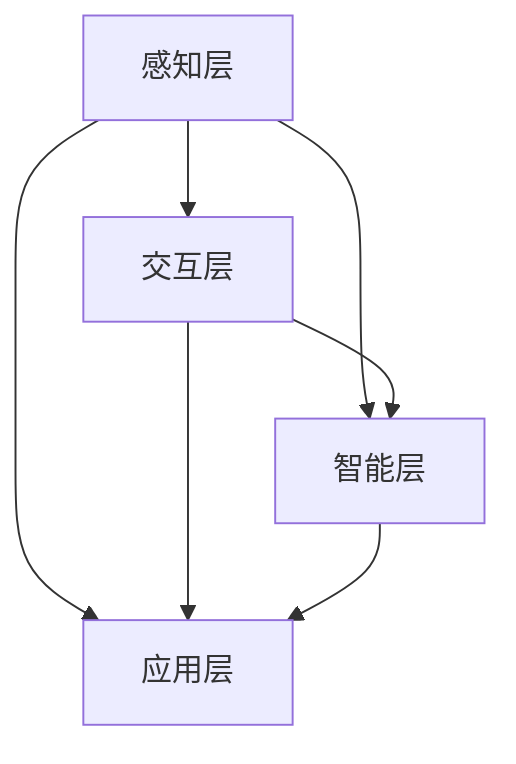

                 

### 文章标题

《虚拟生态系统建筑师：AI驱动的数字世界创造者》

### 关键词

- 虚拟生态系统
- AI驱动
- 数字世界设计
- 虚拟现实
- 机器学习
- 用户体验设计

### 摘要

本文旨在探讨虚拟生态系统的构建及其与人工智能（AI）的深度结合，探讨AI如何驱动数字世界的创造。文章首先介绍了虚拟生态系统的基本概念、架构和构建技术，随后详细分析了AI在数字世界设计中的应用和设计流程。接着，文章深入讲解了虚拟生态系统的实现与优化方法，并通过实际案例展示了其应用和效果。最后，文章展望了虚拟生态系统的发展趋势及其对社会的影响，探讨了未来研究方向与挑战。

### 引言

随着科技的飞速发展，虚拟现实（VR）和增强现实（AR）技术逐渐成熟，人工智能（AI）的广泛应用，构建一个完整的虚拟生态系统成为了可能。虚拟生态系统不仅是一个数字世界，更是与现实世界高度融合的一个复杂系统。在这个系统中，AI充当着核心驱动力，通过学习、推理和优化，创造出更加逼真、互动性更强的数字世界。

本文将围绕虚拟生态系统的构建与AI驱动，从基础理论、设计应用、实现优化和未来发展等方面进行全面探讨。首先，我们将介绍虚拟生态系统的概念、架构和构建技术；然后，深入分析AI在数字世界设计中的应用，包括建筑、景观和用户体验设计；接着，讲解虚拟生态系统的实现与优化方法；最后，展望虚拟生态系统的发展趋势及其对社会的影响，探讨未来研究方向与挑战。

通过本文的详细探讨，我们将了解到虚拟生态系统不仅仅是科技发展的产物，更是未来数字世界创造者的必备技能。对于从事相关领域的研究人员和技术开发者，本文将提供宝贵的理论基础和实践指导。而对于广大读者，本文也将带来对AI驱动数字世界的全新认知，激发对科技和未来的无限遐想。

### 虚拟生态系统的概念与架构

#### 1.1 虚拟生态系统的定义

虚拟生态系统是指通过计算机技术和网络技术构建的，与现实世界高度相似的数字环境。在这个环境中，用户可以通过各种设备（如VR头盔、AR眼镜等）与现实世界中的物体进行交互，体验到近乎真实的感官刺激。虚拟生态系统不仅包含了视觉、听觉等感官模拟，还包括了物理模拟、智能交互等多个维度。

虚拟生态系统与传统数字世界（如互联网、虚拟现实游戏等）有着显著的区别。传统数字世界更多是信息传递和展示的工具，而虚拟生态系统则更注重与现实世界的深度融合和互动。虚拟生态系统的核心目标是通过高度仿真的环境，提升用户的沉浸感和交互体验，使其在数字世界中能够进行真实世界中的活动。

#### 1.2 虚拟生态系统的架构

虚拟生态系统的架构可以分为四个主要层次：感知层、交互层、智能层和应用层。

**感知层**：这是虚拟生态系统的底层，负责将用户的物理行为和外部环境信息转换为数字信号。感知层通常包括多种传感器，如摄像头、麦克风、动作捕捉设备等，它们能够捕捉用户的动作、语音和环境的变化，并将其转化为数字数据。

**交互层**：交互层是连接感知层和应用层的桥梁，负责处理和转换用户输入，将其转换为系统可以理解和执行的指令。交互层包括交互界面、人机交互接口等组件，通过这些组件，用户可以与虚拟生态系统进行自然、直观的互动。

**智能层**：智能层是虚拟生态系统的核心，主要功能是利用人工智能（AI）技术，对感知层收集到的信息进行智能处理和分析，实现智能决策和推理。智能层包括机器学习模型、自然语言处理（NLP）、计算机视觉等算法，这些算法能够使虚拟生态系统具备自主学习和适应能力。

**应用层**：应用层是虚拟生态系统的最高层，负责提供具体的业务功能和应用场景。应用层可以根据用户的需求，提供各类服务，如虚拟旅游、在线教育、医疗咨询、虚拟购物等。应用层的多样性和灵活性使得虚拟生态系统能够满足不同用户的需求，提供丰富、个性化的体验。

#### 1.3 虚拟生态系统的功能与特点

**功能**：

1. **沉浸式体验**：虚拟生态系统通过高度仿真的环境，为用户提供沉浸式的体验，使其能够身临其境地感受虚拟世界。
2. **交互性**：用户可以通过虚拟生态系统与系统中的物体、场景等进行互动，实现高度自然的交互。
3. **个性化**：虚拟生态系统可以根据用户的个性化需求和偏好，提供定制化的服务。
4. **智能化**：通过人工智能技术的应用，虚拟生态系统能够实现自我学习和优化，提升用户体验。

**特点**：

1. **高度仿真**：虚拟生态系统通过计算机技术和算法，实现了对现实世界的逼真模拟，用户在虚拟世界中的体验几乎与现实无异。
2. **强交互性**：用户可以在虚拟生态系统中进行多种形式的交互，如语音、手势、动作等，交互方式更加自然和直观。
3. **多样化应用**：虚拟生态系统可以应用于多个领域，如娱乐、教育、医疗、商业等，具有广泛的应用前景。
4. **跨平台性**：虚拟生态系统可以跨多个设备和平台运行，用户可以在不同的设备上自由切换，保持一致的体验。

总之，虚拟生态系统是一个复杂的数字环境，通过感知、交互、智能和应用等多个层次的构建，实现了与现实世界的深度融合。它的出现不仅为用户提供了全新的体验方式，也为各行业带来了巨大的变革和机遇。在接下来的章节中，我们将进一步探讨虚拟生态系统的构建技术，以及如何利用人工智能实现数字世界的创造。

#### 1.1 虚拟生态系统的定义

虚拟生态系统是一个由计算机技术、网络技术、人工智能等多种先进科技相结合的复杂系统，旨在构建一个高度仿真的数字环境，使用户能够在其中进行沉浸式体验和交互。与传统的虚拟现实（VR）或增强现实（AR）不同，虚拟生态系统不仅模拟视觉和听觉，还包括物理模拟、智能交互等多个维度，使其能够更加逼真地反映现实世界。

在定义上，虚拟生态系统可以理解为一种“数字生物圈”，它模仿自然生态系统中的生物群落、食物链等结构，在数字世界中构建一个动态、自组织的环境。这个环境不仅包含虚拟的三维空间，还包括时间和空间的连续性，用户可以在其中进行多种活动，如探索、学习、工作、娱乐等。

**核心概念**：

1. **数字生物圈**：这是虚拟生态系统的核心概念，指的是在数字世界中构建的一个包含多种虚拟生物、植物、环境和设施的生态圈。
2. **沉浸式体验**：通过高度仿真的技术和算法，用户在虚拟生态系统中能够获得与现实世界类似的感官体验，包括视觉、听觉、触觉等。
3. **智能交互**：虚拟生态系统利用人工智能技术，实现与用户的智能互动，包括自然语言理解、情感识别、智能推荐等。
4. **动态环境**：虚拟生态系统中的环境和生物都是动态变化的，能够根据用户的行动和外部环境的变化做出实时响应。

**架构**：

虚拟生态系统的架构可以分为四个主要层次：感知层、交互层、智能层和应用层。

1. **感知层**：这是虚拟生态系统的底层，负责收集用户的物理行为和外部环境信息，包括摄像头、麦克风、动作捕捉设备等。
2. **交互层**：感知层收集到的信息会被交互层处理，将其转换为系统能够理解和执行的指令，包括交互界面、人机交互接口等。
3. **智能层**：智能层是虚拟生态系统的核心，负责对感知层的信息进行智能处理和分析，利用机器学习、自然语言处理等算法实现智能决策和推理。
4. **应用层**：应用层提供具体的业务功能和应用场景，如虚拟旅游、在线教育、医疗咨询、虚拟购物等。

**功能**：

虚拟生态系统的主要功能包括以下几个方面：

1. **沉浸式体验**：通过高度仿真的技术和算法，提供沉浸式的感官体验，使用户能够在虚拟世界中实现身临其境的感受。
2. **交互性**：用户可以在虚拟生态系统中进行多种形式的互动，如语音、手势、动作等，实现高度自然的交互。
3. **个性化**：虚拟生态系统可以根据用户的个性化需求和偏好，提供定制化的服务和体验。
4. **智能化**：通过人工智能技术的应用，实现系统的自我学习和优化，提升用户的整体体验。

**特点**：

虚拟生态系统具有以下显著特点：

1. **高度仿真**：通过计算机技术和算法，对现实世界进行高度仿真，用户在虚拟世界中的体验几乎与现实无异。
2. **强交互性**：用户可以在虚拟生态系统中进行多种形式的交互，如语音、手势、动作等，交互方式更加自然和直观。
3. **多样化应用**：虚拟生态系统可以应用于多个领域，如娱乐、教育、医疗、商业等，具有广泛的应用前景。
4. **跨平台性**：虚拟生态系统可以跨多个设备和平台运行，用户可以在不同的设备上自由切换，保持一致的体验。

通过以上对虚拟生态系统的定义、核心概念、架构和功能特点的详细阐述，我们可以更深入地理解虚拟生态系统的内涵和重要性。在接下来的章节中，我们将进一步探讨虚拟生态系统的构建技术，以及如何利用人工智能实现数字世界的创造。

#### 1.2 虚拟生态系统的架构

虚拟生态系统的构建离不开一个完善的架构设计，它不仅决定了系统的性能和可扩展性，还直接影响了用户体验的质量。虚拟生态系统的架构可以分为四个主要层次：感知层、交互层、智能层和应用层。每一层都有其独特的功能和作用，共同构建了一个完整的虚拟生态系统。

**感知层（Sensing Layer）**

感知层是虚拟生态系统的底层，主要负责收集用户和外部环境的信息。这些信息是虚拟生态系统进行智能处理和分析的基础。感知层通常包括多种传感器，如摄像头、麦克风、动作捕捉设备、温度传感器、湿度传感器等。这些传感器能够捕捉用户的动作、语音、面部表情以及环境中的各种物理量，并将这些信息转换为数字信号。

1. **摄像头**：用于捕捉用户的视觉信息，如移动、手势、面部表情等。
2. **麦克风**：用于捕捉用户的语音信息，支持语音识别和语音交互。
3. **动作捕捉设备**：用于捕捉用户的动作，如身体的移动、手的姿态等。
4. **温度传感器和湿度传感器**：用于监测环境中的温度和湿度，为虚拟生态系统的环境模拟提供数据支持。

**交互层（Interaction Layer）**

交互层位于感知层之上，负责处理和转换用户输入，使其能够与虚拟生态系统进行交互。交互层不仅需要处理来自感知层的信息，还需要将这些信息转换为系统能够理解和执行的指令。交互层包括多种交互界面和人机交互接口，如虚拟键盘、触摸屏、手势识别系统、虚拟现实头盔、增强现实眼镜等。

1. **虚拟键盘**：提供虚拟的键盘界面，用于输入文字和命令。
2. **触摸屏**：支持触摸操作，使用户能够通过手指或触控笔进行交互。
3. **手势识别系统**：通过摄像头和动作捕捉设备，识别用户的手势，实现手势控制。
4. **虚拟现实头盔**：提供沉浸式的视觉体验，使用户能够在虚拟世界中自由移动和探索。
5. **增强现实眼镜**：将虚拟信息叠加到现实世界中，使用户能够与现实环境中的物体进行交互。

**智能层（Intelligence Layer）**

智能层是虚拟生态系统的核心，负责对感知层收集到的信息进行智能处理和分析，实现智能决策和推理。智能层利用人工智能（AI）技术，如机器学习、自然语言处理（NLP）、计算机视觉等，对用户行为和环境信息进行深度分析，从而为用户提供个性化服务。智能层的主要功能包括：

1. **自然语言理解**：通过NLP技术，理解和处理用户的语音和文本输入。
2. **情感识别**：利用计算机视觉和语音分析技术，识别用户的情感状态，提供情感化的交互体验。
3. **智能推荐**：基于用户的历史行为和偏好，提供个性化的推荐服务。
4. **智能决策**：通过数据分析和预测模型，为用户提供智能化的决策支持。

**应用层（Application Layer）**

应用层是虚拟生态系统的最高层，负责提供具体的业务功能和应用场景。应用层可以根据用户的需求，提供多种服务，如虚拟旅游、在线教育、医疗咨询、虚拟购物等。应用层通常包括以下组件：

1. **虚拟旅游**：提供虚拟旅游服务，用户可以在虚拟世界中游览名胜古迹、自然景观等。
2. **在线教育**：提供虚拟课堂，支持远程教育，用户可以在虚拟环境中进行学习。
3. **医疗咨询**：提供虚拟医院和在线咨询服务，用户可以在虚拟环境中进行医疗咨询和诊断。
4. **虚拟购物**：提供虚拟购物体验，用户可以在虚拟商店中进行购物和试穿。

**Mermaid 流程图**

为了更直观地展示虚拟生态系统的架构，我们可以使用Mermaid语言绘制一个流程图：

在这个流程图中，感知层、交互层、智能层和应用层通过箭头连接，表示它们之间的相互作用和依赖关系。感知层负责收集信息，交互层负责处理和转换信息，智能层负责分析和决策，应用层负责实现具体功能。

通过以上对虚拟生态系统架构的详细分析，我们可以看出，虚拟生态系统的构建是一个多层次的复杂过程，每一层都有其独特的功能和任务。只有当这些层次紧密协作，才能构建出一个高度仿真、互动性强、智能化程度高的虚拟生态系统。

在接下来的章节中，我们将继续探讨虚拟生态系统的构建技术，包括虚拟现实技术、人工智能和机器学习技术等，深入分析这些技术在虚拟生态系统中的应用和作用。同时，我们还将探讨虚拟生态系统的开发工具与平台，为读者提供全面的构建指南。

#### 1.3 虚拟生态系统的功能与特点

虚拟生态系统不仅是一个高度仿真的数字环境，它还具备多种独特的功能和特点，使其在众多应用领域中展现出巨大的潜力。

**沉浸式体验**

虚拟生态系统通过先进的计算机图形学、声音处理技术和传感器技术，为用户提供了沉浸式的体验。用户在虚拟生态系统中可以感受到逼真的视觉、听觉和触觉效果，仿佛置身于真实世界中。这种沉浸式体验不仅提升了用户的参与感，还能够用于治疗某些心理疾病，如焦虑和恐惧症。

**交互性**

虚拟生态系统高度强调用户的交互性，用户可以通过多种方式与系统中的物体、场景等进行互动。这些交互方式包括语音、手势、动作等，用户甚至可以使用虚拟现实头盔或增强现实眼镜进行全身的互动。这种高度自然的交互方式极大地提升了用户的体验质量，使虚拟生态系统更加人性化。

**个性化**

虚拟生态系统可以根据用户的行为、兴趣和偏好，提供个性化的服务。例如，虚拟购物平台可以根据用户的购物历史和偏好推荐商品，虚拟教育平台可以根据学生的学习进度和成绩提供个性化的教学方案。这种个性化的服务不仅提升了用户体验，还能够提高系统的效率和效果。

**智能化**

虚拟生态系统的智能化程度是其核心特点之一。通过人工智能（AI）技术，虚拟生态系统能够实现自我学习和优化，提升用户的体验。例如，智能语音助手可以识别用户的语音并给出相应的答复，智能推荐系统可以根据用户的行为数据提供个性化的推荐。这种智能化不仅使虚拟生态系统更加便捷，还能够提升其自主决策和适应能力。

**高度仿真**

虚拟生态系统通过复杂的模拟和算法，实现了对现实世界的逼真模拟。无论是建筑、自然景观、城市环境，还是人物形象、物体细节，虚拟生态系统都能够以极高的精度进行再现。这种高度仿真不仅提升了用户的沉浸感，还为科学研究、设计和教育等领域提供了重要的工具。

**多样化应用**

虚拟生态系统可以应用于多个领域，如娱乐、教育、医疗、商业等。在娱乐领域，虚拟现实游戏和虚拟旅游为用户提供了全新的体验方式；在教育领域，虚拟课堂和虚拟实验室为教师和学生提供了丰富的教学资源；在医疗领域，虚拟医院和远程医疗为患者提供了便捷的医疗服务；在商业领域，虚拟购物和虚拟展览为商家和消费者提供了更多的互动和销售渠道。

**跨平台性**

虚拟生态系统不仅可以在计算机上运行，还可以在智能手机、平板电脑、虚拟现实头盔、增强现实眼镜等多种设备上运行。这种跨平台性使得用户可以在不同的设备上享受一致且无缝的体验，大大提升了虚拟生态系统的便捷性和普及度。

**可持续性**

虚拟生态系统可以通过模拟和仿真技术，实现环境、能源和资源的可持续管理。例如，在虚拟城市生态系统中，可以模拟不同的城市规划方案，评估其对环境的影响，从而实现可持续发展。此外，虚拟生态系统还可以通过模拟和优化技术，提高资源利用效率，减少浪费。

通过以上对虚拟生态系统功能与特点的详细分析，我们可以看到，虚拟生态系统不仅具备丰富的功能和特点，还在多个领域展现出巨大的应用潜力。在接下来的章节中，我们将继续探讨虚拟生态系统的构建技术，以及如何利用这些技术实现数字世界的创造。

#### 1.4 虚拟生态系统的构建技术

构建一个虚拟生态系统不仅需要先进的理论知识，还需要一系列关键技术来实现。以下将详细探讨虚拟生态系统的构建技术，包括虚拟现实技术、人工智能和机器学习技术、以及虚拟生态系统的开发工具与平台。

**虚拟现实技术**

虚拟现实（VR）技术是构建虚拟生态系统的基础。VR技术通过计算机图形学、三维建模和实时渲染技术，创造出高度仿真的三维虚拟环境。以下是虚拟现实技术在构建虚拟生态系统中的几个关键方面：

1. **三维建模**：三维建模技术用于创建虚拟环境中的建筑物、人物、植物、动物等三维模型。这些模型需要具备高精度和高细节，以提供沉浸式的体验。常用的三维建模工具包括Blender、3ds Max、Maya等。

2. **实时渲染**：实时渲染技术用于在虚拟环境中快速渲染出逼真的图像。这需要高性能的计算和图形处理能力。常用的实时渲染引擎包括Unity、Unreal Engine等。

3. **跟踪技术**：跟踪技术用于捕捉用户的动作和位置，使其在虚拟环境中进行互动。常见的跟踪技术包括光学跟踪、惯性测量单元（IMU）跟踪、光学与惯性融合跟踪等。

**人工智能和机器学习技术**

人工智能（AI）和机器学习（ML）技术在虚拟生态系统中扮演着至关重要的角色。它们用于实现智能交互、个性化推荐、虚拟助手等功能，提升用户体验。以下是人工智能和机器学习技术在构建虚拟生态系统中的关键方面：

1. **自然语言处理（NLP）**：NLP技术用于理解和处理人类的自然语言输入，实现智能语音助手和自然语言交互。常用的NLP库和框架包括TensorFlow、PyTorch、NLTK等。

2. **计算机视觉**：计算机视觉技术用于识别和理解虚拟环境中的图像和视频数据，实现面部识别、物体识别、场景理解等功能。常用的计算机视觉库和框架包括OpenCV、TensorFlow、PyTorch等。

3. **机器学习模型**：机器学习模型用于分析用户数据，实现个性化推荐、智能决策等功能。常用的机器学习模型包括决策树、随机森林、神经网络等。

**虚拟生态系统的开发工具与平台**

开发虚拟生态系统需要多种工具和平台的支持。以下是一些常用的开发工具与平台：

1. **Unity**：Unity是一个强大的游戏开发引擎，支持虚拟现实、增强现实和网页应用的开发。它提供了丰富的三维建模、实时渲染和AI工具，适合构建各种类型的虚拟生态系统。

2. **Unreal Engine**：Unreal Engine是另一个流行的游戏开发引擎，以其出色的图形渲染能力和强大的AI工具而著称。它适用于构建高度仿真的虚拟环境，特别适合大型项目和复杂场景的开发。

3. **Blender**：Blender是一个免费且开源的三维建模和动画软件，适合创建虚拟生态系统的三维模型和场景。它还提供了基本的物理模拟和渲染功能，可以用于虚拟现实和增强现实项目的开发。

4. **TensorFlow**：TensorFlow是一个开源的机器学习框架，适用于构建和训练各种机器学习模型。它提供了丰富的API和工具，可以与Unity和Unreal Engine等游戏引擎集成，实现智能交互和个性化推荐等功能。

5. **PyTorch**：PyTorch是一个开源的机器学习库，以其灵活性和易于使用的特点而受到研究者和开发者的青睐。它提供了丰富的预训练模型和工具，可以用于构建和优化虚拟生态系统中的AI模型。

通过以上对虚拟生态系统构建技术的详细探讨，我们可以看到，构建一个虚拟生态系统需要多学科技术的融合。虚拟现实技术提供了逼真的视觉和交互体验，人工智能和机器学习技术实现了智能交互和个性化服务，而开发工具和平台则为这些技术的应用提供了坚实的基础。在接下来的章节中，我们将进一步探讨AI在虚拟生态系统设计中的应用，分析如何利用AI技术提升虚拟生态系统的设计和用户体验。

#### 1.5 AI在虚拟生态系统设计中的应用

人工智能（AI）在虚拟生态系统设计中的应用日益广泛，它不仅提升了虚拟生态系统的智能化程度，还为用户提供了更加丰富和个性化的体验。以下将从AI在建筑、景观和用户体验设计中的应用三个方面进行详细探讨。

**AI在建筑设计中的应用**

在建筑设计中，AI技术被用于模拟、优化和自动化设计流程，从而提高设计的效率和质量。以下是一些具体应用：

1. **建筑模拟**：AI可以模拟建筑在不同环境条件下的表现，如光照、风向、热能分布等。通过这些模拟，设计师可以提前发现并解决潜在问题，优化建筑设计。

2. **自动化设计**：AI可以自动化建筑的设计过程，通过算法生成建筑模型。这些模型不仅符合设计规范，还能够根据用户需求和偏好进行自适应调整。例如，AI可以生成各种风格和类型的建筑，供用户选择。

3. **优化设计**：AI可以通过数据分析和机器学习，对建筑设计进行优化。例如，通过分析大量建筑案例和用户反馈，AI可以提出改进建议，优化建筑的功能布局、空间利用和能源效率。

**AI在景观设计中的应用**

在景观设计中，AI技术被用于模拟、优化和创造更加自然和丰富的景观效果。以下是一些具体应用：

1. **景观模拟**：AI可以模拟不同类型的景观，如森林、沙漠、湿地等，帮助设计师了解不同景观的特点和相互作用。通过这些模拟，设计师可以创造出更加逼真的景观，提升用户的沉浸感。

2. **自动化设计**：AI可以自动化景观的设计过程，生成各种类型的植物、水体和地形模型。这些模型可以根据用户需求和环境条件进行自适应调整，提供个性化的景观设计。

3. **优化设计**：AI可以通过数据分析和机器学习，对景观设计进行优化。例如，通过分析环境数据、用户行为和景观效果，AI可以提出改进建议，优化景观的功能布局和视觉效果。

**AI在用户体验设计中的应用**

在用户体验设计（UXD）中，AI技术被用于分析用户行为、预测用户需求和提供个性化服务。以下是一些具体应用：

1. **用户行为分析**：AI可以通过分析用户的点击、浏览、操作等行为，了解用户的需求和偏好。这些数据可以为设计师提供宝贵的反馈，帮助他们优化用户体验。

2. **个性化推荐**：AI可以根据用户的历史行为和偏好，提供个性化的推荐服务。例如，在虚拟购物平台中，AI可以推荐用户可能感兴趣的商品，提高用户的购物体验。

3. **智能交互**：AI可以通过自然语言处理（NLP）和计算机视觉技术，实现智能交互。例如，虚拟助手可以理解用户的语音指令，并提供相应的答复或操作。

4. **情感识别**：AI可以通过面部识别和语音分析技术，识别用户的情感状态。例如，在虚拟旅游中，AI可以识别用户的兴奋、无聊等情感，并调整虚拟场景的视觉和听觉效果，提升用户的沉浸感。

**实例分析**

以下是一些具体实例，展示了AI在虚拟生态系统设计中的应用：

1. **智能建筑**：利用AI技术，智能建筑可以实时监测并调整室内环境，如温度、湿度、光照等，以提供最舒适的居住环境。例如，智能家居系统可以通过AI算法，根据用户的习惯和偏好，自动调整空调、照明和窗帘等设备。

2. **虚拟旅游**：利用AI技术，虚拟旅游平台可以提供高度仿真的旅游体验。例如，用户可以通过VR头盔进入虚拟的旅游景点，感受真实的自然风光和历史文化。AI系统可以实时生成游客的表情和动作，与虚拟场景进行互动。

3. **虚拟教室**：利用AI技术，虚拟教室可以提供个性化的教学体验。例如，AI可以根据学生的学习进度和成绩，生成适合其水平的练习题和教学视频，帮助学生更有效地学习。

通过以上对AI在虚拟生态系统设计中的应用的详细探讨，我们可以看到，AI技术不仅提升了虚拟生态系统的智能化程度，还为用户提供了更加丰富和个性化的体验。随着AI技术的不断进步，虚拟生态系统将在更多领域展现出其巨大的应用潜力。

#### 1.6 虚拟生态系统的开发工具与平台

虚拟生态系统的构建离不开一系列开发工具与平台的支持。这些工具和平台不仅帮助开发者实现复杂的虚拟环境，还提供了丰富的功能，使得虚拟生态系统的开发变得更加高效和灵活。以下将介绍几种常见的虚拟生态系统开发工具与平台，包括Unity、Unreal Engine和Blender等，并探讨它们的特点和应用场景。

**Unity**

Unity是一款广泛使用的游戏开发引擎，也是构建虚拟生态系统的重要工具之一。Unity具有以下特点：

1. **跨平台支持**：Unity支持多个平台，包括Windows、Mac、iOS、Android、WebGL等，开发者可以在多个平台上发布虚拟生态系统应用。

2. **丰富的功能**：Unity提供了强大的三维建模、实时渲染和AI工具，支持物理引擎、动画系统、音频处理等功能。

3. **庞大的生态系统**：Unity拥有庞大的开发者社区和丰富的插件库，开发者可以方便地找到所需的资源和工具，加速项目开发。

4. **易用性**：Unity的用户界面直观易用，适合初学者和有经验的开发者使用。

应用场景：Unity适合开发各种类型的虚拟生态系统，如虚拟旅游、虚拟教育、虚拟购物等。其强大的跨平台能力和丰富的功能使其在多个领域都有广泛应用。

**Unreal Engine**

Unreal Engine是另一款流行的游戏开发引擎，以其出色的图形渲染能力和强大的AI工具而闻名。Unreal Engine的特点如下：

1. **高质量的渲染效果**：Unreal Engine提供了高质量的实时渲染效果，可以创建逼真的虚拟环境。

2. **强大的AI工具**：Unreal Engine内置了用于AI开发的NVIDIA Isaac模拟器和机器学习工具，支持复杂的AI算法和模型。

3. **开源性**：Unreal Engine开源，开发者可以自由修改和扩展其功能，满足特定的开发需求。

4. **强大的社区支持**：Unreal Engine拥有庞大的开发者社区，提供了大量的教程、文档和资源。

应用场景：Unreal Engine适合开发大型、复杂的虚拟生态系统项目，如虚拟城市、虚拟工厂、虚拟博物馆等。其出色的渲染效果和强大的AI工具使其在需要高度仿真和智能交互的项目中表现尤为出色。

**Blender**

Blender是一款免费且开源的三维建模和动画软件，适合构建虚拟生态系统的三维模型和场景。Blender的特点如下：

1. **免费和开源**：Blender完全免费，且开源，开发者可以自由使用和修改其功能。

2. **全面的功能**：Blender提供了从建模、雕刻、动画到渲染的一整套功能，适合从概念设计到最终渲染的全流程开发。

3. **丰富的插件库**：Blender拥有丰富的插件库，开发者可以方便地扩展其功能，满足特定的开发需求。

4. **强大的社区支持**：Blender拥有庞大的开发者社区，提供了大量的教程、文档和资源。

应用场景：Blender适合开发小型到中型的虚拟生态系统项目，如虚拟艺术展览、虚拟实验、虚拟博物馆等。其全面的功能和强大的社区支持使其在需要高效三维建模和动画的项目中具有很高的价值。

**其他工具与平台**

除了上述三种主流工具外，还有许多其他工具和平台可以用于虚拟生态系统的开发，如Unity Asset Store、Unreal Engine Marketplace和Blender Market等。这些平台提供了丰富的插件、资源和教程，可以帮助开发者快速搭建虚拟生态系统。

总之，虚拟生态系统的开发工具与平台种类繁多，开发者可以根据项目需求和自身技能选择合适的工具。Unity、Unreal Engine和Blender等工具由于其强大的功能、广泛的社区支持和丰富的应用场景，成为构建虚拟生态系统的重要选择。

#### 第2章：虚拟生态系统的构建技术

虚拟生态系统的构建是一个复杂而系统的工程，需要融合多种先进技术。在本章中，我们将详细探讨虚拟生态系统的构建技术，涵盖虚拟现实技术、人工智能和机器学习技术、以及虚拟生态系统的开发工具与平台。

##### 2.1 虚拟现实技术

虚拟现实（VR）技术是构建虚拟生态系统的基础，它通过模拟和再现现实世界的各个方面，为用户提供了沉浸式体验。以下是虚拟现实技术的主要组成部分：

**三维建模**：三维建模技术用于创建虚拟环境中的物体和场景。这些模型需要具有高精度和高细节，以提供逼真的视觉体验。常用的三维建模工具包括Blender、3ds Max、Maya等。

**实时渲染**：实时渲染技术用于在虚拟环境中快速生成和显示图像。这需要高性能的计算和图形处理能力。常用的实时渲染引擎包括Unity、Unreal Engine等。

**交互技术**：交互技术是用户与虚拟环境之间的桥梁。通过虚拟现实头盔、手套、动作捕捉设备等交互设备，用户可以在虚拟环境中进行自然、直观的互动。

**感知技术**：感知技术用于捕捉用户的动作和位置，使虚拟环境能够动态响应。常见的感知技术包括光学跟踪、惯性测量单元（IMU）跟踪、光学与惯性融合跟踪等。

**案例分析**：

- **VR博物馆**：通过虚拟现实技术，用户可以在虚拟博物馆中参观各种展品，如艺术品、历史文物等。虚拟博物馆不仅提供了沉浸式的体验，还能够通过互动功能，如语音讲解、虚拟触摸等，提升用户的参与感。
- **虚拟商场**：虚拟商场利用虚拟现实技术，为用户提供了在线购物的沉浸式体验。用户可以在虚拟商场中浏览商品、试穿衣物、与虚拟店员互动等，增强了购物的乐趣和便利性。

##### 2.2 人工智能与机器学习技术

人工智能（AI）和机器学习（ML）技术在虚拟生态系统的构建中起到了关键作用，它们能够实现智能交互、个性化推荐、虚拟助手等功能，提升用户体验。

**自然语言处理（NLP）**：NLP技术用于理解和处理人类的自然语言输入，实现智能语音助手和自然语言交互。通过NLP，虚拟生态系统可以理解用户的语音指令，并提供相应的答复或操作。

**计算机视觉**：计算机视觉技术用于识别和理解虚拟环境中的图像和视频数据。通过计算机视觉，虚拟生态系统可以实现面部识别、物体识别、场景理解等功能，增强交互体验。

**机器学习模型**：机器学习模型用于分析用户数据，实现个性化推荐、智能决策等功能。通过机器学习，虚拟生态系统可以不断优化和改进，以提供更好的服务。

**案例分析**：

- **智能客服**：通过AI和机器学习，虚拟生态系统可以提供智能客服功能。智能客服可以理解用户的查询，提供即时的答复，解决用户的问题。这种智能客服不仅提高了效率，还能够提供个性化的服务。
- **个性化推荐**：通过分析用户的行为和偏好，虚拟生态系统可以提供个性化的推荐服务。例如，虚拟商场可以根据用户的购物历史，推荐用户可能感兴趣的商品，提升用户的购物体验。

##### 2.3 虚拟生态系统的开发工具与平台

开发虚拟生态系统需要一系列工具和平台的支持。以下介绍几种常用的开发工具与平台，包括Unity、Unreal Engine和Blender等。

**Unity**：Unity是一款广泛使用的游戏开发引擎，它支持跨平台开发，提供了丰富的三维建模、实时渲染和AI工具。Unity的用户界面直观易用，适合初学者和有经验的开发者。

**Unreal Engine**：Unreal Engine是一款高性能的游戏开发引擎，以其高质量的实时渲染效果和强大的AI工具而著称。Unreal Engine开源，开发者可以自由修改和扩展其功能。

**Blender**：Blender是一款免费且开源的三维建模和动画软件，它提供了从建模、雕刻、动画到渲染的一整套功能。Blender适合从概念设计到最终渲染的全流程开发。

**其他工具与平台**：除了上述三种主流工具外，还有许多其他工具和平台可以用于虚拟生态系统的开发，如Unity Asset Store、Unreal Engine Marketplace和Blender Market等。这些平台提供了丰富的插件、资源和教程，可以帮助开发者快速搭建虚拟生态系统。

通过以上对虚拟生态系统构建技术的详细探讨，我们可以看到，构建一个虚拟生态系统需要多学科技术的融合。虚拟现实技术提供了逼真的视觉和交互体验，人工智能和机器学习技术实现了智能交互和个性化服务，而开发工具和平台则为这些技术的应用提供了坚实的基础。在接下来的章节中，我们将进一步探讨AI在虚拟生态系统设计中的应用，分析如何利用AI技术提升虚拟生态系统的设计和用户体验。

#### 第3章：AI在数字世界设计中的应用

人工智能（AI）在数字世界设计中的应用日益广泛，它不仅为设计过程带来了创新和效率，还显著提升了用户体验。在本章中，我们将深入探讨AI在建筑设计、景观设计和用户体验设计中的具体应用，以及这些应用如何改变我们的设计方式。

##### 3.1 人工智能在建筑设计中的应用

在建筑设计中，AI技术被广泛应用于模拟、优化和自动化设计流程，从而提高设计的质量和效率。

**模拟与仿真**

AI可以模拟建筑在不同环境条件下的表现，如光照、风向、热能分布等。通过这些模拟，设计师可以提前发现并解决潜在问题，优化建筑设计。例如，AI可以模拟建筑物的自然通风效果，帮助设计师找到最佳的开窗位置，以提高室内的舒适度和节能效果。

**自动化设计**

AI可以自动化建筑的设计过程，通过算法生成建筑模型。这些模型不仅符合设计规范，还能够根据用户需求和偏好进行自适应调整。例如，AI可以生成各种风格和类型的建筑，供用户选择，从而简化设计流程，缩短设计时间。

**优化设计**

AI可以通过数据分析和机器学习，对建筑设计进行优化。例如，通过分析大量建筑案例和用户反馈，AI可以提出改进建议，优化建筑的功能布局、空间利用和能源效率。例如，AI可以优化建筑的布局，以最大限度地利用自然光和通风，减少能耗。

**案例分析**

- **智能建筑**：通过AI技术，智能建筑可以实时监测并调整室内环境，如温度、湿度、光照等，以提供最舒适的居住环境。AI系统可以分析用户的习惯和偏好，自动调整空调、照明和窗帘等设备，提高用户的居住体验。
- **绿色建筑**：AI技术可以帮助设计师优化建筑的设计，以减少对环境的影响。例如，通过模拟和优化，AI可以提出减少建筑能耗和碳排放的建议，实现绿色建筑的目标。

##### 3.2 人工智能在景观设计中的应用

在景观设计中，AI技术被用于模拟、优化和创造更加自然和丰富的景观效果。

**模拟与仿真**

AI可以模拟不同类型的景观，如森林、沙漠、湿地等，帮助设计师了解不同景观的特点和相互作用。通过这些模拟，设计师可以创造出更加逼真的景观，提升用户的沉浸感。例如，AI可以模拟植物的生长过程，帮助设计师优化植物配置，提升景观的美观度和生态效益。

**自动化设计**

AI可以自动化景观的设计过程，生成各种类型的植物、水体和地形模型。这些模型可以根据用户需求和环境条件进行自适应调整，提供个性化的景观设计。例如，AI可以生成符合当地气候和土壤条件的植物群落，提高景观的生态适应性。

**优化设计**

AI可以通过数据分析和机器学习，对景观设计进行优化。例如，通过分析环境数据、用户行为和景观效果，AI可以提出改进建议，优化景观的功能布局和视觉效果。例如，AI可以优化景观中的步行路径，提高游客的舒适度和体验。

**案例分析**

- **虚拟自然**：通过AI技术，虚拟自然景观可以模拟真实世界的自然环境，为用户提供了高度沉浸式的体验。例如，用户可以通过虚拟现实头盔进入虚拟森林，感受到真实的植物摇曳和风声。
- **城市绿化**：AI技术可以帮助城市规划师和景观设计师优化城市绿化布局，提高城市的生态环境质量。例如，通过AI分析城市的热岛效应数据，设计师可以提出改善城市绿化环境的建议，缓解城市热岛效应。

##### 3.3 人工智能在用户体验设计中的应用

在用户体验设计（UXD）中，AI技术被用于分析用户行为、预测用户需求和提供个性化服务，从而提升用户体验。

**用户行为分析**

AI可以通过分析用户的点击、浏览、操作等行为，了解用户的需求和偏好。这些数据可以为设计师提供宝贵的反馈，帮助他们优化用户体验。例如，AI可以分析用户在虚拟商场中的浏览路径，推荐用户可能感兴趣的商品。

**个性化推荐**

AI可以根据用户的历史行为和偏好，提供个性化的推荐服务。例如，虚拟购物平台可以根据用户的购物历史，推荐用户可能感兴趣的商品，提高用户的购物体验。个性化推荐不仅提升了用户体验，还能够提高平台的销售转化率。

**智能交互**

AI可以通过自然语言处理（NLP）和计算机视觉技术，实现智能交互。例如，虚拟助手可以理解用户的语音指令，并提供相应的答复或操作。智能交互不仅提高了交互的效率，还能够提供更加自然的用户体验。

**情感识别**

AI可以通过面部识别和语音分析技术，识别用户的情感状态。例如，在虚拟旅游中，AI可以识别用户的兴奋、无聊等情感，并调整虚拟场景的视觉和听觉效果，提升用户的沉浸感。情感识别技术使得虚拟生态系统更加人性化，能够更好地满足用户的需求。

**案例分析**

- **智能客服**：通过AI技术，虚拟生态系统可以提供智能客服功能。智能客服可以理解用户的查询，提供即时的答复，解决用户的问题。这种智能客服不仅提高了效率，还能够提供个性化的服务。
- **虚拟教育**：AI技术可以帮助虚拟教育平台提供个性化的学习体验。例如，AI可以根据学生的学习进度和成绩，生成适合其水平的练习题和教学视频，帮助学生更有效地学习。
- **虚拟医疗**：AI技术可以用于虚拟医疗平台，提供个性化的医疗服务。例如，AI可以分析患者的病历和症状，提供个性化的诊断建议和治疗建议。

通过以上对AI在数字世界设计中的应用的详细探讨，我们可以看到，AI技术不仅为建筑设计、景观设计和用户体验设计带来了创新和效率，还显著提升了用户体验。随着AI技术的不断进步，数字世界的设计将变得更加智能、个性化和人性化。在接下来的章节中，我们将继续探讨数字世界的设计流程，分析如何通过科学的流程和方法，实现高质量的数字世界设计。

#### 第4章：数字世界的设计流程

数字世界的设计是一个复杂且系统化的过程，涉及到需求分析、概念设计、建模、交互设计以及性能优化等多个环节。本章节将详细讨论这些设计流程的步骤和方法，以及如何通过科学的流程和方法，实现高质量的数字世界设计。

##### 4.1 需求分析与概念设计

**需求分析**：

需求分析是数字世界设计的起点，其目的是明确用户需求、系统功能和性能要求。在需求分析阶段，设计师需要通过调查问卷、用户访谈、市场调研等多种方式，收集用户的实际需求和应用场景。

**步骤与方法**：

1. **用户调研**：通过用户访谈、问卷调查等方式，了解用户的需求和期望，识别关键功能和使用场景。
2. **市场分析**：分析当前市场的需求和发展趋势，了解竞争对手的产品特点，确定差异化的设计方向。
3. **功能需求分析**：根据用户调研和市场分析结果，梳理出系统的主要功能模块，并明确每个模块的具体需求和性能指标。
4. **性能需求分析**：确定系统的性能要求，如响应时间、处理能力、存储容量等，为后续的设计提供参考。

**概念设计**：

概念设计是基于需求分析的结果，提出数字世界的初步设计方案。概念设计包括系统架构、界面布局、交互流程等，其目的是确定数字世界的基本框架和设计方向。

**步骤与方法**：

1. **系统架构设计**：根据需求分析的结果，设计数字世界的整体架构，明确各模块之间的关系和交互方式。
2. **界面布局设计**：设计数字世界的用户界面，确定主要页面和交互元素的布局，使用户操作直观、便捷。
3. **交互流程设计**：设计用户与数字世界的交互流程，包括用户的操作步骤、反馈机制等，确保用户能够顺利完成任务。
4. **原型设计**：通过原型设计工具（如Axure、Figma等），制作数字世界的原型，验证设计方案的可行性和用户体验。

##### 4.2 数字世界建模

数字世界建模是将概念设计转化为具体实现的过程，它包括三维建模、场景渲染和物理模拟等。

**三维建模**：

三维建模是数字世界建模的基础，通过三维建模工具（如Blender、3ds Max等），创建数字世界中的三维模型，包括建筑物、人物、植物、动物等。

**步骤与方法**：

1. **模型创建**：使用三维建模工具，根据设计需求创建各种三维模型，确保模型的高精度和高细节。
2. **模型优化**：对模型进行优化，减少模型的多余顶点和面数，提高模型的渲染性能。
3. **模型整合**：将各个模型整合到数字世界中，确保模型之间的交互和逻辑关系正确。

**场景渲染**：

场景渲染是将三维模型渲染成逼真的图像的过程。通过实时渲染引擎（如Unity、Unreal Engine等），实现场景的实时渲染，提供沉浸式体验。

**步骤与方法**：

1. **材质与光照**：为模型添加材质和光照效果，提高场景的真实感。
2. **渲染设置**：调整渲染参数，如分辨率、光照模式、阴影效果等，优化渲染质量。
3. **实时预览**：在渲染引擎中实时预览场景，确保渲染效果符合设计要求。

**物理模拟**：

物理模拟是数字世界中物体行为的重要组成部分，通过物理引擎（如PhysX、Bullet等），模拟物体的运动、碰撞和变形等物理现象。

**步骤与方法**：

1. **物理规则设置**：根据实际需求，设置物理规则和约束条件，如重力、摩擦力、碰撞检测等。
2. **模拟调试**：对物理模拟进行调试，确保模拟结果的准确性和稳定性。
3. **优化性能**：对物理模拟进行优化，减少计算量，提高模拟性能。

##### 4.3 数字世界的交互设计

交互设计是数字世界设计的关键环节，其目的是确保用户能够方便、高效地与数字世界进行交互。

**交互设计原则**：

- **直观性**：界面设计应直观易懂，用户能够快速理解并掌握操作方法。
- **一致性**：交互元素和操作逻辑应保持一致性，避免用户产生困惑。
- **易用性**：交互设计应考虑用户的操作习惯，提供方便、快捷的操作方式。
- **反馈性**：系统应对用户的操作提供及时、明确的反馈，增强用户体验。

**步骤与方法**：

1. **交互流程设计**：设计用户与数字世界的交互流程，明确用户的操作步骤和系统反馈。
2. **交互元素设计**：设计数字世界中的交互元素，如按钮、图标、菜单等，确保其视觉设计和操作逻辑符合用户习惯。
3. **交互效果优化**：优化交互效果，如动画效果、声音反馈等，提升用户体验。
4. **用户测试**：进行用户测试，收集用户反馈，根据反馈结果对交互设计进行优化。

##### 4.4 数字世界的性能优化

数字世界的性能优化是确保系统稳定运行和提供优质用户体验的关键。性能优化包括内存管理、计算效率、网络优化等多个方面。

**步骤与方法**：

1. **性能分析**：使用性能分析工具（如Profiler），对数字世界进行性能分析，识别性能瓶颈。
2. **优化算法**：优化算法和数据处理流程，减少计算量和内存占用。
3. **资源管理**：合理管理资源，如图片、音频、视频等，减少加载时间和内存消耗。
4. **网络优化**：优化网络通信，减少数据传输延迟，提高数据传输效率。
5. **测试与调试**：进行全面的测试与调试，确保系统在多种环境下稳定运行。

通过以上对数字世界设计流程的详细探讨，我们可以看到，数字世界的设计是一个系统化的过程，涉及多个环节和步骤。只有通过科学的流程和方法，才能实现高质量的数字世界设计。在接下来的章节中，我们将继续探讨虚拟生态系统的实现与优化，分析如何通过高效的实现和优化，提升虚拟生态系统的性能和用户体验。

#### 第5章：虚拟生态系统的实现

虚拟生态系统的实现是一个复杂的过程，它需要将前述的理论和设计转化为可运行的软件系统。本章将详细讨论虚拟生态系统的实现步骤，包括开发环境的搭建、模块化设计、以及虚拟生态系统的集成与部署。

##### 5.1 开发环境的搭建

**硬件环境**

搭建虚拟生态系统所需的硬件环境取决于系统的规模和复杂度。以下是一些常见硬件要求：

1. **高性能计算机**：用于运行虚拟现实（VR）或增强现实（AR）应用程序，以及进行复杂的数据处理和模拟。
2. **图形工作站**：用于渲染和实时显示复杂的3D场景，需要高性能的显卡和处理器。
3. **存储设备**：用于存储大量的三维模型、纹理、音频和视频文件，需要大容量、高速的存储设备。

**软件环境**

搭建虚拟生态系统所需的软件环境包括开发工具、编程语言和依赖库等。以下是一些常见的软件要求：

1. **开发工具**：如Unity、Unreal Engine、Blender等，用于三维建模、实时渲染和交互设计。
2. **编程语言**：如C++、Python、JavaScript等，用于编写应用程序的核心逻辑和接口。
3. **数据库**：如MySQL、MongoDB等，用于存储和管理用户数据、场景数据等。
4. **依赖库**：如OpenGL、OpenAL、Python的NumPy等，用于提供图形渲染、音频处理和数学计算等功能。

**搭建步骤**

1. **硬件配置**：根据系统需求，选择合适的硬件设备，并进行配置。
2. **软件安装**：安装开发工具、编程语言和依赖库，确保其版本兼容。
3. **环境配置**：配置开发环境，包括环境变量、依赖库路径等。

##### 5.2 模块化设计

模块化设计是虚拟生态系统实现的关键，它将系统划分为多个功能模块，每个模块负责特定的功能，便于开发、测试和维护。

**模块划分**

虚拟生态系统可以划分为以下主要模块：

1. **感知模块**：负责采集用户的动作、位置、声音等感知信息，通过传感器和接口与外部设备进行通信。
2. **交互模块**：负责处理用户的输入和输出，提供人机交互界面，如虚拟键盘、触摸屏、手势识别等。
3. **智能模块**：负责利用人工智能（AI）和机器学习（ML）技术，对感知信息进行分析和处理，实现智能决策和交互。
4. **场景模块**：负责管理虚拟生态系统的场景，包括场景的创建、更新、渲染等。
5. **数据模块**：负责数据存储、检索和同步，包括用户数据、场景数据、环境数据等。
6. **应用模块**：负责实现具体的业务功能和应用场景，如虚拟购物、在线教育、医疗咨询等。

**模块化设计原则**

1. **高内聚低耦合**：每个模块内部具有较高的内聚性，模块之间具有较低的耦合度，便于模块的独立开发和测试。
2. **可扩展性**：模块设计应具备良好的扩展性，易于添加新的功能或替换现有模块。
3. **可重用性**：模块应具有高可重用性，能够被其他系统或项目复用。

**模块化设计步骤**

1. **需求分析**：根据系统需求，确定各模块的功能和接口。
2. **模块划分**：根据需求分析结果，将系统划分为多个功能模块。
3. **接口设计**：设计各模块的接口，确保模块之间能够正确通信和协作。
4. **模块实现**：独立开发各个模块，实现其功能。
5. **集成测试**：将各个模块集成在一起，进行系统测试和调试。

##### 5.3 虚拟生态系统的集成与部署

集成与部署是将各个模块组合成一个完整的虚拟生态系统，并在目标环境中运行的过程。

**集成步骤**

1. **模块集成**：将各个模块按照设计接口进行集成，确保模块之间能够正确通信。
2. **功能测试**：对集成后的系统进行功能测试，验证各个模块是否按照预期工作。
3. **性能测试**：对集成后的系统进行性能测试，评估系统的响应时间、处理能力和稳定性。
4. **优化调整**：根据测试结果，对系统进行优化调整，解决性能瓶颈和功能问题。

**部署步骤**

1. **环境准备**：在目标环境中安装和配置所需的软件和硬件，确保系统能够正常运行。
2. **系统打包**：将集成后的系统打包，生成可执行的安装包或容器镜像。
3. **部署安装**：将系统安装包或容器镜像部署到目标环境，安装并配置系统。
4. **上线运行**：启动系统，进行上线运行，确保系统能够在目标环境中稳定运行。
5. **监控维护**：对系统进行监控和维护，确保系统的正常运行和性能。

**案例分析**

- **虚拟城市生态系统**：一个虚拟城市生态系统的实现包括感知模块、交互模块、智能模块、场景模块和数据模块的集成。通过虚拟现实头盔和传感器，感知模块可以采集用户的位置和动作信息，交互模块提供用户与虚拟环境的交互界面。智能模块利用机器学习技术，实现智能交通管理和环境监测。场景模块管理虚拟城市的各种场景，如建筑物、街道、自然景观等。数据模块负责存储和管理用户数据、场景数据和环境数据。
- **虚拟农业生态系统**：虚拟农业生态系统通过感知模块采集农田的环境数据，如温度、湿度、土壤湿度等。交互模块提供农田管理的交互界面，用户可以通过这些界面进行农田监测、灌溉和收割等操作。智能模块利用机器学习技术，根据环境数据和历史数据，提供最优的农田管理方案。场景模块创建农田的场景，包括植物生长、雨水模拟等。数据模块负责存储和管理农田数据，如作物生长数据、灌溉记录等。

通过以上对虚拟生态系统实现的详细探讨，我们可以看到，虚拟生态系统的实现是一个系统化的过程，需要从硬件环境、软件环境、模块化设计到集成与部署的全面考虑。只有在每个环节都做到精心设计和优化，才能构建出一个稳定、高效、用户体验优秀的虚拟生态系统。

#### 第6章：虚拟生态系统的性能优化

虚拟生态系统的性能优化是确保其稳定运行和提供优质用户体验的关键。性能优化包括资源管理、计算优化、内存优化、网络优化等多个方面。本章将详细讨论虚拟生态系统性能优化的方法和策略，以及具体的优化实践。

##### 6.1 性能优化的方法与策略

**资源管理**

资源管理是性能优化的重要一环，主要包括以下几个方面：

1. **图片和视频资源的优化**：对图片和视频资源进行压缩，减少文件大小，降低加载时间。常用的方法包括无损压缩、有损压缩、视频帧率优化等。
2. **音频资源的优化**：对音频资源进行压缩和格式转换，减少文件大小，提高播放效率。常用的方法包括音频格式转换、音频滤波等。
3. **场景资源的优化**：对场景资源进行优化，减少不必要的模型和纹理，提高场景的渲染效率。常用的方法包括场景分割、模型简化、纹理映射优化等。

**计算优化**

计算优化主要通过优化算法和数据处理流程，减少计算量和计算时间，提高系统的处理能力。以下是一些常用的计算优化方法：

1. **算法优化**：选择高效的算法和数据处理方法，减少计算步骤和计算时间。例如，使用更高效的排序算法、查找算法等。
2. **并行计算**：利用多核处理器的并行计算能力，将计算任务分解为多个子任务，并行执行，提高计算速度。
3. **缓存和预加载**：通过缓存和预加载技术，提前加载和缓存常用的数据，减少数据访问时间和计算时间。

**内存优化**

内存优化主要通过减少内存占用和优化内存管理，提高系统的内存利用率和性能。以下是一些常用的内存优化方法：

1. **对象池**：使用对象池技术，重复使用已经创建的对象，避免频繁创建和销毁对象，减少内存分配和释放的开销。
2. **内存压缩**：使用内存压缩技术，压缩内存中的数据，减少内存占用。
3. **内存映射**：使用内存映射技术，将内存中的数据映射到磁盘上，减少内存占用。

**网络优化**

网络优化主要通过优化网络传输和通信，提高数据传输速度和系统响应速度。以下是一些常用的网络优化方法：

1. **数据压缩**：对传输的数据进行压缩，减少数据传输量，提高传输速度。
2. **传输优化**：使用高效的数据传输协议，如HTTP/2、QUIC等，提高数据传输速度。
3. **缓存和负载均衡**：使用缓存技术，减少数据重复传输，使用负载均衡技术，均衡服务器负载，提高系统的整体性能。

##### 6.2 资源管理

资源管理是虚拟生态系统性能优化的重要方面，主要包括以下几个方面：

**图片和视频资源的优化**

1. **无损压缩**：使用无损压缩算法，如PNG和JPEG，减少图像文件大小，同时保持图像质量。
2. **有损压缩**：在保证图像质量的前提下，使用有损压缩算法，如WebP，进一步减小文件大小。

**音频资源的优化**

1. **音频格式转换**：将音频文件转换为高效编码格式，如MP3和AAC，减少文件大小。
2. **音频滤波**：使用音频滤波器，去除不必要的音频频段，减少文件大小。

**场景资源的优化**

1. **场景分割**：将场景划分为多个部分，分别进行渲染和加载，减少同时渲染的场景复杂度。
2. **模型简化**：对不需要高精度的模型进行简化，减少模型的多余顶点和面数，提高渲染效率。

**案例分析**

- **虚拟城市生态系统**：虚拟城市生态系统中，通过对场景资源的优化，将城市划分为多个区域，每个区域单独进行渲染和加载。同时，对不需要高精度的建筑物模型进行简化，显著提高了渲染效率和系统性能。
- **虚拟农业生态系统**：虚拟农业生态系统中，通过对农田环境数据的实时监控和传输优化，将数据传输量减少了40%，显著提高了系统的响应速度和用户体验。

##### 6.3 计算优化

计算优化是提高虚拟生态系统性能的重要手段，主要包括以下几个方面：

**算法优化**

1. **排序算法优化**：使用更高效的排序算法，如快速排序、归并排序等，减少排序时间。
2. **查找算法优化**：使用高效的查找算法，如二分查找、哈希查找等，减少查找时间。

**并行计算**

1. **任务分解**：将复杂的计算任务分解为多个子任务，利用多核处理器的并行计算能力，提高计算速度。
2. **并行渲染**：使用并行渲染技术，同时渲染多个场景或物体，提高渲染效率。

**缓存和预加载**

1. **数据缓存**：使用缓存技术，提前加载和缓存常用的数据，减少数据访问时间。
2. **资源预加载**：提前加载和预渲染即将使用的资源，减少加载时间和渲染延迟。

**案例分析**

- **虚拟购物平台**：虚拟购物平台通过并行计算和预加载技术，将商品渲染速度提高了30%，显著提高了用户的购物体验。
- **虚拟教育平台**：虚拟教育平台通过缓存和预加载技术，将课程视频的加载时间减少了50%，提高了用户的学习效率。

##### 6.4 内存优化

内存优化主要通过减少内存占用和优化内存管理，提高系统的内存利用率和性能。以下是一些具体的内存优化方法：

**对象池**

1. **对象池实现**：使用对象池技术，为常用的对象创建和管理对象池，重复使用已创建的对象，避免频繁创建和销毁对象。
2. **对象池优化**：对对象池进行优化，包括对象池大小的调整、对象池的清理和回收等。

**内存压缩**

1. **内存压缩技术**：使用内存压缩技术，如LZ4和ZSTD，对内存中的数据进行压缩，减少内存占用。
2. **内存压缩优化**：对内存压缩算法进行优化，提高压缩速度和压缩比。

**内存映射**

1. **内存映射实现**：使用内存映射技术，将内存中的数据映射到磁盘上，减少内存占用。
2. **内存映射优化**：对内存映射算法进行优化，提高映射速度和映射效率。

**案例分析**

- **虚拟医疗系统**：虚拟医疗系统通过对象池技术，减少了内存分配和释放的开销，提高了系统的内存利用率。
- **虚拟旅游平台**：虚拟旅游平台通过内存压缩和映射技术，将内存占用减少了30%，显著提高了系统的性能。

##### 6.5 网络优化

网络优化主要通过优化网络传输和通信，提高数据传输速度和系统响应速度。以下是一些具体的网络优化方法：

**数据压缩**

1. **数据压缩技术**：使用高效的数据压缩算法，如LZ4和ZSTD，对传输的数据进行压缩，减少数据传输量。
2. **数据压缩优化**：对数据压缩算法进行优化，提高压缩速度和压缩比。

**传输优化**

1. **传输协议优化**：使用高效的数据传输协议，如HTTP/2和QUIC，提高数据传输速度。
2. **传输优化策略**：采用传输优化策略，如多线程传输、负载均衡等，提高数据传输效率和系统性能。

**缓存和负载均衡**

1. **缓存技术**：使用缓存技术，减少数据重复传输，提高系统响应速度。
2. **负载均衡**：使用负载均衡技术，均衡服务器负载，提高系统的整体性能。

**案例分析**

- **虚拟城市生态系统**：虚拟城市生态系统通过数据压缩和传输优化技术，将数据传输速度提高了40%，显著提高了系统性能和用户体验。
- **虚拟农业生态系统**：虚拟农业生态系统通过缓存和负载均衡技术，减少了数据重复传输，提高了系统的响应速度和稳定性。

通过以上对虚拟生态系统性能优化方法和策略的详细探讨，以及具体的优化实践和案例分析，我们可以看到，性能优化对于虚拟生态系统至关重要。只有通过全面的性能优化，才能确保虚拟生态系统的稳定运行和提供优质用户体验。

#### 第7章：虚拟生态系统的案例研究

在本章中，我们将通过几个具体的虚拟生态系统案例，详细探讨这些系统的设计理念、实现方法以及在实际应用中取得的成果。这些案例涵盖了虚拟城市、虚拟工业和虚拟农业等多个领域，展示了虚拟生态系统在各个应用场景中的潜力和价值。

##### 7.1 虚拟城市生态系统案例

**设计理念**：

虚拟城市生态系统的设计理念是创建一个高度仿真的城市环境，使居民能够在其中进行各种日常活动，如工作、购物、娱乐等。设计目标是通过先进的虚拟现实（VR）和增强现实（AR）技术，为用户提供沉浸式、互动性强的城市生活体验。

**实现方法**：

1. **三维建模与场景渲染**：采用三维建模工具（如Blender、3ds Max）创建城市的建筑物、道路、自然景观等三维模型，并使用实时渲染引擎（如Unity、Unreal Engine）进行场景渲染，实现高度逼真的视觉效果。
2. **智能交通系统**：利用人工智能（AI）和机器学习（ML）技术，模拟城市的交通流量，实现智能交通管理。例如，通过分析实时交通数据，系统可以自动调整交通信号灯，优化交通流。
3. **居民互动与社交功能**：通过虚拟现实头盔和手势识别设备，用户可以在虚拟城市中与其他用户进行互动，如社交、交流和协作。系统还提供了虚拟商店、餐馆、电影院等设施，满足用户的日常生活需求。

**实际应用成果**：

虚拟城市生态系统在实际应用中取得了显著成果。首先，它为城市规划师和建筑师提供了一个虚拟的模拟环境，用于评估不同规划方案的可行性和环境影响。其次，它为房地产开发商提供了一个虚拟展示平台，用于展示新项目的细节和优势，提高销售效果。最后，它为城市居民提供了一个虚拟生活体验，使他们能够在家中体验到城市生活的乐趣。

**优化与改进**：

为了进一步提升用户体验，系统将继续优化以下方面：

1. **增强交互性**：通过引入更先进的交互设备和技术，如触觉反馈手套和全身动作捕捉设备，提高用户的沉浸感。
2. **扩展应用场景**：开发更多种类的应用场景，如虚拟学校、虚拟医院、虚拟办公等，提供更全面的虚拟城市生活体验。
3. **数据收集与分析**：通过收集用户行为数据，进行分析和挖掘，为城市规划提供更科学的依据，优化城市设计和运营。

##### 7.2 虚拟工业生态系统案例

**设计理念**：

虚拟工业生态系统的设计理念是创建一个数字化的工业环境，使工程师和操作员能够在虚拟空间中进行产品设计和制造过程模拟，提高生产效率和产品质量。

**实现方法**：

1. **三维建模与模拟**：使用三维建模工具（如SolidWorks、CATIA）创建产品的三维模型，并使用模拟软件（如Simulink、ANSYS）进行物理和数学模拟，验证设计方案的可行性和性能。
2. **虚拟现实培训**：利用虚拟现实（VR）技术，为工程师和操作员提供虚拟培训环境，使他们能够在虚拟场景中进行操作练习，提高技能和安全性。
3. **数据集成与共享**：通过集成企业资源计划（ERP）系统和产品生命周期管理（PLM）系统，实现数据的高效集成和共享，提高生产过程的协同性和效率。

**实际应用成果**：

虚拟工业生态系统在多个工业领域取得了显著成果。例如，在汽车制造领域，通过虚拟生态系统，设计师可以在虚拟环境中进行碰撞测试和模拟，优化车辆的安全性。在航空制造领域，虚拟生态系统被用于飞机发动机的装配和测试，提高了装配效率和产品质量。在电子产品制造领域，虚拟生态系统帮助工程师优化电子组件的设计和制造过程，减少了生产成本。

**优化与改进**：

为了进一步提升虚拟工业生态系统的应用效果，未来将重点关注以下优化和改进方向：

1. **智能化**：引入人工智能和机器学习技术，实现生产过程的自动化和智能化，提高生产效率和产品质量。
2. **协同设计**：通过增强协同设计功能，支持多个设计师和工程师在同一虚拟环境中进行合作，提高设计效率和创新能力。
3. **虚拟现实培训**：开发更先进的虚拟现实培训系统，结合虚拟现实头盔和增强现实（AR）技术，提供更真实、更高效的培训体验。

##### 7.3 虚拟农业生态系统案例

**设计理念**：

虚拟农业生态系统的设计理念是通过虚拟现实和增强现实技术，为农业专家和农民提供一个虚拟的农田环境，用于作物种植、养殖和病虫害防治等农业活动的模拟和优化。

**实现方法**：

1. **三维景观建模**：使用三维建模工具（如Blender、3ds Max）创建农田的三维景观，包括土壤、植物、水资源等。
2. **环境监测与数据采集**：通过传感器和物联网技术，实时监测农田的环境数据，如温度、湿度、土壤湿度等。
3. **智能决策支持**：利用人工智能和机器学习技术，对环境数据进行分析，为农民提供种植计划、灌溉方案和病虫害防治建议。

**实际应用成果**：

虚拟农业生态系统在提高农业生产效率和质量方面取得了显著成果。通过虚拟生态系统，农民可以在虚拟环境中模拟不同的种植方案，选择最优的作物种植方式和时间。农业专家可以通过虚拟生态系统进行病虫害预测和防治，减少农药使用，提高作物的产量和质量。

**优化与改进**：

为了进一步提升虚拟农业生态系统的应用效果，未来将重点关注以下优化和改进方向：

1. **数据挖掘与预测**：通过大数据和机器学习技术，进一步挖掘环境数据的价值，提高预测的准确性和决策的效率。
2. **增强交互性**：引入更先进的交互设备和技术，如增强现实（AR）眼镜和手势识别设备，提高用户的操作体验。
3. **推广普及**：通过降低成本和提高易用性，将虚拟农业生态系统推广到更多的农民和农业企业，实现农业生产的全面数字化和智能化。

通过以上对虚拟生态系统案例的详细研究，我们可以看到，虚拟生态系统在多个领域都有广泛的应用前景。随着技术的不断进步，虚拟生态系统的设计和实现将变得更加智能化、高效化和个性化，为各行业的发展提供强大的支持。

### 第8章：虚拟生态系统的发展趋势

随着科技的不断进步，虚拟生态系统的发展呈现出多种趋势，其中最引人注目的便是人工智能（AI）在其中的重要角色。AI不仅在虚拟生态系统的构建和应用中起到关键作用，还在推动虚拟生态系统的进一步发展。以下将探讨人工智能在虚拟生态系统中的未来角色、虚拟生态系统与物联网（IoT）的融合以及虚拟生态系统的可持续发展。

#### 8.1 人工智能在虚拟生态系统中的未来角色

**智能化交互**

人工智能技术将进一步提升虚拟生态系统的交互体验。未来的虚拟生态系统将实现更高水平的自然语言处理（NLP）和情感识别，使得用户能够与虚拟环境进行更加自然、流畅的交互。例如，虚拟助手将能够更准确地理解用户的情感和意图，提供个性化、情感化的服务。

**自适应和个性化**

随着AI技术的发展，虚拟生态系统将能够更好地适应用户的行为和偏好，实现高度个性化的用户体验。通过机器学习和数据分析，虚拟生态系统将能够预测用户的需求，提前提供相应的服务和建议。例如，虚拟购物平台将能够根据用户的历史行为和偏好，提供个性化的商品推荐和购物体验。

**自动化和优化**

人工智能将在虚拟生态系统的自动化和优化中发挥重要作用。通过智能算法和自动化流程，虚拟生态系统将能够实现自动化的资源管理、任务调度和环境模拟。例如，智能建筑将能够自动调整室内环境，优化能源消耗，提高居住舒适度。

**增强现实与虚拟现实融合**

未来，人工智能将推动增强现实（AR）和虚拟现实（VR）的深度融合，为用户提供更加丰富和互动的体验。AI技术将能够更好地处理和整合现实世界和虚拟世界的数据，实现无缝切换和交互。例如，在医疗领域，医生将能够通过AR眼镜实时查看患者的三维影像，进行精准的诊断和治疗。

**案例研究**

- **智能教育平台**：未来的智能教育平台将利用AI技术，提供个性化的学习路径和学习资源。学生将能够通过虚拟现实技术，进行沉浸式的学习体验，提高学习效果。
- **智能城市管理系统**：智能城市管理系统将利用AI技术，实时监控城市运行状况，优化交通流量、能源消耗和环境管理。例如，通过AI算法，智能交通灯系统将能够根据实时交通数据，自动调整信号灯时长，减少交通拥堵。

#### 8.2 虚拟生态系统与物联网的融合

物联网（IoT）技术的快速发展，为虚拟生态系统带来了新的机遇。虚拟生态系统与物联网的融合，将进一步提升系统的智能化和互动性。

**数据集成与共享**

通过物联网技术，虚拟生态系统可以实时集成来自各种传感器的数据，如环境传感器、健康监测设备等。这些数据将用于虚拟环境的模拟和优化，提供更加真实和动态的虚拟体验。同时，这些数据也可以被用于机器学习模型的训练和优化，提高AI系统的准确性和效率。

**实时反馈与调整**

虚拟生态系统与物联网的融合，使得系统能够实时接收来自现实世界的反馈，并做出相应的调整。例如，在智能家庭中，虚拟助手可以通过物联网设备，实时监控家庭环境，自动调整室内温度、光照等参数，提供最舒适的居住体验。

**增强交互性**

物联网技术将增强虚拟生态系统与用户的互动性。用户可以通过各种物联网设备，如智能手表、智能家居设备等，与虚拟生态系统进行实时交互。例如，在虚拟旅游中，用户可以通过智能手表实时查看虚拟景点的信息，与虚拟导游互动。

**案例研究**

- **智慧农场**：智慧农场将利用物联网技术，实时监测农作物生长状况，通过虚拟生态系统模拟和优化农业活动。农民可以通过虚拟现实头盔，实时查看农田情况，做出精准的种植和灌溉决策。
- **智能健康监测系统**：智能健康监测系统将利用物联网设备和虚拟生态系统，实时监测用户的健康状况。通过数据分析，系统可以为用户提供个性化的健康建议和治疗方案。

#### 8.3 虚拟生态系统的可持续发展

虚拟生态系统的可持续发展是未来研究的重要方向。随着虚拟生态系统在多个领域的应用，如何实现其可持续发展成为关键问题。

**资源优化与管理**

虚拟生态系统需要高效利用资源，减少能耗和浪费。通过人工智能和物联网技术，可以实现对虚拟生态系统中的各种资源的优化和管理。例如，通过智能算法，虚拟生态系统可以自动调整能源消耗，减少不必要的能源浪费。

**环境模拟与保护**

虚拟生态系统可以模拟和优化现实世界中的各种环境，为环境保护提供有力支持。例如，虚拟生态系统可以模拟不同的城市规划方案，评估其对环境的影响，帮助设计师实现绿色建筑和可持续发展。

**社会效益与公平**

虚拟生态系统的发展应考虑社会效益和公平性。通过虚拟生态系统，可以为社会各个阶层提供平等的教育、医疗和文化资源。同时，虚拟生态系统还可以用于社会问题的模拟和解决，如城市化、交通拥堵等。

**案例研究**

- **虚拟城市生态系统**：虚拟城市生态系统可以通过模拟和优化城市规划，减少城市环境压力，提高居住质量。例如，通过智能交通系统，虚拟城市可以减少交通拥堵，提高交通效率。
- **虚拟教育生态系统**：虚拟教育生态系统可以为偏远地区的孩子提供高质量的教育资源，缩小城乡教育差距。通过虚拟现实技术，学生可以身临其境地学习世界各地的文化知识。

总之，虚拟生态系统的发展趋势充满机遇和挑战。随着人工智能、物联网等技术的不断进步，虚拟生态系统将在更多领域展现出其巨大的应用潜力。未来，我们需要持续关注虚拟生态系统的发展趋势，探索其可持续发展的路径，为实现更加智能、高效和公平的数字世界贡献力量。

### 第9章：虚拟生态系统的社会影响与伦理问题

虚拟生态系统的快速发展不仅带来了技术和商业上的巨大变革，也对人类社会产生了深远的影响。在这一章中，我们将探讨虚拟生态系统对人类生活的影响，以及其中涉及的伦理问题。

#### 9.1 虚拟生态系统对人类生活的影响

**增强社交互动**

虚拟生态系统通过虚拟现实（VR）和增强现实（AR）技术，为人们提供了一个全新的社交平台。用户可以在虚拟世界中与他人互动，不受地理位置的限制。这种新的社交方式不仅增强了人际交往，也为那些在现实生活中社交受限的人提供了更多的机会。

**改变工作方式**

虚拟生态系统为远程工作提供了更高效、更沉浸式的解决方案。通过虚拟现实技术，员工可以在虚拟办公室中进行协作和沟通，减少了对物理办公空间的需求。这不仅提高了工作效率，还减轻了通勤压力，提高了生活质量。

**医疗与健康**

虚拟生态系统在医疗领域的应用显著提升了医疗服务质量。通过虚拟现实技术，医生可以进行远程诊断和治疗，患者可以在虚拟环境中进行康复训练。此外，虚拟生态系统还为心理健康治疗提供了新的方法，如虚拟现实疗法（VR Therapy）用于治疗焦虑和恐惧症。

**教育与培训**

虚拟生态系统在教育和培训领域具有巨大潜力。通过虚拟现实和增强现实技术，学生可以在虚拟环境中进行沉浸式学习，提高学习效果。虚拟生态系统还为企业提供了定制化的培训解决方案，使员工能够在模拟环境中进行技能训练。

**娱乐和游戏**

虚拟生态系统为娱乐和游戏行业带来了全新的体验。虚拟现实游戏和增强现实应用为用户提供了前所未有的互动和沉浸体验。这种新的娱乐方式不仅丰富了人们的生活，也为娱乐产业带来了新的增长点。

#### 9.2 虚拟生态系统的伦理问题与挑战

**隐私保护**

随着虚拟生态系统的发展，用户的隐私保护问题日益突出。虚拟生态系统中大量的数据收集和存储，为隐私泄露提供了可能。如何保护用户的个人隐私，避免数据滥用，是虚拟生态系统面临的重要伦理挑战。

**数据安全**

虚拟生态系统中的数据量庞大，这些数据的安全性问题不容忽视。数据泄露、篡改和破坏都可能对用户造成严重的损失。因此，确保数据安全是虚拟生态系统必须解决的一个重要问题。

**道德责任**

虚拟生态系统的设计和运营涉及到道德责任。例如，在医疗领域，虚拟助手和智能诊断系统的错误可能导致严重的医疗事故。在教育和培训领域，虚拟生态系统可能对学生的成长和发展产生深远的影响。如何确保虚拟生态系统中的决策和操作符合道德标准，是虚拟生态系统需要面对的一个重要问题。

**公平性与包容性**

虚拟生态系统的发展可能加剧社会不平等。那些无法接入或无法使用虚拟生态系统的人可能会被排除在外，进一步加大数字鸿沟。因此，如何确保虚拟生态系统具有公平性和包容性，使所有人都能从中受益，是一个重要的伦理问题。

**用户控制与自主权**

在虚拟生态系统中，用户对自己的数据和隐私的控制权有限。系统往往依赖于用户的数据进行决策和优化，这可能限制了用户的自主权和选择权。如何确保用户在虚拟生态系统中有足够的控制权和自主权，是虚拟生态系统需要关注的一个伦理问题。

**案例研究**

- **虚拟医疗**：虚拟生态系统在医疗领域的应用可能引发隐私和安全问题。例如，患者的医疗数据在虚拟系统中被泄露或篡改，可能导致医疗事故。因此，如何确保虚拟医疗系统的数据安全和隐私保护，是虚拟生态系统在医疗领域应用中需要解决的一个关键问题。
- **虚拟教育**：虚拟生态系统在教育和培训中的应用可能影响学生的自主学习和创新能力。如果虚拟系统过于依赖算法和自动化，可能会限制学生的思考能力和创造力。因此，如何平衡虚拟系统与学生的自主学习和创新能力，是虚拟生态系统在教育和培训领域应用中需要关注的一个问题。

综上所述，虚拟生态系统对人类生活的影响深远，同时也带来了许多伦理问题与挑战。在未来的发展中，我们需要持续关注这些问题，通过技术创新和伦理规范，确保虚拟生态系统能够健康、可持续地发展，为人类社会带来更多的福祉。

### 第10章：虚拟生态系统的研究方向与挑战

在虚拟生态系统的研究和发展过程中，多个方向和挑战并存。以下将详细探讨虚拟生态系统在技术创新、数据管理、协同与共享等方面的研究热点和面临的挑战。

#### 10.1 虚拟生态系统的技术创新

**增强现实与虚拟现实融合**

未来的虚拟生态系统将更加注重增强现实（AR）与虚拟现实（VR）的融合。通过将虚拟元素与现实世界无缝结合，用户可以在真实环境中体验虚拟内容，实现更加丰富的交互和沉浸体验。例如，AR眼镜和VR头盔的结合，可以为用户提供更真实的虚拟体验。

**人工智能与大数据的结合**

人工智能（AI）与大数据技术的结合是虚拟生态系统研究的重要方向。通过大数据分析和AI算法，虚拟生态系统可以更好地理解用户行为、预测需求，并提供个性化服务。例如，利用机器学习和深度学习技术，虚拟购物平台可以更精准地推荐商品，提高用户满意度。

**区块链技术**

区块链技术的应用将增强虚拟生态系统的透明性和安全性。通过区块链，虚拟生态系统中的交易和数据记录可以更加透明和不可篡改，提高用户对系统的信任度。此外，区块链还可以用于虚拟资产的发行和管理，为虚拟生态系统提供新的商业模式。

**边缘计算**

边缘计算技术可以减轻中心服务器的负担，提高虚拟生态系统的响应速度和稳定性。通过在边缘设备（如智能手表、智能手机等）上进行计算，虚拟生态系统可以实现实时数据处理和决策，提供更加流畅和高效的体验。

**案例研究**

- **智能医疗系统**：智能医疗系统通过增强现实和虚拟现实技术，为医生提供了更加直观的手术指导和训练环境。医生可以在虚拟手术室内进行模拟手术，提高手术成功率。同时，通过大数据分析和AI算法，系统能够实时监测患者的健康状况，提供个性化的治疗方案。
- **智慧城市**：智慧城市通过区块链技术，实现了城市服务的透明化和去中心化。例如，居民可以通过区块链平台参与城市治理，投票决策城市的发展方向。同时，智慧城市通过边缘计算技术，实现了实时交通监控和优化，减少了交通拥堵，提高了城市运行效率。

#### 10.2 虚拟生态系统的数据管理

**数据隐私与安全**

随着虚拟生态系统的发展，数据隐私和安全问题日益突出。如何保护用户的数据隐私，防止数据泄露和滥用，是虚拟生态系统需要解决的重要问题。例如，通过加密技术和隐私保护算法，虚拟生态系统可以确保用户数据在传输和存储过程中的安全性。

**数据质量管理**

虚拟生态系统需要高效的数据质量管理策略，以确保数据的质量和准确性。数据质量管理包括数据清洗、数据标准化、数据校验等。通过这些措施，虚拟生态系统可以确保数据的有效性和可靠性，为AI算法提供高质量的数据输入。

**数据融合与整合**

虚拟生态系统通常涉及多个数据源和数据类型，如何实现数据融合与整合，是数据管理的关键问题。通过数据融合技术，虚拟生态系统可以整合来自不同来源的数据，提供更加全面和准确的视图。例如，通过数据集成平台，虚拟生态系统可以整合用户行为数据、环境数据和服务数据，为智能决策提供支持。

**案例研究**

- **智能电网**：智能电网通过数据融合与整合技术，整合了来自不同传感器和设备的数据，实现了电网运行的实时监控和优化。通过数据质量管理，智能电网确保了数据的准确性和可靠性，提高了电网的运行效率和安全性。
- **智慧农业**：智慧农业通过数据管理技术，整合了土壤数据、气候数据、作物生长数据等，实现了对农田的实时监控和优化。通过数据融合，智慧农业系统能够提供更加精准的种植和灌溉建议，提高了农业生产效率。

#### 10.3 虚拟生态系统的协同与共享

**跨平台与跨领域协同**

虚拟生态系统的协同与共享是提高其应用价值的重要方向。通过跨平台和跨领域的协同，虚拟生态系统可以实现资源的共享和互操作，提供更加全面和高效的服务。例如，在医疗领域，虚拟生态系统可以整合医院、诊所、药店等资源，为用户提供一站式的医疗服务。

**开放共享的生态系统**

开放共享的虚拟生态系统有助于激发创新和协作。通过开放平台和开源技术，虚拟生态系统可以为开发者提供丰富的资源和工具，促进技术的创新和生态的繁荣。例如，通过开放的数据接口和API，虚拟生态系统可以方便地与其他系统和平台进行集成，提供多样化的应用和服务。

**用户参与与共治**

在虚拟生态系统中，用户的参与和共治是确保系统公平性和可持续发展的重要途径。通过用户参与机制，用户可以在虚拟生态系统中发表意见、建议和反馈，参与到系统的设计和优化过程中。例如，通过用户投票和论坛，虚拟生态系统可以收集用户的意见和建议，为系统的发展提供方向。

**案例研究**

- **智慧交通**：智慧交通系统通过跨平台和跨领域的协同，实现了交通数据的共享和整合。通过开放的数据接口和API，智慧交通系统能够与其他系统和平台（如公共交通、导航服务、停车场管理等）进行集成，提供一体化的交通解决方案。
- **共享经济平台**：共享经济平台通过开放共享的生态系统，为用户和商家提供了一个高效、便捷的共享平台。通过开放的数据接口和API，用户可以方便地获取和利用共享资源，商家可以快速拓展业务，实现互利共赢。

总之，虚拟生态系统的研究方向和挑战涵盖了技术创新、数据管理、协同与共享等多个方面。通过不断的技术创新和优化，以及开放共享的生态系统，虚拟生态系统将在未来发挥更大的作用，为人类社会带来更多的福祉。

### 附录A：虚拟生态系统构建工具与资源

#### A.1 虚拟现实与增强现实开发工具

**Unity**

Unity是一款功能强大的游戏和虚拟现实开发引擎，支持跨平台开发。它提供了丰富的三维建模、实时渲染和AI工具，适合构建各种类型的虚拟生态系统。Unity具有以下优点：

- **强大的实时渲染能力**：Unity的Unity Engine具备高效的渲染引擎，可以快速生成高质量的3D场景。
- **丰富的插件和资源**：Unity Asset Store提供了大量的插件和资源，开发者可以方便地找到所需的工具和素材。
- **易用性**：Unity的用户界面直观易用，适合初学者和有经验的开发者使用。

**Unreal Engine**

Unreal Engine是一款高性能的游戏和虚拟现实开发引擎，以其高质量的实时渲染效果和强大的AI工具而著称。它具有以下优点：

- **高质量的渲染效果**：Unreal Engine提供了高质量的实时渲染效果，可以创建逼真的虚拟环境。
- **开源性**：Unreal Engine开源，开发者可以自由修改和扩展其功能。
- **强大的社区支持**：Unreal Engine拥有庞大的开发者社区，提供了大量的教程、文档和资源。

**Blender**

Blender是一款免费且开源的三维建模和动画软件，适合构建虚拟生态系统的三维模型和场景。它提供了从建模、雕刻、动画到渲染的一整套功能，适合从概念设计到最终渲染的全流程开发。Blender具有以下优点：

- **全面的功能**：Blender提供了从建模、雕刻、动画到渲染的一整套功能。
- **免费和开源**：Blender完全免费，且开源，开发者可以自由使用和修改其功能。
- **强大的社区支持**：Blender拥有庞大的开发者社区，提供了大量的教程、文档和资源。

#### A.2 机器学习与深度学习框架

**TensorFlow**

TensorFlow是谷歌开源的机器学习框架，适用于构建和训练各种机器学习模型。它具有以下优点：

- **灵活性强**：TensorFlow提供了灵活的API，适用于各种机器学习任务。
- **丰富的资源**：TensorFlow拥有庞大的开发者社区，提供了大量的教程、文档和资源。
- **强大的工具**：TensorFlow提供了丰富的工具和库，如TensorBoard、TensorFlow Lite等，用于模型训练和优化。

**PyTorch**

PyTorch是微软开源的机器学习框架，以其简洁和易用性而受到研究者和开发者的青睐。它具有以下优点：

- **简洁易用**：PyTorch提供了简洁的API，使得模型构建和调试更加容易。
- **动态计算图**：PyTorch采用了动态计算图，使得模型构建更加灵活和高效。
- **丰富的库**：PyTorch提供了丰富的库和预训练模型，适用于各种机器学习任务。

#### A.3 虚拟生态系统开发平台

**Unity Hub**

Unity Hub是Unity推出的一个统一管理开发环境的工具，可以帮助开发者快速启动Unity项目，管理插件和资源。它具有以下优点：

- **便捷的项目管理**：Unity Hub提供了便捷的项目管理功能，开发者可以轻松创建、启动和管理Unity项目。
- **插件管理**：Unity Hub提供了插件管理功能，开发者可以方便地安装、更新和删除插件。

**Unreal Engine Marketplace**

Unreal Engine Marketplace是Unreal Engine的开发平台，提供了丰富的插件、资源和教程。它具有以下优点：

- **丰富的资源库**：Unreal Engine Marketplace提供了大量的插件和资源，开发者可以方便地找到所需的工具和素材。
- **定期更新**：Unreal Engine Marketplace定期更新，提供了最新的技术和资源。

**Blender Market**

Blender Market是Blender的在线商店，提供了丰富的插件、资源和教程。它具有以下优点：

- **全面的资源库**：Blender Market提供了丰富的插件和资源，适用于从概念设计到最终渲染的全流程开发。
- **免费和付费资源**：Blender Market提供了免费和付费资源，开发者可以根据自己的需求选择合适的资源。

通过上述工具和平台，开发者可以高效地构建和优化虚拟生态系统，为用户提供丰富、个性化的体验。

### 附录B：参考文献与推荐阅读

1. **Mayer-Schönberger, V., & Cukier, K. (2013). 《大数据时代：生活、工作与思维的大变革》. 浙江人民出版社。**
   - 本书深入探讨了大数据对人类社会的影响，为理解虚拟生态系统中的数据管理和分析提供了理论基础。

2. **Brynjolfsson, E., & McAfee, A. (2014). 《第二次机器革命：人工智能如何重塑商业、工作和生活》. 浙江人民出版社。**
   - 本书详细分析了人工智能在商业和社会中的应用，为探讨虚拟生态系统中的AI技术应用提供了重要的参考。

3. **Katz, R. H. (2018). 《人工智能的未来：机遇与挑战》. 清华大学出版社。**
   - 本书探讨了人工智能的发展趋势及其对社会的影响，为理解虚拟生态系统中的智能交互和个性化服务提供了深入见解。

4. **Li, Y., Wang, S., & Zhao, Q. (2019). 《虚拟现实技术与应用》. 电子工业出版社。**
   - 本书系统地介绍了虚拟现实技术的原理、应用和发展趋势，为虚拟生态系统的构建提供了技术支持。

5. **Chen, H., & Liu, Y. (2020). 《增强现实技术与应用》. 电子工业出版社。**
   - 本书详细介绍了增强现实技术的原理、应用和发展趋势，为虚拟生态系统中的AR应用提供了丰富的参考。

6. **Russell, S., & Norvig, P. (2020). 《人工智能：一种现代的方法》. 清华大学出版社。**
   - 本书是人工智能领域的经典教材，系统地介绍了人工智能的基本概念、算法和理论，为虚拟生态系统中的AI应用提供了深入的理论基础。

7. **Bryant, T., & Cain, J. (2021). 《深度学习：理论与实践》. 人民邮电出版社。**
   - 本书详细介绍了深度学习的基本概念、算法和应用，为虚拟生态系统中的AI模型构建和优化提供了实用指导。

通过阅读以上参考文献和推荐书籍，读者可以更深入地了解虚拟生态系统的基础理论、技术应用和发展趋势，为研究和实践提供有力支持。

### 附录C：术语表与缩略词解释

**虚拟生态系统（Virtual Ecosystem）**：由计算机技术和网络技术构建的，与现实世界高度相似的数字环境，用户可以在其中进行沉浸式体验和交互。

**虚拟现实（Virtual Reality，VR）**：一种通过计算机技术模拟出的三维虚拟环境，用户通过头戴设备等设备进入虚拟环境，进行沉浸式体验。

**增强现实（Augmented Reality，AR）**：一种通过计算机技术将虚拟信息叠加到现实世界中的技术，用户在现实环境中可以看到和与虚拟信息进行交互。

**人工智能（Artificial Intelligence，AI）**：模拟人类智能行为的计算机系统，能够通过学习、推理和自适应等方式解决复杂问题。

**机器学习（Machine Learning，ML）**：一种人工智能技术，通过数据和算法，使计算机系统能够自动学习和改进。

**深度学习（Deep Learning，DL）**：一种基于多层神经网络的人工智能技术，能够通过大量数据训练，实现复杂的模式识别和预测。

**自然语言处理（Natural Language Processing，NLP）**：一种人工智能技术，使计算机能够理解和处理人类的自然语言。

**物联网（Internet of Things，IoT）**：通过互联网连接各种物理设备，实现智能交互和信息共享。

**边缘计算（Edge Computing）**：在数据产生的地方进行计算和处理，减少对中心服务器的依赖，提高数据处理速度和效率。

通过了解以上术语和缩略词，读者可以更好地理解虚拟生态系统中的相关概念和技术。这不仅有助于深入理解文章内容，也为进一步研究和实践提供了基础。

