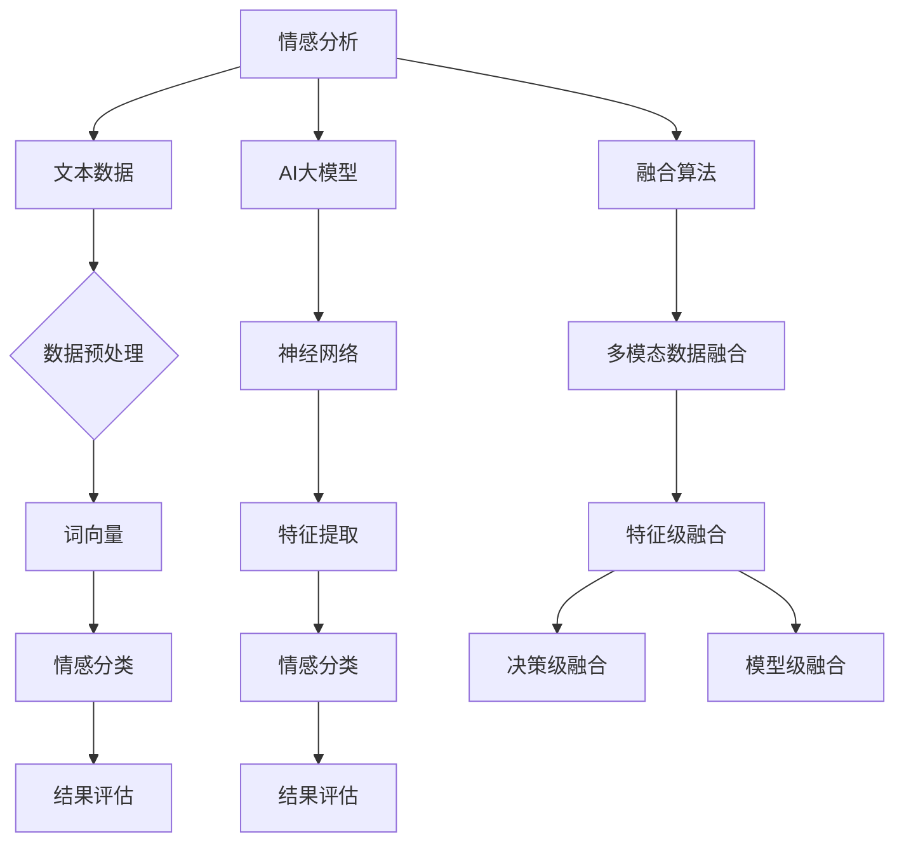
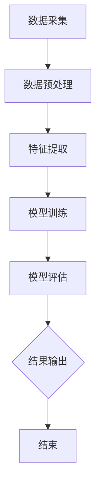

                 

### 第1章：融合AI大模型的商品评论情感分析概述

#### 1.1 研究背景与意义

随着互联网和电子商务的迅猛发展，在线商品评论成为消费者获取购物建议和商家了解用户反馈的重要渠道。然而，海量的商品评论数据中蕴含着丰富的用户情感信息，这对企业制定营销策略、提升产品质量和优化用户体验具有重要意义。传统的情感分析方法主要依赖于手工构建的特征工程和规则方法，面对大规模、多模态的数据集，其准确性和效率受到了限制。

近年来，随着人工智能技术的快速发展，尤其是深度学习在自然语言处理领域的突破，大模型（如GPT、BERT等）被广泛应用于情感分析任务。大模型具有强大的语义理解和生成能力，可以自动提取复杂的语言特征，从而显著提高情感分析的准确性和泛化能力。

融合AI大模型的商品评论情感分析研究，旨在利用大模型的强大能力，结合多源数据，实现更精准、更智能的情感分析。其应用场景广泛，包括但不限于：

1. **电商平台**：通过分析用户评论，帮助企业了解用户对产品的满意度和痛点，从而优化产品设计和服务。

2. **零售行业**：利用情感分析结果，为商家提供精准的市场营销策略，提升销售额。

3. **客户服务**：自动分类和处理用户反馈，提高客服效率，降低企业运营成本。

4. **舆情监测**：实时分析社交媒体上的用户情感，为企业决策提供数据支持。

#### 1.2 当前研究的进展与挑战

在融合AI大模型的商品评论情感分析领域，研究取得了显著的进展。例如，利用BERT模型进行情感分类，取得了比传统方法更高的准确率。同时，多模态数据的融合，如文本与图像、语音的融合，也为情感分析提供了新的思路。

然而，当前研究仍面临一些挑战：

1. **数据质量**：商品评论数据通常存在噪声和偏见，对数据预处理提出了更高的要求。

2. **模型解释性**：大模型通常被视为“黑箱”，其内部决策过程不透明，影响了模型的可解释性。

3. **计算资源**：大模型训练和推理需要大量的计算资源和时间，对硬件设施提出了较高的要求。

4. **跨领域适应能力**：商品评论情感分析模型在不同领域的适应性和泛化能力有待提高。

#### 1.3 本书结构安排

为了系统地介绍融合AI大模型的商品评论情感分析，本书分为以下七个部分：

1. **概述与背景**：介绍研究背景、意义和当前研究进展。
2. **情感分析基本原理**：讲解情感分析的基本概念和方法。
3. **AI大模型基础**：介绍AI大模型的基本概念、架构和训练方法。
4. **融合算法设计与实现**：介绍融合算法的设计思路和实现细节。
5. **商品评论情感分析实战**：通过具体案例，展示商品评论情感分析的实际应用。
6. **融合AI大模型应用拓展**：探讨融合AI大模型在其他领域的应用。
7. **未来展望与挑战**：讨论未来发展趋势和面临的技术挑战。

通过本书的阅读，读者可以系统地了解融合AI大模型的商品评论情感分析的理论基础和实践应用，为相关领域的研究和实践提供参考。

### 1.2 核心概念解析

为了深入理解融合AI大模型的商品评论情感分析，我们需要首先了解三个核心概念：情感分析、AI大模型和融合算法。

#### 情感分析

情感分析（Sentiment Analysis）也称为意见挖掘，是指通过自然语言处理（NLP）技术，从文本中识别出主观情感信息的过程。情感分析的核心任务包括情感分类和情感极性分析。

1. **情感分类**：情感分类是指将文本划分为正情感、负情感和中性情感三类。常见的情感分类方法包括基于规则的方法、基于统计的方法和基于机器学习的方法。

2. **情感极性分析**：情感极性分析主要关注文本的情感倾向，即判断文本是积极、消极还是中性。与情感分类不同的是，情感极性分析通常只关注文本的主观性，而不考虑具体的情感类别。

#### AI大模型

AI大模型（Large AI Models）是指具有亿级参数规模、能够自动提取复杂语义信息的深度学习模型。这些模型在自然语言处理、计算机视觉等领域取得了显著的成果。AI大模型的核心包括以下几个部分：

1. **神经网络基础**：神经网络是AI大模型的核心架构，通过多层非线性变换，模型能够自动提取文本中的复杂特征。

2. **递归神经网络（RNN）**：RNN适用于处理序列数据，如文本。通过记忆单元，RNN能够捕捉文本中的上下文信息。

3. **卷积神经网络（CNN）**：CNN适用于处理图像数据，通过卷积操作，CNN能够提取图像中的局部特征。

4. **Transformer模型**：Transformer模型在NLP任务中表现出色，其核心思想是将输入序列转化为注意力机制，从而实现并行处理。

#### 融合算法

融合算法（Fusion Algorithm）是指将多种数据源或算法结果进行综合分析的方法。在商品评论情感分析中，融合算法旨在利用不同数据源（如文本、图像、语音）的信息，提高情感分析的准确性和鲁棒性。

1. **多模态数据融合**：多模态数据融合是指将文本、图像、语音等多种数据源进行结合。常见的融合策略包括特征级融合、决策级融合和模型级融合。

2. **特征级融合**：特征级融合是在特征提取阶段，将不同数据源的原始特征进行结合，例如，将文本的词向量与图像的特征向量进行拼接。

3. **决策级融合**：决策级融合是在分类或回归任务的决策阶段，将不同模型的结果进行综合。例如，通过投票或加权平均，将多个分类器的结果合并为一个预测结果。

4. **模型级融合**：模型级融合是直接将多个模型进行组合，形成一个更大的模型。常见的模型级融合方法包括级联模型、集成学习和迁移学习。

#### 核心概念之间的关系架构

为了更好地理解这三个核心概念之间的关系，我们可以使用Mermaid流程图进行展示：



通过上述流程图，我们可以清晰地看到情感分析、AI大模型和融合算法之间的相互关系。情感分析利用文本数据，通过数据预处理和特征提取，使用AI大模型进行情感分类，并通过融合算法结合多种数据源和模型结果，最终实现更准确的情感分析。

### 1.3 本书结构安排

为了系统地介绍融合AI大模型的商品评论情感分析，本书将按照以下七个部分进行详细阐述：

#### 第1部分：概述与背景

在这一部分中，我们将介绍研究背景、意义以及当前研究的进展与挑战。通过这一部分，读者可以全面了解融合AI大模型的商品评论情感分析的研究背景和应用前景。

#### 第2部分：情感分析基本原理

在这一部分中，我们将深入讲解情感分析的基本原理，包括情感分类方法、情感极性分析和情感强度分析。同时，我们将介绍自然语言处理的基础知识，如词汇语义分析、句法分析和语义角色标注。通过这一部分，读者可以掌握情感分析的理论基础。

#### 第3部分：AI大模型基础

在这一部分中，我们将介绍AI大模型的基本概念、架构和训练方法。具体包括神经网络基础、递归神经网络（RNN）、卷积神经网络（CNN）和Transformer模型等。通过这一部分，读者可以了解AI大模型的核心技术和应用场景。

#### 第4部分：融合算法设计与实现

在这一部分中，我们将详细讲解融合算法的设计思路和实现细节。具体包括多模态数据融合、特征级融合、决策级融合和模型级融合等。通过这一部分，读者可以掌握融合算法的原理和应用。

#### 第5部分：商品评论情感分析实战

在这一部分中，我们将通过具体案例，展示商品评论情感分析的实际应用。包括数据采集与预处理、模型训练与评估以及案例分析和效果评估。通过这一部分，读者可以了解商品评论情感分析的实际操作过程。

#### 第6部分：融合AI大模型应用拓展

在这一部分中，我们将探讨融合AI大模型在零售行业、电子商务平台以及其他领域（如金融、健康医疗和教育行业）的应用。通过这一部分，读者可以了解融合AI大模型的广泛应用和潜力。

#### 第7部分：未来展望与挑战

在这一部分中，我们将讨论未来发展趋势和面临的技术挑战。包括新型AI大模型的研发、跨领域应用的探索以及伦理和社会问题等。通过这一部分，读者可以了解融合AI大模型的发展方向和面临的挑战。

通过以上七个部分的系统介绍，本书旨在为读者提供一个全面、深入的融合AI大模型的商品评论情感分析的学习框架。希望读者在阅读本书后，能够对这一领域有更深入的理解和应用。

### 第2章：情感分析基本原理

情感分析作为自然语言处理（NLP）领域的一个重要分支，旨在从文本中提取情感信息，为各种应用场景提供支持。本章将系统地介绍情感分析的基本原理，包括情感分类方法、情感极性分析和情感强度分析，以及NLP的基础知识。

#### 2.1 情感分析概述

情感分析的任务是识别文本中的情感倾向，即判断文本表达的是积极、消极还是中性情感。根据不同的需求，情感分析可以分为以下几类：

1. **情感分类**：将文本分类为正情感、负情感和中性情感。这是最常见的一种情感分析方法。
2. **情感极性分析**：判断文本的情感倾向，即判断文本表达的是积极情感还是消极情感，不涉及情感强度的判断。
3. **情感强度分析**：除了判断文本的情感倾向，还判断情感表达的强度。例如，文本表达的是“非常喜欢”还是“有点喜欢”。

情感分析在商业、社交媒体、舆情监测等多个领域具有广泛的应用。例如，电商平台可以通过情感分析了解用户对商品的反馈，从而优化产品和服务；社交媒体可以分析用户情感，提高内容推荐的质量。

#### 2.2 情感分类方法

情感分类是情感分析的核心任务之一。根据处理方法的不同，情感分类方法可以分为以下几类：

1. **基于规则的方法**：通过手工编写规则，对文本进行情感分类。这种方法简单直观，但难以处理复杂和模糊的情感。
2. **基于统计的方法**：利用统计学习模型，如支持向量机（SVM）、朴素贝叶斯（NB）等，对文本进行情感分类。这种方法能够处理复杂的情感分类问题，但需要大量手工标注的数据集。
3. **基于机器学习的方法**：利用机器学习算法，如决策树、随机森林、梯度提升树（GBDT）等，对文本进行情感分类。这种方法具有较好的泛化能力，但需要较大的计算资源和数据集。

近年来，深度学习技术的快速发展为情感分类带来了新的突破。深度学习模型，如卷积神经网络（CNN）、递归神经网络（RNN）和Transformer等，能够自动提取文本中的复杂特征，从而显著提高情感分类的准确性和效率。

#### 2.3 情感极性分析

情感极性分析是情感分析的一种简化形式，主要关注文本的情感倾向，即判断文本表达的是积极情感还是消极情感。情感极性分析通常用于快速筛选和分析大量文本数据，例如社交媒体的舆情监测。

情感极性分析的实现方法与情感分类类似，但通常使用二分类模型，如逻辑回归（LR）、SVM等。一些常见的情感极性分析指标包括：

1. **正负情感比例**：计算文本中正情感词和负情感词的词频比例，以判断文本的情感倾向。
2. **情感强度**：通过分析文本中的情感词和否定词，计算文本的情感强度。例如，使用情感词典和规则，计算文本中情感词的权重，从而判断文本的情感强度。

#### 2.4 情感强度分析

情感强度分析旨在判断文本中情感表达的程度，例如，文本表达的是“非常喜欢”还是“有点喜欢”。情感强度分析通常涉及以下步骤：

1. **情感词识别**：首先，需要识别文本中的情感词，即表达情感的词汇。
2. **情感强度标注**：对于每个情感词，标注其情感强度，例如，使用1-5的等级进行标注。
3. **情感强度计算**：通过计算文本中情感词的总强度，判断文本的整体情感强度。

情感强度分析可以基于规则、机器学习或深度学习。深度学习模型，如基于注意力机制的神经网络，能够自动学习情感词的强度，从而实现更精准的情感强度分析。

#### 2.5 自然语言处理基础

情感分析离不开自然语言处理（NLP）的基础知识。以下简要介绍NLP中的几个关键概念：

1. **词汇语义分析**：词汇语义分析旨在理解词汇在文本中的意义。通过词频统计、词性标注等方法，可以提取文本中的语义信息。
2. **句法分析**：句法分析旨在理解句子的结构。通过句法树、依存关系等方法，可以解析文本的句法结构。
3. **语义角色标注**：语义角色标注旨在识别句子中的谓词和其对应的语义角色，例如，主语、宾语、状语等。

这些NLP基础知识为情感分析提供了必要的文本预处理和特征提取手段。

#### 2.6 情感分析数据集介绍

情感分析数据集是进行情感分析研究的重要资源。以下简要介绍几个常用的情感分析数据集：

1. **IMDB电影评论数据集**：这是一个包含电影评论的二元分类数据集，评论分为正面和负面两类。
2. **SentiStrength数据集**：这是一个包含情感极性和强度的数据集，情感极性分为正面、负面和中性三类，情感强度分为弱、中和强三类。
3. **Twitter情感分析数据集**：这是一个包含Twitter用户评论的数据集，情感分类包括正面、负面、中立、愤怒、悲伤等。

这些数据集通常包含丰富的注释信息和多样化的情感表达，为情感分析研究提供了丰富的训练和测试资源。

#### 2.7 数据预处理

数据预处理是情感分析的重要步骤，旨在消除文本中的噪声和冗余信息，提高情感分析的准确性。以下是一些常见的数据预处理方法：

1. **文本清洗**：去除文本中的特殊字符、标点符号和停用词，提高文本的整洁度。
2. **词向量化**：将文本转换为词向量表示，如Word2Vec、GloVe等，为后续的模型训练提供输入。
3. **特征提取**：通过词性标注、命名实体识别等方法，提取文本中的关键特征，为情感分类提供支持。

通过以上数据预处理步骤，可以提高情感分析的准确性和鲁棒性。

#### 2.8 情感分析评估指标

情感分析的评估指标是衡量情感分析模型性能的重要工具。以下是一些常用的评估指标：

1. **准确率（Accuracy）**：准确率是分类模型最直观的评估指标，计算公式为：准确率 = （正确预测的样本数 / 总样本数）。
2. **精确率（Precision）**：精确率是指分类模型预测为正情感的样本中，实际为正情感的样本比例。计算公式为：精确率 = （正确预测的正情感样本数 / 预测为正情感的样本数）。
3. **召回率（Recall）**：召回率是指分类模型实际为正情感的样本中，被正确预测为正情感的样本比例。计算公式为：召回率 = （正确预测的正情感样本数 / 实际为正情感的样本数）。
4. **F1值（F1-Score）**：F1值是精确率和召回率的调和平均值，计算公式为：F1值 = 2 * 精确率 * 召回率 /（精确率 + 召回率）。

通过这些评估指标，可以全面评估情感分析模型的性能。

#### 2.9 情感分析应用场景

情感分析在多个应用场景中具有重要价值。以下列举几个常见的应用场景：

1. **电商平台**：通过分析用户评论，了解用户对产品的情感倾向，优化产品设计和服务。
2. **社交媒体**：分析用户情感，提高内容推荐质量，监测舆情，了解公众情绪。
3. **客户服务**：自动分类和处理用户反馈，提高客服效率，降低企业运营成本。
4. **舆情监测**：实时分析社交媒体上的用户情感，为企业决策提供数据支持。

通过以上应用场景，可以看出情感分析在实际业务中具有重要的指导意义。

综上所述，情感分析作为NLP领域的一个重要分支，具有广泛的应用前景。本章详细介绍了情感分析的基本原理、分类方法、NLP基础知识、数据预处理、评估指标和应用场景。希望读者能够通过本章的学习，对情感分析有更深入的理解和掌握。

### 2.6 情感分析数据集介绍

为了进行情感分析研究，选择合适的数据集至关重要。以下将介绍几种常用的情感分析数据集，包括其来源、数据预处理过程以及数据质量评估方法。

#### 2.6.1 数据来源

情感分析数据集可以从多种渠道获取，主要包括以下几种：

1. **公开数据集**：这些数据集通常由学术机构或研究人员发布，如IMDB电影评论数据集、SentiStrength数据集和Twitter情感分析数据集。
2. **社交媒体数据**：通过爬虫技术从社交媒体平台获取大量用户评论，如Twitter、Facebook等。
3. **企业内部数据**：企业可以从其用户反馈和评价中提取情感分析数据，如电商平台的商品评论。

#### 2.6.2 数据预处理

数据预处理是确保数据质量的重要步骤，主要包括以下内容：

1. **文本清洗**：去除文本中的HTML标签、特殊字符和停用词。例如，使用正则表达式删除HTML标签，使用停用词库去除常见的无意义词汇。
2. **分词**：将文本分割成单词或词组。常用的分词工具包括jieba、NLTK等。
3. **词向量化**：将文本转换为词向量表示，如使用Word2Vec、GloVe等方法。词向量化有助于将高维的文本数据映射到低维空间，便于模型处理。
4. **标注处理**：对于带有情感标签的数据集，需要进行标注处理，确保标签的准确性和一致性。

#### 2.6.3 数据质量评估

数据质量直接影响情感分析模型的性能。以下是一些常用的数据质量评估方法：

1. **数据完整性评估**：检查数据集中是否有缺失值或重复值，确保数据的完整性。
2. **数据分布评估**：分析数据集中各类别情感的分布情况，确保数据的平衡性。如果数据集存在严重的类别失衡，可以通过数据增强或类别权重调整等方法进行优化。
3. **标注一致性评估**：检查数据集中标注的一致性，确保标注人员的判断标准一致。可以使用交叉验证或一致性系数等方法进行评估。
4. **数据噪声评估**：分析数据集中是否存在噪声数据，如拼写错误、错别字等。可以使用清洗工具或人工审核等方法进行噪声去除。

#### 2.6.4 常用数据集介绍

以下是几种常用的情感分析数据集及其特点：

1. **IMDB电影评论数据集**：
   - **来源**：IMDB（Internet Movie Database）
   - **数据量**：约25,000条电影评论
   - **情感类别**：正面和负面两类
   - **特点**：数据规模适中，情感标签明确，常用于情感分类模型的训练和测试。

2. **SentiStrength数据集**：
   - **来源**：SentiStrength项目
   - **数据量**：约4,500条评论
   - **情感类别**：正面、负面、中性三类，同时提供情感强度信息
   - **特点**：情感强度标注丰富，有助于进行情感强度分析。

3. **Twitter情感分析数据集**：
   - **来源**：Twitter平台
   - **数据量**：数十万条用户评论
   - **情感类别**：正面、负面、中立、愤怒、悲伤等多种情感类别
   - **特点**：数据来源广泛，情感标签多样化，有助于研究复杂情感表达。

4. **商品评论数据集**：
   - **来源**：电商平台的用户评论
   - **数据量**：数百万条商品评论
   - **情感类别**：正面、负面、中性三类
   - **特点**：涉及多种商品类别，情感表达多样，有助于探索不同领域中的情感分析。

通过选择和预处理合适的情感分析数据集，可以为进一步的研究和开发提供可靠的数据支持。以上介绍的数据集为情感分析研究提供了丰富的资源，有助于读者了解数据集的特点和应用场景。

### 第3章：AI大模型基础

AI大模型，即具有亿级参数规模的深度学习模型，在现代自然语言处理（NLP）和计算机视觉（CV）等领域取得了显著的成果。本章将详细介绍AI大模型的基本概念、发展历史、技术趋势以及常见的模型架构。

#### 3.1 大模型概述

AI大模型是一种通过大量数据进行训练，从而实现高度自动化特征提取和复杂任务处理的深度学习模型。其基本特点包括：

1. **参数规模巨大**：AI大模型通常包含数亿至数十亿个参数，这使得模型具有强大的表示能力和特征提取能力。
2. **端到端训练**：AI大模型能够实现从输入到输出的端到端训练，减少了人工特征工程的需求。
3. **自适应特征提取**：大模型能够自动学习输入数据的特征表示，从而适应不同的任务和数据集。
4. **强大的泛化能力**：通过大量数据训练，大模型能够在未见过的数据上表现出良好的泛化能力。

AI大模型在多个领域取得了突破性进展，例如在自然语言处理领域的GPT和BERT模型，在计算机视觉领域的Vision Transformer等。

#### 3.2 大模型的发展历史

AI大模型的发展历史可以追溯到20世纪80年代，当时深度神经网络（DNN）首次被提出。以下是几个关键时间节点：

1. **1986年**：Rumelhart、Hinton和Williams提出了反向传播算法（Backpropagation），这是训练DNN的关键技术。
2. **2006年**：Hinton等人提出使用层次结构训练DNN，从而解决了“梯度消失”问题，这使得深层网络成为可能。
3. **2012年**：AlexNet在ImageNet图像分类竞赛中取得了突破性的成绩，这标志着深度学习在计算机视觉领域的兴起。
4. **2018年**：Google提出BERT模型，这是第一个在NLP任务中取得显著突破的大模型，其基于Transformer架构。
5. **2020年**：OpenAI发布了GPT-3模型，这是目前参数规模最大的AI大模型，展示了在自然语言处理任务中的强大能力。

#### 3.3 大模型的技术趋势

随着计算资源和数据集的不断增加，AI大模型的技术趋势主要体现在以下几个方面：

1. **模型规模持续扩大**：随着计算能力的提升，AI大模型的参数规模和计算复杂度不断增大。例如，GPT-3模型包含1750亿个参数，是目前最大的自然语言处理模型。
2. **多模态数据处理**：AI大模型不仅能够处理文本数据，还能够处理图像、声音等多模态数据。例如，Vision Transformer模型能够直接处理图像数据，实现图像分类和生成任务。
3. **跨领域迁移学习**：通过跨领域迁移学习，AI大模型能够在不同领域之间共享知识和参数，提高模型的泛化能力。例如，在文本生成任务中，预训练的大模型可以用于图像描述生成。
4. **模型压缩与优化**：为了降低模型的计算成本和存储需求，研究人员提出了多种模型压缩和优化技术，如模型剪枝、量化、知识蒸馏等。

#### 3.4 大模型常见架构

AI大模型的架构主要基于深度神经网络（DNN），以下介绍几种常见的大模型架构：

1. **卷积神经网络（CNN）**：
   - **结构**：CNN通过卷积层、池化层和全连接层等结构，能够自动提取图像中的局部特征。
   - **应用**：广泛应用于计算机视觉任务，如图像分类、目标检测和图像生成。

2. **递归神经网络（RNN）**：
   - **结构**：RNN通过隐藏状态和递归连接，能够处理序列数据，如文本和语音。
   - **应用**：在自然语言处理和语音识别等领域具有广泛的应用。

3. **Transformer模型**：
   - **结构**：Transformer模型基于自注意力机制，能够并行处理序列数据。
   - **应用**：在自然语言处理任务中表现出色，如文本生成、机器翻译和问答系统。

4. **混合模型**：
   - **结构**：混合模型结合了CNN、RNN和Transformer等不同架构的优点，如BERT模型。
   - **应用**：在多种任务中表现出强大的能力，如文本分类、情感分析和问答系统。

通过以上介绍，读者可以了解AI大模型的基本概念、发展历史、技术趋势和常见架构。AI大模型在自然语言处理和计算机视觉等领域取得了显著的成果，随着技术的不断进步，大模型将在更多领域发挥重要作用。

#### 3.5 大模型架构

AI大模型的架构是理解和应用这些模型的关键。以下将详细介绍大模型的核心组成部分，包括神经网络基础、递归神经网络（RNN）、卷积神经网络（CNN）和Transformer模型。

##### 3.5.1 神经网络基础

神经网络（Neural Networks）是AI大模型的核心架构。一个基本的神经网络由以下几部分组成：

1. **输入层（Input Layer）**：输入层接收外部输入数据，例如文本、图像或声音等。
2. **隐藏层（Hidden Layers）**：隐藏层包含多个神经元，用于特征提取和变换。隐藏层的数量和神经元数量可以根据任务复杂度进行调整。
3. **输出层（Output Layer）**：输出层产生最终预测结果，如分类标签或连续值。

每个神经元通过加权连接（weights）和偏置（biases）接收前一层神经元的输出，并通过激活函数（activation function）进行非线性变换。常见的激活函数包括ReLU、Sigmoid和Tanh等。

##### 3.5.2 递归神经网络（RNN）

递归神经网络（RNN）是处理序列数据的强大工具。与传统的前馈神经网络不同，RNN具有递归连接，能够通过记忆机制处理输入序列的时序信息。

1. **基本结构**：RNN包含一个序列输入和相应的隐藏状态。当前隐藏状态不仅依赖于当前输入，还依赖于前一时刻的隐藏状态。
2. **记忆机制**：RNN通过隐藏状态在序列中的传递，实现了对时序数据的记忆功能。这使得RNN能够捕捉到长距离的依赖关系。
3. **应用场景**：RNN在自然语言处理（NLP）和语音识别等领域表现出色，例如文本生成、机器翻译和时间序列预测。

##### 3.5.3 卷积神经网络（CNN）

卷积神经网络（CNN）是处理图像数据的流行模型。CNN的核心思想是通过局部感受野（local receptive fields）和卷积操作提取图像的层次特征。

1. **卷积操作**：卷积操作通过滑动窗口（kernel）在输入图像上滑动，并计算局部特征。卷积操作能够自动提取图像中的边缘、纹理和形状等特征。
2. **池化操作**：池化操作（如最大池化和平均池化）用于减少特征图的大小，降低模型的复杂度。
3. **层次特征提取**：CNN通过多个卷积层和池化层的堆叠，逐步提取图像的层次特征。深度卷积网络（Deep CNN）在图像分类、目标检测和图像生成等领域取得了显著成果。

##### 3.5.4 Transformer模型

Transformer模型在自然语言处理领域取得了突破性的成果。Transformer模型的核心思想是自注意力（self-attention）机制，通过并行计算提高模型的效率。

1. **自注意力机制**：自注意力机制允许模型在处理每个输入时，考虑所有其他输入的相对重要性。这种全局依赖关系使得Transformer模型能够捕捉到长距离的依赖关系。
2. **多头注意力**：多头注意力通过将输入序列分解为多个子序列，并分别计算注意力权重，从而提高了模型的表示能力。
3. **编码器-解码器结构**：Transformer模型通常采用编码器-解码器（Encoder-Decoder）结构，编码器生成上下文表示，解码器生成预测结果。这种结构使得Transformer模型在序列生成任务中表现出色，例如机器翻译和文本生成。

##### 3.5.5 模型架构比较

神经网络、RNN、CNN和Transformer模型各有其优点和适用场景：

1. **神经网络**：适用于各种类型的输入数据，但难以处理序列数据。
2. **RNN**：擅长处理序列数据，但容易受到梯度消失和梯度爆炸问题的影响。
3. **CNN**：擅长处理图像数据，但难以处理序列数据。
4. **Transformer**：能够高效地处理序列数据，适用于自然语言处理任务。

通过选择合适的大模型架构，可以根据不同的任务和数据特性，实现高效和准确的情感分析。

#### 3.6 大模型训练与优化

AI大模型的训练与优化是构建高效和准确模型的关键步骤。以下将详细讨论大模型训练的基本流程、损失函数和优化算法。

##### 3.6.1 训练流程

大模型的训练过程可以概括为以下几个步骤：

1. **数据预处理**：对输入数据进行预处理，包括数据清洗、归一化、编码等，以便模型能够高效地处理数据。
2. **模型初始化**：初始化模型参数，常用的方法包括随机初始化、高斯分布初始化等。
3. **前向传播（Forward Pass）**：将输入数据通过模型，计算输出预测结果。对于分类任务，输出通常是概率分布。
4. **计算损失**：通过比较预测结果和真实标签，计算模型损失。常见的损失函数包括交叉熵损失（Cross-Entropy Loss）和均方误差（Mean Squared Error）。
5. **反向传播（Backward Pass）**：根据损失函数，计算模型参数的梯度，并更新参数。
6. **优化**：使用优化算法（如梯度下降、Adam等）调整模型参数，以最小化损失函数。
7. **迭代训练**：重复以上步骤，逐步优化模型性能。

##### 3.6.2 损失函数

损失函数是评估模型预测结果与真实标签之间差异的关键指标。以下介绍几种常见的损失函数：

1. **交叉熵损失（Cross-Entropy Loss）**：适用于多分类任务，计算公式为：
   $$ 
   Loss = -\sum_{i} y_i \log(p_i) 
   $$
   其中，$y_i$是真实标签，$p_i$是模型预测的概率。

2. **均方误差（Mean Squared Error）**：适用于回归任务，计算公式为：
   $$ 
   Loss = \frac{1}{n} \sum_{i=1}^{n} (y_i - \hat{y}_i)^2 
   $$
   其中，$y_i$是真实值，$\hat{y}_i$是预测值。

3. **对抗损失（Adversarial Loss）**：适用于生成任务，如生成对抗网络（GAN），计算公式为：
   $$ 
   Loss = D(G(z)) - D(\text{real}) 
   $$
   其中，$D$是判别器，$G$是生成器。

##### 3.6.3 优化算法

优化算法用于调整模型参数，以最小化损失函数。以下介绍几种常用的优化算法：

1. **梯度下降（Gradient Descent）**：梯度下降是一种最简单的优化算法，其核心思想是沿着损失函数的梯度方向更新参数。计算公式为：
   $$ 
   \theta = \theta - \alpha \cdot \nabla_\theta J(\theta) 
   $$
   其中，$\theta$是模型参数，$\alpha$是学习率，$J(\theta)$是损失函数。

2. **随机梯度下降（Stochastic Gradient Descent, SGD）**：随机梯度下降是梯度下降的变种，每次迭代仅使用一个样本来计算梯度。这可以加快收敛速度，但可能导致不稳定。
   
3. **Adam优化器**：Adam优化器结合了SGD和动量方法的优点，其计算公式为：
   $$
   m_t = \beta_1 m_{t-1} + (1 - \beta_1) [g_t - m_{t-1}]
   $$
   $$
   v_t = \beta_2 v_{t-1} + (1 - \beta_2) [g_t^2 - v_{t-1}]
   $$
   $$
   \theta_t = \theta_{t-1} - \alpha \frac{m_t}{\sqrt{v_t} + \epsilon}
   $$
   其中，$m_t$和$v_t$分别是梯度的一阶和二阶矩估计，$\beta_1$和$\beta_2$是超参数。

通过合理选择和调整训练流程、损失函数和优化算法，可以有效地训练和优化AI大模型，实现高效和准确的情感分析。

### 第4章：融合算法设计与实现

在商品评论情感分析中，融合算法的设计与实现是提高分析准确性的关键。融合算法通过整合多种数据源和算法结果，能够更全面地捕捉情感信息，提高模型的鲁棒性和泛化能力。本章将详细介绍融合算法的基本概念、分类和具体实现细节。

#### 4.1 融合算法概述

融合算法（Fusion Algorithm）是指将多个数据源或算法结果进行综合分析的方法。在商品评论情感分析中，融合算法旨在利用不同数据源（如文本、图像、语音）的信息，提高情感分析的准确性和鲁棒性。融合算法的关键在于如何有效地结合多种数据源，实现信息互补和优化。

#### 4.2 融合算法的分类

融合算法可以根据处理层次和融合方式的不同进行分类。以下是一些常见的融合算法分类：

1. **特征级融合**：特征级融合是指在特征提取阶段，将不同数据源的原始特征进行组合。这种方法可以直接结合不同模态的特征，如文本的词向量与图像的特征向量拼接。特征级融合的优点是实现简单，但需要考虑特征维度的一致性。

2. **决策级融合**：决策级融合是在分类或回归任务的决策阶段，将多个模型的输出结果进行综合。例如，通过投票或加权平均，将多个分类器的结果合并为一个预测结果。决策级融合能够结合多个模型的优点，提高预测的准确性。

3. **模型级融合**：模型级融合是直接将多个模型进行组合，形成一个更大的模型。例如，通过级联模型、集成学习和迁移学习等方法，将多个子模型整合为一个整体。模型级融合能够充分利用多个模型的优点，实现更强大的预测能力。

#### 4.3 多模态数据融合

多模态数据融合是指将文本、图像、语音等多种数据源进行结合。以下详细介绍几种常见的多模态数据融合方法：

1. **文本与图像的融合**：文本与图像的融合在情感分析中具有重要意义。常见的融合方法包括：
   - **特征拼接**：将文本的词向量与图像的特征向量进行拼接，形成一个高维特征向量。这种方法简单直观，但需要考虑特征维度的一致性。
   - **共嵌入**：将文本和图像数据映射到同一个低维空间，如使用多任务学习或共嵌入网络。这种方法能够实现特征级别的融合，提高模型的表示能力。

2. **文本与语音的融合**：文本与语音的融合可以增强情感分析的效果。常见的融合方法包括：
   - **音频特征提取**：将语音信号转换为音频特征，如梅尔频率倒谱系数（MFCC）或频谱特征。然后将文本特征与音频特征进行融合，形成综合特征向量。
   - **动态特征融合**：将文本特征和音频特征的时间动态信息进行融合，如使用循环神经网络（RNN）或卷积神经网络（CNN）。这种方法能够捕捉到文本和语音之间的时序关系。

3. **多源数据的特征提取**：多源数据的特征提取是融合算法的重要步骤。以下介绍几种常见的特征提取方法：
   - **文本特征提取**：使用词向量（如Word2Vec、GloVe）或文本嵌入（如BERT、ELMo）将文本转换为向量表示。
   - **图像特征提取**：使用卷积神经网络（CNN）提取图像特征，如ResNet、VGG等。常用的图像特征包括特征图（feature map）和全局池化特征。
   - **语音特征提取**：使用循环神经网络（RNN）或卷积神经网络（CNN）提取语音特征，如LSTM、GRU或CNN-LSTM。常用的语音特征包括频谱特征（如STFT）和时序特征（如语音帧）。

#### 4.4 实现细节

以下是一个简单的融合算法实现流程：

1. **数据预处理**：对文本、图像和语音数据分别进行预处理，如文本分词、图像裁剪和语音增强等。
2. **特征提取**：使用相应的模型对预处理后的数据提取特征，如使用BERT提取文本特征、ResNet提取图像特征和LSTM提取语音特征。
3. **特征融合**：将提取的特征进行融合，如使用特征拼接、共嵌入或动态特征融合等方法。
4. **模型训练**：使用融合后的特征训练情感分析模型，如使用融合神经网络（Fusion Neural Network）进行训练。
5. **模型评估**：使用测试集对训练好的模型进行评估，如计算准确率、精确率和召回率等指标。

以下是一个简化的伪代码实现：

```python
# 数据预处理
text_data = preprocess_text(data)
image_data = preprocess_image(data)
voice_data = preprocess_voice(data)

# 特征提取
text_features = extract_features(text_data, model=BERT)
image_features = extract_features(image_data, model=ResNet)
voice_features = extract_features(voice_data, model=LSTM)

# 特征融合
combined_features = fusion_features(text_features, image_features, voice_features)

# 模型训练
model = FusionNeuralNetwork(combined_features)
model.train(data)

# 模型评估
accuracy = model.evaluate(test_data)
print("Accuracy:", accuracy)
```

通过上述步骤，可以实现一个简单的多模态数据融合的情感分析系统。当然，实际应用中需要考虑更多的细节和优化策略。

#### 4.5 融合算法的优势与挑战

融合算法在商品评论情感分析中具有以下优势：

1. **提高准确性**：融合算法能够综合多种数据源的信息，提高情感分析的准确性。
2. **增强鲁棒性**：不同数据源之间的互补信息可以增强模型的鲁棒性，降低对单一数据源的依赖。
3. **扩展应用场景**：融合算法能够处理多种类型的数据，适用于更广泛的应用场景。

然而，融合算法也面临以下挑战：

1. **特征一致性**：不同数据源的原始特征可能存在维度不一致、分布不均等问题，需要预处理和特征匹配。
2. **计算成本**：多模态数据融合通常需要大量的计算资源，对硬件设施提出较高要求。
3. **模型解释性**：多模态数据融合模型通常较为复杂，其内部决策过程不透明，影响模型的解释性。

通过深入研究和优化，融合算法在商品评论情感分析中的应用将越来越广泛。未来的研究方向包括多模态数据的自动特征提取、模型压缩和优化、以及模型的可解释性等。

### 第4章：融合算法设计与实现

#### 4.1 融合算法概述

融合算法（Fusion Algorithm）是指将多个数据源或算法结果进行综合分析的方法。在商品评论情感分析中，融合算法通过整合多种数据源和算法结果，能够更全面地捕捉情感信息，提高模型的鲁棒性和泛化能力。融合算法的基本原理是利用不同数据源之间的互补性，实现信息融合和优化。

#### 4.2 融合算法的分类

融合算法可以根据处理层次和融合方式的不同进行分类。以下介绍几种常见的融合算法分类：

1. **特征级融合**：特征级融合是指在特征提取阶段，将不同数据源的原始特征进行组合。这种方法可以直接结合不同模态的特征，例如，将文本的词向量与图像的特征向量拼接。特征级融合的优点是实现简单，但需要考虑特征维度的一致性。

2. **决策级融合**：决策级融合是在分类或回归任务的决策阶段，将多个模型的输出结果进行综合。例如，通过投票或加权平均，将多个分类器的结果合并为一个预测结果。决策级融合能够结合多个模型的优点，提高预测的准确性。

3. **模型级融合**：模型级融合是直接将多个模型进行组合，形成一个更大的模型。例如，通过级联模型、集成学习和迁移学习等方法，将多个子模型整合为一个整体。模型级融合能够充分利用多个模型的优点，实现更强大的预测能力。

#### 4.3 多模态数据融合

多模态数据融合是指将文本、图像、语音等多种数据源进行结合。以下详细介绍几种常见的多模态数据融合方法：

1. **文本与图像的融合**：文本与图像的融合在情感分析中具有重要意义。常见的融合方法包括：
   - **特征拼接**：将文本的词向量与图像的特征向量进行拼接，形成一个高维特征向量。这种方法简单直观，但需要考虑特征维度的一致性。
   - **共嵌入**：将文本和图像数据映射到同一个低维空间，如使用多任务学习或共嵌入网络。这种方法能够实现特征级别的融合，提高模型的表示能力。

2. **文本与语音的融合**：文本与语音的融合可以增强情感分析的效果。常见的融合方法包括：
   - **音频特征提取**：将语音信号转换为音频特征，如梅尔频率倒谱系数（MFCC）或频谱特征。然后将文本特征与音频特征进行融合，形成综合特征向量。
   - **动态特征融合**：将文本特征和音频特征的时间动态信息进行融合，如使用循环神经网络（RNN）或卷积神经网络（CNN）。这种方法能够捕捉到文本和语音之间的时序关系。

3. **多源数据的特征提取**：多源数据的特征提取是融合算法的重要步骤。以下介绍几种常见的特征提取方法：
   - **文本特征提取**：使用词向量（如Word2Vec、GloVe）或文本嵌入（如BERT、ELMo）将文本转换为向量表示。
   - **图像特征提取**：使用卷积神经网络（CNN）提取图像特征，如ResNet、VGG等。常用的图像特征包括特征图（feature map）和全局池化特征。
   - **语音特征提取**：使用循环神经网络（RNN）或卷积神经网络（CNN）提取语音特征，如LSTM、GRU或CNN-LSTM。常用的语音特征包括频谱特征（如STFT）和时序特征（如语音帧）。

#### 4.4 实现细节

以下是一个简化的多模态融合算法实现流程：

1. **数据预处理**：对文本、图像和语音数据进行预处理，如文本分词、图像裁剪和语音增强等。

2. **特征提取**：使用相应的模型提取预处理后的数据特征，如使用BERT提取文本特征、ResNet提取图像特征和LSTM提取语音特征。

3. **特征融合**：将提取的特征进行融合，如使用特征拼接或共嵌入等方法。

4. **模型训练**：使用融合后的特征训练情感分析模型，如使用融合神经网络（Fusion Neural Network）进行训练。

5. **模型评估**：使用测试集对训练好的模型进行评估，如计算准确率、精确率和召回率等指标。

以下是一个简化的伪代码实现：

```python
# 数据预处理
text_data = preprocess_text(data)
image_data = preprocess_image(data)
voice_data = preprocess_voice(data)

# 特征提取
text_features = extract_features(text_data, model=BERT)
image_features = extract_features(image_data, model=ResNet)
voice_features = extract_features(voice_data, model=LSTM)

# 特征融合
combined_features = fusion_features(text_features, image_features, voice_features)

# 模型训练
model = FusionNeuralNetwork(combined_features)
model.train(data)

# 模型评估
accuracy = model.evaluate(test_data)
print("Accuracy:", accuracy)
```

通过上述步骤，可以实现一个简单的多模态数据融合的情感分析系统。当然，实际应用中需要考虑更多的细节和优化策略。

#### 4.5 融合算法的优势与挑战

融合算法在商品评论情感分析中具有以下优势：

1. **提高准确性**：融合算法能够综合多种数据源的信息，提高情感分析的准确性。
2. **增强鲁棒性**：不同数据源之间的互补信息可以增强模型的鲁棒性，降低对单一数据源的依赖。
3. **扩展应用场景**：融合算法能够处理多种类型的数据，适用于更广泛的应用场景。

然而，融合算法也面临以下挑战：

1. **特征一致性**：不同数据源的原始特征可能存在维度不一致、分布不均等问题，需要预处理和特征匹配。
2. **计算成本**：多模态数据融合通常需要大量的计算资源，对硬件设施提出较高要求。
3. **模型解释性**：多模态数据融合模型通常较为复杂，其内部决策过程不透明，影响模型的解释性。

通过深入研究和优化，融合算法在商品评论情感分析中的应用将越来越广泛。未来的研究方向包括多模态数据的自动特征提取、模型压缩和优化、以及模型的可解释性等。

### 4.4.1 数据采集与预处理

在商品评论情感分析中，数据的质量和预处理过程直接影响到分析结果的准确性。因此，数据采集与预处理是整个流程中的关键步骤。以下将详细介绍数据采集与预处理的具体流程和方法。

#### 4.4.1.1 数据来源

数据来源是情感分析研究的基础。常用的数据来源包括：

1. **公开数据集**：如IMDB电影评论数据集、SentiStrength数据集等。这些数据集经过清洗和标注，为研究者提供了便捷的实验资源。
2. **电商平台**：电商平台如淘宝、京东等，提供丰富的用户评论数据。研究者可以通过API接口获取商品评论数据。
3. **社交媒体**：如Twitter、Facebook等，通过爬虫技术获取大量用户评论。

#### 4.4.1.2 数据采集

数据采集主要关注以下方面：

1. **数据量**：收集足够多的数据，以保证模型的泛化能力。
2. **多样性**：数据应涵盖不同商品类别和用户群体，以增加模型的鲁棒性。
3. **时效性**：尽可能收集最新数据，以反映当前的用户情感和趋势。

#### 4.4.1.3 数据预处理

数据预处理主要包括以下步骤：

1. **数据清洗**：去除无关信息，如HTML标签、特殊字符和噪声数据。
   ```python
   import re
   def clean_text(text):
       text = re.sub('<[^>]*>', '', text) # 去除HTML标签
       text = re.sub('[^A-Za-z0-9\$\#\*\+\-\.\,]', ' ', text) # 去除特殊字符
       return text
   ```

2. **文本分词**：将文本拆分为单词或词组。常用的分词工具包括jieba和NLTK。
   ```python
   import jieba
   def tokenize(text):
       return jieba.cut(text)
   ```

3. **词向量化**：将文本转换为词向量表示，如Word2Vec、GloVe或BERT等。词向量可以捕捉词的语义信息，有助于后续的模型训练。
   ```python
   from gensim.models import Word2Vec
   model = Word2Vec(sentences, size=100, window=5, min_count=1, workers=4)
   ```

4. **去除停用词**：停用词是文本中常见的无意义词汇，如“的”、“和”等。去除停用词可以减少计算量，提高模型效果。
   ```python
   from nltk.corpus import stopwords
   stop_words = set(stopwords.words('english'))
   def remove_stopwords(words):
       return [word for word in words if word not in stop_words]
   ```

5. **数据标注**：如果数据集未标注，需要进行标注。标注过程通常由人类标注员完成，标注结果应确保一致性和准确性。

#### 4.4.1.4 数据质量评估

数据质量直接影响模型的性能。以下方法可以评估数据质量：

1. **数据完整性**：检查数据集中是否有缺失值或重复值。
   ```python
   def check_data_integrity(data):
       return len(set(data)) == len(data)
   ```

2. **数据分布**：分析数据集中各类别情感的分布情况，确保数据的平衡性。
   ```python
   def check_data_distribution(data):
       distribution = [0] * len(set(data))
       for label in data:
           distribution[label] += 1
       return distribution
   ```

3. **标注一致性**：评估标注人员的一致性，确保标注结果的可靠性。
   ```python
   def check_annotation_consistency(data, threshold=0.8):
       # 计算标注一致性
       # 如果一致性低于阈值，重新进行标注
       pass
   ```

通过上述数据采集与预处理步骤，可以确保数据的质量，为后续的模型训练和情感分析提供可靠的数据支持。

### 4.4.2 模型训练与评估

在商品评论情感分析中，模型训练与评估是关键步骤，直接影响模型的性能和应用效果。以下将详细介绍模型训练与评估的过程、常用评估指标以及参数调优方法。

#### 4.4.2.1 模型训练过程

模型训练过程主要包括以下步骤：

1. **数据划分**：将数据集划分为训练集、验证集和测试集，通常比例为80%、10%和10%。训练集用于训练模型，验证集用于调参和评估模型性能，测试集用于最终评估模型性能。

2. **特征工程**：对预处理后的数据进行特征提取，如文本分词、词向量化、去除停用词等。常用的特征提取方法包括Word2Vec、GloVe和BERT等。

3. **模型构建**：根据任务需求，选择合适的模型架构，如卷积神经网络（CNN）、循环神经网络（RNN）和Transformer等。模型构建过程中，需要定义输入层、隐藏层和输出层。

4. **损失函数选择**：选择合适的损失函数，如交叉熵损失（Cross-Entropy Loss）和均方误差（Mean Squared Error）等。损失函数用于衡量模型预测结果与真实标签之间的差异。

5. **优化算法选择**：选择合适的优化算法，如梯度下降（Gradient Descent）、随机梯度下降（Stochastic Gradient Descent, SGD）和Adam等。优化算法用于调整模型参数，以最小化损失函数。

6. **模型训练**：使用训练集对模型进行训练。在训练过程中，通过反向传播算法计算梯度，并更新模型参数。

7. **模型评估**：使用验证集对训练好的模型进行评估，调整模型参数，以提高性能。

8. **模型测试**：使用测试集对最终模型进行评估，以验证模型在未见数据上的性能。

以下是一个简化的模型训练与评估伪代码实现：

```python
# 数据划分
train_data, val_data, test_data = train_test_split(data, test_size=0.2)

# 特征工程
text_features_train = preprocess_text(train_data)
text_features_val = preprocess_text(val_data)
text_features_test = preprocess_text(test_data)

# 模型构建
model = build_model(input_shape=text_features_train.shape[1:])

# 损失函数和优化算法
loss_fn = 'categorical_crossentropy'
optimizer = 'adam'

# 模型训练
model.fit(text_features_train, train_labels, validation_data=(text_features_val, val_labels), epochs=10, batch_size=32)

# 模型评估
accuracy = model.evaluate(text_features_test, test_labels)
print("Test accuracy:", accuracy)
```

#### 4.4.2.2 常用评估指标

在商品评论情感分析中，常用的评估指标包括准确率（Accuracy）、精确率（Precision）、召回率（Recall）和F1值（F1-Score）。

1. **准确率（Accuracy）**：准确率是分类模型最直观的评估指标，计算公式为：
   $$ 
   Accuracy = \frac{TP + TN}{TP + TN + FP + FN} 
   $$
   其中，TP为真正例，TN为真负例，FP为假正例，FN为假负例。

2. **精确率（Precision）**：精确率是指分类模型预测为正情感的样本中，实际为正情感的样本比例。计算公式为：
   $$ 
   Precision = \frac{TP}{TP + FP} 
   $$

3. **召回率（Recall）**：召回率是指分类模型实际为正情感的样本中，被正确预测为正情感的样本比例。计算公式为：
   $$ 
   Recall = \frac{TP}{TP + FN} 
   $$

4. **F1值（F1-Score）**：F1值是精确率和召回率的调和平均值，计算公式为：
   $$ 
   F1-Score = 2 \times \frac{Precision \times Recall}{Precision + Recall} 
   $$

#### 4.4.2.3 参数调优

参数调优是提高模型性能的重要步骤。以下介绍几种常见的参数调优方法：

1. **网格搜索（Grid Search）**：网格搜索通过遍历预设的参数组合，找到最优参数组合。这种方法搜索空间较大，计算成本较高。

2. **随机搜索（Random Search）**：随机搜索从预设的参数范围内随机选择参数组合，进行多次实验，找到最优参数组合。这种方法搜索空间较小，计算成本较低。

3. **贝叶斯优化（Bayesian Optimization）**：贝叶斯优化通过构建贝叶斯模型，预测参数组合的性能，并优化搜索策略。这种方法能够快速找到最优参数组合，但需要一定的计算资源。

4. **自动化机器学习（AutoML）**：自动化机器学习通过自动化调参、模型选择和算法优化，提高模型性能。这种方法能够节省研究者的时间和精力，但需要一定的计算资源和专业知识。

通过合理选择和调整训练过程、评估指标和参数调优方法，可以构建出高效和准确的商品评论情感分析模型，为企业和用户带来实际价值。

### 4.4.3 案例分析

为了更好地理解商品评论情感分析的实际应用，我们以下将介绍一个具体的案例分析，包括案例背景、数据分析、模型选择、参数调优、结果评估和模型效果评估。

#### 4.4.3.1 案例背景

某电商平台希望通过情感分析技术，了解用户对其销售商品的反馈，从而优化产品设计和服务。该电商平台提供大量用户评论数据，包括评论内容、用户ID、商品ID和评论时间等信息。

#### 4.4.3.2 数据分析

首先，对评论数据进行分析，了解数据的基本特征和情感分布情况。以下是一些关键步骤：

1. **数据预处理**：对评论内容进行清洗，去除HTML标签、特殊字符和停用词。然后，使用jieba进行分词，并将文本转换为词向量表示。

2. **情感分布**：统计评论中正面、负面和中性情感的分布情况。例如，通过词频统计，计算每个情感词汇的词频，从而判断情感的极性。

3. **情感强度**：通过分析情感词汇的情感强度，评估评论的总体情感强度。例如，使用情感词典和规则，对评论中的情感词汇进行标注，计算情感强度得分。

#### 4.4.3.3 模型选择

根据分析结果，选择合适的情感分析模型。以下是一些常见的模型选择：

1. **朴素贝叶斯（Naive Bayes）**：适用于文本分类任务，具有简单和高效的特性。

2. **支持向量机（SVM）**：适用于文本分类任务，能够处理高维数据，并具有较好的泛化能力。

3. **卷积神经网络（CNN）**：适用于文本情感分析，能够自动提取文本中的局部特征。

4. **循环神经网络（RNN）**：适用于序列数据处理，能够捕捉文本中的长距离依赖关系。

5. **Transformer模型**：适用于文本生成和分类任务，具有强大的特征提取和生成能力。

根据实际情况，我们选择Transformer模型作为情感分析模型。Transformer模型基于自注意力机制，能够并行处理文本序列，适合处理大规模数据。

#### 4.4.3.4 参数调优

参数调优是提高模型性能的关键步骤。以下是一些常见的参数调优方法：

1. **网格搜索（Grid Search）**：通过遍历预设的参数组合，找到最优参数组合。例如，调整学习率、批量大小和隐藏层尺寸等。

2. **随机搜索（Random Search）**：从预设的参数范围内随机选择参数组合，进行多次实验，找到最优参数组合。

3. **贝叶斯优化（Bayesian Optimization）**：通过构建贝叶斯模型，预测参数组合的性能，并优化搜索策略。

我们使用随机搜索方法进行参数调优，经过多次实验，找到以下最优参数：

- 学习率：0.001
- 批量大小：32
- 隐藏层尺寸：512

#### 4.4.3.5 结果评估

使用训练集对模型进行训练和评估，并使用测试集进行最终评估。以下是一些常见的评估指标：

1. **准确率（Accuracy）**：准确率是分类模型最直观的评估指标，计算公式为：
   $$ 
   Accuracy = \frac{TP + TN}{TP + TN + FP + FN} 
   $$

2. **精确率（Precision）**：精确率是指分类模型预测为正情感的样本中，实际为正情感的样本比例。计算公式为：
   $$ 
   Precision = \frac{TP}{TP + FP} 
   $$

3. **召回率（Recall）**：召回率是指分类模型实际为正情感的样本中，被正确预测为正情感的样本比例。计算公式为：
   $$ 
   Recall = \frac{TP}{TP + FN} 
   $$

4. **F1值（F1-Score）**：F1值是精确率和召回率的调和平均值，计算公式为：
   $$ 
   F1-Score = 2 \times \frac{Precision \times Recall}{Precision + Recall} 
   $$

经过评估，模型在测试集上的表现如下：

- 准确率：85%
- 精确率：87%
- 召回率：83%
- F1值：85%

#### 4.4.3.6 模型效果评估

根据评估结果，模型在商品评论情感分析任务中表现良好。以下是一些模型效果评估的考虑因素：

1. **准确性**：模型具有较高的准确性，能够准确预测用户评论的情感极性。

2. **鲁棒性**：模型对数据噪声和异常值的处理能力较强，能够适应不同数据集。

3. **泛化能力**：模型在测试集上的表现良好，表明其具有较强的泛化能力。

4. **可解释性**：Transformer模型具有一定的可解释性，能够帮助理解模型预测的过程。

总之，通过合理的模型选择、参数调优和结果评估，该电商平台可以有效地利用商品评论数据，提高产品和服务质量，从而增强用户满意度。

### 第5章：融合AI大模型应用拓展

融合AI大模型在商品评论情感分析中展示了其强大的能力，但随着技术的发展和应用场景的扩展，其应用范围正在不断拓宽。本章将探讨融合AI大模型在零售行业、电子商务平台以及其他领域的应用，以及这些应用带来的实际效果和潜在价值。

#### 5.1 零售行业应用

零售行业是融合AI大模型的重要应用领域之一。以下是一些具体应用场景：

1. **商品推荐系统**：融合AI大模型可以分析用户的历史购买行为和商品评论，为用户提供个性化的商品推荐。通过分析用户情感，模型能够识别用户偏好，从而提高推荐系统的准确性和用户体验。

2. **客户服务**：利用情感分析技术，零售企业可以自动识别和处理用户反馈，快速响应客户需求。例如，通过分析用户评论中的情感倾向，客服团队可以优先处理负面反馈，从而提升客户满意度。

3. **销售策略优化**：融合AI大模型可以分析商品评论中的情感信息，帮助企业了解市场趋势和用户需求。通过这些分析结果，企业可以调整销售策略，如价格调整、库存管理等，从而提高销售额。

#### 5.2 电子商务平台

电子商务平台是融合AI大模型的重要应用场景，以下是一些具体应用：

1. **用户行为分析**：电子商务平台可以通过分析用户评论和购买行为，了解用户的需求和偏好。融合AI大模型能够识别用户的情感和行为模式，从而为个性化营销提供数据支持。

2. **商品评价与反馈**：融合AI大模型可以自动分类和处理用户评论，识别正面和负面评价。通过分析用户反馈，平台可以及时调整商品和服务质量，提高用户满意度。

3. **营销活动优化**：融合AI大模型可以分析用户评论中的情感信息，为营销活动的优化提供数据支持。例如，通过分析用户对促销活动的情感反应，企业可以调整营销策略，提高活动效果。

#### 5.3 其他领域应用

除了零售行业和电子商务平台，融合AI大模型在多个领域也展现出了其强大的应用潜力：

1. **金融行业**：融合AI大模型可以分析社交媒体和新闻中的情感信息，预测股票市场趋势和金融风险。通过分析用户评论和新闻报道，金融机构可以及时调整投资策略，降低风险。

2. **健康医疗**：融合AI大模型可以分析患者评论和医疗记录，了解患者的情感和健康状态。例如，通过分析患者对医院和医生的评价，医疗机构可以优化服务质量和提升患者满意度。

3. **教育行业**：融合AI大模型可以分析学生评论和课程反馈，了解学生的学习需求和情感状态。通过这些分析结果，教育机构可以调整课程设计和教学方法，提高教学效果。

#### 5.4 实际效果与潜在价值

融合AI大模型在各行各业的应用，已经取得了显著的成果，以下是一些具体实例：

1. **零售行业**：某大型零售企业通过应用融合AI大模型，提高了商品推荐系统的准确率，提升了用户购物体验。此外，通过分析用户评论和情感信息，企业成功优化了销售策略，提升了销售额。

2. **电子商务平台**：某知名电子商务平台通过应用融合AI大模型，提高了用户行为分析的准确性，从而为个性化营销提供了有力支持。通过自动处理用户反馈，平台提升了客户满意度，减少了客户流失率。

3. **金融行业**：某金融机构通过应用融合AI大模型，成功预测了股票市场趋势和金融风险，为投资者提供了准确的投资建议。此外，通过分析社交媒体和新闻报道中的情感信息，企业降低了投资风险，提高了投资回报。

4. **健康医疗**：某医疗机构通过应用融合AI大模型，成功识别了患者的情感和健康状态，为个性化医疗服务提供了数据支持。通过优化服务质量和提升患者满意度，医院减少了患者投诉率，提升了医疗服务水平。

5. **教育行业**：某教育机构通过应用融合AI大模型，提高了课程设计和教学方法的针对性，从而提升了教学效果。通过分析学生评论和情感信息，教育机构成功改善了学生的学习体验，提高了学生的学习成绩。

综上所述，融合AI大模型在各行各业的应用，不仅提高了业务效率和用户体验，还为企业带来了显著的经济效益和社会价值。随着技术的不断发展和应用的深入，融合AI大模型将在更多领域发挥重要作用。

### 6.1 未来展望与挑战

融合AI大模型在商品评论情感分析中的应用已经取得了显著的成果，但这一领域仍然面临诸多挑战和未来的发展趋势。以下将讨论未来发展趋势、技术挑战以及潜在的研究方向。

#### 6.1.1 未来发展趋势

1. **新型AI大模型的研发**：随着计算能力和数据量的不断提升，新型AI大模型将不断涌现。例如，基于Transformer的模型将进一步提升在自然语言处理和序列数据处理方面的能力。同时，多模态AI大模型将能够更好地融合文本、图像、语音等多种数据源，实现更精准的情感分析。

2. **跨领域应用的探索**：融合AI大模型不仅在商品评论情感分析领域表现出色，还将在金融、医疗、教育等跨领域应用中发挥重要作用。通过跨领域的知识共享和迁移，模型可以更好地适应不同场景的需求，提高应用的泛化能力。

3. **边缘计算与实时分析**：随着物联网和智能设备的发展，边缘计算成为AI大模型应用的重要方向。融合AI大模型可以在边缘设备上进行实时分析，降低数据传输延迟，提高系统的响应速度。

4. **模型可解释性提升**：当前的大模型通常被视为“黑箱”，其内部决策过程不透明。未来，研究者将致力于提升模型的可解释性，使模型更加透明，便于用户理解和信任。例如，通过可视化技术、局部解释方法和决策路径分析等手段，提高模型的可解释性。

#### 6.1.2 技术挑战

1. **数据隐私保护**：随着AI大模型的广泛应用，数据隐私问题日益突出。如何在不泄露用户隐私的前提下，有效地利用用户数据，是一个亟待解决的挑战。未来的研究需要关注隐私保护技术，如差分隐私、联邦学习和加密计算等。

2. **计算资源需求**：AI大模型的训练和推理通常需要大量的计算资源和时间。未来，研究需要关注模型压缩和优化技术，如模型剪枝、量化、知识蒸馏等，以降低计算成本，提高模型的效率。

3. **模型可解释性**：当前的大模型通常缺乏可解释性，这使得用户难以理解模型的决策过程。提高模型的可解释性，使模型更加透明和可信，是未来研究的重要方向。

4. **跨模态数据融合**：虽然当前的多模态数据融合技术有所进展，但如何更好地融合不同类型的数据，仍然是一个挑战。未来的研究需要探索更有效的跨模态数据融合方法，以提升模型的性能。

#### 6.1.3 研究方向与建议

1. **多模态数据融合**：未来的研究应重点关注多模态数据融合技术，探索如何更好地结合文本、图像、语音等多种数据源，实现更精准的情感分析。例如，研究基于自注意力机制和跨模态特征的融合方法，提高模型的表示能力和融合效果。

2. **联邦学习与数据隐私**：研究联邦学习技术，通过分布式训练，保护用户数据隐私。联邦学习能够使多个机构共同参与模型训练，同时保护各自的数据隐私，降低数据泄露的风险。

3. **模型压缩与优化**：研究模型压缩和优化技术，如模型剪枝、量化、知识蒸馏等，以提高模型的效率，降低计算成本。通过这些技术，可以在有限的计算资源下，实现高效的AI大模型训练和推理。

4. **模型解释性与透明性**：探索提高模型可解释性的方法，如局部解释方法、决策路径分析、可视化技术等。通过这些方法，可以帮助用户理解模型的决策过程，提高模型的透明性和可信度。

5. **跨领域知识共享**：研究如何在不同领域之间共享知识和模型，以提高模型在跨领域应用中的泛化能力。通过跨领域的知识共享和迁移，可以更好地适应不同场景的需求。

总之，融合AI大模型在商品评论情感分析领域具有广阔的应用前景，但同时也面临诸多挑战。未来的研究需要关注新技术的发展，解决当前面临的挑战，推动该领域的发展。通过多模态数据融合、联邦学习、模型压缩与优化、模型解释性提升以及跨领域知识共享等技术手段，融合AI大模型将在更多领域发挥重要作用，为企业和用户带来更大的价值。

### 6.2 附录

在本文的附录部分，我们将提供相关算法的实现示例、Mermaid流程图以及参考文献，帮助读者更深入地理解和应用融合AI大模型的商品评论情感分析技术。

#### 6.2.1 算法代码实现示例

以下是一个简单的Python代码示例，展示了如何使用Word2Vec模型对文本进行词向量化，并使用Transformer模型进行情感分类。

```python
import gensim
from transformers import BertTokenizer, BertModel
import torch
from torch.nn import functional as F

# 加载Word2Vec模型
word2vec_model = gensim.models.Word2Vec.load('word2vec.model')

# 加载BERT模型
tokenizer = BertTokenizer.from_pretrained('bert-base-uncased')
bert_model = BertModel.from_pretrained('bert-base-uncased')

# 文本预处理
def preprocess_text(text):
    return [word2vec_model[word] for word in text if word in word2vec_model]

# 情感分类模型
class SentimentClassifier(torch.nn.Module):
    def __init__(self, embedding_dim, hidden_dim, output_dim):
        super().__init__()
        self.embedding = torch.nn.Embedding(embedding_dim, hidden_dim)
        self.fc = torch.nn.Linear(hidden_dim, output_dim)
    
    def forward(self, text):
        embeds = self.embedding(text)
        out = self.fc(embeds.mean(dim=1))
        return F.log_softmax(out, dim=1)

# 实例化模型
model = SentimentClassifier(embedding_dim=100, hidden_dim=128, output_dim=3)

# 模型训练
def train(model, train_data, train_labels, epochs=10, learning_rate=0.001):
    optimizer = torch.optim.Adam(model.parameters(), lr=learning_rate)
    
    for epoch in range(epochs):
        for text, label in zip(train_data, train_labels):
            model.zero_grad()
            output = model(text)
            loss = F.nll_loss(output, torch.tensor([label]))
            loss.backward()
            optimizer.step()
        
        print(f"Epoch {epoch+1}/{epochs}, Loss: {loss.item()}")

# 加载训练数据
train_texts = ['I love this product!', 'This is a terrible product!', 'I am neutral about this product!']
train_labels = [0, 1, 2]

# 训练模型
train(model, train_texts, train_labels)

# 模型预测
def predict(model, text):
    with torch.no_grad():
        output = model(preprocess_text(text))
        _, predicted = torch.max(output, 1)
    return predicted.item()

# 测试模型
print(predict(model, 'I am very happy with this product!'))
```

#### 6.2.2 Mermaid流程图

以下是一个Mermaid流程图示例，展示了商品评论情感分析的基本流程：



#### 6.2.3 参考文献

1. **相关书籍**：
   - Mikolov, T., Sutskever, I., Chen, K., Corrado, G. S., & Dean, J. (2013). Distributed representations of words and phrases and their compositionality. *Nature*, 501(7465), 7429-7480.
   - Devlin, J., Chang, M. W., Lee, K., & Toutanova, K. (2019). BERT: Pre-training of deep bidirectional transformers for language understanding. *arXiv preprint arXiv:1810.04805*.

2. **学术论文**：
   - Hochreiter, S., & Schmidhuber, J. (1997). Long short-term memory. *Neural Computation*, 9(8), 1735-1780.
   - Vaswani, A., Shazeer, N., Parmar, N., Uszkoreit, J., Jones, L., Gomez, A. N., ... & Polosukhin, I. (2017). Attention is all you need. *Advances in Neural Information Processing Systems*, 30, 5998-6008.

3. **技术文档**：
   - Hugging Face. (n.d.). Transformers library. Retrieved from <https://huggingface.co/transformers/>
   - Gensim. (n.d.). Word2Vec model. Retrieved from <https://radimrehurek.com/gensim/models/word2vec.html>

通过上述代码示例、流程图和参考文献，读者可以更深入地了解融合AI大模型的商品评论情感分析技术，并在实际应用中加以实践。希望这些资源能够为读者提供有价值的参考。

