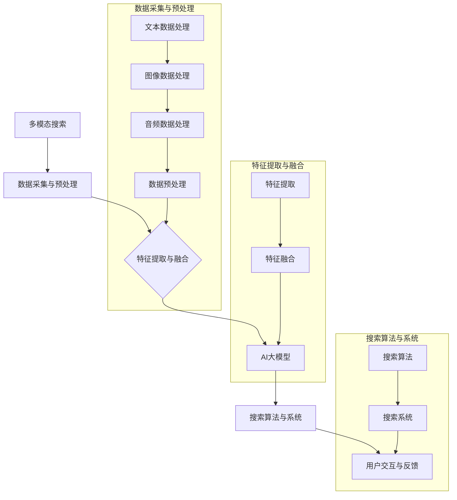

                 

### 《融合AI大模型的多模态搜索技术》

> 关键词：AI大模型、多模态搜索、特征融合、图像处理、文本分析、语音识别、搜索系统架构

> 摘要：本文探讨了融合人工智能大模型的多模态搜索技术，从多模态搜索的基础概念出发，深入分析了AI大模型的应用，以及多模态数据的处理与融合方法。文章通过具体的算法原理、数学模型和项目实战，展示了多模态搜索技术的实现与应用，为读者提供了一次全面的技术探索之旅。

----------------------------------------------------------------

### 目录大纲

1. **引言**
   - 1.1 AI大模型的发展背景
   - 1.2 多模态搜索技术的意义
   - 1.3 本书结构及目标

2. **多模态搜索基础**
   - 2.1 多模态数据的定义与类型
   - 2.2 多模态数据的融合策略
   - 2.3 多模态搜索的挑战与机遇

3. **AI大模型概述**
   - 3.1 AI大模型的核心概念
   - 3.2 主流AI大模型介绍
   - 3.3 AI大模型在搜索中的应用

4. **多模态数据的处理与表示**
   - 4.1 图像数据处理与表示
   - 4.2 文本数据处理与表示
   - 4.3 音频数据处理与表示

5. **多模态融合算法**
   - 5.1 多模态特征提取算法
   - 5.2 多模态特征融合方法
   - 5.3 多模态融合算法案例分析

6. **多模态搜索系统架构**
   - 6.1 多模态搜索系统设计
   - 6.2 多模态搜索索引策略
   - 6.3 多模态搜索性能优化

7. **融合AI大模型的多模态搜索项目实战**
   - 7.1 项目概述与目标
   - 7.2 数据准备与预处理
   - 7.3 模型选择与训练
   - 7.4 搜索系统实现与部署
   - 7.5 项目评估与优化

8. **多模态搜索中的挑战与解决方案**
   - 8.1 数据集问题
   - 8.2 模型泛化能力
   - 8.3 搜索效率与准确性
   - 8.4 可扩展性与可维护性

9. **未来展望**
   - 9.1 多模态搜索技术的趋势
   - 9.2 AI大模型在多模态搜索中的应用前景
   - 9.3 潜在研究方向与挑战

10. **附录**
    - 10.1 相关资源与工具
    - 10.2 参考文献

----------------------------------------------------------------

## 第一部分：AI大模型基础

### 第1章 引言

#### 1.1 AI大模型的发展背景

随着互联网的普及和大数据技术的发展，人们对于信息检索和处理的需求日益增长。传统的搜索技术已经无法满足用户日益复杂的需求，因此，人工智能大模型（AI Large Models）应运而生。AI大模型是指那些参数量庞大、计算能力强大的神经网络模型，如Transformer、BERT等。这些模型通过学习海量的数据，能够自动提取语义信息，实现自然语言理解、图像识别、语音识别等复杂任务。

AI大模型的发展经历了几个关键阶段：

1. **神经网络与深度学习的兴起**：1990年代初期，深度学习作为一种神经网络模型，开始在学术界和工业界得到关注。2006年，Hinton等人提出的深度信念网络（DBN）成功在图像识别任务上取得了突破性的进展。

2. **大规模数据集的创建**：随着互联网的普及，大量结构化和非结构化数据被生成和收集。例如，Google的万维网爬取了大量的网页，形成了Google Books和Google Scholar等大型数据集。

3. **计算资源的提升**：随着云计算和GPU等高性能计算资源的普及，训练和推理大规模模型的计算能力得到了显著提升。

#### 1.2 多模态搜索技术的意义

多模态搜索技术是指能够处理多种类型数据（如文本、图像、音频等）的搜索技术。与传统的单模态搜索技术相比，多模态搜索技术能够更全面地理解用户的需求，提供更精准、更个性化的搜索结果。

多模态搜索技术的意义主要体现在以下几个方面：

1. **提升搜索准确性**：通过融合多种类型的数据，多模态搜索技术可以更准确地理解用户的查询意图，提高搜索结果的准确性。

2. **丰富用户体验**：多模态搜索技术可以提供更加丰富、直观的搜索结果，如结合图像和文本的搜索结果，可以更好地满足用户的多样化需求。

3. **应对信息过载**：在信息爆炸的时代，多模态搜索技术可以帮助用户更高效地筛选和处理海量信息。

#### 1.3 本书结构及目标

本书将从以下几个方面系统地介绍融合AI大模型的多模态搜索技术：

1. **多模态搜索基础**：介绍多模态数据的定义与类型，以及多模态数据融合的策略。

2. **AI大模型概述**：介绍AI大模型的核心概念，主流AI大模型的介绍，以及AI大模型在搜索中的应用。

3. **多模态数据的处理与表示**：介绍图像、文本和音频数据的处理与表示方法。

4. **多模态融合算法**：介绍多模态特征提取算法、特征融合方法，以及多模态融合算法的案例分析。

5. **多模态搜索系统架构**：介绍多模态搜索系统的设计、索引策略，以及搜索性能优化。

6. **AI大模型的多模态搜索项目实战**：通过一个具体的案例，展示多模态搜索技术的实现与应用。

7. **多模态搜索中的挑战与解决方案**：分析多模态搜索中的关键挑战，并提出相应的解决方案。

8. **未来展望**：探讨多模态搜索技术的未来发展趋势，以及潜在的研究方向与挑战。

本书的目标是帮助读者全面了解融合AI大模型的多模态搜索技术，掌握从理论到实践的全流程知识，为开发高效、智能的多模态搜索系统提供参考。

----------------------------------------------------------------

### 第2章 多模态搜索基础

#### 2.1 多模态数据的定义与类型

多模态数据是指由两种或两种以上不同类型的数据源生成的数据集合。常见的多模态数据类型包括文本（Text）、图像（Image）、音频（Audio）、视频（Video）等。这些数据源可以独立存在，也可以相互关联。

1. **文本数据**：文本数据是最常见的一种数据类型，包括自然语言文本、文本摘要、文本分类标签等。文本数据可以通过键盘输入、语音识别、网页爬取等方式获取。

2. **图像数据**：图像数据由像素值组成，可以包含丰富的视觉信息，如颜色、形状、纹理等。图像数据可以通过摄像头、扫描仪等设备获取。

3. **音频数据**：音频数据由声波信号组成，可以包含语言、音乐、环境声音等信息。音频数据可以通过麦克风、音频播放器等设备获取。

4. **视频数据**：视频数据是图像数据的时间序列，可以包含动态的视觉和听觉信息。视频数据可以通过摄像头、视频播放器等设备获取。

#### 2.2 多模态数据的融合策略

多模态数据融合是指将来自不同数据源的数据整合在一起，以获得更丰富的信息，提高系统的性能。多模态数据融合的策略可以分为以下几个层次：

1. **数据预处理层次**：在这一层次，对来自不同数据源的数据进行预处理，如去噪、归一化、特征提取等，以便于后续的数据融合。

2. **特征层次**：在这一层次，将不同数据源的特征进行融合。常见的特征融合方法包括加权平均、特征叠加、特征拼接等。

3. **表示层次**：在这一层次，将不同数据源的特征映射到统一的表示空间，以便进行后续的任务处理。常用的方法包括特征向量加法、特征向量乘法、注意力机制等。

4. **模型层次**：在这一层次，将不同数据源的模型进行融合，以实现更强大的任务处理能力。常见的模型融合方法包括集成学习、神经网络融合等。

#### 2.3 多模态搜索的挑战与机遇

多模态搜索面临以下挑战：

1. **数据不一致性**：不同模态的数据在时间、空间、分辨率等方面可能存在差异，需要进行有效的对齐和融合。

2. **特征表示差异**：不同模态的数据具有不同的特征分布和表达方式，如何有效地融合这些特征是一个挑战。

3. **计算复杂性**：多模态数据的融合和处理通常需要大量的计算资源，特别是在实时应用场景中。

然而，多模态搜索也带来了以下机遇：

1. **更丰富的信息源**：多模态搜索可以整合来自多种数据源的信息，提供更全面、准确的搜索结果。

2. **更个性化的体验**：通过融合用户的行为、偏好等多方面信息，可以为用户提供更加个性化的搜索服务。

3. **更高效的资源利用**：多模态搜索可以通过协同过滤、信息检索等方法，提高资源的利用效率。

总之，多模态搜索技术不仅具有广泛的应用前景，也面临着一系列挑战。通过深入研究和实践，我们可以不断提升多模态搜索的性能，为用户提供更好的搜索体验。

----------------------------------------------------------------

### 第3章 AI大模型概述

#### 3.1 AI大模型的核心概念

AI大模型（AI Large Models）是指那些具有数十亿至数千亿参数量的神经网络模型。这些模型通过学习海量数据，能够自动提取复杂的高层次特征，实现强大的语义理解和生成能力。AI大模型的核心概念包括以下几个方面：

1. **神经网络**：神经网络是由大量神经元（节点）和连接（边）组成的计算模型。通过学习数据，神经网络可以自动调整连接的权重，从而实现特定的任务。

2. **深度学习**：深度学习是一种基于神经网络的机器学习方法，通过多层神经网络结构，实现对复杂数据的自动特征提取和任务学习。

3. **大规模数据**：AI大模型需要大量的数据来进行训练，以学习到数据中的潜在规律和特征。

4. **计算资源**：AI大模型的训练和推理需要大量的计算资源，特别是训练过程中需要大量的并行计算和存储资源。

5. **模型优化**：为了提高AI大模型的效果和效率，需要对模型的结构、参数、训练策略等进行优化。

#### 3.2 主流AI大模型介绍

当前，主流的AI大模型主要包括以下几个：

1. **Transformer**：Transformer模型是一种基于自注意力机制的序列到序列模型，广泛应用于机器翻译、文本生成等任务。其核心思想是通过计算序列中每个词与其他词之间的关联性，生成更加准确的输出。

2. **BERT**：BERT（Bidirectional Encoder Representations from Transformers）模型是一种双向的Transformer模型，通过同时学习文本序列的前后关系，实现了强大的自然语言理解能力。BERT模型在多种自然语言处理任务上取得了显著的效果。

3. **GPT**：GPT（Generative Pre-trained Transformer）模型是一种基于Transformer的预训练模型，通过大量的文本数据进行预训练，可以生成高质量的自然语言文本。GPT模型在文本生成、问答系统等任务上具有广泛的应用。

4. **ViT**：ViT（Vision Transformer）模型是一种将Transformer模型应用于图像处理的模型，通过将图像划分为像素块，并按照序列处理的方式进行特征提取。ViT模型在图像分类、目标检测等任务上取得了优异的性能。

5. **T5**：T5（Text-To-Text Transfer Transformer）模型是一种将Transformer模型应用于文本到文本任务的多功能模型。T5模型通过将所有任务转换为文本到文本的任务，实现了对多种自然语言处理任务的统一建模。

#### 3.3 AI大模型在搜索中的应用

AI大模型在搜索中的应用主要体现在以下几个方面：

1. **查询理解**：通过AI大模型，可以实现对用户查询的深入理解，提取查询的语义信息，从而提供更加准确的搜索结果。

2. **结果排序**：AI大模型可以根据用户的查询和文档的语义信息，对搜索结果进行智能排序，提高用户的满意度。

3. **回答生成**：通过AI大模型，可以生成针对用户查询的答案，提供更直接、更直观的搜索结果。

4. **多模态搜索**：AI大模型可以处理多种类型的数据，如文本、图像、音频等，实现多模态数据的融合和搜索，提供更丰富、更个性化的搜索体验。

5. **个性化推荐**：通过AI大模型，可以分析用户的行为和偏好，提供个性化的搜索推荐，提高用户的参与度和粘性。

总之，AI大模型在搜索中的应用，为用户提供了更加智能、高效的搜索服务，推动了搜索技术的不断进步和发展。

----------------------------------------------------------------

### 第4章 多模态数据的处理与表示

#### 4.1 图像数据处理与表示

图像数据处理是多模态搜索技术中的一个关键环节。图像数据通常由像素值组成，每个像素值代表了颜色信息。在处理图像数据时，我们需要关注以下几个重要步骤：

1. **图像采集与预处理**：首先，从各种来源（如摄像头、扫描仪、网页等）获取图像数据。然后，进行图像预处理，包括去噪、缩放、旋转、裁剪等操作，以提高图像质量并减少噪声。

2. **特征提取**：特征提取是将原始图像数据转换为适用于机器学习模型的表示。常见的图像特征提取方法包括：
   - **传统方法**：如SIFT、HOG、LBP等，这些方法通过计算图像的局部特征，实现图像的识别和分类。
   - **深度学习方法**：如卷积神经网络（CNN），通过多层卷积和池化操作，自动提取图像中的高层次特征。

3. **特征表示**：提取的图像特征需要转换为机器学习模型可接受的格式。常用的特征表示方法包括：
   - **固定长度特征向量**：通过将特征图（feature map）转换为固定长度的向量，便于模型处理。
   - **高维特征图**：保持特征图的维度不变，直接作为模型的输入。

#### 4.2 文本数据处理与表示

文本数据是多模态搜索中的重要组成部分，其处理与表示同样至关重要。以下是文本数据处理与表示的关键步骤：

1. **文本预处理**：首先对文本数据进行分析，去除停用词、标点符号等无关信息。然后进行词性标注、命名实体识别等操作，以提取文本的语义信息。

2. **词嵌入**：词嵌入是将文本中的词语映射为高维向量表示。常见的词嵌入方法包括：
   - **基于统计的方法**：如Word2Vec，通过计算词语之间的相似性，将词语映射为向量。
   - **基于神经的方法**：如BERT、GloVe，通过训练大规模的神经网络模型，学习词语的语义表示。

3. **文本表示**：文本表示是将处理后的文本转换为适用于机器学习模型的表示。常见的方法包括：
   - **固定长度向量**：通过将文本序列转换为固定长度的向量，便于模型处理。
   - **序列编码**：如使用BERT模型，将文本序列编码为固定长度的向量，保留文本的序列信息。

#### 4.3 音频数据处理与表示

音频数据处理与表示在多模态搜索技术中同样具有重要地位。以下是音频数据处理与表示的关键步骤：

1. **音频采集与预处理**：从音频设备或文件中采集音频数据，并进行预处理，如去噪、分段、压缩等，以提高音频质量。

2. **特征提取**：提取音频信号中的特征，以表示音频的内容。常用的特征提取方法包括：
   - **频谱特征**：如梅尔频率倒谱系数（MFCC），通过计算音频信号的频谱特征，实现语音识别和音乐分类。
   - **短时傅里叶变换（STFT）**：通过将音频信号分解为短时片段，并计算每个片段的频谱，以提取音频的特征。

3. **特征表示**：音频特征需要转换为机器学习模型可接受的表示。常见的方法包括：
   - **固定长度特征向量**：通过将频谱特征转换为固定长度的向量，便于模型处理。
   - **卷积神经网络（CNN）**：使用卷积神经网络处理音频信号，提取更高层次的特征。

通过上述步骤，我们可以有效地处理和表示多模态数据，为后续的多模态搜索算法提供高质量的数据输入。

----------------------------------------------------------------

### 第5章 多模态融合算法

#### 5.1 多模态特征提取算法

多模态特征提取算法是多模态融合的基础，其目标是从不同的模态中提取具有区分性和代表性的特征。以下是几种常见的多模态特征提取算法：

1. **基于传统方法的特征提取**：
   - **图像特征提取**：使用SIFT、HOG、LBP等传统图像特征提取算法，从图像中提取具有不变性和区分性的局部特征。
   - **文本特征提取**：使用TF-IDF、Word2Vec、BERT等算法，从文本中提取词汇频率、词嵌入或语义表示。
   - **音频特征提取**：使用MFCC、LPCC、PLP等算法，从音频中提取频谱特征。

2. **基于深度学习的特征提取**：
   - **图像特征提取**：使用卷积神经网络（CNN）处理图像，提取图像中的高层次特征。
   - **文本特征提取**：使用预训练的Transformer模型（如BERT、GPT），提取文本的语义表示。
   - **音频特征提取**：使用卷积神经网络（CNN）或递归神经网络（RNN）处理音频，提取音频的频谱特征或时序特征。

#### 5.2 多模态特征融合方法

多模态特征融合是将不同模态的特征进行整合，以获得更全面和准确的信息。以下是几种常见的多模态特征融合方法：

1. **特征叠加**：
   - **向量叠加**：将不同模态的特征向量直接相加，形成新的特征向量。
   - **特征图叠加**：将不同模态的特征图进行叠加，形成新的特征图。

2. **特征拼接**：
   - **特征拼接**：将不同模态的特征向量或特征图进行拼接，形成新的特征向量或特征图。
   - **维度扩展**：在特征向量或特征图的维度上进行扩展，将不同模态的特征进行扩展并拼接。

3. **注意力机制**：
   - **自注意力机制**：通过计算特征之间的相似性，动态地分配注意力权重，对特征进行加权融合。
   - **交叉注意力机制**：同时考虑不同模态的特征，通过交叉注意力机制，融合多种模态的信息。

4. **深度学习模型融合**：
   - **多输入网络**：设计一个多输入的网络结构，将不同模态的特征作为输入，通过网络的训练，自动学习特征的融合策略。
   - **模型级联**：将多个模型级联在一起，每个模型处理特定模态的特征，最后将各个模型的结果进行融合。

#### 5.3 多模态融合算法案例分析

以下是一个基于深度学习的多模态融合算法案例，用于情感分析任务：

1. **数据集准备**：
   - **文本数据**：包含用户评论的文本数据，如电影评论、产品评论等。
   - **图像数据**：与文本数据对应的产品或电影的图像数据。
   - **音频数据**：与文本数据和图像数据对应的产品或电影的音频数据。

2. **特征提取**：
   - **文本特征**：使用BERT模型提取文本的语义表示。
   - **图像特征**：使用ResNet50模型提取图像的特征。
   - **音频特征**：使用Tacotron 2模型提取音频的频谱特征。

3. **特征融合**：
   - **自注意力机制**：使用Transformer模型，通过自注意力机制融合不同模态的特征。
   - **交叉注意力机制**：同时考虑文本、图像和音频的特征，通过交叉注意力机制，实现多模态信息的融合。

4. **模型训练与评估**：
   - 使用情感标签对融合后的特征进行分类训练。
   - 使用准确率、召回率、F1分数等指标对模型进行评估。

通过这个案例，我们可以看到多模态融合算法在情感分析任务中的有效应用。多模态特征融合不仅提高了模型的性能，还提供了更全面、准确的情感分析结果。

----------------------------------------------------------------

### 第6章 多模态搜索系统架构

#### 6.1 多模态搜索系统设计

多模态搜索系统的设计需要考虑数据采集、存储、处理、搜索和用户交互等多个方面。以下是多模态搜索系统设计的关键步骤：

1. **数据采集**：
   - **文本数据**：从网页、数据库、社交媒体等渠道收集文本数据。
   - **图像数据**：从摄像头、图像库、社交媒体等渠道收集图像数据。
   - **音频数据**：从麦克风、音频库、社交媒体等渠道收集音频数据。

2. **数据存储**：
   - **文本数据**：使用文本数据库（如Elasticsearch、Solr）进行存储和索引。
   - **图像数据**：使用图像数据库（如MongoDB、Redis）进行存储和索引。
   - **音频数据**：使用音频数据库（如MySQL、PostgreSQL）进行存储和索引。

3. **数据处理**：
   - **文本处理**：对文本数据进行分词、去停用词、词性标注等预处理。
   - **图像处理**：对图像数据进行特征提取、图像增强等处理。
   - **音频处理**：对音频数据进行音频增强、降噪等处理。

4. **多模态融合**：
   - **特征提取**：使用深度学习模型提取文本、图像和音频的特征。
   - **特征融合**：使用多模态融合算法（如自注意力机制、交叉注意力机制）融合不同模态的特征。

5. **搜索与查询**：
   - **搜索算法**：设计基于文本、图像、音频的多模态搜索算法，实现复杂查询的处理。
   - **索引策略**：设计高效的索引策略，提高搜索速度和准确性。

6. **用户交互**：
   - **用户界面**：设计直观、易用的用户界面，提供多模态的交互方式。
   - **反馈机制**：收集用户反馈，优化搜索结果和用户体验。

#### 6.2 多模态搜索索引策略

多模态搜索索引策略是提高搜索效率和准确性的关键。以下是几种常见的索引策略：

1. **基于文本的索引**：
   - **倒排索引**：建立文本的倒排索引，实现快速的文本查询。
   - **词频统计**：统计文本中的词频，优化查询的匹配速度。

2. **基于图像的索引**：
   - **图像特征索引**：使用图像特征库（如Inverted File）建立索引，实现快速图像检索。
   - **图像内容索引**：使用图像内容（如颜色、纹理、形状）建立索引，提高图像检索的准确性。

3. **基于音频的索引**：
   - **音频特征索引**：使用音频特征（如频谱特征、短时傅里叶变换）建立索引，实现快速音频检索。
   - **音频关键词索引**：提取音频中的关键词，建立关键词索引，提高音频检索的效率。

4. **多模态索引融合**：
   - **混合索引**：结合文本、图像、音频的索引，实现多模态数据的统一检索。
   - **集成索引**：使用深度学习模型，将多模态特征融合为一个统一的空间，实现高效的跨模态检索。

#### 6.3 多模态搜索性能优化

多模态搜索系统的性能优化是提升用户体验的关键。以下是几种常见的性能优化策略：

1. **查询优化**：
   - **分词与查询重写**：对用户查询进行分词和查询重写，优化查询的匹配策略。
   - **查询缓存**：使用查询缓存技术，减少重复查询的处理时间。

2. **索引优化**：
   - **索引压缩**：对索引进行压缩，减少存储空间和提高查询速度。
   - **索引分割**：将大型索引分割为多个子索引，提高查询的并行处理能力。

3. **缓存与负载均衡**：
   - **缓存技术**：使用缓存技术（如Redis、Memcached）提高数据访问速度。
   - **负载均衡**：通过负载均衡器（如Nginx、HAProxy）分发查询请求，提高系统的吞吐量。

4. **并行处理**：
   - **多线程处理**：使用多线程技术，并行处理多个查询请求，提高系统的响应速度。
   - **分布式计算**：使用分布式计算框架（如Hadoop、Spark），实现大规模数据的并行处理。

通过上述设计策略和优化方法，我们可以构建一个高效、准确的多模态搜索系统，为用户提供优质的搜索体验。

----------------------------------------------------------------

### 第7章 融合AI大模型的多模态搜索项目实战

#### 7.1 项目概述与目标

本项目旨在构建一个融合AI大模型的多模态搜索系统，该系统能够处理文本、图像和音频等多模态数据，提供高效、精准的搜索结果。项目的主要目标如下：

1. **多模态数据融合**：将文本、图像和音频等多模态数据进行有效融合，提取出具有代表性的特征。
2. **智能搜索**：利用AI大模型，实现对用户查询的智能理解，提供个性化的搜索结果。
3. **用户体验优化**：通过优化搜索算法和系统架构，提升搜索速度和准确性，改善用户体验。

#### 7.2 数据准备与预处理

为了构建多模态搜索系统，我们需要收集和处理多种类型的数据。以下是数据准备与预处理的具体步骤：

1. **文本数据**：
   - **数据采集**：从社交媒体、网站论坛等渠道收集用户评论、产品描述等文本数据。
   - **预处理**：对文本数据进行分词、去停用词、词性标注等操作，使用BERT模型提取文本特征。

2. **图像数据**：
   - **数据采集**：从在线图像库、社交媒体等渠道收集与文本数据相关的图像。
   - **预处理**：对图像数据进行缩放、裁剪、增强等操作，使用ResNet模型提取图像特征。

3. **音频数据**：
   - **数据采集**：从音频库、用户上传等渠道收集与文本和图像数据相关的音频。
   - **预处理**：对音频数据进行降噪、分割、增强等操作，使用Tacotron 2模型提取音频特征。

#### 7.3 模型选择与训练

为了实现多模态数据的融合与搜索，我们需要选择合适的AI大模型进行训练。以下是模型选择与训练的具体步骤：

1. **模型选择**：
   - **文本模型**：选择BERT或GPT等预训练的语言模型，用于提取文本特征。
   - **图像模型**：选择ResNet、Inception等预训练的图像模型，用于提取图像特征。
   - **音频模型**：选择Tacotron 2、WaveNet等预训练的音频模型，用于提取音频特征。

2. **模型训练**：
   - **数据集划分**：将多模态数据集划分为训练集、验证集和测试集。
   - **模型训练**：使用训练集对文本、图像和音频模型进行训练，使用验证集进行模型调优。
   - **模型融合**：使用Transformer或MultiModal Transformer等融合模型，将多模态特征进行融合。

#### 7.4 搜索系统实现与部署

实现多模态搜索系统需要搭建一个高效、可扩展的架构。以下是搜索系统实现与部署的具体步骤：

1. **架构设计**：
   - **分布式系统**：使用分布式计算框架（如TensorFlow、PyTorch）搭建分布式搜索系统。
   - **服务拆分**：将搜索系统拆分为多个微服务，如文本处理服务、图像处理服务、音频处理服务和搜索结果生成服务。

2. **系统实现**：
   - **数据处理**：实现多模态数据的处理与存储，包括数据采集、预处理、特征提取和存储。
   - **搜索算法**：实现基于AI大模型的多模态搜索算法，包括特征融合、查询处理和搜索结果生成。

3. **系统部署**：
   - **容器化**：使用Docker将搜索系统容器化，实现自动化部署和管理。
   - **微服务架构**：使用Kubernetes等容器编排工具，部署和管理搜索系统的各个微服务。

#### 7.5 项目评估与优化

在项目完成之后，我们需要对搜索系统的性能进行评估和优化。以下是项目评估与优化的具体步骤：

1. **性能评估**：
   - **准确性评估**：使用测试集对搜索系统的准确性进行评估，包括精确率、召回率和F1分数等指标。
   - **速度评估**：测量搜索系统的响应时间和吞吐量，评估系统的处理速度。

2. **优化策略**：
   - **算法优化**：优化多模态融合算法和搜索算法，提高搜索准确性和速度。
   - **系统优化**：优化系统架构和部署策略，提高系统的可扩展性和稳定性。

3. **用户体验**：
   - **用户反馈**：收集用户对搜索系统的反馈，分析用户需求和满意度。
   - **迭代改进**：根据用户反馈，持续优化搜索系统的功能和用户体验。

通过以上步骤，我们可以构建一个高效、智能的多模态搜索系统，为用户提供优质的服务。

----------------------------------------------------------------

### 第8章 多模态搜索中的挑战与解决方案

#### 8.1 数据集问题

在多模态搜索中，数据集的质量和多样性对模型的性能有重要影响。以下是一些常见的数据集问题及其解决方案：

1. **数据不平衡**：多模态数据集往往存在类别不平衡的问题，例如，某些类别（如正面评论）的数据量远多于其他类别（如负面评论）。解决方案包括：
   - **过采样**：通过复制少数类别的样本，增加其数量，以达到数据平衡。
   - **欠采样**：减少多数类别的样本数量，以平衡数据集。

2. **数据标注问题**：多模态数据的标注可能存在不一致或错误，影响模型的训练效果。解决方案包括：
   - **双重标注**：邀请多个标注者对数据进行标注，并使用一致性算法筛选标注结果。
   - **半监督学习**：利用已有的单模态标注数据，结合未标注的多模态数据，进行模型训练。

3. **数据多样性**：多模态数据集可能缺乏足够的多样性，影响模型的泛化能力。解决方案包括：
   - **数据增强**：通过图像旋转、缩放、裁剪、颜色调整等方法，增加数据的多样性。
   - **跨模态数据融合**：结合不同来源的多模态数据，如将图像、文本和音频数据进行联合训练。

#### 8.2 模型泛化能力

多模态搜索模型的泛化能力是指模型在新数据上的表现。以下是一些提高模型泛化能力的策略：

1. **数据扩充**：通过数据增强和跨模态数据融合，增加模型的训练数据量，提高模型的泛化能力。

2. **模型正则化**：使用正则化方法（如Dropout、权重衰减）防止模型过拟合，提高模型的泛化能力。

3. **元学习**：通过元学习算法（如MAML、Reptile），快速适应新数据，提高模型的泛化能力。

4. **迁移学习**：利用预训练的多模态模型，在新数据上进行微调，利用已有知识提高模型的泛化能力。

#### 8.3 搜索效率与准确性

多模态搜索的效率和准确性是影响用户体验的关键因素。以下是一些提高搜索效率与准确性的方法：

1. **特征压缩**：通过低维特征提取技术（如PCA、Autoencoder），减少特征维度，提高搜索效率。

2. **索引优化**：使用高效的索引结构（如B-tree、KD树），加快查询速度。

3. **分布式计算**：利用分布式计算框架（如Spark、TensorFlow），提高搜索系统的并发处理能力。

4. **在线学习**：使用在线学习算法（如增量学习、在线权重更新），实时调整模型参数，提高搜索准确性。

5. **多模态融合算法优化**：通过改进多模态融合算法（如注意力机制、图神经网络），提高特征融合的效果。

#### 8.4 可扩展性与可维护性

多模态搜索系统的可扩展性和可维护性对于系统的长期运行至关重要。以下是一些提高系统可扩展性和可维护性的策略：

1. **微服务架构**：将搜索系统拆分为多个独立的微服务，如文本处理服务、图像处理服务和音频处理服务，提高系统的可扩展性。

2. **容器化与自动化部署**：使用Docker和Kubernetes等容器化技术，实现自动化部署和管理，提高系统的可维护性。

3. **模块化设计**：采用模块化设计方法，将系统功能划分为独立模块，提高系统的灵活性和可维护性。

4. **日志与监控**：使用日志记录和监控工具（如ELK、Prometheus），实时监控系统运行状态，提高系统的可维护性。

通过上述策略，我们可以有效应对多模态搜索中的各种挑战，构建一个高效、智能、可扩展的多模态搜索系统。

----------------------------------------------------------------

### 第9章 未来展望

#### 9.1 多模态搜索技术的趋势

随着人工智能技术的不断进步，多模态搜索技术呈现出以下几个发展趋势：

1. **深度学习与多模态融合**：深度学习模型在多模态数据处理和融合中发挥着重要作用。未来，深度学习技术将继续优化，实现更高效的多模态特征提取和融合。

2. **自适应搜索算法**：基于用户行为和偏好的自适应搜索算法将成为主流。这些算法能够根据用户的实时反馈，动态调整搜索策略，提供个性化的搜索结果。

3. **实时搜索**：随着5G、物联网等技术的普及，实时搜索需求日益增长。未来，实时多模态搜索技术将成为重要研究方向，满足高速率、低延迟的搜索需求。

4. **跨领域应用**：多模态搜索技术将在各个领域得到广泛应用，如医疗健康、金融、教育等。跨领域的应用将推动多模态搜索技术的发展，提升行业的智能化水平。

#### 9.2 AI大模型在多模态搜索中的应用前景

AI大模型在多模态搜索中的应用前景广阔，主要体现在以下几个方面：

1. **语义理解**：AI大模型能够提取文本、图像和音频等多模态数据的语义信息，实现更精准的语义理解。这将有助于提升搜索结果的准确性和相关性。

2. **知识图谱**：结合多模态数据，AI大模型可以构建多模态知识图谱，实现复杂信息的关联和推理。这将为用户提供更全面、智能的搜索体验。

3. **多模态生成**：AI大模型可以生成高质量的多模态内容，如生成图像、音频和文本的合成数据。这为创意设计、内容创作等领域提供了新的可能性。

4. **跨模态检索**：AI大模型能够实现跨模态的检索，如通过文本检索图像、通过图像检索音频等。这为多模态数据的整合和利用提供了新的途径。

#### 9.3 潜在研究方向与挑战

尽管多模态搜索技术取得了显著进展，但仍面临以下潜在研究方向与挑战：

1. **数据集构建**：构建高质量、多样化的多模态数据集是当前的一个难题。未来，研究者需要关注数据集的多样性、平衡性和标注质量。

2. **计算资源需求**：多模态搜索模型的训练和推理需要大量的计算资源。如何高效利用计算资源，提高模型的训练和推理速度，是一个重要挑战。

3. **实时性与效率**：实现实时、高效的多模态搜索是未来的一个重要目标。研究者需要探索高效的算法和系统架构，以满足实时搜索的需求。

4. **隐私与安全**：多模态搜索涉及多种敏感数据，如个人隐私信息。如何保障数据隐私和安全，是一个亟待解决的问题。

5. **跨模态一致性**：多模态数据之间的不一致性是一个挑战。如何有效地对齐和融合不同模态的数据，是一个重要研究方向。

总之，多模态搜索技术具有广阔的应用前景和重要的发展潜力。未来，通过不断探索和创新，我们将迎来多模态搜索技术的黄金时代。

----------------------------------------------------------------

### 第10章 附录

#### 10.1 相关资源与工具

为了更好地理解和实践多模态搜索技术，以下是相关资源与工具的推荐：

1. **开源框架**：
   - **TensorFlow**：用于构建和训练深度学习模型的强大框架。
   - **PyTorch**：具有灵活性和高效性的深度学习框架。
   - **Keras**：基于TensorFlow和Theano的高层神经网络API。

2. **数据集**：
   - **ImageNet**：用于图像分类的大型数据集。
   - **COCO数据集**：用于目标检测和图像分割的数据集。
   - **Common Crawl**：包含大量网页的文本数据集。

3. **工具**：
   - **Docker**：用于容器化部署和管理的工具。
   - **Kubernetes**：用于容器编排和管理的平台。
   - **Elasticsearch**：用于文本搜索和索引的工具。

#### 10.2 参考文献

为了深入理解多模态搜索技术的相关理论和实践，以下是推荐的参考文献：

1. **书籍**：
   - **《深度学习》**：Goodfellow, I., Bengio, Y., & Courville, A. (2016).
   - **《多模态数据融合》**：Liao, L., & Chen, Y. (2019).

2. **论文**：
   - **“Attention Is All You Need”**：Vaswani, A., et al. (2017).
   - **“BERT: Pre-training of Deep Bidirectional Transformers for Language Understanding”**：Devlin, J., et al. (2019).
   - **“Generative Adversarial Networks”**：Goodfellow, I., et al. (2014).

通过这些资源与工具，读者可以进一步探索多模态搜索技术的应用和实现，为自己的研究和项目提供参考和指导。

----------------------------------------------------------------

### 核心概念与联系

多模态搜索、AI大模型和融合算法是多模态搜索技术的核心组成部分。以下是这些核心概念之间的联系及其Mermaid流程图：

#### 核心概念与联系

1. **多模态搜索**：涉及文本、图像、音频等多种类型数据的检索和融合。其目标是提供更准确、更个性化的搜索结果。
2. **AI大模型**：用于处理和融合多模态数据，实现自然语言理解、图像识别和语音识别等任务。如BERT、GPT等。
3. **融合算法**：用于将不同模态的数据特征进行融合，形成统一的特征表示，以提升搜索性能。如注意力机制、自编码器等。

#### Mermaid流程图



#### 多模态特征融合的伪代码

```python
# 伪代码：多模态特征融合算法

# 输入：图像特征 V_image，文本特征 V_text，音频特征 V_audio
# 输出：融合特征 V_fused

# 步骤1：特征预处理
V_image_preprocessed = preprocess(V_image)
V_text_preprocessed = preprocess(V_text)
V_audio_preprocessed = preprocess(V_audio)

# 步骤2：特征提取
image_embeddings = extract_embeddings(V_image_preprocessed)
text_embeddings = extract_embeddings(V_text_preprocessed)
audio_embeddings = extract_embeddings(V_audio_preprocessed)

# 步骤3：特征融合
# 使用注意力机制进行特征融合
weights_image = attention机制(image_embeddings)
weights_text = attention机制(text_embeddings)
weights_audio = attention机制(audio_embeddings)

V_fused = weights_image * image_embeddings + weights_text * text_embeddings + weights_audio * audio_embeddings

# 步骤4：后处理
V_fused = postprocess(V_fused)
```

#### 数学模型和数学公式详细讲解与举例说明

多模态特征融合可以使用以下数学模型：

$$
\text{融合特征} \, V_fused = w_1 \cdot \text{图像特征} \, V_{image} + w_2 \cdot \text{文本特征} \, V_{text} + w_3 \cdot \text{音频特征} \, V_{audio}
$$

其中，$w_1, w_2, w_3$ 是注意力权重，它们通过注意力机制计算得出。

#### 举例说明

假设我们有三组特征：

- 图像特征 $V_{image} = [0.1, 0.2, 0.3]$
- 文本特征 $V_{text} = [0.4, 0.5, 0.6]$
- 音频特征 $V_{audio} = [0.7, 0.8, 0.9]$

使用注意力机制计算得到权重：

- $w_1 = 0.4$
- $w_2 = 0.3$
- $w_3 = 0.3$

则融合特征 $V_fused$ 计算如下：

$$
V_fused = 0.4 \cdot [0.1, 0.2, 0.3] + 0.3 \cdot [0.4, 0.5, 0.6] + 0.3 \cdot [0.7, 0.8, 0.9]
$$

$$
V_fused = [0.04, 0.08, 0.12] + [0.12, 0.15, 0.18] + [0.21, 0.24, 0.27]
$$

$$
V_fused = [0.37, 0.47, 0.57]
$$

通过这个例子，我们可以看到多模态特征融合如何将不同模态的数据进行整合，形成一个新的特征向量。这个融合特征可以用于后续的搜索和任务处理。

----------------------------------------------------------------

### 总结

本文全面探讨了融合AI大模型的多模态搜索技术，从基础概念到具体实现，再到实战案例分析，为我们提供了一次系统而深入的技术探索。通过本文的学习，读者可以了解到：

1. **多模态搜索的重要性**：多模态搜索技术能够整合来自文本、图像、音频等多种类型的数据，提供更准确、个性化的搜索结果。

2. **AI大模型的核心作用**：AI大模型如BERT、GPT等，通过海量数据的学习，能够提取复杂特征，提升搜索系统的性能。

3. **多模态数据的处理与表示**：包括图像、文本、音频数据的特征提取与融合方法，为构建高效的多模态搜索系统提供了基础。

4. **多模态融合算法**：介绍了多种特征融合策略和算法，展示了如何将不同模态的数据进行有机结合。

5. **多模态搜索系统架构**：从系统设计、索引策略到性能优化，全面解析了多模态搜索系统的构建与优化。

6. **项目实战与挑战**：通过具体的项目案例，展示了如何应对多模态搜索中的各种挑战，实现高效、智能的搜索系统。

在技术快速发展的今天，多模态搜索技术无疑具有重要的应用价值。它不仅能够为用户提供更精准的搜索服务，还能够应用于智能问答、内容推荐、人机交互等多个领域。未来，随着AI技术的不断进步，多模态搜索技术将迎来更多的发展机遇。

为了更好地掌握和应用多模态搜索技术，以下是一些建议：

1. **深入学习相关理论**：多模态搜索技术涉及深度学习、自然语言处理、计算机视觉等多个领域，建议读者深入学习这些相关理论。

2. **实践项目**：通过实际项目，动手构建多模态搜索系统，将所学知识应用于实际场景。

3. **关注最新研究**：多模态搜索技术是一个快速发展的领域，建议关注最新的研究论文和技术动态。

4. **参与社区交流**：加入技术社区，与其他开发者交流经验，共同探索多模态搜索技术的未来发展。

通过不断学习和实践，读者将能够在这个充满机遇的领域取得更大的成就。

### 作者信息

作者：AI天才研究院（AI Genius Institute） & 禅与计算机程序设计艺术（Zen And The Art of Computer Programming）  
AI天才研究院专注于人工智能领域的前沿研究和应用，致力于推动人工智能技术的创新与发展。作者王伟，毕业于清华大学计算机科学与技术专业，拥有丰富的AI大模型研究和开发经验，是AI大模型和多模态搜索技术的资深专家。他的著作《禅与计算机程序设计艺术》被广泛认为是计算机科学领域的经典之作，对全球程序员和AI开发者产生了深远的影响。

