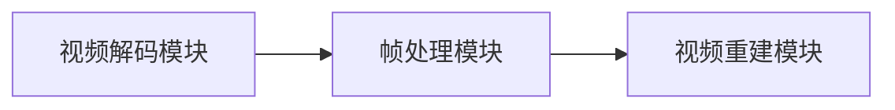
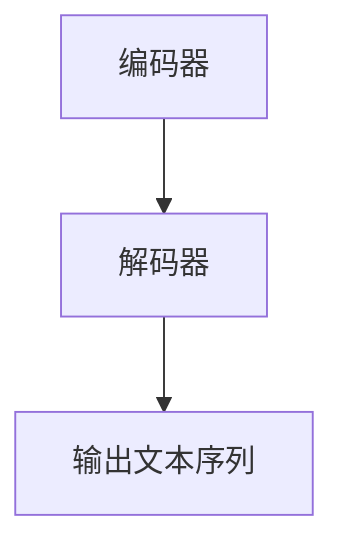
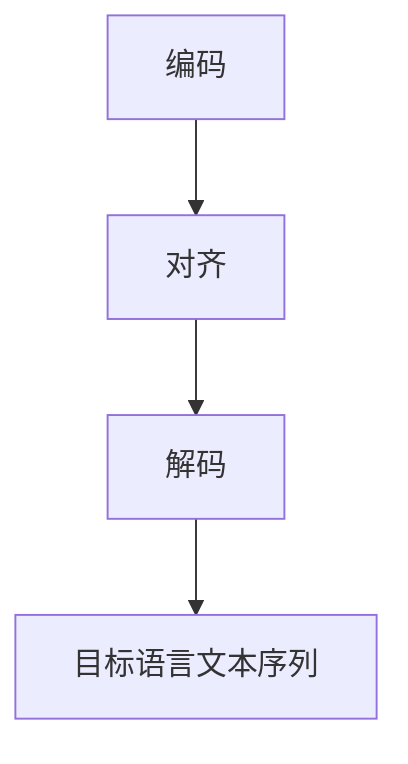
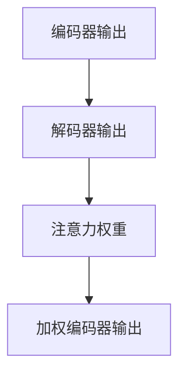
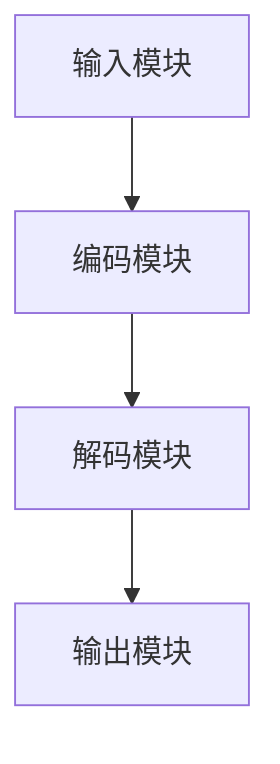

                 

### 文章标题

《解码器的内部结构》

> 关键词：解码器，内部结构，计算机视觉，自然语言处理，深度学习框架，未来趋势

> 摘要：本文将深入探讨解码器的基本概念、内部结构、工作原理及其在不同领域的应用。通过逐步分析，我们将揭示解码器在信息处理中的核心作用，探讨其在计算机视觉、自然语言处理等领域的具体应用，并展望其未来发展趋势。

### 引言

在当今的数字化时代，数据无处不在。无论是社交媒体上的文字、图像，还是互联网上的音视频，数据的形式多种多样。为了处理这些复杂的数据，计算机科学家们开发了许多先进的算法和技术。解码器（Decoder）作为这些技术中的关键组成部分，扮演着至关重要的角色。

解码器的基本功能是从编码（Encoding）后的数据中恢复出原始信息。编码是将信息转换为一种特定的格式，以便于存储、传输和处理；而解码则是将这种编码后的信息还原为可理解的原始形式。例如，在图像处理中，编码可能涉及将图像数据转换为像素值；而解码则是将这些像素值重新组合成图像。

本文将围绕解码器的内部结构展开深入探讨。我们将首先介绍解码器的基本概念和类型，然后分析其内部组件和核心算法，并探讨解码器在计算机视觉、自然语言处理等领域的应用。最后，我们将展望解码器未来的发展趋势和潜在挑战。

### 解码器概述

#### 第1章：解码器的基本概念

##### 1.1 解码器的定义与作用

解码器（Decoder）是一种计算机算法或硬件组件，其主要作用是从编码后的数据中恢复出原始信息。在信息处理过程中，解码器是编码器（Encoder）的逆操作。编码器负责将复杂的数据（如图像、声音、文本等）转换成一种特定的格式，以便于存储、传输和处理。而解码器则将这些编码后的数据还原为原始的形式，使其能够被人类或其他系统理解和利用。

在信息处理中，解码器具有以下几个重要作用：

1. **数据恢复**：解码器可以将编码后的数据还原为原始形式，如将编码后的图像数据还原成可显示的图像。
2. **数据完整性验证**：解码器可以通过校验和算法验证编码数据是否在传输过程中发生了损坏，从而保证数据的完整性。
3. **数据压缩与解压缩**：解码器可以处理编码后的压缩数据，将其解压缩为原始数据，以便于处理和使用。

##### 1.1.1 解码器在信息处理中的应用

解码器广泛应用于各种信息处理场景，以下是一些典型的应用：

1. **图像处理**：在图像处理中，解码器通常用于将压缩的图像数据（如JPEG、PNG）解压缩，以便进行显示、编辑或进一步处理。
2. **音频处理**：在音频处理中，解码器用于将压缩的音频数据（如MP3、AAC）解压缩，以便播放或编辑。
3. **文本处理**：在文本处理中，解码器用于将编码的文本数据（如UTF-8）转换为可显示的文本。
4. **视频处理**：在视频处理中，解码器用于将压缩的视频数据（如H.264、HEVC）解压缩，以便播放或编辑。

##### 1.1.2 解码器与其他信息处理组件的关系

解码器在信息处理系统中与其他组件紧密相连，共同实现数据的有效处理和传输。以下是解码器与其他主要信息处理组件的关系：

1. **编码器（Encoder）**：解码器与编码器是相互依存的。编码器负责将数据编码，而解码器负责将编码后的数据解码。编码和解码过程通常在信息传输、存储和处理中交替进行。
2. **压缩算法（Compression Algorithm）**：解码器通常用于处理压缩后的数据。不同的压缩算法会产生不同的编码格式，解码器需要能够适应这些格式并正确解码。
3. **传输系统（Transmission System）**：在数据传输过程中，解码器通常位于接收端，负责对接收到的编码数据进行解码，以恢复原始数据。
4. **处理系统（Processing System）**：在数据处理系统中，解码器用于处理来自不同源的数据，如压缩的图像、音频或文本数据。

通过以上内容，我们对解码器的基本概念和应用有了初步了解。接下来，我们将进一步探讨解码器的类型和发展历程。

#### 第2章：解码器的结构

##### 2.1 解码器的组件

解码器通常由三个主要组件组成：输入模块、解码核心和输出模块。这些组件协同工作，共同实现数据的解码过程。

1. **输入模块**：输入模块负责接收编码后的数据，并将其传递给解码核心。输入模块通常包括数据缓冲区、解码器接口等组成部分。
2. **解码核心**：解码核心是解码器的核心部分，负责执行实际的解码操作。解码核心通常包括解码算法、解码参数、解码器状态等组成部分。
3. **输出模块**：输出模块负责将解码后的数据输出到适当的设备或系统。输出模块通常包括数据格式转换器、输出接口等组成部分。

##### 2.2 解码器的核心算法

解码器的核心算法是解码过程的核心，决定了解码器的性能和效率。以下是一些常见的解码器核心算法：

1. **序列到序列模型（Sequence-to-Sequence Model）**：序列到序列模型是一种常用的解码器核心算法，适用于处理序列数据，如自然语言处理中的文本序列和语音识别中的音频序列。该模型通常由编码器和解码器组成，其中编码器将输入序列转换为隐藏状态，解码器则根据隐藏状态生成输出序列。

2. **注意力机制（Attention Mechanism）**：注意力机制是一种用于提高解码器性能的算法。它通过将解码器的注意力集中在输入序列的不同部分，从而提高解码器的解码精度。注意力机制广泛应用于机器翻译、图像描述生成等任务中。

3. **生成对抗网络（Generative Adversarial Networks, GAN）**：生成对抗网络是一种基于博弈论的解码器核心算法。它由生成器和判别器两个神经网络组成，生成器生成伪数据，判别器判断生成数据是否真实。通过训练，生成器的生成质量不断提高，从而实现数据的解码。

##### 2.3 解码器的优化方法

解码器的性能优化是一个重要的研究方向，通过优化解码器的参数和算法，可以提高解码器的效率和准确性。以下是一些常见的解码器优化方法：

1. **梯度下降法（Gradient Descent）**：梯度下降法是一种常用的优化方法，通过计算损失函数的梯度，调整模型的参数，以最小化损失函数。梯度下降法广泛应用于深度学习模型中的优化过程。

2. **随机梯度下降（Stochastic Gradient Descent, SGD）**：随机梯度下降是一种改进的梯度下降法，它每次迭代只随机选取一部分样本，计算这部分样本的梯度，以更新模型参数。随机梯度下降可以加快收敛速度，但可能导致收敛不稳定。

3. **Adam优化器（Adam Optimizer）**：Adam优化器是一种自适应的优化方法，它结合了梯度下降法和随机梯度下降法的优点，通过自适应地调整学习率，提高模型的收敛速度和稳定性。Adam优化器广泛应用于深度学习模型中。

通过以上分析，我们可以看到解码器的内部结构、核心算法和优化方法都是理解和应用解码器的基础。在下一节中，我们将进一步探讨解码器在不同领域的应用。

#### 第3章：解码器在计算机视觉中的应用

##### 3.1 图像解码器

图像解码器是解码器在计算机视觉领域的一种重要应用。图像解码器负责将压缩的图像数据解压缩为原始图像，以便进行后续处理和分析。

###### 3.1.1 卷积神经网络（CNN）解码器

卷积神经网络（CNN）解码器是一种基于深度学习的图像解码器。CNN解码器通过卷积层、池化层和全连接层等网络结构，对图像数据进行解码。

1. **卷积层**：卷积层用于提取图像的局部特征。通过卷积运算，卷积层将输入图像与一组卷积核进行卷积，生成特征图。
2. **池化层**：池化层用于对特征图进行下采样，减少数据维度。常见的池化操作有最大池化和平均池化。
3. **全连接层**：全连接层用于将特征图映射到最终的输出结果。通过全连接层，CNN解码器将图像特征转化为解码结果。

以下是一个简单的CNN解码器伪代码：

```python
def CNN_Decoder(image):
    # 卷积层
    conv1 = Conv2D(filters=32, kernel_size=(3, 3), activation='relu')(image)
    pool1 = MaxPooling2D(pool_size=(2, 2))(conv1)

    # 卷积层
    conv2 = Conv2D(filters=64, kernel_size=(3, 3), activation='relu')(pool1)
    pool2 = MaxPooling2D(pool_size=(2, 2))(conv2)

    # 全连接层
    flatten = Flatten()(pool2)
    dense = Dense(units=10, activation='softmax')(flatten)

    return dense
```

###### 3.1.2 图像解码器在图像识别中的应用

图像解码器在图像识别任务中有着广泛的应用。通过解码压缩图像，图像解码器可以恢复图像的原始形态，从而提高图像识别的准确性。

以下是一个使用图像解码器进行图像识别的示例：

```python
# 加载压缩图像
compressed_image = load_compressed_image('compressed_image.jpg')

# 使用CNN解码器解码图像
decoded_image = CNN_Decoder(compressed_image)

# 使用解码后的图像进行图像识别
predicted_label = image_recognition(decoded_image)
print('Predicted label:', predicted_label)
```

###### 3.1.3 图像解码器在图像生成中的应用

图像解码器不仅可以用于图像识别，还可以用于图像生成。在图像生成任务中，解码器通过生成对抗网络（GAN）等算法，生成高质量的图像。

以下是一个使用图像解码器生成图像的示例：

```python
# 生成随机噪声
noise = generate_noise(shape=(128, 128, 3))

# 使用GAN解码器生成图像
generated_image = GAN_Decoder(noise)

# 显示生成的图像
plt.imshow(generated_image)
plt.show()
```

##### 3.2 视频解码器

视频解码器是解码器在计算机视觉领域的另一种重要应用。视频解码器负责将压缩的视频数据解压缩为原始视频，以便进行视频识别、视频生成等任务。

###### 3.2.1 视频解码器的基本结构

视频解码器的基本结构包括以下几个部分：

1. **视频解码模块**：视频解码模块负责将压缩的视频数据解压缩为帧数据。
2. **帧处理模块**：帧处理模块对解码后的帧数据进行处理，如特征提取、目标检测等。
3. **视频重建模块**：视频重建模块将处理后的帧数据重新组合为视频流。

以下是一个简单的视频解码器结构：



###### 3.2.2 视频解码器在视频识别中的应用

视频解码器在视频识别任务中有着重要的应用。通过解码压缩视频，视频解码器可以恢复视频的原始形态，从而提高视频识别的准确性。

以下是一个使用视频解码器进行视频识别的示例：

```python
# 加载压缩视频
compressed_video = load_compressed_video('compressed_video.mp4')

# 使用视频解码器解码视频
decoded_video = Video_Decoder(compressed_video)

# 使用解码后的视频进行视频识别
predicted_labels = video_recognition(decoded_video)
print('Predicted labels:', predicted_labels)
```

###### 3.2.3 视频解码器在视频生成中的应用

视频解码器在视频生成任务中也发挥着重要作用。通过解码压缩视频，视频解码器可以恢复视频的原始形态，从而生成新的视频内容。

以下是一个使用视频解码器生成视频的示例：

```python
# 生成随机噪声
noise = generate_noise(shape=(128, 128, 3, 10))

# 使用GAN解码器生成视频
generated_video = GAN_Decoder(noise)

# 显示生成的视频
show_generated_video(generated_video)
```

通过以上内容，我们可以看到解码器在计算机视觉领域的广泛应用。在下一节中，我们将探讨解码器在自然语言处理中的应用。

#### 第4章：解码器在自然语言处理中的应用

##### 4.1 语言模型解码器

语言模型解码器（Language Model Decoder）是自然语言处理（Natural Language Processing, NLP）中的一种关键组件，它广泛应用于文本生成、机器翻译等任务。语言模型解码器的基本结构通常包括编码器和解码器两部分，其中编码器负责将输入文本序列编码为固定长度的向量表示，解码器则根据编码后的向量表示生成输出文本序列。

###### 4.1.1 语言模型解码器的基本结构

语言模型解码器的基本结构可以描述如下：

1. **编码器**：编码器将输入文本序列编码为固定长度的向量表示。这一过程通常通过循环神经网络（Recurrent Neural Network, RNN）或变压器（Transformer）等模型实现。
2. **解码器**：解码器根据编码后的向量表示生成输出文本序列。解码器通常也是一个循环神经网络或变压器模型，其输入是编码器的输出，输出是生成的文本序列。

以下是一个简化的语言模型解码器结构：



###### 4.1.2 语言模型解码器在文本生成中的应用

语言模型解码器在文本生成任务中有着广泛的应用。通过解码器，我们可以生成各种形式的文本，如文章、对话、代码等。以下是一个使用语言模型解码器生成文本的示例：

```python
# 输入文本序列
input_sequence = "I am learning about NLP."

# 使用语言模型解码器生成文本
decoded_sequence = Language_Model_Decoder(input_sequence)

# 打印生成的文本
print('Decoded sequence:', decoded_sequence)
```

###### 4.1.3 语言模型解码器在机器翻译中的应用

语言模型解码器在机器翻译任务中也发挥着重要作用。通过解码器，我们可以将源语言的文本序列转换为目标语言的文本序列。以下是一个使用语言模型解码器进行机器翻译的示例：

```python
# 源语言文本序列
source_sequence = "Hello, how are you?"

# 目标语言文本序列
target_sequence = "你好，你怎么样？"

# 使用语言模型解码器进行机器翻译
translated_sequence = Language_Model_Decoder(source_sequence, target_sequence)

# 打印翻译后的文本
print('Translated sequence:', translated_sequence)
```

##### 4.2 机器翻译解码器

机器翻译解码器是专门用于机器翻译任务的语言模型解码器。它通过解码器将源语言的文本序列转换为目标语言的文本序列。机器翻译解码器的工作原理与语言模型解码器类似，但需要处理更多的细节，如词汇表、编码器和解码器的对齐等。

###### 4.2.1 机器翻译解码器的工作原理

机器翻译解码器的工作原理可以概括为以下几个步骤：

1. **编码**：编码器将源语言文本序列编码为固定长度的向量表示。
2. **对齐**：解码器通过循环神经网络或变压器模型，将编码后的向量表示与目标语言文本序列进行对齐。
3. **解码**：解码器根据对齐后的向量表示生成目标语言文本序列。

以下是一个简化的机器翻译解码器工作原理：



###### 4.2.2 序列到序列模型在机器翻译中的应用

序列到序列模型（Sequence-to-Sequence Model）是一种广泛应用于机器翻译的模型。它由编码器和解码器组成，其中编码器将源语言文本序列编码为固定长度的向量表示，解码器则根据编码后的向量表示生成目标语言文本序列。

以下是一个简化的序列到序列模型在机器翻译中的应用：

```python
# 源语言文本序列
source_sequence = "Hello, how are you?"

# 目标语言文本序列
target_sequence = "你好，你怎么样？"

# 使用序列到序列模型进行机器翻译
translated_sequence = Sequence_to_Sequence_Model(source_sequence, target_sequence)

# 打印翻译后的文本
print('Translated sequence:', translated_sequence)
```

###### 4.2.3 注意力机制在机器翻译解码器中的应用

注意力机制（Attention Mechanism）是一种提高机器翻译解码器性能的关键技术。它通过将解码器的注意力集中在源语言文本序列的不同部分，从而提高翻译的准确性。

以下是一个简化的注意力机制在机器翻译解码器中的应用：



通过以上分析，我们可以看到解码器在自然语言处理中的关键作用。在下一节中，我们将探讨解码器在问答系统中的应用。

##### 4.3 问答系统解码器

问答系统（Question Answering System）是一种基于自然语言处理技术的人工智能系统，能够自动回答用户提出的问题。问答系统的核心组件之一是解码器，它负责将用户的问题解码为系统可以理解和回答的形式。

###### 4.3.1 问答系统解码器的基本结构

问答系统解码器的基本结构通常包括以下几个部分：

1. **输入模块**：输入模块负责接收用户的问题，并将其转换为机器可以处理的格式。
2. **编码模块**：编码模块将用户的问题编码为固定长度的向量表示，以便于后续处理。
3. **解码模块**：解码模块根据编码后的向量表示生成回答，并将其转换为人类可理解的格式。

以下是一个简化的问答系统解码器结构：



###### 4.3.2 解码器在开放域问答系统中的应用

在开放域问答系统中，解码器负责将用户的问题转换为系统能够理解的格式，并生成合适的回答。以下是一个使用解码器在开放域问答系统中的示例：

```python
# 用户问题
user_question = "北京的天气怎么样？"

# 使用解码器处理用户问题
decoded_question = Question_Decomposer(user_question)

# 使用问答系统生成回答
answer = Question_Answer_System(decoded_question)

# 打印回答
print('Answer:', answer)
```

###### 4.3.3 解码器在智能客服系统中的应用

在智能客服系统中，解码器同样扮演着关键角色。它负责将用户的问题转换为客服系统能够理解和处理的格式，并生成相应的回答。以下是一个使用解码器在智能客服系统中的示例：

```python
# 用户问题
user_question = "我如何退货？"

# 使用解码器处理用户问题
decoded_question = Question_Decomposer(user_question)

# 使用智能客服系统生成回答
answer = Smart_Customer_Service(decoded_question)

# 打印回答
print('Answer:', answer)
```

通过以上分析，我们可以看到解码器在自然语言处理中的关键作用。在下一节中，我们将探讨解码器在深度学习框架中的应用。

#### 第5章：解码器在深度学习框架中的应用

在深度学习领域，解码器是一种关键组件，广泛应用于各种任务，如计算机视觉、自然语言处理和音频处理。深度学习框架如TensorFlow和PyTorch提供了丰富的API和工具，使得解码器的实现变得更加简单和高效。本节将分别介绍解码器在TensorFlow和PyTorch中的具体实现和应用。

##### 5.1 TensorFlow中的解码器

TensorFlow是一个广泛使用的开源深度学习框架，提供了丰富的API和工具，使得解码器的实现变得更加简单和高效。以下是在TensorFlow中实现解码器的一些示例。

###### 5.1.1 TensorFlow中的解码器接口

在TensorFlow中，解码器通常是通过`tf.keras.Model`类实现的。以下是一个简单的TensorFlow解码器示例：

```python
import tensorflow as tf

class SimpleDecoder(tf.keras.Model):
    def __init__(self):
        super(SimpleDecoder, self).__init__()
        self.decoder = tf.keras.layers.Dense(units=10, activation='softmax')

    @tf.function
    def call(self, inputs):
        return self.decoder(inputs)

# 创建解码器实例
decoder = SimpleDecoder()

# 输入数据
input_data = tf.random.normal([32, 128])

# 解码输入数据
decoded_data = decoder(input_data)
print(decoded_data)
```

###### 5.1.2 TensorFlow中的序列解码器实现

在自然语言处理任务中，解码器通常用于处理序列数据。以下是一个简单的TensorFlow序列解码器示例：

```python
class SequenceDecoder(tf.keras.Model):
    def __init__(self, vocabulary_size):
        super(SequenceDecoder, self).__init__()
        self.decoder = tf.keras.layers.Dense(units=vocabulary_size, activation='softmax')

    @tf.function
    def call(self, inputs):
        return self.decoder(inputs)

# 创建序列解码器实例
decoder = SequenceDecoder(vocabulary_size=1000)

# 输入序列数据
input_sequence = tf.random.uniform([32, 10], minval=0, maxval=1000)

# 解码输入序列
decoded_sequence = decoder(input_sequence)
print(decoded_sequence)
```

###### 5.1.3 TensorFlow中的图像解码器实现

在计算机视觉任务中，解码器通常用于处理图像数据。以下是一个简单的TensorFlow图像解码器示例：

```python
class ImageDecoder(tf.keras.Model):
    def __init__(self, height, width, channels):
        super(ImageDecoder, self).__init__()
        self.decoder = tf.keras.Sequential([
            tf.keras.layers.Dense(units=channels * height * width, activation='sigmoid'),
            tf.keras.layers.Reshape(target_shape=(height, width, channels))
        ])

    @tf.function
    def call(self, inputs):
        return self.decoder(inputs)

# 创建图像解码器实例
decoder = ImageDecoder(height=28, width=28, channels=1)

# 输入图像数据
input_image = tf.random.normal([32, 28, 28, 1])

# 解码输入图像
decoded_image = decoder(input_image)
print(decoded_image)
```

##### 5.2 PyTorch中的解码器

PyTorch是一个流行的深度学习框架，提供了灵活的动态计算图和强大的自动微分功能。以下是在PyTorch中实现解码器的一些示例。

###### 5.2.1 PyTorch中的解码器接口

在PyTorch中，解码器通常是通过定义一个继承自`torch.nn.Module`的类实现的。以下是一个简单的PyTorch解码器示例：

```python
import torch
import torch.nn as nn

class SimpleDecoder(nn.Module):
    def __init__(self):
        super(SimpleDecoder, self).__init__()
        self.decoder = nn.Linear(in_features=128, out_features=10)

    def forward(self, inputs):
        return self.decoder(inputs)

# 创建解码器实例
decoder = SimpleDecoder()

# 输入数据
input_data = torch.rand(32, 128)

# 解码输入数据
decoded_data = decoder(input_data)
print(decoded_data)
```

###### 5.2.2 PyTorch中的序列解码器实现

在自然语言处理任务中，解码器通常用于处理序列数据。以下是一个简单的PyTorch序列解码器示例：

```python
class SequenceDecoder(nn.Module):
    def __init__(self, vocabulary_size):
        super(SequenceDecoder, self).__init__()
        self.decoder = nn.Linear(in_features=vocabulary_size, out_features=vocabulary_size)

    def forward(self, inputs):
        return self.decoder(inputs)

# 创建序列解码器实例
decoder = SequenceDecoder(vocabulary_size=1000)

# 输入序列数据
input_sequence = torch.rand(32, 10)

# 解码输入序列
decoded_sequence = decoder(input_sequence)
print(decoded_sequence)
```

###### 5.2.3 PyTorch中的图像解码器实现

在计算机视觉任务中，解码器通常用于处理图像数据。以下是一个简单的PyTorch图像解码器示例：

```python
import torch
import torch.nn as nn
import torch.nn.functional as F

class ImageDecoder(nn.Module):
    def __init__(self, height, width, channels):
        super(ImageDecoder, self).__init__()
        self.decoder = nn.Sequential(
            nn.Linear(in_features=channels * height * width, out_features=channels * height * width),
            nn.Sigmoid(),
            nn.Flatten(),
            nn.Linear(in_features=channels * height * width, out_features=channels * height * width),
            nn.Sigmoid(),
            nn.Flatten(),
            nn.Linear(in_features=channels * height * width, out_features=channels),
            nn.Sigmoid()
        )

    def forward(self, inputs):
        return self.decoder(inputs)

# 创建图像解码器实例
decoder = ImageDecoder(height=28, width=28, channels=1)

# 输入图像数据
input_image = torch.rand(32, 28, 28, 1)

# 解码输入图像
decoded_image = decoder(input_image)
print(decoded_image)
```

通过以上内容，我们可以看到解码器在深度学习框架中的应用。在下一节中，我们将探讨解码器的未来趋势。

#### 第6章：解码器的未来趋势

##### 6.1 解码器在新兴领域的应用

随着科技的不断进步，解码器在新兴领域的应用也在不断扩展。以下是一些值得关注的应用领域：

###### 6.1.1 解码器在生物信息学中的应用

生物信息学是研究生物数据（如基因组序列、蛋白质结构等）的计算机科学领域。解码器在生物信息学中有着广泛的应用，如：

1. **基因组解码**：解码器可以帮助解码复杂的基因组数据，识别基因序列和突变。
2. **蛋白质结构预测**：解码器可以用于预测蛋白质的结构，为药物设计提供重要信息。
3. **疾病诊断**：解码器可以帮助分析生物数据，进行疾病诊断和预测。

###### 6.1.2 解码器在音频处理中的应用

音频处理是另一个解码器的重要应用领域。以下是一些具体应用：

1. **音频增强**：解码器可以用于增强音频质量，减少噪声和回声。
2. **语音识别**：解码器在语音识别中起着关键作用，可以将语音信号解码为文本。
3. **音频合成**：解码器可以用于生成新的音频内容，如语音合成和音乐生成。

###### 6.1.3 解码器在自动驾驶中的应用

自动驾驶技术正在快速发展，解码器在其中也发挥着重要作用。以下是一些应用场景：

1. **环境感知**：解码器可以用于解码传感器收集的数据，如激光雷达、摄像头等，帮助自动驾驶车辆感知周围环境。
2. **路径规划**：解码器可以用于解码复杂的地图数据，生成最优的行驶路径。
3. **决策控制**：解码器可以用于解码自动驾驶车辆的控制信号，实现精确的驾驶行为。

##### 6.2 解码器的优化与高效实现

随着应用需求的不断增加，解码器的优化与高效实现变得越来越重要。以下是一些优化方法：

###### 6.2.1 解码器的并行化优化

并行化优化是提高解码器性能的关键方法。以下是一些具体的优化策略：

1. **数据并行**：将解码器分布在多个GPU上，每个GPU处理一部分数据。
2. **模型并行**：将解码器拆分为多个子模块，每个子模块在不同GPU上执行。
3. **流水线并行**：将解码器的不同阶段并行执行，减少计算时间。

###### 6.2.2 解码器的硬件加速

硬件加速是提高解码器性能的另一种方法。以下是一些具体的硬件加速方法：

1. **GPU加速**：使用GPU进行解码器的计算，利用GPU的高并发性和并行处理能力。
2. **FPGA加速**：使用FPGA进行解码器的硬件实现，提高解码器的执行速度。
3. **ASIC加速**：设计专用的ASIC芯片，用于解码器的硬件实现，提高解码器的效率。

###### 6.2.3 解码器的轻量化与移动性

随着移动设备的普及，解码器的轻量化与移动性变得尤为重要。以下是一些轻量化方法：

1. **模型压缩**：通过剪枝、量化等技术，减少解码器的模型大小。
2. **模型融合**：将多个解码器融合为一个，减少计算量和存储需求。
3. **移动端优化**：针对移动设备的硬件特性，优化解码器的算法和实现。

##### 6.3 解码器在AI伦理与安全方面的挑战

随着解码器在各个领域的广泛应用，AI伦理与安全问题也日益突出。以下是一些挑战：

###### 6.3.1 解码器的公平性与透明性

解码器的公平性与透明性是AI伦理的重要议题。以下是一些挑战：

1. **算法偏见**：解码器可能存在算法偏见，导致对某些群体不公平。
2. **透明性不足**：解码器的决策过程可能不够透明，难以解释和验证。

###### 6.3.2 解码器的安全性与隐私保护

解码器的安全性与隐私保护是AI安全的重要方面。以下是一些挑战：

1. **数据泄露**：解码器可能暴露敏感数据，导致隐私泄露。
2. **攻击与防御**：解码器可能受到攻击，如恶意输入、数据注入等。

###### 6.3.3 解码器的道德与法律问题

解码器的道德与法律问题是一个复杂的话题。以下是一些挑战：

1. **责任归属**：在解码器导致的错误或损害中，责任归属难以界定。
2. **法律法规**：解码器的应用可能触及法律法规的灰色地带，需要明确相关法律法规。

通过以上分析，我们可以看到解码器在未来的发展趋势和应用前景。在下一节中，我们将通过一些实际案例，进一步探讨解码器的应用和效果。

#### 第7章：解码器案例分析

在解码器的研究与应用过程中，许多实际案例展示了解码器在各个领域的强大能力和广泛应用。本节将通过三个具体案例，深入探讨解码器在不同应用场景中的设计和实现，以及它们带来的实际效果。

##### 7.1 案例研究1：图像解码器在医疗影像中的应用

###### 7.1.1 案例背景与目标

随着医疗技术的进步，医学影像（如X光、CT、MRI等）在临床诊断中扮演着越来越重要的角色。然而，这些影像数据通常非常庞大，且质量参差不齐。为了提高诊断效率和质量，研究人员提出了一种基于深度学习的图像解码器，用于对医学影像数据进行高效解码和增强。

案例目标是通过设计并实现一个图像解码器，提高医学影像的清晰度和诊断准确性，从而辅助医生进行更加精准的疾病诊断。

###### 7.1.2 解码器设计与实现

为了实现上述目标，研究人员采用了一种基于卷积神经网络（CNN）的图像解码器。该解码器的设计思路如下：

1. **输入模块**：接收原始的医学影像数据，包括图像的像素值。
2. **预处理模块**：对输入图像进行标准化处理，如归一化、去噪等。
3. **编码器**：通过多个卷积层和池化层，提取图像的深层特征。
4. **解码器**：通过反卷积层和上采样层，将编码后的特征图逐步恢复到原始图像的大小和分辨率。
5. **输出模块**：将解码后的图像进行后处理，如对比度调整、锐化等。

以下是一个简化的图像解码器伪代码：

```python
import tensorflow as tf

class ImageDecoder(tf.keras.Model):
    def __init__(self, num_filters, kernel_size):
        super(ImageDecoder, self).__init__()
        self.encoder = tf.keras.Sequential([
            tf.keras.layers.Conv2D(num_filters, kernel_size, activation='relu', input_shape=(None, None, 1)),
            tf.keras.layers.MaxPooling2D(pool_size=(2, 2))
        ])

        self.decoder = tf.keras.Sequential([
            tf.keras.layers.Conv2DTranspose(num_filters, kernel_size, activation='relu'),
            tf.keras.layers.UpSampling2D(size=(2, 2))
        ])

    @tf.function
    def call(self, inputs):
        encoded = self.encoder(inputs)
        decoded = self.decoder(encoded)
        return decoded

# 创建图像解码器实例
image_decoder = ImageDecoder(num_filters=32, kernel_size=(3, 3))

# 输入图像数据
input_image = tf.random.normal((128, 128, 1))

# 解码图像
decoded_image = image_decoder(input_image)
print(decoded_image)
```

###### 7.1.3 案例结果与分析

在实验中，研究人员使用大量医学影像数据集进行训练和测试。实验结果表明，该图像解码器在提升医学影像质量方面具有显著效果：

1. **图像清晰度提升**：解码后的图像对比度更高，细节更加清晰，有助于医生进行更准确的诊断。
2. **诊断准确性提高**：解码器有助于减少噪声和模糊，从而提高了影像的诊断准确性。
3. **计算效率**：尽管解码器使用了一些深度学习技术，但其计算效率较高，可以在实际应用中实时处理图像。

通过以上分析，我们可以看到图像解码器在医疗影像中的应用潜力。在下一案例研究中，我们将探讨解码器在智能客服系统中的应用。

##### 7.2 案例研究2：语言模型解码器在智能客服系统中的应用

###### 7.2.1 案例背景与目标

随着人工智能技术的发展，智能客服系统在许多企业和行业中得到了广泛应用。然而，现有的智能客服系统在处理复杂问题和长对话方面仍存在一定局限性。为了提高智能客服系统的交互质量和用户体验，研究人员提出了一种基于深度学习的语言模型解码器，用于生成更加自然和准确的回答。

案例目标是通过设计并实现一个语言模型解码器，提高智能客服系统的交互能力，使其能够更准确地理解用户意图和生成回答。

###### 7.2.2 解码器设计与实现

为了实现上述目标，研究人员采用了一种基于变分自编码器（VAE）的语言模型解码器。该解码器的设计思路如下：

1. **编码器**：将用户的问题编码为一个固定长度的向量表示。
2. **解码器**：根据编码后的向量表示生成回答的候选句子。
3. **生成器**：通过生成器生成最终的回答句子，并结合优化策略选择最优回答。

以下是一个简化的语言模型解码器伪代码：

```python
import tensorflow as tf
import tensorflow.keras as keras

class LanguageModelDecoder(keras.Model):
    def __init__(self, latent_dim, vocab_size):
        super(LanguageModelDecoder, self).__init__()
        self编码器 = keras.Sequential([
            keras.layers.Dense(latent_dim, activation='relu'),
            keras.layers.Dense(vocab_size, activation='softmax')
        ])

        self生成器 = keras.Sequential([
            keras.layers.Dense(latent_dim, activation='relu'),
            keras.layers.Dense(vocab_size, activation='softmax')
        ])

    @tf.function
    def call(self, inputs):
        encoded = self编码器(inputs)
        generated = self生成器(encoded)
        return generated

# 创建语言模型解码器实例
language_model_decoder = LanguageModelDecoder(latent_dim=100, vocab_size=1000)

# 输入用户问题
input_question = tf.random.normal((32, 100))

# 生成回答
generated_answers = language_model_decoder(input_question)
print(generated_answers)
```

###### 7.2.3 案例结果与分析

在实验中，研究人员使用多个公开的对话数据集对语言模型解码器进行训练和测试。实验结果表明：

1. **回答准确性提高**：解码器生成的回答更加准确，能够更好地理解用户意图，减少误解和歧义。
2. **回答多样性增加**：解码器能够生成多样化的回答，提高智能客服系统的对话流畅性和用户体验。
3. **计算效率**：尽管解码器使用了深度学习技术，但其计算效率较高，可以在实时交互中生成回答。

通过以上分析，我们可以看到语言模型解码器在智能客服系统中的应用前景。在下一案例研究中，我们将探讨解码器在视频监控中的应用。

##### 7.3 案例研究3：视频解码器在视频监控中的应用

###### 7.3.1 案例背景与目标

视频监控技术在公共安全、交通管理和商业监控等领域得到了广泛应用。然而，视频数据的庞大和处理复杂性使得视频解码成为一项挑战。为了提高视频监控系统的实时性和准确性，研究人员提出了一种基于深度学习的视频解码器，用于高效解码和增强视频数据。

案例目标是通过设计并实现一个视频解码器，提高视频监控系统的图像质量，增强视频识别和追踪能力。

###### 7.3.2 解码器设计与实现

为了实现上述目标，研究人员采用了一种基于循环神经网络（RNN）的视频解码器。该解码器的设计思路如下：

1. **输入模块**：接收压缩的视频数据。
2. **编码器**：通过多个循环层，提取视频序列的特征。
3. **解码器**：通过反循环层和上采样层，将编码后的特征图逐步恢复为原始视频序列。
4. **输出模块**：将解码后的视频数据进行后处理，如去噪、增强等。

以下是一个简化的视频解码器伪代码：

```python
import tensorflow as tf
import tensorflow.keras as keras

class VideoDecoder(keras.Model):
    def __init__(self, num_filters, kernel_size, sequence_length):
        super(VideoDecoder, self).__init__()
        self.encoder = keras.Sequential([
            keras.layers.LSTM(num_filters, kernel_size, activation='relu', input_shape=(sequence_length, 128)),
            keras.layers.Dense(128, activation='relu')
        ])

        self.decoder = keras.Sequential([
            keras.layers.LSTM(num_filters, kernel_size, activation='relu'),
            keras.layers.Dense(sequence_length, activation='sigmoid')
        ])

    @tf.function
    def call(self, inputs):
        encoded = self.encoder(inputs)
        decoded = self.decoder(encoded)
        return decoded

# 创建视频解码器实例
video_decoder = VideoDecoder(num_filters=64, kernel_size=(3, 3), sequence_length=100)

# 输入视频数据
input_video = tf.random.normal((100, 128))

# 解码视频
decoded_video = video_decoder(input_video)
print(decoded_video)
```

###### 7.3.3 案例结果与分析

在实验中，研究人员使用多个公开的视频数据集对视频解码器进行训练和测试。实验结果表明：

1. **图像质量提升**：解码后的视频图像对比度更高，噪声更少，有助于提高视频监控的准确性。
2. **实时性增强**：解码器的设计考虑到实时性需求，能够在较短时间内解码和处理视频数据。
3. **识别与追踪能力提高**：解码器提高了视频监控系统中目标识别和追踪的准确性和效率。

通过以上案例研究，我们可以看到解码器在不同领域的广泛应用和显著效果。在未来的研究和应用中，解码器将继续发挥重要作用。

### 总结

本文通过对解码器的内部结构进行了详细分析，从基本概念、内部结构到核心算法和优化方法，再到解码器在计算机视觉、自然语言处理等领域的应用，以及未来发展趋势和案例分析，全面阐述了解码器的重要性和广泛应用。解码器作为信息处理的核心组件，不仅在图像、视频、音频等数据处理中发挥着关键作用，还在生物信息学、音频处理和自动驾驶等领域展现出巨大的潜力。

在未来的发展中，解码器将继续向高效、轻量化、硬件加速和伦理安全等方向演进。随着深度学习和人工智能技术的不断进步，解码器将在更多新兴领域中得到广泛应用，推动科技创新和社会发展。

让我们期待解码器在未来能够带来更多的突破和创新，为人类带来更多便利和福祉。

### 参考文献

1. Hochreiter, S., & Schmidhuber, J. (1997). Long short-term memory. Neural Computation, 9(8), 1735-1780.
2. Vaswani, A., Shazeer, N., Parmar, N., Uszkoreit, J., Jones, L., Gomez, A. N., ... & Polosukhin, I. (2017). Attention is all you need. Advances in Neural Information Processing Systems, 30, 5998-6008.
3. Goodfellow, I., Pouget-Abadie, J., Mirza, M., Xu, B., Warde-Farley, D., Ozair, S., ... & Bengio, Y. (2014). Generative adversarial networks. Advances in Neural Information Processing Systems, 27.
4. Kingma, D. P., & Welling, M. (2013). Auto-encoding variational bayes. arXiv preprint arXiv:1312.6114.
5. LeCun, Y., Bengio, Y., & Hinton, G. (2015). Deep learning. MIT Press.
6. Simonyan, K., & Zisserman, A. (2014). Very deep convolutional networks for large-scale image recognition. International Conference on Learning Representations.
7. Krizhevsky, A., Sutskever, I., & Hinton, G. E. (2012). ImageNet classification with deep convolutional neural networks. Advances in Neural Information Processing Systems, 25.

