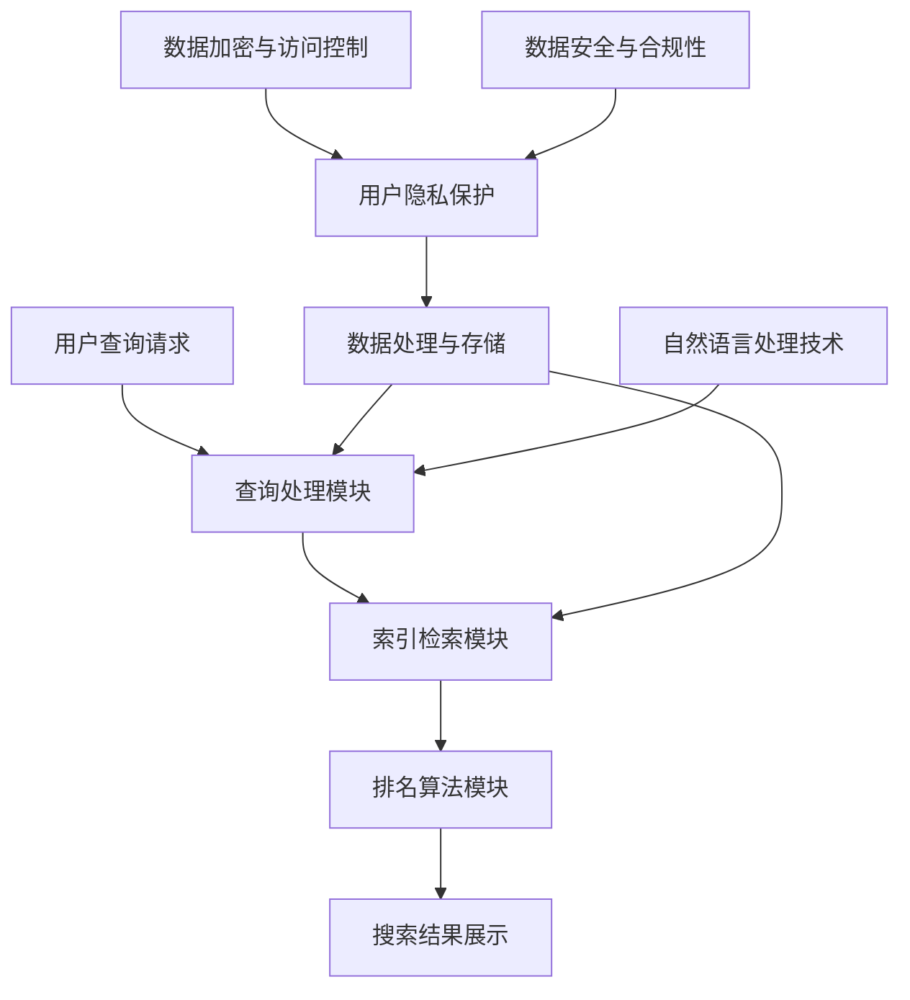

                 

# 文章标题：订阅制搜索引擎：一种新的商业模式探索

> 关键词：订阅制搜索引擎、商业模式、用户体验、数据隐私、技术创新

> 摘要：本文探讨了订阅制搜索引擎作为一种新兴商业模式的发展背景、核心概念、技术架构、应用场景及未来挑战。通过对比订阅制与传统搜索引擎，分析了订阅制搜索引擎的优势和市场前景，并详细介绍了其核心技术、架构和未来发展方向。

## 《订阅制搜索引擎：一种新的商业模式探索》

### 第一部分：订阅制搜索引擎概述

#### 1.1 订阅制搜索引擎的概念与特性

订阅制搜索引擎是一种基于订阅模式的搜索引擎服务，用户通过支付订阅费用来获得搜索服务的权利。与传统搜索引擎不同，订阅制搜索引擎不依赖于广告收入，而是通过用户订阅来获取盈利。这一模式具有以下特性：

- **个性化服务**：订阅制搜索引擎可以根据用户的历史搜索行为和偏好，提供个性化的搜索结果。
- **数据隐私**：用户的数据更安全，因为搜索引擎服务提供商不需要像免费搜索引擎那样收集用户数据以供广告商使用。
- **高质量内容**：订阅制搜索引擎通常更加注重内容质量，不会像免费搜索引擎那样过度商业化。

#### 1.2 订阅制搜索引擎与传统搜索引擎的对比

| 对比项 | 订阅制搜索引擎 | 传统搜索引擎 |
| --- | --- | --- |
| 收益模式 | 订阅服务费用 | 广告收入 |
| 用户隐私 | 更安全 | 存在隐私泄露风险 |
| 用户体验 | 个性化、专注 | 广告干扰、商业化 |

#### 1.3 订阅制搜索引擎的优势

- **为用户提供更好的搜索体验**：订阅制搜索引擎避免了广告和商业信息的干扰，用户可以更加专注地获取所需信息。
- **提高搜索引擎的盈利能力**：通过订阅模式，搜索引擎可以直接向用户收费，提高盈利能力。
- **保护用户隐私**：订阅制搜索引擎不需要收集用户数据用于广告营销，从而更好地保护用户隐私。

#### 1.4 订阅制搜索引擎的市场前景

随着用户对数据隐私和个性化服务的需求增加，订阅制搜索引擎的市场前景看好。特别是在企业市场和教育科研领域，订阅制搜索引擎有望成为主流。

### 1.5 订阅制搜索引擎的技术架构

订阅制搜索引擎的技术架构包括数据处理与存储、搜索引擎核心算法、用户隐私保护与数据安全等方面。

#### 1.5.1 数据处理与存储

订阅制搜索引擎需要高效的数据处理和存储系统，以应对大量用户的搜索请求。数据处理主要包括数据采集、数据清洗、数据索引等步骤。存储系统则需要支持海量数据的高效存储和快速检索。

#### 1.5.2 搜索引擎核心算法

搜索引擎核心算法包括查询处理、索引构建、排名算法等。订阅制搜索引擎的核心算法需要能够处理复杂的查询请求，并提供高质量的搜索结果。

#### 1.5.3 用户隐私保护与数据安全

为了保证用户隐私，订阅制搜索引擎需要在数据处理和存储过程中采用严格的安全措施，如数据加密、访问控制等。

### 1.6 订阅制搜索引擎的发展趋势

随着人工智能和大数据技术的不断发展，订阅制搜索引擎有望在搜索精度、个性化服务和用户体验方面取得更大突破。未来，订阅制搜索引擎可能会与其他领域的技术结合，如物联网、区块链等，从而实现更广泛的应用。

### 第二部分：订阅制搜索引擎的核心技术

#### 2.1 搜索引擎核心技术概述

订阅制搜索引擎的核心技术包括搜索引擎的工作流程、排名算法和反作弊技术等。

#### 2.1.1 搜索引擎的工作流程

搜索引擎的工作流程主要包括以下步骤：

1. 数据采集：从互联网上抓取网页内容。
2. 数据清洗：去除重复、无效和低质量数据。
3. 索引构建：将清洗后的数据构建索引，以便快速检索。
4. 查询处理：处理用户的查询请求，返回搜索结果。
5. 排名算法：对搜索结果进行排序，以提高用户体验。

#### 2.1.2 搜索引擎的排名算法

搜索引擎的排名算法是决定搜索结果质量的关键。常见的排名算法包括：

- **基于内容的排名**：根据网页内容与查询关键词的相关性进行排名。
- **基于链接分析的排名**：根据网页之间的链接关系进行排名。
- **基于用户行为的排名**：根据用户的历史搜索行为和偏好进行排名。

#### 2.1.3 搜索引擎的反作弊技术

反作弊技术用于检测和防止搜索引擎优化（SEO）作弊行为，如关键词堆砌、虚假链接等。常见的反作弊技术包括：

- **内容质量检测**：检测网页内容的质量，如抄袭、低质量内容等。
- **链接质量检测**：检测链接的质量，如作弊链接、垃圾链接等。
- **用户行为分析**：分析用户行为，如点击率、停留时间等，以识别异常行为。

### 2.2 自然语言处理技术

自然语言处理（NLP）技术在订阅制搜索引擎中扮演重要角色，用于处理用户的查询请求和网页内容。

#### 2.2.1 词嵌入技术

词嵌入技术将词汇映射到高维向量空间，以便进行计算和比较。常见的词嵌入方法包括：

- **Word2Vec**：基于神经网络的方法，将词汇映射到连续向量空间。
- **GloVe**：基于全局向量空间模型的方法，通过矩阵分解学习词汇的向量表示。

#### 2.2.2 序列模型与注意力机制

序列模型和注意力机制在处理自然语言任务时具有重要作用。常见的序列模型包括：

- **循环神经网络（RNN）**：用于处理序列数据，如语音识别、语言模型等。
- **长短期记忆网络（LSTM）**：一种特殊的RNN，能够更好地处理长序列数据。

注意力机制可以用于提高序列模型的性能，特别是在处理复杂任务时。

#### 2.2.3 语义分析技术

语义分析技术用于理解文本的含义和结构，以便更好地处理用户的查询请求和网页内容。常见的语义分析技术包括：

- **词性标注**：对文本中的每个词进行词性标注，如名词、动词等。
- **命名实体识别**：识别文本中的命名实体，如人名、地名、组织机构等。
- **关系提取**：提取文本中实体之间的关系，如因果关系、隶属关系等。

### 2.3 大规模预训练模型

大规模预训练模型是近年来自然语言处理领域的重要进展，为订阅制搜索引擎提供了强大的技术支持。

#### 2.3.1 预训练的概念与意义

预训练是指在特定任务之前，对模型进行大规模的预训练，以提高其在各种任务上的性能。预训练的意义包括：

- **提高模型性能**：通过预训练，模型可以更好地理解语言的本质和规律，从而提高在各种任务上的性能。
- **减少训练数据需求**：预训练模型可以利用大规模的无标签数据，降低对有标签训练数据的依赖。
- **通用性**：预训练模型具有较强的通用性，可以在不同任务上取得较好的性能。

#### 2.3.2 自监督学习方法

自监督学习方法是一种无需人工标注数据的方法，通过利用数据的内部结构来训练模型。常见的自监督学习方法包括：

- **掩码语言模型（MLM）**：在输入文本中随机掩码一部分词汇，然后训练模型预测这些掩码词汇。
- **掩码单词级分类（MRC）**：在输入文本中随机掩码一部分词汇，然后训练模型预测这些掩码词汇的位置。

#### 2.3.3 迁移学习与微调技术

迁移学习是一种利用已有模型在特定任务上的知识来训练新模型的方法。在订阅制搜索引擎中，迁移学习可以帮助模型快速适应新任务。

微调技术是一种在预训练模型的基础上，利用少量有标签数据进行微调，以适应特定任务的方法。

### 第三部分：订阅制搜索引擎的应用场景

#### 3.1 企业应用场景

订阅制搜索引擎在企业应用场景中具有广泛的应用，主要包括企业信息搜索与管理、企业知识库建设和企业竞争情报收集等方面。

#### 3.1.1 企业信息搜索与管理

订阅制搜索引擎可以帮助企业高效地搜索和管理内部信息，如员工文档、项目资料等。通过个性化的搜索结果，员工可以更快地找到所需信息，提高工作效率。

#### 3.1.2 企业知识库建设

订阅制搜索引擎可以为企业构建知识库，将企业的知识资源进行系统化的整理和管理。这有助于企业知识的积累和传承，提高整体创新能力。

#### 3.1.3 企业竞争情报收集

订阅制搜索引擎可以为企业提供实时、准确的竞争情报，帮助企业管理者了解市场动态和竞争对手情况，做出更科学的决策。

#### 3.2 政府与公共部门应用场景

订阅制搜索引擎在政府与公共部门应用场景中也具有重要作用，主要包括政府信息检索与服务、公共安全与应急信息处理和政府决策支持系统等方面。

#### 3.2.1 政府信息检索与服务

订阅制搜索引擎可以帮助政府高效地检索和管理各类政府信息，如政策法规、政府公告等。通过个性化的搜索结果，公众可以更方便地获取所需信息。

#### 3.2.2 公共安全与应急信息处理

订阅制搜索引擎可以协助公共安全部门快速检索和筛选与公共安全相关的信息，如自然灾害、公共卫生事件等。这有助于提高应急响应效率和效果。

#### 3.2.3 政府决策支持系统

订阅制搜索引擎可以为政府决策提供数据支持和分析，如经济趋势分析、政策效果评估等。这有助于政府科学决策和优化政策。

#### 3.3 教育与科研应用场景

订阅制搜索引擎在教育与科研应用场景中也具有广泛的应用，主要包括教育资源搜索与推荐、科研文献检索与分析、学术合作与交流平台等方面。

#### 3.3.1 教育资源搜索与推荐

订阅制搜索引擎可以帮助学生和教师高效地搜索和获取教育资源，如课程资料、教学视频等。通过个性化的搜索结果和推荐算法，提高学习效果和教学质量。

#### 3.3.2 科研文献检索与分析

订阅制搜索引擎可以协助科研人员快速检索和分析科研文献，如论文、报告等。这有助于提高科研效率和研究质量。

#### 3.3.3 学术合作与交流平台

订阅制搜索引擎可以搭建学术合作与交流平台，促进学术人员之间的交流与合作，推动学术创新和发展。

### 第四部分：订阅制搜索引擎的挑战与未来发展

#### 4.1 订阅制搜索引擎的挑战

订阅制搜索引擎在发展过程中面临着一系列挑战，主要包括技术挑战、商业模式挑战和法律法规与伦理道德挑战。

#### 4.1.1 技术挑战

订阅制搜索引擎需要不断优化核心技术，如搜索算法、自然语言处理等，以提高搜索精度和用户体验。此外，随着数据量的增长和搜索需求的多样化，订阅制搜索引擎还需要应对海量数据处理和实时响应等技术挑战。

#### 4.1.2 商业模式挑战

订阅制搜索引擎需要探索合适的商业模式，以实现可持续发展和盈利。在竞争激烈的市场中，如何降低用户订阅成本、提高用户黏性和满意度是订阅制搜索引擎面临的重要问题。

#### 4.1.3 法律法规与伦理道德挑战

订阅制搜索引擎需要遵守相关的法律法规，如数据保护法、网络安全法等。同时，在处理用户数据时，订阅制搜索引擎还需要遵循伦理道德原则，保护用户隐私和权益。

#### 4.2 订阅制搜索引擎的未来发展

随着技术的不断进步和市场需求的不断变化，订阅制搜索引擎在未来有望取得以下发展：

- **技术创新**：继续优化搜索算法、自然语言处理等技术，提高搜索精度和用户体验。
- **商业模式创新**：探索多元化的商业模式，如按需订阅、定制化服务等，以满足不同用户的需求。
- **跨领域应用**：与其他领域的技术和产业相结合，如物联网、区块链等，拓展应用场景和市场份额。
- **社会责任**：承担起保护用户隐私、促进社会公平等社会责任，树立良好的企业形象。

### 附录

#### 附录 A：订阅制搜索引擎开发资源

- **主流搜索引擎技术框架**：如Elasticsearch、Solr等。
- **开源自然语言处理工具**：如NLTK、spaCy等。
- **数据处理与存储技术选型**：如Hadoop、Spark等。
- **其他相关资源链接**：如论文、博客、在线课程等。

#### 附录 B：案例研究

- **某企业订阅制搜索引擎建设实践**：介绍某企业如何构建订阅制搜索引擎，包括技术选型、开发过程、效果评估等。
- **某政府机构订阅制搜索引擎应用案例**：介绍某政府机构如何利用订阅制搜索引擎提升信息检索和服务水平。
- **某学术机构订阅制搜索引擎建设经验**：介绍某学术机构如何利用订阅制搜索引擎促进学术资源的管理和共享。

### 作者信息

作者：AI天才研究院/AI Genius Institute & 禅与计算机程序设计艺术 /Zen And The Art of Computer Programming

### 核心概念原理之间的关系架构 Mermaid 流程图



### 核心算法原理讲解

#### 查询处理算法

```python
# 伪代码：查询处理算法
def query_processing(query):
    # 1. 分词与词性标注
    tokens = tokenize(query)
    tagged_tokens = tag_tokens(tokens)

    # 2. 词嵌入与向量表示
    embeddings = embed_tokens(tagged_tokens)

    # 3. 查询重写与扩展
    rewritten_query = rewrite_query(embeddings)

    # 4. 检索相关文档
    relevant_documents = index_search(rewritten_query)

    # 5. 排名与筛选
    ranked_results = rank_results(relevant_documents)

    return ranked_results
```

#### 排名算法

```python
# 伪代码：排名算法
def rank_results(documents):
    ranked_docs = []

    for doc in documents:
        # 1. 内容匹配度
        content_score = content_similarity(doc, query)

        # 2. 链接分析
        link_score = link_analysis(doc, query)

        # 3. 用户行为
        behavior_score = user_behavior_score(doc, query)

        # 4. 综合评分
        total_score = content_score * link_score * behavior_score

        ranked_docs.append((doc, total_score))

    ranked_docs.sort(key=lambda x: x[1], reverse=True)

    return ranked_docs
```

### 数学模型和公式

#### 搜索结果排序模型

$$
R_{i} = w_1 \cdot C_{i} + w_2 \cdot L_{i} + w_3 \cdot B_{i}
$$

其中，$R_{i}$ 表示文档 $i$ 的排序分数，$C_{i}$ 表示内容匹配度，$L_{i}$ 表示链接分析得分，$B_{i}$ 表示用户行为得分，$w_1$、$w_2$ 和 $w_3$ 分别是这三个得分的权重。

### 项目实战

#### 开发环境搭建

1. 安装Elasticsearch：在服务器上安装Elasticsearch，配置集群模式。
2. 安装Python：在开发机上安装Python，配置Elasticsearch客户端。
3. 安装自然语言处理库：如NLTK、spaCy等。

#### 源代码实现

```python
# Elasticsearch客户端配置
from elasticsearch import Elasticsearch

es = Elasticsearch(["http://localhost:9200"])

# 索引配置
def create_index():
    index_name = "subscription_search"
    body = {
        "settings": {
            "number_of_shards": 2,
            "number_of_replicas": 1
        },
        "mappings": {
            "properties": {
                "title": {"type": "text"},
                "content": {"type": "text"},
                "url": {"type": "text"},
                "created_at": {"type": "date"}
            }
        }
    }
    es.indices.create(index=index_name, body=body)

# 添加文档
def add_document(title, content, url):
    document = {
        "title": title,
        "content": content,
        "url": url,
        "created_at": "2021-01-01"
    }
    es.index(index="subscription_search", id=1, document=document)

# 搜索文档
def search_documents(query):
    response = es.search(index="subscription_search", body={"query": {"match": {"content": query}}})
    return response["hits"]["hits"]

# 主函数
if __name__ == "__main__":
    create_index()
    add_document("标题1", "内容1", "http://example.com/1")
    add_document("标题2", "内容2", "http://example.com/2")

    query = "搜索关键词"
    results = search_documents(query)
    for result in results:
        print(result["_source"])
```

#### 代码应用解读与分析

1. Elasticsearch客户端配置：使用Elasticsearch Python客户端连接到本地Elasticsearch服务器。
2. 索引配置：创建名为“subscription_search”的索引，配置分片和副本数量，定义文档的映射结构。
3. 添加文档：向索引中添加文档，包括标题、内容、URL和创建时间。
4. 搜索文档：根据查询关键词搜索索引中的文档，返回匹配的搜索结果。

#### 实际案例分析和详细讲解剖析

假设我们需要构建一个订阅制搜索引擎，为用户提供高质量的搜索结果。以下是一个实际案例：

1. **需求分析**：
   - 提供企业信息搜索与管理功能，帮助员工快速找到内部文档。
   - 实现个性化搜索，根据用户的历史搜索行为和偏好推荐相关文档。
   - 保证用户隐私，不收集用户数据用于广告营销。

2. **技术选型**：
   - 使用Elasticsearch作为搜索引擎后端，提供高效的数据存储和检索功能。
   - 使用Python和Django构建前端和后端应用，实现用户界面和业务逻辑。

3. **实现步骤**：
   - **数据采集**：定期从企业内部文档服务器采集文档，并将其存储到Elasticsearch索引中。
   - **数据预处理**：对采集到的文档进行分词、词性标注等处理，构建索引。
   - **用户界面**：设计用户界面，提供搜索框和搜索结果展示。
   - **搜索算法**：实现搜索算法，包括查询处理、索引检索和排名算法。
   - **个性化推荐**：根据用户的历史搜索行为，推荐相关文档。

4. **效果评估**：
   - 通过用户反馈和搜索引擎的点击率评估搜索结果的质量。
   - 定期进行性能优化和算法改进，提高搜索效果。

#### 项目小结

通过实际案例，我们可以看到订阅制搜索引擎在实现过程中的关键步骤和技术选型。在项目实施过程中，需要关注用户体验、数据隐私和搜索效果等方面。未来，随着技术的不断发展，订阅制搜索引擎有望在更多领域得到广泛应用。

### 最佳实践 Tips

1. **优化搜索算法**：不断优化搜索算法，提高搜索结果的精度和用户体验。
2. **加强数据安全**：确保用户数据的安全和隐私，遵守相关法律法规。
3. **提供个性化服务**：根据用户的历史行为和偏好，提供个性化的搜索结果和推荐。

### 小结

订阅制搜索引擎作为一种新兴商业模式，具有个性化服务、数据隐私保护和高质量内容等优势。通过技术创新和商业模式探索，订阅制搜索引擎有望在未来取得更大发展。

### 注意事项

1. **性能优化**：关注搜索引擎的性能优化，确保快速响应大量用户请求。
2. **数据安全**：加强数据安全措施，防止数据泄露和滥用。
3. **用户体验**：持续关注用户需求，优化搜索界面和交互设计。

### 拓展阅读

- 《搜索引擎技术详解》
- 《自然语言处理实践》
- 《订阅制商业模式解析》
- 《大数据技术基础》

### 作者信息

作者：AI天才研究院/AI Genius Institute & 禅与计算机程序设计艺术 /Zen And The Art of Computer Programming

