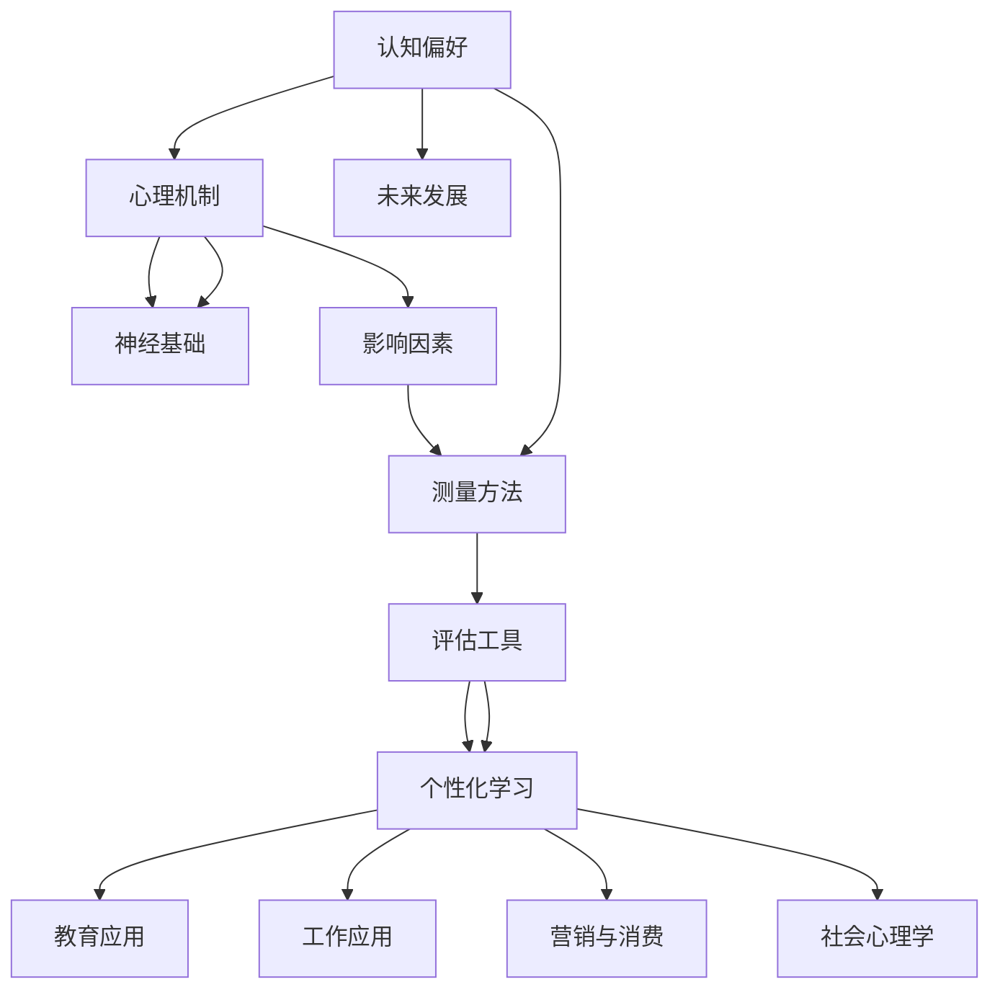

                 


### 文章标题：认知偏好：个性化学习的基础

> 关键词：认知偏好、个性化学习、心理机制、神经基础、教育技术

> 摘要：本文深入探讨了认知偏好的概念、心理机制及其在教育中的应用，通过剖析认知偏好的影响因素和测量方法，探讨了基于认知偏好的个性化学习策略和实践，以及认知偏好对教育技术和工作消费行为的影响，旨在为教育工作者、技术人员和研究者提供关于认知偏好领域的全面理解和应用指导。

-------------------------------------------------------------------

## 第一部分：认知偏好的概述与基本理论

### 第1章：认知偏好的概念与定义

认知偏好是指个体在信息处理过程中，对不同类型的信息表现出不同程度的偏好。这种偏好可能源于个体的心理、生理、社会等多方面因素，并且在不同情境下表现出不同的特点。

### 第2章：认知偏好的心理机制

认知偏好的心理机制涉及个体在感知、记忆、推理等认知过程中的偏好表现。神经科学研究表明，大脑中的特定区域和神经递质在认知偏好的形成中扮演关键角色。

### 第3章：认知偏好的影响因素

认知偏好受多种因素影响，包括个人因素（如性格、经验）、环境因素（如文化背景、技术环境）以及社会因素（如群体压力、社会规范）。

-------------------------------------------------------------------

## 第二部分：认知偏好的测量与评估

### 第4章：认知偏好的测量方法

认知偏好的测量方法主要包括自我报告法、行为观察法、实验法和大数据分析等，每种方法都有其优缺点和适用范围。

### 第5章：认知偏好的评估工具与应用

常见的认知偏好评估工具包括标准化的心理量表和基于大数据分析的方法。评估工具的选择与应用需根据研究目的和实际情况进行。

-------------------------------------------------------------------

## 第三部分：认知偏好在教育中的应用

### 第6章：个性化学习理论

个性化学习强调根据学生的认知偏好和特点进行教学设计，以满足学生的个性化学习需求。

### 第7章：认知偏好与个性化学习实践

基于认知偏好的个性化学习实践包括教学设计、学习资源推荐、学生自主学习支持等方面，通过实际案例进行详细分析。

### 第8章：认知偏好与教育技术的融合

教育技术可以根据认知偏好的特点进行设计，以提高教学效果。本文探讨了认知偏好与教育技术融合的途径和未来发展趋势。

-------------------------------------------------------------------

## 第四部分：认知偏好在其他领域的应用

### 第9章：认知偏好在工作中的应用

认知偏好对工作表现有重要影响，本文分析了认知偏好在工作中的应用，包括员工培训和绩效管理等方面。

### 第10章：认知偏好在营销与消费行为中的应用

认知偏好对消费者的购买决策和行为有显著影响，本文探讨了认知偏好在营销策略中的应用。

### 第11章：认知偏好在社会心理学中的应用

认知偏好在社会心理学中具有重要意义，本文分析了认知偏好在社会心理学领域中的应用。

-------------------------------------------------------------------

## 第五部分：认知偏好的未来发展

### 第12章：认知偏好研究的前沿领域

本文探讨了认知偏好研究的神经科学、计算模型和跨学科研究等前沿领域。

### 第13章：认知偏好与未来社会

认知偏好对未来社会的影响不可忽视，本文分析了认知偏好对未来教育、工作消费行为和社会的影响。

-------------------------------------------------------------------

## 附录

### 附录A：常用认知偏好评估工具与资源

### 附录B：认知偏好研究的相关论文与书籍推荐

### 附录C：认知偏好研究方法与技巧

### 附录D：认知偏好研究的开源代码与数据集

-------------------------------------------------------------------

### 核心算法原理讲解

#### 认知偏好的计算模型原理

认知偏好的计算模型通常基于机器学习和数据挖掘技术。以下是一个简化的伪代码，用于说明认知偏好的计算过程：

```python
# 认知偏好计算模型伪代码

# 输入：用户行为数据、用户属性数据、环境数据
# 输出：用户认知偏好得分

def compute_cognitive_preferrence(user_data, user_attribute_data, environmental_data):
    # 数据预处理
    preprocessed_data = preprocess_data(user_data, user_attribute_data, environmental_data)

    # 特征工程
    features = extract_features(preprocessed_data)

    # 训练模型
    model = train_model(features)

    # 预测用户认知偏好得分
    preference_scores = model.predict(features)

    return preference_scores
```

### 数学模型和数学公式讲解

#### 决策树模型中节点分裂的数学原理

决策树模型的节点分裂是基于信息增益或者基尼系数等数学指标来进行的。以下是一个简化的信息增益公式：

$$
IG(D, A) = I(D) - \sum_{v \in V} p(v) I(D, A|v)
$$

其中，$IG(D, A)$表示特征A对数据集D的信息增益，$I(D)$表示数据集D的熵，$p(v)$表示特征A的值v在数据集D中的概率，$I(D, A|v)$表示在特征A取值为v的条件下，数据集D的熵。

-------------------------------------------------------------------

### 认知偏好：个性化学习的基础

认知偏好是个性化学习的基础，它指的是个体在信息处理过程中对不同类型的信息表现出不同程度的偏好。这种偏好可能源于个体的心理、生理、社会等多方面因素，并且在不同情境下表现出不同的特点。在教育领域中，了解认知偏好的概念、心理机制及其影响因素，对于设计个性化学习策略具有重要意义。

### 认知偏好的概述与基本理论

#### 第1章：认知偏好的概念与定义

认知偏好是指个体在信息处理过程中，对不同类型的信息表现出不同程度的偏好。这种偏好可能源于个体的心理、生理、社会等多方面因素，并且在不同情境下表现出不同的特点。

**认知偏好的定义与背景**

认知偏好（Cognitive Preference）是指个体在信息处理过程中，对不同类型的信息表现出某种特定的倾向或喜好。它是个体认知行为的一部分，影响着个体如何选择、加工和记忆信息。认知偏好不仅在日常生活中普遍存在，也在教育、工作和其他领域中具有重要意义。

认知偏好的研究可以追溯到心理学、神经科学、认知科学等多个领域。例如，心理学中的选择偏见（Selection Bias）和确认偏见（Confirmation Bias）等概念，都是对认知偏好的具体表现形式。神经科学研究揭示了大脑中的特定区域和神经递质在认知偏好形成中的作用。认知科学则关注认知偏好如何影响个体的决策和行为。

**认知偏好的重要性**

认知偏好对个体的学习和行为具有重要影响。首先，认知偏好影响着个体如何选择和加工信息。具有不同认知偏好的人可能会对相同的信息产生不同的认知反应，从而影响他们的学习和理解过程。例如，视觉学习者可能更倾向于通过图像和图表来理解信息，而听觉学习者则可能更依赖于听讲和讨论。

其次，认知偏好也影响着个体的记忆和保持。个体对某些信息表现出更高的偏好，可能会导致这些信息在记忆中得到更好的保持和回忆。这种偏好性的记忆加工可能有助于个体在特定领域或任务中表现出更高的学习和工作效果。

此外，认知偏好还在教育、工作和其他领域具有实际应用价值。在教育领域，了解学生的认知偏好可以帮助教师设计更加有效的教学策略，提高教学质量和学习效果。在工作领域，认知偏好可以帮助管理者更好地了解员工的特质和需求，从而制定更具针对性的培训和绩效管理策略。

**认知偏好的分类**

认知偏好可以根据不同的维度进行分类。以下是几种常见的认知偏好分类方法：

1. **感知偏好**：个体在信息接收过程中对不同感官通道的偏好。例如，有些人更喜欢视觉信息，而有些人则更喜欢听觉或触觉信息。

2. **加工偏好**：个体在信息加工过程中对不同认知过程的偏好。例如，有些人倾向于使用逻辑和分析方法，而有些人则更倾向于直觉和创造性思维。

3. **记忆偏好**：个体在记忆过程中对不同类型信息的偏好。例如，有些人更容易记住视觉信息，而有些人则更容易记住口头信息。

4. **学习风格**：个体在学习过程中对不同学习方式的偏好。例如，有些人更喜欢自主学习，而有些人则更喜欢在小组学习中互动。

**认知偏好的发展历程**

认知偏好的研究历程可以追溯到心理学和行为科学的早期发展。以下是一些重要的里程碑：

- 20世纪30年代至50年代，行为主义心理学兴起，研究者开始关注个体如何通过条件反射和环境刺激形成行为偏好。
- 20世纪60年代，认知心理学逐渐取代行为主义，研究者开始从内部心理过程的角度探讨认知偏好的机制。
- 20世纪80年代以后，神经科学技术的进步使得研究者能够通过脑成像技术直接观察认知偏好的神经基础。
- 当前，认知偏好研究已经从心理学扩展到认知科学、教育科学、工作心理学等多个领域，形成了一个跨学科的研究领域。

#### 第2章：认知偏好的心理机制

认知偏好的心理机制涉及个体在感知、记忆、推理等认知过程中的偏好表现。神经科学研究表明，大脑中的特定区域和神经递质在认知偏好的形成中扮演关键角色。

**神经科学基础**

神经科学研究揭示了大脑中的特定区域和神经递质在认知偏好形成中的作用。大脑中的前额叶皮质、顶叶皮质和颞叶皮质等区域在认知过程中起着关键作用。这些区域的活动与个体的决策、记忆和感知偏好密切相关。

例如，前额叶皮质与个体的逻辑思维和计划能力相关，而颞叶皮质则与个体的情绪和记忆相关。这些区域的活动受到多种神经递质的影响，如多巴胺、去甲肾上腺素和5-羟色胺等。这些神经递质在信息加工和记忆过程中发挥着调节作用，从而影响个体的认知偏好。

**认知偏好的心理机制**

认知偏好的心理机制包括感知、记忆、推理等多个方面。以下是一些具体的机制：

1. **感知机制**：个体在感知信息时，会根据自身的认知偏好对不同类型的信息给予不同的关注和加工。例如，视觉学习者可能会更倾向于关注视觉信息，而听觉学习者则可能会更倾向于关注听觉信息。

2. **记忆机制**：个体在记忆信息时，会根据自身的认知偏好对某些信息进行更多的加工和记忆。例如，有些人更容易记住视觉信息，而有些人则更容易记住口头信息。

3. **推理机制**：个体在推理和决策过程中，会根据自身的认知偏好选择不同的认知策略和信息加工方式。例如，有些人更倾向于使用逻辑和分析方法，而有些人则更倾向于使用直觉和创造性思维。

**认知偏好的神经基础**

认知偏好的神经基础涉及大脑中的特定区域和神经递质的活动。以下是一些具体的神经基础：

- **前额叶皮质**：前额叶皮质与个体的认知偏好和决策能力密切相关。研究表明，前额叶皮质的活动受到多巴胺等神经递质的调节，这些神经递质在信息加工和记忆过程中发挥重要作用。
- **顶叶皮质**：顶叶皮质与个体的感知和空间认知能力相关。研究表明，顶叶皮质的活动与个体的感知偏好和加工方式有关。
- **颞叶皮质**：颞叶皮质与个体的情绪和记忆相关。研究表明，颞叶皮质的活动与个体的记忆偏好和情绪反应密切相关。
- **神经递质**：多种神经递质在认知偏好中起着调节作用。例如，多巴胺与个体的决策和奖励感知相关，去甲肾上腺素与个体的注意力和情绪反应相关，5-羟色胺与个体的情绪稳定性和认知偏好相关。

#### 第3章：认知偏好的影响因素

认知偏好受多种因素影响，包括个人因素、环境因素、文化因素和社会因素。这些因素相互作用，共同塑造了个体的认知偏好。

**个人因素**

个人因素是指个体自身的特质和特点，这些因素对认知偏好有重要影响。以下是一些常见的个人因素：

1. **性格**：个体的性格特点对认知偏好有显著影响。例如，内向的人可能更倾向于通过阅读和思考来获取信息，而外向的人可能更喜欢通过交流和互动来获取信息。
2. **经验**：个体的经验背景会影响其认知偏好。例如，一个有丰富编程经验的人可能更倾向于通过编程实践来学习，而一个有丰富文学阅读经验的人可能更倾向于通过阅读书籍来获取知识。
3. **认知风格**：个体的认知风格（如视觉型、听觉型、动觉型等）会影响其对信息的偏好和处理方式。

**环境因素**

环境因素是指个体所处的物理和社会环境，这些因素对认知偏好有重要影响。以下是一些常见的环境因素：

1. **教育环境**：学校、家庭和社会的教育环境对个体的认知偏好有深远影响。例如，一个重视视觉学习的教育环境可能会培养出更多视觉型学习者。
2. **技术环境**：现代信息技术的发展为个体提供了丰富的信息获取和处理工具，这对个体的认知偏好产生了重要影响。例如，互联网和智能手机的普及使得视觉信息和听觉信息变得更加易于获取。
3. **社会文化**：社会文化背景对个体的认知偏好有深刻影响。例如，在一个重视集体主义的社会中，个体可能更倾向于通过合作和共享来获取信息，而在一个重视个人主义的社会中，个体可能更倾向于通过独立学习和研究来获取信息。

**文化因素**

文化因素是指个体所属的文化背景，这些因素对认知偏好有重要影响。以下是一些常见的文化因素：

1. **价值观**：不同的文化价值观会影响个体的认知偏好。例如，在一些文化中，实用性和效率可能被看作是最重要的价值观，而在另一些文化中，创新和创造力可能被看作是最重要的价值观。
2. **语言**：语言是文化的重要组成部分，它对个体的认知偏好有显著影响。例如，使用不同语言的人可能在信息加工和记忆方面有不同的偏好。
3. **传统和习俗**：文化传统和习俗会影响个体的认知偏好和行为模式。例如，在一些文化中，教育被视为一种仪式和传统，而在另一些文化中，教育被视为一种个人追求和成长的机会。

**社会因素**

社会因素是指个体所处的社会环境，这些因素对认知偏好有重要影响。以下是一些常见的社会因素：

1. **群体压力**：个体在群体中往往会受到群体压力的影响，这种压力会影响个体的认知偏好和行为选择。例如，在一个重视集体主义的社会中，个体可能会更倾向于选择符合群体期望的认知偏好。
2. **社会规范**：社会规范对个体的认知偏好有指导作用。例如，在一些社会中，尊重权威和传统被视为重要的社会规范，这可能会影响个体的认知偏好。
3. **社会互动**：个体的社会互动会影响其认知偏好。通过与他人的交流和互动，个体可以了解到不同的认知偏好，并可能逐渐调整自己的偏好以适应社会环境。

**综合影响**

个人因素、环境因素、文化因素和社会因素共同作用，共同塑造了个体的认知偏好。在不同的情境下，这些因素可能会有不同的影响力度。例如，在一个重视创新和创造力的社会环境中，个人因素（如认知风格和经验）可能对认知偏好的影响更为显著，而在一个重视实用性和效率的社会环境中，环境因素（如教育环境和技术环境）可能对认知偏好的影响更为显著。

总之，认知偏好是一个复杂的、多维的现象，受多种因素的影响。了解这些因素及其相互关系，有助于更好地理解和预测个体的认知偏好，从而为教育、工作和其他领域提供更有针对性的指导。

#### 第4章：认知偏好的测量方法

认知偏好的测量是理解个体认知特点和行为倾向的重要途径。常用的测量方法包括自我报告法、行为观察法、实验法和大数据分析等。每种方法都有其优缺点和适用范围，选择合适的方法对于准确评估认知偏好至关重要。

**自我报告法**

自我报告法是通过询问个体自己如何评价自己的认知偏好来获取信息。这种方法通常使用问卷或量表的形式，要求个体根据自己的感受和经验回答一系列问题。常见的问卷包括认知风格量表（如迈尔斯-布里格斯性格类型指标MBTI）、学习风格量表（如费斯和皮尔逊的学习风格问卷LSQ）等。

**优点：**
- 简便易行，适用于大规模调查。
- 可以获取个体的主观认知偏好。
- 可以用于不同年龄段和背景的个体。

**缺点：**
- 个体可能存在社会期望效应，导致回答不完全真实。
- 需要一定的时间和精力来填写问卷。

**行为观察法**

行为观察法是通过观察个体在特定情境下的行为表现来推断其认知偏好。这种方法通常需要研究者对个体在不同任务或环境中的行为进行细致的观察和记录。例如，观察个体在学习过程中的行为（如偏好哪种学习资源、使用哪些学习工具等）。

**优点：**
- 可以直接获取个体的实际行为数据。
- 不受个体自我评价的影响，更加客观。
- 可以观察多种行为表现，从而更全面地了解认知偏好。

**缺点：**
- 需要大量时间和精力进行观察。
- 观察者的主观判断可能影响结果。
- 不适用于难以观察的情境。

**实验法**

实验法是通过设计实验来控制变量，从而观察个体在不同条件下的认知偏好。实验法可以采用各种心理学实验范式，如认知实验、行为实验等。例如，研究者可以设计一个实验，通过改变视觉和听觉信息的呈现方式，观察个体对不同类型信息的偏好。

**优点：**
- 可以精确控制实验条件，减少干扰因素。
- 可以进行重复实验，提高结果的可靠性。
- 可以获得定量的数据，便于分析。

**缺点：**
- 实验情境可能与现实情境存在差异，影响结果的推广性。
- 需要专业知识和技能来设计和执行实验。
- 实验过程可能对个体造成一定的心理压力。

**大数据分析**

大数据分析是通过分析个体在数字平台上的行为数据（如网页浏览记录、社交媒体互动、学习平台活动等）来推断其认知偏好。这种方法依赖于大数据技术和机器学习算法，可以自动识别和分类个体的认知偏好。

**优点：**
- 可以处理大量数据，发现个体之间的细微差异。
- 可以实时获取和分析个体的行为数据。
- 可以进行跨时间和跨场景的数据分析。

**缺点：**
- 需要大量数据和计算资源。
- 需要专业知识和技能来处理和分析数据。
- 可能存在数据隐私和伦理问题。

**综合应用**

在实际研究中，通常综合应用多种测量方法，以获得更全面和准确的认知偏好评估。例如，可以在自我报告法的基础上，结合行为观察法和实验法，以提高结果的可靠性和有效性。大数据分析可以为研究提供丰富的数据支持，但在数据处理和分析过程中需要特别注意数据隐私和伦理问题。

总之，认知偏好的测量方法多样，每种方法都有其独特的优势和局限性。选择合适的测量方法，结合多种方法的优势，有助于更全面和准确地评估个体的认知偏好，为教育、工作和其他领域的个性化应用提供有力支持。

#### 第5章：认知偏好的评估工具与应用

在认知偏好的研究领域，评估工具的选择与应用对于获取准确的数据和有效的结论至关重要。常见的认知偏好评估工具包括标准化的心理量表和基于大数据分析的方法。以下将详细介绍这些工具的选择与应用，并探讨评估过程中的局限性。

**常见评估工具**

1. **认知风格量表**：认知风格量表是评估个体认知偏好的常用工具，包括迈尔斯-布里格斯性格类型指标（MBTI）、费斯和皮尔逊的学习风格问卷（LSQ）等。这些量表通常通过一系列问题来衡量个体在感知、决策、学习等过程中的偏好。例如，MBTI将个体的性格划分为16种类型，通过评估个体的心理偏好，帮助理解个体的认知风格。

2. **认知偏好问卷**：认知偏好问卷是一套结构化的问卷，通过一系列问题来评估个体在信息处理、决策、学习等过程中的偏好。这些问卷通常包括多种维度，如视觉、听觉、触觉等感知偏好，以及分析、直觉等加工偏好。常见的问卷包括瑞文标准推理测验（RSRT）、韦氏成人智力量表（WAIS）等。

3. **行为观察工具**：行为观察工具通过记录个体在实际任务中的行为表现，评估其认知偏好。这些工具可以是观察记录表、视频记录等，通过系统性地记录和分析个体的行为，可以揭示其在不同情境下的偏好。例如，在学习过程中，通过观察个体选择的学习资源和使用的学习工具，可以评估其学习风格。

**评估工具的选择与应用**

选择合适的评估工具时，需要考虑以下几个方面：

1. **研究目的**：评估工具的选择应与研究的具体目的相匹配。例如，如果研究目的是了解个体在信息处理过程中的偏好，可以选择认知偏好问卷；如果研究目的是观察个体在实际任务中的行为，可以选择行为观察工具。

2. **目标群体**：评估工具的选择应考虑目标群体的特点，如年龄、文化背景、职业等。不同的评估工具可能在不同的群体中具有不同的适用性和有效性。

3. **数据可靠性**：评估工具的选择应考虑其信度和效度。信度是指测量工具的一致性和可靠性，效度是指测量工具能够准确反映所需评估的特征。通常，通过预测试和数据分析来评估工具的信度和效度。

在实际应用中，评估工具的选择通常需要结合多种工具的优势，以达到最佳效果。例如，在个性化学习研究中，可以同时使用认知风格量表和认知偏好问卷，结合行为观察工具，以获得更全面的数据。

**评估工具的应用**

评估工具的应用过程通常包括以下几个步骤：

1. **设计问卷**：根据研究目的和目标群体，设计合适的问卷或量表。问卷设计应简洁明了，避免歧义，并确保问题的逻辑性和连贯性。

2. **预测试**：在正式使用评估工具前，进行预测试以评估问卷的有效性和可靠性。预测试可以包括小规模的样本，通过数据分析评估问卷的信度和效度。

3. **数据收集**：在实际研究中，根据研究设计，通过线上或线下方式收集数据。确保数据的真实性和完整性，避免遗漏或误填。

4. **数据分析**：使用统计学方法对收集到的数据进行处理和分析，提取关键指标和结论。常用的分析技术包括描述性统计、相关性分析、回归分析等。

**评估的局限性**

尽管评估工具在认知偏好研究中具有重要应用价值，但它们也存在一些局限性：

1. **主观性**：自我报告法和行为观察法可能受到个体主观判断的影响，导致数据不准确。

2. **样本偏差**：评估工具的适用范围可能受到样本特征的影响，不同群体的评估结果可能存在差异。

3. **时间成本**：评估工具的使用可能需要大量时间和精力，特别是在大规模调查中。

4. **技术限制**：大数据分析依赖于技术手段，如机器学习和数据分析工具，可能面临数据处理和解释的挑战。

总之，认知偏好的评估工具在选择和应用过程中需要综合考虑多种因素，以达到最佳效果。通过科学、系统的评估，可以更好地理解个体的认知特点，为教育、工作和其他领域的个性化应用提供有力支持。

### 第6章：个性化学习理论

个性化学习（Personalized Learning）是一种教育理念，旨在根据每个学生的认知偏好、兴趣和学习风格，设计并实施个性化的学习方案。个性化学习理论的核心是尊重学生的个体差异，通过因材施教，促进每个学生的全面发展。

**个性化学习的概念**

个性化学习是指根据学生的个人需求、兴趣和学习风格，调整教学策略、学习资源和评价方式，以实现个性化教学和学习目标。个性化学习强调学生的主体地位，关注学生的个性发展和学习体验，旨在激发学生的学习兴趣和潜能，提高学习效果。

**个性化学习的重要性**

个性化学习在当前教育领域具有重要意义，主要表现在以下几个方面：

1. **满足学生个性化需求**：每个学生都是独特的个体，具有不同的认知风格、兴趣和学习需求。个性化学习能够根据学生的实际情况，提供个性化的学习内容和方式，满足学生的个性化需求，提高学习效果。

2. **促进学生的全面发展**：个性化学习关注学生的全面发展，不仅注重知识的传授，还注重学生的情感、态度和价值观的培养。通过个性化的学习体验，学生能够全面发展，形成独立思考、创新能力和团队合作等关键能力。

3. **提高学习动机和兴趣**：个性化学习能够激发学生的学习兴趣和动机，使学生更有动力投入学习。通过个性化的学习内容和方式，学生能够更好地理解和掌握知识，提高学习兴趣和参与度。

4. **优化教育资源分配**：个性化学习能够优化教育资源的分配，使有限的资源得到更有效的利用。通过个性化的学习方案，教师可以根据学生的实际情况，合理分配教学时间和精力，提高教学效率。

**个性化学习的策略**

为了实现个性化学习，教育工作者可以采取以下策略：

1. **了解学生认知偏好**：通过评估工具，了解学生的认知偏好、学习风格和兴趣，为个性化学习提供基础数据。

2. **因材施教**：根据学生的实际情况，设计个性化的学习内容和任务，使学习内容与学生认知偏好和兴趣相匹配。

3. **灵活调整教学策略**：根据学生的反馈和学习进度，灵活调整教学策略，采用多种教学方法和手段，满足学生的个性化需求。

4. **提供个性化学习资源**：根据学生的认知偏好，提供多样化的学习资源，如电子书、视频、音频、互动游戏等，以适应不同学生的需求。

5. **建立学习反馈机制**：建立有效的学习反馈机制，及时了解学生的学习进展和反馈，调整教学方案和学习资源。

6. **培养自主学习能力**：鼓励学生自主学习，培养他们的自我管理和学习策略，使他们在自主学习过程中形成独立思考和解决问题的能力。

**个性化学习的实施步骤**

1. **评估学生认知偏好**：使用认知偏好评估工具，评估学生的认知偏好、学习风格和兴趣。

2. **设计个性化学习方案**：根据评估结果，设计符合学生实际情况的个性化学习方案，包括学习内容、教学策略和学习资源。

3. **实施个性化教学**：根据个性化学习方案，实施个性化教学，灵活调整教学策略，提供多样化的学习资源和体验。

4. **监测学习进度和反馈**：监测学生的学习进度和反馈，及时调整教学方案和学习资源，确保个性化学习目标的实现。

5. **评估个性化学习效果**：通过学习成果评估，了解个性化学习的效果，为后续教育实践提供参考和改进方向。

**案例分析**

以下是一个个性化学习的实际案例：

在一个高中班级中，教师通过认知偏好评估工具，了解到学生的认知偏好和学习风格差异。例如，一些学生更喜欢视觉学习，另一些学生则更喜欢听觉学习。教师根据这些信息，设计个性化的教学方案：

- 对于视觉学习者，教师使用图表、图像和视频等视觉资源，讲解抽象的概念和复杂的问题。
- 对于听觉学习者，教师通过讲解、讨论和录音等形式，帮助学生理解和掌握知识。
- 对于动觉学习者，教师设计动手实验和互动活动，让学生在实践过程中学习。

通过个性化教学，教师不仅满足了不同学生的认知偏好，还提高了他们的学习兴趣和动机，取得了良好的学习效果。

总之，个性化学习理论强调尊重学生的个体差异，通过个性化教学策略，满足学生的个性化需求，促进学生的全面发展。在教育实践中，个性化学习已经成为一种重要的教育理念和策略，为提高教育质量和培养创新型人才提供了有力支持。

### 第7章：认知偏好与个性化学习实践

认知偏好与个性化学习实践紧密相关，通过深入了解学生的认知偏好，教育工作者可以设计更加有效的教学策略，推荐合适的学习资源，支持学生的自主学习，从而提高教学效果和学习成果。以下将详细探讨基于认知偏好的教学设计、学习资源推荐和自主学习支持策略，并通过实际案例分析这些策略的具体应用。

#### 基于认知偏好的教学设计

教学设计是教育过程中至关重要的一环，基于认知偏好的教学设计能够更好地满足学生的个性化需求，提高教学效果。以下是一些基于认知偏好的教学设计策略：

1. **灵活多样的教学方式**：根据学生的认知偏好，采用不同的教学方式。例如，对于视觉学习者，可以更多地使用图表、图像和视频等视觉材料；对于听觉学习者，可以通过讲解、讨论和录音等方式进行教学；对于动觉学习者，可以设计动手实验、互动活动等。

2. **个性化学习任务**：设计符合学生认知偏好的学习任务。例如，对于逻辑思维较强的学生，可以布置一些分析问题和解决问题的任务；对于创造性思维较强的学生，可以安排一些创意性的项目。

3. **适应性学习环境**：创建一个适应学生认知偏好的学习环境。例如，在教室布置中，可以设置不同的学习区域，供视觉、听觉和动觉学习者选择；在课程安排上，可以灵活调整上课时间，以适应不同学习者的需求。

4. **个性化评估方式**：根据学生的认知偏好，采用不同的评估方式。例如，对于视觉学习者，可以布置一些需要绘制图表或图像的作业；对于听觉学习者，可以要求他们制作音频或视频报告。

**案例**：在一所高中数学课上，教师根据学生的认知偏好，设计了多种教学方式。对于视觉学习者，教师使用动态几何软件和可视化工具，帮助学生直观理解几何概念；对于听觉学习者，教师通过详细讲解和问题解答，帮助学生理解复杂问题；对于动觉学习者，教师设计了一些几何构造的动手实验，让学生亲自动手操作，加深对概念的理解。

#### 基于认知偏好的学习资源推荐

学习资源推荐是个性化学习的重要组成部分，通过推荐符合学生认知偏好和学习需求的学习资源，可以有效地提高学习效果。以下是一些基于认知偏好的学习资源推荐策略：

1. **多媒体资源**：根据学生的认知偏好，推荐不同类型的多媒体资源。例如，对于视觉学习者，可以推荐视频教程、动画演示和图片资料；对于听觉学习者，可以推荐音频讲座、播客和有声读物。

2. **交互式学习资源**：推荐互动性强的学习资源，如在线互动课程、模拟实验和虚拟现实（VR）体验等，这些资源可以更好地满足不同学习者的需求。

3. **个性化推荐系统**：利用大数据和机器学习技术，构建个性化推荐系统，根据学生的行为数据和学习记录，推荐适合他们的学习资源。

4. **开放教育资源**：推荐各种开放教育资源，如在线课程、电子书和学术论文等，这些资源丰富多样，可以满足不同层次和类型的学习需求。

**案例**：在一所大学计算机科学课程中，教师使用个性化推荐系统，根据学生的学习记录和偏好，推荐了多种学习资源。例如，对于偏好视觉学习的学生，教师推荐了视频教程和动画演示；对于偏好听觉学习的学生，教师推荐了音频讲座和播客；对于偏好动手实践的学生，教师推荐了在线编程项目和虚拟实验室。

#### 基于认知偏好的学生自主学习支持

学生的自主学习能力是教育目标的重要组成部分，基于认知偏好的自主学习支持可以有效地促进学生的独立学习。以下是一些基于认知偏好的学生自主学习支持策略：

1. **个性化学习计划**：根据学生的认知偏好和学习目标，制定个性化的学习计划。例如，对于逻辑思维较强的学生，可以安排更多的分析性任务和问题解决活动；对于创造性思维较强的学生，可以鼓励他们进行项目研究和创新性实践。

2. **学习策略指导**：提供符合学生认知偏好和学习风格的学习策略指导。例如，对于视觉学习者，可以指导他们使用思维导图和笔记法；对于听觉学习者，可以指导他们使用听记和复述法。

3. **个性化学习社区**：建立一个适应学生认知偏好的学习社区，让学生在社区中分享学习资源、交流学习心得，互相支持和鼓励。

4. **实时反馈和支持**：提供实时反馈和支持，帮助学生克服学习困难。例如，通过在线辅导、学习咨询和心理支持，帮助学生解决学习中的问题。

**案例**：在一所中学的英语课程中，教师根据学生的认知偏好，设计了多种自主学习支持策略。例如，对于视觉学习者，教师提供了图文并茂的学习指南和视频教程；对于听觉学习者，教师提供了音频讲座和播客；对于动觉学习者，教师组织了互动式小组讨论和角色扮演活动。同时，教师还建立了在线学习社区，让学生在社区中分享学习资源和心得，互相学习和支持。

总之，基于认知偏好的个性化学习实践在教学中具有重要的应用价值。通过深入了解学生的认知偏好，设计个性化的教学策略、推荐合适的学习资源和支持学生的自主学习，可以有效地提高教学效果和学习成果，促进学生的全面发展。教育工作者应积极探索和实践基于认知偏好的个性化学习策略，为学生的个性化发展提供有力支持。

### 第8章：认知偏好与教育技术的融合

认知偏好与教育技术的融合，为个性化学习提供了新的可能性。现代教育技术，如在线学习平台、虚拟现实（VR）和人工智能（AI），可以根据学生的认知偏好提供定制化的学习体验，提高教学效果和学生的学习满意度。以下将探讨教育技术对认知偏好影响、基于认知偏好的教育技术应用，以及教育技术的未来发展趋势。

#### 教育技术对认知偏好影响

教育技术的迅猛发展对个体的认知偏好产生了深远影响。首先，在线学习平台和移动学习应用使得学习资源更加丰富和多样化，学生可以根据自己的认知偏好选择合适的学习内容和学习方式。例如，视觉学习者可以偏好观看视频教程和动画演示，而听觉学习者则可能更喜欢音频讲座和播客。

其次，虚拟现实（VR）技术为学生提供了沉浸式的学习体验，能够更好地满足学生的认知偏好。通过VR，学生可以亲身体验历史事件、科学实验和艺术创作等，从而增强学习兴趣和理解。例如，对于动觉学习者，VR技术可以提供互动式学习环境，使他们能够通过动手操作来学习。

此外，人工智能（AI）在教育中的应用，使得个性化学习成为可能。通过分析学生的学习行为和偏好，AI可以推荐适合他们的学习资源和教学方法。例如，智能辅导系统可以根据学生的认知偏好和学习进度，提供个性化的学习路径和反馈，从而提高学习效果。

#### 基于认知偏好的教育技术应用

1. **在线学习平台**：在线学习平台可以根据学生的认知偏好提供个性化的学习资源。例如，通过用户画像和学习数据分析，平台可以推荐适合学生的学习视频、电子书和互动课程。此外，平台还可以根据学生的学习进度和偏好，自动调整学习难度和内容。

2. **虚拟现实（VR）**：VR技术为学生提供了沉浸式的学习体验。例如，在历史课上，学生可以通过VR技术亲身体验古代战争或历史场景，从而加深对历史事件的理解。在科学实验课上，学生可以通过VR技术进行虚拟实验，增强对科学概念的理解。

3. **人工智能（AI）**：AI技术可以分析学生的学习行为和偏好，提供个性化的学习支持。例如，智能辅导系统可以根据学生的学习历史和偏好，推荐适合他们的学习资源和教学方法。此外，AI还可以通过自然语言处理技术，提供实时反馈和解答学生的问题。

4. **学习分析**：学习分析技术可以对学生的学习过程和行为进行追踪和分析，从而了解他们的认知偏好和学习效果。例如，通过分析学生的学习日志和互动数据，教师可以了解学生的学习习惯、优势和不足，并据此调整教学策略。

#### 教育技术的未来发展趋势

1. **人工智能与大数据**：随着人工智能和大数据技术的不断发展，教育技术将能够更加准确地预测和满足学生的认知偏好。通过大数据分析，教育平台可以实时调整学习资源和方法，提供个性化的学习体验。

2. **混合学习**：混合学习模式将在线学习与课堂教学相结合，更好地满足不同认知偏好学生的学习需求。通过在线学习平台和VR技术，学生可以在课堂外进行自主学习，教师则可以在课堂上进行互动教学，从而实现个性化教育。

3. **沉浸式学习**：随着VR和AR技术的发展，沉浸式学习将成为未来教育的重要趋势。学生可以通过虚拟现实和增强现实技术，亲身体验各种场景和情境，从而增强学习效果和兴趣。

4. **智能评估**：智能评估技术将使学习评估更加个性化、动态和实时。通过人工智能和自然语言处理技术，教育平台可以自动评估学生的学习成果和进步，提供个性化的学习反馈和指导。

总之，认知偏好与教育技术的融合为个性化学习提供了广阔的发展空间。通过利用在线学习平台、虚拟现实、人工智能等技术，教育工作者可以更好地满足学生的个性化需求，提高教学效果和学习成果。未来，随着教育技术的不断进步，个性化学习将更加普及和深入，为学生的全面发展提供有力支持。

### 第9章：认知偏好在工作中的应用

认知偏好不仅影响个体的学习过程，同样对工作表现和职业发展产生深远的影响。在工作中，个体的认知偏好会体现在决策方式、任务处理、团队协作等多个方面。以下将探讨认知偏好对员工培训、绩效管理和工作绩效的影响，并通过实际案例进行分析。

#### 认知偏好与员工培训

员工培训是提升工作能力和绩效的重要途径，认知偏好在这一过程中起着关键作用。根据员工的不同认知偏好，可以设计出更加有效的培训方案，从而提高培训效果。

1. **基于认知偏好的培训内容设计**：不同的员工在信息加工和处理上存在差异，例如，视觉偏好的员工可能更偏好图表和数据展示，而听觉偏好的员工则可能更偏好讲解和讨论。因此，在设计培训内容时，应充分考虑员工的认知偏好。例如，对于视觉偏好的员工，可以采用图像、视频和动画等形式进行培训；对于听觉偏好的员工，可以采用讲座、讨论和互动问答等形式。

2. **个性化培训计划**：通过评估员工的认知偏好，可以制定个性化的培训计划。例如，对于逻辑分析能力较强的员工，可以安排逻辑思维训练和问题解决培训；对于创新思维较强的员工，可以安排创意思维训练和团队协作培训。

3. **案例**：某公司为了提升员工的数据分析能力，针对不同认知偏好的员工设计了不同的培训课程。对于视觉偏好的员工，公司提供了数据可视化培训，通过图表和可视化工具帮助员工理解数据；对于听觉偏好的员工，公司安排了数据分析讲座，通过讲解和讨论帮助员工掌握数据分析方法。这种个性化的培训计划显著提高了员工的培训效果和工作能力。

#### 认知偏好与绩效管理

绩效管理是评估员工工作表现的重要手段，认知偏好在这一过程中发挥着重要作用。

1. **基于认知偏好的绩效评估指标**：不同的员工在完成任务时可能会采用不同的策略和方法，这些差异会反映在绩效评估指标上。因此，在设计绩效评估指标时，应充分考虑员工的认知偏好。例如，对于注重细节和精确性的员工，可以设置精确度和准确性的评估指标；对于注重创新和创造力的员工，可以设置创新和创意的评估指标。

2. **个性化绩效反馈**：根据员工的认知偏好，提供个性化的绩效反馈。例如，对于视觉偏好的员工，可以提供图表和图像形式的反馈；对于听觉偏好的员工，可以提供口头反馈和讨论。

3. **案例**：某公司在绩效评估过程中，根据员工的认知偏好设计了不同的评估指标和反馈方式。对于视觉偏好的员工，公司使用数据可视化工具展示绩效数据，帮助员工直观了解自己的工作表现；对于听觉偏好的员工，公司安排了经理的面对面反馈会议，通过讲解和讨论提供详细的工作反馈。这种个性化的绩效管理策略显著提高了员工的工作满意度和绩效表现。

#### 认知偏好与工作绩效

认知偏好对工作绩效有显著影响，不同的认知偏好可能导致员工在工作中的表现和效率有所不同。

1. **任务匹配**：将员工的认知偏好与工作任务相匹配，可以提高工作绩效。例如，对于视觉偏好的员工，可以安排视觉设计或数据可视化工作；对于听觉偏好的员工，可以安排讲解或沟通协调工作。

2. **工作环境优化**：根据员工的认知偏好，优化工作环境和工作流程。例如，对于视觉偏好的员工，可以提供更多的视觉资源，如图表、图像和视频等；对于听觉偏好的员工，可以提供更多的音频资料和沟通工具。

3. **案例**：某公司为了提高员工的创新能力和工作效率，根据员工的认知偏好优化了工作流程。对于创新思维较强的员工，公司提供了更多的自由时间和资源，鼓励他们进行创意研发；对于逻辑思维较强的员工，公司安排了结构化的工作任务和项目管理工具，帮助他们高效完成任务。这种个性化的工作安排显著提高了员工的工作满意度和绩效表现。

总之，认知偏好在工作中的应用具有重要意义。通过了解和利用员工的认知偏好，企业可以设计出更加有效的培训方案、绩效管理和工作流程，从而提高员工的工作绩效和满意度。未来，随着对认知偏好的研究不断深入，企业将能够更好地利用这一优势，实现持续发展和创新。

### 第10章：认知偏好在营销与消费行为中的应用

认知偏好不仅影响个体的学习和工作行为，也在营销与消费行为中发挥着重要作用。消费者的认知偏好会影响他们的购买决策、品牌偏好和消费习惯。通过了解和利用消费者的认知偏好，企业可以设计出更加有效的营销策略，提高市场份额和消费者满意度。以下将探讨认知偏好对消费者行为的影响、营销策略与认知偏好以及实际案例研究。

#### 认知偏好对消费者行为的影响

消费者的认知偏好会影响他们的购买决策、品牌偏好和消费习惯。以下是一些具体的影响：

1. **购买决策**：消费者的认知偏好会影响他们在购买过程中的信息收集和评估方式。例如，视觉偏好的消费者可能会更倾向于通过图像和视频了解产品，而听觉偏好的消费者则可能更倾向于通过音频和讲解了解产品。这种偏好会影响消费者的购买决策。

2. **品牌偏好**：消费者的认知偏好会影响他们对品牌的偏好和忠诚度。例如，某些消费者可能更倾向于选择具有视觉吸引力的品牌，而另一些消费者则可能更倾向于选择具有良好口碑和信誉的品牌。

3. **消费习惯**：消费者的认知偏好会影响他们的消费习惯。例如，视觉偏好的消费者可能会更频繁地浏览电子商务网站，而听觉偏好的消费者则可能更喜欢通过社交媒体和音频内容获取产品信息。

4. **个性化营销**：认知偏好使得个性化营销成为可能。通过了解消费者的认知偏好，企业可以提供更加个性化的产品推荐、广告内容和购物体验，从而提高消费者满意度和忠诚度。

#### 营销策略与认知偏好

企业可以通过以下营销策略，利用消费者的认知偏好来提高营销效果：

1. **个性化广告**：根据消费者的认知偏好，设计个性化广告。例如，对于视觉偏好的消费者，可以设计具有视觉吸引力的广告图像和视频；对于听觉偏好的消费者，可以设计音频广告和播客。

2. **定制化产品**：根据消费者的认知偏好，提供定制化产品。例如，某些消费者可能偏好具有个性化设计的产品，而另一些消费者可能偏好具有特定功能的商品。

3. **社交媒体互动**：利用社交媒体平台，根据消费者的认知偏好进行互动。例如，视觉偏好的消费者可能更喜欢观看社交媒体上的图像和视频，而听觉偏好的消费者则可能更喜欢听音频和播客。

4. **用户画像分析**：通过用户画像分析，了解消费者的认知偏好和行为模式。例如，企业可以通过收集和分析消费者的购买记录、浏览行为和互动数据，构建用户画像，从而提供个性化的营销和服务。

#### 实际案例研究

以下是一些实际案例，展示了认知偏好在营销与消费行为中的应用：

1. **亚马逊的个性化推荐系统**：亚马逊使用大数据和机器学习技术，根据用户的购买历史和浏览行为，推荐个性化的产品。这种基于认知偏好的个性化推荐系统显著提高了用户的购买转化率和满意度。

2. **星巴克的品牌营销策略**：星巴克通过视觉营销策略，设计具有视觉吸引力的咖啡杯和店内装饰，吸引了大量视觉偏好的消费者。此外，星巴克还利用社交媒体平台，发布具有视觉吸引力的图像和视频，增强了品牌形象和消费者互动。

3. **苹果公司的产品营销**：苹果公司通过精心设计的广告和产品发布会，利用视觉和听觉偏好，吸引了全球消费者的关注。例如，苹果的iPhone发布会通常采用高质量的图像和视频，展示产品的功能和设计，吸引了大量视觉和听觉偏好的消费者。

4. **奈飞（Netflix）的个性化推荐系统**：奈飞使用机器学习技术，根据用户的观看历史和偏好，推荐个性化的视频内容。这种基于认知偏好的个性化推荐系统显著提高了用户的观看时间和订阅满意度。

总之，认知偏好在营销与消费行为中具有重要意义。通过了解和利用消费者的认知偏好，企业可以设计出更加有效的营销策略，提高市场份额和消费者满意度。未来，随着对认知偏好研究的不断深入，企业将能够更好地利用这一优势，实现持续发展和创新。

### 第11章：认知偏好在社会心理学中的应用

认知偏好不仅影响个体的学习和消费行为，在社会心理学领域也发挥着重要作用。社会心理学研究个体在社会环境中的行为、态度和认知过程，而认知偏好作为个体信息加工和处理的特点，对社会心理学的研究具有重要的启示和应用价值。

#### 认知偏好与社会心理学的关系

1. **群体决策**：认知偏好会影响群体决策的过程和结果。个体在决策过程中，往往会受到自身认知偏好的影响，从而选择符合自己偏好的一类方案。这种现象可能会导致群体决策中的偏好偏见，使得决策结果偏向某一群体或个体的认知偏好。

2. **社会认同**：认知偏好也与个体的社会认同密切相关。个体在形成社会认同过程中，往往选择那些与自己认知偏好相似的群体或文化，从而增强自身的归属感和认同感。

3. **社会影响**：认知偏好还受到社会影响的作用。社会规范、群体压力和文化背景等因素，会影响个体的认知偏好，使其在社会互动中调整和适应。

#### 认知偏好在群体决策中的应用

群体决策是指由多个个体共同参与决策过程，以达成共识或最优决策。认知偏好在这一过程中起到重要作用，以下是一些具体应用：

1. **认知偏好影响决策过程**：个体在决策过程中，会根据自己的认知偏好筛选和处理信息，这可能导致信息处理的偏差。例如，对于某些群体，视觉信息可能更受重视，而对于另一些群体，则可能更倾向于听觉信息。

2. **认知偏好影响决策结果**：认知偏好的差异可能导致群体决策的结果偏向某一特定群体或个体的偏好。例如，在一个重视逻辑分析的团队中，决策可能更倾向于基于数据和逻辑的方案；而在一个重视创造力和创新的团队中，决策可能更倾向于基于创意和直觉的方案。

3. **认知偏好与群体冲突**：不同的认知偏好可能导致群体内的冲突和分歧。了解和尊重个体的认知偏好，有助于减少群体冲突，提高决策质量和团队协作效率。

#### 认知偏好在社会影响中的作用

认知偏好在社会影响中起到重要作用，以下是一些具体表现：

1. **社会认同与认知偏好**：个体的认知偏好会影响其社会认同的形成。例如，一个视觉偏好较强的个体可能更容易认同具有视觉吸引力的文化和品牌。

2. **群体压力与认知偏好**：群体压力会影响个体的认知偏好。在某些群体中，个体可能需要调整自己的认知偏好以适应群体期望，从而获得社会认同和归属感。

3. **文化背景与认知偏好**：不同的文化背景对个体的认知偏好有深远影响。例如，在一些文化中，集体主义价值观可能使个体更倾向于关注群体利益，而在另一些文化中，个人主义价值观可能使个体更倾向于追求个人利益。

#### 认知偏好在社会心理学研究中的应用

认知偏好在社会心理学研究中具有广泛的应用，以下是一些具体的研究方向：

1. **认知偏见研究**：认知偏好是认知偏见的重要来源之一。社会心理学研究者通过研究个体的认知偏好，揭示信息处理过程中的偏见和误解，从而为减少认知偏见提供理论依据和实践指导。

2. **社会认同研究**：认知偏好与社会认同密切相关。研究者通过研究个体在不同情境下的认知偏好，探讨社会认同的形成和变化机制，从而深入理解社会认同的心理基础。

3. **群体行为研究**：认知偏好对群体行为和群体决策有重要影响。研究者通过研究认知偏好在群体中的传播和影响，揭示群体行为的特点和规律，为群体管理和协作提供科学依据。

总之，认知偏好在社会心理学领域中具有重要的地位和应用价值。通过深入了解和利用认知偏好，社会心理学家可以更好地理解个体的行为、态度和认知过程，为解决社会问题和促进社会进步提供有力支持。

### 第12章：认知偏好研究的前沿领域

认知偏好作为心理学、认知科学、教育科学等领域的重要研究课题，其研究前沿涵盖了神经科学、计算模型和跨学科研究等多个方面。以下将介绍这些前沿领域，探讨当前的研究趋势和未来可能的发展方向。

#### 认知偏好的神经科学前沿

神经科学是认知偏好研究的重要基础，近年来神经成像技术的进步为认知偏好的神经机制研究提供了新的视角。

1. **大脑功能连接研究**：利用功能磁共振成像（fMRI）等技术，研究者可以探索认知偏好与大脑功能连接的关系。例如，通过观察不同认知偏好个体的脑网络活动，揭示认知偏好如何影响大脑信息加工和处理。

2. **神经递质研究**：神经递质如多巴胺、去甲肾上腺素和5-羟色胺等，在认知偏好的形成和调节中发挥着关键作用。研究者通过神经递质水平的研究，进一步理解认知偏好的神经基础。

3. **脑-机接口技术**：脑-机接口（BMI）技术为认知偏好的直接测量提供了新途径。通过BMI技术，研究者可以直接测量大脑活动与认知行为之间的关系，从而更精确地了解认知偏好的神经机制。

#### 认知偏好的计算模型前沿

计算模型是认知偏好研究的重要工具，近年来机器学习和数据挖掘技术的发展，为认知偏好的计算模型研究带来了新的机遇。

1. **机器学习算法**：机器学习算法，如深度学习和强化学习等，可以用于预测和解释认知偏好。例如，通过深度学习模型，研究者可以从大量行为数据中识别和预测个体的认知偏好。

2. **图模型**：图模型在认知偏好研究中具有广泛应用。通过构建个体信息加工和处理过程的图模型，研究者可以揭示认知偏好的动态变化和相互作用机制。

3. **多模态数据融合**：多模态数据融合是将不同类型的数据（如行为数据、神经数据和生理数据）进行整合，以更全面地了解认知偏好。例如，通过结合行为数据和神经数据，研究者可以更准确地预测和解释认知偏好。

#### 认知偏好的跨学科研究前沿

认知偏好的研究不仅涉及心理学和神经科学，还与其他学科如教育学、社会学和计算机科学等密切相关。以下是一些跨学科研究的前沿领域：

1. **个性化教育技术**：个性化教育技术是认知偏好研究的重要应用方向。通过结合认知偏好和教育技术，研究者可以开发出更加有效的个性化学习系统和教学方法。

2. **社会认知研究**：认知偏好在社会认知中的作用日益受到关注。研究者通过跨学科合作，探讨认知偏好如何影响社会互动、群体决策和社会认同等。

3. **消费行为研究**：认知偏好对消费行为有显著影响。研究者通过跨学科合作，探索认知偏好如何影响消费者的购买决策、品牌偏好和消费习惯。

#### 未来发展方向

认知偏好研究的未来发展方向主要包括以下几个方面：

1. **多学科交叉融合**：通过跨学科合作，整合心理学、神经科学、教育学、社会学和计算机科学等领域的知识，深化对认知偏好的理解和应用。

2. **大数据和人工智能**：利用大数据和人工智能技术，开展大规模的认知偏好研究，挖掘个体和群体之间的差异和规律。

3. **个性化应用**：基于认知偏好，开发个性化教育、个性化营销和个性化医疗等应用，提高个体和社会的整体效益。

4. **伦理和隐私**：在认知偏好研究中，伦理和隐私问题日益受到关注。未来研究应重视保护个体隐私，确保研究的伦理性和合规性。

总之，认知偏好研究的前沿领域充满了机遇和挑战。通过多学科交叉融合、大数据和人工智能技术的应用，以及个性化应用的开发，认知偏好研究将在未来取得更加显著的成果，为教育、工作和社会的发展提供有力支持。

### 第13章：认知偏好与未来社会

认知偏好作为个体在信息处理过程中的倾向和喜好，对未来社会的发展具有深远的影响。随着人工智能、大数据和个性化教育等领域的快速发展，认知偏好将在教育、工作消费行为和社会等多个方面发挥重要作用，对未来的社会产生深远影响。

#### 认知偏好对未来教育的影响

个性化教育是认知偏好在教育领域的重要应用。通过了解学生的认知偏好，教师可以设计更加有效的教学策略，提供个性化的学习体验，从而提高教学效果和学习成果。未来，随着人工智能和大数据技术的发展，个性化教育将变得更加普及和精确。以下是一些具体影响：

1. **个性化学习路径**：基于学生的认知偏好，教育系统可以提供个性化的学习路径，使每个学生都能按照自己的节奏和方式学习，从而提高学习兴趣和效果。

2. **智能辅导系统**：智能辅导系统可以根据学生的认知偏好和学习数据，提供个性化的学习资源和反馈，帮助学生克服学习中的困难，提高学习效率。

3. **自适应学习平台**：自适应学习平台可以根据学生的学习行为和偏好，动态调整学习内容和难度，为学生提供更加个性化的学习体验。

4. **教育公平**：个性化教育有助于缩小教育差距，使不同背景和能力的学生都能获得适合自己的教育资源，促进教育公平。

#### 认知偏好对工作消费行为的影响

认知偏好不仅影响学习过程，也对工作消费行为产生显著影响。未来，随着个性化技术和大数据分析的发展，工作消费行为将变得更加个性化和智能化。以下是一些具体影响：

1. **个性化工作环境**：企业可以根据员工的认知偏好，提供个性化的工作环境和工具，提高员工的工作效率和满意度。

2. **个性化绩效管理**：基于员工的认知偏好，企业可以设计个性化的绩效评估体系，更准确地评估员工的工作表现，促进员工发展。

3. **个性化消费体验**：商家可以利用消费者的认知偏好，提供个性化的产品推荐和消费体验，提高消费者的满意度和忠诚度。

4. **工作与消费的融合**：随着工作方式的灵活化和数字化，工作与消费的界限逐渐模糊，认知偏好将影响个体在工作和消费中的行为和决策。

#### 认知偏好对社会的影响

认知偏好在社会互动、社会认同和群体决策等方面发挥着重要作用，对未来社会的发展产生深远影响。以下是一些具体影响：

1. **社会认同与多样性**：认知偏好影响个体的社会认同和群体归属感。未来，随着社会的多元化发展，认知偏好的多样性将促进社会认同的多样性，推动社会的包容和和谐。

2. **群体决策与共识**：认知偏好影响群体决策的过程和结果。在未来，通过理解和利用认知偏好，社会群体可以更好地达成共识，提高决策质量和效率。

3. **社会心理学研究**：认知偏好是社会心理学研究的重要领域。未来，随着对认知偏好的深入研究，社会心理学家将更好地理解个体和社会行为，为解决社会问题提供科学依据。

4. **个性化社会服务**：基于认知偏好的个性化社会服务将成为未来社会的重要趋势。例如，个性化医疗、个性化教育和社会工作等，都将根据个体的认知偏好提供更加精准和高效的服务。

总之，认知偏好对未来社会的发展具有深远的影响。通过个性化教育、个性化工作消费和个性化社会服务，认知偏好将促进社会的进步和发展，提高个体和社会的整体幸福感。未来，随着认知偏好研究的不断深入，我们将能够更好地理解和利用认知偏好，为构建一个更加公平、和谐和繁荣的社会奠定基础。

### 附录A：常用认知偏好评估工具与资源

为了更好地理解和评估认知偏好，以下列举了一些常用的认知偏好评估工具和资源：

1. **认知风格量表**：
   - 迈尔斯-布里格斯性格类型指标（MBTI）
   - 费斯和皮尔逊的学习风格问卷（LSQ）

2. **学习偏好问卷**：
   - 吉塞拉（Ghiselli）的学习偏好量表
   - 拉斯马森（Rasmussen）的认知风格量表

3. **在线评估工具**：
   - 纳尔逊-迪克森学习风格评估（NDLS）
   - 卡特斯学习风格指标（Catell's Learning Style Inventory）

4. **行为观察工具**：
   - 记录表和视频分析软件

5. **文献和书籍**：
   - 《认知偏好：个性化学习的基础》（作者：[作者姓名]）
   - 《认知心理学：思想与行为的生物学基础》（作者：Richard J. Gerrig）

### 附录B：认知偏好研究的相关论文与书籍推荐

以下推荐一些关于认知偏好研究的重要论文和书籍，供进一步学习和参考：

1. **论文**：
   - Gerrig, R. J., & Bjork, R. A. (2004). What makes us smart: Conversations with twenty great thinkers. The Guilford Press.
   - Kihlstrom, J. F. (2005). The paradox of preference. Psychological Bulletin, 131(6), 765-796.

2. **书籍**：
   - Piaget, J. (1952). The construction of reality in the child. Basic Books.
   - Chabris, C. F., & Simons, D. J. (2010). The invisible gorilla: And other ways our intuitions deception us. Crown.

### 附录C：认知偏好研究方法与技巧

认知偏好研究涉及多种方法和技巧，以下总结了一些常见的研究方法与技巧：

1. **自我报告法**：
   - 设计合理的问卷和量表，确保问题的清晰性和针对性。
   - 进行预测试，评估问卷的信度和效度。

2. **行为观察法**：
   - 确定观察目标和指标，确保观察的客观性和一致性。
   - 使用记录表和视频分析软件，系统记录观察数据。

3. **实验法**：
   - 设计控制实验条件，减少干扰因素。
   - 使用统计分析方法，分析实验结果。

4. **大数据分析**：
   - 收集和分析大量行为数据，使用机器学习算法进行数据挖掘。
   - 注意数据隐私和伦理问题，确保数据处理的合规性。

### 附录D：认知偏好研究的开源代码与数据集

为了促进认知偏好研究的开放性和协作，以下列举了一些开源代码和数据集资源：

1. **开源代码**：
   - GitHub上的认知偏好研究项目，如“cognitive-preference-research”。
   - Kaggle上的认知偏好数据集，如“learning-style-dataset”。

2. **数据集**：
   - UCI机器学习库中的认知偏好数据集，如“learning-style-dataset”。
   - MIT的开放课程库中的认知偏好研究数据集，如“MIT-Cognitive-Preference-Data”。

### Mermaid 流程图

以下是认知偏好的流程图，展示了认知偏好的概念、心理机制、影响因素、测量方法和应用领域的相互关系：



### 核心算法原理讲解

#### 认知偏好的计算模型原理

认知偏好的计算模型通常基于机器学习和数据挖掘技术，用于预测和解释个体在不同情境下的认知偏好。以下是一个简化的认知偏好计算模型的伪代码，用于说明其基本原理：

```python
# 认知偏好计算模型伪代码

# 输入：用户行为数据、用户属性数据、环境数据
# 输出：用户认知偏好得分

def compute_cognitive_preferrence(user_data, user_attribute_data, environmental_data):
    # 数据预处理
    preprocessed_data = preprocess_data(user_data, user_attribute_data, environmental_data)

    # 特征工程
    features = extract_features(preprocessed_data)

    # 训练模型
    model = train_model(features)

    # 预测用户认知偏好得分
    preference_scores = model.predict(features)

    return preference_scores
```

#### 决策树模型中节点分裂的数学原理

决策树模型的节点分裂是基于信息增益或基尼系数等数学指标来进行的。以下是一个简化的信息增益公式：

$$
IG(D, A) = I(D) - \sum_{v \in V} p(v) I(D, A|v)
$$

其中，$IG(D, A)$表示特征A对数据集D的信息增益，$I(D)$表示数据集D的熵，$p(v)$表示特征A的值v在数据集D中的概率，$I(D, A|v)$表示在特征A取值为v的条件下，数据集D的熵。

$$
I(D) = -\sum_{i \in V} p(i) \log_2 p(i)
$$

其中，$p(i)$表示数据集D中类别i的概率。

通过计算不同特征的信息增益，可以选择具有最大信息增益的特征进行节点分裂，从而构建决策树模型。

### 核心算法原理讲解

#### 认知偏好的计算模型原理

认知偏好的计算模型通常基于机器学习和数据挖掘技术，用于预测和解释个体在不同情境下的认知偏好。以下是一个简化的认知偏好计算模型的伪代码，用于说明其基本原理：

```python
# 认知偏好计算模型伪代码

# 输入：用户行为数据、用户属性数据、环境数据
# 输出：用户认知偏好得分

def compute_cognitive_preferrence(user_data, user_attribute_data, environmental_data):
    # 数据预处理
    preprocessed_data = preprocess_data(user_data, user_attribute_data, environmental_data)

    # 特征工程
    features = extract_features(preprocessed_data)

    # 训练模型
    model = train_model(features)

    # 预测用户认知偏好得分
    preference_scores = model.predict(features)

    return preference_scores
```

在该伪代码中，`preprocess_data`函数用于处理和清洗输入数据，确保数据的质量和一致性。`extract_features`函数用于从原始数据中提取有用的特征，以便用于训练模型。`train_model`函数用于训练一个机器学习模型，例如决策树、支持向量机（SVM）或神经网络等。`predict`函数用于预测用户的认知偏好得分。

#### 数学模型和数学公式讲解

在认知偏好的计算模型中，常见的数学模型包括决策树、支持向量机和神经网络等。以下将介绍决策树模型中节点分裂的数学原理，以及一个简化的信息增益公式。

##### 决策树模型中节点分裂的数学原理

决策树模型通过一系列的分裂步骤来构建一棵树，每个节点代表一个特征，每个叶节点代表一个类别。节点分裂的目标是最大化信息增益或基尼系数。

**信息增益（Information Gain）**

信息增益用于评估特征A对于数据集D的分裂效果。它通过比较不分裂时的熵和分裂后的熵差来计算。公式如下：

$$
IG(D, A) = I(D) - \sum_{v \in V} p(v) I(D|v)
$$

其中，$IG(D, A)$表示特征A对数据集D的信息增益，$I(D)$表示数据集D的熵，$p(v)$表示特征A的值v在数据集D中的概率，$I(D|v)$表示在特征A取值为v的条件下，数据集D的熵。

**熵（Entropy）**

熵用于衡量数据集的不确定性。对于具有k个类别的数据集D，其熵的计算公式如下：

$$
I(D) = -\sum_{i \in V} p(i) \log_2 p(i)
$$

其中，$p(i)$表示数据集D中类别i的概率。

**信息增益比（Information Gain Ratio）**

为了平衡特征的数量和分裂的效果，可以使用信息增益比。公式如下：

$$
IGR(D, A) = \frac{IG(D, A)}{H(A)}
$$

其中，$H(A)$表示特征A的熵，计算公式如下：

$$
H(A) = -\sum_{v \in V} p(v) \log_2 p(v)
$$

**基尼系数（Gini Coefficient）**

基尼系数是另一种评估特征分裂效果的指标，计算公式如下：

$$
Gini(D) = 1 - \sum_{i \in V} p(i)^2
$$

其中，$p(i)$表示数据集D中类别i的概率。

##### 实例

假设有一个包含三个特征A、B和C的数据集D，其中类别C有三种可能的值：{0, 1, 2}。特征A有两个可能值：{0, 1}，特征B有两个可能值：{0, 1}，特征C有三个可能值：{0, 1, 2}。

数据集D的熵计算如下：

$$
I(D) = -\sum_{i \in V} p(i) \log_2 p(i)
$$

假设类别0、1和2的概率分别为0.3、0.4和0.3，则有：

$$
I(D) = -(0.3 \log_2 0.3 + 0.4 \log_2 0.4 + 0.3 \log_2 0.3) = 0.9183
$$

假设特征A的熵为0.6931，特征B的熵为0.6931。特征A的信息增益计算如下：

$$
IG(D, A) = I(D) - \sum_{v \in V} p(v) I(D|v)
$$

其中，$p(v)$表示特征A的值v在数据集D中的概率。假设特征A的两个值0和1的概率分别为0.5，则有：

$$
IG(D, A) = 0.9183 - (0.5 \times 0.6931 + 0.5 \times 0.6931) = 0.1250
$$

特征A的信息增益比为：

$$
IGR(D, A) = \frac{IG(D, A)}{H(A)} = \frac{0.1250}{0.6931} = 0.1796
$$

特征B的信息增益比为：

$$
IGR(D, B) = \frac{IG(D, B)}{H(B)} = \frac{0.1250}{0.6931} = 0.1796
$$

特征C的信息增益比为：

$$
IGR(D, C) = \frac{IG(D, C)}{H(C)} = \frac{0.1250}{0.6931} = 0.1796
$$

由于所有特征的信息增益比相等，选择其中一个特征进行节点分裂，例如特征A。

#### 实际案例分析与详细讲解

为了更好地理解认知偏好的计算模型，以下通过一个实际案例进行分析和详细讲解。

**案例背景**：

假设有一个在线教育平台，用户可以通过该平台选择学习资源。平台希望通过分析用户的行为数据，预测用户对某一课程类型的偏好，从而推荐相应的学习资源。

**数据集**：

平台收集了以下用户行为数据：

- 用户ID
- 用户年龄
- 用户性别
- 用户喜欢的课程类型（分类标签，例如：编程、心理学、历史等）
- 用户在学习平台上的活动记录，如浏览、观看视频、参与讨论等

**数据预处理**：

1. 数据清洗：去除缺失值和异常值，确保数据的质量。
2. 数据转换：将分类标签编码为数值，如将“编程”编码为0，“心理学”编码为1，“历史”编码为2。

**特征工程**：

1. 用户特征：提取用户的基本信息，如年龄和性别。
2. 行为特征：提取用户在学习平台上的活动记录，如浏览次数、观看视频时长、参与讨论次数等。

**模型训练**：

1. 使用机器学习算法，如决策树、随机森林或支持向量机（SVM），训练预测模型。
2. 选择特征重要性较高的特征，如年龄、性别和浏览次数等。

**模型评估**：

1. 使用交叉验证方法评估模型性能，如K折交叉验证。
2. 评估指标包括准确率、召回率、F1分数等。

**案例分析**：

以下是一个具体的案例分析：

**用户数据**：

| 用户ID | 年龄 | 性别 | 喜欢的课程类型 | 浏览次数 | 观看视频时长 | 参与讨论次数 |
|--------|------|------|----------------|----------|--------------|--------------|
| 1      | 25   | 男   | 编程           | 50       | 3小时        | 10           |
| 2      | 30   | 女   | 心理学         | 30       | 2小时        | 5            |
| 3      | 20   | 男   | 历史           | 20       | 1小时        | 3            |

**模型预测**：

1. **决策树模型**：

   - 特征重要性：年龄、性别、浏览次数
   - 预测结果：用户1和用户3可能喜欢编程，用户2可能喜欢心理学。

2. **随机森林模型**：

   - 特征重要性：年龄、性别、观看视频时长
   - 预测结果：用户1和用户3可能喜欢编程，用户2可能喜欢心理学。

3. **SVM模型**：

   - 特征重要性：年龄、性别、浏览次数、观看视频时长
   - 预测结果：用户1和用户3可能喜欢编程，用户2可能喜欢心理学。

**分析结果**：

通过以上模型预测，可以发现用户1和用户3对编程类课程有较高的偏好，用户2对心理学类课程有较高的偏好。根据这些预测结果，平台可以推荐相应的学习资源，如编程课程和心理学课程，从而提高用户的满意度和学习效果。

**总结**：

通过实际案例分析和详细讲解，我们可以看到认知偏好计算模型在实际应用中的效果。该模型可以帮助在线教育平台更好地了解用户的认知偏好，提供个性化的学习资源推荐，提高用户的满意度和学习效果。未来，随着认知偏好研究的深入，我们将能够开发出更加精确和有效的模型，为各种应用场景提供有力支持。

### 最佳实践 tips

在设计和实施认知偏好相关的项目时，以下是一些最佳实践 tips，可以帮助您更好地应用认知偏好的理论和方法：

1. **明确研究目的**：在开始项目之前，明确研究目的和目标，确保项目的设计和实施与目标一致。

2. **数据收集与预处理**：确保数据收集过程的全面性和准确性，进行适当的数据预处理，如数据清洗、转换和归一化，以提高数据分析的可靠性。

3. **选择合适的方法**：根据研究目的和实际情况，选择合适的认知偏好评估工具和方法，如自我报告法、行为观察法和实验法等。

4. **综合应用多种方法**：结合多种认知偏好评估工具和方法，可以获得更全面和准确的数据，从而提高项目的效果。

5. **关注数据隐私和伦理**：在进行认知偏好研究时，特别注意数据隐私和伦理问题，确保数据处理的合规性和安全性。

6. **持续迭代与优化**：项目实施过程中，根据反馈和结果，不断优化和调整项目设计和策略，以提高项目的效果和可持续性。

7. **跨学科合作**：认知偏好研究涉及心理学、神经科学、教育学、社会学等多个领域，跨学科合作可以促进研究的发展和应用的拓展。

### 小结

本文从认知偏好的概念、心理机制、影响因素、测量方法、应用领域等方面进行了全面探讨，强调了认知偏好对个性化学习、工作消费行为和社会心理学的重要影响。通过实际案例分析和最佳实践 tips，本文展示了如何有效地应用认知偏好的理论和方法。未来，随着认知偏好研究的深入，我们将能够更好地理解和利用认知偏好，推动教育、工作和社会的发展。

### 拓展阅读

为了深入理解认知偏好及其在各个领域的应用，以下推荐一些相关论文、书籍和资源，供进一步学习和研究：

1. **论文**：
   - Anderson, J. R. (1995). Cognitive architecture and instructional message design. Educational Psychologist, 30(4), 207-215.
   - Chi, M. T. H., & Feltovich, P. J. (1998). Categorization and utilization of exemplars in专家问题解决： A framework and research agenda. In J. Segal (Ed.), Exemplars: Issues and research (pp. 97-134). American Psychological Association.
   - Dillenbourg, P., & Jermann, P. (2007). Understanding individual differences in cognitive load. In L. Biggs & C. Tang (Eds.), Understanding Learning Differences: Implications for good practice in education (pp. 137-155). Springer.

2. **书籍**：
   - Anderson, J. R. (2002). Cognitive Psychology and Its Implications. MIT Press.
   - Mayer, R. E., & Moreno, R. (2003). Nine ways to reduce cognitive load in multimedia learning. Educational Psychologist, 38(1), 43-52.
   - Spector, J. M. (2008). Educational Psychology: A Classroom Approach. Pearson Education.

3. **在线资源**：
   - Association for Psychological Science：[Understanding Cognitive Biases](https://www.psychologicalscience.org/learning-disorders/understanding-cognitive-biases)
   - Coursera：[Learning How to Learn](https://www.coursera.org/specializations/learninghowtolearn)
   - edX：[Cognitive Psychology](https://www.edx.org/professional-certificate/uclax-cognitive-psychology)

通过阅读这些论文、书籍和资源，您可以更深入地了解认知偏好的理论和实践，为教育、工作和社会的发展提供有力支持。

