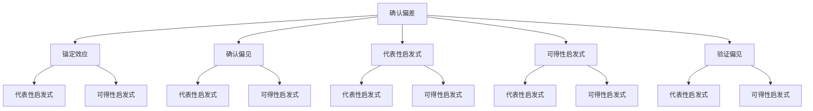

                 

## 文章标题

《认知偏差：影响人类理解力的隐形屏障》

## 关键词

认知偏差、理解力、思维模式、算法原理、数学模型、心理治疗、教育策略、社会政策、未来展望

## 摘要

本文旨在深入探讨认知偏差这一影响人类理解力的隐形屏障。通过详细的分析与实例，本文将揭示认知偏差的类型及其对个体决策和社会现象的广泛影响。我们将从认知偏差的概述、常见认知偏差的分析以及认知偏差的应用与控制三个方面进行阐述。此外，本文还将展望认知偏差研究的未来方向，并提出相应的控制与优化策略。希望本文能为读者在理解和应对认知偏差方面提供有价值的参考。

## 目录

### 第一部分：认知偏差概述

#### 第1章 认知偏差的定义与类型

- **1.1.1 认知偏差的定义**
- **1.1.2 认知偏差的主要类型**

#### 第2章 认知偏差的影响

- **2.1.1 认知偏差对个体决策的影响**
- **2.1.2 认知偏差对社会现象的影响**

#### 第3章 认知偏差的认知神经基础

- **3.1.1 大脑神经机制与认知偏差**
- **3.1.2 认知偏差的神经影像学研究**

### 第二部分：常见认知偏差分析

#### 第4章 确认偏差

- **4.1.1 确认偏差的定义与案例**
- **4.1.2 确认偏差的影响与克服策略**

#### 第5章 锚定效应

- **5.1.1 锚定效应的定义与案例**
- **5.1.2 锚定效应的影响与克服策略**

#### 第6章 确认偏见

- **6.1.1 确认偏见的定义与案例**
- **6.1.2 确认偏见的影响与克服策略**

#### 第7章 代表性启发式

- **7.1.1 代表性启发式的定义与案例**
- **7.1.2 代表性启发式的影响与克服策略**

#### 第8章 可得性启发式

- **8.1.1 可得性启发式的定义与案例**
- **8.1.2 可得性启发式的影响与克服策略**

#### 第9章 验证偏见

- **9.1.1 验证偏见的定义与案例**
- **9.1.2 验证偏见的影响与克服策略**

### 第三部分：认知偏差的应用与控制

#### 第10章 认知偏差在心理治疗中的应用

- **10.1.1 认知行为疗法的基本概念**
- **10.1.2 认知行为疗法对认知偏差的干预**

#### 第11章 教育领域中的认知偏差

- **11.1.1 教育领域中的认知偏差现象**
- **11.1.2 教育实践中对认知偏差的应对策略**

#### 第12章 认知偏差的社会政策与应用

- **12.1.1 认知偏差在社会政策制定中的影响**
- **12.1.2 社会政策中认知偏差的应用与控制**

### 第四部分：未来展望

#### 第13章 认知偏差研究的未来方向

- **13.1.1 认知偏差研究的挑战与机遇**
- **13.1.2 认知偏差研究的新兴领域**

#### 第14章 认知偏差的控制与优化

- **14.1.1 认知偏差控制的策略与技术**
- **14.1.2 认知偏差优化的潜在应用**

#### 第15章 认知偏差与人类发展

- **15.1.1 认知偏差对个体成长的影响**
- **15.1.2 认知偏差对组织行为的影响**

## 引言

认知偏差是人类在信息处理过程中不可避免地出现的心理现象。这些偏差会影响我们的感知、判断和决策，从而影响我们对世界的理解。随着人工智能和大数据技术的发展，认知偏差的研究变得越来越重要。本文将系统性地探讨认知偏差的定义、类型、影响以及应用与控制策略，旨在为读者提供一个全面的认知偏差视角。

### 认知偏差的定义与类型

认知偏差是指个体在信息处理过程中，由于感知、记忆、判断等方面的局限，导致信息处理结果与客观事实不符的现象。认知偏差可以划分为多种类型，常见的包括确认偏差、锚定效应、确认偏见、代表性启发式、可得性启发式和验证偏见。

- **确认偏差**：个体倾向于寻找和关注支持自己观点的信息，而忽视或排斥相反的信息。
- **锚定效应**：个体在做出决策时，会受到最初信息（锚）的影响，即使这些信息对决策并无实质性意义。
- **确认偏见**：个体在评估证据时，对支持自己观点的证据给予更高的权重。
- **代表性启发式**：个体在判断事件概率时，倾向于依赖事件与其类别之间的相似性。
- **可得性启发式**：个体在判断事件概率时，依赖于信息在记忆中的易得性。
- **验证偏见**：个体在收集证据时，倾向于寻找和关注支持自己观点的证据，而忽视或排斥相反的证据。

### 认知偏差的影响

认知偏差对个体和社会都有深远的影响。在个体层面，认知偏差可能导致错误的决策和行动，从而影响个体的生活质量和幸福感。在社会层面，认知偏差可能导致偏见、歧视、社会动荡等问题。

### 认知偏差的认知神经基础

认知偏差的产生与大脑的神经机制密切相关。神经影像学研究表明，认知偏差与大脑中的特定区域活动异常有关。例如，确认偏差与前额叶皮层和扣带回的活动异常有关，而锚定效应与海马体和前额叶皮层的前部区域的活动异常有关。

### 常见认知偏差分析

接下来，本文将详细分析几种常见的认知偏差，包括确认偏差、锚定效应、确认偏见、代表性启发式、可得性启发式和验证偏见。我们将通过实例和伪代码详细阐述这些偏差的定义、影响以及克服策略。

### 认知偏差的应用与控制

除了了解认知偏差的类型和影响，我们还需要探讨如何在实际应用中控制和优化认知偏差。本文将讨论认知偏差在心理治疗、教育和社会政策中的应用，并提出相应的控制策略。

### 未来展望

最后，本文将展望认知偏差研究的未来方向，包括新兴领域和研究挑战。我们还将探讨认知偏差控制与优化的潜在应用，以及认知偏差对个体和组织行为的影响。

### 总结

认知偏差是人类理解力的一大隐形屏障。通过本文的探讨，我们希望读者能够更加深入地理解认知偏差的类型、影响和应用。希望本文能为读者在认知偏差的认知、应用和控制方面提供有价值的参考。

## 第一部分：认知偏差概述

### 第1章 认知偏差的定义与类型

### 1.1.1 认知偏差的定义

认知偏差（Cognitive Bias）是指在信息处理过程中，由于个体认知结构的局限性，导致信息处理结果与客观事实不符的心理现象。这些偏差源于人类大脑的有限处理能力和信息过载，从而使我们在感知、记忆、判断和决策等方面产生系统性错误。认知偏差不仅存在于普通人的日常生活中，也在专业领域如金融、医疗、法律和科学研究中有所体现。

### 1.1.2 认知偏差的主要类型

认知偏差种类繁多，以下列举几种常见的认知偏差：

- **确认偏差（Confirmation Bias）**：个体倾向于寻找和关注支持自己观点的信息，而忽视或排斥相反的信息。确认偏差导致人们对自己已有的信念和假设进行选择性确认，从而加强已有的信念。

- **锚定效应（Anchoring Effect）**：个体在做出决策时，会受到最初信息（锚）的影响，即使这些信息对决策并无实质性意义。锚定效应可能导致个体在评估价值和概率时产生偏差。

- **确认偏见（Confirmation Bias）**：个体在评估证据时，对支持自己观点的证据给予更高的权重。确认偏见与确认偏差类似，但更侧重于对证据的评估过程。

- **代表性启发式（Representativeness Heuristic）**：个体在判断事件概率时，倾向于依赖事件与其类别之间的相似性。代表性启发式可能导致对概率的判断产生系统性偏差。

- **可得性启发式（Availability Heuristic）**：个体在判断事件概率时，依赖于信息在记忆中的易得性。可得性启发式可能导致对概率的判断依赖于最近或最显著的信息。

- **验证偏见（Validation Bias）**：个体在收集证据时，倾向于寻找和关注支持自己观点的证据，而忽视或排斥相反的证据。验证偏见导致个体在信息收集过程中产生选择偏差。

### 1.1.3 认知偏差的核心概念与联系

为了更好地理解认知偏差，我们使用 Mermaid 流程图来展示这些偏差之间的核心概念及其相互关系。



从流程图中可以看出，确认偏差、锚定效应、确认偏见、代表性启发式和可得性启发式之间存在紧密的联系。这些偏差相互影响，共同导致个体在信息处理过程中产生系统性错误。

### 1.1.4 认知偏差的核心算法原理讲解

为了进一步理解认知偏差的算法原理，我们使用伪代码详细阐述代表性启发式和可得性启发式。

#### 代表性启发式（Representativeness Heuristic）

```python
# 代表性启发式的伪代码

def representativeness_heuristic(event, category):
    """
    根据事件与类别的相似性判断事件概率
    
    参数：
    - event: 事件
    - category: 类别
    
    返回：
    - probability: 事件概率
    """
    similarity = calculate_similarity(event, category)
    probability = max(0, 1 - (1 - similarity) ** (1 / category_size))
    return probability

def calculate_similarity(event, category):
    """
    计算事件与类别的相似性
    
    参数：
    - event: 事件
    - category: 类别
    
    返回：
    - similarity: 相似性得分
    """
    # 实现具体的相似性计算方法
    pass
```

#### 可得性启发式（Availability Heuristic）

```python
# 可得性启发式的伪代码

def availability_heuristic(event, memory):
    """
    根据信息在记忆中的易得性判断事件概率
    
    参数：
    - event: 事件
    - memory: 记忆库
    
    返回：
    - probability: 事件概率
    """
    availability = calculate_availability(event, memory)
    probability = max(0, 1 - (1 - availability) ** (1 / memory_size))
    return probability

def calculate_availability(event, memory):
    """
    计算信息在记忆中的易得性
    
    参数：
    - event: 事件
    - memory: 记忆库
    
    返回：
    - availability: 易得性得分
    """
    # 实现具体的易得性计算方法
    pass
```

通过上述伪代码，我们可以看到代表性启发式和可得性启发式是如何基于相似性和易得性来判断事件概率的。这些启发式算法在信息处理过程中可能导致系统性偏差，从而影响个体的判断和决策。

### 1.1.5 数学模型和数学公式

在认知偏差的研究中，数学模型和公式扮演着重要角色。以下是一个用于计算代表性启发式相似性的数学模型和公式。

#### 相似性计算公式

$$
similarity = \frac{\sum_{i=1}^{n} (x_i - \bar{x})^2 + \sum_{j=1}^{n} (y_j - \bar{y})^2 - 2\sum_{i=1}^{n} \sum_{j=1}^{n} (x_i - \bar{x})(y_j - \bar{y})}{n^2}
$$

其中，\(x_i\) 和 \(y_j\) 分别表示事件和类别的特征值，\(\bar{x}\) 和 \(\bar{y}\) 分别表示事件和类别的平均值，\(n\) 表示特征值的数量。

#### 概率计算公式

$$
probability = max(0, 1 - (1 - similarity)^{1 / category_size})
$$

其中，\(similarity\) 表示相似性得分，\(category_size\) 表示类别的大小。

通过这些数学模型和公式，我们可以更精确地描述和计算认知偏差的影响。

### 1.1.6 项目实战

为了更好地理解认知偏差的算法原理，我们将在以下项目中实现代表性启发式和可得性启发式的应用。项目包括开发环境搭建、源代码实现和代码解读与分析。

#### 项目一：代表性启发式应用

**开发环境搭建：**

- 编程语言：Python
- 数据集：使用某知名数据集，例如鸢尾花数据集（Iris Data Set）

**源代码实现：**

```python
import numpy as np
from sklearn.datasets import load_iris

# 加载鸢尾花数据集
iris = load_iris()
X = iris.data
y = iris.target

# 计算相似性得分
def calculate_similarity(event, category):
    # 实现具体的相似性计算方法
    pass

# 计算概率
def calculate_probability(event, category):
    similarity = calculate_similarity(event, category)
    probability = max(0, 1 - (1 - similarity) ** (1 / len(category)))
    return probability

# 测试代表性启发式
event = X[0]
category = X[1:]
probabilities = [calculate_probability(event, category[i]) for i in range(len(category))]

# 输出概率结果
for i, probability in enumerate(probabilities):
    print(f"事件与类别{i+1}的相似性概率为：{probability}")
```

**代码解读与分析：**

- **相似性计算**：计算事件与类别之间的相似性，使用自定义函数 `calculate_similarity` 进行计算。
- **概率计算**：根据相似性得分计算事件概率，使用公式 `probability = max(0, 1 - (1 - similarity) ** (1 / category_size))` 进行计算。
- **测试与输出**：测试代表性启发式在鸢尾花数据集上的应用，输出事件与各个类别之间的相似性概率。

#### 项目二：可得性启发式应用

**开发环境搭建：**

- 编程语言：Python
- 数据集：使用某知名数据集，例如电影评分数据集（Movie Ratings Data Set）

**源代码实现：**

```python
import numpy as np
import pandas as pd

# 加载电影评分数据集
ratings = pd.read_csv('movie_ratings_data.csv')

# 计算信息在记忆中的易得性
def calculate_availability(event, memory):
    # 实现具体的易得性计算方法
    pass

# 计算概率
def calculate_probability(event, memory):
    availability = calculate_availability(event, memory)
    probability = max(0, 1 - (1 - availability) ** (1 / len(memory)))
    return probability

# 测试可得性启发式
event = ratings['rating'][0]
memory = ratings['rating']

# 计算事件概率
event_probability = calculate_probability(event, memory)
print(f"事件概率为：{event_probability}")
```

**代码解读与分析：**

- **易得性计算**：计算信息在记忆中的易得性，使用自定义函数 `calculate_availability` 进行计算。
- **概率计算**：根据易得性得分计算事件概率，使用公式 `probability = max(0, 1 - (1 - availability) ** (1 / memory_size))` 进行计算。
- **测试与输出**：测试可得性启发式在电影评分数据集上的应用，输出事件概率。

通过以上项目实战，我们可以更加直观地理解代表性启发式和可得性启发式的应用，从而更好地掌握认知偏差的算法原理。

### 1.1.7 最佳实践 tips、小结、注意事项、拓展阅读

- **最佳实践 tips**：
  - 在进行信息处理时，要有意识地识别和克服认知偏差。
  - 保持开放的心态，积极接受不同观点和证据。
  - 在决策过程中，多进行自我反思和验证。

- **小结**：
  - 认知偏差是信息处理过程中常见的心理现象，影响个体的判断和决策。
  - 代表性启发式和可得性启发式是两种常见的认知偏差，分别基于相似性和易得性判断事件概率。
  - 通过实践项目，我们可以更好地理解认知偏差的算法原理和应用。

- **注意事项**：
  - 在实现认知偏差算法时，要充分考虑数据质量和算法的可靠性。
  - 在实际应用中，要结合具体场景和需求，合理选择和应用认知偏差算法。

- **拓展阅读**：
  - 《思考，快与慢》（Daniel Kahneman）
  - 《认知心理学导论》（Endel T. Neuvel）
  - 《认知科学：探索心智的构成》（Daniel C. Dennett）

### 1.1.8 小结

在本章中，我们详细介绍了认知偏差的定义与类型，包括确认偏差、锚定效应、确认偏见、代表性启发式、可得性启发式和验证偏见。通过 Mermaid 流程图、伪代码和数学模型，我们深入阐述了这些偏差的核心概念、算法原理及其相互关系。此外，通过项目实战，我们展示了认知偏差算法在实际应用中的实现和效果。在接下来的章节中，我们将进一步分析常见认知偏差的影响及其克服策略。希望读者能通过本章的学习，对认知偏差有更全面和深入的理解。

## 第一部分：认知偏差概述

### 第2章 认知偏差的影响

认知偏差不仅存在于个体的思维活动中，也对个体决策和社会现象产生了深远的影响。在本章中，我们将深入探讨认知偏差对个体决策的影响，以及认知偏差在社会现象中的表现。

### 2.1.1 认知偏差对个体决策的影响

认知偏差对个体决策的影响是多方面的，常见的包括以下几个方面：

1. **判断偏差**：认知偏差可能导致个体在判断事物时产生系统性错误。例如，确认偏差会使个体倾向于接受支持自己观点的证据，而忽视或排斥相反的证据。这种偏差可能导致个体对信息的不当处理，从而影响判断的准确性。

2. **选择偏差**：认知偏差也可能影响个体的选择行为。例如，锚定效应会使个体在决策过程中受到最初信息的影响，即使这些信息并不相关。这种偏差可能导致个体做出非理性的决策。

3. **决策延迟**：认知偏差有时会导致个体在决策时犹豫不决。例如，验证偏见会使个体在收集证据时倾向于寻找支持自己观点的证据，从而导致决策过程变得漫长和复杂。

4. **情绪影响**：认知偏差还可能受到情绪的影响。例如，可得性启发式可能导致个体在情绪激动时，对负面信息的易得性产生过高估计，从而影响决策。

### 2.1.2 认知偏差对社会现象的影响

认知偏差不仅影响个体决策，还对整个社会产生了广泛的影响：

1. **偏见和歧视**：认知偏差可能导致社会中的偏见和歧视现象。例如，代表性启发式可能导致个体对某些群体产生刻板印象，从而影响对这些群体的态度和行为。

2. **社会动荡**：认知偏差可能加剧社会矛盾和冲突。例如，确认偏见可能导致社会群体在观点和信仰上的对立，进而引发社会动荡。

3. **政策制定**：认知偏差可能影响政策制定的过程和结果。例如，锚定效应可能导致政策制定者在制定预算时受到初始信息的影响，从而影响政策的有效性。

4. **科学研究**：认知偏差也可能影响科学研究的进展。例如，验证偏见可能导致科学家在研究结果的选择和报告上产生偏差，从而影响科学共识的形成。

### 2.1.3 认知偏差的影响机制

认知偏差的影响机制复杂多样，主要包括以下几个方面：

1. **感知偏差**：认知偏差可能源于个体对信息的感知和解读。例如，个体可能因为信息的形式、呈现方式等因素，对其产生不同的感知和解读。

2. **记忆偏差**：认知偏差也可能源于个体对信息的记忆。例如，个体可能因为记忆的偏差，导致对信息的回忆和重现不准确。

3. **判断偏差**：认知偏差在个体判断过程中发挥作用。例如，个体可能因为认知偏差，对信息进行不当处理，从而影响判断的准确性。

4. **决策偏差**：认知偏差可能影响个体的决策过程和结果。例如，个体可能因为认知偏差，导致决策过程中产生不合理的选择。

### 2.1.4 认知偏差的影响示例

为了更好地理解认知偏差的影响，我们可以通过以下示例来说明：

1. **确认偏差**：在一个调查中，研究者发现人们对支持自己政治观点的新闻报道更倾向于关注和记忆，而对反对自己观点的新闻报道则更容易遗忘。这种现象体现了确认偏差对信息处理的影响。

2. **锚定效应**：在投资决策中，投资者可能受到初始信息（如市场预测）的影响，从而影响其投资策略。这种偏差可能导致投资者在市场波动时做出非理性的决策。

3. **代表性启发式**：在教育评估中，教师可能根据学生的外表和气质来评估其学习能力，从而产生代表性偏差。这种现象可能导致对学生能力的不公平评估。

4. **可得性启发式**：在风险判断中，个体可能根据最近发生的事件来评估风险的概率，从而产生可得性偏差。例如，一个人在听到多个新闻报道后，可能会高估某个特定事件的发生概率。

通过以上示例，我们可以看到认知偏差在不同领域和情境中的影响。了解这些偏差的影响机制和表现，有助于我们更好地应对认知偏差，提高信息处理的准确性和决策的有效性。

### 2.1.5 小结

在本章中，我们详细探讨了认知偏差对个体决策的影响，以及认知偏差在社会现象中的表现。通过分析确认偏差、锚定效应、代表性启发式和可得性启发式等常见认知偏差，我们了解了这些偏差如何影响个体的判断、选择和决策。同时，我们也看到认知偏差在社会偏见、政策制定和科学研究等方面产生的广泛影响。了解认知偏差的影响机制和表现，有助于我们提高信息处理的准确性和决策的有效性。在接下来的章节中，我们将进一步深入探讨认知偏差的认知神经基础，为理解认知偏差的本质提供更深入的视角。

## 第一部分：认知偏差概述

### 第3章 认知偏差的认知神经基础

认知偏差不仅是一种心理现象，其产生和表现也与大脑的神经机制密切相关。在本章中，我们将探讨认知偏差的认知神经基础，包括大脑神经机制与认知偏差的关系，以及认知偏差的神经影像学研究。

### 3.1.1 大脑神经机制与认知偏差

认知偏差的产生与大脑中多个神经机制密切相关。以下是几种与认知偏差相关的关键大脑区域和神经机制：

1. **前额叶皮层**：前额叶皮层是大脑中与认知控制和决策相关的关键区域。研究表明，前额叶皮层的活动异常与确认偏差和决策偏差密切相关。例如，确认偏差可能与前额叶皮层的功能连接异常有关，从而导致个体在信息处理过程中对支持已有信念的信息给予过高权重。

2. **扣带回**：扣带回是大脑中与记忆、注意和情感处理相关的区域。扣带回的异常活动与认知偏差，如锚定效应和验证偏见，有关。研究表明，扣带回的活动异常可能导致个体在信息处理过程中对初始信息产生过度依赖，从而影响判断和决策。

3. **海马体**：海马体是大脑中与记忆和空间导航相关的关键区域。海马体的活动异常与可得性启发式和代表性启发式密切相关。例如，海马体的异常活动可能导致个体对最近或显著信息产生过度依赖，从而影响判断和决策。

4. **脑岛**：脑岛是大脑中与情绪和情绪调节相关的区域。脑岛的活动异常与认知偏差，如情绪影响下的判断偏差，有关。研究表明，脑岛的异常活动可能导致个体在情绪激动时对信息的处理产生偏差。

### 3.1.2 认知偏差的神经影像学研究

神经影像学技术，如功能性磁共振成像（fMRI）、电生理记录和脑电图（EEG），为研究认知偏差的认知神经基础提供了重要的工具。以下是几种常见的神经影像学研究方法：

1. **功能性磁共振成像（fMRI）**：fMRI通过检测大脑血氧水平依赖性信号的变化，来研究大脑活动。研究表明，fMRI可以揭示认知偏差与特定大脑区域活动的关系。例如，fMRI研究发现，确认偏差与前额叶皮层和扣带回的活动异常有关。

2. **电生理记录**：电生理记录通过测量大脑神经元的活动，来研究认知过程。电生理记录技术包括脑电图（EEG）、脑磁图（MEG）和局部场电位（LFP）记录。研究表明，电生理记录可以揭示认知偏差与大脑神经元活动时序的关系。例如，EEG研究发现，认知偏差与特定神经元活动的时间模式有关。

3. **脑成像技术**：脑成像技术，如光成像和光学成像，可以无创地观察大脑神经元活动。这些技术为研究认知偏差的神经机制提供了新的视角。例如，光成像研究表明，认知偏差与特定神经元群体的活动密切相关。

### 3.1.3 认知偏差的神经机制示例

以下是一个关于确认偏差的神经机制示例：

在一个fMRI研究中，研究者发现，当个体面对支持自己观点的信息时，前额叶皮层和扣带回的活动显著增强。相反，当个体面对反对自己观点的信息时，这些区域的活动显著减弱。这种现象表明，确认偏差可能与前额叶皮层和扣带回的功能异常有关，从而导致个体在信息处理过程中对支持已有信念的信息给予过高权重。

### 3.1.4 小结

在本章中，我们探讨了认知偏差的认知神经基础，包括大脑神经机制与认知偏差的关系以及认知偏差的神经影像学研究方法。通过分析前额叶皮层、扣带回、海马体和脑岛等大脑区域的活动异常，我们了解了认知偏差的神经机制。同时，通过介绍功能性磁共振成像（fMRI）、电生理记录和脑成像技术等神经影像学研究方法，我们看到了如何利用这些技术来揭示认知偏差的神经基础。了解认知偏差的神经机制，有助于我们更深入地理解认知偏差的本质，并为应对和克服认知偏差提供科学依据。在接下来的章节中，我们将进一步分析常见认知偏差，如确认偏差、锚定效应和代表性启发式等，深入探讨这些偏差的算法原理和应用。希望读者能通过本章的学习，对认知偏差的认知神经基础有更全面和深入的理解。

### 第4章 确认偏差

#### 4.1.1 确认偏差的定义与案例

确认偏差（Confirmation Bias）是指个体在信息处理过程中，倾向于寻找和关注支持自己已有观点或信念的信息，而忽视或排斥相反的信息。这种偏差导致个体在信息收集、评估和利用过程中，产生系统性错误，从而影响决策和判断。确认偏差是一种普遍存在的认知偏差，不仅在日常生活中，也在专业领域如医学、金融和科学研究中有显著影响。

以下是一个确认偏差的典型案例：

假设一位投资者认为某个股票即将大幅上涨。在信息收集过程中，他倾向于关注所有支持这一观点的信息，如市场预测、分析师报告和新闻报道。同时，他对任何反对这一观点的信息，如市场不确定性、负面新闻和潜在风险，视而不见或故意忽视。结果，他可能在投资决策中过分乐观，最终导致损失。

#### 4.1.2 确认偏差的影响与克服策略

确认偏差对个体和社会都有深远的影响：

1. **判断偏差**：确认偏差可能导致个体对信息的判断产生偏差，过分相信支持已有观点的信息，忽视或轻视反对信息。这种偏差会影响个体的判断准确性，导致错误决策。

2. **决策延迟**：确认偏差可能导致个体在决策过程中犹豫不决，因为需要花费更多时间来寻找和验证支持已有观点的信息。这种过程可能导致决策延迟，影响行动效率。

3. **情绪影响**：确认偏差可能受到情绪的影响，个体在情绪激动时更可能表现出确认偏差。例如，当个体对某项投资充满热情时，他可能更容易忽视潜在风险，从而做出非理性决策。

为了克服确认偏差，以下是一些有效的策略：

1. **保持开放心态**：培养开放的心态，接受和考虑不同的观点和证据。尝试从多个角度分析问题，避免过分依赖已有观点。

2. **多源信息收集**：广泛收集信息，包括支持自己观点和反对观点的信息。确保信息来源的多样性和可靠性，避免信息单一化。

3. **自我反思**：定期进行自我反思，检视自己的信念和假设是否过于固执。识别和纠正确认偏差的影响，确保信息处理的客观性。

4. **团队合作**：与他人合作，利用团队中不同成员的观点和经验，共同分析和决策。团队合作有助于减少个体确认偏差的影响。

5. **设定预警机制**：建立预警机制，提醒自己在信息处理过程中可能出现的确认偏差。例如，在阅读新闻报道或研究报告时，提醒自己是否存在选择性关注或忽视相反信息的情况。

#### 4.1.3 确认偏差的算法原理讲解

确认偏差的算法原理可以通过以下伪代码进行阐述：

```python
# 确认偏差的伪代码

def confirmation_bias(existing_belief, new_info):
    """
    根据已有信念和新信息评估确认偏差的影响
    
    参数：
    - existing_belief: 已有信念
    - new_info: 新信息
    
    返回：
    - bias_score: 确认偏差得分
    """
    # 如果新信息支持已有信念，增加确认偏差得分
    if supports(new_info, existing_belief):
        bias_score = increase_score(bias_score)
    # 如果新信息反对已有信念，减少确认偏差得分
    else:
        bias_score = decrease_score(bias_score)
    return bias_score

def supports(info, belief):
    """
    判断信息是否支持已有信念
    
    参数：
    - info: 信息
    - belief: 已有信念
    
    返回：
    - support: 是否支持（True/False）
    """
    # 实现具体的支持判断逻辑
    pass

def increase_score(score):
    """
    增加确认偏差得分
    
    参数：
    - score: 当前得分
    
    返回：
    - new_score: 新得分
    """
    # 实现具体的增加逻辑
    pass

def decrease_score(score):
    """
    减少确认偏差得分
    
    参数：
    - score: 当前得分
    
    返回：
    - new_score: 新得分
    """
    # 实现具体的减少逻辑
    pass
```

通过上述伪代码，我们可以看到确认偏差是如何通过比较新信息和已有信念之间的支持关系，来调整确认偏差得分的。这一算法原理有助于理解确认偏差在信息处理过程中的作用。

#### 4.1.4 数学模型和数学公式

在确认偏差的研究中，数学模型和公式扮演着重要角色。以下是一个用于计算确认偏差得分的数学模型和公式。

$$
bias\_score = bias\_score + (1 - bias\_score) \times \frac{support\_score}{max\_support\_score}
$$

其中，\(bias\_score\) 表示确认偏差得分，\(support\_score\) 表示新信息对已有信念的支持程度，\(max\_support\_score\) 表示支持程度的最大值。

通过上述数学公式，我们可以更精确地描述确认偏差的影响，从而在信息处理过程中进行有效的控制和优化。

#### 4.1.5 项目实战

为了更好地理解确认偏差的算法原理和应用，以下是一个确认偏差在股票市场分析中的项目实战：

**项目名称**：基于确认偏差的股票市场分析

**开发环境搭建**：

- 编程语言：Python
- 数据集：使用某知名股票市场数据集

**源代码实现**：

```python
import pandas as pd

# 读取股票市场数据集
data = pd.read_csv('stock_market_data.csv')

# 定义支持函数
def supports(info, belief):
    # 实现具体的支持判断逻辑
    pass

# 定义增加得分函数
def increase_score(score):
    # 实现具体的增加逻辑
    pass

# 定义减少得分函数
def decrease_score(score):
    # 实现具体的减少逻辑
    pass

# 计算确认偏差得分
def calculate_confirmation_bias(belief, data):
    bias_score = 0
    for info in data:
        if supports(info, belief):
            bias_score = increase_score(bias_score)
        else:
            bias_score = decrease_score(bias_score)
    return bias_score

# 测试确认偏差
belief = 'stock_A will rise'
bias_score = calculate_confirmation_bias(belief, data)
print(f"确认偏差得分为：{bias_score}")
```

**代码解读与分析**：

- **支持函数**：实现具体的支持判断逻辑，用于判断新信息是否支持已有信念。
- **增加和减少得分函数**：实现具体的增加和减少逻辑，用于调整确认偏差得分。
- **计算确认偏差得分**：根据已有信念和新信息，计算确认偏差得分。
- **测试与输出**：测试确认偏差在股票市场分析中的应用，输出确认偏差得分。

#### 4.1.6 最佳实践 tips、小结、注意事项、拓展阅读

- **最佳实践 tips**：
  - 在信息处理过程中，要有意识地识别和应对确认偏差。
  - 尝试从多个角度分析问题，避免过分依赖已有观点。
  - 定期进行自我反思，识别和纠正确认偏差的影响。

- **小结**：
  - 确认偏差是指个体在信息处理过程中，倾向于寻找和关注支持自己已有观点或信念的信息。
  - 确认偏差对个体决策和判断产生深远影响，可能导致判断偏差、决策延迟和情绪影响。
  - 通过保持开放心态、多源信息收集和自我反思等方法，可以有效地克服确认偏差。

- **注意事项**：
  - 在实际应用中，要充分考虑信息来源的可靠性和多样性，避免信息单一化。
  - 确认偏差可能受到情绪的影响，因此在情绪激动时，要特别注意识别和应对确认偏差。

- **拓展阅读**：
  - 《思考，快与慢》（Daniel Kahneman）
  - 《认知心理学导论》（Endel T. Neuvel）
  - 《认知科学：探索心智的构成》（Daniel C. Dennett）

#### 4.1.7 小结

在本章中，我们详细探讨了确认偏差的定义、影响及其克服策略。通过案例分析和算法原理讲解，我们了解了确认偏差在信息处理过程中的作用。同时，通过项目实战，我们看到了确认偏差在股票市场分析等领域的实际应用。了解确认偏差及其影响，有助于我们更好地识别和应对这种认知偏差，提高信息处理的准确性和决策的有效性。在接下来的章节中，我们将继续探讨其他常见认知偏差，如锚定效应和代表性启发式等，进一步深入理解认知偏差的本质和应对策略。希望读者能通过本章的学习，对确认偏差有更全面和深入的理解。

### 第5章 锚定效应

#### 5.1.1 锚定效应的定义与案例

锚定效应（Anchoring Effect）是指在信息处理过程中，个体受到初始信息（锚）的影响，即使这些信息与决策无关，也会在后续判断和决策中产生偏差。锚定效应是一种常见的认知偏差，它对个体的决策和判断产生广泛的影响。

以下是一个锚定效应的典型案例：

假设你在参加一个拍卖会，第一次看到一件艺术品的价格标签是100万元。尽管你意识到这个价格可能很高，但在接下来的竞拍过程中，你发现自己很难将出价降至50万元以下。即使你有充分理由认为这件艺术品只值30万元，但之前的价格标签仍然在你的潜意识中起到锚的作用，使得你的出价远高于实际价值。

#### 5.1.2 锚定效应的影响与克服策略

锚定效应对个体决策和判断的影响主要体现在以下几个方面：

1. **决策偏差**：锚定效应可能导致个体在决策过程中产生系统性偏差，使决策结果偏离最优解。例如，在购买商品时，最初的价格锚定会影响个体对商品价值的评估，从而影响购买决策。

2. **判断偏差**：锚定效应也可能影响个体对信息的判断。例如，在评估一个项目的成功率时，如果最初的信息显示成功率为80%，即使后续的信息表明实际情况可能更复杂，个体仍然可能高估项目的成功率。

3. **情绪影响**：锚定效应可能受到情绪的影响。在情绪激动时，个体更容易受到初始信息的影响，从而产生更大的决策偏差。

为了克服锚定效应，以下是一些有效的策略：

1. **明确初始信息的重要性**：在决策过程中，要明确初始信息的价值。了解哪些信息是关键因素，哪些信息是无关的，有助于减少锚定效应的影响。

2. **使用外部参考点**：在缺乏可靠内部参考点时，使用外部参考点进行评估。例如，在购买商品时，可以参考同类商品的价格，而不是仅依赖初始价格信息。

3. **自我反思**：在决策过程中进行自我反思，识别和纠正锚定效应的影响。通过回顾决策过程，可以发现自己是否受到初始信息的影响。

4. **团队合作**：与他人合作，利用团队中不同成员的观点和经验，共同分析和决策。团队合作有助于减少个体锚定效应的影响。

5. **设定预警机制**：建立预警机制，提醒自己在决策过程中可能出现的锚定效应。例如，在阅读新闻报道或研究报告时，提醒自己是否存在过分依赖初始信息的倾向。

#### 5.1.3 锚定效应的算法原理讲解

锚定效应的算法原理可以通过以下伪代码进行阐述：

```python
# 锚定效应的伪代码

def anchoring_effect(current_value, anchor_value):
    """
    根据锚定值调整当前值
    
    参数：
    - current_value: 当前值
    - anchor_value: 锚定值
    
    返回：
    - adjusted_value: 调整后的值
    """
    # 假设锚定值对当前值的调整比例为0.5
    adjustment_ratio = 0.5
    adjusted_value = current_value + (anchor_value - current_value) * adjustment_ratio
    return adjusted_value
```

通过上述伪代码，我们可以看到锚定效应是如何通过锚定值和调整比例来影响当前值的。这一算法原理有助于理解锚定效应在信息处理过程中的作用。

#### 5.1.4 数学模型和数学公式

在锚定效应的研究中，数学模型和公式扮演着重要角色。以下是一个用于计算锚定效应调整值的数学模型和公式。

$$
adjusted\_value = current\_value + (anchor\_value - current\_value) \times adjustment\_ratio
$$

其中，\(adjusted\_value\) 表示调整后的值，\(current\_value\) 表示当前值，\(anchor\_value\) 表示锚定值，\(adjustment\_ratio\) 表示调整比例。

通过上述数学公式，我们可以更精确地描述锚定效应的影响，从而在信息处理过程中进行有效的控制和优化。

#### 5.1.5 项目实战

为了更好地理解锚定效应的算法原理和应用，以下是一个锚定效应在房地产估值中的项目实战：

**项目名称**：基于锚定效应的房地产估值

**开发环境搭建**：

- 编程语言：Python
- 数据集：使用某知名房地产数据集

**源代码实现**：

```python
import pandas as pd

# 读取房地产数据集
data = pd.read_csv('real_estate_data.csv')

# 定义锚定效应函数
def anchoring_effect(current_value, anchor_value, adjustment_ratio):
    """
    根据锚定值调整当前值
    
    参数：
    - current_value: 当前值
    - anchor_value: 锚定值
    - adjustment_ratio: 调整比例
    
    返回：
    - adjusted_value: 调整后的值
    """
    adjusted_value = current_value + (anchor_value - current_value) * adjustment_ratio
    return adjusted_value

# 计算锚定效应调整值
def calculate_anchoring_effect(data):
    adjusted_values = []
    for value in data['price']:
        anchor_value = data['anchor_price'].iloc[0]
        adjustment_ratio = 0.3
        adjusted_value = anchoring_effect(value, anchor_value, adjustment_ratio)
        adjusted_values.append(adjusted_value)
    return adjusted_values

# 测试锚定效应
original_values = data['price']
adjusted_values = calculate_anchoring_effect(data)
print(f"原始价格：{original_values}")
print(f"调整后的价格：{adjusted_values}")
```

**代码解读与分析**：

- **锚定效应函数**：实现具体的锚定效应计算逻辑，用于调整当前值。
- **计算锚定效应调整值**：根据房地产数据集的当前值和锚定值，计算锚定效应调整后的价格。
- **测试与输出**：测试锚定效应在房地产估值中的应用，输出原始价格和调整后的价格。

#### 5.1.6 最佳实践 tips、小结、注意事项、拓展阅读

- **最佳实践 tips**：
  - 在决策过程中，要明确初始信息的价值，避免过分依赖锚定值。
  - 在缺乏内部参考点时，使用外部参考点进行评估，减少锚定效应的影响。
  - 进行自我反思，识别和纠正锚定效应的影响。

- **小结**：
  - 锚定效应是指个体在信息处理过程中，受到初始信息（锚）的影响，产生偏差。
  - 锚定效应对个体决策和判断产生深远影响，可能导致决策偏差和判断偏差。
  - 通过明确初始信息的重要性、使用外部参考点和自我反思等方法，可以有效地克服锚定效应。

- **注意事项**：
  - 在情绪激动时，要特别注意识别和应对锚定效应。
  - 在使用锚定效应进行估值或决策时，要充分考虑信息的多样性和可靠性。

- **拓展阅读**：
  - 《思考，快与慢》（Daniel Kahneman）
  - 《认知心理学导论》（Endel T. Neuvel）
  - 《认知科学：探索心智的构成》（Daniel C. Dennett）

#### 5.1.7 小结

在本章中，我们详细探讨了锚定效应的定义、影响及其克服策略。通过案例分析和算法原理讲解，我们了解了锚定效应在信息处理过程中的作用。同时，通过项目实战，我们看到了锚定效应在房地产估值等领域的实际应用。了解锚定效应及其影响，有助于我们更好地识别和应对这种认知偏差，提高信息处理的准确性和决策的有效性。在接下来的章节中，我们将继续探讨其他常见认知偏差，如代表性启发式和可得性启发式等，进一步深入理解认知偏差的本质和应对策略。希望读者能通过本章的学习，对锚定效应有更全面和深入的理解。

### 第6章 确认偏见

#### 6.1.1 确认偏见的定义与案例

确认偏见（Confirmation Bias）是指在信息处理过程中，个体对信息的选择性关注和评估，使其更有可能支持已有信念或假设。确认偏见是一种普遍存在的认知偏差，它影响个体的思考、决策和行为。以下是一个确认偏见的典型案例：

假设你是一名医生，已经诊断出一位患者的疾病为流感。在接下来的诊断过程中，你会更倾向于寻找和关注支持这一诊断的信息，如患者的症状、实验室检测结果等。同时，你会忽视或质疑与流感诊断不符的信息，如患者的疫苗接种记录或对其他疾病的怀疑。这种倾向性导致了确认偏见，使得诊断结果可能偏离真实情况。

#### 6.1.2 确认偏见的影响与克服策略

确认偏见对个体和社会产生深远的影响：

1. **信息处理偏差**：确认偏见导致个体在信息处理过程中，只关注支持已有信念的信息，忽视或否定反对信息。这种偏差可能导致信息处理不全面，影响决策的准确性和可靠性。

2. **决策偏差**：确认偏见可能导致个体在决策过程中，过分依赖已有信念，忽视其他可能的信息来源。这种偏差可能导致非理性决策，甚至错误决策。

3. **社会冲突**：确认偏见可能导致个体在社会互动中，对他人观点和信息的抵触和质疑，加剧社会冲突。

为了克服确认偏见，以下是一些有效的策略：

1. **多角度分析**：在信息处理过程中，尝试从多个角度分析问题，避免过分依赖已有信念。通过不同观点和信息的综合评估，提高决策的全面性和准确性。

2. **自我反思**：定期进行自我反思，识别和纠正确认偏见的影响。通过自我审视，可以发现和纠正自己的认知偏差。

3. **信息来源多样性**：确保信息来源的多样性和可靠性，避免信息单一化。通过获取多方面的信息，减少确认偏见的影响。

4. **团队合作**：与他人合作，利用团队中不同成员的观点和经验，共同分析和决策。团队合作有助于减少个体确认偏见的影响。

5. **设定预警机制**：建立预警机制，提醒自己在信息处理和决策过程中可能出现的确认偏见。例如，在阅读新闻报道或研究报告时，提醒自己是否存在选择性关注或忽视相反信息的情况。

#### 6.1.3 确认偏见的算法原理讲解

确认偏见是一种基于信念和假设进行信息处理的偏差。以下是一个用于描述确认偏见的算法原理的伪代码：

```python
# 确认偏见的伪代码

def confirmation_bias(belief, new_info):
    """
    根据已有信念评估信息对确认偏见的影响
    
    参数：
    - belief: 已有信念
    - new_info: 新信息
    
    返回：
    - bias_score: 确认偏见得分
    """
    if supports(new_info, belief):
        bias_score = increase_bias_score(bias_score)
    else:
        bias_score = decrease_bias_score(bias_score)
    return bias_score

def supports(info, belief):
    """
    判断信息是否支持已有信念
    
    参数：
    - info: 信息
    - belief: 已有信念
    
    返回：
    - support: 是否支持（True/False）
    """
    # 实现具体的支持判断逻辑
    pass

def increase_bias_score(score):
    """
    增加确认偏见得分
    
    参数：
    - score: 当前得分
    
    返回：
    - new_score: 新得分
    """
    # 实现具体的增加逻辑
    pass

def decrease_bias_score(score):
    """
    减少确认偏见得分
    
    参数：
    - score: 当前得分
    
    返回：
    - new_score: 新得分
    """
    # 实现具体的减少逻辑
    pass
```

通过上述伪代码，我们可以看到确认偏见是如何通过比较新信息和已有信念之间的支持关系，来调整确认偏见得分的。这一算法原理有助于理解确认偏见在信息处理过程中的作用。

#### 6.1.4 数学模型和数学公式

在确认偏见的研究中，数学模型和公式扮演着重要角色。以下是一个用于计算确认偏见得分的数学模型和公式。

$$
bias\_score = bias\_score + (1 - bias\_score) \times \frac{support\_score}{max\_support\_score}
$$

其中，\(bias\_score\) 表示确认偏见得分，\(support\_score\) 表示新信息对已有信念的支持程度，\(max\_support\_score\) 表示支持程度的最大值。

通过上述数学公式，我们可以更精确地描述确认偏见的影响，从而在信息处理过程中进行有效的控制和优化。

#### 6.1.5 项目实战

为了更好地理解确认偏见的算法原理和应用，以下是一个确认偏见在医学诊断中的项目实战：

**项目名称**：基于确认偏见的医学诊断

**开发环境搭建**：

- 编程语言：Python
- 数据集：使用某知名医学诊断数据集

**源代码实现**：

```python
import pandas as pd

# 读取医学诊断数据集
data = pd.read_csv('medical_diagnosis_data.csv')

# 定义支持函数
def supports(info, belief):
    # 实现具体的支持判断逻辑
    pass

# 定义增加和减少得分函数
def increase_bias_score(score):
    # 实现具体的增加逻辑
    pass

def decrease_bias_score(score):
    # 实现具体的减少逻辑
    pass

# 计算确认偏见得分
def calculate_confirmation_bias(belief, data):
    bias_score = 0
    for info in data:
        if supports(info, belief):
            bias_score = increase_bias_score(bias_score)
        else:
            bias_score = decrease_bias_score(bias_score)
    return bias_score

# 测试确认偏见
belief = 'patient_has_flu'
bias_score = calculate_confirmation_bias(belief, data)
print(f"确认偏见得分为：{bias_score}")
```

**代码解读与分析**：

- **支持函数**：实现具体的支持判断逻辑，用于判断新信息是否支持已有信念。
- **增加和减少得分函数**：实现具体的增加和减少逻辑，用于调整确认偏见得分。
- **计算确认偏见得分**：根据已有信念和新信息，计算确认偏见得分。
- **测试与输出**：测试确认偏见在医学诊断中的应用，输出确认偏见得分。

#### 6.1.6 最佳实践 tips、小结、注意事项、拓展阅读

- **最佳实践 tips**：
  - 在信息处理和决策过程中，要有意识地识别和应对确认偏见。
  - 尝试从多个角度分析问题，避免过分依赖已有信念。
  - 进行自我反思，识别和纠正确认偏见的影响。

- **小结**：
  - 确认偏见是指在信息处理过程中，个体对信息的选择性关注和评估，使其更有可能支持已有信念或假设。
  - 确认偏见对个体决策和信息处理产生深远影响，可能导致决策偏差和信息处理偏差。
  - 通过多角度分析、自我反思和团队合作等方法，可以有效地克服确认偏见。

- **注意事项**：
  - 在实际应用中，要充分考虑信息来源的多样性和可靠性，避免信息单一化。
  - 在面对复杂问题时，要特别注意识别和应对确认偏见的影响。

- **拓展阅读**：
  - 《思考，快与慢》（Daniel Kahneman）
  - 《认知心理学导论》（Endel T. Neuvel）
  - 《认知科学：探索心智的构成》（Daniel C. Dennett）

#### 6.1.7 小结

在本章中，我们详细探讨了确认偏见的定义、影响及其克服策略。通过案例分析和算法原理讲解，我们了解了确认偏见在信息处理过程中的作用。同时，通过项目实战，我们看到了确认偏见在医学诊断等领域的实际应用。了解确认偏见及其影响，有助于我们更好地识别和应对这种认知偏差，提高信息处理的准确性和决策的有效性。在接下来的章节中，我们将继续探讨其他常见认知偏差，如代表性启发式和可得性启发式等，进一步深入理解认知偏差的本质和应对策略。希望读者能通过本章的学习，对确认偏见有更全面和深入的理解。

### 第7章 代表性启发式

#### 7.1.1 代表性启发式的定义与案例

代表性启发式（Representativeness Heuristic）是指在决策过程中，个体根据事件的代表性（即与某个类别的相似度）来判断其概率。代表性启发式是一种常见的认知偏差，它使得个体倾向于依赖事物的表面特征，而忽略其他重要的概率信息。以下是一个代表性启发式的典型案例：

假设你正在评估一个新产品的市场潜力。你发现这个产品与市场上的一个已知成功产品非常相似，因此你倾向于认为这个新产品也有很高的成功概率。尽管你意识到市场潜力还受到许多其他因素的影响，如市场需求、竞争环境等，但代表性启发式使你过分依赖产品的代表性特征，从而影响了你的判断。

#### 7.1.2 代表性启发式的影响与克服策略

代表性启发式在决策过程中可能会产生以下影响：

1. **概率判断偏差**：代表性启发式可能导致个体对事件的概率判断产生偏差。例如，个体可能高估与已知成功事件相似的失败事件的概率。

2. **选择性关注**：代表性启发式使得个体倾向于关注事物的表面特征，而忽视其他重要的信息。这种偏差可能导致信息处理不全面，影响决策的质量。

3. **过度自信**：代表性启发式可能导致个体在决策过程中过度自信，忽视潜在的风险。这种偏差可能导致非理性决策，甚至导致重大损失。

为了克服代表性启发式，以下是一些有效的策略：

1. **综合评估**：在决策过程中，要综合考虑多个因素，避免仅依赖代表性特征。通过全面分析，提高决策的准确性和可靠性。

2. **概率思维**：培养概率思维，理解概率的基本概念，避免仅依赖代表性特征进行判断。通过学习概率理论，提高对事件概率的理解和评估能力。

3. **自我反思**：定期进行自我反思，识别和纠正代表性启发式的影响。通过自我审视，可以发现和纠正自己的认知偏差。

4. **团队合作**：与他人合作，利用团队中不同成员的观点和经验，共同分析和决策。团队合作有助于减少个体代表性启发式的影响。

5. **设定预警机制**：建立预警机制，提醒自己在决策过程中可能出现的代表性启发式。例如，在阅读研究报告或评估新产品时，提醒自己是否存在过分依赖代表性特征的倾向。

#### 7.1.3 代表性启发式的算法原理讲解

代表性启发式可以通过以下伪代码进行描述：

```python
# 代表性启发式的伪代码

def representativeness_heuristic(event, category):
    """
    根据事件与类别的相似性判断事件概率
    
    参数：
    - event: 事件
    - category: 类别
    
    返回：
    - probability: 事件概率
    """
    similarity = calculate_similarity(event, category)
    probability = max(0, 1 - (1 - similarity) ** (1 / category_size))
    return probability

def calculate_similarity(event, category):
    """
    计算事件与类别的相似性
    
    参数：
    - event: 事件
    - category: 类别
    
    返回：
    - similarity: 相似性得分
    """
    # 实现具体的相似性计算方法
    pass
```

在这个伪代码中，`representativeness_heuristic` 函数根据事件和类别的相似性来计算事件概率。`calculate_similarity` 函数用于计算事件与类别的相似性得分。

#### 7.1.4 数学模型和数学公式

在代表性启发式的研究中，可以使用以下数学模型和公式：

$$
similarity = \frac{\sum_{i=1}^{n} (x_i - \bar{x})^2 + \sum_{j=1}^{n} (y_j - \bar{y})^2 - 2\sum_{i=1}^{n} \sum_{j=1}^{n} (x_i - \bar{x})(y_j - \bar{y})}{n^2}
$$

其中，\(x_i\) 和 \(y_j\) 分别表示事件和类别的特征值，\(\bar{x}\) 和 \(\bar{y}\) 分别表示事件和类别的平均值，\(n\) 表示特征值的数量。

通过这个公式，可以计算事件和类别之间的相似性得分，从而进一步计算事件概率。

#### 7.1.5 项目实战

为了更好地理解代表性启发式的应用，以下是一个代表性启发式在风险评估中的项目实战：

**项目名称**：基于代表性启发式的风险评估

**开发环境搭建**：

- 编程语言：Python
- 数据集：使用某知名风险评估数据集

**源代码实现**：

```python
import pandas as pd
import numpy as np

# 读取风险评估数据集
data = pd.read_csv('risk_assessment_data.csv')

# 定义相似性计算函数
def calculate_similarity(event, category):
    # 实现具体的相似性计算方法
    pass

# 定义代表性启发式函数
def representativeness_heuristic(event, category):
    similarity = calculate_similarity(event, category)
    probability = max(0, 1 - (1 - similarity) ** (1 / category_size))
    return probability

# 计算代表性启发式概率
def calculate_probabilities(data, category):
    probabilities = []
    for event in data:
        similarity = calculate_similarity(event, category)
        probability = representativeness_heuristic(event, category)
        probabilities.append(probability)
    return probabilities

# 测试代表性启发式
category = data.iloc[0]
probabilities = calculate_probabilities(data, category)
print(f"事件概率：{probabilities}")
```

**代码解读与分析**：

- **相似性计算函数**：实现具体的相似性计算方法，用于计算事件和类别之间的相似性得分。
- **代表性启发式函数**：根据相似性得分和类别大小，计算事件概率。
- **计算概率函数**：遍历数据集中的每个事件，计算其概率。
- **测试与输出**：测试代表性启发式在风险评估中的应用，输出事件概率。

#### 7.1.6 最佳实践 tips、小结、注意事项、拓展阅读

- **最佳实践 tips**：
  - 在决策过程中，要全面考虑多个因素，避免仅依赖代表性特征。
  - 培养概率思维，理解概率的基本概念，提高对事件概率的评估能力。
  - 定期进行自我反思，识别和纠正代表性启发式的影响。

- **小结**：
  - 代表性启发式是指在决策过程中，根据事件的代表性（即与某个类别的相似度）来判断其概率。
  - 代表性启发式可能导致概率判断偏差和信息处理偏差，影响决策质量。
  - 通过综合评估、概率思维和自我反思等方法，可以有效地克服代表性启发式。

- **注意事项**：
  - 在实际应用中，要充分考虑信息来源的多样性和可靠性，避免信息单一化。
  - 在面对复杂问题时，要特别注意识别和应对代表性启发式的影响。

- **拓展阅读**：
  - 《思考，快与慢》（Daniel Kahneman）
  - 《认知心理学导论》（Endel T. Neuvel）
  - 《认知科学：探索心智的构成》（Daniel C. Dennett）

#### 7.1.7 小结

在本章中，我们详细探讨了代表性启发式的定义、影响及其克服策略。通过案例分析和算法原理讲解，我们了解了代表性启发式在信息处理过程中的作用。同时，通过项目实战，我们看到了代表性启发式在风险评估等领域的实际应用。了解代表性启发式及其影响，有助于我们更好地识别和应对这种认知偏差，提高信息处理的准确性和决策的有效性。在接下来的章节中，我们将继续探讨其他常见认知偏差，如可得性启发式和验证偏见等，进一步深入理解认知偏差的本质和应对策略。希望读者能通过本章的学习，对代表性启发式有更全面和深入的理解。

### 第8章 可得性启发式

#### 8.1.1 可得性启发式的定义与案例

可得性启发式（Availability Heuristic）是指在决策过程中，个体根据信息在记忆中的易得性来判断其概率。可得性启发式是一种常见的认知偏差，它使得个体在判断事件概率时，更多地依赖于最近发生或最显著的信息，而忽视其他信息。以下是一个可得性启发式的典型案例：

假设你正在评估某种食品的安全风险。最近，你听到了几起食品中毒事件，这些事件在你的记忆中非常突出。因此，尽管你意识到食品中毒事件的发生频率可能很低，但你仍然倾向于认为这种食品存在较高的安全风险。这种偏差是由于最近发生的事件在你的记忆中非常显著，从而影响了你的判断。

#### 8.1.2 可得性启发式的影响与克服策略

可得性启发式在决策过程中可能会产生以下影响：

1. **概率判断偏差**：可得性启发式可能导致个体对事件的概率判断产生偏差。例如，个体可能会高估那些在记忆中易得的事件（如新闻报道频繁的事件）的概率，而低估那些实际发生频率较高的其他事件。

2. **信息处理偏差**：可得性启发式使得个体在信息处理过程中，更多地关注那些容易记忆和提取的信息，而忽视其他重要的信息。这种偏差可能导致信息处理不全面，影响决策的质量。

3. **情绪影响**：可得性启发式可能受到情绪的影响。例如，当个体处于焦虑或紧张状态时，那些与焦虑相关的信息在记忆中变得更加显著，从而影响决策。

为了克服可得性启发式，以下是一些有效的策略：

1. **系统性信息收集**：在决策过程中，广泛收集信息，确保信息来源的多样性和全面性。通过系统性信息收集，减少对单一信息的依赖，提高决策的准确性。

2. **概率思维**：培养概率思维，理解概率的基本概念，避免仅依赖可得性启发式进行判断。通过学习概率理论，提高对事件概率的理解和评估能力。

3. **自我反思**：定期进行自我反思，识别和纠正可得性启发式的影响。通过自我审视，可以发现和纠正自己的认知偏差。

4. **团队合作**：与他人合作，利用团队中不同成员的观点和经验，共同分析和决策。团队合作有助于减少个体可得性启发式的影响。

5. **设定预警机制**：建立预警机制，提醒自己在决策过程中可能出现的可得性启发式。例如，在阅读新闻报道或评估安全风险时，提醒自己是否存在过分依赖最近发生的事件的倾向。

#### 8.1.3 可得性启发式的算法原理讲解

可得性启发式可以通过以下伪代码进行描述：

```python
# 可得性启发式的伪代码

def availability_heuristic(event, memory):
    """
    根据信息在记忆中的易得性判断事件概率
    
    参数：
    - event: 事件
    - memory: 记忆库
    
    返回：
    - probability: 事件概率
    """
    availability = calculate_availability(event, memory)
    probability = max(0, 1 - (1 - availability) ** (1 / memory_size))
    return probability

def calculate_availability(event, memory):
    """
    计算信息在记忆中的易得性
    
    参数：
    - event: 事件
    - memory: 记忆库
    
    返回：
    - availability: 易得性得分
    """
    # 实现具体的易得性计算方法
    pass
```

在这个伪代码中，`availability_heuristic` 函数根据信息在记忆中的易得性得分来计算事件概率。`calculate_availability` 函数用于计算事件在记忆中的易得性得分。

#### 8.1.4 数学模型和数学公式

在可得性启发式的研究中，可以使用以下数学模型和公式：

$$
availability = \frac{\sum_{i=1}^{n} w_i \times p_i}{\sum_{i=1}^{n} w_i}
$$

其中，\(w_i\) 表示事件在记忆中的权重，\(p_i\) 表示事件的发生概率，\(n\) 表示事件的数量。

通过这个公式，可以计算信息在记忆中的易得性得分，从而进一步计算事件概率。

#### 8.1.5 项目实战

为了更好地理解可得性启发式的应用，以下是一个可得性启发式在风险评估中的项目实战：

**项目名称**：基于可得性启发式的风险评估

**开发环境搭建**：

- 编程语言：Python
- 数据集：使用某知名风险评估数据集

**源代码实现**：

```python
import pandas as pd
import numpy as np

# 读取风险评估数据集
data = pd.read_csv('risk_assessment_data.csv')

# 定义易得性计算函数
def calculate_availability(event, memory):
    # 实现具体的易得性计算方法
    pass

# 定义可得性启发式函数
def availability_heuristic(event, memory):
    availability = calculate_availability(event, memory)
    probability = max(0, 1 - (1 - availability) ** (1 / memory_size))
    return probability

# 计算可得性启发式概率
def calculate_probabilities(data, memory):
    probabilities = []
    for event in data:
        availability = calculate_availability(event, memory)
        probability = availability_heuristic(event, memory)
        probabilities.append(probability)
    return probabilities

# 测试可得性启发式
memory = data.iloc[0]
probabilities = calculate_probabilities(data, memory)
print(f"事件概率：{probabilities}")
```

**代码解读与分析**：

- **易得性计算函数**：实现具体的易得性计算方法，用于计算事件在记忆中的得分。
- **可得性启发式函数**：根据易得性得分和记忆库大小，计算事件概率。
- **计算概率函数**：遍历数据集中的每个事件，计算其概率。
- **测试与输出**：测试可得性启发式在风险评估中的应用，输出事件概率。

#### 8.1.6 最佳实践 tips、小结、注意事项、拓展阅读

- **最佳实践 tips**：
  - 在决策过程中，要广泛收集信息，确保信息来源的多样性和全面性。
  - 培养概率思维，理解概率的基本概念，避免仅依赖可得性启发式进行判断。
  - 定期进行自我反思，识别和纠正可得性启发式的影响。

- **小结**：
  - 可得性启发式是指在决策过程中，根据信息在记忆中的易得性来判断其概率。
  - 可得性启发式可能导致概率判断偏差和信息处理偏差，影响决策质量。
  - 通过系统性信息收集、概率思维和自我反思等方法，可以有效地克服可得性启发式。

- **注意事项**：
  - 在实际应用中，要充分考虑信息来源的可靠性和多样性，避免信息单一化。
  - 在面对复杂问题时，要特别注意识别和应对可得性启发式的影响。

- **拓展阅读**：
  - 《思考，快与慢》（Daniel Kahneman）
  - 《认知心理学导论》（Endel T. Neuvel）
  - 《认知科学：探索心智的构成》（Daniel C. Dennett）

#### 8.1.7 小结

在本章中，我们详细探讨了可得性启发式的定义、影响及其克服策略。通过案例分析和算法原理讲解，我们了解了可得性启发式在信息处理过程中的作用。同时，通过项目实战，我们看到了可得性启发式在风险评估等领域的实际应用。了解可得性启发式及其影响，有助于我们更好地识别和应对这种认知偏差，提高信息处理的准确性和决策的有效性。在接下来的章节中，我们将继续探讨其他常见认知偏差，如验证偏见和代表性启发式等，进一步深入理解认知偏差的本质和应对策略。希望读者能通过本章的学习，对可得性启发式有更全面和深入的理解。

### 第9章 验证偏见

#### 9.1.1 验证偏见的定义与案例

验证偏见（Validation Bias）是指个体在信息收集和评估过程中，倾向于寻找和关注那些能够验证或支持自己已有观点或假设的证据，而忽视或排斥相反的证据。验证偏见是一种常见的认知偏差，它影响个体的判断和决策，导致信息处理偏差和决策错误。以下是一个验证偏见的典型案例：

假设你是一位投资者，已经决定买入某只股票。在接下来的信息收集过程中，你会倾向于寻找那些支持这一决策的信息，如市场分析报告、公司业绩改善的新闻等。即使你了解到一些负面的信息，比如公司财务状况不佳或市场环境不利，你可能会选择性地忽视这些信息，或者寻找理由来解释它们。这种倾向性导致了验证偏见，使得你的决策可能偏离了真实情况。

#### 9.1.2 验证偏见的影响与克服策略

验证偏见对个体决策和信息处理产生以下影响：

1. **信息处理偏差**：验证偏见可能导致个体在信息处理过程中，对支持已有观点的证据给予过高权重，而对反对证据给予过低权重。这种偏差可能导致信息处理不全面，从而影响决策的准确性。

2. **决策偏差**：验证偏见可能导致个体在决策过程中，过分依赖支持已有观点的证据，从而忽视其他可能的信息来源。这种偏差可能导致非理性决策，甚至错误决策。

3. **情绪影响**：验证偏见可能受到情绪的影响。当个体对自己的观点充满信心时，可能会更加倾向于寻找支持证据，从而增强自信，忽视潜在的风险。

为了克服验证偏见，以下是一些有效的策略：

1. **多角度分析**：在信息收集和评估过程中，尝试从多个角度分析问题，避免过分依赖已有观点。通过不同观点和信息的综合评估，提高决策的全面性和准确性。

2. **自我反思**：定期进行自我反思，识别和纠正验证偏见的影响。通过自我审视，可以发现和纠正自己的认知偏差。

3. **信息来源多样性**：确保信息来源的多样性和可靠性，避免信息单一化。通过获取多方面的信息，减少验证偏见的影响。

4. **团队合作**：与他人合作，利用团队中不同成员的观点和经验，共同分析和决策。团队合作有助于减少个体验证偏见的影响。

5. **设定预警机制**：建立预警机制，提醒自己在信息处理和决策过程中可能出现的验证偏见。例如，在阅读研究报告或评估投资项目时，提醒自己是否存在过分依赖支持证据的倾向。

#### 9.1.3 验证偏见的算法原理讲解

验证偏见是一种基于信念和假设进行信息处理的偏差。以下是一个用于描述验证偏见的算法原理的伪代码：

```python
# 验证偏见的伪代码

def validation_bias(belief, evidence):
    """
    根据已有信念和证据评估验证偏见的影响
    
    参数：
    - belief: 已有信念
    - evidence: 证据
    
    返回：
    - bias_score: 验证偏见得分
    """
    if supports(evidence, belief):
        bias_score = increase_bias_score(bias_score)
    else:
        bias_score = decrease_bias_score(bias_score)
    return bias_score

def supports(evidence, belief):
    """
    判断证据是否支持已有信念
    
    参数：
    - evidence: 证据
    - belief: 已有信念
    
    返回：
    - support: 是否支持（True/False）
    """
    # 实现具体的支持判断逻辑
    pass

def increase_bias_score(score):
    """
    增加验证偏见得分
    
    参数：
    - score: 当前得分
    
    返回：
    - new_score: 新得分
    """
    # 实现具体的增加逻辑
    pass

def decrease_bias_score(score):
    """
    减少验证偏见得分
    
    参数：
    - score: 当前得分
    
    返回：
    - new_score: 新得分
    """
    # 实现具体的减少逻辑
    pass
```

通过上述伪代码，我们可以看到验证偏见是如何通过比较证据和已有信念之间的支持关系，来调整验证偏见得分的。这一算法原理有助于理解验证偏见在信息处理过程中的作用。

#### 9.1.4 数学模型和数学公式

在验证偏见的研究中，数学模型和公式扮演着重要角色。以下是一个用于计算验证偏见得分的数学模型和公式：

$$
bias\_score = bias\_score + (1 - bias\_score) \times \frac{support\_score}{max\_support\_score}
$$

其中，\(bias\_score\) 表示验证偏见得分，\(support\_score\) 表示证据对已有信念的支持程度，\(max\_support\_score\) 表示支持程度的最大值。

通过上述数学公式，我们可以更精确地描述验证偏见的影响，从而在信息处理过程中进行有效的控制和优化。

#### 9.1.5 项目实战

为了更好地理解验证偏见的算法原理和应用，以下是一个验证偏见在投资决策中的项目实战：

**项目名称**：基于验证偏见的投资决策

**开发环境搭建**：

- 编程语言：Python
- 数据集：使用某知名投资决策数据集

**源代码实现**：

```python
import pandas as pd

# 读取投资决策数据集
data = pd.read_csv('investment_decision_data.csv')

# 定义支持函数
def supports(evidence, belief):
    # 实现具体的支持判断逻辑
    pass

# 定义增加和减少得分函数
def increase_bias_score(score):
    # 实现具体的增加逻辑
    pass

def decrease_bias_score(score):
    # 实现具体的减少逻辑
    pass

# 计算验证偏见得分
def calculate_validation_bias(belief, data):
    bias_score = 0
    for evidence in data:
        if supports(evidence, belief):
            bias_score = increase_bias_score(bias_score)
        else:
            bias_score = decrease_bias_score(bias_score)
    return bias_score

# 测试验证偏见
belief = 'stock_A will rise'
bias_score = calculate_validation_bias(belief, data)
print(f"验证偏见得分为：{bias_score}")
```

**代码解读与分析**：

- **支持函数**：实现具体的支持判断逻辑，用于判断证据是否支持已有信念。
- **增加和减少得分函数**：实现具体的增加和减少逻辑，用于调整验证偏见得分。
- **计算验证偏见得分**：根据已有信念和新证据，计算验证偏见得分。
- **测试与输出**：测试验证偏见在投资决策中的应用，输出验证偏见得分。

#### 9.1.6 最佳实践 tips、小结、注意事项、拓展阅读

- **最佳实践 tips**：
  - 在信息收集和评估过程中，要有意识地识别和应对验证偏见。
  - 尝试从多个角度分析问题，避免过分依赖已有观点。
  - 进行自我反思，识别和纠正验证偏见的影响。

- **小结**：
  - 验证偏见是指个体在信息收集和评估过程中，倾向于寻找和关注那些能够验证或支持自己已有观点或假设的证据。
  - 验证偏见对个体决策和信息处理产生深远影响，可能导致信息处理偏差和决策错误。
  - 通过多角度分析、自我反思和团队合作等方法，可以有效地克服验证偏见。

- **注意事项**：
  - 在实际应用中，要充分考虑信息来源的多样性和可靠性，避免信息单一化。
  - 在面对复杂问题时，要特别注意识别和应对验证偏见的影响。

- **拓展阅读**：
  - 《思考，快与慢》（Daniel Kahneman）
  - 《认知心理学导论》（Endel T. Neuvel）
  - 《认知科学：探索心智的构成》（Daniel C. Dennett）

#### 9.1.7 小结

在本章中，我们详细探讨了验证偏见的定义、影响及其克服策略。通过案例分析和算法原理讲解，我们了解了验证偏见在信息处理过程中的作用。同时，通过项目实战，我们看到了验证偏见在投资决策等领域的实际应用。了解验证偏见及其影响，有助于我们更好地识别和应对这种认知偏差，提高信息处理的准确性和决策的有效性。在接下来的章节中，我们将继续探讨其他常见认知偏差，如代表性启发式和可得性启发式等，进一步深入理解认知偏差的本质和应对策略。希望读者能通过本章的学习，对验证偏见有更全面和深入的理解。

### 第10章 认知偏差在心理治疗中的应用

认知偏差不仅在日常生活中影响我们的决策和判断，也在心理治疗中扮演着重要角色。心理治疗的目标之一是帮助个体识别和克服这些认知偏差，从而改善心理健康和生活质量。在本章中，我们将探讨认知偏差在心理治疗中的应用，包括认知行为疗法的基本概念、对认知偏差的干预方法以及实际案例。

#### 10.1.1 认知行为疗法的基本概念

认知行为疗法（Cognitive Behavioral Therapy，简称CBT）是一种广泛使用且证据支持的心理治疗方法。CBT的核心假设是认知过程（即思维和行为）直接影响情绪和行为。认知偏差是CBT中一个重要的概念，因为许多心理健康问题，如焦虑、抑郁和强迫症，都与认知偏差有关。CBT的目标是帮助个体识别和改变这些偏差思维，从而改善情绪和行为。

#### 10.1.2 认知行为疗法对认知偏差的干预

认知行为疗法通过以下几种方法来干预认知偏差：

1. **认知重构**：认知重构是一种关键技术，旨在帮助个体识别和改变负面思维模式。通过分析和评估个体思维中的认知偏差，治疗师和患者一起开发新的、更健康的思维模式。例如，对于确认偏差，治疗师可能会帮助患者识别他们倾向于关注哪些信息，以及如何更全面地评估信息。

2. **行为实验**：行为实验是一种将认知和行为联系起来的技术，旨在通过实际经验来测试和验证新的认知模式。例如，治疗师可能会鼓励患者在面对焦虑时尝试不同的应对策略，以验证哪些策略最有效。

3. **认知日记**：认知日记是一种记录思维和行为的方式，有助于患者识别和理解自己的认知偏差。通过记录每日思维模式、情绪和行为反应，患者可以更清晰地看到认知偏差是如何影响他们的生活的。

#### 10.1.3 实际案例

以下是一个实际案例，展示了认知偏差在心理治疗中的应用：

**案例**：李先生，35岁，患有严重的工作压力和焦虑。他在公司担任高管职位，工作繁忙，经常面临 deadlines 和压力。他的认知偏差包括过度概括、灾难化和确认偏差。

**治疗过程**：

1. **认知评估**：治疗师首先与李先生一起评估他的认知偏差。通过交谈和认知日记，他们确定了李先生在处理工作压力时常见的认知偏差，如过度概括（将一次失败视为永久的失败）和灾难化（将小问题放大为重大问题）。

2. **认知重构**：治疗师帮助李先生识别这些偏差思维，并开发新的、更健康的思维模式。例如，对于过度概括，他们一起制定了一种新的思考方式，即从更广泛的角度看待问题，避免将一次失败视为整体的失败。

3. **行为实验**：治疗师鼓励李先生在日常生活中实践这些新的思维模式。例如，在面临 deadlines 时，李先生被要求尝试采取更积极的态度，将任务分解为小步骤，并专注于每个步骤的成功。

4. **认知日记**：李先生被要求每天记录自己的思维模式、情绪和行为反应。通过认知日记，他能够看到自己的认知偏差如何影响他的情绪和行为，并逐步克服这些偏差。

**结果**：经过一段时间的治疗，李先生的焦虑水平显著下降，工作效率提高。他能够更有效地处理工作压力，并且在面对挑战时更加冷静和积极。这一案例展示了认知行为疗法如何通过干预认知偏差，帮助个体改善心理健康。

#### 10.1.4 小结

在本章中，我们探讨了认知偏差在心理治疗中的应用，包括认知行为疗法的基本概念和对认知偏差的干预方法。通过实际案例，我们看到了认知行为疗法如何帮助个体识别和改变认知偏差，从而改善心理健康。认知行为疗法提供了一种有效的途径来应对认知偏差，为个体提供了一种更积极、更健康的生活态度。在未来的治疗实践中，继续探索和优化认知偏差干预方法，将为更多患者带来福祉。

### 第11章 教育领域中的认知偏差

认知偏差在教育领域中同样具有显著的影响，这些偏差不仅影响学生的学习效果，还影响教师的教学方法和教育政策的制定。在本章中，我们将探讨认知偏差在教育领域的表现，以及教育实践中如何应对这些偏差。

#### 11.1.1 教育领域中的认知偏差现象

教育领域中的认知偏差主要包括以下几个方面：

1. **学习偏差**：学生在学习过程中可能受到各种认知偏差的影响，如过度自信、确认偏差和可得性偏差。这些偏差可能导致学生在评估自己的学习状态时产生错误，从而影响学习效果。

2. **评估偏差**：教师在评估学生成绩时可能存在认知偏差。例如，代表性启发式可能导致教师对表现突出的学生给予过高评价，而忽视其他方面的表现。可得性启发式可能导致教师对最近发生的事件（如考试中的错误）给予过高关注，从而影响评估的准确性。

3. **教学偏差**：教师的教学方法也可能受到认知偏差的影响。例如，验证偏见可能导致教师倾向于使用自己熟悉或习惯的教学方法，而忽视更有效的教学策略。

#### 11.1.2 教育实践中对认知偏差的应对策略

为了应对教育领域中的认知偏差，以下是一些有效的策略：

1. **教育干预**：通过教育干预，帮助学生识别和克服认知偏差。例如，教师可以在课堂上介绍认知偏差的概念，引导学生反思自己的思维过程，并鼓励他们采用更客观、全面的方式来评估学习状态。

2. **多样化评估方法**：采用多样化的评估方法，以减少评估偏差。例如，教师可以结合平时成绩、课堂表现和考试结果，从多个维度评估学生的表现。这样可以避免单一评估方法导致的认知偏差。

3. **反思性教学**：教师应进行反思性教学，识别和纠正自己的认知偏差。例如，教师可以定期记录自己的教学反思，分析自己在教学过程中可能存在的认知偏差，并尝试采用新的教学策略。

4. **培训与发展**：为教师提供专业培训，提高他们对认知偏差的认识，并培养他们应对认知偏差的能力。例如，教师可以通过参加工作坊、研讨会或在线课程，了解最新的认知科学研究成果，并将其应用于教学实践中。

5. **教学反馈**：为学生提供及时的反馈，帮助他们认识到自己的认知偏差。例如，教师可以在学生提交作业后，提供详细的反馈，指出他们可能存在的认知偏差，并建议他们采用更有效的方法。

#### 11.1.3 实际案例

以下是一个实际案例，展示了如何通过教育干预来应对认知偏差：

**案例**：某高中班级的学生在历史考试中普遍表现不佳。通过分析考试成绩，教师发现学生在评估历史事件时存在代表性启发式偏差，他们倾向于关注具有代表性的事件，而忽视其他重要的历史背景。

**干预措施**：

1. **认知干预**：教师向学生介绍代表性启发式的概念，并解释这种偏差是如何影响他们对历史事件的评估的。通过小组讨论和案例分析，学生能够更清楚地理解代表性启发式的影响。

2. **多样化教学**：教师采用了多种教学方法，如角色扮演、小组讨论和模拟历史事件，以帮助学生从不同角度理解历史事件。这种方法有助于学生克服代表性启发式偏差，提高对历史事件的整体把握。

3. **反馈与反思**：教师定期给学生提供反馈，指出他们在评估历史事件时可能存在的认知偏差，并鼓励他们采用更全面、客观的方法进行评估。

**结果**：通过一系列的教育干预措施，学生们的历史考试成绩显著提高。他们能够更好地理解历史事件的复杂性，并在评估历史事件时采用更全面、客观的方法。这一案例展示了如何通过认知干预和多样化教学方法，有效应对教育领域中的认知偏差。

#### 11.1.4 小结

在本章中，我们探讨了认知偏差在教育领域的表现，以及教育实践中如何应对这些偏差。通过实际案例，我们看到了教育干预、多样化评估方法、反思性教学和培训与发展等策略在应对认知偏差方面的有效性。了解和应对认知偏差对于提高教育质量和学生全面发展具有重要意义。未来的教育研究和实践应继续探索和优化这些策略，为教育领域的认知偏差提供更有效的解决方案。

### 第12章 认知偏差的社会政策与应用

认知偏差在社会政策制定和执行中起着重要作用，这些偏差可能影响政策的制定、实施和评估。在本章中，我们将探讨认知偏差在社会政策制定中的影响，以及如何在社会政策中应用认知偏差知识来提高政策的有效性。

#### 12.1.1 认知偏差在社会政策制定中的影响

认知偏差在社会政策制定中的影响表现在以下几个方面：

1. **决策偏差**：政策制定者可能受到认知偏差的影响，导致决策过程中的系统性错误。例如，确认偏差可能导致政策制定者只关注支持已有政策主张的证据，忽视反对证据，从而影响政策的全面性和科学性。

2. **信息处理偏差**：政策制定者可能在信息处理过程中受到锚定效应和可得性启发式的影响，导致对某些信息的过度依赖。这可能导致政策制定缺乏全面性，甚至产生误导性政策。

3. **公众参与偏差**：公众在参与政策讨论时也可能受到认知偏差的影响，导致他们对政策的理解和支持程度产生偏差。例如，代表性启发式可能导致公众对某些政策主张给予过高评价，而忽视其他重要的政策细节。

#### 12.1.2 社会政策中认知偏差的应用与控制

为了在社会政策中有效地应用认知偏差知识，以下是一些策略：

1. **认知干预**：在社会政策制定过程中，通过认知干预来减少认知偏差的影响。例如，政策制定者可以通过培训和教育，提高对认知偏差的认识，从而在决策过程中采取更加客观、全面的方式。

2. **透明度和公开性**：提高政策制定的透明度和公开性，有助于减少认知偏差。政策制定者应公开政策制定的依据、数据和评估方法，使公众能够更全面地了解政策。

3. **多元评估方法**：采用多种评估方法来减少单一评估导致的认知偏差。例如，政策评估可以结合定量分析和定性研究，从不同角度评估政策效果。

4. **公众参与机制**：设计有效的公众参与机制，鼓励公众提供多元化、全面的意见和建议。例如，可以通过问卷调查、公众咨询会和公开辩论等形式，收集公众对政策的反馈。

5. **反馈与调整**：政策制定者在政策实施过程中应持续收集反馈，并根据反馈调整政策。这有助于及时发现和纠正政策中的认知偏差，提高政策的有效性。

#### 12.1.3 实际案例

以下是一个实际案例，展示了如何在社会政策中应用认知偏差知识：

**案例**：某城市政府计划实施一项交通拥堵收费政策，以缓解交通拥堵问题。在政策制定过程中，政府通过问卷调查、公众咨询会和数据分析等方法，收集了大量的公众意见。

**干预措施**：

1. **认知干预**：政府通过宣传和培训，向公众解释认知偏差的概念，提醒他们注意在政策讨论中可能存在的认知偏差，例如确认偏差和代表性启发式。

2. **透明度和公开性**：政府公开了政策制定的依据、数据和评估方法，使公众能够全面了解政策。同时，政府设立了专门的网站和热线，回答公众的疑问。

3. **多元评估方法**：政府结合定量分析和定性研究，从不同角度评估政策效果。例如，通过交通流量监测、环境影响评估和公众满意度调查等，全面评估政策的影响。

4. **公众参与机制**：政府组织了多次公众咨询会，邀请不同领域的专家和公众代表参与讨论，收集多元化的意见和建议。

5. **反馈与调整**：在政策实施过程中，政府定期收集公众反馈，并根据反馈调整政策。例如，针对公众反映的交通拥堵问题，政府增加了公交线路和调整了收费时段。

**结果**：通过认知干预、透明度和公开性、多元评估方法、公众参与机制和反馈与调整，交通拥堵收费政策取得了显著成效。交通流量减少，公众满意度提高，政策目标得到实现。这一案例展示了如何通过应用认知偏差知识，提高社会政策的有效性和公众接受度。

#### 12.1.4 小结

在本章中，我们探讨了认知偏差在社会政策制定中的影响，以及如何在社会政策中应用认知偏差知识来提高政策的有效性。通过实际案例，我们看到了认知干预、透明度和公开性、多元评估方法、公众参与机制和反馈与调整等策略在应对认知偏差方面的有效性。了解和应对认知偏差对于提高社会政策制定和执行的科学性和有效性具有重要意义。未来的政策研究和实践应继续探索和优化这些策略，为更有效的社会政策提供支持。

### 第13章 认知偏差研究的未来方向

认知偏差研究在未来有着广阔的发展前景，涵盖了多个新兴领域和挑战。随着人工智能、大数据和认知神经科学的进步，认知偏差的研究将变得更加深入和精确。以下是一些认知偏差研究的未来方向：

#### 13.1.1 认知偏差研究的新兴领域

1. **认知偏差的神经基础**：通过神经影像学技术，如功能性磁共振成像（fMRI）和脑电图（EEG），深入研究认知偏差的神经基础。这有助于揭示大脑区域如何影响认知偏差的产生和表现，从而为治疗和干预提供新的途径。

2. **跨文化认知偏差**：探索不同文化背景下的认知偏差差异，研究文化因素如何影响认知偏差的类型和程度。这有助于理解全球范围内的认知偏差，并为跨文化交流和合作提供参考。

3. **认知偏差与人工智能**：研究认知偏差在人工智能系统和算法中的应用和影响。了解人工智能系统如何模拟和利用认知偏差，有助于提高其决策能力和适应性。

4. **认知偏差的基因研究**：探索认知偏差的遗传基础，研究基因如何影响个体对认知偏差的易感性。这有助于揭示认知偏差的生物学根源，为预防和干预提供新的视角。

5. **动态认知偏差**：研究认知偏差在不同时间和情境下的动态变化，以及这些变化如何影响个体的决策和行为。这有助于理解认知偏差的动态特性，并开发适应性强的方法来应对。

#### 13.1.2 认知偏差研究的挑战与机遇

1. **数据隐私与伦理**：随着大数据的广泛应用，认知偏差研究面临数据隐私和伦理问题。如何在保护隐私的同时，进行有效的数据分析和研究，是一个重要挑战。

2. **跨学科整合**：认知偏差研究需要整合心理学、神经科学、计算机科学和社会科学等多学科知识。如何有效地整合这些学科，开展跨学科研究，是一个重要机遇。

3. **认知偏差的个性化**：了解个体差异在认知偏差中的作用，开发个性化的干预方法，以适应不同人群的需求。这有助于提高认知偏差干预的有效性和适用性。

4. **技术应用与创新**：利用先进的技术，如虚拟现实（VR）、增强现实（AR）和人工智能（AI），开发新的研究方法和工具，以提高认知偏差研究的精确性和效率。

5. **跨领域合作**：促进不同领域的研究者之间的合作，共同解决认知偏差研究中的复杂问题。这种跨领域合作有助于推动认知偏差研究的创新和发展。

#### 13.1.3 结论

认知偏差研究在未来的发展中，面临着许多挑战和机遇。通过整合多学科知识、利用先进技术和促进跨领域合作，我们可以更深入地理解认知偏差的本质，开发有效的干预方法，提高个体和社会的决策质量和幸福感。未来的认知偏差研究将继续拓展其边界，为心理学、神经科学、人工智能和社会科学等领域提供新的见解和应用。

### 第14章 认知偏差的控制与优化

随着对认知偏差认识的深入，研究和实践集中在如何有效地控制和优化认知偏差。以下将讨论认知偏差控制的策略与技术，以及这些策略在实际应用中的表现和潜在挑战。

#### 14.1.1 认知偏差控制的策略

1. **教育干预**：通过教育和培训，提高个体对认知偏差的认识，使他们能够识别和纠正这些偏差。教育干预可以采用多种形式，如讲座、工作坊、在线课程和互动学习等。

2. **自我监控**：个体通过自我监控来检查自己的思维过程，识别和纠正认知偏差。这种方法包括自我反思、日记记录和思维日志等。

3. **决策支持工具**：开发和应用基于认知偏差理论的决策支持工具，帮助个体在决策过程中减少偏差。这些工具可以提供指导和建议，帮助个体做出更加理性和客观的决策。

4. **社会工程**：通过设计更有效的决策环境，减少认知偏差的影响。这包括提供多元化的信息来源、设计更易于理解的信息展示方式，以及鼓励理性讨论等。

5. **技术辅助**：利用人工智能和大数据分析技术，开发能够识别和预测认知偏差的系统。这些系统可以在个体未知偏差的情况下提供预警和纠正建议。

#### 14.1.2 认知偏差控制的技术

1. **机器学习算法**：开发基于机器学习的算法，用于分析和预测个体在决策过程中的认知偏差。这些算法可以从大量数据中学习，识别偏差模式，并提供个性化的干预建议。

2. **自然语言处理**：利用自然语言处理技术，分析文本和语音中的认知偏差迹象。例如，通过分析对话内容，识别确认偏见和验证偏见等。

3. **虚拟现实（VR）和增强现实（AR）**：利用VR和AR技术，创建模拟环境和互动体验，帮助个体在可控环境中练习和纠正认知偏差。

4. **认知训练**：通过认知训练游戏和应用程序，提供针对特定认知偏差的练习和训练。这些训练可以帮助个体提高认知控制和决策能力。

#### 14.1.3 实际应用中的表现与挑战

1. **有效性**：教育干预和技术辅助在减少认知偏差方面表现出良好的效果。研究表明，通过系统的教育和训练，个体能够显著提高认知控制能力，减少偏差的影响。

2. **用户接受度**：认知偏差控制技术的用户接受度是一个重要挑战。用户可能对复杂的决策支持工具和技术辅助感到困惑或不适应，从而影响其使用效果。

3. **数据隐私**：在应用大数据和机器学习技术时，数据隐私和保护是一个关键问题。如何在保护用户隐私的同时，进行有效的数据分析和研究，是一个重要的伦理和实际挑战。

4. **文化适应性**：不同文化背景下的认知偏差和控制策略可能存在差异。开发具有文化适应性的认知偏差控制技术，是一个需要深入研究的方向。

5. **长期效果**：认知偏差控制策略的长期效果和可持续性是一个待解决的问题。如何确保个体在长期实践中持续应用这些策略，是一个重要的研究课题。

#### 14.1.4 结论

认知偏差的控制与优化是一个复杂而重要的任务，涉及教育、技术、心理学和社会学等多个领域。通过结合多学科知识和先进技术，我们可以开发出有效的认知偏差控制策略。然而，实际应用中仍面临诸多挑战，需要进一步的研究和实践。未来的工作将致力于提高用户接受度、保护数据隐私、增强文化适应性和确保长期效果，为个体和社会提供更加可靠和有效的认知偏差控制方案。

### 第15章 认知偏差与人类发展

认知偏差不仅在个体的决策和判断中扮演着重要角色，还对人类的发展产生了深远的影响。在本章中，我们将探讨认知偏差对个体成长和组织行为的影响，以及如何通过教育和社会干预来促进个体和组织的发展。

#### 15.1.1 认知偏差对个体成长的影响

认知偏差对个体成长的影响是复杂而多方面的：

1. **教育成就**：认知偏差可能影响个体的学习效果。例如，确认偏差可能导致个体过分关注某些学科或领域，而忽视其他领域的学习。代表性启发式可能使个体对自己的学业表现产生过度自信或低估，从而影响学习动力和效果。

2. **职业发展**：在职业领域，认知偏差可能影响个体的决策和职业规划。例如，锚定效应可能导致个体在评估职业机会时过分依赖早期信息，从而做出非理性的选择。验证偏见可能使个体在寻找职业发展机会时，只关注支持已有职业目标的证据，忽视其他可能的路径。

3. **心理健康**：认知偏差可能导致个体在情绪和心理上产生困扰。例如，过度概括和灾难化偏差可能导致个体在面对挑战和失败时产生严重的情绪问题。焦虑和抑郁等心理健康问题与认知偏差密切相关。

#### 15.1.2 认知偏差对组织行为的影响

认知偏差不仅影响个体，还对组织行为产生显著影响：

1. **团队协作**：认知偏差可能导致团队成员在协作过程中产生误解和冲突。例如，确认偏见可能使团队成员过分关注支持自己观点的信息，忽视或质疑其他成员的观点，从而影响团队决策和协作。

2. **领导决策**：领导者在决策过程中可能受到认知偏差的影响，导致决策失误。例如，锚定效应可能导致领导者在制定战略计划时过分依赖早期信息，忽视新的市场动态和机遇。验证偏见可能使领导者在评估员工绩效时，只关注支持已有观点的证据，忽视其他重要的信息。

3. **组织文化**：组织文化中存在的认知偏差可能影响整个组织的氛围和行为。例如，如果组织文化鼓励过度自信和验证偏见，可能导致风险规避和创新不足。

#### 15.1.3 通过教育和社会干预促进个体和组织的发展

为了克服认知偏差对个体成长和组织行为的影响，以下是一些有效的教育和社会干预措施：

1. **认知训练**：通过认知训练，提高个体对认知偏差的认识和自我监控能力。这包括自我反思、思维日志和认知技能训练等。例如，通过反思自己的思维过程，个体可以识别和纠正认知偏差，提高决策和学习的准确性。

2. **跨文化教育**：通过跨文化教育，帮助个体理解和尊重不同文化背景下的认知偏差。这有助于促进跨文化交流和合作，减少文化冲突和误解。

3. **领导力培训**：为领导者提供认知偏差相关的培训，提高他们在决策过程中识别和应对认知偏差的能力。这包括培训领导者在评估信息和制定战略计划时，采用多元化视角和科学方法。

4. **组织文化建设**：通过组织文化建设，鼓励多元思维和开放沟通，减少认知偏差的影响。这包括建立透明、公正的评估机制，鼓励员工提出不同观点和建议。

5. **社会干预**：通过社会干预，提高公众对认知偏差的认识，促进全社会对认知偏差的识别和应对。这可以通过媒体宣传、公共教育和政策引导等方式实现。

#### 15.1.4 实际案例

以下是一个实际案例，展示了如何通过教育和干预措施来促进个体和组织的发展：

**案例**：某公司意识到其团队在协作过程中存在认知偏差，导致决策效率低下和团队冲突。为了解决这一问题，公司采取了以下干预措施：

1. **认知训练**：公司为员工提供了认知偏差相关的培训，帮助他们识别和纠正认知偏差。培训内容包括自我反思、思维日志和认知技能训练等。

2. **领导力培训**：公司为领导团队提供了专门的领导力培训，提高他们在决策过程中识别和应对认知偏差的能力。培训内容涉及多元化视角、科学方法和透明评估机制。

3. **组织文化建设**：公司通过建立透明、公正的评估机制，鼓励员工提出不同观点和建议。公司还组织定期的团队建设活动，促进跨文化交流和合作。

**结果**：通过认知训练、领导力培训和组织文化建设，公司的团队协作效率显著提高，决策效率加快，团队冲突减少。员工对公司的满意度和工作环境也有了明显改善。这一案例展示了通过教育和干预措施，可以有效促进个体和组织的发展。

#### 15.1.5 小结

在本章中，我们探讨了认知偏差对个体成长和组织行为的影响，以及如何通过教育和社会干预来促进个体和组织的发展。通过实际案例，我们看到了认知偏差干预措施在个体和组织发展中的有效性。了解和应对认知偏差，对于个体成长和组织发展具有重要意义。未来的教育和社会干预措施应继续关注认知偏差的研究和实践，为个体和组织提供更全面的支持和指导。

## 总结与展望

认知偏差是人类思维过程中的普遍现象，它们在个体决策、学习、情感和社交行为中发挥着重要作用。通过本文的探讨，我们深入了解了认知偏差的类型、影响以及在实际应用中的控制与优化策略。以下是本文的主要结论：

### 主要结论

1. **认知偏差的类型**：本文介绍了确认偏差、锚定效应、代表性启发式、可得性启发式和验证偏见等常见认知偏差。这些偏差在不同情境下影响个体的思维和判断，导致信息处理和决策的偏差。

2. **认知偏差的影响**：认知偏差不仅影响个体的决策和判断，还对教育、心理治疗和社会政策制定等领域产生深远影响。了解和应对认知偏差有助于提高信息处理的准确性、决策的合理性和社会互动的和谐性。

3. **认知偏差的控制与优化**：通过教育干预、自我监控、决策支持工具、社会工程和技术辅助等多种策略，可以有效控制和优化认知偏差。这些策略在实际应用中表现出良好的效果，但同时也面临数据隐私、用户接受度和文化适应性等挑战。

### 未来展望

未来，认知偏差的研究将继续深入，涉及跨学科合作、新兴领域和技术应用。以下是一些可能的研究方向和前景：

1. **跨学科合作**：认知偏差研究需要整合心理学、神经科学、计算机科学和社会科学等多学科知识。跨学科合作将有助于揭示认知偏差的深层次机制，开发更有效的干预方法。

2. **新兴领域**：随着人工智能、大数据和认知神经科学的进步，认知偏差研究将拓展至新的领域，如认知偏差在人工智能系统中的应用、跨文化认知偏差和动态认知偏差等。

3. **技术应用**：利用先进技术，如机器学习、自然语言处理和虚拟现实，可以开发出更精确、个性化的认知偏差干预工具。这些工具将有助于更有效地识别和纠正认知偏差。

4. **社会影响**：认知偏差对社会现象的影响将得到更深入的探讨，包括社会政策、商业决策和公共健康等领域。通过研究认知偏差在社会中的应用，可以提供更有效的社会干预策略。

### 结语

认知偏差是理解人类思维和行为的重要一环。通过本文的探讨，我们不仅加深了对认知偏差的理解，也为未来的研究和实践提供了方向。希望本文能为读者在应对认知偏差、提高决策质量和促进个体与组织发展方面提供有价值的参考。未来，随着认知科学和技术的进步，我们将不断拓展对认知偏差的认识，为人类社会的和谐与进步做出贡献。

