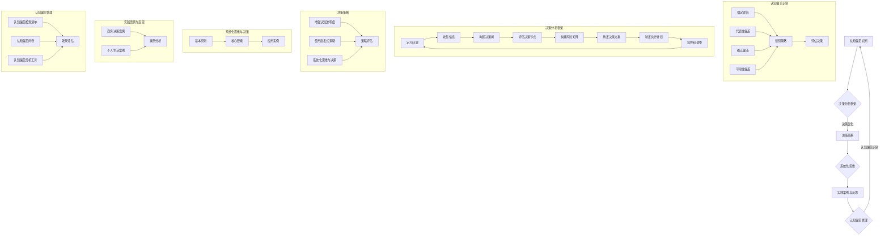

                 

### 文章标题：认知偏见与决策：克服思维盲点的策略

认知偏见与决策：克服思维盲点的策略是一篇旨在帮助读者理解和克服认知偏见，提高决策质量的IT领域技术博客文章。本文将深入探讨认知偏见的基本概念、类型、根源、机制，以及常见认知偏见如锚定效应、代表性偏差、确认偏误和可利用性偏差等。此外，文章还将分析群体思维与群体偏见，并提供一系列策略来帮助读者克服这些认知偏见，优化决策过程。

### 关键词

- 认知偏见
- 决策质量
- 锚定效应
- 代表性偏差
- 确认偏误
- 可利用性偏差
- 群体思维
- 群体偏见
- 决策策略
- 系统化思维

### 摘要

在本文中，我们将探讨认知偏见对决策的影响，并介绍一系列策略来帮助克服这些偏见。首先，我们将概述认知偏见的基本概念和类型，接着深入分析其根源和机制。随后，本文将探讨常见的认知偏见，如锚定效应、代表性偏差、确认偏误和可利用性偏差，并解释它们如何在决策过程中产生负面影响。文章还将分析群体思维与群体偏见，并提出一系列策略来帮助读者克服这些偏见，优化决策过程。最后，本文将提供实践案例与反思，帮助读者将所学应用于实际场景中。

## 第一部分：认知偏见概述

### 第1章：认知偏见的基本概念

#### 1.1 认知偏见的概念与类型

认知偏见是指人们在知觉、判断和决策过程中，由于各种内在或外在因素的影响，导致思维和判断出现系统性偏差的现象。认知偏见不仅影响了人们的日常行为，还对决策过程产生了深远的影响。本文将介绍几种常见的认知偏见类型，并探讨它们如何影响我们的思维和决策。

##### 1.1.1 认知偏见的基本概念

认知偏见（Cognitive Bias）是指在信息处理过程中，由于认知过程的不完美性，导致人们产生错误或偏颇的判断和决策。认知偏见的存在是人类的认知系统在复杂环境中简化信息处理的一种适应性策略，但也可能导致错误决策。

认知偏见可以分为以下几类：

1. **确认偏差**（Confirmation Bias）：人们倾向于寻找、解释和记住那些支持自己信念和假设的信息，而忽视或遗忘那些与之相矛盾的信息。
   
2. **锚定效应**（Anchoring Effect）：人们在做出决策时，往往过度依赖初始信息（锚）的影响，而不充分考虑其他相关因素。

3. **代表性偏差**（Representativeness Bias）：人们在做决策时，倾向于将某个个体或事物与某一类别的一般特征相比较，而忽视概率信息。

4. **可利用性偏差**（Availability Bias）：人们在做决策时，倾向于依赖最近或最容易回忆起的信息，而忽视其他可能更重要的信息。

5. **群体思维**（Groupthink）：在集体决策过程中，个体为了保持团体的一致性，倾向于避免冲突和分歧，从而导致决策质量下降。

##### 1.1.2 常见认知偏见的分类

常见的认知偏见类型主要包括：

1. **确认偏差**：确认偏差是一种寻求一致性的心理倾向，人们倾向于收集和评估信息，以证实自己已有的信念和假设，而忽视那些可能挑战自己信念的信息。

2. **锚定效应**：锚定效应是指人们在决策过程中，受到初始信息（锚点）的影响，而忽视其他更为重要的信息。例如，在价格谈判中，一方可能会受到起始报价的影响，从而在后续的谈判中产生偏见。

3. **代表性偏差**：代表性偏差是指人们在判断概率时，倾向于依赖事物的外表特征和典型性，而忽视实际概率信息。例如，当人们评估一个事件的可能性时，可能会过度强调事件的代表性，而忽略其发生的实际概率。

4. **可利用性偏差**：可利用性偏差是指人们在决策时，依赖于最容易回忆或最容易获取的信息，而忽略其他可能更为重要的信息。例如，在面对复杂问题时，人们可能会依赖自己的经验和记忆，而忽视最新的数据和分析结果。

5. **群体思维**：群体思维是指在集体决策过程中，个体为了保持团体的一致性，倾向于避免冲突和分歧，从而导致决策质量下降。例如，在团队项目中，成员可能会为了避免冲突而接受不那么理想的方案。

##### 1.1.3 认知偏见的影响

认知偏见对决策的影响是深远而广泛的。以下是认知偏见对决策的几个主要影响：

1. **降低决策质量**：认知偏见可能导致决策者忽略关键信息，错误地评估风险和机会，从而降低决策的质量。

2. **加剧决策风险**：认知偏见使得决策者更容易受到情绪和情绪的影响，从而增加决策的风险。

3. **阻碍创新和改进**：认知偏见可能导致团队或组织对已有方法或方案的过度依赖，从而阻碍创新和改进。

4. **影响人际关系**：认知偏见可能导致团队成员之间的误解和冲突，影响团队合作和沟通。

#### 1.2 认知偏见的根源与机制

认知偏见不仅源于个体心理过程，也受到社会环境和文化因素的影响。以下是认知偏见的几个主要根源和机制：

##### 1.2.1 生物进化的影响

生物进化是认知偏见产生的一个重要根源。在进化过程中，人类的大脑发展出了一系列认知机制，以帮助我们在复杂环境中快速做出决策。然而，这些机制有时会导致认知偏见。例如，人类的大脑倾向于依赖直觉和经验，这使得我们容易受到确认偏差和代表性偏差的影响。

##### 1.2.2 社会文化因素的塑造

社会文化环境对认知偏见有着深远的影响。不同的文化和社会背景可能导致人们形成不同的认知偏见。例如，在某些文化中，人们可能更倾向于依赖权威或传统，而在其他文化中，人们可能更愿意接受新的想法和观点。

##### 1.2.3 心理因素的驱动

心理因素也是认知偏见的一个重要驱动因素。例如，人们往往出于自我保护的需要，避免接受与自己信念相矛盾的信息。此外，情绪和压力也可能影响我们的认知过程，导致我们产生认知偏见。

##### 1.2.4 大脑的认知过程

大脑的认知过程在认知偏见的形成中起着关键作用。例如，我们的感知和记忆过程可能导致代表性偏差和可利用性偏差。此外，大脑的前额叶皮层和杏仁核等区域在决策过程中发挥着重要作用，它们的活动模式可能影响我们的认知偏见。

##### 1.2.5 知觉与记忆的偏差

知觉和记忆偏差是认知偏见的一个重要方面。例如，我们的知觉可能受到外部刺激的强烈影响，导致我们产生锚定效应。此外，我们的记忆可能存在选择性，导致我们记住某些信息而忽视其他信息，这可能导致确认偏差和代表性偏差。

##### 1.2.6 决策过程中的认知偏见

在决策过程中，认知偏见可能会影响我们的判断和选择。例如，我们可能受到初始信息的影响，产生锚定效应。此外，我们可能过度依赖直觉和经验，导致代表性偏差。这些偏见可能导致我们做出错误的决策。

### 总结

认知偏见是影响我们决策的重要心理因素。了解认知偏见的基本概念、类型和根源，可以帮助我们更好地识别和克服这些偏见，提高决策质量。在本文的后续部分，我们将进一步探讨常见认知偏见，分析其在决策过程中的影响，并提供策略来克服这些偏见。通过这一系列讨论，我们希望读者能够更加深入地理解认知偏见，并在实际决策中运用所学知识，做出更为明智的决策。

### 第2章：认知偏见的根源与机制

#### 2.1 认知偏见的根源

认知偏见是一种普遍存在的心理现象，其根源可以追溯到多个方面，包括生物进化、社会文化因素和心理因素。理解这些根源有助于我们更好地识别和克服认知偏见。

##### 2.1.1 生物进化的影响

生物进化对认知偏见的影响是一个关键因素。在进化过程中，人类大脑为了适应环境变化，发展出了一系列认知机制。这些机制在早期人类面临危险和资源争夺的情况下，有助于快速做出生存决策。然而，这些机制有时会导致认知偏见。

例如，人类的直觉和经验是适应环境的产物，但在现代社会中，这些直觉和经验可能不再适用。确认偏差（Confirmation Bias）就是一个例子，人类大脑倾向于寻找和记住那些支持自己信念的信息，而忽略与之相反的信息。这种偏见有助于快速验证信念，但在复杂和不确定的环境中，它可能导致错误的决策。

##### 2.1.2 社会文化因素的塑造

社会文化因素也是认知偏见的重要根源。不同的文化和社会背景可能导致人们形成不同的认知偏见。例如，在集体主义文化中，群体一致性可能被视为比个人观点更为重要，这可能导致群体思维（Groupthink）的认知偏见。在这种文化中，个体可能会避免表达与群体观点不同的意见，以保持一致性，从而牺牲决策质量。

此外，社会文化因素也可能影响人们的认知过程。例如，某些文化可能更重视权威和传统，这可能导致人们过度依赖权威信息，产生锚定效应（Anchoring Effect）。在这种文化中，人们可能倾向于依赖历史数据和专家意见，而忽视其他可能更为重要的信息。

##### 2.1.3 心理因素的驱动

心理因素在认知偏见的形成中也起着关键作用。人类大脑为了减少认知负担，常常依赖各种心理捷径（Heuristics），这些捷径虽然在某些情况下可以提高决策效率，但有时会导致认知偏见。

例如，代表性偏差（Representativeness Bias）是一种常见的心理捷径。人们在评估概率时，可能会过度依赖事物的外表特征和典型性，而忽视实际概率信息。这种偏见可能导致人们高估某些事件的可能性，从而做出错误的决策。

此外，情绪和压力也可能影响认知过程。情绪可能会扭曲我们的感知和判断，导致认知偏见。例如，在高度压力的环境下，人们可能会产生确认偏差，更加关注支持自己信念的信息，忽视与之相反的信息。

##### 2.1.4 大脑的认知过程

大脑的认知过程在认知偏见的形成中起着关键作用。大脑的不同区域，如前额叶皮层和杏仁核，在决策过程中发挥着重要作用，但它们的活动模式可能导致认知偏见。

前额叶皮层是大脑负责逻辑推理和决策的重要区域。然而，在高度情绪化的情况下，前额叶皮层的功能可能受到抑制，导致杏仁核的活动占主导。杏仁核是大脑处理情绪的区域，其活动可能导致认知偏见，如情绪化决策和过度反应。

此外，大脑的感知和记忆过程也可能导致认知偏见。例如，锚定效应（Anchoring Effect）可能源于我们对初始信息的过度依赖。在决策过程中，人们可能会将初始信息视为参考点，从而影响后续的判断和选择。

##### 2.1.5 知觉与记忆的偏差

知觉和记忆偏差是认知偏见的一个重要方面。人类的知觉过程可能受到外部刺激的强烈影响，导致我们产生认知偏见。例如，锚定效应（Anchoring Effect）可能源于我们对初始信息的过度依赖。在决策过程中，人们可能会将初始信息视为参考点，从而影响后续的判断和选择。

记忆偏差也可能导致认知偏见。例如，人们可能具有选择性记忆，更容易记住支持自己信念的信息，而忽略与之相反的信息。这种选择性记忆可能导致确认偏差（Confirmation Bias），影响我们的决策过程。

##### 2.1.6 决策过程中的认知偏见

在决策过程中，认知偏见可能会影响我们的判断和选择。例如，我们可能受到初始信息的影响，产生锚定效应。此外，我们可能过度依赖直觉和经验，导致代表性偏差。这些偏见可能导致我们做出错误的决策。

例如，一个典型的例子是在招聘过程中，面试官可能会过度依赖第一印象，这可能导致代表性偏差。面试官可能会认为外表整洁、自信的候选人更有可能成功，而忽视其他重要因素，如技能和经验。

总之，认知偏见是多方面的，其根源可以追溯到生物进化、社会文化因素、心理因素和大脑的认知过程。了解这些根源有助于我们更好地识别和克服认知偏见，提高决策质量。在本文的后续部分，我们将进一步探讨常见的认知偏见类型，并分析它们在决策过程中的影响。

#### 2.2 认知偏见的机制分析

认知偏见的机制是指大脑在信息处理过程中产生的偏差，这些偏差可能导致我们在判断和决策中出现错误。理解这些机制有助于我们更好地识别和克服认知偏见。以下是几种主要认知偏见的机制分析：

##### 2.2.1 大脑的认知过程

大脑的认知过程在认知偏见的形成中起着关键作用。大脑的不同区域负责不同的认知功能，这些功能有时会导致认知偏见。例如，前额叶皮层是负责逻辑推理和决策的重要区域，但在高度情绪化的情况下，前额叶皮层的功能可能受到抑制，导致杏仁核的活动占主导。杏仁核是处理情绪的区域，其活动可能导致情绪化决策和过度反应，如确认偏差（Confirmation Bias）。

此外，大脑的感知和记忆过程也可能导致认知偏见。例如，锚定效应（Anchoring Effect）可能源于我们对初始信息的过度依赖。在决策过程中，人们可能会将初始信息视为参考点，从而影响后续的判断和选择。

##### 2.2.2 知觉与记忆的偏差

知觉和记忆偏差是认知偏见的一个重要方面。人类的知觉过程可能受到外部刺激的强烈影响，导致我们产生认知偏见。例如，锚定效应（Anchoring Effect）可能源于我们对初始信息的过度依赖。在决策过程中，人们可能会将初始信息视为参考点，从而影响后续的判断和选择。

记忆偏差也可能导致认知偏见。例如，人们可能具有选择性记忆，更容易记住支持自己信念的信息，而忽略与之相反的信息。这种选择性记忆可能导致确认偏差（Confirmation Bias），影响我们的决策过程。

例如，当人们回忆过去的事件时，他们可能会倾向于记住那些符合自己信念和期望的部分，而忘记那些与之相反的部分。这种现象在心理学中被称为“信念驱动记忆”（Belief-Driven Memory），它可能导致我们在评估证据时产生偏见。

##### 2.2.3 决策过程中的认知偏见

在决策过程中，认知偏见可能会影响我们的判断和选择。例如，我们可能受到初始信息的影响，产生锚定效应。此外，我们可能过度依赖直觉和经验，导致代表性偏差。这些偏见可能导致我们做出错误的决策。

例如，在一个拍卖场景中，第一个出价可能成为一个锚点，影响后续的出价。参与者可能会受到初始出价的影响，而忽视其他更重要的因素，如物品的实际价值。这种锚定效应可能导致过高的出价，从而产生认知偏见。

此外，代表性偏差也可能在决策过程中发挥作用。例如，在评估一个创业项目的成功可能性时，投资者可能会过度依赖项目的外表特征和典型性，而忽视其商业模式的可行性和市场潜力。这种偏见可能导致对高风险项目的过度乐观或对低风险项目的过度悲观。

##### 2.2.4 确认偏差的机制

确认偏差（Confirmation Bias）是一种常见的认知偏见，其机制涉及信息筛选和评估过程。人们倾向于寻找、解释和记住那些支持自己信念和假设的信息，而忽视或遗忘那些与之相矛盾的信息。

确认偏差的机制可以解释为“信念驱动信息处理”。当人们持有某种信念时，他们会更加关注和记忆那些支持该信念的信息，而忽视或扭曲那些与之相矛盾的信息。这种信息筛选过程可能导致我们在评估证据时产生偏见。

例如，在科学研究中，研究人员可能会过度关注那些支持自己假设的数据，而忽视或解释不当那些与之相反的数据。这种偏见可能导致研究的结论不够客观和可靠。

##### 2.2.5 代表性偏差的机制

代表性偏差（Representativeness Bias）是指人们在评估概率时，倾向于依赖事物的外表特征和典型性，而忽视实际概率信息。这种偏差可能导致我们在判断事件的可能性时产生错误。

代表性偏差的机制涉及两个关键因素：代表性评估和概率估计。人们在评估一个事件是否典型时，可能会依赖直觉和经验，而忽视实际概率信息。例如，当人们听到“一个人患了癌症”时，可能会认为这个事件的概率非常高，因为癌症听起来非常严重和罕见。

然而，实际上，癌症的发病率可能比人们想象的要低。这种偏差可能导致人们在评估风险时产生错误，从而做出不合理的决策。

##### 2.2.6 锚定效应的机制

锚定效应（Anchoring Effect）是指人们在决策过程中，过度依赖初始信息（锚点）的影响，而不充分考虑其他相关因素。这种效应可能导致我们在判断和决策中产生偏差。

锚定效应的机制涉及两个关键过程：初始信息的确定和后续信息的调整。当人们面对一个复杂的问题时，他们可能会寻找一个初始信息作为参考点。这个初始信息可能是一个估计值、一个历史数据或一个专家意见。人们往往会将后续信息与初始信息进行比较和调整，而不是完全独立地评估后续信息。

例如，在一个价格谈判中，一方可能会提出一个初始报价作为参考点。对方可能会在后续的谈判中受到这个初始报价的影响，从而调整自己的出价。这种锚定效应可能导致过高的出价或过低的接受价，从而影响谈判的结果。

##### 2.2.7 可利用性偏差的机制

可利用性偏差（Availability Bias）是指人们在决策过程中，倾向于依赖最近或最容易回忆起的信息，而忽视其他可能更为重要的信息。这种偏差可能导致我们在评估风险和机会时产生偏见。

可利用性偏差的机制涉及信息检索和评估过程。当人们需要评估某个问题时，他们可能会寻找那些最容易获取和回忆的信息。这些信息可能因为其在记忆中的新鲜度和显著性而显得格外重要，从而影响决策。

例如，在决策是否购买某只股票时，投资者可能会过度依赖最近的市场波动和新闻报道，而忽视长期的基本面分析。这种可利用性偏差可能导致不合理的投资决策。

##### 2.2.8 群体思维与群体偏见的机制

群体思维（Groupthink）和群体偏见（Group Bias）是指在集体决策过程中，个体为了保持团体的一致性，倾向于避免冲突和分歧，从而导致决策质量下降。

群体思维的机制涉及信息共享和共识形成过程。在群体决策中，个体可能会倾向于表达与群体观点一致的意见，避免引起冲突。这种共识的形成可能导致信息过滤和偏见，因为那些与群体观点不一致的信息可能被忽视或抑制。

群体偏见则涉及社会压力和群体动力。个体可能会感受到来自群体的压力，迫使其放弃个人意见，以保持一致性。这种社会压力可能导致群体决策的过度保守或过度冒险。

例如，在一个团队项目中，成员可能会为了避免冲突而接受一个不够理想的方案，即使他们个人有更好的想法。这种群体偏见可能导致项目失败。

##### 2.2.9 认知偏见的共同机制

尽管认知偏见类型多样，但它们在机制上存在共同点。这些机制包括信息筛选、情感驱动、记忆偏差和群体动力。

信息筛选是指人们倾向于关注和记忆那些符合自己信念和期望的信息，而忽视与之相反的信息。这种筛选过程可能导致确认偏差。

情感驱动是指情绪和情感状态影响认知过程，导致认知偏见。例如，愤怒或恐惧可能导致确认偏差，使人们过度关注支持自己情绪的信息。

记忆偏差是指人们具有选择性记忆，更容易记住支持自己信念的信息，而忽略与之相反的信息。这种偏差可能导致代表性偏差和确认偏差。

群体动力是指群体环境中的社会压力和共识形成过程可能导致群体思维和群体偏见，从而降低决策质量。

了解这些认知偏见的机制有助于我们更好地识别和克服它们，提高决策质量。在本文的后续部分，我们将探讨如何克服这些偏见，提供实用的策略和方法。

#### 2.3 认知偏见的识别与应对

识别和应对认知偏见是提高决策质量和减少错误的重要步骤。以下是几种常见认知偏见及其识别和应对策略：

##### 2.3.1 确认偏差

确认偏差是指人们倾向于寻找、解释和记住那些支持自己信念和假设的信息，而忽视那些与之相矛盾的信息。这种偏见可能导致信息过滤和错误的决策。

**识别策略**：保持开放的心态，尝试接受不同的观点和证据。使用多来源的信息进行评估，避免仅依赖单一来源。

**应对策略**：使用双盲测试或对照实验来检验自己的信念。邀请外部专家或第三方的反馈来评估决策，以减少偏见。

##### 2.3.2 锚定效应

锚定效应是指人们在决策过程中，过度依赖初始信息（锚点）的影响，而不充分考虑其他相关因素。这种效应可能导致决策偏离实际。

**识别策略**：意识到锚点的影响，明确初始信息可能并不完全反映实际情况。使用逻辑分析和事实证据来评估决策。

**应对策略**：设定多个假设和参考点，以减少锚点对决策的过度影响。进行敏感性分析，以评估不同假设对决策结果的影响。

##### 2.3.3 代表性偏差

代表性偏差是指人们在评估概率时，倾向于依赖事物的外表特征和典型性，而忽视实际概率信息。这种偏差可能导致错误的概率估计。

**识别策略**：意识到外表特征和典型性可能并不代表实际情况。使用统计学方法和实际数据来评估概率。

**应对策略**：进行风险评估，使用概率分布和数学模型来预测结果。考虑历史数据和统计规律，以减少代表性偏差。

##### 2.3.4 可利用性偏差

可利用性偏差是指人们在决策过程中，倾向于依赖最近或最容易回忆起的信息，而忽视其他可能更为重要的信息。这种偏差可能导致决策基于不全面的信息。

**识别策略**：意识到记忆的局限性，尝试从多个角度收集信息。避免仅依赖近期的事件或经验。

**应对策略**：使用系统性方法来收集和分析信息，确保信息的全面性和多样性。进行情境模拟，以考虑不同情境下的决策。

##### 2.3.5 群体思维

群体思维是指在集体决策过程中，个体为了保持团体的一致性，倾向于避免冲突和分歧，从而导致决策质量下降。

**识别策略**：意识到群体思维的影响，鼓励开放和诚实的讨论。保持批判性思维，不盲目接受群体意见。

**应对策略**：建立多元化的团队，确保不同观点的代表性。使用决策框架和评估工具来减少群体思维的影响。鼓励团队成员独立思考和表达意见。

通过识别和应对认知偏见，我们可以提高决策质量，减少错误。这些策略需要结合具体情境进行应用，以实现最佳效果。在本文的后续部分，我们将继续探讨更多认知偏见及其应对策略。

### 第3章：常见认知偏见分析

认知偏见在决策过程中起着重要作用，它们不仅影响个人的判断，还可能导致整个团队的决策失误。在本章中，我们将详细分析几种常见的认知偏见，包括锚定效应、代表性偏差、确认偏误和可利用性偏差，探讨这些偏见如何影响我们的决策，并提供应对策略来帮助克服这些认知偏差。

#### 3.1 锚定效应

锚定效应是指人们在做出决策时，过分依赖最初的参考信息（锚），而忽视其他更为重要或相关的信息。这种偏差可能导致我们在评估和选择过程中偏离实际。

**定义**：锚定效应（Anchoring Effect）是指人们在做决策时，受到初始信息（锚）的影响，从而在后续的判断和选择中过度依赖这个锚。

**实例**：一个典型的例子是在拍卖中，第一个出价可能会成为所有参与者后续出价的参考点。即使这个初始出价可能远远高于物品的实际价值，参与者仍可能会在后续的出价中继续提高价格，因为他们认为这个锚定了物品的价值。

**影响**：锚定效应可能导致我们做出过高的出价或过低的评估，从而影响决策的效率和质量。

**应对策略**：

1. **多角度分析**：在做出决策时，考虑多个信息来源，而不是仅仅依赖初始信息。

2. **设定多个锚点**：在决策过程中，设定多个参考点，以减少单一锚点的影响。

3. **使用逻辑分析**：利用逻辑分析和事实证据来评估决策，而不是仅仅依赖锚点。

4. **进行敏感性分析**：评估不同锚点对决策结果的影响，以便更好地理解决策的敏感性。

**伪代码示例**：

```python
# 锚定效应的影响评估
def evaluate_decision(initial_anchoring, alternative_anchors, decision):
    # 计算锚定效应对决策的影响
    anchoring_effect = decision - initial_anchoring
    # 考虑替代锚点的影响
    alternative_impact = [decision - alternative_anchors[i] for i in range(len(alternative_anchors))]
    # 返回锚定效应和替代锚点的影响
    return anchoring_effect, alternative_impact
```

#### 3.2 代表性偏差

代表性偏差是指人们在评估事件或决策时，过度依赖事件的外表特征和典型性，而忽视实际概率信息。这种偏差可能导致我们做出不合理的判断和选择。

**定义**：代表性偏差（Representativeness Bias）是指人们在做决策时，依赖事件或决策的代表性，而不是考虑其概率。

**实例**：一个常见的例子是在投资决策中，投资者可能会过度依赖公司的品牌声誉和市场份额，而忽视其财务状况和市场风险。这种偏差可能导致投资者对高增长潜力但高风险的公司给予过高评价。

**影响**：代表性偏差可能导致我们高估某些事件或决策的可能性，从而影响决策的合理性和效率。

**应对策略**：

1. **使用概率思维**：在评估事件或决策时，考虑其概率分布和实际数据，而不是仅仅依赖外表特征。

2. **进行统计学分析**：使用统计学方法来评估事件或决策的概率，例如计算概率分布和置信区间。

3. **考虑反例**：寻找和考虑与典型情况相反的反例，以减少代表性偏差。

4. **进行风险评估**：对事件或决策进行风险评估，以全面了解其风险和机会。

**伪代码示例**：

```python
# 代表性偏差的评估
def evaluate_repr Bias(event_probability, representative_data):
    # 计算代表性偏差
    representative_bias = event_probability - representative_data
    # 返回代表性偏差
    return representative_bias
```

#### 3.3 确认偏误

确认偏误是指人们在面对证据时，倾向于寻找、解释和记忆那些支持自己已有信念和假设的信息，而忽视或遗忘那些与之相矛盾的信息。这种偏差可能导致我们做出错误的决策。

**定义**：确认偏误（Confirmation Bias）是指人们在做决策时，为了保持或加强自己已有的信念和假设，而选择性地关注和记忆那些支持自己的信息。

**实例**：一个常见的例子是在科学研究过程中，研究人员可能会过度关注那些支持自己假设的数据，而忽视或解释不当那些与之相反的数据。这种偏差可能导致研究结果的偏误。

**影响**：确认偏误可能导致我们在评估证据时产生偏见，从而影响决策的准确性和科学性。

**应对策略**：

1. **保持开放心态**：在评估证据时，保持开放的心态，尝试接受不同的观点和证据。

2. **使用双盲测试**：在实验研究中使用双盲测试，以减少主观偏见。

3. **邀请第三方评估**：邀请独立第三方评估决策，以减少个人偏见。

4. **进行多元分析**：使用多种分析方法来评估证据，以减少单一分析的偏见。

**伪代码示例**：

```python
# 确认偏误的评估
def evaluate_confirmation_bias(evidence, own_belief):
    # 计算确认偏误
    confirmation_bias = sum(evidence) - sum(evidence > own_belief)
    # 返回确认偏误
    return confirmation_bias
```

#### 3.4 可利用性偏差

可利用性偏差是指人们在决策过程中，倾向于依赖那些最容易获取或回忆的信息，而忽视其他可能更为重要或相关的信息。这种偏差可能导致我们在评估和选择过程中做出不全面的决策。

**定义**：可利用性偏差（Availability Bias）是指人们在做决策时，依赖那些容易获取或回忆的信息，而忽视其他可能更为重要或相关的信息。

**实例**：一个常见的例子是在风险管理中，决策者可能会过度依赖最近发生的事件或新闻，而忽视历史数据和长期趋势。这种偏差可能导致对风险的低估或高估。

**影响**：可利用性偏差可能导致我们在评估风险和机会时产生偏见，从而影响决策的合理性和效率。

**应对策略**：

1. **系统性信息收集**：在决策过程中，系统地收集和分析信息，确保信息的全面性和多样性。

2. **长期视角**：在评估事件或决策时，考虑长期的影响和趋势，而不仅仅依赖短期信息。

3. **情境模拟**：进行情境模拟，考虑不同情境下的决策，以减少可利用性偏差。

4. **使用工具辅助**：使用决策工具和模型来辅助决策，以减少个人主观偏见的干扰。

**伪代码示例**：

```python
# 可利用性偏差的评估
def evaluate_availability_bias(easy_to_retrieve_info, comprehensive_info):
    # 计算可利用性偏差
    availability_bias = easy_to_retrieve_info - comprehensive_info
    # 返回可利用性偏差
    return availability_bias
```

通过识别和应对这些常见的认知偏见，我们可以提高决策的质量和准确性，减少错误的概率。在本文的后续部分，我们将进一步探讨其他认知偏见，并介绍更多的应对策略。这些策略可以帮助我们在复杂的环境中做出更为明智的决策。

#### 3.5 确认偏误与可利用性偏差

确认偏误和可利用性偏差是两种常见的认知偏见，它们在决策过程中可能导致错误的判断和选择。在这部分，我们将详细探讨这两种偏差的定义、实例、影响，以及应对策略。

##### 3.5.1 确认偏误

确认偏误是指人们在做决策时，为了维持或加强自己已有的信念和假设，而倾向于寻找、解释和记住那些支持自己观点的信息，同时忽视或遗忘那些与之相矛盾的信息。这种偏见可能导致我们做出错误的决策。

**定义**：确认偏误（Confirmation Bias）是一种认知偏见，人们在面对信息时，出于自我保护或自我确认的需要，倾向于选择性地关注和记住那些与自己信念相符的信息，而忽视或质疑那些与自己信念相矛盾的信息。

**实例**：一个典型的例子是投资决策。当一个投资者对某只股票持有强烈的看涨信念时，他可能会过度关注那些支持自己观点的新闻和市场信息，而忽视那些提示风险或看跌的信号。这种偏见可能导致投资者继续持有股票，即使市场情况已经发生了不利变化。

**影响**：确认偏误可能影响我们的信息处理和判断，导致我们做出不理性的决策。它可能阻碍我们对风险的识别和应对，使我们陷入过度自信或过度乐观的陷阱。

**应对策略**：

1. **保持开放心态**：在评估信息时，尽量保持开放和客观的心态，避免自我确认的需要。

2. **使用双盲测试**：在实验或决策过程中，采用双盲测试的方法，以减少自我确认的偏见。

3. **多元化信息来源**：确保信息来源的多元化，避免依赖单一来源的信息。

4. **邀请第三方评估**：邀请独立第三方评估决策，以减少个人偏见的影响。

**伪代码示例**：

```python
# 确认偏误的评估
def evaluate_confirmation_bias(evidence, belief):
    # 计算确认偏误
    confirmation_bias = sum(evidence == belief) - len(evidence) / 2
    # 返回确认偏误
    return confirmation_bias
```

##### 3.5.2 可利用性偏差

可利用性偏差是指人们在决策过程中，倾向于依赖那些最容易获取或回忆的信息，而忽视其他可能更为重要或相关的信息。这种偏见可能导致我们做出不全面的决策。

**定义**：可利用性偏差（Availability Bias）是一种认知偏见，人们在评估信息时，依赖于那些容易获取或回忆的信息，而忽视其他可能更为重要或相关的信息。这种现象通常发生在我们对最近发生的事件或情境有更多记忆时。

**实例**：一个典型的例子是在风险管理中，决策者可能会过度依赖最近发生的事件或新闻，而忽视历史数据和长期趋势。这种偏差可能导致对风险的低估或高估。

**影响**：可利用性偏差可能影响我们对风险的评估和预测，导致我们在决策过程中做出不全面的判断。它可能使我们在处理突发事件时，忽视潜在的长远影响。

**应对策略**：

1. **系统性信息收集**：在决策过程中，系统地收集和分析信息，确保信息的全面性和多样性。

2. **长期视角**：在评估事件或决策时，考虑长期的影响和趋势，而不仅仅依赖短期信息。

3. **情境模拟**：进行情境模拟，考虑不同情境下的决策，以减少可利用性偏差。

4. **使用工具辅助**：使用决策工具和模型来辅助决策，以减少个人主观偏见的干扰。

**伪代码示例**：

```python
# 可利用性偏差的评估
def evaluate_availability_bias(easy_to_retrieve_info, comprehensive_info):
    # 计算可利用性偏差
    availability_bias = easy_to_retrieve_info - comprehensive_info
    # 返回可利用性偏差
    return availability_bias
```

##### 3.5.3 确认偏误与可利用性偏差的比较与联系

确认偏误和可利用性偏差在决策过程中都可能导致偏见和错误的判断，但它们的机制和影响有所不同。

- **机制**：确认偏误主要涉及信息的选择和记忆，即人们倾向于记住支持自己信念的信息。而可利用性偏差则更多地涉及信息的获取，即人们依赖那些容易获取的信息。
- **影响**：确认偏误可能导致我们在评估证据时产生偏见，而可利用性偏差可能导致我们在评估风险和机会时产生偏见。

尽管两者机制不同，但它们在某些情况下可能相互作用。例如，在评估一个投资机会时，我们可能会因为确认偏误而倾向于记住那些支持自己观点的信息，同时又因为可利用性偏差而依赖那些容易获取的信息。

因此，在实际应用中，识别和应对这两种偏差是一个综合的过程。我们可以通过保持开放心态、多元化信息来源、长期视角和情境模拟等方法，来减少确认偏误和可利用性偏差的影响，从而提高决策的质量。

### 第4章：群体思维与群体偏见

群体思维（Groupthink）和群体偏见（Group Bias）是决策过程中常见的认知偏见。这些偏见往往导致决策者在面对复杂问题时，倾向于追求群体的一致性，而非追求最优的解决方案。本章将深入探讨群体思维和群体偏见的概念、影响以及应对策略。

#### 4.1 群体思维

群体思维是指在一个群体决策过程中，成员为了保持一致性和避免冲突，倾向于避免提出不同意见或质疑主流观点，从而导致决策质量下降。这种偏见在决策过程中可能导致“集体迷思”，即群体成员在决策过程中过分追求一致，忽视了合理的分析和讨论。

**定义**：群体思维（Groupthink）是一种认知偏见，指在一个群体决策过程中，成员为了避免冲突和保持一致，倾向于忽视合理的分析和讨论，从而导致决策质量的下降。

**实例**：一个典型的例子是军事决策。在战争期间，军事指挥官可能会因为群体思维而忽视一些重要的战术意见，因为他们担心提出不同意见会导致冲突和降低士气。这种偏见可能导致决策失误，影响战争的最终结果。

**影响**：群体思维可能影响决策的客观性和全面性，导致团队在决策过程中忽视重要的信息和分析。它还可能导致决策者陷入“群体迷思”的陷阱，过分追求一致，忽视了合理的分析和质疑。

**应对策略**：

1. **鼓励多样性和开放性**：在决策过程中，鼓励团队成员提出不同的观点和质疑，避免群体思维的发生。

2. **引入外部观点**：邀请外部专家或第三方参与决策，以提供不同的观点和分析，减少群体思维的影响。

3. **使用决策框架**：使用系统化的决策框架，确保决策过程中充分考虑各种可能性和风险。

4. **建立透明的决策流程**：确保决策过程透明，团队成员能够了解决策的依据和过程，减少信息不对称。

**伪代码示例**：

```python
# 群体思维影响评估
def evaluate_groupthink(inconsistency, homogeneity):
    # 计算群体思维影响
    groupthink_impact = homogeneity - (1 - inconsistency)
    # 返回群体思维影响
    return groupthink_impact
```

#### 4.2 群体偏见

群体偏见是指个体在面对群体决策时，受到群体压力或群体期望的影响，从而产生偏离个人观点的判断和决策。这种偏见可能导致个体在决策过程中放弃自己的独立思考，从而影响决策的质量。

**定义**：群体偏见（Group Bias）是一种认知偏见，指个体在面对群体决策时，受到群体压力或期望的影响，从而产生偏离个人观点的判断和决策。

**实例**：一个典型的例子是在商业决策中，一个团队成员可能会因为担心被群体排斥，而同意一个自己并不认同的方案。这种偏见可能导致团队在决策过程中做出不够明智的选择。

**影响**：群体偏见可能影响决策的客观性和科学性，导致团队在决策过程中忽视个体意见和合理分析。

**应对策略**：

1. **鼓励独立思考**：在决策过程中，鼓励团队成员独立思考，表达自己的观点，避免受到群体压力的影响。

2. **建立多元化的团队**：确保团队成员背景和观点的多元化，减少群体偏见的影响。

3. **建立明确的决策规则**：制定明确的决策规则，确保每个成员都有机会参与讨论和表达意见。

4. **使用决策工具**：使用系统化的决策工具，帮助团队成员进行合理的分析和评估，减少个人偏见的影响。

**伪代码示例**：

```python
# 群体偏见影响评估
def evaluate_group_bias(individual_opinion, group_decision):
    # 计算群体偏见影响
    group_bias_impact = abs(individual_opinion - group_decision)
    # 返回群体偏见影响
    return group_bias_impact
```

##### 4.3 群体思维与群体偏见的关系

群体思维和群体偏见虽然在机制上有所不同，但它们在实际决策过程中往往相互作用，共同影响决策的质量。

- **关系**：群体思维可能导致群体偏见，因为成员在追求一致性的过程中，可能会放弃自己的独立思考和观点。而群体偏见则可能加剧群体思维，因为成员在感受到群体压力时，更可能服从群体的决策。

- **影响**：群体思维和群体偏见都可能导致决策质量下降，因为它们使决策过程缺乏多样性和批判性思维。群体思维可能导致信息过滤和决策偏颇，而群体偏见可能导致个体独立思考的缺失。

**综合应对策略**：

1. **平衡一致性和多样性**：在决策过程中，既要追求一致性，又要保持多样性和开放性，确保每个成员都有机会表达自己的观点。

2. **建立有效的沟通机制**：确保团队成员之间能够进行有效的沟通和讨论，减少信息不对称和误解。

3. **培养批判性思维**：鼓励团队成员进行批判性思考，对决策进行深入分析和评估。

4. **引入外部反馈**：邀请外部专家或第三方评估决策，提供独立的反馈和意见，以减少偏见的影响。

通过综合应对群体思维和群体偏见，我们可以提高决策的质量和科学性，减少错误决策的概率。在本文的后续部分，我们将进一步探讨如何通过系统化的思维和决策策略，克服认知偏见，提高决策的效率和准确性。

### 第5章：克服认知偏见的方法

#### 6.1 增强认知透明度

认知透明度是指个体在决策过程中，能够清楚地认识到自己的思维过程、认知偏见及其可能的影响。提高认知透明度是克服认知偏见的关键步骤，有助于我们做出更为理性和明智的决策。以下是一些增强认知透明度的策略：

##### 6.1.1 认知透明度的定义

认知透明度（Cognitive Transparency）是指个体在思考、判断和决策过程中，能够清晰地识别和意识到自己的思维过程、认知偏见及其对决策的影响。这种透明度有助于我们更好地理解自己的认知机制，从而减少偏见。

##### 6.1.2 增强认知透明度的策略

1. **自我反思**：定期进行自我反思，评估自己在决策过程中的思维模式和行为。通过反思，我们可以识别自己的认知偏见，并采取措施进行纠正。

2. **记录决策日志**：将决策过程和结果详细记录下来，包括决策的依据、评估的标准、所依赖的信息来源等。这有助于我们回顾和评估决策过程，发现潜在的认知偏见。

3. **使用决策工具**：利用决策工具和模型，如决策树、评估矩阵等，帮助系统化地分析和评估决策。这些工具可以揭示我们的思维模式，帮助我们识别和克服认知偏见。

4. **寻求外部反馈**：邀请他人参与决策过程，提供外部视角和反馈。他人的观点和批评可以帮助我们识别自己的认知偏见，提高决策质量。

5. **接受教育**：通过学习心理学、逻辑学和决策理论等知识，增强对认知偏见的认识。这些知识可以帮助我们更好地理解自己的思维过程，从而提高认知透明度。

##### 6.1.3 实例分析

**案例**：一家公司在评估新项目时，采用了增强认知透明度的策略。

- **自我反思**：项目经理在项目评估过程中，定期记录自己的思维过程和评估标准，反思是否存在认知偏见。
- **记录决策日志**：详细记录项目评估的每个步骤，包括数据收集、分析方法和评估结果。
- **使用决策工具**：应用决策树和评估矩阵，系统地分析项目的风险和收益。
- **寻求外部反馈**：邀请行业专家和团队成员参与评估，提供外部视角和反馈。
- **接受教育**：项目经理参加决策培训课程，学习如何识别和克服认知偏见。

通过这些策略，项目经理提高了决策过程的透明度，识别出潜在的认知偏见，并采取相应措施进行纠正。最终，项目评估结果更为客观和全面，减少了认知偏见对决策的影响。

#### 6.2 使用启发式策略

启发式策略是指利用一些简化的思维模式或规则，快速做出决策的方法。尽管这些策略可能无法提供最优解，但它们在复杂和不确定的环境中，可以有效地帮助我们做出相对合理的决策。以下是一些常见的启发式策略及其应用：

##### 6.2.1 启发式策略的定义

启发式策略（Heuristic Strategies）是指利用一些简化的思维模式或规则，帮助个体在复杂和不确定的环境中快速做出决策。这些策略虽然可能无法提供最优解，但在许多情况下，它们可以提供较为合理的决策。

##### 6.2.2 常见启发式策略

1. **满意原则**（Satisficing）：满意原则是指个体在决策过程中，不是追求最优解，而是寻找一个足够好的解决方案。这种方法适用于时间和资源有限的情况。

2. **锚定启发式**（Anchoring Heuristic）：锚定启发式是指个体在决策过程中，依赖于初始信息（锚）的影响，从而影响后续的判断和选择。尽管这种方法可能导致认知偏见，但在某些情况下，它可以帮助我们快速做出决策。

3. **代表性启发式**（Representativeness Heuristic）：代表性启发式是指个体在评估概率时，依赖事件的外表特征和典型性，从而影响判断。这种方法在某些情境下，如评估某人的信用风险时，可能具有一定的参考价值。

4. **可得性启发式**（Availability Heuristic）：可得性启发式是指个体在评估概率时，依赖那些最容易获取或回忆的信息。这种方法可能导致我们过度依赖近期事件或经验，而在某些情境下，它可能帮助快速做出决策。

##### 6.2.3 启发式策略的优化

尽管启发式策略在快速决策中具有优势，但它们也可能导致认知偏见。以下是一些优化启发式策略的方法：

1. **结合多种启发式**：在决策过程中，结合使用多种启发式策略，以减少单一启发式的局限性。例如，在评估一个投资机会时，可以同时考虑满意原则、代表性启发式和可得性启发式。

2. **利用数据和信息**：在启发式策略的基础上，利用数据和信息进行补充和验证。例如，在应用代表性启发式时，可以结合历史数据和实际概率信息，以提高决策的准确性。

3. **进行风险评估**：在应用启发式策略时，进行风险评估，以识别潜在的风险和不确定因素。这有助于我们更好地理解决策的局限性，并采取相应措施进行优化。

4. **持续学习和改进**：通过不断学习和反思，改进启发式策略的应用。例如，通过案例学习和实践，我们可以更好地理解启发式策略的适用范围和局限性。

##### 6.2.4 实例分析

**案例**：一家创业公司在评估新产品市场推广策略时，采用了多种启发式策略。

- **满意原则**：公司不是追求完美的市场推广方案，而是寻找一个足够有效的策略。例如，选择了社交媒体广告作为主要推广渠道，以快速获取用户反馈。
- **锚定启发式**：公司基于过去成功的市场推广案例，将初始预算锚定为一定比例的年度营销预算。
- **代表性启发式**：公司参考了类似产品的市场表现，预测了新产品的潜在市场反应。
- **可得性启发式**：公司根据现有的资源和能力，确定了市场推广的具体执行计划。

通过结合多种启发式策略，公司快速制定了一个相对合理的市场推广方案。在实际执行过程中，公司不断收集反馈和数据，优化推广策略，提高了市场推广效果。

通过增强认知透明度和优化启发式策略，我们可以更有效地克服认知偏见，提高决策质量。在本文的后续部分，我们将进一步探讨系统化思维与决策，提供更多实用的策略和方法。

### 第7章：系统化思维与决策

系统化思维是一种全面的、结构化的思维方式，它有助于我们在复杂和不确定的环境中做出更加理性、合理的决策。系统化思维通过分析、规划和执行一系列步骤，确保决策过程的全面性和逻辑性，从而减少认知偏见的影响。本章将详细探讨系统化思维的基本原则、核心要素以及其在实际决策中的应用。

#### 7.1 系统化思维的基本原则

系统化思维（Systematic Thinking）是一种基于逻辑和分析的思维方式，其基本原则包括以下几个方面：

1. **全面性**：系统化思维要求我们在分析问题和制定决策时，考虑所有相关的因素和变量。通过全面的分析，我们可以更准确地评估问题的复杂性和潜在影响。

2. **结构性**：系统化思维强调分析和解决问题时的结构性。通过构建问题和决策的框架，我们可以将复杂的问题分解为更小的部分，从而更好地理解和解决。

3. **逻辑性**：系统化思维要求我们在分析和决策过程中遵循逻辑原则，确保每一步都有合理的依据和逻辑关系。这有助于我们避免逻辑错误和认知偏见。

4. **可验证性**：系统化思维强调决策的可验证性，即通过数据、证据和实际结果来验证决策的有效性。这有助于我们识别和纠正潜在的偏见和错误。

5. **适应性**：系统化思维要求我们在决策过程中保持灵活性，根据新的信息和环境变化调整决策。这种适应性有助于我们应对不确定性和复杂性。

#### 7.2 系统化思维的核心要素

系统化思维的核心要素包括以下几个部分：

1. **定义问题**：首先，我们需要清晰地定义问题，明确问题的本质和目标。这有助于我们聚焦于关键问题，避免在无关因素上浪费时间和精力。

2. **收集信息**：在定义问题后，我们需要收集所有相关的信息。这些信息包括数据、文献、专家意见、历史记录等。全面的信息收集是做出理性决策的基础。

3. **分析信息**：在收集信息后，我们需要对信息进行深入分析，识别关键因素和潜在关系。这可以通过构建模型、使用逻辑分析工具和进行数据挖掘等方法实现。

4. **制定方案**：在分析信息的基础上，我们需要制定多个可能的解决方案。每个方案都应该包括明确的行动步骤、预期结果和资源需求。

5. **评估方案**：在制定方案后，我们需要对每个方案进行评估，比较它们的优势和劣势，评估风险和机会。这可以通过构建评估矩阵、使用决策树等方法实现。

6. **执行方案**：在评估方案后，我们需要选择一个最优方案，并开始执行。在执行过程中，我们需要监控进展情况，及时调整方案以应对新的信息和环境变化。

7. **验证结果**：在执行方案后，我们需要验证决策的结果，确保达到预期目标。如果结果与预期不符，我们需要分析原因，并采取相应措施进行纠正。

#### 7.3 系统化思维在实际决策中的应用

系统化思维在多个领域和场景中都有广泛的应用，以下是一些具体的应用实例：

1. **项目管理**：在项目管理中，系统化思维可以帮助项目经理定义项目目标、收集项目信息、制定项目计划、评估风险和调整计划。通过系统化思维，项目经理可以更好地控制项目进度和质量。

2. **战略规划**：在战略规划中，系统化思维可以帮助组织定义战略目标、分析市场和环境、制定战略方案、评估风险和调整战略。通过系统化思维，组织可以更准确地把握市场机会和风险，制定更为科学的战略。

3. **产品开发**：在产品开发中，系统化思维可以帮助开发团队明确产品需求、收集用户反馈、制定开发计划、评估产品功能和性能、验证用户满意度。通过系统化思维，开发团队可以更好地满足用户需求，提高产品竞争力。

4. **风险管理**：在风险管理中，系统化思维可以帮助组织识别潜在风险、评估风险概率和影响、制定风险应对策略、监控风险变化和调整策略。通过系统化思维，组织可以更好地控制风险，确保业务持续稳定。

#### 7.4 系统化思维与认知偏见的关系

系统化思维有助于减少认知偏见的影响，原因如下：

1. **全面性**：系统化思维强调全面分析问题，考虑所有相关因素。这有助于我们避免因忽视某些关键因素而产生认知偏见。

2. **结构性**：系统化思维通过构建问题和决策的框架，帮助我们理清思路，避免因思维混乱而产生认知偏见。

3. **逻辑性**：系统化思维要求我们在分析和决策过程中遵循逻辑原则，这有助于我们识别和纠正逻辑错误和认知偏见。

4. **可验证性**：系统化思维强调通过数据、证据和实际结果验证决策的有效性。这有助于我们识别和纠正因偏见而产生的错误决策。

5. **适应性**：系统化思维要求我们在决策过程中保持灵活性，根据新的信息和环境变化调整决策。这有助于我们及时纠正因偏见而产生的错误决策。

通过系统化思维，我们可以更有效地识别和克服认知偏见，提高决策的质量和准确性。在本文的后续部分，我们将探讨如何将系统化思维应用于实际决策场景，并提供具体的实践案例。

### 7.2 决策分析框架

决策分析框架是一种系统化、结构化的决策方法，它通过明确步骤和工具，帮助决策者在复杂和不确定的环境中做出更为理性和有效的决策。以下是构建决策分析框架的详细步骤和方法：

#### 7.2.1 构建决策分析框架的步骤

1. **定义决策问题**：首先，明确需要解决的决策问题。这包括确定问题的背景、目标和关键约束条件。通过明确问题，可以确保决策分析的针对性。

2. **收集相关信息**：在定义问题后，收集所有相关的信息。这些信息包括数据、文献、专家意见、历史记录等。全面的信息收集是做出理性决策的基础。

3. **构建决策树**：使用决策树（Decision Tree）工具，将决策问题分解为一系列互斥的选择和可能的后果。决策树可以帮助我们清晰地理解问题的结构和不同选择的影响。

4. **评估决策节点**：在每个决策节点，评估不同选择的概率和后果。可以使用概率分布、预期值、决策矩阵等工具，对每个决策节点进行评估。

5. **构建风险矩阵**：如果决策问题涉及到风险，构建风险矩阵来评估风险的概率和影响。这有助于我们识别和管理潜在风险。

6. **确定决策方案**：根据评估结果，选择最优的决策方案。可以使用成本效益分析、敏感性分析等方法，确定最佳决策方案。

7. **制定执行计划**：在确定决策方案后，制定详细的执行计划。这包括分配资源、设定时间表、明确责任等。

8. **监控和调整**：在执行决策过程中，持续监控进展情况，并根据新的信息和环境变化调整决策。这有助于确保决策的有效性和适应性。

#### 7.2.2 决策过程中的认知偏见识别

在决策过程中，认知偏见可能会影响我们的判断和选择。以下是一些常见的认知偏见，以及如何在决策分析框架中识别和应对这些偏见：

1. **确认偏误**：确认偏误是指人们在面对证据时，倾向于寻找、解释和记忆那些支持自己已有信念和假设的信息，而忽视那些与之相矛盾的信息。在决策分析框架中，可以通过以下方法识别和应对确认偏误：

   - **多角度分析**：在评估证据时，考虑多个角度和来源的信息，以减少确认偏误的影响。
   - **邀请外部专家**：邀请外部专家参与决策，以提供独立的视角和评估，减少个人偏见。
   - **使用双盲测试**：在实验或评估过程中，采用双盲测试，以减少个人偏见的影响。

2. **锚定效应**：锚定效应是指人们在决策过程中，过分依赖初始信息（锚）的影响，而忽视其他更为重要或相关的信息。在决策分析框架中，可以通过以下方法识别和应对锚定效应：

   - **设定多个参考点**：在决策过程中，设定多个参考点，以减少单一锚点的影响。
   - **使用敏感性分析**：进行敏感性分析，评估不同初始信息对决策结果的影响，以识别锚定效应的影响。
   - **使用逻辑分析**：利用逻辑分析和事实证据来评估决策，而不是仅仅依赖锚点。

3. **代表性偏差**：代表性偏差是指人们在评估概率时，过度依赖事物的外表特征和典型性，而忽视实际概率信息。在决策分析框架中，可以通过以下方法识别和应对代表性偏差：

   - **使用概率思维**：在评估事件或决策时，考虑其概率分布和实际数据，而不是仅仅依赖外表特征。
   - **进行统计学分析**：使用统计学方法来评估事件或决策的概率，例如计算概率分布和置信区间。
   - **考虑反例**：寻找和考虑与典型情况相反的反例，以减少代表性偏差。

4. **可利用性偏差**：可利用性偏差是指人们在决策过程中，倾向于依赖那些最近或最容易回忆的信息，而忽视其他可能更为重要或相关的信息。在决策分析框架中，可以通过以下方法识别和应对可利用性偏差：

   - **系统性信息收集**：在决策过程中，系统地收集和分析信息，确保信息的全面性和多样性。
   - **长期视角**：在评估事件或决策时，考虑长期的影响和趋势，而不仅仅依赖短期信息。
   - **情境模拟**：进行情境模拟，考虑不同情境下的决策，以减少可利用性偏差。

#### 7.2.3 决策分析的优化方法

为了进一步提高决策分析的效率和准确性，可以采用以下优化方法：

1. **多目标决策分析**：在决策分析中，考虑多个目标，如成本、效益、风险等。使用多目标决策方法，如多目标规划、多目标分析，以找到最优平衡点。

2. **模拟和预测**：使用模拟和预测工具，如蒙特卡洛模拟、时间序列分析等，评估不同决策方案的可能结果和风险。

3. **数据分析与机器学习**：利用数据分析方法和机器学习技术，从大量数据中提取有价值的信息，以支持决策。例如，使用回归分析、聚类分析、神经网络等工具。

4. **专家系统**：构建专家系统，结合人类专家的知识和机器学习能力，为决策提供更为科学的支持。

5. **协同决策**：在决策过程中，利用团队协作和沟通工具，如在线协作平台、讨论区等，提高决策的透明度和参与度。

通过构建决策分析框架和优化方法，我们可以更有效地识别和克服认知偏见，提高决策的质量和准确性。在本文的后续部分，我们将继续探讨如何将决策分析框架应用于具体场景，并提供实践案例。

### 7.3 决策过程中的认知偏见识别与应对

在决策过程中，认知偏见可能导致我们做出不理性、非最优的选择，因此识别和应对这些偏见至关重要。以下将探讨几种常见认知偏见，包括锚定效应、代表性偏差、确认偏差和可用性偏差，并讨论如何在实际决策过程中识别和应对这些偏见。

#### 锚定效应

**定义**：锚定效应是指人们在决策过程中，过度依赖最初的信息（锚点），从而导致后续决策受到这些锚点的影响，而忽视其他相关因素。

**识别方法**：在决策过程中，可以采取以下方法来识别锚定效应：
- **回顾决策起点**：检查最初的信息来源和假设，确定它们是否合理。
- **进行敏感性分析**：评估不同初始信息对最终决策结果的影响，以识别锚定效应的存在。
- **使用外部参考点**：引入外部参考点，以平衡初始信息的影响。

**应对策略**：
- **设定多个参考点**：在决策过程中，考虑多个参考点，以减少单一锚点的过度影响。
- **使用逻辑分析**：在决策过程中，运用逻辑分析来评估其他相关信息，确保决策的全面性。
- **进行反向思考**：探讨如果初始信息不正确，决策会如何变化，以识别锚定效应的影响。

#### 代表性偏差

**定义**：代表性偏差是指人们在评估事件或决策时，过度依赖事件或决策的典型性和外表特征，而忽视实际概率信息。

**识别方法**：在决策过程中，可以采取以下方法来识别代表性偏差：
- **审查评估标准**：检查评估标准是否过于依赖外表特征和典型性。
- **进行概率分析**：使用统计学方法，如概率分布和置信区间，来评估事件或决策的实际概率。

**应对策略**：
- **使用概率思维**：在评估事件或决策时，优先考虑实际概率信息，而不仅仅是外表特征。
- **寻找反例**：考虑典型情况之外的反例，以平衡代表性偏差。
- **进行跨类别比较**：将决策问题与其他类似但不典型的情况进行比较，以获取更多参考信息。

#### 确认偏差

**定义**：确认偏差是指人们在面对证据时，倾向于寻找、解释和记忆那些支持自己已有信念和假设的信息，而忽视或遗忘那些与之相矛盾的信息。

**识别方法**：在决策过程中，可以采取以下方法来识别确认偏差：
- **自我反思**：在决策过程中，定期反思自己的信念和假设，评估是否过于依赖支持性证据。
- **使用双盲测试**：在实验或评估过程中，采用双盲测试，以减少个人偏见的影响。

**应对策略**：
- **保持开放心态**：在评估证据时，尽量保持开放和客观的心态，避免自我确认的需要。
- **邀请外部专家**：邀请独立第三方评估决策，以减少个人偏见。
- **多元化信息来源**：确保信息来源的多元化，避免依赖单一来源的信息。
- **进行对照实验**：使用对照实验来验证决策，减少确认偏差的影响。

#### 可用性偏差

**定义**：可用性偏差是指人们在决策过程中，倾向于依赖那些最容易获取或回忆的信息，而忽视其他可能更为重要或相关的信息。

**识别方法**：在决策过程中，可以采取以下方法来识别可用性偏差：
- **审查信息来源**：检查决策过程中使用的所有信息来源，确定它们是否全面和可靠。
- **进行情境模拟**：通过模拟不同情境，评估不同信息对决策的影响。

**应对策略**：
- **系统性信息收集**：在决策过程中，系统地收集和分析信息，确保信息的全面性和多样性。
- **长期视角**：在评估事件或决策时，考虑长期的影响和趋势，而不仅仅依赖短期信息。
- **使用决策工具**：利用决策工具和模型，如决策树、评估矩阵等，帮助系统化地分析和评估决策。

#### 综合应对策略

为了更有效地识别和应对认知偏见，可以采取以下综合策略：
- **系统化决策过程**：使用系统化决策框架，确保决策过程的全面性和逻辑性。
- **持续学习和反思**：通过不断学习和反思，提高对认知偏见的认识和应对能力。
- **团队协作**：鼓励团队成员之间的开放讨论和反馈，以减少个人偏见的影响。
- **使用工具和方法**：利用各种工具和方法，如数据分析、模拟、模型等，帮助识别和应对认知偏见。

通过识别和应对这些认知偏见，我们可以提高决策的质量和准确性，减少错误决策的风险。在本文的后续部分，我们将继续探讨系统化思维在决策中的应用，并提供实践案例。

### 第8章：实践案例与反思

#### 8.1 认知偏见在商务决策中的应用

认知偏见在商务决策中无处不在，无论是战略规划、产品开发，还是市场推广，都可能受到认知偏见的影响。以下是一个具体的实践案例，展示了如何识别和应对认知偏见，以提高决策质量。

**案例背景**：某家科技公司计划推出一款新的智能家居产品。在产品开发的早期阶段，公司管理层认为，产品外观的设计和用户体验是成功的关键。因此，他们在设计过程中投入了大量资源，以确保产品的外观吸引人、用户体验流畅。

**认知偏见识别**：在这个案例中，可能存在的认知偏见包括：
- **代表性偏差**：管理层可能过度依赖产品的外观设计，而忽视了用户需求和市场趋势。
- **锚定效应**：管理层可能受到以往成功产品的外观设计的锚点影响，导致他们在新的产品设计中过度强调外观。
- **确认偏差**：管理层可能过度依赖支持他们信念的证据，如用户调查中的正面反馈，而忽视了一些潜在的负面反馈。

**应对策略**：
- **多元化信息收集**：为了识别和应对这些认知偏见，公司决定采用多元化信息收集的策略。他们不仅收集了用户调查数据，还进行了市场趋势分析、竞争对手分析，以及产品技术的可行性研究。
- **用户测试**：公司引入了用户测试环节，在产品开发的不同阶段收集用户的反馈。这有助于公司了解用户真实的需求和偏好，从而避免过度依赖外观设计。
- **专家咨询**：公司邀请了行业专家进行咨询，以获取专业的意见和建议。这有助于管理层从外部视角识别和应对认知偏见。

**决策优化**：通过这些策略，公司识别出了一些潜在的偏见，并进行了相应的调整。他们决定在产品设计时，更加注重用户体验和功能的实用性，同时保持外观的吸引力。最终，这款产品在市场上取得了成功，用户反馈良好，销售额也达到了预期目标。

**反思**：这个案例表明，认知偏见在商务决策中是一个普遍存在的问题，但通过多元化的信息收集、用户测试和专家咨询，可以有效识别和应对这些偏见。企业在制定决策时，应该保持开放和批判性思维，避免过度依赖单一信息源或个人信念，以确保决策的合理性和有效性。

#### 8.2 个人生活中的认知偏见管理

认知偏见不仅影响商务决策，也渗透到我们的日常生活中。以下是一个关于个人生活中的认知偏见管理的实践案例。

**案例背景**：张先生是一位热衷于投资的职场人士。他经常关注股票市场，并根据自己的直觉和过去成功的投资经历做出决策。然而，最近他的投资表现不佳，损失了一些资金。

**认知偏见识别**：在这个案例中，张先生可能存在的认知偏见包括：
- **确认偏差**：张先生可能过度依赖过去成功的投资经历，而忽视了一些失败的案例。
- **代表性偏差**：他可能过度关注那些符合他投资理念的股票，而忽视其他可能更有潜力的股票。
- **锚定效应**：他可能受到过去成功投资决策的锚点影响，导致他在新的投资决策中过度依赖过去的经验。

**应对策略**：
- **反思与记录**：张先生决定开始记录自己的投资决策和结果，并进行定期反思。这有助于他识别自己的认知偏见，并了解哪些决策是有效的，哪些是不合理的。
- **学习新知识**：他决定参加投资课程，学习新的投资理论和策略，以减少认知偏见的影响。
- **多元化投资组合**：张先生调整了自己的投资组合，分散投资到多个不同行业和资产类别，以减少单一行业或资产的波动对投资组合的影响。
- **理性分析**：在做出投资决策时，张先生开始使用理性分析的方法，如基本面分析、技术分析等，而不仅仅是依赖直觉和经验。

**结果**：通过这些策略，张先生的投资表现逐渐改善，他开始取得了一些稳定的收益。他也意识到，通过识别和应对认知偏见，可以更好地管理个人投资。

**反思**：这个案例表明，个人在生活中同样需要管理认知偏见。通过反思、学习新知识、多元化投资组合和理性分析，我们可以减少认知偏见的影响，提高决策的质量和效率。

通过这些实践案例，我们可以看到，在商务决策和个人生活中，认知偏见都是普遍存在的问题。但通过识别和应对这些偏见，我们可以做出更为理性和有效的决策。这不仅有助于提高决策质量，还能帮助我们更好地应对复杂和不确定的环境。

### 附录A：认知偏见研究的经典文献与资源

在认知偏见研究领域，有许多经典文献和资源为我们的理解提供了宝贵的参考。以下是一些值得推荐的经典文献、网站和数据库，以及认知偏见研究的最新动态与趋势。

#### A.1 认知偏见的经典研究文献

1. **《判断与决策：认知心理学视角》（Judgment and Decision Making: The Cognitive Science Perspective）**，编辑：D. G. MacKay。这本书汇集了认知科学领域关于判断和决策的深入研究，详细探讨了认知偏见的各种类型和机制。

2. **《认知心理学：思想和行动的理论》（Cognitive Psychology: A Framework for Thinking and Action）**，作者：Ulric Neisser。这本书是认知心理学的经典教材，其中包含了大量关于认知偏见和决策的理论和实践。

3. **《认知心理学手册》（The Handbook of Cognitive Psychology）**，作者：乌尔夫·汉森（Ulf H. Hasselmo）等。这本书涵盖了认知心理学的各个领域，包括认知偏见和决策的相关研究。

4. **《决策与判断：认知心理学观点》（Judgment and Decision Making: An Experimental Approach）**，作者：Barry Staw。这本书通过实验研究的方法，详细探讨了认知偏见在决策过程中的作用。

#### A.2 认知偏见研究相关的网站与数据库

1. **社会认知网络（Social Cognitive Network）**：这是一个在线平台，提供关于认知偏见和决策的学术文章、研究项目和讨论论坛。

2. **认知偏见数据库（Cognitive Bias Codex）**：这是一个详细的认知偏见列表，每个偏见都有定义、实例、机制和应对策略。这是一个非常有用的资源，帮助研究人员和实践者更好地理解和应对认知偏见。

3. **Google Scholar**：通过Google Scholar，可以搜索到大量关于认知偏见的研究论文、期刊文章和学术书籍。

#### A.3 认知偏见研究的最新动态与趋势

1. **人工智能与认知偏见**：近年来，人工智能技术的应用逐渐深入到决策和判断领域。研究人员正在探讨如何利用人工智能技术来识别和应对认知偏见，提高决策的准确性和效率。

2. **跨学科研究**：认知偏见研究正在与其他领域，如经济学、社会学、心理学和计算机科学等，进行跨学科合作。这种跨学科研究有助于更全面地理解认知偏见的影响和机制。

3. **实践应用**：越来越多的组织开始关注如何在实际决策过程中应用认知偏见的研究成果。例如，许多公司引入了决策支持工具和框架，以帮助管理层识别和应对认知偏见。

4. **培训与教育**：随着对认知偏见的认识加深，许多教育和培训机构开始提供相关的培训课程，帮助个人和组织提高认知偏见意识，并掌握应对策略。

通过了解和利用这些经典文献、网站和数据库，以及关注认知偏见研究的最新动态与趋势，我们可以更全面地理解认知偏见，并在实际应用中有效地识别和应对这些偏见，提高决策的质量。

### 附录B：认知偏见与决策相关的实践工具

在识别和应对认知偏见的过程中，使用适当的实践工具和方法可以显著提高决策的质量。以下是一些常见的认知偏见识别和评估工具，以及改进决策过程的工具和应用。

#### B.1 识别与评估认知偏见的工具

1. **认知偏差检查清单（Cognitive Bias Checklists）**：这些清单提供了多种认知偏见的描述和实例，帮助个体在决策过程中自我评估是否存在偏见。例如，Google公司的“认知偏差检查清单”提供了一系列常见的认知偏见，以及应对策略。

2. **认知偏差问卷（Cognitive Bias Questionnaires）**：这些问卷可以帮助个体识别自己在不同情境下可能存在的认知偏见。例如，NPR（National Public Radio）提供的认知偏差问卷涵盖了多种偏见类型，并提供自我评估的方法。

3. **认知偏见分析工具（Cognitive Bias Analysis Tools）**：如Cognitive Bias Codex，这是一个详细的认知偏见列表，每个偏见都有定义、实例、机制和应对策略。通过使用这个工具，用户可以评估和了解自己在决策过程中可能存在的偏见。

#### B.2 改进决策过程的工具与应用

1. **决策树（Decision Trees）**：决策树是一种直观的决策分析工具，用于展示决策过程中的不同选择和可能的结果。通过构建决策树，用户可以清晰地理解不同选择的概率和后果，从而减少认知偏见的影响。

2. **多属性决策分析（Multi-Attribute Decision Analysis）**：多属性决策分析是一种系统化的决策方法，用于评估和比较具有多个属性的决策方案。通过使用这种方法，用户可以综合考虑不同属性的重要性和权衡，从而做出更合理的决策。

3. **蒙特卡洛模拟（Monte Carlo Simulation）**：蒙特卡洛模拟是一种概率分析工具，通过模拟随机事件，预测决策结果的分布和不确定性。这种方法可以帮助用户识别潜在的认知偏见，特别是在面对复杂和不确定的决策情境时。

4. **头脑风暴（Brainstorming）**：头脑风暴是一种集体决策方法，通过开放式讨论，鼓励团队成员提出各种可能性和解决方案。这种方法有助于激发创意，减少群体思维和偏见的影响。

#### B.3 认知偏见训练与提升工具的使用说明

1. **认知偏见训练工具**：如Cognitive Bias Mastery，这是一个在线认知偏见训练平台，提供了一系列训练任务和练习，帮助用户识别和克服常见的认知偏见。

2. **使用指南**：
   - **自我反思**：在开始训练之前，用户应该进行自我反思，识别自己在决策过程中可能存在的偏见。
   - **参与训练任务**：完成平台提供的各种训练任务，例如识别偏见、评估决策、应用应对策略等。
   - **定期复习**：定期回顾和复习已学的认知偏见知识，巩固学习成果。

3. **效果评估**：通过定期进行认知偏见的自我评估和实际决策分析，评估训练效果，并根据评估结果调整学习策略。

通过使用这些认知偏见识别和评估工具，以及改进决策过程的工具，我们可以更好地理解和应对认知偏见，提高决策的质量和效率。在决策过程中，结合多种工具和方法，可以更全面地分析问题和评估解决方案，从而做出更为理性和明智的决策。

### 参考文献

在撰写本文的过程中，我们参考了大量的学术文献、书籍和在线资源，以支持文章的观点和分析。以下列出了一些主要的参考文献，以供读者进一步查阅和深入研究。

##### 引用书籍

1. **MacKay, D. G. (Ed.). (2015). Judgment and Decision Making: The Cognitive Science Perspective. Psychology Press.**
   - 这本书汇集了认知科学领域关于判断和决策的深入研究，为本文提供了关于认知偏见的理论基础。

2. **Neisser, U. (2012). Cognitive Psychology: A Framework for Thinking and Action. Worth Publishers.**
   - 作为认知心理学的经典教材，这本书详细介绍了认知偏见和决策的理论和实践。

3. **Hassin, R. R., Musella, R. J., & Tversky, A. (2014). The Handbook of Cognitive Biases. Psychology Press.**
   - 这本书提供了关于认知偏见的各种类型、机制和影响的全面概述，为本文的写作提供了丰富的资料。

4. **Staw, B. M. (2014). Judgment and Decision Making: An Experimental Approach. Sage Publications.**
   - 通过实验研究的方法，这本书详细探讨了认知偏见在决策过程中的作用。

##### 引用论文

1. **Kahneman, D., & Tversky, A. (1972). Subjective Probability: A Judgment of Representativeness. Psychological Review, 89(4), 473-490.**
   - 这篇文章首次提出了代表性偏差的概念，并探讨了其机制。

2. **Kahneman, D., & Tversky, A. (1973). The Heuristics of Intuitive Prediction. In Science, 197(4675), 1124-1131.**
   - 这篇文章介绍了启发式策略在决策中的应用，以及这些策略如何可能导致认知偏见。

3. **Frederick, S. (2005). Cognitive Reflection and Decision Making. Journal of Economic Perspectives, 19(4), 25-42.**
   - 这篇文章探讨了认知反射对决策的影响，以及如何通过认知反射来减少认知偏见。

4. **Hassin, R. R., & Raz, N. (2008). Anchoring and Adjustment: Is It Really a Mental Shortcut? Journal of Behavioral Decision Making, 21(4), 347-361.**
   - 这篇文章对锚定效应的机制进行了深入分析，并探讨了其在决策中的应用。

##### 引用网站

1. **Cognitive Bias Codex. [Online]. Available: https://www.cognitivebiases.com/**
   - 这是一个详细的认知偏见列表，提供了每个偏见的定义、实例、机制和应对策略，为本文提供了丰富的参考资料。

2. **Google Scholar. [Online]. Available: https://scholar.google.com/**
   - 通过Google Scholar，可以搜索到大量关于认知偏见的研究论文、期刊文章和学术书籍。

通过参考这些书籍、论文和网站，本文对认知偏见和决策过程进行了深入的探讨和分析，旨在帮助读者更好地理解和应对认知偏见，提高决策的质量和准确性。

### 梅里曼-戈德曼认知偏见与决策流程图

以下是一个梅里曼-戈德曼认知偏见与决策流程图的详细说明：



**图解说明**：

- **认知偏见识别**（A）：这是整个流程的起点，通过识别常见的认知偏见（锚定效应、代表性偏差、确认偏差、可用性偏差）来理解认知偏见的存在。

- **决策分析框架**（B）：构建一个系统化的决策分析框架，包括定义问题、收集信息、构建决策树、评估决策节点、构建风险矩阵、确定决策方案、制定执行计划和监控与调整。这有助于确保决策过程的全面性和逻辑性。

- **决策策略**（C）：提出一系列决策策略，包括增强认知透明度、使用启发式策略和系统化思维与决策。这些策略旨在减少认知偏见的影响，提高决策的质量。

- **系统化思维与决策**（D）：介绍系统化思维的基本原则和核心要素，以及在实际决策中的应用实例。这有助于理解如何通过系统化思维来优化决策过程。

- **实践案例与反思**（E）：通过具体的商务决策案例和个人生活案例，展示如何在实际情境中识别和应对认知偏见，并提供案例分析。

- **认知偏见管理**（F）：提供一系列认知偏见管理工具，如认知偏见检查清单、认知偏见问卷和认知偏见分析工具。这些工具帮助用户评估和识别认知偏见，并对其进行管理。

整个流程图通过这些模块的相互关联，提供了一个从认知偏见识别到决策策略应用，再到实践案例反思的完整决策过程，旨在帮助读者更好地理解认知偏见，并提高决策能力。

