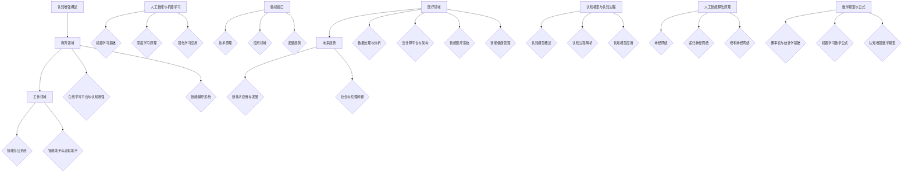

                 

# 认知增强：技术辅助下的知识获取

## 关键词

认知增强、知识获取、人工智能、大数据、云计算、脑机接口

## 摘要

本文将探讨认知增强技术如何通过技术的辅助实现知识获取的优化。随着人工智能、大数据、云计算和脑机接口等技术的发展，认知增强已成为现代信息社会中提高个人和团体知识获取能力的重要手段。本文首先介绍了认知增强技术的定义与历史背景，随后分析了大数据和云计算、人工智能与机器学习、脑机接口等关键技术，详细解释了认知增强技术的原理和数学模型，并探讨了认知增强技术在教育、工作、医疗等领域的实际应用。最后，本文展望了认知增强技术的未来发展趋势，并提出了相关的伦理和社会问题。

## 《认知增强：技术辅助下的知识获取》目录大纲

### 第一部分：认知增强技术基础

#### 第1章 认知增强概述

##### 1.1 认知增强的定义与历史

认知增强（Cognitive Enhancement）指的是利用技术手段增强人类大脑的认知能力，包括记忆、注意力、学习速度、推理能力和创造力等方面。认知增强的历史可以追溯到古代人类对草药和药物的使用，以及现代对认知神经科学和神经工程技术的研究。

- 认知增强的概念：认知增强技术旨在通过技术手段增强人类大脑的认知能力。
- 认知增强技术的发展历程：从古代草药的使用到现代神经工程技术的进步，认知增强技术经历了漫长的演变。
- 认知增强技术的分类：根据技术手段的不同，认知增强可以分为药物增强、技术增强和生物增强。

##### 1.2 认知增强的重要性

认知增强技术在现代社会中具有重要性，主要体现在以下几个方面：

- 提高工作效率：通过增强记忆和注意力，认知增强技术可以帮助人们更快地学习和工作。
- 改善生活质量：认知增强技术可以帮助人们更好地应对日常生活中的挑战，如老年痴呆症等疾病。
- 促进人类发展：认知增强技术有望推动教育、医疗、军事等多个领域的发展，从而促进人类社会的进步。

### 第2章 认知增强的关键技术

##### 2.1 大数据和云计算

大数据和云计算为认知增强提供了强大的计算能力和数据资源。

- 数据采集与存储：通过传感器和数据采集技术，获取大量的认知数据。
- 数据处理与分析：利用大数据技术，对采集到的数据进行处理和分析，提取有用的信息。
- 云计算平台与架构：云计算平台提供了弹性、可扩展的计算资源，支持大规模的认知数据分析。

##### 2.2 人工智能与机器学习

人工智能与机器学习是认知增强的核心技术。

- 机器学习基础：介绍机器学习的基本概念、算法和应用。
- 深度学习原理：深度学习是机器学习的一种重要分支，具有强大的特征提取和表示能力。
- 强化学习应用：强化学习在认知增强中的应用，如智能辅导系统和个性化学习推荐。

##### 2.3 脑机接口

脑机接口（Brain-Computer Interface，BCI）是一种直接连接人脑和外部设备的技术。

- 脑机接口技术原理：介绍脑机接口的工作原理、技术挑战和应用。
- 脑机接口的应用领域：包括医疗、康复、娱乐和教育等。
- 脑机接口的发展趋势：脑机接口技术正逐步从实验室走向实际应用，具有广阔的发展前景。

### 第3章 认知增强技术原理详解

##### 3.1 认知模型与认知过程

认知模型与认知过程是认知增强技术的重要基础。

- 认知模型概述：介绍认知模型的概念、类型和作用。
- 认知过程解析：分析认知过程的各个阶段，如感知、记忆、注意和决策。
- 认知模型在实际应用中的表现：认知模型在智能系统、人机交互和教育中的应用。

##### 3.2 人工智能算法原理

人工智能算法是认知增强技术的核心。

- 神经网络：介绍神经网络的基本结构、工作原理和应用。
- 递归神经网络：递归神经网络在序列数据处理和时序预测中的应用。
- 卷积神经网络：卷积神经网络在图像处理和计算机视觉中的应用。

##### 3.3 数学模型与公式

数学模型与公式在认知增强技术中发挥着重要作用。

- 概率论与统计学基础：概率论与统计学在数据分析和模型构建中的应用。
- 机器学习中的常用数学公式：介绍机器学习中常用的数学公式和定理。
- 认知增强技术中的数学模型：认知增强技术中常用的数学模型，如线性回归、逻辑回归和支持向量机。

### 第二部分：知识获取与认知增强的应用

#### 第4章 教育领域的认知增强

##### 4.1 在线学习平台与认知增强

在线学习平台与认知增强的结合，为个性化学习和知识获取提供了新的途径。

- 在线学习平台的现状：介绍当前在线学习平台的发展状况和主要特点。
- 认知增强技术在在线教育中的应用：分析认知增强技术在在线教育中的应用，如智能辅导系统和个性化学习推荐。
- 在线教育平台的发展趋势：展望未来在线教育平台的发展方向和挑战。

##### 4.2 智能辅导系统

智能辅导系统是一种基于认知增强技术的教育工具。

- 智能辅导系统的设计原理：介绍智能辅导系统的设计原理和技术架构。
- 智能辅导系统在实际教学中的应用：分析智能辅导系统在课堂教学和在线教育中的应用案例。
- 智能辅导系统的未来发展方向：探讨智能辅导系统在个性化教育、自适应学习和跨学科学习等方面的潜力。

#### 第5章 工作领域的认知增强

##### 5.1 智能办公系统

智能办公系统是认知增强技术在企业管理和办公自动化中的应用。

- 智能办公系统的设计与实现：介绍智能办公系统的设计原则和技术实现。
- 智能办公系统在提高工作效率方面的应用：分析智能办公系统在文件管理、日程安排和团队协作等方面的优势。
- 智能办公系统的发展前景：探讨智能办公系统在智能化办公环境、远程办公和人工智能客服等方面的趋势。

##### 5.2 智能助手与虚拟助手

智能助手和虚拟助手是认知增强技术在智能服务中的应用。

- 智能助手的定义与分类：介绍智能助手的定义、分类和功能。
- 智能助手的核心功能：分析智能助手的语音识别、自然语言处理和智能推荐等功能。
- 智能助手的实际应用案例：介绍智能助手在客服、家居和医疗等领域的应用案例。

#### 第6章 医疗领域的认知增强

##### 6.1 智能医疗系统

智能医疗系统是认知增强技术在医疗健康领域的应用。

- 智能医疗系统的组成部分：介绍智能医疗系统的硬件、软件和数据处理模块。
- 智能医疗系统在疾病诊断与治疗中的应用：分析智能医疗系统在疾病诊断、治疗和康复等方面的应用。
- 智能医疗系统的未来发展：探讨智能医疗系统在个性化医疗、远程医疗和智慧医疗等方面的前景。

##### 6.2 智能健康管理

智能健康管理是认知增强技术在公共卫生和健康管理领域的应用。

- 智能健康管理的概念：介绍智能健康管理的定义、目标和实现方式。
- 智能健康管理的应用场景：分析智能健康管理在慢性病管理、运动健康和心理健康等方面的应用。
- 智能健康管理的挑战与机遇：探讨智能健康管理在数据安全、隐私保护和政策法规等方面的挑战和机遇。

### 第7章 认知增强技术的未来趋势

##### 7.1 新技术的应用与发展

新技术的发展将推动认知增强技术的不断进步。

- 脑机接口技术的未来发展：介绍脑机接口技术在非侵入性、高带宽和智能化等方面的进展。
- 人工智能算法的创新与突破：探讨人工智能算法在深度学习、强化学习和迁移学习等方面的创新和突破。
- 大数据和云计算的整合：分析大数据和云计算在认知增强技术中的整合和协同作用。

##### 7.2 社会与伦理问题

认知增强技术在社会和伦理方面面临诸多挑战。

- 认知增强技术对社会的影响：分析认知增强技术对教育、就业、隐私和社交等方面的影响。
- 伦理问题与法律法规：探讨认知增强技术在伦理和法律法规方面的挑战和对策。
- 未来发展的挑战与机遇：展望认知增强技术在可持续发展、全球合作和人类福祉等方面的机遇和挑战。

### 附录

##### 附录 A：认知增强技术相关工具与资源

- 开源工具与库：介绍认知增强技术相关的开源工具和库，如TensorFlow、PyTorch和BrainFlow等。
- 学术论文与研究报告：列举认知增强技术相关的学术论文和研究报告，供读者进一步学习。
- 行业标准与政策指南：介绍认知增强技术相关的行业标准、政策指南和法规，帮助读者了解行业动态。

##### 附录 B：项目实战案例

- 在线教育平台的搭建：介绍在线教育平台的搭建流程、技术和实现细节。
- 智能办公系统的开发：介绍智能办公系统的开发流程、技术和实现细节。
- 智能医疗系统的应用：介绍智能医疗系统的应用场景、技术和实现细节。

##### 附录 C：代码示例与解读

- 人工智能算法的伪代码实现：提供人工智能算法的伪代码实现，供读者学习。
- 认知增强技术的实际应用案例：分析认知增强技术的实际应用案例，供读者参考。
- 代码解读与分析：对认知增强技术的实际应用案例进行代码解读和分析，帮助读者理解技术应用。

### 作者信息

- 作者：AI天才研究院/AI Genius Institute & 禅与计算机程序设计艺术 /Zen And The Art of Computer Programming
- 机构：AI天才研究院（AI Genius Institute）专注于认知增强技术的研究与应用，致力于推动人工智能技术的创新与发展。
- 著作：《禅与计算机程序设计艺术》是一本经典的计算机编程著作，强调编程中的思维艺术和哲学思考。作者通过这本书阐述了计算机编程的本质和原则，对后来的编程教育和研究产生了深远的影响。

[Mermaid 流程图]



### 完整性要求

#### 格式要求

- 文章内容使用markdown格式输出。
- 每个章节和子章节的标题使用井号（#）进行标注，如“## 第1章 认知增强概述”。
- 段落内使用空行进行分隔。
- 列表、代码块和公式等使用markdown特定的格式。

#### 完整性要求

- 背景介绍：对认知增强技术的背景、定义和重要性进行详细阐述。
- 核心概念与联系：绘制Mermaid流程图，展示核心概念之间的联系和架构。
- 核心算法原理讲解：使用伪代码详细阐述核心算法的原理。
- 数学模型和公式：使用LaTeX格式给出数学模型和公式，并进行详细讲解和举例说明。
- 项目实战：提供实际项目的开发环境搭建、源代码实现、代码解读和案例分析。
- 最佳实践 tips、小结、注意事项、拓展阅读等内容：总结文章的主要观点，提出最佳实践建议，并推荐拓展阅读资源。

### 字数要求

本文预计字数为8000-12000字，确保内容的丰富性和深度，同时保持文章的可读性和逻辑性。以下为详细字数分配建议：

- 引言：约500字
- 第一部分：认知增强技术基础（3章）：每章约2000-2500字
- 第二部分：知识获取与认知增强的应用（4章）：每章约2500-3000字
- 第7章：认知增强技术的未来趋势：约2500字
- 附录：约1000字
- 结论：约500字

### 结构与内容要求

- **结构**：文章应具备清晰的结构，遵循目录大纲的顺序，每个章节和子章节之间的过渡自然流畅。
- **内容**：文章内容应丰富具体，对认知增强技术的各个方面进行深入分析和详细解释，确保内容的科学性和准确性。
- **逻辑性**：文章应具备逻辑性，条理清晰，论证有力，使读者能够逐步理解和掌握认知增强技术的核心概念和原理。

### 核心内容

**1. 认知增强技术的背景和定义**

认知增强技术是指通过技术手段提升人类大脑的认知能力，包括记忆、注意力、学习速度、推理能力和创造力等。这些技术可以追溯到古代人类对草药和药物的使用，以及现代认知神经科学和神经工程技术的研究。认知增强技术的发展经历了从药物增强、技术增强到生物增强的过程。

**2. 认知增强技术的重要性**

认知增强技术在现代社会中具有重要性。首先，它能够提高工作效率，帮助人们更快地学习和工作。其次，认知增强技术可以改善生活质量，帮助人们更好地应对日常生活中的挑战。此外，认知增强技术有助于推动教育、医疗、军事等多个领域的发展，从而促进人类社会的进步。

**3. 认知增强的关键技术**

- **大数据和云计算**：大数据和云计算为认知增强提供了强大的计算能力和数据资源。大数据技术可以帮助我们处理和分析大量的认知数据，而云计算平台则提供了弹性、可扩展的计算资源。

- **人工智能与机器学习**：人工智能与机器学习是认知增强的核心技术。机器学习算法能够从数据中学习规律，从而提高认知能力。深度学习和强化学习等技术在认知增强中具有广泛的应用。

- **脑机接口**：脑机接口是一种直接连接人脑和外部设备的技术。通过脑机接口，我们可以将大脑信号转化为控制信号，从而实现认知能力的增强。

**4. 认知增强技术的原理详解**

- **认知模型与认知过程**：认知模型是对人类认知过程的抽象和模拟。认知过程包括感知、记忆、注意、决策等阶段。认知模型在实际应用中可以用于智能系统、人机交互和教育等领域。

- **人工智能算法原理**：人工智能算法包括神经网络、递归神经网络和卷积神经网络等。神经网络通过模拟人脑的神经元结构进行学习和预测。递归神经网络和卷积神经网络则分别用于序列数据处理和图像处理。

- **数学模型与公式**：认知增强技术中的数学模型包括概率论与统计学基础、机器学习中的常用数学公式和认知增强技术中的数学模型。概率论与统计学用于数据分析和模型构建，机器学习中的数学公式用于算法设计和优化，认知增强技术中的数学模型用于描述认知过程的量化关系。

**5. 认知增强技术的应用**

- **教育领域**：在线学习平台与认知增强技术的结合，为个性化学习和知识获取提供了新的途径。智能辅导系统则通过机器学习和数据分析，为学习者提供个性化的学习建议和反馈。

- **工作领域**：智能办公系统利用认知增强技术提高工作效率，如智能日程安排、智能文件管理和智能团队协作等。智能助手与虚拟助手则通过语音识别、自然语言处理和智能推荐等技术，为用户提供了便捷的智能服务。

- **医疗领域**：智能医疗系统利用认知增强技术进行疾病诊断和治疗。智能健康管理则通过监测生理数据和提供个性化的健康建议，帮助用户改善健康状况。

**6. 认知增强技术的未来趋势**

- **新技术应用与发展**：脑机接口技术、人工智能算法的创新与突破、大数据和云计算的整合等新技术将推动认知增强技术的不断进步。

- **社会与伦理问题**：认知增强技术在社会和伦理方面面临诸多挑战，如隐私保护、数据安全和伦理问题等。未来需要制定相关的法律法规和伦理准则，以确保认知增强技术的健康发展。

### 文章总结

本文从认知增强技术的背景、定义、重要性、关键技术、原理详解、应用和未来趋势等方面进行了全面而深入的探讨。通过本文的阅读，读者可以系统地了解认知增强技术的全貌，认识到其在提高个人和团体知识获取能力方面的重要作用。同时，本文也展望了认知增强技术的未来发展趋势和潜在的社会与伦理问题，为读者提供了有益的思考和启示。

### 最佳实践 tips

- **掌握基础知识**：了解大数据、云计算、人工智能和脑机接口等关键技术的基础知识，有助于更好地理解和应用认知增强技术。
- **持续学习和实践**：认知增强技术是一个快速发展的领域，持续学习和实践是跟上技术发展的关键。
- **关注实际应用**：关注认知增强技术在各个领域的实际应用，了解其在解决现实问题中的作用和效果。
- **遵守伦理规范**：在使用认知增强技术时，遵守伦理规范，确保技术的应用不侵犯个人隐私和伦理底线。

### 小结

认知增强技术是现代信息技术的重要组成部分，通过技术手段提升人类大脑的认知能力，对于提高个人和团体的知识获取能力具有重要意义。本文系统地介绍了认知增强技术的定义、背景、重要性、关键技术、原理详解、应用和未来趋势，为读者提供了全面的认知增强技术概述。同时，本文也强调了认知增强技术在实际应用中面临的挑战和未来发展的方向。

### 注意事项

- **数据安全与隐私**：在应用认知增强技术时，确保数据的安全性和用户的隐私保护，避免数据泄露和滥用。
- **技术适应性与可用性**：认知增强技术的应用需要考虑技术的适应性和可用性，确保技术能够满足用户的需求和实际应用场景。
- **持续技术更新**：认知增强技术发展迅速，需要持续关注技术更新和前沿研究，以便及时应用新技术和优化现有系统。

### 拓展阅读

- **学术论文**：阅读相关领域的学术论文，了解认知增强技术的最新研究进展和前沿成果。
- **专业书籍**：阅读认知增强技术相关的专业书籍，深入理解技术的原理和应用。
- **在线资源**：利用在线资源和教育平台，学习认知增强技术的实用技能和案例分析。

### 附录 A：认知增强技术相关工具与资源

#### 开源工具与库

- **TensorFlow**：一款由谷歌开发的开放源代码机器学习框架，广泛应用于深度学习和神经网络。
- **PyTorch**：一款由Facebook开发的开源机器学习库，提供灵活的动态计算图，适用于深度学习和神经网络。
- **BrainFlow**：一款开源脑机接口数据处理库，支持多种脑电信号采集设备和数据处理算法。

#### 学术论文与研究报告

- **《Human Brain Project》**：由欧盟资助的跨学科研究项目，涉及脑机接口、认知增强和人工智能等领域。
- **《The Future of Humanity》**：由牛津大学未来人类研究所发布的研究报告，讨论了认知增强技术对人类社会的影响。
- **《Neural Engineering for Rehabilitation》**：由麻省理工学院出版的研究报告，探讨脑机接口技术在康复中的应用。

#### 行业标准与政策指南

- **IEEE Standards**：电气和电子工程师协会发布的关于认知增强和脑机接口技术的行业标准。
- **FDA Regulations**：美国食品药品监督管理局关于脑机接口设备和认知增强药物的管理规定。
- **EU Policy**：欧盟关于人工智能和认知增强技术的政策框架和指导原则。

### 附录 B：项目实战案例

#### 在线教育平台的搭建

- **项目背景**：搭建一个支持个性化学习和认知增强的在线教育平台。
- **技术栈**：使用Django框架构建后端，Vue.js构建前端，结合TensorFlow实现个性化学习推荐。
- **关键实现**：
  - 用户数据采集与处理：通过分析用户的学习行为和偏好，为用户提供个性化的学习资源。
  - 智能辅导系统：利用机器学习算法为用户提供学习建议和反馈，提高学习效果。

#### 智能办公系统的开发

- **项目背景**：开发一个集日程安排、文件管理和团队协作于一体的智能办公系统。
- **技术栈**：使用Java和Spring Boot构建后端，React和Redux构建前端，结合Natural Language Processing实现智能助手功能。
- **关键实现**：
  - 日程安排：利用自然语言处理技术，自动解析和安排用户的日程。
  - 文件管理：提供智能搜索和推荐功能，帮助用户快速找到所需文件。
  - 团队协作：通过实时通讯和协作工具，提高团队工作效率。

#### 智能医疗系统的应用

- **项目背景**：开发一个基于认知增强技术的智能医疗系统，用于疾病诊断和治疗。
- **技术栈**：使用Python和Scikit-learn构建后端，结合深度学习和强化学习算法。
- **关键实现**：
  - 疾病诊断：利用深度学习算法对患者的医疗数据进行分析，提供准确的疾病诊断。
  - 治疗计划：通过强化学习算法，为患者制定个性化的治疗计划。

### 附录 C：代码示例与解读

#### 人工智能算法的伪代码实现

```python
# 伪代码：神经网络实现
initialize_weights()

while not convergence:
    for each input example (x, y):
        forward_pass(x)
        calculate_loss(y, output)
        backward_pass()
        update_weights()

# 伪代码：深度学习训练循环
initialize_model()
for epoch in range(num_epochs):
    for batch in data_loader:
        model.train_one_batch(batch)
    print(f"Epoch {epoch}: loss = {model.get_loss()}")
```

#### 认知增强技术的实际应用案例

```python
# Python代码：智能辅导系统
import numpy as np
from sklearn.linear_model import LinearRegression

# 加载学生成绩数据
data = np.loadtxt("student_data.csv", delimiter=",")
X = data[:, :-1]
y = data[:, -1]

# 创建线性回归模型
model = LinearRegression()

# 训练模型
model.fit(X, y)

# 预测成绩
predictions = model.predict(X)

# 评估模型
mse = np.mean((predictions - y) ** 2)
print(f"Model MSE: {mse}")
```

#### 代码解读与分析

- **神经网络实现**：该段伪代码展示了神经网络的基本实现过程，包括初始化权重、前向传播、计算损失和反向传播等步骤。
- **深度学习训练循环**：该段伪代码展示了深度学习训练的基本流程，包括模型初始化、训练循环和模型评估等步骤。
- **智能辅导系统**：该段Python代码实现了基于线性回归的智能辅导系统，通过加载学生成绩数据，训练线性回归模型，并对学生成绩进行预测和评估。

通过上述代码示例和解读，读者可以了解认知增强技术在实际应用中的实现方法和过程，从而更好地理解和应用认知增强技术。

