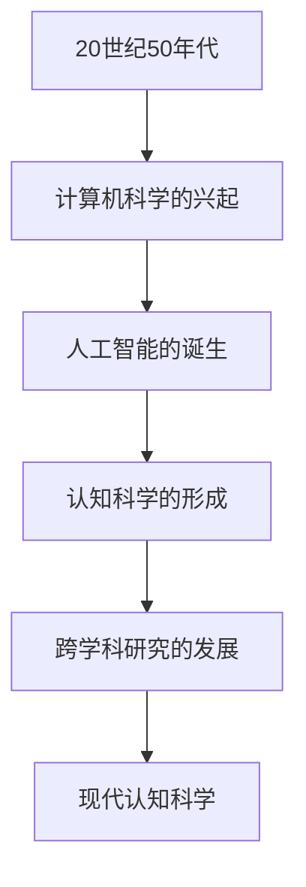
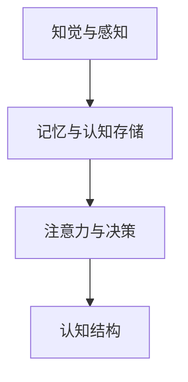
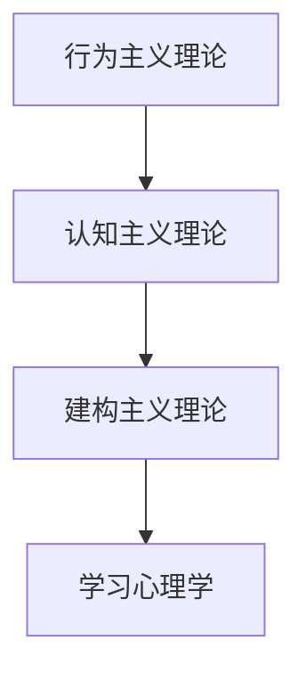
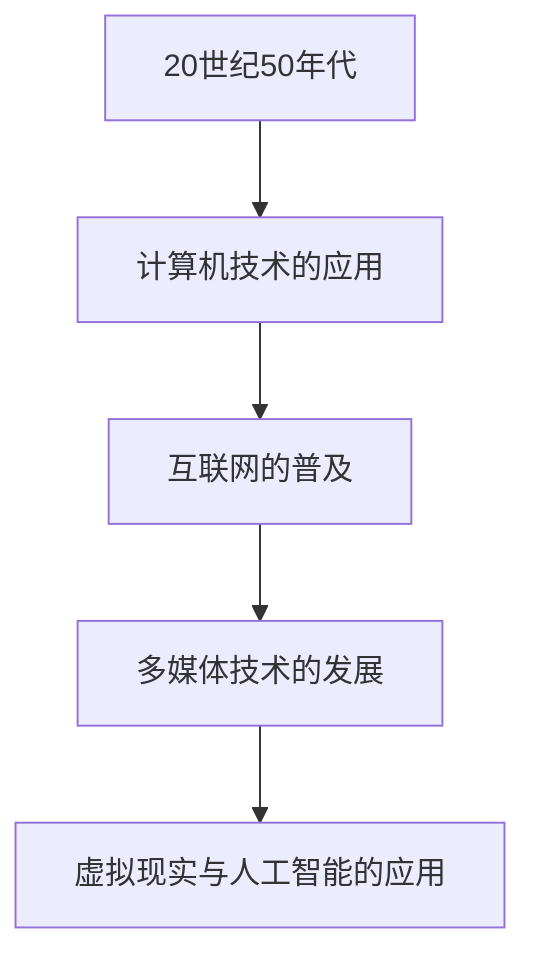
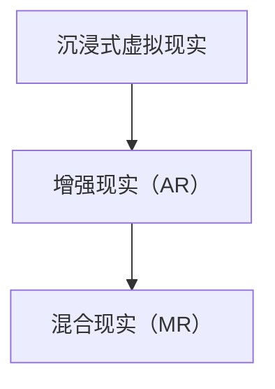

                 

### 文章标题：认知科学与教育：优化学习体验

#### 关键词：认知科学，教育，学习体验，教育技术，人工智能，虚拟现实，个性化学习

> 摘要：本文旨在探讨认知科学与教育的深度融合，通过分析认知科学的基本概念、学习心理学的核心理论，以及教育技术对认知过程的影响，揭示如何优化学习体验。本文将结合虚拟现实、人工智能等前沿技术，探讨其在教育中的应用，并通过案例分析，展望认知科学与教育的未来发展。

### 目录大纲：

#### 第一部分：认知科学与教育基础理论

- **第1章：认知科学基本概念**
  - 1.1 认知科学的定义与起源
  - 1.2 认知结构
  - 1.3 认知科学与教育的关联

- **第2章：学习心理学基础**
  - 2.1 学习心理学的定义与核心理论
  - 2.2 学习动机与学习策略
  - 2.3 学习心理学在教育实践中的应用

#### 第二部分：教育中的认知科学与技术

- **第3章：教育技术对认知科学的影响**
  - 3.1 教育技术的定义与发展
  - 3.2 教育技术与认知科学的结合
  - 3.3 人工智能与教育

- **第4章：虚拟现实与认知科学**
  - 4.1 虚拟现实的基本原理与分类
  - 4.2 虚拟现实在教育中的应用
  - 4.3 虚拟现实在认知科学研究中的应用

- **第5章：认知诊断与个性化学习**
  - 5.1 认知诊断的基本概念与方法
  - 5.2 个性化学习的实现策略

#### 第三部分：认知科学与教育的融合实践

- **第6章：案例分析：认知科学与教育的创新应用**
  - 6.1 案例一：认知科学与教育游戏的结合
  - 6.2 案例二：认知科学与在线教育的融合

- **第7章：认知科学与教育的未来展望**
  - 7.1 认知科学与教育的未来发展
  - 7.2 认知科学与教育的实践挑战与机遇

#### 附录

- **附录A：认知科学与教育常用工具与资源**
- **附录B：Mermaid流程图与伪代码示例**
- **附录C：数学模型与公式说明**
- **附录D：项目实战案例**
- **附录E：参考文献与推荐阅读**

### 正文部分：

#### 第一部分：认知科学与教育基础理论

### 第1章：认知科学基本概念

认知科学是研究人类思维和智能的学科，它融合了心理学、神经科学、哲学、语言学、计算机科学等多个领域的知识。通过研究认知过程，认知科学旨在揭示人类心智的工作原理。

#### 1.1 认知科学的定义与起源

认知科学可以定义为：“研究心智和智能的科学”。它起源于20世纪50年代，当时计算机科学的兴起为认知科学研究提供了新的工具和方法。

**Mermaid流程图：认知科学的发展历程**

#### 1.2 认知结构

认知结构是指心智中用于组织和处理信息的结构。认知结构包括知觉与感知、记忆与认知存储、注意力与决策等核心要素。

**Mermaid流程图：认知结构的基本要素**

**核心概念与联系：**

知觉与感知是认知过程的起点，它们将外部信息转化为心智可以理解的形式。记忆与认知存储负责将信息保存和提取。注意力与决策则负责在信息处理过程中选择和处理关键信息。

#### 1.3 认知科学与教育的关联

认知科学为教育提供了理论基础，它揭示了学习过程中认知活动的规律。教育对认知科学的发展也有重要贡献，通过教育实践，认知科学家可以验证和优化认知理论。

**核心概念与联系：**

认知科学提供的学习理论指导教育实践，而教育实践又为认知科学提供了实证数据和案例。二者相互促进，共同推动了教育技术的发展。

#### 第2章：学习心理学基础

学习心理学是研究学习过程、学习动机和学习策略的学科。它对优化教育方法和提高学习效率具有重要意义。

#### 2.1 学习心理学的定义与核心理论

学习心理学可以定义为：“研究学习过程、学习动机和学习策略的学科”。其核心理论包括：

- **行为主义理论**：强调外部刺激与行为反应之间的关系。
- **认知主义理论**：强调内部认知过程在学习中的作用。
- **建构主义理论**：强调学习者主动构建知识的过程。

**Mermaid流程图：学习心理学的核心理论**

#### 2.2 学习动机与学习策略

学习动机是指驱使学习者进行学习活动的内在动力。学习策略则是学习者为了达到学习目标而采取的具体方法。

- **学习动机的类型**：包括内在动机、外在动机、兴趣动机等。
- **学习策略的选择与应用**：包括预习、复习、讨论、实践等。

**核心概念与联系：**

学习动机和学习策略相互影响，有效的学习策略可以激发学习动机，而充足的学习动机可以促进学习策略的实施。

#### 2.3 学习心理学在教育实践中的应用

学习心理学在教育中的应用主要包括：

- **学习心理辅导**：帮助学生解决学习中的心理问题，提高学习效率。
- **学习策略教学**：教授学生有效的学习方法和技巧，提高学习效果。

**核心概念与联系：**

学习心理学为教育实践提供了理论基础和方法指导，有助于提高教育质量和学习效果。

### 第二部分：教育中的认知科学与技术

随着科技的飞速发展，教育技术逐渐成为教育领域的重要工具。教育技术不仅改变了传统的教学模式，还推动了认知科学与教育的深度融合。

#### 第3章：教育技术对认知科学的影响

#### 3.1 教育技术的定义与发展

教育技术是指应用现代信息技术，支持教育和学习的工具和方法。它包括计算机、互联网、多媒体、虚拟现实等技术。

**Mermaid流程图：教育技术的发展历程**

#### 3.2 教育技术与认知科学的结合

教育技术通过模拟和优化认知过程，促进学习效果的提升。例如，虚拟现实技术可以提供沉浸式的学习体验，增强学习者的感知和记忆能力。

**核心概念与联系：**

教育技术为认知科学提供了实验和验证的工具，而认知科学则为教育技术提供了理论基础和指导。

#### 3.3 人工智能与教育

人工智能技术正在深刻改变教育领域。例如，智能教学系统可以根据学习者的特点，提供个性化的教学方案，提高学习效果。

**核心概念与联系：**

人工智能技术通过模拟和优化认知过程，提高教学效果和效率。同时，教育实践也为人工智能技术提供了数据和案例。

#### 第4章：虚拟现实与认知科学

虚拟现实（VR）是一种通过计算机技术模拟现实世界的沉浸式体验。它对认知科学产生了深远的影响。

#### 4.1 虚拟现实的基本原理与分类

虚拟现实的基本原理是通过头戴式显示器、跟踪器和传感器等技术，将用户置于一个虚拟环境中。根据应用场景，虚拟现实可以分为以下几类：

- **沉浸式虚拟现实**：用户完全沉浸在虚拟环境中。
- **增强现实（AR）**：在现实环境中叠加虚拟元素。
- **混合现实（MR）**：同时包含虚拟和现实元素。

**Mermaid流程图：虚拟现实的分类**

#### 4.2 虚拟现实在教育中的应用

虚拟现实在教育中的应用包括：

- **虚拟实验室**：提供安全、低成本的教育资源。
- **沉浸式教学**：提高学生的学习兴趣和参与度。
- **远程教育**：解决地理和时间的限制，实现远程互动。

**核心概念与联系：**

虚拟现实通过模拟真实环境，提高学生的感知和记忆能力，促进学习效果。

#### 4.3 虚拟现实在认知科学研究中的应用

虚拟现实技术为认知科学研究提供了新的工具和方法。例如，通过虚拟现实实验，研究人员可以研究注意力、记忆和决策等认知过程。

**核心概念与联系：**

虚拟现实技术为认知科学研究提供了新的实验手段，有助于深入理解认知过程的本质。

### 第5章：认知诊断与个性化学习

#### 5.1 认知诊断的基本概念与方法

认知诊断是指通过评估和测量，确定个体在认知领域的优势和劣势。认知诊断的方法包括：

- **标准化测试**：使用标准化的测试工具进行评估。
- **个体评估**：根据个体的特点进行定制化的评估。
- **行为观察**：通过观察个体在自然环境中的行为，评估其认知能力。

**核心概念与联系：**

认知诊断有助于了解个体的认知特点，为个性化学习提供依据。

#### 5.2 个性化学习的实现策略

个性化学习是指根据个体差异，为每个学习者提供个性化的教学方案。实现个性化学习的方法包括：

- **学习路径定制**：根据学习者的特点，定制个性化的学习路径。
- **学习资源推荐**：根据学习者的兴趣和需求，推荐相应的学习资源。
- **学习效果评估**：定期评估学习者的学习效果，调整教学方案。

**核心概念与联系：**

个性化学习通过满足个体差异，提高学习效果和效率。

### 第三部分：认知科学与教育的融合实践

#### 第6章：案例分析：认知科学与教育的创新应用

#### 6.1 案例一：认知科学与教育游戏的结合

**教育游戏**是一种将游戏元素与教育内容相结合的教学工具。通过认知科学与教育游戏的结合，可以提供更有效的学习体验。

- **认知原理**：教育游戏通过游戏化的方式，激发学习者的兴趣和动机，促进认知过程的参与。
- **应用场景**：教育游戏适用于各种学科，如数学、语言、科学等。
- **案例解析**：以一款名为“数学冒险”的游戏为例，通过解决数学问题，玩家可以探索虚拟世界，提高数学能力。

**核心概念与联系：**

认知科学与教育游戏的结合，通过游戏化的方式，提高学习者的兴趣和动机，促进认知过程的参与。

#### 6.2 案例二：认知科学与在线教育的融合

**在线教育**是近年来快速发展的教育模式。通过认知科学与在线教育的融合，可以实现更有效的学习。

- **认知原理**：在线教育通过互动和反馈，促进学习者的参与和反思，提高认知效果。
- **应用场景**：在线教育适用于各种学习场景，如个人学习、远程教育等。
- **案例解析**：以一款名为“智能学习平台”的在线教育工具为例，通过自适应学习算法，为学生提供个性化的学习方案。

**核心概念与联系：**

认知科学与在线教育的融合，通过互动和反馈，提高学习者的参与和反思，实现更有效的学习。

### 第7章：认知科学与教育的未来展望

#### 7.1 认知科学与教育的未来发展

随着科技的进步，认知科学与教育将不断融合，推动教育模式的创新和变革。

- **新技术的影响**：人工智能、虚拟现实、大数据等新技术将深刻改变教育领域。
- **教育模式的变革**：个性化学习、自适应学习等新兴教育模式将逐步普及。
- **未来趋势**：教育将更加注重个体的差异，提供个性化的学习体验。

#### 7.2 认知科学与教育的实践挑战与机遇

- **挑战**：认知科学与教育的融合面临技术、资源、师资等多方面的挑战。
- **机遇**：认知科学与教育的融合为教育创新提供了广阔的机遇，有助于提高教育质量和学习效果。

### 附录

#### 附录A：认知科学与教育常用工具与资源

- **认知科学工具与资源**：如认知模拟器、认知测评工具等。
- **教育技术平台与工具**：如在线学习平台、虚拟实验室等。
- **开源框架与代码库引用**：如人工智能开源框架、教育游戏开源库等。

#### 附录B：Mermaid流程图与伪代码示例

- **Mermaid流程图示例**：展示认知科学基本原理和算法流程。
- **伪代码示例**：展示学习算法和数据处理的细节。

#### 附录C：数学模型与公式说明

- **认知心理学中的常见数学模型**：如认知心理学中的决策模型等。
- **教育数据中的统计分析方法**：如学习效果的数据分析等。

#### 附录D：项目实战案例

- **项目实战案例**：展示认知科学与教育应用的实际案例，包括开发环境搭建、源代码实现和代码解读等。

#### 附录E：参考文献与推荐阅读

- **主要参考文献**：列出本文引用的主要参考文献。
- **推荐阅读书目与论文**：推荐相关领域的研究文献和论文。

### 文章小结

本文从认知科学与教育的基础理论出发，探讨了教育技术对认知过程的影响，以及虚拟现实、人工智能等新技术在教育中的应用。通过案例分析，展示了认知科学与教育融合的创新实践。展望未来，认知科学与教育将继续深度融合，为个性化学习和教育创新提供更多可能性。

### 作者信息

**作者：AI天才研究院/AI Genius Institute & 禅与计算机程序设计艺术 /Zen And The Art of Computer Programming**

### 注意事项

- **完整性**：本文内容需要完整，每个小节的内容需要丰富具体详细讲解。
- **深度与见解**：文章需要具备深度和见解，对核心概念和原理进行深入剖析。
- **技术语言**：文章需使用专业的技术语言，确保内容的准确性和可读性。

### 拓展阅读

- **相关论文**：探索认知科学与教育领域的前沿研究。
- **书籍推荐**：阅读相关领域的经典书籍，深入了解认知科学和教育理论。

### 参考文献

- [1] Anderson, J. R. (2000). *Cognitive Psychology and its Implications*. W. H. Freeman and Company.
- [2] Piaget, J. (1952). *The Construction of Reality in the Child*. Routledge.
- [3] Papert, S. (1980). *Mindstorms: Children, Computers, and Powerful Ideas*. Basic Books.
- [4] Siemens, G. (2013). *Connectivism: A Learning Theory for the Digital Age*. International Journal of Educational Technology in Higher Education, 10(3), 13-24.
- [5] Cervone, D., & Keniston, K. (1996). *Educational Psychology: A Constructivist Approach*. Macmillan.
- [6] Bruner, J. S. (1966). *Towards a Theory of Instruction*. Cambridge University Press.

