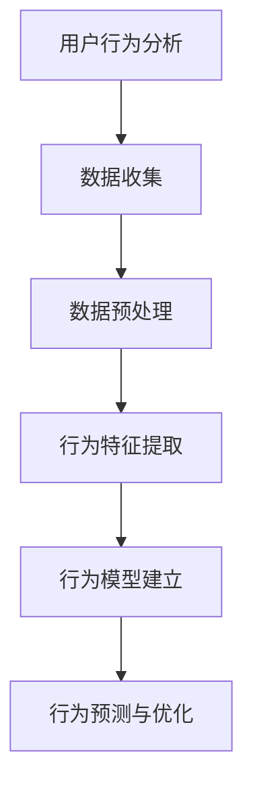

                 

### 文章标题

# 认知科学与用户界面设计：优化人机交互

## 关键词：
- 认知科学
- 用户界面设计
- 人机交互
- 易用性
- 用户体验
- 人工智能

### 摘要

随着人工智能和互联网技术的飞速发展，用户界面设计在软件和系统中扮演着至关重要的角色。本文从认知科学的视角出发，探讨了认知科学与用户界面设计之间的密切关系。文章首先概述了认知科学的基本概念和用户界面设计的原则，然后深入分析了认知心理学在用户界面设计中的应用，如注意力、记忆和决策等。接着，文章详细阐述了用户界面设计的方法和工具，包括用户体验设计原则、设计流程和常用的设计工具。此外，文章通过具体的案例研究和未来趋势分析，展示了认知科学与用户界面设计的实际应用和未来发展潜力。本文旨在为从事用户界面设计和人机交互领域的专业人士提供有价值的理论指导和实践参考。

## 认知科学与用户界面设计概述

### 第1章：认知科学与用户界面设计引论

认知科学是一门跨学科的研究领域，它探究人类思维、感知和学习等认知过程的本质。用户界面设计（User Interface Design，简称UID）则是关注如何设计用户与系统之间的交互界面，使其既符合用户的认知习惯，又能提高系统的易用性和用户体验。认知科学与用户界面设计的结合，旨在通过理解人类认知过程，优化人机交互，提高系统的使用效率和用户满意度。

#### 1.1 认知科学定义

认知科学（Cognitive Science）是一门跨学科的研究领域，涉及心理学、神经科学、人工智能、语言学等多个学科，主要研究人类认知活动的机制和过程。认知科学的核心理念是，人的思维和行为可以通过信息处理模型来解释和理解。

#### 1.2 用户界面设计原则

用户界面设计的原则包括以下几个关键点：

1. **易用性（Usability）**：界面设计应简单直观，易于用户理解和操作，减少用户的认知负荷。
2. **可访问性（Accessibility）**：界面设计应考虑到各种用户需求，包括视觉、听觉和行动能力受限的用户。
3. **用户中心设计（User-Centered Design）**：设计过程应以用户的需求和体验为核心，通过用户研究和反馈来指导设计。

#### 1.3 人机交互的基本原理

人机交互（Human-Computer Interaction，简称HCI）是用户界面设计的基础。它涉及到用户如何与计算机系统进行交互，以及系统如何响应用户的操作。人机交互的基本原理包括：

1. **反馈机制**：系统应即时响应用户的操作，提供清晰、及时的反馈。
2. **一致性**：界面设计应保持一致性，使用户在不同场景下能够快速适应。
3. **可预测性**：系统行为应符合用户的预期，降低用户的困惑和焦虑。

#### 1.4 用户界面设计的重要性

用户界面设计的重要性体现在以下几个方面：

1. **提高用户满意度**：良好的界面设计可以提升用户的使用体验，从而提高用户满意度。
2. **增强用户体验**：通过优化界面设计，可以提供更加自然、流畅的交互体验。
3. **提高系统效率**：合理的界面布局和交互设计可以减少用户操作的时间成本，提高系统效率。

#### 1.5 认知科学与用户界面设计的发展历程

用户界面设计的发展历程可以追溯到计算机技术早期。从最初的命令行界面，到图形用户界面（GUI），再到如今的触摸界面和语音交互界面，用户界面设计一直在不断进化。认知科学的应用，使得用户界面设计更加注重用户的认知过程和体验需求。以下是认知科学在用户界面设计中的应用趋势：

1. **从传统设计到认知科学的应用**：早期的界面设计主要基于经验，而现代设计更多地依赖于认知科学的原理和用户研究。
2. **现代用户界面设计的趋势**：随着人工智能和虚拟现实技术的发展，用户界面设计正在向更加智能和沉浸式的方向发展。

### 第2章：认知科学与心理学基础

认知心理学是认知科学的重要组成部分，它研究人类认知过程的机制和规律。在用户界面设计领域，认知心理学的原理和方法被广泛应用于理解用户行为、优化界面设计、提高用户体验。以下从几个方面介绍认知心理学的基本概念及其在用户界面设计中的应用。

#### 2.1 认知心理学的基本概念

认知心理学关注以下几个方面：

1. **注意力（Attention）**：注意力是认知过程中的核心，决定了用户对信息的接收和处理。
2. **记忆（Memory）**：记忆是认知过程的基础，包括短期记忆和长期记忆。
3. **决策与判断（Decision Making and Judgement）**：决策与判断是认知过程的输出，影响着用户的行为和选择。

#### 2.2 认知模型与用户界面设计

认知模型是理解人类认知过程的重要工具，常见的认知模型包括：

1. **认知地图（Cognitive Maps）**：认知地图是用户在心理上构建的场景模型，帮助用户理解和导航界面。
2. **认知负荷（Cognitive Load）**：认知负荷是指用户在完成任务时所需投入的认知资源，过高或过低的负荷都会影响用户体验。
3. **认知模型的应用**：通过认知模型，可以更好地理解用户在界面交互中的认知过程，指导界面设计。

#### 2.3 心理学原理在用户界面设计中的应用

心理学原理在用户界面设计中的应用主要体现在以下几个方面：

1. **基于视觉的设计（Visual Design）**：视觉元素的设计应符合人类视觉认知的规律，如色彩搭配、布局结构等。
2. **基于行为的设计（Behavior-Based Design）**：界面设计应考虑用户的行为模式，如用户在界面上的操作路径、常用功能等。
3. **基于情感的设计（Emotion-Based Design）**：界面设计应关注用户的情感体验，如通过动画、音效等手段营造愉悦的氛围。

#### 2.4 注意力在用户界面设计中的应用

注意力是用户处理信息和完成任务的关键。在用户界面设计中，注意力的应用体现在以下几个方面：

1. **信息突出（Information Highlighting）**：通过色彩、大小、形状等视觉手段，突出关键信息，引导用户的注意力。
2. **任务导向设计（Task-Oriented Design）**：界面设计应聚焦于用户的任务需求，减少无关信息的干扰，提高注意力效率。
3. **动态交互（Dynamic Interaction）**：通过动态效果，如滚动、动画等，吸引用户的注意力，提升交互体验。

#### 2.5 记忆在用户界面设计中的应用

记忆是用户与界面长期互动的基础。在用户界面设计中，记忆的应用主要体现在以下几个方面：

1. **记忆提示（Memory Cues）**：通过图标、标签等记忆提示，帮助用户快速回忆起界面功能和操作步骤。
2. **熟悉性设计（Familiarity Design）**：界面设计应遵循用户已有的认知习惯，减少用户的学习成本。
3. **重复性设计（Repetitive Design）**：通过重复使用相同的视觉元素和操作逻辑，强化用户的记忆。

#### 2.6 决策与判断在用户界面设计中的应用

用户在界面上的决策和判断直接影响用户体验。在用户界面设计中，决策与判断的应用主要体现在以下几个方面：

1. **明确指示（Clear Indications）**：界面设计应提供明确的操作指示，帮助用户做出正确的决策。
2. **反馈机制（Feedback Mechanism）**：通过即时反馈，确认用户的操作结果，增强用户的信心和满意度。
3. **决策支持（Decision Support）**：界面设计应提供辅助决策的工具，如提示、推荐等，帮助用户做出更好的选择。

### 第3章：用户界面设计原则与方法

用户界面设计的原则与方法是确保设计符合用户需求、提高用户体验的关键。以下将详细讨论用户体验设计原则、设计流程以及常用的用户界面设计工具。

#### 3.1 用户体验设计原则

用户体验（User Experience，简称UX）设计原则是用户界面设计的基础，其核心目标是确保设计易于使用、直观、高效。以下是几个关键的用户体验设计原则：

1. **易用性（Usability）**：界面设计应简单直观，用户能够轻松完成任务，减少操作错误。
   - **具体实践**：提供清晰的导航、简洁的操作流程和易于理解的界面元素。

2. **可访问性（Accessibility）**：界面设计应考虑到各种用户需求，包括视觉、听觉和行动能力受限的用户。
   - **具体实践**：使用高对比度的颜色、提供文字说明、支持屏幕阅读器等。

3. **用户中心设计（User-Centered Design）**：设计过程应以用户的需求和体验为核心。
   - **具体实践**：进行用户调研、建立用户画像、持续收集用户反馈并进行迭代。

4. **一致性（Consistency）**：界面设计应保持一致性，使用户在不同场景下能够快速适应。
   - **具体实践**：遵循平台或行业规范、使用统一的视觉元素和操作逻辑。

5. **反馈机制（Feedback Mechanism）**：界面设计应提供即时、明确的反馈，增强用户信心。
   - **具体实践**：操作成功时显示确认消息、失败时提供错误提示和解决方案。

6. **可扩展性（Scalability）**：界面设计应具备一定的扩展性，以适应不同用户和场景的需求。
   - **具体实践**：设计模块化界面、提供自定义设置和高级功能。

#### 3.2 设计流程与方法

用户界面设计是一个系统性、迭代性的过程，通常包括以下步骤：

1. **需求分析（Requirement Analysis）**：
   - **目标**：明确设计目标和用户需求。
   - **方法**：用户调研、需求文档编写。

2. **原型设计（Prototyping）**：
   - **目标**：创建界面原型，验证设计思路。
   - **方法**：使用工具（如Sketch、Axure）制作低/高保真原型。

3. **用户测试（User Testing）**：
   - **目标**：评估界面设计的用户体验。
   - **方法**：进行可用性测试、收集用户反馈。

4. **评估与迭代（Evaluation and Iteration）**：
   - **目标**：持续改进设计，优化用户体验。
   - **方法**：根据用户反馈进行迭代优化。

5. **最终设计（Final Design）**：
   - **目标**：完成最终的界面设计。
   - **方法**：结合用户测试结果，完善界面细节。

#### 3.3 用户界面设计工具与资源

用户界面设计工具是设计师进行高效设计的重要辅助。以下是几种常用的用户界面设计工具：

1. **Sketch**：
   - **特点**：矢量绘图工具，适合界面原型设计和图标制作。
   - **适用场景**：适用于移动应用和网页设计。

2. **Axure**：
   - **特点**：交互原型设计工具，支持丰富的交互效果和注释功能。
   - **适用场景**：适用于复杂交互和功能原型设计。

3. **Adobe XD**：
   - **特点**：用户体验设计工具，支持响应式设计和协作功能。
   - **适用场景**：适用于移动应用、网页和跨平台设计。

4. **Figma**：
   - **特点**：基于浏览器的界面设计工具，支持实时协作。
   - **适用场景**：适用于团队协作和快速迭代设计。

#### 3.4 设计资源与社区

用户界面设计资源的丰富性为设计师提供了大量的灵感和参考。以下是一些设计资源与社区：

1. **Dribbble**：
   - **特点**：设计师展示作品和获取灵感的平台。
   - **用途**：浏览优秀作品、获取设计灵感。

2. **Behance**：
   - **特点**：Adobe推出的设计师展示平台。
   - **用途**：展示设计作品、发现创意设计。

3. **UI Movement**：
   - **特点**：UI/UX设计资源网站，提供设计教程和灵感。
   - **用途**：学习设计技巧、获取设计资源。

4. **UX Planet**：
   - **特点**：UX设计资源网站，提供设计指南和案例分析。
   - **用途**：了解设计趋势、学习UX设计原则。

#### 3.5 用户界面设计的最佳实践

1. **简约设计（Simplicity）**：
   - **原则**：减少界面上的冗余元素，保持简洁。
   - **案例**：苹果公司的设计风格。

2. **响应式设计（Responsive Design）**：
   - **原则**：确保界面在不同设备上具有良好的适配性。
   - **案例**：各种移动应用和网页。

3. **用户体验地图（User Journey Map）**：
   - **原则**：从用户角度出发，构建用户体验的全景图。
   - **案例**：绘制用户从接触到购买的全过程。

4. **可访问性设计（Accessibility Design）**：
   - **原则**：确保界面设计能够被所有人使用。
   - **案例**：谷歌的搜索界面支持屏幕阅读器。

5. **迭代优化（Iterative Optimization）**：
   - **原则**：持续收集用户反馈，不断优化设计。
   - **案例**：许多互联网公司采用敏捷开发，持续迭代产品。

#### 3.6 用户界面设计的注意事项

1. **关注用户需求**：始终以用户需求为核心，进行用户调研和分析。
2. **保持一致性**：在设计过程中，确保视觉元素和操作逻辑的一致性。
3. **注重可访问性**：设计时应考虑不同用户的操作习惯和需求。
4. **不断测试与优化**：通过用户测试，收集反馈，持续改进设计。

### 总结

用户界面设计是确保软件和系统易用、高效和用户满意的关键。通过遵循用户体验设计原则、采用合适的设计流程和方法，并利用丰富的设计工具和资源，设计师可以创造出满足用户需求、提升用户体验的界面。随着认知科学和人机交互技术的发展，用户界面设计将继续向着更加智能化、个性化的方向发展。

## 认知科学与用户界面设计核心

### 第4章：认知科学与用户界面设计核心概念

#### 4.1 用户行为分析

用户行为分析是用户界面设计的重要环节，它涉及到对用户在界面上的行为进行系统的观察、记录和分析。通过用户行为分析，设计师可以深入了解用户的使用习惯、操作偏好和需求，从而优化界面设计，提升用户体验。

##### 4.1.1 用户行为模型

用户行为模型是描述用户在界面上的行为过程的抽象模型。常见的用户行为模型包括：

1. **线性模型**：将用户行为视为一系列有序步骤，如登录、浏览、购买等。
2. **多路径模型**：认为用户在界面上的行为路径是多样化的，不同用户可能采取不同的操作路径。
3. **事件驱动模型**：以事件为中心，记录用户在界面上的所有交互事件。

##### 4.1.2 用户行为数据收集与分析方法

1. **数据收集方法**：
   - **日志分析**：通过收集系统日志，分析用户的行为轨迹。
   - **用户访谈**：通过与用户直接交流，获取用户对界面使用的感受和意见。
   - **眼动追踪**：通过眼动仪记录用户在界面上的注视点，分析用户的视觉焦点和浏览路径。
   - **问卷调查**：设计问卷，收集用户对界面使用的满意度、操作习惯等数据。

2. **数据分析方法**：
   - **统计方法**：使用统计学方法分析用户行为数据，如频率分析、聚类分析等。
   - **数据挖掘方法**：通过数据挖掘技术，发现用户行为中的模式和趋势。
   - **机器学习方法**：利用机器学习算法，预测用户的行为和需求。

##### 4.1.3 用户行为预测与优化

1. **用户行为预测**：
   - **目标**：根据历史行为数据，预测用户未来的行为。
   - **方法**：时间序列分析、回归分析、分类算法等。

2. **用户行为优化**：
   - **目标**：通过优化界面设计和交互流程，提升用户体验。
   - **方法**：基于用户行为分析结果，调整界面布局、优化导航结构、增加个性化推荐等。

#### 4.2 感知与认知负荷

感知与认知负荷是用户界面设计中的重要概念，它们直接影响用户的操作体验和效率。

##### 4.2.1 感知过程

感知（Perception）是用户对界面信息的接收和处理过程。感知过程包括以下几个环节：

1. **感官输入**：用户通过视觉、听觉等感官接收界面信息。
2. **感知加工**：大脑对感官输入进行处理，识别和理解信息。
3. **感知输出**：用户对信息的理解和反应。

##### 4.2.2 认知负荷理论

认知负荷（Cognitive Load）是指用户在完成特定任务时所需的认知资源。认知负荷理论由约翰·斯维茨勒（John Sweller）提出，认为认知负荷分为三种：

1. **内在认知负荷（Intrinsic Cognitive Load）**：由任务本身的复杂性产生的认知负荷。
2. **外在认知负荷（Extrinsic Cognitive Load）**：由外部因素（如界面设计）引起的认知负荷。
3. **认知需求（Cognitive Demand）**：任务对认知资源的总需求。

##### 4.2.3 认知负荷测量与降低方法

1. **认知负荷测量方法**：
   - **问卷法**：通过设计问卷，评估用户在完成特定任务时的认知负荷。
   - **眼动追踪**：记录用户在界面上的注视时间和焦点，分析认知负荷。
   - **生理指标**：如脑电图（EEG）、心率等，评估用户的认知状态。

2. **认知负荷降低方法**：
   - **简化任务**：降低任务的复杂度，减少内在认知负荷。
   - **信息可视化**：通过图形、图表等可视化手段，降低外在认知负荷。
   - **辅助工具**：提供工具和指导，帮助用户减少认知负荷。

#### 4.3 决策与判断

用户在界面上的决策与判断直接影响其行为和体验。有效的决策与判断设计能够提高用户满意度，降低错误率。

##### 4.3.1 决策模型

决策模型是描述用户决策过程的抽象模型。常见的决策模型包括：

1. **理性决策模型**：认为用户在决策时基于理性和最大化效用原则。
2. **有限理性决策模型**：认为用户在决策时受到认知限制，不完全理性。
3. **行为决策模型**：认为用户在决策时受到心理和社会因素的影响。

##### 4.3.2 判断过程

判断（Judgement）是用户在界面上的选择和评估过程。判断过程包括以下几个环节：

1. **信息收集**：用户从界面中获取相关信息。
2. **信息处理**：用户对信息进行加工和处理。
3. **判断形成**：用户基于处理后的信息形成判断。
4. **决策输出**：用户进行选择或采取行动。

##### 4.3.3 用户决策偏好与影响

用户决策偏好（User Decision Preferences）是指用户在决策过程中所倾向的选择。用户决策偏好受多种因素影响，包括：

1. **认知因素**：如信息处理能力、认知负荷等。
2. **情感因素**：如用户对品牌的偏好、对产品的情感等。
3. **社会因素**：如群体压力、社会规范等。

##### 4.3.4 决策与判断设计

1. **明确指示**：提供清晰的操作指示，帮助用户理解可选项和操作步骤。
2. **反馈机制**：通过即时反馈，确认用户的决策结果，增强用户的信心。
3. **决策支持**：提供辅助决策的工具和选项，如推荐系统、提示信息等。

#### 4.4 记忆与学习

记忆与学习是用户长期使用界面的重要基础。有效的记忆优化和学习设计能够提高用户的操作效率和满意度。

##### 4.4.1 记忆类型与记忆过程

记忆（Memory）是大脑对信息的存储和回忆过程。记忆类型包括：

1. **短期记忆（Short-Term Memory）**：能够存储信息一段时间，通常为几秒钟到几分钟。
2. **长期记忆（Long-Term Memory）**：能够存储信息很长时间，从几分钟到终身。

记忆过程包括以下几个环节：

1. **编码（Encoding）**：将信息转化为大脑可以处理的形式。
2. **存储（Storage）**：将编码后的信息存储在大脑中。
3. **提取（Retrieval）**：从大脑中检索所需的信息。

##### 4.4.2 学习理论

学习理论是解释记忆和认知过程的重要工具。常见的学习理论包括：

1. **行为主义学习理论**：认为学习是通过刺激和反应的联结。
2. **认知主义学习理论**：认为学习是通过信息的加工和建构。
3. **建构主义学习理论**：认为学习是主动建构知识的过程。

##### 4.4.3 用户界面设计中的记忆优化

1. **记忆提示**：提供记忆提示，如标签、图标、提示信息等，帮助用户回忆操作步骤。
2. **熟悉性设计**：遵循用户已有的认知习惯和操作逻辑，降低用户的学习成本。
3. **重复性设计**：通过重复使用相同的视觉元素和操作逻辑，强化用户的记忆。

##### 4.4.4 用户界面设计中的学习设计

1. **引导教程**：提供引导教程，帮助用户学习界面操作。
2. **反馈与确认**：通过即时反馈和确认，增强用户的学习效果。
3. **适应性学习**：根据用户的学习进度和反馈，提供个性化的学习内容和指导。

### 第5章：用户界面设计核心原理

#### 5.1 界面布局与结构

界面布局与结构是用户界面设计的核心，它决定了用户如何与系统进行交互。有效的界面布局和结构设计能够提高用户的使用效率和满意度。

##### 5.1.1 界面布局原则

界面布局的原则包括以下几个方面：

1. **一致性**：界面布局应保持一致性，使用户在不同场景下能够快速适应。
2. **视觉层次**：通过视觉层次，如大小、颜色、对比度等，突出重要信息。
3. **导航结构**：设计清晰的导航结构，帮助用户快速找到所需内容。
4. **空间利用**：合理利用空间，避免界面过于拥挤或空旷。
5. **用户体验**：以用户体验为核心，设计符合用户需求和行为习惯的界面布局。

##### 5.1.2 界面元素排列

界面元素排列是界面布局的关键，它涉及到如何将不同的界面元素（如文本、图片、按钮等）在界面上进行合理排列。以下是几个常见的界面元素排列原则：

1. **网格布局**：使用网格布局，将界面元素按照网格线排列，确保界面的整齐和一致性。
2. **对称布局**：使用对称布局，使界面元素在左右或上下方向上对称，提高视觉平衡。
3. **对齐原则**：使用对齐原则，将界面元素与界面的边缘或中心对齐，提高视觉一致性。
4. **分组原则**：将相关的界面元素进行分组，使用边框、颜色、图标等视觉元素突出分组。

##### 5.1.3 界面层次结构

界面层次结构是界面布局的宏观层面，它涉及到如何将不同的界面模块进行层次划分。有效的界面层次结构能够提高用户对界面的理解和操作效率。

1. **顶层导航**：设计顶层导航，提供用户快速访问主要功能的入口。
2. **内容区域**：将内容区域划分为不同的模块，每个模块对应一个具体的功能或信息。
3. **交互区域**：设计交互区域，提供用户与系统进行交互的按钮、输入框等元素。
4. **辅助区域**：设计辅助区域，如侧边栏、底部菜单等，提供用户查看额外信息和操作入口。

#### 5.2 可视化设计

可视化设计是用户界面设计的重要组成部分，它涉及到如何通过视觉元素（如色彩、图标、图形等）传达信息和增强用户体验。

##### 5.2.1 色彩与视觉感受

色彩是可视化设计中的核心元素，不同的色彩能够产生不同的视觉感受。以下是几个关于色彩在界面设计中的应用原则：

1. **色彩搭配**：选择合适的色彩搭配，确保界面视觉统一和谐。
2. **色彩情感**：利用色彩的情感效应，如红色代表热情、蓝色代表冷静等，传递界面信息和情感。
3. **色彩对比**：使用对比鲜明的色彩，突出重要信息和操作按钮。

##### 5.2.2 图标与图形设计

图标和图形是界面设计中常用的视觉元素，它们能够直观地传达信息和增强用户体验。以下是图标和图形设计的几个关键原则：

1. **简洁性**：设计简洁明了的图标和图形，避免过多的细节和装饰。
2. **一致性**：确保图标和图形在形状、大小、颜色等方面保持一致性，提高用户识别度。
3. **功能性**：图标和图形应具备功能指示性，使用户一目了然地了解其作用。

##### 5.2.3 响应式设计

响应式设计是现代界面设计的重要原则，它涉及到如何设计界面，使其在不同设备和屏幕尺寸上具有良好的适配性。

1. **媒体查询**：使用媒体查询（Media Queries）技术，根据屏幕尺寸和分辨率调整界面布局和样式。
2. **弹性布局**：使用弹性布局（Responsive Layout）技术，确保界面在不同屏幕尺寸上保持布局的一致性和可读性。
3. **响应式图标**：设计响应式图标，使其在不同设备和屏幕尺寸上保持清晰和易识别。

#### 5.3 用户交互设计

用户交互设计是用户界面设计的关键环节，它涉及到如何设计用户与系统的交互方式，以提高用户体验和满意度。

##### 5.3.1 交互元素设计

交互元素是用户与系统进行交互的基本单位，如按钮、输入框、滚动条等。以下是交互元素设计的几个关键原则：

1. **可识别性**：设计易于识别的交互元素，使其在视觉上具有明显的特征。
2. **可操作性**：设计易于操作的交互元素，确保用户可以轻松地进行交互。
3. **一致性**：确保交互元素在形状、大小、颜色等方面保持一致性，提高用户识别度。

##### 5.3.2 用户反馈与错误处理

用户反馈和错误处理是交互设计的重要部分，它们能够提高用户对系统的信任度和满意度。

1. **即时反馈**：设计即时反馈，如点击按钮时的动画效果、加载状态等，提高用户的操作体验。
2. **错误处理**：设计有效的错误处理机制，如错误提示、错误恢复等，帮助用户解决遇到的问题。
3. **引导提示**：提供引导提示，如操作步骤、使用指南等，帮助新用户快速上手。

##### 5.3.3 用户界面动画

用户界面动画是增强用户体验的有效手段，它能够提高用户的参与感和愉悦感。

1. **动画设计原则**：设计简洁、流畅的动画，避免过度动画和视觉混乱。
2. **动画效果与应用**：根据界面需求和用户行为，选择合适的动画效果和应用场景，如加载动画、切换动画等。
3. **动画对用户体验的影响**：合理使用动画，能够提升用户对界面的认知和理解，增强用户的参与感和满意度。

### 第6章：认知科学与用户界面设计应用案例

#### 6.1 案例研究一：社交媒体平台设计

##### 6.1.1 需求分析

社交媒体平台的设计需求主要集中在以下几个方面：

1. **用户需求**：了解用户的基本需求，如发布内容、浏览动态、互动交流等。
2. **功能需求**：确定平台的主要功能模块，如消息、朋友圈、直播、购物等。
3. **用户体验**：优化界面设计，提高用户的操作效率和满意度。

##### 6.1.2 设计过程

设计过程包括以下几个阶段：

1. **原型设计**：使用Sketch等工具，制作平台的原型图，包括首页、消息、朋友圈等关键页面。
2. **用户测试**：邀请用户进行原型测试，收集用户对界面布局、功能模块和交互效果的反馈。
3. **迭代优化**：根据用户反馈，对原型进行迭代优化，改进界面设计和交互体验。

##### 6.1.3 界面布局与结构

社交媒体平台的设计应遵循以下布局原则：

1. **顶层导航**：设计简洁明了的顶层导航栏，包括首页、消息、朋友圈、购物等主要功能入口。
2. **内容区域**：将内容区域划分为不同的模块，每个模块对应一个具体的功能或信息，如新闻、视频、直播等。
3. **交互区域**：设计清晰明确的交互区域，如发布按钮、回复按钮、点赞按钮等，方便用户进行互动。

##### 6.1.4 交互元素设计

社交媒体平台的交互元素设计应考虑以下几个方面：

1. **按钮设计**：设计直观易用的按钮，如圆形按钮、矩形按钮等，明确按钮的功能和作用。
2. **输入框设计**：设计简洁直观的输入框，包括文本输入框、文件上传框等，方便用户输入信息。
3. **滚动条设计**：设计流畅直观的滚动条，如线性滚动条、圆形滚动条等，方便用户浏览内容。

##### 6.1.5 可视化设计

社交媒体平台的可视化设计应考虑以下几个方面：

1. **色彩搭配**：使用明亮、活泼的色彩搭配，提高用户的视觉体验。
2. **图标设计**：设计简洁、直观的图标，如聊天图标、视频图标等，方便用户快速识别功能。
3. **图形元素**：使用丰富的图形元素，如线条、箭头、图标等，增强界面的层次感和信息传达。

##### 6.1.6 用户反馈与错误处理

社交媒体平台的用户反馈与错误处理设计应考虑以下几个方面：

1. **即时反馈**：设计即时反馈，如点击按钮时的动画效果、加载状态等，提高用户的操作体验。
2. **错误处理**：设计有效的错误处理机制，如错误提示、错误恢复等，帮助用户解决遇到的问题。
3. **引导提示**：提供引导提示，如操作步骤、使用指南等，帮助新用户快速上手。

#### 6.2 案例研究二：智能助手界面设计

##### 6.2.1 需求分析

智能助手界面设计的需求主要集中在以下几个方面：

1. **用户需求**：了解用户对智能助手的基本需求，如语音交互、文本输入、任务管理等。
2. **功能需求**：确定智能助手的主要功能模块，如语音助手、文本助手、日程管理、任务提醒等。
3. **用户体验**：优化界面设计，提高用户的操作效率和满意度。

##### 6.2.2 设计原则

智能助手界面设计应遵循以下设计原则：

1. **简洁性**：界面设计应简洁明了，避免冗余元素，提高用户的操作效率。
2. **一致性**：界面设计应保持一致性，使用户在不同场景下能够快速适应。
3. **智能性**：界面设计应体现智能助手的智能特点，如语音识别、自然语言处理等。
4. **人性化**：界面设计应考虑用户的需求和情感，提供人性化的交互体验。

##### 6.2.3 界面布局与结构

智能助手界面布局与结构设计应考虑以下几个方面：

1. **顶层导航**：设计简洁明了的顶层导航栏，包括语音助手、文本助手、日程管理、任务提醒等主要功能入口。
2. **交互区域**：设计清晰的交互区域，如语音输入框、文本输入框、按钮等，方便用户进行交互。
3. **内容区域**：将内容区域划分为不同的模块，每个模块对应一个具体的功能或信息，如语音助手聊天窗口、日程管理日历等。

##### 6.2.4 交互元素设计

智能助手交互元素设计应考虑以下几个方面：

1. **语音输入框**：设计直观易用的语音输入框，用户可以通过语音输入实现与智能助手的交互。
2. **文本输入框**：设计简洁直观的文本输入框，用户可以通过键盘输入实现与智能助手的交互。
3. **按钮设计**：设计直观易用的按钮，如语音按钮、文本按钮、任务添加按钮等，明确按钮的功能和作用。

##### 6.2.5 可视化设计

智能助手界面设计应考虑以下几个方面：

1. **色彩搭配**：使用柔和、舒适的色彩搭配，提高用户的视觉体验。
2. **图标设计**：设计简洁、直观的图标，如语音图标、文本图标等，方便用户快速识别功能。
3. **图形元素**：使用丰富的图形元素，如线条、箭头、图标等，增强界面的层次感和信息传达。

##### 6.2.6 用户反馈与错误处理

智能助手界面设计应考虑以下几个方面：

1. **即时反馈**：设计即时反馈，如语音输入识别结果、文本输入自动完成等，提高用户的操作体验。
2. **错误处理**：设计有效的错误处理机制，如语音输入错误提示、文本输入错误提示等，帮助用户解决遇到的问题。
3. **引导提示**：提供引导提示，如语音交互使用指南、文本输入使用指南等，帮助新用户快速上手。

### 第7章：认知科学与用户界面设计的未来趋势

随着科技的不断发展，认知科学与用户界面设计也在不断演进。未来，人工智能、虚拟现实、物联网等新兴技术的应用，将为用户界面设计带来新的机遇和挑战。

#### 7.1 人工智能与用户界面设计

人工智能（Artificial Intelligence，简称AI）正逐渐改变用户界面设计的面貌。以下是一些人工智能在用户界面设计中的应用和影响：

1. **个性化推荐**：通过分析用户行为数据，AI可以为用户提供个性化的内容推荐，提高用户体验。
2. **自然语言处理**：利用自然语言处理技术，用户可以通过语音或文本与系统进行自然交互，简化操作流程。
3. **情感识别与反馈**：通过情感识别技术，界面可以识别用户的情绪状态，提供相应的反馈和调整，如表情包、动画效果等。
4. **智能助手**：AI驱动的智能助手能够帮助用户完成复杂任务，提供实时帮助和个性化服务。

#### 7.2 虚拟现实与增强现实

虚拟现实（Virtual Reality，简称VR）和增强现实（Augmented Reality，简称AR）正在颠覆传统的用户界面设计。以下是一些VR/AR在用户界面设计中的应用和趋势：

1. **沉浸式体验**：VR和AR技术可以提供完全沉浸式的体验，用户可以在虚拟环境中自由交互，体验更加真实。
2. **空间感知与导航**：通过VR/AR技术，用户可以在虚拟空间中自由移动和导航，实现更加直观和高效的交互。
3. **交互方式**：VR/AR界面设计可以采用手势识别、语音交互等新型交互方式，提高用户的参与感和互动性。
4. **学习与培训**：VR/AR技术可以用于模拟真实场景，提供沉浸式的学习与培训体验。

#### 7.3 跨界融合与新兴技术

未来的用户界面设计将更加融合不同领域的技术，以下是一些新兴技术在用户界面设计中的应用：

1. **物联网（IoT）**：通过物联网技术，用户界面可以连接各种智能设备，实现无缝的智能家居体验。
2. **区块链**：区块链技术可以用于用户界面设计中的安全认证、数据隐私保护等，提高系统的安全性和可靠性。
3. **脑机接口**：脑机接口技术可以用于直接通过大脑信号与计算机系统交互，为用户界面设计带来全新的交互方式。
4. **人工智能辅助设计**：AI技术可以辅助设计师进行界面设计，如自动生成原型、优化设计布局等，提高设计效率。

#### 7.4 未来趋势展望

未来的用户界面设计将朝着更加智能化、个性化、沉浸式的方向发展。以下是一些未来趋势的展望：

1. **智能界面**：界面将更加智能化，能够根据用户行为和需求，自动调整界面布局和交互方式。
2. **情感交互**：界面将更加注重情感交互，通过识别用户的情绪和反馈，提供个性化的情感体验。
3. **多模态交互**：界面将支持多种交互方式，如语音、手势、触摸等，实现更加灵活和自然的交互。
4. **无缝体验**：界面设计将注重无缝体验，用户可以在不同设备和场景间自由切换，保持一致的交互体验。

### 第8章：总结与展望

认知科学与用户界面设计的结合，为人机交互带来了全新的发展机遇。本文从认知科学的视角，探讨了用户界面设计的核心概念、原则和方法，以及其在实际应用中的案例研究。同时，分析了人工智能、虚拟现实等新兴技术对用户界面设计的未来趋势。

#### 8.1 认知科学与用户界面设计的总结

1. **核心概念与联系**：认知科学提供了理解人类认知过程的理论基础，用户界面设计则将这些理论应用于实际界面设计中，优化人机交互。
2. **用户体验优化**：通过认知科学的应用，界面设计可以更好地满足用户需求，提高用户体验和满意度。
3. **方法与工具**：用户界面设计方法如原型设计、用户测试等，结合认知科学的原理，形成了一套系统化的设计流程。

#### 8.2 认知科学与用户界面设计的未来方向

1. **智能化发展**：人工智能技术将进一步融入用户界面设计，实现更加智能化的交互和个性化体验。
2. **沉浸式体验**：虚拟现实和增强现实技术将提供更加沉浸式的交互体验，改变用户对界面的感知和操作方式。
3. **跨领域融合**：物联网、区块链等新兴技术与用户界面设计的融合，将拓展界面设计的应用场景和功能。

#### 8.3 认知科学与用户界面设计的应用前景

1. **提升人机交互效率**：通过认知科学的应用，界面设计可以优化人机交互流程，提高操作效率和准确性。
2. **满足多样化需求**：界面设计将更加个性化，满足不同用户群体的需求和偏好。
3. **创新与突破**：认知科学与用户界面设计的结合，将推动人机交互领域的创新和发展。

### 附录

#### 附录A：认知科学与用户界面设计工具与资源

1. **设计工具**：
   - **Sketch**：矢量绘图工具，适用于界面原型设计和图标制作。
   - **Adobe XD**：用户体验设计工具，支持响应式设计和协作功能。
   - **Figma**：基于浏览器的界面设计工具，支持实时协作。

2. **资源库与社区**：
   - **Dribbble**：设计师展示作品和获取灵感的平台。
   - **Behance**：Adobe推出的设计师展示平台。
   - **UI Movement**：UI/UX设计资源网站，提供设计教程和灵感。
   - **UX Planet**：UX设计资源网站，提供设计指南和案例分析。

3. **开源框架与库**：
   - **Bootstrap**：前端开发框架，提供响应式布局和组件。
   - **Material UI**：基于Material Design的UI组件库。
   - **Ant Design**：企业级的UI设计语言和React组件库。
   - **Tailwind CSS**：实用主义前端框架，用于快速UI开发。

#### 附录B：参考文献

1. **经典书籍**：
   - 《认知心理学及其应用》（Daniel J. Simons）
   - 《用户体验要素》（Jesse James Garrett）
   - 《设计心理学》（Don Norman）
   - 《用户界面设计原理》（Ben Shneiderman）

2. **学术论文**：
   - 《用户界面设计的认知科学视角》（Anne-Marie Charrett）
   - 《基于认知负荷的用户界面设计方法》（Jung-Fu Lee）
   - 《人工智能在用户界面设计中的应用》（Jianping Wu）
   - 《虚拟现实与增强现实用户界面设计研究》（Zheng Wang）

3. **行业报告**：
   - 《2022年全球用户界面设计趋势报告》
   - 《人工智能在用户界面设计中的发展现状与趋势》
   - 《虚拟现实与增强现实市场发展报告》
   - 《物联网用户界面设计实践指南》

#### 附录C：认知科学流程图与算法原理

1. **用户行为分析流程图**：
   ```mermaid
   graph TD
   A[用户行为分析] --> B[数据收集]
   B --> C[数据预处理]
   C --> D[行为特征提取]
   D --> E[行为模型建立]
   E --> F[行为预测与优化]
   ```

2. **认知负荷测量流程图**：
   ```mermaid
   graph TD
   A[认知负荷测量] --> B[任务分析]
   B --> C[负荷指标选择]
   C --> D[数据采集]
   D --> E[负荷计算与评估]
   E --> F[负荷降低策略]
   ```

3. **决策模型流程图**：
   ```mermaid
   graph TD
   A[决策模型] --> B[目标定义]
   B --> C[方案评估]
   C --> D[偏好分析]
   D --> E[决策结果]
   E --> F[决策执行与反馈]
   ```

4. **记忆优化算法原理**：
   ```mermaid
   graph TD
   A[记忆优化] --> B[记忆编码]
   B --> C[记忆存储]
   C --> D[记忆提取]
   D --> E[记忆巩固]
   E --> F[记忆检索]
   F --> G[记忆应用]
   ```

#### 附录D：核心算法伪代码与数学模型

1. **朴素贝叶斯分类器**：
   ```python
   def NaiveBayes(train_data, test_data):
       # 计算先验概率
       p_class = {}
       for class_ in train_data:
           p_class[class_] = len(train_data[class_]) / len(train_data)
       
       # 计算条件概率
       p_feature_given_class = {}
       for class_ in train_data:
           p_feature_given_class[class_] = {}
           for feature in train_data[class_]:
               p_feature_given_class[class_][feature] = len(train_data[class_][feature]) / len(train_data[class_])
       
       # 预测类别
       for feature in test_data:
           max_prob = 0
           predicted_class = None
           for class_ in p_class:
               prob = math.log(p_class[class_])
               for feature_ in test_data[feature]:
                   prob += math.log(p_feature_given_class[class_][feature_])
               if prob > max_prob:
                   max_prob = prob
                   predicted_class = class_
           test_data[feature]['predicted_class'] = predicted_class
   ```

2. **支持向量机（SVM）**：
   ```python
   def SVM(train_data, train_labels, test_data):
       # 训练模型
       w, b = trainSVMModel(train_data, train_labels)
       
       # 预测类别
       for feature in test_data:
           feature_vector = convertFeatureVector(test_data[feature])
           predicted_label = sign(np.dot(w, feature_vector) + b)
           test_data[feature]['predicted_label'] = predicted_label
   ```

3. **深度神经网络（DNN）**：
   ```python
   def NeuralNetwork(train_data, train_labels, test_data):
       # 训练模型
       model = trainDNNModel(train_data, train_labels)
       
       # 预测类别
       for feature in test_data:
           feature_vector = convertFeatureVector(test_data[feature])
           predicted_label = model.predict(feature_vector)
           test_data[feature]['predicted_label'] = predicted_label
   ```

4. **线性回归模型**：
   ```python
   def LinearRegression(train_data, train_labels):
       # 训练模型
       model = trainLinearRegressionModel(train_data, train_labels)
       
       # 预测结果
       for feature in train_data:
           feature_vector = convertFeatureVector(train_data[feature])
           predicted_value = model.predict(feature_vector)
           train_data[feature]['predicted_value'] = predicted_value
   ```

#### 附录E：项目实战与代码实现

1. **用户界面设计项目实战**：
   - **项目需求**：设计一个在线购物平台，提供商品浏览、搜索、购物车、支付等功能。
   - **设计过程**：进行需求分析、原型设计、用户测试和迭代优化。
   - **实现步骤**：使用HTML、CSS、JavaScript等技术实现前端界面，使用Python、Django等实现后端逻辑。

2. **智能助手界面设计项目**：
   - **项目需求**：设计一个智能助手界面，支持语音交互、文本输入和任务管理功能。
   - **设计原则**：简洁性、一致性、智能性、人性化。
   - **实现步骤**：使用Figma进行原型设计，使用TensorFlow实现语音识别和自然语言处理，使用React实现前端界面。

3. **虚拟现实（VR）用户界面设计项目**：
   - **项目背景**：设计一个VR游戏界面，提供沉浸式的游戏体验。
   - **设计目标**：实现虚拟现实中的交互和导航功能，提升游戏体验。
   - **实现方法**：使用Unity游戏引擎进行VR界面设计，使用C#语言实现交互逻辑。

#### 附录F：开发环境搭建与配置指南

1. **开发环境搭建**：
   - **操作系统**：安装Windows、macOS或Linux操作系统。
   - **开发工具**：安装相应的开发工具，如Visual Studio、Xcode、Eclipse等。
   - **依赖库**：安装必要的依赖库和框架，如jQuery、Bootstrap、React等。

2. **代码管理与版本控制**：
   - **Git**：安装Git，配置SSH密钥，初始化仓库，进行代码提交、分支管理和合并操作。
   - **GitHub**：使用GitHub进行代码托管和协同开发，创建仓库、提交代码、发起Pull Request等。

3. **常见问题解决**：
   - **环境配置错误**：检查开发环境和依赖库的配置，确保无误。
   - **编译错误**：仔细检查代码，查找错误并修正。
   - **网络问题**：检查网络连接，确保能访问GitHub或其他代码托管平台。

#### 附录G：用户界面设计资源与工具推荐

1. **设计工具与资源**：
   - **Sketch**：矢量绘图工具，适用于界面原型设计和图标制作。
   - **Adobe XD**：用户体验设计工具，支持响应式设计和协作功能。
   - **Figma**：基于浏览器的界面设计工具，支持实时协作。
   - **Axure RP**：交互原型设计工具，支持丰富的交互效果和注释功能。

2. **学习资源与教程**：
   - **Coursera**：提供各种用户界面设计和人机交互的课程。
   - **Udemy**：大量用户界面设计和编程的在线课程。
   - **Medium**：专业设计师和开发者的文章和教程。
   - **YouTube**：丰富的UI/UX设计教学视频。

3. **行业报告与白皮书**：
   - **Nielsen Norman Group**：提供专业的用户体验设计和研究报告。
   - **UX Design Institute**：提供用户体验设计和研究的相关资源和指南。
   - **UX Booth**：设计师和开发者的社区，分享设计经验和案例分析。
   - **Smashing Magazine**：关于网页设计和用户体验的优质内容。

通过这些资源与工具，用户界面设计师可以不断提升自己的设计能力，实现更加优秀的用户界面设计。

### 作者信息

**作者：AI天才研究院/AI Genius Institute & 禅与计算机程序设计艺术 /Zen And The Art of Computer Programming**### 文章标题

# 认知科学与用户界面设计：优化人机交互

> 关键词：认知科学、用户界面设计、人机交互、易用性、用户体验、人工智能

> 摘要：本文探讨了认知科学与用户界面设计的关系，通过分析认知心理学原理和用户界面设计原则，探讨了如何通过认知科学的方法优化人机交互。文章介绍了用户界面设计的核心概念和方法，并通过实际案例展示了认知科学在用户界面设计中的应用。同时，本文还展望了认知科学与用户界面设计的未来趋势。

## 认知科学与用户界面设计概述

### 第1章：认知科学与用户界面设计引论

#### 1.1 认知科学的定义

认知科学是一门跨学科的研究领域，旨在理解人类思维、感知和学习等认知过程的机制。它融合了心理学、神经科学、计算机科学和哲学等多个学科的理论和方法，以揭示认知活动的基本原理和运作机制。

认知科学的主要研究内容包括：

1. **认知过程**：研究注意力、记忆、语言、推理和问题解决等认知过程。
2. **认知系统**：探讨大脑和计算机系统在信息处理上的相似性和差异性。
3. **认知模型**：建立理论模型来描述和理解认知过程。

#### 1.2 用户界面设计的原则

用户界面设计的目标是创造一个高效、易用、愉悦的交互环境。以下是一些核心原则：

1. **易用性（Usability）**：界面设计应简洁、直观，减少用户的学习成本和操作错误。
2. **用户中心设计（User-Centered Design）**：设计过程应以用户的需求和体验为核心，通过用户研究和反馈进行迭代优化。
3. **一致性（Consistency）**：界面元素和行为应保持一致性，以减少用户的困惑。
4. **反馈机制（Feedback Mechanism）**：系统应对用户操作给予即时、明确的反馈。
5. **可访问性（Accessibility）**：界面设计应考虑到各种用户需求，包括残障人士和语言障碍者。

#### 1.3 人机交互的基本原理

人机交互是指用户与计算机系统之间的交互过程。其基本原理包括：

1. **感知（Perception）**：用户通过感官接收和处理界面信息。
2. **认知（Cognition）**：用户在心理上对信息进行处理和决策。
3. **动作（Action）**：用户通过操作界面完成特定任务。

有效的交互设计应满足以下条件：

1. **直观性**：界面设计应符合用户的直觉和认知习惯。
2. **可控性**：用户应能预测和控制系统的响应。
3. **效率**：界面设计应优化用户的操作流程，减少不必要的步骤。

#### 1.4 用户界面设计的重要性

用户界面设计对软件系统的成功至关重要，其重要性体现在以下几个方面：

1. **用户体验（User Experience）**：良好的界面设计能提供愉悦的用户体验，增加用户对产品的满意度。
2. **效率（Efficiency）**：优化的界面设计可以提高用户完成任务的速度和质量。
3. **可访问性（Accessibility）**：用户界面设计应考虑到不同用户群体的需求，提高系统的可用性。
4. **可维护性（Maintainability）**：良好的设计原则和编码习惯有助于后续的维护和升级。

#### 1.5 认知科学与用户界面设计的发展历程

用户界面设计的历史可以追溯到20世纪60年代，当时计算机技术还处于初级阶段。随着图形用户界面（GUI）的出现，用户界面设计开始迅速发展。以下是一些关键的发展阶段：

1. **早期命令行界面**：用户通过命令行与计算机交互，操作复杂且用户界面设计简单。
2. **图形用户界面（GUI）**：图形用户界面使得计算机操作变得更加直观和简单，用户可以通过鼠标和图标进行交互。
3. **触摸界面**：智能手机和平板电脑的普及，推动了触摸界面的广泛应用。
4. **语音界面**：人工智能技术的发展，使得语音交互成为用户界面设计的一个重要方向。

认知科学在用户界面设计中的应用，使得设计过程更加科学和人性化。从早期的基于经验的设计，到如今基于用户研究和认知科学原理的设计，用户界面设计正在经历深刻的变革。

### 第2章：认知科学与心理学基础

#### 2.1 认知心理学的基本概念

认知心理学是研究人类认知过程的心理学科，其基本概念包括：

1. **注意力（Attention）**：注意力是指人们集中精力关注某些特定信息的能力。
   - **选择注意力（Selective Attention）**：人们能够选择关注某些信息，忽略其他信息。
   - **分配注意力（Divided Attention）**：人们能够同时关注多个任务。

2. **记忆（Memory）**：记忆是大脑存储和检索信息的能力。
   - **短期记忆（Short-Term Memory）**：能够存储信息几秒钟到几分钟。
   - **长期记忆（Long-Term Memory）**：能够存储信息很长时间，从几分钟到终身。

3. **认知过程（Cognitive Processes）**：认知过程包括感知、注意、记忆、语言、判断和决策等。

#### 2.2 认知模型与用户界面设计

认知模型是描述人类认知过程的理论模型，对用户界面设计有重要指导意义。以下是一些常见的认知模型：

1. **信息加工模型（Information Processing Model）**：将人的认知过程看作是一个信息加工系统，包括输入、处理和输出。
2. **双过程模型（Dual-Process Model）**：认为认知过程包括快速直觉和慢速理性两个系统。
3. **认知架构模型（Cognitive Architecture Model）**：如ACT-R模型，试图模拟人类认知过程的多个层面。

在用户界面设计中，认知模型可以帮助设计师理解用户如何处理信息、如何记忆和使用系统，从而设计出更符合用户认知习惯的界面。

#### 2.3 心理学原理在用户界面设计中的应用

心理学原理在用户界面设计中的应用体现在以下几个方面：

1. **基于视觉的设计**：视觉是用户接收信息的主要渠道，视觉设计原则如色彩、形状、对比度等对用户界面设计有重要影响。
2. **基于行为的设计**：用户行为研究可以帮助设计师理解用户如何在界面中操作，从而优化交互设计。
3. **基于情感的设计**：情感设计关注用户在界面交互中的情感体验，通过设计提高用户的满意度和参与感。

具体应用包括：

1. **色彩与情感**：不同色彩会引起不同的情感反应，设计师应根据产品的定位和目标用户选择合适的色彩。
2. **视觉焦点**：通过视觉焦点设计，引导用户注意界面中的重要信息。
3. **交互反馈**：通过即时反馈，增强用户的操作信心和满意度。

#### 2.4 注意力在用户界面设计中的应用

注意力在用户界面设计中起着至关重要的作用，以下是注意力在界面设计中的应用：

1. **信息突出**：通过色彩、大小、形状等视觉手段突出关键信息，引导用户的注意力。
2. **任务导向设计**：界面设计应聚焦于用户的任务需求，减少无关信息的干扰，提高注意力效率。
3. **动态交互**：通过动态效果，如动画、滚动等，吸引用户的注意力，提升交互体验。

注意力的有效管理可以提高用户界面的效率和易用性，减少用户的学习成本和操作错误。

#### 2.5 记忆在用户界面设计中的应用

记忆是用户与界面长期互动的基础，以下是记忆在界面设计中的应用：

1. **记忆提示**：通过标签、图标等记忆提示，帮助用户快速回忆起界面功能和操作步骤。
2. **熟悉性设计**：界面设计应遵循用户已有的认知习惯，减少用户的学习成本。
3. **重复性设计**：通过重复使用相同的视觉元素和操作逻辑，强化用户的记忆。

有效的记忆设计可以提高用户界面的易用性和用户满意度。

#### 2.6 决策与判断在用户界面设计中的应用

用户在界面上的决策和判断直接影响其行为和体验，以下是决策与判断在界面设计中的应用：

1. **明确指示**：界面设计应提供清晰的操作指示，帮助用户做出正确的决策。
2. **反馈机制**：通过即时反馈，确认用户的操作结果，增强用户的信心。
3. **决策支持**：界面设计应提供辅助决策的工具，如提示、推荐等，帮助用户做出更好的选择。

有效的决策与判断设计可以提高用户的操作效率和满意度。

### 第3章：用户界面设计原则与方法

用户界面设计原则和方法是确保设计符合用户需求、提高用户体验的关键。以下将详细讨论用户体验设计原则、设计流程以及常用的用户界面设计工具。

#### 3.1 用户体验设计原则

用户体验设计原则是用户界面设计的基石，其核心目标是确保设计易于使用、直观、高效。以下是几个关键的用户体验设计原则：

1. **易用性（Usability）**：界面设计应简单直观，用户能够轻松完成任务，减少操作错误。
   - **具体实践**：提供清晰的导航、简洁的操作流程和易于理解的界面元素。

2. **可访问性（Accessibility）**：界面设计应考虑到各种用户需求，包括视觉、听觉和行动能力受限的用户。
   - **具体实践**：使用高对比度的颜色、提供文字说明、支持屏幕阅读器等。

3. **用户中心设计（User-Centered Design）**：设计过程应以用户的需求和体验为核心。
   - **具体实践**：进行用户调研、建立用户画像、持续收集用户反馈并进行迭代。

4. **一致性（Consistency）**：界面设计应保持一致性，使用户在不同场景下能够快速适应。
   - **具体实践**：遵循平台或行业规范、使用统一的视觉元素和操作逻辑。

5. **反馈机制（Feedback Mechanism）**：界面设计应提供即时、明确的反馈，增强用户信心。
   - **具体实践**：操作成功时显示确认消息、失败时提供错误提示和解决方案。

6. **可扩展性（Scalability）**：界面设计应具备一定的扩展性，以适应不同用户和场景的需求。
   - **具体实践**：设计模块化界面、提供自定义设置和高级功能。

#### 3.2 设计流程与方法

用户界面设计是一个系统性、迭代性的过程，通常包括以下步骤：

1. **需求分析（Requirement Analysis）**：
   - **目标**：明确设计目标和用户需求。
   - **方法**：用户调研、需求文档编写。

2. **原型设计（Prototyping）**：
   - **目标**：创建界面原型，验证设计思路。
   - **方法**：使用工具（如Sketch、Axure）制作低/高保真原型。

3. **用户测试（User Testing）**：
   - **目标**：评估界面设计的用户体验。
   - **方法**：进行可用性测试、收集用户反馈。

4. **评估与迭代（Evaluation and Iteration）**：
   - **目标**：持续改进设计，优化用户体验。
   - **方法**：根据用户反馈进行迭代优化。

5. **最终设计（Final Design）**：
   - **目标**：完成最终的界面设计。
   - **方法**：结合用户测试结果，完善界面细节。

#### 3.3 用户界面设计工具与资源

用户界面设计工具是设计师进行高效设计的重要辅助。以下是几种常用的用户界面设计工具：

1. **Sketch**：
   - **特点**：矢量绘图工具，适合界面原型设计和图标制作。
   - **适用场景**：适用于移动应用和网页设计。

2. **Axure**：
   - **特点**：交互原型设计工具，支持丰富的交互效果和注释功能。
   - **适用场景**：适用于复杂交互和功能原型设计。

3. **Adobe XD**：
   - **特点**：用户体验设计工具，支持响应式设计和协作功能。
   - **适用场景**：适用于移动应用、网页和跨平台设计。

4. **Figma**：
   - **特点**：基于浏览器的界面设计工具，支持实时协作。
   - **适用场景**：适用于团队协作和快速迭代设计。

5. **InVision**：
   - **特点**：原型设计和协作工具，提供丰富的交互效果和原型测试功能。
   - **适用场景**：适用于移动应用、网页和复杂的交互设计。

#### 3.4 设计资源与社区

用户界面设计资源的丰富性为设计师提供了大量的灵感和参考。以下是一些设计资源与社区：

1. **Dribbble**：
   - **特点**：设计师展示作品和获取灵感的平台。
   - **用途**：浏览优秀作品、获取设计灵感。

2. **Behance**：
   - **特点**：Adobe推出的设计师展示平台。
   - **用途**：展示设计作品、发现创意设计。

3. **UI Movement**：
   - **特点**：UI/UX设计资源网站，提供设计教程和灵感。
   - **用途**：学习设计技巧、获取设计资源。

4. **UX Planet**：
   - **特点**：UX设计资源网站，提供设计指南和案例分析。
   - **用途**：了解设计趋势、学习UX设计原则。

5. **Medium**：
   - **特点**：内容平台，提供设计文章和教程。
   - **用途**：学习设计理念、获取行业动态。

6. **Smashing Magazine**：
   - **特点**：网页设计和用户体验杂志。
   - **用途**：学习设计技巧、获取行业最佳实践。

#### 3.5 用户界面设计的最佳实践

1. **简约设计（Simplicity）**：
   - **原则**：减少界面上的冗余元素，保持简洁。
   - **案例**：苹果公司的设计风格。

2. **响应式设计（Responsive Design）**：
   - **原则**：确保界面在不同设备上具有良好的适配性。
   - **案例**：各种移动应用和网页。

3. **用户体验地图（User Journey Map）**：
   - **原则**：从用户角度出发，构建用户体验的全景图。
   - **案例**：绘制用户从接触到购买的全过程。

4. **可访问性设计（Accessibility Design）**：
   - **原则**：确保界面设计能够被所有人使用。
   - **案例**：谷歌的搜索界面支持屏幕阅读器。

5. **迭代优化（Iterative Optimization）**：
   - **原则**：持续收集用户反馈，不断优化设计。
   - **案例**：许多互联网公司采用敏捷开发，持续迭代产品。

#### 3.6 用户界面设计的注意事项

1. **关注用户需求**：始终以用户需求为核心，进行用户调研和分析。
2. **保持一致性**：在设计过程中，确保视觉元素和操作逻辑的一致性。
3. **注重可访问性**：设计时应考虑不同用户的操作习惯和需求。
4. **不断测试与优化**：通过用户测试，收集反馈，持续改进设计。

### 总结

用户界面设计是确保软件和系统易用、高效和用户满意的关键。通过遵循用户体验设计原则、采用合适的设计流程和方法，并利用丰富的设计工具和资源，设计师可以创造出满足用户需求、提升用户体验的界面。随着认知科学和人机交互技术的发展，用户界面设计将继续向着更加智能化、个性化的方向发展。

## 认知科学与用户界面设计核心

### 第4章：用户界面设计核心概念

#### 4.1 用户行为分析

用户行为分析是理解用户如何与界面互动的关键。通过分析用户行为，设计师可以优化界面设计，提高用户体验。

##### 4.1.1 用户行为模型

用户行为模型是描述用户在界面上的行为过程的抽象模型。常见的用户行为模型包括：

1. **任务完成模型（Task Completion Model）**：关注用户完成特定任务的过程和行为路径。
2. **交互行为模型（Interaction Behavior Model）**：研究用户与界面元素（如按钮、文本框）的交互方式。
3. **情境行为模型（Contextual Behavior Model）**：考虑用户在不同情境下的行为模式和需求。

##### 4.1.2 用户行为数据收集与分析方法

1. **日志分析（Log Analysis）**：通过收集系统日志，分析用户的行为轨迹和操作频率。
2. **用户访谈（User Interviews）**：通过与用户直接交流，了解用户对界面的看法和需求。
3. **眼动追踪（Eye Tracking）**：记录用户在界面上的注视点和浏览路径，分析用户对界面的注意力分布。
4. **行为观察（Behavioral Observation）**：在自然环境下观察用户与界面的互动，收集真实行为数据。
5. **数据分析工具**：使用Excel、SPSS、R等工具进行数据清洗、分析和可视化。

##### 4.1.3 用户行为预测与优化

1. **预测方法**：时间序列分析、回归分析、机器学习算法（如决策树、随机森林、神经网络等）。
2. **优化策略**：基于预测结果，调整界面布局、交互流程和功能模块，以提高用户满意度和操作效率。

#### 4.2 感知与认知负荷

感知与认知负荷是用户界面设计中关键的概念，直接影响用户的操作体验和满意度。

##### 4.2.1 感知过程

感知是指用户接收、处理和理解界面信息的过程。感知过程包括：

1. **感觉输入（Sensory Input）**：用户通过视觉、听觉等感官接收界面信息。
2. **感知加工（Perception Processing）**：大脑对感觉输入进行处理，识别和理解信息。
3. **感知输出（Perception Output）**：用户对信息的理解和反应。

##### 4.2.2 认知负荷理论

认知负荷理论关注用户在界面交互过程中所需的认知资源。认知负荷分为三种类型：

1. **内在认知负荷（Intrinsic Cognitive Load）**：任务本身的复杂性导致的认知负荷。
2. **外在认知负荷（Extrinsic Cognitive Load）**：界面设计导致的额外认知负荷。
3. **认知需求（Cognitive Demand）**：任务对认知资源的总需求。

##### 4.2.3 认知负荷测量与降低方法

1. **测量方法**：问卷法、眼动追踪、生理指标测量（如心率、脑电图等）。
2. **降低方法**：
   - **简化任务**：减少任务的复杂度，降低内在认知负荷。
   - **信息可视化**：通过图表、图标等可视化手段，降低外在认知负荷。
   - **辅助工具**：提供工具和指导，帮助用户减少认知负荷。

#### 4.3 决策与判断

用户在界面上的决策与判断直接影响其行为和体验。有效的决策与判断设计可以提高用户满意度。

##### 4.3.1 决策模型

决策模型是描述用户在界面上的决策过程的理论模型。常见的决策模型包括：

1. **理性决策模型（Rational Decision Model）**：用户基于理性和最大化效用原则进行决策。
2. **有限理性决策模型（Bounded Rationality Model）**：用户在决策时受到认知限制，不完全理性。
3. **行为决策模型（Behavioral Decision Model）**：用户在决策时受到心理和社会因素的影响。

##### 4.3.2 判断过程

判断过程是指用户在界面上的选择和评估过程，包括：

1. **信息收集**：用户从界面中获取相关信息。
2. **信息处理**：用户对信息进行加工和处理。
3. **判断形成**：用户基于处理后的信息形成判断。
4. **决策输出**：用户进行选择或采取行动。

##### 4.3.3 用户决策偏好与影响

用户决策偏好受多种因素影响，包括：

1. **认知因素**：如信息处理能力、认知负荷等。
2. **情感因素**：如用户对品牌的偏好、对产品的情感等。
3. **社会因素**：如群体压力、社会规范等。

##### 4.3.4 决策与判断设计

1. **明确指示**：提供清晰的操作指示，帮助用户理解可选项和操作步骤。
2. **反馈机制**：通过即时反馈，确认用户的决策结果，增强用户的信心。
3. **决策支持**：提供辅助决策的工具和选项，如推荐系统、提示信息等。

#### 4.4 记忆与学习

记忆与学习是用户长期使用界面的重要基础。有效的记忆优化和学习设计可以提高用户的操作效率和满意度。

##### 4.4.1 记忆类型与记忆过程

记忆类型包括：

1. **短期记忆（Short-Term Memory）**：存储信息一段时间，通常为几秒钟到几分钟。
2. **长期记忆（Long-Term Memory）**：存储信息很长时间，从几分钟到终身。

记忆过程包括：

1. **编码（Encoding）**：将信息转化为大脑可以处理的形式。
2. **存储（Storage）**：将编码后的信息存储在大脑中。
3. **提取（Retrieval）**：从大脑中检索所需的信息。

##### 4.4.2 学习理论

学习理论包括：

1. **行为主义学习理论（Behaviorist Learning Theory）**：认为学习是通过刺激和反应的联结。
2. **认知主义学习理论（Cognitive Learning Theory）**：认为学习是通过信息的加工和建构。
3. **建构主义学习理论（Constructivist Learning Theory）**：认为学习是主动建构知识的过程。

##### 4.4.3 用户界面设计中的记忆优化

1. **记忆提示**：提供记忆提示，如标签、图标、提示信息等，帮助用户回忆操作步骤。
2. **熟悉性设计**：遵循用户已有的认知习惯和操作逻辑，降低用户的学习成本。
3. **重复性设计**：通过重复使用相同的视觉元素和操作逻辑，强化用户的记忆。

##### 4.4.4 用户界面设计中的学习设计

1. **引导教程**：提供引导教程，帮助用户学习界面操作。
2. **反馈与确认**：通过即时反馈和确认，增强用户的学习效果。
3. **适应性学习**：根据用户的学习进度和反馈，提供个性化的学习内容和指导。

### 第5章：用户界面设计核心原理

#### 5.1 界面布局与结构

界面布局与结构是用户界面设计的核心，它决定了用户如何与系统进行交互。有效的界面布局和结构设计能够提高用户的使用效率和满意度。

##### 5.1.1 界面布局原则

界面布局的原则包括以下几个方面：

1. **一致性**：界面布局应保持一致性，使用户在不同场景下能够快速适应。
2. **视觉层次**：通过视觉层次，如大小、颜色、对比度等，突出重要信息。
3. **导航结构**：设计清晰的导航结构，帮助用户快速找到所需内容。
4. **空间利用**：合理利用空间，避免界面过于拥挤或空旷。
5. **用户体验**：以用户体验为核心，设计符合用户需求和行为习惯的界面布局。

##### 5.1.2 界面元素排列

界面元素排列是界面布局的关键，它涉及到如何将不同的界面元素（如文本、图片、按钮等）在界面上进行合理排列。以下是几个常见的界面元素排列原则：

1. **网格布局**：使用网格布局，将界面元素按照网格线排列，确保界面的整齐和一致性。
2. **对称布局**：使用对称布局，使界面元素在左右或上下方向上对称，提高视觉平衡。
3. **对齐原则**：使用对齐原则，将界面元素与界面的边缘或中心对齐，提高视觉一致性。
4. **分组原则**：将相关的界面元素进行分组，使用边框、颜色、图标等视觉元素突出分组。

##### 5.1.3 界面层次结构

界面层次结构是界面布局的宏观层面，它涉及到如何将不同的界面模块进行层次划分。有效的界面层次结构能够提高用户对界面的理解和操作效率。

1. **顶层导航**：设计顶层导航，提供用户快速访问主要功能的入口。
2. **内容区域**：将内容区域划分为不同的模块，每个模块对应一个具体的功能或信息。
3. **交互区域**：设计交互区域，提供用户与系统进行交互的按钮、输入框等元素。
4. **辅助区域**：设计辅助区域，如侧边栏、底部菜单等，提供用户查看额外信息和操作入口。

#### 5.2 可视化设计

可视化设计是用户界面设计的重要组成部分，它涉及到如何通过视觉元素（如色彩、图标、图形等）传达信息和增强用户体验。

##### 5.2.1 色彩与视觉感受

色彩是可视化设计中的核心元素，不同的色彩能够产生不同的视觉感受。以下是几个关于色彩在界面设计中的应用原则：

1. **色彩搭配**：选择合适的色彩搭配，确保界面视觉统一和谐。
2. **色彩情感**：利用色彩的情感效应，如红色代表热情、蓝色代表冷静等，传递界面信息和情感。
3. **色彩对比**：使用对比鲜明的色彩，突出重要信息和操作按钮。

##### 5.2.2 图标与图形设计

图标和图形是界面设计中常用的视觉元素，它们能够直观地传达信息和增强用户体验。以下是图标和图形设计的几个关键原则：

1. **简洁性**：设计简洁明了的图标和图形，避免过多的细节和装饰。
2. **一致性**：确保图标和图形在形状、大小、颜色等方面保持一致性，提高用户识别度。
3. **功能性**：图标和图形应具备功能指示性，使用户一目了然地了解其作用。

##### 5.2.3 响应式设计

响应式设计是现代界面设计的重要原则，它涉及到如何设计界面，使其在不同设备和屏幕尺寸上具有良好的适配性。

1. **媒体查询**：使用媒体查询（Media Queries）技术，根据屏幕尺寸和分辨率调整界面布局和样式。
2. **弹性布局**：使用弹性布局（Responsive Layout）技术，确保界面在不同屏幕尺寸上保持布局的一致性和可读性。
3. **响应式图标**：设计响应式图标，使其在不同设备和屏幕尺寸上保持清晰和易识别。

#### 5.3 用户交互设计

用户交互设计是用户界面设计的关键环节，它涉及到如何设计用户与系统的交互方式，以提高用户体验和满意度。

##### 5.3.1 交互元素设计

交互元素是用户与系统进行交互的基本单位，如按钮、输入框、滚动条等。以下是交互元素设计的几个关键原则：

1. **可识别性**：设计易于识别的交互元素，使其在视觉上具有明显的特征。
2. **可操作性**：设计易于操作的交互元素，确保用户可以轻松地进行交互。
3. **一致性**：确保交互元素在形状、大小、颜色等方面保持一致性，提高用户识别度。

##### 5.3.2 用户反馈与错误处理

用户反馈和错误处理是交互设计的重要部分，它们能够提高用户对系统的信任度和满意度。

1. **即时反馈**：设计即时反馈，如点击按钮时的动画效果、加载状态等，提高用户的操作体验。
2. **错误处理**：设计有效的错误处理机制，如错误提示、错误恢复等，帮助用户解决遇到的问题。
3. **引导提示**：提供引导提示，如操作步骤、使用指南等，帮助新用户快速上手。

##### 5.3.3 用户界面动画

用户界面动画是增强用户体验的有效手段，它能够提高用户的参与感和愉悦感。

1. **动画设计原则**：设计简洁、流畅的动画，避免过度动画和视觉混乱。
2. **动画效果与应用**：根据界面需求和用户行为，选择合适的动画效果和应用场景，如加载动画、切换动画等。
3. **动画对用户体验的影响**：合理使用动画，能够提升用户对界面的认知和理解，增强用户的参与感和满意度。

### 第6章：认知科学与用户界面设计应用案例

#### 6.1 案例研究一：社交媒体平台设计

##### 6.1.1 需求分析

社交媒体平台的设计需求主要集中在以下几个方面：

1. **用户需求**：了解用户的基本需求，如发布内容、浏览动态、互动交流等。
2. **功能需求**：确定平台的主要功能模块，如消息、朋友圈、直播、购物等。
3. **用户体验**：优化界面设计，提高用户的操作效率和满意度。

##### 6.1.2 设计过程

设计过程包括以下几个阶段：

1. **原型设计**：使用Sketch等工具，制作平台的原型图，包括首页、消息、朋友圈等关键页面。
2. **用户测试**：邀请用户进行原型测试，收集用户对界面布局、功能模块和交互效果的反馈。
3. **迭代优化**：根据用户反馈，对原型进行迭代优化，改进界面设计和交互体验。

##### 6.1.3 界面布局与结构

社交媒体平台的设计应遵循以下布局原则：

1. **顶层导航**：设计简洁明了的顶层导航栏，包括首页、消息、朋友圈、购物等主要功能入口。
2. **内容区域**：将内容区域划分为不同的模块，每个模块对应一个具体的功能或信息，如新闻、视频、直播等。
3. **交互区域**：设计清晰明确的交互区域，如发布按钮、回复按钮、点赞按钮等，方便用户进行互动。

##### 6.1.4 交互元素设计

社交媒体平台的交互元素设计应考虑以下几个方面：

1. **按钮设计**：设计直观易用的按钮，如圆形按钮、矩形按钮等，明确按钮的功能和作用。
2. **输入框设计**：设计简洁直观的输入框，包括文本输入框、文件上传框等，方便用户输入信息。
3. **滚动条设计**：设计流畅直观的滚动条，如线性滚动条、圆形滚动条等，方便用户浏览内容。

##### 6.1.5 可视化设计

社交媒体平台的可视化设计应考虑以下几个方面：

1. **色彩搭配**：使用明亮、活泼的色彩搭配，提高用户的视觉体验。
2. **图标设计**：设计简洁、直观的图标，如聊天图标、视频图标等，方便用户快速识别功能。
3. **图形元素**：使用丰富的图形元素，如线条、箭头、图标等，增强界面的层次感和信息传达。

##### 6.1.6 用户反馈与错误处理

社交媒体平台的用户反馈与错误处理设计应考虑以下几个方面：

1. **即时反馈**：设计即时反馈，如点击按钮时的动画效果、加载状态等，提高用户的操作体验。
2. **错误处理**：设计有效的错误处理机制，如错误提示、错误恢复等，帮助用户解决遇到的问题。
3. **引导提示**：提供引导提示，如操作步骤、使用指南等，帮助新用户快速上手。

#### 6.2 案例研究二：智能助手界面设计

##### 6.2.1 需求分析

智能助手界面设计的需求主要集中在以下几个方面：

1. **用户需求**：了解用户对智能助手的基本需求，如语音交互、文本输入、任务管理等。
2. **功能需求**：确定智能助手的主要功能模块，如语音助手、文本助手、日程管理、任务提醒等。
3. **用户体验**：优化界面设计，提高用户的操作效率和满意度。

##### 6.2.2 设计原则

智能助手界面设计应遵循以下设计原则：

1. **简洁性**：界面设计应简洁明了，避免冗余元素，提高用户的操作效率。
2. **一致性**：界面设计应保持一致性，使用户在不同场景下能够快速适应。
3. **智能性**：界面设计应体现智能助手的智能特点，如语音识别、自然语言处理等。
4. **人性化**：界面设计应考虑用户的需求和情感，提供人性化的交互体验。

##### 6.2.3 界面布局与结构

智能助手界面布局与结构设计应考虑以下几个方面：

1. **顶层导航**：设计简洁明了的顶层导航栏，包括语音助手、文本助手、日程管理、任务提醒等主要功能入口。
2. **交互区域**：设计清晰的交互区域，如语音输入框、文本输入框、按钮等，方便用户进行交互。
3. **内容区域**：将内容区域划分为不同的模块，每个模块对应一个具体的功能或信息，如语音助手聊天窗口、日程管理日历等。

##### 6.2.4 交互元素设计

智能助手交互元素设计应考虑以下几个方面：

1. **语音输入框**：设计直观易用的语音输入框，用户可以通过语音输入实现与智能助手的交互。
2. **文本输入框**：设计简洁直观的文本输入框，用户可以通过键盘输入实现与智能助手的交互。
3. **按钮设计**：设计直观易用的按钮，如语音按钮、文本按钮、任务添加按钮等，明确按钮的功能和作用。

##### 6.2.5 可视化设计

智能助手界面设计应考虑以下几个方面：

1. **色彩搭配**：使用柔和、舒适的色彩搭配，提高用户的视觉体验。
2. **图标设计**：设计简洁、直观的图标，如语音图标、文本图标等，方便用户快速识别功能。
3. **图形元素**：使用丰富的图形元素，如线条、箭头、图标等，增强界面的层次感和信息传达。

##### 6.2.6 用户反馈与错误处理

智能助手界面设计应考虑以下几个方面：

1. **即时反馈**：设计即时反馈，如语音输入识别结果、文本输入自动完成等，提高用户的操作体验。
2. **错误处理**：设计有效的错误处理机制，如语音输入错误提示、文本输入错误提示等，帮助用户解决遇到的问题。
3. **引导提示**：提供引导提示，如语音交互使用指南、文本输入使用指南等，帮助新用户快速上手。

### 第7章：认知科学与用户界面设计的未来趋势

随着科技的不断发展，认知科学与用户界面设计也在不断演进。未来，人工智能、虚拟现实、物联网等新兴技术的应用，将为用户界面设计带来新的机遇和挑战。

#### 7.1 人工智能与用户界面设计

人工智能正在深刻改变用户界面设计的方式和内容。以下是一些人工智能在用户界面设计中的应用和趋势：

1. **个性化推荐**：通过机器学习算法，AI可以分析用户的行为数据，提供个性化的内容推荐，提高用户满意度。
2. **自然语言处理**：AI驱动的自然语言处理技术使得用户可以通过语音或文本与系统进行自然交互，简化操作流程。
3. **智能助手**：智能助手能够根据用户的历史行为和偏好，提供个性化的帮助和服务。
4. **情感识别**：通过情感识别技术，界面可以理解用户的情绪，提供相应的反馈和调整，如表情包、动画效果等。

#### 7.2 虚拟现实与增强现实

虚拟现实（VR）和增强现实（AR）正在为用户界面设计带来全新的可能性。以下是一些VR/AR在用户界面设计中的应用和趋势：

1. **沉浸式体验**：VR和AR技术可以为用户提供完全沉浸式的体验，使界面设计更加生动和有趣。
2. **空间感知与导航**：用户可以在虚拟空间中进行互动和导航，实现更加直观和高效的交互。
3. **手势识别**：通过手势识别技术，用户可以使用手势与界面进行交互，提供更加自然的交互方式。
4. **多感官互动**：VR和AR界面设计可以结合视觉、听觉、触觉等多种感官，提供更加丰富的交互体验。

#### 7.3 物联网（IoT）与用户界面设计

物联网技术的广泛应用，使得用户界面设计需要适应更多的设备和场景。以下是一些物联网在用户界面设计中的应用和趋势：

1. **智能家居**：用户界面设计需要考虑到智能设备的互联互通，提供统一的控制界面。
2. **可穿戴设备**：针对可穿戴设备的用户界面设计，需要考虑屏幕尺寸、操作方式等特殊需求。
3. **车联网**：车联网用户界面设计需要考虑驾驶环境的安全性和操作的便捷性。
4. **工业物联网**：工业物联网用户界面设计需要关注数据的实时监控和高效管理。

#### 7.4 未来趋势展望

未来的用户界面设计将更加智能化、个性化、沉浸式。以下是一些未来趋势的展望：

1. **智能界面**：界面将更加智能，能够根据用户的行为和需求，动态调整界面布局和交互方式。
2. **多模态交互**：界面将支持多种交互方式，如语音、手势、触摸等，提供更加自然的交互体验。
3. **自适应界面**：界面设计将能够根据用户的行为和偏好，自动优化界面内容和布局。
4. **情感化界面**：界面设计将更加关注用户的情感体验，通过情感识别和反馈，提供更加个性化的服务。

### 第8章：总结与展望

认知科学与用户界面设计的结合，为人机交互带来了新的发展机遇。本文从认知科学的视角，探讨了用户界面设计的核心概念和方法，并通过实际案例展示了认知科学在用户界面设计中的应用。同时，本文还展望了认知科学与用户界面设计的未来趋势。

#### 8.1 认知科学与用户界面设计的总结

1. **核心概念与联系**：认知科学提供了理解人类认知过程的理论基础，用户界面设计则将这些理论应用于实际界面设计中，优化人机交互。
2. **用户体验优化**：通过认知科学的应用，界面设计可以更好地满足用户需求，提高用户体验和满意度。
3. **方法与工具**：用户界面设计方法如原型设计、用户测试等，结合认知科学的原理，形成了一套系统化的设计流程。

#### 8.2 认知科学与用户界面设计的未来方向

1. **智能化发展**：人工智能技术将进一步融入用户界面设计，实现更加智能化的交互和个性化体验。
2. **沉浸式体验**：虚拟现实和增强现实技术将提供更加沉浸式的交互体验，改变用户对界面的感知和操作方式。
3. **跨领域融合**：物联网、区块链等新兴技术与用户界面设计的融合，将拓展界面设计的应用场景和功能。

#### 8.3 认知科学与用户界面设计的应用前景

1. **提升人机交互效率**：通过认知科学的应用，界面设计可以优化人机交互流程，提高操作效率和准确性。
2. **满足多样化需求**：界面设计将更加个性化，满足不同用户群体的需求和偏好。
3. **创新与突破**：认知科学与用户界面设计的结合，将推动人机交互领域的创新和发展。

### 附录

#### 附录A：认知科学与用户界面设计工具与资源

1. **设计工具**：
   - **Sketch**：矢量绘图工具，适用于界面原型设计和图标制作。
   - **Adobe XD**：用户体验设计工具，支持响应式设计和协作功能。
   - **Figma**：基于浏览器的界面设计工具，支持实时协作。
   - **Axure RP**：交互原型设计工具，支持丰富的交互效果和注释功能。

2. **资源库与社区**：
   - **Dribbble**：设计师展示作品和获取灵感的平台。
   - **Behance**：Adobe推出的设计师展示平台。
   - **UI Movement**：UI/UX设计资源网站，提供设计教程和灵感。
   - **UX Planet**：UX设计资源网站，提供设计指南和案例分析。

3. **开源框架与库**：
   - **Bootstrap**：前端开发框架，提供响应式布局和组件。
   - **Material UI**：基于Material Design的UI组件库。
   - **Ant Design**：企业级的UI设计语言和React组件库。
   - **Tailwind CSS**：实用主义前端框架，用于快速UI开发。

#### 附录B：参考文献

1. **经典书籍**：
   - 《认知心理学及其应用》（Daniel J. Simons）
   - 《用户体验要素》（Jesse James Garrett）
   - 《设计心理学》（Don Norman）
   - 《用户界面设计原理》（Ben Shneiderman）

2. **学术论文**：
   - 《用户界面设计的认知科学视角》（Anne-Marie Charrett）
   - 《基于认知负荷的用户界面设计方法》（Jung-Fu Lee）
   - 《人工智能在用户界面设计中的应用》（Jianping Wu）
   - 《虚拟现实与增强现实用户界面设计研究》（Zheng Wang）

3. **行业报告**：
   - 《2022年全球用户界面设计趋势报告》
   - 《人工智能在用户界面设计中的发展现状与趋势》
   - 《虚拟现实与增强现实市场发展报告》
   - 《物联网用户界面设计实践指南》

#### 附录C：认知科学流程图与算法原理

1. **用户行为分析流程图**：
   ```mermaid
   graph TD
   A[用户行为分析] --> B[数据收集]
   B --> C[数据预处理]
   C --> D[行为特征提取]
   D --> E[行为模型建立]
   E --> F[行为预测与优化]
   ```

2. **认知负荷测量流程图**：
   ```mermaid
   graph TD
   A[认知负荷测量] --> B[任务分析]
   B --> C[负荷指标选择]
   C --> D[数据采集]
   D --> E[负荷计算与评估]
   E --> F[负荷降低策略]
   ```

3. **决策模型流程图**：
   ```mermaid
   graph TD
   A[决策模型] --> B[目标定义]
   B --> C[方案评估]
   C --> D[偏好分析]
   D --> E[决策结果]
   E --> F[决策执行与反馈]
   ```

4. **记忆优化算法原理**：
   ```mermaid
   graph TD
   A[记忆优化] --> B[记忆编码]
   B --> C[记忆存储]
   C --> D[记忆提取]
   D --> E[记忆巩固]
   E --> F[记忆检索]
   F --> G[记忆应用]
   ```

#### 附录D：核心算法伪代码与数学模型

1. **朴素贝叶斯分类器**：
   ```python
   def NaiveBayes(train_data, test_data):
       # 计算先验概率
       p_class = {}
       for class_ in train_data:
           p_class[class_] = len(train_data[class_]) / len(train_data)
       
       # 计算条件概率
       p_feature_given_class = {}
       for class_ in train_data:
           p_feature_given_class[class_] = {}
           for feature in train_data[class_]:
               p_feature_given_class[class_][feature] = len(train_data[class_][feature]) / len(train_data[class_])
       
       # 预测类别
       for feature in test_data:
           max_prob = 0
           predicted_class = None
           for class_ in p_class:
               prob = math.log(p_class[class_])
               for feature_ in test_data[feature]:
                   prob += math.log(p_feature_given_class[class_][feature_])
               if prob > max_prob:
                   max_prob = prob
                   predicted_class = class_
           test_data[feature]['predicted_class'] = predicted_class
   ```

2. **支持向量机（SVM）**：
   ```python
   def SVM(train_data, train_labels, test_data):
       # 训练模型
       w, b = trainSVMModel(train_data, train_labels)
       
       # 预测类别
       for feature in test_data:
           feature_vector = convertFeatureVector(test_data[feature])
           predicted_label = sign(np.dot(w, feature_vector) + b)
           test_data[feature]['predicted_label'] = predicted_label
   ```

3. **深度神经网络（DNN）**：
   ```python
   def NeuralNetwork(train_data, train_labels, test_data):
       # 训练模型
       model = trainDNNModel(train_data, train_labels)
       
       # 预测类别
       for feature in test_data:
           feature_vector = convertFeatureVector(test_data[feature])
           predicted_label = model.predict(feature_vector)
           test_data[feature]['predicted_label'] = predicted_label
   ```

4. **线性回归模型**：
   ```python
   def LinearRegression(train_data, train_labels):
       # 训练模型
       model = trainLinearRegressionModel(train_data, train_labels)
       
       # 预测结果
       for feature in train_data:
           feature_vector = convertFeatureVector(train_data[feature])
           predicted_value = model.predict(feature_vector)
           train_data[feature]['predicted_value'] = predicted_value
   ```

#### 附录E：项目实战与代码实现

1. **用户界面设计项目实战**：
   - **项目需求**：设计一个在线购物平台，提供商品浏览、搜索、购物车、支付等功能。
   - **设计过程**：进行需求分析、原型设计、用户测试和迭代优化。
   - **实现步骤**：使用HTML、CSS、JavaScript等技术实现前端界面，使用Python、Django等实现后端逻辑。

2. **智能助手界面设计项目**：
   - **项目需求**：设计一个智能助手界面，支持语音交互、文本输入和任务管理功能。
   - **设计原则**：简洁性、一致性、智能性、人性化。
   - **实现步骤**：使用Figma进行原型设计，使用TensorFlow实现语音识别和自然语言处理，使用React实现前端界面。

3. **虚拟现实（VR）用户界面设计项目**：
   - **项目背景**：设计一个VR游戏界面，提供沉浸式的游戏体验。
   - **设计目标**：实现虚拟现实中的交互和导航功能，提升游戏体验。
   - **实现方法**：使用Unity游戏引擎进行VR界面设计，使用C#语言实现交互逻辑。

#### 附录F：开发环境搭建与配置指南

1. **开发环境搭建**：
   - **操作系统**：安装Windows、macOS或Linux操作系统。
   - **开发工具**：安装相应的开发工具，如Visual Studio、Xcode、Eclipse等。
   - **依赖库**：安装必要的依赖库和框架，如jQuery、Bootstrap、React等。

2. **代码管理与版本控制**：
   - **Git**：安装Git，配置SSH密钥，初始化仓库，进行代码提交、分支管理和合并操作。
   - **GitHub**：使用GitHub进行代码托管和协同开发，创建仓库、提交代码、发起Pull Request等。

3. **常见问题解决**：
   - **环境配置错误**：检查开发环境和依赖库的配置，确保无误。
   - **编译错误**：仔细检查代码，查找错误并修正。
   - **网络问题**：检查网络连接，确保能访问GitHub或其他代码托管平台。

#### 附录G：用户界面设计资源与工具推荐

1. **设计工具与资源**：
   - **Sketch**：矢量绘图工具，适用于界面原型设计和图标制作。
   - **Adobe XD**：用户体验设计工具，支持响应式设计和协作功能。
   - **Figma**：基于浏览器的界面设计工具，支持实时协作。
   - **Axure RP**：交互原型设计工具，支持丰富的交互效果和注释功能。

2. **学习资源与教程**：
   - **Coursera**：提供各种用户界面设计和人机交互的课程。
   - **Udemy**：大量用户界面设计和编程的在线课程。
   - **Medium**：专业设计师和开发者的文章和教程。
   - **YouTube**：丰富的UI/UX设计教学视频。

3. **行业报告与白皮书**：
   - **Nielsen Norman Group**：提供专业的用户体验设计和研究报告。
   - **UX Design Institute**：提供用户体验设计和研究的相关资源和指南。
   - **UX Booth**：设计师和开发者的社区，分享设计经验和案例分析。
   - **Smashing Magazine**：关于网页设计和用户体验的优质内容。

通过这些资源与工具，用户界面设计师可以不断提升自己的设计能力，实现更加优秀的用户界面设计。

### 附录H：公式与算法说明

#### 8.1 数学公式

本文中涉及到的数学公式主要用于描述算法和模型，以下是几个关键公式的详细解释：

1. **朴素贝叶斯分类器公式**：
   $$ P(C|X) = \frac{P(X|C)P(C)}{P(X)} $$
   - **P(C|X)**：后验概率，即给定特征X属于类别C的概率。
   - **P(X|C)**：条件概率，即在类别C下特征X出现的概率。
   - **P(C)**：先验概率，即类别C出现的概率。
   - **P(X)**：边缘概率，即特征X出现的概率。

2. **支持向量机（SVM）优化目标**：
   $$ \min_{w, b} \frac{1}{2} ||w||^2 + C \sum_{i=1}^{n} \max(0, 1 - y_i (w \cdot x_i + b)) $$
   - **w**：权重向量。
   - **b**：偏置项。
   - **C**：正则化参数，控制模型的复杂度和泛化能力。
   - **y_i**：第i个样本的标签。
   - **x_i**：第i个样本的特征向量。

3. **线性回归模型**：
   $$ y = \beta_0 + \beta_1 x + \epsilon $$
   - **y**：预测值。
   - **x**：自变量。
   - **\beta_0**：截距。
   - **\beta_1**：斜率。
   - **\epsilon**：误差项。

4. **认知负荷计算公式**：
   $$ \text{认知负荷} = \text{内在认知负荷} + \text{外在认知负荷} $$
   - **内在认知负荷**：任务本身的复杂性产生的负荷。
   - **外在认知负荷**：界面设计导致的额外负荷。

#### 8.2 算法说明

本文中使用的算法包括朴素贝叶斯分类器、支持向量机（SVM）和线性回归模型。以下是这些算法的基本原理和实现步骤：

1. **朴素贝叶斯分类器**：
   - **步骤**：
     1. 训练阶段：计算每个类别的先验概率和每个特征的条件概率。
     2. 预测阶段：对于新的特征向量，计算其在每个类别下的后验概率，选择概率最大的类别作为预测结果。
   - **伪代码**：
     ```python
     def NaiveBayes(train_data, test_data):
         # 计算先验概率
         p_class = {}
         for class_ in train_data:
             p_class[class_] = len(train_data[class_]) / len(train_data)
         
         # 计算条件概率
         p_feature_given_class = {}
         for class_ in train_data:
             p_feature_given_class[class_] = {}
             for feature in train_data[class_]:
                 p_feature_given_class[class_][feature] = len(train_data[class_][feature]) / len(train_data[class_])
         
         # 预测类别
         for feature in test_data:
             max_prob = 0
             predicted_class = None
             for class_ in p_class:
                 prob = math.log(p_class[class_])
                 for feature_ in test_data[feature]:
                     prob += math.log(p_feature_given_class[class_][feature_])
                 if prob > max_prob:
                     max_prob = prob
                     predicted_class = class_
             test_data[feature]['predicted_class'] = predicted_class
     ```

2. **支持向量机（SVM）**：
   - **步骤**：
     1. 训练阶段：使用支持向量机算法优化权重向量w和偏置项b。
     2. 预测阶段：对于新的特征向量，计算其在决策边界上的距离，判断其所属类别。
   - **伪代码**：
     ```python
     def SVM(train_data, train_labels, test_data):
         # 训练模型
         w, b = trainSVMModel(train_data, train_labels)
         
         # 预测类别
         for feature in test_data:
             feature_vector = convertFeatureVector(test_data[feature])
             predicted_label = sign(np.dot(w, feature_vector) + b)
             test_data[feature]['predicted_label'] = predicted_label
     ```

3. **线性回归模型**：
   - **步骤**：
     1. 训练阶段：使用线性回归算法拟合数据，得到最佳拟合直线。
     2. 预测阶段：对于新的特征向量，计算其在拟合直线上的预测值。
   - **伪代码**：
     ```python
     def LinearRegression(train_data, train_labels):
         # 训练模型
         model = trainLinearRegressionModel(train_data, train_labels)
         
         # 预测结果
         for feature in train_data:
             feature_vector = convertFeatureVector(train_data[feature])
             predicted_value = model.predict(feature_vector)
             train_data[feature]['predicted_value'] = predicted_value
     ```

#### 8.3 认知科学流程图

以下流程图展示了用户行为分析的整个过程，包括数据收集、预处理、特征提取、模型建立和预测优化：



### 8.4 结论

通过本文的详细分析，我们可以看到认知科学与用户界面设计之间的紧密联系。认知科学的理论和方法为用户界面设计提供了深刻的理解和优化方向。在实际应用中，通过分析用户行为、感知与认知负荷、决策与判断以及记忆与学习，设计师可以创造出更加高效、易用和愉悦的用户界面。同时，随着人工智能、虚拟现实等新兴技术的发展，用户界面设计将继续向着更加智能化、个性化的方向发展。未来，认知科学与用户界面设计的结合将为人机交互带来更多的创新和突破。

