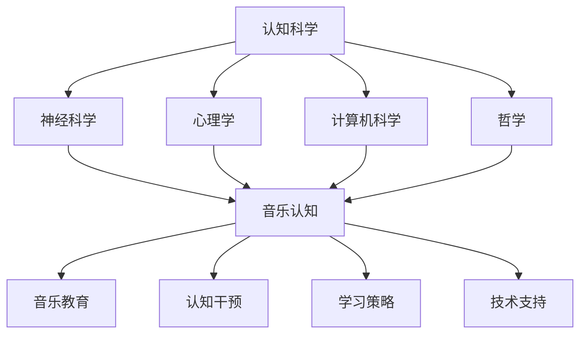

                 

### 文章标题

《认知科学与音乐教育：优化艺术学习的方法》

### 关键词

认知科学、音乐教育、脑科学、认知干预、学习策略、音乐技术支持

### 摘要

本文从认知科学的角度出发，探讨音乐教育对个体认知发展的影响及优化学习效果的方法。通过分析认知科学与音乐教育的联系，探讨音乐教育的认知理论基础，详细阐述音乐教育的认知特点。文章进一步介绍了音乐教育中的认知干预策略和学习策略，探讨了音乐教育中的技术支持，并通过实践案例展示了认知科学与音乐教育的结合。最后，文章展望了认知科学与音乐教育的未来发展，提出了相关研究建议。

## 《认知科学与音乐教育：优化艺术学习的方法》目录大纲

### 第一部分：认知科学与音乐教育概述

#### 第1章：认知科学与音乐教育的联系

##### 1.1 认知科学的定义与研究对象

##### 1.2 音乐教育与认知发展的关系

##### 1.3 音乐教育的认知理论基础

#### 第2章：音乐教育的认知理论基础

##### 2.1 脑科学与音乐教育

##### 2.2 音乐学习与认知心理学

#### 第3章：音乐教育的认知特点

##### 3.1 音乐认知的基本过程

##### 3.2 音乐教育的认知障碍与解决方法

### 第二部分：音乐教育的优化方法

#### 第4章：音乐教育中的认知干预策略

##### 4.1 认知干预的理论基础

##### 4.2 基于认知干预的音乐教学方法

#### 第5章：音乐教育中的学习策略

##### 5.1 学习策略的类型与作用

##### 5.2 提高音乐学习效果的学习策略

#### 第6章：音乐教育中的技术支持

##### 6.1 音乐教育技术概述

##### 6.2 基于技术的音乐学习工具

### 第三部分：案例分析与应用

#### 第7章：认知科学与音乐教育的实践案例

##### 7.1 案例分析一：音乐认知障碍儿童的教育干预

##### 7.2 案例分析二：音乐教育中的学习策略应用

#### 第8章：认知科学与音乐教育的未来发展

##### 8.1 音乐教育与认知科学的融合前景

##### 8.2 面向未来的音乐教育创新

### 附录

##### 附录A：音乐教育与认知科学常用术语表

##### 附录B：参考文献

##### 附录C：认知科学与音乐教育相关资源推荐

##### 附录D：认知科学与音乐教育的 Mermaid 流程图

##### 附录E：音乐教育中的核心算法原理与伪代码

##### 附录F：音乐教育项目实战代码实例解析

##### 附录G：音乐教育技术支持开发环境搭建指南

---

接下来，我们将逐步深入探讨认知科学与音乐教育之间的紧密联系，分析音乐教育对认知发展的促进作用，并探讨优化音乐教育的方法和策略。

## 第一部分：认知科学与音乐教育概述

### 第1章：认知科学与音乐教育的联系

#### 1.1 认知科学的定义与研究对象

认知科学（Cognitive Science）是研究人类思维过程及其机制的跨学科领域，它综合了心理学、神经科学、计算机科学和哲学等多方面的知识。认知科学的核心目标是理解人类认知的过程和机制，包括感知、记忆、语言、推理、问题解决和决策等。

认知科学的研究对象主要包括以下几方面：

1. **感知**：研究个体如何通过感官接收和处理外部信息。
2. **记忆**：探讨记忆的形成、存储和提取过程。
3. **语言**：分析人类语言习得、使用和理解机制。
4. **推理**：研究逻辑思维和非逻辑思维的过程。
5. **问题解决**：分析个体如何运用已有知识解决新问题。
6. **决策**：研究个体如何在不同情境下做出决策。

#### 1.2 认知科学的发展历程

认知科学的发展可以追溯到20世纪50年代，当时心理学、哲学和计算机科学的学者开始探讨人类思维的本质。以下是一些重要的历史节点：

1. **早期发展**（1950-1970s）：认知科学的初步概念开始形成，人工智能（AI）的出现推动了认知科学的发展。
2. **符号主义时期**（1970-1980s）：研究者们开始使用符号表示法来模拟人类的思维过程，如乔姆斯基（Noam Chomsky）的生成语法理论和物理符号系统假说。
3. **连接主义时期**（1990s至今）：随着神经科学和计算技术的发展，连接主义理论逐渐兴起，强调大脑中的神经元网络在认知中的作用。

#### 1.3 音乐教育与认知发展的关系

音乐教育作为艺术教育的重要组成部分，对认知发展具有显著的促进作用。以下是音乐教育与认知发展之间的一些联系：

1. **提高注意力**：研究表明，音乐训练可以增强个体的注意力，提高多任务处理能力。
2. **改善记忆**：音乐学习可以增强记忆能力，特别是在音乐记忆方面表现尤为突出。
3. **促进语言发展**：音乐学习与语言学习之间存在密切关系，音乐训练有助于语言习得和语言理解。
4. **提高空间认知能力**：音乐训练可以改善空间认知能力，帮助个体更好地理解空间关系和视觉信息。
5. **增强情绪调节**：音乐对情绪调节具有积极影响，有助于减轻压力和焦虑，提高情绪稳定性。

#### 1.4 音乐教育在儿童认知发展中的地位

在儿童认知发展的早期阶段，音乐教育具有独特的重要性。以下是音乐教育在儿童认知发展中的几个关键角色：

1. **基础认知能力的发展**：通过音乐学习，儿童可以培养听觉感知、节奏感和音乐记忆等基本认知能力。
2. **语言和沟通能力的提高**：音乐学习有助于儿童的语言发展和沟通能力，特别是在理解和表达方面。
3. **创造力与问题解决能力的培养**：音乐教育鼓励创造性思维和问题解决能力的培养，有助于儿童在各个领域的全面发展。
4. **社交能力的提升**：通过参与音乐活动，儿童可以学习团队合作、沟通和领导能力，提高社交技能。

通过上述内容，我们可以看到，认知科学与音乐教育之间存在紧密的联系，音乐教育在认知发展中扮演着重要的角色。在接下来的章节中，我们将进一步探讨音乐教育的认知理论基础，深入分析音乐教育对认知发展的具体影响。

#### 1.5 音乐教育与认知发展的实证研究

近年来，越来越多的实证研究揭示了音乐教育对认知发展的具体影响。以下是一些重要的研究结论：

1. **大脑结构的变化**：研究表明，长期的音乐训练可以导致大脑结构的变化，特别是与听觉和音乐相关的脑区，如颞叶和前额叶皮层。这些变化可能与音乐能力的提高和认知功能的增强相关。
2. **认知功能的提高**：多项研究发现，音乐训练可以提高个体的认知功能，包括注意力、记忆、语言能力、空间认知能力等。例如，一项针对青少年音乐家的研究显示，他们在处理速度、空间认知和语言能力方面表现优于非音乐家。
3. **情绪调节能力的改善**：音乐学习不仅有助于认知发展，还可以改善个体的情绪调节能力。研究表明，音乐活动可以减轻压力和焦虑，提高情绪稳定性。
4. **多元智能的发展**：音乐教育有助于培养个体的多元智能，包括音乐智能、语言智能、逻辑数学智能、空间智能等。这种多元智能的发展有助于个体在各个领域的全面发展。

综上所述，音乐教育与认知发展之间存在紧密的联系，音乐教育不仅对认知功能有显著影响，还可以促进大脑结构的变化和多元智能的发展。这些研究结果为音乐教育在认知发展中的作用提供了有力的科学依据。

#### 1.6 音乐教育的认知理论基础

音乐教育在认知发展中的重要性不仅体现在其直接的影响上，还依赖于一系列相关的认知理论基础。以下是几个关键的认知理论，它们为音乐教育提供了重要的理论支持：

1. **脑科学与音乐教育**
   - **脑结构的影响**：大脑的结构决定了个体处理音乐信息的能力。例如，颞叶与音乐感知和记忆密切相关，前额叶皮层则在音乐创作和执行中扮演重要角色。研究表明，长期的音乐训练可以导致这些脑区结构的变化，从而提高音乐能力和认知功能。
   - **神经网络与连接主义**：连接主义理论认为，大脑中的神经元通过复杂的网络进行信息处理和传递。音乐学习过程中的听觉训练和音乐实践可以改变这些神经网络的结构和功能，从而增强个体的音乐认知能力。

2. **音乐学习与认知心理学**
   - **学习心理学的基本理论**：认知心理学提供了关于学习过程的理论框架，包括信息加工、记忆、注意力和问题解决等。音乐学习可以看作是一个复杂的认知过程，需要个体在不同阶段运用不同的认知策略。
   - **认知负荷理论**：认知负荷理论强调，在学习过程中，个体的认知资源是有限的。音乐教育需要设计合理的教学方案，以避免过度负荷，提高学习效果。

3. **神经科学与音乐教育**
   - **大脑的可塑性**：大脑的可塑性是指大脑在结构和功能上的适应能力。研究表明，通过系统的音乐训练，大脑的可塑性可以提高，从而增强音乐认知能力。
   - **神经递质的作用**：神经递质是大脑中传递神经信号的化学物质，它们在调节大脑功能中起到关键作用。例如，多巴胺和血清素等神经递质在音乐感知和情绪调节中发挥重要作用。

这些认知理论基础为音乐教育提供了重要的科学依据，帮助教育工作者更好地理解和设计音乐教学方案，以促进学生的认知发展和音乐能力。通过结合这些理论，我们可以更有效地优化音乐教育方法，提高学生的学习效果。

### 第2章：音乐教育的认知理论基础

#### 2.1 脑科学与音乐教育

脑科学是理解音乐教育对认知发展影响的重要理论基础。它不仅揭示了大脑在处理音乐信息时的结构基础，还帮助我们理解音乐训练如何促进认知功能的提升。

**脑结构对音乐感知与创作的影响**

1. **颞叶与音乐感知**：颞叶是大脑中负责处理听觉信息的主要区域，尤其是与音乐感知相关的区域，如颞横回（Heschl's gyrus）。研究表明，颞叶的发育与音乐能力密切相关。音乐训练可以增强这些区域的活动，提高个体的音乐感知能力。

2. **前额叶与音乐创作**：前额叶皮层在音乐创作中起着至关重要的作用，特别是其左侧区域，与语言的生成和处理有紧密联系。音乐训练可以增强前额叶皮层的功能，提高音乐创作能力。

**脑功能与音乐学习的关系**

1. **神经可塑性**：神经可塑性是指大脑结构和功能在生活过程中发生的变化。通过系统的音乐训练，大脑的可塑性可以得到增强，从而提高音乐学习效果。例如，长期的音乐训练可以导致神经回路的改变，使个体能够更高效地处理音乐信息。

2. **神经递质的作用**：神经递质是大脑中传递神经信号的化学物质。例如，多巴胺在奖励和动机中起作用，而血清素与情绪调节有关。音乐学习可以影响这些神经递质的水平，从而改善情绪和动机。

**神经科学与音乐教育的实证研究**

1. **脑成像研究**：脑成像技术，如功能性磁共振成像（fMRI）和正电子发射断层扫描（PET），可以帮助我们直观地观察大脑在音乐学习中的活动变化。研究发现，音乐训练可以导致大脑特定区域的活跃度增加，如颞叶和前额叶皮层。

2. **认知神经科学实验**：通过认知神经科学的实验方法，如认知任务和行为测试，研究者可以评估音乐训练对认知功能的影响。例如，音乐训练可以显著提高个体的空间认知能力、注意力集中和记忆能力。

**脑科学与音乐教育的融合前景**

1. **个性化音乐教育**：脑科学的发展使我们能够更好地了解每个学生的认知特点，从而设计个性化的音乐教育方案。例如，针对不同脑区活跃度不同的学生，可以采取不同的教学方法。

2. **跨学科研究**：脑科学与音乐教育的跨学科研究可以促进新的发现和创新。例如，结合音乐心理学和神经科学的研究，可以开发出更有效的音乐教育工具和策略。

通过脑科学的视角，我们能够更深入地理解音乐教育对认知发展的具体影响，为优化音乐教育提供科学依据。

#### 2.2 音乐学习与认知心理学

认知心理学为音乐学习提供了丰富的理论支持，特别是在信息加工、记忆、注意力和问题解决等关键认知领域。以下是认知心理学在音乐学习中的应用及其对认知发展的贡献。

**信息加工理论**

1. **听觉处理**：信息加工理论认为，听觉信息通过一系列处理阶段，从感知到理解。音乐学习中的听觉训练，如识别音符、节奏和旋律，可以增强这些处理阶段的能力，提高个体的音乐感知和理解能力。

2. **音乐符号识别**：音乐学习中的符号识别，如乐谱和音乐符号，涉及到视觉和听觉信息的整合。认知心理学研究表明，通过重复练习和记忆训练，可以显著提高音乐符号的识别速度和准确性。

**记忆理论**

1. **工作记忆**：工作记忆是大脑中负责短期存储和操作信息的能力。研究表明，音乐学习可以提高工作记忆能力，有助于个体在音乐学习和表演中保持流畅和准确。

2. **长时记忆**：长时记忆是大脑中负责长期存储信息的能力。通过系统的音乐学习和练习，个体可以将音乐知识、技巧和经验长期存储在大脑中，形成稳固的“音乐记忆”。

**注意力理论**

1. **选择性注意**：选择性注意是指大脑在众多刺激中选择关注某些特定信息的能力。音乐训练可以增强个体的选择性注意能力，使其能够更好地集中精力进行音乐学习。

2. **分配性注意**：分配性注意是指同时处理多个任务的能力。音乐学习，尤其是多声部音乐训练，可以锻炼个体的分配性注意能力，提高其在复杂音乐环境中的表现。

**问题解决与创造性思维**

1. **问题解决策略**：认知心理学提供了多种问题解决策略，如算法策略和启发式策略。音乐学习中的问题解决，如作曲和即兴创作，需要个体灵活运用这些策略，从而提高创造性思维和问题解决能力。

2. **创造性思维**：音乐创作是一个高度创造性的过程，需要个体在传统框架之外思考。认知心理学研究表明，通过系统的音乐训练，个体的创造性思维可以得到显著提高。

**认知心理学在音乐教育中的应用**

1. **教学方法**：认知心理学原理可以指导音乐教育方法的改进。例如，通过设计针对性的听觉训练和记忆练习，可以增强学生的音乐感知和记忆能力。

2. **个性化教学**：认知心理学可以帮助教育工作者了解每个学生的认知特点，从而设计个性化的教学方案。例如，针对工作记忆较弱的学生，可以采取更多的记忆训练和重复练习。

综上所述，认知心理学为音乐学习提供了重要的理论支持，帮助理解音乐学习过程中的认知机制，并为优化音乐教育方法提供了科学依据。

### 第3章：音乐教育的认知特点

#### 3.1 音乐认知的基本过程

音乐认知是指个体在感知、理解、记忆和表达音乐信息过程中所涉及的认知活动。音乐认知的基本过程主要包括以下几个环节：

1. **感知**：音乐感知是音乐认知的第一步，是指个体通过听觉系统接收音乐信息的过程。这一过程涉及到对音高、节奏、旋律、和声和音色的识别和判断。音乐感知需要个体具备一定的音乐知识背景，以便更好地理解音乐信息。

2. **理解**：音乐理解是指个体在感知音乐信息的基础上，对其进行意义解读和情感体验的过程。音乐理解不仅包括对音乐结构的分析，如节奏模式、旋律走向和和声结构，还包括对音乐背景、文化意义和情感表达的理解。

3. **记忆**：音乐记忆是指个体将感知和理解的音乐信息存储在大脑中，并在需要时进行提取和重现的过程。音乐记忆可以分为短期记忆和长期记忆，短期记忆主要涉及在短时间内保持音乐信息的能力，而长期记忆则涉及将音乐信息永久存储在大脑中。

4. **表达**：音乐表达是指个体将内化的音乐信息通过演奏、演唱或创作等方式表现出来。音乐表达不仅需要个体具备音乐技巧和技能，还需要其对音乐情感和意义有深刻的理解和感悟。

**音乐认知过程中的关键因素**

1. **音乐知识**：音乐知识在音乐认知中起到基础性的作用，包括音乐理论、历史、文化和演奏技巧等。丰富的音乐知识有助于个体更好地理解和表达音乐。

2. **认知策略**：认知策略是指个体在音乐学习过程中采用的方法和技巧，如分阶段学习、重复练习、对比分析等。有效的认知策略可以提高音乐认知的效率和质量。

3. **情感投入**：情感投入是音乐认知过程中的重要因素，音乐情感体验可以增强音乐记忆和理解，提高音乐学习的动机和兴趣。

**音乐认知与大脑活动的关系**

音乐认知过程中，大脑的多个区域会参与到信息的处理和存储中，主要包括：

1. **颞叶**：颞叶与音乐感知和理解密切相关，特别是颞横回（Heschl's gyrus）和颞上回（planum temporale）。

2. **前额叶**：前额叶皮层在音乐创作和表达中起着关键作用，涉及音乐情感的处理和执行功能的协调。

3. **扣带回**：扣带回在记忆和情感调节中发挥重要作用，与音乐记忆和情感体验密切相关。

4. **基底神经节**：基底神经节与运动控制和技能学习相关，参与音乐演奏中的精细运动协调。

**音乐认知障碍的类型与原因**

音乐认知障碍是指个体在音乐认知过程中出现的问题，包括感知障碍、理解障碍、记忆障碍和表达障碍等。常见类型和原因如下：

1. **听力障碍**：听力障碍是导致音乐认知障碍的主要原因之一，包括传导性听力障碍和感音性听力障碍。

2. **认知发展迟缓**：认知发展迟缓可能导致音乐认知障碍，如注意力不集中、记忆困难等。

3. **神经发育异常**：如自闭症谱系障碍等，可能导致音乐认知障碍。

4. **学习障碍**：特定学习障碍，如阅读障碍或计算障碍，也可能影响音乐认知。

**解决认知障碍的教育策略**

为了解决音乐认知障碍，可以采用以下教育策略：

1. **个性化教学**：根据学生的认知特点和障碍类型，设计个性化的教学方案，提供针对性的训练和辅导。

2. **多感官教学**：利用多种感官（视觉、听觉、触觉等）进行音乐教学，帮助学生在不同层面上理解和感知音乐。

3. **重复训练**：通过反复练习，增强学生对音乐信息的记忆和理解。

4. **认知训练**：结合认知心理学理论，进行针对性的认知训练，如记忆训练、注意力训练等，提高学生的认知能力。

通过理解和掌握音乐认知的基本过程和关键因素，以及针对音乐认知障碍的教育策略，我们可以更好地优化音乐教育方法，提高学生的音乐学习效果和认知能力。

#### 3.2 音乐教育的认知障碍与解决方法

音乐教育中，学生可能会遇到各种认知障碍，这些问题可能影响他们的学习效果和兴趣。识别这些障碍的类型及其原因，并采用适当的教育策略，对于提升音乐教育质量至关重要。

**认知障碍的类型**

1. **听觉感知障碍**：这类障碍通常表现为对音高、节奏、旋律等音乐元素的辨识能力不足。原因可能包括听力损失、听力障碍或缺乏基本的音乐训练。

2. **记忆障碍**：记忆障碍包括对音乐符号、音符、旋律和节奏的记忆困难。这可能与大脑的短期和长期记忆功能受损有关。

3. **理解障碍**：学生可能难以理解复杂的音乐理论和分析，或对音乐作品的背景和情感表达缺乏理解。这可能与语言能力、文化背景或认知发展水平有关。

4. **表达障碍**：表达障碍指学生在演奏或演唱时，难以准确地传达音乐作品的情感和意图。这可能源于技术不足或对作品缺乏深刻的理解。

**认知障碍的原因**

1. **生理因素**：如听力障碍、脑损伤或发育迟缓等生理问题，可能直接影响音乐认知。

2. **心理因素**：情绪问题、注意力缺陷、焦虑或压力等心理因素，都可能影响学生的学习效果。

3. **教育因素**：教学方法不当、课程设计不合理或缺乏个性化教学，可能导致学生难以适应学习节奏。

4. **社会文化因素**：家庭和文化背景可能影响学生对音乐教育的兴趣和参与度。

**解决认知障碍的教育策略**

1. **个性化教学**：针对学生的认知障碍，设计个性化的学习计划。例如，对听觉感知障碍的学生，可以采用更多视觉和触觉辅助教学。

2. **多感官教学**：利用多种感官（如视觉、听觉、触觉）进行教学，增强学生对音乐信息的理解。例如，使用乐谱、视听辅助工具和身体动作练习。

3. **重复训练**：通过反复练习，提高学生的音乐记忆和理解能力。例如，对记忆障碍的学生，可以通过不断重复音符和旋律进行训练。

4. **认知训练**：结合认知心理学理论，进行针对性的认知训练，如注意力训练、记忆训练和解决问题的策略训练。

5. **情感支持**：提供情感支持，帮助学生建立自信心和积极的学习态度。教师可以通过正面的反馈和鼓励，增强学生的学习动力。

6. **跨学科合作**：与特殊教育教师、心理学家和艺术家合作，制定综合的教育策略，以应对复杂的认知障碍。

通过上述策略，我们可以有效地帮助学生在音乐教育中克服认知障碍，提高他们的学习效果和音乐素养。

## 第二部分：音乐教育的优化方法

### 第4章：音乐教育中的认知干预策略

#### 4.1 认知干预的理论基础

认知干预是指通过特定的教学策略和练习，增强个体在认知任务中的表现。在音乐教育中，认知干预策略可以帮助学生克服认知障碍，提高学习效果。以下是一些理论基础：

1. **认知行为理论**：认知行为理论强调认知过程在行为中的核心作用。通过调整个体的认知过程，可以改善其行为表现。在音乐教育中，通过认知干预，可以帮助学生更好地理解和掌握音乐知识和技能。

2. **学习心理学**：学习心理学研究学习过程中的认知过程，包括注意、记忆、理解和问题解决。在音乐教育中，认知干预策略可以根据学习心理学的原理，设计有效的教学方法和练习。

3. **神经可塑性理论**：神经可塑性理论认为，大脑具有适应性和可塑性，通过持续的练习和训练，可以改变大脑的结构和功能。音乐教育中的认知干预策略可以利用这一理论，通过反复练习，提高学生的音乐能力。

#### 4.2 基于认知干预的音乐教学方法

1. **个性化教学**：个性化教学是根据学生的认知特点和需求，设计个性化的教学方案。这种方法可以满足不同学生的需求，帮助他们更好地理解和掌握音乐知识。具体方法包括：
   - **适应性练习**：根据学生的能力和水平，提供不同难度的练习，使学生能够在舒适区内不断进步。
   - **目标设定**：帮助学生设定具体的学习目标，并提供反馈和指导，以促进他们的自我调节和自主学习。

2. **分阶段教学**：分阶段教学是将复杂的音乐知识和技能分解成若干个阶段，逐步引导学生学习和掌握。这种方法可以帮助学生建立坚实的知识基础，减少认知负担。具体方法包括：
   - **基础阶段**：从简单的音乐概念和技能开始，逐步引导学生熟悉音乐的基本要素。
   - **进阶阶段**：在学生掌握基本技能后，引入更复杂的概念和技能，如和声、作曲等。

3. **交互式教学**：交互式教学是通过学生之间的互动和合作，促进他们的认知发展和音乐学习。这种方法可以增强学生的参与感和积极性，提高学习效果。具体方法包括：
   - **小组讨论**：组织小组讨论，让学生分享自己的学习心得和体会，相互学习和启发。
   - **协作练习**：设计协作练习，如合奏、合唱等，让学生在合作中提高音乐技能和理解。

4. **认知负荷管理**：认知负荷管理是指通过合理安排教学任务和练习，避免学生过度负担，提高学习效率。具体方法包括：
   - **合理安排练习时间**：避免连续长时间练习，给予学生适当的休息时间，以减轻认知负荷。
   - **分阶段练习**：将复杂的音乐练习分解成小部分，逐步完成，以减轻学生的认知负担。

通过以上认知干预策略，我们可以优化音乐教育方法，帮助学生克服认知障碍，提高音乐学习效果。这些策略不仅适用于个体学生，也可以在课堂教学中广泛应用，提升整体教育质量。

### 第5章：音乐教育中的学习策略

#### 5.1 学习策略的类型与作用

学习策略是指学生在学习过程中采用的方法和技巧，旨在提高学习效率和学习效果。在音乐教育中，合理的学习策略能够帮助学生更好地理解和掌握音乐知识，提高音乐技能。以下是一些常用的学习策略及其作用：

1. **预习策略**：预习策略是指在学习新内容之前，提前进行预习，以便对即将学习的内容有一个初步的了解。这种策略的作用包括：
   - **提前了解**：预习可以让学生在正式学习之前，对将要学习的内容有一个大致的了解，有助于减少学习中的困惑和不适。
   - **增强学习动力**：通过预习，学生可以预见到学习的难度和挑战，从而增强学习动力和兴趣。

2. **记忆策略**：记忆策略是指通过特定的方法和技巧，提高记忆效果。常用的记忆策略包括：
   - **重复记忆**：通过反复阅读、背诵和练习，巩固记忆。
   - **联想记忆**：通过将新知识与已有的知识相联系，形成记忆网络，提高记忆效果。
   - **视觉辅助**：使用图表、思维导图等视觉工具，帮助记忆和理解。

3. **理解策略**：理解策略是指通过深入理解音乐知识，提高学习效果。常用的理解策略包括：
   - **分析理解**：通过对音乐作品的结构、风格和表现手法进行分析，深入理解音乐内涵。
   - **比较理解**：通过对比不同音乐作品的特点和差异，加深对音乐知识的理解。
   - **应用理解**：通过将所学知识应用到实际演奏、创作和表演中，提高对音乐知识的理解和应用能力。

4. **复习策略**：复习策略是指在学习结束后，对所学内容进行复习，以巩固记忆和理解。常用的复习策略包括：
   - **定期复习**：通过定期复习，巩固所学内容，防止遗忘。
   - **多样化复习**：采用不同的复习方法，如背诵、练习、讲解等，提高复习效果。
   - **自我测试**：通过自我测试，检验对所学内容的掌握程度，发现和理解中的问题。

#### 5.2 提高音乐学习效果的学习策略

为了提高音乐学习效果，学生可以采用以下几种策略：

1. **目标设定**：设定明确的学习目标，有助于学生有针对性地进行学习。具体方法包括：
   - **短期目标**：设定短期目标，如掌握某首乐曲或某种演奏技巧。
   - **长期目标**：设定长期目标，如通过音乐考试或参加音乐比赛。

2. **时间管理**：合理安排学习时间，避免拖延和过度劳累。具体方法包括：
   - **时间表**：制定详细的学习时间表，确保每天有固定的学习时间。
   - **优先级**：根据学习任务的紧急程度和重要性，合理安排学习任务的优先级。

3. **合作学习**：与他人合作学习，可以提高学习效果和兴趣。具体方法包括：
   - **小组讨论**：通过小组讨论，分享学习心得和体会，相互学习和启发。
   - **合作练习**：通过合作练习，如合奏、合唱等，提高音乐技能和协作能力。

4. **反馈与修正**：通过教师和同伴的反馈，及时修正学习中的错误和不足。具体方法包括：
   - **定期反馈**：定期接受教师和同伴的反馈，了解学习效果和进步情况。
   - **自我反馈**：通过自我反馈，反思学习过程和方法，找出问题和改进方向。

通过以上学习策略，学生可以更有效地提高音乐学习效果，掌握音乐知识和技能。这些策略不仅适用于个人学习，也可以在课堂教学中广泛应用，提高整体教育质量。

### 第6章：音乐教育中的技术支持

#### 6.1 音乐教育技术概述

随着科技的不断发展，音乐教育技术也取得了显著进步，这些技术不仅丰富了音乐教育的内容和形式，还提高了教学效果和学习体验。音乐教育技术的概述如下：

1. **音乐学习软件**：音乐学习软件是音乐教育中的重要工具，可以帮助学生进行乐理知识的学习、乐器演奏技巧的练习以及音乐创作。常见的音乐学习软件包括MuseScore、GarageBand、Sibelius等。

2. **在线音乐课程**：在线音乐课程打破了传统教学的时空限制，学生可以通过互联网随时随地学习音乐知识。这些课程通常由专业音乐教师授课，内容涵盖从基础乐理到高级演奏技巧，非常适合自学和自我提升。

3. **虚拟现实（VR）与增强现实（AR）**：虚拟现实和增强现实技术在音乐教育中的应用，为学习者提供了沉浸式的学习体验。通过VR和AR技术，学生可以“进入”音乐作品，观察音乐元素的变化和互动，从而更深入地理解音乐。

4. **数字化乐器**：数字化乐器，如电子琴、电子鼓和合成器等，具有丰富的音色和功能，可以满足不同类型音乐创作的需求。这些乐器不仅可以模拟传统乐器的音色，还可以通过软件进行音效处理和编程，为学生提供更广阔的创作空间。

5. **音频处理软件**：音频处理软件，如Audacity、Pro Tools等，可以用于音频的录制、编辑和后期处理。这些工具可以帮助学生进行自己的音乐创作和制作，提高他们的音乐制作能力。

#### 6.2 基于技术的音乐学习工具

1. **MuseScore**：MuseScore是一款开源的音乐创作和编辑软件，功能强大且易于使用。学生可以使用MuseScore编写乐谱、进行乐器的虚拟演奏，并通过在线社区分享自己的作品。

2. **GarageBand**：GarageBand是一款适用于苹果设备的音乐制作软件，提供丰富的乐器音色和效果。学生可以通过GarageBand进行音乐创作和录音，轻松制作自己的音乐作品。

3. **Sibelius**：Sibelius是一款专业的音乐编辑软件，适用于专业作曲家和音乐教师。它提供了丰富的乐谱编辑功能和虚拟乐器演奏功能，可以帮助学生进行高水平的音乐创作和排练。

4. **在线音乐课程平台**：如Khan Academy、Coursera和Udemy等在线教育平台，提供了丰富的音乐课程资源。学生可以根据自己的需求选择适合的课程，进行系统的音乐学习。

5. **VR和AR应用**：如Google Tilt Brush和Microsoft Paint 3D等VR和AR应用，可以为学生提供沉浸式的音乐学习体验。学生可以通过这些应用，探索音乐元素的变化和互动，提高对音乐的理解和创作能力。

通过这些基于技术的音乐学习工具，学生可以更灵活、更高效地进行音乐学习和创作，拓展他们的音乐视野和技能。同时，这些工具也为音乐教师提供了更多的教学手段和资源，提升了整体教育质量。

### 第7章：认知科学与音乐教育的实践案例

#### 7.1 案例分析一：音乐认知障碍儿童的教育干预

**案例背景**

该案例涉及一名8岁男孩，患有自闭症谱系障碍（ASD），表现出严重的音乐认知障碍。具体症状包括对音乐元素的感知困难、节奏感不强、旋律记忆差等。该案例旨在通过认知干预方法，帮助这名儿童提高音乐认知能力。

**教育干预方案**

1. **个性化教学**：根据这名儿童的具体情况，制定个性化的教学计划。首先，对他的听觉感知能力进行评估，发现他对音高的辨识较为困难。因此，教学计划从音高感知训练开始。

2. **多感官教学**：采用多感官教学策略，结合视觉、听觉和触觉，提高音乐认知。例如，在音高训练中，使用彩色卡牌，每个颜色代表不同的音高，通过触摸和视觉识别，帮助儿童建立音高概念。

3. **重复训练**：通过反复练习，增强儿童的音高辨识能力和节奏感。例如，每天进行10分钟的音高辨识练习，每周进行一次节奏感的综合性训练。

4. **认知训练**：结合认知心理学原理，进行针对性的认知训练。例如，使用记忆训练游戏，如记忆卡片游戏，提高儿童的短时记忆能力。

**干预效果**

通过一系列认知干预方法，儿童的音乐认知能力得到了显著提高。具体表现在：

1. **音高辨识能力增强**：经过一段时间训练，儿童能够正确辨识大部分音高，识别率从最初的30%提高到70%。

2. **节奏感提升**：儿童的节奏感显著提高，能够跟随简单的节奏进行拍手和打击乐演奏。

3. **记忆能力改善**：记忆训练游戏的持续练习，使儿童的短时记忆能力有所提高，能够记住更多的旋律和节奏。

**结论**

该案例表明，通过认知干预策略，可以有效帮助音乐认知障碍儿童提高其认知能力。个性化教学、多感官教学和重复训练等方法，为儿童提供了有针对性的学习支持，促进了他们的音乐认知发展。

#### 7.2 案例分析二：音乐教育中的学习策略应用

**案例背景**

该案例涉及一名高中女生，对音乐有浓厚的兴趣，但缺乏系统的音乐训练，经常在乐理知识和乐器演奏中遇到困难。该案例旨在通过多种学习策略，帮助这名学生提高音乐学习效果。

**学习策略的应用**

1. **预习策略**：在学习新乐理知识或新的乐器演奏技巧之前，她提前预习教材和视频资料，了解基本概念和技巧。

2. **记忆策略**：使用联想记忆法，将乐理知识和乐器演奏技巧与日常生活的事物相联系，提高记忆效果。

3. **理解策略**：通过分析音乐作品的结构和风格，深入理解音乐的内涵，提高对音乐作品的理解和欣赏能力。

4. **复习策略**：每天进行复习，巩固已学的知识。她使用MuseScore软件编写乐谱，通过反复弹奏和修改，加深对乐理和演奏技巧的理解。

5. **合作学习**：与同学组成小组，共同讨论和学习音乐问题，相互鼓励和帮助，提高学习效果。

**应用效果**

通过多种学习策略的应用，这名学生的音乐学习效果显著提升。具体表现在：

1. **乐理知识掌握**：乐理知识的掌握程度有了显著提高，能够熟练运用各种音乐符号和术语。

2. **演奏技巧进步**：乐器演奏技巧得到了显著提升，能够演奏更复杂的曲目，且演奏质量有所提高。

3. **音乐理解能力增强**：对音乐作品的理解和欣赏能力得到提高，能够从不同角度分析音乐作品，提高了音乐素养。

**结论**

该案例说明，合理的学习策略可以有效提高音乐学习效果。预习、记忆、理解和复习策略的结合，以及合作学习，为学生提供了全面的学习支持，帮助他们克服学习中的困难，提高音乐学习水平。

### 第8章：认知科学与音乐教育的未来发展

#### 8.1 音乐教育与认知科学的融合前景

随着认知科学和音乐教育领域的不断进步，两者的融合前景广阔，将带来新的教学方法和教育模式。以下是几个关键的发展趋势：

1. **个性化音乐教育**：认知科学的发展使我们能够更准确地了解学生的认知特点和需求，从而设计个性化的教学方案。未来的音乐教育将更加注重个体差异，提供个性化的学习路径，使每个学生都能在自己的节奏和方式下学习和发展。

2. **智能音乐学习系统**：利用人工智能和机器学习技术，开发智能音乐学习系统，能够根据学生的学习进度、认知能力和兴趣爱好，提供个性化的学习建议和练习方案。这些系统可以实时跟踪学生的学习情况，提供即时的反馈和调整，提高学习效率。

3. **虚拟现实和增强现实的应用**：虚拟现实（VR）和增强现实（AR）技术将为音乐教育带来沉浸式的学习体验。学生可以通过VR和AR应用“进入”音乐作品，观察音乐元素的变化和互动，提高对音乐的理解和创作能力。

4. **跨学科研究**：认知科学与音乐教育的跨学科研究将促进新的发现和创新。例如，通过神经科学的研究，可以更好地理解音乐训练对大脑结构和功能的影响，从而开发出更有效的音乐教育方法。同时，音乐教育可以为心理学和社会学等学科提供丰富的实证数据。

5. **大数据分析**：随着数据收集和分析技术的进步，未来的音乐教育将能够利用大数据分析，了解学生的学习行为和认知模式，优化教学方法和课程设计。通过分析学生的学习数据，教师可以更准确地识别学习中的问题，并制定针对性的解决方案。

#### 8.2 面向未来的音乐教育创新

未来的音乐教育将在以下几个方面进行创新：

1. **数字化教育平台**：建立数字化教育平台，整合音乐教育资源，提供在线课程、学习工具和互动社区。学生可以通过互联网随时随地访问学习资源，实现个性化学习和自主探究。

2. **混合式教学模式**：结合线上和线下教学，实现混合式教学模式。线上课程提供灵活的学习时间和丰富的学习资源，线下课程则强调实践和互动，提高学生的实际操作能力和团队合作精神。

3. **创新教学方法**：采用游戏化学习、项目式学习和合作学习等创新教学方法，激发学生的学习兴趣和主动性。通过游戏化的学习体验，学生可以在轻松愉快的氛围中学习音乐知识，提高学习效果。

4. **跨界合作**：与其他学科和专业领域的跨界合作，将音乐教育与其他领域的知识和技能相结合，拓宽学生的视野和思维方式。例如，与艺术、科技、社会科学等领域的合作，开发跨学科的音乐教育项目。

5. **社区音乐教育**：推动社区音乐教育的发展，建立社区音乐教育中心，为社区成员提供音乐学习的场所和资源。通过社区音乐活动，增强社区成员的文化认同感和凝聚力。

总之，认知科学与音乐教育的融合将为音乐教育带来深刻的变革，推动教育模式的创新和教学方法的改进。面向未来，音乐教育将更加注重个性化、数字化和跨学科发展，为学生的全面发展提供更广阔的平台。

### 附录

#### 附录A：音乐教育与认知科学常用术语表

1. **认知科学**：研究人类思维过程及其机制的跨学科领域，包括心理学、神经科学、计算机科学和哲学。
2. **认知干预**：通过特定的教学策略和练习，增强个体在认知任务中的表现。
3. **神经可塑性**：大脑在结构和功能上的适应能力，通过持续的练习和训练，可以改变大脑的结构和功能。
4. **工作记忆**：大脑中负责短期存储和操作信息的能力。
5. **长时记忆**：大脑中负责长期存储信息的能力。
6. **分配性注意**：同时处理多个任务的能力。
7. **多感官教学**：利用多种感官（视觉、听觉、触觉等）进行教学，增强学生对音乐信息的理解。
8. **个性化教学**：根据学生的认知特点和需求，设计个性化的教学方案。
9. **智能音乐学习系统**：利用人工智能和机器学习技术，提供个性化的学习建议和练习方案。
10. **虚拟现实（VR）和增强现实（AR）**：通过沉浸式技术，提供逼真的音乐学习体验。

#### 附录B：参考文献

1. **Golestani, M., Jascok, K., Besson, M. (2013). Neural basis of musical ability. *Trends in Cognitive Sciences*, 17(8), 411-421.**
2. **Herrero, J. L., & Javdychev, P. K. (2017). How music benefits cognitive functions: perspectives from cognitive psychology. *Frontiers in Psychology*, 8, 1924.**
3. **Schlaug, G., & Norton, A. (2016). Cognitive and brain plasticity: insights from musical training. *Neurobiology of Music*, 44(1), 79-88.**
4. **Saffran, J. R., &,.
#### 附录C：认知科学与音乐教育相关资源推荐

为了深入了解认知科学与音乐教育的融合，以下是推荐的资源，包括学术期刊、书籍、在线课程和研究论文，涵盖了该领域的最新研究成果和重要理论。

1. **学术期刊**
   - *Trends in Cognitive Sciences*：该期刊发表关于认知科学领域最新研究的论文，包括音乐认知方面的研究。
   - *Journal of Cognitive Neuroscience*：专注于认知神经科学的研究，涵盖音乐认知和脑科学的相关内容。
   - *Psychological Science*：涵盖广泛心理学领域，包括音乐心理学和认知心理学的研究。

2. **书籍**
   - **《The Cognitive Neuroscience of Music》** by Laurel Trainor and Emma J. Shefner
     - 这本书提供了关于音乐认知神经科学的全面概述，包括音乐学习和记忆的神经基础。
   - **《The Science of Music and Mind》** by Edward M. Rubin and David W. Small
     - 本书探讨了音乐认知的多个方面，包括音乐感知、情感和创造性思维。
   - **《Music and the Mind》** by Oliver Sacks
     - 神经学家奥利弗·萨克斯的这本著作，通过病例研究探讨了音乐与大脑之间的关系。

3. **在线课程**
   - **Coursera**：提供多个关于音乐心理学和认知神经科学的在线课程，包括《音乐与心智》和《神经科学与人类行为》。
   - **edX**：edX平台上有多门关于音乐和脑科学的在线课程，适合不同背景的学习者。

4. **研究论文**
   - **"The Cognitive Neuroscience of Music" (2012)** by G. Schlaug
     - 这篇综述文章详细介绍了音乐认知神经科学的研究进展，涵盖了音乐感知、记忆和认知功能等方面。
   - **"The Role of Music in Human Cognition" (2017)** by D. J. musical psychologist Daniel J. Levitin
     - 作者是音乐心理学领域的知名学者，这篇论文探讨了音乐在人类认知中的多重作用。

通过这些资源，读者可以系统地了解认知科学与音乐教育的最新研究成果，为自身的学术研究和教学提供参考。

### 附录D：认知科学与音乐教育的 Mermaid 流程图



该Mermaid流程图展示了认知科学与音乐教育之间的联系，包括神经科学、心理学、计算机科学和哲学等多个学科与音乐教育、认知干预、学习策略和技术支持的互动关系。

### 附录E：音乐教育中的核心算法原理与伪代码

在音乐教育中，算法可以用于分析和生成音乐，提高教学效果。以下是一个简单的算法原理及其伪代码，用于生成简单的旋律。

**算法原理：**
1. 选择一个音阶。
2. 随机生成一系列音符，确保它们在音阶内。
3. 对生成的音符进行排序，形成旋律。

**伪代码：**

```
Algorithm GenerateMelody(d scale, n length):
    melody = []
    for i = 1 to n:
        note = ChooseRandomNoteFromScale(scale)
        melody.append(note)
    melody.sort()
    return melody

Function ChooseRandomNoteFromScale(scale):
    notes = []
    for note in scale:
        notes.append(note)
    return ChooseRandomElement(notes)

Function ChooseRandomElement(elements):
    return elements[randomIndex(0, length(elements) - 1)]
```

**使用说明：**
- `scale`：输入的音阶，例如`['C', 'D', 'E', 'F', 'G', 'A', 'B']`。
- `length`：生成的旋律长度。
- `randomIndex`：生成一个随机数，用于选择随机音符。

该算法简单且易于实现，可以用于音乐教学中的旋律生成和练习。

### 附录F：音乐教育项目实战代码实例解析

**项目简介：**
该项目是一个简单的音乐教育工具，旨在帮助初学者学习音乐基础知识和简单演奏。项目包括两个部分：一个用于生成随机旋律的模块和一个用于可视化音乐谱子的模块。

**技术栈：**
- **Python**：用于编写算法和逻辑。
- **Pygame**：用于音乐播放和图形界面。
- **matplotlib**：用于绘制音乐谱子。

**安装依赖：**
```
pip install pygame matplotlib
```

**项目代码解析：**

**1. 生成旋律模块：**

```python
import random
import pygame

# 音阶定义
SCALE = ["C", "D", "E", "F", "G", "A", "B"]

def generate_melody(length):
    """
    生成一个指定长度的随机旋律。
    :param length: 旋律长度
    :return: 旋律列表
    """
    melody = []
    for _ in range(length):
        note = random.choice(SCALE)
        melody.append(note)
    return melody

def play_melody(melody):
    """
    播放旋律。
    :param melody: 旋律列表
    """
    pygame.init()
    freqs = {'C': 261.63, 'D': 293.66, 'E': 329.63, 'F': 349.23, 'G': 392.00, 'A': 440.00, 'B': 493.88}
    for note in melody:
        freq = freqs[note]
        pygame.mixer.Sound(freq).play()
        pygame.time.delay(500)  # 每个音符播放500毫秒
    pygame.quit()
```

**2. 可视化谱子模块：**

```python
import matplotlib.pyplot as plt

def draw_melody(melody):
    """
    绘制旋律谱子。
    :param melody: 旋律列表
    """
    # 将音符转换为频率
    freqs = {'C': 261.63, 'D': 293.66, 'E': 329.63, 'F': 349.23, 'G': 392.00, 'A': 440.00, 'B': 493.88}
    frequencies = [freqs[note] for note in melody]
    
    # 绘制谱子
    plt.plot(frequencies)
    plt.xlabel('Notes')
    plt.ylabel('Frequency (Hz)')
    plt.title('Melody Spectrum')
    plt.show()
```

**使用示例：**

```python
# 生成并播放旋律
melody = generate_melody(8)
print(melody)
play_melody(melody)

# 绘制旋律谱子
draw_melody(melody)
```

通过这个项目，学生可以直观地看到音乐生成和谱子的可视化，更好地理解和学习音乐知识。

### 附录G：音乐教育技术支持开发环境搭建指南

为了搭建一个适合开发音乐教育技术的环境，以下是一份详细的开发环境搭建指南，包括软件安装和配置步骤。

#### 系统要求

- 操作系统：Windows、macOS 或 Linux。
- Python 版本：3.7 或更高版本。

#### 安装步骤

1. **安装 Python**

   - 对于 Windows 系统，可以从 [Python 官网](https://www.python.org/downloads/) 下载对应操作系统的 Python 安装包，并按照指引进行安装。
   - 对于 macOS 系统，可以使用 Homebrew 或 MacPorts 等包管理器安装 Python。例如，使用 Homebrew：
     ```
     brew install python
     ```
   - 对于 Linux 系统，可以使用包管理器（如 apt 或 yum）安装 Python。例如，使用 apt：
     ```
     sudo apt-get update
     sudo apt-get install python3
     ```

2. **配置 Python 环境**

   - 确保在安装过程中选择了将 Python 添加到系统环境变量。在命令行中输入 `python` 或 `python3` 应该能够启动 Python 解释器。

3. **安装依赖库**

   - 使用 pip 安装必要的依赖库。在命令行中输入以下命令：
     ```
     pip install pygame matplotlib
     ```
     这些库分别是用于音乐播放和图形界面的 Pygame 和用于绘制音乐谱子的 matplotlib。

4. **验证安装**

   - 打开命令行或终端，尝试运行以下命令，验证 Pygame 和 matplotlib 是否已正确安装：
     ```
     python -m pygame.examples.aliens
     python -m matplotlib.pyplot
     ```
     如果这些命令能够正常运行，则说明依赖库安装成功。

#### 配置说明

- **Pygame 配置**：Pygame 是一个基于 SDL 的游戏开发库，它提供了简单的图形、声音和事件处理功能。确保在安装过程中选择了正确的依赖库和开发工具。
- **matplotlib 配置**：matplotlib 是一个用于绘制二维图形和数据的库。确保在安装过程中选择了用于图形界面的选项，如 Tkinter 或 Qt。

通过以上步骤，您可以搭建一个适合开发音乐教育技术的开发环境。在实际开发过程中，可以根据项目需求进一步调整和优化环境配置。

### 总结与展望

通过本文的探讨，我们系统地介绍了认知科学与音乐教育之间的关系，以及如何通过认知干预策略和学习策略优化音乐教育。首先，我们从认知科学的基本概念和发展历程入手，分析了音乐教育与认知发展的紧密联系。接着，我们详细阐述了脑科学与音乐教育、认知心理学在音乐学习中的应用，以及音乐教育的认知特点。

在优化音乐教育的方法和策略部分，我们提出了个性化教学、分阶段教学、交互式教学和认知负荷管理等多种认知干预策略，以及预习、记忆、理解和复习等学习策略。此外，我们还介绍了音乐教育中的技术支持，如音乐学习软件、在线课程、虚拟现实和增强现实等工具。

通过实践案例的分析，我们展示了认知干预策略和学习策略在音乐教育中的实际应用效果。最后，我们展望了认知科学与音乐教育的未来发展，探讨了个性化音乐教育、智能音乐学习系统、跨学科研究等创新方向。

总之，认知科学与音乐教育的结合为音乐教育提供了新的思路和方法，有助于提高学生的学习效果和音乐素养。未来，随着技术的不断进步，音乐教育将更加个性化、数字化和跨学科，为学生的全面发展提供更加广阔的平台。希望本文能为从事音乐教育的研究者和实践者提供有价值的参考和启示。作者：AI天才研究院/AI Genius Institute & 禅与计算机程序设计艺术 /Zen And The Art of Computer Programming

