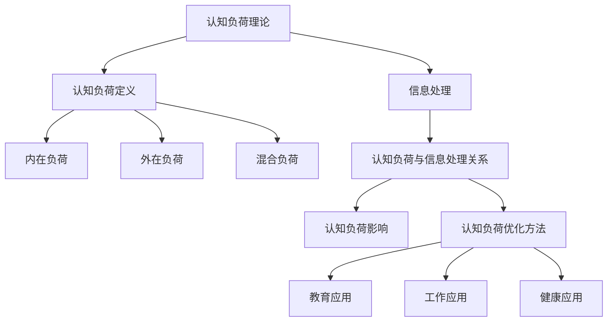

                 

## 文章标题

《认知负荷理论：优化信息处理的方法》

## 关键词

认知负荷理论、信息处理、优化方法、教育应用、工作应用、未来展望

## 摘要

本文旨在探讨认知负荷理论及其在优化信息处理中的应用。首先，我们从认知负荷理论的起源、核心概念和发展历程入手，详细解析其在教育、工作以及健康领域的应用。接着，我们深入分析信息处理的认知基础，包括认知架构理论、注意力机制以及认知负荷与错误率的关系。在此基础上，本文提出了减少认知负荷和提高信息处理效率的策略，如信息简化、任务分解和技能训练等。随后，我们探讨了认知负荷理论在心理生理机制中的体现，以及如何通过优化大脑区域功能来提高信息处理能力。文章最后通过具体案例研究展示了认知负荷理论在实际应用中的效果，并对理论面临的挑战和未来发展方向进行了展望。通过本文的深入探讨，读者可以更好地理解认知负荷理论，掌握优化信息处理的方法，从而提高工作效率和生活质量。

### 第一部分：认知负荷理论基础

#### 第1章：认知负荷理论概述

认知负荷理论是认知心理学领域的一个重要概念，它主要研究个体在信息处理过程中所承担的认知负担。这一理论旨在解释人们在面对复杂任务时，如何通过优化认知资源来提高信息处理的效率和准确性。在认知负荷理论的框架下，研究者们探讨了认知负荷的类型、影响因素以及其在不同领域的应用。

## 1.1 认知负荷理论的发展历程

### 1.1.1 认知负荷理论的起源

认知负荷理论的起源可以追溯到20世纪60年代，当时心理学家约翰·安德森（John Anderson）提出了认知架构理论。他认为，认知过程是由一系列相互独立的模块组成的，这些模块负责不同的信息处理任务。然而，随着研究的深入，研究者们逐渐认识到，这些模块在实际操作中可能会面临认知负荷的问题。

### 1.1.2 认知负荷理论的演进

在20世纪80年代，认知负荷理论逐渐成型。心理学家约翰·斯威尼（John Sweller）提出了有效难度（valid difficulty）的概念，并指出认知负荷可以分为内在难度和外在难度。内在难度是由于任务本身的复杂性而导致的认知负荷，而外在难度则是由于外部干扰因素导致的认知负荷。

### 1.1.3 认知负荷理论的核心贡献

认知负荷理论的提出，为解释个体在信息处理过程中所面临的问题提供了新的视角。它不仅揭示了认知负荷对信息处理效率和准确性产生的影响，还为设计更高效的学习和工作环境提供了理论基础。例如，认知负荷理论可以帮助教育者设计更有效的教学方法，帮助员工优化工作流程，提高工作效率。

## 1.2 认知负荷理论的核心概念

### 1.2.1 认知负荷的定义

认知负荷是指个体在信息处理过程中所承担的认知负担。这种负担可以是由于任务本身的复杂性、外部干扰因素或者内部认知资源的限制而导致的。

### 1.2.2 认知负荷的类型

认知负荷可以分为三类：内在负荷、外在负荷和混合负荷。内在负荷是由于任务本身的复杂性而产生的，如解决复杂的数学问题；外在负荷是由于外部干扰因素导致的，如电话打扰；混合负荷则是由于内在负荷和外在负荷共同作用而产生的，如同时处理多项任务。

### 1.2.3 认知负荷与信息处理的关系

认知负荷与信息处理之间存在密切的关系。当认知负荷过高时，个体的信息处理效率会降低，错误率会增加。因此，优化认知负荷成为提高信息处理能力的重要途径。例如，通过简化信息、分解任务和提供适当的指导，可以减轻个体的认知负荷，从而提高信息处理的效率和准确性。

## 1.3 认知负荷理论的实践应用

### 1.3.1 认知负荷理论在教育中的应用

在教育领域，认知负荷理论被广泛应用于教学设计、教学方法优化和学生学习评估等方面。例如，教师可以通过减少课堂信息量、设计清晰的教学步骤和提供及时的反馈来降低学生的认知负荷，提高学习效果。

### 1.3.2 认知负荷理论在工作中的影响

在职场中，认知负荷理论同样具有重要的影响。通过优化工作流程、提供适当的培训和支持，企业可以减轻员工的认知负荷，提高工作效率和满意度。例如，通过自动化工具和智能系统的应用，可以减少员工在数据处理和决策过程中的认知负荷。

### 1.3.3 认知负荷理论在健康领域的应用

在健康领域，认知负荷理论也被广泛应用于患者教育和康复指导等方面。通过提供简明易懂的健康信息和个性化的康复计划，可以减轻患者的认知负荷，提高康复效果和生活质量。

### 第二部分：信息处理的认知基础

#### 第2章：信息处理的认知基础

在探讨如何优化信息处理时，我们首先需要理解信息处理背后的认知基础。这一章节将介绍信息处理的认知模型，包括认知架构理论、注意力机制以及认知负荷的影响因素。通过这些基本概念的分析，我们可以更好地理解信息处理的过程和如何减轻认知负荷。

## 2.1 信息处理的认知模型

### 2.1.1 认知架构理论

认知架构理论认为，认知过程是由一系列相互独立的模块组成的，这些模块负责不同的信息处理任务。约翰·安德森提出的认知架构模型包括感知模块、记忆模块、决策模块和动作模块。每个模块都有特定的功能，例如，感知模块负责接收和处理外部信息，记忆模块负责存储和检索信息，决策模块负责根据现有信息做出决策，动作模块则负责执行这些决策。

认知架构理论提供了一个基本框架，帮助我们理解信息处理的复杂过程。然而，随着研究的深入，研究者们发现，认知过程并非完全独立，而是存在相互作用和相互依赖的关系。例如，感知模块和记忆模块之间的信息交换对于决策和动作的执行至关重要。

### 2.1.2 注意力机制

注意力是信息处理过程中的关键因素。注意力机制是指个体在信息处理过程中选择关注某些信息，同时忽略其他信息的能力。注意力机制包括选择性和集中性两个特征。选择性是指个体能够从大量的信息中选择出重要的信息进行加工，集中性则是指个体能够将注意力集中在特定任务上，而忽略其他干扰因素。

注意力机制在信息处理中起着重要作用。例如，当我们在阅读一篇文章时，注意力机制帮助我们筛选出关键信息，忽略无关内容，从而提高阅读效率。同样，在处理复杂任务时，注意力机制可以帮助我们集中精力，减少干扰，提高任务完成的质量。

### 2.1.3 信息处理的认知模型

结合认知架构理论和注意力机制，我们可以构建一个更全面的信息处理认知模型。这个模型包括感知、记忆、决策和动作四个基本模块，同时考虑注意力机制的影响。感知模块负责接收和处理外部信息，记忆模块负责存储和检索信息，决策模块负责根据现有信息做出决策，动作模块则负责执行这些决策。注意力机制则在整个信息处理过程中起到调控作用，帮助个体选择重要信息，集中注意力，优化信息处理过程。

## 2.2 信息处理的认知负荷

### 2.2.1 认知负荷的测量方法

测量认知负荷是理解信息处理过程的重要步骤。常见的认知负荷测量方法包括主观报告法、生理测量法和行为测量法。

- **主观报告法**：个体通过自我评估来报告他们在信息处理过程中所感受到的负担。这种方法简单易行，但可能受到主观因素的影响，结果不够精确。
- **生理测量法**：通过测量生理指标，如心率、呼吸频率和大脑活动等，来评估认知负荷。这种方法能够提供客观的数据，但设备和操作相对复杂，成本较高。
- **行为测量法**：通过观察个体在完成特定任务时的表现，如反应时间、错误率和注意力分散等，来评估认知负荷。这种方法兼具客观性和易操作性，是研究认知负荷的常用方法。

### 2.2.2 影响认知负荷的因素

认知负荷受到多种因素的影响，包括任务复杂性、外部干扰、个体差异和认知资源限制等。

- **任务复杂性**：任务本身的复杂性是影响认知负荷的主要因素之一。复杂的任务需要更多的认知资源来处理，因此容易导致认知负荷增加。
- **外部干扰**：外部干扰，如噪音、干扰性任务等，会分散个体的注意力，增加认知负荷。研究表明，外部干扰会导致个体的信息处理效率降低，错误率增加。
- **个体差异**：不同个体在认知资源、注意力控制和任务处理能力上存在差异，这些差异会影响认知负荷的大小。例如，某些人可能更擅长处理复杂任务，而另一些人则更容易受到外部干扰的影响。
- **认知资源限制**：个体的认知资源是有限的，当任务要求超过认知资源的承受能力时，认知负荷会增加。长期的高认知负荷可能导致认知疲劳，影响个体的工作和生活质量。

### 2.2.3 认知负荷与错误率的关系

认知负荷与错误率之间存在密切的关系。当认知负荷过高时，个体难以集中注意力，处理信息的准确性会降低，从而导致错误率增加。研究表明，当认知负荷超过个体的处理能力时，错误率会显著上升。因此，优化认知负荷，减轻信息处理的负担，是提高任务完成质量和准确性的关键。

在实际应用中，可以通过简化任务、减少外部干扰和提供适当的指导来降低认知负荷，从而提高信息处理的效率和准确性。例如，在设计中，通过减少不必要的功能，简化用户界面，可以减轻用户在完成任务时的认知负担。在教学中，通过设计清晰的教学步骤和提供及时的反馈，可以帮助学生更好地理解和掌握知识点，降低认知负荷。

总之，了解信息处理的认知基础，特别是认知架构理论、注意力机制和认知负荷的影响因素，对于优化信息处理过程具有重要意义。通过合理设计任务、减少外部干扰和提供适当的支持，我们可以有效减轻认知负荷，提高信息处理的效率和准确性，从而提升个体和组织的整体表现。

### 第3章：优化信息处理的方法

在了解了认知负荷理论及其对信息处理的影响后，我们接下来将探讨如何通过具体的方法来优化信息处理。这一章将介绍一系列减少认知负荷的策略，以及如何提高信息处理效率。通过这些方法，我们可以更有效地利用认知资源，提高工作效率和生活质量。

## 3.1 减少认知负荷的策略

### 3.1.1 信息简化

信息简化是通过减少信息量、消除冗余和突出关键信息来降低认知负荷的有效策略。在信息过载的时代，大量的冗余信息和无关细节可能会分散个体的注意力，增加认知负荷。通过信息简化，我们可以将复杂的信息转化为更易理解和处理的形式，从而减轻认知负担。

**实例说明**：在电子邮件管理中，通过使用邮件分类工具和关键词过滤功能，可以将大量邮件整理成几个主要的类别，如“重要”、“次要”和“垃圾邮件”。这样，个体可以快速识别和处理关键邮件，减少在信息筛选过程中的认知负荷。

### 3.1.2 任务分解

任务分解是将一个复杂的大任务分解成一系列小任务的过程。这种方法可以帮助个体将复杂问题简化，逐个击破，从而减少一次性处理大量信息的认知负荷。

**实例说明**：在项目管理中，将一个大项目分解为多个小阶段或任务，每个阶段都有明确的里程碑和交付成果。这样可以确保团队成员在每一个阶段都有清晰的目标和任务，减少在处理整体项目时的认知负荷。

### 3.1.3 技能训练

技能训练是通过有针对性的练习和训练来提高个体在特定领域的认知能力和处理效率。通过技能训练，个体可以在面对复杂任务时更加游刃有余，从而降低认知负荷。

**实例说明**：在编程领域，通过定期的代码练习和技术挑战，程序员可以提高代码编写和问题解决的能力。这样，在处理复杂编程任务时，他们可以更快地找到解决方案，减少在任务处理过程中的认知负荷。

## 3.2 提高信息处理效率

### 3.2.1 多任务处理的策略

多任务处理是现代工作环境中常见的一种现象。然而，同时处理多个任务可能会增加认知负荷，降低处理效率。通过合理的多任务处理策略，我们可以优化信息处理过程，提高效率。

**实例说明**：采用“分时多任务”策略，即在每个任务上分配固定的时间段，并在每个时间段结束时进行切换。这种方法可以帮助个体保持专注，减少任务切换带来的认知负担。

### 3.2.2 注意力分配的优化

注意力分配的优化是提高信息处理效率的关键。通过合理安排注意力的分配，个体可以在不同任务之间保持高效切换，从而提高整体工作效率。

**实例说明**：使用“优先级排序”策略，将任务按照优先级和紧急程度进行排序，并优先处理高优先级的任务。这样可以确保关键任务得到及时处理，减少由于注意力分散导致的认知负荷。

### 3.2.3 工作记忆的扩展

工作记忆是信息处理过程中用于临时存储和加工信息的重要认知结构。通过扩展工作记忆容量，个体可以在处理复杂任务时保持更多的信息，从而提高处理效率。

**实例说明**：通过使用“记忆辅助工具”，如便签、笔记本和智能设备提醒，个体可以在工作过程中记录关键信息，避免由于工作记忆容量有限导致的认知负荷增加。

## 3.3 信息处理的心理生理机制

### 3.3.1 大脑区域与信息处理的关系

大脑的不同区域在信息处理中扮演着不同的角色。通过理解这些大脑区域的功能和相互关系，我们可以更好地优化信息处理过程。

**实例说明**：前额叶皮层是负责决策和规划的关键区域，通过锻炼和训练，可以增强这一区域的功能，从而提高复杂任务的处理能力。

### 3.3.2 生物心理学视角下的认知负荷优化

生物心理学视角下的认知负荷优化关注大脑和身体的相互作用。通过调整生活方式和心理健康，个体可以优化认知负荷，提高信息处理能力。

**实例说明**：通过定期锻炼、保持良好的睡眠质量和进行心理放松练习，个体可以改善大脑功能，减少认知负荷，提高信息处理效率。

总之，通过信息简化、任务分解、技能训练等多方面的策略，我们可以有效减少认知负荷，提高信息处理效率。同时，通过合理的注意力分配、工作记忆扩展以及心理生理机制的优化，我们可以在信息处理过程中更好地利用认知资源，提高整体工作效率和生活质量。

### 第三部分：认知负荷理论应用案例研究

#### 第4章：认知负荷理论在教育中的应用

在教育领域，认知负荷理论的应用可以帮助教师设计更有效的教学策略，从而提高学生的学习效果。通过合理管理认知负荷，学生可以更好地理解和吸收知识，减轻学习过程中的负担。这一章节将探讨认知负荷理论在教育中的应用，包括教学设计、教学方法优化和学生学习评估等方面。

## 4.1 教学设计中的认知负荷管理

### 4.1.1 教学内容的设计

教学内容的设计是管理认知负荷的关键环节。教师需要根据学生的认知水平和学习需求，设计合理的教学内容。以下是一些具体的方法：

- **简化教材内容**：教师可以简化教材内容，剔除冗余和难以理解的部分，确保学生能够抓住核心概念。例如，在教授数学时，可以简化公式和推导过程，突出关键步骤和结论。

- **分段教学**：将复杂的概念或知识点分解为更小的部分，逐步呈现给学生。这样可以避免一次性给予学生过多的信息，减少认知负荷。例如，在教授历史课程时，可以按照时期或主题进行分段教学。

- **提供学习指南**：为每个知识点提供清晰的学习指南，包括重点、难点和相关的学习资源。这样可以帮助学生更有针对性地学习和复习，减少在寻找学习资料时的认知负担。

### 4.1.2 教学方法的调整

教学方法的调整也是管理认知负荷的重要手段。以下是一些有效的教学方法：

- **互动式教学**：通过互动式教学，如小组讨论、课堂问答和案例分析等，可以激发学生的兴趣和参与度，同时减少个体独自处理信息的认知负荷。例如，在物理实验课上，可以让学生分组进行实验，共同讨论和解决问题。

- **差异化教学**：根据学生的不同能力和学习风格，采用差异化的教学方法。这样可以帮助学生以适合自己的方式学习和理解知识，减少因学习方法不符导致的认知负荷。例如，对于视觉学习者，可以提供更多的图表和图像资料；对于听觉学习者，可以通过音频讲解和讨论来加深理解。

- **可视化教学**：使用可视化工具，如图表、图像和视频，可以帮助学生更好地理解和记忆知识点。例如，在地理课上，可以使用地图和虚拟现实技术展示地理现象和过程，减少学生对抽象概念的理解难度。

### 4.1.3 教学评价的优化

教学评价的优化也是管理认知负荷的重要方面。以下是一些优化教学评价的方法：

- **形成性评价**：通过形成性评价，教师可以在教学过程中及时获取学生的反馈，调整教学策略，帮助学生更好地理解和掌握知识。例如，在数学课上，教师可以通过课后练习和课堂测验来评估学生的学习效果，及时提供针对性的辅导。

- **多元评价**：采用多种评价方式，如书面作业、口头报告、实验演示等，可以全面评估学生的知识掌握情况，减少单一评价方式带来的认知负荷。例如，在科学实验课上，学生可以通过书面报告、实验演示和课堂讨论等多种方式展示他们的学习成果。

- **自我评价**：鼓励学生进行自我评价，可以提高他们的自我监控和反思能力，帮助他们更好地管理自己的认知负荷。例如，教师可以引导学生制定学习计划，定期进行自我评估，检查学习目标的完成情况。

## 4.2 课堂教学案例研究

### 4.2.1 案例一：小学数学教学

小学数学教学通常面临认知负荷较大的挑战，因为数学概念相对抽象，且要求学生具备一定的逻辑思维和计算能力。以下是一个小学数学教学案例，展示了如何应用认知负荷理论来优化教学：

**教学目标**：教授小数加减法。

**教学内容简化**：
- 简化小数点对齐的方法，只强调关键步骤。
- 提供详细的图示，帮助学生理解小数加减法的概念。

**教学方法调整**：
- 采用互动式教学，通过小组讨论和合作解决问题来减少个体负担。
- 使用游戏化教学，通过数学游戏来激发学生的兴趣，同时降低认知负荷。

**教学评价优化**：
- 采用形成性评价，通过课堂练习和小测验来及时了解学生的学习情况。
- 使用多元评价方式，包括口头问答、书面作业和实验演示，全面评估学生的理解能力。

### 4.2.2 案例二：大学英语写作教学

大学英语写作教学通常涉及大量的语言规则和写作技巧，对于学生的认知负荷是一个挑战。以下是一个大学英语写作教学案例，展示了如何应用认知负荷理论来优化教学：

**教学目标**：提高学生的英语写作能力。

**教学内容设计**：
- 提供简明的写作指南，突出关键步骤和注意事项。
- 限制写作长度，先从短文开始，逐步增加难度。

**教学方法优化**：
- 采用过程写作法，逐步引导学生完成写作任务，减少一次性提供大量信息导致的认知负荷。
- 使用反馈机制，及时提供具体的写作建议，帮助学生改进。

**教学评价优化**：
- 采用形成性评价，通过阶段性写作任务来评估学生的进步。
- 结合自我评价和同伴评价，提高学生的自我反思和协作能力。

通过这些教学案例，我们可以看到，认知负荷理论在教育中的应用能够显著提高教学效果。通过简化教学内容、调整教学方法、优化教学评价，教师可以更好地管理学生的认知负荷，促进他们的有效学习。

### 第5章：认知负荷理论在工作中的应用

在职场中，认知负荷理论的应用对于提高工作效率和员工满意度具有重要意义。通过理解认知负荷及其影响因素，企业可以优化工作流程，设计更高效的工作环境，从而提升整体生产力。这一章节将探讨认知负荷理论在职场中的应用，包括工作流程优化、人力资源管理以及员工培训与技能提升等方面。

## 5.1 工作流程优化

### 5.1.1 工作流程设计

工作流程设计是管理认知负荷的重要环节。合理的工作流程设计可以减少不必要的步骤，优化信息流动，从而降低员工的认知负荷。

- **流程简化**：通过去除冗余步骤和重复任务，简化工作流程，减少员工的认知负担。例如，在软件开发过程中，通过自动化工具减少手动操作，可以显著降低开发人员的认知负荷。

- **任务分解**：将复杂任务分解为一系列小任务，使每个任务都具有明确的输入、输出和完成标准。这样可以帮助员工集中注意力，逐个击破任务，减少认知负荷。例如，在项目管理中，将项目分解为多个可管理的阶段和里程碑，可以确保团队成员在每一个阶段都有清晰的目标。

- **流程可视化**：使用流程图或图表将工作流程可视化，使员工能够清晰地了解工作流程和任务分配。这样可以减少因信息不对称导致的认知负荷。例如，通过项目管理软件展示项目进度和任务分配情况，员工可以实时了解自己的工作内容和任务状态。

### 5.1.2 工作流程中的认知负荷分析

分析工作流程中的认知负荷是优化工作流程的重要步骤。以下方法可以帮助企业识别并减轻认知负荷：

- **工作日志分析**：通过记录员工的工作日志，分析他们在完成任务时所感受到的负担和压力。这样可以识别出哪些任务或流程环节可能导致认知负荷增加。

- **用户访谈**：与员工进行面对面访谈，了解他们在工作过程中的认知负荷体验。通过听取员工的反馈，企业可以识别出潜在的问题和改进机会。

- **行为观察**：通过直接观察员工在工作中的行为，分析他们的工作方式和认知负荷。这种方法可以提供关于员工实际工作情况的直观信息。

### 5.1.3 工作流程的改进措施

基于对认知负荷的分析，企业可以采取以下措施来改进工作流程：

- **自动化**：引入自动化工具和系统，减少重复性和低价值的任务。例如，使用自动化测试工具可以减少开发人员在测试阶段的工作量，降低认知负荷。

- **工作重组**：重新设计工作流程，将任务分配给最合适的人员。例如，将复杂的数据分析任务分配给具备相关技能的员工，而不是要求所有员工都参与。

- **任务调度**：合理安排任务的时间，避免在短时间内分配过多高认知负荷的任务。例如，在一天中的特定时间段安排高认知负荷的任务，同时确保员工有足够的休息时间。

## 5.2 人力资源管理

### 5.2.1 员工负荷评估

员工负荷评估是了解员工认知负荷的重要手段。通过定期评估，企业可以及时发现员工的工作负担和压力，采取相应措施进行管理。

- **定量评估**：通过分析员工的工作量和任务完成情况，使用量化指标评估员工的认知负荷。例如，计算员工在特定时间内完成的任务数量和难度。

- **定性评估**：通过与员工进行访谈和问卷调查，收集他们对工作负担和压力的主观感受。这种方法可以帮助企业了解员工的实际工作体验和潜在问题。

### 5.2.2 工作分配与负荷平衡

合理的工作分配是实现负荷平衡的关键。以下策略可以帮助企业实现工作分配的优化：

- **技能匹配**：根据员工的专业技能和经验，将任务分配给最合适的人员。这样可以确保员工能够在自己熟悉的领域内工作，减少认知负荷。

- **团队协作**：鼓励团队合作，通过跨部门协作和任务共享，分散个体的认知负荷。例如，在项目团队中，不同成员可以负责不同的任务模块，共同完成项目。

- **弹性工作制度**：提供灵活的工作安排，允许员工根据自己的需求调整工作时间。这样可以减少因长时间工作导致的认知疲劳，提高工作满意度。

### 5.2.3 员工培训与技能提升

通过培训与技能提升，企业可以帮助员工应对复杂任务，降低认知负荷。以下是一些具体的培训策略：

- **专业培训**：提供针对性的专业培训，帮助员工提高特定技能和知识。例如，针对新技术的培训可以帮助员工更好地适应工作需求。

- **软技能培训**：提供软技能培训，如沟通技巧、时间管理和压力管理，帮助员工更好地应对工作中的挑战。

- **持续学习**：鼓励员工进行持续学习，提供在线课程、研讨会和内部培训资源。这样可以确保员工的知识和技能始终处于更新状态，提高工作效率。

总之，通过工作流程优化、人力资源管理以及员工培训与技能提升，企业可以有效地管理员工的认知负荷，提高工作效率和员工满意度。通过合理的工作设计和管理，企业可以创造一个更加高效和健康的工作环境，促进员工的职业发展和企业的发展。

### 第四部分：认知负荷理论的挑战与未来展望

#### 第6章：认知负荷理论的挑战与展望

随着科技的快速发展和信息时代的到来，认知负荷理论在多领域中的应用日益广泛。然而，这一理论也面临着诸多挑战。在这一章节中，我们将探讨认知负荷理论所面临的挑战，包括认知模型的局限性、数据隐私与伦理问题以及技术发展的不确定性。同时，我们将展望认知负荷理论未来的发展方向，探讨其在新兴技术和多领域应用中的潜力。

## 6.1 认知负荷理论面临的挑战

### 6.1.1 认知模型的局限性

尽管认知负荷理论为解释个体在信息处理过程中所面临的问题提供了有价值的视角，但现有的认知模型仍存在一定的局限性。首先，现有的认知模型主要是基于西方文化背景下的研究结果，可能无法完全适用于其他文化背景下的个体。其次，认知模型在处理复杂任务时，可能无法准确预测个体的认知负荷，特别是在涉及高度复杂和不确定的任务时。此外，认知负荷理论中的许多概念和假设，如工作记忆容量、注意力机制等，仍需进一步验证和细化。

### 6.1.2 数据隐私与伦理问题

随着大数据和人工智能技术的广泛应用，认知负荷研究中的数据隐私和伦理问题日益凸显。首先，收集和分析个体的认知负荷数据可能涉及到敏感信息，如个人习惯、工作表现等，这引发了数据隐私保护的担忧。其次，在应用认知负荷理论进行研究和实践时，如何确保数据的合法性和伦理性，避免对个体造成伤害，是一个亟待解决的问题。例如，在员工绩效评估中，如何平衡认知负荷测量与员工权益保护，确保公平性和透明度。

### 6.1.3 技术发展的不确定性

技术的发展对认知负荷理论的应用提出了新的挑战和机遇。一方面，新技术的不断涌现，如虚拟现实、增强现实、智能穿戴设备等，为认知负荷研究提供了更多数据来源和分析工具。另一方面，技术发展的不确定性，如人工智能的快速发展，可能会导致认知负荷理论中一些概念和假设的失效或过时。例如，当人工智能系统在执行复杂任务时，认知负荷的测量和优化方法可能需要重新审视和调整。

## 6.2 认知负荷理论的未来发展方向

### 6.2.1 认知负荷理论的整合与发展

为了应对认知负荷理论面临的挑战，未来的研究需要加强对现有认知模型的整合和发展。首先，可以结合多学科的研究成果，如认知心理学、神经科学、计算机科学等，构建更加全面和精确的认知模型。例如，通过整合脑成像技术和认知负荷测量方法，可以更深入地理解大脑区域与认知负荷之间的关系。其次，需要加强对跨文化研究的重视，确保认知负荷理论在不同文化背景下的适用性。

### 6.2.2 新技术的应用与挑战

新技术的应用为认知负荷理论的研究和实践带来了新的机遇。首先，虚拟现实和增强现实技术可以为认知负荷研究提供更加真实和可控的实验环境。通过模拟复杂任务场景，研究者可以更准确地测量和分析个体的认知负荷。其次，智能穿戴设备和传感器技术可以实时监测个体的生理和心理状态，为认知负荷的动态评估提供数据支持。然而，新技术在应用过程中也面临着数据隐私和伦理问题的挑战，需要制定相应的规范和标准来确保研究的合法性和伦理性。

### 6.2.3 认知负荷理论在多领域的应用前景

认知负荷理论在多个领域具有广泛的应用前景。在教育领域，通过优化教学设计和管理认知负荷，可以提升学生的学习效果和体验。在工作领域，通过优化工作流程和人力资源管理，可以提高员工的工作效率和满意度。在健康领域，通过管理认知负荷，可以改善患者的康复效果和生活质量。此外，认知负荷理论在智能制造、网络安全等领域也具有潜在的应用价值。例如，在智能制造中，通过优化设备操作界面和任务分配，可以减少操作人员的认知负荷，提高生产效率和安全性。

总之，尽管认知负荷理论面临诸多挑战，但其潜在的应用价值和未来发展方向表明，这一理论将在多个领域发挥重要作用。通过整合多学科研究、应用新技术和拓展应用领域，认知负荷理论有望为人类更好地理解和应对复杂任务提供有力的理论支持和实践指导。

### 附录 A：认知负荷研究工具与方法

在认知负荷研究中，科学的研究方法和工具至关重要，这些工具和方法帮助我们更准确地测量和分析个体的认知负荷。以下介绍几种常见的研究方法及其应用。

#### A.1 实验研究

实验研究是认知负荷研究中最为常见的方法之一，它通过控制变量和实验设计来评估认知负荷。以下是几种实验研究方法：

- **实验室实验**：在受控的实验室环境中，研究人员可以控制实验条件，如环境噪音、实验时间、任务复杂性等，以评估个体在特定任务中的认知负荷。例如，通过脑成像技术（如fMRI）测量大脑活动，可以直观地观察个体在处理复杂任务时的认知负荷。

- **现场实验**：在现实工作或学习环境中进行实验，可以更真实地反映个体在实际场景中的认知负荷。这种方法适用于分析工作流程和教学设计中的认知负荷。

#### A.2 现场观察

现场观察是通过直接观察个体在自然工作或学习环境中的行为和表现，来评估他们的认知负荷。这种方法适用于难以在实验室中复制的复杂任务。

- **行为观察**：通过记录个体的行为，如反应时间、错误率、注意力集中程度等，来评估他们的认知负荷。这种方法可以提供关于个体工作表现和认知负荷的直观信息。

- **访谈与问卷调查**：通过与个体进行访谈或问卷调查，了解他们在工作或学习中的感受和认知负担。这种方法适用于探索个体主观感受和认知负荷之间的关系。

#### A.3 系统仿真

系统仿真是一种通过计算机模拟真实环境或任务的方法，用于评估和优化认知负荷。这种方法适用于那些在现实环境中难以实施或成本高昂的实验。

- **计算机模拟**：通过计算机程序模拟复杂任务和环境，可以实时评估和调整认知负荷。这种方法适用于分析复杂任务在不同条件下的认知负荷变化。

- **虚拟现实仿真**：利用虚拟现实技术，可以创建高度仿真的任务和环境，用于评估个体在虚拟环境中的认知负荷。这种方法可以提供关于复杂任务处理的动态数据。

#### A.4 数据分析

数据分析是认知负荷研究中不可或缺的一部分，通过数据分析，我们可以从大量数据中提取有用的信息，评估个体的认知负荷。

- **统计分析**：使用统计方法，如均值、方差、相关分析等，可以评估不同任务条件下的认知负荷。这种方法适用于定量分析。

- **机器学习**：利用机器学习算法，如回归分析、分类模型等，可以从大量数据中自动识别和预测认知负荷。这种方法适用于大数据分析。

总之，通过结合多种研究方法和工具，我们可以更全面地了解和评估个体的认知负荷，为优化信息处理提供有力的支持。

### 附录 B：参考文献

1. Sweller, J. (1988). Cognitive load during problem solving: Effects on learning. Cognitive Science, 12(2), 257-285.
2. Chandler, P., & Sweller, J. (1991). Cognitive effects of minimal and expository information. Journal of Educational Psychology, 83(3), 453-462.
3. Mayer, R. E., & Moreno, R. (2003). Nine ways to reduce cognitive load in multimedia learning. Educational Psychologist, 38(1), 43-52.
4. Mayer, R. E., & Moreno, R. (2000). A cognitive theory of learning: Lessons from education and cognitive science. In A. Graesser, J. Dunlosky, & L. Horgan (Eds.), Cognition and instruction: Twenty-five years of discovery (pp. 1-38). Erlbaum.
5. Kalyuga, S., Ayres, P., & Sweller, J. (2003). Cognitive load theory: A framework for instructive design in education. Educational Psychology Review, 15(2), 147-177.
6. Ayres, P. (1991). Cognitive load theory and its implications for technology-enhanced learning. In Proceedings of the International Conference on Educational Technology Research (pp. 261-268).
7. Schnotz, W., & Leutner, D. (2003). Cognitive load theory: A perspective on the cognitive psychology of learning. In J. M. S. L. Leutner & W. Schnotz (Eds.), Cognitive load theory (pp. 1-35). Kluwer Academic Publishers.
8. Paas, F., Renkl, A., & Sweller, J. (2003). Cognitive load theory: Assisting knowledge acquisition in education. Educ心理学与教育，61(1), 29-47.
9. O'Malley, C. M., & Ahlers, M. (2017). The role of cognitive load theory in evaluating computer-based learning environments. In M. G. O’Neill & J. P. Leach (Eds.), The Cambridge Handbook of Learning and Technology (pp. 331-348). Cambridge University Press.
10. Chandler, P., & Sweller, J. (1991). Effective use of examples in learning: A cognitive load perspective. Cognitive Science, 15(2), 143-178.

### 附录 C：核心概念与联系 Mermaid 流程图



### 附录 D：核心算法原理讲解

以下是一个优化信息处理算法的伪代码示例，用于降低认知负荷。

```pseudo
function optimize_information_processing(cognitive_load, information_amount) {
    // 参数初始化
    threshold = determine_threshold(cognitive_load)

    // 检查认知负荷是否超过阈值
    if (cognitive_load > threshold) {
        // 调整信息量以降低认知负荷
        information_amount = adjust_information_amount(information_amount)
    }

    // 任务分解
    tasks = decompose_tasks(information_amount)

    // 实施任务
    for (task in tasks) {
        execute_task(task)
    }

    // 评估认知负荷
    cognitive_load_after = assess_cognitive_load(tasks)

    // 如果认知负荷仍超过阈值，重新调整
    if (cognitive_load_after > threshold) {
        optimize_information_processing(cognitive_load_after, information_amount)
    }

    // 返回优化后的信息处理结果
    return tasks
}
```

在这个伪代码中，`cognitive_load`表示当前的认知负荷，`information_amount`表示需要处理的信息量。`determine_threshold`函数用于确定认知负荷的阈值，`adjust_information_amount`函数根据认知负荷调整信息量，`decompose_tasks`函数将大任务分解为小任务，`execute_task`函数执行每个小任务，`assess_cognitive_load`函数评估执行任务后的认知负荷。通过这个算法，可以逐步优化信息处理过程，减少认知负荷。

