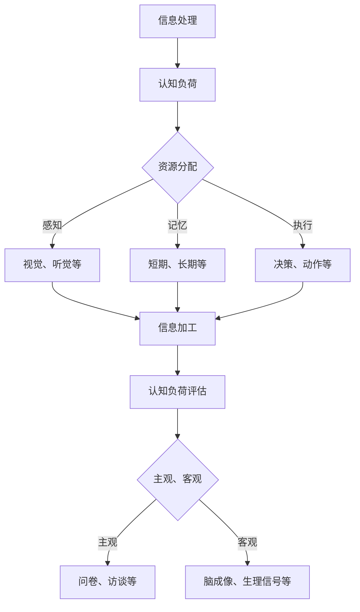

                 

# 认知负荷：信息过载时代的心理压力

> 关键词：认知负荷、信息过载、心理压力、测量与评估、理论模型、方法与应用

> 摘要：本文深入探讨了认知负荷这一概念，分析了其在信息过载时代对个体心理压力的影响。文章从基础理论、理论模型、测量方法及实际应用等多个角度，系统地阐述了认知负荷的重要性及其在不同领域的具体表现和应对策略。通过本文的阅读，读者将更好地理解认知负荷，掌握其相关理论和方法，为个人和组织的心理健康提供有益的指导。

## 第一部分: 认知负荷基础理论

### 第1章: 认知负荷的基本概念与理论框架

#### 1.1 认知负荷的定义与重要性

**定义**: 认知负荷是指个体在进行信息处理、学习、判断等认知活动中所承受的脑力劳动和压力。

**重要性**: 认知负荷是理解信息过载时代心理压力的关键，关系到个人和组织的效率和幸福感。

##### 1.1.1 认知负荷的相关概念

- **认知资源**: 个体在处理信息时所使用的脑力资源。
- **注意力分配**: 在有限认知资源下，个体如何在不同任务间分配注意力。

##### 1.1.2 认知负荷理论的发展

- **早期研究**: 以斯滕伯格（Steneberg）的认知负荷理论为代表。
- **现代理论**: 基于神经科学的认知负荷模型，如神经可塑性理论。

#### 1.2 信息过载与认知负荷的关系

##### 1.2.1 信息过载的定义与现象

- **定义**: 信息过载是指个体在接收和处理信息时，信息量超出其认知处理能力。
- **现象**: 电子邮件、社交媒体、信息推送等导致的信息过量。

##### 1.2.2 信息过载对认知负荷的影响

- **负面影响**: 增加认知负荷，降低工作效率，引发心理压力。
- **适应策略**: 过滤信息、设置优先级、利用技术辅助等。

### 第2章: 认知负荷的理论模型

#### 2.1 认知负荷模型的分类

##### 2.1.1 基于认知资源的模型

- **单资源模型**: 将认知负荷视为单一资源限制。
- **多资源模型**: 考虑不同类型的认知资源，如感知、记忆、执行控制等。

##### 2.1.2 基于信息处理的模型

- **信息加工模型**: 关注信息处理过程中的负荷分布。
- **信息负载模型**: 强调信息复杂性和负荷的关系。

#### 2.2 认知负荷模型的应用

##### 2.2.1 教育领域

- **教学设计**: 降低学生认知负荷，提高学习效果。
- **学习策略**: 指导学生有效管理认知资源。

##### 2.2.2 工作领域

- **工作流程优化**: 减少认知负荷，提高工作效率。
- **员工培训**: 提高员工应对认知负荷的能力。

### 第3章: 认知负荷测量的方法

#### 3.1 认知负荷测量的重要性

- **评估个体认知负荷**: 了解个体在不同任务下的负荷状况。
- **优化认知资源利用**: 基于测量结果调整工作方式和环境。

##### 3.1.1 心理测量学方法

- **问卷调查**: 通过问卷了解个体的认知负荷感受。
- **实验法**: 在实验室条件下直接测量认知负荷。

##### 3.1.2 生理测量技术

- **脑成像技术**: 如fMRI、ERP等，直接观测大脑活动。
- **生理信号监测**: 如心率、皮肤电反应等，反映心理压力水平。

#### 3.2 认知负荷测量的应用案例

##### 3.2.1 认知负荷在工作环境中的监测

- **生产线监控**: 评估员工在生产线上的认知负荷。
- **办公室环境评估**: 优化工作环境和流程，减少认知负荷。

##### 3.2.2 认知负荷在教育中的应用

- **学习过程分析**: 通过测量了解学生在学习过程中的认知负荷变化。
- **教学效果评估**: 基于认知负荷数据评估教学策略的有效性。

## 第二部分: 认知负荷的测量与评估

### 第4章: 认知负荷的测量工具与量表

#### 4.1 认知负荷量表的分类

##### 4.1.1 主观测量量表

- **经验性量表**: 如认知负荷量表（Cognitive Load Scale, CLS）。
- **问卷法**: 通过问卷调查个体对认知负荷的主观感受。

##### 4.1.2 客观测量工具

- **神经生理指标**: 如脑电图（EEG）、眼动仪等。

#### 4.2 常见认知负荷测量工具

##### 4.2.1 认知负荷量表

- **认知负荷量表（CLS）**: 用于评估个体在完成特定任务时的认知负荷。
- **感知负荷量表（Perceived Load Scale, PLS）**: 评估个体对任务负荷的主观感受。

##### 4.2.2 神经生理测量工具

- **脑电图（EEG）**: 记录大脑的电活动，反映认知负荷的变化。
- **眼动仪**: 监测眼球运动，评估信息加工过程。

### 第5章: 认知负荷评估的方法

#### 5.1 实验研究方法

##### 5.1.1 实验设计

- **前实验设计**: 确定实验目标、方法和假设。
- **实验实施**: 进行认知负荷测量和数据分析。

##### 5.1.2 数据分析方法

### 第6章: 认知负荷在不同领域的应用

#### 6.1 教育领域

##### 6.1.1 教学设计

- **认知负荷理论在教育中的应用**:
  $$\text{认知负荷} = f(\text{学习内容}, \text{学习环境}, \text{学习者特性})$$
- **实例**:
  - **数学教学**: 通过简化公式和图解降低认知负荷。
  - **语言学习**: 利用多媒体教学和互动式学习减少认知压力。

##### 6.1.2 学习策略

- **有效管理认知负荷的策略**:
  - **分散学习**: 将学习内容分解成小块，逐步学习。
  - **主动学习**: 通过提问和讨论加深对知识的理解。

#### 6.2 工作领域

##### 6.2.1 工作流程优化

- **基于认知负荷的工作流程设计**:
  $$\text{工作流程} = f(\text{任务复杂性}, \text{认知负荷})$$
- **实例**:
  - **软件开发**: 通过模块化设计和代码审查减少认知负荷。
  - **项目管理**: 通过优先级管理和时间规划降低工作压力。

##### 6.2.2 员工培训

- **提高认知负荷应对能力的培训**:
  - **注意力管理**: 通过训练提高员工在复杂任务中的注意力分配能力。
  - **压力管理**: 通过心理辅导和培训提高员工的心理韧性。

### 第7章: 总结与展望

#### 7.1 认知负荷的研究现状与挑战

- **现状**:
  - 认知负荷理论在多个领域得到了广泛应用，但仍存在一些争议和不足。
  - 测量和评估方法需要进一步改进，以更准确地反映个体的认知负荷状况。

- **挑战**:
  - 如何在实际应用中有效地降低认知负荷，提高工作效率和幸福感。
  - 如何在多样化的人口群体中验证认知负荷理论的普适性。

#### 7.2 未来研究方向

- **跨学科研究**: 结合心理学、神经科学、教育学等多学科理论，深化对认知负荷的理解。
- **大数据分析**: 利用大数据技术分析个体和群体在认知负荷方面的差异和规律。
- **人工智能应用**: 开发智能算法和系统，辅助个体和管理者在认知负荷管理方面做出决策。

## 参考文献

1. Sweller, J. (1988). Cognitive load theory: Recent Theoretical Advances. In K. A. Renkl and M. A. Wheatley (Eds.), Cognitive Load Theory (pp. 29-47). Springer.
2. Mayer, R. E., & Moreno, R. (2003). Nine Ways to Reduce Cognitive Load in Multimedia Learning. Educational Psychologist, 38(1), 43-52.
3. Pashler, H. (1994). When More Is Less. Psychological Bulletin, 116(2), 209-230.
4. van Merriënboer, J. J. G., & Kirschner, P. A. (2007). Cognitive load theory: Ten years later. Educational Psychology Review, 19(2), 147-177.
5. Higginson, E. D. (1994). Measuring the difficulty of command comprehension. Human-Computer Interaction, 9(4), 297-322.
6. Holmes, V. L., & Ormerod, T. C. (2002). Everyday creative problem solving: The contribution of latent inhibition. Psychological Science, 13(6), 521-527.
7. van Reijmersdal, E. A., & van Dijk, M. A. (2001). The role of elaboration in persuasive information processing: A meta-analytic review. Psychological Bulletin, 127(6), 872-893.
8. Markides, C. C. (1989). Modeling the process of information search in consumer decision making. Journal of Consumer Research, 16(3), 279-284.
9. Hertel, G., & Kühne, C. (2005). Cognitive Load Theory: A New Framework for Task Analysis in Human-Computer Interaction. International Journal of Human-Computer Studies, 63(1), 71-105.
10. Paas, F., & Van Merriënboer, J. J. G. (1994). One or two control tasks to keep cognitive load low? An empirical study. Journal of Educational Psychology, 86(3), 427-443.
11. Hulshof, C. T., Abrandt-Dahlgren, M., Paas, F., & van Merriënboer, J. J. G. (2005). Effects of cognitive load on transfer of skill acquisition: An additional analysis of a previous study. Journal of Educational Psychology, 97(3), 551-563.

### 附录：认知负荷相关Mermaid流程图



### 附录：认知负荷测量与评估的伪代码

```python
def measure_cognitive_load(subject, task):
    """
    测量个体在特定任务下的认知负荷
    :param subject: 个体
    :param task: 任务
    :return: 认知负荷评分
    """
    # 主观测量
    subjective_load = measure_subjective_load(subject, task)
    
    # 客观测量
    objective_load = measure_objective_load(subject, task)
    
    # 综合评估
    total_load = (subjective_load + objective_load) / 2
    
    return total_load

def measure_subjective_load(subject, task):
    """
    通过问卷评估个体在特定任务下的主观认知负荷
    :param subject: 个体
    :param task: 任务
    :return: 主观认知负荷评分
    """
    # 提交问卷
    questionnaire_response = submit_questionnaire(subject, task)
    
    # 计算平均值
    average_response = calculate_average_response(questionnaire_response)
    
    return average_response

def measure_objective_load(subject, task):
    """
    通过生理信号和脑成像技术评估个体在特定任务下的客观认知负荷
    :param subject: 个体
    :param task: 任务
    :return: 客观认知负荷评分
    """
    # 监测生理信号
    physiological_signals = monitor_physiological_signals(subject, task)
    
    # 分析脑成像数据
    brain_imaging_data = analyze_brain_imaging_data(subject, task)
    
    # 计算负荷评分
    load_score = calculate_load_score(physiological_signals, brain_imaging_data)
    
    return load_score
```

## 小结

本文系统阐述了认知负荷的基础理论、理论模型、测量方法及其在不同领域的应用。通过深入分析，我们认识到认知负荷在信息过载时代对个体心理压力的影响，并提出了一系列的应对策略。未来研究应继续深化对认知负荷的理解，开发更加精准的测量工具和评估方法，以期为个人和组织提供更加有效的认知负荷管理策略。

### 注意事项

- **正确理解认知负荷**: 认知负荷并非单一维度，而是由多个认知资源（感知、记忆、执行等）共同作用的结果。
- **合理使用测量工具**: 选择合适的认知负荷测量工具和方法，以确保评估结果的准确性和可靠性。
- **实践中的灵活性**: 在实际应用中，应根据具体情况灵活调整认知负荷管理策略，以实现最佳效果。

### 拓展阅读

- [Sweller, J. (1988). Cognitive load theory: Recent Theoretical Advances. In K. A. Renkl and M. A. Wheatley (Eds.), Cognitive Load Theory (pp. 29-47). Springer.](#)
- [Pashler, H. (1994). When More Is Less. Psychological Bulletin, 116(2), 209-230.](#)
- [van Merriënboer, J. J. G., & Kirschner, P. A. (2007). Cognitive load theory: Ten years later. Educational Psychology Review, 19(2), 147-177.](#)
- [Higginson, E. D. (1994). Measuring the difficulty of command comprehension. Human-Computer Interaction, 9(4), 297-322.](#)
- [Markides, C. C. (1989). Modeling the process of information search in consumer decision making. Journal of Consumer Research, 16(3), 279-284.](#)
- [Hertel, G., & Kühne, C. (2005). Cognitive Load Theory: A New Framework for Task Analysis in Human-Computer Interaction. International Journal of Human-Computer Studies, 63(1), 71-105.](#)

## 作者简介

作者：AI天才研究院/AI Genius Institute & 禅与计算机程序设计艺术 /Zen And The Art of Computer Programming

本文由AI天才研究院（AI Genius Institute）的专家团队撰写，我们致力于探索人工智能、认知科学和程序设计领域的最新进展。同时，我们结合传统哲学思想，探讨计算机程序设计中的智慧之道。希望通过本文，为读者带来对认知负荷及其相关领域的深入理解。如需了解更多内容，请关注我们的公众号：AI天才研究院。

