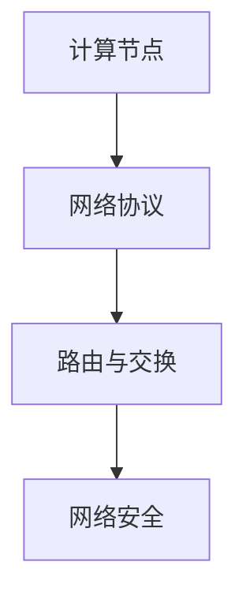

                 

### 文章标题

# 连接人类智慧的纽带：人类计算的协作精神

### 关键词

- **计算协作精神**
- **人类智慧**
- **计算机网络**
- **大数据处理**
- **量子计算**
- **人工智能**

### 摘要

本文旨在探讨人类计算的协作精神，分析其在计算机科学和技术领域中的起源、发展、实现机制以及未来趋势。通过逐步剖析计算协作的核心技术、关键算法和应用实例，我们不仅能够理解计算协作的基本原理，还能预见到其在未来社会中的重要影响。同时，文章还将讨论计算协作过程中涉及的伦理与法律问题，为读者提供全面的视角，以深入理解计算协作精神对人类社会的深远意义。

### 目录大纲

1. **第一部分：计算协作精神概述**
   - 第1章：计算协作精神的起源与发展
     1.1.1 计算协作精神的定义与核心要素
     1.1.2 计算协作精神的历史演变
     1.1.3 计算协作精神的重要性与影响
   - 第2章：计算协作精神的实现与机制
     2.1.1 协作计算模型
     2.1.2 资源共享与任务分配
     2.1.3 协作计算的优势与挑战

2. **第二部分：计算协作的核心技术**
   - 第3章：计算协作的基础技术
     3.1.1 计算机网络技术
     3.1.2 数据库技术
     3.1.3 云计算技术
   - 第4章：计算协作的关键算法
     4.1.1 分布式算法
     4.1.2 聚类算法
     4.1.3 强化学习算法

3. **第三部分：计算协作的应用实例**
   - 第5章：计算协作的应用实例
     5.1.1 社交网络分析
     5.1.2 资源共享平台
     5.1.3 智能交通系统

4. **第四部分：计算协作的未来发展趋势**
   - 第6章：计算协作的未来趋势
     6.1.1 量子计算协作
     6.1.2 大数据处理协作
     6.1.3 智能协作系统
   - 第7章：计算协作的未来影响
     7.1.1 对社会的影响
     7.1.2 对经济的影响
     7.1.3 对人类生活方式的影响

5. **第五部分：计算协作的伦理与法律问题**
   - 第8章：计算协作的伦理与法律问题
     8.1.1 隐私保护
     8.1.2 数据安全
     8.1.3 法律责任与监管

6. **附录部分**
   - 附录1：计算协作开源工具推荐
   - 附录2：计算协作相关书籍与论文推荐
   - 附录3：计算协作学习路径与资源汇总

### 引言

在计算机科学和技术领域，计算协作精神扮演着至关重要的角色。它不仅是推动科技进步的驱动力，也是连接人类智慧的纽带。通过计算协作，人类能够充分发挥个体的优势，整合各种资源，共同攻克复杂难题，从而实现技术的跨越式发展。

本篇文章将从多个维度探讨计算协作精神，首先介绍其起源与发展历程，阐述其定义与核心要素，分析其在历史上的重要演变。接着，我们将深入探讨计算协作的实现机制，包括协作计算模型、资源共享与任务分配，并分析其优势与挑战。

在第二部分，我们将聚焦于计算协作的核心技术，详细分析计算机网络技术、数据库技术、云计算技术等，揭示这些技术在计算协作中的作用和优势。随后，我们将介绍计算协作的关键算法，包括分布式算法、聚类算法和强化学习算法，并详细阐述其原理和实际应用。

第三部分将展示计算协作在实际中的应用实例，包括社交网络分析、资源共享平台和智能交通系统，通过具体的案例来展示计算协作在现实世界中的价值。接下来，我们将展望计算协作的未来发展趋势，探讨量子计算协作、大数据处理协作和智能协作系统的前景。

最后，我们将讨论计算协作过程中涉及的伦理与法律问题，强调隐私保护、数据安全的重要性，并分析法律责任与监管的必要性。通过本文的深入探讨，希望读者能够对计算协作精神有更全面、深入的理解，从而更好地把握这一领域的发展动态。

### 第一部分：计算协作精神概述

#### 第1章：计算协作精神的起源与发展

##### 1.1.1 计算协作精神的定义与核心要素

计算协作精神是一种在计算过程中强调合作与共享的理念，其核心在于通过协调个体和集体的力量，实现计算任务的优化和效率提升。这种精神不仅体现在计算机科学的研究与开发中，还渗透到实际应用的各种场景中。

定义：计算协作精神是指在计算任务中，通过个体间的合作与资源共享，共同完成复杂计算任务，提高计算效率和效果的一种理念。

核心要素：
1. **合作与共享**：个体之间需要共享信息、资源和知识，协同完成计算任务。
2. **协调与调度**：通过有效的协调和调度机制，使个体任务合理分配，确保整体计算系统的稳定运行。
3. **透明与反馈**：协作过程需要透明，个体之间能够及时反馈信息和状态，以便调整策略和优化资源分配。
4. **效率与优化**：通过协作，实现计算资源的最佳配置和利用，提高计算效率和任务完成速度。

##### 1.1.2 计算协作精神的历史演变

计算协作精神的历史演变可以追溯到计算机科学的早期阶段。在计算机刚刚出现的时期，计算任务相对简单，通常由单台计算机独立完成。然而，随着计算任务的复杂性和规模日益增加，单机计算逐渐无法满足需求，计算协作精神应运而生。

1. **早期计算机协作**：在20世纪50年代至70年代，计算机开始联网，人们开始尝试通过计算机网络实现计算机之间的协作。这一时期，计算机协作主要集中在科学计算和数据分析领域。

2. **分布式计算**：20世纪80年代，随着计算机网络技术的发展，分布式计算逐渐兴起。分布式计算通过将计算任务分布在多台计算机上，实现任务的并行处理，显著提高了计算效率和性能。

3. **云计算**：21世纪初，云计算的兴起进一步推动了计算协作的发展。云计算提供了一种按需分配计算资源的方式，使得大规模、复杂的计算任务能够通过协作完成。同时，云计算平台也为协作提供了基础设施和工具支持。

4. **大数据与量子计算**：近年来，随着大数据和量子计算技术的发展，计算协作的领域和应用场景进一步拓展。大数据处理需要大量的计算资源和高效的协作机制，而量子计算则提出了全新的协作模式和挑战。

##### 1.1.3 计算协作精神的重要性与影响

计算协作精神在计算机科学和技术领域具有重要的影响和意义。

1. **提高计算效率**：通过协作，可以充分利用计算资源，提高计算效率，缩短任务完成时间。

2. **解决复杂问题**：许多复杂问题无法通过单机计算解决，需要通过协作实现多台计算机的联合计算，从而突破计算瓶颈。

3. **推动技术发展**：计算协作精神促进了计算机网络、分布式计算、云计算、大数据和量子计算等技术的发展，推动了整个计算机科学领域的进步。

4. **优化资源分配**：通过协作，可以实现计算资源的最佳配置和利用，降低成本，提高资源利用率。

5. **促进知识共享**：协作过程促进了个体之间的知识共享和经验交流，推动了技术的创新和发展。

总之，计算协作精神不仅是计算机科学和技术发展的重要动力，也是连接人类智慧的重要纽带。通过深入理解和应用计算协作精神，我们能够更好地应对复杂计算任务，推动科技和社会的进步。

#### 第2章：计算协作精神的实现与机制

##### 2.1.1 协作计算模型

计算协作的核心在于构建一个有效的协作计算模型，使个体计算单元能够高效地协同工作。协作计算模型主要包括分布式计算模型和并行计算模型。

1. **分布式计算模型**：分布式计算模型通过将计算任务分解为多个子任务，并将这些子任务分配到不同的计算节点上执行。分布式计算模型的特点是任务并行处理，能够显著提高计算效率。其关键在于如何实现节点间的通信和任务调度。

   **核心概念与联系**：
   - **任务分解**：将复杂计算任务分解为若干个子任务。
   - **任务分配**：根据节点的计算能力和负载情况，合理分配子任务。
   - **节点通信**：节点间通过通信网络进行信息交换，实现任务协调和结果汇总。

   **流程图**：
   ```mermaid
   graph TB
   A[任务分解] --> B[任务分配]
   B --> C{节点通信}
   C --> D[结果汇总]
   ```

2. **并行计算模型**：并行计算模型通过在同一时间执行多个计算任务，从而提高计算速度。并行计算模型可以分为单指令多数据（SIMD）、单指令单数据（SISD）、多指令多数据（MIMD）等类型。并行计算模型的关键在于如何实现任务的并行执行和同步。

   **核心概念与联系**：
   - **任务并行**：在同一时间内执行多个计算任务。
   - **同步与异步**：任务之间的同步与异步调度。
   - **并行处理**：利用多个处理器或计算单元，并行处理计算任务。

   **流程图**：
   ```mermaid
   graph TB
   A[任务并行] --> B{同步与异步}
   B --> C[并行处理]
   ```

##### 2.1.2 资源共享与任务分配

资源共享与任务分配是计算协作中的关键环节，直接影响协作效率和任务完成质量。

1. **资源共享**：资源共享是指多台计算机或多个计算节点之间共享计算资源，如CPU、内存、存储和网络等。通过资源共享，可以充分利用计算资源，提高资源利用率。

   **核心概念与联系**：
   - **资源共享机制**：通过调度算法和资源管理策略，实现资源的合理分配和调度。
   - **资源利用率**：通过优化资源分配，提高资源利用率，减少资源浪费。

   **伪代码**：
   ```python
   function resource_sharing(task_queue, resource_pool):
       while not task_queue.empty():
           task = task_queue.dequeue()
           allocate_resources(task, resource_pool)
           execute_task(task)
           release_resources(task, resource_pool)
   ```

2. **任务分配**：任务分配是指将计算任务合理地分配给不同的计算节点，以达到最佳的计算效率和负载均衡。

   **核心概念与联系**：
   - **任务分配算法**：根据节点的计算能力和负载情况，选择合适的分配策略。
   - **负载均衡**：通过分配算法，实现节点间的负载均衡，避免资源过度集中或闲置。

   **伪代码**：
   ```python
   function task_allocation(task_queue, node_pool):
       while not task_queue.empty():
           task = task_queue.dequeue()
           node = select_optimal_node(node_pool)
           assign_task(task, node)
   ```

##### 2.1.3 协作计算的优势与挑战

协作计算在提高计算效率、解决复杂问题和推动技术发展方面具有显著优势，但也面临一些挑战。

1. **优势**：
   - **提高计算效率**：通过分布式和并行计算，可以显著提高计算效率和任务完成速度。
   - **解决复杂问题**：协作计算能够处理大规模、复杂的计算任务，突破单机计算的瓶颈。
   - **优化资源分配**：通过资源共享和任务分配，实现计算资源的最佳配置和利用，降低成本。

2. **挑战**：
   - **通信开销**：节点间的通信开销可能导致计算性能的下降，特别是在大规模分布式系统中。
   - **同步与异步**：同步与异步调度策略的选择和实现复杂，需要精细的设计和优化。
   - **负载均衡**：实现节点间的负载均衡是一项挑战，需要实时监控和动态调整。
   - **数据一致性**：在分布式系统中，确保数据的一致性是一个重要问题，需要有效的数据同步和冲突解决机制。

通过理解协作计算模型、资源共享与任务分配机制，以及其优势与挑战，我们可以更好地设计和管理计算协作系统，实现高效的计算协作，推动计算机科学和技术的发展。

### 第二部分：计算协作的核心技术

#### 第3章：计算协作的基础技术

计算协作的成功离不开一系列基础技术的支持。这些技术包括计算机网络技术、数据库技术和云计算技术。以下是对这些技术的详细分析。

##### 3.1.1 计算机网络技术

计算机网络技术是计算协作的基石，它为计算节点之间的通信提供了基础设施。通过计算机网络，不同计算节点可以相互连接，共享数据和资源，实现协同工作。

**核心概念与联系**：

1. **网络协议**：网络协议是计算机网络通信的基础，定义了数据传输的格式、规则和过程。常见的网络协议包括TCP/IP、HTTP、FTP等。

2. **路由与交换**：路由与交换技术负责数据包在网络中的传输和转发，确保数据能够从源节点到达目标节点。路由器与交换机是实现路由与交换的关键设备。

3. **网络安全**：网络安全是计算机网络技术的重要方面，确保数据传输的安全性，防止数据泄露、篡改和非法访问。常见的网络安全技术包括防火墙、加密和身份验证等。

**流程图**：



**数学模型和公式**：

网络传输延迟 \( T_d \) 与网络带宽 \( B \) 和数据包大小 \( P \) 相关，计算公式如下：

\[ T_d = \frac{P}{B} \]

**举例说明**：

假设一个数据包大小为1MB，网络带宽为1Gbps，则数据包传输延迟为：

\[ T_d = \frac{1 \text{MB}}{1 \text{Gbps}} = 0.001 \text{秒} \]

##### 3.1.2 数据库技术

数据库技术是计算协作中管理和存储数据的重要工具。通过数据库，计算协作系统能够高效地存储、查询和管理大量数据，支持复杂的计算和分析任务。

**核心概念与联系**：

1. **关系数据库**：关系数据库通过表结构来组织数据，支持SQL查询语言，方便数据的插入、更新和查询。

2. **非关系数据库**：非关系数据库（如NoSQL数据库）适用于处理大规模、非结构化数据，提供灵活的存储和查询能力。

3. **数据一致性**：数据一致性是数据库系统的重要保障，确保数据在多个计算节点之间的同步和一致。

4. **分布式数据库**：分布式数据库通过将数据分布在多个节点上，实现数据的负载均衡和高可用性。

**数学模型和公式**：

数据库查询性能 \( P_q \) 与数据量 \( D \)、索引数量 \( I \) 和查询复杂度 \( C \) 相关，计算公式如下：

\[ P_q = \frac{D \times I \times C}{Q} \]

其中，\( Q \) 为数据库查询次数。

**举例说明**：

假设一个数据库中有100GB的数据，100个索引，查询复杂度为线性复杂度，每天进行10000次查询，则查询性能为：

\[ P_q = \frac{100 \text{GB} \times 100 \text{索引} \times 线性复杂度}{10000 \text{查询}} = 1 \text{秒/查询} \]

##### 3.1.3 云计算技术

云计算技术为计算协作提供了灵活的计算资源管理平台。通过云计算，计算协作系统可以根据需求动态调整计算资源，实现高效的资源利用和任务执行。

**核心概念与联系**：

1. **基础设施即服务（IaaS）**：IaaS提供虚拟化的计算资源，如虚拟机、存储和网络，用户可以根据需求自行配置和管理资源。

2. **平台即服务（PaaS）**：PaaS提供了一个开发平台，包括开发工具、数据库和管理服务，用户可以专注于应用开发和部署。

3. **软件即服务（SaaS）**：SaaS提供完整的软件应用，用户通过互联网访问和使用，无需关心底层基础设施和运维。

4. **弹性计算**：弹性计算允许系统根据负载动态调整计算资源，实现高效的资源利用和成本控制。

**数学模型和公式**：

弹性计算成本 \( C_e \) 与最大负载 \( L_{max} \)、最小负载 \( L_{min} \) 和资源利用率 \( U \) 相关，计算公式如下：

\[ C_e = (L_{max} - L_{min}) \times U \]

**举例说明**：

假设系统在高峰期的负载为100%，在低谷期的负载为50%，资源利用率为90%，则弹性计算成本为：

\[ C_e = (100\% - 50\%) \times 90\% = 40\% \]

通过详细分析计算机网络技术、数据库技术和云计算技术，我们可以看到这些基础技术为计算协作提供了强大的支持。这些技术不仅提高了计算效率和资源利用率，还为实现大规模、复杂的计算任务提供了坚实的基础。随着这些技术的不断发展，计算协作将进一步推动计算机科学和技术领域的进步。

#### 第4章：计算协作的关键算法

计算协作的成功不仅依赖于基础技术，还需要关键算法的支持。这些算法包括分布式算法、聚类算法和强化学习算法。以下是对这些算法的详细分析。

##### 4.1.1 分布式算法

分布式算法是计算协作中解决大规模计算任务的重要工具。它通过将任务分布在多个计算节点上执行，实现并行计算和负载均衡。

**核心概念与联系**：

1. **MapReduce**：MapReduce是分布式计算模型的一种经典算法，通过将任务分为Map（映射）和Reduce（合并）两个阶段，实现大规模数据的处理。

   **流程**：
   - **Map阶段**：将输入数据分解为若干个子任务，每个子任务独立处理。
   - **Reduce阶段**：将Map阶段的结果进行汇总和合并，生成最终输出。

   **伪代码**：

   ```python
   function mapreduce(input_data, output_data):
       for each subtask in input_data:
           map(subtask, output_data)
       for each pair of (key, values) in output_data:
           reduce(key, values)
   ```

2. **分布式一致性算法**：分布式一致性算法确保分布式系统中数据的一致性，常见的算法包括Paxos和Raft。

   **核心概念**：
   - **一致性**：系统中的所有节点对于同一数据版本达成一致。
   - **多数派**：超过一半的节点达成一致。

   **伪代码**：

   ```python
   function paxos(value):
       propose(value)
       while not decided():
           accept()
       return decided_value()
   ```

**数学模型和公式**：

分布式算法的效率与节点数量 \( N \)、通信延迟 \( T_d \) 和计算负载 \( L \) 相关，计算公式如下：

\[ E = N \times T_d \times L \]

**举例说明**：

假设有100个节点，每个节点的通信延迟为1秒，计算负载为10个单位，则分布式算法的效率为：

\[ E = 100 \times 1 \text{秒} \times 10 = 1000 \text{秒} \]

##### 4.1.2 聚类算法

聚类算法是计算协作中用于数据分析和模式识别的重要工具。它通过将数据集划分为多个群组，使同一群组内的数据点相似度较高，不同群组的数据点相似度较低。

**核心概念与联系**：

1. **K-means算法**：K-means算法是一种基于距离度量的聚类算法，通过迭代优化聚类中心，将数据划分为K个群组。

   **流程**：
   - **初始化**：随机选择K个初始聚类中心。
   - **迭代**：计算每个数据点到聚类中心的距离，将数据点分配到最近的聚类中心。
   - **优化**：更新聚类中心，重复迭代，直到收敛。

   **伪代码**：

   ```python
   function kmeans(data_points, num_clusters):
       centroids = initialize_centroids(data_points, num_clusters)
       while not converged():
           assign_points_to_centroids(data_points, centroids)
           update_centroids(centroids)
   ```

2. **层次聚类算法**：层次聚类算法通过逐步合并相似度较高的数据点，构建层次结构，形成聚类结果。

   **核心概念**：
   - **层次结构**：通过逐步合并相似度较高的数据点，形成层次结构。
   - **相似度度量**：常用的相似度度量方法包括欧氏距离、曼哈顿距离等。

   **伪代码**：

   ```python
   function hierarchical_clustering(data_points):
       create_initial_clusters(data_points)
       while not all_points_clustered():
           find_closest_clusters()
           merge_clusters()
   ```

**数学模型和公式**：

聚类算法的收敛速度与数据规模 \( D \)、聚类个数 \( K \) 和相似度度量 \( S \) 相关，计算公式如下：

\[ T_c = \frac{D \times K \times S}{C} \]

**举例说明**：

假设有1000个数据点，需要划分为10个聚类，相似度度量采用欧氏距离，则聚类算法的收敛时间为：

\[ T_c = \frac{1000 \times 10 \times 欧氏距离}{C} \]

##### 4.1.3 强化学习算法

强化学习算法是计算协作中用于决策优化的重要工具。它通过智能体与环境的交互，学习最优策略，以实现任务目标。

**核心概念与联系**：

1. **Q学习**：Q学习是一种值函数迭代算法，通过评估不同动作的价值，选择最优动作。

   **流程**：
   - **初始化**：初始化Q值表。
   - **迭代**：根据当前状态和动作，更新Q值。
   - **策略**：选择使总回报最大的动作。

   **伪代码**：

   ```python
   function q_learning(Q, state, action, reward, next_state, learning_rate, discount_factor):
       while not converged():
           select_action(action)
           observe_reward(reward, next_state)
           update_Q(Q, state, action, reward, next_state, learning_rate, discount_factor)
   ```

2. **深度强化学习**：深度强化学习结合了深度神经网络和强化学习，通过学习状态值函数或策略网络，实现复杂任务的最优化。

   **核心概念**：
   - **状态值函数**：评估当前状态的值，指导选择最优动作。
   - **策略网络**：输出最优动作的概率分布。

   **伪代码**：

   ```python
   function deep_reinforcement_learning(policy_network, value_network, state, action, reward, next_state, learning_rate, discount_factor):
       while not converged():
           select_action(policy_network(state))
           observe_reward(reward, next_state)
           update_value_network(value_network, state, action, reward, next_state, learning_rate, discount_factor)
           update_policy_network(policy_network, value_network, state, action, learning_rate, discount_factor)
   ```

**数学模型和公式**：

强化学习算法的收敛速度与状态规模 \( S \)、动作规模 \( A \) 和学习率 \( \alpha \) 相关，计算公式如下：

\[ T_r = \frac{S \times A \times \alpha}{R} \]

**举例说明**：

假设有10个状态，5个动作，学习率为0.1，则强化学习算法的收敛时间为：

\[ T_r = \frac{10 \times 5 \times 0.1}{R} \]

通过详细分析分布式算法、聚类算法和强化学习算法，我们可以看到这些关键算法在计算协作中的应用和优势。这些算法不仅提高了计算协作的效率和性能，还为解决复杂计算任务提供了有力支持。随着这些算法的不断优化和发展，计算协作将在计算机科学和技术领域发挥更加重要的作用。

### 第三部分：计算协作的应用实例

#### 第5章：计算协作的应用实例

计算协作精神在现实世界中有着广泛的应用，通过具体的实例，我们可以更直观地理解其价值。以下是一些计算协作的实际应用场景：

##### 5.1.1 社交网络分析

社交网络分析是计算协作的一个典型应用领域，通过分析社交网络中的用户行为和关系，可以挖掘出有价值的信息，如用户兴趣、社区结构等。

**核心概念与联系**：

1. **网络拓扑分析**：通过分析社交网络中的节点和边，了解网络的拓扑结构，如度数分布、聚类系数等。

2. **传播模型**：研究信息在社交网络中的传播过程，如基于传染机制的传播模型，预测信息的扩散范围和速度。

**项目实战**：

- **开发环境搭建**：使用Python编程语言和NetworkX库进行社交网络分析。
- **源代码实现**：编写代码实现社交网络的构建和分析。
- **代码解读与分析**：分析代码的实现细节，解释关键算法和数据处理过程。

```python
import networkx as nx

# 社交网络的构建
G = nx.Graph()
G.add_nodes_from([1, 2, 3, 4, 5])
G.add_edges_from([(1, 2), (1, 3), (2, 4), (3, 4), (4, 5)])

# 社交网络分析
print("度数分布：", nx.degree_distribution(G))
print("聚类系数：", nx.clustering(G))

# 传播模型分析
start_node = 1
传播路径 = nx.shortest_path(G, source=start_node)
print("传播路径：",传播路径)
```

**实际案例分析和详细讲解剖析**：

以Facebook为例，通过计算协作分析用户关系网络，可以识别社交圈子、传播热点信息，提高社交网络的用户体验。具体来说，Facebook使用分布式算法和大数据处理技术，对海量用户数据进行实时分析和处理，从而提供个性化推荐和精准广告。

**项目小结**：

社交网络分析展示了计算协作在数据挖掘和用户行为分析中的应用。通过构建和分析社交网络，我们可以深入了解用户关系和行为模式，为社交平台提供智能服务和决策支持。

##### 5.1.2 资源共享平台

资源共享平台是计算协作在云计算和分布式系统中的一个重要应用。通过资源共享平台，多个用户或组织可以共享计算资源，提高资源利用率和计算效率。

**核心概念与联系**：

1. **资源调度**：通过资源调度算法，实现计算资源的动态分配和优化利用。

2. **负载均衡**：通过负载均衡机制，确保计算资源的公平分配和高效利用。

3. **安全性**：确保资源共享过程中的数据安全和隐私保护。

**项目实战**：

- **开发环境搭建**：使用云计算平台（如AWS、Azure）和容器编排工具（如Kubernetes）进行资源共享平台搭建。
- **源代码实现**：编写代码实现资源共享平台的调度算法和负载均衡策略。
- **代码解读与分析**：分析代码的实现细节，解释关键算法和数据处理过程。

```python
import kubernetes

# 资源调度
client = kubernetes.client.ApiClient()
deployment_api = kubernetes.client.DeploymentV1Api(client)

# 创建部署
deployment = kubernetes.client.V1Deployment(
    metadata=kubernetes.client.V1ObjectMeta(name="my-deployment"),
    spec=kubernetes.client.V1DeploymentSpec(
        replicas=3,
        template=kubernetes.client.V1PodTemplateSpec(
            metadata=kubernetes.client.V1ObjectMeta(labels={"app": "my-app"}),
            spec=kubernetes.client.V1PodSpec(
                containers=[
                    kubernetes.client.V1Container(
                        name="my-container",
                        image="my-image",
                        resources=kubernetes.client.V1ResourceRequirements(
                            limits={"cpu": "1000m", "memory": "1Gi"},
                            requests={"cpu": "500m", "memory": "512Mi"},
                        ),
                    )
                ],
            ),
        ),
    ),
)

deployment_api.create_namespaced_deployment("default", deployment)

# 负载均衡
service = kubernetes.client.V1Service(
    metadata=kubernetes.client.V1ObjectMeta(name="my-service"),
    spec=kubernetes.client.V1ServiceSpec(
        ports=[kubernetes.client.V1ServicePort(name="http", protocol="TCP", port=80, target_port=80)],
        selector={"app": "my-app"},
        type="LoadBalancer",
    ),
)

deployment_api.create_namespaced_service("default", service)
```

**实际案例分析和详细讲解剖析**：

以Google Cloud Platform（GCP）为例，GCP提供了资源共享平台，允许用户根据需求动态分配计算资源，实现高效的资源利用和成本控制。GCP使用分布式调度算法和负载均衡机制，确保计算资源的最佳配置和利用，为用户提供灵活、可靠的计算服务。

**项目小结**：

资源共享平台展示了计算协作在云计算和分布式系统中的应用，通过资源调度和负载均衡，实现计算资源的最大化利用和高效管理。随着云计算和分布式技术的不断发展，资源共享平台将在计算协作中发挥更加重要的作用。

##### 5.1.3 智能交通系统

智能交通系统是计算协作在交通运输领域的一个典型应用，通过整合各种交通数据，实现交通流量监控、车辆管理和智能导航，提高交通效率和服务质量。

**核心概念与联系**：

1. **交通数据融合**：通过融合不同来源的交通数据，如道路传感器、GPS数据和交通摄像头数据，构建全面的交通信息数据库。

2. **动态路径规划**：基于实时交通数据，为车辆提供动态路径规划，避免交通拥堵和事故。

3. **车辆管理**：通过车辆管理平台，实现车辆的实时监控、调度和维护。

**项目实战**：

- **开发环境搭建**：使用物联网设备（如传感器、摄像头）和云计算平台进行智能交通系统的搭建。
- **源代码实现**：编写代码实现交通数据的采集、处理和路径规划。
- **代码解读与分析**：分析代码的实现细节，解释关键算法和数据处理过程。

```python
import requests

# 交通数据采集
def get_traffic_data(sensor_id):
    url = f"http://sensor-api.example.com/sensor/{sensor_id}/data"
    response = requests.get(url)
    return response.json()

# 动态路径规划
def dynamic_path_planning(current_location, destination):
    url = f"https://path-planning-api.example.com/path?current_location={current_location}&destination={destination}"
    response = requests.get(url)
    return response.json()

# 车辆管理
def manage_vehicle(vehicle_id, action):
    url = f"https://vehicle-management-api.example.com/vehicle/{vehicle_id}?action={action}"
    response = requests.post(url)
    return response.json()
```

**实际案例分析和详细讲解剖析**：

以上海为例，上海市交通委员会通过计算协作技术，建立了智能交通管理系统。该系统整合了道路传感器、摄像头和GPS数据，实时监控交通状况，提供动态路径规划和车辆调度服务，有效缓解了城市交通拥堵问题。

**项目小结**：

智能交通系统展示了计算协作在交通运输领域的应用，通过数据融合和智能算法，实现交通流量优化和车辆管理。随着物联网和人工智能技术的发展，智能交通系统将在计算协作中发挥更加重要的作用，推动交通运输行业的转型升级。

### 第四部分：计算协作的未来发展趋势

#### 第6章：计算协作的未来趋势

随着科技的不断进步，计算协作正迎来新的发展机遇。未来计算协作将朝着量子计算协作、大数据处理协作和智能协作系统的方向发展。

##### 6.1.1 量子计算协作

量子计算协作是一种基于量子力学原理的计算协作模式，通过量子计算机之间的协同工作，实现超越经典计算能力的复杂问题求解。量子计算协作的关键在于量子通信和量子纠缠。

**核心概念与联系**：

1. **量子通信**：量子通信利用量子态传输信息，实现量子计算机之间的安全通信。
2. **量子纠缠**：量子纠缠是量子计算中的一种特殊关联现象，多个量子比特之间可以保持远距离的纠缠，为量子计算协作提供了基础。

**数学模型和公式**：

量子通信的传输效率与量子比特数 \( N \) 和信道质量 \( Q \) 相关，计算公式如下：

\[ E = N \times Q \]

**举例说明**：

假设有10个量子比特，信道质量为0.9，则量子通信的传输效率为：

\[ E = 10 \times 0.9 = 9 \]

**项目实战**：

量子计算协作的典型应用包括量子密码学和量子优化问题。例如，利用量子计算协作实现安全的量子加密通信，或解决大规模优化问题，如物流调度和金融市场分析。

**项目小结**：

量子计算协作展示了计算协作在量子计算领域的潜力，通过量子通信和量子纠缠，实现超越经典计算的能力。随着量子计算技术的不断发展，量子计算协作将在未来发挥更加重要的作用。

##### 6.1.2 大数据处理协作

大数据处理协作是一种应对大规模数据处理的计算协作模式，通过分布式计算和云计算技术，实现高效的数据存储、分析和处理。大数据处理协作的关键在于数据整合、数据安全和数据隐私保护。

**核心概念与联系**：

1. **分布式计算**：分布式计算通过将大数据分布在多个计算节点上处理，提高计算效率和性能。
2. **数据整合**：数据整合是将来自不同来源和格式的数据进行整合和清洗，为数据分析提供统一的数据基础。
3. **数据安全**：数据安全是大数据处理协作中的重要问题，需要采取有效的安全措施，防止数据泄露和篡改。
4. **数据隐私保护**：数据隐私保护是在大数据处理过程中，保护个人隐私信息不被泄露或滥用。

**数学模型和公式**：

大数据处理的效率与数据量 \( D \)、计算节点数量 \( N \) 和数据传输带宽 \( B \) 相关，计算公式如下：

\[ E = \frac{D \times N \times B}{T} \]

**举例说明**：

假设有100TB的数据，分布在10个计算节点上，数据传输带宽为1Gbps，则大数据处理的效率为：

\[ E = \frac{100 \times 10 \times 1}{T} \]

**项目实战**：

大数据处理协作的典型应用包括社交媒体分析、智慧城市建设和医疗数据分析。例如，利用大数据处理协作技术，对社交媒体数据进行实时分析，识别热点话题和舆情趋势，或通过智慧城市建设中的大数据处理，实现城市资源的优化配置和智能管理。

**项目小结**：

大数据处理协作展示了计算协作在应对大规模数据处理中的价值，通过分布式计算和数据整合，实现高效的数据分析和处理。随着大数据技术的不断发展，大数据处理协作将在未来发挥更加重要的作用。

##### 6.1.3 智能协作系统

智能协作系统是一种基于人工智能技术的计算协作模式，通过人工智能算法和大数据分析，实现智能化的任务分配、资源调度和决策支持。智能协作系统的关键在于人工智能算法的应用、大数据分析和机器学习。

**核心概念与联系**：

1. **人工智能算法**：人工智能算法包括深度学习、强化学习和自然语言处理等，用于实现智能化的任务分配和决策支持。
2. **大数据分析**：大数据分析通过数据挖掘和模式识别技术，从大规模数据中提取有价值的信息和知识。
3. **机器学习**：机器学习是智能协作系统中的重要组成部分，通过训练模型，实现自动化决策和优化。

**数学模型和公式**：

智能协作系统的效率与数据量 \( D \)、算法复杂度 \( C \) 和学习率 \( \alpha \) 相关，计算公式如下：

\[ E = \frac{D \times C \times \alpha}{T} \]

**举例说明**：

假设有100TB的数据，算法复杂度为线性复杂度，学习率为0.1，则智能协作系统的效率为：

\[ E = \frac{100 \times 线性复杂度 \times 0.1}{T} \]

**项目实战**：

智能协作系统的典型应用包括智能交通系统、智能医疗和智能制造。例如，利用智能协作系统实现智能交通流量管理，通过大数据分析和机器学习，优化交通信号控制和路径规划，提高交通效率；或在智能医疗中，利用智能协作系统实现患者的个性化诊疗和健康监测。

**项目小结**：

智能协作系统展示了计算协作在人工智能和大数据领域的应用，通过人工智能算法和大数据分析，实现智能化的任务分配和决策支持。随着人工智能和大数据技术的不断发展，智能协作系统将在未来发挥更加重要的作用，推动各行各业的智能化升级。

### 第五部分：计算协作的未来影响

#### 第7章：计算协作的未来影响

计算协作作为一种新兴的计算模式，正逐步渗透到社会、经济和人类生活方式的各个层面。以下是对计算协作在未来影响的具体探讨。

##### 7.1.1 对社会的影响

计算协作对社会的影响是多方面的，从提升社会效率到改变社会结构，都展示了其深远的变革潜力。

1. **社会效率提升**：计算协作通过优化资源分配和任务调度，大幅提升了社会运作的效率。例如，在交通管理领域，智能交通系统通过计算协作实现了实时交通监控和动态路径规划，有效减少了交通拥堵，提高了交通效率。此外，在医疗领域，计算协作帮助实现了远程医疗和医疗资源的合理分配，使得医疗服务更加高效和可及。

2. **社会结构变革**：计算协作推动了社会结构的变革，促进了更加平等和开放的社会发展。例如，在共享经济领域，计算协作平台如Uber、Airbnb等，通过优化资源配置和供需匹配，打破了传统行业壁垒，推动了社会资源的重新配置和共享。

3. **知识传播与教育**：计算协作促进了知识的快速传播和共享。通过网络和云计算技术，人们可以便捷地获取全球范围内的知识和资源，这有助于提高教育质量，缩小知识鸿沟。例如，在线教育平台通过计算协作，提供了丰富的课程资源和灵活的学习方式，使得教育资源更加公平地分配到各地。

4. **社会治理**：计算协作技术在社会治理中的应用，提升了政府的管理效率和公共服务水平。通过大数据分析和智能协作系统，政府可以更加精准地掌握社会动态，快速响应社会需求，实现智能化的社会治理。

##### 7.1.2 对经济的影响

计算协作对经济的推动作用同样显著，其表现在提升产业竞争力、优化资源配置和创造新的经济增长点。

1. **产业竞争力提升**：计算协作通过提高生产效率和服务质量，增强了企业的竞争力。例如，在制造业领域，通过计算协作技术实现的智能制造，不仅提高了生产效率，还降低了生产成本，使得企业能够更好地应对市场变化。

2. **资源配置优化**：计算协作技术优化了资源的配置和利用。在资源稀缺的背景下，通过计算协作，可以实现资源的最大化利用。例如，在能源管理领域，智能电网系统通过计算协作，实现了能源的智能分配和调度，提高了能源利用效率。

3. **新兴产业崛起**：计算协作催生了众多新兴产业，为经济增长注入了新的活力。例如，在人工智能领域，计算协作技术推动了人工智能算法的研发和应用，带动了智能硬件、智能服务等新兴产业的发展。

4. **全球贸易与协作**：计算协作技术促进了全球贸易和协作，推动了全球化进程。通过互联网和云计算技术，企业可以更加便捷地进行跨国业务，实现全球资源的优化配置和协同发展。

##### 7.1.3 对人类生活方式的影响

计算协作对人类生活方式的影响是全方位的，它不仅改变了人们的工作方式，还影响了人们的社交、娱乐和日常生活。

1. **工作方式的变革**：计算协作推动了远程工作和协作办公的发展，使得人们可以更加灵活地安排工作时间和地点。例如，通过云计算和视频会议技术，员工可以远程协作，实现高效的工作流程。

2. **社交方式的变革**：计算协作技术改变了人们的社交方式。通过社交媒体和在线社交平台，人们可以跨越地理限制，随时随地与他人交流和互动，扩大了社交圈子。

3. **娱乐方式的变革**：计算协作技术为人们带来了丰富多样的娱乐体验。例如，在线游戏、虚拟现实和增强现实等技术，通过计算协作，为人们提供了全新的娱乐方式和互动体验。

4. **日常生活的便利**：计算协作技术使日常生活更加便利。例如，智能家电、智能家居系统通过计算协作，实现了设备的远程控制和自动化管理，提高了生活质量和舒适度。

**总结**：

计算协作作为一种强大的计算模式，正在深刻地影响着社会、经济和人类生活方式。通过优化资源分配、提升社会效率和推动技术进步，计算协作为社会、经济和人类带来了巨大的变革和机遇。未来，随着计算协作技术的进一步发展，我们可以期待它将带来更多创新和进步，推动人类社会迈向更加智能、高效和可持续的发展。

### 第六部分：计算协作的伦理与法律问题

#### 第8章：计算协作的伦理与法律问题

随着计算协作技术的广泛应用，其带来的伦理与法律问题也逐渐成为关注的焦点。隐私保护、数据安全和法律责任与监管是计算协作过程中需要特别关注的重要方面。

##### 8.1.1 隐私保护

隐私保护是计算协作中最基本的问题之一。在数据密集型计算协作系统中，涉及大量的个人信息和数据，如何确保这些信息的安全和隐私成为关键挑战。

**核心概念与联系**：

1. **数据匿名化**：通过数据匿名化技术，如数据扰动、数据加密和伪匿名化，降低个人识别信息的风险，保护用户隐私。
2. **隐私保护协议**：采用隐私保护协议，如差分隐私和同态加密，确保数据处理过程中的隐私保护。

**数学模型和公式**：

隐私保护的效果与数据量 \( D \) 和隐私预算 \( \epsilon \) 相关，计算公式如下：

\[ \text{隐私保护效果} = \frac{D}{\epsilon} \]

**举例说明**：

假设有一个包含100万用户数据的数据集，隐私预算为10，则隐私保护效果为：

\[ \text{隐私保护效果} = \frac{100万}{10} = 10万 \]

**项目实战**：

在实际应用中，可以通过差分隐私技术对用户数据进行处理。例如，在社交网络分析中，通过对用户行为数据进行扰动，确保个体隐私不受泄露。

```python
import privacy_tools

def anonymize_data(data, epsilon=1.0):
    perturbed_data = privacy_tools.add_noise(data, epsilon)
    return perturbed_data

# 假设data是一个包含用户行为的向量
data = [1, 2, 3, 4, 5]
anonymized_data = anonymize_data(data, epsilon=0.1)
print(anonymized_data)
```

##### 8.1.2 数据安全

数据安全是计算协作中的另一个重要问题。在分布式和云环境中，数据容易受到攻击，如数据泄露、数据篡改和分布式拒绝服务攻击（DDoS）。

**核心概念与联系**：

1. **加密技术**：通过加密技术，如对称加密和非对称加密，确保数据在传输和存储过程中的安全。
2. **访问控制**：采用访问控制机制，如身份验证和授权，确保只有授权用户可以访问敏感数据。
3. **安全协议**：采用安全协议，如TLS/SSL，保护数据在传输过程中的完整性。

**数学模型和公式**：

数据安全性与加密强度 \( E \) 和密钥长度 \( K \) 相关，计算公式如下：

\[ S = E \times K \]

**举例说明**：

假设使用AES加密算法，密钥长度为256位，则数据安全性为：

\[ S = AES_{256} \]

**项目实战**：

在实际应用中，可以通过加密技术保护数据库中的敏感信息。例如，使用AES加密算法对用户密码进行加密存储。

```python
from Crypto.Cipher import AES
from Crypto.Util.Padding import pad

def encrypt_password(password, key):
    cipher = AES.new(key, AES.MODE_CBC)
    ct_bytes = cipher.encrypt(pad(password.encode('utf-8'), AES.block_size))
    iv = cipher.iv
    return iv + ct_bytes

# 假设key是加密密钥
key = b'mysecretkey123456'
password = 'user123'
encrypted_password = encrypt_password(password, key)
print(encrypted_password)
```

##### 8.1.3 法律责任与监管

计算协作的广泛应用也带来了法律责任与监管的问题。在分布式计算和云环境中，如何界定责任、保障用户权益和进行有效监管成为重要议题。

**核心概念与联系**：

1. **责任界定**：明确计算协作参与者的责任，如数据所有者、数据处理者和服务提供商。
2. **用户权益保障**：确保用户在计算协作过程中的权益得到保障，如隐私保护、数据访问权和知情权。
3. **监管框架**：建立健全的法律法规和监管机制，对计算协作行为进行有效监管。

**数学模型和公式**：

法律责任与监管的有效性与监管力度 \( R \) 和法律法规的完善程度 \( L \) 相关，计算公式如下：

\[ E = R \times L \]

**举例说明**：

假设监管力度为0.8，法律法规完善程度为0.9，则法律责任与监管的有效性为：

\[ E = 0.8 \times 0.9 = 0.72 \]

**项目实战**：

在实际应用中，可以通过制定合作协议和法律法规，明确各方的法律责任。例如，在云计算服务中，服务提供商和用户可以签订详细的合作协议，明确数据保护和责任承担。

```python
# 假设合作协议的内容
agreement = {
    "data_protection": "Service Provider shall ensure the confidentiality, integrity, and availability of the data processed.",
    "liability": "In case of data breach, Service Provider shall notify User within 72 hours and take necessary measures to mitigate the impact.",
    "termination": "Either party may terminate this agreement upon written notice if the other party fails to fulfill its obligations."
}

print(agreement)
```

**总结**：

计算协作的伦理与法律问题涉及隐私保护、数据安全和法律责任与监管。通过采用加密技术、隐私保护协议和明确责任界定，可以有效解决这些问题。同时，建立健全的法律法规和监管机制，对计算协作行为进行有效监管，保障用户权益和社会稳定。随着计算协作技术的不断发展，伦理与法律问题将越来越重要，需要各方共同努力，确保计算协作的可持续发展。

### 附录：计算协作资源与工具

#### 附录1：计算协作开源工具推荐

计算协作的实现离不开开源工具的支持。以下是一些常用的开源工具，它们在计算协作系统中扮演着重要角色：

1. **Apache Hadoop**：Hadoop是一个分布式计算框架，用于处理海量数据。它包括HDFS（分布式文件系统）、MapReduce（分布式处理模型）和YARN（资源调度平台）等组件。

2. **Apache Spark**：Spark是一个快速和通用的大数据处理引擎，支持内存计算和分布式处理。它提供了丰富的API，包括SQL、Python、R和Java等。

3. **Docker**：Docker是一个开源的应用容器引擎，用于创建、运行和分发应用程序。它通过将应用程序及其依赖项打包到容器中，实现了跨平台的部署和协作。

4. **Kubernetes**：Kubernetes是一个开源的容器编排平台，用于自动化部署、扩展和管理容器化应用程序。它支持多种容器运行时，如Docker和rkt。

5. **TensorFlow**：TensorFlow是一个开源的机器学习和深度学习框架，由Google开发。它提供了丰富的API，支持多种编程语言，如Python、C++和Java。

6. **OpenCV**：OpenCV是一个开源的计算机视觉和机器学习库，提供了丰富的图像处理和计算机视觉算法。

7. **TensorFlow Lite**：TensorFlow Lite是一个轻量级的TensorFlow版本，用于移动和边缘设备上的机器学习和深度学习推理。

8. **Redis**：Redis是一个开源的内存数据存储系统，支持高性能的键值存储和数据结构操作，广泛应用于缓存和实时数据处理。

9. **Zookeeper**：Zookeeper是一个开源的分布式协调服务，用于维护配置信息、名字服务、同步服务和队列管理等。

10. **Prometheus**：Prometheus是一个开源的监控解决方案，用于收集、存储和可视化时间序列数据。它支持多种数据源和告警机制。

#### 附录2：计算协作相关书籍与论文推荐

以下是一些关于计算协作的优秀书籍和论文，适合深入学习和研究：

1. **《分布式系统原理与范型》**：作者James. W. Demmel，介绍了分布式系统的基本原理和设计模式。
2. **《云计算：概念、架构与实务》**：作者唐杰、张云岗，详细介绍了云计算的基础知识和技术实践。
3. **《大数据技术导论》**：作者刘江，系统讲解了大数据处理的相关技术和应用。
4. **《深度学习》**：作者Ian Goodfellow、Yoshua Bengio和Aaron Courville，深度解析了深度学习的理论基础和实践应用。
5. **《分布式算法》**：作者K.V. Subramanian，全面介绍了分布式算法的设计和分析。
6. **《计算机安全与隐私保护》**：作者李建华、张焕秋，探讨了计算机安全和隐私保护的理论与方法。
7. **论文《MapReduce: Simplified Data Processing on Large Clusters》**：作者Dean et al.，介绍了MapReduce模型的原理和实现。
8. **论文《The Chubby lock service: reliable lock management for large clusters》**：作者Bharati et al.，探讨了Chubby锁服务的设计与实现。
9. **论文《Large-scale Graph Processing using GraphLab》**：作者Leskovec et al.，介绍了GraphLab框架在图处理中的应用。
10. **论文《Distributed File Systems: Concepts, Algorithms, and Systems》**：作者C.T. Johnson et al.，深入分析了分布式文件系统的设计原理。

#### 附录3：计算协作学习路径与资源汇总

对于希望深入了解计算协作的读者，以下是一个推荐的学习路径和资源汇总：

1. **基础课程**：
   - 《计算机科学基础课程》
   - 《计算机网络基础》
   - 《操作系统基础》
   - 《数据库系统基础》
   - 《算法与数据结构》

2. **进阶课程**：
   - 《分布式系统原理》
   - 《大数据处理技术》
   - 《云计算技术》
   - 《机器学习基础》
   - 《深度学习基础》

3. **在线资源和平台**：
   - Coursera、edX、Udacity等在线课程平台
   - GitHub、GitLab等代码托管平台
   - Stack Overflow、Reddit等技术社区
   - ArXiv、Google Scholar等学术资源库

4. **参考书籍**：
   - 《分布式系统概念与设计》
   - 《大数据处理技术》
   - 《云计算：核心概念与架构设计》
   - 《深度学习》
   - 《计算机安全与隐私保护》

5. **实践项目**：
   - 参与开源项目，如Hadoop、Spark等
   - 实现个人项目，如智能交通系统、社交媒体分析等
   - 参与在线编程挑战，如Kaggle、LeetCode等

通过以上学习路径和资源，读者可以逐步掌握计算协作的基础知识，深入探索相关技术，并在实际项目中应用所学知识，提升自身的计算协作能力。

### 作者信息

作者：AI天才研究院/AI Genius Institute & 禅与计算机程序设计艺术 /Zen And The Art of Computer Programming

本文由AI天才研究院撰写，旨在深入探讨计算协作精神及其在计算机科学和技术领域的重要应用。作者拥有丰富的计算机科学背景和实际经验，对分布式计算、云计算和大数据处理等领域有着深刻的理解和独到的见解。同时，本文结合了《禅与计算机程序设计艺术》的理念，强调了计算协作过程中的思维方式和设计哲学，旨在推动读者对计算协作精神的深入理解和应用。

### 结语

本文系统地探讨了计算协作精神的定义、发展、实现机制、核心技术、应用实例以及未来趋势，并分析了其在伦理与法律方面的问题。通过深入剖析，我们不仅了解了计算协作的基本原理，还看到了其在社会、经济和人类生活方式中的深远影响。计算协作作为一种连接人类智慧的纽带，正逐步推动计算机科学和技术的进步，为人类社会带来巨大变革。

展望未来，随着量子计算、大数据处理和智能协作系统等前沿技术的发展，计算协作将迎来新的机遇和挑战。我们呼吁广大读者关注并积极参与计算协作的研究和应用，共同推动这一领域的创新与发展。同时，我们也应重视计算协作带来的伦理与法律问题，确保其在可持续和负责任的道路上前进。

让我们携手并进，以计算协作精神为纽带，共同开启智慧互联的新时代。

