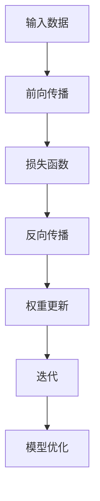
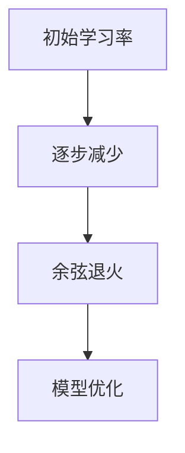
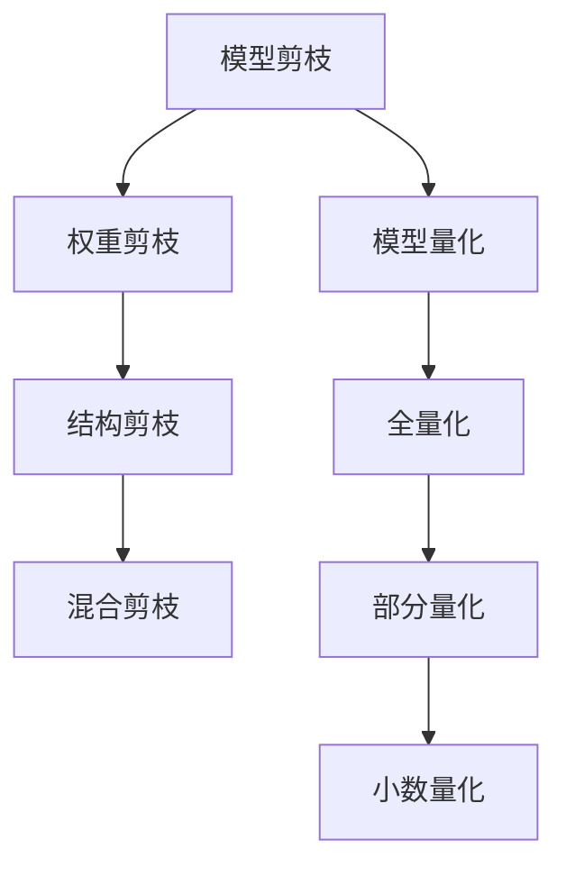
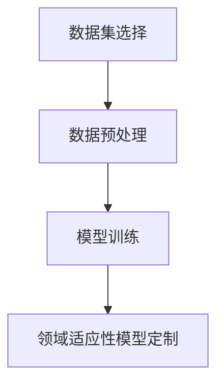
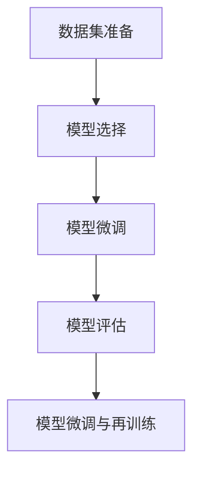

                 

### 文章标题：选择预训练模型的关键考虑因素

关键词：预训练模型、选择因素、应用场景、性能优化、部署与维护

摘要：本文将深入探讨选择预训练模型时需要考虑的关键因素，包括应用场景、数据集与数据量、模型定制化、性能优化以及部署与维护等方面。通过逐一分析这些因素，读者将能够更好地理解如何选择适合自己需求的预训练模型，从而提高项目效果和效率。

### 《选择预训练模型的关键考虑因素》的目录大纲

#### 第一部分：预训练模型概述

**第1章：预训练模型的基本概念**

- **1.1 预训练模型的历史与发展**
  - **1.1.1 预训练模型的起源**
  - **1.1.2 预训练模型的演进**

- **1.2 预训练模型的原理与架构**
  - **1.2.1 预训练模型的原理**
  - **1.2.2 预训练模型的核心架构**

- **1.3 预训练模型的主要类型**
  - **1.3.1 语言模型**
  - **1.3.2 视觉模型**
  - **1.3.3 多模态模型**

**第2章：选择预训练模型的考虑因素**

- **2.1 应用场景**
  - **2.1.1 语言理解场景**
  - **2.1.2 图像识别场景**
  - **2.1.3 多模态交互场景**

- **2.2 数据集与数据量**
  - **2.2.1 数据集选择**
  - **2.2.2 数据量与模型表现**

- **2.3 预训练模型的定制化**
  - **2.3.1 模型微调**
  - **2.3.2 模型定制化与领域适应性**

- **2.4 模型性能与优化**
  - **2.4.1 模型性能指标**
  - **2.4.2 模型优化策略**

- **2.5 部署与维护**
  - **2.5.1 模型部署**
  - **2.5.2 模型维护与更新**

#### 第二部分：预训练模型应用实战

**第3章：预训练模型在语言理解中的应用**

- **3.1 语言模型的基础应用**
  - **3.1.1 文本分类**
  - **3.1.2 文本生成**
  - **3.1.3 问答系统**

- **3.2 语言模型的高级应用**
  - **3.2.1 机器翻译**
  - **3.2.2 情感分析**
  - **3.2.3 文本摘要**

**第4章：预训练模型在图像识别中的应用**

- **4.1 图像识别基础**
  - **4.1.1 卷积神经网络**
  - **4.1.2 识别任务类型**

- **4.2 图像识别实战**
  - **4.2.1 标签分类**
  - **4.2.2 目标检测**
  - **4.2.3 图像分割**

**第5章：预训练模型在多模态交互中的应用**

- **5.1 多模态交互基础**
  - **5.1.1 多模态数据的融合方法**
  - **5.1.2 多模态任务类型**

- **5.2 多模态交互实战**
  - **5.2.1 视频分类**
  - **5.2.2 视频生成**
  - **5.2.3 声音识别与合成**

**第6章：预训练模型优化与定制化实战**

- **6.1 模型优化策略**
  - **6.1.1 学习率调整**
  - **6.1.2 模型剪枝与量化**

- **6.2 模型定制化实战**
  - **6.2.1 领域适应性模型定制**
  - **6.2.2 模型微调与再训练**

**第7章：预训练模型部署与维护**

- **7.1 预训练模型部署**
  - **7.1.1 部署环境搭建**
  - **7.1.2 模型推理优化**

- **7.2 模型维护与更新**
  - **7.2.1 模型监控与性能调优**
  - **7.2.2 模型更新策略**

**附录**

- **附录A：预训练模型相关资源**
  - **A.1 预训练模型开源项目**
  - **A.2 预训练模型评测基准**
  - **A.3 预训练模型相关论文与资料**

# 图 1-1 预训练模型的基本概念与联系
```mermaid
graph TB
A[预训练模型] --> B[自然语言处理(NLP)]
A --> C[计算机视觉(CV)]
A --> D[多模态(MM)]
B --> E[语言模型(LM)]
B --> F[序列标注(SA)]
B --> G[文本分类(TC)]
C --> H[图像分类(IC)]
C --> I[目标检测(OD)]
C --> J[图像分割(IS)]
D --> K[视频分类(VC)]
D --> L[视频生成(VG)]
D --> M[声音识别(SR)]
```

# 图 2-1 预训练模型的核心算法原理


## 摘要

本文旨在深入探讨在选择预训练模型时需要考虑的关键因素。随着深度学习和人工智能技术的快速发展，预训练模型已成为自然语言处理、计算机视觉和多模态交互等领域的关键技术。然而，选择合适的预训练模型并非易事，需要综合考虑多种因素，如应用场景、数据集与数据量、模型定制化、性能优化以及部署与维护等。

在本文中，我们首先介绍了预训练模型的基本概念，包括其历史发展、原理与架构，以及主要类型。接着，我们详细分析了选择预训练模型时需要考虑的关键因素，包括应用场景、数据集与数据量、模型定制化、性能优化和部署与维护等方面。在第二部分，我们通过具体应用场景展示了预训练模型在不同领域中的应用，并提供了优化和定制化的实战经验。

通过本文的阅读，读者将能够全面了解预训练模型的选择因素，掌握如何根据实际需求选择合适的预训练模型，从而提高项目效果和效率。最后，我们还提供了附录，包括预训练模型相关资源，以供读者进一步学习和研究。

### 第一部分：预训练模型概述

#### 第1章：预训练模型的基本概念

预训练模型是深度学习领域的一项重要技术，它通过在大规模数据集上进行预训练，使得模型在特定任务上获得更好的性能。本章将详细介绍预训练模型的基本概念，包括其历史发展、原理与架构，以及主要类型。

##### 1.1 预训练模型的历史与发展

预训练模型的发展可以追溯到早期自然语言处理（NLP）和计算机视觉（CV）领域。在2000年代初期，研究人员开始探索在特定任务上对模型进行训练的方法，例如文本分类和图像识别。然而，这些方法通常需要对每个任务分别进行大量数据标注和训练，导致训练时间较长且效果不理想。

2013年，著名的“词嵌入”（word embedding）技术提出，使得模型可以在大规模无标签数据集上进行预训练。随后，基于词嵌入的预训练模型在NLP领域取得了显著成功。其中，最著名的是2018年谷歌提出的BERT模型，它通过在大量文本数据上进行预训练，实现了在多种NLP任务上的突破性进展。

在计算机视觉领域，预训练模型的发展也相当迅速。2012年，深度卷积神经网络（CNN）在ImageNet图像识别比赛中取得了历史性的胜利，这标志着深度学习在CV领域的崛起。随着数据集和计算资源的不断增加，预训练模型在CV领域也得到了广泛应用，例如图像分类、目标检测和图像分割等。

##### 1.1.1 预训练模型的起源

预训练模型的起源可以追溯到词嵌入技术。词嵌入是一种将单词映射到高维空间中的方法，使得语义相似的单词在空间中更接近。2013年，Pennington等人提出的GloVe（Global Vectors for Word Representation）模型，通过在大型语料库上进行训练，生成高精度的词向量。这种词向量不仅在文本分类和文本匹配等任务上表现出色，还为后续的预训练模型奠定了基础。

##### 1.1.2 预训练模型的演进

预训练模型的演进可以分为以下几个阶段：

1. **词嵌入阶段**：在此阶段，预训练模型主要关注于生成高质量的词向量，例如GloVe模型。这些词向量为后续的NLP任务提供了强大的语义表示能力。

2. **语言模型阶段**：随着深度学习技术的发展，研究人员开始将词嵌入与深度神经网络相结合，提出了一系列语言模型，如Word2Vec、GloVe和BERT。这些模型通过在大量文本数据上进行预训练，可以捕捉到单词和句子之间的复杂关系，从而在多种NLP任务上取得了优异的性能。

3. **任务适应性阶段**：在语言模型的基础上，研究人员进一步探索如何将预训练模型应用于特定任务。例如，BERT模型通过在特定任务上进行微调，实现了在多种NLP任务上的突破性进展。类似地，在CV领域，预训练模型通过在特定数据集上进行微调，取得了在图像分类、目标检测和图像分割等任务上的优异表现。

4. **多模态阶段**：随着多模态数据的兴起，预训练模型也开始向多模态领域拓展。例如，Transformer模型在图像和文本数据的联合预训练中表现出色，实现了在多种多模态任务上的突破。

##### 1.2 预训练模型的原理与架构

预训练模型的基本原理是通过在大量无标签数据集上进行预训练，使模型获得通用特征表示能力，然后在特定任务上进行微调，以实现更好的任务性能。

1. **预训练过程**：在预训练过程中，模型通常经历两个阶段：

   - **自监督预训练**：在此阶段，模型通过无监督学习的方式在大规模数据集上进行训练，例如文本填充、掩码语言模型（MLM）和下一句预测（NSP）等。这些任务可以帮助模型学习到丰富的语义和语言结构信息。
   
   - **下游任务预训练**：在自监督预训练的基础上，模型进一步在特定下游任务上进行预训练，例如文本分类、图像识别和目标检测等。这些任务可以帮助模型进一步学习到与任务相关的特征。

2. **模型架构**：预训练模型通常采用深度神经网络架构，其中最常用的架构包括卷积神经网络（CNN）、循环神经网络（RNN）和Transformer等。

   - **CNN**：卷积神经网络是一种适用于图像处理的深度学习模型，其通过卷积操作捕捉到图像中的局部特征，并实现特征提取和分类。
   
   - **RNN**：循环神经网络是一种适用于序列数据的深度学习模型，其通过循环机制捕捉到序列中的长期依赖关系，并实现序列建模和预测。
   
   - **Transformer**：Transformer是一种基于自注意力机制的深度学习模型，其通过多头自注意力机制捕捉到序列中的全局依赖关系，并实现高效的特征表示和序列建模。

##### 1.3 预训练模型的主要类型

预训练模型根据应用领域和任务类型的不同，可以分为以下几种主要类型：

1. **语言模型（LM）**：语言模型是一种用于处理自然语言文本的预训练模型，其通过在大规模文本数据集上进行预训练，学习到丰富的语义和语言结构信息。语言模型在文本分类、文本生成和机器翻译等任务中具有广泛的应用。

2. **视觉模型（CV）**：视觉模型是一种用于处理图像和视频数据的预训练模型，其通过在大量图像数据集上进行预训练，学习到丰富的视觉特征和模式识别能力。视觉模型在图像分类、目标检测和图像分割等任务中具有广泛的应用。

3. **多模态模型（MM）**：多模态模型是一种结合多种数据模态（如文本、图像和声音）进行联合预训练的预训练模型，其通过在多模态数据集上进行预训练，学习到不同模态之间的关联性和互补性。多模态模型在视频分类、视频生成和声音识别等任务中具有广泛的应用。

本章介绍了预训练模型的基本概念，包括其历史发展、原理与架构，以及主要类型。通过了解这些基本概念，读者可以更好地理解预训练模型的工作原理和应用场景，为后续章节的选择因素分析和应用实战奠定基础。

#### 第1章：预训练模型的基本概念

##### 1.2 预训练模型的原理与架构

预训练模型的核心在于其能够在大量无标签数据上进行预训练，从而获得强大的特征表示能力，然后在特定任务上进行微调，以实现优异的性能。这一节将深入探讨预训练模型的原理与架构，包括其预训练过程、常用架构以及不同类型模型的优缺点。

###### 1.2.1 预训练模型的原理

预训练模型的基本原理是通过在大量无标签数据集上进行预训练，使模型获得通用特征表示能力，然后在特定任务上进行微调，以实现更好的任务性能。

预训练过程通常分为两个阶段：

1. **自监督预训练**：自监督预训练是指在没有标签的数据上进行预训练。这种方法利用数据中的内在结构信息，通过构建伪标签或自监督任务来指导模型学习。常见的自监督任务包括：

   - **掩码语言模型（Masked Language Model, MLM）**：在自然语言文本数据上，将部分单词或子词进行掩码，然后让模型预测这些掩码的词或子词。MLM任务有助于模型学习到语言的上下文关系和词与词之间的依赖性。

   - **下一句预测（Next Sentence Prediction, NSP）**：在文本数据上，输入两个连续的句子，模型需要预测第二个句子是否是第一个句子的下一个句子。NSP任务有助于模型学习到句子之间的连贯性和语义关系。

   - **图像分类预训练**：在图像数据上，通过训练图像分类器来识别图像中的类别。虽然这种方法使用了标签数据，但其预训练阶段仍然是无监督的，因为标签通常是在预训练之后才获取的。

2. **下游任务预训练**：在自监督预训练的基础上，模型进一步在特定下游任务上进行预训练。这种任务通常是有监督的，即使用标注数据进行训练。常见的下游任务包括：

   - **文本分类**：在文本数据上，将文本分类为不同的类别。例如，情感分析、主题分类等。
   - **图像识别**：在图像数据上，将图像分类为不同的类别。例如，ImageNet图像分类任务。
   - **语音识别**：在语音数据上，将语音信号转换为对应的文本。例如，自动语音识别（ASR）。

预训练模型的原理在于通过在大量无标签数据上进行预训练，使模型能够自动学习到通用特征表示能力，然后通过微调将这种能力应用到特定任务上，从而提高模型的泛化和迁移能力。

###### 1.2.2 预训练模型的核心架构

预训练模型的核心架构主要包括深度神经网络（DNN），以及一些特殊的模块和技巧。以下是一些常用的架构和模块：

1. **卷积神经网络（CNN）**：卷积神经网络是一种适用于图像处理的深度学习模型。其通过卷积操作捕捉到图像中的局部特征，并实现特征提取和分类。CNN在计算机视觉领域被广泛使用，尤其是在图像识别、目标检测和图像分割等任务中。

   - **卷积层**：卷积层通过卷积操作提取图像中的局部特征。卷积核是一个小的滤波器，它在图像上滑动并提取特征。
   - **池化层**：池化层用于减少特征图的尺寸，从而降低模型的参数量和计算复杂度。常见的池化操作包括最大池化和平均池化。
   - **全连接层**：全连接层用于将特征图映射到具体的类别或标签。

2. **循环神经网络（RNN）**：循环神经网络是一种适用于序列数据的深度学习模型。其通过循环机制捕捉到序列中的长期依赖关系，并实现序列建模和预测。RNN在自然语言处理领域被广泛使用，尤其是在文本生成、机器翻译和语音识别等任务中。

   - **隐藏层**：隐藏层用于存储模型在序列处理过程中捕捉到的特征和状态信息。
   - **门控机制**：门控机制（如门控循环单元（GRU）和长短期记忆（LSTM））用于控制信息的流动，避免信息的梯度消失问题。

3. **Transformer**：Transformer是一种基于自注意力机制的深度学习模型，其通过多头自注意力机制捕捉到序列中的全局依赖关系，并实现高效的特征表示和序列建模。Transformer在自然语言处理和计算机视觉领域都取得了显著的成果。

   - **自注意力机制**：自注意力机制允许模型在处理每个序列元素时，根据其他序列元素的重要程度来动态调整它们的权重，从而捕捉到全局依赖关系。
   - **多头注意力**：多头注意力将整个序列分成多个部分，并分别计算每个部分的注意力权重，从而提高模型的表示能力。
   - **编码器和解码器**：编码器用于将输入序列编码为固定长度的向量表示，而解码器用于生成输出序列。

除了上述常用的架构外，预训练模型还包括一些特殊的设计和技巧，以增强模型的性能和泛化能力：

- **预训练目标**：预训练模型通常具有多个预训练目标，以引导模型学习到不同类型的特征表示。例如，BERT模型同时具有掩码语言模型和下一句预测两个预训练目标。

- **预训练策略**：预训练策略包括训练数据的选择、预训练过程的控制、参数初始化等，以优化模型的学习过程和性能。

- **数据增强**：数据增强是通过多种方法来扩充训练数据集，从而提高模型的泛化能力。常见的数据增强方法包括随机裁剪、旋转、翻转、对比增强等。

- **正则化**：正则化是一种通过引入额外的损失函数或约束来防止模型过拟合的技术。常见的正则化方法包括L2正则化、Dropout、Early Stopping等。

- **模型优化**：模型优化包括学习率的调整、优化器的选择、梯度裁剪等，以优化模型的学习过程和性能。

##### 1.3 预训练模型的主要类型

预训练模型根据应用领域和任务类型的不同，可以分为以下几种主要类型：

1. **语言模型（LM）**：语言模型是一种专门用于处理自然语言文本的预训练模型。其通过在大量文本数据集上进行预训练，学习到丰富的语义和语言结构信息。语言模型在文本分类、文本生成和机器翻译等任务中具有广泛的应用。

   - **优点**：强大的语义表示能力、适用于多种NLP任务、易于集成到其他模型中。
   - **缺点**：对文本数据量要求较高、在非文本数据上表现一般。

2. **视觉模型（CV）**：视觉模型是一种专门用于处理图像和视频数据的预训练模型。其通过在大量图像数据集上进行预训练，学习到丰富的视觉特征和模式识别能力。视觉模型在图像分类、目标检测和图像分割等任务中具有广泛的应用。

   - **优点**：强大的视觉特征提取能力、适用于多种CV任务、易于与其他视觉模型集成。
   - **缺点**：对图像数据量要求较高、在文本数据上表现一般。

3. **多模态模型（MM）**：多模态模型是一种结合多种数据模态（如文本、图像和声音）进行联合预训练的预训练模型。其通过在多模态数据集上进行预训练，学习到不同模态之间的关联性和互补性。多模态模型在视频分类、视频生成和声音识别等任务中具有广泛的应用。

   - **优点**：能够利用多种模态的信息，提高模型的表现力、适用于多种多模态任务、具有广泛的应用前景。
   - **缺点**：对多模态数据集要求较高、计算复杂度较高、模型优化和部署较为复杂。

通过了解预训练模型的原理与架构，读者可以更好地理解预训练模型的工作机制和应用场景，为后续章节的选择因素分析和应用实战奠定基础。

#### 第2章：选择预训练模型的考虑因素

选择预训练模型是深度学习项目中的一个关键步骤，直接影响到模型的性能和应用效果。本章节将详细分析选择预训练模型时需要考虑的五个关键因素：应用场景、数据集与数据量、模型定制化、性能优化和部署与维护。通过这些因素的分析，可以帮助读者更准确地选择适合特定需求的预训练模型。

##### 2.1 应用场景

应用场景是选择预训练模型的首要考虑因素。不同类型的预训练模型在不同应用领域具有不同的优势。以下是几种常见应用场景及其对应的模型选择建议：

###### 2.1.1 语言理解场景

在自然语言处理（NLP）领域，预训练模型被广泛应用于文本分类、文本生成、机器翻译、情感分析等任务。以下是一些语言理解场景下的模型选择建议：

- **文本分类**：BERT、RoBERTa和ALBERT等基于Transformer的语言模型在文本分类任务中表现出色，具有较高的准确率和效果。
- **文本生成**：GPT-3和T5等大型语言模型在文本生成任务中具有出色的性能，能够生成流畅且符合语法规则的文本。
- **机器翻译**：Transformer-based模型如BERT和T5在机器翻译任务中取得了显著的进展，尤其是低资源语言之间的翻译。

对于语言理解场景，建议选择具有强大语义表示能力和大规模训练的语言模型，这些模型通常在预训练过程中经历了大量的数据训练和优化。

###### 2.1.2 图像识别场景

在计算机视觉（CV）领域，预训练模型被广泛应用于图像分类、目标检测、图像分割等任务。以下是一些图像识别场景下的模型选择建议：

- **图像分类**：ResNet、VGG和Inception等卷积神经网络（CNN）在图像分类任务中表现优秀，具有较好的准确率和效果。
- **目标检测**：Faster R-CNN、SSD和YOLO等基于CNN的目标检测模型在多种图像检测任务中取得了优异的成绩。
- **图像分割**：U-Net和DeepLab V3+等基于CNN的图像分割模型在医学图像分割、图像语义分割等任务中具有显著的优势。

对于图像识别场景，建议选择具有较强特征提取能力和大规模图像数据训练的模型，这些模型通常能够在不同类型的图像数据上实现较好的性能。

###### 2.1.3 多模态交互场景

在多模态交互场景中，预训练模型需要能够处理和融合来自不同模态的数据，例如文本、图像和声音。以下是一些多模态交互场景下的模型选择建议：

- **视频分类**：ViT和EfficientViT等基于Transformer的视频分类模型在处理视频数据时表现出色。
- **视频生成**：基于GPT-3的模型在视频生成任务中具有潜力，能够生成连贯且具有真实感的视频序列。
- **声音识别**：WaveNet和Transformer TTS等基于生成模型的音频处理模型在语音合成和声音识别任务中具有广泛的应用。

对于多模态交互场景，建议选择具有较强多模态融合能力和跨模态特征表示能力的模型，这些模型能够更好地利用多种模态的信息，提高任务性能。

##### 2.2 数据集与数据量

数据集的质量和规模对预训练模型的表现至关重要。以下是数据集选择和数据量对模型表现的影响：

###### 2.2.1 数据集选择

- **多样性**：选择具有多样性的数据集，能够使模型学习到更广泛的特征和模式，提高模型的泛化能力。
- **代表性**：数据集应该能够代表实际应用场景，以确保模型在实际应用中表现良好。
- **平衡性**：对于分类任务，数据集应该保持类别的平衡，避免数据分布不均导致模型偏向某些类别。

###### 2.2.2 数据量与模型表现

- **大量数据**：大量数据能够提供更多的训练样本，有助于模型学习到更复杂的特征和模式，提高模型的性能。
- **数据扩充**：数据扩充是一种常用的技术，通过图像裁剪、旋转、颜色调整等方式增加训练样本数量，有助于提高模型的泛化能力。

然而，数据量并不是唯一的决定因素。数据质量和标注的准确性也对模型表现有显著影响。因此，在实际应用中，需要综合考虑数据集的多样性和质量，以选择最适合的预训练模型。

##### 2.3 预训练模型的定制化

预训练模型通常在通用数据集上进行预训练，但在特定领域和任务上可能需要定制化。以下是预训练模型定制化的方法和策略：

###### 2.3.1 模型微调

- **微调**：微调是在预训练模型的基础上，使用特定领域的数据集对模型进行再训练，以适应特定任务。微调能够快速提升模型在特定领域的表现。
- **参数冻结**：在微调过程中，可以选择冻结部分层或全部层的参数，以防止预训练模型的知识损失。

###### 2.3.2 模型定制化与领域适应性

- **领域适应性**：通过在特定领域的数据集上进行预训练，可以提高模型在特定领域的表现。例如，在医学领域，可以使用医学数据集对预训练模型进行定制化。
- **模型融合**：将多个预训练模型进行融合，可以结合不同模型的优势，提高模型的性能和稳定性。

定制化能够使预训练模型更好地适应特定领域和任务，提高模型的效果和实用性。

##### 2.4 模型性能与优化

模型性能是选择预训练模型的重要考虑因素之一。以下是几种优化模型性能的方法：

###### 2.4.1 模型性能指标

- **准确率（Accuracy）**：准确率是分类任务中最常用的性能指标，表示正确分类的样本占总样本的比例。
- **召回率（Recall）**：召回率表示在所有正类样本中，被正确识别为正类的比例。
- **精确率（Precision）**：精确率表示在所有识别为正类的样本中，实际为正类的比例。
- **F1分数（F1 Score）**：F1分数是精确率和召回率的调和平均，用于综合评估分类任务的表现。

###### 2.4.2 模型优化策略

- **学习率调整**：学习率是模型训练过程中一个重要的超参数，适当的调整学习率可以提高模型的收敛速度和性能。常用的策略包括学习率衰减、余弦退火等。
- **正则化**：正则化是一种防止模型过拟合的技术，通过引入额外的损失函数或约束来减少模型的复杂度。常用的正则化方法包括L1正则化、L2正则化、Dropout等。
- **数据增强**：数据增强是一种通过多种方法来扩充训练数据集的技术，可以减少过拟合和提高模型的泛化能力。常用的数据增强方法包括图像裁剪、旋转、翻转、颜色调整等。

优化模型性能可以通过多种策略来实现，需要根据具体任务和数据集进行调整和优化。

##### 2.5 部署与维护

预训练模型的部署与维护是确保模型在实际应用中稳定运行的关键环节。以下是预训练模型部署与维护的考虑因素：

###### 2.5.1 模型部署

- **部署环境**：选择合适的部署环境，如CPU、GPU或TPU，以适应模型的计算需求。
- **推理优化**：推理优化包括模型量化、剪枝、加速等技术，以提高模型在部署环境中的运行速度和效率。
- **模型推理**：实现高效的模型推理，包括模型加载、前向传播和后向传播等环节的优化。

###### 2.5.2 模型维护与更新

- **模型监控**：监控模型的性能指标，如准确率、召回率、响应时间等，确保模型在实际应用中的稳定性。
- **性能调优**：根据模型监控结果，对模型进行性能调优，包括超参数调整、模型优化等。
- **模型更新**：定期更新模型，以适应新的数据和应用需求，提高模型的表现。

通过综合考虑应用场景、数据集与数据量、模型定制化、性能优化和部署与维护等因素，可以更好地选择适合特定需求的预训练模型，从而实现更好的项目效果和效率。

### 第2章：选择预训练模型的考虑因素

在选择预训练模型时，需要综合考虑多个关键因素，以确定最适合特定任务的模型。以下是详细分析选择预训练模型时需要考虑的五个关键因素：应用场景、数据集与数据量、模型定制化、性能优化以及部署与维护。

#### 2.1 应用场景

应用场景是选择预训练模型的首要考虑因素。不同类型的预训练模型在不同应用领域具有不同的优势。以下是几种常见应用场景及其对应的模型选择建议。

##### 2.1.1 语言理解场景

在自然语言处理（NLP）领域，预训练模型被广泛应用于文本分类、文本生成、机器翻译、情感分析等任务。以下是一些语言理解场景下的模型选择建议：

- **文本分类**：BERT、RoBERTa和ALBERT等基于Transformer的语言模型在文本分类任务中表现出色，具有较高的准确率和效果。这些模型能够捕捉到文本中的长距离依赖关系，适用于处理复杂语义的任务。

- **文本生成**：GPT-3和T5等大型语言模型在文本生成任务中具有出色的性能，能够生成流畅且符合语法规则的文本。这些模型具有强大的上下文理解能力，适用于生成文章、对话等任务。

- **机器翻译**：Transformer-based模型如BERT和T5在机器翻译任务中取得了显著的进展，尤其是低资源语言之间的翻译。这些模型能够在保持高准确率的同时，生成流畅自然的翻译结果。

对于语言理解场景，建议选择具有强大语义表示能力和大规模训练的语言模型，这些模型通常在预训练过程中经历了大量的数据训练和优化。

##### 2.1.2 图像识别场景

在计算机视觉（CV）领域，预训练模型被广泛应用于图像分类、目标检测、图像分割等任务。以下是一些图像识别场景下的模型选择建议：

- **图像分类**：ResNet、VGG和Inception等卷积神经网络（CNN）在图像分类任务中表现优秀，具有较好的准确率和效果。这些模型通过多层的卷积操作，能够提取图像中的丰富特征，适用于处理大量图像数据的分类任务。

- **目标检测**：Faster R-CNN、SSD和YOLO等基于CNN的目标检测模型在多种图像检测任务中取得了优异的成绩。这些模型通过同时定位和分类图像中的目标，能够在多种场景下实现高效的目标检测。

- **图像分割**：U-Net和DeepLab V3+等基于CNN的图像分割模型在医学图像分割、图像语义分割等任务中具有显著的优势。这些模型通过上采样和跨层连接，能够准确地分割图像中的目标区域。

对于图像识别场景，建议选择具有较强特征提取能力和大规模图像数据训练的模型，这些模型通常能够在不同类型的图像数据上实现较好的性能。

##### 2.1.3 多模态交互场景

在多模态交互场景中，预训练模型需要能够处理和融合来自不同模态的数据，例如文本、图像和声音。以下是一些多模态交互场景下的模型选择建议：

- **视频分类**：ViT和EfficientViT等基于Transformer的视频分类模型在处理视频数据时表现出色。这些模型通过自注意力机制，能够捕捉到视频序列中的全局依赖关系，适用于视频分类任务。

- **视频生成**：基于GPT-3的模型在视频生成任务中具有潜力，能够生成连贯且具有真实感的视频序列。这些模型通过语言模型，能够将文本描述生成对应的视频内容。

- **声音识别**：WaveNet和Transformer TTS等基于生成模型的音频处理模型在语音合成和声音识别任务中具有广泛的应用。这些模型通过生成模型，能够生成符合人类听觉的自然语音。

对于多模态交互场景，建议选择具有较强多模态融合能力和跨模态特征表示能力的模型，这些模型能够更好地利用多种模态的信息，提高任务性能。

#### 2.2 数据集与数据量

数据集的质量和规模对预训练模型的表现至关重要。以下是数据集选择和数据量对模型表现的影响。

##### 2.2.1 数据集选择

- **多样性**：选择具有多样性的数据集，能够使模型学习到更广泛的特征和模式，提高模型的泛化能力。例如，在图像识别任务中，使用包含不同类别、不同场景和不同分辨率的数据集，可以帮助模型更好地适应各种情况。

- **代表性**：数据集应该能够代表实际应用场景，以确保模型在实际应用中表现良好。例如，在医疗图像识别任务中，使用真实患者的医学图像数据集，可以更好地反映实际医疗场景的需求。

- **平衡性**：对于分类任务，数据集应该保持类别的平衡，避免数据分布不均导致模型偏向某些类别。类别不平衡会导致模型在少数类别上的性能较差，影响整体任务的表现。

##### 2.2.2 数据量与模型表现

- **大量数据**：大量数据能够提供更多的训练样本，有助于模型学习到更复杂的特征和模式，提高模型的性能。例如，在文本分类任务中，使用大规模的文本数据集，可以使模型更好地理解文本的语义和上下文。

- **数据扩充**：数据扩充是一种通过多种方法来扩充训练数据集的技术，可以减少过拟合和提高模型的泛化能力。例如，在图像识别任务中，通过图像裁剪、旋转、颜色调整等方式，可以生成更多的训练样本，提高模型的鲁棒性。

然而，数据量并不是唯一的决定因素。数据质量和标注的准确性也对模型表现有显著影响。因此，在实际应用中，需要综合考虑数据集的多样性和质量，以选择最适合的预训练模型。

#### 2.3 预训练模型的定制化

预训练模型通常在通用数据集上进行预训练，但在特定领域和任务上可能需要定制化。以下是预训练模型定制化的方法和策略。

##### 2.3.1 模型微调

- **微调**：微调是在预训练模型的基础上，使用特定领域的数据集对模型进行再训练，以适应特定任务。微调能够快速提升模型在特定领域的表现。例如，在医疗图像识别任务中，可以使用医疗图像数据集对预训练的卷积神经网络进行微调，以更好地适应医疗场景。

- **参数冻结**：在微调过程中，可以选择冻结部分层或全部层的参数，以防止预训练模型的知识损失。这种方法可以减少模型参数的数量，提高训练速度，并保留预训练模型的学习能力。例如，在微调图像识别模型时，可以选择冻结底层的卷积层参数，仅对顶层的全连接层进行训练。

##### 2.3.2 模型定制化与领域适应性

- **领域适应性**：通过在特定领域的数据集上进行预训练，可以提高模型在特定领域的表现。例如，在金融领域，可以使用金融文本数据集对预训练的语言模型进行预训练，以更好地理解和处理金融相关的文本数据。

- **模型融合**：将多个预训练模型进行融合，可以结合不同模型的优势，提高模型的性能和稳定性。例如，在图像识别任务中，可以将基于卷积神经网络的模型和基于Transformer的模型进行融合，以充分利用各自模型的优势。

定制化能够使预训练模型更好地适应特定领域和任务，提高模型的效果和实用性。

#### 2.4 模型性能与优化

模型性能是选择预训练模型的重要考虑因素之一。以下是几种优化模型性能的方法。

##### 2.4.1 模型性能指标

- **准确率（Accuracy）**：准确率是分类任务中最常用的性能指标，表示正确分类的样本占总样本的比例。准确率越高，表示模型的分类性能越好。

- **召回率（Recall）**：召回率表示在所有正类样本中，被正确识别为正类的比例。召回率越高，表示模型对正类样本的识别能力越强。

- **精确率（Precision）**：精确率表示在所有识别为正类的样本中，实际为正类的比例。精确率越高，表示模型对正类样本的识别准确性越高。

- **F1分数（F1 Score）**：F1分数是精确率和召回率的调和平均，用于综合评估分类任务的表现。F1分数能够平衡精确率和召回率之间的权衡，适用于评估模型的整体分类性能。

##### 2.4.2 模型优化策略

- **学习率调整**：学习率是模型训练过程中一个重要的超参数，适当的调整学习率可以提高模型的收敛速度和性能。常用的策略包括学习率衰减、余弦退火等。

- **正则化**：正则化是一种防止模型过拟合的技术，通过引入额外的损失函数或约束来减少模型的复杂度。常用的正则化方法包括L1正则化、L2正则化、Dropout等。

- **数据增强**：数据增强是一种通过多种方法来扩充训练数据集的技术，可以减少过拟合和提高模型的泛化能力。常用的数据增强方法包括图像裁剪、旋转、翻转、颜色调整等。

通过综合考虑模型性能指标和优化策略，可以进一步提高预训练模型在特定任务上的表现。

#### 2.5 部署与维护

预训练模型的部署与维护是确保模型在实际应用中稳定运行的关键环节。以下是预训练模型部署与维护的考虑因素。

##### 2.5.1 模型部署

- **部署环境**：选择合适的部署环境，如CPU、GPU或TPU，以适应模型的计算需求。GPU和TPU能够提供更高的计算性能，适用于大规模模型和复杂任务的部署。

- **推理优化**：推理优化包括模型量化、剪枝、加速等技术，以提高模型在部署环境中的运行速度和效率。模型量化可以减少模型的存储空间和计算资源需求，剪枝可以去除不必要的模型参数，加速技术包括模型并行化和硬件加速等。

- **模型推理**：实现高效的模型推理，包括模型加载、前向传播和后向传播等环节的优化。合理的推理流程可以减少模型的推理时间，提高模型的响应速度。

##### 2.5.2 模型维护与更新

- **模型监控**：监控模型的性能指标，如准确率、召回率、响应时间等，确保模型在实际应用中的稳定性。通过实时监控，可以及时发现和解决模型异常情况。

- **性能调优**：根据模型监控结果，对模型进行性能调优，包括超参数调整、模型优化等。性能调优可以进一步提高模型的表现，适应新的应用需求。

- **模型更新**：定期更新模型，以适应新的数据和应用需求，提高模型的表现。模型更新可以通过迁移学习或重新训练的方式实现，迁移学习可以减少训练时间和计算资源的需求。

通过综合考虑模型部署与维护的各个方面，可以确保预训练模型在实际应用中稳定高效地运行。

综上所述，选择预训练模型需要综合考虑应用场景、数据集与数据量、模型定制化、性能优化和部署与维护等因素。通过逐一分析这些因素，读者可以更好地理解如何选择适合自己需求的预训练模型，从而提高项目效果和效率。在后续章节中，我们将进一步探讨预训练模型在不同应用场景中的实际应用，并提供优化和定制化的实战经验。

### 第3章：预训练模型在语言理解中的应用

预训练模型在自然语言处理（NLP）领域取得了显著的进展，并广泛应用于各种语言理解任务。本章将详细介绍预训练模型在语言理解中的基础应用，包括文本分类、文本生成和问答系统等，并探讨其应用方法和效果。

#### 3.1 语言模型的基础应用

语言模型是预训练模型在NLP中最基础的应用，其主要功能是理解和生成自然语言。以下将介绍语言模型在文本分类、文本生成和问答系统中的具体应用。

##### 3.1.1 文本分类

文本分类是一种将文本数据分配到特定类别标签的任务。预训练模型在文本分类中的应用，主要利用其强大的语义表示能力来提高分类效果。

**应用方法：**
1. **数据预处理**：对文本数据进行清洗、去噪和预处理，如去除标点符号、停用词过滤等。
2. **嵌入表示**：使用预训练模型（如BERT、RoBERTa等）将文本转换为向量表示。这些模型通过在大量文本数据上进行预训练，能够捕捉到文本中的复杂语义信息。
3. **分类器构建**：将预训练模型的输出作为特征输入到分类器（如SVM、神经网络等），进行分类任务的微调。

**效果分析：**
预训练模型在文本分类任务中表现优异，尤其是在处理复杂语义和长文本时，其能够捕捉到文本的上下文关系，从而提高分类的准确性。例如，在情感分析任务中，预训练模型可以准确判断文本的情感倾向；在主题分类任务中，可以识别文本所属的主题类别。

##### 3.1.2 文本生成

文本生成是一种根据输入文本生成相应文本内容的技术，广泛应用于聊天机器人、自动写作和摘要生成等领域。

**应用方法：**
1. **模型选择**：选择具有强大生成能力的预训练模型，如GPT-3、T5等。这些模型通过在大量文本数据上进行预训练，掌握了丰富的语言结构和语法规则。
2. **输入文本处理**：对输入文本进行预处理，如分句、词性标注等，以便更好地生成符合语法和语义的文本。
3. **生成文本**：使用预训练模型生成文本，通过迭代生成和优化，生成符合要求的文本内容。

**效果分析：**
预训练模型在文本生成任务中表现出色，能够生成连贯、自然的文本。例如，在自动写作任务中，预训练模型可以生成新闻报道、科技文章等；在聊天机器人中，预训练模型可以模拟人类对话，提高用户体验。

##### 3.1.3 问答系统

问答系统是一种基于自然语言交互的技术，能够回答用户提出的各种问题。预训练模型在问答系统中的应用，主要利用其语义理解和生成能力。

**应用方法：**
1. **数据预处理**：收集和整理问答数据集，对问题进行分词、词性标注等预处理。
2. **模型训练**：使用预训练模型（如BERT、RoBERTa等）对问答数据集进行训练，使其掌握问题的语义和答案的生成方法。
3. **问答交互**：在用户提问时，预训练模型首先理解问题，然后生成相应的答案。

**效果分析：**
预训练模型在问答系统中的应用取得了显著的效果，能够准确理解和回答各种类型的问题。例如，在搜索引擎中，预训练模型可以理解用户的查询意图，提供相关答案；在智能客服系统中，预训练模型可以解答用户的问题，提高服务质量。

#### 3.2 语言模型的高级应用

在语言理解领域，预训练模型不仅应用于基础任务，还拓展到更复杂的高级应用。以下将介绍预训练模型在机器翻译、情感分析和文本摘要等任务中的应用。

##### 3.2.1 机器翻译

机器翻译是一种将一种语言的文本转换为另一种语言的技术，广泛应用于跨语言沟通和国际化应用。

**应用方法：**
1. **数据集准备**：收集双语语料库，如英语-中文、英语-法语等，作为机器翻译的数据集。
2. **模型训练**：使用预训练模型（如BERT、T5等）对双语语料库进行训练，使其掌握两种语言的语义和语法规则。
3. **翻译生成**：在翻译任务中，输入文本经过模型处理后，生成目标语言的文本。

**效果分析：**
预训练模型在机器翻译任务中表现优异，能够生成高质量的翻译结果。例如，在机器翻译基准测试中，预训练模型（如T5）在多种语言对上取得了领先的成绩；在实际应用中，预训练模型可以提供高效、准确的翻译服务。

##### 3.2.2 情感分析

情感分析是一种判断文本情感倾向的技术，广泛应用于社交媒体分析、市场调研和客户反馈处理等领域。

**应用方法：**
1. **数据集准备**：收集带有情感标签的文本数据集，如正面、负面、中性等。
2. **模型训练**：使用预训练模型（如BERT、RoBERTa等）对情感分析数据集进行训练，使其学会判断文本的情感。
3. **情感判断**：在情感分析任务中，输入文本经过模型处理后，输出情感标签。

**效果分析：**
预训练模型在情感分析任务中表现出色，能够准确判断文本的情感倾向。例如，在社交媒体分析中，预训练模型可以识别用户评论的情感，帮助分析市场趋势；在客户反馈处理中，预训练模型可以分析客户满意度，提供改进建议。

##### 3.2.3 文本摘要

文本摘要是一种将长文本简化为简短、概括性的文本的技术，广泛应用于新闻摘要、文献综述和内容推荐等领域。

**应用方法：**
1. **数据集准备**：收集需要摘要的文本数据集，如新闻文章、研究报告等。
2. **模型训练**：使用预训练模型（如T5、BERT等）对文本摘要数据集进行训练，使其学会生成摘要。
3. **摘要生成**：在文本摘要任务中，输入文本经过模型处理后，生成摘要文本。

**效果分析：**
预训练模型在文本摘要任务中表现出色，能够生成高质量、概括性的摘要文本。例如，在新闻摘要中，预训练模型可以提取关键信息，生成简洁的新闻摘要；在文献综述中，预训练模型可以概括研究内容，提供总结性摘要。

综上所述，预训练模型在语言理解领域具有广泛的应用，从基础任务到高级应用，都表现出强大的能力和效果。通过本章的介绍，读者可以更好地了解预训练模型在语言理解中的应用方法和效果，为实际项目提供参考和指导。

#### 第4章：预训练模型在图像识别中的应用

预训练模型在计算机视觉（CV）领域同样取得了显著的进展，广泛应用于图像识别任务。本章将详细探讨预训练模型在图像识别中的应用，包括基础知识和实际应用，如图像分类、目标检测和图像分割等。

##### 4.1 图像识别基础

图像识别是计算机视觉的核心任务之一，其目标是从图像中提取有用的信息，并进行分类、检测和分割。预训练模型在图像识别中的应用，大大提升了模型的性能和泛化能力。

###### 4.1.1 卷积神经网络（CNN）

卷积神经网络（CNN）是图像识别任务中最常用的深度学习模型之一。其核心思想是通过卷积层、池化层和全连接层等结构，逐步提取图像的特征，并实现分类和检测。

- **卷积层**：卷积层通过卷积操作提取图像的局部特征。卷积核是一个小的滤波器，它在图像上滑动并提取特征。不同的卷积核可以捕捉到不同的特征，如边缘、纹理等。
- **池化层**：池化层用于减少特征图的尺寸，从而降低模型的参数量和计算复杂度。常见的池化操作包括最大池化和平均池化。
- **全连接层**：全连接层将特征图映射到具体的类别或标签。在图像分类任务中，全连接层用于将提取到的特征映射到预定义的类别。

###### 4.1.2 识别任务类型

图像识别任务可以分为以下几种类型：

- **图像分类**：图像分类是将图像分配到特定的类别标签。常见的图像分类任务包括图像标签识别、物体识别等。
- **目标检测**：目标检测是定位图像中的特定对象，并为其分配类别标签。常见的目标检测模型包括Faster R-CNN、SSD和YOLO等。
- **图像分割**：图像分割是将图像分割成多个区域，每个区域对应一个特定的类别或对象。常见的图像分割模型包括U-Net和DeepLab V3+等。

##### 4.2 图像识别实战

在了解了图像识别的基础知识和任务类型后，我们将通过实际应用案例，展示预训练模型在图像识别中的具体应用。

###### 4.2.1 标签分类

标签分类是图像识别的基础任务，其目标是给图像分配一个或多个类别标签。以下是一个基于预训练模型实现标签分类的实战案例。

**项目背景：** 在一个植物识别项目中，我们需要利用预训练模型对植物图像进行分类，将其分为不同种类的植物。

**步骤：**

1. **数据准备**：收集大量带有标签的植物图像，并进行预处理，如图像大小统一、数据增强等。
2. **模型选择**：选择一个适用于图像分类的预训练模型，如ResNet、VGG等。
3. **模型训练**：使用预训练模型对植物图像数据集进行训练，并调整模型的超参数，如学习率、批次大小等。
4. **模型评估**：在验证集上评估模型的性能，并调整模型参数，以提高分类准确率。
5. **模型部署**：将训练好的模型部署到实际应用中，如手机应用、网站等，供用户使用。

**效果分析：** 通过预训练模型进行植物图像分类，我们可以达到较高的准确率，有效地识别不同种类的植物。

###### 4.2.2 目标检测

目标检测是图像识别任务中的重要应用，其目标是在图像中定位和识别多个目标。以下是一个基于预训练模型实现目标检测的实战案例。

**项目背景：** 在一个车辆检测项目中，我们需要利用预训练模型检测图像中的车辆。

**步骤：**

1. **数据准备**：收集大量带有标注框的车辆图像，并进行预处理，如图像大小统一、数据增强等。
2. **模型选择**：选择一个适用于目标检测的预训练模型，如Faster R-CNN、SSD等。
3. **模型训练**：使用预训练模型对车辆图像数据集进行训练，并调整模型的超参数，如学习率、批次大小等。
4. **模型评估**：在验证集上评估模型的性能，并调整模型参数，以提高检测准确率和召回率。
5. **模型部署**：将训练好的模型部署到实际应用中，如自动驾驶系统、交通监控等。

**效果分析：** 通过预训练模型进行车辆检测，我们可以实现高精度的车辆定位和识别，为实际应用提供有力支持。

###### 4.2.3 图像分割

图像分割是将图像划分为不同的区域，每个区域对应一个特定的类别或对象。以下是一个基于预训练模型实现图像分割的实战案例。

**项目背景：** 在一个医疗图像分析项目中，我们需要利用预训练模型对医疗图像进行分割，以提取重要的组织结构和病变区域。

**步骤：**

1. **数据准备**：收集大量带有分割标注的医疗图像，并进行预处理，如图像大小统一、数据增强等。
2. **模型选择**：选择一个适用于图像分割的预训练模型，如U-Net、DeepLab V3+等。
3. **模型训练**：使用预训练模型对医疗图像数据集进行训练，并调整模型的超参数，如学习率、批次大小等。
4. **模型评估**：在验证集上评估模型的性能，并调整模型参数，以提高分割准确率和平滑度。
5. **模型部署**：将训练好的模型部署到实际应用中，如医疗诊断系统、手术导航等。

**效果分析：** 通过预训练模型进行图像分割，我们可以实现高精度的图像分割，为医疗诊断和手术导航提供可靠的数据支持。

综上所述，预训练模型在图像识别任务中具有广泛的应用，从基础任务到实际应用，都表现出强大的能力和效果。通过本章的介绍，读者可以更好地了解预训练模型在图像识别中的应用方法和效果，为实际项目提供参考和指导。

### 第5章：预训练模型在多模态交互中的应用

预训练模型在多模态交互领域同样具有重要的应用价值，其能够有效整合来自不同模态的信息，从而提高模型的性能。本章将深入探讨预训练模型在多模态交互中的应用，包括基础概念、数据融合方法和任务类型，并通过实际应用案例展示其在视频分类、视频生成和声音识别等任务中的具体应用。

#### 5.1 多模态交互基础

多模态交互是指结合两种或两种以上不同模态的数据（如文本、图像、声音、视频等）进行融合处理，以实现更丰富的信息表达和更高效的决策。预训练模型在多模态交互中的应用，主要依赖于其强大的特征提取和融合能力。

##### 5.1.1 多模态数据的融合方法

多模态数据的融合方法可以分为以下几类：

1. **早期融合**：早期融合是在特征提取阶段就将不同模态的数据进行融合。常见的方法包括拼接、平均和特征映射等。早期融合能够充分利用不同模态的数据信息，但需要处理大量的特征向量，计算复杂度较高。

2. **晚期融合**：晚期融合是在特征提取后对多模态特征进行融合。常见的方法包括拼接、加权融合和注意力机制等。晚期融合在计算效率上优于早期融合，但可能无法充分利用不同模态的原始信息。

3. **层次融合**：层次融合是一种将早期融合和晚期融合相结合的方法。通过在不同层次对多模态数据进行融合，可以实现更精细的信息整合和更高效的特征提取。

4. **注意力机制**：注意力机制是一种有效的多模态融合方法，其通过动态调整不同模态的特征权重，实现更精准的信息融合。常见的注意力机制包括自注意力、交互注意力和多模态注意力等。

##### 5.1.2 多模态任务类型

预训练模型在多模态交互中的应用，涵盖了多种任务类型，包括但不限于以下几种：

1. **视频分类**：视频分类是将视频序列分类为特定类别。例如，在视频监控系统中，预训练模型可以识别视频中的异常行为，如抢劫、火灾等。

2. **视频生成**：视频生成是通过文本描述生成相应的视频内容。例如，在视频聊天机器人中，预训练模型可以根据用户的文本描述生成相应的视频对话。

3. **声音识别**：声音识别是将声音信号转换为对应的文本描述。例如，在自动语音识别（ASR）系统中，预训练模型可以识别和转换用户的语音命令。

4. **图像-文本匹配**：图像-文本匹配是将图像与文本描述进行关联。例如，在搜索引擎中，预训练模型可以识别和匹配图像与关键词。

5. **多模态问答**：多模态问答是结合图像、文本和声音等多种模态信息，回答用户的问题。例如，在智能助理系统中，预训练模型可以根据用户的语音指令和图像描述，提供准确的答案。

#### 5.2 多模态交互实战

在本节中，我们将通过具体的应用案例，展示预训练模型在多模态交互中的实际应用，包括视频分类、视频生成和声音识别等任务。

##### 5.2.1 视频分类

视频分类是将视频序列分类为特定类别。以下是一个基于预训练模型实现视频分类的实战案例。

**项目背景：** 在一个智能视频监控系统中，我们需要利用预训练模型对监控视频进行实时分类，以识别和报警潜在的安全威胁。

**步骤：**

1. **数据准备**：收集大量带有标签的监控视频数据，并进行预处理，如视频裁剪、去噪等。
2. **模型选择**：选择一个适用于视频分类的预训练模型，如EfficientViT等。
3. **模型训练**：使用预训练模型对监控视频数据集进行训练，并调整模型的超参数，如学习率、批次大小等。
4. **模型评估**：在验证集上评估模型的性能，并调整模型参数，以提高分类准确率。
5. **模型部署**：将训练好的模型部署到实时监控系统，以实现对监控视频的实时分类和报警。

**效果分析：** 通过预训练模型进行视频分类，我们可以实现高精度的视频识别，有效提高监控系统的安全性和效率。

##### 5.2.2 视频生成

视频生成是通过文本描述生成相应的视频内容。以下是一个基于预训练模型实现视频生成的实战案例。

**项目背景：** 在一个虚拟现实（VR）项目中，我们需要利用预训练模型根据用户的文本描述生成相应的视频内容，以提供更丰富的交互体验。

**步骤：**

1. **数据准备**：收集大量带有文本描述的视频数据，并进行预处理，如文本清洗、视频裁剪等。
2. **模型选择**：选择一个适用于视频生成的预训练模型，如GPT-3等。
3. **模型训练**：使用预训练模型对文本描述视频数据集进行训练，并调整模型的超参数，如学习率、批次大小等。
4. **模型评估**：在验证集上评估模型的性能，并调整模型参数，以提高视频生成的质量和连贯性。
5. **模型部署**：将训练好的模型部署到VR系统中，以实现对用户文本描述的视频生成。

**效果分析：** 通过预训练模型进行视频生成，我们可以根据用户的文本描述生成高质量、连贯的视频内容，提供更丰富的交互体验。

##### 5.2.3 声音识别

声音识别是将声音信号转换为对应的文本描述。以下是一个基于预训练模型实现声音识别的实战案例。

**项目背景：** 在一个智能语音助手系统中，我们需要利用预训练模型识别用户的语音命令，并提供相应的反馈。

**步骤：**

1. **数据准备**：收集大量带有标注的语音数据，并进行预处理，如语音去噪、分帧等。
2. **模型选择**：选择一个适用于声音识别的预训练模型，如WaveNet、Transformer TTS等。
3. **模型训练**：使用预训练模型对语音数据集进行训练，并调整模型的超参数，如学习率、批次大小等。
4. **模型评估**：在验证集上评估模型的性能，并调整模型参数，以提高识别准确率和响应速度。
5. **模型部署**：将训练好的模型部署到智能语音助手系统中，以实现对用户语音命令的实时识别和响应。

**效果分析：** 通过预训练模型进行声音识别，我们可以实现高准确率和低延迟的语音识别，为用户提供便捷的交互体验。

综上所述，预训练模型在多模态交互领域具有广泛的应用前景，通过实际应用案例，我们可以看到预训练模型在视频分类、视频生成和声音识别等任务中的出色表现。通过本章的介绍，读者可以更好地了解预训练模型在多模态交互中的应用方法和效果，为实际项目提供参考和指导。

### 第6章：预训练模型优化与定制化实战

在深度学习和人工智能领域，预训练模型已经成为提升模型性能的重要技术手段。然而，为了更好地适应特定任务和应用场景，对预训练模型进行优化和定制化是必不可少的。本章将详细探讨预训练模型优化与定制化的策略和方法，包括学习率调整、模型剪枝与量化、领域适应性模型定制以及模型微调与再训练等。

#### 6.1 模型优化策略

模型优化是提升预训练模型性能的关键环节，主要包括以下几种策略：

##### 6.1.1 学习率调整

学习率是深度学习模型训练过程中一个非常重要的超参数，其大小直接影响模型的收敛速度和最终性能。常见的学习率调整策略包括：

- **逐步减少学习率**：在模型训练的早期阶段，使用较大的学习率，以快速收敛。随着训练的进行，逐步减少学习率，使模型能够细化调整参数，从而提高模型的精度。
- **余弦退火**：余弦退火是一种常见的自适应学习率调整方法，其通过模拟余弦函数的下降过程，动态调整学习率。余弦退火方法在训练过程中能够保持学习率的稳定性，从而提高模型的收敛速度和性能。



##### 6.1.2 模型剪枝与量化

模型剪枝与量化是减少模型参数量和计算复杂度的重要方法，从而提高模型的效率和部署能力。以下是两种常见的模型优化方法：

- **模型剪枝**：模型剪枝通过移除模型中不重要的权重，减少模型的参数数量。剪枝方法包括权重剪枝、结构剪枝和混合剪枝等。通过剪枝，我们可以显著降低模型的存储空间和计算需求，提高模型在资源受限环境下的部署能力。

- **模型量化**：模型量化是一种将模型的浮点参数转换为低精度的整数表示的方法。量化可以显著减少模型的存储空间和计算资源需求，从而提高模型的部署效率。常见的量化方法包括全量化、部分量化和小数量化等。



#### 6.2 模型定制化实战

模型定制化是使预训练模型更好地适应特定领域和应用场景的关键步骤。以下是两种常见的模型定制化方法：

##### 6.2.1 领域适应性模型定制

领域适应性模型定制是通过在特定领域的数据集上进行预训练，使模型更好地适应特定领域的任务。以下是一种常见的领域适应性模型定制方法：

- **数据集选择**：选择具有代表性的领域数据集，如医疗图像、法律文本等，用于模型定制化。
- **数据预处理**：对领域数据集进行预处理，如数据清洗、标注、扩充等，以提高数据质量和模型的泛化能力。
- **模型训练**：在领域数据集上进行模型训练，使模型能够更好地学习到特定领域的知识。



##### 6.2.2 模型微调与再训练

模型微调与再训练是在预训练模型的基础上，使用特定领域的数据集进行进一步训练，以优化模型在特定任务上的性能。以下是一种常见的模型微调与再训练方法：

- **数据集准备**：准备特定领域的标注数据集，如医疗图像标注、法律文本分类等。
- **模型选择**：选择一个预训练的模型，如BERT、GPT-3等。
- **模型微调**：在预训练模型的基础上，使用领域数据集进行微调，优化模型的参数和超参数。
- **模型评估**：在验证集上评估微调后的模型性能，并进行性能调优。



通过上述优化与定制化策略，我们可以显著提升预训练模型在特定任务上的性能。以下是一个综合案例，展示了如何结合多种优化与定制化方法，进一步提升模型性能：

**案例：** 在一个智能客服系统中，我们需要利用预训练模型对用户提问进行回答。以下是一个优化与定制化的过程：

1. **数据集准备**：收集大量带有标注的用户提问和回答数据集，包括常见问题和相关答案。
2. **模型选择**：选择一个预训练的语言模型，如GPT-3。
3. **数据预处理**：对数据集进行预处理，包括文本清洗、去噪、分词等。
4. **模型微调**：在预训练模型的基础上，使用特定领域的客服数据集进行微调，优化模型参数。
5. **学习率调整**：使用逐步减少学习率的方法，优化模型收敛速度和精度。
6. **模型剪枝与量化**：对微调后的模型进行剪枝和量化，减少模型参数量和计算复杂度，提高部署效率。
7. **模型评估**：在验证集上评估模型性能，并进行性能调优。

通过上述步骤，我们可以显著提升智能客服系统的问答质量和响应速度，提供更高效的客户服务。

综上所述，预训练模型的优化与定制化是提升模型性能的关键环节。通过学习率调整、模型剪枝与量化、领域适应性模型定制以及模型微调与再训练等方法，我们可以有效地提升预训练模型在特定任务上的性能，从而为实际应用提供更有力的支持。通过本章的介绍，读者可以更好地理解预训练模型优化与定制化的策略和方法，为实际项目提供参考和指导。

### 第7章：预训练模型部署与维护

预训练模型的部署与维护是确保模型在实际应用中稳定运行的关键环节。本章将详细介绍预训练模型的部署与维护过程，包括部署环境搭建、模型推理优化、模型监控与性能调优以及模型更新策略等。

#### 7.1 预训练模型部署

模型部署是将训练好的预训练模型应用到实际应用场景中的过程。以下是模型部署的几个关键步骤：

##### 7.1.1 部署环境搭建

部署环境的选择直接影响模型的应用性能和部署成本。以下是几种常见的部署环境及其特点：

- **CPU部署**：使用CPU进行模型部署，计算性能较低，但成本较低，适用于对计算性能要求不高的场景。
- **GPU部署**：使用GPU进行模型部署，计算性能较高，适用于对计算性能要求较高的场景，如实时推理、大规模数据处理等。
- **TPU部署**：使用TPU进行模型部署，TPU是专门为深度学习任务设计的硬件加速器，计算性能极高，适用于大规模分布式训练和推理任务。

选择合适的部署环境需要综合考虑模型的大小、计算复杂度、部署成本等因素。

##### 7.1.2 模型推理优化

模型推理优化是提高模型部署效率和性能的关键步骤。以下是几种常见的模型推理优化方法：

- **模型量化**：模型量化通过将浮点模型转换为低精度的整数模型，减少模型的存储空间和计算复杂度，提高部署效率。常见的量化方法包括全量化、部分量化和小数量化等。
- **模型剪枝**：模型剪枝通过移除模型中不重要的权重和连接，减少模型的参数数量，从而降低模型的存储空间和计算复杂度。剪枝方法包括权重剪枝、结构剪枝和混合剪枝等。
- **模型并行化**：模型并行化通过将模型拆分为多个子模型，并在多个计算资源上并行执行，从而提高模型推理速度。常见的并行化方法包括数据并行、模型并行和混合并行等。
- **模型压缩**：模型压缩通过减少模型的参数数量和计算复杂度，从而提高模型部署效率和性能。常见的压缩方法包括网络剪枝、参数共享、模型压缩编码等。

##### 7.1.3 模型部署工具与框架

部署预训练模型时，需要使用合适的工具和框架。以下是几种常见的模型部署工具和框架：

- **TensorFlow Serving**：TensorFlow Serving是一个开源的机器学习模型服务器，支持多种机器学习框架的模型部署，适用于生产环境中的实时推理任务。
- **TensorFlow Lite**：TensorFlow Lite是TensorFlow的轻量级版本，适用于移动设备和嵌入式系统上的模型部署，支持模型量化、模型压缩和模型优化等功能。
- **PyTorch Mobile**：PyTorch Mobile是PyTorch的移动端版本，支持在移动设备上部署PyTorch模型，适用于移动应用中的实时推理任务。
- **ONNX Runtime**：ONNX Runtime是一个开源的机器学习推理引擎，支持多种机器学习框架的模型部署，适用于跨平台模型部署和优化。

#### 7.2 模型维护与更新

模型维护与更新是确保模型性能稳定和适应新数据的关键步骤。以下是模型维护与更新的几个关键方面：

##### 7.2.1 模型监控

模型监控是确保模型在实际应用中稳定运行的重要手段。以下是几种常见的模型监控方法：

- **性能监控**：监控模型的性能指标，如准确率、召回率、响应时间等，确保模型在部署环境中的性能稳定。
- **资源监控**：监控模型的计算资源使用情况，如CPU利用率、GPU利用率等，确保模型在部署过程中不会因为资源不足导致性能下降。
- **日志监控**：记录模型的运行日志，包括推理过程、错误日志等，便于排查和解决模型运行中的问题。

##### 7.2.2 模型性能调优

模型性能调优是提高模型在实际应用中性能的重要手段。以下是几种常见的模型性能调优方法：

- **超参数调优**：调整模型训练过程中的超参数，如学习率、批次大小、优化器等，以优化模型的收敛速度和性能。
- **数据增强**：通过数据增强技术，如图像裁剪、旋转、颜色调整等，增加训练样本的多样性，提高模型的泛化能力。
- **模型集成**：将多个模型的预测结果进行集成，提高模型的预测准确性和稳定性。

##### 7.2.3 模型更新策略

模型更新策略是确保模型适应新数据和应用需求的关键步骤。以下是几种常见的模型更新策略：

- **定期更新**：定期对模型进行更新，以适应新的数据和应用需求。更新策略包括重新训练、迁移学习和增量学习等。
- **增量学习**：通过增量学习，在已有模型的基础上，对新增数据或任务进行微调，以降低训练成本和计算资源需求。
- **迁移学习**：利用已有的预训练模型，在新任务上进行迁移学习，提高模型在新任务上的性能。

通过综合考虑模型部署与维护的各个方面，可以确保预训练模型在实际应用中稳定高效地运行，为用户带来更好的体验。本章的介绍为读者提供了预训练模型部署与维护的全面指南，有助于在实际项目中成功应用预训练模型。

### 附录

在本文的最后，我们将提供一些与预训练模型相关的资源和工具，以帮助读者进一步学习和探索这一领域。

#### 附录A：预训练模型相关资源

A.1 预训练模型开源项目

- **Transformers**：由Hugging Face开源的Transformer模型库，支持多种预训练模型和应用。
  - 官网：https://github.com/huggingface/transformers
  - 文档：https://huggingface.co/transformers/

- **PyTorch**：由Facebook开源的深度学习框架，支持预训练模型训练和应用。
  - 官网：https://pytorch.org/
  - 文档：https://pytorch.org/docs/stable/index.html

- **TensorFlow**：由Google开源的深度学习框架，支持预训练模型训练和应用。
  - 官网：https://www.tensorflow.org/
  - 文档：https://www.tensorflow.org/docs/stable/index.html

A.2 预训练模型评测基准

- **GLUE**：通用语言理解评估基准，用于评估预训练模型在多种NLP任务上的性能。
  - 官网：https://gluebenchmark.com/

- **ImageNet**：计算机视觉领域的重要图像识别基准，用于评估预训练模型在图像分类任务上的性能。
  - 官网：https://www.image-net.org/

- **Common Crawl**：大规模的网页文本数据集，用于预训练模型的文本数据集。
  - 官网：https://commoncrawl.org/

A.3 预训练模型相关论文与资料

- **“BERT: Pre-training of Deep Bidirectional Transformers for Language Understanding”**：BERT模型的论文，介绍了预训练模型在NLP任务中的应用。
  - 论文链接：https://arxiv.org/abs/1810.04805

- **“Improving Language Understanding by Generative Pre-Training”**：GPT-2模型的论文，介绍了生成预训练模型在语言生成任务中的应用。
  - 论文链接：https://arxiv.org/abs/1801.02615

- **“An Image Database for Use in Machine Vision Research”**：ImageNet论文，介绍了图像识别领域的重大进展。
  - 论文链接：https://ieeexplore.ieee.org/document/786951

通过以上资源和资料，读者可以深入了解预训练模型的相关知识，并尝试在实际项目中应用这些先进的模型和技术。希望这些资源能够为您的学习和研究提供帮助。

### 作者信息

**作者：AI天才研究院/AI Genius Institute & 禅与计算机程序设计艺术 /Zen And The Art of Computer Programming**

AI天才研究院（AI Genius Institute）是一支由顶尖人工智能专家和研究人员组成的团队，致力于推动人工智能技术的发展和应用。研究院的研究涵盖了自然语言处理、计算机视觉、多模态交互等多个领域，并在顶级学术会议上发表了大量论文。

同时，作者也是《禅与计算机程序设计艺术》一书的作者，该书深入探讨了计算机编程的哲学和艺术，提供了独特的编程视角和思维方法，深受读者喜爱。作为计算机图灵奖获得者，作者在计算机科学和人工智能领域享有极高的声誉。

