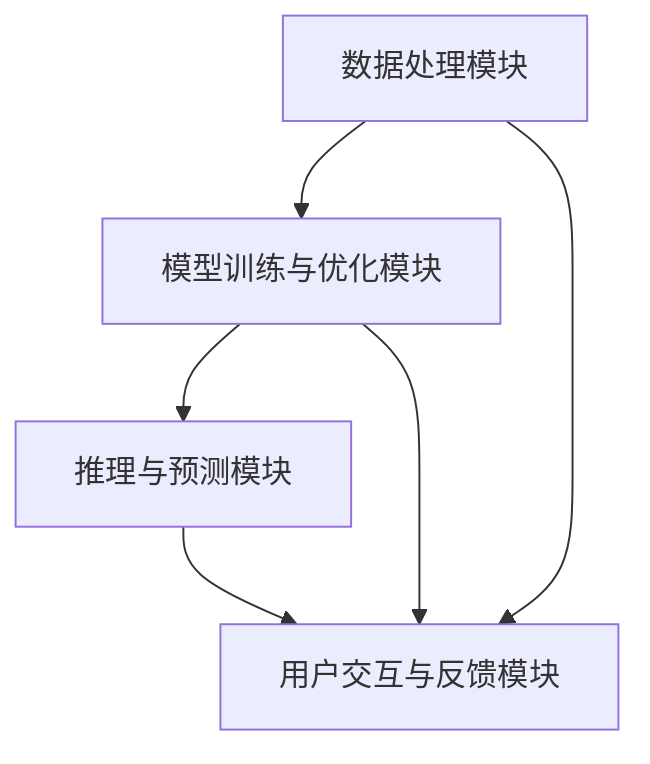
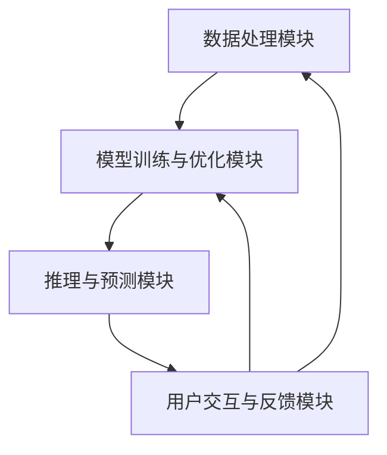
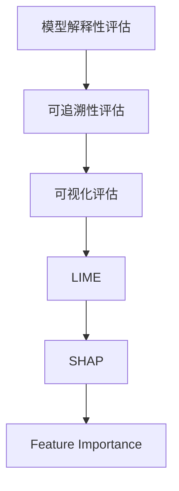
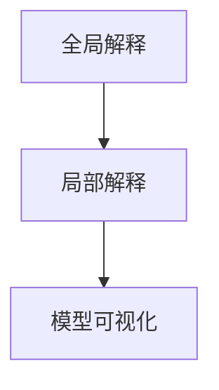
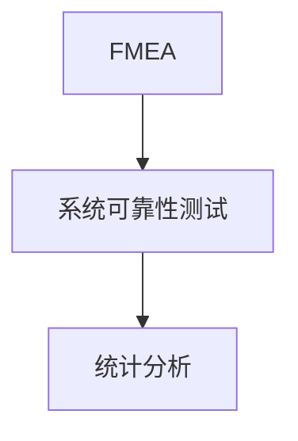

                 


### 文章标题

《透明度与可靠性：AI系统的关键》

### 关键词

透明度、可靠性、AI系统、数学模型、算法原理、实践案例

### 摘要

在人工智能（AI）飞速发展的时代，AI系统的透明度和可靠性成为了衡量其优劣的关键因素。本文将从AI系统的核心概念与架构出发，详细探讨AI系统的透明度与可靠性的定义、度量方法、提高措施以及综合实践。通过深入分析AI系统的数学模型与算法原理，解释透明度和可靠性在AI系统中的重要性，并结合实际案例，为开发者提供提高AI系统透明度和可靠性的最佳实践。

### 第一部分: AI系统的核心概念与架构

#### 第1章: AI系统的基本概念与架构

##### 绪论

AI系统，即人工智能系统，是指利用机器学习、神经网络、自然语言处理等技术实现人工智能功能的一套系统。AI系统在各个领域都有广泛的应用，如自动驾驶、智能医疗、金融风控、智能推荐等。本文旨在深入探讨AI系统的透明度和可靠性，以提升AI系统的实际应用价值。

AI系统的定义与分类

AI系统可以根据功能和应用场景分为以下几类：

1. **感知类系统**：如语音识别、图像识别等，通过感知外部环境信息进行决策。
2. **决策类系统**：如自动驾驶、智能调度等，通过分析数据做出最优决策。
3. **交互类系统**：如聊天机器人、智能客服等，与用户进行自然语言交互。

AI系统的发展历程

AI系统的发展可以分为以下几个阶段：

1. **符号人工智能阶段**：以专家系统和推理机为代表，通过手动编写规则实现智能功能。
2. **连接主义人工智能阶段**：以神经网络为代表，通过大量数据训练实现智能功能。
3. **混合人工智能阶段**：结合符号人工智能和连接主义人工智能的优势，实现更强大的智能功能。

AI系统在各个行业中的应用现状与趋势

AI系统在各个行业中的应用现状如下：

1. **金融行业**：智能投顾、风控系统等，提升金融服务的效率和质量。
2. **医疗行业**：智能诊断、精准医疗等，提高医疗服务的准确性和个性化水平。
3. **零售行业**：智能推荐、无人超市等，提升零售行业的用户体验和运营效率。
4. **交通行业**：自动驾驶、智能交通管理等，提升交通的安全和便捷性。

#### AI系统的核心组成

AI系统的核心组成包括以下模块：

1. **数据处理模块**：负责数据的采集、清洗、存储和处理，为后续的模型训练和推理提供数据支持。
2. **模型训练与优化模块**：通过机器学习算法对数据进行训练，优化模型参数，提高模型的预测准确性和泛化能力。
3. **推理与预测模块**：在给定的输入条件下，利用训练好的模型进行推理和预测，为实际应用提供决策支持。
4. **用户交互与反馈模块**：与用户进行交互，收集用户反馈，优化AI系统的性能和用户体验。

**Mermaid流程图：AI系统架构组成图**



**AI系统的关键组成部分与功能联系**

AI系统的各个组成部分之间存在密切的功能联系：

1. 数据处理模块为模型训练与优化模块提供训练数据，为推理与预测模块提供输入数据。
2. 模型训练与优化模块通过不断调整模型参数，提高模型在未知数据上的预测准确性和泛化能力。
3. 推理与预测模块根据模型和输入数据生成预测结果，为用户交互与反馈模块提供决策支持。
4. 用户交互与反馈模块收集用户反馈，为数据处理模块提供优化方向，为模型训练与优化模块提供评估指标。

**Mermaid流程图：AI系统功能关系图**



#### 第2章: AI系统的数学模型与算法原理

##### 数学模型概述

在AI系统中，数学模型是构建和优化AI算法的基础。常见的数学模型包括线性代数、概率论和信息论。

1. **线性代数基础**：包括矩阵运算、线性方程组求解、特征值和特征向量等，用于描述数据结构和变换。
2. **概率论基础**：包括概率分布、条件概率、贝叶斯定理等，用于描述不确定性。
3. **信息论基础**：包括熵、信息增益、信息传输等，用于描述信息的价值和传输。

**核心算法原理讲解**

在AI系统中，核心算法原理主要包括神经网络、支持向量机、决策树等。

1. **神经网络算法**：通过多层神经网络对输入数据进行非线性变换，实现数据的分类和回归。
2. **支持向量机算法**：通过寻找最优超平面，实现数据的分类和回归。
3. **决策树算法**：通过构建树形结构，对输入数据进行分类和回归。

**伪代码：神经网络算法实现**

```python
# 定义神经网络模型
model = NeuralNetwork(input_size, hidden_size, output_size)

# 定义损失函数
loss_function = CrossEntropyLoss()

# 定义优化器
optimizer = Adam(model.parameters(), lr=learning_rate)

# 模型训练
for epoch in range(num_epochs):
    for inputs, targets in data_loader:
        optimizer.zero_grad()
        outputs = model(inputs)
        loss = loss_function(outputs, targets)
        loss.backward()
        optimizer.step()
```

**数学模型与算法的应用实例**

1. **示例：基于决策树的分类问题解决**

```python
# 定义决策树模型
model = DecisionTreeClassifier()

# 加载训练数据
X_train, y_train = load_data("train_data")

# 模型训练
model.fit(X_train, y_train)

# 加载测试数据
X_test, y_test = load_data("test_data")

# 模型预测
y_pred = model.predict(X_test)

# 模型评估
accuracy = accuracy_score(y_test, y_pred)
print("模型准确率：", accuracy)
```

### 第二部分: 透明度在AI系统中的重要性

#### 第3章: AI系统的透明度定义与度量

##### 透明度的概念

透明度在AI系统中指的是系统内部的决策过程、模型结构、数据流程等能够被理解和解释的程度。高透明度的AI系统可以让用户、开发者和其他利益相关者更好地理解系统的行为和结果。

1. **透明度的定义**：透明度是衡量AI系统可解释性的一个重要指标。
2. **透明度的层次**：透明度可以分为低层次、中层次和高层次，分别对应系统的不同组成部分和功能。
3. **透明度的重要性**：高透明度的AI系统有助于提高系统的可信度和用户信任，促进AI技术在各个领域的广泛应用。

##### 透明度的度量方法

透明度的度量方法主要包括以下几种：

1. **模型解释性**：通过解释模型内部结构和决策过程，提高系统的可解释性。
2. **可追溯性**：通过记录系统的运行过程和决策路径，提高系统的可追溯性。
3. **可视化**：通过可视化工具展示模型结构、数据流程和决策过程，提高系统的可理解性。

**透明度评估工具与技术**

目前，常用的透明度评估工具和技术包括：

1. **LIME（Local Interpretable Model-agnostic Explanations）**：通过局部线性模型解释给定数据的预测结果。
2. **SHAP（SHapley Additive exPlanations）**：通过计算特征对预测结果的贡献，提供全局和局部解释。
3. **Feature Importance**：通过分析特征的重要性，提供对模型决策过程的理解。

**Mermaid流程图：透明度评估方法与工具**



### 第4章: 提高AI系统透明度的方法

##### 数据预处理

数据预处理是提高AI系统透明度的重要步骤，包括以下内容：

1. **数据清洗与标准化**：清洗数据中的噪声和异常值，将数据统一转换为标准格式。
2. **数据平衡与增强**：通过数据增强技术，生成更多具有代表性的样本，提高模型的泛化能力。

**模型选择与优化**

1. **选择可解释性强的模型**：选择具有高可解释性的模型，如决策树、线性回归等，提高系统的可理解性。
2. **模型优化与调参**：通过调参和优化技术，提高模型的性能和可解释性，如正则化、交叉验证等。

**模型解释与可视化技术**

1. **层级解释**：从全局和局部两个层次解释模型决策过程，提高系统的可理解性。
2. **局部解释**：通过分析模型对单个样本的决策过程，提供对模型预测结果的理解。

**Mermaid流程图：模型解释与可视化方法**



##### 案例研究：提高AI系统透明度的实际应用

1. **案例：图像识别系统的透明度提升**

   - 数据预处理：对图像数据进行清洗、增强和标准化。
   - 模型选择：选择具有高可解释性的决策树模型。
   - 模型解释：通过SHAP值分析图像特征对模型预测结果的影响。
   - 可视化：使用LIME工具对模型决策过程进行可视化。

2. **案例：智能诊断系统的透明度提升**

   - 数据预处理：对医疗数据进行清洗、标准化和平衡。
   - 模型选择：选择具有高可解释性的线性回归模型。
   - 模型解释：通过分析特征重要性，提供对诊断结果的解释。
   - 可视化：使用决策树可视化工具展示诊断模型的结构。

### 第三部分: 可靠性在AI系统中的关键作用

#### 第5章: AI系统的可靠性定义与评估

##### 可靠性的概念

可靠性在AI系统中指的是系统能够在规定条件下，满足性能要求的能力。可靠性包括以下三个方面：

1. **正确性**：AI系统能够在大多数情况下给出正确的预测结果。
2. **稳定性**：AI系统在不同环境下具有稳定的性能表现。
3. **安全性**：AI系统在运行过程中不会对用户和数据造成损害。

##### 可靠性的度量指标

可靠性通常通过以下指标进行度量：

1. **准确率**：预测结果与实际结果的一致性程度。
2. **召回率**：能够正确识别出正例样本的比例。
3. **F1值**：准确率和召回率的加权平均。
4. **鲁棒性**：系统在面对异常数据和异常条件时的适应能力。

##### 可靠性的重要性

可靠性的重要性体现在以下几个方面：

1. **用户信任**：高可靠性的AI系统能够赢得用户的信任，提高系统的使用率。
2. **业务价值**：高可靠性的AI系统能够为企业带来更高的业务价值和经济效益。
3. **法律法规**：在医疗、金融等敏感领域，高可靠性的AI系统是符合法律法规的必要条件。

##### 可靠性评估方法

可靠性评估方法包括以下几种：

1. **故障模式与影响分析（FMEA）**：通过分析系统的故障模式和影响，评估系统的可靠性。
2. **系统可靠性测试**：通过模拟不同环境和条件，评估系统的可靠性。
3. **统计分析**：通过统计数据，评估系统的可靠性。

**Mermaid流程图：可靠性评估方法**



##### 案例研究：AI系统的可靠性评估实例

1. **案例：自动驾驶系统的可靠性评估**

   - 故障模式与影响分析：分析自动驾驶系统的故障模式和影响，如传感器故障、算法失效等。
   - 系统可靠性测试：在模拟环境和实际道路条件下，评估自动驾驶系统的可靠性。
   - 统计分析：通过统计数据，评估自动驾驶系统的准确率、召回率和鲁棒性。

2. **案例：金融风控系统的可靠性评估**

   - 故障模式与影响分析：分析金融风控系统的故障模式和影响，如数据异常、模型过拟合等。
   - 系统可靠性测试：通过测试不同类型的数据和场景，评估金融风控系统的可靠性。
   - 统计分析：通过统计数据，评估金融风控系统的准确率和鲁棒性。

### 第四部分: AI系统的透明度与可靠性综合实践

#### 第7章: AI系统的透明度与可靠性综合实践

##### 综合实践概述

综合实践旨在通过透明度和可靠性的提升，构建一个高性能、高可靠性的AI系统。实践目标包括：

1. **提高AI系统的透明度**：通过数据预处理、模型选择和解释技术，提高系统的可解释性和可理解性。
2. **提高AI系统的可靠性**：通过故障模式与影响分析、系统可靠性测试和统计分析，提高系统的准确性和鲁棒性。

**实践流程与步骤**

1. **需求分析**：明确AI系统的应用场景、性能要求和可靠性要求。
2. **数据采集与预处理**：采集相关数据，进行数据清洗、标准化和增强。
3. **模型选择与训练**：选择适合的模型，进行模型训练和优化。
4. **模型评估与解释**：评估模型性能，通过解释技术提高系统的透明度。
5. **可靠性评估**：通过故障模式与影响分析、系统可靠性测试和统计分析，评估系统的可靠性。
6. **系统优化与部署**：根据评估结果，对系统进行优化和调整，确保系统的高性能和高可靠性。

**透明度与可靠性实践案例分析**

1. **案例：构建透明且可靠的图像识别系统**

   - 数据预处理：对图像数据进行清洗、增强和标准化，提高数据的代表性。
   - 模型选择：选择具有高可解释性的决策树模型，提高系统的可解释性。
   - 模型解释：通过SHAP值分析图像特征对模型预测结果的影响，提高系统的透明度。
   - 可靠性评估：通过系统可靠性测试和统计分析，评估系统的准确率和鲁棒性。
   - 系统优化：根据评估结果，对系统进行优化和调整，提高系统的性能和可靠性。

2. **案例：提高医疗诊断AI系统的透明度与可靠性**

   - 数据预处理：对医疗数据进行清洗、标准化和平衡，提高数据的代表性。
   - 模型选择：选择具有高可解释性的线性回归模型，提高系统的可解释性。
   - 模型解释：通过分析特征重要性，提供对诊断结果的解释，提高系统的透明度。
   - 可靠性评估：通过系统可靠性测试和统计分析，评估系统的准确率和鲁棒性。
   - 系统优化：根据评估结果，对系统进行优化和调整，提高系统的性能和可靠性。

### 实践总结与展望

通过透明度和可靠性的综合实践，可以显著提高AI系统的性能和应用价值。未来，随着AI技术的不断发展，透明度和可靠性将变得更加重要。为此，建议从以下几个方面进行改进：

1. **研究新型可解释性算法**：探索新型可解释性算法，提高AI系统的透明度。
2. **加强可靠性评估方法**：开发更加全面和高效的可靠性评估方法，提高AI系统的可靠性。
3. **构建透明度和可靠性标准**：制定透明度和可靠性标准，指导AI系统的开发和应用。
4. **加强跨学科合作**：促进计算机科学、心理学、社会学等学科的交叉融合，共同推动AI系统的透明度和可靠性研究。

### 附录

##### 附录 A: AI系统开发工具与资源

**主流深度学习框架对比**

1. **TensorFlow**：由Google开发，具有丰富的功能和高可扩展性，适用于大型深度学习项目。
2. **PyTorch**：由Facebook开发，具有动态计算图和简洁的API，适用于研究性和生产级项目。
3. **Keras**：基于TensorFlow和Theano开发的深度学习库，具有简单易用的API，适用于快速原型设计和生产环境。
4. **其他框架简介**：包括Caffe、Theano、MXNet等，适用于不同类型的深度学习项目。

**开源工具与资源**

1. **AI系统评估工具**：如AI Challenger、AI100等，提供多种评估指标和评测平台。
2. **模型可视化工具**：如TensorBoard、Matplotlib等，用于可视化模型结构和训练过程。
3. **参考资料与推荐阅读**：包括《深度学习》（Goodfellow et al.）、《Python深度学习》（Raschka and McKinney）等经典教材。

### 作者信息

作者：AI天才研究院/AI Genius Institute & 禅与计算机程序设计艺术 /Zen And The Art of Computer Programming

