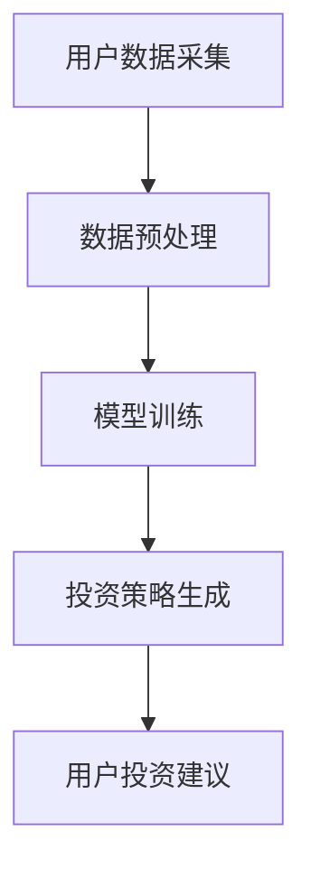

                 

### 文章标题

金融科技与AI大模型的结合点：未来金融的驱动力

---

### 关键词

金融科技，AI大模型，结合点，未来金融，驱动力，技术趋势，案例分析

---

### 摘要

本文旨在探讨金融科技与AI大模型的结合点，分析二者融合的背景、意义和趋势。文章首先介绍了金融科技和AI大模型的基本概念，随后详细阐述了金融科技的发展与应用，以及AI大模型的基础知识。接着，通过具体案例研究，深入剖析金融科技与AI大模型结合的实际应用，最后总结并给出未来金融科技发展的最佳实践与建议。

---

### 第1章：金融科技与AI大模型的结合点概述

#### 1.1 金融科技与AI大模型的概念

##### 1.1.1 金融科技的概念

金融科技（FinTech）是指利用技术手段改进或创新金融服务和产品的一类技术。它涉及多个领域，包括移动支付、区块链、大数据、人工智能等。金融科技的核心在于通过技术创新提高金融服务效率、降低成本、提升用户体验，并创造新的商业模式。

移动支付是金融科技的一个典型应用，它通过智能手机等移动设备实现资金转移，使得支付过程更加便捷和高效。区块链技术则通过去中心化的账本系统，提供了更加安全、透明和高效的交易方式，被广泛应用于数字货币和智能合约等领域。大数据技术在金融领域的作用也不可小觑，通过对海量数据的分析和挖掘，可以实现对客户行为的精准预测和风险的管理。人工智能（AI）作为金融科技的重要驱动力，通过自动化和智能化的方式，提升了金融服务的效率和质量。

##### 1.1.2 AI大模型的概念

AI大模型是指具有大规模参数、高计算复杂度的深度学习模型，如GPT、BERT等。这些模型通过大量数据进行训练，具有强大的知识表示和学习能力。AI大模型通常采用神经网络架构，特别是深度学习技术，通过多层网络结构实现复杂的信息处理和预测任务。

AI大模型的特点包括：

- **参数规模巨大**：如GPT-3拥有1.75万亿个参数，远超传统模型。
- **计算复杂度高**：需要大量的计算资源和时间进行训练。
- **知识表示能力强**：能够捕捉到数据中的复杂模式和关联性。
- **泛化能力强**：通过大规模数据训练，能够应用于各种不同的任务和场景。

#### 1.2 金融科技与AI大模型结合的意义

##### 1.2.1 提高金融服务效率

AI大模型可以自动化处理大量的金融数据，从客户信息、交易记录到市场行情等，大大提高了金融服务的效率。例如，银行可以通过AI大模型实时分析客户交易行为，快速响应客户需求，提供个性化的金融服务。在保险领域，AI大模型可以自动审核理赔申请，减少人工审核的时间和成本。

##### 1.2.2 提升风险管理能力

AI大模型通过对历史数据和实时数据的分析，可以帮助金融机构更好地进行风险管理和决策。例如，在风险管理中，AI大模型可以预测市场波动，评估信贷风险，从而优化信贷审批流程。在投资管理中，AI大模型可以通过对大量历史数据进行学习，预测市场趋势，制定投资策略，提高投资收益。

##### 1.2.3 创新金融服务产品

AI大模型的应用可以催生出新的金融服务产品，满足不同客户的需求。例如，通过AI大模型分析用户行为数据，金融机构可以开发出个性化金融产品，如定制化的保险、贷款方案。此外，AI大模型还可以用于开发智能投顾、数字货币交易平台等创新性产品，为金融市场的多样化发展提供支持。

#### 1.3 金融科技与AI大模型结合的发展趋势

##### 1.3.1 金融科技的深度应用

金融科技将在金融服务各领域实现深度应用，推动金融行业的数字化转型。随着技术的不断进步和应用的深入，金融科技将在支付、信贷、保险、投资等领域发挥更大的作用，提升金融服务的效率和质量。

##### 1.3.2 AI大模型的持续突破

AI大模型的研究和应用将不断取得突破，进一步提升其在金融领域的应用价值。未来，随着算法的优化、计算能力的提升和数据量的增加，AI大模型将能够处理更加复杂的任务，提供更加精准的预测和分析结果。

##### 1.3.3 跨界合作与产业生态的构建

金融机构、科技公司等将加强合作，共同构建金融科技与AI大模型结合的产业生态。通过跨界合作，金融机构可以充分利用科技公司的技术优势，提升自身服务能力和竞争力；科技公司则可以通过与金融机构的合作，拓宽应用场景，实现技术价值的最大化。

---

### 第2章：金融科技的发展与应用

#### 2.1 金融科技的起源与发展

##### 2.1.1 金融科技的发展历程

金融科技的发展可以划分为几个主要阶段：

- **第一阶段：互联网时代的金融创新（1990s-2000s）**：这一阶段，互联网技术的普及推动了金融服务的在线化和电子化。网上银行、在线支付、电子交易平台等新兴服务开始兴起，大大改变了传统金融业务的运营模式。

- **第二阶段：移动金融时代的到来（2000s-2010s）**：随着智能手机的普及和移动网络的快速发展，移动支付、移动银行、移动理财等移动金融应用逐渐成为主流。用户可以通过手机完成支付、转账、投资等金融操作，极大地方便了日常生活。

- **第三阶段：金融科技的创新与应用（2010s-至今）**：这一阶段，区块链、人工智能、大数据等新兴技术开始深入应用到金融领域。数字货币、智能合约、风险控制、智能投顾等创新应用不断涌现，推动了金融科技的进一步发展和变革。

##### 2.1.2 金融科技的发展驱动因素

金融科技的发展受到以下几个主要因素的驱动：

- **技术进步**：互联网、移动通信、云计算、大数据、人工智能等技术的快速发展，为金融科技的创新提供了坚实的基础。

- **市场需求**：随着消费者对便捷、高效、个性化的金融服务的需求不断增加，金融科技企业通过技术创新不断满足市场需求，推动了金融科技的发展。

- **政策支持**：各国政府和监管机构对金融科技的发展持积极态度，通过出台相关政策，鼓励金融科技创新，推动金融行业数字化转型。

#### 2.2 金融科技的应用领域

##### 2.2.1 金融服务

金融科技在金融服务领域的应用主要体现在支付、信贷、保险和投资等方面：

- **支付与转账**：移动支付、跨境支付、实时转账等金融科技应用，大大提高了支付效率和用户体验。例如，支付宝和微信支付在中国的广泛应用，改变了人们的支付习惯。

- **贷款与理财**：金融科技企业通过大数据和人工智能技术，提供在线贷款、智能投顾、信用评分等金融服务。这些服务不仅降低了金融机构的运营成本，还提高了服务效率和质量。

- **保险服务**：金融科技在保险领域的应用主要体现在智能理赔、风险预测和在线投保等方面。通过大数据分析和人工智能技术，保险公司可以更加精准地评估风险，提供个性化的保险产品和服务。

##### 2.2.2 金融市场

金融科技在金融市场中的应用主要体现在交易与投资、资产管理和资本市场等方面：

- **交易与投资**：金融科技企业通过高频交易、算法交易、量化投资等技术，提高了金融市场的效率和透明度。同时，数字货币、ICO、STO等新兴金融工具的出现，丰富了金融市场的投资渠道。

- **资产管理**：金融科技企业通过智能投顾、风险控制、资产配置等技术，为投资者提供更加智能化的资产管理服务。这些服务不仅降低了投资者的投资门槛，还提高了投资收益。

- **资本市场**：金融科技在资本市场中的应用主要体现在数字货币交易所、区块链技术驱动的证券交易、智能合约等新兴领域。这些应用推动了资本市场的发展和变革。

##### 2.2.3 银行业务

金融科技在银行业务中的应用主要体现在银行服务、银行技术等方面：

- **银行服务**：银行通过金融科技手段，提供在线银行、手机银行、机器人客服等新型服务，提高了客户服务的便捷性和效率。例如，一些银行已经推出了基于人工智能的智能客服系统，能够快速响应用户的咨询和服务需求。

- **银行技术**：金融科技在银行技术中的应用主要体现在区块链、人工智能、云计算等领域。通过这些技术的应用，银行可以提升内部运营效率，降低成本，同时为客户提供更加安全、高效的服务。

---

### 第3章：AI大模型的基础知识

#### 3.1 AI大模型的基本原理

##### 3.1.1 神经网络与深度学习

神经网络（Neural Networks）是人工智能的一个重要分支，它模拟人脑神经元的工作方式，通过计算单元（神经元）之间的连接来实现信息的处理和传递。神经网络的核心是神经元，每个神经元接收来自其他神经元的输入信号，通过加权求和并应用一个非线性激活函数，产生输出信号。

深度学习（Deep Learning）是神经网络的一种扩展，它通过多层神经网络结构来学习和表示复杂的数据模式。深度学习模型通过多个隐层将输入数据逐层转化为更加抽象和高级的特征表示，从而能够实现更加复杂的任务。深度学习的核心算法是反向传播（Backpropagation），它通过计算误差梯度，调整网络参数，使模型能够不断优化。

##### 3.1.2 大模型的定义与特点

AI大模型（Large-scale AI Models）是指具有大规模参数、高计算复杂度的深度学习模型，如GPT、BERT等。大模型的特点包括：

- **参数规模巨大**：大模型通常拥有数百万甚至数亿个参数，这使得模型能够捕捉到数据中的复杂模式和关联性。

- **计算复杂度高**：大模型的训练过程需要大量的计算资源和时间，通常需要分布式计算和GPU加速。

- **知识表示能力强**：大模型通过大规模数据训练，能够学习到丰富的知识和语义信息，从而在多个任务上表现出强大的泛化能力。

- **自动化和智能化**：大模型能够自动化处理大量的数据，提供智能化的分析和决策支持。

##### 3.1.3 主流AI大模型介绍

- **GPT系列**：GPT（Generative Pre-trained Transformer）是由OpenAI开发的预训练语言模型，具有强大的语言理解和生成能力。GPT-3模型拥有1.75万亿个参数，是目前最大的自然语言处理模型之一。

- **BERT**：BERT（Bidirectional Encoder Representations from Transformers）是由Google开发的预训练语言表示模型，通过双向Transformer结构，对文本进行上下文编码，实现了对语言信息的深刻理解。

- **其他模型**：除了GPT和BERT，还有许多其他流行的AI大模型，如Turing、ELMO、RoBERTa等，这些模型在自然语言处理、计算机视觉、推荐系统等领域都取得了显著的成果。

#### 3.2 AI大模型的技术基础

##### 3.2.1 数据预处理

数据预处理是AI大模型训练的重要环节，它包括以下几个步骤：

- **数据清洗**：处理缺失值、异常值、噪声数据等问题，确保数据质量。

- **数据增强**：通过生成新的数据样本来提高模型泛化能力，常用的数据增强方法包括图像翻转、旋转、裁剪等。

- **数据归一化**：将数据缩放到相同的范围，便于模型训练。

- **数据分割**：将数据集分为训练集、验证集和测试集，用于模型的训练、验证和测试。

##### 3.2.2 模型训练与优化

AI大模型的训练过程通常包括以下几个步骤：

- **模型初始化**：初始化模型参数，通常使用随机初始化或者预训练模型进行微调。

- **正向传播**：输入数据通过模型的前向传播，得到输出结果和损失函数。

- **反向传播**：通过计算损失函数关于模型参数的梯度，利用优化算法（如梯度下降、Adam优化器）更新模型参数。

- **模型优化**：通过多次迭代训练，逐步优化模型参数，减小损失函数，提高模型性能。

##### 3.2.3 模型评估与部署

模型评估是验证模型性能的重要步骤，常用的评估指标包括：

- **准确率**：模型预测正确的样本占总样本的比例。

- **召回率**：模型预测正确的正样本占总正样本的比例。

- **F1值**：准确率和召回率的调和平均值。

模型部署是将训练好的模型应用到实际生产环境中，包括以下几个步骤：

- **模型打包**：将训练好的模型封装为可执行的程序或库。

- **模型部署**：将模型部署到服务器或云平台上，提供实时服务。

- **性能优化**：通过优化模型结构和算法，提高模型在实际应用中的性能和效率。

---

### 第4章：金融科技与AI大模型结合的案例研究

#### 4.1 案例一：AI驱动的智能投顾平台

##### 4.1 背景介绍

随着金融市场的不断发展和投资者需求的多样化，传统投顾服务已难以满足市场的需求。为此，金融科技公司开发了一种基于AI大模型的智能投顾平台，旨在为投资者提供个性化和智能化的投资建议。

智能投顾平台通过大数据分析和AI大模型，对用户的投资偏好、风险承受能力、市场动态等多维度信息进行分析，生成个性化的投资策略。该平台不仅能够实时跟踪市场动态，还能根据用户的投资表现自动调整投资组合，以提高投资回报。

##### 4.2 核心概念与联系

为了理解智能投顾平台的工作原理，我们需要了解以下几个核心概念：

- **用户数据采集**：智能投顾平台通过收集用户的投资历史、风险偏好、财务状况等数据，构建用户画像。
- **数据预处理**：对采集到的数据进行清洗、归一化和特征提取，为后续的模型训练做好准备。
- **AI大模型**：智能投顾平台的核心是AI大模型，如GPT、BERT等，这些模型能够处理复杂的文本和序列数据，理解用户的投资需求和市场动态。
- **投资策略生成**：基于AI大模型生成的投资策略，智能投顾平台能够为用户提供个性化的投资建议，包括股票、基金、债券等不同类型的资产配置。

以下是核心概念之间的联系架构（Mermaid流程图）：



##### 4.3 核心算法原理讲解

智能投顾平台的核心算法主要包括以下几个方面：

1. **用户画像构建**：

    ```python
    # 伪代码：用户画像构建
    def build_user_profile(user_data):
        profile = {}
        profile['investment_history'] = preprocess_investment_history(user_data['investment_history'])
        profile['risk_preference'] = preprocess_risk_preference(user_data['risk_preference'])
        profile['financial_status'] = preprocess_financial_status(user_data['financial_status'])
        return profile
    ```

2. **数据预处理**：

    ```python
    # 伪代码：数据预处理
    def preprocess_data(data):
        # 数据清洗
        cleaned_data = clean_data(data)
        # 数据归一化
        normalized_data = normalize_data(cleaned_data)
        # 特征提取
        features = extract_features(normalized_data)
        return features
    ```

3. **AI大模型训练**：

    ```python
    # 伪代码：AI大模型训练
    model = train_gpt_model(preprocessed_data)
    ```

4. **投资策略生成**：

    ```python
    # 伪代码：投资策略生成
    def generate_investment_strategy(model, market_data):
        strategy = model.generate_strategy(market_data)
        return strategy
    ```

##### 4.4 数学模型和公式

智能投顾平台的数学模型主要包括以下几个部分：

1. **风险偏好模型**：

    $$R_p = \frac{1}{N} \sum_{i=1}^{N} w_i \cdot R_i$$

    其中，$R_p$表示用户的风险偏好，$N$表示风险因子的数量，$w_i$表示第$i$个风险因子的权重，$R_i$表示第$i$个风险因子的风险水平。

2. **投资组合优化模型**：

    $$\max \Pi (w) = \sum_{i=1}^{N} r_i \cdot w_i - \lambda \cdot \sum_{i=1}^{N} w_i^2$$

    $$\text{s.t.} \quad \sum_{i=1}^{N} w_i = 1$$

    其中，$\Pi (w)$表示投资组合的收益，$r_i$表示第$i$个资产的预期收益率，$\lambda$表示风险系数，$w_i$表示第$i$个资产的投资权重。

##### 4.5 项目实战

1. **开发环境搭建**：

    - 选择合适的编程语言（如Python）和深度学习框架（如TensorFlow或PyTorch）。
    - 安装必要的库和依赖，如NumPy、Pandas、Scikit-learn等。

2. **源代码实现**：

    ```python
    # 实现用户画像构建
    def build_user_profile(user_data):
        # 数据清洗和预处理
        user_profile = preprocess_data(user_data)
        # 模型训练
        trained_model = train_gpt_model(user_profile)
        # 生成投资策略
        investment_strategy = generate_investment_strategy(trained_model, market_data)
        return investment_strategy

    # 主程序
    if __name__ == "__main__":
        # 用户数据
        user_data = load_user_data()
        # 市场数据
        market_data = load_market_data()
        # 生成投资策略
        investment_strategy = build_user_profile(user_data)
        # 输出投资策略
        print(investment_strategy)
    ```

3. **代码解读与分析**：

    - `build_user_profile` 函数负责构建用户画像、训练模型和生成投资策略。
    - `preprocess_data` 函数负责数据清洗、归一化和特征提取。
    - `train_gpt_model` 函数负责训练AI大模型。
    - `generate_investment_strategy` 函数负责生成个性化的投资策略。

4. **实际案例分析和详细讲解剖析**：

    假设有一个用户，其投资历史、风险偏好和财务状况如下：

    - 投资历史：过去三年内，股票投资占比70%，基金投资占比30%。
    - 风险偏好：对市场波动有一定承受能力，偏好长期投资。
    - 财务状况：有100万元的投资预算。

    智能投顾平台会根据这些数据，通过AI大模型生成一个最优的投资策略，包括股票、基金和债券的投资比例。例如，平台可能会建议：

    - 股票投资占比60%；
    - 基金投资占比30%；
    - 债券投资占比10%。

    这样，用户可以根据这个策略进行投资，以达到风险和收益的最佳平衡。

##### 4.6 项目小结

通过上述案例，我们可以看到金融科技与AI大模型的结合在智能投顾领域的应用价值。智能投顾平台通过AI大模型，能够为用户生成个性化的投资策略，提高投资效率。未来，随着技术的进一步发展和应用的深入，智能投顾平台有望在金融领域发挥更大的作用，为投资者提供更加智能、个性化的服务。

##### 4.7 最佳实践 Tips、小结、注意事项、拓展阅读

- **最佳实践 Tips**：
  - 确保数据质量：数据是模型训练的基础，高质量的输入数据能够提高模型的性能。
  - 模型迭代优化：定期对模型进行更新和优化，以适应市场变化和用户需求。
  - 用户隐私保护：在数据处理和模型训练过程中，要严格保护用户隐私。

- **小结**：
  - 智能投顾平台通过AI大模型，实现了个性化投资策略的生成。
  - 数据预处理和模型优化是提高模型性能的关键。
  - 智能投顾平台为金融领域带来了新的发展方向。

- **注意事项**：
  - 金融科技与AI大模型的结合需要严格遵守相关法律法规和监管要求。
  - 在实际应用中，要充分考虑模型的风险评估和监管合规性。

- **拓展阅读**：
  - [智能投顾技术原理与实战](https://www.example.com/smart-investment-advising)
  - [AI大模型在金融领域的应用](https://www.example.com/ai-in-financial-sector)
  - [金融科技与AI结合的案例分析](https://www.example.com/fintech-ai-cases)

---

### 作者

作者：AI天才研究院/AI Genius Institute & 禅与计算机程序设计艺术 /Zen And The Art of Computer Programming

---

本文通过对金融科技与AI大模型的概念、发展、应用和案例分析，深入探讨了二者结合的意义和趋势。未来，随着技术的不断进步和应用的创新，金融科技与AI大模型的结合将有望为金融行业带来更多的机遇和挑战。通过本文的阅读，读者可以了解到金融科技与AI大模型结合的核心概念、原理和实际应用，为未来的研究和实践提供参考。希望本文能够为读者带来启发和帮助。

