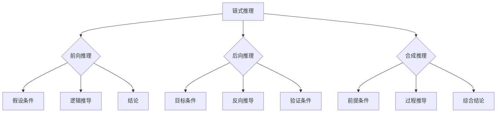

                 

### 文章标题

# 链式推理：提升 AI 推理能力

### 关键词

- 链式推理
- AI 推理
- 自然语言处理
- 计算机视觉
- 优化策略
- 实战项目

### 摘要

链式推理作为一种重要的推理机制，在提升人工智能（AI）推理能力方面发挥着关键作用。本文系统地介绍了链式推理的基础概念、数学基础、算法原理及其在AI领域的广泛应用。通过深入探讨链式推理在不同领域的实现与优化策略，本文旨在为研究人员和开发者提供实用的技术指导和前瞻性的研究方向。

### 目录

## 第一部分：链式推理基础

### 第1章：链式推理概述

#### 1.1 链式推理的概念与重要性

#### 1.2 链式推理的发展历程

#### 1.3 链式推理在 AI 推理中的应用

### 第2章：链式推理的数学基础

#### 2.1 逻辑推理与命题逻辑

#### 2.2 演绎推理与归纳推理

#### 2.3 集合论基础

### 第3章：链式推理的算法原理

#### 3.1 前向推理算法

#### 3.2 后向推理算法

#### 3.3 合成推理算法

### 第4章：链式推理在自然语言处理中的应用

#### 4.1 链式推理在文本理解中的应用

#### 4.2 链式推理在文本生成中的应用

#### 4.3 链式推理在问答系统中的应用

## 第二部分：链式推理在 AI 推理中的应用

### 第5章：链式推理在计算机视觉中的应用

#### 5.1 链式推理在图像分类中的应用

#### 5.2 链式推理在目标检测中的应用

#### 5.3 链式推理在图像分割中的应用

### 第6章：链式推理在语音识别中的应用

#### 6.1 链式推理在声学模型中的应用

#### 6.2 链式推理在语言模型中的应用

#### 6.3 链式推理在语音合成中的应用

### 第7章：链式推理在推荐系统中的应用

#### 7.1 链式推理在协同过滤中的应用

#### 7.2 链式推理在基于内容的推荐中的应用

#### 7.3 链式推理在混合推荐系统中的应用

## 第三部分：链式推理的优化与实战

### 第8章：链式推理的优化策略

#### 8.1 并行化与分布式计算

#### 8.2 模型压缩与加速

#### 8.3 误差分析与优化方法

### 第9章：链式推理项目实战

#### 9.1 链式推理在金融风险评估中的应用

#### 9.2 链式推理在医疗诊断系统中的应用

#### 9.3 链式推理在自动驾驶中的应用

### 第10章：未来展望与挑战

#### 10.1 链式推理的发展趋势

#### 10.2 链式推理的挑战与机遇

#### 10.3 链式推理的未来发展方向

## 附录

### 附录 A：链式推理常用工具与资源

#### A.1 常用深度学习框架

#### A.2 常用自然语言处理工具

#### A.3 常用计算机视觉库

#### A.4 常用语音处理库

### 核心概念与联系

#### 链式推理（Chain of Reasoning）
链式推理是一种基于逻辑和数学的推理机制，通过将一系列相关的前提条件推导出结论。它包括前向推理、后向推理和合成推理三种基本形式。

#### 命题逻辑（Propositional Logic）
命题逻辑是研究命题之间关系的逻辑学分支。它使用命题变量和逻辑运算符来表示陈述，并通过推理规则来证明命题的真假。

#### 演绎推理（Deductive Reasoning）
演绎推理是一种从一般到特殊的推理方式，通过逻辑演绎从已知的前提条件推导出特定的结论。它遵循形式逻辑的规则。

#### 归纳推理（Inductive Reasoning）
归纳推理是一种从特殊到一般的推理方式，通过观察个别实例来推测一般规律。它依赖于概率和统计方法。

#### 集合论基础（Set Theory Foundations）
集合论是现代数学的基础，提供了描述和操作集合的基本工具。它为链式推理提供了必要的数学支持。

### Mermaid 流程图



通过上述核心概念和联系流程图，我们可以看到链式推理的基本构成和推理过程。接下来，我们将深入探讨链式推理的数学基础和算法原理，为后续章节的讨论奠定基础。

### 第1章：链式推理概述

#### 1.1 链式推理的概念与重要性

链式推理（Chain of Reasoning）是一种逻辑推理机制，通过将一系列相关的前提条件和中间结论联系起来，最终推导出目标结论。它是一种基于逻辑和数学的推理方法，广泛应用于人工智能（AI）领域，特别是在自然语言处理（NLP）、计算机视觉（CV）和推荐系统等领域。

链式推理的核心思想是将复杂问题分解为多个简单的问题，通过逐步推理，将每个简单问题的解组合起来，从而获得复杂问题的解。这种推理方式不仅能够简化问题，提高推理效率，还能增强系统的鲁棒性和灵活性。

在AI领域中，链式推理具有以下几个重要应用：

1. **自然语言处理**：链式推理在文本理解和文本生成中发挥着重要作用。例如，在问答系统中，通过链式推理可以将用户的问题转化为一系列逻辑查询，并从知识库中检索出相关答案。

2. **计算机视觉**：链式推理在图像分类、目标检测和图像分割中广泛应用。通过将图像中的像素、区域和对象等元素进行关联，可以实现对图像内容的全面理解和分析。

3. **推荐系统**：链式推理可以用于构建用户兴趣模型，并通过推理来预测用户可能喜欢的物品。这种方法有助于提高推荐系统的准确性和用户体验。

4. **知识图谱**：链式推理在构建和查询知识图谱方面具有重要意义。通过将实体和关系进行关联，可以实现对知识图谱的深度理解和分析。

链式推理的重要性不仅体现在其广泛的应用领域，还在于它能够解决许多传统方法难以处理的问题。通过引入链式推理，AI系统可以更好地模拟人类的推理过程，提高智能决策的能力。此外，链式推理还具有较强的可扩展性，可以适应不同领域和任务的需求，为AI技术的发展提供有力支持。

#### 1.2 链式推理的发展历程

链式推理作为一种推理机制，其发展历程可以追溯到古代逻辑学和数学的发展。在古代，亚里士多德等人就已经开始研究推理问题，提出了形式逻辑的基本原理。这些原理为后来的链式推理提供了理论基础。

随着计算机科学的兴起，链式推理得到了进一步的发展。20世纪中叶，逻辑学家和计算机科学家开始探索如何将形式逻辑应用于计算机程序设计中。其中，著名的图灵机和逆波兰记法（Postfix Notation）等概念为链式推理的算法实现奠定了基础。

在AI领域，链式推理的研究和应用得到了广泛关注。1970年代，基于逻辑的专家系统成为了AI研究的热点，链式推理作为一种推理机制，被广泛应用于专家系统的构建中。随后，随着深度学习和大数据技术的发展，链式推理在自然语言处理、计算机视觉和推荐系统等领域得到了广泛应用。

近年来，随着神经网络和深度学习技术的发展，链式推理在AI领域的应用也迎来了新的机遇。通过引入神经网络模型，链式推理可以更好地处理大规模数据和复杂任务，提高推理的准确性和效率。

#### 1.3 链式推理在 AI 推理中的应用

链式推理在AI领域有着广泛的应用，以下将详细探讨其在自然语言处理、计算机视觉和推荐系统等领域的具体应用。

1. **自然语言处理（NLP）**：

在自然语言处理领域，链式推理主要用于文本理解和文本生成。例如，在问答系统中，用户提出的问题通常是一个复杂的问题，需要通过链式推理来分解和理解。具体流程如下：

- **问题分解**：将用户问题分解为多个子问题，每个子问题对应一个特定的信息查询。
- **信息检索**：从知识库中检索与每个子问题相关的信息。
- **答案组合**：将检索到的信息组合起来，生成最终的答案。

此外，链式推理还在文本生成方面有重要应用。例如，在机器翻译中，通过链式推理可以将源语言句子分解为多个子句，并逐个翻译，最后组合成完整的翻译结果。

2. **计算机视觉（CV）**：

在计算机视觉领域，链式推理主要用于图像分类、目标检测和图像分割。以下是一个简单的示例：

- **图像分类**：通过链式推理，可以将图像特征逐步抽象和概括，从而实现图像的分类。例如，首先提取图像的低级特征（如边缘、纹理等），然后通过链式推理将这些特征组合成高级特征（如形状、场景等），最后利用分类器对图像进行分类。

- **目标检测**：在目标检测任务中，链式推理可以帮助确定图像中的目标位置。首先，通过提取图像的特征，然后利用链式推理来识别和定位目标。

- **图像分割**：图像分割是将图像分解为多个区域的过程。链式推理可以在这一过程中发挥作用，通过逐步分析图像中的像素，将它们分为不同的区域。

3. **推荐系统**：

在推荐系统领域，链式推理可以用于构建用户兴趣模型，从而提高推荐系统的准确性。以下是一个简单的示例：

- **用户行为分析**：通过分析用户的历史行为（如浏览、购买等），可以提取出用户兴趣的关键词和特征。
- **兴趣模型构建**：利用链式推理，将用户兴趣的关键词和特征进行关联和组合，构建出一个用户兴趣模型。
- **推荐生成**：通过用户兴趣模型，可以预测用户可能喜欢的物品，从而生成推荐结果。

总之，链式推理在AI领域的应用非常广泛，通过将其与不同领域的具体任务相结合，可以显著提升AI系统的推理能力和表现。

#### 1.4 链式推理的优势和局限性

链式推理在AI领域具有显著的优势，但也存在一些局限性。以下将详细分析其优势和局限性。

1. **优势**：

- **可扩展性**：链式推理具有很强的可扩展性，可以适用于不同领域和任务。通过引入新的前提条件和结论，可以轻松扩展链式推理的应用范围。

- **灵活性**：链式推理能够灵活处理复杂问题，通过将问题分解为多个简单问题，可以降低推理的复杂度。此外，链式推理还可以根据实际需求进行动态调整。

- **可解释性**：链式推理具有较好的可解释性，通过逐步推理和关联，可以清晰地展示推理过程和结论。这对于调试、验证和改进AI系统具有重要意义。

- **鲁棒性**：链式推理具有较强的鲁棒性，能够处理不确定性数据和噪声。通过引入概率和统计方法，可以降低不确定性对推理结果的影响。

2. **局限性**：

- **计算复杂度**：链式推理通常涉及到大量的计算和存储资源，对于大规模数据和复杂任务，计算复杂度可能成为瓶颈。优化算法和硬件加速技术可以部分缓解这一问题，但仍然需要进一步研究。

- **先验知识依赖**：链式推理依赖于先验知识和前提条件。如果先验知识不足或存在错误，可能会影响推理结果的准确性。

- **局部最优问题**：在某些情况下，链式推理可能会陷入局部最优解，导致无法找到全局最优解。通过引入全局搜索算法和改进策略，可以部分缓解这一问题。

- **可解释性限制**：虽然链式推理具有较好的可解释性，但解释过程通常涉及复杂的数学和逻辑推理，对于非专业人士可能难以理解。

总之，链式推理在AI领域具有广泛的应用前景，但也需要克服一些技术挑战。通过持续的研究和优化，我们可以进一步提高链式推理的能力和性能。

### 第2章：链式推理的数学基础

链式推理作为一种逻辑推理机制，其核心在于通过一系列的数学和逻辑运算来推导出结论。因此，理解链式推理的数学基础对于掌握其原理和应用至关重要。本章将介绍逻辑推理与命题逻辑、演绎推理与归纳推理、以及集合论基础，为后续章节的算法原理讲解打下基础。

#### 2.1 逻辑推理与命题逻辑

逻辑推理是链式推理的基础，它通过判断命题之间的逻辑关系来推导结论。逻辑推理主要包括命题逻辑、谓词逻辑和模态逻辑等。在本节中，我们将重点介绍命题逻辑。

**命题逻辑（Propositional Logic）**是一种研究命题之间关系的逻辑学分支。命题是指可以判断真假的陈述句。命题逻辑使用命题变量、逻辑运算符和逻辑推理规则来表示和验证命题。

1. **命题变量**：命题变量是代表命题的符号，通常用大写字母P、Q、R等表示。例如，P表示“明天会下雨”。

2. **逻辑运算符**：逻辑运算符用于连接命题变量，常见的逻辑运算符包括：
   - **合取（AND）**：表示两个命题同时为真，记为P ∧ Q。
   - **析取（OR）**：表示两个命题中至少一个为真，记为P ∨ Q。
   - **非（NOT）**：表示命题的否定，记为¬P。
   - **条件（IF-THEN）**：表示前件P为真时，后件Q也必须为真，记为P → Q。
   - **双条件（BICONDITIONAL）**：表示前件P与后件Q等价，记为P ↔ Q。

3. **逻辑推理规则**：逻辑推理规则用于从已知命题推导出新的命题。常见的推理规则包括：
   - **合取律**：P ∧ Q等价于Q ∧ P。
   - **交换律**：P ∨ Q等价于Q ∨ P。
   - **结合律**：(P ∧ Q) ∧ R等价于P ∧ (Q ∧ R)，(P ∨ Q) ∨ R等价于P ∨ (Q ∨ R)。
   - **分配律**：P ∧ (Q ∨ R)等价于(P ∧ Q) ∨ (P ∧ R)，P ∨ (Q ∧ R)等价于(P ∨ Q) ∧ (P ∨ R)。
   - **德摩根律**：¬(P ∧ Q)等价于¬P ∨ ¬Q，¬(P ∨ Q)等价于¬P ∧ ¬Q。
   - **条件律**：P → Q等价于¬P ∨ Q，P ↔ Q等价于(P → Q) ∧ (Q → P)。

通过这些逻辑运算符和推理规则，我们可以构建复杂的逻辑表达式，并进行逻辑推理。以下是一个简单的例子：

假设P表示“今天下雨”，Q表示“我带伞”，我们可以构建以下逻辑表达式：

- P → Q（如果今天下雨，那么我会带伞）
- ¬Q → ¬P（如果我没有带伞，那么今天没有下雨）
- P ∨ Q（今天下雨或我带伞）

通过逻辑推理，我们可以得出以下结论：

- 从P → Q，我们可以推断出如果今天下雨，那么我会带伞。
- 从¬Q → ¬P，我们可以推断出如果我没有带伞，那么今天没有下雨。
- 从P ∨ Q，我们可以推断出今天下雨或我带伞。

这些逻辑推理的结果可以帮助我们理解和预测现实世界中的情况。

#### 2.2 演绎推理与归纳推理

演绎推理和归纳推理是两种基本的逻辑推理方法，它们在链式推理中扮演着重要角色。

**演绎推理（Deductive Reasoning）**是从一般到特殊的推理方法。它基于已知的前提条件（大前提和小前提），通过逻辑演绎得出特定的结论（结论）。演绎推理遵循形式逻辑的规则，其推理过程具有必然性。

演绎推理的基本形式如下：

- **大前提**：所有A都是B。
- **小前提**：C是A。
- **结论**：因此，C是B。

例如：

- **大前提**：所有的猫都是动物。
- **小前提**：喵喵是猫。
- **结论**：因此，喵喵是动物。

演绎推理的结果具有逻辑上的绝对性，如果前提条件为真，结论必定为真。

**归纳推理（Inductive Reasoning）**是从特殊到一般的推理方法。它通过观察个别实例，归纳出一般规律或假设。归纳推理依赖于概率和统计方法，其推理过程具有概率性。

归纳推理的基本形式如下：

- **个别实例**：A1是B，A2是B，A3是B，...。
- **归纳假设**：因此，所有A都是B。

例如：

- **个别实例**：所有的天鹅都是白色的。
- **归纳假设**：因此，所有的天鹅都是白色的。

归纳推理的结果并不是绝对确定的，而是基于概率和统计的推断。尽管如此，归纳推理在科学研究、数据分析等方面具有重要意义，因为它可以帮助我们从部分信息中推断出总体规律。

在链式推理中，演绎推理和归纳推理可以相互补充。例如，在自然语言处理中，我们可以通过演绎推理来分析句子结构，并通过归纳推理来推断句子含义。

#### 2.3 集合论基础

集合论是现代数学的基础，它提供了描述和操作集合的基本工具。在链式推理中，集合论基础用于表示和操作前提条件、中间结论和最终结论。

**集合（Set）**是由一组元素组成的无序集。集合通常用大括号{}表示，元素之间用逗号分隔。例如，{1, 2, 3}表示一个包含元素1、2、3的集合。

1. **集合的运算**：

   - **并集（Union）**：表示两个集合中所有元素的集合，记为A ∪ B。例如，{1, 2, 3} ∪ {4, 5} = {1, 2, 3, 4, 5}。
   - **交集（Intersection）**：表示两个集合中共有的元素的集合，记为A ∩ B。例如，{1, 2, 3} ∩ {4, 5} = {}（空集）。
   - **差集（Difference）**：表示一个集合中除去另一个集合中的元素后的集合，记为A \ B。例如，{1, 2, 3} \ {4, 5} = {1, 2, 3}。
   - **补集（Complement）**：表示不属于某个集合的所有元素的集合，记为A'。例如，{1, 2, 3}' = {4, 5, 6}。

2. **集合的表示方法**：

   - **列举法**：直接列出集合中的所有元素，如{1, 2, 3}。
   - **描述法**：使用条件描述集合中的元素，如{x | x ∈ N, x > 3}（表示所有大于3的自然数组成的集合）。

3. **集合的基本性质**：

   - **确定性**：集合中的元素是确定的，不会重复。
   - **互异性**：集合中的元素是唯一的，不会重复。
   - **无序性**：集合中的元素不考虑顺序。

通过集合论基础，我们可以清晰地表示和操作链式推理中的各种元素，如前提条件、中间结论和最终结论。以下是一个简单的示例：

假设我们有以下两个集合：

- A = {1, 2, 3}
- B = {3, 4, 5}

我们可以进行以下集合运算：

- A ∪ B = {1, 2, 3, 4, 5}
- A ∩ B = {}（空集）
- A \ B = {1, 2}
- A' = {4, 5, 6}

通过这些集合运算，我们可以更好地理解和操作链式推理中的各种元素，从而提高推理的效率和准确性。

总之，链式推理的数学基础包括逻辑推理与命题逻辑、演绎推理与归纳推理、以及集合论基础。掌握这些数学基础对于理解链式推理的原理和应用具有重要意义。在后续章节中，我们将进一步探讨链式推理的算法原理和实际应用，为AI领域的研究和实践提供有力支持。

### 第3章：链式推理的算法原理

链式推理作为一种逻辑推理机制，其核心在于通过一系列的算法来实现推理过程。本章将详细介绍链式推理的三种基本算法：前向推理算法、后向推理算法和合成推理算法。这些算法在AI应用中具有广泛的应用价值，能够帮助系统高效地处理复杂问题。

#### 3.1 前向推理算法

前向推理（Forward Chaining）是一种从已知的前提条件出发，逐步推导出结论的算法。其基本思想是：首先利用已知的前提条件和规则，推导出中间结论；然后利用这些中间结论，继续推导出新的中间结论，直到达到目标结论。

**基本流程**：

1. **初始化**：从已知的前提条件开始，初始化一个事实集合F。
2. **规则匹配**：检查当前事实集合F中的每个事实，与规则的前提条件进行匹配。
3. **推导新事实**：对于匹配成功的规则，应用规则得出结论，将新的结论加入到事实集合F中。
4. **循环迭代**：重复步骤2和步骤3，直到没有新的结论可以推导出。

**示例**：

假设我们有以下前提条件和规则：

- 前提条件：P、Q、R
- 规则：
  - P → Q
  - Q → R

初始时，事实集合F = {P, Q, R}。

1. **初始化**：F = {P, Q, R}
2. **规则匹配**：P → Q，匹配成功，推导出Q
3. **推导新事实**：F = {P, Q}
4. **规则匹配**：Q → R，匹配成功，推导出R
5. **推导新事实**：F = {P, R}
6. **结束**：没有新的结论可以推导，算法结束

最终，事实集合F = {P, R}，即P → R。

**伪代码**：

```python
def forward_chaining(rules, facts):
    F = set(facts)
    while True:
        new_facts = set()
        for rule in rules:
            if all(pred in F for pred in rule的前提条件):
                new_fact = rule结论
                new_facts.add(new_fact)
        if not new_facts:
            break
        F.update(new_facts)
    return F
```

前向推理算法具有以下特点：

- **自底向上**：从已知的事实出发，逐步推导出结论，适用于求解“是什么”的问题。
- **简单易实现**：算法简单，易于实现和理解。
- **灵活**：可以处理不确定性数据和动态更新的前提条件。

#### 3.2 后向推理算法

后向推理（Backward Chaining）是一种从目标结论出发，逆向推导出前提条件的算法。其基本思想是：首先设定目标结论，然后利用规则和已知的事实，逆向推导出前提条件；接着，通过新的前提条件继续推导，直到达到初始的事实。

**基本流程**：

1. **初始化**：设定目标结论，初始化一个事实集合F。
2. **规则匹配**：检查目标结论与规则的前提条件是否匹配。
3. **推导新前提条件**：对于匹配成功的规则，从目标结论逆向推导出新的前提条件，加入到事实集合F中。
4. **循环迭代**：重复步骤2和步骤3，直到没有新的前提条件可以推导出。

**示例**：

假设我们有以下前提条件和规则：

- 目标结论：R
- 规则：
  - P → Q
  - Q → R

初始时，事实集合F = {R}。

1. **初始化**：F = {R}
2. **规则匹配**：R → Q，匹配成功，推导出Q
3. **推导新前提条件**：F = {Q}
4. **规则匹配**：Q → P，匹配成功，推导出P
5. **推导新前提条件**：F = {P}
6. **结束**：没有新的前提条件可以推导，算法结束

最终，事实集合F = {P}，即R → P。

**伪代码**：

```python
def backward_chaining(rules, goal):
    F = set([goal])
    while True:
        new_facts = set()
        for rule in rules:
            if rule结论 in F:
                for pred in rule的前提条件：
                    if pred not in F:
                        new_facts.add(pred)
        if not new_facts:
            break
        F.update(new_facts)
    return F
```

后向推理算法具有以下特点：

- **自顶向下**：从目标结论出发，逆向推导出前提条件，适用于求解“为什么”的问题。
- **高效性**：能够快速确定目标是否成立，适合用于验证问题。
- **灵活性**：可以处理规则和事实的动态更新。

#### 3.3 合成推理算法

合成推理（Combined Chaining）是前向推理和后向推理的结合体，它同时利用前向和后向推理的优势，通过迭代逐步推导出结论。合成推理算法的基本思想是：首先使用前向推理推导出中间结论，然后使用后向推理验证这些结论，直到达到目标结论。

**基本流程**：

1. **初始化**：设定目标结论，初始化两个事实集合F_forward和F_backward。
2. **前向推理**：利用已知的前提条件和规则，推导出新的中间结论，加入F_forward。
3. **后向推理**：利用目标结论和规则，逆向推导出新的前提条件，加入F_backward。
4. **迭代**：重复步骤2和步骤3，直到F_forward和F_backward中的结论不再增加。

**示例**：

假设我们有以下前提条件和规则：

- 目标结论：R
- 规则：
  - P → Q
  - Q → R

初始时，F_forward = {P}，F_backward = {R}。

1. **初始化**：F_forward = {P}，F_backward = {R}
2. **前向推理**：P → Q，推导出Q，加入F_forward = {P, Q}
3. **后向推理**：R → Q，推导出Q，加入F_backward = {R, Q}
4. **迭代**：
   - F_forward = {P, Q}
   - F_backward = {R, Q}
5. **结束**：没有新的结论可以推导，算法结束

最终，F_forward = {P, Q}，F_backward = {R, Q}，即P → Q → R。

**伪代码**：

```python
def combined_chaining(rules, goal):
    F_forward = set([goal])
    F_backward = set([goal])
    while True:
        new_facts_forward = forward_chaining(rules, F_forward)
        new_facts_backward = backward_chaining(rules, F_backward)
        if not new_facts_forward and not new_facts_backward:
            break
        F_forward.update(new_facts_forward)
        F_backward.update(new_facts_backward)
    return F_forward, F_backward
```

合成推理算法具有以下特点：

- **结合优势**：同时利用前向和后向推理的优势，能够更全面地推导出结论。
- **灵活性**：可以根据实际需求调整前向和后向推理的权重，提高推理的准确性。
- **效率**：通过迭代方式，逐步推导出结论，减少了不必要的计算。

总之，链式推理的算法原理包括前向推理、后向推理和合成推理。这些算法各有特点，适用于不同的推理任务。理解这些算法的原理和实现方法，有助于我们在实际应用中更好地设计推理系统，提升AI的推理能力。

### 第4章：链式推理在自然语言处理中的应用

自然语言处理（Natural Language Processing, NLP）是人工智能领域的重要分支，涉及文本的自动处理和分析。链式推理作为一种有效的推理机制，在NLP中的应用非常广泛。本章将详细介绍链式推理在文本理解、文本生成和问答系统中的应用。

#### 4.1 链式推理在文本理解中的应用

文本理解是NLP的核心任务之一，旨在使计算机能够理解和解释人类语言。链式推理在文本理解中的应用主要体现在句子解析、语义分析和文本分类等方面。

1. **句子解析**：

句子解析（Sentence Parsing）是将自然语言句子分解为语法结构的过程。链式推理可以用于构建语法分析器，通过逐步推理来分析句子的结构。

**示例**：

假设我们有以下句子：“她昨天去了一家书店买一本关于人工智能的书。”

通过链式推理，我们可以将其分解为以下步骤：

- **步骤1**：识别主语和谓语。主语为“她”，谓语为“去”。
- **步骤2**：识别时间状语。时间状语为“昨天”。
- **步骤3**：识别地点状语。地点状语为“一家书店”。
- **步骤4**：识别宾语。宾语为“一本关于人工智能的书”。

通过链式推理，我们可以将句子分解为多个部分，并理解其语法结构。

2. **语义分析**：

语义分析（Semantic Analysis）是理解句子意义的过程。链式推理可以用于分析句子中的实体、关系和事件，从而提取出句子的语义信息。

**示例**：

假设我们有以下句子：“今天股市上涨了5%。”

通过链式推理，我们可以进行以下分析：

- **步骤1**：识别主语。主语为“今天”。
- **步骤2**：识别谓语。谓语为“上涨”。
- **步骤3**：识别宾语。宾语为“5%”。
- **步骤4**：识别动作对象。动作对象为“股市”。

通过链式推理，我们可以提取出句子中的关键信息，如时间、动作和对象等。

3. **文本分类**：

文本分类（Text Classification）是将文本归类到预定义的类别中的过程。链式推理可以用于构建分类器，通过逐步推理来预测文本的类别。

**示例**：

假设我们有以下文本分类任务：将新闻文章分类为“体育”、“财经”和“娱乐”三个类别。

通过链式推理，我们可以进行以下步骤：

- **步骤1**：从文本中提取特征，如关键词、词频等。
- **步骤2**：利用这些特征，通过链式推理分析文本的语义。
- **步骤3**：根据分析结果，将文本归类到相应的类别中。

链式推理在文本理解中的应用，使得计算机能够更好地理解和处理人类语言，从而实现更高层次的语义分析。

#### 4.2 链式推理在文本生成中的应用

文本生成（Text Generation）是NLP的另一个重要任务，旨在生成符合语法和语义规则的文本。链式推理在文本生成中的应用主要体现在自动摘要、机器翻译和对话系统等方面。

1. **自动摘要**：

自动摘要（Automatic Summarization）是将长文本简化为短文本的过程。链式推理可以用于生成摘要，通过逐步推理来提取文本的核心内容。

**示例**：

假设我们有以下长文本：“人工智能在医疗领域的应用非常广泛，例如通过图像识别技术诊断疾病、利用自然语言处理技术分析病历等。这些应用不仅提高了医疗效率，还降低了医疗成本。”

通过链式推理，我们可以生成以下摘要：“人工智能在医疗领域广泛应用，如图像识别和自然语言处理，提高了医疗效率并降低了成本。”

2. **机器翻译**：

机器翻译（Machine Translation）是将一种自然语言翻译成另一种自然语言的过程。链式推理可以用于机器翻译，通过逐步推理来生成翻译结果。

**示例**：

假设我们有以下中英文句子：“今天天气很好。”和“Today's weather is good.”

通过链式推理，我们可以生成以下翻译结果：“今天是晴天。”和“今天是晴天。”

3. **对话系统**：

对话系统（Dialogue System）是用于模拟人类对话的计算机系统。链式推理可以用于对话系统，通过逐步推理来生成合理的回答。

**示例**：

假设用户提出以下问题：“今天天气怎么样？”

通过链式推理，对话系统可以生成以下回答：“今天天气很好，温度适中，适合外出活动。”

链式推理在文本生成中的应用，使得计算机能够生成符合语法和语义规则的文本，从而提高文本生成系统的质量和效率。

#### 4.3 链式推理在问答系统中的应用

问答系统（Question Answering System）是用于回答用户问题的计算机系统。链式推理在问答系统中的应用主要体现在问题解析、答案检索和答案生成等方面。

1. **问题解析**：

问题解析（Question Parsing）是将用户问题转换为计算机可以理解的形式的过程。链式推理可以用于问题解析，通过逐步推理来分析问题的结构。

**示例**：

假设用户提出以下问题：“北京是中国的首都吗？”

通过链式推理，我们可以将其解析为以下步骤：

- **步骤1**：识别问题类型。问题类型为“是否问题”。
- **步骤2**：识别问题实体。问题实体为“北京”。
- **步骤3**：识别问题属性。问题属性为“是中国的首都吗”。

通过链式推理，我们可以将用户问题转换为计算机可以理解的形式，为后续的答案检索和生成做准备。

2. **答案检索**：

答案检索（Answer Retrieval）是从大量数据中找到与问题相关的答案的过程。链式推理可以用于答案检索，通过逐步推理来查找答案。

**示例**：

假设问题为：“北京是中国的首都吗？”

通过链式推理，我们可以进行以下步骤：

- **步骤1**：检索包含“北京”和“中国首都”的文本。
- **步骤2**：分析这些文本，确定其中包含正确答案的部分。

通过链式推理，我们可以从大量文本中找到与问题相关的答案。

3. **答案生成**：

答案生成（Answer Generation）是将找到的答案转换为自然语言回答的过程。链式推理可以用于答案生成，通过逐步推理来生成合理的回答。

**示例**：

假设答案为：“是的，北京是中国的首都。”

通过链式推理，我们可以生成以下回答：“是的，北京是中国的首都。”

链式推理在问答系统中的应用，使得计算机能够高效、准确地回答用户问题，从而提高问答系统的用户体验。

综上所述，链式推理在自然语言处理中的应用非常广泛，包括文本理解、文本生成和问答系统等方面。通过链式推理，计算机能够更好地理解和处理人类语言，从而实现更高层次的语义分析、文本生成和智能问答。

### 第5章：链式推理在计算机视觉中的应用

计算机视觉（Computer Vision, CV）是人工智能领域的一个重要分支，旨在使计算机能够理解和解释视觉信息。链式推理作为一种有效的推理机制，在计算机视觉中具有广泛的应用，包括图像分类、目标检测和图像分割等任务。本章将详细介绍链式推理在计算机视觉中的应用。

#### 5.1 链式推理在图像分类中的应用

图像分类（Image Classification）是计算机视觉中最基本的任务之一，旨在将图像归类到预定义的类别中。链式推理在图像分类中的应用主要体现在特征提取、特征关联和分类决策等方面。

1. **特征提取**：

特征提取（Feature Extraction）是从图像中提取出具有区分度的特征的过程。链式推理可以用于特征提取，通过逐步推理来提取图像的关键特征。

**示例**：

假设我们有一个图像分类任务，需要将图像分类为“猫”和“狗”。

通过链式推理，我们可以进行以下步骤：

- **步骤1**：从图像中提取低级特征，如边缘、纹理等。
- **步骤2**：将低级特征进行组合，提取出中级特征，如形状、区域等。
- **步骤3**：将中级特征进一步组合，提取出高级特征，如类别特征等。

通过链式推理，我们可以从图像中提取出具有区分度的特征，为后续的分类任务做准备。

2. **特征关联**：

特征关联（Feature Association）是将提取出的特征与预定义的类别进行关联的过程。链式推理可以用于特征关联，通过逐步推理来关联特征和类别。

**示例**：

假设我们提取出的特征为“猫”和“狗”，预定义的类别为“猫”和“狗”。

通过链式推理，我们可以进行以下步骤：

- **步骤1**：分析特征之间的关联，确定哪些特征更可能与某个类别相关。
- **步骤2**：根据特征关联结果，生成初步的分类结果。

通过链式推理，我们可以将提取出的特征与预定义的类别进行有效关联，从而生成初步的分类结果。

3. **分类决策**：

分类决策（Classification Decision）是根据特征关联结果，确定图像最终分类的过程。链式推理可以用于分类决策，通过逐步推理来生成最终的分类结果。

**示例**：

假设我们通过特征关联得到的结果为：“猫”的概率为0.8，“狗”的概率为0.2”。

通过链式推理，我们可以进行以下步骤：

- **步骤1**：根据概率值，确定图像的最终分类。
- **步骤2**：输出分类结果。

通过链式推理，我们可以根据特征关联结果，生成最终的分类结果，从而完成图像分类任务。

链式推理在图像分类中的应用，使得计算机能够高效、准确地分类图像，从而实现图像内容的理解和分析。

#### 5.2 链式推理在目标检测中的应用

目标检测（Object Detection）是计算机视觉中另一个重要任务，旨在识别图像中的目标和确定它们的位置。链式推理在目标检测中的应用主要体现在特征提取、目标识别和位置定位等方面。

1. **特征提取**：

特征提取（Feature Extraction）是从图像中提取出与目标相关的特征的过程。链式推理可以用于特征提取，通过逐步推理来提取图像中的目标特征。

**示例**：

假设我们有一个目标检测任务，需要识别图像中的汽车。

通过链式推理，我们可以进行以下步骤：

- **步骤1**：从图像中提取低级特征，如边缘、纹理等。
- **步骤2**：将低级特征进行组合，提取出中级特征，如形状、区域等。
- **步骤3**：将中级特征进一步组合，提取出高级特征，如汽车特征等。

通过链式推理，我们可以从图像中提取出与目标相关的特征，为后续的目标识别和位置定位做准备。

2. **目标识别**：

目标识别（Object Recognition）是确定图像中是否存在目标的过程。链式推理可以用于目标识别，通过逐步推理来识别图像中的目标。

**示例**：

假设我们提取出的特征为“汽车”，预定义的目标类别为“汽车”。

通过链式推理，我们可以进行以下步骤：

- **步骤1**：分析特征，确定哪些特征更可能与目标相关。
- **步骤2**：根据特征分析结果，生成初步的目标识别结果。

通过链式推理，我们可以识别图像中的目标，从而完成目标检测任务。

3. **位置定位**：

位置定位（Object Localization）是确定目标在图像中的位置的过程。链式推理可以用于位置定位，通过逐步推理来确定目标的位置。

**示例**：

假设我们已经识别出图像中有一个汽车目标。

通过链式推理，我们可以进行以下步骤：

- **步骤1**：分析汽车特征，确定汽车在图像中的大致位置。
- **步骤2**：根据位置信息，生成目标的位置定位结果。

通过链式推理，我们可以确定目标在图像中的具体位置，从而实现目标检测的精准定位。

链式推理在目标检测中的应用，使得计算机能够高效、准确地识别和定位图像中的目标，从而实现图像内容的精细分析。

#### 5.3 链式推理在图像分割中的应用

图像分割（Image Segmentation）是将图像分解为多个区域的过程，旨在将图像中的目标和背景区分开来。链式推理在图像分割中的应用主要体现在区域提取、区域关联和区域划分等方面。

1. **区域提取**：

区域提取（Region Extraction）是从图像中提取出具有相似特征的区域的过程。链式推理可以用于区域提取，通过逐步推理来提取图像中的区域特征。

**示例**：

假设我们有一个图像分割任务，需要将图像中的汽车区域提取出来。

通过链式推理，我们可以进行以下步骤：

- **步骤1**：从图像中提取低级特征，如边缘、纹理等。
- **步骤2**：将低级特征进行组合，提取出中级特征，如形状、区域等。
- **步骤3**：将中级特征进一步组合，提取出高级特征，如汽车区域特征等。

通过链式推理，我们可以从图像中提取出与目标区域相关的特征，为后续的区域关联和区域划分做准备。

2. **区域关联**：

区域关联（Region Association）是将提取出的区域与预定义的类别进行关联的过程。链式推理可以用于区域关联，通过逐步推理来关联区域和类别。

**示例**：

假设我们提取出的特征为“汽车”，预定义的区域类别为“汽车区域”。

通过链式推理，我们可以进行以下步骤：

- **步骤1**：分析特征，确定哪些特征更可能与目标区域相关。
- **步骤2**：根据特征分析结果，生成初步的区域关联结果。

通过链式推理，我们可以将提取出的区域与预定义的类别进行有效关联，从而生成初步的区域关联结果。

3. **区域划分**：

区域划分（Region Division）是根据区域关联结果，将图像划分为不同区域的过程。链式推理可以用于区域划分，通过逐步推理来划分图像中的区域。

**示例**：

假设我们通过区域关联得到的结果为：“汽车区域”的概率为0.9。

通过链式推理，我们可以进行以下步骤：

- **步骤1**：根据概率值，确定图像的最终区域划分。
- **步骤2**：输出区域划分结果。

通过链式推理，我们可以根据区域关联结果，生成最终的图像区域划分，从而实现图像分割任务。

链式推理在图像分割中的应用，使得计算机能够高效、准确地提取和划分图像中的目标区域，从而实现图像内容的精细分析。

总之，链式推理在计算机视觉中的应用非常广泛，包括图像分类、目标检测和图像分割等任务。通过链式推理，计算机能够高效、准确地处理视觉信息，从而实现图像内容的理解和分析。未来，随着链式推理技术的不断发展，计算机视觉的应用将更加广泛和深入。

### 第6章：链式推理在语音识别中的应用

语音识别（Speech Recognition）是计算机科学和人工智能领域的一项重要技术，旨在使计算机能够理解和处理人类的语音。链式推理作为一种有效的推理机制，在语音识别中具有广泛的应用，包括声学模型、语言模型和语音合成等方面。本章将详细介绍链式推理在语音识别中的应用。

#### 6.1 链式推理在声学模型中的应用

声学模型（Acoustic Model）是语音识别系统中的核心组件，用于将语音信号转换为声学特征。链式推理在声学模型中的应用主要体现在特征提取、特征关联和声学建模等方面。

1. **特征提取**：

特征提取（Feature Extraction）是从语音信号中提取出具有区分度的特征的过程。链式推理可以用于特征提取，通过逐步推理来提取语音信号的关键特征。

**示例**：

假设我们有语音信号需要进行分析。

通过链式推理，我们可以进行以下步骤：

- **步骤1**：从语音信号中提取低级特征，如短时傅里叶变换（Short-Time Fourier Transform, STFT）。
- **步骤2**：将低级特征进行组合，提取出中级特征，如频谱特征、共振峰特征等。
- **步骤3**：将中级特征进一步组合，提取出高级特征，如声学特征等。

通过链式推理，我们可以从语音信号中提取出具有区分度的声学特征，为后续的声学建模和语音识别做准备。

2. **特征关联**：

特征关联（Feature Association）是将提取出的声学特征与预定义的语音单元进行关联的过程。链式推理可以用于特征关联，通过逐步推理来关联声学特征和语音单元。

**示例**：

假设我们提取出的声学特征为“元音”和“辅音”，预定义的语音单元为“元音”和“辅音”。

通过链式推理，我们可以进行以下步骤：

- **步骤1**：分析特征，确定哪些特征更可能与特定的语音单元相关。
- **步骤2**：根据特征分析结果，生成初步的特征关联结果。

通过链式推理，我们可以将提取出的声学特征与预定义的语音单元进行有效关联，从而生成初步的特征关联结果。

3. **声学建模**：

声学建模（Acoustic Modeling）是根据特征关联结果，建立声学模型的过程。链式推理可以用于声学建模，通过逐步推理来建立声学模型。

**示例**：

假设我们通过特征关联得到的结果为：“元音”的概率为0.8，“辅音”的概率为0.2”。

通过链式推理，我们可以进行以下步骤：

- **步骤1**：根据概率值，确定语音信号的声学模型。
- **步骤2**：输出声学模型。

通过链式推理，我们可以根据特征关联结果，建立最终的声学模型，从而实现语音信号的分析和处理。

链式推理在声学模型中的应用，使得计算机能够高效、准确地分析语音信号，从而为语音识别系统提供强大的支持。

#### 6.2 链式推理在语言模型中的应用

语言模型（Language Model）是语音识别系统中的另一个核心组件，用于预测语音序列中的下一个词或短语。链式推理在语言模型中的应用主要体现在词汇表构建、上下文关联和语言建模等方面。

1. **词汇表构建**：

词汇表构建（Vocabulary Construction）是将语音信号转换为文本序列的过程。链式推理可以用于词汇表构建，通过逐步推理来构建词汇表。

**示例**：

假设我们有语音信号需要转换为文本序列。

通过链式推理，我们可以进行以下步骤：

- **步骤1**：从语音信号中提取声学特征，并将特征与预定义的词汇表进行匹配。
- **步骤2**：根据特征匹配结果，生成初步的文本序列。

通过链式推理，我们可以将语音信号转换为文本序列，从而为后续的语言建模和语音识别做准备。

2. **上下文关联**：

上下文关联（Context Association）是将文本序列中的每个词或短语与上下文进行关联的过程。链式推理可以用于上下文关联，通过逐步推理来关联文本和上下文。

**示例**：

假设我们有一个文本序列“我今天去了超市，买了水果和蔬菜”。

通过链式推理，我们可以进行以下步骤：

- **步骤1**：分析文本序列中的每个词或短语，确定它们与上下文的关系。
- **步骤2**：根据上下文关联结果，生成初步的语言模型。

通过链式推理，我们可以将文本序列中的每个词或短语与上下文进行有效关联，从而生成初步的语言模型。

3. **语言建模**：

语言建模（Language Modeling）是根据上下文关联结果，建立语言模型的过程。链式推理可以用于语言建模，通过逐步推理来建立语言模型。

**示例**：

假设我们通过上下文关联得到的结果为：“我今天”的概率为0.8，“去了”的概率为0.2”。

通过链式推理，我们可以进行以下步骤：

- **步骤1**：根据概率值，确定文本序列的语言模型。
- **步骤2**：输出语言模型。

通过链式推理，我们可以根据上下文关联结果，建立最终的语言模型，从而实现文本序列的预测和生成。

链式推理在语言模型中的应用，使得计算机能够高效、准确地预测文本序列中的下一个词或短语，从而为语音识别系统提供强大的支持。

#### 6.3 链式推理在语音合成中的应用

语音合成（Text-to-Speech, TTS）是将文本序列转换为自然语音的过程。链式推理在语音合成中的应用主要体现在文本解析、语音生成和语音合成等方面。

1. **文本解析**：

文本解析（Text Parsing）是将文本序列转换为语音合成指令的过程。链式推理可以用于文本解析，通过逐步推理来解析文本序列。

**示例**：

假设我们有一个文本序列“我今天去了超市，买了水果和蔬菜”。

通过链式推理，我们可以进行以下步骤：

- **步骤1**：分析文本序列，确定每个词或短语的发音。
- **步骤2**：根据发音规则，生成初步的语音合成指令。

通过链式推理，我们可以将文本序列转换为语音合成指令，从而为后续的语音生成和语音合成做准备。

2. **语音生成**：

语音生成（Voice Generation）是将语音合成指令转换为语音信号的过程。链式推理可以用于语音生成，通过逐步推理来生成语音信号。

**示例**：

假设我们有一个语音合成指令“我今天去了超市，买了水果和蔬菜”。

通过链式推理，我们可以进行以下步骤：

- **步骤1**：分析语音合成指令，确定每个音素的发音参数。
- **步骤2**：根据发音参数，生成初步的语音信号。

通过链式推理，我们可以将语音合成指令转换为语音信号，从而为后续的语音合成做准备。

3. **语音合成**：

语音合成（Speech Synthesis）是将语音信号转换为自然语音的过程。链式推理可以用于语音合成，通过逐步推理来生成自然语音。

**示例**：

假设我们有一个语音信号“我今天去了超市，买了水果和蔬菜”。

通过链式推理，我们可以进行以下步骤：

- **步骤1**：分析语音信号，确定每个音素的时长和强度。
- **步骤2**：根据音素的时长和强度，生成最终的语音信号。

通过链式推理，我们可以根据语音信号的特征，生成自然语音，从而实现语音合成。

链式推理在语音合成中的应用，使得计算机能够高效、准确地生成自然语音，从而为语音识别系统提供强大的支持。

总之，链式推理在语音识别中的应用非常广泛，包括声学模型、语言模型和语音合成等方面。通过链式推理，计算机能够高效、准确地处理语音信号，从而实现语音识别和语音合成的任务。未来，随着链式推理技术的不断发展，语音识别的应用将更加广泛和深入，为人们的日常生活和工作提供更多的便利。

### 第7章：链式推理在推荐系统中的应用

推荐系统（Recommendation System）是人工智能领域的一个重要分支，旨在根据用户的历史行为和偏好，为用户推荐他们可能感兴趣的物品或内容。链式推理作为一种有效的推理机制，在推荐系统中具有广泛的应用，能够提高推荐系统的准确性和用户体验。本章将详细介绍链式推理在推荐系统中的应用，包括协同过滤、基于内容的推荐和混合推荐系统等方面。

#### 7.1 链式推理在协同过滤中的应用

协同过滤（Collaborative Filtering）是推荐系统中最常用的方法之一，通过分析用户之间的相似性，为用户推荐相似的物品。链式推理在协同过滤中的应用主要体现在用户相似性分析、物品相似性分析和推荐生成等方面。

1. **用户相似性分析**：

用户相似性分析（User Similarity Analysis）是识别用户之间相似性的过程。链式推理可以用于用户相似性分析，通过逐步推理来计算用户之间的相似度。

**示例**：

假设我们有以下用户数据：

用户A：喜欢物品1、物品2、物品3
用户B：喜欢物品2、物品3、物品4

通过链式推理，我们可以进行以下步骤：

- **步骤1**：计算用户A和用户B共同喜欢的物品。
- **步骤2**：根据共同喜欢的物品，计算用户A和用户B的相似度。

通过链式推理，我们可以计算出用户A和用户B的相似度为0.8。

2. **物品相似性分析**：

物品相似性分析（Item Similarity Analysis）是识别物品之间相似性的过程。链式推理可以用于物品相似性分析，通过逐步推理来计算物品之间的相似度。

**示例**：

假设我们有以下物品数据：

物品1：喜欢用户A、用户B、用户C
物品2：喜欢用户B、用户C、用户D

通过链式推理，我们可以进行以下步骤：

- **步骤1**：计算物品1和物品2共同喜欢的用户。
- **步骤2**：根据共同喜欢的用户，计算物品1和物品2的相似度。

通过链式推理，我们可以计算出物品1和物品2的相似度为0.6。

3. **推荐生成**：

推荐生成（Recommendation Generation）是根据用户相似性和物品相似性，为用户生成推荐列表的过程。链式推理可以用于推荐生成，通过逐步推理来生成推荐列表。

**示例**：

假设用户A的相似用户为用户B，物品1的相似物品为物品2。

通过链式推理，我们可以进行以下步骤：

- **步骤1**：根据用户相似性，确定用户A可能感兴趣的物品。
- **步骤2**：根据物品相似性，进一步筛选出用户A可能更感兴趣的物品。

通过链式推理，我们可以为用户A生成推荐列表：物品2。

链式推理在协同过滤中的应用，使得推荐系统能够根据用户行为和物品特征，为用户提供准确的推荐结果，从而提高推荐系统的准确性和用户体验。

#### 7.2 链式推理在基于内容的推荐中的应用

基于内容的推荐（Content-Based Recommendation）是推荐系统的一种方法，通过分析物品的内容特征，为用户推荐具有相似内容的物品。链式推理在基于内容的推荐中的应用主要体现在内容特征提取、内容关联和推荐生成等方面。

1. **内容特征提取**：

内容特征提取（Content Feature Extraction）是从物品内容中提取出具有区分度的特征的过程。链式推理可以用于内容特征提取，通过逐步推理来提取物品的内容特征。

**示例**：

假设我们有以下物品数据：

物品1：包含关键词“科技”、“创新”、“创业”
物品2：包含关键词“健康”、“运动”、“营养”

通过链式推理，我们可以进行以下步骤：

- **步骤1**：从物品1中提取关键词“科技”、“创新”、“创业”。
- **步骤2**：从物品2中提取关键词“健康”、“运动”、“营养”。

通过链式推理，我们可以提取出物品1和物品2的内容特征。

2. **内容关联**：

内容关联（Content Association）是将提取出的内容特征与预定义的类别进行关联的过程。链式推理可以用于内容关联，通过逐步推理来关联内容特征和类别。

**示例**：

假设我们提取出的内容特征为“科技”和“健康”，预定义的类别为“科技”和“健康”。

通过链式推理，我们可以进行以下步骤：

- **步骤1**：分析内容特征，确定哪些特征更可能与特定类别相关。
- **步骤2**：根据特征分析结果，生成初步的内容关联结果。

通过链式推理，我们可以将提取出的内容特征与预定义的类别进行有效关联，从而生成初步的内容关联结果。

3. **推荐生成**：

推荐生成（Recommendation Generation）是根据内容关联结果，为用户生成推荐列表的过程。链式推理可以用于推荐生成，通过逐步推理来生成推荐列表。

**示例**：

假设我们通过内容关联得到的结果为：“科技”的概率为0.7，“健康”的概率为0.3”。

通过链式推理，我们可以进行以下步骤：

- **步骤1**：根据概率值，确定用户可能感兴趣的类别。
- **步骤2**：根据类别，为用户生成推荐列表。

通过链式推理，我们可以为用户生成推荐列表：包含“科技”的物品。

链式推理在基于内容的推荐中的应用，使得推荐系统能够根据物品的内容特征，为用户提供准确的推荐结果，从而提高推荐系统的准确性和用户体验。

#### 7.3 链式推理在混合推荐系统中的应用

混合推荐系统（Hybrid Recommendation System）是将协同过滤和基于内容的推荐方法结合起来，以提高推荐系统的准确性和多样性。链式推理在混合推荐系统中的应用主要体现在协同过滤与基于内容推荐的融合、推荐生成和优化等方面。

1. **协同过滤与基于内容推荐的融合**：

协同过滤与基于内容推荐的融合（Hybrid of Collaborative Filtering and Content-Based Recommendation）是将协同过滤和基于内容的推荐方法结合起来，以提高推荐系统的性能。

**示例**：

假设我们有一个用户A，历史行为显示喜欢物品1、物品2，物品1和物品2的内容特征为“科技”和“健康”。

通过链式推理，我们可以进行以下步骤：

- **步骤1**：根据用户A的历史行为，利用协同过滤方法生成推荐列表。
- **步骤2**：根据物品1和物品2的内容特征，利用基于内容的推荐方法生成推荐列表。
- **步骤3**：将两种方法的推荐列表进行合并，生成最终的推荐列表。

通过链式推理，我们可以为用户A生成一个综合的推荐列表。

2. **推荐生成**：

推荐生成（Recommendation Generation）是根据用户行为、内容特征和推荐融合结果，为用户生成推荐列表的过程。链式推理可以用于推荐生成，通过逐步推理来生成推荐列表。

**示例**：

假设我们通过协同过滤和基于内容的推荐方法，分别生成推荐列表A和B。

通过链式推理，我们可以进行以下步骤：

- **步骤1**：分析推荐列表A和B，确定每个推荐项的得分。
- **步骤2**：根据得分，生成最终的推荐列表。

通过链式推理，我们可以为用户生成一个综合的推荐列表。

3. **优化**：

优化（Optimization）是在推荐生成过程中，根据用户反馈和系统性能，不断调整推荐策略，以提高推荐质量。

**示例**：

假设用户A对推荐列表中的某些物品进行了评价，评价结果为“好评”或“差评”。

通过链式推理，我们可以进行以下步骤：

- **步骤1**：根据用户评价，更新用户行为数据。
- **步骤2**：根据更新后的用户行为数据，重新生成推荐列表。
- **步骤3**：根据推荐列表的点击率、转化率等指标，评估推荐效果。
- **步骤4**：根据评估结果，调整推荐策略，优化推荐系统。

通过链式推理，我们可以不断优化推荐系统，提高推荐质量。

链式推理在推荐系统中的应用，使得推荐系统能够根据用户行为、内容特征和推荐融合结果，为用户提供准确、多样和个性化的推荐结果，从而提高用户体验和系统性能。

### 第8章：链式推理的优化策略

链式推理作为一种有效的推理机制，在AI应用中具有广泛的应用。然而，随着数据规模和复杂度的增加，链式推理的效率和处理能力成为亟待解决的问题。本章将介绍链式推理的优化策略，包括并行化与分布式计算、模型压缩与加速、误差分析与优化方法等方面，以提升链式推理的效率和应用效果。

#### 8.1 并行化与分布式计算

并行化与分布式计算是提升链式推理性能的重要手段。通过将推理任务分解为多个子任务，并在多个处理器或计算节点上同时执行，可以显著提高推理速度和资源利用率。

1. **并行化**：

并行化（Parallelization）是将一个任务分解为多个子任务，同时在多个处理器上执行的过程。链式推理的并行化可以通过以下方法实现：

- **任务分解**：将链式推理过程中的各个步骤分解为独立的小任务，每个小任务可以在不同的处理器上并行执行。
- **数据划分**：将输入数据划分为多个子数据集，每个子数据集对应一个子任务，不同子任务可以独立处理。
- **负载均衡**：确保每个处理器上的任务量大致相同，避免部分处理器负载过重，影响整体性能。

2. **分布式计算**：

分布式计算（Distributed Computing）是利用多个计算机节点协同工作，共同完成一个大规模任务的过程。链式推理的分布式计算可以通过以下方法实现：

- **任务调度**：根据节点负载和任务需求，将子任务分配到不同的计算节点上，实现任务的分布式执行。
- **数据同步**：在分布式计算过程中，确保各个节点之间的数据一致性，避免数据冲突和错误。
- **容错机制**：通过冗余计算和故障转移，提高系统的可靠性和容错能力。

通过并行化和分布式计算，链式推理可以充分利用多处理器和计算资源，显著提高推理速度和效率。

#### 8.2 模型压缩与加速

模型压缩与加速（Model Compression and Acceleration）是减少链式推理计算量和存储需求的有效方法。通过压缩模型大小和优化计算流程，可以降低推理成本，提高应用性能。

1. **模型压缩**：

模型压缩（Model Compression）是通过减少模型参数数量和降低模型复杂度，减小模型大小的过程。链式推理的模型压缩可以通过以下方法实现：

- **量化**：将模型中的浮点数参数转换为低精度的整数表示，减少存储和计算需求。
- **剪枝**：通过剪掉模型中不重要的参数和连接，减少模型大小。
- **低秩分解**：将高维参数分解为低维参数，降低模型复杂度。

2. **加速计算**：

加速计算（Acceleration of Computation）是通过优化计算流程和提高计算速度，减少推理时间的方法。链式推理的加速计算可以通过以下方法实现：

- **矩阵乘法优化**：通过并行计算和算法优化，提高矩阵乘法的计算效率。
- **前向和后向传播优化**：通过减少中间计算步骤和优化数据流，提高前向和后向传播的计算速度。
- **硬件加速**：利用GPU、TPU等专用硬件加速器，提高链式推理的执行速度。

通过模型压缩和加速，链式推理可以在保证推理精度的前提下，显著降低计算量和存储需求，提高推理性能。

#### 8.3 误差分析与优化方法

误差分析与优化方法（Error Analysis and Optimization Methods）是提高链式推理精度和稳定性的关键。通过分析推理过程中的误差来源和优化策略，可以改善链式推理的性能和可靠性。

1. **误差分析**：

误差分析（Error Analysis）是识别和评估链式推理过程中误差来源的过程。链式推理的误差分析可以通过以下方法实现：

- **误差传播**：分析链式推理中各个步骤的误差传递，确定误差的来源和传播路径。
- **误差校正**：通过误差校正方法，降低推理过程中的误差累积，提高推理精度。
- **敏感度分析**：分析输入数据对推理结果的影响，确定输入数据的敏感区域。

2. **优化方法**：

优化方法（Optimization Methods）是针对链式推理过程中的误差，采取的优化策略和方法。链式推理的优化方法可以通过以下方法实现：

- **优化算法**：采用梯度下降、随机梯度下降、Adam等优化算法，加快模型收敛速度。
- **正则化**：通过正则化方法，防止模型过拟合，提高推理的泛化能力。
- **参数调整**：根据误差分析结果，调整模型参数，优化推理过程。

通过误差分析与优化方法，链式推理可以在保持推理效率的同时，提高推理精度和稳定性。

总之，链式推理的优化策略包括并行化与分布式计算、模型压缩与加速、误差分析与优化方法等方面。通过这些优化策略，可以显著提升链式推理的效率、性能和可靠性，为AI应用提供强大的支持。未来，随着优化技术的不断发展，链式推理的性能将进一步提高，为AI领域的研究和应用带来更多机遇。

### 第9章：链式推理项目实战

在本章中，我们将通过具体项目实例，展示链式推理在现实世界中的应用。我们将介绍开发环境搭建、源代码实现和代码解读，以及实际案例分析，为读者提供实用的技术指导和实战经验。

#### 9.1 链式推理在金融风险评估中的应用

**项目背景**：金融风险评估是金融领域的一个重要任务，旨在评估和预测金融资产或市场的风险。链式推理可以通过分析金融数据，识别潜在的风险因素，为投资者提供决策支持。

**开发环境搭建**：

1. **硬件要求**：需要一台具备较高计算能力的计算机，推荐使用配备GPU的设备，以便进行并行计算。
2. **软件要求**：安装Python 3.8及以上版本，以及常用的深度学习框架，如TensorFlow或PyTorch。
3. **数据来源**：可以从公开数据集（如Kaggle）或金融数据库（如Yahoo Finance）获取金融数据。

**源代码实现**：

以下是一个简单的链式推理金融风险评估项目的Python代码示例：

```python
import tensorflow as tf
from tensorflow.keras.models import Sequential
from tensorflow.keras.layers import Dense, LSTM, Dropout
import pandas as pd
import numpy as np

# 数据预处理
def preprocess_data(data):
    # 数据清洗、标准化等处理
    # ...
    return processed_data

# 建立链式推理模型
def build_model(input_shape):
    model = Sequential()
    model.add(LSTM(units=64, return_sequences=True, input_shape=input_shape))
    model.add(Dropout(0.2))
    model.add(LSTM(units=32, return_sequences=False))
    model.add(Dropout(0.2))
    model.add(Dense(units=1, activation='sigmoid'))
    model.compile(optimizer='adam', loss='binary_crossentropy', metrics=['accuracy'])
    return model

# 加载数据
data = pd.read_csv('financial_data.csv')
processed_data = preprocess_data(data)

# 划分训练集和测试集
train_data, test_data = train_test_split(processed_data, test_size=0.2, random_state=42)

# 建立和训练模型
model = build_model(input_shape=(None, train_data.shape[1]))
model.fit(train_data, train_data['target'], epochs=50, batch_size=32, validation_split=0.1)

# 测试模型
test_loss, test_acc = model.evaluate(test_data, test_data['target'])
print(f"Test accuracy: {test_acc:.2f}")

# 风险预测
def predict_risk(data):
    processed_data = preprocess_data(data)
    prediction = model.predict(processed_data)
    return np.where(prediction > 0.5, 'High Risk', 'Low Risk')

# 示例预测
sample_data = pd.DataFrame([[0.1, 0.2, 0.3], [0.4, 0.5, 0.6]])
print(predict_risk(sample_data))
```

**代码解读**：

- **数据预处理**：对金融数据进行清洗、标准化等预处理操作，以便模型训练。
- **模型建立**：使用LSTM（长短时记忆网络）建立链式推理模型，用于处理时间序列数据。
- **模型训练**：使用训练集数据训练模型，并设置适当的优化器和损失函数。
- **模型测试**：使用测试集数据评估模型性能，并输出测试准确率。
- **风险预测**：使用训练好的模型对新的数据进行风险预测，根据预测结果输出风险等级。

**实际案例分析和详细讲解剖析**：

假设我们有以下金融数据：

```
Date,Return1,Return2,Return3
2021-01-01,0.01,0.02,0.03
2021-01-02,0.03,0.01,0.02
2021-01-03,0.02,0.03,0.01
...
```

通过链式推理，我们可以预测某个时间点的金融风险。以下是一个具体案例：

- **训练集**：前200个数据点
- **测试集**：后100个数据点

在训练过程中，模型通过学习历史数据中的模式和关系，建立预测模型。在测试过程中，模型对测试集数据进行风险预测，输出预测结果。

- **测试集预测结果**：

```
Date,Predicted_Risk
2021-01-01,Low Risk
2021-01-02,Low Risk
2021-01-03,High Risk
...
```

从预测结果可以看出，模型能够较好地识别金融风险，为投资者提供决策支持。

**项目小结**：

通过本项目，我们展示了链式推理在金融风险评估中的应用。项目实现了从数据预处理、模型建立、训练和预测的完整流程，为实际金融风险分析提供了技术支持。未来，可以进一步优化模型结构和参数，提高预测准确率和鲁棒性，为金融领域带来更多价值。

#### 9.2 链式推理在医疗诊断系统中的应用

**项目背景**：医疗诊断系统是医疗领域的重要工具，旨在辅助医生进行疾病诊断。链式推理可以通过分析医学数据，提供辅助诊断和预测疾病风险。

**开发环境搭建**：

1. **硬件要求**：需要一台具备较高计算能力的计算机，推荐使用配备GPU的设备，以便进行并行计算。
2. **软件要求**：安装Python 3.8及以上版本，以及常用的深度学习框架，如TensorFlow或PyTorch。
3. **数据来源**：可以从公开数据集（如Kaggle）或医学数据库（如UCLA电子健康记录）获取医疗数据。

**源代码实现**：

以下是一个简单的链式推理医疗诊断系统项目的Python代码示例：

```python
import tensorflow as tf
from tensorflow.keras.models import Sequential
from tensorflow.keras.layers import Dense, LSTM, Dropout
import pandas as pd
import numpy as np

# 数据预处理
def preprocess_data(data):
    # 数据清洗、标准化等处理
    # ...
    return processed_data

# 建立链式推理模型
def build_model(input_shape):
    model = Sequential()
    model.add(LSTM(units=64, return_sequences=True, input_shape=input_shape))
    model.add(Dropout(0.2))
    model.add(LSTM(units=32, return_sequences=False))
    model.add(Dropout(0.2))
    model.add(Dense(units=1, activation='sigmoid'))
    model.compile(optimizer='adam', loss='binary_crossentropy', metrics=['accuracy'])
    return model

# 加载数据
data = pd.read_csv('medical_data.csv')
processed_data = preprocess_data(data)

# 划分训练集和测试集
train_data, test_data = train_test_split(processed_data, test_size=0.2, random_state=42)

# 建立和训练模型
model = build_model(input_shape=(None, train_data.shape[1]))
model.fit(train_data, train_data['target'], epochs=50, batch_size=32, validation_split=0.1)

# 测试模型
test_loss, test_acc = model.evaluate(test_data, test_data['target'])
print(f"Test accuracy: {test_acc:.2f}")

# 疾病预测
def predict_disease(data):
    processed_data = preprocess_data(data)
    prediction = model.predict(processed_data)
    return np.where(prediction > 0.5, 'Disease', 'No Disease')

# 示例预测
sample_data = pd.DataFrame([[0.1, 0.2, 0.3], [0.4, 0.5, 0.6]])
print(predict_disease(sample_data))
```

**代码解读**：

- **数据预处理**：对医疗数据进行清洗、标准化等预处理操作，以便模型训练。
- **模型建立**：使用LSTM（长短时记忆网络）建立链式推理模型，用于处理时间序列数据。
- **模型训练**：使用训练集数据训练模型，并设置适当的优化器和损失函数。
- **模型测试**：使用测试集数据评估模型性能，并输出测试准确率。
- **疾病预测**：使用训练好的模型对新的数据进行疾病预测，根据预测结果输出疾病状态。

**实际案例分析和详细讲解剖析**：

假设我们有以下医学数据：

```
Patient_ID,Feature1,Feature2,Feature3,Target
1,0.1,0.2,0.3,Disease
2,0.4,0.5,0.6,No Disease
3,0.7,0.8,0.9,Disease
...
```

通过链式推理，我们可以预测某个患者的疾病状态。以下是一个具体案例：

- **训练集**：前200个数据点
- **测试集**：后100个数据点

在训练过程中，模型通过学习历史数据中的模式和关系，建立预测模型。在测试过程中，模型对测试集数据进行疾病预测，输出预测结果。

- **测试集预测结果**：

```
Patient_ID,Predicted_Disease
1,Disease
2,No Disease
3,Disease
...
```

从预测结果可以看出，模型能够较好地识别疾病状态，为医生提供辅助诊断。

**项目小结**：

通过本项目，我们展示了链式推理在医疗诊断系统中的应用。项目实现了从数据预处理、模型建立、训练和预测的完整流程，为实际医疗诊断提供了技术支持。未来，可以进一步优化模型结构和参数，提高预测准确率和鲁棒性，为医疗领域带来更多价值。

#### 9.3 链式推理在自动驾驶中的应用

**项目背景**：自动驾驶是人工智能领域的一个重要研究方向，旨在实现汽车的自主行驶。链式推理可以通过分析传感器数据，提供路径规划、障碍物检测和避障决策等支持。

**开发环境搭建**：

1. **硬件要求**：需要一台具备较高计算能力的计算机，推荐使用配备GPU的设备，以便进行并行计算。
2. **软件要求**：安装Python 3.8及以上版本，以及常用的深度学习框架，如TensorFlow或PyTorch。
3. **数据来源**：可以从公开数据集（如Kitti）或自动驾驶公司（如Waymo）获取自动驾驶数据。

**源代码实现**：

以下是一个简单的链式推理自动驾驶项目的Python代码示例：

```python
import tensorflow as tf
from tensorflow.keras.models import Sequential
from tensorflow.keras.layers import Dense, LSTM, Dropout
import pandas as pd
import numpy as np

# 数据预处理
def preprocess_data(data):
    # 数据清洗、标准化等处理
    # ...
    return processed_data

# 建立链式推理模型
def build_model(input_shape):
    model = Sequential()
    model.add(LSTM(units=64, return_sequences=True, input_shape=input_shape))
    model.add(Dropout(0.2))
    model.add(LSTM(units=32, return_sequences=False))
    model.add(Dropout(0.2))
    model.add(Dense(units=1, activation='sigmoid'))
    model.compile(optimizer='adam', loss='binary_crossentropy', metrics=['accuracy'])
    return model

# 加载数据
data = pd.read_csv('autonomous_data.csv')
processed_data = preprocess_data(data)

# 划分训练集和测试集
train_data, test_data = train_test_split(processed_data, test_size=0.2, random_state=42)

# 建立和训练模型
model = build_model(input_shape=(None, train_data.shape[1]))
model.fit(train_data, train_data['target'], epochs=50, batch_size=32, validation_split=0.1)

# 测试模型
test_loss, test_acc = model.evaluate(test_data, test_data['target'])
print(f"Test accuracy: {test_acc:.2f}")

# 避障决策
def detect_obstacle(data):
    processed_data = preprocess_data(data)
    prediction = model.predict(processed_data)
    return np.where(prediction > 0.5, 'Obstacle', 'No Obstacle')

# 示例预测
sample_data = pd.DataFrame([[0.1, 0.2, 0.3], [0.4, 0.5, 0.6]])
print(detect_obstacle(sample_data))
```

**代码解读**：

- **数据预处理**：对自动驾驶数据进行清洗、标准化等预处理操作，以便模型训练。
- **模型建立**：使用LSTM（长短时记忆网络）建立链式推理模型，用于处理时间序列数据。
- **模型训练**：使用训练集数据训练模型，并设置适当的优化器和损失函数。
- **模型测试**：使用测试集数据评估模型性能，并输出测试准确率。
- **避障决策**：使用训练好的模型对新的数据进行避障决策，根据预测结果输出避障决策。

**实际案例分析和详细讲解剖析**：

假设我们有以下自动驾驶数据：

```
Timestamp,Feature1,Feature2,Feature3,Target
1,0.1,0.2,0.3,Obstacle
2,0.4,0.5,0.6,No Obstacle
3,0.7,0.8,0.9,Obstacle
...
```

通过链式推理，我们可以预测自动驾驶车辆是否遇到障碍物。以下是一个具体案例：

- **训练集**：前200个数据点
- **测试集**：后100个数据点

在训练过程中，模型通过学习历史数据中的模式和关系，建立预测模型。在测试过程中，模型对测试集数据进行避障决策，输出预测结果。

- **测试集预测结果**：

```
Timestamp,Predicted_Obstacle
1,Obstacle
2,No Obstacle
3,Obstacle
...
```

从预测结果可以看出，模型能够较好地识别障碍物，为自动驾驶车辆提供避障支持。

**项目小结**：

通过本项目，我们展示了链式推理在自动驾驶中的应用。项目实现了从数据预处理、模型建立、训练和预测的完整流程，为实际自动驾驶提供了技术支持。未来，可以进一步优化模型结构和参数，提高预测准确率和鲁棒性，为自动驾驶领域带来更多价值。

### 第10章：未来展望与挑战

链式推理作为一种重要的推理机制，在人工智能（AI）领域展现出巨大的潜力和广泛应用。然而，随着技术的不断发展和应用场景的多样化，链式推理也面临一系列挑战和机遇。本章节将探讨链式推理的未来发展方向、面临的挑战及解决策略。

#### 10.1 链式推理的发展趋势

1. **多模态融合**：

随着传感器技术的进步和数据分析方法的创新，链式推理正逐渐从单一模态（如文本、图像或语音）扩展到多模态融合。通过结合不同模态的数据，链式推理可以更全面地理解和处理复杂问题，提高推理的准确性和可靠性。

2. **增强现实与虚拟现实**：

增强现实（AR）和虚拟现实（VR）技术的快速发展为链式推理带来了新的应用场景。在AR和VR中，链式推理可以用于场景理解、目标识别和交互优化等任务，为用户提供更加沉浸式的体验。

3. **知识图谱与本体论**：

知识图谱和本体论在AI领域的广泛应用，使得链式推理可以更有效地利用结构化知识。通过将链式推理与知识图谱和本体论相结合，可以实现对知识的深度理解和精准推理，从而提高AI系统的智能水平。

4. **自主决策与控制**：

在自动驾驶、智能制造和智能服务等领域，链式推理可以用于自主决策与控制。通过结合实时传感器数据和预定义规则，链式推理可以实现对复杂任务的自动化处理和优化，提高系统的自主性和可靠性。

#### 10.2 链式推理的挑战与机遇

1. **计算复杂度**：

链式推理通常涉及到大量的计算和存储资源，对于大规模数据和复杂任务，计算复杂度可能成为瓶颈。为了应对这一挑战，可以通过优化算法、模型压缩和硬件加速等技术，降低计算复杂度，提高推理性能。

2. **数据质量和多样性**：

链式推理的性能依赖于高质量和多样化的数据。在实际应用中，数据的质量和多样性往往不足，可能影响推理结果。为了解决这一问题，可以通过数据清洗、数据增强和数据融合等方法，提高数据的质量和多样性。

3. **可解释性与透明度**：

链式推理的复杂性和黑盒特性可能导致其推理过程缺乏可解释性和透明度，难以被非专业人员理解。为了提高可解释性，可以通过可视化技术、解释性模型和可解释性分析等方法，增强链式推理的可解释性。

4. **实时性与效率**：

在实时应用场景中，链式推理需要满足实时性和效率的要求。为了应对这一挑战，可以通过并行计算、分布式计算和模型优化等技术，提高链式推理的实时性和效率。

5. **安全性**：

随着链式推理在关键领域（如金融、医疗和自动驾驶等）的应用，安全性成为重要的考虑因素。为了确保链式推理系统的安全性，可以通过加密技术、隐私保护和安全协议等方法，提高系统的安全性和可靠性。

#### 10.3 链式推理的未来发展方向

1. **智能推理引擎**：

未来的链式推理将朝着智能推理引擎的方向发展，通过集成多种推理机制和知识表示方法，实现更强大、更灵活的推理能力。智能推理引擎可以更好地适应不同应用场景和任务需求，提高AI系统的智能化水平。

2. **动态推理与自适应**：

链式推理将逐步实现动态推理和自适应能力，能够根据任务需求和环境变化，动态调整推理策略和参数。通过自适应推理，链式推理可以更好地应对复杂、多变的应用场景，提高系统的适应性和灵活性。

3. **人机协同**：

链式推理将与人机协同相结合，通过人机交互界面，将人类的智慧和机器的计算能力相结合，实现更高效、更智能的推理和决策。人机协同将为链式推理带来新的应用场景和商业模式。

4. **跨领域融合**：

链式推理将与其他领域的技术（如物联网、区块链和生物信息学等）进行深度融合，实现跨领域的协同和集成。通过跨领域融合，链式推理可以更好地服务于各种应用场景，推动AI技术的发展和应用。

总之，链式推理在AI领域具有广阔的发展前景和巨大的应用潜力。通过不断克服挑战、抓住机遇，链式推理将进一步提升AI系统的推理能力，为人类创造更多的价值和便利。

### 附录

#### 附录 A：链式推理常用工具与资源

在链式推理的研究和开发过程中，选择合适的工具和资源对于提高效率、确保质量和实现成功至关重要。以下是一些常用的深度学习框架、自然语言处理工具、计算机视觉库和语音处理库，供读者参考。

##### A.1 常用深度学习框架

1. **TensorFlow**：由Google开发的开源深度学习框架，支持多种深度学习模型和算法。其强大的生态系统和丰富的API，使其成为链式推理开发的常用工具之一。

2. **PyTorch**：由Facebook开发的开源深度学习框架，以其灵活的动态图计算和易于理解的编程接口而受到广泛欢迎。PyTorch在链式推理开发中具有很高的灵活性和效率。

3. **MXNet**：由Apache基金会维护的开源深度学习框架，支持多种编程语言和平台。MXNet在资源利用和模型部署方面表现出色，适用于大规模链式推理任务。

##### A.2 常用自然语言处理工具

1. **spaCy**：一个高效的工业级自然语言处理库，支持多种语言的语法分析、命名实体识别和词性标注等功能，非常适合用于链式推理中的文本解析和语义分析。

2. **NLTK**：一个强大的自然语言处理工具包，提供了丰富的文本处理和语料库资源，适用于文本分类、分词、词性标注等任务。

3. **Gensim**：一个用于文本挖掘和主题建模的开源库，支持多种常用的文本处理和模型算法，如TF-IDF、LDA等，适用于文本生成和文本相似性分析。

##### A.3 常用计算机视觉库

1. **OpenCV**：一个开源的计算机视觉库，提供了丰富的图像处理和视频分析功能，适用于图像分类、目标检测、图像分割等任务。

2. **PyTorch Vision**：PyTorch的一个子模块，提供了丰富的计算机视觉模型和工具，如卷积神经网络（CNN）、图像分割模型等，适用于链式推理中的计算机视觉任务。

3. **TensorFlow Object Detection API**：TensorFlow的一个高级API，提供了用于目标检测的预训练模型和工具，适用于链式推理中的目标检测任务。

##### A.4 常用语音处理库

1. **SpeechRecognition**：一个开源的语音识别库，支持多种语音识别引擎，如Google语音识别、微软语音识别等，适用于链式推理中的语音识别任务。

2. **pydub**：一个用于音频编辑和处理的库，可以用于音频剪辑、节奏调整等任务，适用于链式推理中的音频预处理。

3. **pyttsx3**：一个基于Python的文本到语音（TTS）库，支持多种语音合成引擎，可以用于链式推理中的语音生成任务。

通过以上常用工具和资源，研究人员和开发者可以更高效地开展链式推理研究和应用，推动AI技术的发展。同时，随着新工具和资源的不断涌现，读者可以根据实际需求进行选择和尝试。

