                 

### 文章标题：集体智慧：群体决策的优势与陷阱

#### 关键词：集体智慧、群体决策、优势、陷阱、心理学、数学模型、应用实践

在数字化时代，集体智慧（Collective Intelligence，CI）已经成为组织、企业和学术界关注的焦点。作为一种通过信息共享、协同工作和知识整合实现的超个体智能表现，集体智慧在提高决策质量、促进创新和解决复杂问题方面展现出了巨大的潜力。本文旨在深入探讨集体智慧的基本概念、理论框架、应用实践以及潜在的陷阱和挑战。通过逐步分析推理，我们将揭示集体智慧的优势所在，同时揭示其可能存在的局限性。

### 文章摘要

本文首先介绍了集体智慧的概念、历史和发展，探讨了其在心理学和数学模型中的理论基础。随后，我们分析了集体智慧在组织管理、科技创新和社会治理中的应用，并通过具体案例展示了其实践价值。然而，文章也指出了群体决策过程中可能出现的陷阱，如群体极化、思维盲点和信息不对称。为了克服这些挑战，文章提出了增强决策透明度、促进多元化视角和提高决策参与者素质的策略。最后，我们展望了集体智慧的未来发展趋势，讨论了其在人工智能时代的新机遇以及伦理和社会影响。

---

**作者：AI天才研究院/AI Genius Institute & 禅与计算机程序设计艺术 /Zen And The Art of Computer Programming**

---

### 《集体智慧：群体决策的优势与陷阱》目录大纲

1. **第一部分：群体决策基础理论**

   - 第1章：什么是集体智慧
     - 1.1 集体智慧的概念与定义
     - 1.2 集体智慧的历史与发展
     - 1.3 集体智慧的关键特征

   - 第2章：群体决策的心理学原理
     - 2.1 群体动力学
     - 2.2 群体思维与决策偏差
     - 2.3 群体动力学的心理机制

   - 第3章：集体智慧的数学模型
     - 3.1 集体智慧的计算模型
     - 3.2 群体决策的优化算法
     - 3.3 集体智慧的可视化分析

2. **第二部分：群体决策的应用与实践**

   - 第4章：集体智慧在组织管理中的应用
     - 4.1 集体智慧在领导力发展中的应用
     - 4.2 集体智慧在团队协作中的应用
     - 4.3 集体智慧在战略决策中的应用

   - 第5章：集体智慧在科技创新中的应用
     - 5.1 集体智慧在产品设计中的应用
     - 5.2 集体智慧在科技创业中的应用
     - 5.3 集体智慧在技术创新中的应用

   - 第6章：集体智慧在社会治理中的应用
     - 6.1 集体智慧在公共决策中的应用
     - 6.2 集体智慧在环境保护中的应用
     - 6.3 集体智慧在公共安全中的应用

3. **第三部分：群体决策的陷阱与挑战**

   - 第7章：群体决策的陷阱
     - 7.1 群体极化
     - 7.2 群体思维盲点
     - 7.3 信息不对称与决策失误

   - 第8章：克服群体决策陷阱的策略
     - 8.1 增强决策透明度
     - 8.2 促进多元化视角
     - 8.3 提高决策参与者素质

4. **第四部分：未来展望**

   - 第9章：未来展望
     - 9.1 集体智慧的未来发展趋势
     - 9.2 集体智慧在AI时代的新机遇
     - 9.3 集体智慧的伦理与社会影响

5. **附录**

   - 附录A：集体智慧研究工具与资源
     - 附录A.1 群体动力学模拟工具
     - 附录A.2 群体决策分析软件
     - 附录A.3 集体智慧研究资源与参考书目

---

接下来，我们将逐一展开每个章节的内容，通过逻辑清晰、结构紧凑、简单易懂的专业技术语言，深入探讨集体智慧的理论与实践。

### 第1章：什么是集体智慧

集体智慧（Collective Intelligence，CI）是指一个群体或组织通过协同工作、信息共享和知识整合来产生超出个体能力的智能表现。它涉及个体之间的互动、协作和信息交换，以实现共同的目标。集体智慧的概念源自生物学和复杂性科学，逐渐在组织行为学、计算机科学和社会学等领域得到广泛应用。

#### 1.1 集体智慧的概念与定义

#### 1.1.1 集体智慧的概念

集体智慧是一种基于群体成员之间相互作用而产生的智能现象。它不仅仅是简单个体智能的叠加，而是一种通过协作和知识共享实现的超个体智能。在集体智慧中，每个个体贡献自己的知识和经验，通过相互作用和协同工作，群体能够产生更复杂的决策和创新。

Mermaid流程图：

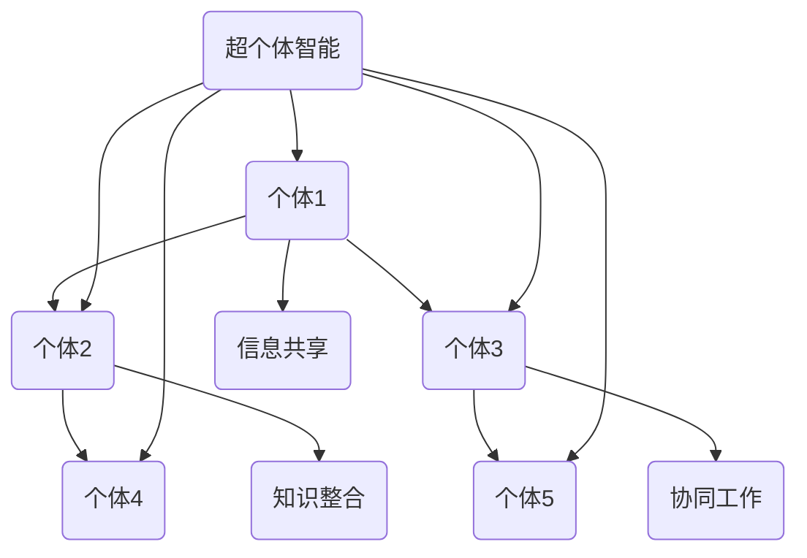

#### 1.1.2 集体智慧的定义

集体智慧可以被定义为一种通过群体成员之间相互协作、信息共享和知识整合实现的智能现象。它不仅体现在决策过程中，还体现在创新、学习和适应复杂环境等方面。集体智慧的核心在于群体成员之间的互动，这种互动促进了知识和信息的流动，从而提高了群体的智能表现。

Mermaid流程图：

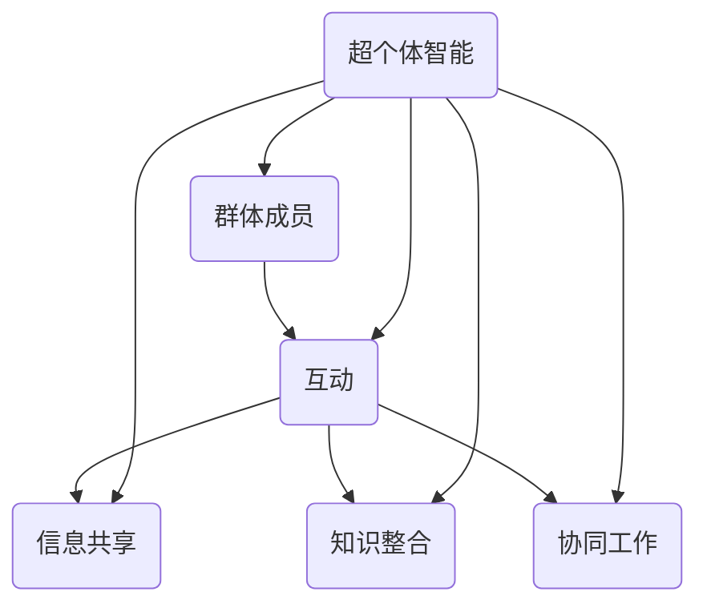

#### 1.2 集体智慧的历史与发展

#### 1.2.1 集体智慧的起源与发展

集体智慧的概念最早可以追溯到20世纪中期，由生物学家克里斯托弗·洛克利（Christopher Langton）提出。他在研究人工生命和复杂自适应系统时，注意到个体之间的协作和互动能够产生复杂的集体行为。随着时间的推移，集体智慧的研究逐渐扩展到组织行为学、计算机科学和社会学等领域。

Mermaid流程图：

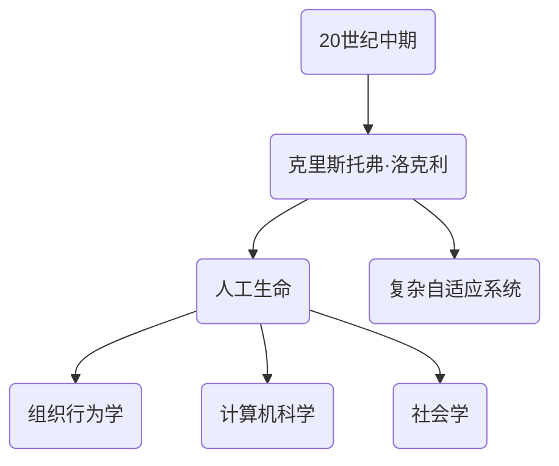

#### 1.2.2 集体智慧在不同领域的发展

在组织行为学领域，集体智慧被视为一种提高组织效率和创新能力的重要手段。组织通过建立开放的信息共享平台和协同工作环境，促进成员之间的交流和合作，从而实现集体智慧。计算机科学领域的研究则主要集中在如何利用算法和模型来模拟和优化集体智慧的表现。在社会学领域，集体智慧的研究关注社会网络和群体互动对社会行为和决策的影响。

Mermaid流程图：

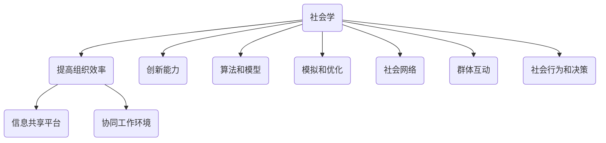

#### 1.3 集体智慧的关键特征

#### 1.3.1 集体智慧的核心特征

集体智慧的核心特征包括协同工作、信息共享和知识整合。协同工作是指群体成员之间的合作和共同努力，通过分工和协作实现共同目标。信息共享是指群体成员之间交换和共享信息，提高决策和问题解决的质量。知识整合是指将个体的知识和经验整合成有价值的集体知识，促进集体智慧和创新能力的发展。

Mermaid流程图：

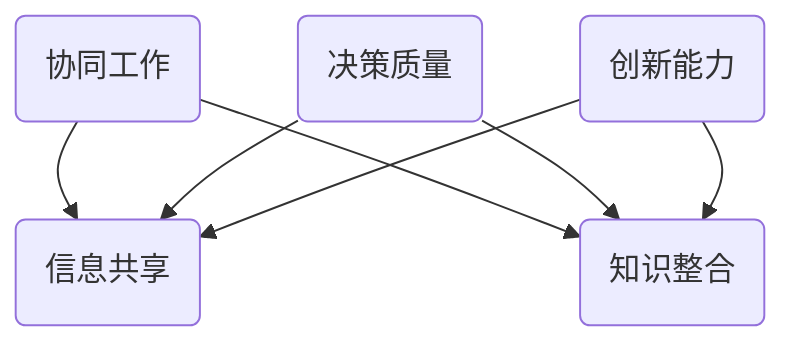

#### 1.3.2 集体智慧的适用范围

集体智慧适用于各种领域和场景，包括组织管理、科技创新、社会治理等。在组织管理中，集体智慧可以通过团队合作和知识共享提高决策质量和创新能力。在科技创新中，集体智慧可以促进协同研发和知识整合，加快技术突破和产品创新。在社会治理中，集体智慧可以通过公众参与和民主决策提高决策的透明度和公正性。

Mermaid流程图：

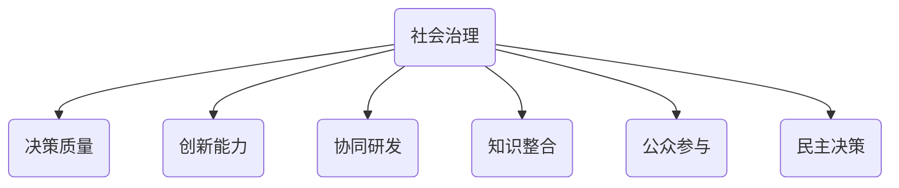

通过以上内容，我们对集体智慧的基本概念、历史发展、关键特征及其适用范围有了更深入的了解。在接下来的章节中，我们将进一步探讨群体决策的心理学原理、数学模型以及集体智慧在各个领域的应用实践。

### 第2章：群体决策的心理学原理

群体决策是指一群人在面对复杂问题时，通过集体讨论、协商和决策来做出最终决策的过程。这一过程涉及到个体心理、群体动力学以及决策偏差等多个心理学概念。理解这些概念对于设计有效的决策过程和提升决策质量至关重要。

#### 2.1 群体动力学

群体动力学（Group Dynamics）是研究群体内部成员之间的相互作用、互动模式以及这些互动如何影响群体行为和表现的学科。它关注群体内部的角色、关系、沟通、冲突和规范等方面。

##### 2.1.1 群体动力学的概念

群体动力学是心理学的一个重要分支，它探讨了群体内部成员之间的互动如何影响群体的行为和决策。这些互动包括沟通、合作、竞争以及冲突等，它们共同塑造了群体的动态环境。

Mermaid流程图：

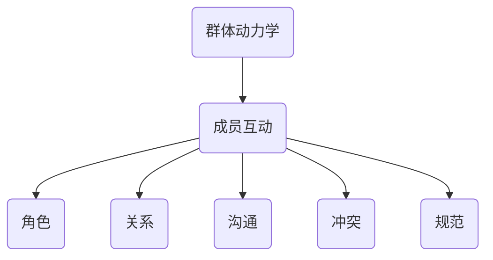

##### 2.1.2 群体动力学的关键因素

群体动力学的研究主要集中在以下几个方面：

1. **成员互动**：群体成员之间的互动是群体动力学的基础。这种互动不仅包括面对面的沟通，还包括非言语沟通、书面沟通和数字沟通等。

2. **群体结构**：群体的结构，如成员之间的网络关系和角色分配，影响群体行为。一个良好的群体结构有助于信息流动和协同工作。

3. **沟通**：有效的沟通是群体达成共识和协同工作的关键。沟通的质量直接影响群体的决策效率和准确性。

4. **冲突**：冲突是群体内部的一种自然现象，如何管理和解决冲突对群体表现至关重要。冲突可以促进创新，但也可能阻碍决策进程。

5. **规范**：群体内部的规范和行为准则对群体成员的行为产生影响。这些规范有助于维持群体的稳定和一致性，但也可能限制群体的创新和灵活性。

Mermaid流程图：

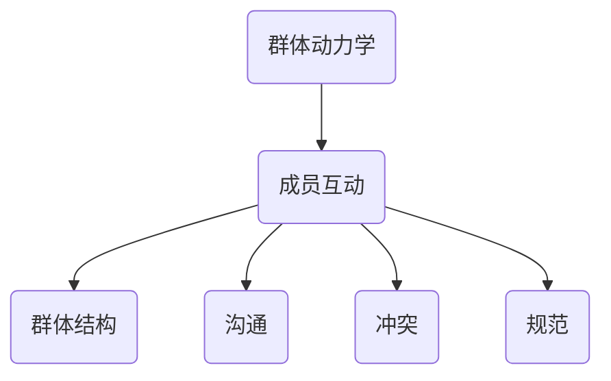

#### 2.2 群体思维与决策偏差

群体思维（Groupthink）是指在群体决策过程中，个体为了获得群体的一致性，倾向于放弃个人判断和独立思考，从而导致决策质量下降的现象。群体思维通常发生在群体面临紧急情况或高度压力时。

##### 2.2.1 群体思维的概念

群体思维是一种心理现象，它表现为个体在面对群体压力时，倾向于服从群体意见，即使这些意见可能是错误的。这种现象可能导致群体决策的偏见和失误。

Mermaid流程图：

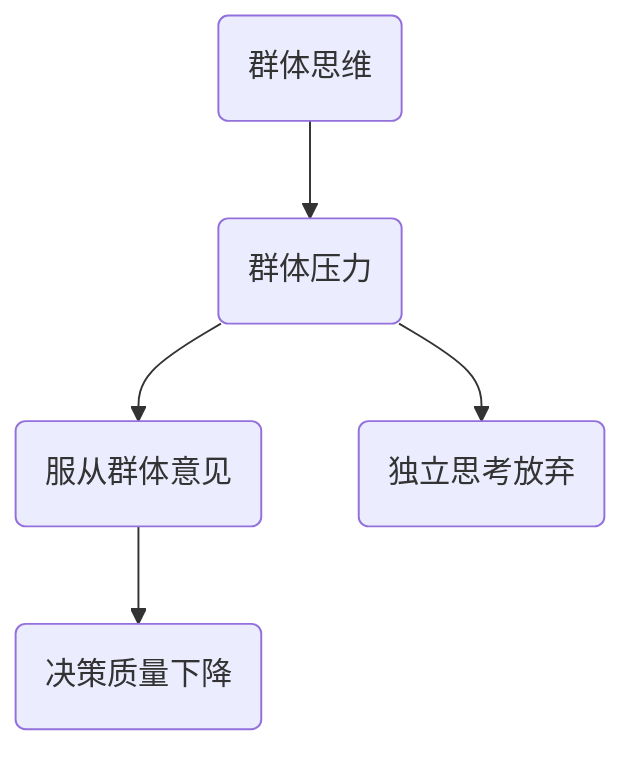

##### 2.2.2 群体思维与决策偏差的关系

群体思维常常伴随着决策偏差（Decision Bias），即个体在决策过程中由于认知偏差、情绪影响或信息不足等原因，导致做出非理性决策。群体思维加剧了这些偏差，因为它抑制了批判性思维和多样性观点的引入。

1. **确认偏差（Confirmation Bias）**：个体倾向于寻找和接受支持已有观点的信息，忽略或贬低反对信息。

2. **锚定效应（Anchoring Effect）**：个体在决策过程中受到最初信息的影响，难以调整观点。

3. **群体极化（Group Polarization）**：群体讨论可能导致成员的观点向极端方向偏移。

Mermaid流程图：

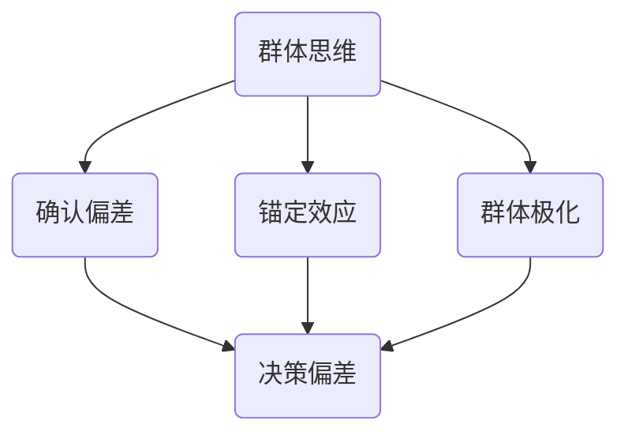

##### 2.2.3 常见的决策偏差

常见的决策偏差包括以下几种：

1. **过度自信（Overconfidence）**：个体倾向于过高估计自己的能力和知识，从而导致决策过度自信。

2. **羊群效应（Herd Behavior）**：个体在决策过程中跟随群体，即使群体决策可能是错误的。

3. **忽视多样性（Ignoring Diversity）**：群体在决策过程中可能忽视多样性观点，导致决策单一化。

Mermaid流程图：

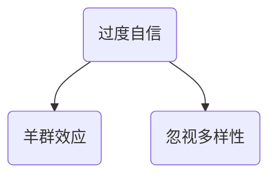

#### 2.3 群体动力学的心理机制

群体动力学的心理机制涉及到个体在群体中的心理状态和行为模式。以下是一些关键的心理学概念：

1. **群体认同（Group Identity）**：个体在群体中的认同感，有助于形成共同的价值观和行为准则。

2. **群体规范（Group Norms）**：群体成员共同遵守的行为准则，影响个体行为和决策。

3. **社会认同（Social Identity）**：个体同时属于多个群体，这些群体的身份认同影响个体的行为和决策。

4. **社会促进（Social Facilitation）**：群体情境对个体行为的影响，如增加个体的警觉性和注意力。

Mermaid流程图：

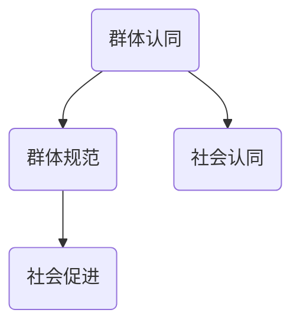

通过理解群体动力学的心理机制，我们可以更好地设计决策过程，减少决策偏差，提高群体决策的质量。在接下来的章节中，我们将探讨集体智慧的数学模型，以及如何利用这些模型来优化群体决策。

### 第3章：集体智慧的数学模型

集体智慧的数学模型是理解和优化群体决策的重要工具，通过这些模型，我们可以量化群体行为和决策过程，从而更好地揭示集体智慧的本质。本章将介绍集体智慧的几种关键计算模型、群体决策优化算法以及如何进行集体智慧的可视化分析。

#### 3.1 集体智慧的计算模型

集体智慧的计算模型旨在模拟和分析群体成员之间的交互过程，以及这些交互如何影响群体的整体行为和决策。以下是几种常见的集体智慧计算模型：

##### 3.1.1 基于代理的模型（Agent-Based Model，ABM）

基于代理的模型（ABM）是一种通过模拟个体代理的行为和交互来研究群体行为的计算模型。每个代理都有自己的属性和行为规则，它们在模拟环境中相互作用，从而产生集体行为。例如，在交通流量模拟中，每个车辆代理都有自己的速度和方向，它们之间的交互决定了整体交通流量。

伪代码示例：

```python
# 初始化代理
for each agent in population:
    initialize_positionvelocity()

# 迭代模拟
while simulation_not_ended:
    for each agent in population:
        update_positionvelocity()
        interact_with_neighbors()
```

Mermaid流程图：

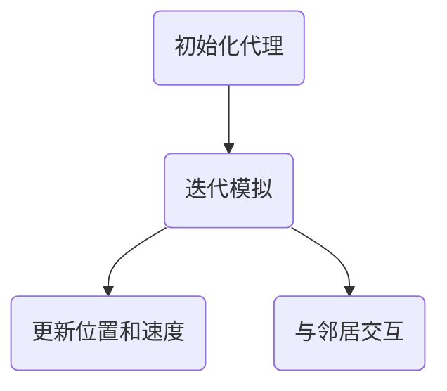

##### 3.1.2 基于网络的模型（Network-Based Model）

基于网络的模型通过研究群体成员之间的网络关系来分析群体行为。这种模型通常使用图论来表示群体成员及其交互关系，从而研究网络结构对群体行为的影响。例如，社交网络分析可以用来研究信息传播、流行病传播和社会影响。

伪代码示例：

```python
# 初始化网络
create_graph()

# 添加节点和边
for each agent in population:
    add_node()
    connect_neighbors()

# 迭代分析
while not_finished:
    update_node_states()
    propagate_influence()
```

Mermaid流程图：

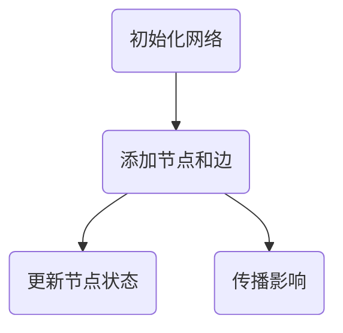

##### 3.1.3 基于机器学习的模型（Machine Learning Model）

基于机器学习的模型通过学习群体行为的数据来预测和优化群体决策。这些模型通常使用监督学习或无监督学习算法来训练，从而识别群体行为模式并做出预测。例如，通过聚类算法可以识别群体中的关键个体或领导者。

伪代码示例：

```python
# 数据收集
collect_behavior_data()

# 数据预处理
preprocess_data()

# 训练模型
model = train_model(data)

# 预测群体行为
predictions = model.predict(new_data)
```

Mermaid流程图：

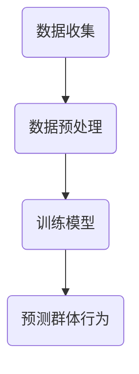

#### 3.2 群体决策的优化算法

群体决策的优化算法旨在通过数学模型和算法来提高群体决策的效率和质量。以下是一些常见的优化算法：

##### 3.2.1 遗传算法（Genetic Algorithm）

遗传算法是一种基于自然选择和遗传学原理的优化算法，适用于复杂非线性问题的优化。遗传算法通过模拟生物进化过程，逐步改进群体决策的解。

伪代码示例：

```python
# 初始化种群
population = initialize_population()

# 迭代进化
while not_converged:
    selection()
    crossover()
    mutation()
    evaluate()
    select_best()
```

Mermaid流程图：

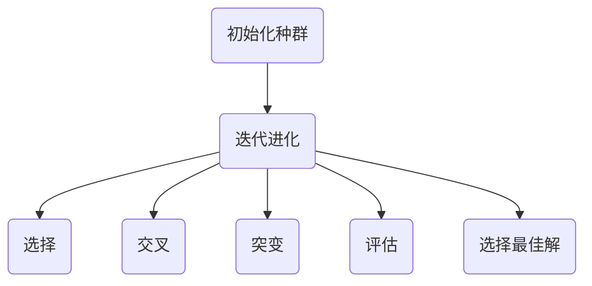

##### 3.2.2 粒子群优化算法（Particle Swarm Optimization，PSO）

粒子群优化算法是一种基于群体智能的优化算法，通过模拟鸟群觅食行为来优化问题。粒子群优化算法适用于高维和复杂问题的优化。

伪代码示例：

```python
# 初始化粒子群
initialize_particles()

# 迭代优化
while not_converged:
    update_velocities()
    update_positions()
    evaluate()
    update_global_best()
```

Mermaid流程图：

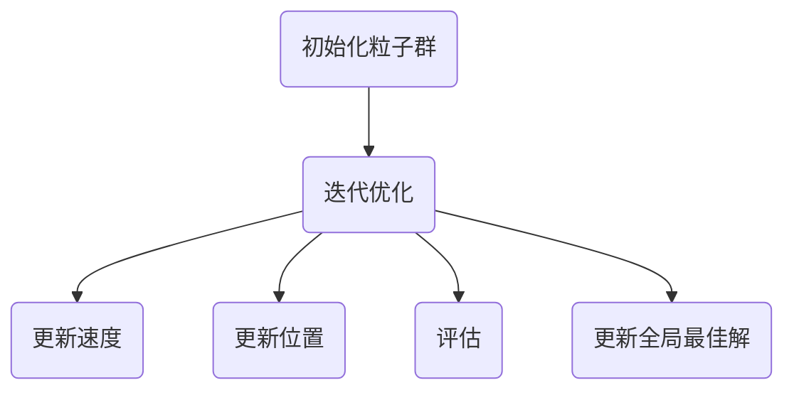

##### 3.2.3 蚁群算法（Ant Colony Optimization，ACO）

蚁群算法是一种模拟蚂蚁觅食行为的优化算法，适用于路径规划和资源分配等问题。蚁群算法通过信息素更新和路径选择来优化群体决策。

伪代码示例：

```python
# 初始化蚁群
initialize_ants()

# 迭代搜索
while not_converged:
    move_ants()
    deposit_pheromone()
    update_pheromone()
    select_best_path()
```

Mermaid流程图：

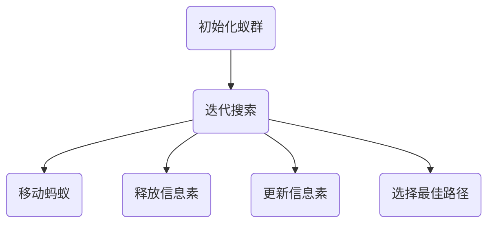

#### 3.3 集体智慧的可视化分析

可视化分析是理解和解释集体智慧行为的重要工具。通过可视化，我们可以直观地展示群体行为和决策过程，从而更好地理解集体智慧的本质。

##### 3.3.1 集体智慧可视化分析概述

集体智慧的可视化分析涉及多种可视化技术，如图表、图像和交互式界面等。这些技术可以帮助我们展示群体行为、决策路径和信息流动，从而提供直观的理解和解释。

Mermaid流程图：

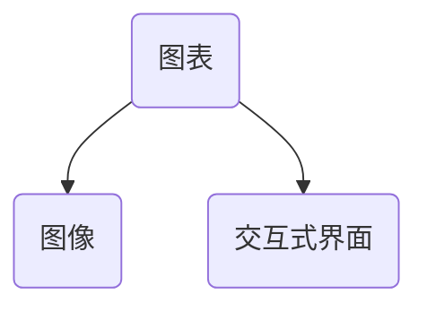

##### 3.3.2 集体智慧可视化分析的应用

以下是集体智慧可视化分析在几个具体场景中的应用：

1. **决策过程可视化**：通过流程图和决策树等可视化工具，展示群体决策的过程和路径，从而识别关键决策点和影响因素。

2. **信息流动可视化**：通过网络图和流图等可视化工具，展示群体成员之间的信息流动和交互，从而理解信息传播和影响机制。

3. **群体行为可视化**：通过热图和散点图等可视化工具，展示群体行为的空间分布和动态变化，从而识别群体行为的模式和趋势。

Mermaid流程图：

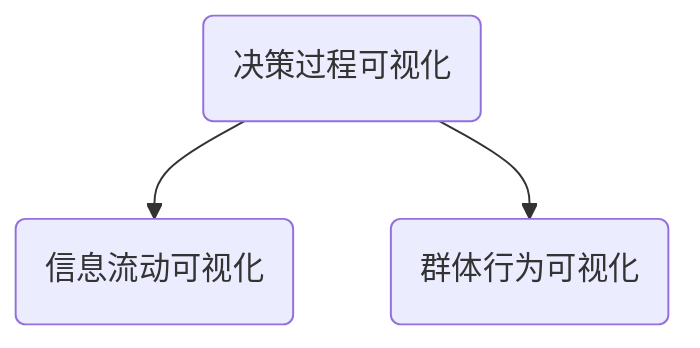

通过以上内容，我们对集体智慧的数学模型、优化算法和可视化分析有了更深入的了解。这些工具和方法不仅有助于我们理解集体智慧的本质，还可以在实际应用中提高决策质量和效率。在接下来的章节中，我们将探讨集体智慧在不同领域的应用和实践。

### 第4章：集体智慧在组织管理中的应用

集体智慧在组织管理中的应用具有广泛而深远的影响。它不仅能够提升组织的决策质量，还能促进创新、增强团队协作和推动战略发展。本章节将详细探讨集体智慧在领导力发展、团队协作和战略决策中的应用，并通过实际案例展示其价值。

#### 4.1 集体智慧在领导力发展中的应用

集体智慧为领导者提供了一个强大的工具，帮助他们更好地理解组织内外部环境，并做出更明智的决策。以下是集体智慧在领导力发展中的具体应用：

##### 4.1.1 集体智慧在领导力培养中的角色

集体智慧在领导力培养中扮演着关键角色。首先，它帮助领导者培养开放和包容的领导风格，鼓励团队成员分享观点和建议。通过这种方式，领导者能够更全面地了解组织内部的动态和潜在问题，从而做出更科学的决策。

伪代码示例：

```python
# 领导力培养
def cultivate_leadership():
    # 鼓励观点分享
    encourage_ideas_sharing()
    # 建立反馈机制
    establish_feedback_system()
    # 促进跨部门协作
    promote_cross-department_collaboration()
```

Mermaid流程图：

```mermaid
graph TD
    A(鼓励观点分享) --> B(建立反馈机制)
    B --> C(促进跨部门协作)
```

##### 4.1.2 集体智慧领导力案例分析

以下是一个集体智慧在领导力发展中的应用案例：

**案例：谷歌的“20%时间”政策**

谷歌的“20%时间”政策允许员工将其工作时间的20%用于探索个人感兴趣的项目。这一政策激发了员工之间的知识共享和团队合作，推动了公司创新和产品发展。例如，谷歌搜索引擎和Gmail等项目就起源于这个政策。

Mermaid流程图：

```mermaid
graph TD
    A(20%时间政策) --> B(知识共享)
    B --> C(团队合作)
    B --> D(创新和产品发展)
```

通过这个案例，我们可以看到集体智慧如何帮助领导者培养创新思维，提高组织整体竞争力。

#### 4.2 集体智慧在团队协作中的应用

团队协作是组织成功的关键因素之一。集体智慧通过促进信息共享和知识整合，有助于提升团队协作效率，从而推动组织目标实现。

##### 4.2.1 集体智慧在团队协作中的价值

集体智慧在团队协作中的价值主要体现在以下几个方面：

1. **提高协同效率**：通过集体智慧，团队成员可以共享资源和信息，协同完成复杂任务，从而提高工作效率。

2. **促进创新思维**：集体智慧能够激发团队成员的创新思维，通过集体讨论和知识整合，快速找到解决方案。

3. **增强团队凝聚力**：集体智慧可以促进团队成员之间的互动和信任，增强团队凝聚力和执行力。

伪代码示例：

```python
# 团队协作
def enhance_collaboration():
    # 建立共享平台
    create_shared_platform()
    # 定期团队会议
    hold_regular_meetings()
    # 促进知识整合
    promote_knowledge_integration()
```

Mermaid流程图：

```mermaid
graph TD
    A(建立共享平台) --> B(定期团队会议)
    B --> C(促进知识整合)
```

##### 4.2.2 集体智慧团队协作的最佳实践

以下是一些集体智慧团队协作的最佳实践：

1. **建立协作平台**：利用协作工具，如Slack、Trello或Confluence，建立团队信息共享和任务管理平台。

2. **定期团队会议**：定期组织团队会议，鼓励团队成员分享进展和困难，共同解决问题。

3. **设置共同目标**：明确团队目标和任务，通过集体智慧和团队合作，确保目标实现。

Mermaid流程图：

```mermaid
graph TD
    A(建立协作平台) --> B(定期团队会议)
    B --> C(设置共同目标)
```

通过这些最佳实践，团队可以更好地利用集体智慧，提高协作效率和项目成功率。

#### 4.3 集体智慧在战略决策中的应用

战略决策是组织发展的关键环节。集体智慧通过提供多元化和民主化的决策过程，有助于提高战略决策的质量和可行性。

##### 4.3.1 集体智慧在战略决策中的重要作用

集体智慧在战略决策中的作用主要体现在以下几个方面：

1. **提高决策质量**：通过集体智慧和多元视角，可以减少决策偏差，提高决策的准确性和可行性。

2. **促进创新思维**：集体智慧能够激发团队成员的创新思维，通过集体讨论和知识整合，提出创新的战略方案。

3. **增强决策透明度**：集体智慧可以增强决策的透明度，使团队成员更好地了解决策过程和决策结果，提高决策的公正性和接受度。

伪代码示例：

```python
# 战略决策
def strategic_decision_making():
    # 多元化视角
    incorporate_diverse_perspectives()
    # 集体讨论
    hold_group_discussions()
    # 知识整合
    integrate_knowledge()
    # 透明度增强
    enhance_transparency()
```

Mermaid流程图：

```mermaid
graph TD
    A(多元化视角) --> B(集体讨论)
    B --> C(知识整合)
    C --> D(透明度增强)
```

##### 4.3.2 集体智慧战略决策案例分析

以下是一个集体智慧在战略决策中的应用

