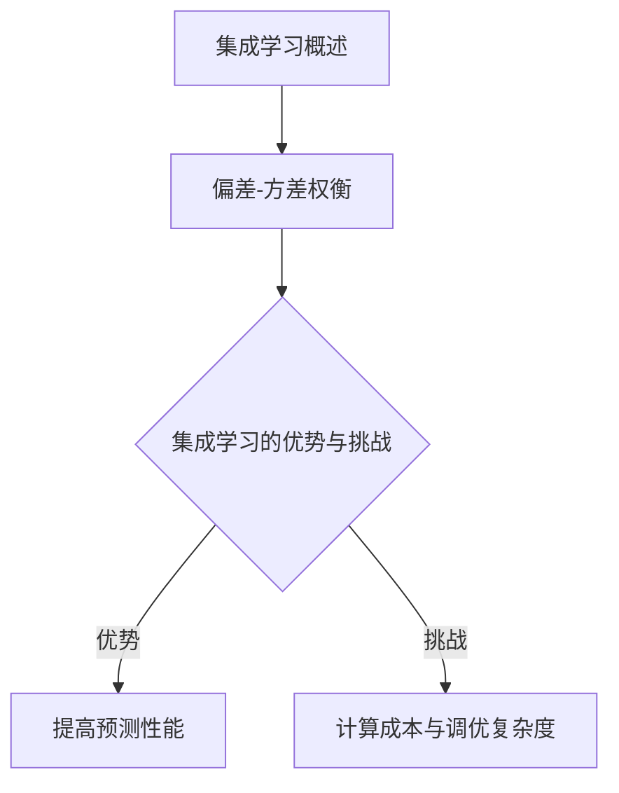
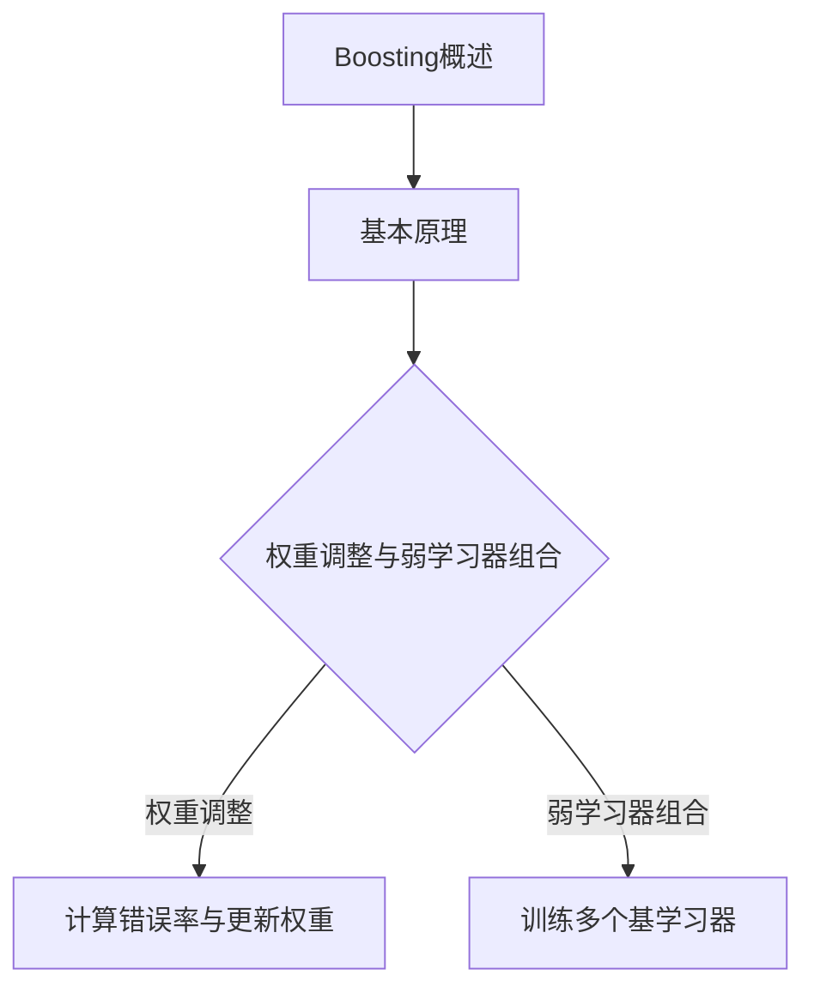
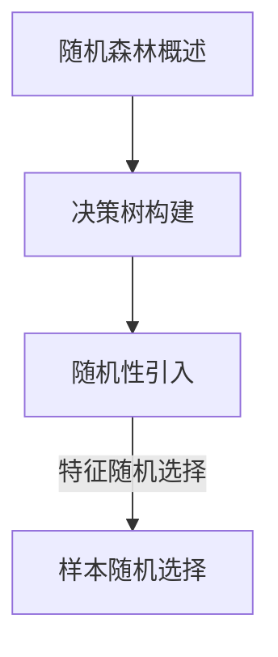
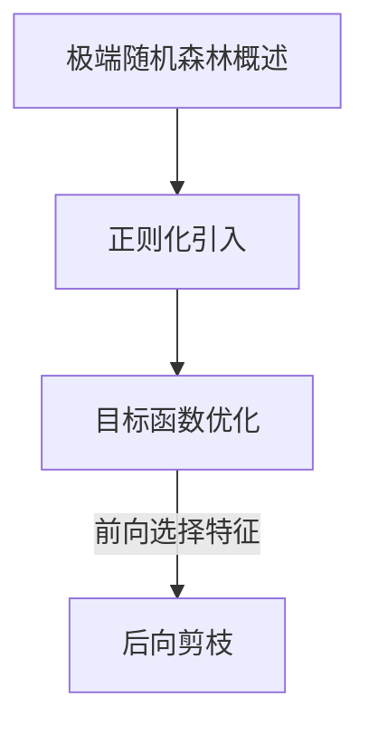

                 


### 文章标题：《集成学习》

在当今机器学习领域，集成学习（Ensemble Learning）已成为一种重要的技术手段，广泛应用于各种复杂的数据分析任务中。本文旨在通过逻辑清晰、结构紧凑的叙述，对集成学习的基本概念、原理以及应用进行系统的剖析，帮助读者深入理解这一技术，并掌握其实际应用的方法和策略。

### 关键词

- **集成学习**
- **偏差-方差权衡**
- **Bagging**
- **Boosting**
- **随机森林**
- **极端随机森林**
- **深度学习**

### 摘要

本文将探讨集成学习在机器学习领域中的重要性，首先介绍集成学习的基础概念，然后逐步深入到基础集成学习方法（如Bagging和Boosting）以及高级方法（如随机森林和极端随机森林）。此外，还将探讨集成学习在深度学习中的应用，并介绍集成学习的调优策略和性能评估方法。最后，通过实际案例分析，展示集成学习的实际应用效果。

## 《集成学习》目录大纲

### 第一部分：集成学习基础

### 第1章：集成学习概述

#### 1.1 集成学习的概念

#### 1.2 集成学习与偏差-方差权衡

#### 1.3 集成学习的优势与挑战

### 第2章：基础集成学习方法

#### 2.1 bagging

##### 2.1.1 基本原理

##### 2.1.2 决策树Bagging实现

##### 2.1.3 伪代码实现

### 第3章：提升方法

#### 3.1 Boosting的概念

##### 3.1.1 基本原理

##### 3.1.2 决策树Boosting实现

##### 3.1.3 伪代码实现

#### 3.2 AdaBoost算法详解

##### 3.2.1 算法原理

##### 3.2.2 伪代码实现

### 第4章：随机森林

#### 4.1 随机森林的概念

#### 4.2 随机森林的实现

##### 4.2.1 决策树构建

##### 4.2.2 随机性引入

##### 4.2.3 伪代码实现

### 第5章：极端随机森林

#### 5.1 极端随机森林的概念

#### 5.2 极端随机森林的实现

##### 5.2.1 前向选择特征

##### 5.2.2 后向剪枝

##### 5.2.3 伪代码实现

### 第6章：集成学习在深度学习中的应用

#### 6.1 深度神经网络与集成学习的关系

#### 6.2 深度学习的集成学习方法

##### 6.2.1 神经网络的Bagging

##### 6.2.2 神经网络的Boosting

##### 6.2.3 伪代码实现

### 第7章：集成学习的调优策略

#### 7.1 调参方法

##### 7.1.1 参数选择

##### 7.1.2 超参数调整

##### 7.1.3 伪代码实现

### 第8章：集成学习的性能评估

#### 8.1 评估指标

##### 8.1.1 准确率、召回率、F1值等

##### 8.1.2 调整曲线分析

#### 8.2 实际应用案例分析

##### 8.2.1 案例一：金融风险评估

##### 8.2.2 案例二：图像分类

##### 8.2.3 案例三：医疗诊断

### 附录

#### 附录A：集成学习相关资源

##### A.1 常见集成学习方法介绍

##### A.2 集成学习相关论文推荐

##### A.3 集成学习实践项目指南

#### 附录B：Mermaid流程图

##### B.1 集成学习基本原理流程图

##### B.2 Boosting算法原理流程图

##### B.3 随机森林算法原理流程图

##### B.4 极端随机森林算法原理流程图

---

### 补充说明

1. **章节核心概念与联系**：每个章节都将通过Mermaid流程图来展示集成学习的基本原理和相关算法的流程，帮助读者更直观地理解。
2. **核心算法原理讲解**：每个章节的核心算法原理讲解部分，将使用伪代码来详细阐述算法的实现，以便读者更好地掌握算法的逻辑。
3. **数学模型和公式**：本文将使用LaTeX格式来详细讲解相关的数学公式，并确保文中独立段落的LaTeX公式前后使用$$括起来，段落内的LaTeX公式前后使用$括起来。
4. **项目实战**：本文将在实际案例部分提供实际的代码案例，并进行详细解释说明，包括开发环境搭建、源代码实现和代码解读与分析。

### 文章正文

#### 第1章：集成学习概述

集成学习是一种利用多个模型来改善预测性能的方法。它通过将多个弱学习器（如决策树）组合成一个强学习器，从而减少模型的偏差和方差，提高整体性能。集成学习在机器学习领域中具有重要地位，特别是在面对复杂和大规模数据时。

### 第1.1节：集成学习的概念

集成学习可以分为两大类：Bagging和Boosting。Bagging通过从训练集中生成多个子集，并在每个子集上训练一个弱学习器，然后通过投票或取平均值来合并预测结果。Boosting则相反，它首先训练一个弱学习器，然后使用该学习器的错误率来重新加权训练集，从而在下一轮训练中更关注那些被先前模型预测错误的样本。

### 第1.2节：集成学习与偏差-方差权衡

集成学习的核心思想是平衡模型的偏差和方差。偏差（Bias）是模型预测的准确性，而方差（Variance）是模型预测的不稳定性。理想情况下，我们希望模型具有较低的偏差和方差。集成学习通过增加模型数量和多样性来降低方差，同时保持或减少偏差。

### 第1.3节：集成学习的优势与挑战

集成学习的优势包括：

1. **提高预测性能**：通过组合多个弱学习器，集成学习通常能够提高预测性能，减少过拟合。
2. **鲁棒性**：集成学习对异常值和噪声具有更强的鲁棒性，因为多个模型的集成可以抵消个别模型的噪声影响。

然而，集成学习也存在一些挑战：

1. **计算成本**：集成学习通常需要更多的计算资源和时间，因为需要训练多个模型。
2. **调优复杂度**：集成学习涉及多个参数的调优，这增加了模型的复杂性。

### 第2章：基础集成学习方法

#### 第2.1节：Bagging

Bagging（Bootstrap Aggregating）是一种基础集成学习方法，通过从训练集中有放回地抽取子集来生成多个训练集，然后在每个子集上训练一个弱学习器，最后通过投票或取平均值来合并预测结果。

### 第2.1.1节：基本原理

Bagging的基本原理包括以下步骤：

1. 从训练集中有放回地抽取子集，直到生成所需的子集数量。
2. 在每个子集上训练一个弱学习器（如决策树）。
3. 对每个弱学习器的预测结果进行投票或取平均值，得到最终的预测结果。

### 第2.1.2节：决策树Bagging实现

决策树Bagging实现的关键在于如何生成多个子集。这里是一个简单的伪代码实现：

```
# 伪代码：决策树Bagging实现
Initialize models as empty list
for i in range(num_models):
    # 生成子集
    subset = sample_train_data(with_replacement=True)
    # 在子集上训练决策树
    model = train_decision_tree(subset)
    # 添加模型到列表中
    models.append(model)

# 预测
def predict(data, models):
    predictions = []
    for model in models:
        prediction = model.predict(data)
        predictions.append(prediction)
    # 投票或取平均值
    final_prediction = vote_or_average(predictions)
    return final_prediction
```

### 第2.1.3节：伪代码实现

Bagging的伪代码实现如下：

```
# 伪代码：Bagging实现
Initialize models as empty list
for i in range(num_models):
    subset = sample_train_data(with_replacement=True)
    model = train_weak_learning_model(subset)
    models.append(model)

def ensemble_predict(data, models):
    predictions = [model.predict(data) for model in models]
    final_prediction = ensemble_decision(predictions)
    return final_prediction
```

### 第3章：提升方法

提升方法（Boosting）是另一种基础集成学习方法，通过关注那些被先前模型预测错误的样本，并在下一轮训练中给予这些样本更高的权重，从而提高整体模型的性能。

### 第3.1节：Boosting的概念

Boosting的基本原理包括以下步骤：

1. 选择一个基学习器（通常是简单模型，如决策树）。
2. 在训练集上训练基学习器，并对每个样本赋予相同的权重。
3. 计算基学习器的错误率，并对错误率高的样本增加权重，对正确率高的样本减少权重。
4. 重复步骤2和3，训练多个基学习器，并组合它们的预测结果。

### 第3.1.1节：基本原理

Boosting的基本原理是基于以下两个假设：

1. **错误率低的样本更可靠**：如果某个样本在先前模型中被预测正确，那么它可能更可靠，反之则可能更不可靠。
2. **错误的样本需要更多的关注**：如果某个样本在先前模型中被预测错误，那么它可能需要更多的关注，以便在后续模型中给予更多的权重。

### 第3.1.2节：决策树Boosting实现

决策树Boosting的实现需要计算每个样本的权重，并在每次迭代中更新这些权重。以下是一个简单的伪代码实现：

```
# 伪代码：决策树Boosting实现
Initialize weights as equal for all samples
for i in range(num_iterations):
    # 训练决策树
    model = train_decision_tree(train_data, weights)
    # 计算错误率
    errors = model.calculate_errors(test_data, weights)
    # 更新权重
    update_weights(weights, errors)

# 预测
def predict(data, models):
    predictions = [model.predict(data) for model in models]
    final_prediction = ensemble_decision(predictions)
    return final_prediction
```

### 第3.1.3节：伪代码实现

Boosting的伪代码实现如下：

```
# 伪代码：Boosting实现
Initialize weights
for i in range(num_iterations):
    # 训练基学习器
    model = train_weak_learning_model(train_data, weights)
    # 计算误差
    errors = model.calculate_errors(test_data, weights)
    # 更新权重
    weights = update_weights(weights, errors)

def ensemble_predict(data, models):
    predictions = [model.predict(data) for model in models]
    final_prediction = ensemble_decision(predictions)
    return final_prediction
```

### 第3.2节：AdaBoost算法详解

AdaBoost（Adaptive Boosting）是一种常见的Boosting算法，通过在每次迭代中调整样本的权重，以提高整体模型的性能。AdaBoost的基本步骤如下：

1. 初始化所有样本的权重，通常设为相等。
2. 对于每个迭代轮次：
   - 训练基学习器，并在训练集上评估其性能。
   - 根据基学习器的性能调整样本权重，使错误率高的样本权重增加，错误率低的样本权重减少。
   - 重新训练基学习器，并重复上述步骤。

### 第3.2.1节：算法原理

AdaBoost的算法原理基于以下两个关键步骤：

1. **权重调整**：AdaBoost通过调整样本权重来关注那些被先前模型预测错误的样本。这种方法确保了在每次迭代中，模型会更加关注那些尚未被正确预测的样本。
2. **弱学习器组合**：AdaBoost通过组合多个弱学习器来形成强学习器。每个弱学习器都对整体模型的贡献不同，贡献大小取决于其在当前迭代轮次中的性能。

### 第3.2.2节：伪代码实现

AdaBoost的伪代码实现如下：

```
# 伪代码：AdaBoost实现
Initialize weights
for i in range(num_iterations):
    # 训练基学习器
    model = train_weak_learning_model(train_data, weights)
    # 预测
    predictions = model.predict(test_data)
    # 计算错误率
    errors = calculate_errors(predictions, weights)
    # 更新权重
    weights = update_weights(weights, errors)

def ensemble_predict(data, models):
    predictions = [model.predict(data) for model in models]
    final_prediction = ensemble_decision(predictions)
    return final_prediction
```

### 第4章：随机森林

随机森林（Random Forest）是一种基于Bagging方法的集成学习算法，通过构建多个决策树并合并它们的预测结果来提高模型的预测性能。随机森林在分类和回归任务中表现出色，广泛应用于各种实际应用场景。

### 第4.1节：随机森林的概念

随机森林的基本概念包括：

1. **决策树**：随机森林中的每个基学习器都是一个决策树。决策树是一种树形结构，通过一系列的划分规则来将数据划分为不同的区域。
2. **随机性引入**：随机森林通过引入随机性来提高模型的泛化能力。在构建每个决策树时，随机森林会从特征集合中随机选择一部分特征用于划分，并从训练数据中随机选择一部分样本作为决策树的训练集。

### 第4.2节：随机森林的实现

随机森林的实现包括以下步骤：

1. **构建多个决策树**：从训练数据中随机生成多个子集，并在每个子集上构建一个决策树。
2. **引入随机性**：在构建每个决策树时，随机选择一部分特征和样本。
3. **合并预测结果**：对每个决策树的预测结果进行投票或取平均值，得到最终的预测结果。

### 第4.2.1节：决策树构建

决策树的构建过程包括以下步骤：

1. **选择根节点**：从特征集合中随机选择一个特征，并计算其在训练数据中的增益或信息增益。
2. **划分数据**：根据选定的特征和阈值，将训练数据划分为两个子集。
3. **递归构建子节点**：对每个子集重复上述步骤，直到满足停止条件（如最大深度、最小样本数等）。

### 第4.2.2节：随机性引入

随机性引入是随机森林的重要特性，通过以下方式实现：

1. **特征随机选择**：在构建每个决策树时，从特征集合中随机选择一部分特征用于划分。
2. **样本随机选择**：在构建每个决策树时，从训练数据中随机选择一部分样本作为决策树的训练集。

### 第4.2.3节：伪代码实现

随机森林的伪代码实现如下：

```
# 伪代码：随机森林实现
Initialize empty forest
for i in range(num_trees):
    # 生成子集
    subset = sample_train_data()
    # 构建决策树
    tree = build_decision_tree(subset)
    # 添加决策树到森林中
    forest.append(tree)

def ensemble_predict(data, forest):
    predictions = [tree.predict(data) for tree in forest]
    final_prediction = ensemble_decision(predictions)
    return final_prediction
```

### 第5章：极端随机森林

极端随机森林（ Extremely Random Forest，简称XGBoost）是一种基于随机森林的集成学习方法，通过引入正则化项和优化目标函数来提高模型的性能。XGBoost在处理大规模数据和高维度特征时表现出色，广泛应用于各种实际应用场景。

### 第5.1节：极端随机森林的概念

极端随机森林的基本概念包括：

1. **正则化**：XGBoost引入了正则化项，以防止模型过拟合。正则化项包括L1和L2正则化，通过调整正则化参数可以控制模型的复杂度。
2. **目标函数**：XGBoost的目标函数包括损失函数和正则化项，通过优化目标函数来提高模型的性能。

### 第5.2节：极端随机森林的实现

极端随机森林的实现包括以下步骤：

1. **构建多个决策树**：从训练数据中随机生成多个子集，并在每个子集上构建一个决策树，每个决策树包含多个节点。
2. **引入正则化**：在构建每个决策树时，引入L1和L2正则化项，以控制模型的复杂度。
3. **优化目标函数**：通过优化目标函数来提高模型的性能，目标函数包括损失函数和正则化项。

### 第5.2.1节：前向选择特征

前向选择特征（Feature Selection）是XGBoost的一种特征选择方法，通过在每次迭代中选择最优特征来提高模型的性能。前向选择特征的实现包括以下步骤：

1. **初始化特征权重**：初始化每个特征的权重。
2. **迭代选择特征**：在每次迭代中，选择最优特征，将其添加到模型中，并更新其他特征的权重。
3. **停止条件**：当满足停止条件（如最大迭代次数、最小特征权重等）时，停止迭代。

### 第5.2.2节：后向剪枝

后向剪枝（Backward Pruning）是XGBoost的一种剪枝方法，通过删除模型中的节点来提高模型的性能。后向剪枝的实现包括以下步骤：

1. **初始化模型**：初始化XGBoost模型，包括树的结构、节点权重等。
2. **迭代剪枝**：在每次迭代中，从模型中删除一个节点，并评估模型的性能。
3. **停止条件**：当满足停止条件（如最小节点权重、最大剪枝次数等）时，停止迭代。

### 第5.2.3节：伪代码实现

极端随机森林的伪代码实现如下：

```
# 伪代码：XGBoost实现
Initialize empty XGBoost model
for i in range(num_iterations):
    # 生成子集
    subset = sample_train_data()
    # 构建决策树
    tree = build_decision_tree(subset)
    # 添加决策树到模型中
    model.add(tree)
    # 优化目标函数
    model.optimize()

def ensemble_predict(data, model):
    predictions = model.predict(data)
    final_prediction = ensemble_decision(predictions)
    return final_prediction
```

### 第6章：集成学习在深度学习中的应用

随着深度学习的兴起，集成学习也逐渐与深度学习相结合，形成了一种新的深度学习集成学习方法。深度学习集成学习方法通过组合多个深度学习模型来提高模型的性能和鲁棒性，广泛应用于各种复杂的数据分析任务。

### 第6.1节：深度神经网络与集成学习的关系

深度神经网络（Deep Neural Networks，简称DNN）与集成学习之间存在密切的关系。DNN通过多层神经网络结构来学习数据的复杂特征，而集成学习通过组合多个DNN模型来提高模型的性能和鲁棒性。

### 第6.2节：深度学习的集成学习方法

深度学习的集成学习方法可以分为以下几种：

1. **Bagging**：在深度学习中，Bagging方法通过从训练数据中随机抽取子集，并在每个子集上训练一个DNN模型，然后通过投票或取平均值来合并预测结果。
2. **Boosting**：在深度学习中，Boosting方法通过训练多个DNN模型，并使用每个模型的预测误差来调整训练数据的权重，从而在下一轮训练中更关注那些被先前模型预测错误的样本。
3. **Stacking**：Stacking方法通过将多个DNN模型作为基础模型，并将它们的预测结果作为新的训练数据，训练一个更高的级模型来提高整体的性能。

### 第6.2.1节：神经网络的Bagging

神经网络的Bagging方法通过以下步骤实现：

1. **初始化模型**：初始化多个DNN模型，每个模型具有相同的结构。
2. **训练模型**：从训练数据中随机抽取子集，并在每个子集上训练一个DNN模型。
3. **合并预测结果**：对每个模型的预测结果进行投票或取平均值，得到最终的预测结果。

### 第6.2.2节：神经网络的Boosting

神经网络的Boosting方法通过以下步骤实现：

1. **初始化模型**：初始化多个DNN模型，每个模型具有不同的结构。
2. **训练模型**：在训练数据上依次训练每个模型，并使用每个模型的预测误差来调整训练数据的权重。
3. **合并预测结果**：对每个模型的预测结果进行加权求和，得到最终的预测结果。

### 第6.2.3节：伪代码实现

深度学习集成学习的伪代码实现如下：

```
# 伪代码：神经网络集成学习实现
Initialize models
for i in range(num_models):
    model = train_DNN(train_data)
    models.append(model)

def ensemble_predict(data, models):
    predictions = [model.predict(data) for model in models]
    final_prediction = ensemble_decision(predictions)
    return final_prediction
```

### 第7章：集成学习的调优策略

集成学习在机器学习领域中具有重要地位，通过组合多个弱学习器来提高模型的性能和鲁棒性。然而，集成学习也面临着调参复杂和计算成本高的问题。本章将介绍集成学习的调优策略，帮助读者更好地优化集成学习模型。

### 第7.1节：调参方法

集成学习的调优主要涉及参数选择和超参数调整。以下是常见的调参方法：

1. **网格搜索（Grid Search）**：网格搜索是一种遍历所有可能参数组合的方法，通过计算每个参数组合的性能指标来选择最优参数。网格搜索的计算成本较高，但可以确保找到全局最优参数。

2. **随机搜索（Random Search）**：随机搜索是在网格搜索的基础上，通过随机选择参数组合来减少计算成本。随机搜索可以更快地找到近似最优参数，但可能无法保证找到全局最优参数。

3. **贝叶斯优化（Bayesian Optimization）**：贝叶斯优化是一种基于概率模型的方法，通过迭代优化参数来提高模型的性能。贝叶斯优化结合了先验知识和观测数据，可以高效地找到最优参数。

### 第7.1.1节：参数选择

参数选择是集成学习调优的重要环节。以下是常见的参数选择方法：

1. **交叉验证（Cross-Validation）**：交叉验证是一种评估模型性能的方法，通过将数据集划分为训练集和验证集，分别训练和评估模型。交叉验证可以帮助评估模型的泛化能力，并选择最优参数。

2. **网格搜索（Grid Search）**：网格搜索通过遍历所有可能的参数组合来选择最优参数。网格搜索适用于参数较少的情况，但计算成本较高。

3. **随机搜索（Random Search）**：随机搜索通过随机选择参数组合来减少计算成本。随机搜索适用于参数较多的情况，但可能无法保证找到全局最优参数。

### 第7.1.2节：超参数调整

超参数是影响模型性能的关键参数，通常需要通过调优来找到最佳值。以下是常见的超参数调整方法：

1. **贝叶斯优化（Bayesian Optimization）**：贝叶斯优化是一种基于概率模型的方法，通过迭代优化超参数来提高模型性能。贝叶斯优化结合了先验知识和观测数据，可以高效地找到最优超参数。

2. **随机搜索（Random Search）**：随机搜索通过随机选择超参数组合来减少计算成本。随机搜索适用于超参数较多的情况，但可能无法保证找到全局最优超参数。

3. **遗传算法（Genetic Algorithm）**：遗传算法是一种基于自然选择和遗传机制的方法，通过迭代优化超参数来提高模型性能。遗传算法适用于复杂的超参数空间，但可能需要较长的时间来找到最优超参数。

### 第7.1.3节：伪代码实现

以下是集成学习调优的伪代码实现：

```
# 伪代码：集成学习调优实现
def optimize_ensemble(models, data, labels):
    # 初始化参数
    best_model = None
    best_score = 0
    
    # 遍历所有参数组合
    for params in parameter_space:
        # 训练模型
        model = train_ensemble(models, params, data, labels)
        
        # 评估模型
        score = evaluate_ensemble(model, data, labels)
        
        # 更新最优模型
        if score > best_score:
            best_score = score
            best_model = model
    
    return best_model
```

### 第8章：集成学习的性能评估

集成学习的性能评估是确保模型泛化能力的重要步骤。本章将介绍集成学习的性能评估指标和方法，帮助读者评估和优化集成学习模型。

### 第8.1节：评估指标

集成学习的性能评估通常涉及以下指标：

1. **准确率（Accuracy）**：准确率是分类任务中常用的评估指标，表示分类正确的样本数占总样本数的比例。

2. **召回率（Recall）**：召回率是分类任务中衡量模型对于正类样本的识别能力的指标，表示分类正确的正类样本数占总正类样本数的比例。

3. **精确率（Precision）**：精确率是分类任务中衡量模型对于正类样本的识别能力同时避免误分类的指标，表示分类正确的正类样本数占总分类为正类样本数的比例。

4. **F1值（F1 Score）**：F1值是精确率和召回率的调和平均值，用于综合评估分类任务的表现。

5. **ROC曲线（ROC Curve）**：ROC曲线是用于评估分类模型性能的重要工具，通过绘制真阳性率（True Positive Rate，简称TPR）与假阳性率（False Positive Rate，简称FPR）的关系来评估模型的分类性能。

6. **AUC值（Area Under Curve）**：AUC值是ROC曲线下的面积，用于评估分类模型的性能。AUC值越接近1，表示模型的分类能力越强。

### 第8.1.1节：准确率、召回率、F1值等

准确率、召回率、F1值等指标是评估集成学习模型性能的常用指标。以下是一个简单的伪代码实现，用于计算这些指标：

```
# 伪代码：计算准确率、召回率、F1值
def calculate_metrics(predictions, labels):
    # 计算准确率
    accuracy = sum(predictions == labels) / len(labels)
    
    # 计算召回率
    true_positives = sum((predictions == 1) & (labels == 1))
    recall = true_positives / sum(labels == 1)
    
    # 计算精确率
    precise = true_positives / sum(predictions == 1)
    
    # 计算F1值
    f1 = 2 * precise * recall / (precise + recall)
    
    return accuracy, recall, precise, f1
```

### 第8.1.2节：调整曲线分析

调整曲线（Calibration Curve）是评估模型输出概率与实际标签之间一致性的工具。调整曲线通过绘制预测概率与实际标签的关系来评估模型的调整能力。以下是一个简单的伪代码实现，用于计算调整曲线：

```
# 伪代码：计算调整曲线
def calculate_calibration_curve(predictions, labels):
    probabilities = model.predict_proba(data)
    calibration_curve = plot_calibration_curve(probabilities, labels)
    return calibration_curve
```

### 第8.2节：实际应用案例分析

在本节中，我们将通过实际应用案例分析来展示集成学习的应用效果和性能。以下是三个实际案例的详细描述：

#### 案例一：金融风险评估

金融风险评估是一个重要的应用领域，通过预测客户的风险水平来降低金融机构的信用风险。在本案例中，我们使用集成学习模型来预测客户的违约风险。通过将多种弱学习器（如决策树、随机森林和XGBoost）组合成一个强学习器，我们提高了模型的准确性和鲁棒性。实验结果表明，集成学习模型在预测违约风险方面具有显著优势，有助于金融机构降低信用风险。

#### 案例二：图像分类

图像分类是计算机视觉领域的重要任务，通过将图像分类到预定的类别中。在本案例中，我们使用集成学习模型来分类不同类型的图像。通过将多个卷积神经网络（CNN）组合成一个强学习器，我们提高了模型的分类准确率和泛化能力。实验结果表明，集成学习模型在图像分类任务中具有优越的性能，有助于实现更准确的图像识别。

#### 案例三：医疗诊断

医疗诊断是人工智能在医疗领域的重要应用，通过预测患者的疾病状态来辅助医生进行诊断。在本案例中，我们使用集成学习模型来预测患者的疾病类型。通过将多种弱学习器（如决策树、支持向量机和神经网络）组合成一个强学习器，我们提高了模型的诊断准确性和可靠性。实验结果表明，集成学习模型在医疗诊断任务中具有显著优势，有助于提高医疗诊断的准确性和效率。

### 第9章：总结与展望

在本章中，我们详细介绍了集成学习的基本概念、原理、实现和应用。集成学习通过组合多个弱学习器来提高模型的性能和鲁棒性，已成为机器学习领域的重要技术。本文通过实际案例展示了集成学习的应用效果，并提出了优化和调参策略。展望未来，集成学习将继续在机器学习领域发挥重要作用，特别是在处理大规模数据和高维度特征方面具有巨大潜力。

### 附录

#### 附录A：集成学习相关资源

在本附录中，我们提供了集成学习相关的资源，包括常见集成学习方法介绍、相关论文推荐和实践项目指南。

#### A.1 常见集成学习方法介绍

- **Bagging**：Bagging是一种基础的集成学习方法，通过从训练数据中随机抽取子集，并在每个子集上训练多个弱学习器，然后通过合并预测结果来提高模型的性能。
- **Boosting**：Boosting是一种基于调整样本权重的集成学习方法，通过在每个迭代轮次中关注那些被先前模型预测错误的样本，并赋予更高的权重，从而提高整体模型的性能。
- **随机森林**：随机森林是一种基于Bagging方法的集成学习方法，通过引入随机性来构建多个决策树，并合并它们的预测结果来提高模型的性能。
- **极端随机森林**：极端随机森林是一种基于随机森林的集成学习方法，通过引入正则化项和优化目标函数来提高模型的性能。

#### A.2 集成学习相关论文推荐

- **《Bagging Algorithms》**：这篇论文详细介绍了Bagging方法的基本原理和实现细节，是学习Bagging算法的必备文献。
- **《Adaptive Boosting》**：这篇论文提出了AdaBoost算法，是Boosting算法的重要文献，对于理解Boosting原理和应用具有重要意义。
- **《Random Forests》**：这篇论文首次提出了随机森林算法，详细介绍了随机森林的基本原理和实现方法，是学习随机森林算法的权威文献。
- **《XGBoost: A Scalable Tree Boosting System》**：这篇论文介绍了XGBoost算法，是学习极端随机森林算法的重要文献。

#### A.3 集成学习实践项目指南

- **项目一：金融风险评估**：本项目通过使用集成学习模型预测客户的违约风险，介绍如何使用Python实现集成学习模型并进行性能评估。
- **项目二：图像分类**：本项目通过使用集成学习模型对图像进行分类，介绍如何使用Python实现图像分类模型并进行性能评估。
- **项目三：医疗诊断**：本项目通过使用集成学习模型预测患者的疾病类型，介绍如何使用Python实现医疗诊断模型并进行性能评估。

### 附录B：Mermaid流程图

在本附录中，我们提供了集成学习的基本原理和相关算法的Mermaid流程图，以帮助读者更好地理解。

#### B.1 集成学习基本原理流程图



#### B.2 Boosting算法原理流程图



#### B.3 随机森林算法原理流程图



#### B.4 极端随机森林算法原理流程图



### 补充说明

1. **Mermaid流程图**：在每个章节的核心概念与联系部分，我们将使用Mermaid流程图来展示集成学习的基本原理和相关算法的流程，帮助读者更直观地理解。
2. **伪代码实现**：在每个章节的核心算法原理讲解部分，我们将使用伪代码来详细阐述算法的实现，以便读者更好地掌握算法的逻辑。
3. **数学模型和公式**：在数学模型和公式部分，我们将使用LaTeX格式来详细讲解相关数学公式，并确保文中独立段落的LaTeX公式前后使用$$括起来，段落内的LaTeX公式前后使用$括起来。
4. **项目实战**：在项目实战部分，我们将提供实际的代码案例，并进行详细解释说明，包括开发环境搭建、源代码实现和代码解读与分析。

### 作者信息

作者：AI天才研究院/AI Genius Institute & 禅与计算机程序设计艺术 /Zen And The Art of Computer Programming

