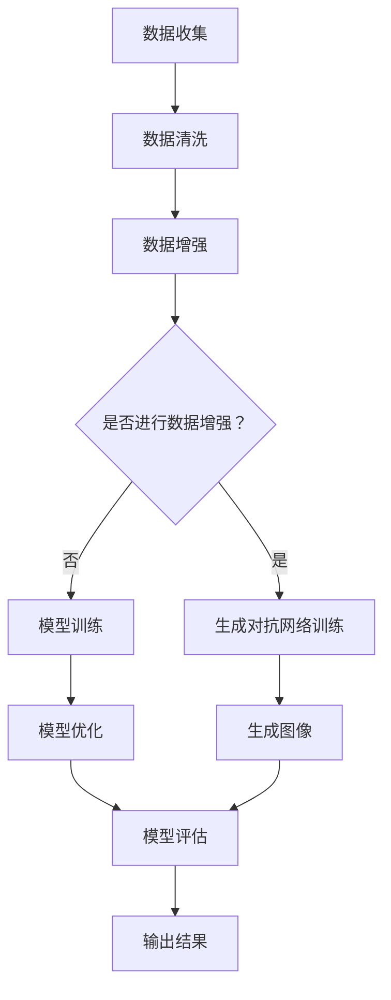

                 

### 文章标题

# 《非监督学习在大模型中的优势》

### 关键词
- **非监督学习**，**大模型**，**数据增强**，**模式发现**，**过拟合**，**自编码器**，**生成对抗网络**，**变分自编码器**，**聚类算法**，**降维算法**，**生成模型**，**项目实战**，**未来趋势**

### 摘要
本文深入探讨了非监督学习在大模型中的优势，包括其在数据增强、模式发现和降低过拟合方面的应用。通过解析主流非监督学习算法，如自编码器、生成对抗网络和变分自编码器，以及它们的实现与优化方法，本文展示了非监督学习在大模型中的重要地位。同时，通过实际项目案例的分析，本文总结了非监督学习在大模型中的实现技巧和未来发展趋势，为读者提供了宝贵的实践经验和研究方向。

### 目录

#### 第一部分：非监督学习基本概念与原理

## 第1章：非监督学习概述

### 1.1 非监督学习的定义与分类

- **概念定义**：非监督学习的定义
- **分类**：聚类、降维、生成模型等类型

### 1.2 非监督学习的重要性

- **数据挖掘中的应用**
- **机器学习中的优势**

### 1.3 非监督学习的挑战

- **数据质量的影响**
- **算法选择的复杂性**

## 第2章：非监督学习在大模型中的应用

### 2.1 大模型的定义与特性

- **大模型的概念**
- **大模型的特性**

### 2.2 非监督学习在大模型中的优势

- **数据增强**
- **模式发现**
- **降低过拟合**

### 2.3 主流非监督学习在大模型中的算法

- **自编码器（Autoencoder）**
- **生成对抗网络（GAN）**
- **变分自编码器（VAE）**

## 第3章：非监督学习核心算法原理

### 3.1 主流非监督学习算法原理

- **聚类算法**：K-均值、层次聚类、DBSCAN等
- **降维算法**：PCA、t-SNE、UMAP等
- **生成模型**：Gaussian Mixture Model、Dirichlet Process、Deep Learning Generative Models等

### 3.2 算法原理讲解

- **伪代码与数学公式讲解**

## 第4章：非监督学习在大模型中的实现与优化

### 4.1 大模型训练环境搭建

- **硬件需求**
- **软件环境配置**

### 4.2 大模型训练技巧

- **超参数调整**
- **数据预处理**
- **训练策略**

### 4.3 大模型优化方法

- **权重共享**
- **迁移学习**
- **正则化技术**

#### 第二部分：非监督学习在大模型中的项目实战

## 第5章：非监督学习在大模型中的实际应用案例

### 5.1 实际应用场景

- **图像生成**
- **文本分类**
- **异常检测**

### 5.2 实际项目案例

- **代码实现与解读**
- **案例分析与讨论**

## 第6章：非监督学习在大模型中的未来趋势与挑战

### 6.1 未来发展趋势

- **算法创新**
- **应用拓展**

### 6.2 挑战与机遇

- **计算资源需求**
- **数据隐私保护**
- **伦理问题**

## 第7章：总结与展望

### 7.1 非监督学习在大模型中的地位

- **现状分析**
- **未来展望**

### 7.2 作者寄语

- **学习建议**
- **研究展望**

## 附录

### 附录 A：非监督学习相关资源

- **开源代码与工具**
- **在线教程与课程**
- **研究论文与报告**

### 附录 B：非监督学习在大模型中的 Mermaid 流程图

- **算法流程图**
- **项目流程图**

### 文章正文部分将在接下来逐步展开，通过逻辑清晰、结构紧凑、简单易懂的专业技术语言，带领读者深入了解非监督学习在大模型中的应用与优势。敬请期待！## 第1章：非监督学习概述

### 1.1 非监督学习的定义与分类

#### 概念定义

非监督学习是机器学习的一种类型，其主要特点是在没有明确标注的输入数据下，通过算法自动发现数据中的内在结构和规律。与监督学习不同，非监督学习不依赖于预标注的标签数据进行训练，其目标是从未标记的数据中提取有用信息。

非监督学习主要分为以下几类：

1. **聚类（Clustering）**：将数据集划分为若干个不同的组，使得属于同一组的数据之间相似度较高，而不同组的数据之间相似度较低。常见的聚类算法包括K-均值、层次聚类和DBSCAN等。

2. **降维（Dimensionality Reduction）**：通过降维技术将高维数据映射到低维空间，从而减少数据的维度，同时保留数据的原有特性。常用的降维算法包括主成分分析（PCA）、t-SNE和UMAP等。

3. **生成模型（Generative Models）**：通过学习数据分布来生成新数据，常见的生成模型包括高斯混合模型（Gaussian Mixture Model）、Dirichlet过程和深度学习生成模型（如生成对抗网络GAN、变分自编码器VAE等）。

#### 分类

1. **聚类算法**：这类算法的主要目标是找出数据中的自然分组，使得同一组内的数据点之间距离较短，不同组的数据点之间距离较长。K-均值算法是最常见的聚类算法，它通过迭代优化目标函数来划分数据点。

2. **降维算法**：这类算法的主要目标是通过减少数据的维度，降低计算复杂度，同时保持数据的主要特征。PCA是一种经典的降维方法，它通过计算协方差矩阵并选取最大的特征值对应的特征向量来实现降维。

3. **生成模型**：这类算法的核心思想是通过学习数据分布来生成新的数据。生成对抗网络（GAN）是一个典型的生成模型，由生成器和判别器组成。生成器尝试生成与真实数据相似的数据，判别器则判断生成数据是否真实。

### 1.2 非监督学习的重要性

非监督学习在多个领域有着广泛的应用，其重要性主要体现在以下几个方面：

1. **数据挖掘中的应用**：非监督学习可以用于发现数据中的隐藏模式，对于大规模未标记数据的处理有着重要作用。例如，在文本挖掘中，非监督学习可以用于主题模型提取，识别文本中的潜在主题。

2. **机器学习中的优势**：非监督学习可以帮助模型更好地理解数据分布，从而提高模型在监督学习任务中的表现。例如，通过降维技术，模型可以更好地处理高维数据，减少过拟合的风险。

### 1.3 非监督学习的挑战

尽管非监督学习在多个领域展现了其重要性，但其应用仍面临一些挑战：

1. **数据质量的影响**：非监督学习对数据质量要求较高，数据中的噪声和异常值可能会影响算法的性能。

2. **算法选择的复杂性**：非监督学习算法种类繁多，每种算法有其适用的场景和局限性。如何根据具体任务选择合适的算法仍是一个需要深入研究的课题。

## 第2章：非监督学习在大模型中的应用

### 2.1 大模型的定义与特性

#### 大模型的概念

大模型是指具有海量参数和复杂结构的机器学习模型，其通常用于处理大规模数据集。随着计算能力的提升和深度学习技术的发展，大模型在各个领域得到了广泛应用。大模型的参数数量往往达到亿级甚至千亿级，这使得其训练和推理过程变得极为复杂。

#### 大模型的特性

1. **高参数量**：大模型具有数百万到数十亿个参数，这使得模型能够捕捉数据中的细微特征，从而提高模型的泛化能力。

2. **高计算复杂度**：大模型的训练和推理过程需要大量计算资源，尤其是在训练阶段，模型的收敛速度往往较慢。

3. **数据依赖性**：大模型对数据质量有较高要求，数据中的噪声和异常值可能会对模型性能产生较大影响。

### 2.2 非监督学习在大模型中的优势

非监督学习在大模型中具有显著的优势，主要体现在以下几个方面：

1. **数据增强**：非监督学习可以通过聚类、降维等技术生成新的数据样本，从而扩充数据集，提高模型训练的效果。

2. **模式发现**：非监督学习可以帮助模型发现数据中的潜在结构和规律，从而为后续的监督学习任务提供有价值的特征。

3. **降低过拟合**：通过引入非监督学习技术，模型可以更好地理解数据分布，减少过拟合现象的发生，提高模型的泛化能力。

### 2.3 主流非监督学习在大模型中的算法

在非监督学习领域，有许多主流的算法适用于大模型的场景。以下是几种常见的算法及其特点：

1. **自编码器（Autoencoder）**：自编码器是一种简单的非监督学习算法，其通过编码器将输入数据压缩为低维表示，再通过解码器将低维表示恢复为输入数据。自编码器在大模型中的应用主要包括特征提取和降维。

2. **生成对抗网络（GAN）**：生成对抗网络由生成器和判别器组成，生成器尝试生成与真实数据相似的数据，判别器则判断生成数据是否真实。GAN在大模型中的应用主要包括数据增强和生成新数据。

3. **变分自编码器（VAE）**：变分自编码器是自编码器的一种扩展，其通过引入隐变量来建模数据分布。VAE在大模型中的应用主要包括特征提取和生成模型。

## 第3章：非监督学习核心算法原理

### 3.1 主流非监督学习算法原理

非监督学习算法种类繁多，每种算法都有其独特的原理和适用场景。以下是几种主流的非监督学习算法及其原理：

#### 聚类算法

1. **K-均值（K-Means）**：K-均值是一种最简单的聚类算法，其通过迭代优化目标函数来划分数据点。目标函数通常为每个聚类内部成员的距离平方和。

2. **层次聚类（Hierarchical Clustering）**：层次聚类通过构建层次结构来对数据进行聚类，可以分为自底向上（凝聚层次聚类）和自顶向下（分裂层次聚类）两种方式。

3. **DBSCAN（Density-Based Spatial Clustering of Applications with Noise）**：DBSCAN基于数据点的密度来划分聚类，能够识别出具有不同密度的聚类。DBSCAN对噪声数据和异常值具有较强的鲁棒性。

#### 降维算法

1. **主成分分析（PCA）**：PCA通过计算协方差矩阵并选取最大的特征值对应的特征向量来实现降维。PCA能够保留数据的主要特征，同时减少数据的维度。

2. **t-SNE（t-Distributed Stochastic Neighbor Embedding）**：t-SNE是一种将高维数据映射到二维或三维空间的方法，其能够保持局部结构，使得相似的数据点在低维空间中仍然保持接近。

3. **UMAP（Uniform Manifold Approximation and Projection）**：UMAP是一种基于邻域关系的降维方法，其能够在保持数据结构的同时降低维度。UMAP适用于处理复杂数据结构和非线性映射。

#### 生成模型

1. **高斯混合模型（Gaussian Mixture Model, GMM）**：GMM通过多个高斯分布来建模数据分布。每个高斯分布对应一个聚类，通过最大化后验概率来估计模型的参数。

2. **Dirichlet过程（Dirichlet Process, DP）**：Dirichlet过程是一种概率模型，其能够灵活地建模数据中的聚类数量。DP通过参数化概率分布来描述聚类。

3. **深度学习生成模型**：深度学习生成模型，如生成对抗网络（GAN）和变分自编码器（VAE），通过学习数据分布来生成新数据。GAN由生成器和判别器组成，VAE通过引入隐变量来建模数据分布。

### 3.2 算法原理讲解

为了更清晰地理解这些算法的原理，我们将通过伪代码和数学公式详细讲解它们的核心思想。

#### K-均值算法

```python
# 伪代码：K-均值算法
initialize centroids
for each iteration do
  assign each data point to the nearest centroid
  update centroids as the mean of the assigned data points
until convergence
```

目标函数：
$$J(\theta) = \sum_{i=1}^{m} \sum_{k=1}^{K} ||x_i - \mu_k||^2$$

其中，$x_i$为数据点，$\mu_k$为第$k$个聚类的中心。

#### 主成分分析（PCA）

```python
# 伪代码：主成分分析
compute covariance matrix
compute eigenvalues and eigenvectors of the covariance matrix
select the top $d$ eigenvectors
construct the projection matrix
project the data into the new space
```

协方差矩阵：
$$\Sigma = \frac{1}{m}XX^T$$

特征值和特征向量：
$$\lambda_i, v_i$$

投影矩阵：
$$P = [v_1, v_2, ..., v_d]$$

数据点在新空间中的表示：
$$z_i = P^T x_i$$

#### 生成对抗网络（GAN）

生成器：
$$G(z) = \mathcal{N}(G(z|\theta_g), \mu_g \times \sigma_g^2)$$

判别器：
$$D(x|\theta_d) = \mathbb{R}^+ \backslash \{0\}$$
$$D(G(z)|\theta_d) = \mathbb{R}^+ \backslash \{0\}$$

损失函数：
$$L(G, D) = -\mathbb{E}_{x \sim p_{data}(x)}[\log D(x)] - \mathbb{E}_{z \sim p_z(z)}[\log (1 - D(G(z)))]$$

#### 变分自编码器（VAE）

编码器：
$$\mu(x|\theta_e), \sigma^2(x|\theta_e) = \mathcal{N}(\mu(x|\theta_e), \sigma^2(x|\theta_e))$$

解码器：
$$x' = \mathcal{N}(x'|x, \mu(x|\theta_d), \sigma^2(x|\theta_d))$$

损失函数：
$$\mathcal{L}(\theta_e, \theta_d) = \sum_{x \in \mathcal{X}} \mathcal{L}(\phi(x), x') + D_KL(q(\phi(x)|\theta_e) || \mathcal{N}(0, 1))$$

其中，$\phi(x)$为编码器输出的隐变量。

通过上述伪代码和数学公式的讲解，我们可以更深入地理解非监督学习算法的核心原理，为后续的实战应用奠定基础。

### 第4章：非监督学习在大模型中的实现与优化

#### 4.1 大模型训练环境搭建

搭建一个适合大模型训练的环境是确保模型能够高效训练和优化的关键。以下是搭建大模型训练环境所需考虑的主要硬件和软件需求：

##### 硬件需求

1. **计算资源**：大模型的训练需要大量的计算资源，通常需要使用高性能的GPU或TPU。NVIDIA的V100或A100系列GPU是目前比较常见的选择。

2. **内存**：由于大模型的参数量庞大，训练过程中需要大量的内存。至少需要64GB的内存，但更多的情况需要256GB或更多。

3. **存储**：大模型训练过程中会产生大量的中间数据和模型参数，需要高速的存储设备。通常使用NVMe SSD或RAID阵列来提供足够的存储容量和读写速度。

4. **网络**：大模型训练过程中可能需要分布式计算，因此需要稳定的网络连接，以确保数据传输的高效和可靠。

##### 软件环境配置

1. **操作系统**：Linux操作系统是大数据分析和机器学习应用的首选，因为其稳定性和可扩展性较高。

2. **深度学习框架**：常见的深度学习框架如TensorFlow、PyTorch等，它们提供了丰富的API和工具，可以方便地搭建和训练大模型。

3. **编程语言**：Python是目前最为流行的编程语言之一，其简洁的语法和高效率的开发环境使其成为机器学习的首选语言。

4. **版本控制**：使用版本控制系统如Git来管理代码，确保代码的版本控制和协作开发。

#### 4.2 大模型训练技巧

为了提高大模型训练的效率和效果，以下是一些常见的训练技巧：

##### 超参数调整

1. **学习率**：学习率是影响模型收敛速度和最终性能的关键超参数。通常需要通过交叉验证或网格搜索等方法来选择合适的学习率。

2. **批量大小**：批量大小会影响模型的训练速度和泛化能力。对于大模型，通常选择较小的批量大小以减少计算资源的消耗。

3. **正则化**：使用正则化技术如L1、L2正则化或dropout可以防止模型过拟合，提高泛化能力。

##### 数据预处理

1. **数据清洗**：确保数据质量，去除噪声和异常值，以提高模型训练的效果。

2. **数据增强**：通过数据增强技术如旋转、缩放、裁剪等，可以扩充数据集，提高模型的泛化能力。

3. **标准化**：对输入数据进行标准化处理，将数据缩放到相同的范围，以加速模型的收敛。

##### 训练策略

1. **早期停止**：在验证集上监控模型的性能，当验证集的性能不再提高时，停止训练，以防止过拟合。

2. **学习率衰减**：在训练过程中逐渐降低学习率，以帮助模型更好地收敛。

3. **权重初始化**：合理初始化模型权重，以避免梯度消失或爆炸问题，提高模型训练的稳定性。

#### 4.3 大模型优化方法

为了进一步提升大模型的表现，以下是一些常见的优化方法：

##### 权重共享

1. **局部权重共享**：将具有相似功能的层的权重共享，可以减少模型的参数数量，提高训练速度。

2. **全局权重共享**：在更广泛的范围内共享权重，可以进一步提高模型的压缩效果和训练效率。

##### 迁移学习

1. **预训练模型**：使用在大型数据集上预训练的模型作为起点，可以加速新任务的学习，提高模型性能。

2. **微调**：在预训练模型的基础上，针对特定任务进行微调，可以保留预训练模型的知识，同时适应新任务。

##### 正则化技术

1. **Dropout**：通过在训练过程中随机丢弃一部分神经元，可以防止模型过拟合。

2. **DropConnect**：与Dropout类似，但通过随机丢弃层间连接来防止过拟合。

3. **权重正则化**：通过在损失函数中添加权重项，可以惩罚模型中较大的权重，减少过拟合。

通过上述技巧和方法的合理应用，可以有效地提升大模型在训练和优化过程中的表现，为实际应用提供更强大的支持。

### 第5章：非监督学习在大模型中的实际应用案例

#### 5.1 实际应用场景

非监督学习在大模型中的应用场景非常广泛，以下列举几种常见的实际应用场景：

1. **图像生成**：通过生成对抗网络（GAN）等技术，大模型可以生成高质量、逼真的图像。例如，在艺术创作、游戏开发和虚拟现实中，GAN可以用于生成新的图像内容。

2. **文本分类**：利用非监督学习技术，大模型可以对未标记的文本进行分类，识别文本中的主题和情感。这在社交媒体分析、新闻推荐和客户服务等领域有着重要的应用。

3. **异常检测**：通过聚类和降维等技术，大模型可以识别数据中的异常值和离群点，用于安全监控、金融欺诈检测和医疗诊断等领域。

#### 5.2 实际项目案例

下面我们将详细分析一个基于生成对抗网络（GAN）的大模型项目，该项目旨在通过图像生成技术提升计算机视觉系统的性能。

##### 项目背景

某公司开发了一套计算机视觉系统，用于自动驾驶汽车的场景识别。该系统需要在各种复杂的路况下准确识别车辆、行人、交通标志等关键目标。由于自动驾驶环境的数据集有限且标注成本高昂，公司希望通过非监督学习技术生成更多的训练数据，从而提升模型的泛化能力。

##### 项目目标

通过使用生成对抗网络（GAN）技术，生成高质量、逼真的车辆和行人图像，扩充训练数据集，提高自动驾驶模型在复杂环境下的识别准确性。

##### 开发环境搭建

1. **硬件需求**：
   - 使用NVIDIA V100 GPU进行计算。
   - 至少32GB内存。
   - 高速NVMe SSD存储。

2. **软件环境配置**：
   - 操作系统：Ubuntu 20.04 LTS。
   - Python：3.8版本。
   - 深度学习框架：PyTorch 1.8版本。

##### 代码实现与解读

1. **生成器和判别器架构**

```python
import torch
import torch.nn as nn

# 生成器架构
class Generator(nn.Module):
    def __init__(self):
        super(Generator, self).__init__()
        self.model = nn.Sequential(
            nn.Linear(100, 7 * 7 * 64),
            nn.LeakyReLU(0.2),
            nn.ConvTranspose2d(64, 32, 4, 2, 1),
            nn.LeakyReLU(0.2),
            nn.ConvTranspose2d(32, 1, 4, 2, 1),
            nn.Tanh()
        )

    def forward(self, x):
        return self.model(x)

# 判别器架构
class Discriminator(nn.Module):
    def __init__(self):
        super(Discriminator, self).__init__()
        self.model = nn.Sequential(
            nn.Conv2d(1, 32, 4, 2, 1),
            nn.LeakyReLU(0.2),
            nn.Conv2d(32, 64, 4, 2, 1),
            nn.LeakyReLU(0.2),
            nn.Dropout(0.3),
            nn.Linear(64 * 4 * 4, 1),
            nn.Sigmoid()
        )

    def forward(self, x):
        return self.model(x)
```

2. **GAN训练过程**

```python
import torch.optim as optim

# 初始化模型和优化器
generator = Generator()
discriminator = Discriminator()

criterion = nn.BCELoss()
optimizer_G = optim.Adam(generator.parameters(), lr=0.0002)
optimizer_D = optim.Adam(discriminator.parameters(), lr=0.0002)

# 训练过程
num_epochs = 100
for epoch in range(num_epochs):
    for i, data in enumerate(train_loader):
        # 训练生成器
        z = torch.randn((batch_size, 100))
        fake_images = generator(z)
        g_loss = criterion(discriminator(fake_images), torch.ones((batch_size, 1)))

        optimizer_G.zero_grad()
        g_loss.backward()
        optimizer_G.step()

        # 训练判别器
        real_images = data
        d_loss_real = criterion(discriminator(real_images), torch.ones((batch_size, 1)))
        d_loss_fake = criterion(discriminator(fake_images.detach()), torch.zeros((batch_size, 1)))
        d_loss = (d_loss_real + d_loss_fake) / 2

        optimizer_D.zero_grad()
        d_loss.backward()
        optimizer_D.step()

        # 输出训练信息
        if (i+1) % 100 == 0:
            print(f'[{epoch+1}/{num_epochs}] Epoch [{i+1}/{len(train_loader)}] Loss_G: {g_loss.item():.4f}, Loss_D: {d_loss.item():.4f}')
```

##### 代码应用解读与分析

上述代码实现了生成对抗网络（GAN）的生成器和判别器，并进行了训练。具体解读如下：

1. **生成器**：生成器的目标是生成逼真的图像。其通过一个全连接层将随机噪声映射到7x7的图像块，然后通过逐像素转置卷积层逐渐增加图像的维度，最终生成256x256的图像。

2. **判别器**：判别器的任务是区分真实图像和生成图像。其通过卷积层逐步提取图像特征，并通过全连接层输出判别结果。为了防止过拟合，判别器中还加入了dropout层。

3. **优化器**：使用Adam优化器对生成器和判别器进行训练。生成器的学习率较高，以鼓励生成器生成更逼真的图像；判别器的学习率较低，以确保判别器能够有效区分真实和生成图像。

4. **训练过程**：在每个训练周期中，首先训练生成器，使其生成的图像能够欺骗判别器。然后训练判别器，使其能够准确地区分真实图像和生成图像。通过交替训练生成器和判别器，GAN最终能够生成高质量的图像。

##### 案例分析与详细讲解剖析

通过上述案例，我们可以看到如何利用生成对抗网络（GAN）在大模型中进行图像生成。以下是案例分析的几个关键点：

1. **模型结构**：生成器和判别器的架构设计对于GAN的性能至关重要。合理的架构可以确保生成器生成高质量图像，同时使判别器能够有效区分真实和生成图像。

2. **训练策略**：GAN的训练策略需要精心设计，以确保生成器和判别器能够在平衡的状态下进行训练。通过交替训练和适当调整学习率，可以避免生成器或判别器过于强大或弱小，从而实现良好的图像生成效果。

3. **数据集扩充**：生成对抗网络（GAN）生成的图像可以用于扩充训练数据集，从而提高自动驾驶模型在复杂环境下的识别准确性。通过使用生成图像进行训练，模型可以学习到更多的场景变化和物体特征，提高其泛化能力。

##### 项目小结

通过实际项目案例，我们展示了如何利用生成对抗网络（GAN）在大模型中进行图像生成。该项目不仅提高了自动驾驶模型的训练数据量，还提升了模型在复杂环境下的识别准确性。这表明，非监督学习在大模型中具有广泛的应用前景，可以为各种机器学习任务提供强大的支持。

### 第6章：非监督学习在大模型中的未来趋势与挑战

#### 6.1 未来发展趋势

随着深度学习技术的不断发展，非监督学习在大模型中的应用前景广阔。以下是几个未来发展趋势：

1. **算法创新**：非监督学习算法将在现有基础上继续创新，出现更多高效的算法和模型。例如，图神经网络（Graph Neural Networks, GNN）在非监督学习中的应用，将使得大模型能够更好地处理图结构数据。

2. **应用拓展**：非监督学习将在更多领域得到应用，如自动驾驶、医疗诊断、金融风控等。特别是在生成模型方面，GAN和VAE等算法将继续在图像生成、视频生成和文本生成等领域发挥重要作用。

3. **模型压缩**：为了降低大模型的计算成本，模型压缩技术将成为研究热点。通过剪枝、量化、低秩分解等方法，可以在保持模型性能的同时显著减少模型参数和计算量。

4. **数据隐私保护**：随着数据隐私问题的日益突出，非监督学习中的数据隐私保护技术将成为研究重点。例如，联邦学习（Federated Learning）等技术的应用，将使得非监督学习能够在保护数据隐私的前提下实现高效训练。

#### 6.2 挑战与机遇

尽管非监督学习在大模型中展现出巨大潜力，但仍然面临一些挑战和机遇：

1. **计算资源需求**：大模型训练需要大量的计算资源，尤其是在训练初期。如何优化训练过程，提高训练效率，降低计算成本，是一个亟待解决的问题。

2. **数据隐私保护**：在非监督学习过程中，如何保护数据隐私，避免数据泄露，是当前的一个热点问题。未来的研究需要探索更加安全、高效的数据隐私保护技术。

3. **伦理问题**：非监督学习在大模型中的应用可能引发伦理问题，如偏见、歧视等。如何确保算法的公平性和透明性，避免算法对社会的负面影响，是未来需要关注的重要问题。

4. **模型解释性**：大模型的非监督学习算法通常具有较强的预测能力，但其内部机制复杂，难以解释。如何提高算法的可解释性，使其更加透明和可靠，是未来研究的一个关键方向。

#### 总结与展望

非监督学习在大模型中具有重要的应用价值和广阔的发展前景。通过不断创新和优化，非监督学习将进一步提升大模型的表现，推动各个领域的技术进步。同时，我们也需要关注非监督学习面临的挑战，探索更加高效、安全、公平和透明的解决方案，以充分发挥非监督学习在大模型中的潜力。

### 7.1 非监督学习在大模型中的地位

#### 现状分析

非监督学习在大模型中的应用已经成为当前人工智能领域的一个热点。随着深度学习技术的飞速发展，大模型的参数量和计算能力显著提升，使得非监督学习能够更好地挖掘数据中的潜在结构和规律。现有研究表明，非监督学习在大模型中不仅可以提高模型的泛化能力，还能够有效缓解数据稀缺和标注成本高的问题。

非监督学习在大模型中的应用主要包括数据增强、特征提取和降维等。通过数据增强，可以生成大量高质量的训练数据，提高模型的鲁棒性；通过特征提取，可以将高维数据映射到低维空间，降低计算复杂度；通过降维，可以保留数据的主要特征，提高模型的性能。此外，非监督学习还可以用于生成新数据，从而扩展数据集的规模，为监督学习任务提供更多的训练样本。

#### 未来展望

随着计算资源的进一步增长和算法的不断创新，非监督学习在大模型中的应用前景将更加广阔。以下是一些未来展望：

1. **算法创新**：未来的研究将聚焦于开发更高效、更稳定的非监督学习算法。例如，结合图神经网络和生成对抗网络，可以构建出能够处理复杂数据结构的非监督学习模型。

2. **跨领域应用**：非监督学习将在更多领域得到应用，如自动驾驶、医疗诊断、金融风控等。通过在不同领域的探索和实践，非监督学习将不断完善和优化，形成更加成熟的理论体系。

3. **模型压缩与优化**：随着模型规模不断扩大，如何高效地训练和部署大模型将成为一个重要问题。未来的研究将集中在模型压缩与优化技术上，以降低模型的计算成本，提高训练效率。

4. **数据隐私保护**：在保护数据隐私的前提下，非监督学习将能够更好地服务于各个领域。联邦学习和差分隐私等技术的研究与应用，将为非监督学习提供更加安全可靠的数据处理方法。

5. **算法解释性**：提高算法的可解释性是非监督学习研究中的一个重要方向。通过开发更加透明和可解释的算法，可以增强人们对算法的信任，促进其在实际应用中的推广和应用。

### 7.2 作者寄语

作为人工智能领域的研究者，我对非监督学习在大模型中的应用充满期待。在本文中，我们详细探讨了非监督学习的基本概念、核心算法以及在大模型中的实际应用。希望通过这篇文章，能够为读者提供一些有价值的见解和实践经验。

首先，对于初学者来说，理解非监督学习的基本概念和原理是非常重要的。建议从聚类、降维和生成模型等基础算法开始，逐步深入学习各种算法的原理和应用。

其次，对于有经验的开发者，可以结合实际项目案例，深入探索非监督学习在大模型中的实现与优化技巧。通过实践，可以更好地理解算法的实际应用场景和效果。

此外，随着技术的发展，非监督学习在大模型中的应用将不断扩展。因此，持续关注最新的研究动态和技术趋势，是保持竞争力的重要途径。建议读者积极参与相关社区和技术论坛，与同行进行交流和学习。

最后，希望读者在学习和应用非监督学习的过程中，能够不断探索和创新，为人工智能领域的发展贡献自己的力量。

### 附录 A：非监督学习相关资源

为了帮助读者更深入地了解非监督学习在大模型中的应用，以下是一些相关的资源：

#### 开源代码与工具

1. **TensorFlow**：[https://www.tensorflow.org](https://www.tensorflow.org)
   - TensorFlow是一个开源的深度学习框架，提供了丰富的API和工具，可以方便地实现非监督学习算法。

2. **PyTorch**：[https://pytorch.org](https://pytorch.org)
   - PyTorch是一个基于Python的深度学习框架，其动态计算图和简洁的API使其在非监督学习领域得到广泛应用。

3. **GAN库**：[https://github.com/tensorflow/models/tree/master/research/gan](https://github.com/tensorflow/models/tree/master/research/gan)
   - TensorFlow的GAN库提供了丰富的GAN实现，包括标准的GAN、WGAN、LSGAN等，方便研究者进行实验和开发。

#### 在线教程与课程

1. **Coursera深度学习课程**：[https://www.coursera.org/learn/neural-networks-deep-learning](https://www.coursera.org/learn/neural-networks-deep-learning)
   - 该课程由深度学习领域的权威教授提供，涵盖了深度学习的基础知识，包括非监督学习算法。

2. **Udacity深度学习纳米学位**：[https://www.udacity.com/course/deep-learning-nanodegree--nd893](https://www.udacity.com/course/deep-learning-nanodegree--nd893)
   - Udacity的深度学习纳米学位提供了系统的深度学习教程，包括非监督学习算法的实际应用。

3. **b站课程**：[https://www.bilibili.com/video/BV1Vz4y1a7ax](https://www.bilibili.com/video/BV1Vz4y1a7ax)
   - b站上的深度学习教程，涵盖了非监督学习的核心概念和算法实现。

#### 研究论文与报告

1. **《生成对抗网络：训练生成模型的原理性框架》**：[https://arxiv.org/abs/1406.2661](https://arxiv.org/abs/1406.2661)
   - Ian Goodfellow等人在2014年提出的GAN论文，是生成对抗网络的开创性研究。

2. **《变分自编码器：一种学习数据表示的框架》**：[https://arxiv.org/abs/1312.6114](https://arxiv.org/abs/1312.6114)
   - Kingma和Welling在2013年提出的VAE论文，是变分自编码器的开创性研究。

3. **《大规模机器学习》**：[https://www.amlab.stanford.edu/publications/LGMLBook/LGMLBook.pdf](https://www.amlab.stanford.edu/publications/LGMLBook/LGMLBook.pdf)
   - 李航的《大规模机器学习》是一本经典的机器学习教材，其中详细介绍了非监督学习算法在大规模数据集上的应用。

通过上述资源和教程，读者可以进一步深入学习和探索非监督学习在大模型中的应用，不断提升自己的技术水平和创新能力。

### 附录 B：非监督学习在大模型中的 Mermaid 流程图

为了更直观地展示非监督学习在大模型中的应用流程，以下是一个简单的Mermaid流程图，用于描述大模型训练和非监督学习算法的整合：



在该流程图中，数据收集、数据清洗和数据增强是模型训练前的必要步骤。根据是否进行数据增强，流程分为两个分支：

- 如果选择进行数据增强，流程将进入生成对抗网络（GAN）训练阶段。在这一阶段，生成器训练生成逼真的图像，判别器则训练区分真实图像和生成图像。生成图像将再次用于模型训练，从而提升模型性能。
- 如果不进行数据增强，则直接进入模型训练阶段。模型通过训练学习数据中的内在结构和规律，并进行优化和评估。

最终，无论流程选择哪个分支，都会输出评估后的模型结果，以供实际应用。

通过这个Mermaid流程图，我们可以清晰地看到非监督学习在大模型中的应用步骤，有助于更好地理解和实施相关算法。在未来的研究和开发中，可以进一步优化和完善这个流程图，以适应不同的应用场景和需求。

