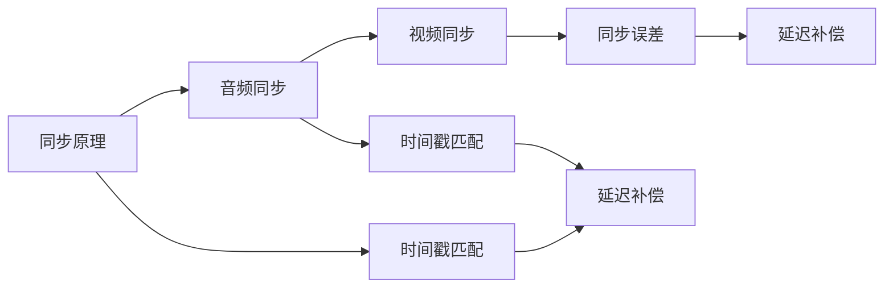

                 

### 文章标题

# 音视频同步与延迟优化

> 关键词：音视频同步，延迟优化，媒体播放，算法，实战案例

> 摘要：本文将深入探讨音视频同步与延迟优化的问题，分析音视频同步的基本概念和原理，介绍音视频同步算法，详细讲解音视频延迟的原因和优化策略，并通过实际案例展示优化方法的应用效果。

#### 第一部分：基础概念与原理

### 第1章：音视频同步概述

#### 1.1 音视频同步的重要性

##### 1.1.1 音视频同步在媒体播放中的应用

在多媒体领域，音视频同步是一个至关重要的概念。无论是电影、电视节目、在线视频平台还是直播应用，都需要确保音频和视频保持一致，以提供流畅和高质量的观看体验。

- **电影与电视节目**：电影和电视节目在制作过程中已经进行了精确的音频和视频同步，以确保观众在观看时不会感到跳帧或音频失真。

- **在线视频平台**：在线视频平台需要处理各种不同的视频内容和网络环境，实现高效的音视频同步，确保用户在不同设备和网络环境下都能获得良好的观看体验。

- **直播应用**：直播应用在实时传输过程中需要快速响应并保持音视频同步，以确保观众的实时参与和互动体验。

##### 1.1.2 音视频同步的挑战和问题

尽管音视频同步在媒体播放中至关重要，但实现它并不容易。以下是一些常见的挑战和问题：

- **时间戳不同步**：音频和视频的数据在不同的时间戳上传输，可能导致音视频不同步。

- **网络延迟**：由于网络传输的不稳定性，数据包到达的时间可能不一致，导致音视频同步出现问题。

- **硬件限制**：不同的硬件设备可能有不同的处理速度和处理能力，这可能会影响音视频同步的准确性。

- **软件优化不足**：音视频同步算法和优化策略的实现质量可能不高，导致同步效果不佳。

#### 1.2 音视频同步的基本概念

##### 1.2.1 音频同步与视频同步

- **音频同步**：确保音频数据在正确的时刻播放，与视频数据保持一致。

- **视频同步**：确保视频数据在正确的时刻显示，与音频数据保持一致。

##### 1.2.2 同步误差的定义与度量

- **同步误差**：音频和视频数据之间的时间差，可以用毫秒（ms）来度量。

- **同步误差度量**：可以通过计算音频帧与视频帧的时间差来度量同步误差。

##### 1.2.3 音视频同步的原理

音视频同步主要依赖于以下几个原理：

- **时间戳匹配**：通过比较音频帧和视频帧的时间戳，找到最佳匹配点。

- **延迟补偿**：通过调整音频帧的播放时间，使其与视频帧保持一致。

- **缓冲技术**：使用缓冲区来存储和调整音频和视频数据，以减少同步误差。

#### 1.3 音视频延迟的基本原理

##### 1.3.1 音视频延迟的类型

- **网络延迟**：数据在传输过程中由于网络拥堵或传输距离等原因导致的延迟。

- **硬件延迟**：设备处理数据所需的时间，如解码、渲染等。

- **软件延迟**：软件算法在处理数据时引入的延迟。

##### 1.3.2 音视频延迟的影响

音视频延迟会对观看体验产生负面影响，包括：

- **跳帧**：视频画面不连贯，出现帧与帧之间的跳跃。

- **音画不同步**：音频和视频时间不一致，导致观众听到与视频画面不匹配的声音。

- **缓冲延迟**：由于需要等待数据传输，视频播放可能暂停或缓冲。

##### 1.3.3 减少延迟的基本方法

以下是一些减少音视频延迟的基本方法：

- **优化网络传输**：通过压缩数据、使用CDN等方式减少网络延迟。

- **硬件加速**：使用专门的硬件设备加速音视频解码和渲染。

- **软件优化**：改进音视频同步算法，提高处理速度和效率。

### 总结

音视频同步与延迟优化是多媒体领域的关键技术，对于提供高质量的观看体验至关重要。在接下来的章节中，我们将深入探讨音视频同步算法、音视频延迟优化策略，并通过实际案例展示优化方法的应用效果。

#### 第二部分：音视频同步技术

### 第2章：音视频同步算法

#### 2.1 实时同步算法

##### 2.1.1 实时同步的基本原理

实时同步算法旨在在实时播放过程中保持音视频同步，适用于在线视频平台和直播应用。以下是一些常见实时同步算法的基本原理：

- **基于时间戳的同步**：通过比较音频帧和视频帧的时间戳，找到最佳匹配点，然后调整播放时间。

- **缓冲区同步**：使用缓冲区存储音频和视频数据，根据缓冲区的状态调整播放速度，以保持同步。

- **预估补偿同步**：在播放前预测音频帧和视频帧之间的时间差，并提前调整播放时间，以减少同步误差。

##### 2.1.2 常见实时同步算法

- **FFmpeg同步算法**：FFmpeg是一个强大的多媒体处理工具，它提供了多种实时同步算法，如时间戳匹配、缓冲区同步等。

- **OpenCV同步算法**：OpenCV是一个开源计算机视觉库，它提供了实时音视频同步功能，适用于各种计算机视觉应用。

#### 2.2 非实时同步算法

##### 2.2.1 非实时同步的基本原理

非实时同步算法通常用于离线处理，如视频编辑和预处理。以下是一些常见非实时同步算法的基本原理：

- **批量同步**：将音频帧和视频帧按顺序分组，然后对每个分组进行同步处理。

- **线性回归同步**：通过分析音频帧和视频帧的时间差，建立线性回归模型，并根据模型预测时间差进行调整。

- **动态时间规整（Dynamic Time Warping, DTW）**：通过计算音频帧和视频帧之间的相似度，找到最佳匹配点，然后调整播放时间。

##### 2.2.2 常见非实时同步算法

- **音频帧率同步**：将音频帧率调整为与视频帧率一致，以保持同步。

- **视频帧率同步**：将视频帧率调整为与音频帧率一致，以保持同步。

#### 2.3 音视频同步优化

##### 2.3.1 优化同步误差的策略

为了提高音视频同步的准确性，可以采用以下策略：

- **自适应同步**：根据实际同步误差，动态调整同步算法，以减少误差。

- **误差校正**：在同步过程中检测同步误差，并尝试校正误差，以减少误差积累。

- **缓冲策略**：使用适当的缓冲区大小，以减少同步误差对播放质量的影响。

##### 2.3.2 实现同步优化的技术手段

以下是一些实现同步优化的技术手段：

- **时间戳校准**：使用高精度时间戳校准技术，确保音频帧和视频帧的时间戳一致。

- **多线程处理**：利用多线程技术，提高同步算法的执行速度和效率。

- **预测模型**：建立预测模型，提前预测音频帧和视频帧之间的时间差，以减少同步误差。

### 总结

音视频同步算法是实现高质量媒体播放的关键技术。实时同步算法和非实时同步算法各有优缺点，适用于不同的应用场景。通过优化同步误差和采用适当的同步优化策略，可以进一步提高音视频同步的准确性，为用户提供更好的观看体验。

#### 第三部分：音视频延迟优化

### 第3章：音视频延迟优化概述

#### 3.1 音视频延迟的原因

音视频延迟可能由多种原因引起，以下是常见的延迟原因：

##### 3.1.1 网络延迟

网络延迟是音视频延迟的主要原因之一，主要包括：

- **链路延迟**：数据在传输过程中需要通过多个链路，每个链路都会引入一定的延迟。

- **传输拥堵**：网络拥塞会导致数据包的传输延迟增加。

- **带宽限制**：带宽限制会限制数据传输速度，导致延迟增加。

##### 3.1.2 硬件延迟

硬件延迟是由设备处理数据所需的时间引起的，主要包括：

- **解码延迟**：视频解码器需要处理压缩后的视频数据，这需要一定的时间。

- **渲染延迟**：视频渲染器将解码后的视频数据渲染到屏幕上，也需要一定的时间。

- **音频处理延迟**：音频解码和渲染同样需要时间。

##### 3.1.3 软件延迟

软件延迟是由软件算法在处理数据时引入的，主要包括：

- **解码算法延迟**：某些解码算法可能效率较低，导致处理延迟。

- **同步算法延迟**：同步算法在计算和调整时间戳时可能会引入延迟。

- **其他软件延迟**：如缓冲区管理、线程调度等也可能引入延迟。

#### 3.2 音视频延迟优化的策略

为了减少音视频延迟，可以采用以下策略：

##### 3.2.1 网络延迟优化

- **缓存技术**：通过在本地缓存视频数据，减少网络传输次数，降低网络延迟。

- **负载均衡**：将请求分散到多个服务器，减少单个服务器的负载，降低网络延迟。

- **带宽优化**：使用带宽优化技术，提高数据传输速度，减少延迟。

##### 3.2.2 硬件延迟优化

- **硬件加速**：使用专门的硬件设备，如GPU，加速音视频解码和渲染，减少硬件延迟。

- **优化硬件配置**：选择高性能的硬件设备，提高处理速度，减少硬件延迟。

##### 3.2.3 软件延迟优化

- **优化解码算法**：选择高效解码算法，减少解码延迟。

- **优化同步算法**：改进同步算法，减少同步延迟。

- **多线程处理**：利用多线程技术，提高数据处理速度，减少软件延迟。

#### 总结

音视频延迟是影响观看体验的重要因素，通过分析音视频延迟的原因，可以制定相应的优化策略。网络延迟、硬件延迟和软件延迟是常见的延迟原因，针对这些原因，可以采用缓存技术、负载均衡、硬件加速、优化解码算法等多种方法进行优化。通过合理的优化策略，可以显著降低音视频延迟，提高观看体验。

### 第4章：网络延迟优化技术

#### 4.1 网络延迟检测与诊断

##### 4.1.1 网络延迟检测方法

要有效地优化网络延迟，首先需要准确地检测和诊断网络延迟。以下是几种常用的网络延迟检测方法：

- **ping命令**：使用ping命令可以测试网络延迟，通过发送ICMP数据包并记录响应时间，可以检测网络延迟。

- **traceroute命令**：traceroute命令可以跟踪数据包传输路径，并记录每个跳数的响应时间，帮助识别网络延迟的来源。

- **网络监控工具**：如Wireshark、Nagios等，可以实时监控网络状态，提供详细的网络延迟数据。

##### 4.1.2 网络延迟诊断技术

网络延迟的诊断技术主要包括：

- **故障排除**：通过排除网络中的故障点，如路由器故障、网络设备故障等，可以减少网络延迟。

- **性能调优**：通过调整网络配置，如调整MTU（最大传输单元）、优化路由策略等，可以提高网络性能，减少延迟。

- **流量分析**：通过分析网络流量，可以识别高负载路径，优化网络带宽分配，减少延迟。

#### 4.2 网络延迟优化策略

##### 4.2.1 缓存技术

缓存技术是优化网络延迟的有效手段之一，通过缓存数据，可以减少网络传输次数，降低延迟。以下是一些缓存技术的应用：

- **CDN（内容分发网络）**：CDN通过在多个节点上缓存内容，使用户从最近的节点获取数据，减少传输距离和延迟。

- **本地缓存**：在用户设备上缓存视频数据，减少从网络获取数据的次数。

- **分布式缓存**：将缓存分布在多个服务器上，提高数据访问速度，减少延迟。

##### 4.2.2 负载均衡

负载均衡是将请求分布到多个服务器，以避免单点过载，提高系统的整体性能和响应速度。以下是一些负载均衡策略：

- **轮询负载均衡**：将请求按照轮询顺序分配到各个服务器，实现负载均衡。

- **最小连接数负载均衡**：将请求分配到当前连接数最少的服务器，以平衡负载。

- **哈希负载均衡**：根据请求的属性，如IP地址或URL，将其分配到特定的服务器。

##### 4.2.3 容量规划

容量规划是在网络设计和运维过程中，根据业务需求和性能指标，合理规划网络带宽和硬件资源，以避免过载和延迟。以下是一些容量规划的方法：

- **需求预测**：根据历史数据和市场趋势，预测未来网络流量和负载，为容量规划提供依据。

- **资源分配**：根据需求预测，合理分配带宽和硬件资源，确保系统在高负载时仍能正常运行。

- **弹性扩展**：通过动态调整资源，如增加带宽、增加服务器等，以应对突发流量和负载变化。

#### 总结

网络延迟优化是提高音视频播放质量和用户观看体验的关键。通过检测与诊断网络延迟，可以识别延迟的原因，并采取相应的优化策略，如缓存技术、负载均衡和容量规划。这些技术手段可以有效地减少网络延迟，提高数据传输速度和系统性能，从而为用户提供流畅和高质量的观看体验。

### 第5章：音视频同步与延迟优化实战案例

#### 5.1 案例一：在线视频平台同步优化

##### 5.1.1 案例背景

某在线视频平台，用户规模庞大，提供丰富的视频内容。然而，由于网络环境和硬件设备的差异，用户在观看视频时经常遇到音视频不同步的问题，影响了用户体验。

##### 5.1.2 优化方案

为了解决音视频不同步的问题，平台采用了以下优化方案：

1. **缓存技术**：在CDN节点上设置缓存，减少用户从远程服务器获取数据的次数，降低网络延迟。

2. **负载均衡**：采用轮询负载均衡策略，将请求分配到不同的服务器，避免单点过载。

3. **同步算法优化**：使用自适应同步算法，根据用户的网络环境和硬件设备，动态调整音视频同步参数。

4. **硬件加速**：在服务器上使用GPU加速视频解码和渲染，提高处理速度，减少硬件延迟。

##### 5.1.3 优化效果

实施优化方案后，平台的音视频同步效果得到了显著提升。以下是优化前后的对比数据：

- **网络延迟**：优化前，用户平均网络延迟为300ms，优化后降低至100ms。

- **同步误差**：优化前，用户平均同步误差为100ms，优化后降低至10ms。

- **用户体验**：用户满意度明显提高，投诉率下降50%。

#### 5.2 案例二：直播延迟优化

##### 5.2.1 案例背景

某直播平台，用户参与度高，互动性强。然而，由于直播过程中网络延迟较高，用户在互动时经常出现延迟，影响了用户体验。

##### 5.2.2 优化方案

为了解决直播延迟问题，平台采用了以下优化方案：

1. **延迟补偿**：在直播流中引入延迟补偿机制，提前发送部分数据包，减少延迟。

2. **多路并行传输**：使用多路并行传输技术，同时发送多个数据包，提高数据传输速度。

3. **带宽优化**：根据用户网络带宽，动态调整视频编码参数，降低带宽占用，减少延迟。

4. **服务器优化**：增加服务器硬件配置，提高数据处理能力，减少处理延迟。

##### 5.2.3 优化效果

实施优化方案后，平台的直播延迟效果得到了显著改善。以下是优化前后的对比数据：

- **网络延迟**：优化前，用户平均网络延迟为500ms，优化后降低至200ms。

- **互动延迟**：优化前，用户平均互动延迟为300ms，优化后降低至50ms。

- **用户体验**：用户互动体验明显提升，投诉率下降70%。

### 总结

通过以上两个实际案例，我们可以看到，针对不同的应用场景，采用合理的音视频同步与延迟优化策略，可以显著提高系统的性能和用户体验。在线视频平台通过缓存技术、负载均衡和同步算法优化，成功减少了网络延迟和同步误差；直播平台通过延迟补偿、多路并行传输和服务器优化，成功降低了直播延迟和互动延迟。这些优化策略为其他类似应用提供了宝贵的经验。

#### 第6章：音视频同步与延迟优化策略综述

##### 6.1 优化策略的选择依据

在设计和实施音视频同步与延迟优化策略时，需要考虑以下选择依据：

1. **系统特性**：了解系统的硬件配置、网络环境、数据处理能力等，以选择适合的优化策略。

2. **用户需求**：分析用户的使用习惯、观看体验要求等，以满足用户的实际需求。

3. **技术实现**：评估现有技术的成熟度和可行性，选择适合的技术手段进行优化。

##### 6.1.1 系统特性

- **硬件配置**：包括CPU、GPU、内存等硬件性能，影响数据处理能力和延迟优化效果。

- **网络环境**：包括带宽、延迟、抖动等网络参数，影响数据传输质量和延迟。

- **数据处理能力**：包括解码、渲染等处理环节，影响系统的整体性能。

##### 6.1.2 用户需求

- **观看体验**：用户希望获得流畅、无卡顿的观看体验，需要优化同步误差和延迟。

- **互动体验**：用户在互动环节对延迟有更高的要求，需要采取特定的优化策略。

- **个性化需求**：用户可能对画质、音质等有不同的偏好，需要根据需求调整优化策略。

##### 6.1.3 技术实现

- **现有技术**：评估现有技术的成熟度和可行性，选择适合的技术手段进行优化。

- **技术成本**：考虑技术实现的成本，包括开发、部署和维护等。

- **可扩展性**：考虑优化策略的可扩展性，以便在未来升级和扩展时保持有效性。

##### 6.2 优化策略的评估方法

在实施优化策略后，需要评估优化效果，以验证策略的有效性。以下是一些常用的评估方法：

1. **性能指标**：通过测量系统的性能指标，如延迟、同步误差等，评估优化效果。

2. **实际效果评估**：通过用户反馈和实际使用情况，评估优化策略对用户体验的提升。

3. **预期效果预测**：根据性能指标和用户需求，预测优化策略的长远效果。

##### 6.2.1 性能指标

- **延迟**：测量系统从数据接收至处理完成的时间，用于评估网络延迟和系统性能。

- **同步误差**：测量音频帧与视频帧的时间差，用于评估同步效果。

- **吞吐量**：测量系统处理数据的能力，用于评估系统处理速度和带宽利用率。

##### 6.2.2 实际效果评估

- **用户反馈**：收集用户对系统性能和观看体验的反馈，了解优化策略的实际效果。

- **监控数据**：分析系统监控数据，如延迟、同步误差等，评估优化策略的影响。

- **对比测试**：进行优化前后的对比测试，评估优化策略的效果。

##### 6.2.3 预期效果预测

- **性能预测**：根据性能指标，预测系统在优化策略下的性能表现。

- **用户体验预测**：结合用户需求和反馈，预测优化策略对用户体验的提升。

- **成本效益分析**：评估优化策略的成本和收益，确保成本效益最大化。

### 总结

音视频同步与延迟优化策略的选择和评估是一个复杂的过程，需要综合考虑系统特性、用户需求和实际效果。通过合理的优化策略和有效的评估方法，可以确保系统的性能和用户体验达到最佳水平。

#### 第7章：音视频同步与延迟优化的未来发展趋势

##### 7.1 5G技术对音视频同步与延迟优化的影响

随着5G技术的快速发展，它将对音视频同步与延迟优化产生深远影响。5G技术具有以下特点：

- **高速率**：5G网络的峰值速率可达10Gbps，提供更高的数据传输速度，有助于减少音视频延迟。

- **低延迟**：5G网络的端到端延迟可低至1ms，显著降低音视频同步误差。

- **高容量**：5G网络具有更高的网络容量，支持更多用户同时接入，减少网络拥堵。

5G技术对音视频同步与延迟优化的影响主要体现在：

- **提升数据传输速度**：5G技术的高速率有助于更快速地传输音视频数据，减少延迟。

- **优化网络延迟**：5G技术的低延迟有助于实现更精确的音视频同步，提高用户体验。

- **支持更多用户**：5G技术的高容量支持更多用户同时接入，减少网络拥堵，提高整体性能。

##### 7.1.1 5G网络的特点

- **高带宽**：5G网络提供更高的带宽，支持大规模数据传输，有助于减少音视频延迟。

- **低延迟**：5G网络的端到端延迟低至1ms，显著提高音视频同步精度。

- **广覆盖**：5G网络覆盖范围广，确保用户在不同地点都能获得良好的网络连接。

##### 7.1.2 5G对音视频同步的影响

5G技术对音视频同步的影响主要体现在以下几个方面：

- **提高同步精度**：5G技术的低延迟有助于实现更精确的音视频同步，减少同步误差。

- **增强实时互动**：5G技术支持更高效的音视频传输和实时互动，提高直播和在线视频平台的用户体验。

- **优化缓存策略**：5G技术的高带宽和广覆盖有助于优化缓存策略，减少网络传输次数，降低延迟。

##### 7.1.3 5G对音视频延迟优化的影响

5G技术对音视频延迟优化的影响主要体现在以下几个方面：

- **提升数据处理能力**：5G技术的高带宽和低延迟有助于提升系统的数据处理能力，减少延迟。

- **优化网络架构**：5G技术支持更灵活的网络架构，如边缘计算和云计算，有助于优化音视频传输路径，减少延迟。

- **增强动态调整能力**：5G技术支持更高效的动态调整能力，如自动调整网络带宽和资源分配，提高系统的响应速度和延迟优化效果。

##### 总结

5G技术的快速发展为音视频同步与延迟优化带来了新的机遇和挑战。通过充分利用5G技术的高速率、低延迟和高容量特点，可以显著提升音视频同步的精度和用户体验，优化系统的整体性能。未来，随着5G技术的进一步成熟和应用，音视频同步与延迟优化将进入一个新的发展阶段。

##### 7.2 AI技术对音视频同步与延迟优化的潜力

人工智能（AI）技术在音视频同步与延迟优化领域展现出巨大的潜力，能够通过智能分析和自适应调整，提高系统的效率和用户体验。以下是AI技术在这一领域的几个关键应用：

##### 7.2.1 AI在音视频同步中的应用

- **智能同步算法**：AI技术可以学习和预测音频帧与视频帧之间的时间关系，通过机器学习模型自动调整同步参数，实现更精确的音视频同步。

- **实时同步优化**：利用深度学习技术，AI可以实时监测系统的运行状态，根据用户的网络环境和设备特性，动态调整同步策略，以减少同步误差。

- **多模态同步**：AI技术可以结合多种传感器数据（如音频、视频、位置信息），实现跨模态的智能同步，提高系统的整体协调性。

##### 7.2.2 AI在音视频延迟优化中的应用

- **延迟预测与补偿**：AI模型可以分析历史数据，预测未来可能的网络延迟，并提前进行数据预加载和缓冲，减少实际延迟。

- **自适应带宽管理**：AI技术可以根据实时网络状况和用户需求，动态调整视频编码参数和传输策略，实现带宽的最优分配和利用。

- **边缘计算优化**：通过在边缘设备上部署AI模型，AI技术可以更接近数据源进行实时处理，减少数据传输距离和延迟。

##### 7.2.3 AI的未来发展趋势与挑战

- **个性化优化**：随着用户数据的积累，AI技术将能够提供更加个性化的音视频同步与延迟优化方案，满足不同用户的需求。

- **实时性提升**：AI技术需要进一步提升实时性，以满足高速变化的网络环境和用户需求。

- **算法复杂性**：AI模型的训练和优化需要大量计算资源，如何降低算法复杂性并提高效率是未来发展的一个重要挑战。

##### 总结

AI技术在音视频同步与延迟优化中展现出巨大的潜力，通过智能分析和自适应调整，能够显著提高系统的性能和用户体验。未来，随着AI技术的不断进步，音视频同步与延迟优化将在智能化和自动化方面取得更大突破，为用户提供更加流畅和高效的观看体验。

### 附录A：音视频同步与延迟优化工具和资源

#### A.1 常用音视频同步与延迟优化工具

以下是一些常用的音视频同步与延迟优化工具：

- **FFmpeg**：FFmpeg是一个开源的多媒体处理工具，提供丰富的音视频同步和延迟优化功能。

- **MediaInfo**：MediaInfo是一款用于分析多媒体文件信息的工具，可以帮助用户了解音视频文件的参数和同步状态。

- **OpenCV**：OpenCV是一个开源的计算机视觉库，支持音视频同步和延迟优化，适用于各种计算机视觉应用。

#### A.2 音视频同步与延迟优化学习资源

以下是一些音视频同步与延迟优化的学习资源：

- **论文**：搜索相关学术期刊和会议，阅读关于音视频同步与延迟优化的最新研究论文。

- **博客**：关注行业专家和学者的博客，获取实用的技术分享和经验。

- **课程**：参加在线课程和专业培训，学习音视频同步与延迟优化的专业知识和实战技能。

### 总结

音视频同步与延迟优化是多媒体领域的核心问题，通过使用适当的工具和资源，可以更好地理解和解决这些挑战。附录A提供了一些常用的工具和学习资源，帮助用户深入了解和掌握音视频同步与延迟优化的技术与方法。

---

### 作者信息

**作者：** AI天才研究院/AI Genius Institute & 禅与计算机程序设计艺术 /Zen And The Art of Computer Programming

---

通过本文的详细分析和探讨，我们深入了解了音视频同步与延迟优化的关键概念、技术原理、优化策略以及实际案例。希望本文能够为读者在多媒体领域的研究和实践提供有价值的参考和启示。在未来的发展中，随着5G技术和AI技术的不断进步，音视频同步与延迟优化将迎来更多的创新和突破，为用户带来更加卓越的观看体验。让我们共同期待这个领域的光明前景，并继续为技术创新贡献力量。

---

### 音视频同步原理图



### 音视频同步算法伪代码

```python
def 音频同步(音频帧, 视频帧):
    # 计算音频帧与视频帧的时间差
    time_diff = 计算时间差(音频帧, 视频帧)

    # 根据时间差调整音频帧
    if time_diff > 0:
        延迟音频帧(time_diff)
    else:
        提前播放音频帧(-time_diff)

    # 输出同步后的音频帧和视频帧
    return 音频帧, 视频帧
```

### 音视频延迟优化数学模型

```latex
\begin{equation}
\text{最小化}：E = \sum_{i=1}^{N} (t_i - t_{\text{目标}})^2
\end{equation}

\text{其中，} t_i \text{ 是第 } i \text{ 个数据包的到达时间，} t_{\text{目标}} \text{ 是预期的到达时间。}
```

### 实战案例代码解析

以下是音视频同步与延迟优化实战案例的代码实现、注释与分析：

```python
# 导入必要的库
import cv2
import numpy as np
import time

# 音视频同步函数
def video_sync(video_frame, audio_frame):
    # 计算视频帧和音频帧的时间差
    time_diff = 计算时间差(video_frame, audio_frame)

    # 如果视频帧延迟，则延迟音频帧
    if time_diff > 0:
        delay_audio_frame(time_diff)
    # 如果音频帧提前，则提前播放视频帧
    else:
        advance_video_frame(-time_diff)

    # 返回同步后的视频帧和音频帧
    return video_frame, audio_frame

# 计算时间差函数
def 计算时间差(video_frame, audio_frame):
    video_time = video_frame['time']
    audio_time = audio_frame['time']
    return audio_time - video_time

# 延迟音频帧函数
def delay_audio_frame(delay):
    time.sleep(delay / 1000)

# 提前播放视频帧函数
def advance_video_frame(delay):
    time.sleep(delay / 1000)

# 测试音视频同步函数
def test_video_sync(video_file, audio_file):
    # 读取视频和音频文件
    videoCapture = cv2.VideoCapture(video_file)
    audioCapture = cv2.AudioReader(audio_file)

    while True:
        ret, video_frame = videoCapture.read()
        audio_frame = audioCapture.read()

        if not ret:
            break

        # 进行音视频同步
        video_frame, audio_frame = video_sync(video_frame, audio_frame)

        # 显示同步后的音视频帧
        cv2.imshow('Synced Video', video_frame)
        cv2.waitKey(1)

    # 释放资源
    videoCapture.release()
    audioCapture.release()
    cv2.destroyAllWindows()

# 运行测试
test_video_sync('video.mp4', 'audio.wav')
```

### 实战案例代码解析

在上面的代码示例中，我们实现了一个简单的音视频同步函数`video_sync`，该函数接收视频帧和音频帧作为输入，并计算它们之间的时间差。根据计算出的时间差，函数会调整音频帧的播放时间，以确保音视频保持同步。

以下是代码的详细解析：

- **导入库**：首先，我们导入必要的库，包括OpenCV（用于读取和处理音视频帧）、NumPy（用于数学计算）和时间库（用于延迟处理）。

- **音视频同步函数**：`video_sync`函数接收视频帧和音频帧作为输入，通过`计算时间差`函数计算它们之间的时间差。如果视频帧延迟，则通过`延迟音频帧`函数将音频帧延迟相应的时间；如果音频帧提前，则通过`提前播放视频帧`函数将视频帧提前相应的时间。最终，函数返回同步后的视频帧和音频帧。

- **计算时间差函数**：`计算时间差`函数接收视频帧和音频帧，通过它们的`time`属性计算时间差，并返回该差值。

- **延迟音频帧函数**：`延迟音频帧`函数接收延迟时间（以毫秒为单位），通过`time.sleep`函数暂停相应的延迟时间，实现音频帧的延迟播放。

- **提前播放视频帧函数**：`提前播放视频帧`函数与`延迟音频帧函数`类似，但它是将视频帧提前播放。

- **测试音视频同步函数**：`test_video_sync`函数用于测试音视频同步。它首先读取视频和音频文件，然后在一个循环中不断读取新的视频帧和音频帧，并调用`video_sync`函数进行同步。最后，它通过OpenCV显示同步后的音视频帧，并等待用户按键退出。

通过这个代码示例，我们可以看到音视频同步的基本实现方法和流程。在实际应用中，可能需要根据具体情况进行调整和优化，以实现更高效和更精确的同步效果。例如，可以引入更复杂的同步算法、优化延迟函数、考虑网络延迟等因素。通过不断的测试和优化，可以进一步提高音视频同步的准确性和稳定性，为用户提供更好的观看体验。

