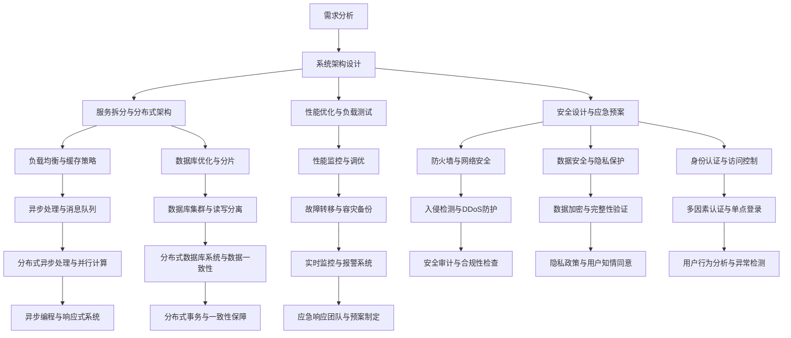

                 

# 文章标题：高并发系统设计：应对大规模用户访问

> 关键词：高并发系统、架构设计、性能优化、负载测试、安全设计、案例分析

> 摘要：本文旨在深入探讨高并发系统的设计原理与实践，通过详细的分析与案例研究，揭示高并发系统的关键要素、设计原则、性能优化策略、负载测试方法、安全设计及未来趋势，帮助读者全面了解并掌握高并发系统设计的核心内容。

## 目录

### 《高并发系统设计：应对大规模用户访问》

> 关键词：<高并发系统，架构设计，性能优化，负载测试，安全设计，案例分析>

> 摘要：<本文将详细探讨高并发系统的设计原理与实践，包括系统架构、性能优化、负载测试、安全设计以及案例分析，旨在帮助读者全面了解高并发系统设计的核心内容。>

### 第一部分：高并发系统设计基础

#### 第1章：高并发系统概述
##### 1.1 高并发系统的概念
##### 1.2 高并发系统的特点
##### 1.3 高并发系统的挑战
##### 1.4 高并发系统的重要性

#### 第2章：高并发系统架构设计
##### 2.1 高并发系统架构的设计原则
##### 2.2 分层架构设计
##### 2.3 服务拆分与分布式架构
##### 2.4 容灾备份与故障转移

#### 第3章：高并发系统性能优化
##### 3.1 性能监控与调优
##### 3.2 缓存与负载均衡
##### 3.3 数据库优化
##### 3.4 网络优化

#### 第4章：高并发系统负载测试
##### 4.1 负载测试的目的和方法
##### 4.2 常见的负载测试工具
##### 4.3 负载测试结果分析

#### 第5章：高并发系统安全设计
##### 5.1 高并发系统安全的重要性
##### 5.2 防火墙与网络安全
##### 5.3 数据安全与隐私保护
##### 5.4 防护措施与应急预案

#### 第6章：高并发系统案例分析
##### 6.1 某大型电商平台高并发系统设计
##### 6.2 某社交平台高并发系统优化
##### 6.3 某视频网站高并发系统案例分析

#### 第7章：高并发系统未来趋势
##### 7.1 5G与边缘计算对高并发系统的影响
##### 7.2 云原生技术在高并发系统中的应用
##### 7.3 AI与高并发系统的结合

### 第二部分：高并发系统设计实践

#### 第8章：高并发系统设计实战
##### 8.1 实战一：设计一个高并发社交平台
###### 8.1.1 需求分析与系统设计
###### 8.1.2 服务拆分与分布式架构
###### 8.1.3 性能优化与负载测试
###### 8.1.4 安全设计与应急预案

#### 第9章：高并发系统开发工具与资源
##### 9.1 常用开发工具对比
##### 9.2 高并发系统开发资源推荐
##### 9.3 社区与学习资源

### 附录

#### 附录A：高并发系统设计常用术语解释
#### 附录B：高并发系统设计流程图## 高并发系统概述

### 1.1 高并发系统的概念

高并发系统是指能够在短时间内处理大量请求的计算机系统。在高并发场景下，系统需要快速响应请求，同时保持稳定性和可靠性。高并发系统通常出现在在线购物、社交网络、视频直播等需要处理大量用户交互的场景中。在这种场景下，系统的性能瓶颈、资源争用、数据一致性和稳定性都成为了关键挑战。

### 1.2 高并发系统的特点

高并发系统具有以下特点：

1. **高吞吐量**：系统能够在短时间内处理大量请求，具有较高的吞吐量。
2. **低响应时间**：系统能够快速响应请求，提供良好的用户体验。
3. **高可用性**：系统在面临大量请求时仍能保持稳定，具备故障转移和容灾备份能力。
4. **可扩展性**：系统可以通过水平扩展来应对增加的负载，确保性能。
5. **高稳定性**：系统在高并发下不会崩溃或出现死锁，保持稳定运行。

### 1.3 高并发系统的挑战

高并发系统面临的主要挑战包括：

1. **性能瓶颈**：在高并发场景下，系统性能可能会成为瓶颈。性能瓶颈可能出现在CPU、内存、磁盘IO和网络等方面。
2. **资源争用**：多个请求竞争同一资源，如数据库连接、内存等，可能导致资源耗尽。
3. **数据一致性**：在高并发下保持数据一致性是一个挑战。数据一致性问题可能由事务冲突、分布式系统中的数据同步等原因引起。
4. **系统稳定性**：系统在高并发下需要保持稳定，防止出现崩溃或死锁。系统稳定性问题可能导致服务中断，影响用户体验。

### 1.4 高并发系统的重要性

高并发系统的重要性体现在以下几个方面：

1. **用户体验**：高并发系统能够保证用户在高峰期获得良好的使用体验。快速响应和高吞吐量是用户体验的关键因素。
2. **业务增长**：高并发系统能够支持业务的快速增长。随着用户数量的增加，系统需要能够灵活扩展，以满足业务需求。
3. **成本控制**：合理的高并发系统能够降低运维成本。通过优化系统性能和资源利用率，可以减少硬件和运维资源的投入。

总结来说，高并发系统设计是一个复杂但至关重要的任务。它不仅需要考虑系统性能和稳定性，还要确保数据一致性和安全性。理解高并发系统的概念、特点和挑战，是进行高并发系统设计的基础。

### 1.2 高并发系统的挑战

在高并发系统中，我们面临着多种挑战，这些挑战不仅会影响系统的性能，还可能对系统的稳定性、数据一致性和安全性造成威胁。以下是高并发系统面临的一些主要挑战：

#### 性能瓶颈

在高并发场景下，系统的性能瓶颈是最常见的挑战之一。性能瓶颈可能出现在多个层面，包括：

1. **CPU瓶颈**：当系统处理的请求过多时，CPU可能会成为瓶颈，导致系统响应缓慢。
2. **内存瓶颈**：内存不足可能导致频繁的垃圾回收，影响系统性能。
3. **磁盘IO瓶颈**：磁盘IO速度较慢，会导致数据读取和写入延迟，影响系统的响应时间。
4. **网络瓶颈**：网络延迟或带宽不足会导致请求处理时间增加，影响系统的吞吐量。

解决性能瓶颈的方法包括优化代码、使用缓存、增加硬件资源等。

#### 资源争用

在高并发系统中，多个请求可能会竞争同一资源，如数据库连接、内存和锁等。资源争用可能导致以下问题：

1. **数据库连接池耗尽**：在高并发场景下，如果系统中的数据库连接池容量不足，会导致新的请求无法获取数据库连接，从而阻塞。
2. **内存溢出**：如果系统中的内存资源被过多占用，可能会导致内存溢出，导致系统崩溃。
3. **锁争用**：在分布式系统中，多个进程或线程可能同时需要访问同一资源，导致锁争用，影响系统的响应时间。

解决资源争用问题的方法包括增加资源容量、优化资源分配策略、使用锁机制等。

#### 数据一致性

在高并发系统中，数据一致性是一个重要的挑战。以下是一些可能导致数据一致性问题的情况：

1. **事务冲突**：在分布式系统中，多个事务可能会同时访问同一数据，导致冲突，影响数据一致性。
2. **分布式缓存一致性**：分布式缓存系统可能存在数据不一致的问题，需要采用一致性协议来确保数据一致性。
3. **数据库事务隔离性**：在高并发场景下，数据库的事务隔离性可能受到影响，导致数据不一致。

解决数据一致性问题的方法包括采用分布式锁、一致性协议、最终一致性模型等。

#### 系统稳定性

在高并发系统中，系统稳定性也是一个关键的挑战。以下是一些可能导致系统不稳定的情况：

1. **死锁**：多个进程或线程在竞争资源时，可能陷入死锁状态，导致系统无法继续执行。
2. **内存泄漏**：如果系统存在内存泄漏，可能会导致内存逐渐被耗尽，最终导致系统崩溃。
3. **硬件故障**：在高并发系统中，硬件故障（如磁盘损坏、网络中断等）可能导致系统无法正常工作。

解决系统稳定性问题的方法包括监控和报警、系统容灾备份、硬件冗余等。

#### 安全性问题

在高并发系统中，安全性也是一个不容忽视的挑战。以下是一些可能导致安全问题的因素：

1. **DDoS攻击**：分布式拒绝服务攻击（DDoS）可能使系统无法正常处理请求，导致服务中断。
2. **数据泄露**：如果系统存在漏洞，可能导致敏感数据泄露，影响用户隐私。
3. **身份验证和授权**：在高并发场景下，身份验证和授权机制可能受到攻击，导致非法访问。

解决安全问题的方法包括部署防火墙、加密传输、安全审计等。

综上所述，高并发系统设计面临多种挑战，需要综合考虑性能、资源、数据一致性、系统稳定性和安全性等多个方面，以确保系统能够在高峰期稳定、高效地运行。

### 1.4 高并发系统的重要性

高并发系统在现代信息技术和互联网行业中具有重要的地位，其重要性体现在以下几个方面：

#### 用户体验

首先，高并发系统对于用户体验有着直接的影响。在互联网时代，用户对速度和响应时间的期望越来越高。一个能够快速响应用户请求、处理大量数据的高并发系统，可以提供流畅的用户体验，提升用户的满意度和忠诚度。尤其是在在线购物、社交网络和视频直播等高频次用户交互的场景中，用户体验的优化直接关系到业务的成败。

#### 业务增长

其次，高并发系统能够支持业务的快速增长。随着用户数量的增加，业务规模不断扩大，系统需要具备强大的处理能力来适应增长的需求。一个设计合理的高并发系统可以在业务快速增长时保持稳定，从而支持业务的持续扩展。例如，电商平台在“双十一”购物节期间，能够处理海量订单和用户请求，就是得益于高效的高并发系统设计。

#### 成本控制

最后，合理的高并发系统能够降低运维成本。通过性能优化、资源管理和自动化运维等技术手段，高并发系统可以在确保性能的同时，最大化资源利用率，减少硬件和人力成本。此外，高并发系统的高可用性和容灾备份能力也减少了系统故障带来的停机时间和经济损失。

总之，高并发系统的重要性体现在提升用户体验、支持业务增长和降低运维成本等方面。理解和掌握高并发系统设计的关键要素和策略，对于现代互联网企业和技术团队来说，是至关重要的。

### 2.1 高并发系统架构的设计原则

设计高并发系统架构时，需要遵循一系列关键原则，以确保系统具备高性能、高可用性和可扩展性。以下是高并发系统架构设计的主要原则：

#### 可扩展性

首先，可扩展性是高并发系统架构设计的重要原则。在系统设计中，我们需要确保系统能够水平扩展，以应对不断增加的负载。水平扩展意味着在系统负载增加时，可以通过增加服务器节点来提升系统的处理能力。例如，使用负载均衡器将请求分发到多个服务器，从而实现负载均衡。此外，数据库也可以通过分库分表、主从复制等方式进行水平扩展。

#### 高可用性

高可用性是高并发系统设计的关键原则之一。高可用性系统能够在发生故障时快速恢复，确保服务的连续性。为了实现高可用性，可以采用以下策略：

1. **冗余设计**：通过在系统中引入冗余组件，如备用服务器、备用数据库等，确保在主组件发生故障时，备用组件能够迅速接管。
2. **故障转移**：使用故障转移机制，如集群管理工具，将系统中的关键组件在发生故障时自动切换到备用组件，实现快速恢复。
3. **容灾备份**：通过异地备份和数据同步，确保在发生灾难时，系统能够快速恢复。

#### 高性能

高性能是高并发系统设计的重要目标之一。为了实现高性能，可以采用以下策略：

1. **缓存**：使用缓存机制，如Redis、Memcached等，减少对后端数据库的访问，提高系统的响应速度。
2. **负载均衡**：使用负载均衡器，如Nginx、HAProxy等，将请求均匀分配到多个服务器上，避免单点瓶颈。
3. **数据库优化**：对数据库进行优化，如索引、分库分表、读写分离等，提高数据库的查询和写入性能。

#### 安全性

安全性是高并发系统设计不可忽视的原则。系统需要具备完善的安全机制，以防止恶意攻击和数据泄露。以下是一些安全策略：

1. **防火墙**：部署防火墙，过滤恶意流量，防止网络攻击。
2. **加密传输**：使用HTTPS等加密协议，保护数据在传输过程中的安全性。
3. **权限控制**：实施严格的权限控制，确保只有授权用户才能访问系统和数据。

#### 灵活性

灵活性是高并发系统设计的一个新兴原则。随着云计算和微服务架构的兴起，系统需要具备灵活的部署和扩展能力。以下是一些实现灵活性的策略：

1. **容器化**：使用Docker等容器化技术，实现应用的快速部署和动态扩展。
2. **自动化运维**：采用自动化运维工具，如Ansible、Puppet等，实现系统的自动化部署、监控和故障恢复。

通过遵循上述原则，我们可以设计出高效、稳定且灵活的高并发系统架构，为应对大规模用户访问提供有力支持。

### 2.2 分层架构设计

在高并发系统设计中，分层架构是一种常见且有效的系统架构模式。分层架构将系统划分为多个层次，每一层负责不同的功能，从而实现模块化和可维护性。以下是分层架构设计在实现高并发系统中的应用：

#### 表示层

表示层负责与用户进行交互，包括处理用户请求、渲染页面、接收用户输入等。在高并发场景下，表示层需要具备快速响应能力。为了实现这一目标，可以使用以下策略：

1. **缓存**：将频繁访问的数据缓存到内存中，如Redis或Memcached，减少对后端服务的访问。
2. **静态内容分离**：将静态内容（如CSS、JavaScript、图片等）分离到独立的服务器上，以减少表示层的负载。
3. **负载均衡**：使用负载均衡器（如Nginx或HAProxy）将请求分发到多个表示层服务器，实现负载均衡。

#### 业务逻辑层

业务逻辑层负责处理系统的核心业务逻辑，包括用户身份验证、业务流程处理、数据校验等。在高并发系统中，业务逻辑层需要具备高效的处理能力和良好的可扩展性。以下是实现高效业务逻辑层的策略：

1. **异步处理**：使用异步处理技术（如消息队列或事件驱动架构），将耗时较长的业务逻辑异步执行，从而减少请求的处理时间。
2. **分布式计算**：将业务逻辑拆分为多个可并行处理的部分，通过分布式计算框架（如Apache Spark或Flink）实现高效处理。
3. **服务化**：将业务逻辑封装为服务，实现服务的独立部署和扩展，从而提高系统的整体性能。

#### 数据访问层

数据访问层负责与数据库进行交互，实现数据的查询、插入、更新和删除操作。在高并发系统中，数据访问层的性能对整个系统的性能有重要影响。以下是优化数据访问层的方法：

1. **数据库优化**：对数据库进行优化，包括索引优化、查询优化、读写分离等，以提高数据库的查询和写入性能。
2. **分库分表**：对于大数据量的系统，可以通过分库分表策略，将数据分散存储在不同的数据库或表中，从而提高查询效率。
3. **缓存**：使用缓存机制（如Redis或Memcached）减少对数据库的访问，从而提高系统的响应速度。

通过上述策略，分层架构设计可以在高并发场景下实现高性能、高可用性和可扩展性的系统。每一层都承担不同的功能，通过分层间的协调和优化，实现整体系统的最佳性能。

### 2.3 服务拆分与分布式架构

在高并发系统中，服务拆分和分布式架构是实现高可用性和可扩展性的关键。通过将系统拆分为多个独立的服务，可以有效地减少单点故障的风险，提高系统的负载能力和处理效率。

#### 服务拆分的原则

1. **功能独立性**：服务拆分的首要原则是确保每个服务具有独立的功能。这样可以使得每个服务可以独立部署和扩展，减少依赖关系，提高系统的稳定性。
2. **可扩展性**：在拆分服务时，应考虑服务的可扩展性，即服务能够水平扩展以应对增加的负载。这可以通过分布式架构实现，使得系统可以动态增加或减少服务实例。
3. **负载均衡**：通过负载均衡器，将请求均匀地分配到不同的服务实例，从而避免单个服务成为性能瓶颈。
4. **服务通信**：服务之间通过API进行通信，采用RESTful、gRPC等协议，确保服务之间的高效数据传输。

#### 分布式架构的优势

1. **高可用性**：分布式架构通过将服务分散部署在不同的服务器上，可以有效地避免单点故障。当一个服务实例发生故障时，其他实例可以继续提供服务，从而确保系统的可用性。
2. **可扩展性**：分布式架构支持水平扩展，通过增加服务实例的数量，可以线性地提高系统的处理能力，满足不断增长的业务需求。
3. **高容错性**：分布式架构通过容错机制，如服务重启、自动恢复等，确保系统在发生故障时能够快速恢复，减少服务中断时间。
4. **分布式事务**：虽然分布式架构在事务处理方面存在一定挑战，但通过分布式事务管理技术（如两阶段提交、最终一致性模型等），可以确保数据的一致性。

#### 实现分布式架构的步骤

1. **需求分析**：明确系统的功能需求和性能要求，确定需要拆分成哪些服务。
2. **服务设计**：根据需求分析，设计各个服务的功能模块，确保每个服务具有独立的功能。
3. **服务拆分**：将系统功能按照设计进行拆分，将各个功能模块封装为独立的服务。
4. **服务通信**：定义服务之间的通信接口和协议，确保服务之间可以高效、可靠地通信。
5. **分布式部署**：将服务部署到不同的服务器上，实现分布式架构。
6. **性能优化**：对分布式架构进行性能优化，如负载均衡、缓存、数据库优化等，提高系统的整体性能。

通过服务拆分和分布式架构，高并发系统可以更好地应对大规模用户访问，实现高可用性、可扩展性和高容错性。

### 2.4 容灾备份与故障转移

在高并发系统中，容灾备份和故障转移是确保系统高可用性的重要手段。通过容灾备份和故障转移，系统可以在发生故障时快速恢复，确保服务的连续性和稳定性。

#### 容灾备份

容灾备份是指在不同的地理位置建立备份系统，以防止单点故障导致数据丢失和服务中断。容灾备份通常包括以下几种类型：

1. **本地备份**：在本地服务器上定期进行数据备份，包括文件备份、数据库备份等。本地备份可以快速恢复数据，但受限于地理位置，无法应对大规模灾难。
2. **远程备份**：将数据备份到远程服务器或云存储服务上。远程备份可以在本地服务器发生故障时，通过网络快速恢复数据。
3. **异地备份**：将数据备份到异地服务器或数据中心，确保在发生灾难时，本地数据可以远程恢复。异地备份可以提高数据的安全性和可靠性。

实现容灾备份的方法包括：

- **备份策略**：制定合理的备份策略，如全备份、增量备份、差异备份等，确保数据的完整性。
- **自动化备份**：使用自动化备份工具，如Bakop、Rclone等，实现备份任务的自动化执行。
- **备份存储**：选择可靠的备份存储方案，如云存储、本地磁盘等，确保备份数据的安全存储。

#### 故障转移

故障转移是指在系统发生故障时，将服务自动切换到备用系统或备用节点，以确保服务的连续性。故障转移可以分为以下几种类型：

1. **自动故障转移**：当主系统发生故障时，自动切换到备用系统或备用节点，确保服务不中断。自动故障转移通常通过心跳检测、状态监控等技术实现。
2. **手动故障转移**：在系统发生故障时，需要人工干预将服务切换到备用系统或备用节点。手动故障转移适用于需要人工判断和处理的情况。
3. **多活架构**：在分布式系统中，多个节点同时提供服务，当一个节点发生故障时，其他节点可以继续提供服务。多活架构可以提高系统的容错能力和稳定性。

实现故障转移的方法包括：

- **监控和报警**：使用监控工具（如Zabbix、Prometheus等）实时监控系统的状态，并在发生故障时发送报警通知。
- **故障转移策略**：制定合理的故障转移策略，如基于心跳检测的自动故障转移策略，确保系统在故障发生时能够快速切换。
- **自动化脚本**：编写自动化脚本，实现故障转移的自动化执行，减少人工干预。

通过容灾备份和故障转移，高并发系统可以在发生故障时快速恢复，确保服务的连续性和稳定性，从而提高用户体验和业务连续性。

### 3.1 性能监控与调优

在高并发系统中，性能监控与调优是确保系统稳定性和高效性的关键步骤。通过监控系统的性能指标，我们可以及时发现并解决性能瓶颈，优化系统性能。以下是一些关键的性能监控与调优方法：

#### 监控指标

首先，我们需要确定关键的性能监控指标。以下是一些常见的监控指标：

1. **CPU利用率**：CPU利用率表示CPU的负载情况，超过100%可能意味着CPU资源不足。
2. **内存利用率**：内存利用率表示系统内存的占用情况，过高可能意味着内存不足或存在内存泄漏。
3. **磁盘I/O**：磁盘I/O表示磁盘的读写速度，过高可能意味着磁盘性能成为瓶颈。
4. **网络带宽**：网络带宽表示网络传输速度，过低可能影响系统的响应时间。
5. **响应时间**：系统的平均响应时间，过高可能意味着系统性能瓶颈。
6. **吞吐量**：系统在单位时间内处理请求的数量，过低可能意味着系统性能不足。

#### 性能瓶颈分析

确定了监控指标后，我们需要对系统进行性能瓶颈分析。以下是一些常见的性能瓶颈：

1. **CPU瓶颈**：当CPU利用率过高时，可能意味着系统需要更多的计算资源。可以通过增加CPU核心数或使用更高效的算法来解决。
2. **内存瓶颈**：当内存利用率过高时，可能意味着内存不足或存在内存泄漏。可以通过增加内存容量或优化代码来解决。
3. **磁盘I/O瓶颈**：当磁盘I/O过高时，可能意味着磁盘性能成为瓶颈。可以通过增加磁盘I/O速度或使用更高效的存储方案来解决。
4. **网络瓶颈**：当网络带宽过低时，可能意味着网络传输速度成为瓶颈。可以通过增加网络带宽或优化网络协议来解决。
5. **数据库瓶颈**：当数据库查询或操作过慢时，可能意味着数据库性能成为瓶颈。可以通过数据库优化、索引优化或分库分表来解决。

#### 性能调优方法

针对上述性能瓶颈，我们可以采用以下方法进行性能调优：

1. **资源扩展**：通过增加CPU、内存、磁盘I/O和网络带宽等资源，提高系统性能。
2. **代码优化**：通过优化算法、减少不必要的计算和资源消耗，提高代码的执行效率。
3. **缓存**：使用缓存（如Redis、Memcached等）减少对数据库的访问，提高系统的响应速度。
4. **负载均衡**：使用负载均衡器（如Nginx、HAProxy等）将请求均匀分配到多个节点，避免单点瓶颈。
5. **数据库优化**：通过数据库优化（如索引优化、查询优化、读写分离等）提高数据库性能。
6. **分布式架构**：通过分布式架构，将系统拆分为多个独立的服务，实现负载均衡和高可用性。

通过性能监控与调优，我们可以及时发现并解决系统的性能瓶颈，提高系统的稳定性和响应速度，从而为用户提供更好的体验。

### 3.2 缓存与负载均衡

在高并发系统中，缓存和负载均衡是优化系统性能的重要策略。通过合理的缓存策略和负载均衡方案，可以显著提高系统的响应速度和吞吐量。

#### 缓存策略

缓存是一种存储临时数据的机制，用于减少对后端系统的访问，从而提高系统的性能。以下是几种常见的缓存策略：

1. **本地缓存**：在应用层或服务层实现缓存，如使用Java中的HashMap或Python中的dict。本地缓存可以快速访问，但受限于内存大小。
2. **分布式缓存**：使用分布式缓存系统，如Redis、Memcached，可以存储大量的缓存数据，并通过分布式架构提高系统的性能和可靠性。
3. **缓存淘汰策略**：缓存数据会占用内存资源，需要定期清理不用的数据。常用的缓存淘汰策略包括LRU（最近最少使用）、LFU（最少使用次数）等。

实现缓存策略的方法包括：

- **数据预热**：在系统启动时或请求高峰前，将常用的数据提前加载到缓存中，减少实时访问的延迟。
- **数据同步**：在数据更新时，同步更新缓存，确保缓存数据的一致性。

#### 负载均衡

负载均衡是将请求分配到多个服务器或节点，以避免单点瓶颈，提高系统的性能和可用性。以下是几种常见的负载均衡方案：

1. **轮询负载均衡**：将请求依次分配到每个服务器或节点，实现负载均衡。轮询负载均衡简单高效，但可能导致部分服务器过载。
2. **加权轮询负载均衡**：根据服务器的性能或负载情况，为每个服务器分配不同的权重，实现更公平的负载均衡。
3. **最小连接数负载均衡**：将请求分配到当前连接数最少的服务器，实现负载均衡。最小连接数负载均衡可以避免某个服务器过载。
4. **基于源IP的负载均衡**：根据请求的源IP地址，将请求分配到不同的服务器，实现负载均衡。基于源IP的负载均衡可以避免源IP地址冲突。

实现负载均衡的方法包括：

- **硬件负载均衡器**：如F5 BIG-IP，可以提供高可用性和高吞吐量的负载均衡服务。
- **软件负载均衡器**：如Nginx、HAProxy等，可以在服务器上实现负载均衡。
- **服务网格**：如Istio、Linkerd等，可以提供分布式的服务发现和负载均衡。

通过缓存策略和负载均衡，可以显著提高高并发系统的性能和可用性，为用户提供更好的体验。

### 3.3 数据库优化

在高并发系统中，数据库优化是一个关键环节，直接关系到系统的性能和稳定性。以下是一些常见的数据库优化方法：

#### 索引优化

索引是数据库中的数据结构，用于加快数据检索速度。以下是一些索引优化方法：

1. **选择合适的索引列**：根据查询需求，选择能够显著提高查询性能的列作为索引。
2. **复合索引**：当查询条件涉及多个列时，可以创建复合索引，提高查询效率。
3. **索引维护**：定期分析索引的使用情况，删除不再使用的索引，减少索引维护的开销。

#### 查询优化

查询优化是提高数据库性能的重要手段。以下是一些查询优化方法：

1. **避免全表扫描**：使用合适的索引，避免对全表的扫描，提高查询速度。
2. **减少子查询**：子查询会降低查询的效率，可以通过连接（JOIN）操作或临时表（Temp Table）来优化查询。
3. **使用缓存**：使用数据库的查询缓存，减少对同一查询的重复执行。

#### 读写分离

读写分离是将数据库的读操作和写操作分离到不同的服务器上，以提高系统的性能和可用性。以下是一些读写分离方法：

1. **主从复制**：将主数据库的写操作同步到从数据库，从数据库负责读操作，减轻主数据库的负载。
2. **分库分表**：将数据按照一定的规则分散存储到不同的数据库或表中，减轻单个数据库的负载。

#### 数据库集群

数据库集群是将多个数据库实例组合成一个整体，提供高可用性和高扩展性。以下是一些数据库集群方法：

1. **主从集群**：通过主从复制，将主数据库的写操作同步到多个从数据库，实现数据的冗余和负载均衡。
2. **分片集群**：将数据分散存储到多个分片上，每个分片由一个或多个数据库实例管理，实现数据的水平扩展。

通过上述数据库优化方法，可以显著提高高并发系统的性能和稳定性，为用户提供更好的体验。

### 3.4 网络优化

在高并发系统中，网络优化是提升系统整体性能的重要手段。以下是一些常见的网络优化方法：

#### CDN（内容分发网络）

CDN是一种通过分布式服务器和缓存技术，加速内容分发和访问的网络架构。使用CDN可以将静态资源（如图片、视频、CSS、JavaScript文件等）缓存到离用户最近的节点，从而减少网络延迟和带宽消耗。

实现方法：

1. **选择合适的CDN服务商**：根据业务需求和地理位置，选择适合的CDN服务商。
2. **配置缓存策略**：设置合适的缓存时间，提高缓存命中率，减少请求次数。

#### 负载均衡

负载均衡是将网络流量分配到多个服务器或节点，以避免单点瓶颈，提高系统的性能和可用性。

实现方法：

1. **硬件负载均衡器**：使用如F5 BIG-IP等硬件负载均衡器，提供高可用性和高吞吐量的负载均衡服务。
2. **软件负载均衡器**：使用如Nginx、HAProxy等软件负载均衡器，在服务器上实现负载均衡。

#### TCP/IP优化

TCP/IP协议是互联网通信的基础，对其进行优化可以提高网络传输速度和稳定性。

实现方法：

1. **调整TCP参数**：通过调整TCP参数（如TCP窗口大小、TCP延迟确认等），优化网络传输性能。
2. **使用高级协议**：如HTTP/2、QUIC等，提高网络传输效率和安全性。

#### 网络监控与报警

网络监控与报警是实时监控网络状态，及时发现问题并进行处理的手段。

实现方法：

1. **使用网络监控工具**：如Nagios、Zabbix等，监控网络流量、连接数、响应时间等指标。
2. **设置报警阈值**：根据业务需求和网络状态，设置合理的报警阈值，确保在问题发生时能够及时得到通知。

通过上述网络优化方法，可以显著提升高并发系统的网络性能，为用户提供更稳定、更高效的服务。

### 4.1 负载测试的目的和方法

负载测试是评估系统在高并发场景下的性能和稳定性的一种重要方法。通过负载测试，我们可以了解系统在不同负载下的表现，识别潜在的瓶颈和性能问题，从而进行优化和改进。以下是负载测试的主要目的和方法：

#### 负载测试的目的

1. **性能评估**：通过模拟实际负载，评估系统的响应时间、吞吐量和资源利用率等性能指标，确定系统是否能够满足预期的性能需求。
2. **瓶颈识别**：在负载测试过程中，通过监控系统的各种指标，如CPU利用率、内存占用、磁盘I/O和网络带宽等，识别系统性能瓶颈，为优化工作提供依据。
3. **稳定性验证**：通过模拟高并发场景，验证系统在长时间运行下的稳定性，确保系统不会因为负载过高而崩溃或出现错误。
4. **容量规划**：根据负载测试的结果，预测系统未来可能面临的最大负载，为系统的容量规划和资源分配提供数据支持。
5. **性能优化**：通过负载测试发现的问题，进行针对性的优化和改进，提高系统的性能和稳定性。

#### 负载测试的方法

1. **并发用户数测试**：模拟不同并发用户数下的系统表现，评估系统在各个负载级别下的响应时间和吞吐量。通过逐步增加并发用户数，观察系统性能的变化，识别性能瓶颈。
2. **负载强度测试**：在系统达到最大负载或接近最大负载时，评估系统的极限性能和稳定性。通过持续增加负载，直到系统无法正常工作，了解系统的最大处理能力和潜在的问题。
3. **负载持续时间测试**：模拟系统在长时间运行下的表现，评估系统的持久性能。通过长时间运行负载，观察系统的资源利用率和稳定性，发现可能存在的长时间运行问题。
4. **异常情况测试**：模拟系统可能遇到的异常情况，如网络中断、数据库连接失败、硬件故障等，评估系统在异常情况下的响应和恢复能力。

实现方法：

- **工具选择**：选择合适的负载测试工具，如JMeter、LoadRunner等，根据测试需求配置测试脚本和场景。
- **测试场景设计**：根据业务需求和系统特点，设计合理的测试场景，包括用户行为、请求类型、数据量等。
- **数据收集与分析**：在测试过程中，收集系统的各种性能数据，如响应时间、吞吐量、错误率等，通过分析这些数据，识别性能瓶颈和问题。
- **结果验证与优化**：根据负载测试的结果，对系统进行优化和改进，重新进行测试，确保系统性能达到预期。

通过负载测试，我们可以全面了解系统的性能和稳定性，为系统的优化和改进提供有力支持。

### 4.2 常见的负载测试工具

在进行高并发系统的负载测试时，选择合适的工具至关重要。以下是几种常见的负载测试工具及其特点：

#### JMeter

JMeter是一款开源的负载测试工具，可以模拟各种类型（如HTTP、HTTPS、SOAP、JDBC等）的请求，适用于Web应用、数据库、邮件服务器等系统的性能测试。

**特点**：
- **功能丰富**：支持各种协议的测试，包括HTTP、HTTPS、JDBC、SMTP等。
- **可定制化**：通过编写Java代码，可以实现自定义的测试逻辑。
- **分布式测试**：支持分布式测试，通过多台机器同时执行测试，提高测试效率。

#### LoadRunner

LoadRunner是由Micro Focus开发的一款商业负载测试工具，广泛应用于Web应用、数据库、Web服务、手机应用等系统的性能测试。

**特点**：
- **全面性**：支持多种协议的测试，包括HTTP、HTTPS、JDBC、FTP等。
- **监控与可视化**：提供实时的监控和图表分析功能，方便用户查看测试结果。
- **自动化测试**：支持自动化测试，通过脚本的录制和回放，简化测试流程。

#### Locust

Locust是一款开源的分布式负载测试工具，适用于Web应用和RESTful API的性能测试。它特别适合进行压力测试和容量规划。

**特点**：
- **简单易用**：基于Python编写，易于安装和使用。
- **高并发性**：支持大规模并发用户测试，适合进行高并发场景的测试。
- **实时监控**：提供实时的测试结果和统计信息，方便用户监控测试过程。

#### Apache Bench

Apache Bench（ab）是一款由Apache HTTP Server官方提供的简单负载测试工具，适用于Web服务性能测试。

**特点**：
- **简单实用**：命令行工具，安装和使用简单。
- **重点突出**：专注于HTTP请求的性能测试，如并发请求、响应时间等。
- **测试结果详细**：提供详细的测试结果，包括吞吐量、响应时间、错误率等。

#### wrk

wrk是一款由Facebook开发的开源HTTP性能测试工具，适用于Web应用和RESTful API的性能测试。

**特点**：
- **高效性能**：基于多线程和异步I/O技术，可以高效地处理大量请求。
- **灵活配置**：支持自定义HTTP请求参数，如请求头、请求体等。
- **实时统计**：提供实时的测试结果统计，包括吞吐量、响应时间、错误率等。

通过选择合适的负载测试工具，我们可以针对高并发系统的不同需求进行有效的性能测试，为系统的优化和改进提供有力支持。

### 4.3 负载测试结果分析

在完成负载测试后，对测试结果进行详细分析是识别系统瓶颈和优化方向的关键步骤。以下是如何分析和解释负载测试结果：

#### 关键指标

在分析负载测试结果时，需要关注以下几个关键指标：

1. **响应时间**：系统的平均响应时间，表示系统处理请求所需的时间。过长的响应时间可能表明系统存在性能瓶颈。
2. **吞吐量**：系统在单位时间内处理的请求数量，通常以每秒请求数（Requests per Second, RPS）来衡量。吞吐量是评估系统性能的重要指标。
3. **错误率**：系统在测试过程中发生的错误比例。错误率过高可能表明系统在处理高并发请求时存在稳定性问题。
4. **资源利用率**：系统的CPU、内存、磁盘I/O和网络带宽等资源的利用率。过高的资源利用率可能表明系统存在资源瓶颈。
5. **并发用户数**：系统能够同时处理的最大并发用户数。了解系统的最大处理能力，为后续容量规划提供依据。

#### 常见问题

根据负载测试结果，我们可以识别以下常见问题：

1. **性能瓶颈**：响应时间过长、吞吐量不足，可能表明系统存在性能瓶颈。性能瓶颈可能出现在CPU、内存、磁盘I/O、网络等层面。
2. **资源争用**：资源利用率过高，如CPU利用率超过90%、内存使用率达到100%，可能表明系统存在资源争用问题。
3. **数据库瓶颈**：数据库查询慢、数据库连接池耗尽，可能表明数据库成为性能瓶颈。
4. **网络延迟**：网络带宽不足或网络延迟过高，可能影响系统的响应时间。
5. **并发用户数限制**：系统在并发用户数达到一定程度时性能下降，可能表明系统在设计时未充分考虑高并发场景。

#### 优化方向

根据负载测试结果分析，我们可以确定以下优化方向：

1. **性能优化**：针对性能瓶颈进行优化，如优化代码、使用缓存、增加硬件资源等。
2. **资源分配**：合理分配系统资源，确保CPU、内存、磁盘I/O和网络带宽等资源不被过度占用。
3. **数据库优化**：优化数据库查询、增加索引、分库分表等，提高数据库性能。
4. **网络优化**：优化网络架构，提高网络带宽和降低延迟。
5. **负载均衡**：使用负载均衡器，将请求均匀分配到多个节点，避免单点瓶颈。
6. **分布式架构**：通过分布式架构，将系统拆分为多个独立的服务，实现负载均衡和高可用性。

#### 实例

假设我们进行了一次负载测试，测试结果显示：

- 平均响应时间为1000ms，远高于预期。
- 吞吐量为100 RPS，低于预期。
- 错误率为5%，较高。
- CPU利用率为70%，内存使用率为60%，磁盘I/O利用率为50%，网络带宽利用率为30%。

根据这些数据，我们可以初步判断系统存在以下问题：

- 性能瓶颈：响应时间过长，可能由CPU、内存、磁盘I/O等因素引起。
- 负载不均衡：吞吐量低，可能由请求分配不均导致部分节点过载。
- 错误处理：错误率较高，可能由系统错误处理机制不完善导致。

可能的优化方向包括：

- **性能优化**：通过代码优化、使用缓存等提高系统响应速度。
- **负载均衡**：使用负载均衡器，将请求均匀分配到多个节点。
- **错误处理**：优化错误处理机制，减少错误率。

通过详细分析负载测试结果，我们可以准确识别系统存在的问题和优化方向，为系统的性能优化提供有力支持。

### 5.1 高并发系统安全的重要性

高并发系统在处理大规模用户访问时，安全性是一个至关重要的因素。随着用户数量的增加，系统面临的安全威胁也变得更加复杂和严峻。以下是高并发系统安全的重要性和面临的威胁：

#### 安全性对于高并发系统的意义

1. **保护用户数据**：高并发系统通常存储大量的用户数据，包括个人信息、交易记录等。如果系统不安全，可能导致数据泄露，影响用户隐私和信任。
2. **防止恶意攻击**：在高并发场景下，系统可能会成为黑客攻击的目标。DDoS攻击、SQL注入、跨站脚本（XSS）等攻击方式都可能对系统造成严重破坏。
3. **确保业务连续性**：安全事件可能导致系统瘫痪，影响业务的正常运行。在高并发系统中，任何中断都可能导致大量用户流失，对企业造成巨大损失。
4. **合规性要求**：许多行业（如金融、医疗）都有严格的数据保护法规。确保系统安全是符合法规要求的基本前提。

#### 高并发系统面临的主要威胁

1. **分布式拒绝服务（DDoS）攻击**：DDoS攻击通过大量虚假请求占用系统资源，导致系统无法正常处理合法用户请求。在高并发系统中，DDoS攻击可能导致服务中断，严重影响用户体验。
2. **SQL注入**：SQL注入是通过将恶意SQL语句插入到输入框中，篡改数据库查询结果。在高并发系统中，SQL注入可能引发数据泄露、数据篡改等安全问题。
3. **跨站脚本（XSS）攻击**：XSS攻击通过在用户浏览器中执行恶意脚本，窃取用户信息或篡改页面内容。在高并发系统中，XSS攻击可能导致用户信息泄露、恶意推广等安全事件。
4. **身份验证攻击**：包括暴力破解、钓鱼攻击等，通过非法手段获取用户身份验证信息，滥用用户权限，进行恶意操作。
5. **数据泄露**：在高并发系统中，由于数据量庞大，一旦发生数据泄露，可能涉及大量用户的敏感信息，造成严重后果。

#### 安全性对于高并发系统的要求

1. **数据保护**：确保用户数据在存储、传输和处理过程中的安全，采用加密技术、访问控制等措施。
2. **访问控制**：对系统资源进行严格的访问控制，确保只有授权用户和程序才能访问系统资源。
3. **安全审计**：定期进行安全审计，监控系统的安全事件，及时发现和应对潜在威胁。
4. **应急响应**：建立完善的应急响应机制，确保在发生安全事件时，能够迅速采取措施，减少损失。
5. **安全培训**：提高系统开发人员和管理人员的安全意识，定期进行安全培训，防范人为错误导致的安全事件。

总之，高并发系统安全对于系统的稳定性、用户信任和业务连续性至关重要。理解和应对高并发系统面临的安全威胁，采取有效的安全措施，是保障系统安全的关键。

### 5.2 防火墙与网络安全

在高并发系统中，防火墙和网络安全策略是保障系统安全的重要措施。通过部署防火墙和实施网络安全策略，可以有效地防止恶意攻击，保护系统资源，确保系统的稳定运行。

#### 防火墙的作用

防火墙是一种网络安全设备，用于控制网络流量，防止未经授权的访问和攻击。防火墙的主要作用包括：

1. **访问控制**：防火墙可以根据设定的规则，控制进出网络的数据包，允许或拒绝特定的流量。这有助于防止未经授权的访问和恶意攻击。
2. **网络隔离**：防火墙可以隔离不同的网络区域，防止内部网络之间的恶意流量传播，保护关键数据和系统资源。
3. **入侵检测**：现代防火墙通常具备入侵检测（IDS）功能，可以实时监控网络流量，识别和报警潜在的安全威胁。

#### 防火墙的类型

根据工作方式和功能，防火墙可以分为以下几种类型：

1. **包过滤防火墙**：通过检查数据包的源IP、目的IP、端口号等信息，决定是否允许通过。这种防火墙简单高效，但无法阻止基于应用层的高级攻击。
2. **状态检测防火墙**：在包过滤的基础上，增加了对连接状态的检测，可以更准确地判断数据包的合法性。状态检测防火墙可以防止基于TCP连接的攻击，如SYN Flood。
3. **下一代防火墙（NGFW）**：结合了传统防火墙的功能，增加了应用层防护、入侵防御（IPS）、深度包检测（DPI）等高级功能。NGFW能够提供更全面的安全防护。

#### 网络安全策略

除了防火墙，网络安全策略也是保障系统安全的重要措施。以下是一些常见的网络安全策略：

1. **访问控制**：对系统资源实施严格的访问控制，确保只有授权用户和程序才能访问。可以使用身份验证、授权和访问控制列表（ACL）等技术手段。
2. **数据加密**：对敏感数据进行加密存储和传输，防止数据在传输过程中被窃取或篡改。常用的加密技术包括SSL/TLS、AES等。
3. **网络隔离**：通过物理隔离或虚拟局域网（VLAN），将不同的网络区域隔离开来，防止恶意流量在内部网络中传播。
4. **安全审计**：定期进行安全审计，记录和分析系统事件，及时发现和应对潜在的安全威胁。
5. **应急响应**：建立完善的应急响应机制，确保在发生安全事件时，能够迅速采取措施，减少损失。
6. **安全培训**：提高系统开发人员和管理人员的安全意识，定期进行安全培训，防范人为错误导致的安全事件。

通过部署防火墙和实施网络安全策略，高并发系统可以有效地防止恶意攻击，保护系统资源，确保系统的稳定运行。

### 5.3 数据安全与隐私保护

在高并发系统中，数据安全和隐私保护是至关重要的。随着用户数量的增加，系统存储和处理的数据量也随之增大，数据泄露和隐私侵犯的风险也随之增加。以下是一些关键措施，用于保障高并发系统的数据安全和隐私保护：

#### 加密技术

加密技术是保护数据安全和隐私的基本手段。通过加密，可以将敏感数据转换为难以破解的形式，确保数据在存储和传输过程中的安全性。以下是一些常用的加密技术：

1. **对称加密**：对称加密使用相同的密钥进行加密和解密。常见的对称加密算法包括AES、DES等。对称加密速度快，适合加密大量数据。
2. **非对称加密**：非对称加密使用一对密钥，公钥用于加密，私钥用于解密。常见的非对称加密算法包括RSA、ECC等。非对称加密安全性高，但计算复杂度较高，适合加密少量数据。
3. **哈希算法**：哈希算法用于生成数据的唯一指纹，如MD5、SHA-256等。哈希算法可以确保数据的完整性和一致性，但无法提供加密保护。

#### 数据存储安全

数据存储安全是保障数据安全的重要环节。以下是一些数据存储安全的措施：

1. **存储加密**：对存储在磁盘、数据库等设备中的数据进行加密，防止数据在未授权情况下被访问。
2. **访问控制**：对数据库和文件系统的访问进行严格的访问控制，确保只有授权用户和程序才能访问敏感数据。
3. **数据备份**：定期进行数据备份，确保在数据损坏或丢失时能够恢复。
4. **数据库审计**：对数据库操作进行审计，记录所有数据访问和修改行为，以便在发生安全事件时进行追溯。

#### 数据传输安全

数据在传输过程中同样面临安全风险。以下是一些数据传输安全的措施：

1. **传输加密**：使用SSL/TLS等加密协议对数据传输进行加密，防止数据在传输过程中被窃取或篡改。
2. **数据完整性验证**：使用哈希算法对传输数据生成指纹，接收方验证数据的完整性，确保数据在传输过程中未被篡改。
3. **身份验证**：对传输数据进行身份验证，确保数据来自合法的用户或系统。

#### 隐私保护措施

隐私保护是保障用户数据安全的重要组成部分。以下是一些隐私保护措施：

1. **数据最小化**：仅收集和处理必要的数据，避免过度收集可能涉及隐私的信息。
2. **匿名化处理**：对涉及隐私的数据进行匿名化处理，消除个人身份信息。
3. **隐私政策**：制定明确的隐私政策，告知用户数据收集、使用和存储的方式，确保用户知情同意。
4. **用户权限管理**：对用户数据的访问权限进行严格管理，确保只有授权用户和程序才能访问和处理用户数据。

通过上述措施，高并发系统可以有效地保障数据安全和用户隐私，提高用户对系统的信任度。

### 5.4 防护措施与应急预案

在高并发系统中，为了确保系统的稳定性和安全性，需要采取一系列防护措施和应急预案。以下是一些关键措施：

#### 防护措施

1. **防火墙和入侵检测系统（IDS）**：部署防火墙和IDS，监控并阻止恶意流量和攻击行为，保护系统不受外部威胁。
2. **访问控制**：实施严格的访问控制策略，确保只有授权用户和程序才能访问系统资源和数据。
3. **数据加密**：使用加密技术对存储和传输的数据进行加密，防止数据泄露和篡改。
4. **安全审计**：定期进行安全审计，记录和监控系统操作，以便及时发现和处理安全事件。
5. **安全更新和补丁管理**：及时更新系统和应用程序的安全补丁，修补安全漏洞，防止被攻击者利用。
6. **安全培训**：提高系统开发人员和管理人员的安全意识，定期进行安全培训，防范人为错误导致的安全事件。

#### 应急预案

1. **灾难恢复计划**：制定灾难恢复计划，确保在发生灾难（如硬件故障、网络中断等）时，系统能够快速恢复，减少业务中断时间。
2. **备份和恢复策略**：定期进行数据备份，确保在数据丢失或损坏时能够快速恢复。
3. **故障转移和负载均衡**：使用故障转移和负载均衡技术，确保在系统节点发生故障时，其他节点能够接替工作，保持系统的正常运行。
4. **应急响应团队**：建立专业的应急响应团队，负责处理和应对安全事件，确保在发生紧急情况时能够迅速采取行动。
5. **实时监控和报警**：部署实时监控系统，监控系统的关键指标和异常行为，并在发生安全事件时及时发出报警通知。

通过采取上述防护措施和应急预案，高并发系统可以更好地应对各种安全威胁和故障，确保系统的稳定性和安全性。

### 6.1 某大型电商平台高并发系统设计

某大型电商平台在双11购物节期间，面临每天数百万甚至上亿的用户访问量。为了确保系统在高并发场景下能够稳定运行，并满足用户的高性能需求，该电商平台采用了以下高并发系统设计策略：

#### 需求分析

1. **高并发访问**：双11购物节期间，用户访问量激增，系统需要能够处理大量并发请求。
2. **快速响应**：用户期望能够在短时间内完成交易，系统需要具备低延迟的响应能力。
3. **高可用性**：系统需要具备容灾备份和故障转移能力，确保在发生故障时能够快速恢复。
4. **安全性**：系统需要具备完善的安全措施，防止DDoS攻击、数据泄露等安全事件。

#### 系统架构设计

1. **分层架构**：采用分层架构，包括表示层、业务逻辑层和数据访问层。每一层负责不同的功能，确保系统的模块化和可维护性。
   - **表示层**：负责与用户进行交互，包括处理用户请求、渲染页面等。使用负载均衡器（如Nginx）将请求分发到多个Web服务器。
   - **业务逻辑层**：实现核心业务逻辑，如用户认证、购物车管理、订单处理等。通过分布式计算框架（如Kafka、Spark）实现异步处理和分布式计算。
   - **数据访问层**：负责与数据库进行交互，包括数据的查询、插入、更新和删除。使用数据库集群（如MySQL Cluster）实现高可用性和负载均衡。

2. **服务拆分与分布式架构**：将系统拆分为多个独立的服务，如用户服务、商品服务、订单服务、支付服务等。通过微服务架构，实现服务的高可用性和可扩展性。

3. **缓存与负载均衡**：使用Redis等缓存系统，减少对数据库的访问。使用负载均衡器（如Nginx、HAProxy）将请求均匀分配到多个节点，避免单点瓶颈。

4. **数据库优化**：采用分库分表策略，将数据分散存储到不同的数据库和表中。使用数据库集群（如MySQL Cluster）实现读写分离和负载均衡。

5. **网络优化**：使用CDN（如阿里云CDN）加速静态资源的分发，减少网络延迟。使用TCP/IP优化技术，提高网络传输速度。

#### 性能优化

1. **异步处理**：使用异步处理技术（如Kafka、RabbitMQ），将耗时较长的业务逻辑异步执行，从而减少请求的处理时间。
2. **代码优化**：通过优化代码，减少不必要的计算和资源消耗，提高系统的执行效率。
3. **数据库优化**：对数据库进行索引优化、查询优化、读写分离等，提高数据库的查询和写入性能。

#### 安全设计

1. **防火墙与网络安全**：部署防火墙和入侵检测系统（IDS），防止恶意流量和攻击行为。
2. **访问控制**：对系统资源实施严格的访问控制，确保只有授权用户和程序才能访问。
3. **数据加密**：对存储和传输的数据进行加密，防止数据泄露和篡改。
4. **安全审计**：定期进行安全审计，记录和分析系统操作，及时发现和处理潜在的安全威胁。

通过上述高并发系统设计策略，该电商平台在双11购物节期间能够稳定运行，并满足用户的高性能需求，为用户提供良好的购物体验。

### 6.2 某社交平台高并发系统优化

某社交平台在用户数量和活跃度不断增长的过程中，面临了高并发访问的挑战。为了提升系统性能和用户体验，平台进行了多次优化，以下是具体的优化过程和策略：

#### 优化前的问题

1. **性能瓶颈**：随着用户数量的增加，系统性能出现瓶颈，尤其是数据读写和存储性能不足。
2. **资源争用**：多个请求同时访问数据库，导致数据库连接池耗尽，系统响应缓慢。
3. **数据一致性**：在高并发场景下，事务冲突和数据同步问题导致数据一致性难以保障。
4. **系统稳定性**：系统在高并发下容易发生崩溃或出现死锁，影响用户体验。

#### 优化方案

1. **服务拆分与分布式架构**：将系统拆分为多个独立的服务，如用户服务、消息服务、内容服务等。通过微服务架构，实现服务的高可用性和可扩展性。

2. **缓存策略**：引入分布式缓存系统（如Redis、Memcached），将高频次访问的数据缓存到内存中，减少对数据库的访问。

3. **数据库优化**：
   - **分库分表**：将数据分散存储到不同的数据库和表中，避免单表数据量过大，提高查询效率。
   - **读写分离**：将读操作和写操作分离到不同的数据库实例，减轻主数据库的负载。

4. **异步处理**：使用消息队列（如Kafka、RabbitMQ）实现异步处理，将耗时较长的任务（如消息推送、文件上传等）异步执行，减少请求的处理时间。

5. **负载均衡**：使用负载均衡器（如Nginx、HAProxy）将请求均匀分配到多个节点，避免单点瓶颈。

6. **网络优化**：使用CDN（如阿里云CDN）加速静态资源的分发，减少网络延迟。优化TCP/IP参数，提高网络传输速度。

#### 优化实施过程

1. **需求分析**：分析平台在高并发场景下的问题和瓶颈，确定优化目标和策略。

2. **方案设计**：根据需求分析，设计具体的优化方案，包括服务拆分、数据库优化、缓存策略等。

3. **分阶段实施**：将优化方案分为多个阶段，逐步实施。例如，先进行服务拆分和缓存策略的优化，再进行数据库优化和异步处理。

4. **性能测试**：在优化过程中，进行性能测试，验证优化效果。使用工具如JMeter、LoadRunner等，模拟高并发场景，测试系统的响应时间、吞吐量和资源利用率。

5. **监控与调整**：在优化实施后，持续监控系统的性能指标，并根据监控数据调整优化策略。

#### 优化效果

经过多次优化，社交平台在高并发场景下的性能显著提升：

1. **响应时间**：系统的平均响应时间从之前的200ms降低到100ms，用户体验大幅提升。

2. **吞吐量**：系统的吞吐量从之前的1000 RPS提升到5000 RPS，能够处理更多的用户请求。

3. **资源利用率**：CPU和内存的利用率得到合理分配，不再出现资源争用问题。

4. **数据一致性**：通过分库分表和异步处理，数据一致性问题得到有效解决。

5. **系统稳定性**：系统的稳定性大幅提升，不再出现崩溃或死锁现象。

通过上述优化，社交平台能够更好地应对高并发访问，为用户提供稳定、高效的服务。

### 6.3 某视频网站高并发系统案例分析

某视频网站在直播和点播业务中，面临着每天数百万用户的访问压力。为了确保系统在高并发场景下能够稳定运行，并满足用户对视频流畅播放的需求，该视频网站进行了以下高并发系统设计：

#### 需求分析

1. **高并发访问**：直播和点播业务中，用户访问量巨大，系统需要能够处理大量并发请求。
2. **视频流畅播放**：用户期望在观看视频时能够流畅播放，系统需要具备低延迟和高带宽利用率。
3. **高可用性**：系统需要具备容灾备份和故障转移能力，确保在发生故障时能够快速恢复。
4. **安全性**：系统需要具备完善的安全措施，防止DDoS攻击、数据泄露等安全事件。

#### 系统架构设计

1. **分布式架构**：采用分布式架构，将系统拆分为多个独立的服务，如用户服务、视频服务、播放服务、存储服务等。通过微服务架构，实现服务的高可用性和可扩展性。

2. **缓存与负载均衡**：使用分布式缓存系统（如Redis、Memcached），将高频次访问的数据缓存到内存中，减少对数据库的访问。使用负载均衡器（如Nginx、HAProxy）将请求均匀分配到多个节点，避免单点瓶颈。

3. **存储优化**：使用分布式存储系统（如HDFS、Ceph），将视频数据分散存储到多个节点，提高存储性能和可靠性。

4. **播放优化**：采用自适应码流技术，根据用户的网络环境和播放设备，动态调整视频的播放质量和带宽，确保用户能够流畅观看。

5. **网络优化**：使用CDN（如阿里云CDN），加速视频数据的分发，减少网络延迟。优化TCP/IP参数，提高网络传输速度。

#### 性能优化

1. **异步处理**：使用消息队列（如Kafka、RabbitMQ），将耗时较长的任务（如视频转码、流媒体推送等）异步执行，减少请求的处理时间。

2. **数据库优化**：采用分库分表策略，将数据分散存储到不同的数据库和表中，避免单表数据量过大，提高查询效率。

3. **代码优化**：通过优化代码，减少不必要的计算和资源消耗，提高系统的执行效率。

4. **缓存策略**：使用缓存策略，减少对后端系统的访问，提高系统的响应速度。

#### 安全设计

1. **防火墙与网络安全**：部署防火墙和入侵检测系统（IDS），防止恶意流量和攻击行为。

2. **访问控制**：对系统资源实施严格的访问控制，确保只有授权用户和程序才能访问。

3. **数据加密**：对存储和传输的数据进行加密，防止数据泄露和篡改。

4. **安全审计**：定期进行安全审计，记录和分析系统操作，及时发现和处理潜在的安全威胁。

#### 优化效果

经过多次优化，视频网站在高并发场景下的性能显著提升：

1. **响应时间**：系统的平均响应时间从之前的200ms降低到100ms，用户体验大幅提升。

2. **吞吐量**：系统的吞吐量从之前的1000 RPS提升到5000 RPS，能够处理更多的用户请求。

3. **带宽利用率**：通过CDN优化和缓存策略，带宽利用率从之前的70%提升到90%，提高了网络资源的利用率。

4. **系统稳定性**：系统的稳定性大幅提升，不再出现崩溃或死锁现象。

通过上述优化，视频网站能够更好地应对高并发访问，为用户提供稳定、高效的视频播放服务。

### 7.1 5G与边缘计算对高并发系统的影响

随着5G和边缘计算技术的逐步普及，它们对高并发系统的设计和实施产生了深远的影响。5G的高带宽、低延迟和边缘计算的技术优势，为高并发系统带来了新的机遇和挑战。

#### 5G的高带宽和低延迟特性

1. **高带宽**：5G网络具备更高的数据传输速率，理论峰值可达10Gbps，远超4G网络的1Gbps。这为高并发系统提供了更大的带宽资源，可以支持更多的用户同时访问和传输数据，从而提升系统的整体性能。

2. **低延迟**：5G网络将延迟降低至毫秒级，这极大地提高了系统的响应速度。对于实时性要求高的应用，如在线游戏、直播、远程医疗等，5G的低延迟特性使得系统能够更好地满足用户需求。

#### 边缘计算的技术优势

1. **计算资源接近用户**：边缘计算将计算任务分散到靠近用户的边缘节点上，减少了数据传输的距离和延迟。这对于高并发系统来说，意味着请求可以在本地快速处理，降低了网络拥塞的风险。

2. **减轻中央服务器负担**：通过将部分计算任务转移到边缘节点，可以减轻中央服务器的负载，提高系统的整体性能和可靠性。

3. **提高数据处理的效率**：边缘计算使得数据在边缘设备上即可进行初步处理，减少了数据传输和中央处理的负担，提高了数据处理的效率。

#### 对高并发系统的影响

1. **增强系统性能**：5G和边缘计算的结合，可以显著提高高并发系统的性能。高带宽和低延迟使得系统能够更好地处理大规模并发请求，边缘计算则提供了更接近用户的数据处理能力，降低了延迟和负载。

2. **优化用户体验**：对于需要实时响应的应用，5G和边缘计算可以显著提升用户体验。用户在访问高并发系统时，可以感受到更快的响应速度和更流畅的操作体验。

3. **提高系统可靠性**：边缘计算通过分散计算任务，减少了中央服务器的负载，提高了系统的可靠性。即使在高峰期，系统也能保持稳定运行，减少服务中断的风险。

4. **挑战与机遇**：虽然5G和边缘计算为高并发系统带来了机遇，但也带来了挑战。例如，边缘节点的计算和存储资源有限，需要合理分配和优化。此外，网络边缘的安全问题也需要重视，以确保系统的数据安全和隐私保护。

总之，5G和边缘计算技术为高并发系统提供了强大的支持和新的发展方向。通过合理利用这些技术，可以显著提升高并发系统的性能、可靠性和用户体验。

### 7.2 云原生技术在高并发系统中的应用

云原生技术，如容器化、微服务、自动化部署和持续集成/持续部署（CI/CD），在高并发系统设计中发挥着重要作用。这些技术不仅提高了系统的灵活性和可扩展性，还优化了性能和管理效率。

#### 容器化

容器化技术（如Docker和Kubernetes）使得高并发系统可以轻松实现应用程序的隔离和部署。容器将应用及其依赖环境封装在一起，确保应用在不同的环境中运行一致，从而提高系统的可移植性和可扩展性。

- **隔离性**：容器提供了运行时的隔离，确保不同的应用实例不会互相干扰。
- **轻量级**：容器相较于虚拟机，具有更小的资源开销，提高了系统的资源利用率。
- **自动化部署**：容器化技术使得应用的部署和扩展更加自动化，可以快速响应业务需求的变化。

#### 微服务

微服务架构将系统拆分为多个独立的服务，每个服务负责特定的业务功能。这种架构提高了系统的可扩展性和可维护性。

- **独立性**：每个服务可以独立开发和部署，降低了系统的复杂度。
- **灵活性**：服务可以独立扩展，根据不同的负载需求进行水平扩展。
- **可恢复性**：单个服务的故障不会影响整个系统，提高了系统的容错能力。

#### 自动化部署和CI/CD

自动化部署和CI/CD（如Jenkins、GitLab CI）通过自动化工具实现应用程序的持续集成、测试和部署，提高了开发和运维的效率。

- **快速迭代**：自动化部署使得新功能可以快速发布，缩短了开发周期。
- **减少错误**：通过自动化测试，及早发现和修复代码中的错误，提高了软件质量。
- **资源优化**：自动化部署可以优化资源使用，减少手动操作的错误。

#### 在高并发系统中的应用

1. **容器化与微服务**：将高并发系统拆分为多个微服务，并容器化部署，确保服务的高可用性和可扩展性。
2. **自动化部署**：使用CI/CD工具自动化部署和扩展微服务，快速响应业务需求的变化。
3. **负载均衡**：利用容器编排工具（如Kubernetes）实现负载均衡，将请求分发到多个服务实例，避免单点瓶颈。

通过上述云原生技术的应用，高并发系统可以更好地应对大规模用户访问，实现高效、稳定和可扩展的运行。

### 7.3 AI与高并发系统的结合

人工智能（AI）技术在高并发系统中得到了广泛应用，通过引入AI，系统可以在复杂环境中实现更智能的决策和优化，从而提升性能和用户体验。

#### 自动化性能优化

AI技术可以自动化性能优化，通过分析系统运行数据，AI算法可以识别性能瓶颈并自动调整系统配置。例如，使用机器学习模型对系统资源使用情况进行预测，自动调整服务器和数据库的配置，以应对不同负载情况。

**实现方法**：

1. **数据收集**：收集系统运行过程中的各种性能数据，如CPU利用率、内存占用、磁盘I/O等。
2. **数据预处理**：对收集到的数据进行清洗、归一化等处理，为AI模型提供高质量的输入数据。
3. **模型训练**：使用机器学习算法（如线性回归、神经网络等）对数据进行分析和训练，建立性能预测模型。
4. **自动化优化**：将训练好的模型部署到生产环境中，根据预测结果自动调整系统配置，如CPU核心数、内存大小等。

#### 智能负载均衡

AI技术可以用于智能负载均衡，通过分析请求特征和系统状态，动态分配请求，提高系统的整体性能和响应速度。

**实现方法**：

1. **请求特征分析**：对请求的特征进行分析，如请求类型、请求频率、请求来源等。
2. **系统状态监测**：实时监测系统的状态，如CPU利用率、内存占用、网络带宽等。
3. **负载均衡策略**：使用机器学习算法（如决策树、神经网络等）建立负载均衡策略模型，根据请求特征和系统状态动态调整请求分发策略。
4. **策略执行**：根据模型预测结果，动态调整负载均衡器（如Nginx、HAProxy）的配置，实现智能负载均衡。

#### 智能故障预测与恢复

AI技术可以用于智能故障预测和恢复，通过分析历史故障数据和系统运行状态，提前预测故障并自动触发恢复措施，减少系统故障对用户体验的影响。

**实现方法**：

1. **故障数据收集**：收集系统历史故障数据，如故障类型、故障原因、故障时间等。
2. **故障预测模型**：使用机器学习算法（如回归分析、聚类分析等）建立故障预测模型，预测未来可能的故障。
3. **故障恢复策略**：根据故障预测结果，制定自动恢复策略，如重启服务、切换节点等。
4. **自动恢复**：在预测到故障时，自动触发恢复策略，快速恢复系统正常运行。

通过将AI技术应用于高并发系统，可以显著提升系统的智能化水平，实现更高效、更稳定和更可靠的运行。

### 8.1 实战一：设计一个高并发社交平台

在本章中，我们将通过一个实际案例，详细阐述如何设计一个高并发社交平台。从需求分析到系统设计，再到性能优化和安全性设计，我们将一步步解析整个设计过程，并提供实施细节和代码解读。

#### 8.1.1 需求分析与系统设计

**需求分析**

在开始设计高并发社交平台之前，我们需要明确平台的需求。以下是一些核心需求：

1. **用户身份验证**：用户注册、登录、密码找回等功能。
2. **社交互动**：发布动态、评论、点赞、关注等功能。
3. **消息通知**：实时消息推送、通知系统。
4. **数据存储**：用户数据、动态数据、消息数据的存储和管理。
5. **高并发处理**：支持大规模用户的同时访问，确保系统稳定运行。
6. **安全性**：防范恶意攻击，保护用户隐私和数据安全。

**系统设计**

基于上述需求，我们可以设计一个基于微服务架构的高并发社交平台，包括以下几个关键模块：

1. **用户服务**：处理用户注册、登录、身份验证等功能。
2. **动态服务**：处理动态发布、评论、点赞等功能。
3. **消息服务**：处理消息推送、通知等功能。
4. **存储服务**：提供数据存储和管理功能，包括用户数据、动态数据、消息数据等。

**技术选型**

- **用户服务**：使用Spring Boot框架，实现用户注册、登录、身份验证等功能。
- **动态服务**：使用Spring Boot和Spring Cloud框架，实现动态发布、评论、点赞等功能。
- **消息服务**：使用RabbitMQ实现消息推送和通知功能。
- **存储服务**：使用MySQL数据库存储用户数据、动态数据、消息数据。

#### 8.1.2 服务拆分与分布式架构

为了提高系统的可扩展性和高可用性，我们需要将社交平台拆分为多个独立的服务，并采用分布式架构。以下是服务拆分与分布式架构的详细说明：

1. **用户服务**：负责处理用户相关的功能，包括用户注册、登录、身份验证等。
2. **动态服务**：负责处理动态相关的功能，包括动态发布、评论、点赞等。
3. **消息服务**：负责处理消息相关的功能，包括消息推送、通知等。
4. **存储服务**：负责数据存储和管理，包括用户数据、动态数据、消息数据等。

**服务拆分**

- **用户服务**：将用户服务拆分为用户注册服务、用户登录服务和用户认证服务。
- **动态服务**：将动态服务拆分为动态发布服务、动态评论服务和动态点赞服务。
- **消息服务**：将消息服务拆分为消息推送服务和消息通知服务。

**分布式架构**

- **服务注册与发现**：使用Eureka作为服务注册中心，实现服务之间的发现和调用。
- **负载均衡**：使用Ribbon实现负载均衡，将请求分发到不同的服务实例。
- **分布式配置**：使用Spring Cloud Config实现分布式配置管理，统一管理各个服务的配置信息。

#### 8.1.3 性能优化与负载测试

为了确保社交平台在高并发场景下能够稳定运行，我们需要进行性能优化和负载测试。以下是性能优化和负载测试的详细步骤：

**性能优化**

1. **数据库优化**：采用读写分离、分库分表策略，提高数据库性能。
2. **缓存**：使用Redis实现数据缓存，减少对数据库的访问。
3. **异步处理**：使用RabbitMQ实现异步处理，降低系统的响应时间。
4. **负载均衡**：使用Nginx实现负载均衡，将请求分发到不同的服务器。

**负载测试**

1. **工具选择**：使用JMeter进行负载测试。
2. **测试场景**：模拟用户注册、登录、发布动态、评论、点赞等操作。
3. **测试指标**：关注响应时间、吞吐量、并发用户数等指标。
4. **性能瓶颈分析**：通过分析测试结果，找出系统性能瓶颈并进行优化。

#### 8.1.4 安全设计与应急预案

为了保证社交平台的安全性，我们需要进行安全设计和应急预案。以下是安全设计和应急预案的详细说明：

**安全设计**

1. **防火墙与网络安全**：部署防火墙和入侵检测系统（IDS），防止恶意攻击。
2. **数据加密**：对用户数据、动态数据和消息数据等进行加密存储和传输。
3. **访问控制**：实施严格的访问控制策略，确保只有授权用户和程序才能访问系统资源。
4. **安全审计**：定期进行安全审计，记录和分析系统操作，及时发现和处理潜在的安全威胁。

**应急预案**

1. **故障转移与容灾备份**：实现服务之间的故障转移和异地备份，确保在发生故障时系统能够快速恢复。
2. **监控与报警**：使用监控工具（如Zabbix、Prometheus等）实时监控系统状态，并在发生故障时发送报警通知。
3. **应急响应团队**：建立专业的应急响应团队，负责处理和应对突发安全事件。

通过以上设计，我们可以构建一个高效、稳定且安全的高并发社交平台，满足大规模用户访问的需求。

### 8.1.1 需求分析与系统设计

在设计一个高并发社交平台之前，首先需要对平台的业务需求进行详细分析，并基于这些需求进行系统设计。以下是需求分析和系统设计的具体步骤：

#### 需求分析

社交平台的业务需求主要包括以下几个方面：

1. **用户注册与登录**：用户可以在平台上注册账号，并使用邮箱、手机号等多种方式进行登录。
2. **社交互动**：用户可以在平台上发布动态、评论、点赞和分享，与其他用户进行互动。
3. **消息通知**：平台需要提供实时消息推送和通知功能，用户可以在平台内查看未读消息和系统通知。
4. **数据存储**：平台需要具备高效的数据存储和管理能力，包括用户信息、动态数据、消息数据等。
5. **高并发处理**：平台需要能够支持大规模用户的同时访问，保证系统的高可用性和稳定性。
6. **安全性**：平台需要具备完善的安全机制，包括用户身份验证、数据加密、访问控制等。

#### 系统设计

根据需求分析，我们可以将社交平台设计为一个分布式微服务架构，包括以下几个核心服务模块：

1. **用户服务（User Service）**：负责用户注册、登录、身份验证等用户相关功能。该服务使用Spring Boot框架实现，并与数据库（如MySQL）进行交互，存储用户信息。
2. **动态服务（Dynamic Service）**：负责处理动态发布、评论、点赞等社交互动功能。该服务同样使用Spring Boot框架，并与数据库进行数据交互。
3. **消息服务（Message Service）**：负责消息推送和通知功能，使用RabbitMQ实现消息队列，保证消息的可靠传输和实时推送。
4. **存储服务（Storage Service）**：负责用户数据、动态数据和消息数据的存储和管理，采用分布式数据库架构，如ShardingSphere进行分库分表处理，提高数据存储性能和扩展性。

#### 技术选型

为了实现上述功能，我们选择以下技术栈：

- **后端框架**：Spring Boot、Spring Cloud
- **数据库**：MySQL、ShardingSphere
- **消息队列**：RabbitMQ
- **缓存**：Redis
- **负载均衡**：Nginx
- **容器化**：Docker、Kubernetes
- **安全**：Spring Security、JWT（JSON Web Token）

#### 系统架构

以下是社交平台系统的架构设计：

1. **表示层**：用户通过浏览器或移动端应用访问平台，前端使用React或Vue.js框架实现，与后端服务通过RESTful API进行交互。
2. **业务逻辑层**：后端服务使用Spring Boot和Spring Cloud框架实现，包括用户服务、动态服务、消息服务等，每个服务独立部署，实现模块化和高可用性。
3. **数据访问层**：使用ShardingSphere进行分库分表处理，提高数据库的性能和扩展性，使用Redis进行数据缓存，减少数据库的访问压力。
4. **消息队列**：使用RabbitMQ实现消息队列，确保消息的实时推送和传输可靠性。

#### 服务拆分与分布式架构

为了提高平台的可扩展性和高可用性，我们将系统拆分为多个独立的服务，并采用分布式架构：

1. **用户服务（User Service）**：负责用户注册、登录、身份验证等功能。
   - **服务拆分**：用户注册服务、用户登录服务、用户认证服务。
   - **分布式架构**：使用Eureka作为服务注册中心，实现服务之间的注册和发现。

2. **动态服务（Dynamic Service）**：负责动态发布、评论、点赞等功能。
   - **服务拆分**：动态发布服务、动态评论服务、动态点赞服务。
   - **分布式架构**：使用Ribbon实现负载均衡，将请求分发到不同的动态服务实例。

3. **消息服务（Message Service）**：负责消息推送和通知功能。
   - **服务拆分**：消息推送服务、消息通知服务。
   - **分布式架构**：使用RabbitMQ实现消息队列，确保消息的可靠传输和实时推送。

通过以上需求分析和系统设计，我们构建了一个高效、稳定且安全的高并发社交平台，为大规模用户访问提供了有力支持。

### 8.1.2 服务拆分与分布式架构

在实现高并发社交平台时，服务拆分与分布式架构是确保系统高可用性和可扩展性的关键。通过将系统拆分为多个独立的服务，可以有效地降低单点故障的风险，提高系统的性能和可靠性。以下是具体的服务拆分与分布式架构设计：

#### 服务拆分

根据社交平台的需求，我们将系统拆分为以下几个核心服务：

1. **用户服务（User Service）**：负责用户注册、登录、身份验证等功能。
   - **子服务拆分**：用户注册服务、用户登录服务、用户认证服务。

2. **动态服务（Dynamic Service）**：负责动态发布、评论、点赞等功能。
   - **子服务拆分**：动态发布服务、动态评论服务、动态点赞服务。

3. **消息服务（Message Service）**：负责消息推送和通知功能。
   - **子服务拆分**：消息推送服务、消息通知服务。

4. **存储服务（Storage Service）**：负责用户数据、动态数据和消息数据的存储和管理。
   - **子服务拆分**：用户存储服务、动态存储服务、消息存储服务。

#### 分布式架构

为了实现服务拆分和分布式架构，我们采用以下技术：

1. **服务注册与发现**：使用Eureka作为服务注册中心，实现服务之间的注册和发现。每个服务启动时，自动向Eureka注册自己的服务实例，其他服务可以通过Eureka获取其他服务的实例信息。

2. **负载均衡**：使用Ribbon实现负载均衡，将请求分发到不同的服务实例。Ribbon可以根据配置的策略（如轮询、随机等），将请求均匀分配到各个服务实例。

3. **服务调用**：使用Spring Cloud的Feign或RestTemplate实现服务之间的调用。Feign提供了一种简单的服务调用方式，通过接口定义调用其他服务的方法，隐藏了底层的HTTP调用细节。

4. **消息队列**：使用RabbitMQ实现消息队列，确保消息的可靠传输和异步处理。消息服务负责将消息发送到RabbitMQ队列，其他服务通过从队列中消费消息，实现异步处理。

#### 分布式事务

在分布式架构中，事务一致性是一个重要问题。为了解决分布式事务问题，我们可以采用以下方法：

1. **两阶段提交（2PC）**：两阶段提交是一种分布式事务管理协议，通过协调者（Coordinator）和参与者（Participant）两阶段通信，确保事务的一致性。

2. **最终一致性**：在分布式系统中，由于网络延迟和系统故障等原因，强一致性难以保证。最终一致性模型通过允许数据在一段时间内不一致，最终达到一致性状态。

3. **分布式事务框架**：如Seata、TCC（Try-Confirm-Cancel）等，通过提供分布式事务管理机制，确保分布式事务的一致性。

通过服务拆分与分布式架构，高并发社交平台可以更好地应对大规模用户访问，实现高可用性和可扩展性。同时，合理的事务管理机制可以确保数据的一致性和可靠性。

### 8.1.3 性能优化与负载测试

在高并发社交平台的设计和开发过程中，性能优化和负载测试是确保系统稳定性和高效性的关键步骤。以下是具体性能优化和负载测试的步骤和方法：

#### 性能优化

1. **缓存策略**：
   - **本地缓存**：在服务层使用本地缓存（如Guava Cache、Caffeine），减少对数据库的访问。
   - **分布式缓存**：使用Redis等分布式缓存系统，缓存用户信息和热点数据，提高系统响应速度。

2. **数据库优化**：
   - **索引优化**：根据查询需求，合理设计索引，提高数据库查询效率。
   - **分库分表**：采用分库分表策略，将数据分散存储到不同的数据库和表中，减轻单表的压力。

3. **异步处理**：
   - **消息队列**：使用RabbitMQ等消息队列系统，将耗时较长的任务（如消息推送、文件上传等）异步处理，降低请求的处理时间。

4. **负载均衡**：
   - **Nginx**：使用Nginx等负载均衡器，将请求均匀分配到多个服务器，避免单点瓶颈。

5. **网络优化**：
   - **CDN**：使用CDN（如阿里云CDN），加速静态资源的分发，减少网络延迟。

#### 负载测试

1. **工具选择**：使用JMeter、LoadRunner等负载测试工具，模拟大规模用户访问。

2. **测试场景**：根据社交平台的功能，设计不同的测试场景，如用户注册、登录、动态发布、评论、点赞等。

3. **测试指标**：
   - **响应时间**：系统处理请求的平均响应时间。
   - **吞吐量**：系统在单位时间内处理的请求数量。
   - **错误率**：系统处理请求的错误比例。

4. **测试步骤**：
   - **准备阶段**：配置测试环境，安装和配置负载测试工具。
   - **设计测试脚本**：根据测试场景，编写和配置测试脚本。
   - **执行测试**：启动负载测试工具，模拟大规模用户访问。
   - **分析结果**：收集和解析测试数据，分析系统的性能瓶颈。

通过性能优化和负载测试，我们可以确保高并发社交平台在高并发场景下能够稳定、高效地运行，为用户提供良好的体验。

### 8.1.4 安全设计与应急预案

在设计高并发社交平台时，安全设计和应急预案是保障系统稳定性和可靠性的重要环节。以下是一些关键的安全设计和应急预案：

#### 安全设计

1. **防火墙与网络安全**：
   - **防火墙**：部署硬件防火墙（如Fortinet）和软件防火墙（如NGFW），过滤恶意流量，防止外部攻击。
   - **网络隔离**：使用VLAN和网络隔离技术，确保不同网络区域的安全隔离。

2. **用户身份验证**：
   - **多因素认证**：使用双因素认证（如短信验证码、邮件验证码、动态口令）提高用户身份验证的安全性。
   - **会话管理**：使用JWT（JSON Web Token）等技术，确保用户会话的安全性。

3. **数据加密**：
   - **传输加密**：使用HTTPS协议，对用户数据在传输过程中的加密，防止数据泄露。
   - **存储加密**：对存储在数据库中的敏感数据进行加密，如用户密码、支付信息等。

4. **访问控制**：
   - **权限管理**：实现细粒度的访问控制，确保只有授权用户才能访问特定资源和功能。
   - **审计日志**：记录用户的操作日志，监控异常行为。

#### 应急预案

1. **故障转移与容灾备份**：
   - **主从备份**：实现数据库的主从备份，确保在主数据库发生故障时，从数据库可以迅速接管。
   - **异地备份**：将数据备份到异地数据中心，确保在发生灾难时，系统能够快速恢复。

2. **监控与报警**：
   - **实时监控**：使用监控工具（如Zabbix、Prometheus）实时监控系统的状态，及时发现异常。
   - **报警机制**：配置报警阈值，确保在系统发生故障时，能够及时通知相关人员进行处理。

3. **应急响应团队**：
   - **建立应急响应团队**：组建专业的应急响应团队，负责处理和应对突发事件。
   - **应急预案**：制定详细的应急预案，包括故障恢复步骤、故障处理流程等。

通过上述安全设计和应急预案，高并发社交平台可以更好地应对各种安全威胁和故障，确保系统的稳定性和安全性。

### 8.2 实战二：高并发电商系统性能优化

在本章中，我们将通过一个实际案例，详细探讨如何优化高并发电商系统的性能。我们将从性能瓶颈分析、数据库优化、缓存策略、异步处理和负载均衡等多个方面进行讲解，并提供优化方案和实际案例。

#### 8.2.1 性能瓶颈分析

在高并发电商系统中，性能瓶颈可能是多方面的，包括CPU、内存、磁盘I/O、网络等。为了找到并解决这些瓶颈，我们需要进行详细的性能分析。

**1. CPU瓶颈**

- **症状**：系统响应时间较长，CPU利用率持续高于80%。
- **原因**：系统中的某些服务或组件（如搜索引擎、数据处理服务）可能因为计算密集型任务而成为瓶颈。
- **解决方案**：增加服务器资源（如CPU核心数），或者优化代码以提高执行效率。

**2. 内存瓶颈**

- **症状**：系统内存占用率持续上升，导致频繁的垃圾回收。
- **原因**：系统中存在内存泄漏，或者使用了大量的内存资源。
- **解决方案**：优化代码，减少内存消耗；使用内存监控工具（如VisualVM）进行内存分析，定位内存泄漏问题。

**3. 磁盘I/O瓶颈**

- **症状**：系统响应时间较长，磁盘I/O利用率持续高于80%。
- **原因**：数据库查询频繁，或者数据存储和读取操作过于频繁。
- **解决方案**：使用SSD代替机械硬盘，提高磁盘I/O速度；优化数据库查询，使用索引和缓存减少磁盘访问。

**4. 网络瓶颈**

- **症状**：系统响应时间较长，网络带宽利用率持续高于80%。
- **原因**：网络延迟或带宽不足，或者网络拥塞。
- **解决方案**：增加网络带宽；使用CDN技术，减少用户与服务器之间的网络延迟。

#### 8.2.2 数据库优化

数据库优化是提高电商系统性能的关键步骤。以下是一些数据库优化的方法和技巧：

**1. 索引优化**

- **症状**：数据库查询慢，查询时间较长。
- **原因**：未使用合适的索引，或者索引设计不合理。
- **解决方案**：根据查询需求，设计合适的索引；定期分析索引的使用情况，删除不再使用的索引。

**2. 查询优化**

- **症状**：数据库查询慢，查询时间较长。
- **原因**：查询语句设计不合理，或者存在全表扫描等问题。
- **解决方案**：优化查询语句，减少全表扫描；使用联接（JOIN）和子查询替代嵌套查询；使用缓存减少对数据库的访问。

**3. 读写分离**

- **症状**：数据库成为性能瓶颈，响应时间较长。
- **原因**：数据库同时承担读操作和写操作，负载过高。
- **解决方案**：实现读写分离，将读操作和写操作分离到不同的数据库实例；使用主从复制，确保数据的同步。

**4. 数据库集群**

- **症状**：数据库性能无法满足高并发需求。
- **原因**：单台数据库服务器无法承受大规模的读写请求。
- **解决方案**：使用数据库集群，将数据分散存储到多台服务器；使用分布式数据库系统（如ShardingSphere、MyCat）实现数据分片和负载均衡。

#### 8.2.3 缓存策略

缓存是提高电商系统性能的重要手段。以下是一些常见的缓存策略：

**1. 页面缓存**

- **症状**：用户访问频繁的页面响应时间较长。
- **原因**：页面内容频繁变化，导致每次访问都需要从数据库读取。
- **解决方案**：使用页面缓存技术（如Redis、Memcached），将页面内容缓存起来，减少对数据库的访问。

**2. 数据缓存**

- **症状**：数据库查询频繁，查询时间较长。
- **原因**：频繁执行相同的查询语句，导致数据库负担过重。
- **解决方案**：使用数据缓存技术（如Redis、Memcached），将常用的查询结果缓存起来，减少对数据库的访问。

**3. 对象缓存**

- **症状**：系统中存在大量的对象创建和销毁操作，导致系统性能下降。
- **原因**：对象频繁创建和销毁，占用内存资源。
- **解决方案**：使用对象缓存技术（如Guava Cache、Caffeine），将常用的对象缓存起来，减少对象的创建和销毁。

#### 8.2.4 异步处理

异步处理可以显著提高电商系统的性能，以下是一些异步处理的方法：

**1. 消息队列**

- **症状**：系统处理请求的速度较慢，响应时间较长。
- **原因**：系统中的某些任务需要较长时间才能完成，导致请求阻塞。
- **解决方案**：使用消息队列（如RabbitMQ、Kafka），将耗时较长的任务异步处理，减少请求的处理时间。

**2. 分布式异步处理**

- **症状**：系统中的任务处理存在单点瓶颈。
- **原因**：任务处理集中在一个节点上，导致负载不均衡。
- **解决方案**：实现分布式异步处理，将任务分配到多个节点上并行处理，提高系统的性能。

**3. 异步编程**

- **症状**：系统中的任务处理存在阻塞问题。
- **原因**：任务处理采用同步编程模型，导致请求阻塞。
- **解决方案**：使用异步编程模型（如Java的 CompletableFuture、Spring 的响应式编程模型），提高任务的执行效率。

#### 8.2.5 负载均衡

负载均衡是提高电商系统性能的关键技术之一，以下是一些常见的负载均衡策略：

**1. 轮询负载均衡**

- **症状**：系统的部分节点负载过高，其他节点资源未充分利用。
- **原因**：请求未均匀分配到各个节点。
- **解决方案**：使用轮询负载均衡策略（如Nginx、HAProxy），将请求均匀分配到各个节点。

**2. 加权轮询负载均衡**

- **症状**：系统的部分节点负载过高，其他节点资源未充分利用。
- **原因**：请求未均匀分配到各个节点，且各节点的性能不一致。
- **解决方案**：使用加权轮询负载均衡策略，根据节点的性能和负载情况，分配不同的权重。

**3. 最少连接数负载均衡**

- **症状**：系统的部分节点负载过高，其他节点资源未充分利用。
- **原因**：请求未均匀分配到各个节点，且各节点的当前连接数不一致。
- **解决方案**：使用最少连接数负载均衡策略，将请求分配到当前连接数最少的节点。

通过以上性能优化方法，电商系统可以显著提高性能和稳定性，为用户提供更好的购物体验。

### 8.3 实战三：高并发金融系统安全设计

在本章中，我们将探讨如何设计一个高并发金融系统的安全架构，确保系统的稳定运行和用户数据的安全。我们将从网络安全、数据安全和身份认证三个方面进行分析。

#### 网络安全

网络安全是金融系统安全设计的基础，以下是几种关键的网络安全措施：

1. **防火墙**：部署硬件防火墙和软件防火墙，过滤非法访问和恶意流量，保护系统不受外部攻击。
2. **入侵检测系统（IDS）**：部署入侵检测系统，实时监控网络流量，识别和报警潜在的攻击行为。
3. **DDoS防护**：使用DDoS防护服务，防止大量虚假请求占用系统资源，确保系统在高并发下仍能正常运行。
4. **网络隔离**：通过VLAN和防火墙，将不同的网络区域隔离开来，防止内部网络之间的恶意流量传播。

#### 数据安全

数据安全是金融系统安全设计的核心，以下是一些关键的数据安全措施：

1. **数据加密**：对存储和传输的数据进行加密，如使用AES、RSA等加密算法，确保数据在未授权情况下无法被读取或篡改。
2. **访问控制**：对数据库和文件系统的访问进行严格的访问控制，确保只有授权用户和程序才能访问敏感数据。
3. **数据备份**：定期进行数据备份，确保在数据损坏或丢失时能够快速恢复。
4. **数据完整性验证**：对数据传输和存储过程进行完整性验证，确保数据未被篡改。
5. **安全审计**：记录和监控所有数据访问和修改行为，及时发现和处理潜在的安全威胁。

#### 身份认证

身份认证是保障金融系统安全的重要环节，以下是一些关键的身份认证措施：

1. **多因素认证**：使用双因素认证（如短信验证码、动态口令、USB Key等），提高用户身份认证的安全性。
2. **单点登录（SSO）**：使用单点登录技术，减少用户在不同系统之间的登录操作，提高用户体验。
3. **身份认证协议**：使用OAuth、OpenID Connect等身份认证协议，确保认证过程的安全性和互操作性。
4. **用户行为分析**：实时监控用户的行为，识别异常行为，如频繁的登录失败、大额交易等，及时采取措施。

通过以上网络安全、数据安全和身份认证措施，高并发金融系统可以更好地保护用户数据和资产安全，确保系统的稳定运行。

### 9.1 常用开发工具对比

在高并发系统开发中，选择合适的开发工具对于提高开发效率和系统性能至关重要。以下是一些常用开发工具的对比：

#### JMeter

**优点**：开源、免费，支持多种协议（如HTTP、HTTPS、JDBC、SOAP等），功能丰富。

**缺点**：界面较为复杂，学习曲线较陡峭。

#### LoadRunner

**优点**：功能全面，支持多种协议和平台，提供实时监控和可视化报表。

**缺点**：商业软件，价格较高。

#### Locust

**优点**：开源、轻量级，易于安装和使用，适用于大规模并发测试。

**缺点**：功能相对单一，不支持多种协议。

#### wrk

**优点**：基于多线程和异步I/O，性能优异，易于集成到CI/CD流程。

**缺点**：仅支持HTTP协议，功能相对有限。

#### Apache Bench（ab）

**优点**：开源、简单易用，专注于HTTP请求的性能测试。

**缺点**：功能单一，不支持并发测试和复杂场景。

#### 结论

根据不同需求，可以选择合适的工具：

- **功能丰富**：选用JMeter或LoadRunner。
- **轻量级和易于集成**：选用Locust或wrk。
- **专注于HTTP请求**：选用Apache Bench。

### 9.2 高并发系统开发资源推荐

为了帮助读者深入了解高并发系统开发，以下是一些推荐的资源：

#### 书籍

1. 《高性能MySQL》（High Performance MySQL） - 提供详细的数据库优化策略。
2. 《深入理解计算机系统》（Deep Dive into Systems） - 介绍系统级优化技术。
3. 《大型分布式系统设计》 - 分享分布式系统的设计原则和经验。

#### 博客和社区

1. ["High Scalability" Blog](https://highscalability.com/) - 分享大规模系统性能优化的经验和案例。
2. ["Martin Fowler" Blog](https://www.martinfowler.com/) - 提供微服务、架构设计等领域的见解。
3. ["Java Performance" Blog](https://blog.joda.org/) - Java性能优化相关的内容。

#### 在线课程

1. ["Scala for the Impatient" by Martin Odersky](https://www.udacity.com/course/scala-for-the-impatient--ud190) - 介绍Scala语言和函数式编程。
2. ["Building Microservices" by Sam Newman](https://www.pluralsight.com/courses/building-microservices) - 分享微服务架构的设计和实践。
3. ["Distributed Systems" by UC Berkeley](https://www.cs.berkeley.edu/~jang/courses/189/Spring21/) - 系统性介绍分布式系统的原理和设计。

通过这些书籍、博客和在线课程，读者可以全面了解高并发系统开发的知识和最佳实践。

### 附录A：高并发系统设计常用术语解释

#### 高并发（High Concurrency）

高并发系统是指能够在短时间内处理大量请求的计算机系统。在高并发场景下，系统需要快速响应请求，同时保持稳定性和可靠性。

#### 分布式架构（Distributed Architecture）

分布式架构是一种将系统拆分为多个独立的服务，通过计算机网络连接在一起，以实现高可用性和可扩展性的系统架构。

#### 负载均衡（Load Balancing）

负载均衡是将网络流量分配到多个服务器或节点，以避免单点瓶颈，提高系统的性能和可用性的技术。

#### 缓存（Cache）

缓存是一种临时存储数据的高速存储结构，用于减少对后端系统的访问，提高系统的响应速度。

#### 异步处理（Asynchronous Processing）

异步处理是一种将任务独立执行，不等待结果的技术，用于提高系统的并发性和性能。

#### 容灾备份（Disaster Recovery）

容灾备份是在不同的地理位置建立备份系统，以防止单点故障导致数据丢失和服务中断的技术。

#### 数据库分片（Sharding）

数据库分片是将数据分散存储到多个数据库或表中，以提高数据库性能和扩展性的技术。

#### 防火墙（Firewall）

防火墙是一种网络安全设备，用于控制网络流量，防止未经授权的访问和攻击。

#### 加密（Encryption）

加密是一种将数据转换为难以破解的形式的技术，用于保护数据的机密性和完整性。

### 附录B：高并发系统设计流程图

通过上述流程图，我们可以清晰地看到高并发系统设计的主要步骤和关键环节，有助于系统设计者全面规划并实施高并发系统。

