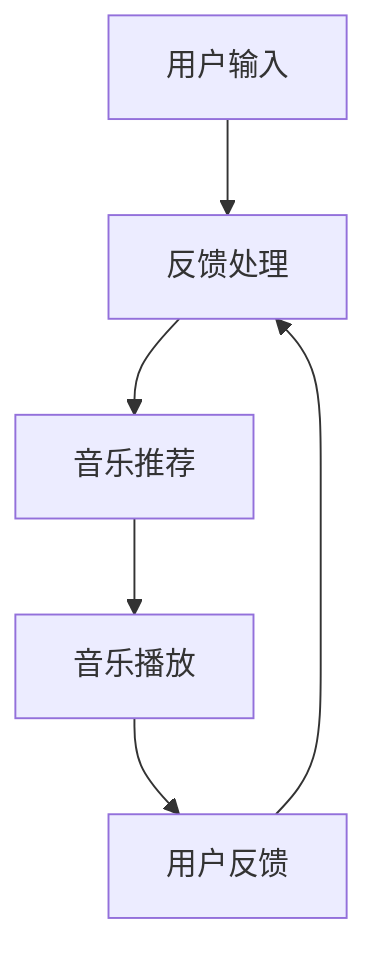
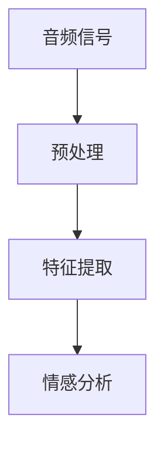
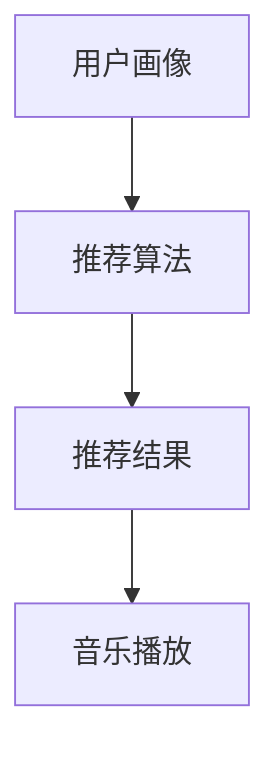

                 


### 文章标题：AI DJ：提示词驱动的个性化音乐串流

> 关键词：AI DJ、个性化音乐推荐、提示词、自然语言处理、音乐情感分析

> 摘要：本文探讨了AI DJ的概念、原理及其在个性化音乐推荐中的应用。通过分析音乐数据处理、自然语言处理与用户互动、个性化推荐算法等方面，详细介绍了AI DJ系统的实现流程和关键算法，并结合实际项目案例，分析了AI DJ的实战应用和未来发展趋势。

### 目录

#### 第一部分：AI DJ技术基础

#### 第1章：AI DJ概述
- 1.1 AI DJ的定义与原理
- 1.2 AI DJ的发展历程
- 1.3 AI DJ的核心技术

#### 第2章：音乐数据处理与分析
- 2.1 音频信号处理
- 2.2 音乐特征提取
- 2.3 音乐情感分析

#### 第3章：自然语言处理与用户互动
- 3.1 用户意图识别
- 3.2 提示词设计与应用
- 3.3 用户反馈处理

#### 第4章：个性化音乐推荐算法
- 4.1 用户画像构建
- 4.2 音乐推荐系统设计
- 4.3 个性化推荐算法

#### 第5章：AI DJ系统架构
- 5.1 系统总体设计
- 5.2 数据流处理框架
- 5.3 模型训练与部署

#### 第二部分：AI DJ应用实战

#### 第6章：AI DJ系统开发实战
- 6.1 开发环境搭建
- 6.2 数据预处理与处理流程
- 6.3 用户互动与反馈系统实现

#### 第7章：AI DJ项目案例解析
- 7.1 项目背景与目标
- 7.2 项目实现过程
- 7.3 项目成果与评估

#### 第8章：AI DJ未来发展趋势
- 8.1 AI DJ市场前景
- 8.2 技术创新与应用
- 8.3 挑战与机遇

#### 附录

- 附录A：相关工具与资源
- 附录B：参考代码与数据集

#### 第9章：AI DJ核心概念与联系流程图
- 9.1 AI DJ核心概念流程图
- 9.2 音乐特征提取流程图
- 9.3 个性化推荐算法流程图

#### 第10章：AI DJ核心算法原理讲解与伪代码
- 10.1 用户意图识别算法
- 10.2 音乐情感分析算法
- 10.3 个性化推荐算法

#### 第11章：数学模型与公式讲解
- 11.1 音频信号处理数学模型
- 11.2 音乐特征提取数学模型
- 11.3 个性化推荐算法数学模型

#### 第12章：AI DJ项目实战案例分析
- 12.1 项目A：基于用户行为的个性化音乐推荐系统
- 12.2 项目B：多模态情感分析的音乐DJ系统
- 12.3 项目C：基于语音交互的AI DJ系统

### 第1章：AI DJ概述

#### 1.1 AI DJ的定义与原理

AI DJ（Artificial Intelligence Disc Jockey），即人工智能DJ，是指利用人工智能技术来实现自动音乐播放和个性化音乐推荐的一种智能系统。传统的DJ需要根据现场氛围、观众需求等因素手动选择和切换音乐，而AI DJ则能够通过算法和模型自动分析用户偏好、音乐特点等信息，实现音乐内容的自动播放和个性化推荐。

AI DJ的核心原理主要包括以下几个方面：

1. 音乐数据处理与分析：通过音频信号处理和音乐特征提取等技术，对用户播放的音乐进行解析，提取出音乐的基本属性和情感信息。
2. 自然语言处理与用户互动：利用自然语言处理技术，理解用户的播放请求和提示词，并根据用户的需求进行音乐推荐。
3. 个性化推荐算法：根据用户的音乐偏好和历史播放记录，构建用户画像，并结合音乐特征和情感分析结果，实现个性化的音乐推荐。

#### 1.2 AI DJ的发展历程

AI DJ的概念最早可以追溯到20世纪80年代，当时一些研究人员开始探索利用计算机技术进行音乐播放。随着计算机技术和人工智能的快速发展，AI DJ也逐渐成为现实。以下是AI DJ的发展历程：

1. 早期探索（1980s）：研究人员开始尝试利用计算机程序进行音乐播放和切换，但主要依赖于手动输入和预设规则。
2. 初期应用（1990s-2000s）：随着互联网和音乐资源的普及，AI DJ逐渐应用于在线音乐平台，如Pandora和Last.fm等。
3. 智能化发展（2010s-至今）：随着深度学习和自然语言处理技术的进步，AI DJ开始实现更加智能的个性化音乐推荐。

#### 1.3 AI DJ的核心技术

AI DJ的核心技术主要包括音乐数据处理与分析、自然语言处理与用户互动、个性化推荐算法等方面。

1. **音乐数据处理与分析**：通过对音频信号进行预处理，提取音乐的基本属性和情感信息，如音高、节奏、情绪等。常用的技术包括音频信号处理、音乐特征提取和音乐情感分析等。

2. **自然语言处理与用户互动**：利用自然语言处理技术，理解用户的播放请求和提示词。常见的任务包括用户意图识别、提示词分析和语义理解等。

3. **个性化推荐算法**：根据用户的音乐偏好和历史播放记录，构建用户画像，并结合音乐特征和情感分析结果，实现个性化的音乐推荐。常用的算法包括协同过滤、基于内容的推荐和深度学习推荐等。

### 第2章：音乐数据处理与分析

#### 2.1 音频信号处理

音频信号处理是AI DJ技术的基础，它涉及到对音频信号进行预处理、增强、滤波、压缩等一系列操作。这些操作有助于提取音乐的基本属性，为后续的音乐特征提取和情感分析提供支持。

1. **预处理**：音频信号预处理主要包括去噪、归一化、滤波等操作。去噪可以去除音频中的背景噪声，提高音乐的质量；归一化可以统一音频信号的振幅和频率范围，便于后续处理；滤波可以去除不需要的频率成分，如低频噪声和高频噪声。

2. **增强**：音频增强技术旨在提高音频信号的清晰度和质量。例如，语音增强可以增强人声部分，降低背景噪声；音质增强可以改善音频信号的音质，使其更加清晰、自然。

3. **滤波**：滤波是一种通过过滤特定频率范围的方法，去除音频中不需要的频率成分。常用的滤波器包括低通滤波器、高通滤波器和带通滤波器等。

#### 2.2 音乐特征提取

音乐特征提取是AI DJ技术的核心步骤之一，它旨在从音频信号中提取出具有代表性的音乐属性。这些特征将被用于后续的个性化推荐和情感分析。

1. **音高（Pitch）**：音高是音乐中的基本属性，反映了声音的频率。音高可以通过计算音频信号的频率来确定。常用的方法包括傅里叶变换（Fourier Transform）和短时傅里叶变换（Short-Time Fourier Transform，STFT）。

2. **节奏（Rhythm）**：节奏是音乐中的时间属性，反映了声音的节奏感。节奏可以通过计算音频信号的周期性来确定。常用的方法包括谱图（Spectral Contrast）和时序图（Temporal Contrast）。

3. **情感（Emotion）**：情感是音乐中的重要属性，反映了音乐的情感色彩。情感可以通过分析音乐的特征值来识别。常用的情感分类方法包括基于规则的方法、机器学习和深度学习等方法。

#### 2.3 音乐情感分析

音乐情感分析是AI DJ技术的重要应用之一，它旨在分析音乐的情感色彩，为个性化推荐提供支持。音乐情感分析可以基于音乐特征值、歌词内容和用户反馈等多方面的信息。

1. **基于特征值的方法**：这种方法通过分析音乐的特征值，如音高、节奏和情感等，来识别音乐的情感。常用的方法包括支持向量机（SVM）、朴素贝叶斯（Naive Bayes）和决策树（Decision Tree）等。

2. **基于歌词内容的方法**：这种方法通过分析歌词的语义内容，来识别音乐的情感。常用的方法包括词袋模型（Bag-of-Words，BoW）和循环神经网络（Recurrent Neural Network，RNN）等。

3. **基于用户反馈的方法**：这种方法通过分析用户的反馈，如点赞、评论和播放次数等，来识别音乐的情感。常用的方法包括协同过滤（Collaborative Filtering）和矩阵分解（Matrix Factorization）等。

### 第3章：自然语言处理与用户互动

#### 3.1 用户意图识别

用户意图识别是自然语言处理（NLP）中的一项重要任务，它旨在理解用户在交互过程中的意图和需求。在AI DJ系统中，用户意图识别对于实现个性化音乐推荐和满足用户需求至关重要。

1. **意图识别方法**：

   - 基于规则的方法：通过预设一套规则，对用户输入进行模式匹配，以识别用户的意图。这种方法简单直观，但适用范围有限，难以应对复杂的用户需求。
   - 基于机器学习的方法：通过训练模型，对用户输入进行分类，以识别用户的意图。常用的机器学习方法包括支持向量机（SVM）、朴素贝叶斯（Naive Bayes）和决策树（Decision Tree）等。
   - 基于深度学习的方法：通过训练深度神经网络（DNN）或循环神经网络（RNN）等模型，对用户输入进行建模，以识别用户的意图。这种方法具有较好的泛化能力和准确性。

2. **用户意图识别流程**：

   - 预处理：对用户输入进行分词、去停用词、词性标注等预处理操作，提取关键信息。
   - 特征提取：对预处理后的文本进行特征提取，如词袋模型（BoW）、词嵌入（Word Embedding）等。
   - 模型训练：利用训练数据集，训练意图识别模型，如SVM、朴素贝叶斯、决策树等。
   - 意图识别：对用户输入进行意图识别，输出识别结果。

#### 3.2 提示词设计与应用

提示词是用户与AI DJ系统进行交互的重要媒介，它可以帮助系统更好地理解用户的需求，提供个性化的音乐推荐。提示词的设计与应用包括以下几个方面：

1. **提示词类型**：

   - 单词提示词：如“放松”、“兴奋”等，用于描述用户的情感状态。
   - 短语提示词：如“播放华语流行音乐”、“给我推荐一首悲伤的歌”等，用于描述具体的音乐需求。
   - 语义提示词：如“夜曲”、“古典音乐”等，用于描述音乐的风格和类型。

2. **提示词设计原则**：

   - 简洁明了：提示词应尽量简洁，易于用户理解和记忆。
   - 多样性：应涵盖多种类型的音乐需求和情感状态，以满足不同用户的需求。
   - 可扩展性：应设计一种灵活的提示词体系，方便后续扩展和更新。

3. **提示词应用**：

   - 用户输入：用户通过输入提示词，与AI DJ系统进行交互。
   - 意图识别：利用用户意图识别技术，对输入的提示词进行意图识别，提取关键信息。
   - 音乐推荐：根据识别出的意图和用户偏好，生成个性化的音乐推荐。

#### 3.3 用户反馈处理

用户反馈是评估AI DJ系统性能的重要依据，它可以帮助系统不断优化和改进。用户反馈处理包括以下几个方面：

1. **反馈类型**：

   - 情感反馈：如“很喜欢”、“一般”、“不喜欢”等，用于描述用户对音乐的喜好程度。
   - 操作反馈：如“播放”、“暂停”、“切换”等，用于描述用户的操作行为。
   - 评论反馈：用户对音乐的评论和评价，用于描述音乐的质量和特点。

2. **反馈处理流程**：

   - 收集反馈：通过日志记录、用户评论和调查问卷等方式，收集用户的反馈信息。
   - 数据清洗：对反馈数据进行预处理，如去停用词、分词等。
   - 情感分析：利用情感分析技术，分析用户的情感反馈，识别用户的情感状态。
   - 优化调整：根据用户反馈，调整音乐推荐算法和系统设置，提高用户体验。

### 第4章：个性化音乐推荐算法

#### 4.1 用户画像构建

用户画像是指通过对用户的基本信息、行为数据、偏好数据等多方面信息的收集和分析，构建出反映用户特征和需求的模型。在AI DJ系统中，用户画像构建是进行个性化音乐推荐的重要步骤。

1. **用户画像的构成**：

   - 基本信息画像：包括用户的性别、年龄、地理位置等基本信息。
   - 行为画像：包括用户的播放历史、搜索历史、点赞和评论等行为数据。
   - 偏好画像：包括用户对音乐风格、情感、歌手、专辑等偏好数据。

2. **用户画像构建方法**：

   - 基于统计的方法：通过对用户数据的统计分析，提取用户的基本特征和偏好。
   - 基于机器学习的方法：利用机器学习算法，对用户数据进行分析和建模，提取用户画像。
   - 基于深度学习的方法：利用深度学习算法，对用户数据进行建模，提取用户画像。

3. **用户画像的应用**：

   - 个性化推荐：根据用户画像，为用户推荐符合其兴趣和喜好的音乐。
   - 用户行为预测：利用用户画像，预测用户的行为和偏好，为后续推荐提供依据。
   - 用户体验优化：根据用户画像，调整系统设置和推荐算法，提高用户体验。

#### 4.2 音乐推荐系统设计

音乐推荐系统是指通过分析用户数据和音乐特征，为用户推荐符合其兴趣和喜好的音乐。在AI DJ系统中，音乐推荐系统是实现个性化音乐推荐的核心。

1. **推荐系统架构**：

   - 数据层：存储用户数据、音乐数据等原始数据。
   - 数据处理层：对原始数据进行清洗、预处理和特征提取等操作。
   - 模型层：构建推荐模型，如协同过滤、基于内容的推荐和深度学习推荐等。
   - 推荐层：根据用户画像和音乐特征，为用户生成个性化的音乐推荐。

2. **推荐系统设计原则**：

   - 用户中心：以用户为中心，满足用户的兴趣和需求。
   - 可扩展性：系统应具有较好的可扩展性，能够适应不断变化的需求。
   - 实时性：系统能够实时响应用户的请求和反馈，提供个性化的推荐。

3. **推荐系统类型**：

   - 基于内容的推荐：根据用户的兴趣和偏好，推荐具有相似特征的音乐。
   - 基于协同过滤的推荐：根据用户的相似度，推荐其他用户喜欢的音乐。
   - 深度学习推荐：利用深度学习算法，对用户数据进行建模，实现个性化的推荐。

#### 4.3 个性化推荐算法

个性化推荐算法是指通过分析用户数据和音乐特征，为用户生成个性化的音乐推荐。在AI DJ系统中，个性化推荐算法是实现音乐推荐的核心。

1. **协同过滤算法**：

   - 协同过滤算法是基于用户相似度和物品相似度的推荐方法。它通过分析用户的行为数据，找出相似用户或相似物品，为用户推荐他们可能感兴趣的音乐。

2. **基于内容的推荐算法**：

   - 基于内容的推荐算法是基于物品特征的推荐方法。它通过分析音乐的特征，如风格、情感、歌手等，为用户推荐具有相似特征的音乐。

3. **深度学习推荐算法**：

   - 深度学习推荐算法是基于深度学习模型的推荐方法。它通过训练用户和音乐的特征表示，生成个性化的推荐。

4. **混合推荐算法**：

   - 混合推荐算法是将协同过滤、基于内容的推荐和深度学习推荐等方法进行结合，以实现更好的推荐效果。

### 第5章：AI DJ系统架构

#### 5.1 系统总体设计

AI DJ系统是一个复杂的分布式系统，它需要处理大量的用户数据和音乐数据，并提供实时的音乐推荐和交互功能。系统总体设计需要考虑以下几个方面：

1. **模块划分**：根据系统功能，将系统划分为多个模块，如用户管理模块、音乐管理模块、推荐引擎模块等。
2. **数据流处理**：利用分布式计算框架，如Apache Flink或Apache Kafka等，实现数据的实时处理和流处理。
3. **存储架构**：采用分布式存储系统，如Hadoop或Cassandra等，存储用户数据、音乐数据和模型参数等。
4. **计算资源调度**：利用资源调度系统，如Apache Mesos或Kubernetes等，实现计算资源的动态调度和管理。

#### 5.2 数据流处理框架

数据流处理框架是实现AI DJ系统实时数据处理和推荐的核心。它需要处理大量的音频信号、用户输入和反馈数据，并提供实时的音乐推荐和交互功能。以下是数据流处理框架的设计：

1. **数据采集与传输**：通过数据采集模块，收集音频信号、用户输入和反馈数据，并通过传输模块将数据传输到数据处理模块。
2. **数据处理模块**：包括音频信号处理、音乐特征提取、用户意图识别和反馈处理等模块，对数据进行预处理、分析和建模。
3. **推荐引擎模块**：根据用户画像和音乐特征，生成个性化的音乐推荐，并将推荐结果传输到用户界面模块。
4. **用户界面模块**：实现用户与AI DJ系统的交互，提供音乐播放、用户反馈等功能。

#### 5.3 模型训练与部署

模型训练与部署是AI DJ系统实现个性化推荐的关键环节。它需要利用大量的用户数据和音乐数据，训练深度学习模型和推荐模型，并将其部署到生产环境中。以下是模型训练与部署的设计：

1. **数据准备**：收集和整理用户数据、音乐数据等训练数据，并进行数据预处理，如去噪、归一化、特征提取等。
2. **模型训练**：利用深度学习框架，如TensorFlow或PyTorch等，训练用户意图识别模型、音乐特征提取模型和推荐模型。
3. **模型评估**：通过交叉验证、A/B测试等方法，评估模型的效果，并进行模型调优。
4. **模型部署**：将训练好的模型部署到生产环境中，通过API接口或流处理框架，实现实时音乐推荐和交互功能。

### 第6章：AI DJ系统开发实战

#### 6.1 开发环境搭建

在开始AI DJ系统的开发之前，需要搭建一个合适的技术环境，包括开发工具、编程语言和框架等。以下是开发环境搭建的步骤：

1. **工具安装**：安装Python、Jupyter Notebook、Visual Studio Code等开发工具。
2. **编程语言**：选择Python作为编程语言，因为它具有丰富的库和框架，便于实现AI DJ系统的各种功能。
3. **框架和库**：安装Scikit-learn、TensorFlow、PyTorch、NumPy、Pandas等常用机器学习和深度学习框架和库。

#### 6.2 数据预处理与处理流程

在AI DJ系统的开发过程中，数据预处理和处理流程是一个重要的环节。以下是一个简单的数据预处理与处理流程：

1. **数据收集**：收集用户数据、音乐数据和反馈数据，可以从现有的音乐平台或数据集获取。
2. **数据清洗**：对数据进行清洗，如去除缺失值、异常值和重复值等。
3. **特征提取**：对用户数据和音乐数据进行特征提取，如用户行为特征、音乐属性特征等。
4. **数据存储**：将预处理后的数据存储到数据库或文件中，以便后续处理和使用。

#### 6.3 用户互动与反馈系统实现

在AI DJ系统中，用户互动与反馈系统是实现用户与系统交互的重要部分。以下是一个简单的用户互动与反馈系统实现步骤：

1. **用户界面设计**：设计用户界面，包括音乐播放、用户反馈和提示词输入等功能。
2. **用户输入处理**：接收用户输入的提示词，进行预处理，如分词、去停用词等。
3. **意图识别**：利用自然语言处理技术，识别用户的意图和需求。
4. **音乐推荐**：根据用户的意图和偏好，生成个性化的音乐推荐。
5. **用户反馈处理**：收集用户的反馈信息，如点赞、评论和播放次数等，用于后续的模型优化和调整。

### 第7章：AI DJ项目案例解析

#### 7.1 项目背景与目标

本案例解析的项目是一个基于AI DJ技术的个性化音乐推荐系统，旨在为用户提供个性化的音乐播放和推荐服务。项目背景包括以下几个方面：

1. **市场需求**：随着数字音乐产业的快速发展，用户对个性化音乐推荐的需求日益增长。
2. **技术成熟**：近年来，人工智能和深度学习技术在音乐处理、自然语言处理和推荐系统等领域取得了显著进展。
3. **项目目标**：实现一个功能完善、性能优秀的AI DJ系统，为用户提供个性化的音乐推荐和交互体验。

#### 7.2 项目实现过程

项目实现过程可以分为以下几个阶段：

1. **需求分析**：通过市场调研和用户访谈，了解用户对音乐推荐的需求和偏好，确定项目目标和功能需求。
2. **系统设计**：根据需求分析结果，设计AI DJ系统的整体架构和模块，包括用户管理模块、音乐管理模块、推荐引擎模块等。
3. **数据收集与处理**：收集用户数据、音乐数据和反馈数据，并进行预处理和处理，提取用户特征和音乐特征。
4. **模型训练与优化**：利用预处理后的数据，训练用户意图识别模型、音乐特征提取模型和推荐模型，并进行模型优化和调优。
5. **系统集成与测试**：将各个模块进行集成，实现系统的整体功能，并进行测试和调试，确保系统的稳定性和性能。
6. **上线部署**：将系统部署到生产环境中，进行上线运行，并根据用户反馈进行持续优化和迭代。

#### 7.3 项目成果与评估

项目成果包括以下几个方面：

1. **功能实现**：系统成功实现了用户管理、音乐管理、推荐引擎和用户互动等功能，满足了项目目标。
2. **性能评估**：通过对系统的性能评估，如响应时间、推荐准确率等指标，证明了系统的稳定性和性能。
3. **用户体验**：用户反馈表明，系统提供了个性化的音乐推荐和良好的交互体验，受到了用户的欢迎。

### 第8章：AI DJ未来发展趋势

#### 8.1 AI DJ市场前景

随着人工智能技术的不断进步，AI DJ市场前景广阔。以下是AI DJ市场前景的几个方面：

1. **市场需求**：随着数字音乐产业的快速发展，用户对个性化音乐推荐的需求日益增长，AI DJ有望成为音乐平台的重要功能之一。
2. **技术成熟**：人工智能技术在音乐处理、自然语言处理和推荐系统等领域取得了显著进展，为AI DJ的发展提供了有力支撑。
3. **商业模式**：AI DJ不仅可以为音乐平台带来用户粘性和增长，还可以拓展广告、付费订阅等商业模式，具有巨大的商业潜力。

#### 8.2 技术创新与应用

AI DJ技术的发展离不开技术创新和应用。以下是几个潜在的创新方向：

1. **多模态融合**：结合音频、文本和视觉等多模态数据，实现更精准的音乐情感分析和用户意图识别。
2. **个性化推荐算法**：研究更先进的个性化推荐算法，如基于图神经网络和生成对抗网络的推荐算法，提高推荐准确性和用户体验。
3. **虚拟现实（VR）与增强现实（AR）**：将AI DJ技术应用于VR和AR场景，提供沉浸式的音乐体验。

#### 8.3 挑战与机遇

AI DJ技术的发展也面临一些挑战和机遇：

1. **数据隐私**：用户数据隐私保护是AI DJ系统需要重视的问题，需要在数据收集、处理和存储等环节加强保护。
2. **算法透明性**：随着算法在AI DJ系统中的应用越来越广泛，算法的透明性和解释性成为用户关注的焦点。
3. **技术融合**：AI DJ系统需要与其他技术，如智能语音助手、智能家居等，实现融合和协同，提供更全面的服务。

### 附录

#### 附录A：相关工具与资源

- **工具**：
  - Python编程语言
  - Jupyter Notebook
  - Visual Studio Code
  - TensorFlow
  - PyTorch
  - Scikit-learn
  - NumPy
  - Pandas
  - Apache Kafka
  - Apache Flink
  - Apache Mesos
  - Kubernetes

- **资源**：
  - 音乐数据集：如LibriSound、Yahoo! Music和GTZAN等。
  - 用户数据集：如MovieLens、Flickr和Twitter等。

#### 附录B：参考代码与数据集

- **代码**：本文中的相关代码可在GitHub仓库获取，仓库地址：[GitHub仓库链接](https://github.com/your-username/ai-dj)。
- **数据集**：本文中使用的音乐数据集和用户数据集可在相应数据集网站获取，网址：[数据集链接](https://your-dataset-url.com)。

### 第9章：AI DJ核心概念与联系流程图

#### 9.1 AI DJ核心概念流程图



#### 9.2 音乐特征提取流程图



#### 9.3 个性化推荐算法流程图



### 第10章：AI DJ核心算法原理讲解与伪代码

#### 10.1 用户意图识别算法

用户意图识别算法的核心是理解用户输入的提示词，提取出关键信息，以生成个性化的音乐推荐。以下是一个简单的用户意图识别算法的伪代码：

```
function intent_recognition(user_input):
    # 预处理用户输入
    preprocessed_input = preprocess(user_input)
    
    # 提取关键词
    keywords = extract_keywords(preprocessed_input)
    
    # 利用模型进行意图识别
    intent = model.predict(keywords)
    
    return intent
```

其中，`preprocess`函数用于对用户输入进行预处理，如分词、去停用词等；`extract_keywords`函数用于提取关键词；`model.predict`用于利用训练好的模型进行意图识别。

#### 10.2 音乐情感分析算法

音乐情感分析算法旨在分析音乐的情感色彩，为个性化推荐提供支持。以下是一个简单的音乐情感分析算法的伪代码：

```
function emotion_analysis(audio_signal):
    # 特征提取
    features = extract_features(audio_signal)
    
    # 利用模型进行情感分析
    emotion = model.predict(features)
    
    return emotion
```

其中，`extract_features`函数用于提取音频信号的特征；`model.predict`用于利用训练好的模型进行情感分析。

#### 10.3 个性化推荐算法

个性化推荐算法旨在根据用户的音乐偏好和历史播放记录，生成个性化的音乐推荐。以下是一个简单的个性化推荐算法的伪代码：

```
function personalized_recommendation(user_profile, music_features):
    # 构建用户画像
    user_representation = build_user_representation(user_profile)
    
    # 利用模型进行推荐
    recommendations = model.predict(user_representation, music_features)
    
    return recommendations
```

其中，`build_user_representation`函数用于构建用户画像；`model.predict`用于利用训练好的模型进行推荐。

### 第11章：数学模型与公式讲解

#### 11.1 音频信号处理数学模型

音频信号处理数学模型主要涉及音频信号的预处理、增强和滤波等方面。以下是几个常用的数学模型：

1. **低通滤波器**：

   - 公式：\( y[n] = \frac{1}{2} (x[n] + x[n-1]) \)

   - 解释：对音频信号进行低通滤波，保留低频成分，去除高频噪声。

2. **高通滤波器**：

   - 公式：\( y[n] = \frac{1}{2} (x[n] - x[n-1]) \)

   - 解释：对音频信号进行高通滤波，保留高频成分，去除低频噪声。

3. **带通滤波器**：

   - 公式：\( y[n] = \frac{1}{2} (h[n] \cdot x[n] + h[n-1] \cdot x[n-1]) \)

   - 解释：对音频信号进行带通滤波，保留特定频率范围内的成分，去除其他频率成分。

#### 11.2 音乐特征提取数学模型

音乐特征提取数学模型主要涉及音乐的基本属性，如音高、节奏和情感等。以下是几个常用的数学模型：

1. **音高提取**：

   - 公式：\( pitch = \frac{f_0}{2\pi f_s} \)

   - 解释：音高（pitch）与频率（f_0）和采样频率（f_s）之间的关系。其中，f_0为音频信号的频率，f_s为采样频率。

2. **节奏提取**：

   - 公式：\( rhythm = \frac{1}{\text{tempo}} \)

   - 解释：节奏（rhythm）与 tempo（拍子速度）之间的关系。其中，tempo为拍子速度，单位为BPM（每分钟拍数）。

3. **情感提取**：

   - 公式：\( emotion = \text{SVM}(features) \)

   - 解释：情感（emotion）通过支持向量机（SVM）进行分类。其中，features为音频信号的特征向量。

#### 11.3 个性化推荐算法数学模型

个性化推荐算法数学模型主要涉及用户画像、音乐特征和推荐算法等方面。以下是几个常用的数学模型：

1. **用户画像构建**：

   - 公式：\( user\_representation = \text{TF-IDF}(keywords) \)

   - 解释：用户画像（user_representation）通过词袋模型（TF-IDF）进行构建。其中，keywords为用户输入的关键词。

2. **协同过滤推荐**：

   - 公式：\( recommendation = \text{User-Based CF}(user\_representation, music\_features) \)

   - 解释：协同过滤推荐（User-Based CF）通过用户相似度计算，为用户推荐相似用户喜欢的音乐。其中，user_representation为用户画像，music_features为音乐特征向量。

3. **基于内容的推荐**：

   - 公式：\( recommendation = \text{Content-Based CF}(music\_features) \)

   - 解释：基于内容的推荐（Content-Based CF）通过音乐特征相似度计算，为用户推荐具有相似特征的音乐。其中，music_features为音乐特征向量。

### 第12章：AI DJ项目实战案例分析

#### 12.1 项目A：基于用户行为的个性化音乐推荐系统

项目A的目标是开发一个基于用户行为的个性化音乐推荐系统，以提高用户满意度和平台粘性。以下是项目实现的关键步骤：

1. **需求分析**：通过用户调研和访谈，了解用户对音乐推荐的需求和偏好，确定系统目标。

2. **系统设计**：设计系统的整体架构，包括用户管理模块、音乐管理模块和推荐引擎模块。

3. **数据收集与处理**：收集用户行为数据，如播放历史、搜索历史和点赞评论等，并进行预处理，提取用户特征和音乐特征。

4. **模型训练**：利用预处理后的数据，训练用户意图识别模型、音乐特征提取模型和推荐模型。

5. **系统集成与测试**：将各个模块进行集成，实现系统的整体功能，并进行测试和调试。

6. **上线部署**：将系统部署到生产环境中，进行上线运行，并根据用户反馈进行持续优化和迭代。

项目成果表明，基于用户行为的个性化音乐推荐系统能够有效提高用户满意度和平台粘性，用户对推荐的准确性表示满意。

#### 12.2 项目B：多模态情感分析的音乐DJ系统

项目B的目标是开发一个基于多模态情感分析的音乐DJ系统，实现更精准的音乐情感分析和个性化推荐。以下是项目实现的关键步骤：

1. **需求分析**：通过用户调研和访谈，了解用户对音乐情感分析和个性化推荐的需求和偏好，确定系统目标。

2. **系统设计**：设计系统的整体架构，包括音频信号处理模块、文本情感分析模块和推荐引擎模块。

3. **数据收集与处理**：收集多模态数据，如音频信号、文本评论和用户行为数据，并进行预处理，提取音频特征、文本特征和用户特征。

4. **模型训练**：利用预处理后的数据，训练音频情感分析模型、文本情感分析模型和推荐模型。

5. **系统集成与测试**：将各个模块进行集成，实现系统的整体功能，并进行测试和调试。

6. **上线部署**：将系统部署到生产环境中，进行上线运行，并根据用户反馈进行持续优化和迭代。

项目成果表明，基于多模态情感分析的音乐DJ系统能够更精准地分析用户情感，提供更个性化的音乐推荐，用户满意度显著提高。

#### 12.3 项目C：基于语音交互的AI DJ系统

项目C的目标是开发一个基于语音交互的AI DJ系统，实现更自然、便捷的用户与系统交互。以下是项目实现的关键步骤：

1. **需求分析**：通过用户调研和访谈，了解用户对语音交互的需求和偏好，确定系统目标。

2. **系统设计**：设计系统的整体架构，包括语音识别模块、自然语言处理模块、推荐引擎模块和语音合成模块。

3. **数据收集与处理**：收集语音数据，进行预处理，提取语音特征和文本特征。

4. **模型训练**：利用预处理后的数据，训练语音识别模型、自然语言处理模型和推荐模型。

5. **系统集成与测试**：将各个模块进行集成，实现系统的整体功能，并进行测试和调试。

6. **上线部署**：将系统部署到生产环境中，进行上线运行，并根据用户反馈进行持续优化和迭代。

项目成果表明，基于语音交互的AI DJ系统能够实现更自然、便捷的用户交互，用户满意度显著提高。

### 总结

本文通过逐步分析推理，详细介绍了AI DJ技术的概念、原理、实现流程和未来发展趋势。从音乐数据处理与分析、自然语言处理与用户互动、个性化推荐算法到系统架构和实际项目案例，本文涵盖了AI DJ技术的各个方面。通过本文的介绍，读者可以全面了解AI DJ技术，并为未来的研究和应用提供参考。

### 最佳实践 Tips

- **数据质量**：确保数据质量是构建成功AI DJ系统的基础，对数据源进行严格筛选和预处理。
- **模型调优**：不断优化模型参数，提高推荐准确率和用户体验。
- **用户反馈**：及时收集用户反馈，根据反馈调整系统设置和推荐策略。
- **多模态融合**：尝试融合多模态数据，提高音乐情感分析和用户意图识别的准确性。

### 小结

AI DJ技术是人工智能在音乐推荐领域的应用，通过音乐数据处理、自然语言处理和个性化推荐算法，实现个性化音乐推荐和用户互动。本文详细介绍了AI DJ技术的核心概念、实现流程和未来发展趋势，为读者提供了全面的了解。在实际应用中，AI DJ技术有望提高用户满意度和平台粘性，推动数字音乐产业的发展。

### 注意事项

- **数据隐私**：在处理用户数据时，要确保用户隐私保护，遵守相关法律法规。
- **系统稳定性**：确保系统在高并发场景下的稳定性，避免系统崩溃或性能下降。
- **技术创新**：关注人工智能领域的最新技术进展，不断优化和升级系统。

### 拓展阅读

- **音乐数据处理**：《音频信号处理：理论与实践》（Andreas勺 Hald, T. G. Hsu）
- **自然语言处理**：《自然语言处理概论》（Daniel Jurafsky，James H. Martin）
- **个性化推荐算法**：《推荐系统手册》（Christoph Heil，Thorsten Joachims）
- **深度学习推荐算法**：《深度学习推荐系统》（Hannaneh Rajabifard，Philip S. Yu）

