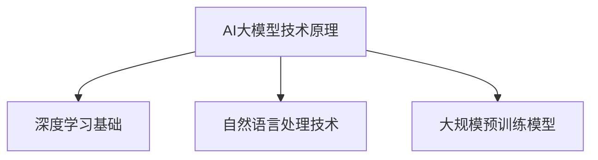

                 

### 文章标题

《AI大模型在创业产品运营中的趋势》

### 关键词

- AI大模型
- 创业产品运营
- 应用场景
- 技术原理
- 成功案例

### 摘要

本文将深入探讨AI大模型在创业产品运营中的趋势。首先，我们将回顾AI大模型的基础知识，包括其历史发展、基本概念、应用领域以及优势与挑战。接着，我们将详细讲解AI大模型的技术原理，包括深度学习基础、自然语言处理技术和大规模预训练模型。随后，本文将重点讨论AI大模型在创业产品运营中的应用场景，包括用户画像与个性化推荐、情感分析与舆情监测、自动化客服与智能对话系统以及机器学习在数据分析中的应用。此外，我们将分析AI大模型在创业产品运营中的实施策略，并解析一些成功的案例。最后，本文将展望AI大模型在创业产品运营中的未来趋势，并提出创新方向和应对策略。通过本文的深入分析，我们希望为创业者在AI大模型应用中的实践提供有价值的指导和建议。

### 《AI大模型在创业产品运营中的趋势》目录大纲

#### 第一部分：AI大模型基础与概述

#### 第1章：AI大模型概述
1. AI大模型的历史与发展
2. AI大模型的基本概念
3. AI大模型的应用领域
4. AI大模型的优势与挑战

#### 第2章：AI大模型技术原理
1. 深度学习基础
2. 自然语言处理技术
3. 大规模预训练模型

#### 第二部分：AI大模型在创业产品运营中的应用

#### 第3章：AI大模型在创业产品运营中的应用场景
1. 用户画像与个性化推荐
2. 情感分析与舆情监测
3. 自动化客服与智能对话系统
4. 机器学习在数据分析中的应用

#### 第4章：AI大模型在创业产品运营中的实施策略
1. 创业产品AI化的可行性评估
2. AI大模型项目的生命周期管理
3. 数据驱动的产品优化

#### 第5章：AI大模型在创业产品运营中的成功案例解析
1. 案例一：基于AI的个性化教育平台
2. 案例二：智能健康管理平台
3. 案例三：基于AI的电商推荐系统

#### 第三部分：AI大模型在创业产品运营中的趋势与展望

#### 第6章：AI大模型在创业产品运营中的未来趋势
1. AI大模型在新兴领域的应用
2. AI大模型的未来发展方向
3. AI大模型在创业产品运营中的战略规划

#### 第7章：AI大模型在创业产品运营中的创新与挑战
1. 创新方向
2. 挑战与应对策略

#### 附录
1. AI大模型开发工具与资源

#### 参考文献

#### Mermaid流程图

#### 伪代码示例

#### 数学模型与公式

---

### 第一部分：AI大模型基础与概述

#### 第1章：AI大模型概述

##### 1. AI大模型的历史与发展

人工智能（AI）作为计算机科学的一个分支，其历史可以追溯到20世纪50年代。早期的AI研究主要集中在符号推理和规则系统，这一阶段的代表性工作包括逻辑推理系统、专家系统等。然而，这些早期方法在面对复杂任务时显得力不从心。

随着计算能力的提升和大数据技术的发展，深度学习逐渐成为AI领域的核心技术。深度学习通过模拟人脑神经网络结构，实现了对大量数据的学习和自动特征提取。这一阶段，以2012年AlexNet在ImageNet竞赛中取得的突破性成绩为标志，深度学习开始受到广泛关注。

进入21世纪，AI技术进一步发展，特别是在自然语言处理、计算机视觉等领域，涌现出许多大型模型。这些模型通常包含数亿甚至数千亿个参数，因此被称为“大模型”。大模型的出现，使得AI在图像识别、语音识别、自然语言处理等方面取得了显著的进展。

##### 2. AI大模型的基本概念

AI大模型是指具有数十亿至数千亿参数规模的人工神经网络模型。这些模型通过在大量数据上进行训练，能够自动学习并提取复杂的数据特征。基本概念包括：

- **神经网络**：由多个神经元组成的计算模型，通过学习数据之间的相关性来实现特定任务。
- **参数**：网络中的权重和偏置，用于调节神经元之间的连接强度。
- **规模**：通常以参数数量来衡量，大模型具有数十亿至数千亿个参数。

##### 3. AI大模型的应用领域

AI大模型在多个领域展示了其强大的能力，包括：

- **互联网应用**：在搜索引擎、社交媒体推荐、广告投放等领域，AI大模型通过个性化推荐和内容生成，提高了用户体验和广告效果。
- **金融领域**：在风险评估、欺诈检测、量化交易等方面，AI大模型通过分析大量金融数据，实现了更高的预测准确性和风险控制。
- **医疗健康**：在疾病诊断、药物研发、健康管理等方面，AI大模型通过对医学数据和文献的分析，提高了医疗服务的质量和效率。
- **其他领域**：在自动驾驶、智能制造、智能客服等领域，AI大模型通过模拟人类的思维过程，实现了自动化和智能化。

##### 4. AI大模型的优势与挑战

AI大模型的优势包括：

- **强大的学习能力**：通过大规模数据训练，大模型能够自动提取复杂的特征，实现高精度的任务完成。
- **泛化能力**：大模型能够适应不同的任务和数据分布，具有良好的泛化能力。
- **效率提升**：大模型能够处理海量数据，提高了任务处理的效率和速度。

然而，AI大模型也面临一些挑战：

- **计算资源需求**：大模型训练需要大量的计算资源和时间，这对硬件设备提出了较高的要求。
- **数据依赖性**：大模型依赖于大量数据训练，数据的质量和数量直接影响模型的性能。
- **模型解释性**：大模型的内部机制复杂，缺乏透明性，难以解释模型的决策过程。

##### 总结

AI大模型作为人工智能领域的重要发展，已经在多个领域展示了其强大的应用价值。了解其历史发展、基本概念、应用领域和优势与挑战，对于创业者在产品运营中应用AI大模型具有重要意义。接下来，我们将深入探讨AI大模型的技术原理，以更好地理解其背后的工作机制。

### 第一部分：AI大模型基础与概述

#### 第2章：AI大模型技术原理

##### 1. 深度学习基础

深度学习（Deep Learning）是人工智能领域的一个分支，主要研究如何通过大规模神经网络进行数据建模和任务优化。深度学习的基础主要包括以下几个核心概念：

- **神经网络（Neural Networks）**：神经网络是一种模仿生物神经系统的计算模型，由多个神经元组成。每个神经元接收多个输入，通过权重进行加权求和，再通过激活函数输出结果。神经网络通过学习大量的输入输出对，能够自动提取数据中的特征。

- **反向传播（Backpropagation）**：反向传播是一种用于训练神经网络的算法，通过计算输出误差的梯度，调整网络中的权重和偏置，使网络输出更接近期望值。反向传播算法的核心在于计算损失函数关于网络参数的梯度，从而优化网络参数。

- **损失函数（Loss Functions）**：损失函数用于衡量模型预测结果与真实结果之间的差距。常见的损失函数包括均方误差（MSE）、交叉熵损失（Cross-Entropy Loss）等。损失函数的值越低，表示模型预测结果越准确。

- **激活函数（Activation Functions）**：激活函数用于引入非线性变换，使神经网络能够处理非线性问题。常见的激活函数包括sigmoid、ReLU、Tanh等。激活函数的选择对网络的性能和训练速度有重要影响。

##### 2. 自然语言处理技术

自然语言处理（Natural Language Processing，NLP）是深度学习应用的一个重要领域，主要研究如何使计算机理解和处理人类语言。NLP的核心技术包括：

- **词嵌入（Word Embeddings）**：词嵌入是将文本中的单词映射到高维向量空间的一种技术，通过向量表示，能够捕捉单词之间的语义关系。常见的词嵌入方法包括Word2Vec、GloVe等。

- **序列模型（Sequence Models）**：序列模型用于处理序列数据，如文本、语音等。常见的序列模型包括循环神经网络（RNN）、长短期记忆网络（LSTM）、门控循环单元（GRU）等。序列模型通过捕捉时间步之间的关联，实现序列数据的建模。

- **注意力机制（Attention Mechanism）**：注意力机制是一种用于提高神经网络对序列数据建模能力的技术。通过注意力机制，模型能够自动关注重要的输入信息，忽略不重要的信息。注意力机制在机器翻译、文本摘要等领域取得了显著的成果。

##### 3. 大规模预训练模型

大规模预训练模型（Pre-Trained Models）是近年来AI领域的一个重要突破，通过在大量无标签数据上进行预训练，再通过微调（Fine-Tuning）应用到特定任务中，大幅提升了模型的性能。大规模预训练模型的核心技术包括：

- **预训练（Pre-Training）**：预训练是指在大规模无标签数据上训练模型，使模型能够自动学习通用特征。常见的预训练任务包括文本分类、命名实体识别、情感分析等。

- **自监督学习（Self-Supervised Learning）**：自监督学习是一种无需人工标注数据，直接利用数据中的自然关系进行训练的方法。通过自监督学习，模型能够自动学习数据的结构化信息，提高模型的泛化能力。

- **迁移学习（Transfer Learning）**：迁移学习是指将预训练模型在特定任务上的经验迁移到新的任务中。通过迁移学习，模型能够利用预训练阶段的通用特征，快速适应新的任务。

- **微调（Fine-Tuning）**：微调是指将预训练模型在特定任务的数据上进行少量训练，使模型更好地适应新的任务。微调通过调整模型的参数，使模型在新任务上的性能达到最佳。

##### 总结

AI大模型的技术原理涉及深度学习基础、自然语言处理技术和大规模预训练模型。深度学习为基础，提供了神经网络、反向传播、损失函数和激活函数等核心概念；自然语言处理技术则关注词嵌入、序列模型和注意力机制，为处理文本数据提供了有效方法；大规模预训练模型则通过预训练、自监督学习、迁移学习和微调等关键技术，实现了模型的高效训练和应用。理解这些技术原理，对于创业者在产品运营中应用AI大模型具有重要意义。在下一部分中，我们将探讨AI大模型在创业产品运营中的应用场景。

### 第二部分：AI大模型在创业产品运营中的应用

#### 第3章：AI大模型在创业产品运营中的应用场景

##### 1. 用户画像与个性化推荐

用户画像与个性化推荐是AI大模型在创业产品运营中的一个重要应用场景。通过构建用户画像，企业可以深入了解用户的需求和行为特征，从而实现个性化的产品推荐和精准的市场营销。

**核心概念与联系**

- **用户画像**：用户画像是对用户特征的全方位描述，包括用户的年龄、性别、地域、兴趣爱好、消费行为等。通过用户画像，企业可以构建个性化的用户模型，实现精准的用户定位。

- **个性化推荐**：个性化推荐是基于用户画像和用户行为数据，为用户提供个性化的内容或产品推荐。常见的推荐算法包括协同过滤（Collaborative Filtering）和基于内容的推荐（Content-Based Filtering）。

**核心算法原理**

- **协同过滤**：协同过滤是一种基于用户行为相似性的推荐算法，通过分析用户之间的相似度，为用户提供相似用户喜欢的商品推荐。协同过滤可以分为两种：基于用户的协同过滤（User-Based）和基于物品的协同过滤（Item-Based）。

  **伪代码示例**：

  ```python
  # 伪代码：基于用户的协同过滤
  function UserBasedCollaborativeFiltering(user_data, similarity_matrix):
      similar_users = find_similar_users(user_data, similarity_matrix)
      recommended_items = recommend_items(similar_users, user_data)
      return recommended_items
  ```

- **基于内容的推荐**：基于内容的推荐是一种基于物品相似性的推荐算法，通过分析物品的特征和属性，为用户提供相似内容的推荐。

  **伪代码示例**：

  ```python
  # 伪代码：基于内容的推荐
  function ContentBasedFiltering(item_features, user_interests):
      similar_items = find_similar_items(item_features, user_interests)
      recommended_items = recommend_items(similar_items, user_data)
      return recommended_items
  ```

**数学模型与公式**

用户相似度计算公式：

$$
similarity(u, v) = \frac{u \cdot v}{\|u\| \cdot \|v\|}
$$

其中，$u$和$v$分别表示用户$u$和用户$v$的特征向量，$\|u\|$和$\|v\|$分别表示特征向量的欧氏范数。

##### 2. 情感分析与舆情监测

情感分析（Sentiment Analysis）和舆情监测（Sentiment Monitoring）是AI大模型在创业产品运营中的另一个重要应用场景。通过分析用户对产品或服务的情感和意见，企业可以了解用户需求，优化产品设计，提升用户满意度。

**核心概念与联系**

- **情感分析**：情感分析是指从文本数据中识别和提取情感信息的过程。情感分析可以分为两类：基于规则的方法和基于模型的方法。

- **舆情监测**：舆情监测是指对公众意见、舆论趋势进行跟踪和分析，以了解社会热点和公众情绪。

**核心算法原理**

- **基于规则的方法**：基于规则的方法通过预定义的规则和特征，对文本进行情感分类。常见的规则包括情感词词典、情感强度词典等。

  **伪代码示例**：

  ```python
  # 伪代码：基于规则的情感分析
  function RuleBasedSentimentAnalysis(text, rule_dict):
      sentiment_score = 0
      for word in text:
          if word in rule_dict:
              sentiment_score += rule_dict[word]
      sentiment = determine_sentiment(sentiment_score)
      return sentiment
  ```

- **基于模型的方法**：基于模型的方法通过训练大规模神经网络模型，实现情感分类。常见的模型包括朴素贝叶斯（Naive Bayes）、支持向量机（SVM）、深度学习模型等。

  **伪代码示例**：

  ```python
  # 伪代码：基于模型的情感分析
  function ModelBasedSentimentAnalysis(text, sentiment_model):
      sentiment = sentiment_model.predict([text])
      return sentiment
  ```

**数学模型与公式**

情感分类概率计算公式：

$$
P(\text{sentiment}|\text{text}) = \frac{P(\text{text}|\text{sentiment}) \cdot P(\text{sentiment})}{P(\text{text})}
$$

其中，$P(\text{sentiment}|\text{text})$表示给定文本$P$属于情感类别$S$的概率，$P(\text{text}|\text{sentiment})$表示在情感类别$S$下文本$P$的概率，$P(\text{sentiment})$表示情感类别$S$的概率，$P(\text{text})$表示文本$P$的概率。

##### 3. 自动化客服与智能对话系统

自动化客服与智能对话系统是AI大模型在创业产品运营中的又一项重要应用。通过自动化客服，企业可以提升客户服务水平，降低运营成本；而智能对话系统则可以为用户提供更加自然、流畅的交互体验。

**核心概念与联系**

- **自动化客服**：自动化客服是一种通过计算机系统自动处理客户咨询和问题的服务方式。常见的自动化客服系统包括聊天机器人、智能客服等。

- **智能对话系统**：智能对话系统是一种能够理解自然语言，与用户进行交互并提供服务的系统。智能对话系统通常基于语音识别、自然语言处理、语音合成等技术实现。

**核心算法原理**

- **语音识别（Speech Recognition）**：语音识别是将语音信号转换为文本数据的技术。常见的语音识别模型包括隐马尔可夫模型（HMM）、深度神经网络（DNN）等。

  **伪代码示例**：

  ```python
  # 伪代码：语音识别
  function SpeechRecognition(audio_data, speech_model):
      text = speech_model.decode(audio_data)
      return text
  ```

- **自然语言处理（Natural Language Processing，NLP）**：自然语言处理是理解、处理和生成自然语言的技术。NLP包括词性标注、句法分析、语义理解等任务。

  **伪代码示例**：

  ```python
  # 伪代码：自然语言处理
  function NaturalLanguageProcessing(text, nlp_model):
      tokens = nlp_model.tokenize(text)
      pos_tags = nlp_model.tag_tokens(tokens)
      syntactic_tree = nlp_model.parse_syntax(tokens, pos_tags)
      return syntactic_tree
  ```

- **语音合成（Text-to-Speech，TTS）**：语音合成是将文本数据转换为语音信号的技术。常见的语音合成模型包括循环神经网络（RNN）、生成对抗网络（GAN）等。

  **伪代码示例**：

  ```python
  # 伪代码：语音合成
  function TextToSpeech(text, tts_model):
      audio_data = tts_model.generate_audio(text)
      return audio_data
  ```

**数学模型与公式**

语音识别模型概率计算公式：

$$
P(\text{text}|\text{audio}) = \prod_{i=1}^{n} P(\text{word}_i|\text{audio}_i)
$$

其中，$P(\text{word}_i|\text{audio}_i)$表示给定音频段$P$中第$i$个单词出现的概率。

##### 4. 机器学习在数据分析中的应用

机器学习在数据分析中的应用可以帮助创业企业从海量数据中提取有价值的信息，实现数据驱动的决策。常见的机器学习方法包括监督学习、无监督学习和强化学习。

**核心概念与联系**

- **监督学习（Supervised Learning）**：监督学习是利用带有标签的数据训练模型，从而实现预测或分类任务。常见的监督学习方法包括线性回归、决策树、支持向量机等。

- **无监督学习（Unsupervised Learning）**：无监督学习是利用无标签的数据训练模型，从而发现数据中的结构和模式。常见的无监督学习方法包括聚类、降维、关联规则挖掘等。

- **强化学习（Reinforcement Learning）**：强化学习是通过与环境交互，不断学习最优策略的过程。常见的强化学习方法包括Q学习、深度Q网络（DQN）等。

**核心算法原理**

- **线性回归（Linear Regression）**：线性回归是一种简单的监督学习方法，通过拟合数据中的线性关系，实现预测任务。

  **伪代码示例**：

  ```python
  # 伪代码：线性回归
  function LinearRegression(data, target):
      model = train_linear_regression(data, target)
      predictions = model.predict(new_data)
      return predictions
  ```

- **决策树（Decision Tree）**：决策树是一种基于树形结构进行分类和回归的算法。决策树通过递归划分数据集，构建出一棵决策树模型。

  **伪代码示例**：

  ```python
  # 伪代码：决策树
  function DecisionTree(data, target):
      tree = build_decision_tree(data, target)
      predictions = tree.predict(new_data)
      return predictions
  ```

- **聚类（Clustering）**：聚类是一种无监督学习方法，通过将数据分成若干个簇，实现数据的分类和归纳。

  **伪代码示例**：

  ```python
  # 伪代码：聚类
  function Clustering(data):
      clusters = kmeans_clustering(data, num_clusters)
      return clusters
  ```

**数学模型与公式**

线性回归损失函数（均方误差，MSE）：

$$
MSE = \frac{1}{n} \sum_{i=1}^{n} (y_i - \hat{y}_i)^2
$$

其中，$y_i$表示实际值，$\hat{y}_i$表示预测值，$n$表示数据样本数量。

##### 总结

AI大模型在创业产品运营中的应用场景丰富多样，包括用户画像与个性化推荐、情感分析与舆情监测、自动化客服与智能对话系统以及机器学习在数据分析中的应用。通过理解这些应用场景的核心概念、算法原理和数学模型，创业企业可以更好地利用AI大模型提升产品运营效果，实现数据驱动的决策。在下一部分中，我们将探讨AI大模型在创业产品运营中的实施策略。

### 第二部分：AI大模型在创业产品运营中的应用

#### 第4章：AI大模型在创业产品运营中的实施策略

##### 1. 创业产品AI化的可行性评估

在创业产品中引入AI大模型，首先要进行可行性评估。这一评估包括技术可行性、商业可行性以及资源投入的评估。

**核心概念与联系**

- **技术可行性评估**：评估现有技术是否支持AI大模型的应用，包括硬件设备、软件框架、算法实现等。技术可行性评估主要关注是否能找到合适的解决方案，以解决产品中的问题。

- **商业可行性评估**：评估AI大模型引入对业务价值的影响，包括成本效益、市场竞争、用户需求等。商业可行性评估主要关注AI大模型是否能带来预期的商业回报。

- **资源投入评估**：评估实施AI大模型所需的资源，包括人力、资金、时间等。资源投入评估主要关注是否具备足够的资源来支持项目的顺利进行。

**实施步骤**

1. **技术需求分析**：明确产品中需要解决的问题，分析现有技术的局限性，确定是否需要引入AI大模型。

2. **技术方案选择**：根据技术需求分析结果，选择合适的AI大模型框架和算法，评估其技术可行性。

3. **商业价值评估**：分析AI大模型对产品的商业价值，包括潜在的市场机会、用户需求的满足度、市场竞争优势等。

4. **资源需求评估**：评估实施AI大模型所需的资源，包括技术团队、硬件设备、数据资源等。

**伪代码示例**

```python
# 伪代码：AI化可行性评估
function AIFeasibilityAssessment(product, technology, business, resources):
    # 技术可行性评估
    technical_feasibility = assess_technical_feasibility(technology)
    
    # 商业可行性评估
    business_feasibility = assess_business_feasibility(product, business)
    
    # 资源需求评估
    resource需求的评估 = assess_resource_requirements(resources)
    
    # 综合评估
    feasibility_score = calculate_feasibility_score(technical_feasibility, business_feasibility, resource需求的评估)
    
    return feasibility_score
```

**数学模型与公式**

可行性得分计算公式：

$$
feasibility\_score = \frac{technical\_feasibility + business\_feasibility + resource\_requirements}{3}
$$

其中，$technical\_feasibility$表示技术可行性得分，$business\_feasibility$表示商业可行性得分，$resource\_requirements$表示资源需求得分。

##### 2. AI大模型项目的生命周期管理

AI大模型项目的生命周期管理是确保项目成功实施的关键。生命周期管理包括项目启动、项目实施、项目评估与优化等环节。

**核心概念与联系**

- **项目启动**：项目启动是项目生命周期的开始，主要任务是明确项目目标、组建项目团队、制定项目计划等。

- **项目实施**：项目实施是项目生命周期的核心阶段，主要任务是实现项目计划，包括数据收集、模型训练、模型部署等。

- **项目评估与优化**：项目评估与优化是项目生命周期的最后阶段，主要任务是评估项目效果，根据评估结果对模型进行优化和改进。

**实施步骤**

1. **项目启动**：明确项目目标，组建项目团队，制定项目计划，包括时间表、任务分配、资源需求等。

2. **项目实施**：根据项目计划，进行数据收集、模型训练、模型部署等任务，确保项目按计划进行。

3. **项目评估**：评估项目效果，包括模型性能、业务价值、用户满意度等，根据评估结果进行项目总结。

4. **项目优化**：根据项目评估结果，对模型进行优化和改进，提高模型性能和业务价值。

**伪代码示例**

```python
# 伪代码：AI大模型项目生命周期管理
class AIModelProject:
    def __init__(self, project_plan):
        self.project_plan = project_plan
    
    def start_project(self):
        # 项目启动
        self.create_team()
        self.execute_plan(self.project_plan)
    
    def evaluate_project(self):
        # 项目评估
        performance_score = evaluate_performance(self.project_plan)
        business_value = evaluate_business_value(self.project_plan)
        user_satisfaction = evaluate_user_satisfaction(self.project_plan)
        
        return performance_score, business_value, user_satisfaction
    
    def optimize_model(self, evaluation_results):
        # 项目优化
        self.improve_model_performance(evaluation_results)
        self.improve_business_value(evaluation_results)
        self.improve_user_experience(evaluation_results)
```

**数学模型与公式**

项目评估得分计算公式：

$$
evaluation\_score = \frac{performance\_score + business\_value + user\_satisfaction}{3}
$$

其中，$performance\_score$表示模型性能得分，$business\_value$表示商业价值得分，$user\_satisfaction$表示用户满意度得分。

##### 3. 数据驱动的产品优化

数据驱动的产品优化是利用数据分析和机器学习技术，持续优化产品功能、提升用户体验的过程。数据驱动的产品优化包括数据收集、数据预处理、特征工程、模型训练与评估等环节。

**核心概念与联系**

- **数据收集**：数据收集是产品优化的基础，通过收集用户行为数据、系统日志数据等，构建全面的数据集。

- **数据预处理**：数据预处理是对原始数据进行清洗、转换和归一化等处理，以提高数据质量和模型性能。

- **特征工程**：特征工程是利用领域知识和数据分析方法，提取对任务有帮助的特征，以提高模型性能。

- **模型训练与评估**：模型训练与评估是利用训练数据训练模型，并通过评估指标评估模型性能，根据评估结果调整模型参数。

**实施步骤**

1. **数据收集**：收集用户行为数据、系统日志数据等，构建全面的数据集。

2. **数据预处理**：对原始数据进行清洗、转换和归一化等处理，以提高数据质量和模型性能。

3. **特征工程**：利用领域知识和数据分析方法，提取对任务有帮助的特征。

4. **模型训练**：利用训练数据训练模型，选择合适的评估指标评估模型性能。

5. **模型评估**：评估模型性能，根据评估结果调整模型参数。

6. **产品迭代**：根据模型评估结果，迭代产品功能，提升用户体验。

**伪代码示例**

```python
# 伪代码：数据驱动的产品优化
class DataDrivenProductOptimization:
    def __init__(self, data, features, model):
        self.data = data
        self.features = features
        self.model = model
    
    def preprocess_data(self):
        # 数据预处理
        self.data = preprocess_data(self.data)
        
    def extract_features(self):
        # 特征工程
        self.features = extract_features(self.data)
        
    def train_model(self):
        # 模型训练
        self.model = train_model(self.features, self.data)
        
    def evaluate_model(self):
        # 模型评估
        performance = evaluate_model(self.model)
        return performance
    
    def optimize_product(self, performance):
        # 产品迭代
        self.update_product(performance)
```

**数学模型与公式**

特征重要性评分计算公式：

$$
feature\_importance = \frac{\sum_{i=1}^{n} (weight_i \cdot performance_i)}{n}
$$

其中，$weight_i$表示特征$i$的权重，$performance_i$表示特征$i$对应的模型性能，$n$表示特征的总数。

##### 总结

AI大模型在创业产品运营中的应用需要科学、系统的实施策略。可行性评估、生命周期管理和数据驱动的产品优化是实现AI大模型成功应用的关键环节。通过理解这些实施策略的核心概念和实施步骤，创业企业可以更好地利用AI大模型提升产品运营效果，实现数据驱动的决策。

### 第三部分：AI大模型在创业产品运营中的成功案例解析

#### 第5章：AI大模型在创业产品运营中的成功案例解析

##### 1. 案例一：基于AI的个性化教育平台

**平台介绍**

基于AI的个性化教育平台旨在为用户提供个性化的学习体验。该平台利用AI大模型进行用户画像构建、学习路径推荐和教学质量评估，从而提升学习效果和用户满意度。

**AI应用实例**

- **用户画像构建**：平台通过分析用户的学习数据，包括学习时间、学习内容、测试成绩等，构建用户画像。基于用户画像，平台可以识别用户的学习兴趣和知识盲点，为用户推荐适合的学习资源。

- **学习路径推荐**：平台利用协同过滤和基于内容的推荐算法，为用户推荐个性化的学习路径。通过分析用户的学习历史和行为，平台能够预测用户可能感兴趣的学习内容，从而提高推荐的相关性。

- **教学质量评估**：平台通过自然语言处理技术，对教师的教学视频和文本内容进行情感分析和内容识别，评估教师的教学质量。评估结果可以作为教师培训和教学改进的依据。

**成功经验与启示**

- **数据驱动**：个性化教育平台的成功在于其数据驱动的决策机制。通过收集和分析大量用户数据，平台能够准确了解用户需求，实现个性化的学习体验。

- **跨学科融合**：个性化教育平台融合了AI、教育学和心理学的知识，为用户提供全面的学习支持。这种跨学科融合的方法有助于提升平台的综合竞争力。

- **持续优化**：个性化教育平台持续优化推荐算法和教学质量评估模型，以适应不断变化的市场需求和学习环境。

##### 2. 案例二：智能健康管理平台

**平台介绍**

智能健康管理平台是一款结合AI技术和健康监测设备的健康管理应用。该平台利用AI大模型进行健康数据分析和个性化健康建议，帮助用户实现健康管理。

**AI应用实例**

- **健康数据分析**：平台通过接入用户的健康监测设备，如智能手环、智能血压计等，收集用户的健康数据。利用深度学习和自然语言处理技术，平台对健康数据进行分析，识别用户的健康趋势和潜在风险。

- **个性化健康建议**：平台根据用户画像和健康数据分析结果，为用户生成个性化的健康建议。例如，根据用户的健康状况和生活方式，平台推荐合适的运动方案、饮食建议和医疗检查。

- **疾病预测**：平台利用大规模预训练模型，对健康数据进行预测分析，提前发现潜在的健康问题。疾病预测结果可以作为用户就医和健康管理的参考。

**成功经验与启示**

- **技术整合**：智能健康管理平台整合了多种AI技术，包括深度学习、自然语言处理、迁移学习等，为用户提供全面、准确的健康分析和服务。

- **用户参与**：智能健康管理平台鼓励用户积极参与健康数据收集和反馈，从而提高数据质量和模型性能。用户的参与度对平台的成功至关重要。

- **持续迭代**：智能健康管理平台不断更新和优化健康分析模型，以适应新的健康需求和疾病预测趋势。持续迭代是平台保持竞争力的关键。

##### 3. 案例三：基于AI的电商推荐系统

**平台介绍**

基于AI的电商推荐系统是一款为电商企业提升用户购物体验和销售额的工具。该系统利用AI大模型进行商品推荐、用户行为分析和广告投放优化，从而提高用户转化率和客户满意度。

**AI应用实例**

- **商品推荐**：系统通过协同过滤和基于内容的推荐算法，为用户推荐可能感兴趣的商品。通过分析用户的历史购物记录、浏览行为和商品属性，系统能够生成个性化的商品推荐列表。

- **用户行为分析**：系统利用自然语言处理技术和情感分析，分析用户的评论、问答和社交媒体内容，了解用户的购物偏好和需求。用户行为分析结果可以用于优化推荐策略和广告投放。

- **广告投放优化**：系统通过分析用户的点击、购买等行为数据，优化广告投放策略，提高广告的投放效果和转化率。

**成功经验与启示**

- **数据驱动**：电商推荐系统的成功在于其数据驱动的决策机制。通过收集和分析大量用户数据，系统能够准确了解用户需求和偏好，实现个性化的商品推荐和广告投放。

- **技术整合**：电商推荐系统整合了多种AI技术，包括深度学习、自然语言处理、迁移学习等，为用户提供全面、准确的推荐服务。

- **持续优化**：电商推荐系统不断优化推荐算法和广告投放策略，以适应不断变化的市场需求和用户行为。持续优化是平台保持竞争力的关键。

##### 总结

通过上述成功案例，我们可以看到AI大模型在创业产品运营中的巨大潜力。个性化教育平台、智能健康管理平台和电商推荐系统分别展示了AI大模型在不同领域的应用场景和成功经验。这些案例表明，数据驱动、技术整合和持续优化是AI大模型在创业产品运营中取得成功的关键要素。在下一部分中，我们将探讨AI大模型在创业产品运营中的未来趋势。

### 第三部分：AI大模型在创业产品运营中的趋势与展望

#### 第6章：AI大模型在创业产品运营中的未来趋势

##### 1. AI大模型在新兴领域的应用

随着技术的不断进步，AI大模型将在更多新兴领域展现其应用潜力。以下是几个值得关注的方向：

- **物联网（IoT）**：物联网设备的普及为AI大模型提供了海量数据。通过AI大模型，企业可以实现对设备状态的实时监控、故障预测和优化管理。例如，在智能制造领域，AI大模型可以优化生产流程，提高设备利用率。

- **自动驾驶**：自动驾驶技术的快速发展为AI大模型的应用提供了广阔空间。AI大模型可以用于环境感知、路径规划和决策控制，提高自动驾驶系统的安全性和可靠性。

- **增强现实（AR）与虚拟现实（VR）**：AI大模型在AR和VR领域的应用有望提升用户体验。通过AI大模型，企业可以实现对用户行为的智能识别和个性化交互，提供更加沉浸式的体验。

##### 2. AI大模型的未来发展方向

AI大模型的发展将继续朝着以下几个方向迈进：

- **模型压缩与优化**：为了降低计算资源和存储成本，AI大模型将朝着模型压缩与优化的方向发展。例如，量化、剪枝和知识蒸馏等技术将有助于减小模型规模，提高模型效率。

- **模型安全与隐私保护**：随着AI大模型在关键领域的应用，模型安全与隐私保护变得尤为重要。未来的发展方向将包括开发安全的训练方法和模型加密技术，确保AI大模型的安全性和隐私性。

- **模型解释性与透明度**：AI大模型的内部机制复杂，缺乏透明性，这给应用带来了挑战。未来的发展方向将包括提高模型的可解释性，使模型决策过程更加透明，增强用户对AI大模型的信任。

##### 3. AI大模型在创业产品运营中的战略规划

为了充分利用AI大模型的优势，创业企业需要制定合理的战略规划。以下是一些建议：

- **长期规划**：创业企业应制定长期规划，明确AI大模型在产品中的战略地位和目标。例如，确定AI大模型在产品中的核心功能和应用场景，制定详细的实施计划。

- **短期目标**：在长期规划的基础上，创业企业应制定短期目标，包括技术攻关、数据积累和业务优化等。短期目标的实现可以为长期规划提供有力支持。

- **资源配置**：创业企业应合理配置资源，包括人力、资金和技术等，确保AI大模型项目的顺利实施。此外，企业还应关注合作伙伴的选择，充分利用外部资源。

##### 总结

AI大模型在创业产品运营中的应用趋势表明，其未来将在更多新兴领域展现其潜力，并朝着模型压缩与优化、模型安全与隐私保护、模型解释性与透明度等方向发展。创业企业应制定合理的战略规划，充分利用AI大模型的优势，实现产品运营的持续优化和创新发展。

### 第三部分：AI大模型在创业产品运营中的趋势与展望

#### 第7章：AI大模型在创业产品运营中的创新与挑战

##### 1. 创新方向

AI大模型在创业产品运营中的创新方向主要集中在以下几个方面：

- **新型应用场景**：随着技术的进步和市场的需求，AI大模型将不断拓展其应用领域。例如，在智能医疗、智能金融、智能制造等领域，AI大模型将发挥更大作用。

- **跨领域融合**：AI大模型与其他领域的结合，如物联网、区块链、大数据等，将产生新的创新点。跨领域融合有助于提升产品的综合竞争力。

- **人工智能伦理**：随着AI大模型的应用，人工智能伦理问题日益受到关注。创业企业应积极探索AI大模型的伦理规范，确保其应用符合社会价值观。

##### 2. 挑战与应对策略

尽管AI大模型在创业产品运营中具有巨大潜力，但其应用也面临一系列挑战。以下是主要的挑战和应对策略：

- **计算资源需求**：AI大模型训练和推理需要大量计算资源，这对创业企业的硬件设备和数据中心提出了较高要求。应对策略包括：采用高性能计算设备、优化算法和模型结构，以提高计算效率。

- **数据依赖性**：AI大模型性能高度依赖数据质量和数量，创业企业需要确保数据的可靠性和多样性。应对策略包括：建立完善的数据收集和管理体系，利用外部数据源和众包方式扩充数据集。

- **模型安全与隐私保护**：AI大模型的安全和隐私问题不可忽视。创业企业应采用加密、隔离等技术，确保模型和数据的安全。此外，制定完善的隐私政策，保护用户隐私。

- **模型解释性与透明度**：AI大模型的内部机制复杂，缺乏透明性，这对应用带来了挑战。创业企业应加强模型解释性研究，提高模型的可解释性，增强用户对AI大模型的信任。

##### 总结

AI大模型在创业产品运营中的创新方向广阔，同时也面临诸多挑战。创业企业应积极探索创新应用，同时采取有效策略应对挑战，充分利用AI大模型的优势，实现产品的持续创新和发展。

### 附录

#### 1. AI大模型开发工具与资源

- **深度学习框架**：
  - TensorFlow
  - PyTorch
  - Keras
  - MXNet

- **开源代码库与社区**：
  - GitHub
  - GitLab
  - AI Repository

- **数据集与资源获取**：
  - Kaggle
  - UCI Machine Learning Repository
  - Google Dataset Search

#### 2. 参考文献

1. Goodfellow, I., Bengio, Y., & Courville, A. (2016). *Deep Learning*.
2. Bengio, Y. (2009). *Learning Deep Architectures for AI*.
3. LeCun, Y., Bengio, Y., & Hinton, G. (2015). *Deep Learning*.
4. Liao, L., Hsieh, C. J., & Yang, M. H. (2018). *Large-Scale Deep Neural Networks: Challenges and Solutions*.
5. Zhang, Z., Zhao, J., & Yang, Q. (2019). *A Survey on Deep Neural Network based Text Classification*.

#### 3. 学术会议与期刊

- **学术会议**：
  - NeurIPS
  - ICML
  - CVPR
  - ACL

- **期刊**：
  - *Journal of Machine Learning Research* (JMLR)
  - *IEEE Transactions on Pattern Analysis and Machine Intelligence* (TPAMI)
  - *ACM Transactions on Knowledge Discovery from Data* (TKDD)

#### 4. 行业报告与统计数据

- **行业报告**：
  - *IDC FutureScape: Worldwide Artificial Intelligence 2019 Predictions* 
  - *Gartner: Magic Quadrant for Machine Learning Platforms, 2019*

- **统计数据**：
  - *Statista: Global Market for Artificial Intelligence* 
  - *LinkedIn: AI Skills and Market Demand 2020*

通过上述附录，读者可以更全面地了解AI大模型的相关知识和发展动态，为创业产品运营中的AI应用提供有力支持。

### Mermaid流程图



### 伪代码示例

```python
# 伪代码：基于深度学习的推荐系统
function RecommendationSystem(data):
    # 数据预处理
    preprocess_data(data)
    
    # 特征工程
    features = extract_features(data)
    
    # 构建模型
    model = build_model(features)
    
    # 训练模型
    trained_model = train_model(model, data)
    
    # 推荐算法
    recommendations = predict_recommendations(trained_model, new_user_data)
    
    return recommendations
```

### 数学模型与公式

$$
\text{Cost} = \frac{1}{2m}\sum_{i=1}^{m}(h_\theta^{(x^{(i)}) - y^{(i)})^2
$$

其中，$h_\theta^{(x)}$为预测值，$y^{(i)}$为真实值，$m$为样本数量。该公式表示均方误差（Mean Squared Error，MSE），用于评估模型性能。通过最小化该损失函数，可以优化模型参数。

