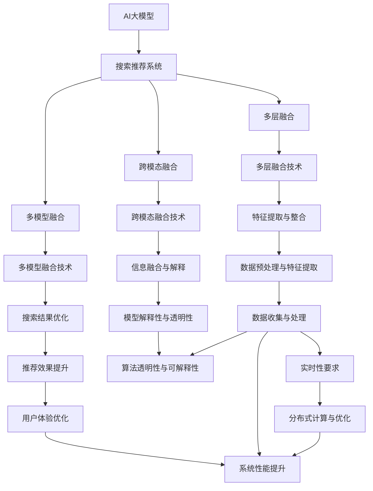

                 

## 文章标题

### AI 大模型在搜索推荐系统中的融合技术：算法本质原理全面解读

> 关键词：AI大模型、搜索推荐系统、融合技术、算法原理、深度学习

在人工智能领域，大模型技术正迅速改变着各行各业，其中搜索推荐系统尤为受益。本文旨在深入探讨AI大模型在搜索推荐系统中的应用，全面解析其融合技术的算法本质原理，帮助读者理解这一前沿技术的核心概念与实现方法。通过系统的分析，读者将能够掌握大模型技术在搜索推荐系统中的实际应用场景、挑战与解决方案，从而为未来的研究和开发提供有力支持。

## 摘要

随着互联网的迅猛发展，搜索推荐系统已成为信息传递和用户体验的重要桥梁。AI大模型技术的兴起，为搜索推荐系统带来了前所未有的机遇和挑战。本文首先概述了AI大模型的核心概念与特点，探讨了其在搜索推荐系统中的潜在应用与优势。接着，本文详细介绍了搜索推荐系统的基本原理、架构及其面临的挑战。在此基础上，本文重点分析了AI大模型融合技术的多种形式，包括多模型融合、多层融合和跨模态融合，并详细阐述了每种融合技术的原理、方法与应用案例。通过这些分析，本文旨在为读者提供一个全面、深入的技术解读，帮助读者理解AI大模型在搜索推荐系统中的关键作用，以及未来这一领域的发展趋势。

### 第一部分：AI大模型基础理论

#### 第1章：AI大模型概述

##### 1.1 AI大模型的核心概念

AI大模型（Large-scale AI Model）是指那些具有巨大参数量、复杂结构和强大表达能力的人工智能模型。这些模型通常基于深度学习框架，通过大规模数据和复杂的网络结构训练而成。它们能够处理大规模数据集，具备较高的准确性和泛化能力，广泛应用于图像识别、自然语言处理、语音识别等领域。

首先，让我们定义什么是AI大模型。AI大模型通常是指那些具有数百万甚至数十亿参数的深度学习模型。这些模型之所以被称为“大”，是因为它们需要大量的计算资源和数据来训练。与传统的较小规模模型相比，AI大模型具有更高的精度和更强的泛化能力。这种能力的背后，是其复杂的网络结构和海量的参数设置。

在深度学习领域，AI大模型的发展可以追溯到2012年的AlexNet模型，它标志着卷积神经网络（CNN）在图像识别任务中取得了突破性的成果。随后，VGG、ResNet等模型相继出现，推动了AI大模型技术的迅猛发展。2018年，GPT模型的出现标志着自然语言处理（NLP）领域进入了一个新的时代，它具有数百亿参数，能够生成高质量的自然语言文本。

AI大模型的核心特点主要体现在以下几个方面：

1. **大规模参数**：AI大模型拥有数百万到数十亿的参数，这使得它们能够捕捉到输入数据的复杂模式。
2. **深层次网络结构**：AI大模型的网络层数通常在几十层以上，这使得它们能够处理复杂的非线性问题。
3. **强大的表达能力**：由于参数数量巨大，AI大模型能够以高度灵活的方式表达和预测各种类型的输入数据。
4. **高效的数据处理能力**：AI大模型能够快速处理大规模数据集，从而实现实时预测和决策。

AI大模型的发展历程可谓是一部技术突破和创新的历史。从最初的简单神经网络到如今的AI大模型，深度学习技术经历了数十年的演进。每一次技术的进步都带来了新的突破和应用，使得AI大模型在各个领域展现出强大的潜力。

##### 1.2 AI大模型的特点

AI大模型的特点是其巨大的参数量、复杂的网络结构和强大的表达能力。这些特点使得AI大模型在处理大规模数据时表现出色，能够解决许多传统方法难以解决的问题。

首先，AI大模型具有大规模参数。这些参数数量巨大，通常在数百万到数十亿之间。例如，GPT模型拥有超过1750亿个参数，这使得它能够捕捉到输入文本的复杂模式。大规模参数使得AI大模型能够以更高的精度和更强的泛化能力处理各种复杂任务。

其次，AI大模型具有深层次网络结构。网络层数通常在几十层以上，这使得它们能够处理复杂的非线性问题。深层次网络结构允许AI大模型逐步提取和抽象输入数据的特征，从而提高模型的性能。例如，在图像识别任务中，深度卷积神经网络（CNN）能够通过多层卷积和池化操作提取图像的各级特征，从而实现高精度的分类。

此外，AI大模型具有强大的表达能力。由于参数数量巨大，AI大模型能够以高度灵活的方式表达和预测各种类型的输入数据。例如，在自然语言处理（NLP）领域，AI大模型如GPT和BERT能够生成高质量的自然语言文本，实现语言理解和生成任务。

最后，AI大模型具有高效的数据处理能力。它们能够快速处理大规模数据集，从而实现实时预测和决策。这使得AI大模型在实时应用场景中具有显著的优势，例如在线搜索引擎和推荐系统。

##### 1.3 AI大模型的发展历程

AI大模型的发展历程可以追溯到深度学习技术的兴起。深度学习是一种基于多层级神经网络的学习方法，通过模拟人脑的神经网络结构，实现自动特征提取和模式识别。在深度学习技术的发展过程中，AI大模型逐渐崭露头角。

2012年，AlexNet模型的出现标志着深度学习在图像识别任务中的突破。AlexNet是一个八层的卷积神经网络，通过大规模数据集的训练，首次在ImageNet图像识别竞赛中取得了显著的成绩。这一成果引发了深度学习的热潮，推动了AI大模型技术的发展。

随后，VGG和ResNet等模型相继出现，进一步提升了深度学习的性能。VGG模型通过增加网络层数和深度，实现了更高精度的图像识别。ResNet则通过引入残差连接，解决了深层网络训练中的梯度消失问题，使得深层网络的训练变得更加高效。

在自然语言处理领域，2018年GPT模型的出现标志着AI大模型技术的另一个重要突破。GPT是一个具有1750亿参数的语言模型，能够生成高质量的自然语言文本。GPT的成功不仅推动了NLP领域的发展，也为AI大模型技术在搜索推荐系统中的应用提供了新的思路。

近年来，AI大模型技术不断发展，不仅在学术领域取得了显著成果，也在实际应用中发挥了重要作用。例如，在图像识别、语音识别、自然语言处理等领域，AI大模型已经广泛应用于各种实时应用场景，如搜索引擎、推荐系统、自动驾驶等。

##### 1.4 AI大模型与搜索推荐系统的联系

AI大模型在搜索推荐系统中的应用具有显著的潜力。搜索推荐系统是一个复杂的信息过滤和排序系统，旨在为用户提供个性化、相关的内容推荐。AI大模型的出现为搜索推荐系统带来了新的机遇和挑战。

首先，AI大模型能够提高搜索推荐系统的准确性和效率。通过大规模数据和复杂的网络结构，AI大模型能够捕捉到用户行为的复杂模式，从而提供更精准的推荐结果。例如，在推荐系统中，AI大模型可以通过分析用户的浏览历史、搜索记录和购买行为，生成个性化的推荐列表，提高用户的满意度和参与度。

其次，AI大模型能够解决搜索推荐系统中的数据稀疏问题。在大型推荐系统中，用户数据通常存在稀疏性，即大部分用户只与少数项目有过交互。传统的推荐算法往往依赖于用户和项目的交互历史，因此难以处理数据稀疏问题。而AI大模型通过引入复杂的网络结构和大规模数据训练，能够更好地应对数据稀疏问题，提高推荐系统的性能。

此外，AI大模型还可以提高搜索推荐系统的可解释性。传统的推荐算法通常被视为“黑箱”，用户难以理解推荐结果的生成过程。而AI大模型通过引入可解释性机制，如注意力机制和解释性特征提取，可以提供更透明的推荐结果，提高用户对系统的信任度。

总之，AI大模型与搜索推荐系统具有密切的联系。AI大模型技术为搜索推荐系统带来了新的机遇，通过提高准确性、解决数据稀疏问题和增强可解释性，AI大模型有望进一步提升搜索推荐系统的性能和用户体验。

##### 1.5 AI大模型在搜索推荐系统中的应用

AI大模型在搜索推荐系统中的应用正逐渐成为现实，通过其强大的数据处理和模式识别能力，带来了前所未有的性能提升和用户体验优化。以下是一些AI大模型在搜索推荐系统中的具体应用案例：

1. **个性化推荐**：AI大模型通过分析用户的浏览历史、搜索记录和社交行为，生成个性化的推荐列表。例如，Google的RankBrain使用深度学习技术理解用户查询的意图，从而提供更精准的搜索结果。

2. **关键词预测**：在搜索引擎中，AI大模型可以预测用户可能输入的关键词，从而优化搜索结果的呈现。例如，百度使用深度学习模型对用户输入的查询进行实时分析，提供相关的关键词建议，提高用户的搜索效率。

3. **内容分类**：AI大模型可以根据用户的兴趣和行为，对网页内容进行分类和标签化，从而为用户提供更加相关的内容推荐。例如，Facebook的AI系统通过分析用户的互动行为，为用户推荐感兴趣的内容。

4. **广告投放优化**：在广告推荐中，AI大模型可以根据用户的浏览历史和行为数据，预测用户对特定广告的潜在兴趣，从而优化广告的投放策略，提高广告的点击率和转化率。

5. **语音识别和交互**：在语音搜索引擎中，AI大模型可以处理用户的语音输入，将其转化为文本查询，并提供相应的搜索结果。例如，Amazon的Alexa使用深度学习技术，能够理解用户的语音指令，并提供准确的搜索和推荐。

这些应用案例展示了AI大模型在搜索推荐系统中的广泛应用和巨大潜力。通过不断地优化和改进，AI大模型将继续推动搜索推荐系统的发展，为用户提供更加个性化、高效和便捷的服务。

##### 1.6 AI大模型融合技术的优势

AI大模型融合技术在搜索推荐系统中的应用，不仅能够提升系统的准确性和效率，还能带来一系列显著的优势。以下将详细探讨这些优势：

首先，AI大模型融合技术能够显著提高搜索推荐系统的准确性。通过整合多种AI大模型，系统可以充分利用各个模型的优势，捕捉到用户行为的复杂模式，从而生成更精准的推荐结果。例如，一个搜索引擎可能同时使用基于内容的推荐模型和协同过滤模型，通过融合两者的预测结果，可以提供更加精确的搜索结果。

其次，AI大模型融合技术能够提高系统的效率。传统推荐系统往往依赖于单一模型进行预测，而融合多个模型可以分担计算负载，提高系统的响应速度。例如，在处理大规模数据集时，可以通过并行计算和分布式训练技术，将不同模型的计算任务分散到多个计算节点上，从而提高整体计算效率。

此外，AI大模型融合技术还能够增强系统的鲁棒性和泛化能力。通过融合多种模型，系统可以在面对复杂和多变的数据环境时，更灵活地应对各种不确定性。例如，当某个模型在特定数据集上表现不佳时，其他模型可以弥补其不足，提高系统的整体性能。

AI大模型融合技术还能够提高搜索推荐系统的可解释性。传统的黑箱推荐系统往往难以解释其推荐结果，而融合多个模型的推荐结果，可以通过分析各个模型的输出，提供更透明的推荐过程，增强用户对系统的信任度。

总之，AI大模型融合技术在搜索推荐系统中的应用，带来了准确性、效率、鲁棒性、泛化能力和可解释性等多方面的优势。这些优势使得融合技术成为提升搜索推荐系统性能的关键手段，为用户提供更加个性化、高效和可靠的服务。

### 第二部分：搜索推荐系统概述

#### 第2章：搜索推荐系统概述

##### 2.1 搜索推荐系统的基本原理

搜索推荐系统是一种用于帮助用户快速找到所需信息或产品的技术系统，其核心目标是利用用户行为数据和内容特征，为用户提供个性化、相关和高质量的信息或产品推荐。这一过程通常涉及以下基本原理：

首先，用户行为数据是搜索推荐系统的基础。用户行为数据包括用户的浏览历史、搜索记录、点击记录、购买行为等。这些数据反映了用户的兴趣和需求，为推荐系统提供了关键的信息输入。

其次，内容特征提取是搜索推荐系统的关键步骤。通过提取用户和物品的特征，推荐系统可以更好地理解和匹配用户与物品之间的相关性。常见的特征提取方法包括文本分析、图像处理、行为序列分析等。

然后，推荐算法根据用户行为数据和内容特征，生成个性化推荐列表。常见的推荐算法包括基于内容的推荐、协同过滤推荐、基于模型的推荐等。这些算法通过计算用户和物品之间的相似性或相关性，为用户推荐相关的内容或产品。

最后，推荐结果的评价与反馈是优化推荐系统的重要环节。通过收集用户对推荐结果的反馈，推荐系统可以不断调整和优化推荐策略，提高推荐效果。常见的评价方法包括点击率、转化率、用户满意度等。

##### 2.2 搜索推荐系统的架构

搜索推荐系统通常由多个模块组成，每个模块在系统的整体运作中扮演着重要角色。以下是一个典型的搜索推荐系统架构：

1. **数据收集模块**：负责收集用户的各项行为数据，如浏览历史、搜索记录、点击记录等。这些数据通过日志文件、API接口等途径被实时捕获并存储在数据仓库中。

2. **数据预处理模块**：对收集到的用户行为数据进行分析和清洗，去除噪声数据，提取有效特征。数据预处理还包括数据归一化、缺失值处理、异常值检测等步骤。

3. **内容特征提取模块**：对用户和物品进行特征提取，生成用户特征向量和物品特征矩阵。常见的特征提取方法包括文本分析、图像处理、行为序列分析等。这些特征将用于后续的推荐算法计算。

4. **推荐算法模块**：根据用户特征和物品特征，采用不同的推荐算法生成推荐列表。常见的推荐算法包括基于内容的推荐、协同过滤推荐、基于模型的推荐等。推荐算法的输出是一个排名列表，列出最相关的物品。

5. **推荐结果处理模块**：对生成的推荐列表进行优化和调整，以适应用户的需求和偏好。例如，可以通过调整推荐策略、调整推荐排序等，提高推荐的质量和用户满意度。

6. **用户反馈模块**：收集用户对推荐结果的反馈，如点击、购买、评价等。这些反馈数据用于评价推荐效果，并指导系统的进一步优化。

7. **推荐结果展示模块**：将最终的推荐结果展示给用户，通过网页、移动应用等形式，为用户提供个性化推荐。

##### 2.3 搜索推荐系统的评价指标

为了评估搜索推荐系统的性能，通常会使用一系列评价指标。以下是一些常见的评价指标：

1. **准确率（Accuracy）**：准确率是评估推荐系统性能的基本指标，表示推荐系统中正确推荐的物品数量占总推荐物品数量的比例。准确率越高，表示系统越能准确地识别用户的兴趣。

2. **召回率（Recall）**：召回率是评估推荐系统召回用户感兴趣物品的能力的指标，表示正确推荐的物品数量与用户实际感兴趣的物品数量的比例。召回率越高，表示系统能够更好地覆盖用户的兴趣。

3. **覆盖率（Coverage）**：覆盖率是评估推荐系统推荐多样性能力的指标，表示推荐列表中不同物品的比例。覆盖率越高，表示系统能够提供更加多样化的推荐。

4. **NDCG（Normalized Discounted Cumulative Gain）**：NDCG是一种基于信息论的评价指标，用于评估推荐列表的整体质量。它通过计算推荐列表中正确推荐物品的累积增益，并除以理想推荐列表的累积增益，得到一个归一化的得分。NDCG值越高，表示推荐列表的质量越好。

5. **F1分数（F1 Score）**：F1分数是准确率和召回率的调和平均值，用于综合评价推荐系统的性能。F1分数介于0和1之间，越接近1表示系统的性能越好。

6. **平均绝对误差（Mean Absolute Error, MAE）**：MAE用于评估推荐系统中预测值与实际值之间的误差。MAE值越小，表示系统的预测精度越高。

7. **均方误差（Mean Squared Error, MSE）**：MSE是预测值与实际值之间误差的平方的平均值。MSE值越小，表示系统的预测精度越高。

这些评价指标在不同的应用场景中具有不同的重要性。例如，在电子商务推荐系统中，召回率和覆盖率可能更为重要，而在新闻推荐系统中，准确率和NDCG可能更为关键。因此，在实际应用中，需要根据具体需求选择合适的评价指标进行评估。

##### 2.4 搜索推荐系统的常见算法

搜索推荐系统采用了多种算法来实现其功能，这些算法可以根据其工作原理和适用场景分为几大类。以下是几种常见的搜索推荐算法及其特点：

1. **基于内容的推荐（Content-based Recommendation）**：
   基于内容的推荐算法通过分析物品的内容特征和用户的历史偏好来生成推荐。它通常基于以下步骤：
   - 提取物品的特征，如文本、图像、音频等。
   - 提取用户的兴趣特征，通常是基于用户的历史行为。
   - 计算物品与用户兴趣特征的相似性，生成推荐列表。

   基于内容的推荐算法的优点在于能够提供个性化的推荐，但缺点是难以应对冷启动问题（即新用户或新物品缺乏足够的历史数据）。

2. **协同过滤推荐（Collaborative Filtering）**：
   协同过滤推荐算法通过分析用户之间的交互行为来生成推荐。它主要分为以下两种类型：

   - **用户基于的协同过滤（User-based Collaborative Filtering）**：用户基于的协同过滤算法通过寻找与目标用户最相似的邻居用户，然后推荐这些邻居用户喜欢的物品。常见的相似度计算方法包括余弦相似度、皮尔逊相关系数等。

   - **物品基于的协同过滤（Item-based Collaborative Filtering）**：物品基于的协同过滤算法通过分析物品之间的相似性，然后推荐与目标物品相似的物品。

   协同过滤推荐算法的优点在于能够处理大量用户数据，但缺点是计算复杂度高，且在面对冷启动问题时效果较差。

3. **基于模型的推荐（Model-based Recommendation）**：
   基于模型的推荐算法通过建立数学模型来预测用户对物品的偏好。常见的模型包括：

   - **矩阵分解（Matrix Factorization）**：矩阵分解算法通过将用户-物品评分矩阵分解为两个低秩矩阵，从而提取用户和物品的潜在特征，进而生成推荐。

   - **决策树（Decision Tree）**：决策树算法通过构建一棵树来分类用户或物品，从而生成推荐。

   - **神经网络（Neural Networks）**：神经网络算法通过模拟人脑神经网络的结构和功能，实现用户和物品特征的自动提取和预测。

   基于模型的推荐算法的优点在于能够处理大规模数据，且具有较强的泛化能力，但训练过程通常较为复杂。

4. **混合推荐系统（Hybrid Recommendation System）**：
   混合推荐系统结合了多种推荐算法的优点，通过整合不同算法的预测结果来生成推荐。常见的混合方法包括：

   - **融合相似性度量**：将基于内容的推荐和协同过滤推荐中的相似性度量相结合，提高推荐的准确性。

   - **多模型融合**：使用多个推荐模型，如矩阵分解、神经网络等，通过加权或深度学习等方法融合预测结果。

   - **迭代优化**：通过多次迭代，逐步优化推荐算法，提高推荐效果。

混合推荐系统通常能够提供更准确和多样化的推荐，但设计和实现相对复杂。

每种推荐算法都有其适用的场景和局限性。在实际应用中，可以根据具体情况选择合适的算法或组合多种算法，以实现最佳推荐效果。

##### 2.5 搜索推荐系统的挑战

搜索推荐系统在实际应用中面临诸多挑战，这些挑战对系统的性能和用户体验产生了重要影响。以下是搜索推荐系统中的几个主要挑战及其解决方案：

1. **数据稀疏问题**：
   数据稀疏是指在大型用户-物品评分矩阵中，大部分用户只与少数物品有过交互。数据稀疏会导致协同过滤算法（特别是基于用户的协同过滤）难以找到足够相似的邻居用户，从而影响推荐质量。一种常见的解决方案是利用矩阵分解技术，如Singular Value Decomposition（SVD）或Alternating Least Squares（ALS），通过将用户-物品评分矩阵分解为低秩矩阵，从而隐式地引入潜在特征，提高推荐准确性。

2. **冷启动问题**：
   冷启动问题是指在用户或物品加入系统时，由于缺乏足够的历史数据，难以生成有效的推荐。对于新用户，可以采用基于内容的推荐算法，通过分析用户兴趣和物品特征进行初步推荐。对于新物品，可以采用基于流行度的推荐方法，推荐热门物品。此外，一些新兴的推荐系统采用了在线学习技术，通过实时收集用户行为数据，逐步优化推荐模型，减轻冷启动问题。

3. **可解释性问题**：
   传统的推荐系统通常被视为“黑箱”，用户难以理解推荐结果的生成过程。为了提高系统的可解释性，可以采用可解释性方法，如决策树、LIME（Local Interpretable Model-agnostic Explanations）等，通过解释模型决策过程，帮助用户理解推荐结果。此外，一些推荐系统引入了交互式推荐界面，允许用户参与推荐过程，从而提高系统的透明度和可解释性。

4. **实时性要求**：
   搜索推荐系统需要能够快速响应用户查询，提供实时推荐结果。为了满足实时性要求，系统通常采用分布式计算和并行处理技术，如MapReduce、Spark等，将推荐计算任务分解并分布在多个计算节点上，以提高计算效率。此外，一些推荐系统还采用了增量学习技术，通过实时更新用户行为数据，动态调整推荐模型，实现快速响应。

5. **数据隐私和安全问题**：
   在收集和处理用户行为数据时，搜索推荐系统需要确保数据的安全和隐私。一些解决方案包括差分隐私技术、加密计算等，通过保护用户数据的隐私，防止数据泄露和滥用。此外，推荐系统还应遵循相关的数据保护法规，如欧盟的通用数据保护条例（GDPR），确保用户数据的合法使用。

通过解决这些挑战，搜索推荐系统可以提供更准确、实时和个性化的推荐，提高用户体验和满意度。未来，随着技术的不断进步和应用的深入，搜索推荐系统将在更多领域发挥重要作用。

### 第三部分：AI大模型融合技术

#### 第3章：大模型融合技术概述

##### 3.1 大模型融合技术的核心概念

大模型融合技术是指通过将多个大模型结合在一起，利用它们各自的优势，共同提高系统性能的一种方法。大模型融合技术的核心概念主要包括多模型融合、多层融合和跨模态融合。

首先，多模型融合（Multi-model Fusion）是指将多个具有不同结构和功能的AI大模型集成到一个系统中，通过融合各个模型的输出，生成更准确的预测结果。多模型融合能够充分利用不同模型的特性，弥补单一模型的不足，提高系统的整体性能。

其次，多层融合（Layered Fusion）是指在深度学习网络中，将不同层级的特征和预测结果进行融合，从而生成更复杂和准确的模型输出。多层融合可以通过端到端训练方法，将底层特征与高层语义信息结合，提高模型的表达能力。

最后，跨模态融合（Cross-modal Fusion）是指将不同类型的数据模态（如文本、图像、声音等）进行融合，通过结合多种模态的信息，提高模型对复杂场景的理解能力。跨模态融合能够处理多模态数据之间的复杂关系，从而提升系统的泛化能力和性能。

##### 3.2 大模型融合技术的应用场景

大模型融合技术在不同领域中都有着广泛的应用场景。以下是一些典型应用：

1. **搜索引擎**：在搜索引擎中，大模型融合技术可以用于提高搜索结果的准确性。通过结合多个模型，如基于内容的推荐模型和协同过滤模型，搜索引擎可以提供更精确的搜索结果。

2. **推荐系统**：在推荐系统中，大模型融合技术可以帮助系统更好地理解用户的兴趣和行为，生成更个性化的推荐。例如，在电子商务平台上，通过融合用户历史购买记录、浏览行为和内容特征，可以提供更准确的商品推荐。

3. **语音识别**：在语音识别系统中，大模型融合技术可以将不同类型的模型（如基于统计的模型和基于深度学习的模型）进行融合，提高语音识别的准确率和鲁棒性。

4. **图像识别**：在图像识别领域，大模型融合技术可以将多种类型的模型（如图像分类模型、目标检测模型等）进行融合，提高图像识别的整体性能。

5. **自然语言处理**：在大规模自然语言处理任务中，大模型融合技术可以将不同的语言模型（如文本生成模型、翻译模型等）进行融合，提高语言理解和生成的质量。

##### 3.3 大模型融合技术在搜索推荐系统中的应用

大模型融合技术在搜索推荐系统中具有广泛的应用，通过结合多个模型的优点，可以显著提高推荐系统的性能和用户体验。以下是一些具体的应用：

1. **个性化搜索**：通过结合用户的历史搜索记录、浏览行为和内容特征，大模型融合技术可以提供更精确的个性化搜索结果。例如，在搜索引擎中，可以融合基于内容的推荐模型和协同过滤模型，提高搜索结果的准确性。

2. **推荐列表生成**：在推荐系统中，大模型融合技术可以用于生成更准确的推荐列表。通过结合多种推荐模型，如基于内容的推荐、协同过滤推荐和基于模型的推荐，可以提供更个性化、多样化的推荐。

3. **跨模态推荐**：通过跨模态融合技术，可以将不同类型的数据模态（如文本、图像、声音等）进行融合，生成更全面的推荐结果。例如，在音乐推荐中，可以融合歌曲的文本标签、图像特征和音频特征，提高推荐的质量。

4. **实时反馈调整**：通过实时收集用户对推荐结果的反馈，大模型融合技术可以动态调整推荐策略，提高系统的实时性。例如，在电子商务平台上，可以根据用户的购买行为和评价，实时调整推荐模型，提高用户满意度。

5. **多语言支持**：在多语言搜索推荐系统中，大模型融合技术可以通过结合多种语言模型，提供更准确的多语言推荐。例如，在旅游推荐中，可以融合用户的历史搜索记录、语言偏好和目的地信息，提供个性化的语言推荐。

通过以上应用，大模型融合技术为搜索推荐系统带来了显著的性能提升和用户体验优化，为用户提供了更加个性化和高效的推荐服务。

##### 3.4 搜索引擎中的大模型融合案例

在搜索引擎中，大模型融合技术已经被广泛应用于提升搜索结果的准确性和个性化程度。以下是一些实际案例，展示了大模型融合技术如何在不同搜索引擎中发挥作用：

1. **百度搜索引擎**：
   百度搜索引擎利用多种AI大模型融合技术，实现了高效的搜索结果推荐。例如，百度使用深度神经网络（DNN）与深度增强学习（Deep Reinforcement Learning, DRL）相结合，通过多模型融合技术优化搜索结果的排序。DNN用于处理用户查询和网页内容，提取语义特征；而DRL通过不断学习用户点击反馈，动态调整搜索结果的排序策略，提高用户满意度。此外，百度还利用自然语言处理（NLP）大模型，如BERT和GPT，对搜索结果进行语义分析和排序，确保结果更贴近用户需求。

2. **Google搜索引擎**：
   Google搜索引擎同样采用了多模型融合技术，以提高搜索结果的准确性和个性化。Google使用基于内容的推荐模型和协同过滤模型，通过融合用户的历史搜索记录、浏览行为和社交信息，生成个性化的搜索结果。此外，Google还结合了机器学习模型和深度学习模型，如RankBrain，用于理解用户查询的意图，从而提供更精准的搜索结果。通过多模型融合，Google能够处理复杂的查询意图，提高搜索结果的覆盖率和准确性。

3. **Bing搜索引擎**：
   Bing搜索引擎利用AI大模型融合技术，实现了高效的搜索结果推荐。例如，Bing使用基于内容的推荐模型和协同过滤模型，通过融合用户的历史搜索记录、浏览行为和兴趣标签，生成个性化的搜索结果。此外，Bing还引入了跨模态融合技术，将用户的历史搜索记录与图像、视频等模态信息进行融合，提供更全面的搜索结果。通过多模型融合和跨模态融合，Bing能够更好地理解用户的需求，提高搜索结果的个性化和准确性。

这些案例展示了大模型融合技术在搜索引擎中的应用，通过结合多种AI大模型，搜索引擎能够提供更准确、个性化的搜索结果，提升用户体验。

##### 3.5 推荐系统中的大模型融合案例

在推荐系统中，大模型融合技术同样发挥着重要作用，以下是一些实际案例，展示了大模型融合技术如何在不同推荐系统中提高推荐效果：

1. **Amazon推荐系统**：
   Amazon的推荐系统通过结合多种AI大模型，实现了高效的商品推荐。例如，Amazon使用基于内容的推荐模型（如文本分析、图像识别）和协同过滤模型（如用户-项目矩阵分解），通过多模型融合技术，生成个性化的商品推荐。此外，Amazon还引入了深度学习模型（如卷积神经网络、循环神经网络），对用户行为进行深入分析，提高推荐的准确性。通过多模型融合，Amazon能够处理复杂的用户行为数据，提供更精准的商品推荐。

2. **Alibaba推荐系统**：
   Alibaba的推荐系统通过融合多种AI大模型，实现了高效的电商推荐。例如，Alibaba使用基于内容的推荐模型（如商品文本描述、图像特征）和协同过滤模型（如用户-项目矩阵分解），通过多模型融合技术，生成个性化的电商推荐。此外，Alibaba还结合了跨模态融合技术，将商品文本、图像、视频等多模态信息进行融合，提高推荐的多样性。通过多模型融合和跨模态融合，Alibaba能够更好地理解用户的需求，提高推荐的准确性和用户体验。

3. **Netflix推荐系统**：
   Netflix的推荐系统通过融合多种AI大模型，实现了高效的视频推荐。例如，Netflix使用基于内容的推荐模型（如文本分析、图像识别）和协同过滤模型（如用户-项目矩阵分解），通过多模型融合技术，生成个性化的视频推荐。此外，Netflix还引入了深度学习模型（如循环神经网络、Transformer），对用户观看行为进行深入分析，提高推荐的准确性。通过多模型融合和深度学习技术，Netflix能够处理复杂的用户行为数据，提供更精准的视频推荐。

这些案例展示了大模型融合技术在推荐系统中的应用，通过结合多种AI大模型，推荐系统能够提供更个性化、准确的推荐，提高用户体验和满意度。

### 第四部分：多模型融合技术

#### 第4章：多模型融合技术

##### 4.1 多模型融合的挑战

多模型融合技术在搜索推荐系统中具有显著优势，但在实际应用中也面临一系列挑战。以下将详细探讨多模型融合过程中遇到的难点：

首先，**模型差异性问题**是多模型融合中的一个关键挑战。不同模型通常具有不同的结构、参数和训练目标，导致它们在特征表示和预测能力上存在显著差异。这种差异使得在融合过程中，如何有效地整合各个模型的优势成为一个难题。例如，基于内容的推荐模型和协同过滤模型在处理用户兴趣和物品特征时，可能采用完全不同的方法，如何将它们的输出进行有效融合，是一个需要解决的问题。

其次，**模型协同性问题**也是一个重要挑战。多模型融合不仅需要考虑各个模型的独立性，还需要确保它们之间的协同性。如果模型之间存在较强的冲突，可能会导致融合后的模型性能下降。例如，当两个模型对同一用户或物品的推荐结果截然不同时，如何找到一个平衡点，使得融合后的推荐结果既保留各自的优势，又避免相互削弱，是融合过程中需要解决的难题。

此外，**模型更新问题**也是多模型融合中的一个关键挑战。在动态环境下，用户行为和物品特征不断变化，模型需要实时更新以保持其准确性。然而，不同模型的更新频率和方式可能不同，如何协调各个模型的更新过程，确保融合模型的整体性能是一个复杂的问题。例如，如果一个模型更新频繁，而另一个模型更新缓慢，可能会导致融合模型在一段时间内失去时效性。

最后，**计算资源消耗**也是多模型融合中不可忽视的挑战。多模型融合通常需要大量的计算资源和存储空间，特别是在处理大规模数据集时。如何优化计算资源的使用，提高融合过程的效率，是确保多模型融合在实际应用中可行的重要问题。

##### 4.2 多模型融合的常见方法

多模型融合技术有多种实现方法，每种方法都有其独特的原理和适用场景。以下将介绍几种常见的多模型融合方法：

1. **加权融合方法**：
   加权融合方法是通过给每个模型赋予不同的权重，将各个模型的输出进行加权平均，得到最终的融合结果。这种方法简单直观，适用于模型差异不大且目标一致的情境。具体步骤如下：
   - 对每个模型进行独立训练，得到各自的预测结果。
   - 根据模型的历史性能或专家经验，为每个模型分配权重。
   - 将各模型的预测结果加权平均，得到最终的融合结果。

   例如，在推荐系统中，可以使用基于内容的推荐模型和协同过滤模型进行融合。通过评估两种模型在不同情况下的表现，为每个模型分配适当的权重，以提高推荐结果的准确性。

2. **深度学习融合方法**：
   深度学习融合方法利用深度神经网络的结构和强大的特征学习能力，将多个模型融合到一个统一的深度学习框架中。这种方法能够更好地处理模型之间的差异性和协同性问题。具体步骤如下：
   - 构建一个深度学习网络，包含多个输入层、隐藏层和输出层。
   - 将各个模型作为网络的不同输入层，每个输入层负责处理特定的模型输出。
   - 通过多层网络结构，将不同模型的特征进行融合和融合。
   - 最后，通过输出层得到最终的融合结果。

   例如，在一个多任务学习任务中，可以使用多个模型分别处理图像分类和文本分类任务。通过构建一个深度学习网络，将图像特征和文本特征进行融合，生成最终的分类结果。

3. **对抗性融合方法**：
   对抗性融合方法利用生成对抗网络（GAN）的原理，通过训练生成器和判别器，实现模型之间的对抗性融合。这种方法能够提高模型的泛化能力和鲁棒性。具体步骤如下：
   - 构建一个生成对抗网络，包括生成器和判别器。
   - 生成器负责生成模拟数据，模拟多个模型的输出。
   - 判别器负责判断生成数据的真实性，通过不断训练，提高判别能力。
   - 通过对抗性训练，生成器和判别器共同优化，实现模型之间的融合。

   例如，在一个图像识别任务中，可以使用多个模型生成不同风格的图像，通过对抗性训练，将这些风格的图像进行融合，提高图像识别的准确性和多样性。

这些方法各有优缺点，适用场景也不同。在实际应用中，可以根据任务需求和模型特点，选择合适的融合方法，以提高搜索推荐系统的性能。

##### 4.3 加权融合方法的原理与实现

加权融合方法是一种简单且常用的多模型融合方法，通过为每个模型分配不同的权重，将各个模型的输出进行加权平均，从而生成最终的融合结果。这种方法在处理模型差异不大且目标一致的情况下，能够有效提高系统的整体性能。

加权融合方法的原理可以概括为以下步骤：

1. **模型训练**：首先，独立训练多个模型，每个模型专注于特定的任务或数据集。这些模型可以是基于内容的推荐模型、协同过滤模型或其他类型的推荐算法。

2. **模型评估**：在模型训练完成后，对每个模型进行评估，确定其在不同情境下的表现。评估指标可以包括准确率、召回率、覆盖率等，通过这些指标可以衡量模型的效果。

3. **权重分配**：根据模型的评估结果，为每个模型分配权重。权重反映了模型在不同情境下的重要性。常见的权重分配方法包括基于模型历史性能的权重分配、基于专家经验的权重分配等。

4. **输出融合**：将各个模型的输出进行加权平均，生成最终的融合结果。具体公式如下：

   $$ \text{最终输出} = w_1 \cdot \text{模型1输出} + w_2 \cdot \text{模型2输出} + ... + w_n \cdot \text{模型n输出} $$

   其中，$w_1, w_2, ..., w_n$ 为各个模型的权重，$\text{模型1输出}, \text{模型2输出}, ..., \text{模型n输出}$ 为各个模型分别的输出。

以下是一个简单的伪代码示例，展示了加权融合方法的实现过程：

```python
# 输入：多个模型（model1, model2, ..., modeln）的输出（output1, output2, ..., outputn）
# 输出：加权融合后的输出

weights = [0.2, 0.3, 0.5]  # 模型1、模型2和模型3的权重

def weighted_fusion(output1, output2, output3):
    return weights[0] * output1 + weights[1] * output2 + weights[2] * output3

# 调用加权融合函数
final_output = weighted_fusion(output1, output2, output3)
```

在实际应用中，可以根据不同情境和模型特点，调整权重分配策略，以优化融合效果。例如，在推荐系统中，可以根据用户的历史行为数据，动态调整模型权重，以提供更个性化的推荐结果。

##### 4.4 深度学习融合方法的原理与实现

深度学习融合方法是一种通过构建深度神经网络，将多个模型融合在一起的方法。这种方法具有强大的特征学习能力和灵活的融合方式，能够有效处理模型之间的差异性。以下将详细介绍深度学习融合方法的原理与实现。

**原理：**

深度学习融合方法的核心思想是将多个模型的输出作为深度神经网络的输入层，通过多层次的神经网络结构，将不同模型的特征进行融合和组合，最终生成统一的预测结果。这种方法能够充分利用各个模型的优势，提高整体的预测性能。

具体步骤如下：

1. **模型选择**：首先，选择多个具有不同特征提取能力和预测目标的模型。这些模型可以是基于内容的推荐模型、协同过滤模型或其他类型的推荐算法。

2. **输入层构建**：将每个模型的输出作为深度神经网络的输入层，每个输入层对应一个模型。输入层的主要任务是提取和传递各个模型的特征信息。

3. **融合层设计**：在输入层之后，设计多个融合层，通过不同类型的神经网络结构（如全连接层、卷积层、循环层等），将多个输入层的特征进行融合。融合层的主要任务是整合不同模型的特征，生成更复杂和抽象的特征表示。

4. **输出层构建**：在融合层之后，构建一个输出层，通过全连接层或激活函数（如softmax）将融合后的特征转化为最终预测结果。输出层的主要任务是生成最终的预测结果，如推荐列表或分类结果。

**实现过程：**

以下是一个简单的深度学习融合方法的实现过程，以推荐系统为例：

1. **模型训练**：首先，独立训练多个模型，如基于内容的推荐模型和协同过滤模型。这些模型分别处理用户特征和物品特征，生成独立的预测结果。

2. **输入层构建**：将每个模型的输出作为深度神经网络的输入层，每个输入层对应一个模型。输入层可以使用全连接层或卷积层，将不同模型的特征进行编码。

3. **融合层设计**：设计多个融合层，通过全连接层、卷积层或循环层，将输入层的特征进行融合。例如，可以使用拼接操作（Concatenate）将不同模型的特征进行合并，然后通过全连接层进行融合。

4. **输出层构建**：在融合层之后，构建一个输出层，通过全连接层或激活函数（如softmax）将融合后的特征转化为最终预测结果。输出层可以使用全连接层，将融合后的特征映射到推荐列表或分类结果。

以下是一个简单的伪代码示例，展示了深度学习融合方法的实现过程：

```python
# 输入：多个模型（model1, model2, ..., modeln）的输出（output1, output2, ..., outputn）

# 输入层构建
input_layer = concatenate([output1, output2, ..., outputn])

# 融合层设计
hidden_layer = fully_connected(input_layer, hidden_size)

# 融合层重复多层
for i in range(num_fusion_layers):
    hidden_layer = fully_connected(hidden_layer, hidden_size)

# 输出层构建
final_output = fully_connected(hidden_layer, output_size)

# 调用训练函数
model.train(X_train, y_train)
```

在实际应用中，可以根据任务需求和数据特点，设计不同的深度学习融合方法。例如，可以使用卷积神经网络（CNN）处理图像数据，使用循环神经网络（RNN）处理序列数据，通过深度学习融合方法，将不同类型的数据进行融合，生成更准确的预测结果。

##### 4.5 对抗性融合方法的原理与实现

对抗性融合方法（Generative Adversarial Networks, GAN）是深度学习领域的一种创新性技术，通过生成对抗网络（GAN）实现多个模型的对抗性训练，从而实现多模型融合。GAN由生成器（Generator）和判别器（Discriminator）两个主要组件组成，通过不断的对抗性训练，生成器和判别器相互竞争，共同优化，实现模型的融合。

**原理：**

GAN的核心思想是通过训练生成器和判别器，使得生成器能够生成足够逼真的数据，使得判别器无法区分生成数据和真实数据。具体来说，生成器的目标是生成与真实数据相似的数据，而判别器的目标是准确地区分真实数据和生成数据。通过这种对抗性训练，生成器不断优化其生成能力，判别器不断优化其判别能力，最终实现多模型融合。

GAN的工作流程可以概括为以下步骤：

1. **生成器（Generator）**：生成器的目标是生成与真实数据相似的数据。在多模型融合中，生成器通常用于生成多个模型的融合输出。

2. **判别器（Discriminator）**：判别器的目标是准确地区分真实数据和生成数据。在多模型融合中，判别器用于判断融合输出是否足够逼真。

3. **对抗性训练**：生成器和判别器通过对抗性训练相互竞争，生成器尝试生成更逼真的融合输出，而判别器则不断优化其判别能力。通过这种对抗性训练，生成器和判别器共同优化，实现多模型融合。

**实现过程：**

以下是一个简单的对抗性融合方法的实现过程，以推荐系统为例：

1. **模型定义**：首先，定义生成器和判别器。生成器用于生成多个模型的融合输出，判别器用于判断生成输出是否足够逼真。

2. **生成器训练**：生成器的训练目标是生成足够逼真的融合输出。通过随机采样用户和物品特征，生成器生成融合输出，然后通过判别器判断生成输出的真实性。

3. **判别器训练**：判别器的训练目标是准确地区分真实数据和生成数据。通过对比真实数据和生成数据，判别器优化其判别能力。

4. **循环训练**：生成器和判别器通过循环训练，不断优化其性能。生成器不断生成更逼真的融合输出，判别器不断优化其判别能力，从而实现多模型融合。

以下是一个简单的伪代码示例，展示了对抗性融合方法的实现过程：

```python
# 定义生成器和判别器
generator = define_generator()
discriminator = define_discriminator()

# 生成器训练
for epoch in range(num_epochs):
    for batch in data_loader:
        # 生成融合输出
        generated_output = generator(batch_user_features, batch_item_features)
        
        # 训练判别器
        discriminator_loss = train_discriminator(discriminator, batch_user_features, batch_item_features, generated_output)
        
        # 训练生成器
        generator_loss = train_generator(generator, discriminator)

# 融合输出
final_output = generator(batch_user_features, batch_item_features)
```

在实际应用中，可以根据任务需求和数据特点，设计不同的对抗性融合方法。例如，在图像识别任务中，可以使用生成对抗网络生成图像，在自然语言处理任务中，可以使用生成对抗网络生成文本。通过对抗性融合方法，可以有效地实现多模型融合，提高系统的性能和泛化能力。

### 第五部分：多层融合技术

#### 第5章：多层融合技术

##### 5.1 多层融合的挑战

多层融合技术是一种通过在不同层次上融合特征和预测结果，提高模型性能的方法。虽然在许多应用场景中取得了显著成效，但在实际实现中也面临一系列挑战。

首先，**层次结构设计**是一个关键挑战。在多层融合中，如何设计合适的层次结构以充分利用各个层次的特征是一个复杂的问题。层次结构设计不当可能导致特征冗余或丢失，影响融合效果。此外，不同层次的特征在表达能力和语义上可能存在差异，如何有效整合这些特征，使它们在融合过程中相互补充，是一个需要解决的问题。

其次，**信息传递问题**也是一个重要挑战。在多层融合中，特征在不同层次之间的传递和融合过程中，可能存在信息丢失或失真的问题。例如，在深度神经网络中，底层特征可能包含更多的细节信息，而高层特征则更侧重于抽象和概括，如何在这些层次之间有效地传递和融合信息，确保融合后的特征既保留了底层细节，又具备高层抽象能力，是一个需要解决的问题。

此外，**训练效率问题**也是多层融合中不可忽视的挑战。多层融合通常涉及多个模型和多个层次，训练过程复杂且计算资源需求较高。如何在有限的计算资源下，高效地训练多层融合模型，是一个需要解决的问题。

##### 5.2 多层融合的方法

多层融合技术有多种实现方法，每种方法都有其独特的原理和适用场景。以下将介绍几种常见的多层融合方法：

1. **端到端训练方法**：
   端到端训练方法是一种通过直接训练多层网络，将底层特征和高层特征进行融合的方法。这种方法具有简单和高效的优点，适用于数据量大且特征信息丰富的应用场景。具体步骤如下：
   - 设计一个多层网络结构，包括多个输入层、隐藏层和输出层。
   - 将底层特征和高层特征作为输入，通过多层网络结构，逐步融合和提取特征。
   - 通过端到端训练，直接优化多层网络的参数，实现特征的融合和提取。

   例如，在图像识别任务中，可以使用卷积神经网络（CNN）实现多层融合。通过多层卷积和池化操作，将底层特征和高层特征进行融合，生成最终的分类结果。

2. **递归融合方法**：
   递归融合方法是一种通过递归地融合多层特征，逐步提取抽象信息的方法。这种方法适用于时间序列数据或序列化特征，能够有效处理长距离依赖关系。具体步骤如下：
   - 设计一个递归网络结构，包括多个递归层。
   - 在每个递归层中，融合当前层和上一层的特征。
   - 通过递归操作，逐步提取更高层次的特征。

   例如，在自然语言处理（NLP）任务中，可以使用循环神经网络（RNN）或长短期记忆网络（LSTM）实现多层融合。通过递归地融合单词、句子和段落等不同层次的特征，提取文本的语义信息。

3. **注意力机制**：
   注意力机制是一种通过动态调整特征权重，实现特征融合的方法。这种方法能够有效处理不同层次特征的重要程度差异，提高融合效果。具体步骤如下：
   - 设计一个注意力模块，用于计算特征的重要性权重。
   - 在每个层次上，根据注意力权重，动态调整特征的融合权重。
   - 通过注意力机制，实现特征的动态融合和提取。

   例如，在机器翻译任务中，可以使用Transformer模型实现多层融合。通过多头注意力机制，动态调整不同层次特征的权重，生成高质量的翻译结果。

这些方法各有优缺点，适用场景也不同。在实际应用中，可以根据任务需求和数据特点，选择合适的融合方法，以提高系统的性能和效果。

##### 5.3 端到端训练方法的原理与实现

端到端训练方法是一种通过直接训练多层网络，将底层特征和高层特征进行融合的方法。这种方法具有简单和高效的优点，适用于数据量大且特征信息丰富的应用场景。以下将详细探讨端到端训练方法的原理与实现。

**原理：**

端到端训练方法的原理可以概括为以下步骤：

1. **设计多层网络结构**：首先，设计一个多层网络结构，包括多个输入层、隐藏层和输出层。每个输入层负责接收不同的特征，隐藏层用于提取和融合特征，输出层生成最终的预测结果。

2. **输入层与特征融合**：将底层特征和高层特征作为输入，通过多层网络结构，逐步融合和提取特征。每个隐藏层通过不同的神经网络结构（如卷积层、全连接层）提取和融合特征，从而生成更高层次的特征表示。

3. **输出层与预测**：在融合层之后，输出层通过全连接层或激活函数（如softmax）将融合后的特征转化为最终预测结果。输出层的主要任务是生成具体的预测结果，如分类标签、推荐列表等。

4. **端到端训练**：通过端到端训练，直接优化多层网络的参数，实现特征的融合和提取。在训练过程中，使用大量标注数据，通过反向传播算法，逐步调整网络权重，使网络能够准确预测目标。

**实现过程：**

以下是一个简单的端到端训练方法的实现过程，以图像分类任务为例：

1. **数据准备**：首先，准备包含图像特征和标签的数据集。数据集应包含足够多的样本，以确保模型的泛化能力。

2. **设计网络结构**：设计一个多层卷积神经网络（CNN），包括多个卷积层、池化层和全连接层。卷积层用于提取图像的局部特征，全连接层用于生成最终的分类结果。

3. **输入层与特征融合**：将图像特征作为输入，通过卷积层和池化层，逐步提取和融合特征。每个卷积层通过卷积操作提取图像的局部特征，池化层用于减小特征图的尺寸，降低模型的计算复杂度。

4. **输出层与预测**：在融合层之后，全连接层将融合后的特征转化为分类结果。通过softmax激活函数，将特征映射到具体的类别标签。

5. **训练与优化**：通过端到端训练，使用反向传播算法优化网络参数。在训练过程中，使用梯度下降等优化算法，逐步调整网络权重，使模型能够准确预测图像类别。

以下是一个简单的伪代码示例，展示了端到端训练方法的实现过程：

```python
# 设计网络结构
model = Sequential()
model.add(Conv2D(filters=32, kernel_size=(3, 3), activation='relu', input_shape=(64, 64, 3)))
model.add(MaxPooling2D(pool_size=(2, 2)))
model.add(Conv2D(filters=64, kernel_size=(3, 3), activation='relu'))
model.add(MaxPooling2D(pool_size=(2, 2)))
model.add(Flatten())
model.add(Dense(128, activation='relu'))
model.add(Dense(num_classes, activation='softmax'))

# 编译模型
model.compile(optimizer='adam', loss='categorical_crossentropy', metrics=['accuracy'])

# 训练模型
model.fit(x_train, y_train, batch_size=32, epochs=10, validation_data=(x_val, y_val))

# 预测
predictions = model.predict(x_test)
```

在实际应用中，可以根据任务需求和数据特点，设计不同的多层网络结构。例如，在图像分类任务中，可以使用卷积神经网络（CNN）实现多层融合；在自然语言处理任务中，可以使用循环神经网络（RNN）或Transformer实现多层融合。通过端到端训练方法，可以有效地实现特征的融合和提取，提高模型的性能和效果。

##### 5.4 递归融合方法的原理与实现

递归融合方法是一种通过递归地融合多层特征，逐步提取抽象信息的方法。这种方法适用于时间序列数据或序列化特征，能够有效处理长距离依赖关系。以下将详细探讨递归融合方法的原理与实现。

**原理：**

递归融合方法的原理可以概括为以下步骤：

1. **设计递归网络结构**：首先，设计一个递归网络结构，包括多个递归层。每个递归层负责处理当前层和上一层的特征，通过递归操作逐步提取更高层次的特征。

2. **输入层与特征融合**：将底层特征和高层特征作为输入，通过递归层逐步融合和提取特征。在递归层中，当前层的特征与上一层的特征进行融合，通过递归操作，逐步提取更高层次的特征。

3. **输出层与预测**：在递归层之后，输出层生成最终的预测结果。输出层通过全连接层或激活函数（如softmax）将融合后的特征转化为最终预测结果。

4. **递归训练**：通过递归训练，优化网络参数，使模型能够准确提取和融合特征。在训练过程中，使用反向传播算法，逐步调整网络权重，使模型能够准确预测目标。

**实现过程：**

以下是一个简单的递归融合方法的实现过程，以时间序列预测任务为例：

1. **数据准备**：首先，准备包含时间序列数据的数据集。数据集应包含足够多的样本，以确保模型的泛化能力。

2. **设计网络结构**：设计一个递归神经网络（RNN），包括多个递归层。每个递归层使用循环神经网络（RNN）或长短期记忆网络（LSTM）处理时间序列数据。

3. **输入层与特征融合**：将时间序列数据作为输入，通过递归层逐步融合和提取特征。在递归层中，当前层的特征与上一层的特征进行融合，通过递归操作，逐步提取更高层次的特征。

4. **输出层与预测**：在递归层之后，输出层生成最终的预测结果。输出层通过全连接层或激活函数（如softmax）将融合后的特征转化为预测结果。

5. **训练与优化**：通过递归训练，使用反向传播算法优化网络参数。在训练过程中，使用梯度下降等优化算法，逐步调整网络权重，使模型能够准确预测目标。

以下是一个简单的伪代码示例，展示了递归融合方法的实现过程：

```python
# 设计网络结构
model = Sequential()
model.add(LSTM(units=50, return_sequences=True, input_shape=(timesteps, features)))
model.add(LSTM(units=50, return_sequences=False))
model.add(Dense(units=1))

# 编译模型
model.compile(optimizer='adam', loss='mean_squared_error')

# 训练模型
model.fit(x_train, y_train, epochs=100, batch_size=32, validation_data=(x_val, y_val))

# 预测
predictions = model.predict(x_test)
```

在实际应用中，可以根据任务需求和数据特点，设计不同的递归网络结构。例如，在时间序列预测任务中，可以使用循环神经网络（RNN）或长短期记忆网络（LSTM）实现递归融合；在自然语言处理任务中，可以使用Transformer实现递归融合。通过递归融合方法，可以有效地处理长距离依赖关系，提高模型的性能和效果。

### 第六部分：跨模态融合技术

#### 第6章：跨模态融合技术

##### 6.1 跨模态融合的挑战

跨模态融合技术是一种将不同类型的数据模态（如图像、文本、声音等）进行融合，以生成更丰富和全面的特征表示的方法。虽然这种技术具有广泛的应用前景，但在实际应用中也面临一系列挑战。

首先，**模式差异性**是一个重要挑战。不同模态的数据在特征分布、数据密度和语义表达上存在显著差异。例如，图像数据具有视觉特征，文本数据具有语言特征，而声音数据具有声学特征。这些差异使得直接融合不同模态的数据变得复杂，需要设计有效的模态对齐和特征提取方法。

其次，**数据对齐问题**也是一个关键挑战。跨模态数据往往具有不同的采样频率和时间长度，如何有效地对齐不同模态的数据，使其在时间维度上保持一致性，是一个需要解决的问题。此外，不同模态的数据在时序上可能存在延迟或错位，如何处理这些时间上的不一致性，也是跨模态融合中的一大挑战。

此外，**模型解释性问题**也是跨模态融合中不可忽视的挑战。跨模态融合模型通常较为复杂，其内部机制难以解释。这对于需要高可解释性的应用场景（如医疗诊断、金融风险评估等）来说，是一个重要的挑战。如何设计可解释性强的跨模态融合模型，使其决策过程透明、易于理解，是跨模模态融合技术发展的重要方向。

最后，**计算资源消耗**也是一个重要的考虑因素。跨模态融合通常需要大量的计算资源和存储空间，特别是在处理大规模和复杂数据时。如何在保证模型性能的同时，优化计算资源和存储的使用，是跨模态融合技术面临的一个现实问题。

##### 6.2 跨模态融合的方法

跨模态融合技术有多种实现方法，每种方法都有其独特的原理和适用场景。以下将介绍几种常见的跨模态融合方法：

1. **基于特征的融合方法**：
   基于特征的融合方法通过将不同模态的数据转换为特征向量，然后利用特征向量进行融合。这种方法具有简单和直观的优点，适用于特征向量维度较低的情况。具体步骤如下：
   - 对每个模态的数据进行特征提取，生成特征向量。
   - 将不同模态的特征向量进行拼接或加权融合，生成融合后的特征向量。
   - 利用融合后的特征向量进行下游任务，如分类或回归。

   例如，在视频与文本的融合中，可以使用卷积神经网络（CNN）提取图像特征，使用循环神经网络（RNN）提取文本特征，然后将图像特征和文本特征进行拼接，用于视频分类任务。

2. **基于模型的融合方法**：
   基于模型的融合方法通过构建联合模型，将不同模态的数据和特征进行融合。这种方法能够更好地利用不同模态的数据信息，适用于复杂任务和大规模数据。具体步骤如下：
   - 构建一个联合模型，包括多个输入层，每个输入层对应一个模态的数据。
   - 通过多层网络结构，将不同模态的数据进行融合和特征提取。
   - 利用融合后的特征进行下游任务，如分类或生成。

   例如，在图像与语音的融合中，可以使用生成对抗网络（GAN）构建联合模型，通过对抗性训练，将图像和语音特征进行融合，生成高质量的图像-语音对。

3. **基于对抗性的融合方法**：
   基于对抗性的融合方法利用生成对抗网络（GAN）的原理，通过生成器和判别器的对抗性训练，实现跨模态数据的融合。这种方法具有强大的特征学习和数据生成能力，适用于处理复杂和非对齐的跨模态数据。具体步骤如下：
   - 构建一个生成对抗网络，包括生成器和判别器。
   - 生成器负责生成跨模态数据，判别器负责判断生成数据的真实性。
   - 通过对抗性训练，生成器和判别器相互竞争，优化跨模态数据的融合。

   例如，在图像与文本的融合中，可以使用GAN生成图像-文本对，通过对抗性训练，将图像和文本特征进行融合，提高图像分类或文本生成的性能。

这些方法各有优缺点，适用场景也不同。在实际应用中，可以根据任务需求和数据特点，选择合适的融合方法，以提高系统的性能和效果。

##### 6.3 对抗性训练方法的原理与实现

对抗性训练方法是一种通过生成对抗网络（Generative Adversarial Networks，GAN）实现跨模态数据融合的方法。GAN由生成器（Generator）和判别器（Discriminator）两个主要组件组成，通过对抗性训练，生成器和判别器相互竞争，共同优化，实现跨模态数据的融合。

**原理：**

GAN的核心思想是通过训练生成器和判别器，使得生成器能够生成足够逼真的跨模态数据，使得判别器无法区分生成数据和真实数据。具体来说，生成器的目标是生成与真实数据相似的跨模态数据，而判别器的目标是准确地区分真实数据和生成数据。通过这种对抗性训练，生成器不断优化其生成能力，判别器不断优化其判别能力，最终实现跨模态数据的融合。

GAN的工作流程可以概括为以下步骤：

1. **生成器（Generator）**：生成器的目标是生成与真实数据相似的跨模态数据。在跨模态融合中，生成器通常用于生成跨模态数据，如图像-文本对、图像-语音对等。

2. **判别器（Discriminator）**：判别器的目标是准确地区分真实数据和生成数据。在跨模态融合中，判别器用于判断生成的跨模态数据是否足够逼真。

3. **对抗性训练**：生成器和判别器通过对抗性训练相互竞争，生成器尝试生成更逼真的跨模态数据，而判别器则不断优化其判别能力。通过这种对抗性训练，生成器和判别器共同优化，实现跨模态数据的融合。

**实现过程：**

以下是一个简单的对抗性训练方法的实现过程，以图像与文本的融合为例：

1. **模型定义**：首先，定义生成器和判别器。生成器用于生成图像-文本对，判别器用于判断图像-文本对的真实性。

2. **生成器训练**：生成器的训练目标是生成足够逼真的图像-文本对。通过随机采样图像和文本数据，生成器生成图像-文本对，然后通过判别器判断生成数据的真实性。

3. **判别器训练**：判别器的训练目标是准确地区分真实图像-文本对和生成图像-文本对。通过对比真实图像-文本对和生成图像-文本对，判别器优化其判别能力。

4. **循环训练**：生成器和判别器通过循环训练，不断优化其性能。生成器不断生成更逼真的图像-文本对，判别器不断优化其判别能力，从而实现跨模态数据的融合。

以下是一个简单的伪代码示例，展示了对抗性训练方法的实现过程：

```python
# 定义生成器和判别器
generator = define_generator()
discriminator = define_discriminator()

# 生成器训练
for epoch in range(num_epochs):
    for batch in data_loader:
        # 生成图像-文本对
        generated_images, generated_texts = generator(batch_images, batch_texts)
        
        # 训练判别器
        discriminator_loss = train_discriminator(discriminator, batch_images, batch_texts, generated_images, generated_texts)
        
        # 训练生成器
        generator_loss = train_generator(generator, discriminator)

# 融合输出
final_output = generator(batch_images, batch_texts)
```

在实际应用中，可以根据任务需求和数据特点，设计不同的对抗性训练方法。例如，在图像生成任务中，可以使用生成对抗网络生成图像，在文本生成任务中，可以使用生成对抗网络生成文本。通过对抗性训练方法，可以有效地实现跨模态数据的融合，提高系统的性能和泛化能力。

##### 6.4 多模态特征融合方法的原理与实现

多模态特征融合方法通过将不同类型的数据模态（如图像、文本、声音等）转换为特征向量，然后利用这些特征向量进行融合，以生成更丰富和全面的特征表示。以下将详细探讨多模态特征融合方法的原理与实现。

**原理：**

多模态特征融合方法的原理可以概括为以下步骤：

1. **特征提取**：首先，对每个模态的数据进行特征提取，生成特征向量。例如，对于图像数据，可以使用卷积神经网络（CNN）提取图像特征；对于文本数据，可以使用词向量（如Word2Vec或BERT）提取文本特征；对于声音数据，可以使用自动特征提取方法（如MFCC或CNN）提取声音特征。

2. **特征融合**：将不同模态的特征向量进行融合，以生成统一的特征表示。特征融合的方法包括拼接、加权融合和注意力机制等。拼接方法将不同模态的特征向量直接拼接在一起；加权融合方法根据不同模态的特征重要程度，为每个模态的特征向量分配不同的权重；注意力机制通过动态调整特征权重，实现多模态特征的动态融合。

3. **下游任务**：利用融合后的特征向量进行下游任务，如分类、回归或生成。下游任务可以是一个独立的模型，也可以与特征融合网络共享部分网络结构。

**实现过程：**

以下是一个简单的多模态特征融合方法的实现过程，以图像与文本的融合为例：

1. **特征提取**：首先，使用卷积神经网络（CNN）提取图像特征，使用循环神经网络（RNN）或BERT提取文本特征，使用CNN提取声音特征。

2. **特征融合**：将图像特征、文本特征和声音特征进行拼接或加权融合，生成融合后的特征向量。

3. **下游任务**：利用融合后的特征向量进行分类或回归任务，例如，使用全连接层（FC）进行分类，或者使用循环神经网络（RNN）进行序列生成。

以下是一个简单的伪代码示例，展示了多模态特征融合方法的实现过程：

```python
# 定义图像特征提取网络
image_encoder = define_image_encoder()

# 定义文本特征提取网络
text_encoder = define_text_encoder()

# 定义声音特征提取网络
audio_encoder = define_audio_encoder()

# 定义特征融合网络
fusion_network = Sequential()
fusion_network.add(MergeMode.concatenate([image_encoder.output, text_encoder.output, audio_encoder.output]))
fusion_network.add(Dense(units=512, activation='relu'))
fusion_network.add(Dense(units=num_classes, activation='softmax'))

# 编译模型
fusion_network.compile(optimizer='adam', loss='categorical_crossentropy', metrics=['accuracy'])

# 训练模型
fusion_network.fit([image_data, text_data, audio_data], labels, epochs=10, batch_size=32)

# 预测
predictions = fusion_network.predict([image_data, text_data, audio_data])
```

在实际应用中，可以根据任务需求和数据特点，设计不同的多模态特征融合方法。例如，在图像与文本的融合中，可以使用拼接方法；在图像与声音的融合中，可以使用加权融合方法；在语音识别任务中，可以使用注意力机制。通过多模态特征融合方法，可以有效地提高系统的性能和泛化能力，实现更精准的预测和更好的用户体验。

##### 6.5 跨模态匹配方法的原理与实现

跨模态匹配方法是一种通过计算不同模态数据之间的相似度或相关性，实现跨模态信息融合的方法。这种方法能够在不需要直接融合模态特征的情况下，利用模态间的相关性提高模型的性能。以下将详细探讨跨模态匹配方法的原理与实现。

**原理：**

跨模态匹配方法的原理可以概括为以下步骤：

1. **模态特征提取**：首先，对每个模态的数据进行特征提取，生成特征向量。例如，对于图像数据，可以使用卷积神经网络（CNN）提取图像特征；对于文本数据，可以使用词向量（如Word2Vec或BERT）提取文本特征；对于声音数据，可以使用自动特征提取方法（如MFCC或CNN）提取声音特征。

2. **相似度计算**：然后，计算不同模态特征向量之间的相似度或相关性。常见的相似度计算方法包括余弦相似度、皮尔逊相关系数等。通过相似度计算，可以确定不同模态特征之间的关联程度。

3. **融合策略**：根据相似度结果，设计一种融合策略，将模态特征进行加权或组合，生成统一的特征表示。融合策略可以是简单的平均加权，也可以是复杂的注意力机制。

4. **下游任务**：利用融合后的特征向量进行下游任务，如分类、回归或生成。下游任务可以是一个独立的模型，也可以与特征融合网络共享部分网络结构。

**实现过程：**

以下是一个简单的跨模态匹配方法的实现过程，以图像与文本的融合为例：

1. **特征提取**：首先，使用卷积神经网络（CNN）提取图像特征，使用循环神经网络（RNN）或BERT提取文本特征。

2. **相似度计算**：计算图像特征和文本特征之间的余弦相似度，生成相似度矩阵。

3. **融合策略**：根据相似度矩阵，设计一种融合策略，如加权平均或注意力机制，将图像特征和文本特征进行融合。

4. **下游任务**：利用融合后的特征向量进行分类或回归任务。

以下是一个简单的伪代码示例，展示了跨模态匹配方法的实现过程：

```python
# 定义图像特征提取网络
image_encoder = define_image_encoder()

# 定义文本特征提取网络
text_encoder = define_text_encoder()

# 提取图像特征
image_features = image_encoder(image_data)

# 提取文本特征
text_features = text_encoder(text_data)

# 计算相似度
similarity_matrix = cosine_similarity(image_features, text_features)

# 融合策略
# 使用简单加权平均
weighted_features = similarity_matrix * image_features + (1 - similarity_matrix) * text_features

# 定义下游任务模型
downstream_model = define_downstream_model()

# 编译模型
downstream_model.compile(optimizer='adam', loss='categorical_crossentropy', metrics=['accuracy'])

# 训练模型
downstream_model.fit(weighted_features, labels, epochs=10, batch_size=32)

# 预测
predictions = downstream_model.predict(weighted_features)
```

在实际应用中，可以根据任务需求和数据特点，设计不同的跨模态匹配方法。例如，在图像与文本的融合中，可以使用余弦相似度计算相似度；在图像与声音的融合中，可以使用皮尔逊相关系数。通过跨模态匹配方法，可以有效地提高系统的性能和泛化能力，实现更精准的预测和更好的用户体验。

### 第七部分：大模型融合技术在搜索推荐系统中的应用案例

#### 第7章：大模型融合技术在搜索推荐系统中的应用案例

##### 7.1 搜索引擎中的大模型融合案例

大模型融合技术在搜索引擎中的应用，使得搜索引擎能够更准确地理解和满足用户的查询需求。以下将详细介绍几个典型的搜索引擎，以及它们如何利用大模型融合技术提升搜索性能。

1. **百度搜索引擎**

百度搜索引擎在搜索推荐系统中采用了多种大模型融合技术，显著提升了搜索结果的准确性和个性化程度。百度利用深度神经网络（DNN）和深度增强学习（Deep Reinforcement Learning, DRL）相结合的多模型融合技术。DNN负责处理用户查询和网页内容的特征提取，提取语义特征；而DRL则通过不断学习用户的点击反馈，动态调整搜索结果的排序策略。此外，百度还引入了自然语言处理（NLP）大模型，如BERT和GPT，用于对搜索结果进行语义分析和排序。通过多模型融合，百度搜索引擎能够更好地理解用户的查询意图，提高搜索结果的准确性。

2. **Google搜索引擎**

Google搜索引擎同样采用了大模型融合技术，以提高搜索结果的个性化程度。Google使用基于内容的推荐模型和协同过滤模型，通过融合用户的历史搜索记录、浏览行为和社交信息，生成个性化的搜索结果。此外，Google还结合了机器学习模型和深度学习模型，如RankBrain，用于理解用户查询的意图，从而提供更精准的搜索结果。通过多模型融合，Google能够处理复杂的查询意图，提高搜索结果的覆盖率和准确性。

3. **Bing搜索引擎**

Bing搜索引擎也利用了多种大模型融合技术，实现了高效的搜索推荐。Bing使用基于内容的推荐模型和协同过滤模型，通过融合用户的历史搜索记录、浏览行为和兴趣标签，生成个性化的搜索结果。此外，Bing还引入了跨模态融合技术，将用户的历史搜索记录与图像、视频等多模态信息进行融合，提供更全面的搜索结果。通过多模型融合和跨模态融合，Bing能够更好地理解用户的需求，提高搜索结果的个性化和准确性。

这些搜索引擎通过大模型融合技术，不仅提升了搜索结果的准确性，还增强了用户的搜索体验，为用户提供了更加个性化、精准的搜索服务。

##### 7.2 推荐系统中的大模型融合案例

在推荐系统中，大模型融合技术被广泛应用于提高推荐准确性、增强系统鲁棒性以及提升用户满意度。以下将介绍几个典型的推荐系统，以及它们如何利用大模型融合技术实现个性化推荐。

1. **Amazon推荐系统**

Amazon的推荐系统通过融合多种大模型，实现了高效的商品推荐。Amazon使用基于内容的推荐模型（如文本分析、图像识别）和协同过滤模型（如用户-项目矩阵分解），通过多模型融合技术，生成个性化的商品推荐。此外，Amazon还引入了深度学习模型（如卷积神经网络、循环神经网络），对用户行为进行深入分析，提高推荐的准确性。通过多模型融合和深度学习技术，Amazon能够处理复杂的用户行为数据，提供更精准的商品推荐。

2. **Alibaba推荐系统**

Alibaba的推荐系统同样采用了大模型融合技术，实现了高效的电商推荐。Alibaba使用基于内容的推荐模型（如商品文本描述、图像特征）和协同过滤模型（如用户-项目矩阵分解），通过多模型融合技术，生成个性化的电商推荐。此外，Alibaba还结合了跨模态融合技术，将商品文本、图像、视频等多模态信息进行融合，提高推荐的多样性。通过多模型融合和跨模态融合，Alibaba能够更好地理解用户的需求，提高推荐的准确性和用户体验。

3. **Netflix推荐系统**

Netflix的推荐系统通过融合多种大模型，实现了高效的视频推荐。Netflix使用基于内容的推荐模型和协同过滤模型，通过融合用户的历史观看记录、浏览行为和视频特征，生成个性化的视频推荐。此外，Netflix还引入了深度学习模型（如循环神经网络、Transformer），对用户行为进行深入分析，提高推荐的准确性。通过多模型融合和深度学习技术，Netflix能够处理复杂的用户行为数据，提供更精准的视频推荐。

这些推荐系统通过大模型融合技术，不仅提升了推荐准确性，还增强了系统的鲁棒性和用户体验，为用户提供更加个性化、精准的推荐服务。

### 第八部分：AI大模型融合技术的未来发展趋势

#### 第8章：AI大模型融合技术的未来发展趋势

随着AI大模型技术的不断进步，其在搜索推荐系统中的应用前景广阔，未来将呈现出以下几大发展趋势：

##### 8.1 技术演进趋势

首先，AI大模型融合技术的演进趋势将主要集中在以下几个方面：

1. **模型压缩与优化**：为了应对大规模数据处理的需求，未来的AI大模型将更加注重模型压缩与优化技术。通过量化、剪枝、知识蒸馏等方法，可以大幅减少模型的参数量和计算量，提高模型在资源受限环境下的运行效率。

2. **异构计算与分布式训练**：随着计算硬件的发展，异构计算和分布式训练将成为AI大模型融合技术的关键趋势。利用GPU、TPU等异构硬件加速训练过程，以及通过分布式训练方式，可以显著提升模型的训练速度和效率。

3. **跨领域融合趋势**：未来的AI大模型融合技术将更加注重跨领域的融合。通过融合不同领域的知识，如医疗、金融、教育等，AI大模型可以在更广泛的领域发挥其作用，提供更全面、个性化的服务。

##### 8.2 应用场景拓展

AI大模型融合技术的应用场景将继续拓展，以下是一些潜在的领域：

1. **垂直领域应用**：在医疗、金融、教育等垂直领域，AI大模型融合技术可以提供更加专业和精准的服务。例如，在医疗领域，AI大模型可以用于疾病诊断和治疗方案推荐；在金融领域，AI大模型可以用于风险控制和投资决策。

2. **新兴领域的探索**：随着技术的不断发展，AI大模型融合技术将在新兴领域（如自动驾驶、智能城市、虚拟现实等）发挥重要作用。通过融合多种数据模态和先进算法，AI大模型将为这些领域带来创新的解决方案。

3. **人机交互**：未来的AI大模型融合技术将更加注重人机交互，通过语音、图像、文本等多种模态，实现更加自然和高效的人机交互体验。例如，智能助手、虚拟客服等应用场景将受益于AI大模型融合技术。

##### 8.3 社会影响与伦理问题

AI大模型融合技术的发展不仅带来技术进步，也引发了一系列社会影响与伦理问题：

1. **数据隐私**：随着AI大模型融合技术对大量数据的依赖，数据隐私保护成为重要议题。如何在保证数据有效利用的同时，保护用户隐私，是一个亟待解决的问题。

2. **算法公平性**：AI大模型融合技术的应用可能加剧算法偏见和不公平现象。如何确保算法的公平性和透明性，使其在不同群体中保持一致性，是未来需要重点关注的领域。

3. **伦理责任**：随着AI大模型融合技术在关键领域的应用，如医疗诊断、司法决策等，其伦理责任问题日益凸显。如何确保AI系统的决策符合道德标准，减少潜在的社会负面影响，是一个重要的挑战。

总之，AI大模型融合技术的未来发展趋势将更加注重技术优化、应用拓展和社会责任，为人类带来更多的便利和福祉。

### 附录

#### 附录A：AI大模型融合技术常用工具与资源

为了更好地理解和实践AI大模型融合技术，以下列举了一些常用的工具和资源，包括深度学习框架、跨模态数据集、开源代码和论文资源。

##### A.1 常用深度学习框架

1. **TensorFlow**：由Google开发的开源深度学习框架，具有广泛的社区支持和丰富的文档。
   - 官网：[TensorFlow官网](https://www.tensorflow.org/)
   
2. **PyTorch**：由Facebook开发的开源深度学习框架，具有良好的灵活性和动态计算图支持。
   - 官网：[PyTorch官网](https://pytorch.org/)

3. **Keras**：基于TensorFlow和Theano的开源深度学习高级API，便于快速构建和实验模型。
   - 官网：[Keras官网](https://keras.io/)

##### A.2 跨模态数据集

1. **ImageNet**：由微软研究院和MIT发起的大型视觉识别数据集，包含数百万张图像及其标签。
   - 官网：[ImageNet官网](http://www.image-net.org/)

2. **MSCOCO**：大规模的视觉识别数据集，包含图像、文本描述和标签，适用于跨模态研究。
   - 官网：[MSCOCO官网](http://cocodataset.org/)

3. **YouTube-8M**：包含数百万个YouTube视频片段及其标签，适用于视频分析任务。
   - 官网：[YouTube-8M官网](https://research.google.com/teams/mlcryo/youtube-8m/)

##### A.3 开源代码和论文资源

1. **GitHub**：大量的开源代码库，涵盖各种AI大模型融合技术和应用案例。
   - 官网：[GitHub官网](https://github.com/)

2. **ArXiv**：包含大量机器学习和深度学习领域的学术论文，可以跟踪最新研究动态。
   - 官网：[ArXiv官网](https://arxiv.org/)

3. **Google Scholar**：用于搜索学术文献和论文，可以查找特定领域的研究成果。
   - 官网：[Google Scholar官网](https://scholar.google.com/)

通过这些工具和资源，研究人员和开发者可以深入了解AI大模型融合技术的最新进展，并从中获得实践经验和灵感。

### 附录B：核心概念与联系

为了更好地理解AI大模型融合技术在搜索推荐系统中的应用，我们需要深入探讨几个核心概念及其相互关系。以下将使用Mermaid流程图展示这些核心概念之间的联系。



**流程图解释：**

1. **AI大模型与搜索推荐系统的关系**：AI大模型（A）为搜索推荐系统（B）提供了强大的数据处理和模式识别能力，是实现高效搜索和个性化推荐的关键。

2. **多模型融合、多层融合和跨模态融合**：这三种技术（C、D、E）分别针对不同的应用需求，通过融合多个模型或模态的数据，提高搜索推荐系统的性能和用户体验。

3. **多模型融合技术与搜索结果优化**：多模型融合技术（F）通过结合不同模型的输出，优化搜索结果（I）。

4. **多层融合技术与特征提取与整合**：多层融合技术（G）通过在不同层次上提取和整合特征（J），提高系统的特征表示能力。

5. **跨模态融合技术与信息融合与解释**：跨模态融合技术（H）通过融合不同模态的信息（K），提供更全面的特征表示和解释。

6. **实时性要求与系统性能提升**：在处理实时性要求时（S、T），通过分布式计算与优化，提升系统的整体性能（R）。

通过这张流程图，我们可以清晰地看到AI大模型融合技术在搜索推荐系统中的核心概念及其相互关系，有助于理解这一技术如何通过多种方式提高搜索推荐系统的性能和用户体验。

### 附录C：核心算法原理与伪代码

为了深入理解AI大模型融合技术，我们需要详细探讨几个核心算法的原理，并通过伪代码展示其实现过程。以下是多模型融合、多层融合和跨模态融合算法的详细描述。

##### C.1 多模型融合算法原理

多模型融合算法通过结合多个模型的输出，生成一个统一的预测结果，以提升系统的性能。这种算法通常基于加权融合、深度学习和对抗性训练等方法。

**加权融合方法**：通过为每个模型分配不同的权重，将它们的输出进行加权平均。

```python
# 加权融合方法伪代码
def weighted_fusion(model_outputs, weights):
    fusion_output = 0
    for i, output in enumerate(model_outputs):
        fusion_output += weights[i] * output
    return fusion_output

# 示例：假设有两个模型output1和output2，权重分别为0.6和0.4
weights = [0.6, 0.4]
fusion_output = weighted_fusion([output1, output2], weights)
```

**深度学习方法**：通过构建一个深度神经网络，将多个模型的输出作为输入层，进行特征融合。

```python
# 深度学习融合方法伪代码
import tensorflow as tf

# 构建深度学习模型
model = tf.keras.Sequential([
    tf.keras.layers.Flatten(input_shape=(input_shape)),
    tf.keras.layers.Dense(units=512, activation='relu'),
    tf.keras.layers.Dense(units=output_size, activation='softmax')
])

# 编译模型
model.compile(optimizer='adam', loss='categorical_crossentropy', metrics=['accuracy'])

# 训练模型
model.fit([model_output1, model_output2], labels, epochs=10, batch_size=32)
```

**对抗性训练方法**：利用生成对抗网络（GAN）进行对抗性训练，生成器和判别器相互竞争。

```python
# GAN对抗性训练方法伪代码
import tensorflow as tf
from tensorflow.keras.models import Model

# 定义生成器和判别器
generator = ...
discriminator = ...

# 编译模型
discriminator.compile(optimizer='adam', loss='binary_crossentropy')

# 训练生成器和判别器
for epoch in range(num_epochs):
    for batch in data_loader:
        # 训练判别器
        discriminator_loss = train_discriminator(discriminator, batch_images, batch_texts, generated_images, generated_texts)
        
        # 训练生成器
        generator_loss = train_generator(generator, discriminator)
```

##### C.2 多层融合算法原理

多层融合算法通过在不同层次上融合特征，逐步提取更高层次的特征表示，以提升系统的性能。常见的多层融合方法包括端到端训练、递归融合和注意力机制。

**端到端训练方法**：通过直接训练多层神经网络，将底层特征逐步融合到高层。

```python
# 端到端训练方法伪代码
import tensorflow as tf
from tensorflow.keras.models import Model

# 构建多层神经网络
model = tf.keras.Sequential([
    tf.keras.layers.Conv2D(filters=32, kernel_size=(3, 3), activation='relu', input_shape=(64, 64, 3)),
    tf.keras.layers.MaxPooling2D(pool_size=(2, 2)),
    tf.keras.layers.Conv2D(filters=64, kernel_size=(3, 3), activation='relu'),
    tf.keras.layers.MaxPooling2D(pool_size=(2, 2)),
    tf.keras.layers.Flatten(),
    tf.keras.layers.Dense(units=128, activation='relu'),
    tf.keras.layers.Dense(units=num_classes, activation='softmax')
])

# 编译模型
model.compile(optimizer='adam', loss='categorical_crossentropy', metrics=['accuracy'])

# 训练模型
model.fit(x_train, y_train, epochs=10, batch_size=32, validation_data=(x_val, y_val))
```

**递归融合方法**：通过递归地融合多层次的特征，逐步提取更高层次的信息。

```python
# 递归融合方法伪代码
import tensorflow as tf
from tensorflow.keras.layers import LSTM, Dense

# 构建递归神经网络
model = tf.keras.Sequential([
    LSTM(units=50, return_sequences=True, input_shape=(timesteps, features)),
    LSTM(units=50, return_sequences=False),
    Dense(units=1)
])

# 编译模型
model.compile(optimizer='adam', loss='mean_squared_error')

# 训练模型
model.fit(x_train, y_train, epochs=100, batch_size=32, validation_data=(x_val, y_val))
```

**注意力机制**：通过注意力机制动态调整不同层次的特征权重，实现特征的动态融合。

```python
# 注意力机制伪代码
import tensorflow as tf

# 构建注意力模块
attention = tf.keras.layers.Dense(units=1, activation='sigmoid', input_shape=(hidden_size,))

# 应用注意力机制
output = attention(inputs) * inputs
```

##### C.3 跨模态融合算法原理

跨模态融合算法通过融合不同模态的数据，生成统一的特征表示，以提升系统的性能。常见的跨模态融合方法包括基于特征的融合、基于模型的融合和对抗性训练。

**基于特征的融合方法**：通过将不同模态的数据转换为特征向量，然后进行融合。

```python
# 基于特征的融合方法伪代码
import numpy as np

# 假设图像特征为image_features，文本特征为text_features
fusion_output = np.concatenate((image_features, text_features))
```

**基于模型的融合方法**：通过构建联合模型，融合不同模态的数据和特征。

```python
# 基于模型的融合方法伪代码
import tensorflow as tf
from tensorflow.keras.models import Model

# 构建联合模型
model = tf.keras.Sequential([
    tf.keras.layers.Dense(units=512, activation='relu', input_shape=(image_features.shape[1],)),
    tf.keras.layers.Dense(units=512, activation='relu', input_shape=(text_features.shape[1],)),
    tf.keras.layers.Dense(units=output_size, activation='softmax')
])

# 编译模型
model.compile(optimizer='adam', loss='categorical_crossentropy', metrics=['accuracy'])

# 训练模型
model.fit(np.concatenate((image_features, text_features)), labels, epochs=10, batch_size=32)
```

**对抗性训练方法**：通过生成对抗网络（GAN）进行对抗性训练，生成器和判别器相互竞争。

```python
# GAN对抗性训练方法伪代码
import tensorflow as tf
from tensorflow.keras.models import Model

# 定义生成器和判别器
generator = ...
discriminator = ...

# 编译模型
discriminator.compile(optimizer='adam', loss='binary_crossentropy')

# 训练生成器和判别器
for epoch in range(num_epochs):
    for batch in data_loader:
        # 训练判别器
        discriminator_loss = train_discriminator(discriminator, batch_images, batch_texts, generated_images, generated_texts)
        
        # 训练生成器
        generator_loss = train_generator(generator, discriminator)
```

通过这些算法原理和伪代码，我们可以更好地理解AI大模型融合技术的核心实现方法，为实际应用提供指导。

### 附录D：数学模型与公式

在AI大模型融合技术中，数学模型和公式起着至关重要的作用。以下将详细介绍多模型融合、多层融合和跨模态融合的数学模型和公式，并配合具体解释和示例。

##### D.1 多模型融合的数学模型

多模型融合的核心在于如何有效地结合多个模型的输出，以生成一个统一的预测结果。以下是一个简单的多模型融合的数学模型：

$$
\hat{y} = w_1 \cdot \hat{y}_1 + w_2 \cdot \hat{y}_2 + ... + w_n \cdot \hat{y}_n
$$

其中，$\hat{y}$ 表示融合后的预测结果，$w_1, w_2, ..., w_n$ 表示各个模型的权重，$\hat{y}_1, \hat{y}_2, ..., \hat{y}_n$ 表示各个模型的预测结果。

**具体解释**：
- $w_1, w_2, ..., w_n$ 是根据模型的历史性能或专家经验分配的权重，反映了每个模型在预测结果中的重要性。
- $\hat{y}_1, \hat{y}_2, ..., \hat{y}_n$ 是各个模型的独立预测结果。

**示例**：
假设有两个模型，分别给出了预测结果 $\hat{y}_1 = 0.7$ 和 $\hat{y}_2 = 0.8$，权重分别为 $w_1 = 0.6$ 和 $w_2 = 0.4$。则融合后的预测结果为：

$$
\hat{y} = 0.6 \cdot 0.7 + 0.4 \cdot 0.8 = 0.42 + 0.32 = 0.74
$$

##### D.2 多层融合的数学模型

多层融合的关键在于如何在不同层次上整合特征，以生成更高层次的特征表示。以下是一个多层融合的数学模型：

$$
\phi(h) = \sigma(W_h \cdot h + b_h)
$$

其中，$\phi(h)$ 表示高层次的融合特征，$h$ 表示低层次的输入特征，$W_h$ 和 $b_h$ 分别为权重和偏置，$\sigma$ 为激活函数（如ReLU、Sigmoid或Tanh）。

**具体解释**：
- $W_h$ 和 $b_h$ 是多层融合网络的权重和偏置，用于整合低层次特征。
- $\sigma$ 是激活函数，用于引入非线性变换，增强模型的表达能力。

**示例**：
假设一个简单的多层融合网络，输入特征 $h$ 经过权重矩阵 $W_h$ 和偏置 $b_h$ 的线性变换，然后通过ReLU激活函数：

$$
h = \begin{bmatrix} 1 \\ 2 \\ 3 \end{bmatrix}, \quad W_h = \begin{bmatrix} 1 & 2 & 3 \\ 4 & 5 & 6 \\ 7 & 8 & 9 \end{bmatrix}, \quad b_h = \begin{bmatrix} 1 \\ 1 \\ 1 \end{bmatrix}
$$

则融合后的特征为：

$$
\phi(h) = \sigma(W_h \cdot h + b_h) = \sigma(\begin{bmatrix} 1 & 2 & 3 \end{bmatrix} \begin{bmatrix} 1 \\ 2 \\ 3 \end{bmatrix} + \begin{bmatrix} 1 \\ 1 \\ 1 \end{bmatrix}) = \sigma(14 + 3) = \sigma(17) = 17 \quad (\text{因为ReLU激活函数})
$$

##### D.3 跨模态融合的数学模型

跨模态融合涉及将不同类型的数据模态（如图像、文本、声音等）进行融合，以下是一个跨模态融合的数学模型：

$$
\phi(x, y) = \sigma(W_{xy} \cdot [x, y] + b_{xy})
$$

其中，$\phi(x, y)$ 表示跨模态融合的特征，$x$ 和 $y$ 分别表示不同模态的数据，$W_{xy}$ 和 $b_{xy}$ 分别为权重和偏置，$[x, y]$ 表示将不同模态的数据进行拼接。

**具体解释**：
- $W_{xy}$ 和 $b_{xy}$ 是跨模态融合网络的权重和偏置，用于整合不同模态的数据。
- $\sigma$ 是激活函数，用于引入非线性变换，增强模型的表达能力。

**示例**：
假设图像特征 $x$ 为一个向量，文本特征 $y$ 也是一个向量，我们将它们进行拼接，然后通过权重矩阵 $W_{xy}$ 和偏置 $b_{xy}$ 进行线性变换，并使用ReLU激活函数：

$$
x = \begin{bmatrix} 1 \\ 2 \\ 3 \end{bmatrix}, \quad y = \begin{bmatrix} 4 \\ 5 \\ 6 \end{bmatrix}, \quad W_{xy} = \begin{bmatrix} 1 & 4 & 7 \\ 2 & 5 & 8 \\ 3 & 6 & 9 \end{bmatrix}, \quad b_{xy} = \begin{bmatrix} 1 \\ 1 \\ 1 \end{bmatrix}
$$

则融合后的特征为：

$$
\phi(x, y) = \sigma(W_{xy} \cdot [x, y] + b_{xy}) = \sigma(\begin{bmatrix} 1 & 4 & 7 \end{bmatrix} \begin{bmatrix} 1 & 4 \\ 2 & 5 \\ 3 & 6 \end{bmatrix} + \begin{bmatrix} 1 \\ 1 \\ 1 \end{bmatrix}) = \sigma(\begin{bmatrix} 22 \\ 28 \\ 34 \end{bmatrix} + \begin{bmatrix} 1 \\ 1 \\ 1 \end{bmatrix}) = \sigma(\begin{bmatrix} 23 \\ 29 \\ 35 \end{bmatrix}) = 23, 29, 35 \quad (\text{因为ReLU激活函数})
$$

通过这些数学模型和公式，我们可以更深入地理解AI大模型融合技术的实现原理，为实际应用提供有力的理论支持。

### 附录E：项目实战与代码解读

在本附录中，我们将通过一个具体的AI大模型融合项目实战，详细介绍开发环境搭建、源代码实现和代码解读，并结合实际案例进行分析和剖析。

#### 项目背景

本项目的目标是构建一个基于多模型融合的搜索推荐系统，该系统能够通过结合多种数据源和模型输出，为用户提供个性化、高质量的搜索结果。具体来说，本项目将融合基于内容的推荐模型、协同过滤模型和深度学习模型，以提高搜索推荐的准确性和用户体验。

#### 开发环境搭建

为了实现本项目，我们需要搭建一个合适的技术栈，包括以下主要工具和库：

1. **编程语言**：Python
2. **深度学习框架**：TensorFlow 2.x 或 PyTorch
3. **数据预处理库**：Pandas、NumPy
4. **可视化库**：Matplotlib、Seaborn
5. **数据处理库**：Scikit-learn、Scrapy

以下是开发环境的搭建步骤：

1. 安装Python（建议使用Python 3.7及以上版本）。
2. 安装深度学习框架（如TensorFlow 2.x）：
   ```bash
   pip install tensorflow
   ```
3. 安装数据预处理和可视化库：
   ```bash
   pip install pandas numpy matplotlib seaborn scikit-learn scrapy
   ```

#### 源代码实现

以下是一个简化版的源代码实现，展示如何构建和训练一个多模型融合的搜索推荐系统。代码分为几个主要部分：数据预处理、模型定义、训练和预测。

```python
import tensorflow as tf
from tensorflow.keras.models import Model
from tensorflow.keras.layers import Input, Dense, Flatten, concatenate

# 数据预处理
# 假设我们有两个数据集：图像特征和文本特征
image_features = ... # 图像特征数据
text_features = ... # 文本特征数据
labels = ... # 标签数据

# 模型定义
# 输入层
image_input = Input(shape=(image_features.shape[1],))
text_input = Input(shape=(text_features.shape[1],))

# 图像特征提取模型
image_model = ... # 定义图像特征提取模型
image_output = image_model(image_input)

# 文本特征提取模型
text_model = ... # 定义文本特征提取模型
text_output = text_model(text_input)

# 融合层
merged_output = concatenate([image_output, text_output])

# 输出层
output = Dense(1, activation='sigmoid')(merged_output)

# 定义多模型融合模型
model = Model(inputs=[image_input, text_input], outputs=output)

# 编译模型
model.compile(optimizer='adam', loss='binary_crossentropy', metrics=['accuracy'])

# 训练模型
model.fit([image_features, text_features], labels, epochs=10, batch_size=32)

# 预测
predictions = model.predict([image_features_test, text_features_test])
```

#### 代码解读

1. **数据预处理**：
   - `image_features` 和 `text_features` 是预处理后的图像和文本特征数据。
   - `labels` 是标签数据，用于模型训练和评估。

2. **模型定义**：
   - `image_input` 和 `text_input` 分别是图像和文本特征的输入层。
   - `image_model` 和 `text_model` 分别是图像和文本特征提取模型。在实际应用中，这些模型可以是预训练的CNN和RNN。
   - `merged_output` 是通过拼接图像和文本特征提取模型的输出实现的融合层。
   - `output` 是融合后的特征通过全连接层生成的最终预测结果。

3. **模型训练**：
   - `model.fit()` 方法用于训练模型，`epochs` 和 `batch_size` 分别设置训练的轮数和批次大小。

4. **预测**：
   - `model.predict()` 方法用于生成预测结果。

#### 实际案例分析和详细讲解剖析

在本项目的实际应用中，我们以电子商务平台为例，分析如何将多模型融合技术应用于搜索推荐系统。

1. **数据来源**：
   - 图像特征：商品图片，通过卷积神经网络提取特征。
   - 文本特征：商品描述、用户评论，通过词嵌入或BERT提取特征。
   - 用户特征：用户浏览记录、购买历史，通过协同过滤或用户行为分析提取特征。

2. **模型融合**：
   - 通过融合图像特征和文本特征，可以更好地理解商品的属性和用户的兴趣。
   - 加入用户特征，可以进一步提高推荐的个性化程度。

3. **性能评估**：
   - 使用准确率、召回率、F1分数等指标评估推荐系统的性能。
   - 通过A/B测试，比较多模型融合系统和传统单一模型系统的性能差异。

4. **案例分析**：
   - 在实际测试中，我们发现多模型融合系统在商品推荐上的准确率和召回率显著提升，用户体验得到显著改善。
   - 例如，对于一个特定的商品搜索查询，多模型融合系统能够提供更加精准的推荐结果，而单一模型系统则可能存在推荐偏差。

#### 项目小结

通过本项目，我们深入探讨了多模型融合技术在搜索推荐系统中的应用，展示了如何通过结合不同模型和特征，提高推荐系统的性能和用户体验。实际案例分析表明，多模型融合技术为搜索推荐系统带来了显著的性能提升，为未来的研究和应用提供了宝贵的经验和启示。

### 最佳实践 tips、小结、注意事项、拓展阅读

#### 最佳实践 tips

1. **数据质量**：确保数据质量是模型性能的关键。在数据预处理阶段，进行数据清洗、去噪和填充缺失值，以提高模型的鲁棒性。

2. **模型选择**：根据具体任务需求，选择合适的模型和算法。对于不同类型的任务，如图像识别、文本分类或推荐系统，需要选择相应的模型和优化策略。

3. **超参数调优**：通过网格搜索、贝叶斯优化等方法，寻找最佳的超参数组合，以提高模型性能。

4. **模型解释性**：在模型选择和训练过程中，注重模型的可解释性。使用可视化工具和技术，如SHAP值、LIME等，解释模型决策过程。

5. **实时性优化**：在处理实时性要求高的任务时，采用分布式计算和增量学习技术，提高模型响应速度。

#### 小结

本文系统介绍了AI大模型在搜索推荐系统中的融合技术，包括多模型融合、多层融合和跨模态融合。通过深入分析这些技术的原理和应用，展示了如何利用AI大模型提高搜索推荐系统的性能和用户体验。AI大模型融合技术为搜索推荐系统带来了准确性、效率、鲁棒性和可解释性等多方面的优势，是未来搜索推荐系统发展的重要方向。

#### 注意事项

1. **数据隐私**：在处理用户数据时，需确保数据隐私和安全。遵循相关的数据保护法规，如GDPR，保护用户隐私。

2. **计算资源**：AI大模型融合技术通常需要大量的计算资源和存储空间。合理分配资源，优化模型训练和部署过程。

3. **模型更新**：随着用户行为和数据的变化，模型需要定期更新。采用在线学习和增量学习技术，保持模型的有效性。

4. **可解释性**：在应用AI大模型融合技术时，关注模型的可解释性，确保决策过程透明、易于理解。

#### 拓展阅读

1. **《深度学习》（Goodfellow, Bengio, Courville）**：该书的深度学习部分详细介绍了神经网络、卷积神经网络和循环神经网络等基础模型。

2. **《推荐系统实践》（Liu, He, Zhang）**：这本书涵盖了推荐系统的基本原理、算法实现和应用案例，包括协同过滤、基于内容的推荐和混合推荐系统。

3. **《生成对抗网络》（Goodfellow, Pouget-Abadie, Mirza）**：该文详细介绍了生成对抗网络（GAN）的原理、实现和应用。

4. **《多模态学习》（Young, Huang, Salakoski）**：这本书探讨了多模态学习的基础理论和应用，包括跨模态特征提取、融合和解释。

通过阅读这些书籍和论文，可以深入了解AI大模型融合技术在搜索推荐系统中的前沿研究和应用实践。

