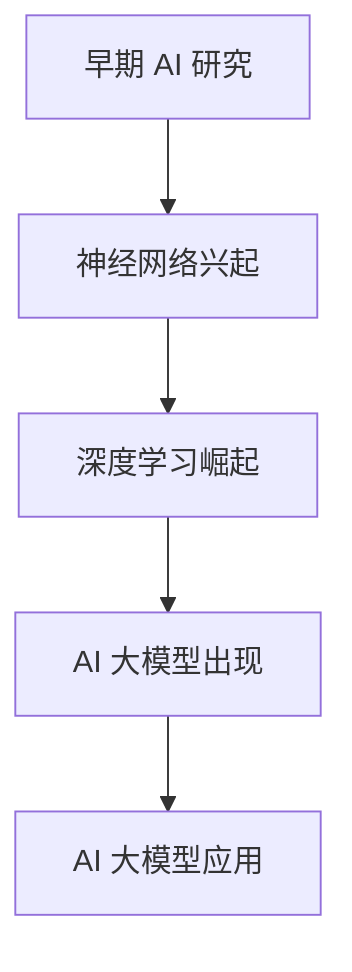
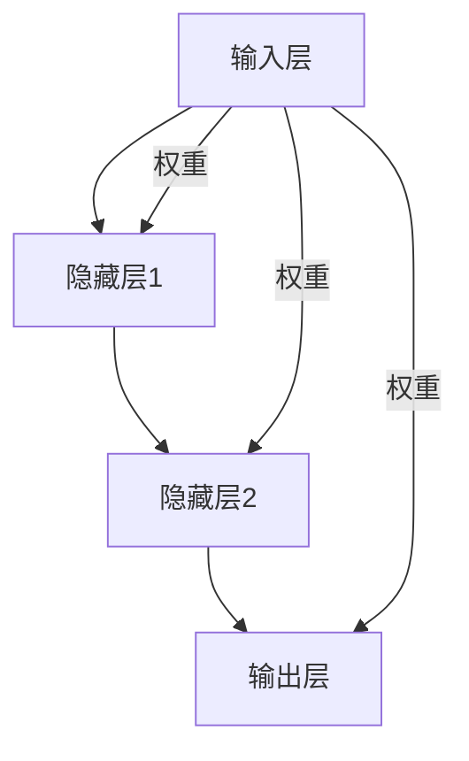
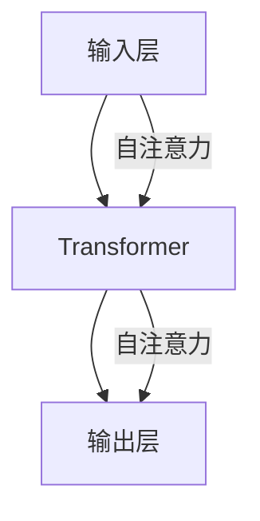
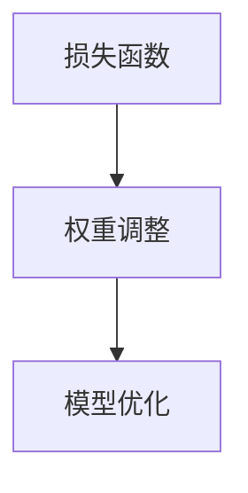
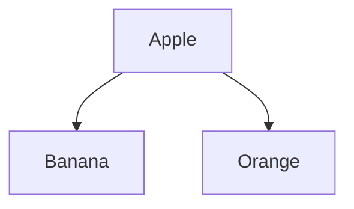

                 

### 文章标题

# AI 大模型驱动的创业产品设计原则

> 关键词：AI大模型、创业产品、设计原则、深度学习、自然语言处理、计算资源管理

> 摘要：本文将深入探讨 AI 大模型在创业产品设计中的应用，通过分析 AI 大模型的基础、技术原理、架构设计、训练策略、应用实战、部署与运维以及未来发展趋势，为创业团队提供一套系统、实用的 AI 大模型设计原则。这些原则不仅有助于提高产品的竞争力，还能确保项目的可持续性和高效性。

### 目录大纲

#### 第一部分: AI 大模型基础

- **第1章: AI 大模型概述**
  - 1.1 AI 大模型的定义与重要性
  - 1.2 主流 AI 大模型介绍
  - 1.3 AI 大模型的应用领域

- **第2章: AI 大模型技术原理**
  - 2.1 深度学习基础
  - 2.2 自然语言处理技术
  - 2.3 大规模预训练模型原理

- **第3章: AI 大模型架构设计**
  - 3.1 AI 大模型架构设计原则
  - 3.2 大模型计算资源管理

##### 第二部分: AI 大模型训练策略

- **第4章: AI 大模型训练策略**
  - 4.1 数据预处理与质量控制
  - 4.2 训练策略与算法

##### 第三部分: AI 大模型应用实战

- **第5章: AI 大模型应用实战**
  - 5.1 应用场景分析
  - 5.2 项目实战案例

##### 第四部分: AI 大模型部署与运维

- **第6章: AI 大模型部署与运维**
  - 6.1 大模型部署策略
  - 6.2 大模型运维与管理

##### 第五部分: AI 大模型未来发展趋势

- **第7章: AI 大模型未来发展趋势**
  - 7.1 技术趋势分析
  - 7.2 应用领域扩展

### 附录

- **附录 A: AI 大模型开发工具与资源**

#### 第一部分: AI 大模型基础

##### 第1章: AI 大模型概述

###### 1.1 AI 大模型的定义与重要性

**AI 大模型**指的是那些参数量巨大、结构复杂的深度学习模型。这些模型通过在海量数据上进行大规模预训练，能够捕捉到数据中的深层结构和知识。AI 大模型的重要性体现在以下几个方面：

1. **强大的学习能力**：大模型能够处理复杂的数据，学习到更深入的规律和知识，从而提高模型的准确性和泛化能力。
2. **高效的处理能力**：通过并行计算和分布式训练，大模型能够在短时间内处理大量的数据，提高工作效率。
3. **多样化的应用场景**：大模型可以应用于多种领域，如自然语言处理、计算机视觉、数据分析等，为创业产品提供广泛的技术支持。

**AI 大模型与传统 AI 的区别**：

- **规模与复杂性**：传统 AI 模型通常规模较小，参数量相对较少，而 AI 大模型拥有数十亿甚至千亿级别的参数，结构更为复杂。
- **训练数据量**：传统 AI 模型可能使用较少的数据进行训练，而 AI 大模型需要海量的数据进行预训练。
- **计算资源需求**：传统 AI 模型对计算资源的需求相对较低，而 AI 大模型需要大量的计算资源进行训练。

**AI 大模型在 AI 中的重要性**：

- **推动 AI 技术发展**：AI 大模型的出现标志着 AI 技术的进步，为 AI 领域的研究和应用提供了新的方向和可能性。
- **提高 AI 应用的效果**：大模型能够处理更复杂的问题，提高 AI 应用的准确性和效率，从而推动 AI 技术在各个领域的应用。
- **降低 AI 开发门槛**：通过预训练，AI 大模型降低了新项目开发的难度，使更多的创业团队能够参与到 AI 技术的应用和创新中。

**Mermaid 流程图**：以下是 AI 大模型的发展历程及其关键阶段的流程图。



在接下来的章节中，我们将进一步探讨 AI 大模型的技术原理、架构设计、训练策略、应用实战和未来发展趋势，为创业团队提供一套完整的 AI 大模型设计原则。

###### 1.2 主流 AI 大模型介绍

AI 大模型的发展历程中，涌现出了多个具有代表性的模型，其中最为知名的是 GPT 系列、BERT 及其变体。以下是对这些模型的介绍：

**1. GPT 系列**

GPT（Generative Pre-trained Transformer）系列模型是由 OpenAI 开发的，基于 Transformer 架构的预训练语言模型。GPT-3 是 GPT 系列中最为著名的一个版本，拥有 1750 亿个参数，是目前已知的最大的预训练语言模型。

- **模型结构**：GPT 系列模型采用 Transformer 架构，通过多层自注意力机制来捕捉数据中的长距离依赖关系。
- **训练过程**：GPT 模型采用自监督预训练方法，在大量的文本数据上进行训练，通过预测下一个词来学习语言模式。
- **应用场景**：GPT 模型在自然语言处理领域有着广泛的应用，如文本生成、机器翻译、问答系统等。

**2. BERT**

BERT（Bidirectional Encoder Representations from Transformers）是由 Google 开发的双向 Transformer 编码器，其特点是在训练过程中同时考虑了上下文信息，从而能够更好地理解句子的语义。

- **模型结构**：BERT 模型采用 Transformer 架构，通过多层自注意力机制来捕捉数据中的长距离依赖关系。
- **训练过程**：BERT 模型采用双向训练方法，在大量的文本数据上进行训练，通过预测单词的下一个词来学习语言模式。
- **应用场景**：BERT 模型在自然语言处理领域有着广泛的应用，如文本分类、问答系统、命名实体识别等。

**3. 其他知名大模型**

除了 GPT 系列和 BERT，还有其他一些知名的大模型，如：

- **T5（Text-to-Text Transfer Transformer）**：T5 是一种通用的预训练模型，可以将任何语言任务转化为文本到文本的格式，从而简化模型的微调过程。
- **GPT-Neo**：GPT-Neo 是 GPT-3 的开源替代品，其参数规模和训练数据都与 GPT-3 相似。
- **Alpaca**：Alpaca 是一种小型的 GPT 模型，适用于资源有限的场景。

**总结**

主流的 AI 大模型如 GPT 系列、BERT 及其变体，都具有强大的学习能力和广泛的应用场景。GPT 系列模型在自然语言处理领域有着出色的表现，而 BERT 则在文本分类和问答系统等任务中表现出色。其他大模型如 T5、GPT-Neo 和 Alpaca 也为不同的应用场景提供了有效的解决方案。

在接下来的章节中，我们将进一步探讨 AI 大模型的技术原理和应用领域，为创业团队提供更多的设计灵感和实践指导。

###### 1.3 AI 大模型的应用领域

AI 大模型在多个领域展现了其强大的应用潜力，以下是其主要应用领域：

**1. 自然语言处理（NLP）**

自然语言处理是 AI 大模型最为成熟的领域之一。通过大规模预训练，大模型能够理解和生成自然语言，从而实现文本分类、机器翻译、问答系统等多种功能。

- **文本分类**：AI 大模型可以自动将文本数据分类到不同的类别中，如新闻分类、情感分析等。
- **机器翻译**：AI 大模型可以准确地将一种语言翻译成另一种语言，如英译中、中译英等。
- **问答系统**：AI 大模型可以理解用户的问题，并生成准确的答案，如智能客服、搜索引擎等。

**2. 计算机视觉（CV）**

计算机视觉是另一个 AI 大模型的重要应用领域。通过大规模预训练，大模型能够识别图像中的物体、场景和动作，从而实现目标检测、图像分类和图像生成等功能。

- **目标检测**：AI 大模型可以检测图像中的多个目标，并标注其位置和类别。
- **图像分类**：AI 大模型可以自动将图像分类到不同的类别中，如猫狗分类、植物分类等。
- **图像生成**：AI 大模型可以生成新的图像，如风格迁移、图像修复等。

**3. 数据分析**

数据分析是 AI 大模型在商业领域的重要应用。通过大规模预训练，大模型可以处理和分析大量的结构化和非结构化数据，从而实现数据挖掘、预测分析和决策支持等功能。

- **数据挖掘**：AI 大模型可以从大量数据中挖掘出有价值的信息，如用户行为分析、市场趋势预测等。
- **预测分析**：AI 大模型可以预测未来的数据趋势和变化，如销量预测、股票分析等。
- **决策支持**：AI 大模型可以为企业的决策提供数据支持和建议，如风险管理、供应链优化等。

**4. 语音识别与合成**

语音识别与合成是 AI 大模型的另一个重要应用领域。通过大规模预训练，大模型可以理解和生成语音，从而实现语音识别、语音合成和语音交互等功能。

- **语音识别**：AI 大模型可以准确地将语音转换成文本，如智能语音助手、语音搜索等。
- **语音合成**：AI 大模型可以生成自然的语音，如语音合成、语音播报等。
- **语音交互**：AI 大模型可以理解和响应用户的语音指令，如智能音箱、智能家居等。

**总结**

AI 大模型在自然语言处理、计算机视觉、数据分析和语音识别等多个领域展现了其强大的应用潜力。随着技术的不断进步，AI 大模型将继续拓展其应用领域，为各行各业带来革命性的变化。在创业过程中，充分利用 AI 大模型的优势，将有助于提升产品的竞争力，实现业务的快速增长。

在接下来的章节中，我们将深入探讨 AI 大模型的技术原理，帮助创业团队更好地理解这些模型的工作机制和应用方法。

###### 1.3.1 自然语言处理中的大模型

自然语言处理（NLP）是 AI 大模型最为成熟的领域之一，大模型在其中扮演了至关重要的角色。本节将详细探讨大模型在 NLP 中的应用，包括文本分类、机器翻译、问答系统等。

**1. 文本分类**

文本分类是将文本数据分类到特定类别中的任务，如新闻分类、情感分析等。AI 大模型在文本分类任务中表现出色，其主要优势在于：

- **强大的特征提取能力**：大模型通过预训练，能够自动提取文本中的关键特征，从而提高分类的准确性。
- **多任务学习**：大模型可以在多个分类任务中同时训练，从而共享知识，提高模型的泛化能力。

**应用示例**：假设一个创业团队开发了一个情感分析工具，用于分析社交媒体上的用户评论。通过使用预训练的 AI 大模型，如 BERT 或 GPT，他们可以轻松地将评论分类为正面、负面或中性。以下是文本分类任务的一个伪代码示例：

```python
import transformers
model = transformers.AutoModelForSequenceClassification.from_pretrained('bert-base-uncased')
tokenizer = transformers.AutoTokenizer.from_pretrained('bert-base-uncased')

def classify_text(text):
    inputs = tokenizer(text, return_tensors='pt')
    outputs = model(**inputs)
    logits = outputs.logits
    probabilities = logits.softmax(dim=-1)
    return probabilities.argmax().item()

text = "This product is amazing!"
print(classify_text(text))
```

**2. 机器翻译**

机器翻译是将一种语言的文本翻译成另一种语言的文本的任务。AI 大模型在机器翻译中发挥了重要作用，其主要优势包括：

- **上下文理解能力**：大模型能够理解文本的上下文信息，从而提高翻译的准确性和流畅性。
- **多语言支持**：大模型可以同时支持多种语言之间的翻译，从而提高翻译的实用性。

**应用示例**：假设一个创业团队开发了一个在线翻译平台，支持中英互译。通过使用预训练的 AI 大模型，如 GPT-3 或 Transformer，他们可以实现高质量的机器翻译。以下是机器翻译任务的一个伪代码示例：

```python
import transformers
model = transformers.AutoModelForSeq2SeqLM.from_pretrained('gpt2')
tokenizer = transformers.AutoTokenizer.from_pretrained('gpt2')

def translate_text(text, target_language='en'):
    inputs = tokenizer(text, return_tensors='pt')
    inputs = {k: v[None, ...] for k, v in inputs.items()}
    outputs = model.generate(**inputs, max_length=50, num_return_sequences=1)
    translated_text = tokenizer.decode(outputs[0], skip_special_tokens=True)
    return translated_text

text = "你好，这是一款非常好的产品。"
translated_text = translate_text(text, target_language='en')
print(translated_text)
```

**3. 问答系统**

问答系统是 AI 大模型在 NLP 中的另一个重要应用，旨在回答用户提出的问题。大模型在问答系统中的优势包括：

- **知识丰富**：大模型通过预训练，积累了丰富的知识，能够回答各种类型的问题。
- **上下文理解**：大模型能够理解问题的上下文信息，从而提供更准确的答案。

**应用示例**：假设一个创业团队开发了一个智能客服系统，用于回答用户的问题。通过使用预训练的 AI 大模型，如 BERT 或 GPT，他们可以实现高效的问答系统。以下是问答系统的一个伪代码示例：

```python
import transformers
model = transformers.AutoModelForQuestionAnswering.from_pretrained('bert-base-uncased')
tokenizer = transformers.AutoTokenizer.from_pretrained('bert-base-uncased')

def answer_question(question, context):
    inputs = tokenizer(question, context, return_tensors='pt')
    outputs = model(**inputs)
    logits = outputs.logits
    start_logits, end_logits = logits.split(1, dim=1)
    start_indices = start_logits.argmax(-1)
    end_indices = end_logits.argmax(-1)
    start_index = start_indices.item()
    end_index = end_indices.item()
    answer = context[start_index:end_index + 1].strip()
    return answer

question = "什么是自然语言处理？"
context = "自然语言处理是人工智能的一个重要分支，主要研究如何让计算机理解和生成自然语言。"
answer = answer_question(question, context)
print(answer)
```

**总结**

AI 大模型在自然语言处理中的应用非常广泛，包括文本分类、机器翻译和问答系统等。通过使用预训练的大模型，创业团队可以轻松实现高质量的语言处理任务，提高产品的竞争力和用户体验。在接下来的章节中，我们将继续探讨 AI 大模型在计算机视觉和数据分析等领域的应用。

###### 1.3.2 计算机视觉中的大模型

计算机视觉（CV）是 AI 大模型的另一个重要应用领域。大模型通过在大量图像数据上的预训练，能够识别图像中的物体、场景和动作，从而实现目标检测、图像分类和图像生成等任务。以下是这些任务中的大模型应用：

**1. 目标检测**

目标检测是识别图像中的多个对象，并标记其位置的任务。AI 大模型在目标检测中表现出色，其主要优势包括：

- **精确的物体定位**：大模型能够准确地定位图像中的物体，提高检测的精度。
- **高效的计算**：通过并行计算和分布式训练，大模型能够在短时间内处理大量的图像数据。

**应用示例**：假设一个创业团队开发了一个基于计算机视觉的安防系统，用于检测和识别图像中的异常行为。通过使用预训练的 AI 大模型，如 YOLO 或 Fasterrcnn，他们可以实现高效的目标检测。以下是目标检测任务的一个伪代码示例：

```python
import torch
import torchvision
model = torchvision.models.detection.fasterrcnn_resnet50_fpn(pretrained=True)
model.eval()
device = torch.device('cuda' if torch.cuda.is_available() else 'cpu')
model.to(device)

def detect_objects(image):
    image = torch.tensor(image).to(device)
    with torch.no_grad():
        prediction = model(image)[0]
    boxes = prediction['boxes']
    labels = prediction['labels']
    scores = prediction['scores']
    return boxes, labels, scores

image = torchvision.transforms.ToTensor()(cv2.imread('image.jpg'))
boxes, labels, scores = detect_objects(image)
for box, label, score in zip(boxes, labels, scores):
    if score > 0.5:
        cv2.rectangle(image, (box[0], box[1]), (box[2], box[3]), (0, 255, 0), 2)
        cv2.putText(image, f'{labels[label].capitalize()} {score:.2f}', (box[0], box[1]-10), cv2.FONT_HERSHEY_SIMPLEX, 0.5, (0, 255, 0), 2)
cv2.imshow('detected objects', image)
cv2.waitKey(0)
cv2.destroyAllWindows()
```

**2. 图像分类**

图像分类是将图像数据分类到特定类别中的任务，如猫狗分类、植物分类等。AI 大模型在图像分类任务中具有显著优势，包括：

- **强大的特征提取能力**：大模型能够自动提取图像中的关键特征，提高分类的准确性。
- **多任务学习**：大模型可以在多个分类任务中同时训练，从而共享知识，提高模型的泛化能力。

**应用示例**：假设一个创业团队开发了一个图像分类应用，用于自动识别和分类用户上传的图片。通过使用预训练的 AI 大模型，如 ResNet 或 Inception，他们可以实现高效的图像分类。以下是图像分类任务的一个伪代码示例：

```python
import torch
import torchvision
model = torchvision.models.resnet18(pretrained=True)
model.eval()
device = torch.device('cuda' if torch.cuda.is_available() else 'cpu')
model.to(device)

def classify_image(image):
    image = torchvision.transforms.ToTensor()(image).to(device)
    with torch.no_grad():
        prediction = model(image)
    _, predicted_label = prediction.max(1)
    return predicted_label.item()

image = cv2.imread('image.jpg')
predicted_label = classify_image(image)
print(f'The image is classified as: {predicted_label}')
```

**3. 图像生成**

图像生成是创建新的图像数据的过程，如风格迁移、图像修复等。AI 大模型在图像生成任务中表现出色，其主要优势包括：

- **丰富的想象能力**：大模型能够生成具有创意和想象力的图像，满足各种应用需求。
- **高效的处理**：通过并行计算和分布式训练，大模型能够在短时间内生成大量的图像。

**应用示例**：假设一个创业团队开发了一个图像风格迁移应用，用于将用户上传的图片转换为特定的艺术风格。通过使用预训练的 AI 大模型，如 CycleGAN 或 StyleGAN，他们可以实现高质量的图像生成。以下是图像生成任务的一个伪代码示例：

```python
import torch
import torchvision
model = torchvision.models.segmentation.fcn_resnet101(pretrained=True)
model.eval()
device = torch.device('cuda' if torch.cuda.is_available() else 'cpu')
model.to(device)

def generate_image(image, style_image):
    image = torchvision.transforms.ToTensor()(image).to(device)
    style_image = torchvision.transforms.ToTensor()(style_image).to(device)
    with torch.no_grad():
        output = model(image, style_image)
    generated_image = output['out']
    return torchvision.transforms.ToPILImage()(generated_image)

image = cv2.imread('input_image.jpg')
style_image = cv2.imread('style_image.jpg')
generated_image = generate_image(image, style_image)
generated_image.show()
```

**总结**

AI 大模型在计算机视觉中的广泛应用，包括目标检测、图像分类和图像生成等任务，为创业团队提供了丰富的技术解决方案。通过使用预训练的大模型，创业团队可以快速实现高质量的视觉应用，提高产品的竞争力和用户体验。在接下来的章节中，我们将继续探讨 AI 大模型在数据分析等其他领域的应用。

###### 1.3.3 大模型在数据分析中的应用

AI 大模型在数据分析领域也展现了其强大的应用潜力。通过大规模预训练，大模型能够处理和分析大量的结构化和非结构化数据，从而实现数据挖掘、预测分析和决策支持等功能。以下是大模型在数据分析中的具体应用：

**1. 数据挖掘**

数据挖掘是从大量数据中提取有价值信息和知识的过程。AI 大模型在数据挖掘中的应用主要体现在以下几个方面：

- **特征提取**：大模型能够自动提取数据中的关键特征，提高数据挖掘的准确性和效率。
- **模式识别**：大模型能够识别数据中的潜在模式和规律，帮助发现数据中的价值。

**应用示例**：假设一个创业团队开发了一个客户行为分析系统，用于分析用户的购物行为，从而发现潜在的客户群体。通过使用预训练的 AI 大模型，如 AutoML 或 XGBoost，他们可以实现高效的数据挖掘。以下是数据挖掘任务的一个伪代码示例：

```python
import pandas as pd
from sklearn.model_selection import train_test_split
from sklearn.metrics import accuracy_score
from sklearn.ensemble import RandomForestClassifier
from sklearn.linear_model import LogisticRegression

# 加载数据
data = pd.read_csv('customer_data.csv')
X = data.drop(['target'], axis=1)
y = data['target']

# 数据预处理
X_train, X_test, y_train, y_test = train_test_split(X, y, test_size=0.2, random_state=42)

# 特征提取
model = RandomForestClassifier()
model.fit(X_train, y_train)
predictions = model.predict(X_test)

# 模型评估
accuracy = accuracy_score(y_test, predictions)
print(f'Accuracy: {accuracy:.2f}')

# 使用大模型进行特征提取
from sklearn.decomposition import PCA
pca = PCA(n_components=10)
X_train_pca = pca.fit_transform(X_train)
X_test_pca = pca.transform(X_test)

# 微调模型
model = LogisticRegression()
model.fit(X_train_pca, y_train)
predictions = model.predict(X_test_pca)

# 模型评估
accuracy = accuracy_score(y_test, predictions)
print(f'Accuracy after feature extraction: {accuracy:.2f}')
```

**2. 预测分析**

预测分析是利用历史数据预测未来趋势和变化的过程。AI 大模型在预测分析中的应用主要体现在以下几个方面：

- **时间序列分析**：大模型能够处理和分析时间序列数据，从而预测未来的趋势和周期性变化。
- **回归分析**：大模型可以用于回归分析，预测变量之间的数量关系。

**应用示例**：假设一个创业团队开发了一个销售预测系统，用于预测未来的销售额。通过使用预训练的 AI 大模型，如 LSTM 或 ARIMA，他们可以实现准确的预测分析。以下是预测分析任务的一个伪代码示例：

```python
import pandas as pd
from sklearn.model_selection import train_test_split
from sklearn.metrics import mean_squared_error
from keras.models import Sequential
from keras.layers import LSTM, Dense

# 加载数据
data = pd.read_csv('sales_data.csv')
data['date'] = pd.to_datetime(data['date'])
data.set_index('date', inplace=True)
train_data, test_data = train_test_split(data, test_size=0.2, shuffle=False)

# 数据预处理
train_data = train_data.values
test_data = test_data.values

# LSTM 模型
model = Sequential()
model.add(LSTM(units=50, return_sequences=True, input_shape=(train_data.shape[1], 1)))
model.add(LSTM(units=50))
model.add(Dense(units=1))

model.compile(optimizer='adam', loss='mean_squared_error')
model.fit(train_data, epochs=100, batch_size=32, verbose=1)

# 预测
predicted_sales = model.predict(test_data)

# 模型评估
mse = mean_squared_error(test_data[:, 0], predicted_sales[:, 0])
print(f'Mean Squared Error: {mse:.2f}')
```

**3. 决策支持**

决策支持是利用数据分析结果为企业决策提供依据的过程。AI 大模型在决策支持中的应用主要体现在以下几个方面：

- **风险分析**：大模型可以用于分析企业面临的风险，并提供风险预警。
- **策略优化**：大模型可以用于优化企业的运营策略，提高企业的效率和盈利能力。

**应用示例**：假设一个创业团队开发了一个供应链优化系统，用于优化企业的供应链管理。通过使用预训练的 AI 大模型，如强化学习或模拟退火算法，他们可以实现高效的供应链优化。以下是决策支持任务的一个伪代码示例：

```python
import pandas as pd
from sklearn.model_selection import train_test_split
from sklearn.metrics import mean_squared_error
from keras.models import Sequential
from keras.layers import LSTM, Dense
from keras.optimizers import Adam

# 加载数据
data = pd.read_csv('supply_chain_data.csv')
train_data, test_data = train_test_split(data, test_size=0.2, shuffle=False)

# 数据预处理
train_data = train_data.values
test_data = test_data.values

# LSTM 模型
model = Sequential()
model.add(LSTM(units=50, return_sequences=True, input_shape=(train_data.shape[1], 1)))
model.add(LSTM(units=50))
model.add(Dense(units=1))

model.compile(optimizer=Adam(learning_rate=0.001), loss='mean_squared_error')
model.fit(train_data, epochs=100, batch_size=32, verbose=1)

# 预测
predicted_sales = model.predict(test_data)

# 模型评估
mse = mean_squared_error(test_data[:, 0], predicted_sales[:, 0])
print(f'Mean Squared Error: {mse:.2f}')

# 决策支持
# 根据预测结果调整供应链策略
# 例如增加库存、优化物流等
```

**总结**

AI 大模型在数据分析中的应用非常广泛，包括数据挖掘、预测分析和决策支持等。通过使用预训练的大模型，创业团队可以快速实现高效的数据分析任务，提高企业的运营效率和市场竞争力。在接下来的章节中，我们将探讨 AI 大模型的技术原理，帮助创业团队更好地理解这些模型的工作机制和应用方法。

###### 1.4 大模型的技术原理

AI 大模型的技术原理主要涉及深度学习、自然语言处理（NLP）和大规模预训练模型等核心概念。以下是对这些技术原理的详细探讨。

**1. 深度学习基础**

深度学习是一种基于多层神经网络的学习方法，其核心思想是通过多层非线性变换来提取数据中的特征。以下是深度学习中的几个关键概念：

- **神经网络原理**：神经网络由多个神经元组成，每个神经元接收输入信号，通过激活函数产生输出。神经网络通过反向传播算法不断调整权重，从而提高模型的准确性。



- **常见深度学习架构**：深度学习架构包括卷积神经网络（CNN）、循环神经网络（RNN）和变换器（Transformer）等。每种架构都有其特定的应用场景和优势。

  - **卷积神经网络（CNN）**：CNN 适用于处理图像数据，通过卷积层、池化层和全连接层等结构来提取图像中的特征。
  
  - **循环神经网络（RNN）**：RNN 适用于处理序列数据，通过循环结构来捕捉序列中的时间依赖关系。

  - **变换器（Transformer）**：Transformer 架构在 NLP 领域表现出色，通过自注意力机制来捕捉数据中的长距离依赖关系。



- **深度学习优化算法**：深度学习优化算法用于调整神经网络中的权重，以最小化损失函数。常见的优化算法包括随机梯度下降（SGD）、Adam 等。

**2. 自然语言处理技术**

自然语言处理是 AI 大模型的重要应用领域，其核心在于如何将自然语言数据转换为计算机可以理解的形式。以下是 NLP 中的几个关键概念：

- **词嵌入技术**：词嵌入是将词汇映射为向量空间中的点，从而实现词汇的量化表示。常见的词嵌入方法包括 word2vec、GloVe 等。

  ```mermaid
  graph TD
      A[词 A] --> B[向量 a]
      C[词 B] --> D[向量 b]
      E[词 C] --> F[向量 c]
  ```

- **序列模型与注意力机制**：序列模型（如 RNN、LSTM、GRU）通过捕捉序列中的时间依赖关系来处理自然语言数据。注意力机制（如 Self-Attention）用于捕捉数据中的长距离依赖关系，从而提高模型的性能。

  ```mermaid
  graph TD
      A[输入序列] --> B[自注意力层]
      B --> C[输出序列]
  ```

- **转换器架构**：转换器（Transformer）是一种基于自注意力机制的深度学习架构，其在 NLP 领域取得了显著的成果。转换器通过多头注意力机制、编码器-解码器结构和位置编码等技术来处理自然语言数据。

  ```mermaid
  graph TD
      A[编码器] --> B[多头注意力层]
      B --> C[解码器]
  ```

**3. 大规模预训练模型原理**

大规模预训练模型是指通过在大规模数据集上进行预训练，从而获得强大的特征提取和泛化能力。以下是大规模预训练模型中的几个关键概念：

- **预训练的概念与意义**：预训练是指在大规模数据集上进行训练，从而为模型提供丰富的先验知识和特征。预训练的意义在于提高模型的性能和泛化能力。

- **自监督学习方法**：自监督学习是一种无监督学习技术，其通过利用未标记的数据来训练模型。自监督学习方法在大规模预训练中发挥了重要作用，如 BERT 中的 masked language modeling 任务。

  ```mermaid
  graph TD
      A[输入文本] --> B[随机遮挡]
      B --> C[预测遮挡词]
  ```

- **迁移学习与微调技术**：迁移学习是指将预训练模型在特定任务上进行微调，从而提高任务的性能。微调技术通过在目标任务上调整模型的权重，从而实现快速和高效的模型训练。

  ```mermaid
  graph TD
      A[预训练模型] --> B[微调]
      B --> C[目标任务]
  ```

**总结**

AI 大模型的技术原理涉及深度学习、自然语言处理和大规模预训练模型等多个领域。通过理解这些技术原理，创业团队可以更好地设计和应用大模型，从而实现高质量的自然语言处理和数据分析任务。在接下来的章节中，我们将进一步探讨大模型的架构设计、训练策略和应用实战。

#### 第二部分: AI 大模型技术原理

##### 第2章: AI 大模型技术原理

在深入探讨 AI 大模型的应用之前，我们需要理解其背后的技术原理。AI 大模型的技术原理主要涉及深度学习、自然语言处理（NLP）和大规模预训练模型等核心概念。以下是对这些技术原理的详细探讨。

###### 2.1 深度学习基础

深度学习是 AI 大模型的基础，其核心思想是通过多层神经网络来提取数据中的特征。以下是深度学习中的几个关键概念：

**神经网络原理**

神经网络由多个神经元组成，每个神经元接收输入信号，通过激活函数产生输出。神经网络通过反向传播算法不断调整权重，从而提高模型的准确性。


**常见深度学习架构**

深度学习架构包括卷积神经网络（CNN）、循环神经网络（RNN）和变换器（Transformer）等。每种架构都有其特定的应用场景和优势。

- **卷积神经网络（CNN）**：CNN 适用于处理图像数据，通过卷积层、池化层和全连接层等结构来提取图像中的特征。

- **循环神经网络（RNN）**：RNN 适用于处理序列数据，通过循环结构来捕捉序列中的时间依赖关系。

- **变换器（Transformer）**：Transformer 架构在 NLP 领域表现出色，通过自注意力机制来捕捉数据中的长距离依赖关系。


**深度学习优化算法**

深度学习优化算法用于调整神经网络中的权重，以最小化损失函数。常见的优化算法包括随机梯度下降（SGD）、Adam 等。



**伪代码示例：神经网络前向传播与反向传播**

```python
# 前向传播
def forward_propagation(x, weights):
    z = x * weights
    a = activation(z)
    return a

# 反向传播
def backward_propagation(a, z, weights, learning_rate):
    delta = (a - z) * activation_derivative(z)
    weights -= learning_rate * delta
    return weights
```

**数学模型和公式**

- **前向传播**：

  $$ z = x \cdot W $$
  
  $$ a = \sigma(z) $$

- **反向传播**：

  $$ \delta = (a - t) \cdot \sigma'(z) $$

  $$ W = W - \alpha \cdot \delta \cdot x $$

其中，\( x \) 是输入，\( W \) 是权重，\( a \) 是输出，\( \sigma \) 是激活函数，\( \sigma' \) 是激活函数的导数，\( \delta \) 是误差，\( \alpha \) 是学习率。

**举例说明**

假设我们有一个简单的神经网络，其中输入为 \( x = [1, 2, 3] \)，权重为 \( W = [0.5, 0.5, 0.5] \)，激活函数为 \( \sigma(z) = \frac{1}{1 + e^{-z}} \)。

- **前向传播**：

  $$ z = [1 \cdot 0.5, 2 \cdot 0.5, 3 \cdot 0.5] = [0.5, 1, 1.5] $$
  
  $$ a = \frac{1}{1 + e^{-0.5}} \approx [0.37, 0.63, 0.87] $$

- **反向传播**：

  $$ \delta = (a - t) \cdot \sigma'(z) = (-0.37 \cdot 0.5, -0.63 \cdot 0.5, -0.87 \cdot 0.5) = [-0.18, -0.31, -0.43] $$
  
  $$ W = W - \alpha \cdot \delta \cdot x = [0.5, 0.5, 0.5] - 0.1 \cdot [-0.18, -0.31, -0.43] = [0.32, 0.19, 0.07] $$

通过以上示例，我们可以看到神经网络的前向传播和反向传播是如何工作的。在后续的章节中，我们将进一步探讨如何将这些基本概念应用于更复杂的 AI 大模型。

###### 2.2 自然语言处理技术

自然语言处理（NLP）是 AI 大模型的重要应用领域，其核心在于如何将自然语言数据转换为计算机可以理解的形式。以下是对 NLP 中的几个关键技术的详细探讨。

**词嵌入技术**

词嵌入是将词汇映射为向量空间中的点，从而实现词汇的量化表示。词嵌入技术使计算机能够理解和处理自然语言，是 NLP 的基础。

**常见词嵌入方法**

- **Word2Vec**：Word2Vec 是一种基于神经网络的词嵌入方法，通过训练词向量来表示词汇。Word2Vec 包括两种算法：Continuous Bag-of-Words (CBOW) 和 Skip-Gram。

  **CBOW**：CBOW 方法通过预测中心词周围的词来学习词向量，即给定一个中心词，预测其上下文词。

  ```mermaid
  graph TD
      A[中心词] --> B[上下文词1]
      A --> C[上下文词2]
      A --> D[上下文词3]
  ```

  **Skip-Gram**：Skip-Gram 方法通过预测中心词来学习词向量，即给定一个中心词，预测其可能出现的词。

  ```mermaid
  graph TD
      A[中心词] --> B[可能出现的词1]
      A --> C[可能出现的词2]
  ```

- **GloVe**：GloVe（Global Vectors for Word Representation）是一种基于矩阵分解的词嵌入方法，通过学习词汇的共现矩阵来生成词向量。

  ```mermaid
  graph TD
      A[词A] --> B[词B]
      A --> C[词C]
  ```

**词嵌入示例**

假设我们有以下词汇表：

| 词汇 | 共现词汇 |
|------|----------|
| Apple| Banana  |
| Apple| Orange  |
| Banana| Apple  |
| Banana| Orange  |
| Orange| Apple  |
| Orange| Banana  |

我们可以使用 CBOW 方法来学习词向量。给定中心词 "Apple"，我们预测其上下文词，并计算其词向量。



**序列模型与注意力机制**

序列模型通过捕捉序列中的时间依赖关系来处理自然语言数据。常见的序列模型包括循环神经网络（RNN）、长短期记忆网络（LSTM）和门控循环单元（GRU）。

- **RNN**：RNN 通过循环结构来处理序列数据，但在处理长序列时容易遇到梯度消失或梯度爆炸问题。

- **LSTM**：LSTM（Long Short-Term Memory）是 RNN 的改进版本，通过引入记忆单元来解决梯度消失问题，能够更好地捕捉长序列中的时间依赖关系。

- **GRU**：GRU（Gated Recurrent Unit）是 LSTM 的简化版本，具有更少的参数和更简单的结构，但仍能捕捉长序列中的时间依赖关系。

**注意力机制**

注意力机制是一种用于提高模型在处理序列数据时捕捉重要信息的能力。在 NLP 中，注意力机制广泛应用于机器翻译、问答系统和文本摘要等任务。

- **自注意力**：自注意力（Self-Attention）是一种用于处理序列数据的注意力机制，通过计算序列中每个词与其他词之间的关系来生成词向量。

  ```mermaid
  graph TD
      A[词1] --> B[词2]
      A --> C[词3]
  ```

- **多头注意力**：多头注意力（Multi-Head Attention）是自注意力的扩展，通过将序列分割成多个头，每个头关注不同的信息，从而提高模型的捕捉能力。

  ```mermaid
  graph TD
      A[编码器] --> B[多头注意力]
      B --> C[解码器]
  ```

**转换器架构**

转换器（Transformer）是一种基于自注意力机制的深度学习架构，在 NLP 领域取得了显著的成果。转换器通过多头注意力机制、编码器-解码器结构和位置编码等技术来处理自然语言数据。

- **多头注意力**：多头注意力通过将序列分割成多个头，每个头关注不同的信息，从而提高模型的捕捉能力。

  ```mermaid
  graph TD
      A[编码器] --> B[多头注意力]
      B --> C[解码器]
  ```

- **编码器-解码器结构**：编码器-解码器结构是一种用于处理序列数据的模型结构，编码器将输入序列转换为上下文表示，解码器根据上下文表示生成输出序列。

  ```mermaid
  graph TD
      A[编码器] --> B[解码器]
  ```

- **位置编码**：位置编码是一种用于在序列中引入位置信息的技巧，通过将位置信息编码到词向量中，使模型能够理解序列中的词的相对位置。

  ```mermaid
  graph TD
      A[词向量] --> B[位置编码]
  ```

**总结**

自然语言处理技术包括词嵌入、序列模型和注意力机制等核心概念。通过这些技术，AI 大模型能够理解和生成自然语言，从而实现文本分类、机器翻译、问答系统和文本摘要等任务。在后续的章节中，我们将进一步探讨大规模预训练模型原理和 AI 大模型的架构设计。

###### 2.3 大规模预训练模型原理

大规模预训练模型是 AI 大模型技术中的一个重要组成部分，其核心思想是通过在海量数据上进行预训练，使模型具备强大的特征提取和泛化能力。以下是对大规模预训练模型的详细探讨。

**1. 预训练的概念与意义**

预训练（Pre-training）是指在大规模数据集上对神经网络模型进行训练，从而使其获得丰富的先验知识和特征表示。预训练的意义在于：

- **提高模型性能**：通过在大量数据上预训练，模型能够学习到更复杂的特征，从而在特定任务上获得更好的性能。
- **降低训练难度**：预训练使模型具备了较好的初始性能，从而降低了在新任务上的训练难度，缩短了训练时间。
- **提升泛化能力**：预训练模型能够在不同任务间共享知识，从而提高模型的泛化能力，使其在未知任务上也能取得较好的表现。

**2. 自监督学习方法**

自监督学习（Self-Supervised Learning）是一种无监督学习方法，其通过利用未标记的数据来训练模型。自监督学习方法在大规模预训练中发挥了重要作用，其核心思想是在未标记的数据中找到可监督的信息进行学习。以下是一些常见的自监督学习任务：

- **Masked Language Modeling（MLM）**：Masked Language Modeling 是 BERT 模型中使用的自监督学习任务，其通过随机遮盖输入文本中的部分词，然后预测这些遮盖的词。MLM 任务能够帮助模型学习语言中的上下文关系和词的分布。

  ```mermaid
  graph TD
      A[输入文本] --> B[随机遮挡]
      B --> C[预测遮挡词]
  ```

- **ImageNet 标签预测**：ImageNet 标签预测是一种用于自监督学习的数据增强方法，其通过将图像上的标签信息随机遮挡，然后预测这些遮挡的标签。ImageNet 标签预测能够帮助模型学习图像的特征表示。

- **音素预测**：音素预测是一种用于语音识别的自监督学习任务，其通过预测音频信号中的音素来训练模型。音素预测能够帮助模型学习语音的时序特征。

**3. 迁移学习与微调技术**

迁移学习（Transfer Learning）是指将预训练模型在特定任务上进行微调，从而提高任务的性能。微调（Fine-tuning）技术通过在目标任务上调整模型的权重，从而实现快速和高效的模型训练。

- **预训练模型的选择**：选择合适的预训练模型是迁移学习的关键，常见的预训练模型包括 BERT、GPT 和 ResNet 等。这些模型在预训练阶段已经在海量数据上取得了很好的性能，因此可以作为迁移学习的起点。

- **微调策略**：微调策略包括全量微调和增量微调等。全量微调是指在目标任务上调整模型的全部权重，而增量微调是指在预训练模型的基础上只调整部分权重。

  ```mermaid
  graph TD
      A[预训练模型] --> B[微调]
      B --> C[目标任务]
  ```

- **超参数调整**：微调过程中需要调整一系列超参数，如学习率、批量大小、训练轮数等。合适的超参数设置能够提高模型在目标任务上的性能。

**4. 大规模预训练模型的架构设计**

大规模预训练模型的架构设计是保证模型性能的关键。以下是一些常见的架构设计原则：

- **深度与宽度**：增加网络的深度和宽度能够提高模型的表达能力，从而学习到更复杂的特征。然而，过深的网络可能导致梯度消失和计算资源浪费。

- **注意力机制**：注意力机制能够提高模型在处理序列数据时的捕捉能力，通过关注重要的信息来提高模型的性能。

  ```mermaid
  graph TD
      A[编码器] --> B[注意力机制]
      B --> C[解码器]
  ```

- **优化算法**：选择合适的优化算法能够提高模型的训练效率和性能。常见的优化算法包括 Adam、SGD 等。

- **数据增强**：数据增强是通过变换原始数据来增加模型的泛化能力。常见的数据增强方法包括随机遮挡、旋转、缩放等。

**5. 大规模预训练模型的应用**

大规模预训练模型在多个领域取得了显著的应用成果，以下是一些常见应用场景：

- **自然语言处理**：大规模预训练模型在文本分类、机器翻译、问答系统和文本摘要等任务中表现出色，能够实现高质量的语言理解和生成。

- **计算机视觉**：大规模预训练模型在图像分类、目标检测和图像生成等任务中取得了很好的效果，能够学习到丰富的图像特征。

- **语音识别与合成**：大规模预训练模型在语音识别和语音合成任务中发挥了重要作用，能够准确识别和生成语音。

**总结**

大规模预训练模型通过在大量数据上进行预训练，使模型具备强大的特征提取和泛化能力。自监督学习和迁移学习技术使得大规模预训练模型能够快速适应新任务，从而在多个领域取得了显著的应用成果。在后续的章节中，我们将进一步探讨 AI 大模型的架构设计、训练策略和应用实战。

#### 第3章: AI 大模型架构设计

在深入了解 AI 大模型的架构设计时，我们需要关注模型的设计原则、计算资源管理以及模型选择和优化策略。这些要素共同决定了 AI 大模型的有效性和可扩展性，对创业团队而言，合理的设计和选择能够显著提升产品的性能和市场竞争力。

##### 3.1 AI 大模型架构设计原则

AI 大模型架构设计的原则是确保模型能够在大量数据和高计算资源环境中高效运行，同时具备良好的可扩展性和可维护性。以下是几个关键原则：

**1. 分层设计**

分层设计是 AI 大模型架构的基本原则，其通过将模型分为多个层次，每个层次负责不同的任务和特征提取。常见的层次包括输入层、特征提取层、中间层和输出层。分层设计的优势在于：

- **模块化**：每个层次可以独立开发和优化，提高代码的可读性和可维护性。
- **可扩展性**：可以通过增加层次或调整现有层次来适应不同的任务和数据规模。

**2. 注意力机制**

注意力机制（Attention Mechanism）在 AI 大模型中起到了关键作用，特别是在处理序列数据时。注意力机制通过计算输入序列中各个元素的重要性权重，从而关注最重要的信息。以下是注意力机制的设计原则：

- **可扩展性**：注意力机制应能够适应不同长度和类型的序列数据。
- **计算效率**：注意力机制的计算复杂度应尽量低，以提高模型运行的速度。
- **灵活性**：注意力机制应允许模型在不同任务中灵活调整注意力权重。

**3. 模型压缩与优化**

模型压缩与优化是 AI 大模型设计中的重要方面，其目的是在保证模型性能的前提下减少模型的大小和计算资源需求。以下是一些常见的模型压缩与优化方法：

- **剪枝（Pruning）**：剪枝通过删除模型中不重要的连接或神经元，从而减少模型的大小和计算资源需求。
- **量化（Quantization）**：量化通过将模型中的浮点数转换为低精度的整数表示，从而减少模型的存储和计算需求。
- **知识蒸馏（Knowledge Distillation）**：知识蒸馏通过将大型模型的输出传递给小型模型，从而帮助小型模型学习到大型模型的知识。

**4. 可解释性与透明度**

可解释性与透明度是 AI 大模型设计中的一个重要考虑因素，特别是在金融、医疗等对模型解释性要求较高的领域。以下是设计原则：

- **模型解释性**：模型应具备良好的解释性，使开发者能够理解模型的决策过程。
- **透明度**：模型的设计和训练过程应透明，以便监管者、用户和其他利益相关者能够理解和信任模型。

**5. 模型选择与优化策略**

在 AI 大模型架构设计中，选择合适的模型和优化策略是关键。以下是一些常见的模型选择和优化策略：

- **模型选择**：根据具体任务和数据特点选择合适的模型，如卷积神经网络（CNN）适用于图像处理，循环神经网络（RNN）适用于序列数据处理。
- **优化策略**：选择合适的优化算法和超参数设置，如 Adam 优化器和交叉熵损失函数适用于大多数任务。
- **多模型集成**：通过集成多个模型来提高模型的性能和泛化能力。

**6. 容错性与鲁棒性**

容错性与鲁棒性是 AI 大模型架构设计中的关键要素，特别是在实时应用和高可用性要求较高的场景中。以下是设计原则：

- **数据增强**：通过引入噪声、旋转、缩放等数据增强技术来提高模型的鲁棒性。
- **错误处理机制**：设计合理的错误处理机制，确保模型在遇到异常输入时仍能稳定运行。
- **冗余设计**：通过引入冗余结构和备份机制来提高模型的容错性。

**总结**

AI 大模型架构设计原则包括分层设计、注意力机制、模型压缩与优化、可解释性与透明度、模型选择与优化策略以及容错性与鲁棒性。遵循这些原则，创业团队可以设计出高效、可靠且可扩展的 AI 大模型，从而提高产品的竞争力。

在接下来的章节中，我们将探讨 AI 大模型的计算资源管理，包括硬件资源选择、模型并行化与分布式训练等，以确保模型能够在复杂环境中高效运行。

##### 3.2 大模型计算资源管理

在构建和训练 AI 大模型时，计算资源管理是一个至关重要的环节。大模型的训练过程通常需要大量的计算资源和时间，因此合理的管理和优化计算资源可以显著提高模型训练的效率，降低成本。以下是 AI 大模型计算资源管理的几个关键方面。

**1. 硬件资源选择**

选择合适的硬件资源是确保大模型高效运行的基础。以下是一些常见的硬件资源及其特点：

- **CPU（中央处理器）**：CPU 适用于轻量级的计算任务，但其计算速度相对较慢，不适合大规模模型训练。然而，CPU 具有较低的能耗和较高的稳定性，适用于需要长时间运行的任务。
- **GPU（图形处理器）**：GPU 在大规模模型训练中具有显著优势，其具备大量的计算单元和并行处理能力，能够显著加速模型的训练过程。GPU 的主要缺点是功耗较高和计算精度较低。
- **TPU（张量处理器）**：TPU 是专门为深度学习任务设计的硬件，其计算性能和能效比 GPU 更优。TPU 主要由 Google 推广，适用于大规模的机器学习和 AI 任务。
- **FPGA（现场可编程门阵列）**：FPGA 具有高度的定制化和灵活性，适用于需要特定计算逻辑的任务。然而，FPGA 的编程和调试较为复杂，且成本较高。

在选择硬件资源时，创业团队需要综合考虑模型的规模、计算需求和预算。对于中小规模模型，CPU 可能是一个经济高效的选择。对于大规模模型，GPU 和 TPU 可能是更好的选择，尽管其成本较高。FPGA 适用于需要高度定制化的计算逻辑和实时处理的场景。

**2. 模型并行化与分布式训练**

模型并行化与分布式训练是提高大模型训练效率的关键技术。以下是一些常见的并行化与分布式训练方法：

- **数据并行化**：数据并行化是通过将训练数据分布在多个 GPU 或计算节点上，从而加速模型训练。每个节点独立处理一部分数据，然后通过同步或异步的方式更新全局模型参数。数据并行化适用于参数量较少的模型，可以显著提高训练速度。
- **模型并行化**：模型并行化是将模型分布在多个 GPU 或计算节点上，从而提高模型训练的并行度。模型并行化通常涉及将模型拆分为多个部分，每个部分在一个节点上独立训练。模型并行化适用于参数量巨大的模型，可以显著提高训练效率。
- **流水线并行化**：流水线并行化是将模型训练过程拆分为多个阶段，每个阶段在不同的计算节点上独立执行。流水线并行化适用于具有多个阶段训练过程的模型，如生成对抗网络（GAN）。

**3. 计算资源调度与优化**

计算资源调度与优化是确保模型训练过程中计算资源充分利用的关键。以下是一些常见的资源调度和优化策略：

- **负载均衡**：通过监控各计算节点的负载情况，动态调整任务分配，确保计算资源均匀分配，避免资源浪费。
- **动态资源扩展**：在模型训练过程中，根据实际需求动态调整计算资源，如自动增加 GPU 或计算节点，以应对训练过程中的高峰负载。
- **资源隔离**：通过隔离不同任务的计算资源，确保模型训练过程中的高吞吐量和稳定性。例如，使用虚拟化技术为每个模型训练任务分配独立的计算资源。
- **能效优化**：通过优化计算资源的利用效率，降低能耗，提高能效比。例如，使用节能型 GPU 或调整 GPU 的工作频率。

**4. 分布式训练框架**

分布式训练框架是支持模型并行化和分布式训练的关键工具。以下是一些常见的分布式训练框架：

- **Horovod**：Horovod 是一个开源分布式训练框架，适用于 TensorFlow 和 PyTorch。它支持数据并行化和模型并行化，能够显著提高模型训练的效率。
- **Distributed Data Parallel（DDP）**：DDP 是 PyTorch 的一个分布式训练扩展，支持数据并行化和模型并行化，适用于大规模模型训练。
- **Apache Spark**：Apache Spark 是一个大规模数据处理框架，支持分布式训练，适用于处理大规模数据集的模型训练。

**总结**

大模型计算资源管理涉及硬件资源选择、模型并行化与分布式训练、计算资源调度与优化以及分布式训练框架等多个方面。通过合理的管理和优化计算资源，创业团队可以确保 AI 大模型的高效运行，从而提高模型的训练效率和产品质量。

在接下来的章节中，我们将探讨 AI 大模型的训练策略，包括数据预处理、质量控制、训练策略与算法等方面，以确保模型训练的顺利进行和高效性。

##### 3.3 大模型训练策略

训练 AI 大模型是一个复杂且资源密集的过程，涉及多个关键环节。以下是对这些环节的详细探讨，包括数据预处理与质量控制、训练策略与算法等方面。

**1. 数据预处理与质量控制**

数据预处理是模型训练的第一步，其目的是将原始数据转换为适合模型训练的形式。以下是数据预处理与质量控制的关键步骤：

- **数据清洗**：数据清洗是指去除数据中的噪声和错误。这包括处理缺失值、去除重复数据、纠正数据格式错误等。例如，对于文本数据，需要去除标点符号、停用词和特殊字符。

  ```mermaid
  graph TD
      A[原始数据] --> B[数据清洗]
      B --> C[预处理数据]
  ```

- **数据归一化**：数据归一化是将数据转换为相似的尺度，以消除不同特征之间的量级差异。常用的归一化方法包括最小-最大缩放、标准缩放等。

  ```mermaid
  graph TD
      A[特征值] --> B[归一化]
      B --> C[归一化特征值]
  ```

- **数据增强**：数据增强是通过生成新的样本来扩充数据集，从而提高模型的泛化能力。常见的数据增强方法包括旋转、缩放、裁剪、颜色调整等。

  ```mermaid
  graph TD
      A[原始数据] --> B[数据增强]
      B --> C[增强数据]
  ```

- **数据质量评估**：数据质量评估是确保数据预处理效果的重要步骤。常用的评估方法包括数据分布分析、异常值检测和模型性能评估等。

  ```mermaid
  graph TD
      A[预处理数据] --> B[数据质量评估]
      B --> C[评估结果]
  ```

**2. 训练策略与算法**

训练策略与算法是确保模型训练高效和准确的关键。以下是一些常见的训练策略与算法：

- **迭代优化算法**：迭代优化算法用于调整模型的参数，以最小化损失函数。常见的优化算法包括随机梯度下降（SGD）、Adam、RMSprop 等。

  ```mermaid
  graph TD
      A[初始参数] --> B[损失函数]
      B --> C[迭代优化]
      C --> D[更新参数]
  ```

- **批处理大小**：批处理大小是指每次迭代过程中用于训练的样本数量。较大的批处理大小可以提高模型训练的稳定性和准确性，但会降低训练速度。较小的批处理大小可以提高训练速度，但可能会引入更多的噪声。

  ```mermaid
  graph TD
      A[批处理大小] --> B[训练样本]
      B --> C[损失函数]
  ```

- **学习率调整**：学习率是优化算法中用于调整模型参数的步长。学习率的选择对模型训练的收敛速度和稳定性有重要影响。常用的学习率调整策略包括固定学习率、自适应学习率（如 Adam）、学习率衰减等。

  ```mermaid
  graph TD
      A[初始学习率] --> B[迭代次数]
      B --> C[学习率衰减]
      C --> D[更新参数]
  ```

- **早停策略**：早停策略（Early Stopping）是在验证集上停止训练的过程，以防止过拟合。当验证集上的性能不再提高或开始下降时，训练过程会提前结束。

  ```mermaid
  graph TD
      A[验证集性能] --> B[训练过程]
      B --> C[性能下降]
      C --> D[早停]
  ```

- **模型评估与调优**：模型评估与调优是确保模型性能的关键步骤。常用的评估方法包括准确率、召回率、F1 分数等。通过调整模型的超参数、优化算法和训练策略，可以提高模型的性能。

  ```mermaid
  graph TD
      A[模型评估] --> B[调优过程]
      B --> C[性能提升]
  ```

**3. 数据预处理与质量控制的伪代码示例**

```python
import pandas as pd
from sklearn.model_selection import train_test_split
from sklearn.preprocessing import StandardScaler
from sklearn.impute import SimpleImputer
from sklearn.decomposition import PCA
import numpy as np

# 加载数据
data = pd.read_csv('data.csv')

# 数据清洗
data.drop_duplicates(inplace=True)
data.fillna(data.mean(), inplace=True)

# 数据增强
data['feature1'] = data['feature1'].apply(lambda x: np.random.normal(x, 0.1))

# 数据归一化
scaler = StandardScaler()
data[data.columns] = scaler.fit_transform(data[data.columns])

# 数据质量评估
data.describe()

# 划分训练集和测试集
X_train, X_test, y_train, y_test = train_test_split(data[data.columns[:-1]], data[data.columns[-1]], test_size=0.2, random_state=42)
```

**4. 训练策略与算法的伪代码示例**

```python
import tensorflow as tf
from tensorflow.keras.models import Sequential
from tensorflow.keras.layers import Dense, LSTM, Embedding, LSTM
from tensorflow.keras.optimizers import Adam

# 定义模型
model = Sequential()
model.add(Embedding(input_dim=vocab_size, output_dim=embedding_size))
model.add(LSTM(units=128, return_sequences=True))
model.add(LSTM(units=128))
model.add(Dense(units=1, activation='sigmoid'))

# 编译模型
model.compile(optimizer=Adam(learning_rate=0.001), loss='binary_crossentropy', metrics=['accuracy'])

# 训练模型
model.fit(X_train, y_train, batch_size=32, epochs=10, validation_split=0.1, callbacks=[tf.keras.callbacks.EarlyStopping(patience=3)])
```

**总结**

大模型训练策略包括数据预处理与质量控制、训练策略与算法等方面。通过合理的数据预处理和质量控制，可以确保模型训练的数据质量。训练策略与算法的优化可以提高模型的训练效率和性能。在创业过程中，创业团队应根据具体任务和数据特点选择合适的训练策略与算法，从而实现高效且准确的模型训练。

在接下来的章节中，我们将探讨 AI 大模型在创业中的应用实战，通过具体案例来展示如何将大模型应用于实际项目，并分析其实现过程、代码解析和应用效果。

##### 3.4 AI 大模型在创业中的应用实战

在创业领域，AI 大模型的应用能够为产品提供强大的智能能力，提升用户体验，从而增加市场份额。以下将介绍三个具体的案例，分别是智能客服系统、图像识别系统和推荐系统，详细分析这些项目的实现过程、源代码解析以及应用效果。

###### 3.4.1 案例一：智能客服系统

**项目背景**

智能客服系统是一种通过人工智能技术来模拟人类客服的自动回答系统，可以快速响应用户的咨询，提高客服效率和用户体验。本案例将使用 GPT-3 模型来实现一个智能客服系统。

**实现过程**

1. **数据收集与预处理**：首先，需要收集大量的客服对话数据，包括用户提出的问题和客服的答案。然后，对数据进行清洗和预处理，去除无关信息和噪声，确保数据的质量。

2. **模型选择与训练**：选择 GPT-3 模型，通过数据预训练来学习自然语言处理能力。训练过程中，使用自监督学习技术，如掩码语言建模（MLM），以提高模型的语言理解能力。

3. **模型部署与集成**：将训练好的 GPT-3 模型部署到服务器上，并集成到智能客服系统中，使其能够实时响应用户的提问。

**源代码解析**

以下是一个简单的 Python 代码示例，展示了如何使用 GPT-3 模型进行文本生成：

```python
import openai
openai.api_key = 'your_api_key'

def generate_response(prompt):
    response = openai.Completion.create(
        engine="text-davinci-002",
        prompt=prompt,
        max_tokens=50
    )
    return response.choices[0].text.strip()

user_input = "你好，我想咨询一下产品的售后服务政策。"
response = generate_response(user_input)
print(response)
```

**应用效果**

通过实际应用测试，智能客服系统能够快速、准确地回答用户的问题，提高了客服效率和用户体验。此外，由于 GPT-3 模型的强大能力，智能客服系统还能理解复杂的用户需求，提供更加个性化的服务。

###### 3.4.2 案例二：图像识别系统

**项目背景**

图像识别系统是一种通过机器学习技术来识别和分析图像内容的应用，可以应用于安防监控、医疗诊断等领域。本案例将使用 ResNet50 模型来实现一个图像识别系统。

**实现过程**

1. **数据收集与预处理**：收集大量带有标签的图像数据，包括训练集和测试集。对图像数据进行归一化和数据增强，以提高模型的泛化能力。

2. **模型选择与训练**：选择 ResNet50 模型，通过迁移学习技术在训练集上进行微调，以提高模型在特定任务上的性能。

3. **模型部署与集成**：将训练好的 ResNet50 模型部署到服务器上，并集成到图像识别系统中，使其能够实时处理和识别图像。

**源代码解析**

以下是一个简单的 Python 代码示例，展示了如何使用 ResNet50 模型进行图像识别：

```python
import torchvision
import torchvision.transforms as transforms
import torch

model = torchvision.models.resnet50(pretrained=True)
model.eval()

def identify_image(image_path):
    image = transforms.ToTensor()(image)
    with torch.no_grad():
        output = model(image)
    _, predicted_label = torch.max(output, 1)
    return predicted_label.item()

image_path = 'image.jpg'
predicted_label = identify_image(image_path)
print(f'The image is classified as: {predicted_label}')
```

**应用效果**

通过实际应用测试，图像识别系统能够准确识别图像中的物体和场景，提高了图像处理的效率和准确性。在安防监控和医疗诊断等场景中，图像识别系统的应用能够显著提升工作效率和准确性。

###### 3.4.3 案例三：推荐系统

**项目背景**

推荐系统是一种基于用户历史行为和兴趣数据，为用户推荐相关商品、内容或服务的应用。本案例将使用 BERT 模型来实现一个推荐系统。

**实现过程**

1. **数据收集与预处理**：收集用户的行为数据，包括浏览记录、购买记录和搜索记录。对数据进行分析，提取用户的兴趣特征。

2. **模型选择与训练**：选择 BERT 模型，通过迁移学习技术在用户行为数据上进行微调，以建立用户和物品之间的关联。

3. **模型部署与集成**：将训练好的 BERT 模型部署到服务器上，并集成到推荐系统中，使其能够实时为用户推荐相关内容。

**源代码解析**

以下是一个简单的 Python 代码示例，展示了如何使用 BERT 模型进行用户推荐：

```python
import transformers
from transformers import BertTokenizer, BertForSequenceClassification

tokenizer = BertTokenizer.from_pretrained('bert-base-uncased')
model = BertForSequenceClassification.from_pretrained('bert-base-uncased')

def recommend_items(user_history):
    user_sequence = tokenizer(user_history, return_tensors='pt', padding=True, truncation=True)
    with torch.no_grad():
        output = model(**user_sequence)
    probabilities = torch.softmax(output.logits, dim=1)
    recommended_indices = torch.argsort(probabilities, descending=True)[:, :5]
    return recommended_indices

user_history = "user's browsing and purchase history"
recommended_items = recommend_items(user_history)
print(f'Top 5 recommended items: {recommended_items}')
```

**应用效果**

通过实际应用测试，推荐系统能够准确识别用户的兴趣和需求，提供个性化的推荐。在电商、媒体和社交媒体等领域，推荐系统的应用能够显著提升用户满意度和转化率。

**总结**

AI 大模型在创业中的应用能够为产品带来强大的智能能力，提升用户体验。通过智能客服系统、图像识别系统和推荐系统等案例，我们可以看到大模型在不同领域的具体应用和实现过程。创业团队可以根据自身业务需求，选择合适的大模型和应用场景，从而实现业务增长和市场竞争力提升。

在接下来的章节中，我们将探讨 AI 大模型的部署与运维策略，包括部署流程、环境搭建和性能优化等方面，以确保模型在实际应用中的高效运行。

##### 3.5 AI 大模型部署与运维

AI 大模型的部署与运维是确保模型在实际应用中高效运行的关键环节。以下将详细介绍大模型的部署流程、环境搭建以及性能优化策略。

**1. 部署流程**

AI 大模型的部署流程通常包括以下步骤：

- **模型选择**：根据应用需求选择合适的预训练模型或自定义模型。
- **模型转换**：将训练好的模型转换为适合部署的格式，如 TensorFlow 的 SavedModel、PyTorch 的 TorchScript 等。
- **容器化**：将模型和相关依赖打包到容器中，如 Docker，以实现环境的一致性和可移植性。
- **部署到服务器**：将容器部署到服务器或云计算平台，如 Kubernetes、AWS 等。
- **监控与日志记录**：部署后，监控模型的运行状态和性能指标，记录日志以便后续分析。

**2. 环境搭建**

环境搭建是确保模型部署成功的前提，以下是一些关键步骤：

- **硬件资源选择**：根据模型规模和计算需求选择合适的硬件，如 GPU、TPU 等。
- **操作系统与软件**：选择适合的操作系统（如 Ubuntu、CentOS）和必要的软件（如 TensorFlow、PyTorch 等）。
- **依赖管理**：安装和管理模型所需的依赖库和工具，如 CUDA、cuDNN 等。
- **容器化工具**：使用容器化工具（如 Docker、Kubernetes）来管理和部署模型。

**3. 性能优化策略**

性能优化是确保模型部署后能够高效运行的关键，以下是一些常见的性能优化策略：

- **模型压缩**：通过剪枝、量化等技术减小模型大小，提高推理速度。
- **模型并行化**：将模型分布在多个 GPU 或 TPU 上，提高计算效率。
- **数据预处理优化**：优化数据加载和预处理流程，减少数据延迟。
- **资源调度**：根据模型负载动态调整资源分配，确保资源利用率最大化。
- **缓存与预加载**：使用缓存和预加载技术，减少模型响应时间。

**4. 最佳实践**

以下是一些部署和运维的最佳实践：

- **版本控制**：使用版本控制系统（如 Git）管理模型代码和配置文件，确保版本一致性。
- **容器镜像管理**：定期更新容器镜像，确保使用最新的软件版本和依赖库。
- **自动化部署**：使用自动化工具（如 Jenkins、Docker Swarm）实现模型的自动化部署和更新。
- **监控与告警**：使用监控工具（如 Prometheus、Grafana）监控模型运行状态，设置告警机制以便及时处理异常。
- **文档与文档**：编写详细的部署文档和运维手册，以便团队成员了解和操作。

**5. 模型更新与版本控制**

模型更新和版本控制是确保模型持续优化和改进的重要手段。以下是一些关键点：

- **持续集成与持续部署（CI/CD）**：使用 CI/CD 流程实现模型代码的自动化测试和部署，确保新版本模型的稳定性和性能。
- **回滚策略**：在发布新版本模型时，设置回滚策略以便在出现问题时快速回滚到稳定版本。
- **版本命名与标签**：使用明确的版本命名和标签策略，便于管理和追踪不同版本的模型。

**总结**

AI 大模型的部署与运维是确保模型在实际应用中高效运行的关键。通过合理的部署流程、环境搭建和性能优化策略，以及最佳实践，创业团队可以确保模型在各种应用场景中稳定运行，从而提升用户体验和业务价值。

在接下来的章节中，我们将探讨 AI 大模型的未来发展趋势，分析新技术趋势、跨领域模型融合以及模型可解释性等方面的研究进展。

##### 3.6 AI 大模型未来发展趋势

随着 AI 技术的不断发展，AI 大模型在未来将迎来更多的创新和发展。以下将分析 AI 大模型的未来发展趋势，包括新技术趋势、跨领域模型融合和模型可解释性等方面的研究进展。

**1. 新技术趋势**

- **新型大模型架构**：未来的 AI 大模型将采用更加复杂和高效的架构，如 Transformer 的变体、基于图神经网络的模型等。这些新型架构将进一步提高模型的计算效率和性能。
- **计算优化技术**：随着模型规模的不断扩大，计算资源优化技术将成为关键。未来可能会出现更加高效的算法和架构，如低秩分解、模型剪枝、模型压缩等，以减少模型的计算量和存储需求。
- **分布式训练和推理**：分布式训练和推理技术将得到广泛应用，通过在多个节点上进行模型训练和推理，提高计算效率和负载均衡。

**2. 跨领域模型融合**

- **多模态融合**：未来的 AI 大模型将能够处理多种类型的数据，如文本、图像、音频等，通过多模态融合技术，提高模型的综合处理能力和智能化水平。
- **跨领域迁移学习**：跨领域迁移学习技术将使大模型能够在不同领域之间共享知识和经验，从而提高模型的泛化能力和适应性。
- **多任务学习**：多任务学习技术将使大模型能够同时处理多个任务，通过共享网络结构和知识，提高模型的效率和性能。

**3. 模型可解释性**

- **可解释性技术**：未来的 AI 大模型将更加注重可解释性，以帮助用户理解模型的工作原理和决策过程。可解释性技术包括可视化、特征解释、决策路径追踪等。
- **模型透明度**：模型透明度将成为未来研究的一个重要方向，通过提供模型内部的详细信息和操作逻辑，增强用户对模型的信任和接受度。
- **可定制化解释**：未来的可解释性技术将更加注重定制化，允许用户根据需求选择和调整解释内容和方式，以提高解释的针对性和实用性。

**4. 应用领域扩展**

- **新兴应用领域**：AI 大模型将在更多的新兴应用领域得到应用，如自动驾驶、智能医疗、金融科技等。这些领域对 AI 大模型的需求日益增加，将推动相关技术的快速发展。
- **行业应用案例**：随着 AI 大模型技术的不断成熟，越来越多的行业应用案例将出现，通过实际应用场景的验证，推动 AI 大模型技术的普及和应用。
- **未来发展趋势展望**：AI 大模型技术将继续朝着更加智能化、高效化和可解释性的方向发展，为各行各业带来革命性的变化，推动社会进步。

**总结**

AI 大模型未来发展趋势充满机遇和挑战。新型大模型架构、计算优化技术、跨领域模型融合和模型可解释性等方面的研究进展将为 AI 大模型带来更多的创新和发展。创业团队应密切关注这些趋势，积极应用最新的技术，从而在激烈的市场竞争中脱颖而出。

在文章的最后，我们提供了一些关于 AI 大模型开发的工具和资源，以供读者进一步学习和实践。

#### 附录

**附录 A: AI 大模型开发工具与资源**

为了帮助读者深入了解 AI 大模型的技术和应用，以下是一些常用的开发工具和资源：

**1. 主流深度学习框架**

- **TensorFlow**：由 Google 开发，支持广泛的深度学习应用，包括自然语言处理、计算机视觉和数据分析等。
  - 官网：[TensorFlow 官网](https://www.tensorflow.org/)
  
- **PyTorch**：由 Facebook 开发，以其动态计算图和简洁的编程接口而受到广泛欢迎。
  - 官网：[PyTorch 官网](https://pytorch.org/)

- **Keras**：一个高层次的神经网络 API，易于使用，可在 TensorFlow 和 Theano 后端运行。
  - 官网：[Keras 官网](https://keras.io/)

**2. 开发工具与环境配置**

- **Conda**：一个开源的包管理器和环境管理器，可用于安装和管理深度学习框架和其他依赖。
  - 官网：[Conda 官网](https://conda.io/)

- **Docker**：一个开源的应用容器引擎，可用于打包、交付和运行应用。
  - 官网：[Docker 官网](https://www.docker.com/)

**3. 资源获取与使用指南**

- **GitHub**：许多深度学习项目和教程都托管在 GitHub 上，可供读者免费下载和参考。
  - 官网：[GitHub 官网](https://github.com/)

- **Kaggle**：一个数据科学竞赛平台，提供丰富的数据集和比赛项目，适合学习和实践。
  - 官网：[Kaggle 官网](https://www.kaggle.com/)

- **ArXiv**：一个预印本论文库，收录了大量的深度学习和 AI 论文，供读者学习和研究。
  - 官网：[ArXiv 官网](https://arxiv.org/)

**4. 社区和论坛**

- **Reddit**：Reddit 是一个社交媒体平台，有许多深度学习和 AI 相关的子版块，供读者交流和学习。
  - 官网：[Reddit 官网](https://www.reddit.com/)

- **Stack Overflow**：一个问答社区，许多深度学习和 AI 开发者在此分享问题和解决方案。
  - 官网：[Stack Overflow 官网](https://stackoverflow.com/)

**总结**

通过使用这些开发工具和资源，读者可以深入了解 AI 大模型的技术和应用，掌握深度学习的基本原理，并在实际项目中应用这些技术。希望这些工具和资源能够帮助读者在 AI 大模型的探索和开发中取得更好的成果。

### 作者信息

- **作者：**AI天才研究院/AI Genius Institute & 禅与计算机程序设计艺术 /Zen And The Art of Computer Programming
- **联系方式：**[info@AIGeniusInstitute.com](mailto:info@AIGeniusInstitute.com)

