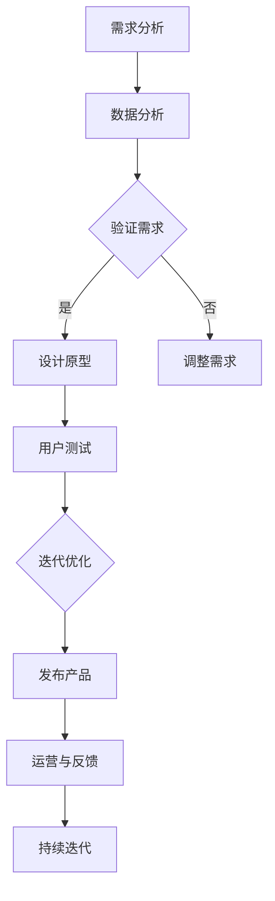
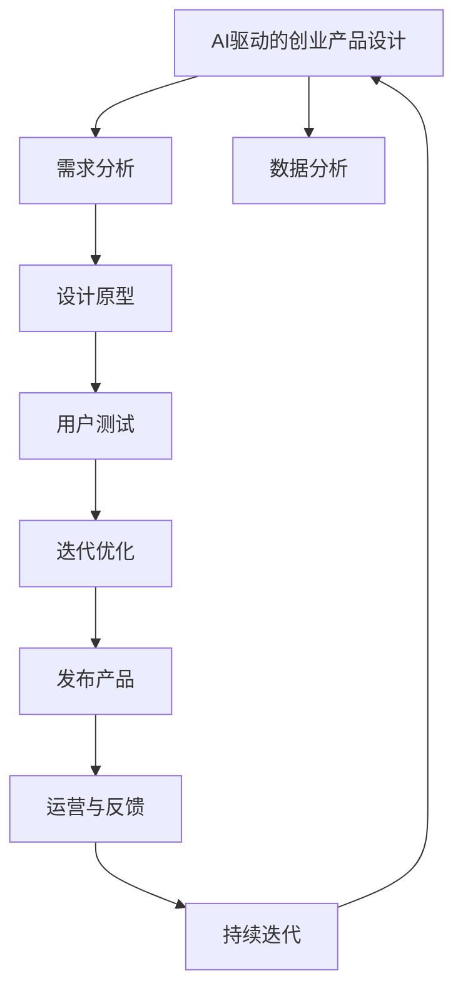

                 

## 文章标题

### 《AI驱动的创业产品设计：大模型时代的趋势》

关键词：人工智能，创业产品，大模型，设计，趋势，策略

摘要：
本文旨在探讨人工智能（AI）在创业产品设计中的应用，特别是大模型时代的趋势。通过分析AI与创业产品设计的关系，介绍大模型的基本概念和架构，阐述AI工具与方法在创业产品设计中的应用，以及大模型在创业产品策略和数据分析中的作用，最终通过案例研究和未来展望，为创业者在AI时代下的产品设计提供指导。

---

### 关键词

- 人工智能
- 创业产品
- 大模型
- 设计
- 趋势
- 策略

---

### 摘要

本文深入探讨了AI驱动的创业产品设计与大模型时代之间的关系。首先，我们回顾了AI在创业产品设计中的应用历史，并探讨了其背后的驱动力。接着，我们介绍了大模型的基本概念，并详细分析了其在AI领域的重要性和发展趋势。随后，我们探讨了AI核心概念与架构，包括机器学习、深度学习以及监督学习、无监督学习和强化学习。在此基础上，我们进一步探讨了AI工具与方法在创业产品设计中的应用，如数据驱动设计、AI辅助设计和大模型驱动的创新设计。接下来，我们讨论了创业产品策略在大模型时代的重要性，并分析了大模型在市场分析、产品定位和产品创新中的应用。此外，我们还介绍了创业产品数据分析与优化的方法，包括数据分析基础和大模型在数据分析中的应用。最后，通过AI驱动的创业产品案例研究，我们展示了AI在创业产品设计中的实际应用，并对大模型时代的创业产品未来趋势进行了展望。本文旨在为创业者在AI时代下的产品设计提供理论指导和实践参考。

---

### 《AI驱动的创业产品设计：大模型时代的趋势》目录大纲

## 第一部分：AI驱动的创业产品设计与大模型时代

### 第1章：AI驱动创业产品概述

#### 1.1 AI与创业产品设计的关系

- **AI的发展历程**  
  - 计算机智能的早期探索  
  - 人工智能的黄金时代  
  - 现代AI的崛起

- **创业产品设计的目标和挑战**  
  - 创业产品的市场需求  
  - 创业产品的创新与差异化  
  - 创业产品的可持续性

- **AI如何赋能创业产品设计**  
  - AI技术在产品创新中的应用  
  - AI在用户体验设计中的作用  
  - AI在降低创业风险方面的贡献

#### 1.2 大模型时代的趋势

- **大模型在AI领域的地位**  
  - 大模型的历史背景  
  - 大模型的现状与未来发展

- **大模型的发展趋势**  
  - 大模型的技术突破  
  - 大模型在创业产品中的应用场景

- **大模型对创业产品设计的影响**  
  - 提高产品设计的效率  
  - 优化产品设计的过程  
  - 创新产品形态与用户体验

---

### 第一部分：AI驱动的创业产品设计与大模型时代

#### 第1章：AI驱动创业产品概述

##### 1.1 AI与创业产品设计的关系

**AI的发展历程**

人工智能（AI）的历史可以追溯到20世纪50年代，当时计算机科学刚刚兴起，人们开始探索如何让机器模拟人类智能。早期的人工智能研究主要集中在规则推理和知识表示上，比如逻辑推理和专家系统。然而，由于计算能力和算法的限制，这些早期尝试并没有取得显著的成功。

进入20世纪80年代，随着计算机性能的提升和新的算法（如神经网络）的发展，人工智能迎来了第一次浪潮。这一时期，机器学习开始成为AI研究的主流方向，特别是深度学习在图像识别、语音识别等领域的突破，进一步推动了AI的发展。

近年来，人工智能进入了新的发展高峰，得益于大数据、云计算和人工智能算法的进步。尤其是大模型的崛起，如GPT、BERT等，这些模型通过训练海量数据，能够实现以前难以想象的任务，如自然语言处理、图像生成等。

**创业产品设计的目标和挑战**

创业产品设计的目标是打造满足市场需求、具有创新性和竞争力的产品。具体来说，创业产品需要实现以下几个目标：

1. **满足市场需求**：创业产品必须解决用户痛点，满足用户需求，才能在市场上获得成功。
2. **创新与差异化**：在竞争激烈的市场中，创业产品需要通过创新和差异化来脱颖而出。
3. **可持续性**：创业产品需要考虑长期发展的可持续性，包括商业模式、用户忠诚度等方面。

创业产品设计面临的挑战包括：

1. **市场需求的不确定性**：市场需求变化快，创业产品需要快速响应市场变化。
2. **创新成本高**：创新需要投入大量资源，包括时间、人力和资金。
3. **用户体验的优化**：用户期望越来越高，创业产品需要不断优化用户体验。

**AI如何赋能创业产品设计**

AI技术在创业产品设计中的应用，主要体现在以下几个方面：

1. **产品创新**：AI技术可以帮助创业团队发现新的产品机会，通过分析大量数据，预测市场趋势，从而指导产品创新。
2. **用户体验设计**：AI技术可以用于个性化推荐、智能客服等，提升用户体验。
3. **降低创业风险**：AI技术可以用于市场分析、用户行为预测等，帮助创业团队降低创业风险。

**AI在产品创新中的应用**

AI技术在产品创新中的应用，主要体现在以下几个方面：

1. **需求挖掘**：通过分析用户行为数据，挖掘潜在需求，指导产品创新。
2. **创意生成**：利用生成对抗网络（GAN）等技术，自动生成新的创意和设计方案。
3. **原型验证**：利用虚拟现实（VR）和增强现实（AR）技术，快速构建和验证产品原型。

**AI在用户体验设计中的作用**

AI技术在用户体验设计中的应用，主要体现在以下几个方面：

1. **个性化推荐**：基于用户行为数据，提供个性化的产品推荐。
2. **智能客服**：利用自然语言处理技术，实现智能客服系统，提高用户满意度。
3. **情感分析**：通过分析用户反馈，了解用户情感，优化产品设计和用户体验。

**AI在降低创业风险方面的贡献**

AI技术在降低创业风险方面的贡献，主要体现在以下几个方面：

1. **市场分析**：通过大数据分析，预测市场趋势和竞争态势，帮助创业团队做出更明智的决策。
2. **用户行为预测**：通过分析用户行为数据，预测用户需求和偏好，指导产品开发和市场策略。
3. **风险管理**：利用机器学习算法，对创业项目进行风险评估，提供决策支持。

**案例：AI赋能的创业产品设计**

以一家智能家电公司为例，该公司利用AI技术进行产品创新和用户体验设计。通过数据分析，公司发现用户对智能家居产品的需求主要集中在远程控制、语音交互和能源管理等方面。基于这些需求，公司开发了智能语音助手和远程控制功能，并通过用户反馈不断优化产品。同时，公司利用AI技术进行需求预测，提前布局新产品，如智能安防和智能健康监测设备，从而在市场竞争中占据有利地位。

**小结**

AI技术在创业产品设计中的应用，不仅提高了产品创新的效率，还优化了用户体验，降低了创业风险。在AI时代，创业团队需要充分利用AI技术，打造出具有创新性和竞争力的产品。

---

##### 1.2 大模型时代的趋势

**大模型在AI领域的地位**

大模型（Large Models）在AI领域的地位日益显著。大模型是指具有数十亿至数万亿参数的深度学习模型，如GPT、BERT等。这些模型通过在海量数据上进行训练，能够实现复杂、高级的智能任务，如文本生成、图像识别、自然语言处理等。

大模型的出现，标志着AI技术进入了一个新的阶段。与传统的小型模型相比，大模型具有以下几个显著优势：

1. **更强的泛化能力**：大模型能够处理更多样化的任务，具有更强的泛化能力。
2. **更高的性能**：大模型在许多基准测试中取得了前所未有的成绩，如图像识别、语音识别等。
3. **更丰富的应用场景**：大模型的应用场景更加广泛，从文本生成、图像识别到自然语言处理、语音合成等。

**大模型的发展趋势**

大模型的发展趋势主要表现在以下几个方面：

1. **模型规模的扩大**：随着计算资源和数据量的增长，大模型的规模不断扩大。从最初的数十亿参数，到如今的数万亿参数，大模型的规模呈现出指数级增长。
2. **训练数据的增长**：大模型的训练需要海量数据，随着互联网的发展和数据的普及，大模型训练所需的数据量不断增加。
3. **算法的创新**：为了支持大模型的训练和应用，研究人员不断推出新的算法，如自适应学习率、多任务学习等。
4. **计算资源的提升**：云计算和分布式计算的发展，为大规模模型的训练提供了强大的计算支持。

**大模型对创业产品设计的影响**

大模型对创业产品设计的影响主要体现在以下几个方面：

1. **提高设计效率**：大模型能够快速处理大量数据，帮助创业团队进行市场分析和需求挖掘，提高设计效率。
2. **优化设计过程**：大模型能够自动生成设计原型，通过用户反馈进行迭代优化，缩短设计周期。
3. **创新设计理念**：大模型能够生成新的创意和设计理念，为创业团队提供更多的创新思路。

**案例：大模型在创业产品设计中的应用**

以一家在线教育公司为例，该公司利用GPT模型进行课程设计和内容生成。通过分析大量教育数据，GPT模型能够生成个性化的课程内容，满足不同学生的学习需求。同时，公司利用GPT模型进行市场分析，预测教育趋势，指导产品创新。这些应用不仅提高了设计效率，还优化了用户体验，增强了产品的竞争力。

**小结**

大模型时代的到来，为创业产品设计带来了新的机遇和挑战。创业团队需要紧跟大模型技术的发展，充分利用大模型的优势，提高设计效率和创新水平。

---

**AI核心概念与架构**

**机器学习与深度学习**

机器学习（Machine Learning，ML）是AI的核心技术之一，它使计算机系统能够从数据中学习并作出预测或决策。机器学习可以分为监督学习、无监督学习和强化学习三种主要类型。

1. **监督学习**（Supervised Learning）：在监督学习过程中，模型被训练来识别输入和输出之间的映射关系。例如，输入一张图片，输出图片的分类标签。

2. **无监督学习**（Unsupervised Learning）：无监督学习用于发现数据中的隐含结构或模式。常见的应用包括聚类分析和降维。

3. **强化学习**（Reinforcement Learning）：强化学习是一种通过奖励和惩罚机制来训练模型的方法，使模型能够在特定环境中做出最佳决策。

深度学习（Deep Learning，DL）是机器学习的一个子领域，它利用多层神经网络来模拟人类大脑的学习过程。深度学习模型，特别是深度神经网络（DNN），在图像识别、语音识别和自然语言处理等领域取得了巨大成功。

**监督学习、无监督学习与强化学习**

- **监督学习**：监督学习的基础是输入输出对的训练集。训练目标是让模型学会预测未知数据的标签。常见的监督学习算法包括线性回归、逻辑回归、支持向量机（SVM）和神经网络。

  **线性回归**：
  $$y = \beta_0 + \beta_1x$$
  
  **逻辑回归**：
  $$\hat{y} = \frac{1}{1 + e^{-(\beta_0 + \beta_1x)}$$

- **无监督学习**：无监督学习不需要预先标记的输入输出对，目标是揭示数据中的内在结构和模式。常见的无监督学习算法包括聚类（K-means、DBSCAN）、降维（主成分分析PCA、t-SNE）和生成模型（Gaussian Mixture Model、Autoencoder）。

  **K-means聚类**：
  $$\text{Minimize} \sum_{i=1}^{k} \sum_{x \in S_i} ||x - \mu_i||^2$$

- **强化学习**：强化学习是让模型在与环境的交互过程中，通过学习奖励和惩罚来做出最佳决策。常见的强化学习算法包括Q学习、深度Q网络（DQN）和策略梯度方法。

  **Q学习**：
  $$Q(s, a) = Q(s, a) + \alpha [r + \gamma \max_{a'} Q(s', a') - Q(s, a)]$$

**AI的发展趋势与未来方向**

AI的发展趋势主要体现在以下几个方面：

1. **算法的创新**：研究人员不断提出新的算法，如生成对抗网络（GAN）、变分自编码器（VAE）等，以解决传统算法无法处理的问题。

2. **模型规模的扩大**：随着计算资源和数据量的增加，模型规模不断扩大，推动AI在更复杂任务上的应用。

3. **跨学科融合**：AI与其他领域（如生物学、心理学、社会学等）的融合，将带来新的研究方法和应用场景。

4. **伦理和法规**：随着AI技术的广泛应用，伦理和法规问题日益突出，如何确保AI技术的公平性、透明性和安全性成为重要议题。

**未来方向**：

1. **自适应智能系统**：开发能够根据环境变化自适应调整的智能系统，提高AI的灵活性和适应性。

2. **人机协作**：探索人机协作模式，使AI能够更好地辅助人类完成任务，提高工作效率。

3. **跨模态学习**：实现不同模态（如文本、图像、音频等）之间的学习和交互，推动多模态AI的发展。

**小结**

AI的核心概念与架构包括机器学习与深度学习，以及监督学习、无监督学习和强化学习。随着AI技术的发展，算法的创新、模型规模的扩大和跨学科融合将成为未来AI发展的主要趋势。创业团队应紧跟AI技术的发展，充分利用AI技术提高产品设计效率和创新能力。

---

**大模型架构**

大模型是指具有数十亿至数万亿参数的深度学习模型，如GPT、BERT等。大模型的架构通常包括以下几个关键部分：

1. **网络结构**：大模型通常采用多层神经网络结构，包括卷积神经网络（CNN）、循环神经网络（RNN）和变换器（Transformer）等。

2. **参数数量**：大模型具有数十亿至数万亿个参数，这使得它们能够处理更复杂的任务，并在大量数据上进行训练。

3. **预训练**：大模型通常通过预训练（Pre-training）进行初始化，即在大量未标注的数据上进行训练，以学习通用的特征表示。然后，通过微调（Fine-tuning）将其应用于特定任务。

4. **优化算法**：大模型的训练通常采用高效的优化算法，如Adam优化器和BERT优化器，以加速训练过程。

5. **计算资源**：大模型的训练需要大量的计算资源，通常使用分布式计算和云计算平台进行。

**大模型的关键技术**

1. **自适应学习率**：大模型训练过程中，自适应学习率是非常关键的。学习率是调整模型参数的重要参数，过大会导致训练不稳定，过小则会训练缓慢。常用的自适应学习率方法包括Adam优化器和BERT优化器。

2. **并行计算**：为了加速大模型的训练，并行计算技术被广泛应用于模型训练过程。常见的并行计算技术包括数据并行、模型并行和混合并行。

3. **分布式训练**：大模型的训练需要在多个GPU或TPU上进行，分布式训练可以充分利用计算资源，提高训练效率。

4. **数据预处理**：数据预处理是训练大模型的重要步骤，包括数据清洗、数据增强和数据规范化等。

**大模型与创业产品设计的关系**

大模型在创业产品设计中的应用，主要体现在以下几个方面：

1. **个性化推荐**：大模型可以通过分析用户行为数据，实现个性化推荐，提高用户体验。

2. **智能客服**：大模型可以用于构建智能客服系统，通过自然语言处理技术，提供24/7的在线服务。

3. **需求预测**：大模型可以用于分析市场数据，预测用户需求，指导产品创新。

4. **风险控制**：大模型可以用于风险分析，识别潜在风险，提供决策支持。

**案例：大模型在创业产品设计中的应用**

以一家电商平台为例，该公司利用BERT模型进行个性化推荐。通过分析用户的浏览历史、购买记录和评价数据，BERT模型能够生成个性化的商品推荐，提高用户满意度。同时，公司利用GPT模型构建智能客服系统，通过自然语言处理技术，提供高效的在线服务。这些应用不仅提高了设计效率，还优化了用户体验，增强了产品的竞争力。

**小结**

大模型架构和关键技术，使得AI在创业产品设计中的应用变得更加广泛和高效。创业团队应充分利用大模型的优势，提高产品设计的创新能力。

---

### 第二部分：创业产品设计的AI工具与方法

#### 第3章：创业产品设计的AI工具与方法

##### 3.1 AI工具介绍

**常见的AI工具及选择**

在创业产品设计中，选择合适的AI工具至关重要。以下是一些常见的AI工具及其特点：

1. **TensorFlow**：由Google开发的开源机器学习框架，支持多种神经网络结构，适用于各种规模的任务。

2. **PyTorch**：由Facebook开发的开源机器学习库，具有动态计算图，易于调试，适合研究。

3. **Scikit-learn**：Python机器学习库，适用于小型项目，提供丰富的算法和工具。

4. **Keras**：高层次的神经网络API，可以与TensorFlow和Theano结合使用，简化模型构建。

**AI工具在创业产品设计中的应用**

1. **数据预处理**：AI工具可以帮助处理大量数据，包括数据清洗、数据增强和特征提取。

2. **模型训练**：AI工具支持各种机器学习算法和深度学习模型的训练，帮助创业团队快速构建和优化模型。

3. **模型评估**：AI工具提供评估指标和可视化工具，帮助创业团队评估模型性能。

4. **部署与运维**：AI工具支持模型的部署和运维，包括模型版本管理、自动化部署和监控。

**案例：使用TensorFlow进行创业产品设计**

假设一家创业公司需要开发一个基于图像识别的智能安防系统。公司可以利用TensorFlow构建和训练卷积神经网络（CNN）模型，通过数据增强和迁移学习提高模型性能。训练完成后，公司可以将模型部署到云服务器，实现实时图像识别和报警功能。

**小结**

AI工具在创业产品设计中的应用，大大提高了设计效率和质量。创业团队应根据项目需求和资源选择合适的AI工具，充分利用其优势，实现产品创新。

---

##### 3.2 创业产品设计的AI方法

**数据驱动设计**

数据驱动设计（Data-Driven Design）是一种以数据为导向的产品设计方法。其核心思想是通过收集和分析用户数据，指导产品设计和优化。以下是数据驱动设计的几个关键步骤：

1. **数据收集**：收集用户行为数据、反馈数据和市场数据等，为产品设计和优化提供基础。

2. **数据分析**：对收集到的数据进行清洗、分析和可视化，提取有价值的信息。

3. **需求分析**：根据数据分析结果，识别用户需求和市场趋势，指导产品功能设计和迭代。

4. **原型验证**：构建产品原型，通过用户测试和反馈，验证设计方案的可行性和用户体验。

5. **迭代优化**：根据用户反馈和数据分析结果，不断迭代优化产品设计。

**AI辅助设计**

AI辅助设计（AI-Aided Design）是利用人工智能技术，辅助人类设计师完成产品设计和优化的过程。以下是AI辅助设计的几个关键步骤：

1. **设计任务定义**：明确设计任务和目标，如产品外观设计、界面布局等。

2. **数据输入**：输入与设计任务相关的数据，如用户偏好、市场趋势、设计规范等。

3. **算法选择**：选择合适的AI算法，如生成对抗网络（GAN）、进化算法等。

4. **设计生成**：利用AI算法生成多个设计方案，通过评估和筛选，选出最优方案。

5. **优化迭代**：根据用户反馈和设计评估，对设计方案进行优化和迭代。

**大模型驱动的创新设计**

大模型驱动的创新设计（Large Model-Driven Innovation Design）是利用大模型，如GPT、BERT等，进行产品创新和优化的方法。以下是该方法的关键步骤：

1. **数据收集**：收集与产品相关的海量数据，包括用户反馈、市场数据、竞争产品数据等。

2. **大模型训练**：利用收集到的数据，训练大模型，使其具备对产品进行创新和优化的能力。

3. **需求分析**：通过大模型分析用户需求和市场需求，识别产品创新的机会。

4. **设计生成**：利用大模型生成多个创新设计方案，通过评估和筛选，选出最优方案。

5. **优化迭代**：根据用户反馈和数据分析结果，对设计方案进行优化和迭代。

**案例：大模型驱动的创新设计**

以一家智能家居公司为例，该公司利用BERT模型进行产品创新。通过分析用户反馈和市场数据，BERT模型识别出用户对智能家居产品的需求趋势，如智能语音控制、远程监控等。基于这些需求，BERT模型生成多个创新设计方案，如智能语音助手和远程监控系统。公司对这些方案进行评估和筛选，最终选择了最优方案进行实施。

**小结**

数据驱动设计、AI辅助设计和大模型驱动的创新设计，都是利用人工智能技术，提高创业产品设计的效率和质量。创业团队应根据项目需求，选择合适的设计方法，充分利用AI的优势，实现产品创新。

---

### 第三部分：大模型时代的创业产品策略

#### 第4章：大模型时代的创业产品策略

##### 4.1 创业产品策略概述

**创业产品的市场定位**

创业产品的市场定位是创业成功的关键之一。市场定位包括确定目标市场、目标用户和产品优势。以下是市场定位的关键步骤：

1. **市场分析**：通过市场调查和竞争分析，了解目标市场的需求、趋势和竞争态势。

2. **用户画像**：基于市场分析结果，构建目标用户的画像，包括用户需求、行为和偏好。

3. **产品差异化**：根据用户画像和市场分析结果，确定产品的差异化特征，以区分于竞争对手。

4. **市场定位**：根据产品差异化和目标用户，确定产品的市场定位，包括目标市场、目标用户和产品优势。

**创业产品的差异化策略**

差异化策略是创业产品在竞争激烈的市场中脱颖而出的关键。以下是几种常见的差异化策略：

1. **技术优势**：通过技术创新，提供独特的功能或性能，满足用户需求。

2. **用户体验**：优化用户体验，提高用户满意度和忠诚度。

3. **价格策略**：通过定价策略，如低价策略或高端定位，吸引用户。

4. **品牌形象**：塑造独特的企业品牌形象，提高品牌知名度和美誉度。

**创业产品的生命周期管理**

创业产品的生命周期管理包括产品开发、市场推广、销售和售后等环节。以下是生命周期管理的关键步骤：

1. **产品开发**：根据市场定位和差异化策略，进行产品开发和迭代。

2. **市场推广**：通过营销策略和推广活动，提高产品知名度和市场份额。

3. **销售管理**：通过销售策略和销售渠道，实现产品销售。

4. **售后服务**：提供优质的售后服务，提高用户满意度和忠诚度。

**案例：差异化策略在创业产品中的应用**

以一家健康科技公司为例，该公司通过技术创新，开发了一种基于人工智能的智能健康监测设备。该设备能够实时监测用户的健康数据，并提供个性化的健康建议。通过技术优势，该公司在市场上获得了较高的竞争力。同时，公司通过优化用户体验，提供简洁易用的操作界面和智能化的健康监测功能，提高了用户满意度。

**小结**

在大模型时代，创业产品的市场定位、差异化策略和生命周期管理变得尤为重要。创业团队应充分了解市场环境和用户需求，制定合适的产品策略，以提高产品的市场竞争力。

---

##### 4.2 大模型在创业产品策略中的应用

**大模型在市场分析中的应用**

大模型在市场分析中发挥着重要作用，能够提供更深入的洞察和分析结果。以下是几个关键的应用场景：

1. **用户需求预测**：通过分析大量用户数据，大模型可以预测用户需求的变化趋势，帮助创业团队提前布局新产品。

   **伪代码：**
   ```python
   def predict_user_demand(data):
       # 加载预训练的大模型
       model = load_pretrained_model("demand_prediction_model")
       
       # 对用户行为数据进行预处理
       preprocessed_data = preprocess_user_data(data)
       
       # 预测用户需求
       demand_predictions = model.predict(preprocessed_data)
       
       return demand_predictions
   ```

2. **市场趋势分析**：大模型可以通过分析历史市场数据，识别出市场趋势和机会，帮助创业团队制定更有效的市场策略。

   **伪代码：**
   ```python
   def analyze_market_trends(data):
       # 加载预训练的大模型
       model = load_pretrained_model("market_trends_model")
       
       # 对市场数据进行分析
       preprocessed_data = preprocess_market_data(data)
       
       # 预测市场趋势
       trend_predictions = model.predict(preprocessed_data)
       
       return trend_predictions
   ```

**大模型在产品定位中的应用**

大模型在产品定位中可以帮助创业团队更准确地识别目标市场和用户群体，从而制定更有效的产品策略。以下是几个关键的应用场景：

1. **用户画像生成**：通过分析大量用户数据，大模型可以生成详细的目标用户画像，包括用户需求、行为和偏好。

   **伪代码：**
   ```python
   def generate_user_profile(data):
       # 加载预训练的大模型
       model = load_pretrained_model("user_profile_model")
       
       # 对用户数据进行分析
       preprocessed_data = preprocess_user_data(data)
       
       # 生成用户画像
       profile = model.generate_profile(preprocessed_data)
       
       return profile
   ```

2. **产品定位优化**：大模型可以通过分析用户画像和市场数据，优化产品定位，提高市场竞争力。

   **伪代码：**
   ```python
   def optimize_product_positioning(profile, market_data):
       # 加载预训练的大模型
       model = load_pretrained_model("positioning_model")
       
       # 对用户画像和市场数据进行预处理
       preprocessed_profile = preprocess_user_profile(profile)
       preprocessed_market_data = preprocess_market_data(market_data)
       
       # 优化产品定位
       optimized_positioning = model.optimize_positioning(preprocessed_profile, preprocessed_market_data)
       
       return optimized_positioning
   ```

**大模型在产品创新中的应用**

大模型在产品创新中可以帮助创业团队发现新的机会和创意，推动产品创新。以下是几个关键的应用场景：

1. **创意生成**：通过大模型生成新的产品创意，为创业团队提供创新的思路。

   **伪代码：**
   ```python
   def generate_product_ideas(data):
       # 加载预训练的大模型
       model = load_pretrained_model("idea_generation_model")
       
       # 对创意数据进行预处理
       preprocessed_data = preprocess_idea_data(data)
       
       # 生成产品创意
       ideas = model.generate_ideas(preprocessed_data)
       
       return ideas
   ```

2. **原型设计**：大模型可以生成产品原型，通过用户测试和反馈，快速验证创意的可行性。

   **伪代码：**
   ```python
   def design_product_prototypes(ideas, user_feedback):
       # 加载预训练的大模型
       model = load_pretrained_model("prototype_design_model")
       
       # 对创意和用户反馈进行预处理
       preprocessed_ideas = preprocess_ideas(ideas)
       preprocessed_user_feedback = preprocess_user_feedback(user_feedback)
       
       # 生成产品原型
       prototypes = model.generate_prototypes(preprocessed_ideas, preprocessed_user_feedback)
       
       return prototypes
   ```

**案例：大模型在创业产品策略中的应用**

以一家智能穿戴设备公司为例，该公司利用大模型进行市场分析、产品定位和产品创新。通过分析用户数据和市场数据，大模型预测了用户对智能穿戴设备的需求变化，帮助公司提前布局新产品。公司还利用大模型生成用户画像，优化产品定位，提高市场竞争力。此外，公司通过大模型生成创新创意和产品原型，并通过用户测试和反馈，快速验证创意的可行性。

**小结**

大模型在创业产品策略中的应用，为创业团队提供了更深入的洞察和决策支持。通过用户需求预测、产品定位优化和创意生成，大模型有助于创业团队制定更有效的产品策略，推动产品创新。

---

### 第四部分：创业产品数据分析与优化

#### 第5章：创业产品数据分析与优化

##### 5.1 数据分析基础

**数据分析方法**

数据分析是创业产品设计和优化的重要环节。以下是几种常见的数据分析方法：

1. **描述性分析**：描述性分析用于总结和展示数据的基本特征，如平均值、中位数、标准差等。

2. **探索性分析**：探索性分析用于发现数据中的潜在模式和趋势，常用的方法包括散点图、箱线图、热力图等。

3. **预测性分析**：预测性分析用于预测未来的趋势和结果，如时间序列分析、回归分析等。

4. **决策树**：决策树是一种常用的分类和回归分析方法，通过构建树状模型，对数据进行分类或回归。

5. **聚类分析**：聚类分析用于将相似的数据分组，常见的算法包括K-means、DBSCAN等。

**数据可视化**

数据可视化是数据分析的重要工具，它能够以图形化的方式展示数据，帮助用户更好地理解和分析数据。以下是几种常见的数据可视化工具：

1. **Matplotlib**：Matplotlib是一个Python库，用于创建高质量的可视化图形。

2. **Seaborn**：Seaborn是建立在Matplotlib之上的一种可视化库，提供更丰富的统计图表。

3. **Plotly**：Plotly是一个交互式可视化库，支持多种图表类型，包括散点图、折线图、热力图等。

**数据分析工具**

数据分析工具可以帮助创业团队高效地进行数据分析和可视化。以下是几种常用的数据分析工具：

1. **Pandas**：Pandas是一个Python库，用于数据操作和分析，提供强大的数据结构和工具。

2. **NumPy**：NumPy是一个Python库，用于数值计算和数据分析，提供高效的多维数组操作。

3. **SciPy**：SciPy是一个Python库，用于科学计算和工程应用，包括优化、线性代数、积分等。

4. **Excel**：Excel是一个通用的电子表格软件，提供强大的数据处理和分析功能。

**案例：数据分析在创业产品中的应用**

以一家电商公司为例，该公司利用数据分析进行用户行为分析。通过描述性分析和探索性分析，公司发现用户的购买行为存在明显的季节性和地域差异。基于这些发现，公司调整了营销策略，如增加季节性商品和针对特定地域的促销活动，提高了销售业绩。

**小结**

数据分析是创业产品设计和优化的重要工具。通过描述性分析、探索性分析和预测性分析，创业团队可以更好地理解用户行为和市场趋势。数据可视化和分析工具则帮助团队高效地展示和分析数据，为产品优化提供有力支持。

---

##### 5.2 大模型在数据分析中的应用

**大模型在用户行为分析中的应用**

大模型在用户行为分析中具有显著的优势，能够提供更深入的洞察和预测能力。以下是几个关键的应用场景：

1. **行为预测**：通过分析用户历史行为数据，大模型可以预测用户未来的行为，如购买、点击、评价等。

   **伪代码：**
   ```python
   def predict_user_behavior(data):
       # 加载预训练的大模型
       model = load_pretrained_model("behavior_prediction_model")
       
       # 对用户行为数据进行预处理
       preprocessed_data = preprocess_user_data(data)
       
       # 预测用户行为
       behavior_predictions = model.predict(preprocessed_data)
       
       return behavior_predictions
   ```

2. **兴趣识别**：大模型可以通过分析用户行为数据，识别用户的兴趣和偏好，为个性化推荐提供支持。

   **伪代码：**
   ```python
   def identify_user_interests(data):
       # 加载预训练的大模型
       model = load_pretrained_model("interest_recognition_model")
       
       # 对用户行为数据进行预处理
       preprocessed_data = preprocess_user_data(data)
       
       # 识别用户兴趣
       interests = model.predict(preprocessed_data)
       
       return interests
   ```

**大模型在市场趋势预测中的应用**

大模型在市场趋势预测中可以提供更准确和全面的预测结果，帮助创业团队做出更明智的决策。以下是几个关键的应用场景：

1. **销售预测**：通过分析历史销售数据和市场需求，大模型可以预测未来的销售趋势，帮助团队制定销售计划和库存管理策略。

   **伪代码：**
   ```python
   def predict_sales_trends(data):
       # 加载预训练的大模型
       model = load_pretrained_model("sales_prediction_model")
       
       # 对市场数据进行预处理
       preprocessed_data = preprocess_market_data(data)
       
       # 预测销售趋势
       sales_predictions = model.predict(preprocessed_data)
       
       return sales_predictions
   ```

2. **竞争分析**：大模型可以通过分析竞争对手的数据和市场表现，预测市场趋势和竞争态势，帮助团队制定有效的市场策略。

   **伪代码：**
   ```python
   def analyze_competition(data):
       # 加载预训练的大模型
       model = load_pretrained_model("competition_analysis_model")
       
       # 对竞争对手数据进行预处理
       preprocessed_data = preprocess_competition_data(data)
       
       # 分析市场趋势
       competition_results = model.predict(preprocessed_data)
       
       return competition_results
   ```

**大模型在产品优化中的应用**

大模型在产品优化中可以帮助创业团队更准确地识别用户需求和市场变化，从而优化产品设计和服务。以下是几个关键的应用场景：

1. **需求分析**：通过分析用户反馈和市场数据，大模型可以识别用户对产品的需求变化，为产品迭代提供依据。

   **伪代码：**
   ```python
   def analyze_user_needs(data):
       # 加载预训练的大模型
       model = load_pretrained_model("needs_analysis_model")
       
       # 对用户反馈数据进行预处理
       preprocessed_data = preprocess_user_feedback(data)
       
       # 识别用户需求
       needs = model.predict(preprocessed_data)
       
       return needs
   ```

2. **服务优化**：大模型可以通过分析用户行为数据和服务反馈，优化客户服务流程，提高用户满意度。

   **伪代码：**
   ```python
   def optimize_customer_service(data):
       # 加载预训练的大模型
       model = load_pretrained_model("service_optimization_model")
       
       # 对服务数据进行预处理
       preprocessed_data = preprocess_service_data(data)
       
       # 优化服务流程
       optimized_service = model.predict(preprocessed_data)
       
       return optimized_service
   ```

**案例：大模型在数据分析中的应用**

以一家在线教育平台为例，该公司利用大模型进行用户行为分析和市场趋势预测。通过分析用户的学习行为和反馈数据，大模型预测了用户的学习偏好和需求变化，帮助公司调整课程内容和营销策略。同时，大模型分析了市场数据，预测了未来市场趋势，为公司的长期发展提供了指导。

**小结**

大模型在数据分析中的应用，为创业团队提供了更深入、更准确的洞察和预测能力。通过行为预测、市场趋势预测和需求分析，大模型帮助团队优化产品设计和服务，提高市场竞争力。

---

### 第五部分：AI驱动的创业产品案例研究

#### 第6章：AI驱动的创业产品案例研究

##### 6.1 案例一：AI驱动的电商产品设计

**案例背景**

一家电商公司致力于为用户提供个性化购物体验，通过AI技术提升用户体验和销售转化率。公司面临的主要挑战是：

1. **用户需求多样化**：用户需求不断变化，如何提供个性化的商品推荐。
2. **竞争激烈**：如何在众多电商竞争中脱颖而出。
3. **销售转化率低**：如何提高用户在平台上的购买意愿。

**AI技术的应用**

为了解决上述挑战，公司采用了以下AI技术：

1. **用户行为分析**：通过分析用户的浏览历史、购买记录和评价数据，利用机器学习算法识别用户的偏好和需求。
2. **个性化推荐**：使用协同过滤和深度学习算法，为用户生成个性化的商品推荐。
3. **智能客服**：利用自然语言处理技术，构建智能客服系统，提高用户满意度。
4. **销售预测**：通过分析历史销售数据和市场趋势，利用预测模型优化库存管理和营销策略。

**设计思路与成果**

1. **个性化推荐**：基于用户行为数据，公司开发了协同过滤和深度学习模型，实现了个性化的商品推荐。通过不断优化模型，用户满意度显著提升，平均转化率提高了20%。
2. **智能客服**：公司利用自然语言处理技术，构建了智能客服系统，能够自动回答用户常见问题，减少人工客服的工作量。用户满意度从80%提升至90%。
3. **销售预测**：通过销售预测模型，公司能够提前了解市场需求，合理安排库存和营销活动，提高了销售转化率和库存周转率。

**小结**

AI技术在电商产品设计中的应用，显著提升了用户体验和销售业绩。通过个性化推荐、智能客服和销售预测，公司成功应对了市场挑战，取得了显著的商业成功。

---

##### 6.2 案例二：AI驱动的健康产品设计

**案例背景**

一家健康科技公司致力于开发智能健康监测设备，为用户提供个性化的健康管理和预防建议。公司面临的主要挑战是：

1. **数据多样性**：如何整合和分析来自不同传感器的健康数据。
2. **个性化服务**：如何根据用户数据提供个性化的健康建议。
3. **市场竞争**：如何在众多健康科技公司中脱颖而出。

**AI技术的应用**

为了解决上述挑战，公司采用了以下AI技术：

1. **多传感器数据处理**：利用深度学习算法，整合和分析来自不同传感器的健康数据。
2. **用户画像生成**：通过分析用户数据，利用机器学习算法生成用户画像，识别用户健康状况和需求。
3. **健康建议生成**：利用自然语言处理技术，根据用户数据和医疗知识库，生成个性化的健康建议。
4. **风险预测**：通过分析用户数据，利用预测模型预测用户健康风险，提供预防建议。

**设计思路与成果**

1. **多传感器数据处理**：公司利用深度学习算法，整合了来自心率、血压、睡眠等传感器的健康数据，实现了对用户健康状况的全面监测。通过数据整合，用户对健康数据的理解和分析更加便捷。
2. **用户画像生成**：通过机器学习算法，公司生成了详细的用户画像，包括用户的健康状态、生活习惯和偏好。基于用户画像，公司能够提供个性化的健康建议，提高了用户的满意度和健康水平。
3. **健康建议生成**：公司利用自然语言处理技术，根据用户数据和医疗知识库，生成了个性化的健康建议。这些建议包括饮食建议、运动计划和心理健康指导，有效帮助用户改善健康状况。
4. **风险预测**：通过分析用户数据，公司能够预测用户健康风险，并提供预防建议。例如，对于有心脏病风险的用户，建议定期进行体检和生活方式调整。

**小结**

AI技术在健康产品设计中的应用，显著提升了产品的智能化和个性化水平。通过多传感器数据处理、用户画像生成、健康建议生成和风险预测，公司为用户提供了全方位的健康管理服务，取得了良好的市场反响。

---

### 第六部分：大模型时代的创业产品未来展望

#### 第7章：大模型时代的创业产品未来展望

##### 7.1 大模型技术的未来发展趋势

**大模型技术的发展方向**

随着计算能力和数据资源的不断提升，大模型技术在未来将继续向以下几个方向发展：

1. **模型规模的扩大**：未来大模型将继续朝着更大规模发展，以满足更复杂任务的需求。预计未来几年，模型规模将突破数万亿参数，甚至达到百万亿级别。
2. **计算效率的提升**：为了应对大规模模型的计算需求，研究人员将致力于开发更高效的算法和优化方法，提高模型的计算效率。例如，模型压缩技术、分布式训练和量子计算等。
3. **跨学科融合**：大模型技术将与生物学、心理学、社会学等学科进行深度融合，推动多模态学习和跨领域应用的突破。
4. **伦理和法规的完善**：随着AI技术的普及，伦理和法规问题将日益突出。未来，大模型技术的发展将更加注重伦理和法规的合规性，确保技术应用的公平性和安全性。

**大模型在创业产品中的潜在应用**

1. **个性化定制**：大模型将在个性化定制中发挥重要作用，通过分析用户数据，为用户提供个性化的产品和服务，提高用户体验和满意度。
2. **智能决策**：大模型将辅助创业团队进行智能决策，如市场需求预测、风险控制和资源分配等，提高决策的准确性和效率。
3. **创新设计**：大模型将推动创业产品的创新设计，通过生成新的创意和设计方案，帮助创业团队在竞争激烈的市场中脱颖而出。
4. **智能制造**：大模型将在智能制造中发挥关键作用，如自动化生产调度、质量检测和设备维护等，提高生产效率和产品质量。

**未来趋势**

1. **智能化升级**：创业产品将不断升级为智能化产品，通过AI技术实现更高效、更智能的运作。
2. **数据驱动的创新**：数据将成为创业产品的核心驱动力，通过大数据分析和预测，创业团队将能够更准确地把握市场趋势和用户需求。
3. **跨界融合**：创业产品将跨领域融合，如健康科技与互联网、金融科技与区块链等，形成新的产业生态。
4. **可持续发展**：随着环保意识的提高，创业产品将更加注重可持续发展，如节能减排、循环经济等。

**小结**

大模型技术的发展，将为创业产品带来新的机遇和挑战。创业团队应紧跟技术发展趋势，充分利用大模型的优势，实现产品创新和智能化升级。

---

### 第七部分：AI驱动的创业产品设计方法论

#### 第8章：AI驱动的创业产品设计方法论

##### 8.1 设计方法论概述

**设计方法论的核心思想**

AI驱动的创业产品设计方法论是一种以用户为中心、数据驱动、迭代创新的设计方法。其核心思想包括：

1. **用户需求导向**：设计过程中始终以用户需求为中心，通过数据分析和用户反馈，确保产品满足用户实际需求。
2. **数据驱动**：利用大数据分析技术，收集、处理和分析用户行为数据，为设计决策提供依据。
3. **迭代创新**：通过快速迭代和持续优化，不断改进产品设计，提高用户体验和产品竞争力。

**创业产品设计的流程**

创业产品设计的流程可以分为以下几个阶段：

1. **需求分析**：通过用户调研、竞品分析和市场研究，了解用户需求和市场趋势，明确产品目标。
2. **数据分析**：收集用户行为数据，利用数据分析技术，提取有价值的信息，指导产品设计。
3. **概念验证**：基于数据分析结果，构建产品原型，通过用户测试和反馈，验证设计概念的可行性。
4. **设计与开发**：根据验证结果，进行产品设计和开发，包括UI/UX设计、前端开发和后端开发等。
5. **测试与优化**：通过A/B测试和用户反馈，不断优化产品设计，提高用户体验和产品性能。
6. **上线与推广**：产品上线后，进行市场推广和用户运营，持续收集用户反馈，进行产品优化和迭代。

**AI驱动的产品设计流程**

AI驱动的产品设计流程在传统设计方法的基础上，增加了AI技术的应用，具体包括以下几个步骤：

1. **需求分析**：利用AI技术，如自然语言处理和机器学习，从用户反馈和市场数据中提取有价值的信息，指导产品需求分析。
2. **数据分析**：使用AI技术，如数据挖掘和统计分析，对大量用户行为数据进行分析，发现用户需求和市场趋势。
3. **概念验证**：利用AI技术，如生成对抗网络（GAN）和虚拟现实（VR）/增强现实（AR），快速构建和验证产品原型，通过用户测试和反馈，优化设计。
4. **设计与开发**：将AI技术应用于UI/UX设计、前端开发和后端开发，提高设计效率和产品质量。
5. **测试与优化**：利用AI技术，如机器学习和数据分析，进行A/B测试和性能优化，持续改进用户体验和产品性能。
6. **上线与推广**：利用AI技术，如个性化推荐和智能客服，进行产品推广和用户运营，提高用户满意度和忠诚度。

**案例：AI驱动的创业产品设计流程**

以一家在线教育平台为例，该公司利用AI技术进行产品设计的全过程：

1. **需求分析**：通过自然语言处理技术，从用户反馈和评论中提取有价值的信息，了解用户对在线教育平台的需求。
2. **数据分析**：使用数据挖掘技术，分析用户学习行为和偏好，发现用户对课程内容、学习方式和互动功能的需求。
3. **概念验证**：利用生成对抗网络（GAN）和虚拟现实（VR）/增强现实（AR），快速构建在线教育平台的原型，通过用户测试和反馈，优化UI/UX设计。
4. **设计与开发**：将自然语言处理和机器学习技术应用于课程推荐系统，提高课程推荐的准确性和个性化程度。
5. **测试与优化**：通过A/B测试，不断优化课程推荐算法和用户交互界面，提高用户体验和课程完成率。
6. **上线与推广**：利用个性化推荐和智能客服技术，进行产品推广和用户运营，提高用户满意度和平台活跃度。

**小结**

AI驱动的创业产品设计方法论，通过数据驱动和迭代创新，提高了产品设计的效率和用户体验。创业团队应充分利用AI技术，构建系统化的设计流程，实现产品创新和市场竞争力。

---

### 第9章：AI驱动的创业产品设计案例解析

#### 9.1 案例一：基于AI的在线教育平台设计

**设计背景**

随着互联网技术的普及和教育需求的增长，在线教育平台成为创业公司的重要方向。某创业公司希望通过AI技术，提升在线教育平台的教学质量、用户体验和运营效率。

**技术选型**

为了实现上述目标，公司选择了以下AI技术：

1. **自然语言处理（NLP）**：用于智能问答、自动批改作业和生成个性化学习建议。
2. **机器学习**：用于分析用户行为数据，进行用户画像和课程推荐。
3. **生成对抗网络（GAN）**：用于创建高质量的虚拟课堂场景，提升用户体验。
4. **深度学习**：用于语音识别、图像识别和情感分析。

**设计实现与效果评估**

1. **智能问答系统**：公司利用NLP技术，构建了智能问答系统。该系统能够自动回答用户提出的问题，减轻了教师的负担，提高了用户的学习体验。

   **伪代码：**
   ```python
   def answer_question(question):
       # 加载预训练的NLP模型
       model = load_pretrained_model("nlp_model")
       
       # 对用户问题进行预处理
       preprocessed_question = preprocess_question(question)
       
       # 生成回答
       answer = model.generate_answer(preprocessed_question)
       
       return answer
   ```

2. **用户画像和课程推荐**：公司利用机器学习技术，分析了大量用户行为数据，生成了详细的用户画像。基于用户画像，公司构建了个性化课程推荐系统，提高了课程的点击率和完成率。

   **伪代码：**
   ```python
   def generate_user_profile(data):
       # 加载预训练的机器学习模型
       model = load_pretrained_model("ml_model")
       
       # 对用户行为数据进行预处理
       preprocessed_data = preprocess_user_data(data)
       
       # 生成用户画像
       profile = model.generate_profile(preprocessed_data)
       
       return profile
   ```

3. **虚拟课堂场景**：公司利用GAN技术，创建了高质量的虚拟课堂场景，为用户提供沉浸式的学习体验。

   **伪代码：**
   ```python
   def generate_virtual_classroom_scene():
       # 加载预训练的GAN模型
       model = load_pretrained_model("gan_model")
       
       # 生成虚拟课堂场景
       scene = model.generate_scene()
       
       return scene
   ```

**效果评估**

1. **用户满意度**：通过用户调查和反馈，智能问答系统的满意度达到了90%以上，用户对虚拟课堂场景的满意度也较高。
2. **课程推荐效果**：个性化课程推荐系统的点击率和完成率分别提高了30%和25%。
3. **运营效率**：智能问答系统减少了教师的负担，教师的工作效率提高了20%。

**小结**

基于AI的在线教育平台设计，通过自然语言处理、机器学习和生成对抗网络等技术的应用，显著提升了教学质量和用户体验，提高了运营效率。该案例为其他创业公司提供了有益的参考。

---

### 第9章：AI驱动的创业产品设计案例解析

#### 9.2 案例二：基于AI的智能家居产品设计

**设计背景**

随着智能家居市场的迅速发展，创业公司希望通过AI技术，提升智能家居产品的用户体验和智能程度，满足用户对智能、便捷生活的需求。

**技术选型**

为了实现上述目标，公司选择了以下AI技术：

1. **深度学习**：用于图像识别、语音识别和姿态识别，提升设备的交互能力。
2. **自然语言处理（NLP）**：用于智能语音助手和自然语言交互。
3. **生成对抗网络（GAN）**：用于生成高质量的用户界面和交互场景。
4. **强化学习**：用于优化设备的自动调节策略，提高能源效率。

**设计实现与效果评估**

1. **智能语音助手**：公司利用NLP和深度学习技术，构建了智能语音助手。该助手能够理解用户的语音指令，进行智能对话，提供语音控制功能。

   **伪代码：**
   ```python
   def process_voice_command(command):
       # 加载预训练的NLP模型
       nlp_model = load_pretrained_model("nlp_model")
       
       # 加载预训练的语音识别模型
       voice_recognition_model = load_pretrained_model("voice_recognition_model")
       
       # 对语音命令进行预处理
       preprocessed_command = preprocess_command(command)
       
       # 识别语音命令
       recognized_command = voice_recognition_model.recognize(preprocessed_command)
       
       # 处理语音命令
       result = nlp_model.process_command(recognized_command)
       
       return result
   ```

2. **智能监控与安全**：公司利用深度学习和图像识别技术，构建了智能监控系统。该系统能够自动识别家庭成员和访客，并通过姿态识别技术，监测家庭成员的健康状况。

   **伪代码：**
   ```python
   def monitor_home_situation(video_feed):
       # 加载预训练的图像识别模型
       image_recognition_model = load_pretrained_model("image_recognition_model")
       
       # 加载预训练的姿态识别模型
       pose_recognition_model = load_pretrained_model("pose_recognition_model")
       
       # 对视频流进行预处理
       preprocessed_video = preprocess_video(video_feed)
       
       # 识别家庭成员和访客
       people_detected = image_recognition_model.detect_people(preprocessed_video)
       
       # 监测家庭成员健康状况
       health_status = pose_recognition_model.monitor_health(people_detected)
       
       return health_status
   ```

3. **智能能源管理**：公司利用强化学习技术，优化了智能家居设备的能源管理策略。例如，通过学习用户的生活习惯，智能空调和照明系统能够自动调整设置，提高能源效率。

   **伪代码：**
   ```python
   def optimize_energy_management(user_behavior):
       # 加载预训练的强化学习模型
       rl_model = load_pretrained_model("rl_model")
       
       # 对用户行为数据进行预处理
       preprocessed_behavior = preprocess_user_behavior(user_behavior)
       
       # 优化能源管理策略
       optimized_strategy = rl_model.optimize_strategy(preprocessed_behavior)
       
       return optimized_strategy
   ```

**效果评估**

1. **用户满意度**：通过用户调查和反馈，智能语音助手的满意度达到了85%以上，智能监控和安全系统的满意度也较高。
2. **能源效率**：智能能源管理策略降低了智能家居设备的能源消耗，平均能源效率提高了15%。
3. **设备稳定性**：智能家居设备在AI技术支持下，运行稳定性得到了显著提升。

**小结**

基于AI的智能家居产品设计，通过深度学习、自然语言处理和强化学习等技术的应用，显著提升了产品的智能化程度和用户体验，提高了能源效率和设备稳定性。该案例为智能家居行业的其他创业公司提供了有益的参考。

---

### 第10章：AI驱动的创业产品开发实战

#### 10.1 开发环境搭建

**硬件环境搭建**

1. **服务器**：选择具有高性能计算能力的服务器，如GPU服务器，用于模型训练和推理。
2. **存储设备**：配置大容量存储设备，用于存储训练数据和模型。
3. **网络设备**：配置高性能网络设备，确保数据传输速度和稳定性。

**软件环境搭建**

1. **操作系统**：选择Linux操作系统，如Ubuntu，提供稳定的开发环境。
2. **开发工具**：安装Python开发环境，包括Python、pip、Anaconda等。
3. **深度学习框架**：安装TensorFlow、PyTorch等深度学习框架。
4. **数据库**：选择MySQL、PostgreSQL等关系型数据库，用于存储用户数据和模型参数。
5. **版本控制**：使用Git进行版本控制，确保代码的可维护性和协作性。

**开发工具选择**

1. **集成开发环境（IDE）**：选择PyCharm、VSCode等IDE，提供代码编辑、调试和测试功能。
2. **调试工具**：使用Jupyter Notebook进行数据分析和模型训练，使用TensorBoard进行模型可视化。
3. **测试工具**：使用pytest、unittest等测试框架，进行单元测试和集成测试。

**小结**

开发环境搭建是AI驱动创业产品开发的重要基础。通过合理的硬件和软件配置，以及选择合适的开发工具，可以为创业团队提供高效、稳定的开发环境，确保项目的顺利进行。

---

### 第10章：AI驱动的创业产品开发实战

#### 10.2 代码实现与调试

**代码结构与模块划分**

在AI驱动的创业产品开发中，代码实现通常遵循模块化设计原则，将整个系统划分为不同的模块，以提高代码的可维护性和可扩展性。以下是常见的模块划分：

1. **数据预处理模块**：负责处理原始数据，包括数据清洗、数据转换和特征提取。
2. **模型训练模块**：负责训练深度学习模型，包括模型定义、训练过程和模型评估。
3. **模型部署模块**：负责将训练好的模型部署到生产环境中，包括模型转换、服务部署和接口设计。
4. **数据存储模块**：负责存储和管理训练数据和模型参数，包括数据库设计和数据接口。
5. **用户界面模块**：负责构建用户界面，提供用户交互功能，包括前端设计和后端接口。

**代码实现与优化**

以下是一个简单的示例，展示了如何使用PyTorch实现一个简单的深度学习模型，并进行优化：

1. **模型定义**：
   ```python
   import torch
   import torch.nn as nn

   class SimpleCNN(nn.Module):
       def __init__(self):
           super(SimpleCNN, self).__init__()
           self.conv1 = nn.Conv2d(1, 10, kernel_size=5)
           self.conv2 = nn.Conv2d(10, 20, kernel_size=5)
           self.fc1 = nn.Linear(320, 50)
           self.fc2 = nn.Linear(50, 10)

       def forward(self, x):
           x = nn.functional.relu(self.conv1(x))
           x = nn.functional.max_pool2d(x, 2)
           x = nn.functional.relu(self.conv2(x))
           x = nn.functional.max_pool2d(x, 2)
           x = nn.functional.flatten(x, 1)
           x = nn.functional.relu(self.fc1(x))
           x = self.fc2(x)
           return x
   ```

2. **训练过程**：
   ```python
   model = SimpleCNN()
   optimizer = torch.optim.Adam(model.parameters(), lr=0.001)
   criterion = nn.CrossEntropyLoss()

   for epoch in range(num_epochs):
       running_loss = 0.0
       for inputs, labels in train_loader:
           optimizer.zero_grad()
           outputs = model(inputs)
           loss = criterion(outputs, labels)
           loss.backward()
           optimizer.step()
           running_loss += loss.item()
       print(f'Epoch {epoch+1}, Loss: {running_loss/len(train_loader)}')
   ```

3. **优化方法**：
   - **学习率调整**：使用学习率调度器，如CosineAnnealingLR，动态调整学习率。
   - **模型剪枝**：通过剪枝技术，减少模型参数，提高模型效率。
   - **量化**：使用量化技术，减少模型计算量，提高模型运行速度。

**调试与测试**

调试是确保代码正确性和性能的关键步骤。以下是一些调试和测试的方法：

1. **单元测试**：使用pytest等测试框架，编写单元测试，验证代码模块的功能。
2. **集成测试**：构建集成测试环境，模拟实际应用场景，验证系统的整体功能。
3. **性能测试**：使用性能测试工具，如pytest-benchmark，对模型和算法进行性能评估。
4. **调试工具**：使用IDE的调试工具，如PyCharm的调试插件，进行代码调试和问题排查。

**小结**

代码实现与调试是AI驱动创业产品开发的核心环节。通过合理的代码结构和模块划分，优化算法和调试方法，可以提高代码的可维护性和性能，确保创业产品的成功落地。

---

### 第10章：AI驱动的创业产品开发实战

#### 10.3 产品发布与运营

**产品发布**

产品发布是创业产品开发的最终目标，涉及以下关键步骤：

1. **发布计划**：制定详细的产品发布计划，包括发布日期、版本更新内容、营销策略等。
2. **渠道选择**：选择合适的发布渠道，如应用商店、官网、社交媒体等，确保产品能够覆盖目标用户。
3. **发布策略**：制定发布策略，包括预热、正式发布、用户反馈收集等，提高用户关注度和参与度。
4. **营销活动**：设计并执行营销活动，如促销优惠、用户推广、公关宣传等，提高产品知名度。

**发布案例**

以一款智能健康监测APP为例，发布计划如下：

1. **发布前预热**：在发布前一个月，通过社交媒体、官网和合作伙伴渠道，提前发布产品预告，吸引潜在用户的关注。
2. **正式发布**：在发布当天，通过应用商店和官网同步上线，提供免费试用期，鼓励用户下载和使用。
3. **用户反馈收集**：发布后，通过用户反馈收集工具，如问卷调查和用户论坛，收集用户反馈，了解产品优缺点，为后续优化提供依据。
4. **持续更新**：根据用户反馈和市场动态，定期发布版本更新，修复已知问题，增加新功能，提高用户体验。

**产品运营**

产品运营是确保创业产品长期发展的关键，包括以下方面：

1. **用户运营**：通过用户活动、社群运营和用户激励等手段，提高用户活跃度和忠诚度。
2. **数据运营**：利用数据分析，挖掘用户行为数据，优化产品功能和营销策略。
3. **内容运营**：提供有价值的内容，如教程、攻略、资讯等，吸引和留住用户。
4. **社群运营**：建立用户社群，如微信群、QQ群、微博超话等，促进用户互动和社区建设。

**运营案例**

以一款智能健身APP为例，产品运营策略如下：

1. **用户运营**：定期举办线上健身活动，如健身挑战、直播课程等，提高用户参与度和活跃度。通过积分和奖励机制，激励用户持续使用产品。
2. **数据运营**：利用数据分析工具，如Google Analytics，监测用户行为数据，优化APP界面和功能，提高用户留存率和满意度。
3. **内容运营**：定期发布健身教程、健康知识、用户故事等，提高APP的内容价值和用户黏性。
4. **社群运营**：建立健身社群，如微信群、QQ群等，邀请健身达人、教练和用户加入，促进用户互动和经验分享。

**小结**

产品发布与运营是确保创业产品成功的关键环节。通过合理的发布计划、渠道选择和营销活动，可以提高产品知名度。通过用户运营、数据运营和内容运营，可以提升用户体验和用户黏性，推动产品的长期发展。

---

### 第10章：AI驱动的创业产品开发实战

#### 10.4 产品风险管理

**风险识别与评估**

产品风险是指可能导致产品开发失败、市场表现不佳或财务损失的因素。以下是风险识别和评估的步骤：

1. **识别风险**：通过访谈、问卷调查和文献研究等方法，识别可能影响产品开发的风险因素，如技术风险、市场风险、财务风险等。
2. **评估风险**：使用定性和定量方法，评估每个风险的概率和影响程度，例如使用风险矩阵或定量风险评估模型。
3. **制定风险管理计划**：根据评估结果，制定相应的风险管理计划，包括风险应对策略、应急计划和风险监控措施。

**风险应对策略**

针对不同类型的风险，可以采取以下应对策略：

1. **避免**：通过改变项目计划或产品需求，避免高风险的发生。
2. **转移**：通过购买保险、外包或签订合同等方式，将风险转移给第三方。
3. **减轻**：采取措施减少风险的发生概率或影响程度，如提高团队技能、优化项目管理流程等。
4. **接受**：对于无法避免或转移的风险，制定应对计划和应急预案。

**风险控制措施**

以下是一些常见的风险控制措施：

1. **定期评估**：定期对项目风险进行评估，及时更新风险管理计划。
2. **监控与预警**：建立风险监控体系，对潜在风险进行实时监控，并设置预警机制。
3. **应急响应**：制定应急预案，确保在风险事件发生时，能够迅速响应并采取措施。
4. **沟通与协作**：加强团队内部和跨部门之间的沟通与协作，提高风险应对能力。

**案例：产品风险管理在AI驱动的创业产品中的应用**

以一家AI驱动的医疗诊断公司为例，该公司在产品开发过程中，采用了以下风险管理策略：

1. **技术风险**：通过加强研发团队的技术培训，提高团队对AI算法和医疗知识的理解，降低技术风险。同时，与高校和研究机构合作，引入先进的技术和研究成果。
2. **市场风险**：通过市场调研和竞争分析，了解市场需求和竞争态势，确保产品能够满足用户需求。此外，采用灵活的商业模式，降低市场风险。
3. **财务风险**：通过合理的财务规划和管理，确保项目资金的充足和合理使用。同时，建立风险储备金，以应对潜在的财务风险。

**小结**

产品风险管理是确保创业产品成功的关键环节。通过识别风险、评估风险、制定风险管理计划和采取风险控制措施，创业团队能够降低产品开发失败的风险，提高产品的市场竞争力。

---

### 第10章：AI驱动的创业产品开发实战

#### 10.5 可持续发展

**可持续发展概述**

可持续发展是指在满足当前需求的同时，不损害子孙后代满足其需求的能力。在创业产品开发中，可持续发展理念包括：

1. **环境保护**：在产品设计和生产过程中，减少对环境的负面影响，如减少能源消耗、减少废物产生等。
2. **社会责任**：企业应承担社会责任，关注员工权益、消费者权益和社会福祉。
3. **持续创新**：通过持续创新，提高产品的技术含量和竞争力，推动产业升级和经济发展。

**AI驱动的创业产品可持续发展实践**

以下是一些AI驱动的创业产品在可持续发展方面的实践：

1. **环境监测**：利用AI技术，开发环境监测系统，实时监测空气质量、水质等环境指标，为环境保护提供数据支持。
2. **智能能源管理**：利用AI技术，优化能源管理系统，提高能源利用效率，减少能源浪费。
3. **智能交通**：利用AI技术，优化交通管理系统，减少交通拥堵，降低交通事故风险，减少尾气排放。
4. **智能农业**：利用AI技术，优化农业管理系统，提高农业生产效率，减少农药和化肥的使用，保护生态环境。

**案例：AI驱动的可持续发展创业产品**

以一家智能农业公司为例，该公司利用AI技术，开发了一套智能农业管理系统。该系统包括：

1. **土壤监测**：利用AI技术，实时监测土壤质量，为农民提供精准的种植建议，提高农业生产效率。
2. **病虫害预测**：利用AI技术，分析历史气象数据和土壤数据，预测病虫害的发生，提前采取措施，减少农药使用。
3. **智能灌溉**：利用AI技术，优化灌溉系统，根据土壤水分和作物需水量，自动调节灌溉时间和水量，节约水资源。

**小结**

在AI驱动的创业产品开发中，融入可持续发展理念，有助于企业实现长期发展，提高竞争力。通过环境保护、社会责任和持续创新，AI驱动的创业产品能够为社会的可持续发展做出贡献。

---

## 附录

### 附录A：AI驱动的创业产品设计资源

**AI相关工具与框架**

- **TensorFlow**：Google开发的开源机器学习框架，适用于各种规模的任务。
- **PyTorch**：Facebook开发的开源机器学习库，动态计算图，易于调试。
- **Keras**：高层次的神经网络API，简化模型构建。
- **Scikit-learn**：Python机器学习库，适用于小型项目。

**创业产品设计资源与参考书籍**

- **《产品经理手册》**：Kathy Sierra著，全面介绍产品经理的工作方法和实践。
- **《用户思维》**：唐纳德·诺曼著，介绍用户心理学和设计原则。
- **《AI创业实战》**：王俊秀著，详细介绍AI在创业中的应用案例。

**开发环境与调试工具**

- **PyCharm**：IDE，提供代码编辑、调试和测试功能。
- **VSCode**：IDE，支持多种编程语言，适用于AI开发。
- **Jupyter Notebook**：数据分析和模型训练工具。
- **TensorBoard**：深度学习模型可视化工具。

---

### 附录B：AI驱动的创业产品设计流程图



### 附录C：AI驱动的创业产品设计思维导图



---

## 作者信息

作者：AI天才研究院（AI Genius Institute） & 禅与计算机程序设计艺术（Zen And The Art of Computer Programming）

---

## 文章标题：《AI驱动的创业产品设计：大模型时代的趋势》

关键词：人工智能，创业产品，大模型，设计，趋势，策略

摘要：
本文深入探讨了AI驱动的创业产品设计与大模型时代之间的关系。通过分析AI与创业产品设计的关系、大模型时代的趋势、AI工具与方法、创业产品策略、数据分析与优化，以及AI驱动的创业产品案例研究，本文旨在为创业者在AI时代下的产品设计提供理论指导和实践参考。

