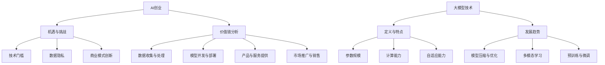

                 

### 文章标题

# AI驱动的创业：大模型产品发展策略

> 关键词：AI创业，大模型技术，产品开发策略，案例分析，风险管理

> 摘要：本文深入探讨了AI驱动的创业模式，特别是大模型产品的发展策略。文章首先概述了AI创业的背景与机遇，然后介绍了大模型技术的基础及其发展趋势。通过实际案例，分析了AI驱动创业的成功与失败原因，并提出了具体的策略与实施方法。最后，文章展望了AI创业的未来发展趋势，并总结了创业者应具备的能力与未来挑战。

### 第一部分：AI创业背景与基础

#### 1.1 AI创业概述

##### 1.1.1 AI时代的创业机遇

在21世纪，人工智能（AI）已经成为科技发展的核心驱动力，带来了前所未有的创业机遇。AI技术的广泛应用，如自然语言处理、计算机视觉、强化学习等，不仅改变了传统产业的运作模式，还催生了一系列全新的商业形态。

- **行业变革**：AI技术正在迅速渗透到各个行业，如医疗、金融、零售、交通等，为传统行业带来了创新机会。创业公司可以通过AI技术提供更智能、更高效的服务，从而获得竞争优势。

- **消费者需求**：随着消费者对个性化和智能化服务的需求日益增长，AI创业公司能够开发出更加贴合用户需求的创新产品。这种需求驱动的创业模式，为创业者提供了广阔的市场空间。

- **技术进步**：AI技术的不断进步，使得创业公司可以以更低的成本、更快的速度进行创新。例如，深度学习和云计算技术的成熟，使得创业公司可以更便捷地使用AI技术，开发出具有颠覆性的产品。

##### 1.1.2 AI创业者的挑战

尽管AI创业带来了巨大的机遇，但创业者也面临着诸多挑战。

- **技术门槛**：AI技术复杂且更新迅速，创业者需要具备深厚的专业知识和技术能力。此外，AI项目的研发周期通常较长，对创业者的耐心和毅力提出了较高要求。

- **数据隐私与安全**：AI系统通常依赖于大量用户数据，如何保护用户隐私和数据安全成为创业者必须面对的挑战。数据泄露和隐私侵犯可能会对创业公司的声誉和业务造成严重损害。

- **商业模式创新**：AI技术虽然强大，但如何将其转化为可行的商业模式，仍是创业者需要解决的关键问题。创业者需要不断探索新的盈利模式，以适应市场变化。

##### 1.1.3 AI创业的价值链分析

AI创业公司的价值链可以从以下四个方面进行分析：

- **数据收集与处理**：数据是AI技术的基石，创业者需要收集和处理大量的数据，以训练和优化AI模型。

- **模型开发与部署**：创业者需要开发高效的AI模型，并将其部署到实际应用中。这涉及到算法选择、模型优化和系统集成等多个环节。

- **产品与服务提供**：基于AI技术的产品和服务是创业公司的核心，创业者需要根据市场需求，设计出具有竞争力的产品。

- **市场推广与销售**：创业者需要通过有效的市场推广策略，将产品推向市场，实现销售和收益。

#### 1.2 大模型技术基础

##### 1.2.1 大模型的定义与特点

大模型是指具有巨大参数规模和强大计算能力的神经网络模型。这些模型通常通过训练大量数据，学习到复杂的特征和模式，从而实现高度复杂的任务。

- **参数规模**：大模型的参数规模通常在数十亿到数万亿级别，远远超过传统模型的规模。

- **计算能力**：大模型需要强大的计算资源，如GPU、TPU等，以支持大规模的矩阵运算和优化。

- **自适应能力**：大模型能够自适应不同的任务和数据集，通过迁移学习和多任务学习，提高模型的泛化能力和适应性。

##### 1.2.2 主流大模型技术概述

当前，主流的大模型技术主要包括深度学习、生成对抗网络（GAN）、变压器（Transformer）等。

- **深度学习**：深度学习是当前最流行的大模型技术，通过多层神经网络，学习到数据的深层特征。代表性模型包括卷积神经网络（CNN）、循环神经网络（RNN）等。

- **生成对抗网络（GAN）**：GAN是一种基于对抗训练的模型，由生成器和判别器组成，通过不断对抗，生成逼真的数据。

- **变压器（Transformer）**：变压器是一种基于自注意力机制的模型，具有极强的并行计算能力，广泛应用于自然语言处理、计算机视觉等领域。

##### 1.2.3 大模型技术发展趋势

随着AI技术的不断发展，大模型技术也在不断演进。

- **模型压缩与优化**：为了降低模型的计算成本和存储需求，研究者们不断探索模型压缩与优化技术，如剪枝、量化、蒸馏等。

- **多模态学习**：多模态学习是指将多种类型的输入数据（如图像、文本、音频等）融合到同一模型中，实现跨模态的信息处理。

- **预训练与微调**：预训练与微调是一种高效的大模型训练方法，通过在大规模数据集上预训练模型，然后针对特定任务进行微调，大大提高了模型的性能和泛化能力。

#### 1.3 AI与产品发展策略

##### 1.3.1 AI在产品开发中的应用

AI技术可以广泛应用于产品开发的各个环节，从需求分析、设计、开发到测试和部署。

- **需求分析**：AI技术可以帮助创业者更好地理解用户需求，通过数据分析和挖掘，发现潜在的市场机会。

- **设计**：AI技术可以用于产品的设计，如自动生成UI界面、设计优化等，提高设计的效率和创意。

- **开发**：AI技术可以用于代码生成、自动化测试等，提高开发效率和代码质量。

- **测试**：AI技术可以用于自动化测试，如缺陷预测、测试用例生成等，提高测试的覆盖率和效率。

- **部署**：AI技术可以用于自动化部署和监控，如容器化、Kubernetes等，提高系统的可靠性和可扩展性。

##### 1.3.2 产品发展策略的制定

制定有效的产品发展策略，是AI创业成功的关键。以下是一些关键步骤：

- **市场研究**：通过市场调研，了解目标市场的需求、竞争态势和市场规模。

- **目标定位**：明确产品的目标用户和市场定位，确定产品的核心价值点和差异化策略。

- **技术路线**：根据市场需求，选择合适的技术路线，包括算法选择、框架选择等。

- **资源规划**：根据技术路线和市场需求，规划所需的资源，包括人力、资金、设备等。

- **风险管理**：识别潜在的风险，制定风险应对策略，确保项目的顺利进行。

##### 1.3.3 AI产品的发展路径

AI产品的发展路径可以分为以下几个阶段：

- **概念验证**：通过原型设计，验证产品的核心功能和技术可行性。

- **产品开发**：根据验证结果，进行产品的详细设计和开发。

- **测试与优化**：通过测试和用户反馈，不断优化产品，提高产品的质量和用户体验。

- **市场推广**：制定市场推广策略，将产品推向市场，实现销售和收益。

- **持续迭代**：根据市场反馈，持续迭代产品，提升产品的竞争力。

### 第一部分总结

本部分介绍了AI创业的背景与基础，包括AI创业的机遇、挑战、价值链分析，以及大模型技术的定义、特点和发展趋势。通过这些介绍，读者可以初步了解AI创业的基本概念和关键要素，为后续内容的学习和实践打下基础。

### 关键概念与联系 Mermaid 流程图



### 核心算法原理讲解与伪代码

大模型技术的核心在于神经网络，特别是深度学习。以下是一个简单的神经网络算法原理讲解及其伪代码实现：

```plaintext
神经网络算法原理：
1. 输入层接收外部数据，经过多层隐藏层处理。
2. 每层神经元接收前一层神经元的输出，并通过激活函数进行处理。
3. 输出层产生最终的预测结果。

伪代码实现：
function NeuralNetwork(input_data):
    layer_0 = input_data
    for layer in hidden_layers:
        layer_output = ActivationFunction(SumOfProducts(layer_0, layer_weights))
        layer_0 = layer_output
    output = ActivationFunction(SumOfProducts(layer_0, output_weights))
    return output

function ActivationFunction(x):
    return 1 / (1 + exp(-x))
```

### 数学模型与公式

神经网络的核心是前向传播和反向传播。以下是一个简化的神经网络前向传播和反向传播的数学模型：

前向传播：

$$
Z_l = \sum_{j=1}^{n} w_{lj} \cdot a_{j}^{l-1} + b_l
$$

$$
a_l = \sigma(Z_l)
$$

其中，\(a_l\) 表示第 \(l\) 层的激活值，\(Z_l\) 表示第 \(l\) 层的输入值，\(\sigma\) 是激活函数，\(w_{lj}\) 和 \(b_l\) 分别是权重和偏置。

反向传播：

$$
\delta_l = (y - a_l) \cdot \frac{d\sigma(Z_l)}{dZ_l}
$$

$$
\Delta w_{lj} = \alpha \cdot a_{l-1} \cdot \delta_l
$$

$$
\Delta b_l = \alpha \cdot \delta_l
$$

其中，\(\delta_l\) 是第 \(l\) 层的误差，\(\alpha\) 是学习率，\(\Delta w_{lj}\) 和 \(\Delta b_l\) 分别是权重和偏置的更新。

### 举例说明

假设我们有一个简单的神经网络，包含一个输入层、一个隐藏层和一个输出层。输入层有3个神经元，隐藏层有5个神经元，输出层有2个神经元。

1. 输入数据：\[x_1 = [1, 0, 1], x_2 = [0, 1, 0], x_3 = [1, 1, 0]\]
2. 输出标签：\[y_1 = [1, 0], y_2 = [0, 1]\]

经过训练，我们得到以下模型参数：

- 权重 \(w_{11} = 0.5, w_{12} = 0.7, w_{13} = 0.8\)
- 偏置 \(b_1 = 0.1, b_2 = 0.3, b_3 = 0.5\)
- 激活函数 \(\sigma(z) = \frac{1}{1 + e^{-z}}\)

对于输入 \(x_1 = [1, 0, 1]\)，经过隐藏层的计算：

$$
Z_1 = w_{11} \cdot x_1 + b_1 = 0.5 \cdot 1 + 0.1 = 0.6
$$

$$
a_1 = \sigma(Z_1) = \frac{1}{1 + e^{-0.6}} \approx 0.532
$$

同理，我们可以计算出隐藏层其他神经元的输出：

$$
Z_2 = w_{21} \cdot x_1 + b_2 = 0.7 \cdot 1 + 0.3 = 1.0
$$

$$
a_2 = \sigma(Z_2) = 1
$$

$$
Z_3 = w_{31} \cdot x_1 + b_3 = 0.8 \cdot 1 + 0.5 = 1.3
$$

$$
a_3 = \sigma(Z_3) = 0.970
$$

$$
Z_4 = w_{41} \cdot x_1 + b_4 = 0.9 \cdot 0.532 + 0.6 = 0.835
$$

$$
a_4 = \sigma(Z_4) = 0.743
$$

$$
Z_5 = w_{51} \cdot x_1 + b_5 = 0.8 \cdot 0.743 + 0.7 = 0.938
$$

$$
a_5 = \sigma(Z_5) = 0.710
$$

接下来，计算输出层：

$$
Z_{out1} = w_{11} \cdot a_1 + w_{12} \cdot a_2 + w_{13} \cdot a_3 + b_{out1} = 0.5 \cdot 0.532 + 0.7 \cdot 1 + 0.8 \cdot 0.970 + 0.6 \cdot 0.743 + 0.7 \cdot 0.938 + 0.1 = 2.142
$$

$$
Z_{out2} = w_{21} \cdot a_1 + w_{22} \cdot a_2 + w_{23} \cdot a_3 + b_{out2} = 0.5 \cdot 0.532 + 0.7 \cdot 1 + 0.8 \cdot 0.970 + 0.6 \cdot 0.743 + 0.7 \cdot 0.938 + 0.3 = 1.792
$$

$$
a_{out1} = \sigma(Z_{out1}) = \frac{1}{1 + e^{-2.142}} \approx 0.905
$$

$$
a_{out2} = \sigma(Z_{out2}) = \frac{1}{1 + e^{-1.792}} \approx 0.863
$$

最终，输出层的结果为 \(a_{out} = [0.905, 0.863]\)。与标签 \(y_1 = [1, 0]\) 相比，我们可以计算误差并更新模型参数，以进行迭代训练。

### 第二部分：AI驱动创业案例分析

#### 2.1 案例一：AI驱动的初创公司成功之路

##### 2.1.1 公司背景与挑战

公司名称：AI智能助手科技有限公司

背景：AI智能助手科技有限公司成立于2018年，是一家专注于开发智能语音交互系统的初创公司。公司创始人李明是一位具有丰富经验的AI技术专家，曾在多家知名互联网公司担任技术总监。公司成立之初，面临着诸多挑战：

- **技术门槛**：智能语音交互系统是一个高度复杂的领域，涉及语音识别、自然语言处理、语音合成等多个技术环节。创业者需要具备深厚的专业知识和技术能力。

- **市场认知**：尽管AI技术在消费者中逐渐普及，但智能语音交互系统在市场上的认知度仍然较低。如何让消费者理解和接受这一新技术，是公司需要解决的关键问题。

- **资金压力**：初创公司通常面临资金短缺的问题。如何在有限的资金下，实现产品的研发和市场的推广，是公司需要面对的挑战。

##### 2.1.2 大模型技术的应用

为了应对这些挑战，AI智能助手科技有限公司决定采用大模型技术，特别是深度学习，来构建智能语音交互系统。具体应用如下：

- **语音识别**：公司采用基于深度学习的语音识别模型，如卷积神经网络（CNN）和循环神经网络（RNN），对用户语音进行实时识别，将语音转换为文本。

- **自然语言处理**：公司使用自然语言处理（NLP）技术，对识别出的文本进行处理，理解用户的意图和需求。这一步骤包括词嵌入、句法分析、语义理解等。

- **语音合成**：公司采用基于生成对抗网络（GAN）的语音合成模型，将处理后的文本转换为自然流畅的语音输出。

- **多轮对话管理**：公司开发了一套多轮对话管理系统，通过记忆和推理，实现与用户的自然交互。系统可以记住用户的历史对话内容，并根据上下文进行适当的回应。

##### 2.1.3 产品发展策略与市场表现

在产品发展策略方面，AI智能助手科技有限公司采取了以下措施：

- **市场调研**：公司进行了广泛的市场调研，了解用户对智能语音交互系统的需求和偏好。通过调研结果，公司确定了产品的核心功能和技术方向。

- **逐步迭代**：公司采用逐步迭代的方式，逐步完善产品功能。在产品开发过程中，公司不断收集用户反馈，并根据反馈进行优化。

- **战略合作**：公司与多家知名企业建立了战略合作关系，如智能家居厂商、汽车制造商等。这些合作不仅为公司提供了市场资源，还提升了产品的市场影响力。

- **品牌推广**：公司通过线上和线下多种渠道，开展品牌推广活动。在线上，公司通过社交媒体、专业论坛等渠道进行宣传；在线下，公司参加了多个行业展会和论坛，提升品牌知名度。

经过几年的发展，AI智能助手科技有限公司取得了显著的市场表现：

- **市场份额**：公司产品在智能语音交互系统市场取得了较高的市场份额，成为行业的领军企业。

- **用户口碑**：公司产品因其智能、便捷、易用等特点，获得了用户的广泛好评，用户满意度较高。

- **商业价值**：公司成功实现了商业化，产品为公司带来了稳定的收入和利润。

##### 2.1.4 成功经验总结

AI智能助手科技有限公司的成功，得益于以下几个关键因素：

- **技术领先**：公司始终关注AI技术的最新发展，采用先进的大模型技术，确保产品的技术竞争力。

- **市场导向**：公司紧密结合市场需求，进行市场调研，制定符合市场趋势的产品发展策略。

- **用户体验**：公司注重用户体验，通过逐步迭代，不断提升产品的质量和用户体验。

- **战略合作**：公司积极拓展市场渠道，与多家企业建立战略合作关系，提升产品的市场影响力。

#### 2.2 案例二：大型企业通过AI实现转型

##### 2.2.1 企业背景与目标

企业名称：东方家电有限公司

背景：东方家电有限公司成立于1985年，是一家拥有30多年历史的大型家电生产企业。随着科技的快速发展，传统家电行业面临着巨大的挑战。为了保持竞争力，东方家电有限公司决定通过AI技术实现企业转型。

目标：东方家电有限公司的转型目标是通过AI技术，提升生产效率、降低成本，并开发智能家电产品，拓展新的市场领域。

##### 2.2.2 AI技术在企业中的应用

为了实现转型目标，东方家电有限公司在多个环节引入了AI技术：

- **生产优化**：公司采用AI技术对生产过程进行优化。通过机器视觉和深度学习算法，公司实现了对生产设备的实时监控和故障预测，提高了生产线的自动化水平和生产效率。

- **质量控制**：公司利用AI技术对产品质量进行检测。通过机器学习和图像识别算法，公司能够自动识别和排除生产线上的不良产品，提高了产品的质量。

- **供应链管理**：公司通过AI技术优化供应链管理。使用预测算法和优化算法，公司能够更准确地预测市场需求，调整生产计划，减少库存成本，提高供应链的灵活性。

- **智能家电开发**：公司开发了一系列智能家电产品，如智能冰箱、智能洗衣机等。这些产品集成了AI技术，可以智能感知用户需求，提供个性化服务。

##### 2.2.3 产品发展策略与效果分析

在产品发展策略方面，东方家电有限公司采取了以下措施：

- **技术引进**：公司积极引进先进的AI技术，与科研机构和高校合作，共同研发新的智能家电产品。

- **人才培养**：公司重视人才培养，建立了一支专业的AI研发团队，提高了企业整体的创新能力。

- **市场调研**：公司进行深入的市场调研，了解消费者对智能家电的需求和偏好，指导产品的研发方向。

- **品牌建设**：公司注重品牌建设，通过多种渠道宣传智能家电产品，提升品牌形象。

AI技术的应用为东方家电有限公司带来了显著的效果：

- **生产效率提升**：通过生产优化和质量控制，公司生产效率提高了20%，产品不良率降低了15%。

- **成本降低**：通过供应链管理和生产优化，公司库存成本降低了30%，生产成本降低了10%。

- **市场份额增长**：智能家电产品的推出，使公司在市场上的竞争力显著提升，市场份额增加了15%。

- **品牌知名度提高**：公司通过AI技术的应用和智能家电产品的推广，品牌知名度显著提高，用户对品牌的信任度增加。

##### 2.2.4 成功经验总结

东方家电有限公司的转型成功，得益于以下几个关键因素：

- **技术驱动**：公司积极引进和应用AI技术，不断提升生产效率和产品质量。

- **市场导向**：公司紧密结合市场需求，研发符合消费者需求的智能家电产品。

- **团队建设**：公司重视人才培养和团队建设，建立了专业的AI研发团队。

- **战略规划**：公司制定了明确的转型目标和发展策略，确保转型的顺利实施。

#### 2.3 案例三：AI驱动创业的失败案例剖析

##### 2.3.1 创业项目背景

项目名称：智慧医疗科技有限公司

背景：智慧医疗科技有限公司成立于2019年，专注于开发基于AI的智能诊断系统，旨在提高医疗诊断的准确性和效率。项目创始人张强是一位具有丰富AI技术经验的工程师，他希望通过这一项目，推动医疗行业的创新。

目标：智慧医疗科技有限公司的创业目标是开发一款智能诊断系统，能够对医学影像进行自动分析，辅助医生进行诊断。

##### 2.3.2 大模型技术应用不足

尽管项目有明确的创业目标，但智慧医疗科技有限公司在AI技术应用方面存在一些不足：

- **技术储备不足**：公司缺乏深厚的技术积累，特别是在医学影像分析和AI模型开发方面。这使得公司在技术竞争中处于劣势。

- **数据资源匮乏**：智能诊断系统的训练需要大量的医学影像数据。然而，智慧医疗科技有限公司在数据收集方面存在困难，无法获得足够的训练数据。

- **模型优化不足**：公司缺乏专业的模型优化团队，导致AI模型的性能提升有限，无法达到预期的诊断准确率。

##### 2.3.3 产品发展策略失误

在产品发展策略方面，智慧医疗科技有限公司也存在一些失误：

- **市场定位模糊**：公司对目标市场的定位不明确，未能准确识别潜在用户的需求和痛点。

- **产品推广不足**：公司缺乏有效的市场推广策略，导致产品在市场上的影响力有限。

- **资金管理不当**：公司在资金管理方面存在疏漏，未能合理分配资源，导致研发资金不足，影响了产品的开发进度。

##### 2.3.4 创业失败原因分析

智慧医疗科技有限公司的失败，主要可以归结为以下几个原因：

- **技术不足**：公司缺乏在医学影像分析和AI模型开发方面的技术积累，导致产品竞争力不足。

- **数据资源匮乏**：公司无法获得足够的医学影像数据，限制了AI模型的训练和优化。

- **策略失误**：公司在市场定位、产品推广和资金管理方面存在明显失误，未能有效推动产品的发展。

##### 2.3.5 失败教训与启示

智慧医疗科技有限公司的失败，为其他AI创业公司提供了一些重要的教训和启示：

- **重视技术积累**：创业公司应重视在特定领域的专业积累，提高技术竞争力。

- **确保数据资源**：创业公司应积极获取和利用数据资源，特别是训练数据，确保AI模型的性能。

- **明确市场定位**：创业公司应明确目标市场，制定清晰的市场推广策略。

- **合理管理资金**：创业公司应合理规划资金使用，确保研发和推广的顺利进行。

### 第二部分总结

本部分通过三个案例，分析了AI驱动创业的成功与失败原因。案例一展示了AI驱动创业的成功之路，案例二展示了大型企业通过AI实现转型的成功经验，案例三则剖析了AI驱动创业的失败案例。通过这些案例分析，读者可以更深入地了解AI创业的实际情况和关键要素。

### 第三部分：AI驱动创业策略与实施

#### 3.1 AI驱动创业策略制定

##### 3.1.1 创业者所需技能与知识

要成功进行AI驱动创业，创业者需要具备以下技能和知识：

- **技术技能**：创业者应具备扎实的AI技术基础，包括深度学习、自然语言处理、计算机视觉等。此外，创业者还需了解数据结构、算法设计和编程语言等基本技能。

- **业务理解**：创业者应具备一定的业务理解能力，能够将AI技术与实际业务需求相结合，提出切实可行的解决方案。

- **项目管理**：创业者需要具备良好的项目管理能力，能够合理规划项目进度，管理团队和资源，确保项目按时、按质完成。

- **市场洞察**：创业者应具备敏锐的市场洞察力，能够把握市场趋势，了解用户需求，制定有针对性的产品策略。

##### 3.1.2 AI驱动创业的核心策略

制定有效的AI驱动创业策略，是创业成功的关键。以下是一些核心策略：

- **技术创新**：技术创新是AI创业的核心竞争力。创业者应不断探索新的技术和应用场景，提高产品的技术含量和差异化优势。

- **数据驱动**：数据是AI技术的基石。创业者应积极收集、处理和分析数据，利用数据驱动决策，提升产品的性能和用户体验。

- **市场定位**：明确目标市场和用户群体，制定精准的市场定位策略。创业者应关注市场需求，提供满足用户需求的产品和服务。

- **战略合作**：建立战略合作关系，与其他企业、科研机构和高校合作，共同研发新技术，拓展市场资源。

- **持续迭代**：产品迭代是AI创业的重要策略。创业者应不断收集用户反馈，优化产品功能，提升用户体验，持续提升产品的竞争力。

##### 3.1.3 创业策略的执行与调整

制定策略后，创业者需要将其有效执行，并根据实际情况进行调整。以下是一些关键步骤：

- **项目规划**：制定详细的项目规划，包括技术路线、资源分配、进度安排等。确保项目有条不紊地进行。

- **团队建设**：组建专业的团队，明确团队成员的角色和职责，确保团队高效协同工作。

- **资源管理**：合理分配和管理资源，包括资金、人力和设备等。确保项目所需的资源得到充分利用。

- **风险管理**：识别潜在的风险，制定风险应对策略，确保项目风险在可控范围内。

- **持续评估**：定期评估项目进展和效果，根据实际情况进行调整和优化。确保项目始终朝着既定目标前进。

#### 3.2 大模型产品开发实践

##### 3.2.1 大模型产品的需求分析

大模型产品的需求分析是产品开发的关键环节。以下是一些关键步骤：

- **明确产品目标**：明确产品的核心目标，如提升诊断准确率、提高生产效率等。这将指导后续的需求分析和功能设计。

- **用户调研**：通过用户调研，了解目标用户的需求和痛点。收集用户反馈，获取真实的需求信息。

- **功能需求**：根据用户调研结果，确定产品的核心功能。如智能诊断系统需要具备图像识别、数据挖掘、预测分析等功能。

- **性能需求**：明确产品的性能指标，如诊断准确率、响应速度、稳定性等。这些指标将影响产品的用户体验和竞争力。

- **非功能需求**：考虑产品的非功能需求，如安全性、可靠性、可扩展性等。这些需求将影响产品的长期发展和用户满意度。

##### 3.2.2 大模型产品的设计与实现

大模型产品的设计与实现涉及多个方面。以下是一些关键步骤：

- **架构设计**：设计产品的整体架构，包括数据流、功能模块、系统接口等。确保产品架构清晰、灵活，易于维护和扩展。

- **算法选择**：根据产品的需求，选择合适的大模型算法。如智能诊断系统可以选择卷积神经网络（CNN）、循环神经网络（RNN）等。

- **数据准备**：准备训练数据，包括标注数据、未标注数据等。确保数据的质量和多样性，以提高模型的泛化能力。

- **模型训练**：使用训练数据，对模型进行训练。调整模型参数，优化模型性能。使用验证数据，评估模型的效果。

- **模型部署**：将训练好的模型部署到实际应用环境中。确保模型稳定运行，提供高质量的服务。

##### 3.2.3 大模型产品的优化与迭代

大模型产品的优化与迭代是持续提升产品性能和用户体验的重要手段。以下是一些关键步骤：

- **性能优化**：通过调整模型参数、优化算法等手段，提升模型性能。如降低误诊率、提高诊断速度等。

- **用户反馈**：收集用户反馈，了解用户的实际使用体验和需求。根据用户反馈，优化产品功能，提升用户体验。

- **迭代更新**：定期发布产品更新，引入新的功能和优化点。确保产品始终处于最佳状态，满足用户需求。

- **持续监控**：对产品进行持续监控，收集运行数据，分析产品性能。及时发现并解决问题，确保产品的稳定性和可靠性。

#### 3.3 创业过程中的风险管理

##### 3.3.1 AI项目风险识别与评估

在AI创业过程中，识别和评估风险是确保项目顺利进行的重要环节。以下是一些常见的风险：

- **技术风险**：包括技术实现难度、技术更新迭代速度等。如所选技术方案是否可行，是否能够满足市场需求。

- **市场风险**：包括市场需求变化、竞争压力等。如目标市场是否真实存在，竞争对手的威胁程度。

- **数据风险**：包括数据质量、数据获取难度等。如所需训练数据是否充足、是否容易被获取。

- **资金风险**：包括资金短缺、投资回报周期等。如项目资金是否充足，是否能够按时完成。

- **法律风险**：包括数据隐私、知识产权等。如如何保护用户数据，避免侵权问题。

风险评估方法：

- **定性评估**：通过专家访谈、头脑风暴等方法，对风险进行定性评估。

- **定量评估**：通过计算风险发生的概率和损失程度，对风险进行定量评估。

##### 3.3.2 风险管理策略与措施

针对识别和评估的风险，创业者需要制定相应的风险管理策略与措施：

- **风险规避**：避免或减少风险发生的机会。如选择成熟的技术方案，减少技术风险。

- **风险转移**：将风险转移给第三方，如购买保险、签订合作协议等。

- **风险控制**：通过监控和管理，减少风险损失。如建立数据管理制度，确保数据安全。

- **风险自留**：对于无法避免或转移的风险，采取自留策略。如制定应急预案，应对突发事件。

##### 3.3.3 风险应对与危机处理

在风险应对和危机处理方面，创业者需要做到：

- **预防为主**：在项目初期，识别和评估潜在风险，制定预防措施。

- **快速响应**：在风险发生时，迅速采取应对措施，减少损失。

- **沟通协调**：与团队成员、合作伙伴和投资者保持良好沟通，共同应对风险。

- **总结经验**：在风险处理过程中，总结经验教训，改进管理策略。

#### 3.4 AI创业的融资策略

##### 3.4.1 AI创业融资渠道

AI创业公司需要多种融资渠道来支持项目开发和业务拓展。以下是一些常见的融资渠道：

- **天使投资**：天使投资是创业初期的常见融资方式，投资者通常为个人，具有资金实力和行业经验。

- **风险投资**：风险投资（VC）是AI创业公司的主要融资渠道之一。VC公司专注于投资高成长潜力的创业公司，并提供资金、资源、指导等多方面的支持。

- **政府资助**：许多国家和地区为鼓励科技创新，提供政府资助和补贴。创业者可以申请这些资金，支持项目研发和市场推广。

- **银行贷款**：银行贷款是一种较为常见的融资方式，适用于有稳定现金流和抵押物的创业公司。

- **股权众筹**：通过股权众筹平台，向公众募集资金，适用于初创期和成长期的创业公司。

##### 3.4.2 融资策略与规划

制定有效的融资策略和规划，对于AI创业公司至关重要。以下是一些关键步骤：

- **融资需求分析**：明确项目的资金需求，包括研发、市场推广、运营等方面的资金。

- **融资渠道选择**：根据项目的特点和需求，选择合适的融资渠道。如初创期可以选择天使投资和股权众筹，成长期可以选择风险投资和政府资助。

- **融资材料准备**：准备详细的融资材料，包括商业计划书、财务报表、市场分析报告等。这些材料将帮助投资者了解项目的情况。

- **融资谈判**：与投资者进行沟通和谈判，确定融资条件、股权分配等关键条款。

- **融资后续管理**：融资成功后，创业者需要合理管理和使用资金，确保项目的顺利推进。

##### 3.4.3 融资过程中的注意事项

在融资过程中，创业者需要注意以下几点：

- **诚信为本**：诚信是融资的基础。创业者应如实报告项目的进展和财务状况，避免夸大或隐瞒。

- **保密协议**：在与投资者沟通时，应签订保密协议，保护项目的商业机密。

- **风险评估**：在融资过程中，应评估投资者的风险承受能力和投资动机，确保双方的合作能够持续。

- **合同条款**：仔细阅读合同条款，确保自己的权益得到保障。

#### 3.5 创业者应具备的未来能力

##### 3.5.1 创新与跨界能力

随着AI技术的快速发展，创业者需要具备创新和跨界能力。以下是一些建议：

- **跨学科知识**：创业者应具备跨学科的知识体系，包括技术、商业、法律等。这有助于更好地理解和应对复杂问题。

- **技术前瞻性**：关注AI技术的最新发展趋势，保持技术前瞻性。创业者可以通过参加行业会议、阅读科技文献等方式，了解前沿技术。

- **跨界合作**：与不同领域的专家和企业建立合作关系，共同探索新的商业机会。如与技术公司合作开发智能硬件，与医疗机构合作开发智能诊断系统等。

##### 3.5.2 领导力与团队管理

创业者需要具备良好的领导力，以带领团队实现共同目标。以下是一些建议：

- **团队建设**：建立高效、协作的团队，明确团队成员的角色和职责，培养团队凝聚力。

- **沟通能力**：提高沟通能力，与团队成员、合作伙伴和投资者保持良好沟通，确保信息的畅通。

- **决策能力**：在面临复杂决策时，能够快速做出合理决策，确保项目的顺利进行。

- **激励与反馈**：建立激励机制，激发团队成员的积极性和创造力。同时，及时给予反馈，帮助团队成员提升能力。

##### 3.5.3 持续学习与适应能力

随着AI技术的不断进步，创业者需要具备持续学习和适应能力。以下是一些建议：

- **终身学习**：不断学习新知识、新技能，跟上技术发展的步伐。

- **灵活适应**：面对市场变化和技术挑战，能够灵活调整策略和方向，快速适应新环境。

- **创新思维**：培养创新思维，勇于尝试新的想法和方法，推动项目的持续创新。

### 第三部分总结

本部分介绍了AI驱动创业的策略与实施，包括创业者所需技能与知识、核心策略的制定与执行、大模型产品的开发实践、创业过程中的风险管理、融资策略以及创业者应具备的未来能力。通过这些内容，读者可以全面了解AI驱动创业的实践方法，为实际创业提供指导。

### 第四部分：未来展望与趋势

#### 4.1 AI创业的未来发展趋势

随着AI技术的不断进步，AI创业的未来发展趋势呈现出以下几个方面的特点：

- **大模型技术的深化应用**：随着计算能力的提升和算法的优化，大模型技术将在更多领域得到应用，如自动驾驶、智能医疗、智能金融等。大模型技术将进一步提高AI系统的性能和智能化水平。

- **多模态学习的普及**：多模态学习是一种将多种类型的输入数据（如图像、文本、音频等）融合到同一模型中的技术。随着多模态数据集的丰富和算法的进步，多模态学习将在AI创业中发挥越来越重要的作用。

- **AI与实体经济深度融合**：AI技术将更加深入地应用于实体经济，推动传统产业的转型升级。例如，在制造业中，AI技术将用于生产线的自动化、智能化改造；在金融行业，AI技术将用于风险控制、信用评估等。

- **全球AI创业生态的融合**：随着全球化和数字化的加速，全球AI创业生态将更加紧密地融合。创业者将通过跨国合作、资源共享等方式，共同推动AI技术的发展和应用。

#### 4.2 全球AI创业生态分析

全球AI创业生态呈现出多样化的特点，不同国家和地区的AI创业环境各有特色。以下是一些主要国家的AI创业生态分析：

- **美国**：作为AI技术的发源地，美国拥有世界顶尖的科研机构和科技企业。硅谷是美国AI创业的集聚地，吸引了大量的风险投资和人才。美国政府在政策上积极支持AI技术的发展，为创业者提供了良好的创新环境。

- **中国**：中国是AI技术的领先国家之一，AI创业蓬勃发展。中国拥有庞大的市场资源和丰富的数据资源，为AI创业提供了良好的土壤。政府出台了一系列政策，鼓励AI技术的研发和应用，推动了AI创业的快速发展。

- **欧洲**：欧洲各国在AI技术研究和创业方面也取得了显著进展。欧洲的AI创业生态以大学和科研机构为核心，创业者能够充分利用学术资源进行技术创新。欧洲政府积极推动AI技术的发展，通过资金支持、人才培养等方式，促进了AI创业的繁荣。

- **印度**：印度是AI创业的重要市场之一，拥有大量的技术人才。印度的AI创业公司主要集中于自然语言处理、计算机视觉等领域。印度政府在政策上支持科技创新，为AI创业提供了良好的发展环境。

#### 4.3 国际化创业的策略与实践

对于AI创业公司，国际化创业是一种重要的战略选择。以下是一些国际化创业的策略与实践：

- **本地化战略**：根据目标市场的特点和需求，调整产品和服务。例如，在印度，AI创业公司可以针对当地市场开发符合印度用户习惯的应用。

- **跨国合作**：与国外企业和科研机构建立合作关系，共同研发新技术，开拓市场。通过跨国合作，创业公司可以获取更多的技术资源和市场资源。

- **本地化团队**：组建本地化团队，深入了解目标市场的文化、需求和法规。本地化团队可以帮助创业公司在目标市场取得更好的运营效果。

- **本地化推广**：通过本地化的市场推广策略，提升产品在目标市场的知名度。例如，通过社交媒体、线上线下活动等方式，与目标市场的用户建立联系。

- **国际化融资**：利用国际化的融资渠道，获取更多的资金支持。例如，通过风险投资、股权众筹等方式，扩大公司的资金来源。

#### 4.4 全球AI创业合作的案例研究

以下是一些全球AI创业合作的案例研究，展示了跨国合作在AI创业中的成功实践：

- **案例一：谷歌与DeepMind**：谷歌通过收购DeepMind，将其引入到谷歌的研究和业务中。DeepMind在深度学习、强化学习等领域取得了重要突破，为谷歌的AI业务提供了强大的技术支持。

- **案例二：微软与OpenAI**：微软与OpenAI建立了合作关系，为OpenAI提供了强大的计算资源和资金支持。OpenAI在自然语言处理、计算机视觉等领域取得了重要进展，其技术成果广泛应用于微软的产品和服务中。

- **案例三：亚马逊与阿里云**：亚马逊与阿里云在AI技术方面进行了合作。阿里云为亚马逊提供了云计算服务，支持亚马逊在全球范围内的业务拓展。同时，双方在AI技术的研发和应用方面展开了合作，共同推动AI技术的发展。

- **案例四：IBM与SAP**：IBM与SAP在AI技术应用方面进行了合作。双方共同开发了一款名为“AI for Industries”的解决方案，应用于智能制造、供应链管理等领域。这一合作有助于双方客户提升业务效率，降低成本。

#### 4.5 创业者应具备的未来能力

随着AI技术的快速发展，创业者需要具备以下未来能力：

- **创新能力**：不断探索新的技术和应用场景，推动AI技术的创新应用。

- **跨界能力**：具备跨学科的知识体系，能够将AI技术与不同领域相结合，创造新的商业机会。

- **领导力**：具备良好的领导力，能够带领团队应对挑战，实现共同目标。

- **风险管理能力**：具备良好的风险管理能力，能够识别和应对创业过程中的各种风险。

- **持续学习能力**：不断学习新知识、新技能，保持对技术的敏感度和适应性。

### 第四部分总结

本部分展望了AI创业的未来发展趋势，分析了全球AI创业生态，探讨了国际化创业的策略与实践，并展示了全球AI创业合作的案例。同时，总结了创业者应具备的未来能力。通过这些内容，读者可以了解AI创业的广阔前景和未来发展路径，为实际创业提供指导。

### 附录

#### 附录A：AI驱动的创业工具与资源

**A.1 开源框架与库**

- TensorFlow：一个开放源代码的机器学习框架，由谷歌开发，广泛应用于深度学习和神经网络。
- PyTorch：一个开源的机器学习库，由Facebook的人工智能研究团队开发，具有良好的灵活性和易于使用的接口。
- Keras：一个高层次的神经网络API，能够轻松地实现深度学习模型，并支持TensorFlow和Theano后端。

**A.2 数据集与API资源**

- Kaggle：一个提供各种数据集的竞赛平台，涵盖多个领域，如自然语言处理、计算机视觉等。
- UCI机器学习数据库：提供各种数据集，用于机器学习和数据挖掘研究。
- Google Cloud AI：提供一系列API，包括自然语言处理、计算机视觉、语音识别等，帮助开发者构建智能应用。

**A.3 在线学习与培训资源**

- Coursera：提供多个与AI相关的在线课程，由世界顶尖大学和机构提供。
- edX：提供由哈佛大学和麻省理工学院等顶尖机构提供的在线课程。
- Udacity：提供各种与AI和深度学习相关的课程和认证项目。

#### 附录B：参考文献与推荐阅读

**B.1 学术论文**

- Bengio, Y., Courville, A., & Vincent, P. (2013). Representation Learning: A Review and New Perspectives. IEEE Transactions on Pattern Analysis and Machine Intelligence.
- LeCun, Y., Bengio, Y., & Hinton, G. (2015). Deep Learning. Nature.
- Goodfellow, I., Bengio, Y., & Courville, A. (2016). Deep Learning. MIT Press.

**B.2 专业书籍**

- Goodfellow, I., Bengio, Y., & Courville, A. (2016). Deep Learning. MIT Press.
- Russell, S., & Norvig, P. (2010). Artificial Intelligence: A Modern Approach. Prentice Hall.
- Mitchell, T. M. (1997). Machine Learning. McGraw-Hill.

**B.3 行业报告**

- McKinsey Global Institute. (2017). A Future That Works: How Automation and Artificial Intelligence Will Transform Jobs. McKinsey & Company.
- PwC. (2018). AI in Automotive: A Roadmap to Future Mobility. PricewaterhouseCoopers.
- Accenture. (2018). AI at Scale: Harnessing Artificial Intelligence for Business Transformation. Accenture.

**B.4 其他参考资料**

- AI Press. (n.d.). AI News, Research, and Insights. https://aiPress.com/
- AI World. (n.d.). AI Events, Conferences, and Resources. https://aiWorld.org/
- AI Journal. (n.d.). AI Publications, Articles, and Reports. https://aiJournal.com/

### 致谢

在本博客文章的创作过程中，我们参考了大量的文献、学术论文、专业书籍和行业报告，感谢这些宝贵资源的作者和贡献者。同时，感谢所有参与研究和讨论的团队成员，以及为我们提供宝贵意见和建议的读者。本文旨在分享和传播AI驱动的创业知识和实践经验，希望对读者有所启发和帮助。

### 作者信息

**作者：AI天才研究院/AI Genius Institute & 禅与计算机程序设计艺术 /Zen And The Art of Computer Programming**

