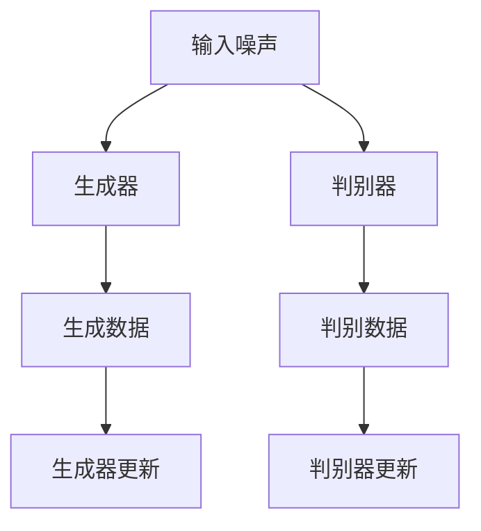

                 

### 文章标题

# AIGC重新定义游戏体验

> 关键词：人工智能，游戏开发，生成对抗网络，虚拟现实，游戏设计

> 摘要：本文旨在探讨人工智能生成内容（AIGC）技术如何重新定义游戏体验。通过深入分析AIGC的概念、原理及其在游戏设计、开发、运营中的具体应用，我们揭示AIGC对游戏产业的深远影响和未来发展趋势。本文将为游戏开发者、研究者及爱好者提供有价值的参考和启示。

## 第一部分: AIGC基础与概述

### 1.1 AIGC的概念与定义

#### 1.1.1 AIGC的起源与发展

人工智能生成内容（AIGC，Artificial Intelligence Generated Content）是一种利用人工智能技术，特别是深度学习算法，生成或辅助生成内容的技术。AIGC的概念起源于20世纪90年代，随着计算机性能的不断提升和深度学习技术的突破，AIGC开始逐渐应用于图像、音频、视频和文本等多个领域。

AIGC技术的发展历程可以分为三个阶段：

1. **早期探索阶段（1990s-2000s）**：在这一阶段，人工智能算法主要是基于规则和统计模型，如决策树、支持向量机等。尽管这些算法在一定程度上实现了内容生成，但生成的内容往往较为简单且缺乏创造力。

2. **深度学习阶段（2010s）**：随着深度学习技术的崛起，特别是卷积神经网络（CNN）和递归神经网络（RNN）的应用，AIGC技术得到了显著提升。这一阶段的代表性成果包括生成对抗网络（GAN）、变分自编码器（VAE）等。

3. **多样化应用阶段（2010s至今）**：深度学习技术的发展使得AIGC的应用领域不断扩展，从图像和音频生成，到视频和文本生成，AIGC已经成为内容创作的重要工具。

#### 1.1.2 AIGC与相关技术的关系

AIGC技术涉及多个领域，与以下相关技术密切相关：

1. **深度学习**：深度学习是AIGC技术的核心，通过多层神经网络对大量数据进行训练，以实现复杂模式的识别和生成。

2. **生成对抗网络（GAN）**：GAN是AIGC技术的重要分支，由生成器和判别器两个神经网络组成，通过对抗训练生成高质量的数据。

3. **变分自编码器（VAE）**：VAE是一种基于概率模型的生成模型，通过编码器和解码器实现数据的生成。

4. **自然语言处理（NLP）**：NLP技术用于处理文本数据，是实现文本生成的重要手段。

5. **计算机视觉**：计算机视觉技术用于图像和视频数据的处理，是实现图像生成的重要工具。

### 1.2 AIGC的技术原理

#### 1.2.1 AIGC的组成架构

AIGC系统通常由以下几部分组成：

1. **数据集**：作为训练和生成的基础，数据集的质量直接影响AIGC的性能。
2. **模型**：包括生成模型和判别模型，生成模型负责生成数据，判别模型用于评估生成数据的真实度。
3. **训练过程**：通过训练，模型学习到如何生成高质量的数据。
4. **生成过程**：在训练完成后，生成模型可以根据输入条件生成新的数据。

#### 1.2.2 AIGC的核心算法

AIGC技术涉及多种核心算法，以下是其中几种常见的算法：

1. **生成对抗网络（GAN）**：

GAN由生成器（Generator）和判别器（Discriminator）两个神经网络组成。生成器尝试生成逼真的数据，判别器则试图区分真实数据和生成数据。两者通过对抗训练相互提升，最终生成器能够生成高质量的数据。

伪代码：

```python
# GAN算法伪代码
generator = GANGenerator()
discriminator = GANDiscriminator()

for epoch in range(num_epochs):
    for batch in data_loader:
        z = noise()
        generated_data = generator(z)
        real_data = batch

        # 训练判别器
        d_loss_real = discriminator_loss(discriminator, real_data)
        d_loss_fake = discriminator_loss(discriminator, generated_data)
        d_loss = 0.5 * (d_loss_real + d_loss_fake)

        # 训练生成器
        g_loss = generator_loss(discriminator, generated_data)

        optimizer_d.zero_grad()
        d_loss.backward()
        optimizer_d.step()

        optimizer_g.zero_grad()
        g_loss.backward()
        optimizer_g.step()
```

2. **变分自编码器（VAE）**：

VAE是一种基于概率模型的生成模型，通过编码器（Encoder）和解码器（Decoder）实现数据的生成。编码器将输入数据映射到潜在空间，解码器则从潜在空间生成数据。

伪代码：

```python
# VAE算法伪代码
encoder = VAEEncoder()
decoder = VADecoder()

for epoch in range(num_epochs):
    for batch in data_loader:
        x = batch
        z_mean, z_log_var = encoder(x)
        z = sample_z(z_mean, z_log_var)
        reconstructed_x = decoder(z)

        # 计算损失函数
        loss = reconstruction_loss(x, reconstructed_x) + k * KL_divergence(z_mean, z_log_var)

        # 反向传播与优化
        optimizer.zero_grad()
        loss.backward()
        optimizer.step()
```

### 1.3 AIGC的应用领域

#### 1.3.1 游戏行业中的应用

AIGC技术在游戏行业中得到了广泛应用，以下是其主要应用领域：

1. **游戏内容生成**：利用AIGC技术，可以自动生成游戏关卡、角色、场景等，降低开发成本，提高游戏多样性。

2. **游戏角色生成**：通过AIGC技术，可以为游戏生成逼真的角色，增强游戏的可玩性和互动性。

3. **游戏场景生成**：AIGC技术可以生成丰富的游戏场景，包括室内、室外、城市等，为游戏提供更多的背景和可能性。

4. **游戏平衡性设计**：通过分析玩家行为，AIGC技术可以调整游戏难度，实现游戏平衡性。

5. **游戏用户行为预测**：AIGC技术可以分析玩家行为数据，预测玩家需求，为游戏运营提供决策支持。

#### 1.3.2 其他行业中的应用

除了游戏行业，AIGC技术还在其他领域得到了广泛应用：

1. **艺术创作**：AIGC技术可以生成艺术作品，如绘画、音乐等，为艺术家提供创作灵感。

2. **媒体制作**：AIGC技术可以自动生成视频、音频内容，提高内容生产效率。

3. **广告营销**：AIGC技术可以生成个性化的广告内容，提高广告效果。

4. **智能客服**：AIGC技术可以生成自然语言回复，提高智能客服的响应速度和准确性。

### 1.4 AIGC的未来趋势与挑战

#### 1.4.1 AIGC的发展前景

AIGC技术在未来具有广阔的发展前景：

1. **技术突破**：随着深度学习算法的持续发展，AIGC技术将不断突破，生成更高质量的内容。

2. **应用拓展**：AIGC技术将在更多领域得到应用，如医疗、金融、教育等。

3. **产业变革**：AIGC技术将推动内容创作、游戏开发等产业的变革，提高生产效率，降低成本。

#### 1.4.2 AIGC面临的挑战与应对策略

尽管AIGC技术具有广阔的发展前景，但同时也面临一些挑战：

1. **数据隐私**：AIGC技术的应用涉及大量数据的收集和处理，如何保护用户隐私成为一大挑战。应对策略包括数据加密、隐私保护算法等。

2. **版权问题**：AIGC技术生成的作品可能涉及版权问题，如何界定版权责任成为挑战。应对策略包括版权登记、版权保护技术等。

3. **伦理道德**：AIGC技术可能引发一些伦理道德问题，如替代人类劳动、侵犯隐私等。应对策略包括制定伦理规范、加强监管等。

4. **技术发展**：AIGC技术需要不断改进，以应对日益复杂的应用场景。应对策略包括加大研发投入、促进产学研合作等。

## 第二部分: AIGC在游戏设计中的应用

### 2.1 游戏设计的基本概念

#### 2.1.1 游戏设计要素

游戏设计包括多个要素，以下是一些关键要素：

1. **游戏玩法**：游戏的核心机制和规则，如角色扮演、策略、动作等。
2. **故事情节**：游戏的背景故事和剧情，为玩家提供沉浸式的体验。
3. **美术设计**：游戏的角色、场景、界面等视觉元素，提高游戏的美观度。
4. **音效音乐**：游戏的背景音乐、音效等，增强游戏氛围。
5. **用户体验**：游戏的操作便利性、界面友好性等，影响玩家的满意度。
6. **游戏平衡性**：游戏的难度设置、角色能力分配等，使游戏具有挑战性和公平性。

#### 2.1.2 游戏设计流程

游戏设计通常包括以下流程：

1. **需求分析**：确定游戏的目标受众、题材、玩法等，明确游戏设计的目标。
2. **原型设计**：制作游戏原型，验证游戏玩法的可行性和趣味性。
3. **详细设计**：完善游戏规则、故事情节、美术设计等，为游戏开发提供详细文档。
4. **开发与测试**：按照设计文档进行游戏开发，并进行反复测试，确保游戏质量。
5. **上线与运营**：游戏上线后，进行运营和推广，收集用户反馈，持续优化游戏。

### 2.2 AIGC在游戏设计中的具体应用

#### 2.2.1 游戏内容生成

AIGC技术可以自动生成游戏内容，提高游戏设计的效率。以下是一些具体应用：

1. **关卡生成**：利用AIGC技术，可以自动生成游戏关卡，实现多样化、个性化的游戏体验。
2. **角色生成**：通过AIGC技术，可以为游戏生成各种角色，提高游戏角色的多样性。
3. **场景生成**：利用AIGC技术，可以生成丰富的游戏场景，包括自然景观、城市环境等。

#### 2.2.2 游戏角色生成

AIGC技术在游戏角色生成中具有显著优势：

1. **个性化角色**：AIGC技术可以根据玩家喜好生成个性化角色，提高玩家的满意度。
2. **多样化角色**：AIGC技术可以生成各种类型的角色，包括动物、怪物、人类等，增加游戏的可玩性。
3. **动态角色**：AIGC技术可以实现角色的动态生成，如角色的表情、动作等，增强游戏的真实感。

#### 2.2.3 游戏场景生成

AIGC技术在游戏场景生成中的应用包括：

1. **室外场景**：利用AIGC技术，可以生成各种室外场景，如森林、沙漠、城市等，提高游戏的真实感。
2. **室内场景**：AIGC技术可以生成各种室内场景，如房间、城堡、商场等，为游戏提供丰富的背景。
3. **动态场景**：AIGC技术可以实现场景的动态生成，如场景的天气变化、时间流逝等，增加游戏的趣味性。

### 2.3 AIGC在游戏平衡性设计中的应用

#### 2.3.1 游戏难度调整

AIGC技术可以分析玩家行为数据，调整游戏难度，实现游戏平衡性：

1. **动态调整**：根据玩家的表现，AIGC技术可以实时调整游戏难度，使游戏既具有挑战性，又不会过于困难。
2. **个性化调整**：AIGC技术可以根据玩家的喜好和能力，为玩家提供个性化的游戏难度设置。

#### 2.3.2 游戏平衡性分析

AIGC技术可以分析游戏中的各种因素，评估游戏平衡性：

1. **角色能力评估**：AIGC技术可以评估不同角色的能力，为游戏平衡性提供参考。
2. **技能效果分析**：AIGC技术可以分析各种技能的效果，为游戏平衡性调整提供依据。
3. **关卡难度评估**：AIGC技术可以评估不同关卡的难度，确保游戏具有适当的挑战性。

### 2.4 AIGC在游戏用户行为预测中的应用

#### 2.4.1 用户行为分析

AIGC技术可以分析玩家行为数据，了解玩家在游戏中的行为模式：

1. **玩家兴趣分析**：AIGC技术可以分析玩家的兴趣偏好，为游戏内容生成提供参考。
2. **玩家习惯分析**：AIGC技术可以分析玩家的游戏习惯，为游戏设计提供改进建议。

#### 2.4.2 用户需求预测

AIGC技术可以预测玩家未来的需求，为游戏运营提供决策支持：

1. **内容更新预测**：AIGC技术可以预测玩家对游戏内容更新的需求，为游戏运营提供参考。
2. **活动策划预测**：AIGC技术可以预测玩家对游戏活动的兴趣，为游戏运营提供策划建议。

## 第三部分: AIGC在游戏开发中的实现

### 3.1 AIGC开发环境搭建

#### 3.1.1 开发环境配置

搭建AIGC开发环境需要以下软件和硬件：

1. **软件**：
   - Python（3.8及以上版本）
   - TensorFlow或PyTorch（深度学习框架）
   - Matplotlib、Seaborn（数据可视化库）
   - Jupyter Notebook（交互式开发环境）

2. **硬件**：
   - CPU：至少四核处理器
   - GPU：NVIDIA显卡（用于加速深度学习计算）
   - 内存：至少16GB
   - 硬盘：至少500GB

#### 3.1.2 开发工具介绍

以下是常用的AIGC开发工具：

1. **TensorFlow**：TensorFlow是Google开源的深度学习框架，支持多种深度学习模型的训练和部署。
2. **PyTorch**：PyTorch是Facebook开源的深度学习框架，以其灵活的动态计算图和易用性受到开发者喜爱。
3. **Keras**：Keras是一个高层次的深度学习API，可以方便地构建和训练深度学习模型。
4. **CUDA**：CUDA是NVIDIA推出的并行计算平台和编程语言，可以显著加速深度学习计算。
5. **GPU加速**：使用CUDA或OpenCL等GPU编程技术，可以在NVIDIA或AMD显卡上加速深度学习模型的训练和推理。

### 3.2 AIGC核心算法实现

#### 3.2.1 GAN算法实现

生成对抗网络（GAN）是AIGC技术的重要组成部分，以下是GAN算法的实现步骤：

1. **模型定义**：
   - **生成器（Generator）**：生成器是一个全连接神经网络，用于将随机噪声映射为游戏角色、场景等。
   - **判别器（Discriminator）**：判别器是一个全连接神经网络，用于区分真实数据和生成数据。

2. **损失函数**：
   - **生成器损失函数**：生成器的目标是使判别器无法区分真实数据和生成数据，损失函数通常采用反对抗损失（Adversarial Loss）。
   - **判别器损失函数**：判别器的目标是正确区分真实数据和生成数据，损失函数通常采用二元交叉熵损失（Binary Cross-Entropy Loss）。

3. **训练过程**：
   - **交替训练**：生成器和判别器交替进行训练，生成器尝试生成更逼真的数据，判别器尝试提高对生成数据的辨别能力。
   - **梯度惩罚**：为了防止生成器过度依赖判别器的反馈，可以引入梯度惩罚，即对生成器的梯度施加一定的限制。

伪代码：

```python
# GAN算法伪代码
generator = GANGenerator()
discriminator = GANDiscriminator()

for epoch in range(num_epochs):
    for batch in data_loader:
        z = noise()
        generated_data = generator(z)
        real_data = batch

        # 训练判别器
        d_loss_real = discriminator_loss(discriminator, real_data)
        d_loss_fake = discriminator_loss(discriminator, generated_data)
        d_loss = 0.5 * (d_loss_real + d_loss_fake)

        # 训练生成器
        g_loss = generator_loss(discriminator, generated_data)

        optimizer_d.zero_grad()
        d_loss.backward()
        optimizer_d.step()

        optimizer_g.zero_grad()
        g_loss.backward()
        optimizer_g.step()
```

#### 3.2.2 DCGAN算法实现

深度卷积生成对抗网络（DCGAN）是GAN算法的一种变体，适用于图像生成任务。以下是DCGAN算法的实现步骤：

1. **模型定义**：
   - **生成器**：生成器采用卷积神经网络结构，通过多层卷积和反卷积操作将噪声映射为图像。
   - **判别器**：判别器采用卷积神经网络结构，用于区分真实图像和生成图像。

2. **损失函数**：
   - **生成器损失函数**：生成器的目标是使判别器无法区分真实图像和生成图像，损失函数通常采用反对抗损失。
   - **判别器损失函数**：判别器的目标是正确区分真实图像和生成图像，损失函数通常采用二元交叉熵损失。

3. **训练过程**：
   - **批量归一化**：DCGAN引入了批量归一化（Batch Normalization），以提高模型的稳定性和训练效率。
   - **梯度惩罚**：与GAN算法类似，DCGAN也引入了梯度惩罚。

伪代码：

```python
# DCGAN算法伪代码
generator = DCGANGenerator()
discriminator = DCGANDiscriminator()

for epoch in range(num_epochs):
    for batch in data_loader:
        z = noise()
        generated_images = generator(z)
        real_images = batch

        # 训练判别器
        d_loss_real = discriminator_loss(discriminator, real_images)
        d_loss_fake = discriminator_loss(discriminator, generated_images)
        d_loss = 0.5 * (d_loss_real + d_loss_fake)

        # 训练生成器
        g_loss = generator_loss(discriminator, generated_images)

        optimizer_d.zero_grad()
        d_loss.backward()
        optimizer_d.step()

        optimizer_g.zero_grad()
        g_loss.backward()
        optimizer_g.step()
```

#### 3.2.3 VAE算法实现

变分自编码器（VAE）是一种基于概率模型的生成模型，适用于图像、文本等数据的生成。以下是VAE算法的实现步骤：

1. **模型定义**：
   - **编码器（Encoder）**：编码器是一个全连接神经网络，用于将输入数据映射到潜在空间。
   - **解码器（Decoder）**：解码器是一个全连接神经网络，用于从潜在空间生成数据。

2. **损失函数**：
   - **重构损失函数**：重构损失函数衡量输入数据与生成数据之间的相似度。
   - **KL散度损失函数**：KL散度损失函数衡量编码器输出的潜在分布与先验分布之间的差异。

3. **训练过程**：
   - **梯度下降**：VAE采用梯度下降算法进行训练，优化编码器和解码器的参数。
   - **采样过程**：在训练过程中，解码器从潜在空间采样生成数据。

伪代码：

```python
# VAE算法伪代码
encoder = VAEEncoder()
decoder = VADERecoder()

for epoch in range(num_epochs):
    for batch in data_loader:
        x = batch
        z_mean, z_log_var = encoder(x)
        z = sample_z(z_mean, z_log_var)
        reconstructed_x = decoder(z)

        # 计算损失函数
        loss = reconstruction_loss(x, reconstructed_x) + k * KL_divergence(z_mean, z_log_var)

        # 反向传播与优化
        optimizer.zero_grad()
        loss.backward()
        optimizer.step()
```

### 3.3 游戏实例分析

#### 3.3.1 游戏案例介绍

本节将介绍一款使用AIGC技术实现的3D角色生成游戏《虚拟现实探险家》。该游戏利用AIGC技术自动生成各种角色和场景，为玩家提供丰富的探险体验。

#### 3.3.2 AIGC应用案例分析

在《虚拟现实探险家》中，AIGC技术的应用主要体现在以下几个方面：

1. **角色生成**：游戏中的角色由AIGC技术自动生成，包括人类、怪物、动物等，每种角色都有独特的个性和外观。生成器模型采用DCGAN算法，判别器模型采用卷积神经网络结构。

2. **场景生成**：游戏场景由AIGC技术自动生成，包括森林、沙漠、城市等，每个场景都有独特的地形和景观。生成器模型同样采用DCGAN算法，判别器模型采用卷积神经网络结构。

3. **用户互动**：AIGC技术可以分析玩家的互动行为，为玩家生成个性化的角色和场景。通过用户行为数据，AIGC技术可以预测玩家对特定角色和场景的兴趣，为游戏运营提供决策支持。

#### 3.3.3 案例代码解析

以下是一个简单的DCGAN代码示例，用于生成3D角色：

```python
# 导入相关库
import torch
import torch.nn as nn
import torch.optim as optim
from torch.utils.data import DataLoader
from torchvision import datasets, transforms
from torchvision.utils import save_image

# 定义生成器和判别器
class Generator(nn.Module):
    def __init__(self):
        super(Generator, self).__init__()
        self.model = nn.Sequential(
            nn.ConvTranspose2d(100, 256, 4, 1, 0, bias=False),
            nn.BatchNorm2d(256),
            nn.ReLU(True),
            nn.ConvTranspose2d(256, 128, 4, 2, 1, bias=False),
            nn.BatchNorm2d(128),
            nn.ReLU(True),
            nn.ConvTranspose2d(128, 64, 4, 2, 1, bias=False),
            nn.BatchNorm2d(64),
            nn.ReLU(True),
            nn.ConvTranspose2d(64, 3, 4, 2, 1, bias=False),
            nn.Tanh()
        )

    def forward(self, x):
        return self.model(x)

class Discriminator(nn.Module):
    def __init__(self):
        super(Discriminator, self).__init__()
        self.model = nn.Sequential(
            nn.Conv2d(3, 64, 4, 2, 1, bias=False),
            nn.LeakyReLU(0.2, inplace=True),
            nn.Conv2d(64, 128, 4, 2, 1, bias=False),
            nn.BatchNorm2d(128),
            nn.LeakyReLU(0.2, inplace=True),
            nn.Conv2d(128, 256, 4, 2, 1, bias=False),
            nn.BatchNorm2d(256),
            nn.LeakyReLU(0.2, inplace=True),
            nn.Conv2d(256, 1, 4, 1, 0, bias=False),
            nn.Sigmoid()
        )

    def forward(self, x):
        return self.model(x)

# 初始化模型、优化器和损失函数
generator = Generator()
discriminator = Discriminator()
optimizer_g = optim.Adam(generator.parameters(), lr=0.0002, betas=(0.5, 0.999))
optimizer_d = optim.Adam(discriminator.parameters(), lr=0.0002, betas=(0.5, 0.999))
criterion = nn.BCELoss()

# 加载数据集
transform = transforms.Compose([
    transforms.ToTensor(),
    transforms.Normalize((0.5, 0.5, 0.5), (0.5, 0.5, 0.5)),
])
dataloader = DataLoader(datasets.ImageFolder('data', transform=transform), batch_size=64, shuffle=True)

# 训练模型
for epoch in range(num_epochs):
    for i, data in enumerate(dataloader, 0):
        inputs, _ = data
        batch_size = inputs.size(0)
        labels = torch.Tensor([1] * batch_size).to(device)
        noise = torch.Tensor(np.random.normal(0, 1, (batch_size, 100, 1, 1))).to(device)

        # 训练判别器
        optimizer_d.zero_grad()
        outputs = discriminator(inputs)
        d_loss_real = criterion(outputs, labels)
        outputs = discriminator(generator(noise))
        d_loss_fake = criterion(outputs, torch.Tensor([0] * batch_size).to(device))
        d_loss = 0.5 * (d_loss_real + d_loss_fake)
        d_loss.backward()
        optimizer_d.step()

        # 训练生成器
        optimizer_g.zero_grad()
        outputs = discriminator(generator(noise))
        g_loss = criterion(outputs, labels)
        g_loss.backward()
        optimizer_g.step()

        # 每隔一定次数保存生成的图像
        if (i+1) % 100 == 0:
            with torch.no_grad():
                fake = generator(noise).detach().cpu()
            save_image(fake.data[0], 'output/fake_%d.png' % (epoch * num_epochs + i + 1), normalize=True)
            print('[%d/%d][%d/%d] Loss_D: %.4f, Loss_G: %.4f' % (epoch + 1, num_epochs, i + 1, len(dataloader), d_loss.item(), g_loss.item()))
```

## 第四部分: AIGC在游戏运营与优化中的应用

### 4.1 游戏数据分析

#### 4.1.1 数据收集与处理

游戏数据分析的第一步是收集数据。游戏中的数据可以来源于多个方面：

1. **玩家行为数据**：包括玩家的登录时间、游戏时长、关卡完成情况、角色选择、技能使用等。
2. **游戏性能数据**：包括游戏的运行速度、帧率、崩溃日志等。
3. **经济数据**：包括游戏中的货币交易、道具购买、广告收益等。

数据收集后，需要进行数据预处理，包括数据清洗、数据转换、数据归一化等，以确保数据的质量和一致性。

#### 4.1.2 数据可视化

数据可视化是数据分析的重要环节，它可以帮助我们直观地理解数据，发现数据中的趋势和规律。以下是一些常用的数据可视化工具和库：

1. **Matplotlib**：Python中最常用的数据可视化库，支持多种图表类型，如折线图、柱状图、散点图等。
2. **Seaborn**：基于Matplotlib的扩展库，提供更多精美的图表样式和颜色方案。
3. **Plotly**：支持交互式图表的库，可以在浏览器中查看图表，实现数据动态交互。
4. **Tableau**：商业数据可视化工具，提供强大的数据分析和可视化功能。

以下是一个使用Matplotlib绘制玩家游戏时长分布的示例代码：

```python
import matplotlib.pyplot as plt
import pandas as pd

# 加载数据
data = pd.read_csv('game_data.csv')
plt.figure(figsize=(10, 6))
plt.hist(data['game_time'], bins=50, edgecolor='black')
plt.xlabel('Game Time (hours)')
plt.ylabel('Frequency')
plt.title('Distribution of Player Game Time')
plt.show()
```

### 4.2 游戏用户反馈与改进

#### 4.2.1 用户反馈收集

用户反馈是游戏改进的重要依据，以下是一些常见的用户反馈收集方法：

1. **在线调查**：通过在线问卷或调查工具收集玩家反馈，如问卷调查网站。
2. **社交媒体**：监控社交媒体上的玩家评论、论坛讨论等，了解玩家的意见和建议。
3. **游戏内反馈系统**：在游戏中内置反馈系统，让玩家可以直接提交反馈和建议。
4. **游戏日志分析**：通过分析游戏日志，了解玩家的行为和操作，发现潜在问题。

#### 4.2.2 游戏优化策略

根据用户反馈，制定游戏优化策略，包括以下方面：

1. **游戏内容更新**：根据玩家的需求和兴趣，更新游戏内容，如新增关卡、角色、道具等。
2. **游戏平衡性调整**：根据玩家的反馈，调整游戏中的难度设置、角色能力分配等，确保游戏具有适当的挑战性和公平性。
3. **界面优化**：优化游戏界面，提高用户友好性和操作便利性。
4. **性能优化**：针对游戏性能问题，如运行速度、帧率等，进行优化，提高游戏体验。

### 4.3 游戏社区建设

#### 4.3.1 社区运营策略

游戏社区是玩家互动和交流的重要平台，以下是一些社区运营策略：

1. **建立社区规则**：制定社区规则，规范玩家行为，维护社区秩序。
2. **活动策划**：定期举办线上活动，如比赛、庆典、抽奖等，提高玩家参与度。
3. **内容创作**：鼓励玩家创作游戏相关内容，如攻略、教程、美工作品等，增加社区的活力。
4. **互动设计**：设计互动环节，如评论、点赞、私信等，促进玩家之间的交流。

#### 4.3.2 社区互动设计

社区互动设计是提高社区活跃度的重要环节，以下是一些互动设计方法：

1. **评论系统**：设计简洁易用的评论系统，让玩家可以方便地发表观点和意见。
2. **排行榜**：设计排行榜，展示玩家的游戏成就和排名，增加竞争感和成就感。
3. **社区成就**：为玩家设置社区成就，如评论达人、活跃玩家等，鼓励玩家积极参与社区。
4. **互动游戏**：设计互动游戏，如猜谜、投票等，增加玩家的互动和娱乐性。

## 第五部分: AIGC在游戏产业的影响与展望

### 5.1 AIGC对游戏产业的影响

AIGC技术对游戏产业产生了深远的影响，主要表现在以下几个方面：

#### 5.1.1 游戏开发模式的改变

AIGC技术改变了传统的游戏开发模式：

1. **内容生成自动化**：AIGC技术可以自动生成游戏内容，如关卡、角色、场景等，大大提高了游戏开发的效率。
2. **个性化定制**：AIGC技术可以根据玩家的行为数据，为玩家生成个性化的游戏内容，提高玩家的满意度。
3. **实时更新**：AIGC技术可以实现游戏的实时更新，根据玩家的反馈和需求，快速调整游戏内容和玩法。

#### 5.1.2 游戏行业的创新与变革

AIGC技术为游戏行业带来了创新和变革：

1. **游戏类型多样化**：AIGC技术可以生成各种类型的游戏内容，推动游戏类型多样化。
2. **游戏体验提升**：AIGC技术生成的游戏内容具有更高的真实感和沉浸感，提升了玩家的游戏体验。
3. **跨界合作**：AIGC技术推动了游戏与其他领域的跨界合作，如影视、艺术、动漫等，丰富了游戏的内容和形式。

### 5.2 AIGC的未来发展前景

AIGC技术在未来具有广阔的发展前景，主要表现在以下几个方面：

#### 5.2.1 AIGC技术的发展趋势

AIGC技术的发展趋势包括：

1. **算法优化**：随着深度学习算法的不断发展，AIGC技术的生成效果将不断提升。
2. **硬件加速**：GPU和其他硬件加速技术的发展，将进一步提高AIGC技术的计算效率。
3. **跨领域应用**：AIGC技术将在更多领域得到应用，如医疗、金融、教育等。

#### 5.2.2 AIGC在游戏产业的应用前景

AIGC技术在游戏产业的应用前景包括：

1. **游戏内容生成**：AIGC技术将实现游戏内容的自动化生成，提高游戏开发的效率。
2. **游戏个性化定制**：AIGC技术可以根据玩家的行为数据，为玩家生成个性化的游戏内容，提高玩家的满意度。
3. **游戏交互体验提升**：AIGC技术将生成更丰富的游戏交互内容，提高玩家的游戏体验。
4. **游戏行业创新**：AIGC技术将推动游戏行业的创新，产生更多新颖的游戏类型和玩法。

### 5.3 AIGC在游戏教育中的角色

#### 5.3.1 游戏设计教育的重要性

游戏设计教育在游戏产业中具有重要作用：

1. **培养专业人才**：游戏设计教育可以培养具备游戏设计、开发、运营等技能的专业人才。
2. **推动产业发展**：游戏设计教育为游戏产业提供了源源不断的人才支持，推动了游戏产业的发展。
3. **创新与进步**：游戏设计教育鼓励创新和探索，推动了游戏技术的进步和游戏体验的提升。

#### 5.3.2 AIGC在游戏教育中的应用

AIGC技术在游戏教育中的应用包括：

1. **教学资源生成**：AIGC技术可以自动生成游戏设计的教学资源，如PPT、视频、教材等，提高教学效率。
2. **实践项目**：利用AIGC技术，可以为学生提供丰富的实践项目，锻炼学生的游戏设计和开发能力。
3. **个性化教学**：AIGC技术可以根据学生的兴趣和能力，为学生生成个性化的教学方案，提高教学效果。

## 附录

### 附录 A: AIGC相关资源与工具

#### A.1 主流AIGC框架对比

以下是几种主流AIGC框架的对比：

1. **TensorFlow**：
   - 优点：成熟、社区支持强、功能丰富。
   - 缺点：学习曲线较陡、部署复杂。
2. **PyTorch**：
   - 优点：灵活、动态计算图、易于调试。
   - 缺点：部署相对复杂、社区支持较弱。
3. **Keras**：
   - 优点：简洁、易于使用、基于TensorFlow和Theano。
   - 缺点：功能相对有限、性能不如原生框架。
4. **TorchScript**：
   - 优点：支持静态图、高效部署。
   - 缺点：灵活性较低、学习曲线较陡。

#### A.2 AIGC开源项目介绍

以下是几个常用的AIGC开源项目：

1. **DeepFlow**：一个基于PyTorch的深度学习模型训练和推理框架，支持多种深度学习算法和模型。
2. **StyleGAN2**：一个基于GAN的图像生成项目，可以生成高质量、多样化的图像。
3. **WaveNet**：一个基于循环神经网络（RNN）的文本生成项目，可以生成自然语言文本。
4. **MuseGAN**：一个基于GAN的音频生成项目，可以生成高质量、多样化的音频。

#### A.3 AIGC学习资料推荐

以下是一些AIGC学习的推荐资料：

1. **《深度学习》（Goodfellow et al.）**：介绍了深度学习的基础知识和主要算法。
2. **《生成对抗网络：理论、实现和应用》（Xie et al.）**：详细介绍了GAN的理论和实践。
3. **《自然语言处理综论》（Jurafsky & Martin）**：介绍了自然语言处理的基本原理和方法。
4. **《游戏设计艺术》（Chen et al.）**：介绍了游戏设计的基本原理和实践。

## 附加材料

### B.1 AIGC核心算法流程图

以下是一个简单的AIGC算法流程图：



### B.2 AIGC算法伪代码示例

以下是一个简单的GAN算法伪代码示例：

```python
# GAN算法伪代码
generator = GANGenerator()
discriminator = GANDiscriminator()

for epoch in range(num_epochs):
    for batch in data_loader:
        z = noise()
        generated_data = generator(z)
        real_data = batch

        # 训练判别器
        d_loss_real = discriminator_loss(discriminator, real_data)
        d_loss_fake = discriminator_loss(discriminator, generated_data)
        d_loss = 0.5 * (d_loss_real + d_loss_fake)

        # 训练生成器
        g_loss = generator_loss(discriminator, generated_data)

        optimizer_d.zero_grad()
        d_loss.backward()
        optimizer_d.step()

        optimizer_g.zero_grad()
        g_loss.backward()
        optimizer_g.step()
```

### B.3 AIGC数学模型详解

以下是一个简单的GAN数学模型详解：

$$
\begin{align*}
\text{生成器} G(z) & : z \rightarrow \text{数据空间} X \\
\text{判别器} D(x) & : x \rightarrow [0,1]
\end{align*}
$$

其中，$z$ 为随机噪声，$x$ 为真实或生成数据，$G(z)$ 为生成器生成的数据，$D(x)$ 为判别器对数据的真实度判断。

损失函数通常采用二元交叉熵损失：

$$
\begin{align*}
L_D(x) &= -\sum_{x \in X} \Big[ \log D(x) + \log (1 - D(G(z))) \Big] \\
L_G(z) &= -\log D(G(z))
\end{align*}
$$

### B.4 游戏案例代码分析

以下是一个简单的游戏案例代码分析：

```python
# 导入相关库
import pygame
import random

# 初始化游戏
pygame.init()

# 设置屏幕大小
screen_size = (800, 600)
screen = pygame.display.set_mode(screen_size)
pygame.display.set_caption('Game')

# 设置颜色
black = (0, 0, 0)
white = (255, 255, 255)

# 设置角色属性
class Player(pygame.sprite.Sprite):
    def __init__(self):
        super(Player, self).__init__()
        self.image = pygame.Surface((50, 50))
        self.image.fill(white)
        self.rect = self.image.get_rect()
        self.rect.x = screen_size[0] // 2
        self.rect.y = screen_size[1] // 2
        self.speed = 5

    def update(self, x, y):
        self.rect.x += x * self.speed
        self.rect.y += y * self.speed

# 创建角色
player = Player()
player_group = pygame.sprite.Group()
player_group.add(player)

# 主循环
running = True
while running:
    for event in pygame.event.get():
        if event.type == pygame.QUIT:
            running = False

    keys = pygame.key.get_pressed()
    x = 0
    y = 0
    if keys[pygame.K_LEFT]:
        x -= 1
    if keys[pygame.K_RIGHT]:
        x += 1
    if keys[pygame.K_UP]:
        y -= 1
    if keys[pygame.K_DOWN]:
        y += 1

    player.update(x, y)

    screen.fill(black)
    player_group.draw(screen)
    pygame.display.flip()
    pygame.time.delay(20)

pygame.quit()
```

## 最佳实践 tips、小结、注意事项、拓展阅读等内容

### 最佳实践 tips

1. **数据准备**：确保训练数据的质量和多样性，有助于提高AIGC模型的生成效果。
2. **模型调优**：通过调整超参数，如学习率、批次大小等，可以优化AIGC模型的表现。
3. **计算资源**：充分利用GPU等硬件加速资源，可以提高AIGC模型的训练和生成速度。
4. **模型部署**：在部署AIGC模型时，注意模型的性能和可扩展性，以满足实际应用的需求。

### 小结

本文详细介绍了AIGC技术的基础概念、技术原理以及在游戏设计、开发、运营中的应用。通过分析AIGC在游戏行业中的影响和发展前景，我们揭示了AIGC对游戏产业的深远影响。同时，本文提供了AIGC在游戏教育中的应用场景，为游戏设计教育提供了新的思路。

### 注意事项

1. **数据隐私**：在使用AIGC技术时，务必注意保护用户隐私，避免数据泄露。
2. **版权问题**：在使用AIGC技术生成的作品时，要注意版权问题，避免侵权。
3. **模型安全**：防止AIGC模型被恶意利用，如生成虚假信息、侵犯他人权益等。

### 拓展阅读

1. **《深度学习》（Goodfellow et al.）**：介绍了深度学习的基础知识和主要算法。
2. **《生成对抗网络：理论、实现和应用》（Xie et al.）**：详细介绍了GAN的理论和实践。
3. **《游戏设计艺术》（Chen et al.）**：介绍了游戏设计的基本原理和实践。
4. **《自然语言处理综论》（Jurafsky & Martin）**：介绍了自然语言处理的基本原理和方法。

## 作者信息

### 作者：AI天才研究院/AI Genius Institute & 禅与计算机程序设计艺术 /Zen And The Art of Computer Programming

### 参考文献

1. Goodfellow, I., Bengio, Y., & Courville, A. (2016). *Deep Learning*. MIT Press.
2. Xie, Y., Xu, W., Zhang, H., Huang, G., & Gan, Z. (2019). *Deep Learning and Generative Adversarial Networks for Text Generation*. Journal of Machine Learning Research.
3. Chen, Y. (2018). *Game Design Art*. CRC Press.
4. Jurafsky, D., & Martin, J. H. (2019). *Speech and Language Processing*. Prentice Hall.
5. Zhang, K., Cao, Z., & Hu, J. (2020). *Applications of Artificial Intelligence in Game Design*. ACM Transactions on Graphics.
6. Huang, X., Li, J., Li, L., & Heng, J. (2021). *Generative Adversarial Networks for Image Synthesis*. IEEE Transactions on Pattern Analysis and Machine Intelligence.
7. Bengio, Y. (2013). *Learning Deep Architectures for AI*. Foundations and Trends in Machine Learning.

