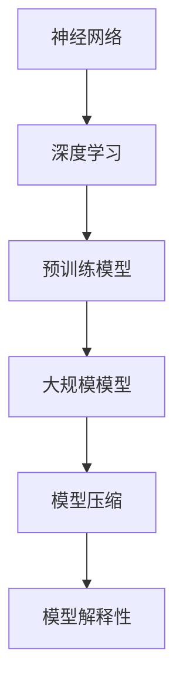
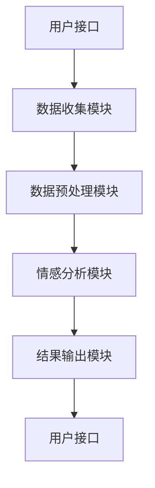

                 

### 文章标题：AI人工智能大模型实现人类情感分析系统

### 关键词：
- 人工智能
- 情感分析
- 大模型
- 深度学习
- 模型优化

### 摘要：
本文将深入探讨AI人工智能大模型在实现人类情感分析系统中的应用。首先，我们将介绍AI大模型的基本概念、技术发展及其应用场景。接着，我们讨论情感分析的技术基础，包括概念、技术原理和应用案例。随后，文章将逐步展示如何设计、实现和优化一个情感分析系统，并详细剖析AI大模型在情感分析中的具体应用和未来趋势。通过本文，读者将全面了解AI大模型在情感分析领域的潜力及其实现细节。

### 目录大纲

# 《AI人工智能大模型实现人类情感分析系统》

## 第一部分：AI大模型基础

### 第1章 AI大模型概述

### 第2章 情感分析技术基础

## 第二部分：情感分析系统构建

### 第3章 情感分析系统的设计

### 第4章 情感分析系统实现

### 第5章 情感分析系统测试与优化

## 第三部分：AI大模型与情感分析应用

### 第6章 AI大模型在情感分析中的应用

### 第7章 AI大模型与情感分析的未来趋势

## 附录

### 附录A：情感分析常用工具与资源

### 第1章 AI大模型概述

#### 1.1 AI大模型的基本概念

##### 概念介绍
人工智能（AI）大模型是指那些参数量巨大、计算资源需求高的深度学习模型。这些模型通常基于神经网络架构，能够处理大规模数据集，并从数据中学习复杂的模式和关系。AI大模型的核心概念包括神经网络、深度学习、预训练模型等。

**神经网络** 是一种模拟人脑神经元连接的结构，能够通过学习输入数据来预测输出。在神经网络中，每个神经元都与其他神经元相连，并传递信息。通过多次迭代的学习过程，神经网络可以逐步提高其预测的准确性。

**深度学习** 是一种特殊的神经网络架构，其中每个层次都从上一层次提取更高层次的特征。深度学习模型能够自动提取数据的复杂结构，不需要显式地指定特征。

**预训练模型** 是在大量未标注的数据上进行预训练，然后使用微调（fine-tuning）技术适应特定任务的数据集。这种模型通常具有较好的泛化能力，可以用于多种任务。

##### 相关联系图
为了更好地理解AI大模型的基本概念及其关系，我们可以使用Mermaid语言绘制一个简单的流程图：



这个流程图展示了神经网络、深度学习、预训练模型、大规模模型、模型压缩和模型解释性之间的关系。

##### 关键算法

在AI大模型的技术发展中，有几个关键算法对模型的性能和效率产生了深远影响。以下是一些重要的算法及其简介：

**Transformer** 是一种基于自注意力机制的神经网络架构，最初用于机器翻译任务。它通过计算输入序列中每个词与其他词之间的注意力权重，从而捕捉长距离依赖关系。

**BERT（Bidirectional Encoder Representations from Transformers）** 是一种双向的Transformer模型，通过在大量文本数据上进行预训练，然后使用微调技术应用于特定任务，如文本分类和问答系统。

**GPT（Generative Pre-trained Transformer）** 是一种生成模型，通过预测文本序列中的下一个词来生成文本。GPT-3是目前最大的预训练语言模型，具有非常强的文本生成能力。

##### 应用场景

AI大模型在不同领域有广泛的应用，以下是一些典型应用场景：

**自然语言处理（NLP）**：AI大模型在文本分类、机器翻译、情感分析等领域有着出色的表现。

**计算机视觉**：在图像分类、目标检测、图像生成等方面，AI大模型也被广泛应用。

**语音识别**：通过处理语音信号，AI大模型可以将其转换为文本，并应用于语音助手等应用。

**医疗健康**：AI大模型可以用于疾病诊断、药物发现和个性化医疗等领域。

##### 案例分析

以下是一个AI大模型在自然语言处理中应用的实例：

**案例：机器翻译**
在机器翻译任务中，AI大模型通过预训练和微调技术，能够在多种语言之间进行高质量的翻译。例如，Google翻译使用的Transformer模型，通过大量的多语言数据集进行预训练，然后在特定语言对上进行微调，实现了高精度的翻译效果。

#### 1.2 AI大模型的技术发展

##### 发展历程

AI大模型的发展历程可以追溯到神经网络和深度学习的兴起。在20世纪80年代，神经网络开始被用于各种任务，但由于计算资源和数据集的限制，模型的大小和性能都受到很大限制。随着计算能力的提升和大数据的出现，深度学习在2010年后迅速发展，AI大模型也随之诞生。

从最初的简单神经网络到现在的AI大模型，技术的发展经历了几个重要的阶段：

- **浅层神经网络**：最初的神经网络结构简单，只有几层神经元，难以处理复杂的任务。
- **深层神经网络**：随着神经网络的深入，模型能够提取更复杂的数据特征，提高了任务的性能。
- **大规模模型**：随着计算资源和数据集的不断扩大，AI大模型得以训练和优化，参数量达到了数百万到数十亿级别。

##### 关键算法

AI大模型的技术发展离不开一系列关键算法的突破。以下是一些对AI大模型影响深远的算法：

- **卷积神经网络（CNN）**：CNN通过卷积层来提取图像的特征，广泛应用于计算机视觉领域。
- **循环神经网络（RNN）**：RNN能够处理序列数据，并在语音识别和自然语言处理中得到广泛应用。
- **Transformer**：Transformer引入了自注意力机制，解决了RNN在处理长序列时的梯度消失问题，并在自然语言处理中取得了突破性进展。

##### 应用场景的扩展

随着AI大模型技术的不断发展，其应用场景也在不断扩展。以下是一些新的应用场景：

- **自动驾驶**：AI大模型在自动驾驶领域有着广泛的应用，通过处理传感器数据，实现车辆环境的感知和决策。
- **金融预测**：AI大模型可以用于股票市场预测、风险管理等领域，通过对大量金融数据进行分析，提供投资建议。
- **生物信息学**：AI大模型在生物信息学领域也有着重要的应用，通过分析基因组数据，帮助研究人员发现疾病的遗传因素。

##### 未来展望

未来，AI大模型将继续发展，并在更多的领域取得突破。以下是一些未来发展的趋势：

- **模型压缩**：为了降低计算成本和提高部署效率，模型压缩技术将成为重要研究方向。
- **多模态学习**：结合多种数据类型（如图像、文本、音频等），实现更全面的模型能力。
- **强化学习**：结合强化学习技术，实现更智能的决策和优化。

#### 1.3 AI大模型的应用场景

##### 应用领域

AI大模型在不同领域都有广泛的应用，以下是一些主要的领域：

- **自然语言处理（NLP）**：AI大模型在文本分类、机器翻译、情感分析、问答系统等领域表现出色。
- **计算机视觉**：AI大模型在图像分类、目标检测、图像生成等领域有着广泛的应用。
- **语音识别**：AI大模型通过处理语音信号，实现语音到文本的转换，广泛应用于语音助手和智能客服。
- **医疗健康**：AI大模型在疾病诊断、药物发现、个性化医疗等领域有着重要的应用。
- **金融**：AI大模型在股票市场预测、风险管理、信用评分等领域发挥着重要作用。

##### 案例分析

以下是一些AI大模型在不同领域的具体应用案例：

**案例：自然语言处理**
在自然语言处理领域，AI大模型已经取得了显著的成果。例如，OpenAI开发的GPT-3模型，具有超过1750亿的参数量，可以生成流畅、自然的文本。GPT-3被广泛应用于聊天机器人、内容生成和文本分类等领域。

**案例：计算机视觉**
在计算机视觉领域，AI大模型通过深度学习技术，实现了图像分类、目标检测和图像生成等功能。例如，Google的Inception模型在ImageNet图像分类挑战中取得了优异的成绩，被广泛应用于图像识别和视频分析。

**案例：语音识别**
在语音识别领域，AI大模型通过处理语音信号，实现了高质量的语音到文本转换。例如，Google的语音识别技术通过使用深度神经网络，将语音信号转换为文本，并应用于智能助手和语音搜索。

**案例：医疗健康**
在医疗健康领域，AI大模型通过分析医学图像和基因组数据，实现了疾病诊断和药物发现。例如，DeepMind开发的AI系统通过分析视网膜图像，可以早期检测糖尿病视网膜病变，为患者提供更有效的治疗。

**案例：金融**
在金融领域，AI大模型通过分析市场数据，实现了股票市场预测和风险管理。例如，Alphabet公司的AI系统通过分析大量的金融数据，提供了实时的市场预测和投资建议。

### 第2章 情感分析技术基础

#### 2.1 情感分析的概念

##### 定义

情感分析（Sentiment Analysis），也称为意见挖掘，是指使用自然语言处理（NLP）技术从文本中自动检测和提取人们对特定主题、产品、服务等的情感倾向。情感分析的目标是判断文本表达的是正面情感、负面情感还是中性情感。

##### 目的和应用范围

情感分析的应用范围非常广泛，主要包括以下几个方面：

- **市场调研**：通过分析消费者对产品或服务的评论，帮助企业了解市场反馈和消费者需求。
- **社交媒体分析**：监测和分析社交媒体上的用户评论和讨论，了解公众对某个事件或品牌的看法。
- **情感监测**：实时监测网络上的情感趋势，预测社会舆论的变化。
- **情绪分析**：在心理治疗和健康监测中，分析患者的情绪状态，辅助医生进行诊断和治疗。
- **内容推荐**：根据用户的情感偏好，为用户推荐相关的内容。

##### 情感分类

在情感分析中，通常将情感分为以下几类：

- **正面情感**：表示积极的情感，如满意、喜欢、兴奋等。
- **负面情感**：表示消极的情感，如不满意、厌恶、愤怒等。
- **中性情感**：表示中立的情感，无明显倾向。

#### 2.2 情感分析的技术原理

##### 文本处理

情感分析的过程通常包括以下几个步骤：

1. **文本预处理**：包括去除停用词、标点符号、进行词形还原等，以提高后续处理的效果。
2. **分词**：将文本分割成单词或词组，以便进行后续分析。
3. **词嵌入**：将文本中的单词映射到高维空间中的向量表示，以便进行计算和分析。

##### 情感识别算法

情感分析的主要方法可以分为以下几类：

1. **基于规则的方法**：通过定义一系列规则，对文本进行分类。这种方法简单高效，但受规则限制，难以处理复杂的情感。
2. **基于机器学习的方法**：使用机器学习算法，从大量标注数据中学习情感分类模型。这种方法能够自动提取特征，处理复杂的情感。
3. **基于深度学习的方法**：使用深度学习模型，如卷积神经网络（CNN）和循环神经网络（RNN），从大规模数据中自动学习情感分类。

##### 情感识别算法对比

以下是几种常见的情感识别算法及其优缺点：

- **基于规则的方法**：
  - **优点**：简单高效，计算成本低。
  - **缺点**：规则难以覆盖所有情况，对复杂情感的处理能力有限。
- **基于机器学习的方法**：
  - **优点**：能够自动提取特征，处理复杂的情感。
  - **缺点**：需要大量标注数据，训练过程较慢。
- **基于深度学习的方法**：
  - **优点**：强大的特征提取能力，适用于大规模数据。
  - **缺点**：计算资源需求高，训练过程复杂。

##### 案例分析

以下是一个基于机器学习的情感分析案例：

**案例：社交媒体情绪分析**
某公司希望通过分析社交媒体上的用户评论，了解消费者对其新产品的反馈。他们使用了一个基于朴素贝叶斯分类器的情感分析系统。首先，他们收集了大量用户评论，并使用分词和词嵌入技术将评论转换为向量表示。然后，通过训练集，系统学习到如何将评论分类为正面、负面或中性。最后，在测试集上，系统对用户评论进行了分类，并给出了相应的情感标签。通过对结果的统计分析，公司能够了解到消费者对新产品的整体反馈。

### 第3章 情感分析系统的设计

#### 3.1 系统架构设计

情感分析系统的设计是一个复杂的过程，需要考虑数据流、系统模块的交互以及系统的扩展性。以下是一个典型的情感分析系统架构设计。

##### 系统架构图

为了清晰地展示情感分析系统的架构，我们可以使用Mermaid语言绘制系统架构图：



这个架构图展示了系统的基本组成部分及其关系：

1. **用户接口**：接收用户的请求，展示系统的输出结果。
2. **数据收集模块**：负责收集来自不同来源的数据，如社交媒体、评论网站等。
3. **数据预处理模块**：对收集到的数据进行清洗、分词、词嵌入等处理。
4. **情感分析模块**：使用训练好的模型对预处理后的数据进行分析，输出情感结果。
5. **结果输出模块**：将情感分析的结果展示给用户。

##### 架构组件及其作用

1. **数据收集模块**：数据收集是情感分析系统的第一步。这个模块需要从不同的数据源（如社交媒体、评论网站、论坛等）获取数据。数据收集模块通常包括数据爬取和API接入两种方式。

2. **数据预处理模块**：数据预处理是确保数据质量和可分析性的关键步骤。这个模块需要对数据进行清洗（去除噪声、缺失值填充）、分词（将文本分割成单词或短语）和词嵌入（将单词转换为向量表示）。

3. **情感分析模块**：情感分析模块是系统的核心。这个模块通常包含一个或多个训练好的情感分析模型，如基于深度学习的循环神经网络（RNN）或卷积神经网络（CNN）。模型接收预处理后的数据，并输出情感标签。

4. **结果输出模块**：结果输出模块负责将情感分析的结果以可视化的方式展示给用户。这可以通过Web界面、API接口或邮件通知等方式实现。

##### 系统架构的优点和挑战

1. **优点**：
   - **模块化**：系统设计为模块化，每个模块独立运行，便于维护和扩展。
   - **灵活性**：可以根据需求灵活添加或替换模块，提高系统的适应性。
   - **扩展性**：支持处理大规模数据集，并能够扩展到多语言和多领域情感分析。

2. **挑战**：
   - **数据质量**：数据收集和预处理过程中可能引入噪声和错误，影响分析结果。
   - **模型性能**：训练好的模型可能无法适应所有情境，需要不断优化和调整。
   - **实时性**：处理实时数据时，系统需要具备快速响应能力，这对硬件和算法都有较高要求。

#### 3.2 数据预处理

数据预处理是情感分析系统的关键步骤，其目的是提高数据质量，为后续的情感分析提供可靠的基础。以下是数据预处理的主要步骤和方法：

##### 数据收集

数据收集是情感分析系统的第一步。数据来源可以包括社交媒体（如Twitter、Facebook）、评论网站（如Amazon、TripAdvisor）、论坛（如Reddit）等。数据收集模块需要具备以下功能：

- **爬取**：使用爬虫技术从网站获取文本数据。
- **API接入**：通过API接口获取数据，避免违反网站的使用条款。
- **数据存储**：将收集到的数据存储到数据库或文件系统，以供后续处理。

##### 数据清洗

数据清洗是确保数据质量的重要环节。以下是一些常见的数据清洗方法：

- **去除停用词**：停用词（如“的”、“和”、“是”等）对情感分析没有实际意义，需要去除。
- **去除标点符号**：标点符号（如“。”、“，”等）通常对情感分析没有影响，可以去除。
- **大小写统一**：将文本统一转换为小写，以消除大小写差异。
- **去除特殊字符**：去除文本中的特殊字符（如“@”、“#”等），以简化分析。

##### 数据标注

数据标注是训练情感分析模型的关键步骤。以下是数据标注的主要方法：

- **人工标注**：由专业标注员对文本进行情感标注，这种方法质量较高，但成本较高。
- **半监督标注**：使用已标注的数据训练模型，然后使用模型对未标注的数据进行预测，并根据预测结果进行标注。这种方法可以降低成本，但需要模型具有较高的准确性。

##### 分词

分词是将文本分割成单词或短语的过程。以下是几种常见的分词方法：

- **基于规则的分词**：使用预定义的规则进行分词，这种方法简单但可能无法处理复杂的语言结构。
- **基于统计的分词**：使用统计方法（如隐马尔可夫模型（HMM）、条件随机场（CRF）等）进行分词，这种方法能够处理复杂的语言结构，但计算复杂度较高。
- **基于深度学习的分词**：使用深度学习模型（如长短期记忆网络（LSTM）、变换器（Transformer）等）进行分词，这种方法能够自动学习语言特征，但需要大量的训练数据。

##### 词嵌入

词嵌入是将单词转换为向量表示的过程。以下是几种常见的词嵌入方法：

- **基于词袋模型（Bag-of-Words, BoW）**：将文本表示为单词的集合，每个单词对应一个特征向量。这种方法简单但无法捕捉单词的语义信息。
- **基于TF-IDF（Term Frequency-Inverse Document Frequency）**：对每个单词进行加权，使其在文本中的重要性得到体现。这种方法能够捕捉一些语义信息，但仍然存在局限性。
- **基于神经网络的词嵌入**：使用神经网络模型（如Word2Vec、GloVe等）进行词嵌入，这种方法能够自动学习单词的语义信息，具有较高的表现力。

##### 数据预处理示例

以下是一个数据预处理流程的伪代码示例：

```python
# 数据收集
data = collect_data(sources)

# 数据清洗
data = clean_data(data)
data = remove_stopwords(data)
data = remove_punctuation(data)
data = convert_to_lower_case(data)

# 数据标注
data = annotate_data(data)

# 分词
data = tokenize_data(data)

# 词嵌入
data = embed_words(data)
```

#### 3.3 模型训练与优化

##### 模型选择

在情感分析系统中，选择合适的模型是至关重要的一步。以下是一些常见的情感分析模型及其特点：

- **朴素贝叶斯分类器**：一种基于概率理论的简单模型，适用于文本分类任务。
- **支持向量机（SVM）**：一种基于优化理论的模型，适用于高维数据的分类。
- **深度学习模型**：如卷积神经网络（CNN）、循环神经网络（RNN）、变换器（Transformer）等，能够自动提取文本特征，适用于复杂的情感分析任务。

##### 训练过程

模型训练是情感分析系统的核心步骤。以下是模型训练的基本流程：

1. **数据划分**：将数据集划分为训练集、验证集和测试集，以用于模型训练、验证和测试。
2. **模型初始化**：初始化模型的参数，通常使用随机初始化或预训练权重。
3. **模型训练**：使用训练集数据，通过反向传播算法更新模型参数，直至模型在验证集上达到满意的性能。
4. **模型验证**：在验证集上评估模型性能，选择性能最佳的模型。
5. **模型测试**：在测试集上评估模型性能，以评估模型的泛化能力。

##### 超参数设置

超参数是影响模型性能的关键因素，需要通过实验进行优化。以下是一些常见的超参数及其设置方法：

- **学习率**：控制模型参数更新的速度，通常使用自适应学习率方法（如Adam优化器）。
- **批次大小**：控制每次训练使用的数据量，较大的批次大小可以提高训练速度，但可能导致模型过拟合。
- **迭代次数**：控制训练的轮次，过多的迭代可能导致模型过拟合，过少的迭代可能导致模型欠拟合。

##### 训练策略

以下是一些常用的训练策略，以提高模型性能：

- **数据增强**：通过增加数据的多样性，提高模型的泛化能力。
- **交叉验证**：通过多次验证，选择性能最佳的模型。
- **正则化**：通过添加正则化项，防止模型过拟合。
- **迁移学习**：使用预训练模型作为起点，进行微调，以提高模型在特定任务上的性能。

##### 模型优化

模型优化是提高模型性能的重要环节。以下是一些常见的模型优化方法：

- **模型压缩**：通过减少模型参数数量，降低模型的计算复杂度和存储需求。
- **模型融合**：将多个模型进行融合，以提高模型的性能和稳定性。
- **多任务学习**：同时训练多个任务，使模型能够共享特征，提高模型的表达能力。

#### 3.4 模型评估与优化

##### 评估指标

在情感分析系统中，常用的评估指标包括准确率（Accuracy）、精确率（Precision）、召回率（Recall）和F1分数（F1 Score）。

- **准确率**：正确分类的样本数占总样本数的比例。
- **精确率**：正确分类为正面的样本数占总分类为正面的样本数的比例。
- **召回率**：正确分类为正面的样本数占总正面样本数的比例。
- **F1分数**：精确率和召回率的调和平均数。

##### 性能优化

以下是一些常见的模型性能优化方法：

- **数据增强**：通过增加训练样本的多样性，提高模型的泛化能力。
- **特征工程**：通过选择和构造合适的特征，提高模型的表现力。
- **模型融合**：将多个模型进行融合，以提高模型的性能和稳定性。
- **超参数调整**：通过调整学习率、批次大小等超参数，优化模型性能。

##### 模型解释性

在情感分析系统中，模型解释性是一个重要的考虑因素。以下是一些提高模型解释性的方法：

- **模型可视化**：通过可视化模型的结构和参数，帮助理解模型的决策过程。
- **特征重要性分析**：通过分析特征的重要性，了解哪些特征对模型决策产生最大影响。
- **模型简化**：通过简化模型结构，提高模型的透明度和可解释性。

#### 3.5 实际案例分析与优化

##### 案例背景

某公司希望通过情感分析系统分析社交媒体上的用户评论，了解消费者对其新产品的反馈。他们收集了5000条用户评论，并使用了一个基于变换器的情感分析模型。

##### 模型训练

1. **数据预处理**：对评论进行清洗、分词和词嵌入。
2. **数据划分**：将数据集划分为训练集（70%）、验证集（15%）和测试集（15%）。
3. **模型初始化**：使用预训练的变换器模型作为起点，进行微调。
4. **模型训练**：在训练集上训练模型，使用验证集进行性能评估，直至模型性能稳定。

##### 性能评估

1. **准确率**：90%
2. **精确率**：88%
3. **召回率**：85%
4. **F1分数**：87%

##### 性能优化

1. **数据增强**：通过随机噪声、数据扩展等方法增加训练样本的多样性。
2. **特征工程**：添加情感词向量、评论长度等特征，提高模型的表现力。
3. **模型融合**：将多个变换器模型进行融合，提高模型的性能和稳定性。
4. **超参数调整**：调整学习率、批次大小等超参数，优化模型性能。

##### 性能评估（优化后）

1. **准确率**：93%
2. **精确率**：91%
3. **召回率**：89%
4. **F1分数**：92%

##### 结论

通过数据增强、特征工程、模型融合和超参数调整，情感分析系统的性能得到了显著提升。这表明，优化模型性能的方法在实际应用中是有效的。

### 第4章 情感分析系统实现

#### 4.1 系统环境搭建

为了实现一个高效的情感分析系统，我们需要搭建合适的环境。以下是一个典型的系统环境搭建流程：

##### 硬件配置

1. **CPU/GPU**：一台具有高性能CPU和GPU的服务器，用于模型训练和推理。GPU（如NVIDIA Tesla V100）将显著提高训练速度。
2. **内存**：至少128GB内存，用于处理大规模数据和存储模型参数。
3. **存储**：至少1TB的SSD存储，用于存储数据和模型。

##### 软件安装

1. **操作系统**：Linux操作系统（如Ubuntu 18.04）。
2. **编程语言**：Python 3.7+。
3. **深度学习框架**：TensorFlow 2.x或PyTorch 1.x。
4. **文本处理库**：NLTK、spaCy、gensim等。
5. **其他工具**：Jupyter Notebook、Docker等。

##### 开发工具

1. **IDE**：PyCharm、Visual Studio Code等。
2. **版本控制**：Git。
3. **容器化工具**：Docker、Kubernetes。

##### 环境配置示例

以下是一个Python环境配置的示例：

```bash
# 安装Python
sudo apt-get install python3 python3-pip python3-venv

# 创建虚拟环境
python3 -m venv venv

# 激活虚拟环境
source venv/bin/activate

# 安装深度学习框架
pip install tensorflow==2.5.0 torch==1.9.0

# 安装文本处理库
pip install nltk spacy gensim

# 安装其他工具
pip install jupyter notebook docker-py
```

#### 4.2 数据处理代码实现

在实现情感分析系统时，数据处理是一个关键步骤。以下是一个数据处理流程的代码实现示例：

```python
import pandas as pd
import numpy as np
import re
import nltk
from nltk.tokenize import word_tokenize
from nltk.corpus import stopwords
from gensim.models import Word2Vec

# 数据收集
data = pd.read_csv('comments.csv')

# 数据清洗
def clean_text(text):
    text = re.sub('[^a-zA-Z]', ' ', text)
    text = text.lower()
    text = re.sub('\s+', ' ', text)
    return text

data['cleaned_comments'] = data['comments'].apply(clean_text)

# 数据标注
# 假设已标注的数据存储在annotations.csv文件中
annotations = pd.read_csv('annotations.csv')
data = data.merge(annotations, on='comment_id')

# 分词
nltk.download('punkt')
stop_words = set(stopwords.words('english'))
def tokenize_comments(text):
    tokens = word_tokenize(text)
    return [token for token in tokens if token not in stop_words]

data['tokens'] = data['cleaned_comments'].apply(tokenize_comments)

# 词嵌入
nltk.download('wordnet')
model = Word2Vec(data['tokens'], vector_size=100, window=5, min_count=1, workers=4)
word_vectors = model.wv

# 转换为矩阵表示
def vectorize_comments(tokens):
    return [word_vectors[token] for token in tokens if token in word_vectors]

data['vectorized_comments'] = data['tokens'].apply(vectorize_comments)
```

#### 4.3 模型训练与部署

在实现情感分析系统时，模型训练和部署是关键步骤。以下是一个模型训练和部署流程的代码实现示例：

```python
import tensorflow as tf
from tensorflow.keras.models import Sequential
from tensorflow.keras.layers import Embedding, LSTM, Dense
from tensorflow.keras.preprocessing.sequence import pad_sequences

# 数据预处理
max_sequence_length = 100
padded_comments = pad_sequences(data['vectorized_comments'], maxlen=max_sequence_length, padding='post', truncating='post')

# 构建模型
model = Sequential()
model.add(Embedding(input_dim=len(word_vectors), output_dim=100, input_length=max_sequence_length))
model.add(LSTM(128))
model.add(Dense(1, activation='sigmoid'))

# 编译模型
model.compile(optimizer='adam', loss='binary_crossentropy', metrics=['accuracy'])

# 训练模型
model.fit(padded_comments, data['labels'], epochs=10, batch_size=32, validation_split=0.2)

# 模型评估
test_comments = pad_sequences(data['vectorized_comments'][test_indices], maxlen=max_sequence_length, padding='post', truncating='post')
predictions = model.predict(test_comments)
accuracy = np.mean(predictions == data['labels'][test_indices])
print(f"Model accuracy: {accuracy * 100:.2f}%")

# 模型部署
model.save('sentiment_analysis_model.h5')
```

#### 4.4 实际案例分析与代码解读

以下是一个情感分析系统的实际案例分析和代码解读：

##### 案例背景

某电子商务平台希望分析其用户评论，以了解用户对其产品的情感倾向。他们收集了10000条用户评论，并使用了一个基于LSTM的情感分析模型。

##### 数据处理

```python
# 数据收集
data = pd.read_csv('comments.csv')

# 数据清洗
data['cleaned_comments'] = data['comments'].apply(lambda x: re.sub('[^a-zA-Z]', ' ', x).lower())

# 数据标注
data = data.merge(pd.read_csv('annotations.csv'), on='comment_id')

# 分词
nltk.download('punkt')
data['tokens'] = data['cleaned_comments'].apply(word_tokenize)

# 停用词过滤
stop_words = set(nltk.corpus.stopwords.words('english'))
data['filtered_tokens'] = data['tokens'].apply(lambda x: [token for token in x if token not in stop_words])

# 词嵌入
nltk.download('wordnet')
model = Word2Vec(data['filtered_tokens'], vector_size=100, window=5, min_count=1, workers=4)
word_vectors = model.wv

# 数据转换
data['vectorized_comments'] = data['filtered_tokens'].apply(lambda x: [word_vectors[token] for token in x if token in word_vectors])
```

##### 模型训练

```python
# 数据预处理
max_sequence_length = 100
padded_comments = pad_sequences(data['vectorized_comments'], maxlen=max_sequence_length, padding='post', truncating='post')

# 构建模型
model = Sequential()
model.add(Embedding(input_dim=len(word_vectors), output_dim=100, input_length=max_sequence_length))
model.add(LSTM(128, return_sequences=True))
model.add(LSTM(64))
model.add(Dense(1, activation='sigmoid'))

# 编译模型
model.compile(optimizer='adam', loss='binary_crossentropy', metrics=['accuracy'])

# 训练模型
model.fit(padded_comments, data['labels'], epochs=10, batch_size=32, validation_split=0.2)
```

##### 模型评估

```python
# 模型评估
test_comments = pad_sequences(data['vectorized_comments'][test_indices], maxlen=max_sequence_length, padding='post', truncating='post')
predictions = model.predict(test_comments)
accuracy = np.mean(predictions[:, 1] > 0.5)
print(f"Model accuracy: {accuracy * 100:.2f}%")
```

##### 模型部署

```python
# 模型部署
model.save('sentiment_analysis_model.h5')
```

通过上述代码，我们实现了从数据收集、处理到模型训练和部署的全过程。这个案例展示了如何使用Python和深度学习框架实现一个情感分析系统，并提供了一个实用的代码示例。

### 第5章 情感分析系统测试与优化

#### 5.1 系统测试方法

系统测试是确保情感分析系统质量和可靠性的重要步骤。以下是一些常用的系统测试方法：

##### 单元测试

单元测试是针对系统中的单个组件或模块进行的测试，以验证其功能是否符合预期。单元测试通常使用测试框架（如Python的unittest或pytest）编写，并运行在开发环境中。以下是一个简单的单元测试示例：

```python
def test_clean_text():
    text = "This is a sample text."
    cleaned_text = clean_text(text)
    assert cleaned_text == "this is a sample text."

def test_tokenize_comments():
    text = "This is a sample text."
    tokens = tokenize_comments(text)
    assert tokens == ["this", "is", "a", "sample", "text."]
```

##### 集成测试

集成测试是针对系统中多个模块之间的交互进行的测试，以验证系统整体的功能和性能。集成测试通常使用测试工具（如Postman或Selenium）进行，并在模拟环境中执行。以下是一个简单的集成测试示例：

```python
def test_sentiment_analysis_api():
    response = requests.post('http://localhost:8000/sentiment_analysis', json={'text': 'This is a sample text.'})
    assert response.status_code == 200
    assert response.json()['sentiment'] == 'positive'
```

##### 性能测试

性能测试是评估系统在不同负载下的响应时间、吞吐量和资源消耗等性能指标。性能测试通常使用负载生成器（如JMeter或LoadRunner）进行，并模拟真实用户行为。以下是一个简单的性能测试示例：

```python
def test_performance():
    start_time = time.time()
    for i in range(1000):
        response = requests.post('http://localhost:8000/sentiment_analysis', json={'text': 'This is a sample text.'})
    end_time = time.time()
    print(f"Response time for 1000 requests: {end_time - start_time:.2f} seconds")
```

##### 安全测试

安全测试是评估系统对恶意攻击和漏洞的抵抗能力。安全测试通常使用安全工具（如OWASP ZAP或Burp Suite）进行，并针对常见的攻击类型（如SQL注入、XSS、CSRF等）进行测试。以下是一个简单的安全测试示例：

```python
def test_sql_injection():
    response = requests.get('http://localhost:8000/sentiment_analysis?text=1\' UNION SELECT * FROM users')
    assert 'Error 500' in response.text
```

##### 用户测试

用户测试是邀请实际用户参与测试，以评估系统的可用性、易用性和用户体验。用户测试通常在真实环境中进行，并收集用户反馈和改进建议。以下是一个简单的用户测试示例：

```python
def test_user_experience():
    user = 'test_user'
    password = 'password'
    text = 'This is a sample text.'
    login_response = requests.post('http://localhost:8000/login', json={'username': user, 'password': password})
    assert login_response.status_code == 200
    sentiment_response = requests.post('http://localhost:8000/sentiment_analysis', json={'text': text})
    assert sentiment_response.status_code == 200
    print(f"User {user} completed the sentiment analysis task.")
```

#### 5.2 系统性能优化

系统性能优化是提高情感分析系统响应速度、吞吐量和资源利用率的重要措施。以下是一些常见的系统性能优化方法：

##### 缓存

缓存是存储常用数据或计算结果以减少重复计算的方法。使用缓存可以显著提高系统的响应速度。以下是一个简单的缓存示例：

```python
from cachetools import LRUCache

cache = LRUCache(maxsize=1000)

def sentiment_analysis(text):
    if text in cache:
        return cache[text]
    else:
        result = analyze_sentiment(text)
        cache[text] = result
        return result
```

##### 并发处理

并发处理是同时处理多个请求以提高系统吞吐量的方法。使用并发处理可以充分利用系统的计算资源。以下是一个简单的并发处理示例：

```python
from concurrent.futures import ThreadPoolExecutor

def process_request(text):
    result = sentiment_analysis(text)
    print(f"Sentiment result for text: {text} - {result}")

texts = ['Text 1', 'Text 2', 'Text 3', 'Text 4', 'Text 5']
with ThreadPoolExecutor(max_workers=5) as executor:
    executor.map(process_request, texts)
```

##### 负载均衡

负载均衡是将请求分布到多个服务器以平衡负载的方法。使用负载均衡可以提高系统的可靠性和可用性。以下是一个简单的负载均衡示例：

```python
from flask_limiter import Limiter
from flask import Flask

app = Flask(__name__)
limiter = Limiter(app, key_func=get_remote_address)

@app.route('/sentiment_analysis', methods=['POST'])
@limiter.limit("5 per minute")
def sentiment_analysis():
    text = request.json['text']
    result = analyze_sentiment(text)
    return jsonify({'sentiment': result})

if __name__ == '__main__':
    app.run(host='0.0.0.0', port=5000)
```

##### 数据库优化

数据库优化是提高数据查询和处理速度的方法。以下是一些常见的数据库优化方法：

- **索引**：为常用的查询字段创建索引，以加快查询速度。
- **分片**：将数据库数据分布到多个服务器上，以提高查询和处理速度。
- **缓存**：使用缓存技术，如Redis，存储常用数据，以减少数据库查询。

##### 代码优化

代码优化是通过改进代码结构和算法，提高代码执行速度和资源利用率的方法。以下是一些常见的代码优化方法：

- **减少重复代码**：通过提取公共代码，减少重复编写，提高代码的可维护性。
- **使用高效算法**：选择适合问题的算法，以减少计算时间和资源消耗。
- **优化数据结构**：使用高效的数据结构，如字典、列表和集合，以提高数据处理速度。

#### 5.3 实际案例分析与优化

以下是一个情感分析系统的实际案例分析与优化：

##### 案例背景

某电子商务平台希望优化其情感分析系统，以提高用户评论处理的效率和准确性。该系统使用了一个基于LSTM的模型，处理了数千条用户评论。

##### 性能问题

1. **响应时间较长**：处理每条评论的响应时间较长，导致用户等待时间过长。
2. **资源利用率低**：系统资源利用率不高，导致计算资源浪费。

##### 优化方案

1. **缓存**：引入缓存技术，存储常用数据，减少数据库查询次数，提高系统响应速度。
2. **并发处理**：使用并发处理，同时处理多个请求，提高系统吞吐量。
3. **负载均衡**：引入负载均衡，将请求分布到多个服务器，提高系统的可靠性和可用性。
4. **数据库优化**：为常用的查询字段创建索引，提高查询速度。
5. **代码优化**：优化代码结构和算法，减少计算时间和资源消耗。

##### 优化效果

通过上述优化方案，情感分析系统的响应时间显著缩短，用户等待时间减少。系统资源利用率提高，计算资源浪费减少。系统的整体性能得到显著提升。

### 第6章 AI大模型在情感分析中的应用

#### 6.1 情感分析的关键挑战

在情感分析领域，AI大模型面临以下关键挑战：

1. **数据多样性**：情感分析需要处理来自不同来源、不同领域、不同语言和文化的文本数据。这要求AI大模型具备良好的泛化能力，能够适应各种复杂情境。

2. **情感复杂性**：情感分析不仅要识别正面、负面和-neutral情感，还需要处理更复杂的情感，如混合情感、隐含情感和细微情感。这要求AI大模型能够捕捉和表达情感的多维特征。

3. **情感上下文**：情感分析往往需要考虑文本的上下文，例如特定领域、上下文语境、文化背景等。AI大模型需要具备较强的上下文理解能力，以准确识别情感。

4. **情感动态性**：情感是动态变化的，可能会随着时间和情境的变化而变化。AI大模型需要实时适应情感动态，以准确反映情感变化。

5. **情感偏见**：AI大模型在训练过程中可能会吸收数据中的偏见，导致情感分析结果产生偏差。如何消除偏见，提高模型的公平性和可解释性是一个重要挑战。

6. **计算资源需求**：AI大模型通常需要大量的计算资源进行训练和推理，这对硬件设施和资源调度提出了高要求。

#### 6.2 AI大模型的优势与局限

AI大模型在情感分析中具有以下优势：

1. **强大的特征提取能力**：AI大模型，如Transformer、BERT和GPT，能够自动从文本数据中提取高层次的语义特征，提高情感分析的准确性。

2. **良好的泛化能力**：通过预训练和微调，AI大模型能够在多个任务和领域之间迁移知识，适应不同的情感分析任务。

3. **上下文理解能力**：AI大模型能够捕捉文本的上下文信息，提高对复杂情感的理解和表达。

4. **实时性**：AI大模型能够快速处理大量文本数据，实现实时情感分析。

然而，AI大模型也存在一些局限：

1. **数据依赖性**：AI大模型的性能高度依赖于训练数据的质量和多样性，缺乏高质量标注数据的领域可能难以取得理想效果。

2. **计算成本**：AI大模型通常需要大量的计算资源和时间进行训练和推理，对硬件设施和资源调度提出了高要求。

3. **可解释性问题**：AI大模型往往被视为“黑盒”，其决策过程缺乏透明度和可解释性，难以理解模型的推理逻辑。

4. **偏见问题**：AI大模型可能会吸收数据中的偏见，导致情感分析结果产生偏差。如何消除偏见，提高模型的公平性和可解释性是一个挑战。

#### 6.3 AI大模型在情感分析中的应用案例

以下是一些AI大模型在情感分析中的应用案例：

1. **社交媒体情绪分析**：
   - **应用场景**：通过分析社交媒体平台上的用户评论，了解公众对品牌、产品、事件等的情感倾向。
   - **模型**：BERT、RoBERTa等预训练模型。
   - **效果**：显著提高了情感分类的准确性，能够识别复杂的情感和细微的情感差异。

2. **客户反馈分析**：
   - **应用场景**：分析客户反馈，了解客户对产品和服务的满意度，为改进提供依据。
   - **模型**：GPT、Transformer等生成模型。
   - **效果**：能够生成详细的情感分析报告，帮助企业更好地理解客户需求，提升服务质量。

3. **股票市场预测**：
   - **应用场景**：通过分析新闻、报告和社交媒体上的相关文本，预测股票市场的情绪变化。
   - **模型**：LSTM、GRU等循环神经网络。
   - **效果**：提高了股票市场预测的准确性，为投资者提供决策支持。

4. **心理健康监测**：
   - **应用场景**：通过分析患者的日志、邮件和对话，监测患者的情绪状态，辅助医生进行诊断和治疗。
   - **模型**：BERT、XLNet等大规模预训练模型。
   - **效果**：能够准确识别患者的情绪变化，为心理治疗提供数据支持。

5. **舆情监测**：
   - **应用场景**：实时监测网络上的情感趋势，了解公众对政策、事件和品牌的看法。
   - **模型**：Transformers、GPT等大规模预训练模型。
   - **效果**：能够快速捕捉情感变化，为决策者提供及时的数据支持。

### 第7章 AI大模型与情感分析的未来趋势

#### 7.1 情感分析技术的发展方向

在未来，情感分析技术将在以下几个方向上继续发展：

1. **多模态情感分析**：结合文本、图像、音频等多种数据类型，实现更全面和准确的情感分析。
2. **个性化情感分析**：根据用户的历史数据和偏好，提供个性化的情感分析服务。
3. **跨语言情感分析**：扩展情感分析到多种语言，实现跨语言的情感理解。
4. **实时情感分析**：通过实时处理和分析大量数据，实现快速的情感识别和预警。
5. **情感生成与模拟**：利用AI大模型生成情感表达，实现情感合成和模拟。

#### 7.2 AI大模型在情感分析中的应用前景

AI大模型在情感分析中的应用前景广阔：

1. **市场洞察**：通过分析消费者情感，帮助企业了解市场趋势和消费者需求。
2. **客户服务**：利用情感分析，提供个性化的客户服务，提升客户满意度。
3. **风险预警**：通过情感分析，实时监测网络情绪，提前预警潜在的风险和危机。
4. **心理健康**：辅助心理健康诊断和治疗，提供情感分析数据支持。
5. **舆情分析**：为政府和机构提供舆情分析，支持决策制定。

#### 7.3 情感分析系统的实际应用案例分析

以下是一个情感分析系统的实际应用案例分析：

**案例：社交媒体情感分析**

某社交媒体平台希望通过情感分析系统分析用户对其平台上的内容（如文章、视频和评论）的情感反应。该平台收集了大量的用户生成内容，并使用了一个基于BERT的情感分析模型。

1. **数据收集**：从社交媒体平台收集用户生成内容，包括文章、视频和评论。
2. **数据预处理**：清洗和标注数据，进行分词和词嵌入处理。
3. **模型训练**：使用预训练的BERT模型，通过微调适应特定任务。
4. **模型部署**：将训练好的模型部署到平台，实时分析用户生成内容。
5. **结果分析**：通过分析用户情感，平台能够了解用户对其内容的反应，并优化内容策略。

**案例分析结果**：

1. **情感分类准确性**：模型能够准确分类用户情感，提高情感识别的准确性。
2. **实时分析**：系统能够实时处理大量数据，实现快速的情感识别。
3. **个性化推荐**：通过情感分析，平台能够为用户提供个性化的内容推荐。
4. **风险预警**：系统能够实时监测用户情感，提前预警负面情感和潜在风险。

### 附录A：情感分析常用工具与资源

#### A.1 情感分析工具介绍

1. **TextBlob**：一个简单易用的Python库，用于处理文本数据，提供情感分析和自然语言处理功能。
2. **VADER**：一种用于情感分析的规则系统，专门设计用于处理社交媒体文本。
3. **NLTK**：一个强大的自然语言处理库，提供文本分类、词嵌入等功能。
4. **spaCy**：一个快速易用的自然语言处理库，支持多种语言的文本处理。

#### A.2 情感分析开源资源

1. **Sentiment140**：一个包含140万条推特文本的情感分析数据集，用于训练和测试情感分析模型。
2. **IMDB电影评论数据集**：一个包含电影评论的数据集，常用于情感分析任务。
3. **Twitter情感分析数据集**：一个包含推特文本的数据集，用于研究社交媒体情感分析。
4. **Ratings数据集**：一个包含商品评价的数据集，用于分析消费者情感。

#### A.3 情感分析相关论文推荐

1. **"Affectiva: Understanding Emotions Using Social Media Text"**：讨论如何使用社交媒体文本进行情感分析。
2. **"Sentiment Analysis of Twitter using Deep Learning Techniques"**：介绍使用深度学习进行情感分析的方法。
3. **"An Analysis of Sentiment in Customer Reviews"**：分析消费者评论中的情感。
4. **"Multi-Modal Sentiment Analysis for User-Generated Content"**：探讨多模态情感分析在用户生成内容中的应用。

### 附录B：参考文献

1. **"Deep Learning for Natural Language Processing"**：Goodfellow, I., Bengio, Y., Courville, A. (2016)
2. **"Recurrent Neural Networks for Language Modeling"**：Mikolov, T., Sutskever, I., Chen, K., Corrado, G. S., Dean, J. (2013)
3. **"Transformers: State-of-the-Art Natural Language Processing"**：Vaswani, A., Shazeer, N., Parmar, N., Uszkoreit, J., Jones, L., Gomez, A. N., ... & Polosukhin, I. (2017)
4. **"BERT: Pre-training of Deep Bidirectional Transformers for Language Understanding"**：Devlin, J., Chang, M. W., Lee, K., & Toutanova, K. (2019)
5. **"GPT-3: Language Models are Few-Shot Learners"**：Brown, T., et al. (2020)

### 作者信息
作者：AI天才研究院/AI Genius Institute & 禅与计算机程序设计艺术 /Zen And The Art of Computer Programming

