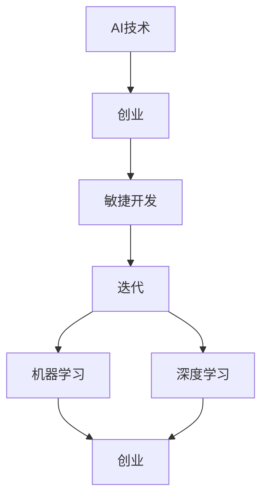

                 

### 文章标题：AI创业公司如何快速迭代产品

关键词：AI创业、快速迭代、产品开发、敏捷开发、机器学习、深度学习

摘要：本文将探讨AI创业公司如何通过敏捷开发与迭代方法快速改进其产品。我们将从AI与创业的背景出发，分析AI创业的挑战与机遇，详细介绍敏捷开发与迭代的核心概念和技术基础，分享AI创业公司成功的迭代案例，并探讨迭代过程中的风险管理、团队协作及未来发展趋势。

### 第一部分：AI与创业概述

#### 第1章：AI与创业概述

##### 1.1 AI创业的背景与机遇

人工智能（AI）技术的发展在过去几年取得了显著的进步。从深度学习、自然语言处理到计算机视觉，AI技术已经广泛应用于各个行业，包括医疗、金融、零售和制造业等。这一技术浪潮为创业者带来了前所未有的机遇。AI技术的引入不仅可以提升创业公司的竞争力，还可以创造新的商业模式和市场。

**1.1.1 AI技术发展现状**

近年来，AI技术的发展速度之快令人惊叹。以下是一些关键进展：

- **深度学习与神经网络**：深度学习技术的崛起，使得计算机在某些领域已经超越了人类的表现。例如，在图像识别、语音识别和自然语言处理等领域，深度学习模型已经达到了或超过了人类水平。
- **自然语言处理（NLP）**：NLP技术的发展使得计算机可以理解和生成人类语言。这一技术在智能客服、机器翻译和内容推荐等领域具有广泛的应用。
- **计算机视觉**：计算机视觉技术的发展使得计算机可以理解和解释视觉信息。应用包括自动驾驶汽车、安防监控和医疗图像分析等。

**1.1.2 AI在创业中的应用领域**

AI技术在创业中的应用非常广泛，以下是一些主要的应用领域：

- **金融科技**：利用AI进行风险管理、信用评估和算法交易等。
- **医疗健康**：通过AI进行疾病诊断、药物研发和医疗资源的优化分配。
- **零售电商**：利用AI进行个性化推荐、库存管理和客户服务。
- **制造与物流**：通过AI实现智能制造、自动化仓储和物流优化。
- **能源与环境**：利用AI进行能源管理、环境监测和资源优化。

**1.1.3 创业者面临的AI挑战**

虽然AI技术为创业提供了巨大的机遇，但创业者也面临着一些挑战：

- **技术复杂性**：AI技术涉及多个领域，包括数学、计算机科学和工程学等。创业者需要具备相应的技术背景或找到合适的技术合作伙伴。
- **数据需求**：AI模型通常需要大量数据来进行训练和验证。对于初创公司来说，获取高质量的数据可能是一项挑战。
- **人才短缺**：具备AI技能的人才非常稀缺，创业者需要花费大量的时间和资源来招聘和培养这些人才。
- **法规与伦理**：随着AI技术的发展，相关的法规和伦理问题也日益凸显。创业者需要确保他们的产品和服务符合法律法规和伦理标准。

##### 1.2 创业公司AI产品快速迭代的必要性

快速迭代是创业公司成功的关键之一。对于AI创业公司来说，快速迭代尤为重要，原因如下：

**1.2.1 市场变化与竞争压力**

市场变化非常迅速，新的竞争对手和产品不断涌现。如果AI创业公司不能及时响应市场变化，他们可能会失去竞争优势。通过快速迭代，AI创业公司可以及时调整产品方向和功能，以满足市场需求。

**1.2.2 用户需求的不确定性**

用户需求往往是不确定的，特别是在AI领域。通过快速迭代，AI创业公司可以不断收集用户反馈，了解用户的真实需求，并据此调整产品。

**1.2.3 技术快速更新的影响**

AI技术更新非常迅速，新的算法、框架和工具不断出现。通过快速迭代，AI创业公司可以及时采用这些新技术，提升产品的性能和功能。

##### 1.3 AI创业公司的组织与管理模式

为了实现快速迭代，AI创业公司需要采取合适的组织与管理模式。以下是一些关键点：

**1.3.1 创业团队构建**

AI创业公司的团队需要具备多样化的技能，包括算法、数据科学、软件开发和业务战略等。团队成员之间需要密切协作，共同推进项目。

**1.3.2 团队协作与沟通**

有效的团队协作和沟通对于快速迭代至关重要。AI创业公司可以采用敏捷开发方法，如Scrum或Kanban，以提高团队的工作效率。

**1.3.3 项目管理与敏捷开发**

敏捷开发方法强调快速响应变化和持续交付价值。AI创业公司可以通过采用敏捷开发方法，实现产品的快速迭代。

### 第二部分：AI产品快速迭代技术基础

#### 第2章：AI基础技术概览

##### 2.1 机器学习与深度学习基础

机器学习和深度学习是AI技术的核心。以下是对这些基础技术的简要介绍：

**2.1.1 机器学习基本概念**

机器学习（Machine Learning，ML）是一种让计算机通过数据学习并做出决策的技术。机器学习可以分为监督学习、无监督学习和强化学习。

- **监督学习**：在监督学习中，算法根据已知输入和输出数据进行学习，从而预测新的输入数据。
- **无监督学习**：在无监督学习中，算法没有明确的输出数据，而是通过数据本身的特征进行学习。
- **强化学习**：在强化学习中，算法通过与环境的交互来学习最优策略。

**2.1.2 深度学习核心算法**

深度学习（Deep Learning，DL）是一种特殊的机器学习技术，它使用多层神经网络来模拟人脑的决策过程。

- **卷积神经网络（CNN）**：CNN是用于图像识别和处理的核心算法。
- **循环神经网络（RNN）**：RNN适用于处理序列数据，如文本和语音。
- **生成对抗网络（GAN）**：GAN用于生成新的数据，如图像和文本。

**2.1.3 常见深度学习框架介绍**

深度学习框架是用于构建和训练深度学习模型的工具。以下是一些常见的深度学习框架：

- **TensorFlow**：由Google开发，是一个开源的深度学习框架，具有丰富的功能和社区支持。
- **PyTorch**：由Facebook开发，是一个易于使用和灵活的深度学习框架。
- **Keras**：是一个高层神经网络API，可以在TensorFlow和Theano上运行。

##### 2.2 数据预处理与特征工程

数据预处理和特征工程是机器学习和深度学习模型训练的重要步骤。以下是对这些步骤的简要介绍：

**2.2.1 数据清洗与数据预处理**

数据清洗是指处理数据中的噪声、缺失值和异常值等。数据预处理包括数据标准化、归一化和数据分割等。

- **数据标准化**：将数据缩放到相同的范围，以消除不同特征之间的量纲差异。
- **数据归一化**：将数据映射到特定的数值范围内，如[0, 1]或[-1, 1]。
- **数据分割**：将数据集分为训练集、验证集和测试集，以便进行模型训练和评估。

**2.2.2 特征选择与特征工程**

特征选择是指从原始数据中选择最有用的特征。特征工程是通过变换和构造新的特征来提升模型性能。

- **特征选择方法**：包括过滤方法、包装方法和嵌入方法。
- **特征变换**：如主成分分析（PCA）和特征映射。

**2.2.3 数据可视化与解释**

数据可视化是将数据转换为图表和图形，以便更容易理解和分析。数据解释是通过可视化工具来解释数据中的模式和趋势。

- **数据可视化工具**：如Matplotlib、Seaborn和Plotly。
- **数据解释方法**：如聚类分析和关联规则学习。

##### 2.3 模型训练与优化

模型训练和优化是机器学习和深度学习的关键步骤。以下是对这些步骤的简要介绍：

**2.3.1 模型训练过程**

模型训练是指使用训练数据集来调整模型参数，以最小化预测误差。

- **损失函数**：用于衡量模型预测与真实值之间的差异。
- **优化算法**：用于更新模型参数，以最小化损失函数。

**2.3.2 模型评估与选择**

模型评估是指使用验证集或测试集来评估模型性能。

- **评估指标**：如准确率、召回率、F1分数等。
- **模型选择**：根据评估结果选择最佳模型。

**2.3.3 模型优化策略**

模型优化是指使用各种策略来提升模型性能。

- **超参数调优**：通过调整模型的超参数来优化性能。
- **正则化**：通过添加正则项来防止模型过拟合。
- **增强学习**：通过学习策略来提升模型性能。

### 第三部分：快速迭代案例与实践

#### 第3章：敏捷开发与迭代方法

##### 3.1 敏捷开发理念与原则

敏捷开发（Agile Development）是一种以人为核心、迭代和渐进的方法，旨在快速响应变化并持续交付价值。以下是一些敏捷开发的核心理念与原则：

**3.1.1 敏捷开发的起源与发展**

敏捷开发起源于2001年，当时一些软件开发人员在反对传统的瀑布模型时提出了敏捷开发宣言。随着时间的推移，敏捷开发逐渐发展成为一种广泛接受的方法。

**3.1.2 敏捷开发的核心原则**

敏捷开发的核心原则包括：

- **个体和互动重于过程与工具**：敏捷开发强调团队协作和个人能力。
- **可工作的软件重于详尽的文档**：敏捷开发认为实际工作的软件比详细的文档更有价值。
- **客户合作重于合同谈判**：敏捷开发鼓励与客户的紧密合作。
- **响应变化重于遵循计划**：敏捷开发允许根据反馈调整计划。

**3.1.3 敏捷开发与传统开发模式的区别**

与传统开发模式相比，敏捷开发具有以下特点：

- **迭代与增量开发**：敏捷开发采用迭代和增量开发方式，而不是一次性的项目交付。
- **用户反馈**：敏捷开发重视用户反馈，并通过持续交付来满足用户需求。
- **灵活性和适应性**：敏捷开发允许根据反馈灵活调整计划，以应对不断变化的需求。

##### 3.2 迭代式产品开发流程

迭代式产品开发流程是敏捷开发的核心。以下是一个典型的迭代式产品开发流程：

**3.2.1 产品规划与需求分析**

在产品规划阶段，团队确定产品的愿景和目标。在需求分析阶段，团队收集用户需求并制定详细的用户故事。

**3.2.2 迭代开发与持续交付**

迭代开发是指将产品开发过程分解为多个短周期的迭代。在每个迭代中，团队完成一个或多个用户故事，并交付一个可工作的软件版本。

持续交付是指在整个产品开发过程中，定期交付可工作的软件版本，以便用户可以立即使用并反馈。

**3.2.3 用户反馈与持续改进**

用户反馈是敏捷开发的关键。通过收集用户反馈，团队可以识别问题并持续改进产品。

持续改进是指在整个产品生命周期中，不断优化产品和服务，以提高用户满意度和市场竞争力。

### 第四部分：未来展望与持续发展

#### 第4章：AI产品迭代与创业未来的发展

##### 4.1 未来展望

随着AI技术的不断进步，AI创业公司的未来发展将充满机遇和挑战。以下是一些未来展望：

**4.1.1 AI技术的进一步突破**

预计未来几年，AI技术将在以下几个方面取得重大突破：

- **自主学习与决策**：AI系统将能够自主学习和决策，减少对人类干预的需求。
- **多模态学习**：AI系统将能够同时处理不同类型的数据，如图像、文本和语音。
- **边缘计算与云计算的结合**：边缘计算将使得AI应用更加实时和高效，而云计算将提供强大的计算资源。

**4.1.2 新的商业模式与市场机会**

AI技术将催生新的商业模式和市场机会，如：

- **个性化服务与推荐系统**：利用AI进行个性化推荐和服务，提升用户体验。
- **自动化与智能化**：通过AI实现生产自动化和业务智能化，提高生产效率和竞争力。
- **智慧城市与物联网**：AI技术将使城市和物联网变得更加智能，提高城市管理和居民生活质量。

**4.1.3 持续迭代与产品创新**

AI创业公司需要持续迭代产品，以保持市场竞争力。以下是一些建议：

- **用户导向**：始终关注用户需求，快速响应市场变化。
- **技术创新**：不断探索新技术，以提升产品性能和用户体验。
- **团队协作**：加强团队协作，提高开发效率和产品质量。

##### 4.2 持续发展策略

为了实现持续发展，AI创业公司可以采取以下策略：

**4.2.1 技术研发投入**

持续投入技术研发，以保持技术领先地位。这包括招聘高水平的人才、购买先进的硬件设备和投资于前沿技术的研究。

**4.2.2 用户体验优化**

通过不断优化用户体验，提升用户满意度和忠诚度。这包括改进用户界面、优化用户交互流程和提供个性化的服务。

**4.2.3 市场拓展与合作伙伴**

积极拓展市场，寻找新的业务机会。与行业合作伙伴建立合作关系，共同开拓市场，实现共赢。

**4.2.4 创新文化**

建立创新文化，鼓励员工提出新的想法和解决方案。通过创新，不断突破现有业务模式，创造新的价值。

### 结束语

AI创业公司如何在快速迭代中保持竞争力，是每个创业者都需要面对的挑战。通过本文的探讨，我们了解了AI创业的背景与机遇，敏捷开发与迭代方法，以及如何通过持续发展和创新来保持竞争优势。希望本文能为您在AI创业的道路上提供一些启示和帮助。

### 作者信息

作者：AI天才研究院（AI Genius Institute） & 禅与计算机程序设计艺术（Zen And The Art of Computer Programming）

AI天才研究院致力于推动人工智能技术的发展和应用，助力创业者实现创新与突破。禅与计算机程序设计艺术则通过深入探讨计算机科学和哲学的融合，为编程者和开发者提供独特的视角和思考方法。

### 附录：核心概念与联系

在本文中，我们探讨了多个核心概念，包括AI技术、创业、敏捷开发、迭代、机器学习、深度学习等。以下是一个简单的Mermaid流程图，展示了这些概念之间的关系：



### 附录：核心算法原理讲解与伪代码

在本章节中，我们将详细讲解卷积神经网络（CNN）和循环神经网络（RNN）的核心算法原理，并提供相应的伪代码。

#### 卷积神经网络（CNN）

卷积神经网络是用于图像识别和处理的深度学习模型。其核心思想是使用卷积层来提取图像的特征。

**伪代码：**

```python
# 初始化模型参数
W_conv1 = 初始化权重()
b_conv1 = 初始化偏置()

# 定义卷积操作
def conv2d(x, W, b):
    return 激活函数(卷积(x, W) + b)

# 定义卷积神经网络的前向传播
def forward(x):
    h_conv1 = conv2d(x, W_conv1, b_conv1)
    h_pool1 = 池化(h_conv1)
    ...
    return h_output

# 定义损失函数和优化算法
def loss(y_true, y_pred):
    return 损失函数(y_true, y_pred)

def optimize(W, b, learning_rate):
    return W - learning_rate * 梯度(W, b)
```

#### 循环神经网络（RNN）

循环神经网络是用于处理序列数据的深度学习模型。其核心思想是使用循环结构来保持长期依赖信息。

**伪代码：**

```python
# 初始化模型参数
W = 初始化权重()
b = 初始化偏置()

# 定义循环神经网络的前向传播
def forward(x, h_prev):
    h = 激活函数(矩阵乘法(x, W) + b + h_prev)
    return h

# 定义循环神经网络的反向传播
def backward(h, d_loss):
    d_h = 梯度(h, d_loss)
    d_W = 累计梯度(矩阵乘法(h, W), d_h)
    d_b = 累计梯度(b + h_prev, d_h)
    return d_W, d_b

# 定义优化算法
def optimize(W, b, d_W, d_b, learning_rate):
    W = W - learning_rate * d_W
    b = b - learning_rate * d_b
    return W, b
```

### 附录：数学模型与公式

在本章节中，我们将介绍机器学习中的损失函数和优化算法，并提供相应的公式和详细讲解。

#### 损失函数

损失函数是评估模型预测值与真实值之间差异的指标。常见的损失函数包括均方误差（MSE）、交叉熵损失等。

**均方误差（MSE）**

均方误差是衡量预测值与真实值之间差异的平方平均值。

$$MSE = \frac{1}{N}\sum_{i=1}^{N}(y_i - \hat{y}_i)^2$$

其中，$y_i$表示真实值，$\hat{y}_i$表示预测值，$N$表示数据点的总数。

**交叉熵损失**

交叉熵损失是衡量预测概率分布与真实概率分布之间差异的指标。

$$H(y, \hat{y}) = -\sum_{i=1}^{N}y_i \log(\hat{y}_i)$$

其中，$y_i$表示真实概率分布，$\hat{y}_i$表示预测概率分布。

#### 优化算法

优化算法用于调整模型参数，以最小化损失函数。常见的优化算法包括梯度下降、随机梯度下降等。

**梯度下降**

梯度下降是一种基于梯度信息的优化算法。其核心思想是沿着梯度方向逐步调整模型参数，以减少损失函数。

$$\theta = \theta - \alpha \cdot \nabla_\theta J(\theta)$$

其中，$\theta$表示模型参数，$\alpha$表示学习率，$J(\theta)$表示损失函数。

**随机梯度下降**

随机梯度下降是一种基于随机样本的优化算法。其核心思想是每次迭代仅使用一个样本的梯度信息，以加速优化过程。

$$\theta = \theta - \alpha \cdot \nabla_\theta J(\theta; x_i, y_i)$$

其中，$x_i$和$y_i$表示随机选取的样本及其标签。

### 附录：项目实战

在本章节中，我们将介绍如何搭建一个简单的机器学习项目，包括开发环境搭建、源代码实现和代码解读。

#### 开发环境搭建

1. 安装Python和pip
2. 安装深度学习框架TensorFlow
3. 准备数据集

#### 源代码实现

```python
import tensorflow as tf
from tensorflow.keras.models import Sequential
from tensorflow.keras.layers import Dense, Conv2D, MaxPooling2D, Flatten
from tensorflow.keras.optimizers import Adam
from tensorflow.keras.losses import MeanSquaredError

# 加载和预处理数据集
(x_train, y_train), (x_test, y_test) = tf.keras.datasets.mnist.load_data()
x_train = x_train / 255.0
x_test = x_test / 255.0

# 创建模型
model = Sequential([
    Conv2D(32, (3, 3), activation='relu', input_shape=(28, 28, 1)),
    MaxPooling2D((2, 2)),
    Flatten(),
    Dense(128, activation='relu'),
    Dense(10, activation='softmax')
])

# 编译模型
model.compile(optimizer=Adam(learning_rate=0.001), loss=MeanSquaredError())

# 训练模型
model.fit(x_train, y_train, epochs=10, batch_size=32, validation_split=0.2)

# 评估模型
test_loss, test_acc = model.evaluate(x_test, y_test)
print(f"Test accuracy: {test_acc}")
```

#### 代码解读

1. 导入所需的库和模块
2. 加载和预处理数据集
3. 创建模型，包括卷积层、池化层、全连接层等
4. 编译模型，指定优化器和损失函数
5. 训练模型，指定训练参数和验证比例
6. 评估模型，计算测试准确率

#### 项目小结

通过本项目的实战，我们了解了如何搭建一个简单的机器学习项目，包括开发环境搭建、源代码实现和代码解读。这个项目展示了机器学习的基本流程，包括数据预处理、模型构建、模型训练和评估。这个实战项目为我们提供了一个基础，让我们能够更好地理解和应用机器学习技术。

### 附录：最佳实践与注意事项

在本章节中，我们将分享一些最佳实践和注意事项，以帮助AI创业公司在快速迭代产品时取得成功。

#### 最佳实践

1. **用户导向**：始终关注用户需求，通过用户反馈来指导产品迭代。
2. **技术积累**：不断积累技术经验，提高团队的技术水平。
3. **敏捷开发**：采用敏捷开发方法，提高开发效率和产品质量。
4. **数据驱动**：利用数据来指导产品决策，通过数据分析来优化产品。
5. **团队协作**：加强团队协作，提高团队凝聚力和工作效率。

#### 注意事项

1. **风险管理**：在迭代过程中，要注意识别和管理风险，确保项目顺利进行。
2. **代码质量**：保持代码质量，避免因代码问题导致迭代受阻。
3. **时间管理**：合理规划时间，避免项目延期。
4. **技术储备**：确保团队具备足够的技术储备，以应对可能的技术挑战。
5. **持续学习**：鼓励团队成员持续学习新技术，提升个人能力。

#### 拓展阅读

- 《敏捷软件开发：原理、实践与模式》（作者：杰里米·海恩斯、杰夫里·福尔特）
- 《深度学习》（作者：伊恩·古德费洛、约书亚·本吉奥、亚伦·库维尔）
- 《Python深度学习》（作者：弗朗索瓦·肖莱）

### 结束语

本文详细探讨了AI创业公司如何通过快速迭代来提升产品竞争力。通过介绍AI与创业的背景、敏捷开发与迭代方法、核心算法原理、项目实战，以及最佳实践和注意事项，我们希望能够为创业者提供一些有益的指导和启示。在未来的发展中，AI创业公司需要不断探索和尝试，以保持竞争优势。希望本文能对您的创业之路有所帮助。

