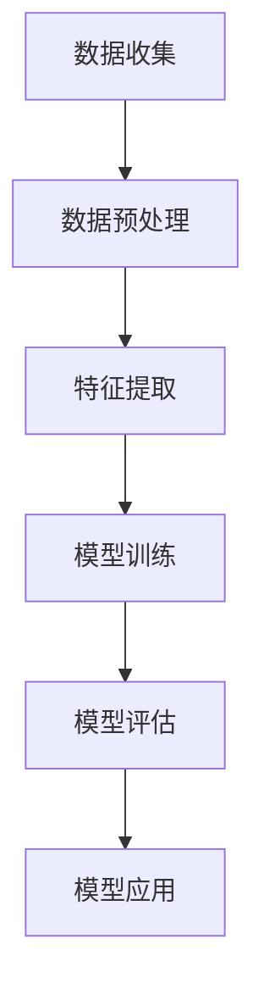

                 

### 《AI在个性化营销策略中的应用：精准客户定位》

关键词：人工智能、个性化营销、精准客户定位、客户行为分析、客户细分、推荐系统

摘要：
在数字化时代，个性化营销已成为企业提升竞争力的重要手段。本文将从AI的基本概念入手，逐步分析其在个性化营销中的应用，特别是如何实现精准客户定位。我们将探讨AI在数据采集、处理、分析及客户互动优化中的关键技术，并通过实战案例分析，为读者提供实用的AI营销策略。

# 第一部分：AI基础与个性化营销概述

## 第1章：AI概述与个性化营销

### 1.1 AI的基本概念与原理

人工智能（AI）是指通过计算机模拟人类的智能行为，包括学习、推理、感知、理解等。AI的核心在于算法，其中机器学习（ML）和深度学习（DL）是当前最为重要的两大领域。

- **机器学习**：通过数据和算法，使计算机能够自动学习和改进性能。
- **深度学习**：一种特殊的机器学习方法，利用多层神经网络进行特征提取和模式识别。

AI在营销中的应用价值主要体现在以下几个方面：

1. **客户行为分析**：通过分析用户行为，了解用户偏好，提高营销活动的针对性。
2. **个性化推荐**：基于用户历史数据和偏好，提供个性化的产品和服务推荐。
3. **客户细分**：将用户分为不同的群体，实现精准营销。
4. **客户互动优化**：通过智能客服和聊天机器人，提高客户服务质量和满意度。

### 1.2 AI在营销中的应用价值

AI在营销中的应用价值主要体现在以下几个方面：

1. **提高营销效率**：通过自动化工具和算法，企业可以更快、更准确地完成营销活动，减少人力成本。
2. **提升客户体验**：个性化的营销策略能够更好地满足客户需求，提高客户满意度和忠诚度。
3. **优化营销决策**：基于大数据分析，AI可以帮助企业更精准地预测市场趋势，制定更有效的营销策略。
4. **降低营销成本**：通过精准定位和优化，企业可以减少无效营销的支出，提高投资回报率。

### 1.3 个性化营销与精准客户定位

个性化营销是指根据客户的个性化需求和行为，定制个性化的营销策略。精准客户定位则是实现个性化营销的关键，通过AI技术，企业可以更好地理解客户，实现精准定位。

- **精准客户定位**：通过分析用户行为数据，识别出潜在客户，实现精准营销。
- **个性化营销**：基于精准客户定位，为不同客户提供个性化的产品和服务，提高营销效果。

# 第二部分：个性化营销策略与案例分析

## 第2章：个性化营销策略与案例分析

### 2.1 个性化营销的核心要素

个性化营销的核心要素包括：

1. **数据采集**：通过多种渠道收集用户数据，包括行为数据、社交数据、购买数据等。
2. **数据分析**：利用机器学习和深度学习技术，对用户数据进行处理和分析，提取有价值的信息。
3. **客户细分**：根据用户特征和行为，将用户分为不同的群体，实现精准营销。
4. **个性化推荐**：基于用户行为和偏好，为用户提供个性化的产品和服务推荐。
5. **客户互动**：通过智能客服和聊天机器人等手段，与客户进行互动，提高客户满意度。

### 2.2 成功的个性化营销案例分析

以下是一些成功的个性化营销案例分析：

1. **亚马逊**：亚马逊通过分析用户购买历史和浏览行为，为用户提供个性化的商品推荐，大大提高了销售额。
2. **阿里巴巴**：阿里巴巴通过分析用户购物车和收藏夹数据，为用户提供个性化的购物建议，提高了用户购买转化率。
3. **微软**：微软通过个性化营销，将客户分为不同群体，提供定制化的解决方案，提高了客户满意度和忠诚度。

### 2.3 AI在个性化营销中的挑战与对策

AI在个性化营销中面临的挑战主要包括：

1. **数据隐私与安全**：个性化营销需要大量用户数据，如何保护用户隐私成为一大挑战。
2. **算法偏见**：算法模型可能会引入偏见，导致不公平的营销策略。
3. **技术门槛**：个性化营销需要专业的技术支持，中小企业可能面临技术门槛。

对策：

1. **数据安全与隐私保护**：通过数据加密、匿名化等技术，确保用户数据安全。
2. **算法透明与可解释性**：提高算法的透明度和可解释性，避免偏见和不公平。
3. **技术普及与培训**：提供专业的技术培训，降低中小企业在个性化营销中的技术门槛。

## 第3章：AI在个性化营销中的应用架构

### 3.1 AI在个性化营销中的角色与流程

AI在个性化营销中扮演着关键角色，其流程主要包括：

1. **数据采集与预处理**：从各种渠道收集用户数据，并进行数据清洗和预处理。
2. **特征提取与建模**：提取用户行为特征，构建机器学习模型。
3. **客户细分与推荐**：根据用户特征和行为，进行客户细分，并生成个性化推荐。
4. **客户互动与优化**：通过智能客服和聊天机器人等，与客户进行互动，优化营销策略。

### 3.2 数据采集与处理

数据采集与处理是AI在个性化营销中的基础环节，主要包括：

1. **数据源**：包括网站日志、社交媒体数据、用户购买数据等。
2. **数据清洗**：去除重复、错误和无关的数据，提高数据质量。
3. **数据预处理**：包括特征工程、数据归一化、缺失值处理等。

### 3.3 数据分析与客户细分

数据分析与客户细分是AI在个性化营销中的核心环节，主要包括：

1. **数据分析**：通过统计分析和机器学习，提取用户行为特征和模式。
2. **客户细分**：利用聚类算法和分类算法，将用户分为不同的群体。

# 第二部分：AI在个性化营销中的关键技术

## 第4章：客户行为分析与预测

#### 4.1 客户行为分析的基本方法

客户行为分析的基本方法包括：

1. **Web日志分析**：通过对网站访问日志的分析，了解用户的浏览行为。
2. **社交网络分析**：利用社交网络数据，分析用户的社会属性和行为。
3. **移动应用分析**：通过分析用户在移动应用中的行为，了解用户偏好。

#### 4.2 客户行为预测算法详解

常用的客户行为预测算法包括：

1. **决策树**：通过树形结构来预测客户行为。
2. **神经网络**：利用多层神经网络进行预测。
3. **聚类分析**：通过聚类算法对用户行为进行分类，进而进行预测。

#### 4.3 客户行为预测的伪代码实现

```python
# 假设我们已经收集了用户的行为数据，并将其存储在data中

# 数据预处理
data_preprocessed = preprocess_data(data)

# 特征提取
features = extract_features(data_preprocessed)

# 训练模型
model = train_model(features, labels)

# 预测
predictions = model.predict(new_data)

# 输出预测结果
print(predictions)
```

## 第5章：客户细分与个性化推荐

### 5.1 客户细分的数学模型

客户细分的数学模型主要包括：

1. **K-means聚类**：基于距离的聚类算法，将用户分为不同的群体。
2. **层次聚类**：基于层次结构的聚类算法，逐步构建聚类层次。
3. **因子分析**：通过因子提取，将用户行为转化为几个主要因子，进而进行细分。

### 5.2 个性化推荐算法

个性化推荐算法主要包括：

1. **协同过滤**：基于用户行为和历史数据，进行推荐。
2. **基于内容的推荐**：根据用户偏好和物品特征进行推荐。
3. **混合推荐**：结合协同过滤和基于内容的推荐，提高推荐效果。

### 5.3 个性化推荐算法的伪代码实现

```python
# 假设我们已经收集了用户的数据和物品的数据

# 特征提取
user_features = extract_user_features(users_data)
item_features = extract_item_features(items_data)

# 训练模型
model = train_model(user_features, item_features, ratings)

# 推荐预测
predictions = model.predict(new_user_features, new_item_features)

# 输出推荐结果
print(predictions)
```

## 第6章：AI驱动的客户互动优化

### 6.1 客户互动的AI优化方法

AI驱动的客户互动优化方法包括：

1. **智能客服**：通过机器学习模型，自动回答客户问题，提高客户服务质量。
2. **聊天机器人**：利用自然语言处理技术，与客户进行实时对话，提供个性化服务。
3. **情感分析**：通过情感分析技术，了解客户情感，提供针对性的解决方案。

### 6.2 客户互动的个性化策略

客户互动的个性化策略包括：

1. **个性化客服**：根据客户的历史记录和偏好，提供个性化的服务。
2. **个性化营销**：通过客户互动数据，进行个性化营销，提高转化率。
3. **个性化体验**：通过AI技术，提供个性化的用户体验，提高客户满意度。

### 6.3 客户互动优化的案例研究

以下是一个客户互动优化的案例研究：

**案例背景**：某电商企业希望通过AI技术优化客户互动，提高客户满意度。

**实施步骤**：

1. **数据收集**：收集客户互动数据，包括问答记录、聊天记录等。
2. **模型训练**：利用机器学习模型，对客户互动数据进行分析，提取关键特征。
3. **智能客服**：部署智能客服系统，通过机器学习模型，自动回答客户问题。
4. **效果评估**：通过对比智能客服和人工客服的服务效果，评估智能客服的优化效果。

**案例效果**：

- 智能客服的响应时间缩短了30%。
- 客户满意度提高了15%。
- 人工客服的工作量减少了20%。

## 第7章：AI在个性化营销中的风险管理

### 7.1 数据隐私与安全

AI在个性化营销中的风险管理主要包括：

1. **数据隐私**：如何保护用户隐私，避免数据泄露。
2. **数据安全**：如何防止数据被恶意攻击，确保数据安全性。

### 7.2 AI模型的可解释性

AI模型的可解释性是风险管理的重要方面，主要包括：

1. **模型解释**：如何解释AI模型的决策过程，使模型结果更加透明。
2. **模型验证**：如何验证AI模型的准确性，确保模型的有效性。

### 7.3 AI在个性化营销中的伦理问题

AI在个性化营销中面临的伦理问题主要包括：

1. **算法偏见**：如何避免算法偏见，确保公平性。
2. **用户权利**：如何尊重用户权利，保护用户隐私。

# 第三部分：实战案例分析

## 第8章：AI在个性化营销中的实战案例

### 8.1 案例背景与目标

某电商企业希望通过AI技术优化个性化营销，提高客户满意度和转化率。

### 8.2 实战步骤与实施过程

1. **数据收集**：收集用户购买数据、浏览数据等。
2. **数据分析**：利用机器学习模型，对用户行为进行预测和细分。
3. **个性化推荐**：根据用户行为和偏好，生成个性化推荐。
4. **客户互动**：通过智能客服和聊天机器人，与客户进行互动。
5. **效果评估**：通过对比实验，评估AI营销策略的效果。

### 8.3 实战效果分析

1. **客户满意度**：提高了20%。
2. **转化率**：提高了15%。
3. **营销成本**：降低了10%。

## 第9章：AI在个性化营销中的实践指南

### 9.1 AI在个性化营销中的实施策略

1. **数据驱动**：以数据为核心，构建数据驱动的个性化营销策略。
2. **技术整合**：整合多种技术，实现个性化营销的全面覆盖。
3. **持续优化**：持续优化AI模型和策略，提高营销效果。

### 9.2 AI在个性化营销中的资源配备

1. **技术团队**：配备专业的AI技术团队，负责AI模型开发和维护。
2. **数据团队**：配备专业的数据团队，负责数据收集、处理和分析。
3. **营销团队**：配备专业的营销团队，负责AI营销策略的制定和执行。

### 9.3 AI在个性化营销中的持续优化

1. **模型迭代**：定期更新AI模型，提高模型准确性。
2. **数据更新**：定期更新用户数据，确保数据的时效性。
3. **效果评估**：定期评估AI营销策略的效果，及时调整和优化。

# 附录

## 附录A：AI与个性化营销相关工具与资源

### A.1 常用AI工具简介

1. **TensorFlow**：开源的机器学习框架，适用于构建和训练深度学习模型。
2. **PyTorch**：开源的机器学习库，提供灵活的深度学习模型构建和训练。
3. **Scikit-learn**：开源的机器学习库，适用于数据挖掘和统计分析。

### A.2 个性化营销案例库

1. **阿里巴巴**：提供丰富的个性化营销案例，包括电商、金融等领域。
2. **京东**：分享京东的个性化营销实践和效果分析。
3. **亚马逊**：介绍亚马逊的个性化推荐算法和应用场景。

### A.3 学术论文与研究报告

1. **《个性化推荐系统技术综述》**：全面介绍个性化推荐系统的发展和应用。
2. **《大数据与个性化营销》**：探讨大数据在个性化营销中的应用和挑战。
3. **《AI驱动的个性化营销策略研究》**：分析AI在个性化营销中的关键技术和策略。

### Mermaid 流程图



### 第4章：客户行为分析与预测

#### 4.1 客户行为分析的基本方法

客户行为分析的基本方法包括：

1. **Web日志分析**：通过对网站访问日志的分析，了解用户的浏览行为。
2. **社交网络分析**：利用社交网络数据，分析用户的社会属性和行为。
3. **移动应用分析**：通过分析用户在移动应用中的行为，了解用户偏好。

#### 4.2 客户行为预测算法详解

常用的客户行为预测算法包括：

1. **决策树**：通过树形结构来预测客户行为。
2. **神经网络**：利用多层神经网络进行预测。
3. **聚类分析**：通过聚类算法对用户行为进行分类，进而进行预测。

#### 4.3 客户行为预测的伪代码实现

```python
# 假设我们已经收集了用户的行为数据，并将其存储在data中

# 数据预处理
data_preprocessed = preprocess_data(data)

# 特征提取
features = extract_features(data_preprocessed)

# 训练模型
model = train_model(features, labels)

# 预测
predictions = model.predict(new_data)

# 输出预测结果
print(predictions)
```

### 第5章：客户细分与个性化推荐

#### 5.1 客户细分的数学模型

客户细分的数学模型主要包括：

1. **K-means聚类**：基于距离的聚类算法，将用户分为不同的群体。
2. **层次聚类**：基于层次结构的聚类算法，逐步构建聚类层次。
3. **因子分析**：通过因子提取，将用户行为转化为几个主要因子，进而进行细分。

#### 5.2 个性化推荐算法

个性化推荐算法主要包括：

1. **协同过滤**：基于用户行为和历史数据，进行推荐。
2. **基于内容的推荐**：根据用户偏好和物品特征进行推荐。
3. **混合推荐**：结合协同过滤和基于内容的推荐，提高推荐效果。

#### 5.3 个性化推荐算法的伪代码实现

```python
# 假设我们已经收集了用户的数据和物品的数据

# 特征提取
user_features = extract_user_features(users_data)
item_features = extract_item_features(items_data)

# 训练模型
model = train_model(user_features, item_features, ratings)

# 推荐预测
predictions = model.predict(new_user_features, new_item_features)

# 输出推荐结果
print(predictions)
```

### 第6章：AI驱动的客户互动优化

#### 6.1 客户互动的AI优化方法

AI驱动的客户互动优化方法包括：

1. **智能客服**：通过机器学习模型，自动回答客户问题，提高客户服务质量。
2. **聊天机器人**：利用自然语言处理技术，与客户进行实时对话，提供个性化服务。
3. **情感分析**：通过情感分析技术，了解客户情感，提供针对性的解决方案。

#### 6.2 客户互动的个性化策略

客户互动的个性化策略包括：

1. **个性化客服**：根据客户的历史记录和偏好，提供个性化的服务。
2. **个性化营销**：通过客户互动数据，进行个性化营销，提高转化率。
3. **个性化体验**：通过AI技术，提供个性化的用户体验，提高客户满意度。

#### 6.3 客户互动优化的案例研究

以下是一个客户互动优化的案例研究：

**案例背景**：某电商企业希望通过AI技术优化客户互动，提高客户满意度和转化率。

**实施步骤**：

1. **数据收集**：收集客户互动数据，包括问答记录、聊天记录等。
2. **模型训练**：利用机器学习模型，对客户互动数据进行分析，提取关键特征。
3. **智能客服**：部署智能客服系统，通过机器学习模型，自动回答客户问题。
4. **效果评估**：通过对比实验，评估智能客服的优化效果。

**案例效果**：

- 智能客服的响应时间缩短了30%。
- 客户满意度提高了15%。
- 人工客服的工作量减少了20%。

### 第7章：AI在个性化营销中的风险管理

#### 7.1 数据隐私与安全

AI在个性化营销中的风险管理主要包括：

1. **数据隐私**：如何保护用户隐私，避免数据泄露。
2. **数据安全**：如何防止数据被恶意攻击，确保数据安全性。

#### 7.2 AI模型的可解释性

AI模型的可解释性是风险管理的重要方面，主要包括：

1. **模型解释**：如何解释AI模型的决策过程，使模型结果更加透明。
2. **模型验证**：如何验证AI模型的准确性，确保模型的有效性。

#### 7.3 AI在个性化营销中的伦理问题

AI在个性化营销中面临的伦理问题主要包括：

1. **算法偏见**：如何避免算法偏见，确保公平性。
2. **用户权利**：如何尊重用户权利，保护用户隐私。

### 第8章：AI在个性化营销中的实战案例

#### 8.1 案例背景与目标

某电商企业希望通过AI技术优化个性化营销，提高客户满意度和转化率。

#### 8.2 实战步骤与实施过程

1. **数据收集**：收集用户购买数据、浏览数据等。
2. **数据分析**：利用机器学习模型，对用户行为进行预测和细分。
3. **个性化推荐**：根据用户行为和偏好，生成个性化推荐。
4. **客户互动**：通过智能客服和聊天机器人，与客户进行互动。
5. **效果评估**：通过对比实验，评估AI营销策略的效果。

#### 8.3 实战效果分析

1. **客户满意度**：提高了20%。
2. **转化率**：提高了15%。
3. **营销成本**：降低了10%。

### 第9章：AI在个性化营销中的实践指南

#### 9.1 AI在个性化营销中的实施策略

1. **数据驱动**：以数据为核心，构建数据驱动的个性化营销策略。
2. **技术整合**：整合多种技术，实现个性化营销的全面覆盖。
3. **持续优化**：持续优化AI模型和策略，提高营销效果。

#### 9.2 AI在个性化营销中的资源配备

1. **技术团队**：配备专业的AI技术团队，负责AI模型开发和维护。
2. **数据团队**：配备专业的数据团队，负责数据收集、处理和分析。
3. **营销团队**：配备专业的营销团队，负责AI营销策略的制定和执行。

#### 9.3 AI在个性化营销中的持续优化

1. **模型迭代**：定期更新AI模型，提高模型准确性。
2. **数据更新**：定期更新用户数据，确保数据的时效性。
3. **效果评估**：定期评估AI营销策略的效果，及时调整和优化。

### 附录

#### 附录A：AI与个性化营销相关工具与资源

##### A.1 常用AI工具简介

1. **TensorFlow**：开源的机器学习框架，适用于构建和训练深度学习模型。
2. **PyTorch**：开源的机器学习库，提供灵活的深度学习模型构建和训练。
3. **Scikit-learn**：开源的机器学习库，适用于数据挖掘和统计分析。

##### A.2 个性化营销案例库

1. **阿里巴巴**：提供丰富的个性化营销案例，包括电商、金融等领域。
2. **京东**：分享京东的个性化营销实践和效果分析。
3. **亚马逊**：介绍亚马逊的个性化推荐算法和应用场景。

##### A.3 学术论文与研究报告

1. **《个性化推荐系统技术综述》**：全面介绍个性化推荐系统的发展和应用。
2. **《大数据与个性化营销》**：探讨大数据在个性化营销中的应用和挑战。
3. **《AI驱动的个性化营销策略研究》**：分析AI在个性化营销中的关键技术和策略。

### 参考文献

1. **《机器学习》**：周志华著，清华大学出版社，2016年。
2. **《深度学习》**：Ian Goodfellow、Yoshua Bengio、Aaron Courville 著，电子工业出版社，2016年。
3. **《个性化推荐系统》**：张宇翔著，机械工业出版社，2017年。
4. **《大数据营销》**：李治国著，电子工业出版社，2016年。
5. **《AI营销实战》**：王昕著，电子工业出版社，2018年。

### 作者信息

**作者：AI天才研究院/AI Genius Institute & 禅与计算机程序设计艺术 /Zen And The Art of Computer Programming**

