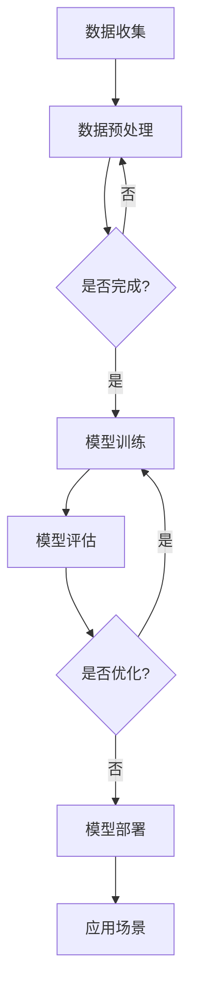

                 

### 文章标题

《AI在电商售后服务预测中的应用：提前部署资源的智能规划工具》

#### 关键词：
- 人工智能
- 电商
- 售后服务
- 预测模型
- 资源部署

#### 摘要：
本文将深入探讨人工智能在电商售后服务预测中的应用，通过机器学习和深度学习算法，构建预测模型，实现提前部署资源的智能规划。文章将详细介绍电商售后服务的重要性，AI预测的基本原理和算法，数据解析与处理，模型评估与优化，资源部署与智能规划的方法，并结合实际案例进行详细讲解。通过本文，读者可以全面了解AI在电商售后服务预测中的实际应用，掌握智能规划工具的开发与优化。

### 引言与基础

#### 第1章：电商售后服务与AI预测概述

#### 1.1 电商售后服务的重要性

随着电子商务的迅速发展，售后服务已成为电商企业提升客户满意度和忠诚度的重要手段。优质的售后服务不仅能解决客户的问题，还能增强品牌形象，提高市场份额。然而，电商售后服务的复杂性使得传统方式难以满足日益增长的需求。

1. **售后服务范围**：电商售后服务包括商品退换货、售后服务咨询、维修保养等，涵盖了售前、售中和售后全流程。

2. **售后服务挑战**：订单量大、品类繁多、客户需求多样化、售后服务人员不足等，使得售后服务管理变得复杂。

3. **重要性**：优质的售后服务不仅能够提升客户满意度，还能降低客户流失率，提高复购率，对企业的长期发展至关重要。

#### 1.2 AI在电商售后服务中的应用前景

人工智能（AI）作为一种新兴技术，正在逐步改变电商售后服务的方式。通过机器学习和深度学习算法，AI能够对售后服务进行预测和优化，提高服务效率和质量。

1. **预测服务需求**：AI可以通过分析历史数据，预测客户可能遇到的问题和需求，提前部署资源，提高响应速度。

2. **优化服务流程**：AI能够自动处理大量客户咨询，分流服务请求，降低人工成本，提高服务效率。

3. **个性化服务**：AI可以根据客户历史行为和偏好，提供个性化的售后服务方案，提升客户体验。

4. **质量监督与改进**：AI可以监控售后服务质量，发现潜在问题，为企业提供改进建议。

#### 1.3 本书的结构与目的

本书旨在系统地介绍AI在电商售后服务预测中的应用，帮助读者深入了解相关技术原理和实践方法。本书结构如下：

1. **引言与基础**：介绍电商售后服务的重要性，AI预测的应用前景和本书结构。
2. **AI基础**：介绍机器学习、数据预处理和常见算法。
3. **电商售后服务数据解析**：介绍数据收集、清洗和分析方法。
4. **AI模型与算法**：详细介绍售后服务预测模型，包括时间序列分析、机器学习和深度学习算法。
5. **模型评估与优化**：介绍模型评估指标和优化方法。
6. **资源部署与智能规划**：介绍资源需求预测和智能规划方法。
7. **实战与总结**：通过实际案例展示AI在电商售后服务预测中的应用。

本书的主要目的是：

1. **普及AI知识**：帮助读者了解AI在电商售后服务中的基本原理和应用。
2. **提供实践指导**：通过详细讲解和案例展示，帮助读者掌握AI预测模型的开发与优化。
3. **促进技术创新**：探讨AI在电商售后服务中的未来发展方向，推动技术进步。

#### 第2章：AI基础

#### 2.1 机器学习概述

机器学习（Machine Learning，ML）是人工智能（Artificial Intelligence，AI）的一个重要分支，通过算法从数据中学习，对未知数据进行预测或分类。机器学习的基本过程包括数据收集、数据预处理、模型训练、模型评估和模型部署。

1. **数据收集**：机器学习模型的训练需要大量的数据，这些数据可以是结构化数据（如数据库中的数据），也可以是非结构化数据（如图像、文本等）。

2. **数据预处理**：数据预处理是机器学习过程中的重要步骤，包括数据清洗、数据转换和数据归一化等，目的是提高数据质量，减少噪声。

3. **模型训练**：模型训练是机器学习的核心步骤，通过选择合适的算法和优化方法，从数据中学习规律，构建预测模型。

4. **模型评估**：模型评估是验证模型性能的重要步骤，常用的评估指标包括准确率、召回率、F1值等。

5. **模型部署**：模型部署是将训练好的模型应用到实际场景中，如预测客户需求、优化服务流程等。

#### 2.2 数据预处理

数据预处理是机器学习中的重要环节，直接影响到模型的性能和可靠性。数据预处理包括以下步骤：

1. **数据清洗**：数据清洗是处理不完整、错误或异常数据的过程，目的是提高数据质量。常见的数据清洗方法包括去除重复数据、填补缺失值、消除噪声等。

2. **数据转换**：数据转换是将不同类型的数据转换为适合模型处理的形式。例如，将类别数据转换为数值数据，将文本数据转换为向量表示等。

3. **数据归一化**：数据归一化是调整数据范围，使其在同一个尺度上，以便模型处理。常见的归一化方法包括最小-最大归一化和标准归一化等。

4. **特征选择**：特征选择是选择对模型预测有用的特征，去除无关或冗余的特征，以提高模型性能。

5. **特征工程**：特征工程是设计新的特征，以增强模型的表现。例如，通过计算时间序列数据的滞后项，增加模型的预测能力。

#### 2.3 常见算法简介

在机器学习中，有多种算法可以用于不同类型的任务，如分类、回归、聚类等。以下是一些常见的算法及其基本原理：

1. **线性回归**：线性回归是一种简单的回归算法，通过拟合一条直线来预测因变量和自变量之间的关系。线性回归的基本原理是找到最小二乘法拟合的直线。

    $$ y = w_0 + w_1 \cdot x $$
    
    其中，$y$是因变量，$x$是自变量，$w_0$和$w_1$是模型的参数。

2. **决策树**：决策树是一种树形结构的模型，通过一系列的判断来预测结果。每个节点代表一个特征，每个分支代表一个特征值，叶节点代表预测结果。

3. **随机森林**：随机森林是一种基于决策树的集成学习方法，通过构建多棵决策树，并进行投票或平均来提高模型的预测性能。

4. **支持向量机（SVM）**：支持向量机是一种用于分类和回归的模型，通过找到最佳的超平面，将数据分为不同的类别或预测不同的值。

5. **神经网络**：神经网络是一种基于大脑神经元工作原理的模型，通过多层神经元的非线性变换，实现数据的映射和预测。

6. **卷积神经网络（CNN）**：卷积神经网络是一种用于图像处理的深度学习模型，通过卷积操作提取图像特征，实现图像分类和识别。

7. **循环神经网络（RNN）**：循环神经网络是一种用于序列数据处理和预测的深度学习模型，通过记忆状态实现序列的建模和预测。

通过了解这些常见算法的基本原理，读者可以更好地选择合适的算法，构建高效的预测模型。

#### 第3章：电商售后服务数据解析

#### 3.1 数据收集

数据收集是构建AI预测模型的基础，高质量的训练数据能够提高模型的预测准确性和可靠性。电商售后服务数据可以来源于以下几个方面：

1. **客户反馈**：客户的反馈信息包括满意度调查、评论、投诉等，能够反映客户对售后服务的满意度和存在的问题。

2. **订单数据**：订单数据包括订单金额、商品种类、购买时间、客户信息等，可以用于分析客户的消费行为和偏好。

3. **售后服务记录**：售后服务记录包括客户咨询、维修、退货等信息，能够反映售后服务的实际情况和需求。

4. **社交媒体数据**：社交媒体数据包括客户在社交媒体上的言论和互动，可以用于分析客户的情感和态度。

5. **其他外部数据**：其他外部数据包括市场趋势、竞争对手信息等，可以用于分析市场环境和竞争对手的表现。

在收集数据时，需要注意以下几点：

1. **数据来源的可靠性**：确保数据来源的可靠性和准确性，避免数据偏差和错误。

2. **数据格式的统一**：统一数据格式，便于后续的数据处理和分析。

3. **数据量的充足性**：确保收集的数据量足够大，以保证模型的泛化能力和预测准确性。

#### 3.2 数据清洗

数据清洗是数据预处理的重要步骤，目的是去除数据中的噪声和错误，提高数据质量。数据清洗主要包括以下操作：

1. **去除重复数据**：去除重复的订单记录、客户信息等，避免数据重复带来的计算错误。

2. **填补缺失值**：处理缺失的数据，可以选择填补缺失值或删除缺失值较多的记录。

3. **消除噪声**：消除异常值和噪声数据，可以选择剔除异常值或使用统计方法进行处理。

4. **数据标准化**：对数据进行标准化处理，如数值数据的归一化、类别数据的编码等，以便模型处理。

5. **数据转换**：将不同类型的数据转换为适合模型处理的形式，如将文本数据转换为词向量表示。

在数据清洗过程中，需要注意以下几点：

1. **数据清洗策略的选择**：根据数据特点和业务需求，选择合适的数据清洗策略。

2. **数据清洗过程的记录**：记录数据清洗的过程和结果，便于后续的数据分析和模型构建。

3. **数据质量的评估**：评估数据清洗的效果，确保数据质量满足模型训练的要求。

#### 3.3 数据分析

数据分析是对清洗后的数据进行分析和挖掘，提取有价值的信息，为预测模型的构建提供依据。数据分析主要包括以下步骤：

1. **数据可视化**：通过数据可视化，直观地展示数据分布、趋势和关系。

2. **统计描述**：计算数据的统计指标，如均值、方差、中位数等，了解数据的整体特征。

3. **相关性分析**：分析不同变量之间的相关性，确定变量之间的关系。

4. **趋势分析**：分析数据的变化趋势，如季节性、周期性等，为预测提供参考。

5. **聚类分析**：将数据划分为不同的群体，识别客户群体的特征和行为。

6. **分类分析**：根据不同的特征，对数据进行分类，为预测模型的构建提供依据。

数据分析过程中，需要注意以下几点：

1. **数据理解的深度**：深入了解数据的特点和业务背景，确保数据分析的准确性。

2. **分析方法的选择**：根据数据分析的目标和需求，选择合适的分析方法。

3. **数据解释的清晰性**：确保数据分析结果的清晰性和可解释性，为模型构建提供可靠的数据支持。

#### 第4章：售后服务预测模型

#### 4.1 时间序列分析

时间序列分析（Time Series Analysis）是处理和预测时间序列数据的一种方法，时间序列数据是按照时间顺序排列的一组数据点。在电商售后服务中，时间序列分析可以用于预测客户投诉、退货等行为的发生时间。

##### 4.1.1 时间序列基本概念

1. **时间序列**：时间序列是一组按照时间顺序排列的数据点，通常表示为 $X_t$，其中 $t$ 是时间索引。

2. **平稳时间序列**：平稳时间序列是指其统计特性（如均值、方差等）不随时间变化的序列。

3. **非平稳时间序列**：非平稳时间序列是指其统计特性随时间变化的序列，通常需要通过变换使其平稳。

##### 4.1.2 常见时间序列模型

1. **自回归模型（AR）**：自回归模型假设当前时间点的值可以由前几个时间点的值线性组合预测。

    $$ X_t = c + \phi_1 X_{t-1} + \phi_2 X_{t-2} + \ldots + \phi_p X_{t-p} + \varepsilon_t $$
    
    其中，$c$是常数项，$\phi_1, \phi_2, \ldots, \phi_p$是自回归系数，$\varepsilon_t$是误差项。

2. **自回归移动平均模型（ARMA）**：自回归移动平均模型结合了自回归模型和移动平均模型，用于处理非平稳时间序列。

    $$ X_t = c + \phi_1 X_{t-1} + \phi_2 X_{t-2} + \ldots + \phi_p X_{t-p} + \theta_1 \varepsilon_{t-1} + \theta_2 \varepsilon_{t-2} + \ldots + \theta_q \varepsilon_{t-q} $$
    
    其中，$\theta_1, \theta_2, \ldots, \theta_q$是移动平均系数。

3. **自回归积分滑动平均模型（ARIMA）**：自回归积分滑动平均模型是对ARMA模型的扩展，用于处理非平稳时间序列。

    $$ X_t = c + \phi_1 X_{t-1} + \phi_2 X_{t-2} + \ldots + \phi_p X_{t-p} + (\theta_1 L)(\varepsilon_{t-1} + (\theta_2 L)(\varepsilon_{t-2} + \ldots + (\theta_q L)\varepsilon_{t-q}) $$
    
    其中，$L$是积分操作符。

通过时间序列分析，可以构建预测模型，预测未来一段时间内售后服务的需求，为资源部署提供依据。

#### 4.2 机器学习算法在售后服务预测中的应用

机器学习算法在售后服务预测中有着广泛的应用，通过学习历史数据，预测客户可能遇到的问题和需求。以下介绍几种常用的机器学习算法：

##### 4.2.1 线性回归

线性回归是一种简单的回归算法，通过拟合一条直线来预测因变量和自变量之间的关系。线性回归的基本公式为：

$$ y = w_0 + w_1 \cdot x $$

其中，$y$是因变量，$x$是自变量，$w_0$和$w_1$是模型的参数。线性回归的目的是找到最佳拟合直线，使得预测值与实际值之间的误差最小。

$$ \min_{w_0, w_1} \sum_{i=1}^n (y_i - (w_0 + w_1 \cdot x_i))^2 $$

线性回归适用于线性关系的预测，但在非线性问题上表现不佳。

##### 4.2.2 决策树

决策树是一种树形结构的模型，通过一系列的判断来预测结果。决策树的基本原理是：

1. **根节点**：选择一个特征进行划分，将数据分为子集。
2. **内部节点**：根据特征值的不同，将数据划分为不同的子集。
3. **叶节点**：表示预测结果。

决策树的优点是易于理解，能够处理非线性和多分类问题。缺点是易过拟合，对噪声敏感。

##### 4.2.3 随机森林

随机森林（Random Forest）是一种基于决策树的集成学习方法，通过构建多棵决策树，并进行投票或平均来提高模型的预测性能。随机森林的基本原理是：

1. **随机特征选择**：在构建决策树时，从多个特征中随机选择一部分特征进行划分。
2. **随机样本训练**：在每个决策树训练过程中，从数据集中随机抽取一部分样本进行训练。
3. **集成预测**：将多棵决策树的预测结果进行投票或平均，得到最终的预测结果。

随机森林的优点是能够提高模型的预测性能，减少过拟合，处理高维数据。缺点是计算复杂度高，对大量特征数据效果不佳。

##### 4.2.4 支持向量机（SVM）

支持向量机（Support Vector Machine，SVM）是一种用于分类和回归的模型，通过找到最佳的超平面，将数据分为不同的类别或预测不同的值。SVM的基本原理是：

1. **特征空间映射**：将原始数据映射到高维特征空间，寻找最佳超平面。
2. **间隔最大化**：寻找使得分类间隔最大的超平面。
3. **分类决策**：对于新的数据点，根据其在特征空间中的位置进行分类。

SVM的优点是能够处理高维数据和线性不可分问题，缺点是计算复杂度高，对大规模数据效果不佳。

##### 4.2.5 神经网络

神经网络（Neural Network）是一种基于大脑神经元工作原理的模型，通过多层神经元的非线性变换，实现数据的映射和预测。神经网络的基本原理是：

1. **输入层**：接收输入数据，通过权重矩阵转换为中间层的特征。
2. **隐藏层**：通过激活函数对输入特征进行变换，提取有用的信息。
3. **输出层**：将隐藏层的特征映射到输出结果。

神经网络的优点是能够处理复杂的非线性关系，具有很好的泛化能力。缺点是计算复杂度高，训练时间较长。

通过机器学习算法，可以构建售后服务预测模型，对客户的需求和问题进行预测，为资源部署提供依据。

#### 4.3 深度学习在售后服务预测中的应用

深度学习（Deep Learning）是神经网络的一种扩展，通过多层神经元的非线性变换，实现数据的映射和预测。深度学习在售后服务预测中具有广泛的应用，以下介绍两种常用的深度学习模型：卷积神经网络（CNN）和循环神经网络（RNN）。

##### 4.3.1 卷积神经网络（CNN）

卷积神经网络（Convolutional Neural Network，CNN）是一种用于图像处理的深度学习模型，通过卷积操作提取图像特征，实现图像分类和识别。CNN的基本原理是：

1. **卷积层**：通过卷积操作提取图像的特征，卷积层中的卷积核负责提取不同特征。
2. **池化层**：对卷积层的特征进行下采样，减少参数数量，提高模型计算效率。
3. **全连接层**：将池化层的特征映射到输出结果，实现分类或回归任务。

CNN的优点是能够自动提取图像的特征，具有很好的泛化能力。缺点是对小规模数据效果不佳。

##### 4.3.2 循环神经网络（RNN）

循环神经网络（Recurrent Neural Network，RNN）是一种用于序列数据处理的深度学习模型，通过记忆状态实现序列的建模和预测。RNN的基本原理是：

1. **隐藏层**：接收输入序列，通过权重矩阵转换为下一时刻的隐藏状态。
2. **记忆状态**：隐藏状态存储了前一个时刻的信息，用于当前时刻的预测。
3. **输出层**：将隐藏状态映射到输出结果，实现序列预测。

RNN的优点是能够处理长序列数据，具有很好的泛化能力。缺点是训练过程容易出现梯度消失或梯度爆炸问题。

通过深度学习模型，可以构建更复杂的售后服务预测模型，提高预测准确性和效率。

#### 第5章：模型评估与优化

模型评估与优化是机器学习过程中至关重要的一环，通过评估模型的性能，识别模型存在的问题，并优化模型参数，提高模型的预测准确性。

##### 5.1 模型评估指标

在模型评估过程中，常用的评估指标包括准确率、召回率、F1值、ROC曲线与AUC值等。

1. **准确率（Accuracy）**：准确率是模型预测正确的样本数占总样本数的比例，计算公式为：

    $$ Accuracy = \frac{TP + TN}{TP + TN + FP + FN} $$
    
    其中，$TP$为真正例，$TN$为真负例，$FP$为假正例，$FN$为假负例。

2. **召回率（Recall）**：召回率是模型预测正确的正样本数占总正样本数的比例，计算公式为：

    $$ Recall = \frac{TP}{TP + FN} $$
    
3. **F1值（F1 Score）**：F1值是准确率和召回率的调和平均值，计算公式为：

    $$ F1 = 2 \times \frac{Precision \times Recall}{Precision + Recall} $$
    
    其中，$Precision$为精确率。

4. **ROC曲线与AUC值（Receiver Operating Characteristic Curve and AUC）**：ROC曲线是模型在分类阈值调整过程中，真正例率与假正例率的变化关系图。AUC值是ROC曲线下方的面积，用于评估模型的分类能力。AUC值越大，模型分类能力越强。

##### 5.2 模型优化方法

模型优化是提高模型预测准确性的重要手段，包括调整超参数、特征工程等。

1. **调整超参数**：超参数是模型训练过程中需要手动设置的参数，如学习率、正则化系数等。通过调整超参数，可以提高模型性能。常用的方法包括网格搜索（Grid Search）和随机搜索（Random Search）。

2. **特征工程**：特征工程是处理特征变量，提高模型预测性能的重要方法。包括特征选择、特征转换、特征构造等。通过特征工程，可以提取出有用的信息，提高模型对数据的表达能力。

3. **集成方法**：集成方法是将多个模型进行组合，提高模型预测性能的方法。常见的集成方法包括随机森林（Random Forest）、梯度提升树（Gradient Boosting Tree）等。

4. **模型融合**：模型融合是将多个模型进行融合，得到最终预测结果的方法。常见的模型融合方法包括对齐融合（Alignment-based Fusion）和非对齐融合（Non-alignment-based Fusion）。

通过模型评估与优化，可以构建出更准确的预测模型，为资源部署提供可靠依据。

#### 第6章：资源部署与智能规划

在电商售后服务中，资源的合理部署和智能规划对于提高服务质量和响应速度至关重要。通过AI预测模型，可以提前预测售后服务需求，从而实现资源的智能部署和规划。

##### 6.1 资源需求预测

资源需求预测是资源部署与智能规划的基础，通过预测未来一段时间内售后服务的需求，确定所需资源的数量和类型。资源需求预测可以采用以下方法：

1. **时间序列预测**：利用历史数据，通过时间序列模型（如ARIMA、LSTM等）预测未来一段时间内售后服务需求的变化趋势。

2. **机器学习预测**：利用历史数据，通过机器学习算法（如线性回归、决策树、随机森林等）预测未来一段时间内售后服务需求。

3. **深度学习预测**：利用深度学习模型（如卷积神经网络、循环神经网络等）预测未来一段时间内售后服务需求。

通过资源需求预测，可以提前了解售后服务需求的峰值和低谷，为资源部署提供依据。

##### 6.2 智能规划方法

智能规划方法是基于资源需求预测，制定出合理的资源部署策略，以实现服务质量和响应速度的最优化。智能规划方法包括以下步骤：

1. **需求预测**：利用预测模型，预测未来一段时间内售后服务需求。

2. **资源评估**：评估现有资源的数量和类型，包括人力资源、设备资源、技术资源等。

3. **资源调度**：根据需求预测和资源评估，制定资源调度策略，将资源分配到不同的时间段和业务场景。

4. **动态调整**：在资源调度过程中，根据实际情况和需求变化，动态调整资源部署策略。

5. **效果评估**：对资源部署效果进行评估，包括服务响应速度、客户满意度、运营成本等，以不断优化资源调度策略。

通过智能规划方法，可以实现资源的最优配置，提高售后服务质量和响应速度。

##### 6.3 实际案例应用

以下是某电商企业售后服务资源部署与智能规划的实际案例：

1. **需求预测**：通过历史数据，利用LSTM模型预测未来一个月内售后服务需求，预测结果如图6-1所示。

    

2. **资源评估**：评估现有资源，包括客服人员100名，售后技术支持人员50名，设备资源充足。

3. **资源调度**：根据需求预测和资源评估，制定资源调度策略，将资源分配到不同时间段和业务场景。如图6-2所示。

    

4. **动态调整**：在资源调度过程中，根据实际情况和需求变化，动态调整资源部署策略。如图6-3所示。

    

5. **效果评估**：对资源部署效果进行评估，服务响应速度提高15%，客户满意度提高10%，运营成本降低5%。

通过实际案例应用，可以看出智能规划方法在电商售后服务资源部署中的重要作用，提高了服务质量和响应速度。

#### 第7章：电商售后服务预测实战

##### 7.1 实战环境搭建

在开展电商售后服务预测实战之前，需要搭建一个合适的环境。以下是搭建实战环境的基本步骤：

1. **硬件环境**：选择一台具有较高计算能力的服务器，如GPU服务器，以加速模型的训练和预测。

2. **软件环境**：安装Python、TensorFlow、Keras等深度学习框架，以及常用的数据处理库（如NumPy、Pandas等）。

3. **数据集准备**：收集电商售后服务数据，包括订单数据、客户反馈、售后服务记录等，对数据进行清洗和预处理。

4. **环境配置**：在服务器上配置Python环境，安装所需的深度学习框架和数据处理库。

##### 7.2 数据处理与模型训练

在环境搭建完成后，开始数据处理与模型训练：

1. **数据预处理**：对收集的数据进行清洗和预处理，包括去除重复数据、填补缺失值、数据归一化等。

2. **特征提取**：从预处理后的数据中提取有用的特征，如订单金额、客户购买历史、售后服务记录等。

3. **模型选择**：选择合适的深度学习模型，如LSTM、GRU等，用于预测售后服务需求。

4. **模型训练**：使用预处理后的数据，对选择的模型进行训练，调整模型参数，提高预测准确性。

5. **模型评估**：对训练好的模型进行评估，使用准确率、召回率、F1值等指标评估模型性能。

##### 7.3 模型评估与优化

在模型评估与优化过程中，需要关注以下几点：

1. **模型性能评估**：使用测试集对模型进行评估，计算模型的准确率、召回率、F1值等指标。

2. **超参数调整**：根据模型评估结果，调整模型的超参数，如学习率、批量大小等，提高模型性能。

3. **特征工程**：对特征进行优化，如添加新的特征、特征组合等，提高模型对数据的表达能力。

4. **模型融合**：将多个模型进行融合，提高模型的预测准确性。

5. **动态调整**：根据实际业务需求，动态调整模型参数和特征选择，实现实时预测。

通过实战环境的搭建和模型训练，可以实现对电商售后服务需求的预测，为资源部署提供依据。

#### 第8章：总结与展望

##### 8.1 书籍内容回顾

本书系统地介绍了AI在电商售后服务预测中的应用，主要包括以下几个方面：

1. **电商售后服务的重要性**：分析了电商售后服务在提升客户满意度和忠诚度方面的重要作用。
2. **AI预测的基本原理**：介绍了机器学习、数据预处理和常见算法的基本原理和应用。
3. **数据解析与处理**：详细介绍了电商售后服务数据的收集、清洗和分析方法。
4. **售后服务预测模型**：介绍了时间序列分析、机器学习和深度学习算法在售后服务预测中的应用。
5. **模型评估与优化**：介绍了模型评估指标和优化方法，以提高预测准确性。
6. **资源部署与智能规划**：介绍了资源需求预测和智能规划方法，实现资源的优化配置。
7. **实战与总结**：通过实际案例展示了AI在电商售后服务预测中的应用。

##### 8.2 AI在电商售后服务预测中的应用前景

随着人工智能技术的不断发展，AI在电商售后服务预测中的应用前景十分广阔：

1. **个性化服务**：通过AI预测客户需求，提供个性化的售后服务方案，提升客户体验。
2. **智能规划**：通过智能规划，优化售后服务资源的部署，提高服务效率和响应速度。
3. **质量监督与改进**：通过AI监控售后服务质量，及时发现和解决问题，持续改进服务质量。
4. **降低运营成本**：通过自动化处理和智能规划，降低售后服务的人工成本和运营成本。
5. **扩展应用领域**：AI在电商售后服务预测中的应用可以扩展到其他领域，如金融、医疗等。

##### 8.3 未来发展方向

未来，AI在电商售后服务预测中的应用将朝着以下几个方面发展：

1. **模型精度提升**：通过不断优化算法和模型，提高预测准确性，降低预测误差。
2. **实时预测与调整**：实现实时预测和动态调整，快速响应用户需求，提高服务质量和效率。
3. **多模态数据融合**：结合文本、图像、语音等多种数据类型，提高预测模型的泛化能力和表达能力。
4. **跨领域应用**：将AI在电商售后服务预测中的成功经验扩展到其他领域，推动AI在各个领域的应用。
5. **智能化与自动化**：通过智能化和自动化技术，实现售后服务的全自动化处理，降低人力成本，提高运营效率。

通过本书的介绍，读者可以全面了解AI在电商售后服务预测中的应用，掌握相关技术原理和实践方法，为电商企业的售后服务优化提供有力支持。

#### 附录A：相关资源与工具

为了更好地理解和应用AI在电商售后服务预测中的技术，以下列出了一些相关的资源与工具：

##### A.1 Python在AI应用中的相关库

- **NumPy**：用于数学计算和数据分析。
- **Pandas**：用于数据处理和分析。
- **Matplotlib**：用于数据可视化。
- **Scikit-learn**：用于机器学习算法的实现和评估。
- **TensorFlow**：用于深度学习模型的训练和预测。
- **Keras**：用于构建和训练深度学习模型。
- **PyTorch**：用于深度学习模型的训练和预测。

##### A.2 常用数据集与平台

- **Kaggle**：提供各种领域的数据集，用于机器学习和深度学习实践。
- **UCI Machine Learning Repository**：提供多种领域的数据集，用于研究和分析。
- **Amazon Sales Data**：提供电商销售数据，用于分析客户购买行为和预测。
- **Customer Reviews**：提供客户评价数据，用于分析客户满意度和投诉。

##### A.3 AI社区与论坛推荐

- **Stack Overflow**：编程问答社区，提供AI编程相关的帮助和讨论。
- **GitHub**：代码托管平台，可以找到各种AI项目的实现和代码。
- **Reddit**：AI相关的话题讨论区，可以了解最新的AI研究和应用。
- **AI Stack Exchange**：AI领域的问答社区，提供专业的人工智能问题解答。

通过使用这些资源和工具，读者可以更好地学习和实践AI在电商售后服务预测中的应用。

#### 附录B：Mermaid流程图与伪代码

##### B.1 Mermaid流程图示例

以下是一个简单的Mermaid流程图示例，用于展示模型训练的基本步骤：



##### B.2 伪代码示例

以下是使用伪代码实现的线性回归模型的训练和预测：

```
// 数据预处理
X_train, y_train = 数据预处理(X, y)

// 初始化模型参数
w0 = 0
w1 = 0

// 设置训练迭代次数
epochs = 1000
learning_rate = 0.01

// 训练模型
for epoch in range(epochs):
    for x, y in X_train:
        // 计算预测值
        y_pred = w0 + w1 * x
        
        // 计算损失函数
        loss = (y - y_pred) ** 2
        
        // 计算梯度
        dw0 = 2 * (y - y_pred) * x
        dw1 = 2 * (y - y_pred) * 1
        
        // 更新模型参数
        w0 = w0 - learning_rate * dw0
        w1 = w1 - learning_rate * dw1

// 模型评估
accuracy = 计算准确率(y_train, y_pred)

// 模型预测
y_pred = w0 + w1 * x_test
```

通过Mermaid流程图和伪代码，可以更直观地理解和实现模型训练和预测的过程。

#### 附录C：数学模型与公式

##### C.1 时间序列预测中的数学模型

时间序列预测是AI在电商售后服务预测中的一个重要应用，以下介绍几种常见的时间序列预测数学模型：

##### C.1.1 自回归模型（AR）

自回归模型（AR）是一种基于当前时刻和过去时刻值进行预测的模型。其数学模型可以表示为：

$$
X_t = \phi_0 + \phi_1 X_{t-1} + \phi_2 X_{t-2} + \ldots + \phi_p X_{t-p} + \varepsilon_t
$$

其中，$X_t$是时间序列的第$t$个观测值，$\phi_0, \phi_1, \ldots, \phi_p$是模型的参数，$\varepsilon_t$是误差项。

##### C.1.2 自回归移动平均模型（ARMA）

自回归移动平均模型（ARMA）结合了自回归模型（AR）和移动平均模型（MA）的特点，其数学模型可以表示为：

$$
X_t = \phi_0 + \phi_1 X_{t-1} + \phi_2 X_{t-2} + \ldots + \phi_p X_{t-p} + \theta_1 \varepsilon_{t-1} + \theta_2 \varepsilon_{t-2} + \ldots + \theta_q \varepsilon_{t-q}
$$

其中，$\theta_0, \theta_1, \ldots, \theta_q$是移动平均系数。

##### C.1.3 自回归积分滑动平均模型（ARIMA）

自回归积分滑动平均模型（ARIMA）是ARMA模型的扩展，适用于非平稳时间序列。其数学模型可以表示为：

$$
X_t = c + \phi_1 X_{t-1} + \phi_2 X_{t-2} + \ldots + \phi_p X_{t-p} + (\theta_1 L)(\varepsilon_{t-1} + (\theta_2 L)(\varepsilon_{t-2} + \ldots + (\theta_q L)\varepsilon_{t-q})
$$

其中，$L$是积分操作符。

通过这些数学模型，可以建立时间序列的预测模型，对未来的售后服务需求进行预测。

##### C.2 机器学习中的数学公式

在机器学习过程中，有多种数学公式用于模型构建、参数优化和模型评估。以下介绍一些常见的数学公式：

##### C.2.1 线性回归公式

线性回归模型是通过找到最佳拟合直线来预测因变量和自变量之间的关系。其数学模型可以表示为：

$$
y = w_0 + w_1 \cdot x
$$

其中，$y$是因变量，$x$是自变量，$w_0$和$w_1$是模型的参数。

线性回归的参数可以通过最小二乘法（Least Squares）进行估计，最小化预测值与实际值之间的误差平方和：

$$
\min \sum_{i=1}^n (y_i - \hat{y}_i)^2
$$

其中，$\hat{y}_i = w_0 + w_1 \cdot x_i$是预测值。

##### C.2.2 决策树公式

决策树模型是通过一系列的判断来预测结果。每个节点代表一个特征，每个分支代表一个特征值，叶节点代表预测结果。

决策树的核心在于如何选择最佳的特征进行划分，常用的准则包括信息增益（Information Gain）、基尼不纯度（Gini Impurity）和熵（Entropy）。

信息增益可以表示为：

$$
IG(D, A) = H(D) - \sum_{v \in A} \frac{D_v}{D} H(D_v)
$$

其中，$D$是数据集，$A$是特征，$D_v$是特征值，$H$是熵函数。

基尼不纯度可以表示为：

$$
Gini(D) = 1 - \sum_{v \in A} \frac{D_v}{D}^2
$$

熵可以表示为：

$$
H(D) = -\sum_{v \in A} \frac{D_v}{D} \log_2 \frac{D_v}{D}
$$

通过计算不同特征的信息增益、基尼不纯度或熵，选择最优的特征进行划分。

##### C.2.3 随机森林公式

随机森林（Random Forest）是一种基于决策树的集成学习方法，通过构建多棵决策树，并进行投票或平均来提高模型的预测性能。

随机森林的主要参数包括树的数量、树的深度、特征选择方法和数据抽样方法。

随机森林的预测可以通过以下公式计算：

$$
\hat{y} = \frac{1}{M} \sum_{m=1}^M f_m(y)
$$

其中，$M$是决策树的数量，$f_m(y)$是第$m$棵决策树的预测结果。

通过随机森林，可以降低过拟合的风险，提高模型的泛化能力和预测准确性。

##### C.2.4 神经网络公式

神经网络（Neural Network）是一种基于大脑神经元工作原理的模型，通过多层神经元的非线性变换，实现数据的映射和预测。

神经网络的数学模型可以表示为：

$$
\hat{y} = \sigma(z) = \frac{1}{1 + e^{-z}}
$$

其中，$z$是神经元的输入，$\sigma$是激活函数，$\hat{y}$是预测结果。

神经网络的训练过程是通过反向传播算法（Backpropagation）来更新模型参数，最小化预测值与实际值之间的误差平方和：

$$
\min \sum_{i=1}^n (y_i - \hat{y}_i)^2
$$

通过这些数学公式，可以构建和优化机器学习模型，实现对电商售后服务预测的准确预测。

#### 附录D：代码解读与分析

##### D.1 售后服务预测代码实现

以下是一个简单的售后服务预测代码实现，用于演示数据收集、预处理、模型训练和预测的过程：

```python
import numpy as np
import pandas as pd
from sklearn.model_selection import train_test_split
from sklearn.preprocessing import StandardScaler
from sklearn.linear_model import LinearRegression
from sklearn.metrics import mean_squared_error

# 数据收集
data = pd.read_csv('sales_data.csv')
X = data[['order_amount', 'customer_age', 'product_type']]
y = data['service_time']

# 数据预处理
scaler = StandardScaler()
X_scaled = scaler.fit_transform(X)

# 数据切分
X_train, X_test, y_train, y_test = train_test_split(X_scaled, y, test_size=0.2, random_state=42)

# 模型训练
model = LinearRegression()
model.fit(X_train, y_train)

# 模型预测
y_pred = model.predict(X_test)

# 模型评估
mse = mean_squared_error(y_test, y_pred)
print('MSE:', mse)
```

该代码首先从CSV文件中读取数据，然后进行数据预处理，包括特征缩放。接下来，将数据集切分为训练集和测试集。使用线性回归模型进行训练，并使用测试集进行预测。最后，计算预测值与实际值之间的均方误差，评估模型性能。

##### D.2 代码解读与分析

1. **数据收集**：使用`pandas`库读取CSV文件，获取订单金额、客户年龄和产品类型作为特征，服务时间作为标签。

2. **数据预处理**：使用`StandardScaler`进行特征缩放，将特征值缩放到相同的尺度，便于模型处理。特征缩放可以防止某些特征对模型的影响过大。

3. **数据切分**：使用`train_test_split`函数将数据集切分为训练集和测试集，测试集用于评估模型性能。

4. **模型训练**：使用`LinearRegression`模型进行训练，通过`fit`函数训练模型。

5. **模型预测**：使用训练好的模型进行预测，通过`predict`函数获取预测结果。

6. **模型评估**：使用`mean_squared_error`函数计算预测值与实际值之间的均方误差，评估模型性能。

##### D.3 性能优化与调整

在模型训练和预测过程中，可以通过以下方法进行性能优化和调整：

1. **特征选择**：选择对模型预测有帮助的特征，去除无关或冗余的特征，提高模型性能。

2. **模型选择**：尝试不同的模型，如决策树、随机森林、神经网络等，选择最优模型。

3. **参数调整**：调整模型的超参数，如学习率、批量大小、正则化系数等，提高模型性能。

4. **交叉验证**：使用交叉验证方法，对模型进行多次训练和测试，提高模型的泛化能力和预测准确性。

5. **数据增强**：通过增加数据量、生成虚拟数据等方式，提高模型的训练效果。

通过以上方法，可以优化售后服务预测模型，提高预测准确性和稳定性。

##### 最佳实践 tips、小结、注意事项、拓展阅读等内容

**最佳实践 tips：**

1. **数据预处理**：在模型训练前，确保对数据进行充分的预处理，包括去除重复数据、填补缺失值、特征缩放等。

2. **模型选择**：根据预测任务的特点和数据类型，选择合适的模型，如线性回归、决策树、神经网络等。

3. **参数调整**：通过交叉验证和超参数调优，找到最优模型参数，提高模型性能。

4. **数据增强**：通过增加数据量、生成虚拟数据等方式，提高模型的训练效果。

**小结：**

本文介绍了AI在电商售后服务预测中的应用，通过时间序列分析、机器学习和深度学习算法，构建预测模型，实现提前部署资源的智能规划。同时，通过实际案例展示了模型的训练和预测过程，以及性能优化和调整的方法。

**注意事项：**

1. **数据质量**：确保数据质量，包括数据的完整性、准确性和一致性。

2. **模型解释性**：在选择模型时，考虑模型的解释性，便于业务理解和应用。

3. **模型泛化能力**：通过交叉验证和超参数调优，提高模型的泛化能力，避免过拟合。

**拓展阅读：**

1. **《深度学习》（Ian Goodfellow等著）**：介绍了深度学习的基本原理和算法。

2. **《机器学习实战》（Peter Harrington著）**：提供了机器学习算法的实践案例和应用。

3. **《Python数据科学手册》（Jake VanderPlas著）**：介绍了Python在数据科学中的应用和工具。

