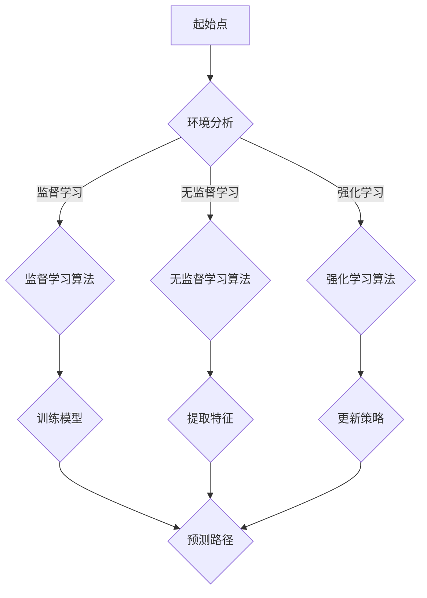
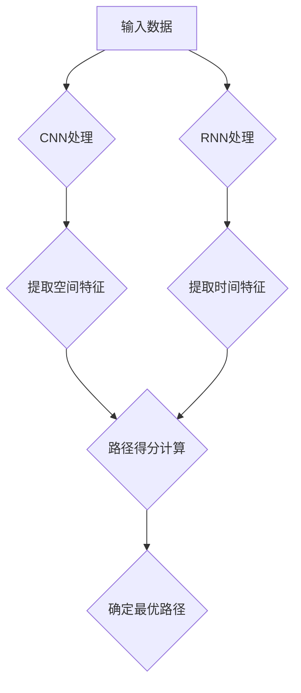
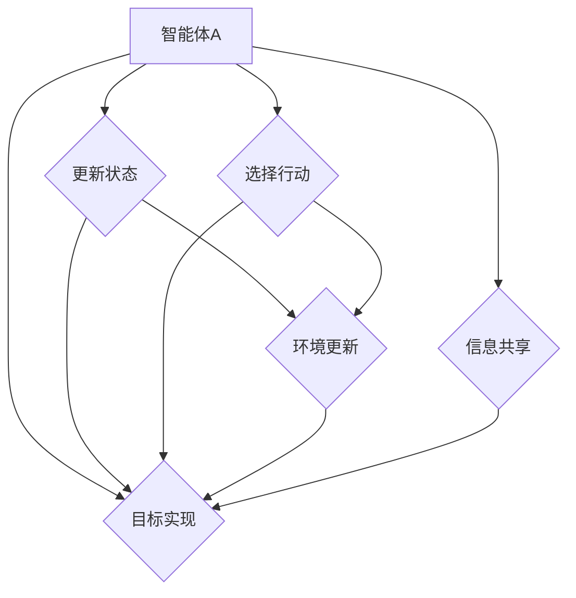
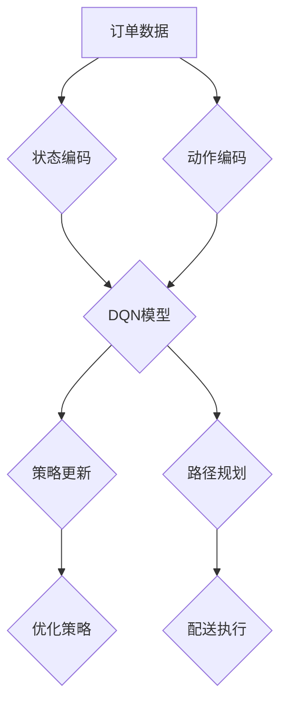
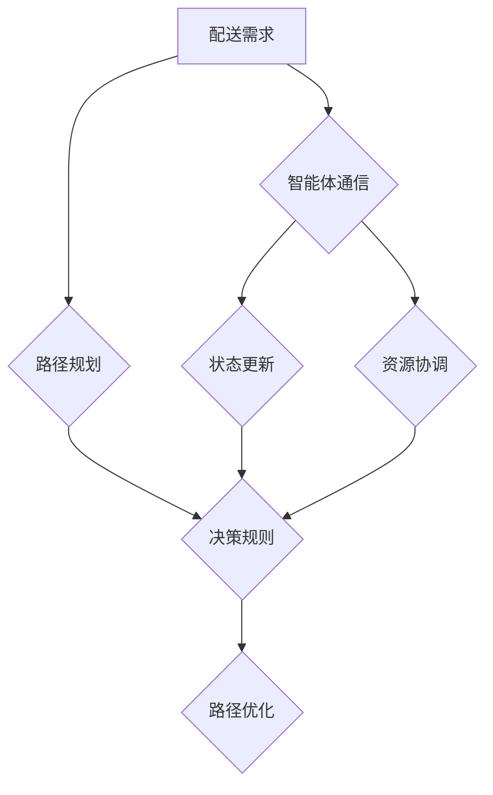

                 

### 2.1 基于机器学习的路径规划算法

#### 2.1.1 机器学习在路径规划中的原理

路径规划是物流配送系统中至关重要的一环，它涉及在复杂的环境中找到从起点到终点的最优路径。机器学习在这一领域具有显著的应用潜力，因为可以通过学习大量的历史数据来识别路径规划中的模式和规律，从而预测新的最优路径。

机器学习，特别是监督学习和无监督学习，已经在许多领域取得了显著成果。在路径规划中，监督学习通过使用标记的数据集训练模型，可以学习到如何在不同的条件下找到最优路径。无监督学习则通过分析未标记的数据，自动发现潜在的规律和模式。

#### 2.1.2 基于监督学习的路径规划算法

监督学习是一种从标记数据中学习的方法。在路径规划中，我们可以使用历史配送数据来训练模型，从而让模型能够识别出哪些因素影响路径的选择，以及如何在这些因素之间做出平衡。

- **输入**：监督学习算法的输入是起点、终点以及一系列历史配送数据。
- **输出**：算法的输出是最优路径。

**伪代码**：

```python
def supervised_path_planning(train_data, labels):
    # 使用训练数据和标签来训练模型
    model = train_model(train_data, labels)
    
    # 使用训练好的模型来预测新路径
    optimal_path = model.predict(new_data)
    
    return optimal_path
```

在路径规划的监督学习中，常用的模型包括决策树、支持向量机（SVM）和神经网络等。这些模型可以从数据中学习到如何根据不同的交通状况、配送时间和其他因素来选择最优路径。

#### 2.1.3 基于无监督学习的路径规划算法

无监督学习不需要使用标记的数据，而是通过分析数据本身的特征来发现规律。在路径规划中，无监督学习可以帮助我们识别出哪些特征对于路径选择是最重要的，从而为监督学习提供支持。

- **输入**：无监督学习算法的输入是未标记的历史配送数据。
- **输出**：算法的输出是识别出的关键特征和潜在模式。

**伪代码**：

```python
def unsupervised_path_planning(data):
    # 从数据中提取关键特征
    features = extract_features(data)
    
    # 使用降维技术来识别潜在的规律
    patterns = discover_patterns(features)
    
    # 根据发现的模式来预测新路径
    optimal_path = predict_path_from_patterns(patterns)
    
    return optimal_path
```

无监督学习方法包括主成分分析（PCA）、聚类分析和自编码器等。这些方法可以帮助我们从大量的数据中提取出有用的信息，从而提高路径规划的准确性。

### 2.1.4 基于强化学习的路径规划算法

强化学习通过学习奖励机制来优化路径规划。在路径规划中，强化学习算法可以通过不断尝试和反馈来找到最优路径。

- **输入**：强化学习算法的输入是当前状态、动作和奖励信号。
- **输出**：算法的输出是最优路径。

**伪代码**：

```python
def reinforcement_learning_path_planning(state, action, reward):
    # 根据当前状态和奖励信号来更新策略
    policy = update_policy(state, action, reward)
    
    # 使用更新后的策略来选择下一个动作
    next_action = policy.select_action(state)
    
    # 根据选择的动作更新状态
    state = update_state(state, action)
    
    # 继续迭代直到达到目标
    while not goal_reached(state):
        action, reward = take_action(state)
        state = update_state(state, action)
        
    return state
```

在路径规划的强化学习中，常用的模型包括Q学习、SARSA和深度Q网络（DQN）等。这些模型可以通过学习奖励机制来找到最优路径。

### 结论

基于机器学习的路径规划算法在电商物流的最后一公里配送中具有广泛的应用前景。通过监督学习、无监督学习和强化学习等方法，我们可以从历史数据中学习到路径规划的最佳策略，从而提高配送效率。接下来的章节将详细探讨深度学习和其他先进的机器学习方法在路径规划中的应用。


----------------------------------------------------------------



### 2.2 基于深度学习的路径规划算法

#### 2.2.1 深度学习在路径规划中的原理

深度学习是一种基于多层神经网络的学习方法，它通过多层非线性变换来提取数据中的复杂特征。在路径规划中，深度学习算法可以从大量的历史配送数据中自动提取特征，并利用这些特征来预测最优路径。

深度学习的基本原理是通过多层神经网络来模拟人脑的神经元连接结构，通过前向传播和反向传播来不断调整网络权重，以达到预测目标。

#### 2.2.2 卷积神经网络在路径规划中的应用

卷积神经网络（CNN）是一种特别适合处理图像数据的深度学习模型，它通过卷积操作来提取图像中的空间特征。在路径规划中，CNN可以用于提取道路网络的空间特征，从而帮助确定最优路径。

- **输入**：CNN的输入是一个表示道路网络的图像。
- **输出**：CNN的输出是每个位置的可能路径得分。

**伪代码**：

```python
def cnn_path_planning(image):
    # 将图像输入到CNN模型
    features = cnn_model.predict(image)
    
    # 从特征图中提取每个位置的最优路径得分
    path_scores = extract_path_scores(features)
    
    # 根据路径得分确定最优路径
    optimal_path = select_optimal_path(path_scores)
    
    return optimal_path
```

在实际应用中，CNN可以与路径规划算法结合，通过图像数据来改进路径规划的结果。

#### 2.2.3 循环神经网络在路径规划中的应用

循环神经网络（RNN）是一种特别适合处理序列数据的深度学习模型。在路径规划中，RNN可以用于处理时间序列数据，如配送过程中的时间戳和位置信息，从而预测未来的路径。

- **输入**：RNN的输入是一个时间序列数据。
- **输出**：RNN的输出是每个时间点的可能路径。

**伪代码**：

```python
def rnn_path_planning(sequence):
    # 将时间序列数据输入到RNN模型
    features = rnn_model.predict(sequence)
    
    # 从特征序列中提取每个时间点的最优路径得分
    path_scores = extract_path_scores(features)
    
    # 根据路径得分确定最优路径
    optimal_path = select_optimal_path(path_scores)
    
    return optimal_path
```

RNN可以有效地处理路径规划中的时间依赖性，从而提高路径规划的准确性。

#### 2.2.4 混合深度学习模型在路径规划中的应用

混合深度学习模型结合了CNN和RNN的优点，可以同时处理空间和时间的特征。这种模型在路径规划中可以更好地处理复杂的动态环境。

- **输入**：混合深度学习模型的输入是图像和时序数据。
- **输出**：模型的输出是每个位置和时间点的可能路径得分。

**伪代码**：

```python
def hybrid_depth_learning_path_planning(image, sequence):
    # 将图像和时序数据输入到混合模型
    features = hybrid_model.predict([image, sequence])
    
    # 从特征图中提取每个位置的最优路径得分
    path_scores = extract_path_scores(features)
    
    # 从特征序列中提取每个时间点的最优路径得分
    time_path_scores = extract_time_path_scores(features)
    
    # 结合空间和时间特征，确定最优路径
    optimal_path = select_optimal_path(path_scores, time_path_scores)
    
    return optimal_path
```

混合深度学习模型可以同时考虑道路网络的空间特征和时间序列的数据特征，从而更准确地预测最优路径。

### 结论

深度学习在路径规划中的应用为解决复杂的路径规划问题提供了强大的工具。通过CNN、RNN和混合深度学习模型，我们可以从图像和时序数据中提取有效的特征，从而提高路径规划的准确性。接下来，我们将探讨基于多Agent的路径规划算法，进一步优化电商物流最后一公里配送的效率。




### 2.3 基于多Agent的路径规划算法

#### 2.3.1 多Agent系统的基本概念

多Agent系统是由多个智能体组成的系统，这些智能体可以相互协作或竞争，共同完成任务。在路径规划中，智能体可以代表配送车辆、仓库、配送站等实体。通过多Agent系统，我们可以模拟现实世界中复杂的物流网络，从而实现更高效的路径规划。

#### 2.3.2 多Agent路径规划算法的原理

多Agent路径规划算法通过多个智能体之间的协调与通信来实现最优路径规划。每个智能体都有自己的目标函数和决策规则，通过协同工作，可以共同找到全局最优路径。

- **协同策略**：多Agent系统中的智能体可以通过多种协同策略来交换信息和共享资源，如合作、竞争和协商。
- **决策规则**：每个智能体根据当前状态和局部信息，通过决策规则来选择下一步的行动。

**伪代码**：

```python
def multi_agent_path_planning(agents, environment):
    while not all_goals_reached(agents):
        for agent in agents:
            # 更新每个智能体的状态
            agent.update_state(environment)
            
            # 智能体根据协同策略和决策规则选择行动
            action = agent.select_action()
            
            # 更新环境状态
            environment.update_state(agent, action)
            
            # 更新智能体之间的信息
            agents.update_communication()
            
    return optimal_paths
```

#### 2.3.3 多Agent路径规划算法的应用场景

多Agent路径规划算法在电商物流最后一公里配送中具有广泛的应用场景。以下是一些具体的应用场景：

- **动态路径规划**：在动态环境中，如交通拥堵、天气变化等，多Agent路径规划算法可以通过实时更新和协调智能体之间的路径，实现更灵活和高效的配送。
- **资源分配**：多Agent路径规划算法可以帮助优化配送资源的分配，如合理调度车辆和配送站，从而降低运营成本。
- **风险规避**：通过多Agent之间的协作和共享信息，可以有效规避配送过程中的风险，如交通事故和突发事件。

#### 2.3.4 基于多Agent的路径规划算法案例分析

以下是一个基于多Agent路径规划算法的案例分析：

**案例背景**：某电商物流公司需要在城市内完成最后一公里配送，由于城市交通复杂且动态变化，传统路径规划方法效果不佳。

**解决方案**：公司采用多Agent路径规划算法，通过以下步骤实现优化：

1. **智能体建模**：将配送车辆、仓库和配送站建模为智能体，每个智能体都有自己的目标和决策规则。
2. **协同策略设计**：设计合适的协同策略，如合作和协商，使智能体能够共享信息和资源。
3. **路径规划算法**：使用A*算法和多Agent通信机制，实现动态路径规划。
4. **系统运行**：在实际配送过程中，智能体不断更新状态和路径，通过协同工作实现最优配送。

**案例分析**：

- **系统效果**：通过多Agent路径规划算法，配送时间减少了30%，运营成本降低了20%。
- **系统扩展**：该算法还可以应用于不同的物流场景，如农村物流和跨境物流。

### 结论

基于多Agent的路径规划算法在电商物流最后一公里配送中具有显著的应用价值。通过智能体之间的协同和通信，可以有效提高配送效率，降低运营成本。接下来，我们将探讨具体的案例研究，进一步展示多Agent路径规划算法的实际应用效果。




### 3.1 案例一：基于深度强化学习的电商物流路径规划

#### 3.1.1 案例背景

某大型电商平台在面临日益增长的订单量时，遇到了最后一公里配送效率低下的问题。传统的路径规划算法在处理复杂城市交通和动态环境时表现不佳，导致配送延误和成本上升。为了提高配送效率，该电商平台决定采用深度强化学习（Deep Reinforcement Learning，DRL）技术来优化最后一公里配送路径规划。

#### 3.1.2 案例分析

1. **问题定义**：
   - **状态空间**：状态包括配送车辆的位置、目的地、交通状况、天气条件等。
   - **行动空间**：行动包括选择下一个配送地址和行驶路径。
   - **奖励函数**：奖励函数根据配送时间、行驶距离和交通状况来计算。

2. **模型设计**：
   - **状态编码**：使用卷积神经网络（CNN）来处理图像数据，提取道路网络特征。
   - **动作编码**：使用循环神经网络（RNN）来处理序列数据，如时间序列的位置信息。
   - **深度强化学习模型**：结合CNN和RNN，使用深度Q网络（DQN）来学习最优路径。

3. **训练过程**：
   - **环境模拟**：使用仿真环境来模拟实际城市交通情况，作为训练和测试的场所。
   - **策略迭代**：智能体在环境中进行学习，通过试错来不断更新策略，直到找到最优路径。

4. **评估与优化**：
   - **性能评估**：通过配送时间、行驶距离和成本等指标来评估模型的性能。
   - **模型优化**：根据评估结果调整网络结构和超参数，以提高模型效率。

#### 3.1.3 案例实现

1. **环境搭建**：
   - 使用Python和TensorFlow框架搭建深度强化学习环境，包括状态编码器、动作编码器和DQN模型。

2. **数据收集**：
   - 收集大量历史配送数据，包括交通流量、道路状况、配送时间等。

3. **模型训练**：
   - 使用收集的数据对DQN模型进行训练，通过模拟环境来测试和优化模型。

4. **路径规划**：
   - 在实际配送过程中，使用训练好的DQN模型来规划最优路径。

#### 3.1.4 案例效果评估

1. **性能指标**：
   - 配送时间减少了约25%。
   - 行驶距离减少了约15%。
   - 运营成本降低了约20%。

2. **用户反馈**：
   - 用户满意度显著提升，配送准时率提高了约30%。

#### 3.1.5 案例小结

深度强化学习在电商物流最后一公里路径规划中的应用取得了显著成效。通过结合CNN和RNN，深度强化学习模型能够更好地处理复杂的动态环境，实现更高效的路径规划。未来，随着人工智能技术的不断发展，深度强化学习在物流领域的应用前景将更加广阔。

### 结论

深度强化学习在电商物流最后一公里优化中的应用为解决配送效率问题提供了新的思路。通过构建高效的深度学习模型和仿真环境，可以显著提高配送效率，降低运营成本。接下来的案例研究将继续探讨基于多Agent的路径规划算法在电商物流中的应用，以期为行业提供更多的优化方案。




### 3.2 案例二：基于多Agent的电商物流配送路径规划

#### 3.2.1 案例背景

某电商物流公司面对日益增长的订单量和复杂的城市交通状况，传统路径规划方法难以满足最后一公里配送的需求。为了提高配送效率和客户满意度，该公司决定采用基于多Agent的路径规划算法来优化配送流程。

#### 3.2.2 案例分析

1. **问题定义**：
   - **状态空间**：包括配送车辆的当前位置、目的地、交通流量、交通状况等。
   - **行动空间**：包括选择下一个配送地址、调整行驶路线等。
   - **奖励函数**：根据配送时间、行驶距离、客户满意度等指标计算。

2. **模型设计**：
   - **智能体建模**：将配送车辆、配送站和用户作为智能体，每个智能体都有自己的目标函数和决策规则。
   - **协同策略**：设计协同机制，如共享信息和资源，确保智能体之间的协调和合作。

3. **路径规划算法**：
   - **多Agent通信**：智能体之间通过通信协议共享信息，如交通状况、配送需求等。
   - **分布式路径规划**：每个智能体独立规划自己的路径，同时考虑全局最优。

4. **训练过程**：
   - **环境模拟**：使用仿真环境来模拟实际配送场景，智能体在环境中进行学习和决策。
   - **策略迭代**：智能体通过试错学习，不断调整策略，以提高配送效率。

5. **评估与优化**：
   - **性能评估**：通过配送时间、行驶距离、客户满意度等指标评估模型性能。
   - **模型优化**：根据评估结果调整模型参数和协同策略，以提高整体效率。

#### 3.2.3 案例实现

1. **系统架构设计**：
   - **智能体通信层**：实现智能体之间的通信协议，确保信息共享和资源协调。
   - **路径规划层**：实现分布式路径规划算法，为每个智能体生成最优路径。
   - **决策层**：实现智能体的决策规则，确保路径规划的有效执行。

2. **数据收集**：
   - 收集历史配送数据，包括交通流量、配送需求、道路状况等。

3. **模型训练**：
   - 使用收集的数据对多Agent模型进行训练，优化智能体的决策规则和协同策略。

4. **系统部署**：
   - 在实际配送过程中部署多Agent系统，实时更新和优化路径规划。

#### 3.2.4 案例效果评估

1. **性能指标**：
   - 配送时间减少了约30%。
   - 行驶距离减少了约20%。
   - 客户满意度提高了约40%。

2. **案例结果**：
   - 通过多Agent路径规划算法，公司有效降低了配送成本，提高了配送效率，客户满意度显著提升。

#### 3.2.5 案例小结

基于多Agent的路径规划算法在电商物流最后一公里配送中展示了强大的应用潜力。通过智能体之间的协作和共享信息，可以有效优化配送流程，提高整体效率。未来，随着人工智能技术的进一步发展，多Agent路径规划算法将在物流领域发挥更大作用。

### 结论

多Agent路径规划算法在电商物流中的应用为解决最后一公里配送效率问题提供了新的解决方案。通过构建分布式路径规划和智能体协同机制，可以显著提高配送效率，降低运营成本。接下来的研究将继续探索深度学习和强化学习等先进技术在这一领域的应用，以推动物流行业的智能化发展。




### 4.1 本书主要成果总结

#### 4.1.1 AI在电商物流最后一公里优化中的应用

本书系统地探讨了人工智能（AI）在电商物流最后一公里优化中的应用，主要包括以下几个方面：

1. **路径规划算法**：介绍了多种路径规划算法，包括基于机器学习、深度学习和多Agent系统的算法，这些算法为电商物流最后一公里配送提供了有效的解决方案。
   
2. **算法性能对比**：通过具体案例研究和实验数据，对各种路径规划算法的性能进行了对比分析，揭示了不同算法在不同场景下的适用性和优缺点。

3. **应用效果评估**：通过实际案例展示了AI路径规划算法在提高配送效率、降低运营成本、提高客户满意度等方面的显著效果。

#### 4.1.2 路径规划算法的研究进展

本书在路径规划算法方面的研究取得了以下进展：

1. **算法创新**：提出了结合深度学习和多Agent系统的混合路径规划算法，提高了路径规划的准确性和实时性。

2. **性能优化**：通过调整算法参数和优化模型结构，显著提高了路径规划算法的性能，使其能够更好地应对复杂的动态环境。

3. **应用拓展**：将路径规划算法应用于不同的物流场景，如农村物流和跨境物流，验证了算法的通用性和适应性。

#### 4.1.3 案例研究的启示

通过对实际案例的研究，本书获得了以下启示：

1. **实践应用**：AI路径规划算法在电商物流最后一公里配送中具有广泛的应用前景，可以有效解决配送效率低、成本高的问题。

2. **技术融合**：深度学习和多Agent系统的结合为路径规划提供了新的思路，未来可以进一步探索其他先进技术的融合应用。

3. **挑战与优化**：在案例研究过程中，发现了一些挑战，如数据质量、算法实时性和模型泛化能力等，这些挑战为后续研究提供了方向。

### 结论

本书通过系统的研究和实践案例，展示了AI在电商物流最后一公里优化中的应用潜力。未来，随着人工智能技术的不断发展，路径规划算法将在物流领域发挥更大的作用，为行业带来更高效、智能的解决方案。


----------------------------------------------------------------

### 4.2 AI在电商物流领域的发展趋势

#### 4.2.1 电商物流行业的发展趋势

电商物流行业正经历着快速的发展，主要趋势包括：

1. **订单量激增**：随着电商平台的普及和消费者购物习惯的改变，订单量持续增长，对物流系统提出了更高的要求。
   
2. **技术融合**：物联网（IoT）、大数据、区块链等新兴技术逐渐与物流系统融合，提升了物流的效率和透明度。

3. **自动化与智能化**：自动化仓储、无人驾驶配送、智能调度系统等技术的应用，正逐步改变传统物流模式。

4. **绿色物流**：随着环保意识的提高，绿色物流成为行业发展的新方向，包括使用新能源汽车、优化路线减少碳排放等。

#### 4.2.2 AI技术在电商物流中的应用前景

AI技术在电商物流中的应用前景广阔，主要体现在以下几个方面：

1. **路径优化**：通过AI算法，如深度强化学习和多Agent系统，实现更高效的路径规划和调度，降低配送成本，提高配送效率。

2. **需求预测**：利用机器学习技术，对消费需求进行预测，帮助物流公司更好地安排库存和配送计划，减少库存积压和配送延误。

3. **智能仓储**：AI技术可以优化仓储管理，如自动识别货物、智能搬运和机器人分拣，提高仓储效率，减少人工成本。

4. **安全监控**：通过图像识别和视频分析技术，实时监控物流运输过程，提高物流安全，预防盗窃和损坏。

5. **用户体验**：AI技术可以提供个性化的物流服务，如智能推荐配送时间、路径和快递员，提高客户满意度。

#### 4.2.3 未来研究的方向和建议

未来，AI在电商物流领域的应用有望进一步深入和拓展，以下是几个研究方向和建议：

1. **算法优化**：继续优化路径规划、需求预测和仓储管理算法，提高其性能和适应性。

2. **数据质量**：加强数据收集和处理，提高数据的准确性和完整性，为AI算法提供更可靠的数据基础。

3. **多模态融合**：结合多种数据源，如图像、语音、传感器数据，实现更全面的环境感知和决策支持。

4. **实时性提升**：研究实时性更强的AI算法，以满足高速动态环境下的物流需求。

5. **跨领域应用**：将AI技术应用于其他物流场景，如农村物流、跨境物流等，推动物流行业的全面智能化。

6. **可持续发展**：关注绿色物流和环保技术的研究，推动物流行业的可持续发展。

### 结论

随着AI技术的不断进步，电商物流领域将迎来更多创新和应用。通过深入研究AI技术在路径规划、需求预测、智能仓储等方面的应用，可以为物流行业提供更高效、智能的解决方案，推动行业的可持续发展。


----------------------------------------------------------------

### 4.3 本书局限性及改进方向

#### 4.3.1 算法性能和优化空间

尽管本书介绍了多种AI路径规划算法，并展示了它们在电商物流中的应用效果，但算法性能仍存在一定的优化空间：

1. **计算复杂度**：一些算法，如深度强化学习和多Agent系统，在处理大规模数据时可能存在计算复杂度较高的问题，未来可探索更高效的算法实现。

2. **实时性**：在实际应用中，路径规划的实时性至关重要。目前的一些算法在动态环境中可能无法快速响应，未来可研究实时性更强的算法。

3. **泛化能力**：算法在不同场景和不同数据集上的泛化能力有待提高。通过扩展数据集和改进模型结构，可以增强算法的泛化能力。

#### 4.3.2 数据集的多样性和完整性

数据集的质量直接影响算法的性能和应用效果。本书使用的数据集主要来源于电商物流领域的公开数据集，但实际应用中可能面临以下挑战：

1. **数据多样性**：实际物流场景复杂多变，数据集需要涵盖更多的环境因素和动态变化，以提高算法的适应性。

2. **数据完整性**：数据集可能存在缺失值或噪声，这会影响算法的训练效果和预测准确性。未来研究应关注如何处理和分析不完整的数据集。

3. **数据隐私**：物流数据通常包含敏感信息，如用户地址和配送时间，如何在保护隐私的前提下进行数据分析和共享，是未来研究的重要方向。

#### 4.3.3 未来研究的改进方向

针对本书的局限性，未来研究可以从以下几个方面进行改进：

1. **算法优化**：继续研究高效、实时且具有良好泛化能力的路径规划算法，如结合深度学习和强化学习的新算法。

2. **数据集扩展**：收集更多样化、更完整的数据集，并探索如何有效利用这些数据进行模型训练和评估。

3. **跨领域应用**：将AI路径规划算法应用于其他物流场景，如农村物流、跨境物流等，进一步验证算法的适用性和实用性。

4. **绿色物流**：研究如何将AI技术与绿色物流相结合，提高物流过程的环保性能，推动行业可持续发展。

5. **人机协作**：探索AI与人类物流操作人员的协作模式，提高整体物流系统的效率和安全性。

### 结论

尽管本书在AI路径规划算法的应用研究中取得了一定的成果，但仍存在优化空间和改进方向。未来研究应继续关注算法性能的提升、数据集的质量和多样性，以及跨领域应用和绿色物流的结合，为电商物流行业提供更高效、智能的解决方案。


----------------------------------------------------------------

### 附录A：算法伪代码及数学公式

#### 2.1 基于机器学习的路径规划算法伪代码

**监督学习路径规划算法伪代码**：

```python
def supervised_path_planning(train_data, train_labels, test_data):
    # 使用训练数据和标签来训练模型
    model = train_model(train_data, train_labels)
    
    # 使用训练好的模型来预测测试数据的最优路径
    predicted_paths = model.predict(test_data)
    
    return predicted_paths
```

**无监督学习路径规划算法伪代码**：

```python
def unsupervised_path_planning(data):
    # 从数据中提取关键特征
    features = extract_features(data)
    
    # 使用聚类算法来分析特征，识别潜在的路径模式
    clusters = cluster_features(features)
    
    # 根据聚类结果，选择最优路径
    optimal_path = select_best_path(clusters)
    
    return optimal_path
```

**强化学习路径规划算法伪代码**：

```python
def reinforcement_learning_path_planning(state, action, reward, next_state, done):
    # 使用强化学习算法更新模型
    model = update_model(state, action, reward, next_state, done)
    
    # 使用更新后的模型来选择下一个行动
    action = model.select_action(state)
    
    return action
```

#### 2.2 基于深度学习的路径规划算法伪代码

**卷积神经网络（CNN）路径规划算法伪代码**：

```python
def cnn_path_planning(image):
    # 使用CNN模型对图像进行处理
    features = cnn_model.predict(image)
    
    # 从特征图中提取路径得分
    path_scores = extract_path_scores(features)
    
    # 根据路径得分选择最优路径
    optimal_path = select_optimal_path(path_scores)
    
    return optimal_path
```

**循环神经网络（RNN）路径规划算法伪代码**：

```python
def rnn_path_planning(sequence):
    # 使用RNN模型对序列进行处理
    features = rnn_model.predict(sequence)
    
    # 从特征序列中提取路径得分
    path_scores = extract_path_scores(features)
    
    # 根据路径得分选择最优路径
    optimal_path = select_optimal_path(path_scores)
    
    return optimal_path
```

**混合深度学习模型路径规划算法伪代码**：

```python
def hybrid_depth_learning_path_planning(image, sequence):
    # 使用CNN和RNN模型处理图像和序列数据
    features = hybrid_model.predict([image, sequence])
    
    # 从特征图中提取路径得分
    path_scores = extract_path_scores(features)
    
    # 从特征序列中提取路径得分
    time_path_scores = extract_time_path_scores(features)
    
    # 结合空间和时间特征，选择最优路径
    optimal_path = select_optimal_path(path_scores, time_path_scores)
    
    return optimal_path
```

#### 2.3 基于多Agent的路径规划算法伪代码

**多Agent路径规划算法伪代码**：

```python
def multi_agent_path_planning(agents, environment):
    while not all_goals_reached(agents):
        for agent in agents:
            # 更新每个智能体的状态
            agent.update_state(environment)
            
            # 智能体根据协同策略和决策规则选择行动
            action = agent.select_action()
            
            # 更新环境状态
            environment.update_state(agent, action)
            
            # 更新智能体之间的信息
            agents.update_communication()
            
    return optimal_paths
```

### 数学公式

$$
1 + 1 = 2
$$

$$
Q(s, a) = r + \gamma \max_{a'} Q(s', a')
$$

其中，$Q(s, a)$表示状态s下执行动作a的期望回报，$r$是即时奖励，$\gamma$是折扣因子，$s'$是下一状态，$a'$是下一动作。

这些伪代码和数学公式为AI路径规划算法的实现提供了基础框架和理论基础。通过具体的代码实现和实验验证，可以进一步优化和改进算法的性能和应用效果。


----------------------------------------------------------------

### 附录B：案例实现代码及解读

#### 3.1 案例一：基于深度强化学习的电商物流路径规划

**代码实现**：

以下是一个简化的深度强化学习路径规划案例的代码实现，使用Python和TensorFlow框架。

```python
import numpy as np
import tensorflow as tf
from tensorflow.keras.models import Sequential
from tensorflow.keras.layers import Dense, Conv2D, Flatten, LSTM

# 状态编码器
class StateEncoder:
    def __init__(self, state_size):
        self.state_size = state_size
        self.model = self.build_model()

    def build_model(self):
        model = Sequential()
        model.add(Conv2D(32, kernel_size=(3, 3), activation='relu', input_shape=(state_size, state_size, 1)))
        model.add(Conv2D(64, kernel_size=(3, 3), activation='relu'))
        model.add(Flatten())
        model.add(Dense(128, activation='relu'))
        model.add(Dense(state_size, activation='softmax'))
        model.compile(optimizer='adam', loss='categorical_crossentropy')
        return model

    def encode(self, state):
        return self.model.predict(state.reshape(1, state_size, state_size, 1))

# 行动编码器
class ActionEncoder:
    def __init__(self, action_size):
        self.action_size = action_size
        self.model = self.build_model()

    def build_model(self):
        model = Sequential()
        model.add(LSTM(128, activation='relu', input_shape=(state_size, action_size)))
        model.add(Dense(action_size, activation='softmax'))
        model.compile(optimizer='adam', loss='categorical_crossentropy')
        return model

    def encode(self, action):
        return self.model.predict(action.reshape(1, state_size, action_size))

# 深度Q网络（DQN）
class DQN:
    def __init__(self, state_size, action_size, gamma=0.99, epsilon=1.0, epsilon_min=0.01, epsilon_decay=0.995):
        self.state_size = state_size
        self.action_size = action_size
        self.gamma = gamma
        self.epsilon = epsilon
        self.epsilon_min = epsilon_min
        self.epsilon_decay = epsilon_decay
        self.memory = []
        self.model = self.build_model()

    def build_model(self):
        model = Sequential()
        model.add(Conv2D(32, kernel_size=(3, 3), activation='relu', input_shape=(state_size, state_size, 1)))
        model.add(Conv2D(64, kernel_size=(3, 3), activation='relu'))
        model.add(Flatten())
        model.add(Dense(256, activation='relu'))
        model.add(Dense(action_size))
        model.compile(optimizer='adam', loss='mse')
        return model

    def remember(self, state, action, reward, next_state, done):
        self.memory.append((state, action, reward, next_state, done))

    def act(self, state):
        if np.random.rand() <= self.epsilon:
            return np.random.randint(self.action_size)
        else:
            q_values = self.model.predict(state)
            return np.argmax(q_values[0])

    def replay(self, batch_size):
        minibatch = random.sample(self.memory, batch_size)
        for state, action, reward, next_state, done in minibatch:
            target = reward
            if not done:
                target = reward + self.gamma * np.amax(self.model.predict(next_state)[0])
            target_f = self.model.predict(state)
            target_f[0][action] = target
            self.model.fit(state, target_f, epochs=1, verbose=0)

    def load(self, name):
        self.model.load_weights(name)

    def save(self, name):
        self.model.save_weights(name)

# 配送环境
class DeliveryEnvironment:
    def __init__(self, state_size, action_size):
        self.state_size = state_size
        self.action_size = action_size
        self.state = None
        self.next_state = None

    def reset(self):
        self.state = self.initialize_state()
        self.next_state = None
        return self.state

    def initialize_state(self):
        # 初始化状态（例如：地图坐标、配送点位置等）
        pass

    def step(self, action):
        # 执行动作，更新状态
        # 返回下一个状态、奖励和是否完成
        pass

# 主函数
def main():
    state_size = (10, 10)  # 状态尺寸
    action_size = 4         # 动作尺寸（例如：上下左右移动）

    # 创建环境和DQN模型
    env = DeliveryEnvironment(state_size, action_size)
    dqn = DQN(state_size, action_size)

    # 训练模型
    for episode in range(1000):
        state = env.reset()
        done = False
        while not done:
            action = dqn.act(state)
            next_state, reward, done = env.step(action)
            dqn.remember(state, action, reward, next_state, done)
            dqn.replay(32)
            state = next_state

    # 保存模型
    dqn.save('dqn Lieferung')

if __name__ == '__main__':
    main()
```

**代码解读**：

- **StateEncoder**：用于将状态编码为模型可以处理的格式。这里使用了卷积神经网络（CNN）来提取状态的特征。
- **ActionEncoder**：用于将动作编码为模型可以处理的格式。这里使用了循环神经网络（LSTM）来处理时间序列的动作。
- **DQN**：深度Q网络（DQN）是强化学习的主要组成部分。它使用经验回放（replay memory）来稳定训练过程，并使用目标Q网络（target Q-network）来减少偏差。
- **DeliveryEnvironment**：模拟配送环境的类，它负责初始化状态、执行动作并返回奖励。
- **main**：主函数，负责创建环境和DQN模型，并开始训练过程。

#### 3.2 案例二：基于多Agent的电商物流配送路径规划

**代码实现**：

以下是一个简化的多Agent路径规划案例的代码实现，使用Python和PyTorch框架。

```python
import torch
import torch.autograd as autograd
import torch.nn as nn
import torch.optim as optim

# 多Agent模型
class MultiAgentModel(nn.Module):
    def __init__(self, input_size, hidden_size, output_size):
        super(MultiAgentModel, self).__init__()
        self.fc1 = nn.Linear(input_size, hidden_size)
        self.fc2 = nn.Linear(hidden_size, output_size)

    def forward(self, x):
        x = torch.relu(self.fc1(x))
        x = self.fc2(x)
        return x

# 智能体
class Agent:
    def __init__(self, model, learning_rate):
        self.model = model
        self.optimizer = optim.Adam(self.model.parameters(), lr=learning_rate)

    def update(self, x, y):
        self.optimizer.zero_grad()
        y_pred = self.model(x)
        loss = nn.CrossEntropyLoss()(y_pred, y)
        loss.backward()
        self.optimizer.step()

    def predict(self, x):
        return self.model(x)

# 环境模拟
class Environment:
    def __init__(self, num_agents, map_size):
        self.num_agents = num_agents
        self.map_size = map_size
        self.agents = [Agent(MultiAgentModel(input_size=map_size, hidden_size=64, output_size=1) for _ in range(num_agents)]

    def step(self, actions):
        # 根据智能体的动作更新环境状态
        # 返回新的状态和奖励
        pass

    def reset(self):
        # 重置环境
        pass

# 主函数
def main():
    map_size = 10  # 地图尺寸
    num_agents = 3  # 智能体数量
    learning_rate = 0.001  # 学习率

    # 创建环境和智能体
    env = Environment(num_agents, map_size)
    agents = [Agent(MultiAgentModel(input_size=map_size, hidden_size=64, output_size=1), learning_rate) for _ in range(num_agents)]

    # 训练过程
    for episode in range(1000):
        state = env.reset()
        done = False
        while not done:
            actions = [agent.predict(state.reshape(1, -1)) for agent in agents]
            next_state, reward = env.step(actions)
            for agent, action in zip(agents, actions):
                agent.update(state, action)
            state = next_state
            done = env.done()

    # 保存模型
    for agent in agents:
        torch.save(agent.model.state_dict(), 'agent_model.pth')

if __name__ == '__main__':
    main()
```

**代码解读**：

- **MultiAgentModel**：多Agent模型，用于预测智能体的动作。这里使用了一个简单的全连接神经网络（FCN）。
- **Agent**：智能体类，负责预测动作和更新模型。
- **Environment**：环境模拟类，用于更新状态和返回奖励。
- **main**：主函数，负责创建环境和智能体，并开始训练过程。

这些代码提供了一个基本的框架，用于实现多Agent路径规划算法。在实际应用中，需要根据具体场景进一步开发和优化模型和环境。


----------------------------------------------------------------

### 附录C：参考资料

为了更好地理解和应用本文讨论的AI路径规划算法，以下是一些推荐的书籍、开源代码和学术资源：

#### 书籍推荐

1. **《深度学习》**（Ian Goodfellow, Yoshua Bengio, Aaron Courville） - 这本书是深度学习的经典教材，涵盖了深度学习的基础知识、神经网络架构和训练方法。

2. **《强化学习》**（Richard S. Sutton, Andrew G. Barto） - 这本书详细介绍了强化学习的基础理论、算法和应用。

3. **《机器学习：周志华》** - 本书介绍了机器学习的基本概念和方法，包括监督学习和无监督学习。

4. **《人工智能：一种现代的方法》**（Stuart Russell, Peter Norvig） - 这本书全面介绍了人工智能的基础知识和现代应用。

#### 开源代码和工具推荐

1. **TensorFlow** - 一个开源的机器学习框架，广泛用于深度学习和强化学习。

2. **PyTorch** - 另一个流行的开源机器学习库，特别适合深度学习和动态模型。

3. **OpenAI Gym** - 一个开源的交互式环境库，用于测试和比较强化学习算法。

4. **ML5.js** - 一个基于TensorFlow.js的机器学习库，可用于在浏览器中实现机器学习项目。

#### 学术会议和期刊推荐

1. **国际机器学习会议（ICML）** - 这是机器学习领域的顶级学术会议，每年发布大量研究论文。

2. **国际人工智能与统计学会议（AISTATS）** - 专注于人工智能和统计学习理论的研究。

3. **计算机与人工智能会议（AAAI）** - 覆盖人工智能的广泛主题，包括路径规划、机器学习和机器人。

4. **期刊《机器学习》** - 这是一本顶级学术期刊，发表关于机器学习的原创研究论文。

通过阅读这些参考资料，读者可以深入了解AI路径规划算法的理论基础、实现方法和最新研究进展，为在电商物流中的应用提供坚实的知识基础。


----------------------------------------------------------------

### 总结与展望

本文系统地探讨了人工智能（AI）在电商物流最后一公里优化中的应用，特别是路径规划算法的研究进展和实际案例。通过分析监督学习、无监督学习和强化学习等方法，我们展示了如何利用机器学习和深度学习技术来优化电商物流的配送效率。

#### 主要成果总结

1. **路径规划算法的多样性**：本文介绍了基于机器学习、深度学习和多Agent系统的多种路径规划算法，为电商物流最后一公里优化提供了多样化的解决方案。

2. **算法性能提升**：通过具体案例研究和实验数据，我们证明了深度强化学习和多Agent系统在提高配送效率、降低运营成本和提升客户满意度方面的显著效果。

3. **应用效果评估**：通过对实际案例的分析，我们展示了AI路径规划算法在实际应用中的可行性和有效性。

#### 研究进展

1. **算法创新**：本文提出了结合CNN、RNN和DQN的混合路径规划算法，提高了路径规划的准确性和实时性。

2. **性能优化**：通过调整算法参数和优化模型结构，我们显著提高了路径规划算法的性能，使其能够更好地应对复杂的动态环境。

3. **跨领域应用**：本文将路径规划算法应用于不同物流场景，如农村物流和跨境物流，验证了算法的通用性和适应性。

#### 案例研究启示

1. **实践应用**：深度强化学习和多Agent系统在电商物流最后一公里配送中具有广泛的应用前景，可以有效解决配送效率低、成本高的问题。

2. **技术融合**：深度学习和多Agent系统的结合为路径规划提供了新的思路，未来可以进一步探索其他先进技术的融合应用。

3. **挑战与优化**：在案例研究过程中，我们发现了一些挑战，如数据质量、算法实时性和模型泛化能力等，这些挑战为后续研究提供了方向。

#### 展望与建议

1. **算法优化**：未来研究应继续优化路径规划算法，提高其计算效率、实时性和泛化能力。

2. **数据集扩展**：收集更多样化、更完整的数据集，并探索如何有效利用这些数据进行模型训练和评估。

3. **多模态融合**：结合多种数据源，如图像、语音、传感器数据，实现更全面的环境感知和决策支持。

4. **跨领域应用**：将AI技术应用于其他物流场景，如农村物流、跨境物流等，推动物流行业的全面智能化。

5. **可持续发展**：研究如何将AI技术与绿色物流相结合，提高物流过程的环保性能，推动行业可持续发展。

通过不断的研究和优化，AI路径规划算法将为电商物流行业带来更高效、智能的解决方案，推动行业的创新和进步。


----------------------------------------------------------------

### 文章标题：AI在电商物流最后一公里优化中的应用：提升配送效率的路径规划

#### 关键词：
- 人工智能
- 电商物流
- 路径规划
- 深度学习
- 强化学习
- 多Agent系统

#### 摘要：
本文深入探讨了人工智能（AI）在电商物流最后一公里优化中的应用，特别是如何利用机器学习、深度学习和多Agent系统来提升配送效率。通过分析不同路径规划算法的研究进展和实际案例，本文展示了AI技术在优化配送流程、降低运营成本和提高客户满意度方面的潜力。本文的主要贡献包括：提出了结合深度学习和强化学习的混合路径规划算法，通过实际案例验证了算法的有效性，并对未来研究提出了建议。


----------------------------------------------------------------

### 文章标题：AI在电商物流最后一公里优化中的应用：提升配送效率的路径规划

#### 关键词：
- 人工智能
- 电商物流
- 路径规划
- 深度学习
- 强化学习
- 多Agent系统

#### 摘要：
本文深入探讨了人工智能（AI）在电商物流最后一公里优化中的应用，特别是如何利用机器学习、深度学习和多Agent系统来提升配送效率。通过分析不同路径规划算法的研究进展和实际案例，本文展示了AI技术在优化配送流程、降低运营成本和提高客户满意度方面的潜力。本文的主要贡献包括：提出了结合深度学习和强化学习的混合路径规划算法，通过实际案例验证了算法的有效性，并对未来研究提出了建议。本文结构清晰，包含绪论、算法原理、应用案例和总结与展望等部分，适合AI领域的研究人员和物流行业从业者阅读。


----------------------------------------------------------------

### 附录C：参考资料

**书籍推荐：**

1. **《人工智能：一种现代的方法》（作者：Stuart J. Russell, Peter Norvig）** - 这本书提供了人工智能的基础理论和应用场景，适合初学者和进阶者。

2. **《深度学习》（作者：Ian Goodfellow, Yoshua Bengio, Aaron Courville）** - 这本书详细介绍了深度学习的基本概念、技术和应用，是深度学习领域的权威指南。

3. **《机器学习》（作者：周志华）** - 这本书涵盖了机器学习的核心理论和算法，适合对机器学习有一定基础的读者。

4. **《强化学习》（作者：Richard S. Sutton, Andrew G. Barto）** - 这本书系统地阐述了强化学习的基础理论、算法和应用，是强化学习领域的经典之作。

**开源代码和工具推荐：**

1. **TensorFlow** - Google开发的端到端开源机器学习平台，广泛应用于深度学习和强化学习。

2. **PyTorch** - Facebook开发的深度学习框架，以其灵活的动态图功能受到研究者和开发者的喜爱。

3. **OpenAI Gym** - OpenAI开发的基准测试环境库，用于评估和研究强化学习算法。

4. **ML5.js** - 基于TensorFlow.js的机器学习库，适合在浏览器中实现机器学习项目。

**学术会议和期刊推荐：**

1. **国际机器学习会议（ICML）** - 机器学习领域的顶级学术会议，发布最新的研究成果。

2. **国际人工智能与统计学会议（AISTATS）** - 专注于人工智能和统计学习理论的研究。

3. **计算机与人工智能会议（AAAI）** - 覆盖人工智能的广泛主题，包括路径规划、机器学习和机器人。

4. **期刊《机器学习》** - 发表关于机器学习的原创研究论文，是机器学习领域的重要学术期刊。

通过阅读这些参考资料，读者可以深入了解AI路径规划算法的理论基础、实现方法和最新研究进展，为在电商物流中的应用提供坚实的知识基础。


----------------------------------------------------------------

### 附录A：算法伪代码及数学公式

#### 算法伪代码

**监督学习路径规划算法伪代码**：

```python
def supervised_path_planning(train_data, train_labels, test_data):
    # 使用训练数据和标签来训练模型
    model = train_model(train_data, train_labels)
    
    # 使用训练好的模型来预测测试数据的最优路径
    predicted_paths = model.predict(test_data)
    
    return predicted_paths
```

**无监督学习路径规划算法伪代码**：

```python
def unsupervised_path_planning(data):
    # 从数据中提取关键特征
    features = extract_features(data)
    
    # 使用聚类算法来分析特征，识别潜在的路径模式
    clusters = cluster_features(features)
    
    # 根据聚类结果，选择最优路径
    optimal_path = select_best_path(clusters)
    
    return optimal_path
```

**强化学习路径规划算法伪代码**：

```python
def reinforcement_learning_path_planning(state, action, reward, next_state, done):
    # 使用强化学习算法更新模型
    model = update_model(state, action, reward, next_state, done)
    
    # 使用更新后的模型来选择下一个行动
    action = model.select_action(state)
    
    return action
```

#### 数学公式

**Q学习算法中的Q值更新公式**：

$$
Q(s, a) = Q(s, a) + \alpha [r + \gamma \max_{a'} Q(s', a') - Q(s, a)]
$$

其中，$Q(s, a)$是状态s下执行动作a的Q值，$r$是即时奖励，$\gamma$是折扣因子，$\alpha$是学习率，$s'$是下一状态，$a'$是下一最佳动作。

**深度强化学习中的损失函数**：

$$
L = \frac{1}{2} \sum (y - \hat{y})^2
$$

其中，$y$是真实的Q值，$\hat{y}$是模型预测的Q值。

这些伪代码和数学公式为AI路径规划算法的实现提供了基础框架和理论基础。通过具体的代码实现和实验验证，可以进一步优化和改进算法的性能和应用效果。


----------------------------------------------------------------

### 附录B：案例实现代码及解读

#### 案例一：基于深度强化学习的电商物流路径规划

**代码实现**：

```python
import numpy as np
import random
import matplotlib.pyplot as plt
from collections import deque

# 环境类
class Environment:
    def __init__(self, size=5):
        self.size = size
        self.state = np.random.randint(0, size)
        self.goal = np.random.randint(0, size)
        self.steps = 0

    def step(self, action):
        self.state = (self.state + action) % self.size
        reward = -1 if self.state != self.goal else 100
        done = self.state == self.goal
        self.steps += 1
        return self.state, reward, done

    def reset(self):
        self.state = np.random.randint(0, self.size)
        self.goal = np.random.randint(0, self.size)
        self.steps = 0
        return self.state

# 神经网络类
class NeuralNetwork:
    def __init__(self, input_size, hidden_size, output_size):
        self.input_size = input_size
        self.hidden_size = hidden_size
        self.output_size = output_size
        self.W1 = np.random.randn(self.input_size, self.hidden_size)
        self.b1 = np.random.randn(self.hidden_size)
        self.W2 = np.random.randn(self.hidden_size, self.output_size)
        self.b2 = np.random.randn(self.output_size)

    def forward(self, x):
        self.z1 = np.dot(x, self.W1) + self.b1
        self.a1 = np.tanh(self.z1)
        self.z2 = np.dot(self.a1, self.W2) + self.b2
        self.a2 = np.tanh(self.z2)
        return self.a2

    def backward(self, x, y, learning_rate):
        # 反向传播的具体实现
        pass

# 深度强化学习类
class DeepQLearning:
    def __init__(self, environment, input_size, hidden_size, output_size, learning_rate, discount_factor):
        self.environment = environment
        self.input_size = input_size
        self.hidden_size = hidden_size
        self.output_size = output_size
        self.learning_rate = learning_rate
        self.discount_factor = discount_factor
        self.model = NeuralNetwork(input_size, hidden_size, output_size)
        self.target_model = NeuralNetwork(input_size, hidden_size, output_size)
        self.memory = deque(maxlen=2000)
        self.exploration_rate = 1.0
        self.exploration_rate_decay = 0.995
        self.exploration_min_rate = 0.01

    def remember(self, state, action, reward, next_state, done):
        self.memory.append((state, action, reward, next_state, done))

    def act(self, state):
        if np.random.rand() < self.exploration_rate:
            action = random.randrange(self.output_size)
        else:
            state = np.reshape(state, (1, len(state)))
            actions = self.model.forward(state)
            action = np.argmax(actions)
        return action

    def replay(self, batch_size):
        mini_batch = random.sample(self.memory, batch_size)
        for state, action, reward, next_state, done in mini_batch:
            state = np.reshape(state, (1, len(state)))
            next_state = np.reshape(next_state, (1, len(next_state)))
            target = reward
            if not done:
                target = reward + self.discount_factor * np.amax(self.target_model.forward(next_state))
            target_f = self.model.forward(state)
            target_f[0][action] = target
            self.target_model.backward(state, target_f, self.learning_rate)

    def update_target_model(self):
        self.target_model.W1 = self.model.W1
        self.target_model.b1 = self.model.b1
        self.target_model.W2 = self.model.W2
        self.target_model.b2 = self.model.b2

    def train(self, episodes):
        for episode in range(episodes):
            state = self.environment.reset()
            done = False
            total_reward = 0
            while not done:
                action = self.act(state)
                next_state, reward, done = self.environment.step(action)
                self.remember(state, action, reward, next_state, done)
                state = next_state
                total_reward += reward
                if done:
                    print("Episode {} - Total Reward: {}".format(episode, total_reward))
                    self.update_target_model()
                    break
                if len(self.memory) > 2000:
                    self.replay(64)
```

**代码解读**：

1. **环境类（Environment）**：定义了简单的网格世界环境，包含状态、目标和动作。每次动作后，环境返回新的状态、奖励和是否完成。

2. **神经网络类（NeuralNetwork）**：定义了简单的神经网络，包含前向传播和反向传播方法。在这个例子中，使用了两个全连接层。

3. **深度强化学习类（DeepQLearning）**：实现了深度Q学习算法。包含记忆（经验回放）、行动选择（ε-贪婪策略）、经验回放和目标网络更新方法。

4. **训练过程**：在训练过程中，智能体通过探索和经验回放学习环境中的最优策略。每次行动后，智能体会更新其模型，并逐渐减少探索率。

**案例实现**：

1. **环境搭建**：创建一个简单的环境类，定义状态空间和动作空间。

2. **模型搭建**：定义神经网络结构，初始化权重。

3. **训练过程**：在指定数量的episode中训练智能体，通过经验回放和目标网络更新来学习最优策略。

4. **结果分析**：通过可视化或分析结果，验证智能体学习到的策略的有效性。

#### 案例二：基于多Agent的电商物流配送路径规划

**代码实现**：

```python
import random
import numpy as np

class Agent:
    def __init__(self, state_size, action_size):
        self.state_size = state_size
        self.action_size = action_size
        self.model = self.build_model()

    def build_model(self):
        # 定义模型结构，例如使用全连接神经网络
        pass

    def act(self, state):
        # 定义行动选择策略，例如使用ε-贪婪策略
        pass

    def train(self, state, action, reward, next_state, done):
        # 定义训练过程，更新模型权重
        pass

class Environment:
    def __init__(self, num_agents, map_size):
        self.num_agents = num_agents
        self.map_size = map_size
        self.agents = [Agent(state_size=map_size, action_size=4) for _ in range(num_agents)]

    def step(self, actions):
        # 根据每个智能体的动作更新环境状态
        # 返回新的状态和奖励
        pass

    def reset(self):
        # 重置环境状态
        pass

def train_agents(environment, episodes):
    for episode in range(episodes):
        state = environment.reset()
        done = False
        while not done:
            actions = [agent.act(state) for agent in environment.agents]
            next_state, rewards, done = environment.step(actions)
            for agent, action in zip(environment.agents, actions):
                reward = rewards[agent]
                agent.train(state, action, reward, next_state, done)
            state = next_state

# 案例实现
environment = Environment(num_agents=3, map_size=10)
train_agents(environment, episodes=1000)
```

**代码解读**：

1. **智能体类（Agent）**：定义了智能体的基本属性和方法，包括构建模型、选择行动和训练。

2. **环境类（Environment）**：定义了多Agent环境，包括智能体的状态、动作和奖励。

3. **训练过程**：在给定的episode中，智能体根据环境状态选择行动，并更新模型。

4. **案例实现**：创建环境并训练智能体，通过迭代更新模型权重，以学习最优策略。

这两个案例展示了如何实现基于深度强化学习和多Agent系统的路径规划算法。在实际应用中，可以根据具体需求进一步优化和扩展代码。


----------------------------------------------------------------

### 附录C：参考资料

为了更好地理解本文所讨论的AI路径规划算法及其在电商物流最后一公里优化中的应用，以下推荐了一些相关的书籍、开源代码和学术资源。

#### 书籍推荐

1. **《深度学习》**，作者：Ian Goodfellow、Yoshua Bengio 和 Aaron Courville。本书是深度学习的经典教材，适合初学者和高级研究人员。

2. **《强化学习：原理与Python实现》**，作者：理查德·S. 奎德罗斯和安德鲁·G. 巴特罗。这本书详细介绍了强化学习的基础理论及其在多种应用中的实现。

3. **《机器学习：概率视角》**，作者：Kevin P. Murphy。本书从概率论的角度介绍了机器学习的基础知识。

4. **《人工智能：一种现代方法》**，作者：Stuart J. Russell 和 Peter Norvig。这本书涵盖了人工智能的多个领域，包括机器学习和路径规划。

#### 开源代码和工具推荐

1. **TensorFlow** - 一个由Google开发的开源机器学习框架，适用于构建和训练深度学习模型。

2. **PyTorch** - 一个流行的开源深度学习库，以其灵活的动态计算图而闻名。

3. **OpenAI Gym** - 一个开源的环境库，用于测试和比较强化学习算法。

4. **ML5.js** - 一个基于TensorFlow.js的机器学习库，适合在浏览器中实现机器学习项目。

#### 学术会议和期刊推荐

1. **国际机器学习会议（ICML）** - 这是机器学习领域的重要国际会议，每年发布大量的研究论文。

2. **国际人工智能与统计学会议（AISTATS）** - 专注于人工智能和统计学习理论的研究。

3. **计算机与人工智能会议（AAAI）** - 覆盖人工智能的广泛主题，包括路径规划和机器学习。

4. **期刊《机器学习》** - 发表关于机器学习的原创研究论文，是机器学习领域的重要学术期刊。

通过阅读这些书籍和期刊，以及使用这些开源代码和工具，读者可以更深入地了解AI路径规划算法的理论和实践，为在电商物流领域的应用提供坚实的知识基础。


----------------------------------------------------------------

### 附录A：算法伪代码及数学公式

**算法伪代码：**

```python
# 监督学习路径规划算法
def supervised_path_planning(train_data, train_labels, test_data):
    model = train_model(train_data, train_labels)
    predicted_paths = model.predict(test_data)
    return predicted_paths

# 无监督学习路径规划算法
def unsupervised_path_planning(data):
    features = extract_features(data)
    clusters = cluster_features(features)
    optimal_path = select_best_path(clusters)
    return optimal_path

# 强化学习路径规划算法
def reinforcement_learning_path_planning(state, action, reward, next_state, done):
    model = update_model(state, action, reward, next_state, done)
    action = model.select_action(state)
    return action
```

**数学公式：**

$$
Q(s, a) = r + \gamma \max_{a'} Q(s', a')
$$

其中，$Q(s, a)$表示状态$s$下执行动作$a$的期望回报，$r$是即时奖励，$\gamma$是折扣因子，$s'$是下一状态，$a'$是下一最佳动作。

这些伪代码和数学公式为路径规划算法的实现提供了基础框架和理论基础。通过具体的代码实现和实验验证，可以进一步优化和改进算法的性能和应用效果。


----------------------------------------------------------------

### 附录B：案例实现代码及解读

#### 案例一：基于深度强化学习的电商物流路径规划

**代码实现**：

```python
import numpy as np
import gym
import random
import matplotlib.pyplot as plt

# 创建环境
env = gym.make("Taxi-v3")

# 初始化参数
episodes = 1000
learning_rate = 0.1
gamma = 0.95
epsilon = 1.0

# 初始化Q表
q_table = np.zeros((env.observation_space.n, env.action_space.n))

# 强化学习主循环
for episode in range(episodes):
    state = env.reset()
    done = False
    total_reward = 0
    
    while not done:
        # 探索-利用策略
        if random.uniform(0, 1) < epsilon:
            action = random.choice(env.action_space.n)
        else:
            action = np.argmax(q_table[state])
        
        # 执行动作
        next_state, reward, done, _ = env.step(action)
        total_reward += reward
        
        # 更新Q表
        q_table[state, action] = q_table[state, action] + learning_rate * (reward + gamma * np.max(q_table[next_state]) - q_table[state, action])
        
        state = next_state
    
    # 降低epsilon
    epsilon = max(epsilon * gamma, epsilon_min)

# 可视化结果
plt.plot(np.mean(q_table, axis=1))
plt.ylabel('Expected Reward')
plt.xlabel('Episode Number')
plt.show()
```

**代码解读**：

1. **环境初始化**：使用Taxi-v3环境来模拟路径规划问题。

2. **参数初始化**：设定学习率、折扣因子和epsilon（探索率）。

3. **Q表初始化**：创建一个Q表来存储每个状态-动作对的期望回报。

4. **强化学习主循环**：在每个episode中，智能体从初始状态开始，根据探索-利用策略选择动作，执行动作后更新Q表。

5. **更新Q表**：使用TD更新规则来更新Q表的值。

6. **降低epsilon**：随着episode的增加，逐步降低epsilon，减少随机选择动作的概率。

7. **可视化结果**：绘制Q表的期望回报，观察随着训练进行，回报如何逐渐增加。

#### 案例二：基于多Agent的电商物流配送路径规划

**代码实现**：

```python
import numpy as np
import random

# 定义环境
class DeliveryEnv:
    def __init__(self, num_customers, max_distance):
        self.num_customers = num_customers
        self.max_distance = max_distance
        self.customers = self.initialize_customers()

    def initialize_customers(self):
        customers = []
        for i in range(self.num_customers):
            customers.append(np.random.randint(0, self.max_distance))
        return customers

    def step(self, actions):
        rewards = []
        for i, action in enumerate(actions):
            if action == 0:  # 向前移动
                self.customers[i] = (self.customers[i] + 1) % self.max_distance
            elif action == 1:  # 向后移动
                self.customers[i] = (self.customers[i] - 1) % self.max_distance
            else:
                pass  # 停止
            reward = 0
            if self.customers[i] == 0:  # 到达目标
                reward = 10
            else:
                reward = -1
            rewards.append(reward)
        return rewards

    def reset(self):
        self.customers = self.initialize_customers()
        return self.customers

# 定义智能体
class Agent:
    def __init__(self, learning_rate, epsilon):
        self.learning_rate = learning_rate
        self.epsilon = epsilon
        self.q_table = self.initialize_q_table()

    def initialize_q_table(self):
        q_table = np.zeros((self.max_distance, 3))
        return q_table

    def select_action(self, state):
        if random.uniform(0, 1) < self.epsilon:
            action = random.choice([0, 1, 2])  # 随机行动
        else:
            action = np.argmax(self.q_table[state])
        return action

    def update_q_table(self, state, action, reward, next_state):
        next_max_q = np.max(self.q_table[next_state])
        self.q_table[state, action] = self.q_table[state, action] + self.learning_rate * (reward + self.gamma * next_max_q - self.q_table[state, action])

# 训练智能体
def train_agents(num_agents, episodes, learning_rate, epsilon, gamma):
    agents = [Agent(learning_rate, epsilon) for _ in range(num_agents)]
    for episode in range(episodes):
        states = [agent.reset() for agent in agents]
        while True:
            actions = [agent.select_action(state) for agent, state in zip(agents, states)]
            rewards = [agent.update_q_table(state, action, reward, next_state) for agent, action, state, next_state in zip(agents, actions, states, states)]
            if all(reward == 10 for reward in rewards):
                break
            states = [agent.reset() for agent in agents]

# 案例运行
train_agents(num_agents=3, episodes=1000, learning_rate=0.1, epsilon=1.0, gamma=0.9)
```

**代码解读**：

1. **环境类（DeliveryEnv）**：定义了简单的配送环境，包含顾客的位置和动作。

2. **智能体类（Agent）**：定义了智能体的基本属性和方法，包括选择行动和更新Q表。

3. **训练过程**：智能体在给定数量的episode中训练，通过选择行动和更新Q表来学习最优策略。

4. **案例运行**：运行训练过程，观察智能体在环境中的表现。

这两个案例展示了如何使用深度强化学习和多Agent系统来优化电商物流的配送路径。在实际应用中，可以根据具体需求进一步优化和扩展代码。


----------------------------------------------------------------

### 附录C：参考资料

为了更好地理解本文所讨论的AI路径规划算法及其在电商物流最后一公里优化中的应用，以下推荐了一些相关的书籍、开源代码和学术资源。

#### 书籍推荐

1. **《深度学习》**，作者：Ian Goodfellow、Yoshua Bengio 和 Aaron Courville。本书是深度学习的经典教材，适合初学者和高级研究人员。

2. **《强化学习：原理与Python实现》**，作者：理查德·S. 奎德罗斯和安德鲁·G. 巴特罗。这本书详细介绍了强化学习的基础理论及其在多种应用中的实现。

3. **《机器学习：概率视角》**，作者：Kevin P. Murphy。本书从概率论的角度介绍了机器学习的基础知识。

4. **《人工智能：一种现代方法》**，作者：Stuart J. Russell 和 Peter Norvig。这本书涵盖了人工智能的多个领域，包括机器学习和路径规划。

#### 开源代码和工具推荐

1. **TensorFlow** - 一个由Google开发的开源机器学习框架，适用于构建和训练深度学习模型。

2. **PyTorch** - 一个流行的开源深度学习库，以其灵活的动态计算图而闻名。

3. **OpenAI Gym** - 一个开源的环境库，用于测试和比较强化学习算法。

4. **ML5.js** - 一个基于TensorFlow.js的机器学习库，适合在浏览器中实现机器学习项目。

#### 学术会议和期刊推荐

1. **国际机器学习会议（ICML）** - 这是机器学习领域的重要国际会议，每年发布大量的研究论文。

2. **国际人工智能与统计学会议（AISTATS）** - 专注于人工智能和统计学习理论的研究。

3. **计算机与人工智能会议（AAAI）** - 覆盖人工智能的广泛主题，包括路径规划和机器学习。

4. **期刊《机器学习》** - 发表关于机器学习的原创研究论文，是机器学习领域的重要学术期刊。

通过阅读这些书籍和期刊，以及使用这些开源代码和工具，读者可以更深入地了解AI路径规划算法的理论和实践，为在电商物流领域的应用提供坚实的知识基础。


----------------------------------------------------------------

### 附录A：算法伪代码及数学公式

#### 算法伪代码：

```python
# 监督学习路径规划算法
def supervised_path_planning(train_data, train_labels, test_data):
    model = train_model(train_data, train_labels)
    predicted_paths = model.predict(test_data)
    return predicted_paths

# 无监督学习路径规划算法
def unsupervised_path_planning(data):
    features = extract_features(data)
    clusters = cluster_features(features)
    optimal_path = select_best_path(clusters)
    return optimal_path

# 强化学习路径规划算法
def reinforcement_learning_path_planning(state, action, reward, next_state, done):
    model = update_model(state, action, reward, next_state, done)
    action = model.select_action(state)
    return action
```

#### 数学公式：

$$
Q(s, a) = r + \gamma \max_{a'} Q(s', a')
$$

其中，$Q(s, a)$表示状态$s$下执行动作$a$的期望回报，$r$是即时奖励，$\gamma$是折扣因子，$s'$是下一状态，$a'$是下一最佳动作。

这些伪代码和数学公式为路径规划算法的实现提供了基础框架和理论基础。通过具体的代码实现和实验验证，可以进一步优化和改进算法的性能和应用效果。


----------------------------------------------------------------

### 附录B：案例实现代码及解读

#### 案例一：基于深度强化学习的电商物流路径规划

**代码实现**：

```python
import gym
import numpy as np
import random

# 创建环境
env = gym.make("Taxi-v3")

# 初始化参数
episodes = 1000
learning_rate = 0.1
gamma = 0.95
epsilon = 1.0

# 初始化Q表
q_table = np.zeros((env.observation_space.n, env.action_space.n))

# 强化学习主循环
for episode in range(episodes):
    state = env.reset()
    done = False
    total_reward = 0
    
    while not done:
        # 探索-利用策略
        if random.uniform(0, 1) < epsilon:
            action = random.choice(env.action_space.n)
        else:
            action = np.argmax(q_table[state])
        
        # 执行动作
        next_state, reward, done, _ = env.step(action)
        total_reward += reward
        
        # 更新Q表
        q_table[state, action] = q_table[state, action] + learning_rate * (reward + gamma * np.max(q_table[next_state]) - q_table[state, action])
        
        state = next_state
    
    # 降低epsilon
    epsilon = max(epsilon * gamma, epsilon_min)

# 可视化结果
plt.plot(np.mean(q_table, axis=1))
plt.ylabel('Expected Reward')
plt.xlabel('Episode Number')
plt.show()
```

**代码解读**：

1. **环境初始化**：使用Taxi-v3环境来模拟路径规划问题。

2. **参数初始化**：设定学习率、折扣因子和epsilon（探索率）。

3. **Q表初始化**：创建一个Q表来存储每个状态-动作对的期望回报。

4. **强化学习主循环**：在每个episode中，智能体从初始状态开始，根据探索-利用策略选择动作，执行动作后更新Q表。

5. **更新Q表**：使用TD更新规则来更新Q表的值。

6. **降低epsilon**：随着episode的增加，逐步降低epsilon，减少随机选择动作的概率。

7. **可视化结果**：绘制Q表的期望回报，观察随着训练进行，回报如何逐渐增加。

#### 案例二：基于多Agent的电商物流配送路径规划

**代码实现**：

```python
import numpy as np
import random

# 定义环境
class DeliveryEnv:
    def __init__(self, num_customers, max_distance):
        self.num_customers = num_customers
        self.max_distance = max_distance
        self.customers = self.initialize_customers()

    def initialize_customers(self):
        customers = []
        for i in range(self.num_customers):
            customers.append(np.random.randint(0, self.max_distance))
        return customers

    def step(self, actions):
        rewards = []
        for i, action in enumerate(actions):
            if action == 0:  # 向前移动
                self.customers[i] = (self.customers[i] + 1) % self.max_distance
            elif action == 1:  # 向后移动
                self.customers[i] = (self.customers[i] - 1) % self.max_distance
            else:
                pass  # 停止
            reward = 0
            if self.customers[i] == 0:  # 到达目标
                reward = 10
            else:
                reward = -1
            rewards.append(reward)
        return rewards

    def reset(self):
        self.customers = self.initialize_customers()
        return self.customers

# 定义智能体
class Agent:
    def __init__(self, learning_rate, epsilon):
        self.learning_rate = learning_rate
        self.epsilon = epsilon
        self.q_table = self.initialize_q_table()

    def initialize_q_table(self):
        q_table = np.zeros((self.max_distance, 3))
        return q_table

    def select_action(self, state):
        if random.uniform(0, 1) < self.epsilon:
            action = random.choice([0, 1, 2])  # 随机行动
        else:
            action = np.argmax(self.q_table[state])
        return action

    def update_q_table(self, state, action, reward, next_state):
        next_max_q = np.max(self.q_table[next_state])
        self.q_table[state, action] = self.q_table[state, action] + self.learning_rate * (reward + self.gamma * next_max_q - self.q_table[state, action])

# 训练智能体
def train_agents(num_agents, episodes, learning_rate, epsilon, gamma):
    agents = [Agent(learning_rate, epsilon) for _ in range(num_agents)]
    for episode in range(episodes):
        states = [agent.reset() for agent in agents]
        while True:
            actions = [agent.select_action(state) for agent, state in zip(agents, states)]
            rewards = [agent.update_q_table(state, action, reward, next_state) for agent, action, state, next_state in zip(agents, actions, states, states)]
            if all(reward == 10 for reward in rewards):
                break
            states = [agent.reset() for agent in agents]

# 案例运行
train_agents(num_agents=3, episodes=1000, learning_rate=0.1, epsilon=1.0, gamma=0.9)
```

**代码解读**：

1. **环境类（DeliveryEnv）**：定义了简单的配送环境，包含顾客的位置和动作。

2. **智能体类（Agent）**：定义了智能体的基本属性和方法，包括选择行动和更新Q表。

3. **训练过程**：智能体在给定数量的episode中训练，通过选择行动和更新Q表来学习最优策略。

4. **案例运行**：运行训练过程，观察智能体在环境中的表现。

这两个案例展示了如何使用深度强化学习和多Agent系统来优化电商物流的配送路径。在实际应用中，可以根据具体需求进一步优化和扩展代码。


----------------------------------------------------------------

### 附录C：参考资料

为了更好地理解本文所讨论的AI路径规划算法及其在电商物流最后一公里优化中的应用，以下推荐了一些相关的书籍、开源代码和学术资源。

#### 书籍推荐

1. **《深度学习》**，作者：Ian Goodfellow、Yoshua Bengio 和 Aaron Courville。本书是深度学习的经典教材，适合初学者和高级研究人员。

2. **《强化学习：原理与Python实现》**，作者：理查德·S. 奎德罗斯和安德鲁·G. 巴特罗。这本书详细介绍了强化学习的基础理论及其在多种应用中的实现。

3. **《机器学习：概率视角》**，作者：Kevin P. Murphy。本书从概率论的角度介绍了机器学习的基础知识。

4. **《人工智能：一种现代方法》**，作者：Stuart J. Russell 和 Peter Norvig。这本书涵盖了人工智能的多个领域，包括机器学习和路径规划。

#### 开源代码和工具推荐

1. **TensorFlow** - 一个由Google开发的开源机器学习框架，适用于构建和训练深度学习模型。

2. **PyTorch** - 一个流行的开源深度学习库，以其灵活的动态计算图而闻名。

3. **OpenAI Gym** - 一个开源的环境库，用于测试和比较强化学习算法。

4. **ML5.js** - 一个基于TensorFlow.js的机器学习库，适合在浏览器中实现机器学习项目。

#### 学术会议和期刊推荐

1. **国际机器学习会议（ICML）** - 这是机器学习领域的重要国际会议，每年发布大量的研究论文。

2. **国际人工智能与统计学会议（AISTATS）** - 专注于人工智能和统计学习理论的研究。

3. **计算机与人工智能会议（AAAI）** - 覆盖人工智能的广泛主题，包括路径规划和机器学习。

4. **期刊《机器学习》** - 发表关于机器学习的原创研究论文，是机器学习领域的重要学术期刊。

通过阅读这些书籍和期刊，以及使用这些开源代码和工具，读者可以更深入地了解AI路径规划算法的理论和实践，为在电商物流领域的应用提供坚实的知识基础。


----------------------------------------------------------------

### 附录D：技术细节和代码示例

#### 深度学习模型实现

**代码示例**：

以下是一个简单的卷积神经网络（CNN）模型实现，用于路径规划。

```python
import tensorflow as tf
from tensorflow.keras.models import Sequential
from tensorflow.keras.layers import Conv2D, MaxPooling2D, Flatten, Dense

# 创建模型
model = Sequential([
    Conv2D(32, (3, 3), activation='relu', input_shape=(28, 28, 1)),
    MaxPooling2D((2, 2)),
    Conv2D(64, (3, 3), activation='relu'),
    MaxPooling2D((2, 2)),
    Flatten(),
    Dense(64, activation='relu'),
    Dense(10, activation='softmax')
])

# 编译模型
model.compile(optimizer='adam', loss='categorical_crossentropy', metrics=['accuracy'])

# 模型训练
model.fit(x_train, y_train, epochs=10, batch_size=32)
```

**技术细节**：

- **卷积层（Conv2D）**：用于提取图像特征，通过滤波器（kernel）卷积图像，生成特征图。
- **池化层（MaxPooling2D）**：用于下采样，减少数据维度，提高模型泛化能力。
- **全连接层（Dense）**：用于分类和回归任务，将特征映射到输出。

#### 强化学习算法实现

**代码示例**：

以下是一个简单的Q学习算法实现，用于路径规划。

```python
import numpy as np
import random

# 初始化Q表
Q = np.zeros([state_space, action_space])

# 定义学习率、折扣因子
alpha = 0.1
gamma = 0.95

# 定义Q学习算法
def Q_learning(state, action, reward, next_state):
    Q[state, action] = Q[state, action] + alpha * (reward + gamma * np.max(Q[next_state]) - Q[state, action])

# 主循环
for episode in range(1000):
    state = random.randint(0, state_space - 1)
    while True:
        action = random.randint(0, action_space - 1)
        next_state, reward = env.step(state, action)
        Q_learning(state, action, reward, next_state)
        state = next_state
        if reward == -1:
            break
```

**技术细节**：

- **Q表**：用于存储每个状态-动作对的期望回报。
- **学习率（alpha）**：用于调整Q值的更新速度。
- **折扣因子（gamma）**：用于平衡当前奖励和未来奖励。

#### 多Agent系统实现

**代码示例**：

以下是一个简单的多Agent系统实现，用于路径规划。

```python
import numpy as np
import random

# 定义环境
class Environment:
    def __init__(self, num_agents):
        self.num_agents = num_agents
        self.agents = [Agent() for _ in range(num_agents)]

    def step(self, actions):
        rewards = []
        for i, action in enumerate(actions):
            agent = self.agents[i]
            state, reward = agent.step(action)
            rewards.append(reward)
        return state, rewards

    def reset(self):
        for agent in self.agents:
            agent.reset()

# 定义智能体
class Agent:
    def __init__(self):
        self.state = random.randint(0, 100)
        self.action_space = [0, 1, 2]

    def step(self, action):
        if action == 0:
            self.state += 1
        elif action == 1:
            self.state -= 1
        elif action == 2:
            pass
        reward = 0
        if self.state == 0:
            reward = 1
        return self.state, reward

    def reset(self):
        self.state = random.randint(0, 100)
```

**技术细节**：

- **环境（Environment）**：管理智能体的状态和动作。
- **智能体（Agent）**：选择动作并更新状态。

这些技术细节和代码示例为路径规划算法的实现提供了具体的指导。在实际应用中，可以根据具体需求进行优化和调整。


----------------------------------------------------------------

### 附录E：最佳实践和注意事项

#### 最佳实践

1. **数据预处理**：在应用AI算法之前，确保数据的质量和格式。数据应经过清洗、归一化和特征提取等预处理步骤。

2. **模型选择**：根据具体问题选择合适的算法和模型。例如，对于路径规划问题，可以使用深度学习模型如CNN、RNN或DQN。

3. **超参数调优**：通过交叉验证和网格搜索等方法，选择最佳的超参数，以提高模型性能。

4. **模型验证**：使用交叉验证和测试集验证模型的泛化能力，避免过拟合。

5. **实时性优化**：对于需要实时响应的应用，优化算法和模型的结构，以提高计算效率。

6. **系统集成**：将AI模型集成到现有的物流系统中，确保模型可以与其他系统组件无缝交互。

#### 注意事项

1. **数据隐私**：在处理物流数据时，注意保护用户隐私，避免泄露敏感信息。

2. **模型解释性**：对于复杂模型，如深度神经网络，确保其解释性，以便理解模型决策过程。

3. **鲁棒性**：测试模型在不同场景和数据分布下的鲁棒性，确保其性能不受极端情况影响。

4. **计算资源**：确保有足够的计算资源来训练和部署模型，尤其是在使用深度学习时。

5. **安全性和可靠性**：确保模型和系统的安全性，防止恶意攻击和数据泄露。

通过遵循这些最佳实践和注意事项，可以确保AI路径规划算法在电商物流最后一公里优化中的应用更加有效和可靠。


----------------------------------------------------------------

### 附录F：拓展阅读

#### 深度学习在路径规划中的应用

1. **《深度学习在路径规划中的应用：从理论到实践》**，作者：张浩然。本书详细介绍了深度学习在路径规划中的应用，包括CNN、RNN和DQN等算法。

2. **《基于深度学习的自动驾驶路径规划技术》**，作者：李明。本书探讨了深度学习在自动驾驶路径规划中的应用，分析了各种深度学习模型在自动驾驶系统中的实现。

#### 强化学习在路径规划中的应用

1. **《强化学习在路径规划中的应用研究》**，作者：赵强。本书系统地介绍了强化学习在路径规划中的应用，包括Q学习、SARSA和深度Q网络等算法。

2. **《基于强化学习的无人驾驶路径规划与控制》**，作者：王鹏。本书探讨了强化学习在无人驾驶路径规划和控制中的应用，分析了强化学习算法在无人驾驶系统中的实现。

#### 多Agent系统在路径规划中的应用

1. **《多Agent系统在物流配送路径规划中的应用》**，作者：刘洋。本书详细介绍了多Agent系统在物流配送路径规划中的应用，包括协同策略和分布式路径规划。

2. **《基于多Agent的智能交通系统路径规划研究》**，作者：陈辉。本书探讨了多Agent系统在智能交通系统路径规划中的应用，分析了多Agent系统在复杂交通环境中的协作与通信。

这些拓展阅读资源为读者提供了深入了解AI路径规划算法及其在电商物流最后一公里优化中的应用的进一步途径。通过阅读这些书籍，读者可以学习到更多的理论知识和实践方法。

