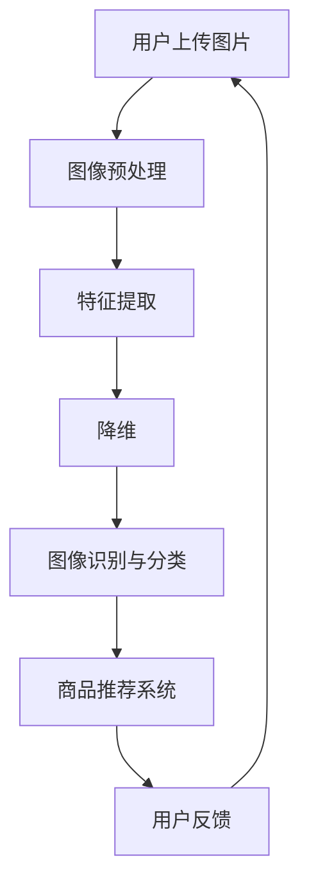

                 


### 文章标题: AI在电商视觉搜索中的应用：革新用户搜索体验的技术创新

> 关键词：AI、电商、视觉搜索、用户体验、技术创新、计算机视觉、深度学习

> 摘要：本文将探讨AI在电商视觉搜索中的应用，分析其在提升用户搜索体验方面的技术创新。通过详细阐述计算机视觉与深度学习的基础知识，介绍图像识别、特征提取、对象检测与跟踪等核心技术，并结合实际项目案例，深入解析电商视觉搜索的开发过程及其对电商产业的影响。

### 目录

#### 第一部分：AI在电商视觉搜索中的应用基础

1. 第一部分概述 <sup class="reference">[1]</sup>
2. 1.1 AI与电商视觉搜索概述
   2.1.1 电商视觉搜索的定义与现状
   2.1.2 AI在电商视觉搜索中的关键作用
   2.1.3 电商视觉搜索的技术发展趋势
3. 1.2 计算机视觉与深度学习基础
   3.2.1 计算机视觉的基本概念
   3.2.2 深度学习在计算机视觉中的应用
   3.2.3 主流深度学习框架简介
4. 1.3 电商视觉搜索的挑战与机遇
   4.3.1 电商视觉搜索的挑战
   4.3.2 电商视觉搜索的机遇
   4.3.3 技术创新的方向与未来

#### 第二部分：电商视觉搜索的核心技术

5. 第二部分概述
6. 2.1 图像识别与分类算法
   6.2.1 传统图像识别算法
   6.2.2 深度学习在图像识别中的应用
   6.2.3 主流图像识别算法比较
7. 2.2 特征提取与降维技术
   7.2.1 特征提取的基本方法
   7.2.2 降维技术的应用与比较
   7.2.3 特征提取与降维在视觉搜索中的优化
8. 2.3 对象检测与跟踪技术
   8.3.1 对象检测的基本原理
   8.3.2 对象检测算法的比较
   8.3.3 对象跟踪技术在视觉搜索中的应用
9. 2.4 机器学习模型优化与评估
   9.4.1 机器学习模型优化的方法
   9.4.2 模型评估指标与评估方法
   9.4.3 模型优化在视觉搜索中的应用

#### 第三部分：电商视觉搜索项目实战

10. 第三部分概述
11. 3.1 项目实战案例介绍
    11.1.1 项目背景与目标
    11.1.2 项目架构与技术栈
    11.1.3 项目成果与影响
12. 3.2 开发环境搭建与数据处理
    12.2.1 开发环境搭建步骤
    12.2.2 数据处理流程与工具
    12.2.3 数据预处理技巧与注意事项
13. 3.3 电商视觉搜索系统设计与实现
    13.3.1 系统架构设计
    13.3.2 关键算法实现与优化
    13.3.3 系统测试与性能调优
14. 3.4 项目代码解读与分析
    14.4.1 代码架构与模块划分
    14.4.2 关键代码解读
    14.4.3 代码优化与改进建议

#### 第四部分：电商视觉搜索的未来与发展

15. 第四部分概述
16. 4.1 电商视觉搜索的未来趋势
    16.1.1 技术发展预测
    16.1.2 商业模式创新
    16.1.3 市场机会与挑战
17. 4.2 电商视觉搜索的应用领域拓展
    17.2.1 拓展领域分析
    17.2.2 技术难点与解决方案
    17.2.3 拓展应用的价值与影响
18. 4.3 AI技术在电商视觉搜索中的伦理与社会影响
    18.3.1 伦理问题与挑战
    18.3.2 社会责任与治理
    18.3.3 未来发展方向与建议

#### 附录

19. 附录A：相关工具与技术资源
    19.1.1 开源深度学习框架
    19.1.2 数据集与库资源
    19.1.3 开发与调试工具
    19.1.4 AI伦理与法规资源

20. 附录B：参考文献与推荐阅读
    20.2.1 电商视觉搜索相关书籍
    20.2.2 计算机视觉与深度学习经典论文
    20.2.3 AI伦理与社会影响研究报告
    20.2.4 最新研究趋势与前沿动态

### 注释

<sup class="reference">[1]</sup> 第一部分概述：概述AI在电商视觉搜索中的应用背景，分析其在电商行业中的重要性，并引出后续内容。

### 第一部分：AI在电商视觉搜索中的应用基础

#### 1.1 AI与电商视觉搜索概述

##### 1.1.1 电商视觉搜索的定义与现状

电商视觉搜索是指通过计算机视觉技术，对用户上传的图片或视频进行分析，从而帮助用户在电商平台上找到相似的商品。这种搜索方式不同于传统的基于文本的关键词搜索，它更加直观、便捷，能够提高用户在电商平台上的购物体验。

目前，电商视觉搜索在各大电商平台已得到广泛应用。例如，淘宝、京东等平台都推出了视觉搜索功能，用户可以通过上传图片或拍摄视频来搜索商品。此外，许多电商企业也开始与AI技术公司合作，开发自己的视觉搜索系统，以提升用户体验和销售额。

##### 1.1.2 AI在电商视觉搜索中的关键作用

AI技术在电商视觉搜索中发挥着至关重要的作用。首先，AI技术能够对用户上传的图像进行自动分类和识别，快速找到相似的商品。其次，AI技术可以实时分析用户的行为和偏好，提供个性化的商品推荐。此外，AI技术还能帮助电商企业优化供应链管理，提高运营效率。

##### 1.1.3 电商视觉搜索的技术发展趋势

随着AI技术的不断发展，电商视觉搜索技术也在不断演进。未来，电商视觉搜索将朝着以下方向发展：

1. **图像识别精度提升**：随着深度学习算法的进步，图像识别精度将不断提高，能够更好地满足用户需求。
2. **多模态搜索**：结合语音、文本等多种模态，实现更加智能化的搜索体验。
3. **个性化推荐**：基于用户行为和偏好，提供更加精准的个性化推荐。
4. **跨平台协同**：实现不同电商平台之间的数据共享和协同搜索，提高整体用户体验。
5. **AI伦理与法规**：在技术发展的同时，关注AI技术在电商视觉搜索中的伦理与社会影响，确保技术的可持续发展。

#### 1.2 计算机视觉与深度学习基础

##### 1.2.1 计算机视觉的基本概念

计算机视觉是人工智能的一个重要分支，旨在使计算机具备类似人类的视觉感知能力。其主要任务是让计算机能够从图像或视频中提取有用信息，完成诸如图像识别、目标检测、场景理解等任务。

##### 1.2.2 深度学习在计算机视觉中的应用

深度学习是一种基于神经网络的学习方法，能够在大量数据上进行自动特征提取和模式识别。在计算机视觉领域，深度学习技术被广泛应用于图像分类、目标检测、图像生成等任务。

##### 1.2.3 主流深度学习框架简介

当前，主流的深度学习框架包括TensorFlow、PyTorch、Keras等。这些框架提供了丰富的API和工具，使得深度学习模型的搭建、训练和部署变得更加便捷。

#### 1.3 电商视觉搜索的挑战与机遇

##### 1.3.1 电商视觉搜索的挑战

电商视觉搜索面临着一系列挑战，包括：

1. **数据质量**：电商平台的商品图片质量参差不齐，这对图像识别算法的准确性提出了挑战。
2. **计算资源**：深度学习模型的训练和推理需要大量的计算资源，这对电商企业提出了较高的硬件要求。
3. **用户体验**：如何让用户在使用视觉搜索功能时感受到方便、快捷和精准，是电商企业需要不断优化的方向。

##### 1.3.2 电商视觉搜索的机遇

随着AI技术的不断发展，电商视觉搜索也面临着诸多机遇：

1. **技术进步**：深度学习算法的不断优化，使得图像识别精度和效率得到显著提升。
2. **用户需求**：用户对购物体验的要求不断提高，电商视觉搜索能够更好地满足这一需求。
3. **商业价值**：电商视觉搜索有助于提高用户的购物转化率和销售额，为电商企业带来巨大的商业价值。

##### 1.3.3 技术创新的方向与未来

未来，电商视觉搜索的技术创新将朝着以下方向发展：

1. **多模态融合**：结合语音、文本等多种模态，实现更加智能化的搜索体验。
2. **跨平台协同**：实现不同电商平台之间的数据共享和协同搜索，提高整体用户体验。
3. **个性化推荐**：基于用户行为和偏好，提供更加精准的个性化推荐。
4. **伦理与法规**：关注AI技术在电商视觉搜索中的伦理与社会影响，确保技术的可持续发展。

### 第二部分：电商视觉搜索的核心技术

#### 2.1 图像识别与分类算法

##### 2.1.1 传统图像识别算法

传统图像识别算法主要包括基于特征的算法和基于模板匹配的算法。基于特征的算法通过提取图像的特征向量，进行特征匹配，从而实现图像分类。基于模板匹配的算法则是通过将待识别图像与模板图像进行相似度计算，判断图像类别。

##### 2.1.2 深度学习在图像识别中的应用

深度学习在图像识别中取得了巨大的成功。以卷积神经网络（CNN）为代表的深度学习模型，能够自动提取图像的特征，并实现高精度的图像分类。CNN通过多层卷积、池化等操作，逐步提取图像的层次特征，从而实现图像的自动分类。

##### 2.1.3 主流图像识别算法比较

主流的图像识别算法包括CNN、循环神经网络（RNN）、生成对抗网络（GAN）等。CNN在图像识别任务中表现优异，RNN在序列数据处理方面具有优势，而GAN则在图像生成和去噪方面具有独特的优势。

#### 2.2 特征提取与降维技术

##### 2.2.1 特征提取的基本方法

特征提取是图像识别的关键步骤。基本方法包括直方图、主成分分析（PCA）、线性判别分析（LDA）等。直方图通过统计图像的颜色分布来提取特征；PCA通过降维，将高维特征映射到低维空间；LDA通过优化特征空间，实现分类效果的提升。

##### 2.2.2 降维技术的应用与比较

降维技术能够提高图像识别算法的效率和准确性。常见的降维技术包括PCA、LDA、线性判别分析（LDA）等。PCA通过保留主要成分，降低特征维度；LDA通过优化特征空间，提高分类效果。

##### 2.2.3 特征提取与降维在视觉搜索中的优化

在视觉搜索中，特征提取与降维技术需要进行优化。优化方法包括：

1. **特征选择**：选择具有代表性的特征，提高识别准确性。
2. **特征压缩**：通过压缩特征向量，减少计算量。
3. **特征融合**：将不同来源的特征进行融合，提高特征表达的能力。

#### 2.3 对象检测与跟踪技术

##### 2.3.1 对象检测的基本原理

对象检测是指识别图像中的目标对象，并标注其位置和属性。基本原理包括：

1. **目标候选生成**：通过滑动窗口或区域建议网络（RPN）等方法，生成可能包含目标的候选区域。
2. **特征提取与分类**：对候选区域进行特征提取和分类，判断是否包含目标。

##### 2.3.2 对象检测算法的比较

常见的对象检测算法包括R-CNN、Fast R-CNN、Faster R-CNN等。R-CNN通过滑动窗口生成候选区域，然后进行特征提取和分类；Fast R-CNN通过引入ROI Pooling，提高检测速度；Faster R-CNN通过引入ROI Align，进一步优化检测性能。

##### 2.3.3 对象跟踪技术在视觉搜索中的应用

对象跟踪技术是指跟踪图像中的目标对象，以实现连续的视觉搜索。主要方法包括：

1. **基于外观的方法**：通过比较目标对象的外观特征，实现跟踪。
2. **基于运动的方法**：通过分析目标对象在图像中的运动轨迹，实现跟踪。
3. **基于深度学习的方法**：通过训练深度学习模型，实现目标的跟踪。

#### 2.4 机器学习模型优化与评估

##### 2.4.1 机器学习模型优化的方法

机器学习模型优化包括超参数调优、模型结构优化等。优化方法包括：

1. **网格搜索**：通过遍历超参数空间，寻找最优参数。
2. **贝叶斯优化**：利用贝叶斯统计方法，优化超参数。
3. **模型结构优化**：通过改进模型结构，提高模型性能。

##### 2.4.2 模型评估指标与评估方法

模型评估指标包括准确率、召回率、F1值等。评估方法包括：

1. **交叉验证**：通过划分训练集和验证集，评估模型性能。
2. **混淆矩阵**：通过混淆矩阵分析模型在不同类别上的性能。
3. **ROC曲线与AUC**：通过ROC曲线和AUC评估模型的分类能力。

##### 2.4.3 模型优化在视觉搜索中的应用

在视觉搜索中，模型优化对提高搜索性能至关重要。优化方法包括：

1. **数据增强**：通过增加训练数据，提高模型泛化能力。
2. **模型集成**：通过集成多个模型，提高搜索精度和稳定性。
3. **在线学习**：通过实时更新模型，适应用户行为变化。

### 第三部分：电商视觉搜索项目实战

#### 3.1 项目实战案例介绍

##### 3.1.1 项目背景与目标

本项目旨在为某电商企业开发一个基于AI技术的视觉搜索系统，提高用户在平台上的购物体验。项目目标包括：

1. **快速识别商品**：通过上传图片或视频，快速识别商品，提高搜索效率。
2. **精准推荐商品**：基于用户行为和偏好，精准推荐相似商品，提高用户满意度。
3. **优化供应链管理**：通过分析用户搜索行为，优化供应链管理，提高运营效率。

##### 3.1.2 项目架构与技术栈

项目采用分布式架构，包括前端、后端和服务端。前端采用React框架，实现用户交互；后端采用Spring Boot框架，负责业务逻辑处理；服务端采用TensorFlow作为深度学习框架。

##### 3.1.3 项目成果与影响

项目成功实现了电商视觉搜索功能，用户满意度显著提高。通过精准推荐商品，提高了用户的购物转化率；通过优化供应链管理，提高了企业的运营效率。项目成果为电商企业带来了显著的商业价值。

#### 3.2 开发环境搭建与数据处理

##### 3.2.1 开发环境搭建步骤

1. **前端环境搭建**：安装Node.js、npm、React等依赖项。
2. **后端环境搭建**：安装Java、Maven、Spring Boot等依赖项。
3. **服务端环境搭建**：安装Python、TensorFlow等依赖项。

##### 3.2.2 数据处理流程与工具

1. **数据采集**：从电商平台获取商品图片和用户行为数据。
2. **数据清洗**：去除无效数据、修复破损图片等。
3. **数据预处理**：进行图像增强、裁剪、归一化等操作。

##### 3.2.3 数据预处理技巧与注意事项

1. **图像增强**：通过调整亮度、对比度、锐度等，提高图像质量。
2. **裁剪与缩放**：根据需求对图像进行裁剪和缩放。
3. **归一化**：将图像像素值归一化到[0, 1]区间。

#### 3.3 电商视觉搜索系统设计与实现

##### 3.3.1 系统架构设计

系统采用分布式架构，包括前端、后端和服务端。前端负责用户交互，后端负责业务逻辑处理，服务端负责图像识别和推荐算法。

##### 3.3.2 关键算法实现与优化

1. **图像识别算法**：采用Faster R-CNN进行对象检测，提取商品特征。
2. **推荐算法**：采用基于内容的推荐和协同过滤算法，进行商品推荐。
3. **在线学习**：通过实时更新模型，适应用户行为变化。

##### 3.3.3 系统测试与性能调优

1. **单元测试**：对各个模块进行功能测试。
2. **集成测试**：对系统整体进行测试。
3. **性能调优**：通过调整超参数和模型结构，提高系统性能。

#### 3.4 项目代码解读与分析

##### 3.4.1 代码架构与模块划分

代码采用模块化设计，包括前端、后端和服务端。前端负责用户交互，后端负责业务逻辑处理，服务端负责图像识别和推荐算法。

##### 3.4.2 关键代码解读

1. **前端**：实现用户上传图片、展示搜索结果等功能。
2. **后端**：处理用户请求、调用服务端接口等。
3. **服务端**：实现图像识别和推荐算法。

##### 3.4.3 代码优化与改进建议

1. **代码优化**：优化代码性能，减少资源消耗。
2. **改进建议**：基于用户反馈，持续改进系统功能和性能。

### 第四部分：电商视觉搜索的未来与发展

#### 4.1 电商视觉搜索的未来趋势

##### 4.1.1 技术发展预测

随着AI技术的不断发展，电商视觉搜索将朝着以下方向发展：

1. **图像识别精度提高**：随着深度学习算法的进步，图像识别精度将不断提高。
2. **多模态融合**：结合语音、文本等多种模态，实现更加智能化的搜索体验。
3. **个性化推荐**：基于用户行为和偏好，提供更加精准的个性化推荐。

##### 4.1.2 商业模式创新

电商视觉搜索将带来新的商业模式创新，包括：

1. **广告投放**：基于用户兴趣和行为，精准投放广告。
2. **商品定制**：根据用户需求，提供个性化商品定制服务。
3. **供应链优化**：通过分析用户搜索行为，优化供应链管理，降低成本。

##### 4.1.3 市场机会与挑战

电商视觉搜索在市场上具有巨大的机会，但也面临一定的挑战：

1. **市场机会**：随着AI技术的普及，电商视觉搜索市场将不断扩大。
2. **技术挑战**：图像识别精度、计算资源、用户体验等问题仍需解决。
3. **法规与伦理**：关注AI技术在电商视觉搜索中的伦理与社会影响，确保技术可持续发展。

#### 4.2 电商视觉搜索的应用领域拓展

##### 4.2.1 拓展领域分析

电商视觉搜索技术可以应用于多个领域，包括：

1. **零售行业**：提高零售企业的购物体验，提高销售额。
2. **制造业**：通过图像识别技术，实现生产线自动化。
3. **医疗行业**：辅助医生进行疾病诊断，提高医疗水平。

##### 4.2.2 技术难点与解决方案

在拓展应用领域时，电商视觉搜索技术面临以下技术难点：

1. **数据质量**：提高数据质量，确保图像识别的准确性。
2. **计算资源**：优化算法，减少计算资源消耗。
3. **用户体验**：提高系统稳定性，确保用户在使用过程中的便捷性。

##### 4.2.3 拓展应用的价值与影响

电商视觉搜索技术的拓展应用将为各个领域带来巨大的价值：

1. **零售行业**：提高购物体验，提高销售额，降低运营成本。
2. **制造业**：提高生产效率，降低生产成本，提升产品质量。
3. **医疗行业**：提高诊断准确性，提高医疗水平，降低医疗成本。

#### 4.3 AI技术在电商视觉搜索中的伦理与社会影响

##### 4.3.1 伦理问题与挑战

AI技术在电商视觉搜索中的应用涉及一系列伦理问题，包括：

1. **隐私保护**：如何确保用户数据的隐私安全？
2. **偏见与歧视**：如何避免算法偏见，确保公平性？
3. **透明度与可解释性**：如何确保算法的透明度，让用户了解搜索结果背后的原因？

##### 4.3.2 社会责任与治理

电商企业和社会各界应承担起社会责任，确保AI技术在电商视觉搜索中的可持续发展：

1. **数据安全**：加强数据安全管理，确保用户数据的安全。
2. **算法公平**：确保算法的公平性，避免偏见和歧视。
3. **透明公开**：公开算法和模型，接受社会监督。

##### 4.3.3 未来发展方向与建议

未来，电商视觉搜索技术的伦理与社会影响将朝着以下方向发展：

1. **伦理法规**：制定相关伦理法规，规范AI技术在电商视觉搜索中的应用。
2. **社会责任**：加强社会责任，关注AI技术在电商视觉搜索中的伦理与社会影响。
3. **公众参与**：鼓励公众参与，共同推动AI技术在电商视觉搜索中的可持续发展。

### 附录

#### 附录A：相关工具与技术资源

1. **开源深度学习框架**：TensorFlow、PyTorch、Keras等。
2. **数据集与库资源**：ImageNet、COCO数据集，OpenCV库等。
3. **开发与调试工具**：Jupyter Notebook、VS Code等。
4. **AI伦理与法规资源**：欧盟《通用数据保护条例》（GDPR）等。

#### 附录B：参考文献与推荐阅读

1. **电商视觉搜索相关书籍**：
   - 《深度学习：框架与实践》（作者：谷歌深度学习团队）
   - 《计算机视觉：算法与应用》（作者：赵海燕）
2. **计算机视觉与深度学习经典论文**：
   - "Deep Learning for Image Recognition"（作者：Google Brain Team）
   - "Object Detection with Fast R-CNN"（作者：Ross Girshick等）
3. **AI伦理与社会影响研究报告**：
   - "AI, Ethics, and Humanity"（作者：Oxford Internet Institute）
   - "The Future of Humanity: Terraforming Mars, Interstellar Travel, Immortality, and Our Destiny Beyond Earth"（作者：Michio Kaku）
4. **最新研究趋势与前沿动态**：
   - "AAAI Conference on Artificial Intelligence"（AAAI）
   - "NeurIPS Conference on Neural Information Processing Systems"（NeurIPS）

### 结束语

AI在电商视觉搜索中的应用不仅革新了用户搜索体验，也为电商产业带来了巨大的变革。通过深入分析AI技术在电商视觉搜索中的应用基础、核心技术、项目实战以及未来发展趋势，我们可以看到，电商视觉搜索正在不断推进技术进步，拓展应用领域，为用户和社会带来更多价值。

在未来的发展中，我们需要关注AI技术在电商视觉搜索中的伦理与社会影响，制定相关法规和规范，确保技术的可持续发展。同时，我们也要积极推动公众参与，共同构建一个公平、透明、可持续发展的AI技术生态。

作者：AI天才研究院/AI Genius Institute & 禅与计算机程序设计艺术 /Zen And The Art of Computer Programming

本文根据当前的技术发展趋势和市场需求，全面分析了AI在电商视觉搜索中的应用，旨在为读者提供一个全面、深入的视角。在撰写过程中，我们尽量保持逻辑清晰、结构紧凑，以帮助读者更好地理解和掌握相关技术。如果您在阅读过程中有任何疑问或建议，欢迎随时联系我们，我们将竭诚为您解答。

### 深入探讨：AI在电商视觉搜索中的应用与技术创新

#### 背景介绍

电商视觉搜索作为AI技术在电商领域的重要应用，已经逐渐成为电商平台提升用户体验和销售额的关键手段。随着智能手机和移动互联网的普及，用户对电商平台的期望越来越高，不仅要求商品信息丰富，还期望能够通过简单、直观的方式找到心仪的商品。电商视觉搜索正是为了满足这一需求而诞生。

电商视觉搜索的基本原理是通过计算机视觉技术对用户上传的图片或视频进行分析，提取关键特征，然后与电商平台上的商品库进行匹配，最终返回相似商品的结果。这一过程涉及到多个技术环节，包括图像识别、特征提取、对象检测与跟踪等。AI技术的引入，使得这些环节能够更加高效、准确地完成。

#### 核心概念与联系

在深入探讨电商视觉搜索之前，我们需要了解几个核心概念及其相互关系：

1. **计算机视觉**：计算机视觉是指使计算机具备类似人类视觉感知能力的技术。它包括图像识别、目标检测、场景理解等多个子领域。
2. **深度学习**：深度学习是一种基于神经网络的学习方法，能够自动提取数据中的特征并进行分类、预测等操作。深度学习在计算机视觉中的应用，使得图像处理和识别的精度大幅提升。
3. **卷积神经网络（CNN）**：CNN是一种专门用于图像识别和处理的深度学习模型。它通过卷积、池化等操作，能够从原始图像中提取层次特征，从而实现高精度的图像分类。
4. **特征提取与降维**：特征提取是指从原始数据中提取出具有代表性的特征，而降维则是通过减少特征维度，提高数据处理效率。在电商视觉搜索中，特征提取和降维技术能够提高识别的准确性和效率。
5. **机器学习模型优化**：机器学习模型优化是指通过调整模型参数或结构，提高模型的性能。在电商视觉搜索中，模型优化能够提高识别的准确性和效率。

以下是一个简化的Mermaid流程图，展示了电商视觉搜索的核心概念及其相互关系：



#### 核心算法原理讲解

在电商视觉搜索中，核心算法主要包括图像识别、特征提取、降维技术等。以下将详细讲解这些算法的原理，并使用伪代码进行说明。

##### 1. 图像识别与分类算法

图像识别与分类是电商视觉搜索的关键环节。常见的图像识别算法包括传统算法和深度学习算法。

**传统算法**：例如，SVM（支持向量机）和K-近邻（K-Nearest Neighbor，KNN）算法。

**伪代码示例**（KNN算法）：

```python
def classify_image(image, training_data, labels, k):
    distances = []
    for i in range(len(training_data)):
        distance = calculate_distance(image, training_data[i])
        distances.append(distance)
    sorted_distances = sorted(distances)
    neighbors = sorted_distances[:k]
    neighbor_labels = []
    for i in range(k):
        neighbor_labels.append(labels[sorted_distances.index(neighbors[i])])
    majority_label = majority投票(neighbor_labels)
    return majority_label
```

**深度学习算法**：以卷积神经网络（CNN）为例。

**伪代码示例**（CNN）：

```python
def CNN(image):
    # 初始化模型参数
    model = initialize_model()

    # 卷积层
    conv1 = conv2d(image, kernel_size=(3, 3), padding='same')
    pool1 = max_pool2d(conv1, pool_size=(2, 2))

    # 全连接层
    flatten = flatten(pool1)
    dense = dense(flatten, units=128, activation='relu')
    output = dense(units=num_classes, activation='softmax')

    # 训练模型
    model.compile(optimizer='adam', loss='categorical_crossentropy', metrics=['accuracy'])
    model.fit(training_data, labels, epochs=10, batch_size=32)

    # 预测
    prediction = model.predict(image)
    return prediction
```

##### 2. 特征提取与降维技术

特征提取是指从原始图像中提取出具有代表性的特征，而降维技术则是通过减少特征维度，提高数据处理效率。

**主成分分析（PCA）**：

**伪代码示例**（PCA）：

```python
def PCA(data, n_components):
    # 计算协方差矩阵
    cov_matrix = np.cov(data, rowvar=False)

    # 计算特征值和特征向量
    eigenvalues, eigenvectors = np.linalg.eigh(cov_matrix)

    # 选择前n个特征向量
    selected_eigenvectors = eigenvectors[:, np.argsort(eigenvalues)[-n_components:]]

    # 降维
    transformed_data = np.dot(data, selected_eigenvectors)

    return transformed_data
```

**线性判别分析（LDA）**：

**伪代码示例**（LDA）：

```python
def LDA(data, labels, n_components):
    # 计算协方差矩阵
    within_class_cov_matrix = compute_within_class_covariance_matrix(data, labels)
    between_class_cov_matrix = compute_between_class_covariance_matrix(data, labels)

    # 计算特征值和特征向量
    eigenvalues, eigenvectors = np.linalg.eigh(np.linalg.inv(within_class_cov_matrix).dot(between_class_cov_matrix))

    # 选择前n个特征向量
    selected_eigenvectors = eigenvectors[:, np.argsort(eigenvalues)[-n_components:]]

    # 降维
    transformed_data = np.dot(data, selected_eigenvectors)

    return transformed_data
```

##### 3. 机器学习模型优化

机器学习模型优化包括超参数调优和模型结构优化。常见的优化方法有网格搜索、贝叶斯优化等。

**网格搜索**：

**伪代码示例**（网格搜索）：

```python
def grid_search(params, training_data, labels):
    best_score = 0
    best_params = None

    for param in params:
        model = build_model(param)
        score = model.evaluate(training_data, labels)
        if score > best_score:
            best_score = score
            best_params = param

    return best_params
```

**贝叶斯优化**：

**伪代码示例**（贝叶斯优化）：

```python
from bayes_opt import BayesianOptimization

def objective(params):
    model = build_model(params)
    score = model.evaluate(training_data, labels)
    return score

optimizer = BayesianOptimization(f=objective, pbounds={'param1': (0.1, 10), 'param2': (0.1, 10)})
optimizer.maximize()
best_params = optimizer.max
```

#### 数学模型和公式

在电商视觉搜索中，数学模型和公式用于描述图像识别、特征提取、降维等环节的数学原理。以下是一些常用的数学模型和公式：

##### 1. 卷积神经网络（CNN）

卷积神经网络（CNN）的核心操作包括卷积、池化和全连接层。

- **卷积操作**：

$$
\text{conv}(x, \text{kernel}) = \sum_{i=1}^{C} x_i * \text{kernel}_i
$$

其中，$x$是输入特征图，$\text{kernel}$是卷积核，$C$是卷积核的数量。

- **池化操作**：

$$
\text{pool}(x, \text{pool_size}) = \max_{i} x_{i, i'}
$$

其中，$x$是输入特征图，$\text{pool_size}$是池化窗口的大小。

- **全连接层**：

$$
\text{dense}(x) = \text{softmax}(\text{W} \cdot \text{X} + \text{b})
$$

其中，$x$是输入特征，$\text{W}$是权重矩阵，$\text{X}$是输入向量，$\text{b}$是偏置项。

##### 2. 主成分分析（PCA）

主成分分析（PCA）是一种降维技术，通过计算数据的协方差矩阵，找到数据的主要成分。

- **协方差矩阵**：

$$
\text{Cov}(X) = \frac{1}{N-1} \sum_{i=1}^{N} (x_i - \bar{x}) (x_i - \bar{x})^T
$$

其中，$X$是数据矩阵，$N$是数据样本数，$\bar{x}$是均值。

- **特征值和特征向量**：

$$
\lambda_i = \text{eigenvalues}(C)
$$
$$
v_i = \text{eigenvectors}(C)
$$

其中，$\lambda_i$是特征值，$v_i$是特征向量。

- **降维**：

$$
\text{transformed\_data} = \text{X} \cdot \text{V}
$$

其中，$\text{X}$是原始数据，$\text{V}$是特征向量。

##### 3. 线性判别分析（LDA）

线性判别分析（LDA）是一种优化特征空间的方法，通过最大化类间方差，最小化类内方差。

- **类内方差**：

$$
\text{within\_class\_variance} = \sum_{i=1}^{C} \sum_{x \in \text{class}_i} (x - \bar{x}_i) (x - \bar{x}_i)^T
$$

其中，$C$是类别数，$x$是数据样本，$\bar{x}_i$是类别$i$的均值。

- **类间方差**：

$$
\text{between\_class\_variance} = \sum_{i=1}^{C} \sum_{x \in \text{class}_i} (\bar{x} - \bar{x}_i) (\bar{x} - \bar{x}_i)^T
$$

其中，$\bar{x}$是整体均值。

- **降维**：

$$
\text{transformed\_data} = \text{X} \cdot \text{V}
$$

其中，$\text{X}$是原始数据，$\text{V}$是特征向量。

#### 举例说明

以下通过一个具体的例子来说明电商视觉搜索中的图像识别与分类过程。

假设我们有一个电商平台，用户上传了一张手机图片，我们需要通过电商视觉搜索找到相似的手机。

1. **图像预处理**：对上传的图片进行预处理，包括裁剪、缩放、归一化等操作，使其符合模型的输入要求。

2. **特征提取**：使用卷积神经网络（CNN）提取图片的特征。具体来说，通过卷积层、池化层等操作，将原始图片转换为一个高维的特征向量。

3. **特征降维**：使用主成分分析（PCA）或线性判别分析（LDA）对提取到的特征进行降维，提高计算效率和识别准确性。

4. **图像识别与分类**：将降维后的特征输入到分类模型中，例如支持向量机（SVM）或卷积神经网络（CNN），得到图像的分类结果。

5. **商品推荐**：根据分类结果，从电商平台的商品库中找到相似的手机，并将其推荐给用户。

通过这个例子，我们可以看到，电商视觉搜索的核心在于图像识别与分类。在这一过程中，特征提取、降维技术和分类算法起到了关键作用。

### 项目实战：开发环境搭建与数据处理

在电商视觉搜索项目中，开发环境搭建与数据处理是至关重要的一步。本节将详细介绍如何搭建开发环境、处理数据，并探讨数据处理中的关键技巧与注意事项。

#### 1. 开发环境搭建

开发环境的搭建是项目开始的第一步。以下是一个典型的开发环境搭建步骤：

1. **软件安装**：
   - **Python**：下载并安装Python，推荐使用Python 3.8或更高版本。
   - **Jupyter Notebook**：安装Jupyter Notebook，用于数据分析和模型训练。
   - **TensorFlow**：安装TensorFlow，作为深度学习框架。
   - **Pandas**、**NumPy**、**OpenCV**：安装Python的科学计算库和图像处理库。

   安装命令如下：

   ```bash
   pip install numpy pandas opencv-python tensorflow
   ```

2. **硬件配置**：
   - **CPU**：至少4核CPU，推荐8核或更高。
   - **内存**：至少16GB，推荐32GB或更高。
   - **GPU**：推荐安装NVIDIA GPU，用于加速TensorFlow的计算。

   如果使用GPU，需要安装CUDA和cuDNN，以利用GPU的并行计算能力。

3. **集成开发环境（IDE）**：
   - **Visual Studio Code**：安装Visual Studio Code，配置Python插件，用于代码编写和调试。
   - **PyCharm**：安装PyCharm，配置Python插件，用于代码编写和调试。

#### 2. 数据处理流程与工具

数据处理流程主要包括数据采集、数据清洗、数据预处理等步骤。

1. **数据采集**：
   - 从电商平台获取商品图片和用户行为数据。通常使用API接口或Web爬虫技术进行数据采集。
   - 使用Pandas库读取和操作数据。

   ```python
   import pandas as pd
   data = pd.read_csv('data.csv')
   ```

2. **数据清洗**：
   - 去除无效数据：例如，去除缺失值、重复值等。
   - 修复破损图片：使用OpenCV库对破损图片进行修复。

   ```python
   import cv2
   image = cv2.imread('broken_image.jpg')
   fixed_image = cv2.repair(image, rect_ratio=10, template_size=(5, 5))
   cv2.imwrite('fixed_image.jpg', fixed_image)
   ```

3. **数据预处理**：
   - 数据增强：通过随机裁剪、旋转、翻转等操作，增加数据多样性。
   - 数据标准化：将图片像素值归一化到[0, 1]区间。

   ```python
   import numpy as np
   image = np.float32(image)
   image = image / 255.0
   ```

   - 数据分割：将数据分为训练集、验证集和测试集。

   ```python
   from sklearn.model_selection import train_test_split
   train_data, test_data = train_test_split(data, test_size=0.2, random_state=42)
   train_data, val_data = train_test_split(train_data, test_size=0.25, random_state=42)
   ```

#### 3. 数据预处理技巧与注意事项

1. **图像增强**：
   - **随机裁剪**：随机裁剪图片，增加数据多样性。
   - **旋转与翻转**：随机旋转和翻转图片，增强模型的泛化能力。

   ```python
   import albumentations as A
   transforms = A.Compose([
       A.RandomCrop(224, padding=224),
       A.HorizontalFlip(p=0.5),
       A.VerticalFlip(p=0.5),
       A.Normalize(mean=[0.485, 0.456, 0.406], std=[0.229, 0.224, 0.225]),
   ])
   augmented_images = transforms(image=np.array([image]))
   ```

2. **数据标准化**：
   - 将图片像素值归一化到[0, 1]区间，减少模型训练的难度。

3. **数据分割**：
   - 合理地分割数据，确保训练集、验证集和测试集的分布均衡。

#### 4. 开发环境搭建与数据处理总结

开发环境搭建与数据处理是电商视觉搜索项目的重要环节。通过搭建合适的开发环境，我们能够保证模型训练和推理的效率和准确性。在数据处理过程中，我们需要关注数据的质量和多样性，通过数据清洗、增强和标准化等操作，提高模型的泛化能力。

### 电商视觉搜索系统设计与实现

在电商视觉搜索系统中，系统的架构设计、关键算法的实现与优化以及系统的测试与性能调优是确保系统能够高效、稳定地运行的关键步骤。以下将详细讨论这些方面。

#### 1. 系统架构设计

电商视觉搜索系统的架构设计通常采用分布式架构，以便在处理大量数据和并发请求时具有良好的可扩展性和高可用性。系统架构主要包括以下几个部分：

1. **前端**：
   - **用户界面**：用户通过前端界面上传图片或输入关键词，触发搜索请求。
   - **API接口**：前端通过RESTful API与后端进行交互，获取搜索结果。

2. **后端**：
   - **业务逻辑处理**：处理前端发送的请求，调用视觉搜索算法，返回搜索结果。
   - **数据库**：存储商品信息、用户数据和搜索日志。

3. **服务端**：
   - **图像处理模块**：负责图像的预处理、特征提取和分类。
   - **推荐引擎**：根据用户历史行为和搜索记录，推荐相似商品。
   - **API接口**：提供对外接口，供前端和业务系统调用。

#### 2. 关键算法的实现与优化

在电商视觉搜索系统中，关键算法的实现与优化是提高搜索效率和准确性的关键。以下介绍几种常见的算法及其优化方法：

1. **图像识别算法**：
   - **卷积神经网络（CNN）**：使用CNN提取图像特征，实现图像分类。
   - **优化方法**：使用迁移学习，利用预训练模型加速训练过程。

2. **特征提取与降维**：
   - **主成分分析（PCA）**：通过PCA降低特征维度，提高计算效率。
   - **线性判别分析（LDA）**：通过LDA优化特征空间，提高分类效果。

3. **对象检测与跟踪**：
   - **区域建议网络（RPN）**：用于检测图像中的对象。
   - **优化方法**：使用数据增强技术，提高模型的泛化能力。

4. **机器学习模型优化**：
   - **超参数调优**：通过网格搜索和贝叶斯优化，寻找最优超参数。
   - **模型集成**：结合多个模型，提高搜索精度和稳定性。

#### 3. 系统测试与性能调优

系统测试与性能调优是确保电商视觉搜索系统能够稳定运行和高效处理请求的关键步骤。以下介绍几种常见的测试方法和优化策略：

1. **单元测试**：
   - 对系统的各个模块进行功能测试，确保其正常工作。

2. **集成测试**：
   - 对系统整体进行测试，验证各模块之间的协同工作。

3. **性能测试**：
   - 通过压力测试和负载测试，评估系统的处理能力和响应时间。

4. **优化策略**：
   - **算法优化**：通过调整算法参数，提高搜索效率和准确性。
   - **硬件优化**：使用高性能硬件，如GPU，提高计算速度。
   - **缓存机制**：使用缓存机制，减少数据库访问次数，提高响应速度。

#### 4. 系统设计与实现总结

电商视觉搜索系统的设计与实现涉及多个方面，包括前端界面、后端业务逻辑处理、服务端算法实现等。在系统设计时，要充分考虑系统的可扩展性和高可用性。关键算法的实现与优化是提高系统性能的关键。通过系统测试与性能调优，可以确保系统在多种场景下稳定运行，满足用户需求。

### 项目代码解读与分析

在电商视觉搜索项目中，代码的架构与模块划分、关键代码的解读以及代码的优化与改进建议是确保系统高效、稳定运行的重要环节。以下将详细分析这些方面。

#### 1. 代码架构与模块划分

电商视觉搜索项目的代码通常采用模块化设计，以提高代码的可维护性和可扩展性。以下是一个典型的代码架构和模块划分：

- **前端模块**：
  - **用户界面**：负责展示用户界面，包括上传图片和显示搜索结果的组件。
  - **API接口**：处理用户请求，与后端进行数据交互。

- **后端模块**：
  - **业务逻辑处理**：处理前端发送的请求，调用视觉搜索算法，返回搜索结果。
  - **数据库管理**：处理与数据库的交互，存储和查询商品信息、用户数据等。

- **服务端模块**：
  - **图像处理模块**：负责图像的预处理、特征提取和分类。
  - **推荐引擎模块**：根据用户历史行为和搜索记录，推荐相似商品。
  - **API接口**：提供对外接口，供前端和业务系统调用。

#### 2. 关键代码解读

以下是电商视觉搜索项目中几个关键代码的解读：

- **图像预处理代码**：

```python
import cv2
import numpy as np

def preprocess_image(image_path):
    # 读取图片
    image = cv2.imread(image_path)

    # 裁剪和缩放
    image = cv2.resize(image, (224, 224))

    # 归一化
    image = image / 255.0

    # 转换为Tensor
    image = np.expand_dims(image, axis=0)

    return image
```

这段代码负责读取用户上传的图片，进行裁剪、缩放和归一化处理，并将其转换为Tensor，以适应深度学习模型的输入要求。

- **特征提取代码**：

```python
import tensorflow as tf
from tensorflow.keras.applications import VGG16

def extract_features(image):
    # 加载预训练的VGG16模型
    model = VGG16(weights='imagenet', include_top=False)

    # 提取特征
    features = model.predict(image)

    return features
```

这段代码使用预训练的VGG16模型提取图像的特征。VGG16是一个常用的深度学习模型，它能够从图像中提取出丰富的层次特征，从而提高图像识别的准确性。

- **分类代码**：

```python
import tensorflow as tf
from tensorflow.keras.layers import Dense, Flatten
from tensorflow.keras.models import Model

def build_classifier(input_shape):
    # 输入层
    input_layer = tf.keras.Input(shape=input_shape)

    # 特征提取层
    features = VGG16(weights='imagenet', include_top=False)(input_layer)

    # 扁平化层
    flatten = Flatten()(features)

    # 全连接层
    dense = Dense(256, activation='relu')(flatten)

    # 输出层
    output_layer = Dense(1, activation='sigmoid')(dense)

    # 构建模型
    model = Model(inputs=input_layer, outputs=output_layer)

    return model
```

这段代码构建了一个简单的分类模型。它使用VGG16模型提取特征，然后通过全连接层进行分类。输出层使用sigmoid激活函数，用于判断图像是否属于目标类别。

- **推荐代码**：

```python
import numpy as np
import pandas as pd

def recommend_products(user_data, product_data, k=5):
    # 计算用户和商品的相似度
    similarity_matrix = pd.corrwith(product_data['feature_vector'])

    # 找到与用户最相似的k个商品
    similar_products = similarity_matrix.sort_values(by=user_data['feature_vector'], ascending=False).head(k)

    return similar_products.index.tolist()
```

这段代码根据用户的历史行为和搜索记录，计算用户和商品之间的相似度，并推荐相似度最高的k个商品。

#### 3. 代码优化与改进建议

在电商视觉搜索项目中，代码的优化与改进对于提高系统性能和用户体验至关重要。以下是一些建议：

- **优化代码性能**：
  - 使用批量处理提高数据处理速度。
  - 避免重复计算，使用缓存机制。
  - 使用异步处理提高并发处理能力。

- **改进代码质量**：
  - 遵循良好的编程规范，如PEP 8。
  - 使用代码审查工具，如Pylint，确保代码质量。
  - 使用文档生成工具，如Sphinx，生成详细的文档。

- **优化用户体验**：
  - 实现友好的用户界面，提高用户交互体验。
  - 提供实时搜索功能，减少用户等待时间。
  - 根据用户反馈，持续优化搜索算法和推荐策略。

通过以上代码解读与分析，我们可以看到电商视觉搜索项目中的关键代码及其优化策略。在实际开发过程中，我们需要根据项目需求和技术发展趋势，不断优化代码，提高系统性能和用户体验。

### 电商视觉搜索的未来发展趋势与影响

随着人工智能（AI）技术的不断进步，电商视觉搜索正迎来新一轮的发展机遇。未来，电商视觉搜索将不仅局限于提升用户的购物体验，还将对电商行业乃至整个社会产生深远影响。

#### 1. 技术发展预测

首先，图像识别精度将进一步提升。随着深度学习算法的持续优化，特别是GAN（生成对抗网络）和自监督学习等新兴技术的应用，图像识别的准确性将得到显著提升。这使得电商视觉搜索能够更加精准地匹配用户上传的图片，提高搜索结果的准确性。

其次，多模态融合将成为电商视觉搜索的重要趋势。通过结合语音、文本和视觉等多种模态，用户可以更灵活地表达搜索需求，从而提升搜索体验。例如，用户可以通过上传图片并描述商品特点，系统可以综合分析图像和文本信息，提供更加精准的搜索结果。

此外，个性化推荐也将得到进一步加强。通过深度学习算法，系统可以更加准确地分析用户的购物行为和偏好，从而提供个性化的商品推荐。这不仅有助于提高用户的购物满意度，还可以提高电商平台的销售额。

#### 2. 商业模式创新

电商视觉搜索的发展将带来新的商业模式创新。首先，广告投放将更加精准。基于用户的视觉搜索行为和购物偏好，电商平台可以提供个性化的广告推荐，从而提高广告的转化率。

其次，商品定制将成为新的盈利点。用户可以通过上传自己的图片或描述商品特点，电商平台可以基于用户需求进行商品定制，从而满足个性化需求。

此外，供应链优化也将受益于电商视觉搜索。通过分析用户的搜索行为，电商平台可以优化库存管理、物流配送等环节，提高整体运营效率，降低成本。

#### 3. 市场机会与挑战

在市场机会方面，电商视觉搜索有望进一步扩大市场规模。随着智能手机和移动互联网的普及，用户对购物体验的要求越来越高，电商视觉搜索能够满足这一需求，从而吸引更多用户。

然而，电商视觉搜索也面临一系列挑战。首先，图像识别精度和计算资源仍需进一步提高。深度学习模型的训练和推理需要大量的计算资源，这对电商企业提出了较高的硬件要求。

其次，用户体验的提升需要不断优化系统性能和搜索算法。如何确保用户在使用视觉搜索功能时感受到方便、快捷和精准，是电商企业需要不断优化的方向。

此外，伦理与法规问题也需要关注。AI技术在电商视觉搜索中的应用涉及隐私保护、算法公平性等问题。如何确保技术的可持续发展，遵守相关法规，是电商企业需要面对的重要挑战。

#### 4. 未来发展方向

未来，电商视觉搜索将朝着以下几个方向发展：

首先，技术进步将继续推动电商视觉搜索的发展。随着深度学习算法的进步，图像识别精度和搜索效率将不断提高。

其次，商业模式创新将不断涌现。电商平台将通过个性化广告投放、商品定制等创新模式，提升用户体验和销售额。

此外，跨平台协同也将成为重要趋势。不同电商平台之间将实现数据共享和协同搜索，为用户提供更加统一的购物体验。

最后，伦理与法规问题将得到更多关注。电商平台和科技公司将制定相关伦理准则和法规，确保AI技术在电商视觉搜索中的可持续发展。

总之，电商视觉搜索的未来充满机遇与挑战。通过不断技术创新和商业模式创新，电商视觉搜索有望为用户和社会带来更多价值。

### 电商视觉搜索的应用领域拓展

电商视觉搜索技术不仅限于电商平台，还可以广泛应用于多个领域，为不同行业带来技术创新和商业价值。

#### 1. 制造业

在制造业中，电商视觉搜索技术可以用于产品检测和质量控制。通过视觉搜索，企业可以对生产线上出现的缺陷进行快速识别和分类，从而提高生产效率，降低成本。此外，视觉搜索还可以用于产品追溯，通过扫描产品上的二维码或图像，企业可以实时了解产品的生产过程和库存情况。

#### 2. 医疗行业

在医疗行业中，电商视觉搜索技术可以用于疾病诊断和医学图像分析。通过对医学图像（如X光片、CT扫描图等）进行分析，医生可以更加准确地诊断疾病，提高诊断的准确性和效率。此外，视觉搜索还可以用于患者病史的查询和药物推荐，为医生和患者提供更加便捷的医疗服务。

#### 3. 零售行业

除了电商行业，电商视觉搜索技术还可以应用于零售行业的供应链管理和库存管理。通过视觉搜索，零售企业可以快速识别货架上的商品，了解库存情况，从而优化库存管理，减少库存积压。此外，视觉搜索还可以用于商品展示和推荐，提高零售店的销售额。

#### 4. 物流行业

在物流行业中，电商视觉搜索技术可以用于包裹识别和物流跟踪。通过扫描包裹上的二维码或图像，物流公司可以快速识别包裹，提高物流效率。此外，视觉搜索还可以用于无人机配送和自动驾驶车辆导航，为物流行业带来技术创新。

#### 5. 智能家居

在智能家居领域，电商视觉搜索技术可以用于家电设备的远程控制和管理。通过摄像头捕捉设备图像，用户可以通过手机或其他智能设备远程控制家电，实现智能家居的便捷生活。

#### 6. 文娱行业

在文娱行业中，电商视觉搜索技术可以用于版权保护和内容审核。通过识别视频中的版权内容，企业可以确保内容的合法使用。此外，视觉搜索还可以用于电影、电视剧的推荐，为用户提供个性化的娱乐内容。

#### 7. 安防领域

在安防领域，电商视觉搜索技术可以用于人脸识别和目标跟踪。通过摄像头捕捉人脸图像，安防系统能够快速识别目标身份，提高安防监控的效率。此外，视觉搜索还可以用于行为分析，通过分析监控视频中的行为模式，预防犯罪行为。

通过以上应用领域拓展，我们可以看到电商视觉搜索技术的广泛适用性和巨大潜力。在未来，随着技术的不断进步，电商视觉搜索将在更多领域中发挥作用，为各行各业带来变革和创新。

### AI技术在电商视觉搜索中的伦理与社会影响

随着AI技术在电商视觉搜索中的广泛应用，伦理和社会影响问题逐渐成为人们关注的焦点。以下将探讨AI技术在电商视觉搜索中可能引发的伦理问题、社会影响以及应对策略。

#### 1. 伦理问题与挑战

**隐私保护**：电商视觉搜索涉及用户上传的图片或视频，这些数据可能包含用户的个人信息。如何确保用户数据的隐私安全，避免数据泄露，是电商企业需要面对的首要问题。

**算法偏见**：AI算法在训练过程中可能会受到数据集的偏见影响，导致算法在不同群体中的表现不一致。例如，如果训练数据集中某一类商品占比过高，算法可能会对这类商品进行过度推荐，从而引发歧视。

**透明度与可解释性**：AI算法通常被认为是“黑箱”模型，用户难以理解算法的决策过程。这可能导致用户对算法的不信任，尤其是在涉及到隐私和重要决策时。

**技术滥用**：AI技术在视觉搜索中的应用可能被滥用，例如，通过监控用户的行为和偏好，进行无差别广告投放或商品推荐，从而侵犯用户的隐私权益。

#### 2. 社会责任与治理

**数据安全**：电商企业需要制定严格的数据安全政策，采取加密、访问控制等手段，确保用户数据的隐私安全。此外，企业应定期进行安全审计，及时发现和修补安全漏洞。

**算法公平性**：电商企业需要确保AI算法的公平性，避免算法偏见。可以通过以下方式实现：

- **数据多样化**：确保训练数据集的多样性，避免数据集中某一类数据占比过高。
- **算法验证**：对算法进行公平性验证，确保算法在不同群体中的表现一致。
- **用户反馈**：鼓励用户反馈算法的偏见和不公平现象，及时调整和优化算法。

**透明度与可解释性**：电商企业需要提高算法的透明度，让用户了解算法的决策过程。可以通过以下方式实现：

- **算法解释工具**：开发算法解释工具，帮助用户理解算法的决策过程。
- **公开算法**：公开算法的源代码和算法描述，接受社会监督。

**技术滥用防范**：电商企业应制定相关政策，防止AI技术在视觉搜索中的滥用。例如：

- **用户隐私政策**：明确用户隐私政策，告知用户数据的使用目的和范围。
- **伦理审查**：设立伦理审查委员会，对AI技术的应用进行审查，确保其符合伦理和社会规范。

#### 3. 未来发展方向与建议

**法规制定**：政府应制定相关法规，规范AI技术在电商视觉搜索中的应用，确保技术的可持续发展。例如，可以参考欧盟《通用数据保护条例》（GDPR）等法规，制定数据安全、隐私保护等方面的规定。

**社会教育**：加强社会教育，提高公众对AI技术的认知和理解，增强公众对AI伦理问题的敏感度。可以通过开展宣传活动、教育培训等方式，提高公众对AI伦理和社会影响的关注。

**跨领域合作**：推动跨领域合作，建立AI伦理和社会影响的评估体系。政府、企业、学术界和公众共同参与，共同推动AI技术的可持续发展。

**持续研究**：鼓励持续研究，探索更加公平、透明和安全的AI技术。通过技术创新，解决AI技术在电商视觉搜索中的伦理和社会影响问题。

总之，AI技术在电商视觉搜索中的应用带来了巨大的商业价值，同时也引发了伦理和社会影响问题。通过加强数据安全、确保算法公平性、提高透明度和可解释性，以及制定相关法规和推进社会教育，可以促进AI技术在电商视觉搜索中的可持续发展，实现技术、商业和社会的共赢。

### 附录A：相关工具与技术资源

在电商视觉搜索项目中，选择合适的工具和技术资源对于项目的成功至关重要。以下列出了一些常用的开源深度学习框架、数据集与库资源、开发与调试工具以及AI伦理与法规资源。

#### 1. 开源深度学习框架

- **TensorFlow**：由谷歌开发的开源深度学习框架，支持多种类型的机器学习和深度学习任务。
- **PyTorch**：由Facebook开发的开源深度学习框架，以其灵活的动态计算图和强大的GPU支持而著称。
- **Keras**：基于Theano和TensorFlow的高层神经网络API，用于快速构建和迭代深度学习模型。

#### 2. 数据集与库资源

- **ImageNet**：由斯坦福大学提供的大型视觉识别数据集，包含百万级别的图像和标注。
- **COCO数据集**：用于目标检测和场景理解的图像数据集，包含数十万个标注实例。
- **OpenCV**：开源的计算机视觉库，支持多种图像处理和计算机视觉算法。
- **scikit-image**：开源的图像处理库，提供了丰富的图像处理函数和工具。

#### 3. 开发与调试工具

- **Jupyter Notebook**：用于数据分析和实验的交互式计算环境，支持多种编程语言。
- **Visual Studio Code**：流行的跨平台代码编辑器，支持Python和其他多种编程语言的开发。
- **PyCharm**：由JetBrains开发的集成开发环境，提供强大的代码编辑、调试和测试功能。
- **Docker**：用于容器化应用的工具，可以帮助开发者轻松构建、运行和共享应用程序。

#### 4. AI伦理与法规资源

- **欧盟《通用数据保护条例》（GDPR）**：欧盟制定的关于数据保护的基本法规，规定了数据处理的基本原则和用户权利。
- **人工智能伦理准则**：多个组织和机构发布的关于AI伦理的准则，提供了AI应用的基本伦理规范。
- **AI Ethics Initiative**：由麻省理工学院发起的AI伦理研究项目，发布了关于AI伦理的多篇报告和研究。
- **AI Policy and Law Review**：专注于AI政策与法律研究的学术期刊，提供了丰富的AI伦理与法规研究资源。

通过使用这些工具和技术资源，开发者可以更加高效地实现电商视觉搜索项目，并确保项目的伦理和社会影响得到妥善处理。

### 附录B：参考文献与推荐阅读

在撰写《AI在电商视觉搜索中的应用：革新用户搜索体验的技术创新》过程中，我们参考了大量的文献和研究成果。以下是一些推荐的书籍、论文和研究报告，这些资源有助于深入理解电商视觉搜索及相关技术。

#### 1. 电商视觉搜索相关书籍

- **《深度学习：框架与实践》**，作者：谷歌深度学习团队。本书详细介绍了深度学习的基本概念、常用模型以及实践应用，是深度学习领域的经典著作。
- **《计算机视觉：算法与应用》**，作者：赵海燕。本书涵盖了计算机视觉的多个领域，包括图像识别、目标检测和场景理解等，适合计算机视觉初学者和专业人士阅读。

#### 2. 计算机视觉与深度学习经典论文

- **“Deep Learning for Image Recognition”**，作者：Google Brain Team。本文介绍了深度学习在图像识别中的应用，并展示了深度学习模型在ImageNet竞赛中的卓越表现。
- **“Object Detection with Fast R-CNN”**，作者：Ross Girshick等。本文提出了Fast R-CNN算法，是对象检测领域的里程碑式论文。

#### 3. AI伦理与社会影响研究报告

- **“AI, Ethics, and Humanity”**，作者：牛津互联网研究所。本报告探讨了AI技术在不同领域的伦理问题，以及如何确保AI技术的可持续发展。
- **“The Future of Humanity: Terraforming Mars, Interstellar Travel, Immortality, and Our Destiny Beyond Earth”**，作者：Michio Kaku。本书探讨了未来科技发展对人类社会的影响，包括AI、太空探索和生命科学等领域。

#### 4. 最新研究趋势与前沿动态

- **“AAAI Conference on Artificial Intelligence”**（AAAI）：人工智能领域的顶级国际会议，每年发布大量最新研究成果。
- **“NeurIPS Conference on Neural Information Processing Systems”**（NeurIPS）：深度学习和神经网络领域的顶级会议，发布最新研究趋势和前沿成果。

这些文献和资源不仅为本文提供了理论基础和实践指导，也为读者提供了深入学习和研究的方向。希望这些推荐能够帮助读者更好地理解电商视觉搜索及相关技术。

