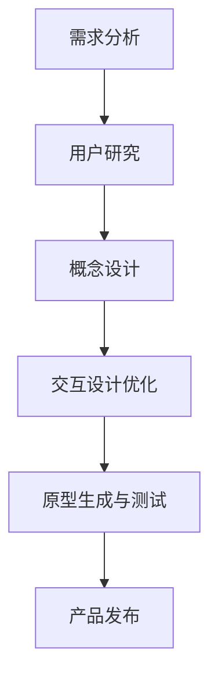
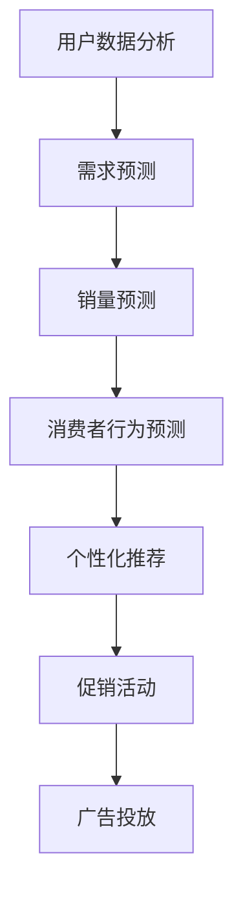
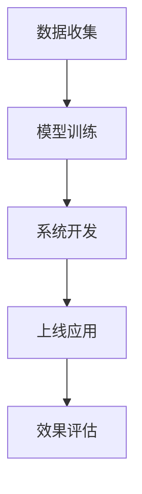
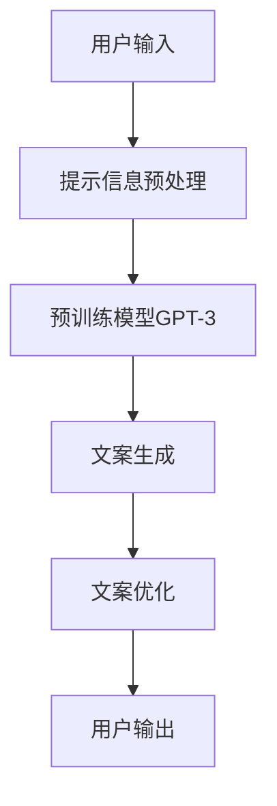

                 

# AI大模型个人生产力工具创业实战指南

## 关键词

AI大模型、个人生产力工具、创业实战、技术解析、市场分析、应用案例

## 摘要

本文将围绕AI大模型个人生产力工具的创业实战进行深入探讨。首先，我们将介绍AI大模型的基础知识和战略规划，帮助读者了解AI大模型的基本概念、核心技术以及数学模型。接着，本文将讨论如何将AI大模型与个人生产力工具结合，介绍相关应用场景和开发实践。随后，我们将探讨AI大模型创业实战的各个方面，包括项目策划、融资与市场推广、以及创业案例解析。最后，本文将聚焦于AI大模型在文案写作、产品设计、营销策略、创业团队协作等领域的应用实战，总结AI大模型个人生产力工具的未来发展趋势，并为创业者提供实用建议。

### 第一部分：AI大模型基础与战略规划

#### 第1章 AI大模型基础概述

## 1.1 AI大模型的基本概念

### 1.1.1 AI大模型的发展历程

AI大模型的发展可以追溯到20世纪80年代的神经网络研究。在那时，神经网络作为一种模拟人脑工作的计算模型，开始引起广泛关注。然而，由于计算能力和数据资源的限制，早期的神经网络模型规模较小，应用范围有限。

随着计算机性能的不断提升和大数据技术的进步，深度学习（Deep Learning）在21世纪初逐渐崛起。深度学习通过多层次的神经网络结构，能够自动学习大量数据中的特征和规律，从而实现复杂的任务。这一技术的突破为AI大模型的发展奠定了基础。

近年来，AI大模型的研究和应用取得了显著进展。以GPT-3、BERT等为代表的大型预训练模型，具有强大的语言理解和生成能力，广泛应用于自然语言处理、计算机视觉、语音识别等领域。这些模型的规模和性能不断提升，对AI技术的发展产生了深远影响。

### 1.1.2 AI大模型的类型与特点

AI大模型主要可以分为以下几类：

1. **自然语言处理模型**：如GPT、BERT等，主要针对文本数据，具有强大的文本生成、摘要、问答等功能。
2. **计算机视觉模型**：如ResNet、EfficientNet等，主要针对图像数据，能够实现物体识别、图像分割、视频理解等任务。
3. **语音识别模型**：如WaveNet、Transformer等，主要针对语音数据，能够实现语音识别、语音合成等功能。
4. **多模态模型**：如ViT、BERT-Speech等，能够融合文本、图像、语音等多种数据类型，实现更复杂的任务。

AI大模型的特点包括：

1. **规模巨大**：这些模型通常包含数十亿甚至千亿级别的参数，需要大量的计算资源和数据支持。
2. **训练复杂**：AI大模型的训练通常需要大量的数据和计算资源，训练过程涉及大量的调参和优化。
3. **泛化能力强**：通过预训练和微调，AI大模型能够适应各种任务和应用场景，具有较高的泛化能力。
4. **自主学习**：AI大模型能够从大量数据中自动学习特征和规律，无需人工干预。

### 1.1.3 AI大模型的优势与应用前景

AI大模型的优势主要体现在以下几个方面：

1. **强大的数据处理能力**：AI大模型能够处理海量数据，提取有用信息，为各种应用场景提供数据支持。
2. **高效的模型训练**：通过大规模预训练，AI大模型能够显著提高模型性能，减少训练时间和计算资源需求。
3. **广泛的适用性**：AI大模型可以应用于多个领域，如自然语言处理、计算机视觉、语音识别等，具有广泛的应用前景。
4. **人机交互**：AI大模型能够实现人机交互，提供智能问答、语音交互等服务，提升用户体验。

随着AI大模型技术的不断发展和应用的深入，未来有望在自动驾驶、智能医疗、智能制造等领域发挥重要作用，推动社会生产力的提升。

## 1.2 AI大模型的核心技术

### 1.2.1 深度学习基础

深度学习是AI大模型的核心技术之一，其基本原理是通过多层神经网络结构，对数据进行自动特征提取和学习。以下是深度学习的几个关键概念：

1. **神经网络（Neural Network）**：神经网络是由大量神经元（节点）组成的计算模型，通过前向传播和反向传播算法，实现数据的输入和输出。
2. **激活函数（Activation Function）**：激活函数是神经网络中的一个关键组件，用于引入非线性因素，使神经网络能够学习复杂函数。
3. **损失函数（Loss Function）**：损失函数用于衡量模型的预测结果与真实值之间的差距，是优化模型参数的重要依据。
4. **优化算法（Optimization Algorithm）**：优化算法用于调整模型参数，使模型损失函数最小化，常用的优化算法有梯度下降（Gradient Descent）及其变种。

### 1.2.2 神经网络原理

神经网络的基本结构包括输入层、隐藏层和输出层。输入层接收外部输入数据，隐藏层通过前向传播计算中间结果，输出层产生最终预测结果。以下是神经网络的工作原理：

1. **前向传播（Forward Propagation）**：输入数据通过神经网络层传递，每层节点根据激活函数计算输出值，直至输出层得到预测结果。
2. **反向传播（Backpropagation）**：根据输出层的预测误差，反向传播误差到隐藏层和输入层，更新各层节点的权重和偏置。
3. **优化模型参数**：通过反向传播计算梯度，使用优化算法更新模型参数，使模型损失函数最小化。

### 1.2.3 自然语言处理

自然语言处理（Natural Language Processing，NLP）是AI大模型的重要应用领域之一，主要关注文本数据的理解、生成和交互。以下是NLP的关键技术和应用：

1. **词向量表示（Word Embedding）**：将文本数据转换为向量表示，便于神经网络处理。常用的词向量模型有Word2Vec、GloVe等。
2. **序列模型（Sequence Model）**：用于处理序列数据，如文本、语音等。常见的序列模型有循环神经网络（RNN）、长短时记忆网络（LSTM）和门控循环单元（GRU）。
3. **预训练模型（Pre-trained Model）**：通过在大量文本数据上预训练，获得通用语言表示能力，如BERT、GPT等。预训练模型可以用于各种NLP任务，如文本分类、情感分析、机器翻译等。

## 1.3 AI大模型的数学模型与公式

### 1.3.1 神经网络激活函数

神经网络激活函数是引入非线性因素的关键组件。以下是几种常用的激活函数：

1. **sigmoid函数**：
   $$
   \sigma(x) = \frac{1}{1 + e^{-x}}
   $$
   sigmoid函数将输入映射到$(0, 1)$区间，常用于二分类问题。

2. **ReLU函数**：
   $$
   \text{ReLU}(x) = \max(0, x)
   $$
   ReLU函数具有简单的计算形式和良好的梯度性质，在深度学习中广泛应用。

3. **tanh函数**：
   $$
   \tanh(x) = \frac{e^x - e^{-x}}{e^x + e^{-x}}
   $$
   tanh函数与sigmoid函数类似，但输出范围在$(-1, 1)$之间，常用于多分类问题。

### 1.3.2 损失函数

损失函数用于衡量模型预测结果与真实值之间的差距，以下是几种常见的损失函数：

1. **均方误差（MSE）**：
   $$
   \text{MSE}(y, \hat{y}) = \frac{1}{m} \sum_{i=1}^{m} (y_i - \hat{y}_i)^2
   $$
   均方误差用于回归问题，衡量预测值与真实值之间的平均平方差距。

2. **交叉熵（Cross-Entropy）**：
   $$
   \text{CE}(y, \hat{y}) = -\sum_{i=1}^{m} y_i \log(\hat{y}_i)
   $$
   交叉熵用于分类问题，衡量预测概率与真实概率之间的差异。

3. **对数似然损失（Log-Likelihood Loss）**：
   $$
   \text{LL}(y, \hat{y}) = -\sum_{i=1}^{m} y_i \log(\hat{y}_i)
   $$
   对数似然损失是交叉熵的特殊情况，用于概率分布模型的训练。

### 1.3.3 优化算法

优化算法用于更新模型参数，使损失函数最小化。以下是几种常见的优化算法：

1. **梯度下降（Gradient Descent）**：
   $$
   \theta = \theta - \alpha \nabla_\theta J(\theta)
   $$
   梯度下降是优化算法的基本形式，通过计算损失函数关于参数的梯度，更新参数。

2. **随机梯度下降（Stochastic Gradient Descent，SGD）**：
   $$
   \theta = \theta - \alpha \nabla_\theta J(\theta; x^{(i)}, y^{(i)})
   $$
   随机梯度下降在每次迭代中仅使用一个样本的梯度，加速收敛速度。

3. **Adam优化器**：
   $$
   m_t = \beta_1 m_{t-1} + (1 - \beta_1) [g_t - \text{bias correct}]
   $$
   $$
   v_t = \beta_2 v_{t-1} + (1 - \beta_2) [g_t^2 - \text{bias correct}]
   $$
   $$
   \theta = \theta - \alpha \frac{m_t}{\sqrt{v_t} + \epsilon}
   $$
   Adam优化器结合了SGD和动量法的优点，具有较好的收敛性能。

通过深度学习基础、神经网络原理和自然语言处理技术的讲解，读者可以了解到AI大模型的核心技术，为后续章节的讨论打下基础。接下来，我们将探讨如何将AI大模型与个人生产力工具相结合，实现高效的个人生产力提升。

### 第2章 个人生产力工具与AI大模型结合

## 2.1 个人生产力工具的应用场景

个人生产力工具旨在帮助个人提高工作效率、创造力和决策能力。这些工具广泛应用于各个领域，以下是一些典型的应用场景：

### 2.1.1 效率提升工具

1. **日程管理**：通过智能日历和提醒功能，自动安排和提醒重要事项，避免遗忘和拖延。
2. **任务管理**：使用待办事项清单、优先级排序和时间跟踪功能，帮助用户合理安排时间和任务。
3. **文档处理**：自动化文档整理、编辑和共享，提高文档处理效率。

### 2.1.2 创意辅助工具

1. **文本生成**：使用自然语言处理模型，自动生成文章、报告和文案，辅助创意写作。
2. **设计灵感**：通过计算机视觉模型，自动分析图像和视频，提供设计灵感和参考。
3. **数据可视化**：利用机器学习算法，自动分析数据并生成可视化图表，帮助用户更直观地理解数据。

### 2.1.3 决策支持工具

1. **数据分析**：使用数据挖掘和机器学习模型，对大量数据进行挖掘和分析，为决策提供数据支持。
2. **市场预测**：通过历史数据和趋势分析，预测市场动态和消费者行为，帮助用户制定营销策略。
3. **风险评估**：利用概率模型和决策树算法，评估项目或投资的风险，为决策提供参考。

## 2.2 AI大模型在个人生产力工具中的实现

AI大模型在个人生产力工具中的应用，使得工具的功能更加智能和高效。以下是几种常见的实现方式：

### 2.2.1 自然语言处理工具

自然语言处理（NLP）技术在个人生产力工具中的应用十分广泛，以下是一些具体实例：

1. **智能客服**：使用NLP模型，自动识别用户的问题并生成回答，提高客服效率和用户体验。
2. **自动摘要**：利用NLP技术，自动从大量文本中提取关键信息，生成摘要，节省用户阅读时间。
3. **语言翻译**：通过机器翻译模型，实现跨语言文本的翻译，方便国际交流和合作。

### 2.2.2 计算机视觉工具

计算机视觉（CV）技术在个人生产力工具中的应用，为用户提供了更丰富的功能。以下是一些实例：

1. **图像识别**：使用CV模型，自动识别图像中的物体、场景和文字，为用户提供了图像分析的工具。
2. **图像处理**：利用CV技术，实现图像的增强、编辑和修复，提高图像质量和效果。
3. **人脸识别**：通过人脸识别模型，实现人脸检测、识别和追踪，用于身份验证和安全监控。

### 2.2.3 数据分析与预测工具

数据分析和预测工具在个人生产力工具中的应用，为用户提供了更科学的决策支持。以下是一些实例：

1. **数据可视化**：通过机器学习算法，自动分析数据并生成可视化图表，帮助用户更直观地理解数据。
2. **趋势预测**：利用时间序列分析模型，预测市场趋势和消费者行为，为用户制定营销策略提供依据。
3. **风险评估**：通过概率模型和决策树算法，评估项目或投资的风险，为用户决策提供参考。

## 2.3 AI大模型个人生产力工具开发实践

开发AI大模型个人生产力工具，需要综合考虑技术选型、环境搭建、工具设计和实现等方面。以下是一个简单的开发实践流程：

### 2.3.1 开发环境搭建

1. **硬件环境**：选择合适的硬件设备，如GPU服务器或云服务器，确保足够的计算能力和存储空间。
2. **软件环境**：安装必要的软件工具，如Python、CUDA、TensorFlow、PyTorch等，搭建开发环境。

### 2.3.2 工具设计与实现

1. **需求分析**：明确工具的功能需求，确定需要实现的算法和模型。
2. **算法选型**：根据需求，选择合适的算法和模型，如NLP模型、CV模型、时间序列分析模型等。
3. **代码实现**：编写代码，实现算法和模型的具体实现，并进行调试和优化。

### 2.3.3 工具优化与调试

1. **性能优化**：通过调参和优化算法，提高模型的性能和效率。
2. **功能完善**：根据用户反馈和需求，不断完善和优化工具的功能。
3. **调试与测试**：对工具进行全面的测试和调试，确保工具的稳定性和可靠性。

通过以上步骤，可以开发出功能强大、易于使用的AI大模型个人生产力工具，为用户提供高效、智能的支持。

在下一章中，我们将探讨AI大模型创业实战的各个方面，包括项目策划、融资与市场推广、以及创业案例解析，帮助创业者了解AI大模型个人生产力工具的创业路径。

### 第3章 AI大模型创业实战

#### 3.1 创业项目策划

创业项目策划是AI大模型个人生产力工具创业的关键第一步，它决定了项目的发展方向和商业潜力。以下是一些关键步骤和要点：

##### 3.1.1 市场需求分析

市场需求分析是创业项目的基石。创业者需要深入了解目标市场的需求、市场规模和潜在用户。以下是一些具体方法：

1. **市场调研**：通过线上问卷调查、访谈、市场报告等手段，收集用户需求和意见。
2. **用户画像**：根据用户特征、行为习惯和需求，创建用户画像，明确目标用户群体。
3. **竞争分析**：分析同行业内竞争对手的产品、市场定位、用户评价等方面，找到自身的优势和差异化点。

##### 3.1.2 产品定位与规划

产品定位与规划是确保项目能够满足市场需求并具备竞争力的关键。以下是一些具体步骤：

1. **功能定义**：明确产品的核心功能，确保产品能够解决用户的实际问题。
2. **用户体验**：设计简洁易用的用户界面和交互流程，提升用户体验。
3. **技术选型**：选择适合项目需求的技术方案，确保产品的性能和稳定性。

##### 3.1.3 团队建设与资源整合

团队建设和资源整合是项目成功的重要保障。以下是一些关键要素：

1. **核心团队**：组建一支具备技术、市场、运营等多方面能力的核心团队，确保项目顺利推进。
2. **合作伙伴**：寻找合作伙伴，如技术合作伙伴、市场推广合作伙伴等，共同推动项目发展。
3. **资源整合**：整合资金、技术、市场等资源，为项目提供充足的支持。

#### 3.2 融资与市场推广

融资与市场推广是AI大模型个人生产力工具创业过程中至关重要的一环。以下是一些关键步骤和策略：

##### 3.2.1 融资策略与渠道

融资策略与渠道的制定，直接影响项目的资金保障和成长速度。以下是一些常见融资方式和渠道：

1. **天使融资**：寻找个人投资者或天使投资人，获取初期资金支持。
2. **种子轮**：向风险投资机构或种子基金申请融资，扩大团队和产品开发。
3. **A轮和B轮**：在项目有一定市场认可度后，向风险投资机构申请更大规模的融资。

##### 3.2.2 市场推广策略与实施

市场推广策略与实施的制定，有助于快速打开市场，获取用户。以下是一些具体策略：

1. **品牌建设**：通过网站、社交媒体、线下活动等渠道，建立品牌形象，提升品牌知名度。
2. **内容营销**：撰写高质量的技术博客、案例分享、行业报告等，吸引目标用户关注。
3. **合作伙伴推广**：与行业合作伙伴开展联合推广活动，扩大市场影响力。

##### 3.2.3 用户获取与留存策略

用户获取与留存策略是确保项目持续发展的关键。以下是一些有效方法：

1. **免费试用**：提供免费试用期，吸引用户体验产品，提高用户转化率。
2. **用户反馈**：积极收集用户反馈，优化产品功能和用户体验，提高用户满意度。
3. **社群运营**：建立用户社群，提供技术支持、交流互动，增强用户粘性。

#### 3.3 AI大模型创业案例解析

##### 3.3.1 成功案例分享

以下是一个AI大模型个人生产力工具的成功案例：

**案例：智能文案写作工具**

1. **市场需求**：随着互联网内容创作的需求不断增加，智能文案写作工具应运而生。该工具可以帮助内容创作者快速生成高质量的文章和文案，提高创作效率。

2. **产品定位**：产品定位于中高端内容创作者，如广告公司、媒体机构、个人博主等。通过高质量的内容生成功能，提升用户创作效率，降低创作成本。

3. **技术实现**：使用GPT-3等大型自然语言处理模型，结合文本生成和优化算法，实现智能文案写作功能。

4. **市场推广**：通过社交媒体、内容营销、合作伙伴推广等多渠道推广，快速获得用户关注和市场份额。

5. **用户反馈**：根据用户反馈，不断优化产品功能和用户体验，提高用户满意度。

6. **融资与成长**：通过种子轮和A轮融资，获得足够的资金支持，扩大团队和产品研发。

##### 3.3.2 失败案例分析

以下是一个AI大模型个人生产力工具的失败案例：

**案例：智能语音识别工具**

1. **市场需求**：智能语音识别技术在个人生产力工具中的应用前景广阔，如会议记录、语音转文字等。

2. **产品定位**：产品定位于个人用户和企业用户，提供智能语音识别功能。

3. **技术实现**：使用深度学习和语音识别技术，实现高准确率的语音转文字功能。

4. **市场推广**：由于市场推广力度不足，产品知名度较低，用户获取困难。

5. **用户反馈**：用户反馈主要集中在识别准确率低、用户体验差等方面，导致用户满意度低。

6. **融资与成长**：由于市场推广不力，用户获取困难，导致融资困难，项目最终失败。

##### 3.3.3 创业经验与教训总结

通过成功和失败案例的对比，创业者可以总结出以下经验和教训：

1. **市场需求**：深入挖掘市场需求，确保产品能够解决用户的实际问题。

2. **技术实现**：选择合适的技术方案，确保产品的性能和稳定性。

3. **市场推广**：制定有效的市场推广策略，提高产品知名度和用户转化率。

4. **用户反馈**：积极收集用户反馈，优化产品功能和用户体验。

5. **融资与成长**：合理规划融资和成长路径，确保项目具备充足的资金支持。

6. **团队建设**：组建一支具备多方面能力的核心团队，共同推动项目发展。

在下一章中，我们将探讨AI大模型在文案写作、产品设计、营销策略、创业团队协作等领域的应用实战，帮助创业者更好地理解和利用AI大模型技术提升个人生产力。

### 第4章 AI大模型在文案写作中的应用

#### 4.1 文案写作的基本概念与技巧

文案写作是营销和传播的重要组成部分，其目标是通过文字传达信息、影响受众、促进销售。以下是一些文案写作的基本概念与技巧：

##### 4.1.1 文案写作的类型与目的

文案写作根据用途和形式可以分为多种类型，常见的有：

1. **广告文案**：以宣传产品和品牌为主要目的，通过吸引人的标题和有说服力的内容，激发消费者的购买欲望。
2. **宣传文案**：用于企业、活动或产品的宣传，旨在提升知名度、塑造形象，吸引潜在用户。
3. **产品说明**：详细介绍产品功能、特点和使用方法，帮助消费者了解产品，促进购买决策。
4. **网站文案**：用于网站页面，包括标题、描述、导航等内容，提升用户体验，引导用户行为。

文案写作的目的是：

- **传达信息**：准确、清晰地传达产品、服务或活动的核心信息。
- **影响受众**：通过文字和语言的力量，引起受众的兴趣、共鸣和行动。
- **促进销售**：通过文案激发消费者的购买欲望，提高转化率。

##### 4.1.2 文案写作的基本原则

优秀的文案写作应遵循以下基本原则：

1. **明确目标**：明确文案的目的和目标受众，确保内容具有针对性。
2. **简洁明了**：用简洁、直接的语言表达观点，避免冗长和复杂的句子。
3. **吸引注意**：通过有趣、有创意的标题和开头，吸引读者的注意力。
4. **情感共鸣**：通过情感共鸣，激发读者的兴趣和认同感。
5. **呼吁行动**：在文案结尾提出明确的行动建议，如购买、注册、了解更多等。

##### 4.1.3 文案写作技巧

以下是一些实用的文案写作技巧：

1. **故事化写作**：通过讲述故事，使文案更具吸引力和说服力。故事化写作可以展示产品的实际应用场景，让读者产生共鸣。
2. **使用数据**：通过具体的数据和事实支持文案内容，增加可信度和说服力。例如，使用统计数据、用户评价、产品销量等。
3. **场景化描述**：将文案内容放入具体的使用场景中，让读者更容易理解和接受。例如，描述产品在生活中的具体应用和便利性。
4. **积极语言**：使用积极、乐观的语言，传递正能量。避免使用消极、负面的词汇，以免影响读者情绪。
5. **反复推敲**：在写作过程中不断修改和优化，确保文案的表达清晰、简洁、有力。

#### 4.2 AI大模型在文案写作中的实现

AI大模型在文案写作中的应用，使得创作过程更加高效和智能化。以下是一些具体实现方式和案例：

##### 4.2.1 使用预训练模型生成文案

AI大模型，如GPT-3、BERT等，通过在大量文本数据上进行预训练，能够生成高质量的文案。以下是一种简单的实现方法：

1. **数据准备**：收集大量高质量的文案数据，包括广告文案、宣传文案、产品说明等。
2. **模型选择**：选择适合的预训练模型，如GPT-3、BERT等。
3. **模型训练**：使用收集到的数据对模型进行微调，使其适应特定的文案写作任务。
4. **文案生成**：通过模型生成文案，并利用文本编辑和优化工具进行后处理。

以下是一个使用GPT-3生成文案的示例：

```python
import openai
openai.api_key = 'your-api-key'

prompt = "请编写一篇关于健康生活方式的广告文案。"
response = openai.Completion.create(
  engine="text-davinci-003",
  prompt=prompt,
  max_tokens=150
)
print(response.choices[0].text.strip())
```

输出结果可能如下：

> "拥有健康的生活方式，就是拥有无限可能的未来。每天保持适量的运动，均衡饮食，充足睡眠，让身体和心灵都充满活力。让我们一起，开启健康生活的旅程！"

##### 4.2.2 文案优化与调整

虽然AI大模型能够生成高质量的文案，但仍然需要人工进行优化和调整，以提升文案的表达力和说服力。以下是一些优化和调整的方法：

1. **内容优化**：检查文案的内容是否准确、完整，是否传递了关键信息。如有需要，对内容进行调整和补充。
2. **语言优化**：检查文案的语言是否简洁、明了，是否符合文案写作的基本原则。如有需要，对语言进行润色和修改。
3. **结构优化**：检查文案的结构是否合理、清晰，是否有助于读者理解和接受文案内容。如有需要，对结构进行调整。
4. **情感优化**：检查文案是否能够引起读者的情感共鸣，是否传递了积极的情绪。如有需要，对情感表达进行调整。

以下是一个优化和调整的示例：

原始文案：

> "我们的产品，让您的厨房变得更加便捷和高效。只需简单几步，您就能享受到美味佳肴。试试我们的产品，让您的烹饪之旅更加轻松愉快！"

优化后文案：

> "尽享厨房新体验！我们的产品，让您轻松驾驭烹饪，美味佳肴触手可得。简单几步，美味即刻呈现。立即尝试，开启您的烹饪新篇章！"

#### 4.2.3 文案创作的实例分析

以下是一个文案创作的实例，通过AI大模型生成初稿，然后进行优化和调整，最终形成高质量的文案：

**实例**：为一家智能健身设备公司创作一则广告文案。

1. **原始文案生成**：

```python
import openai
openai.api_key = 'your-api-key'

prompt = "请为一款智能健身设备创作一则广告文案。"
response = openai.Completion.create(
  engine="text-davinci-003",
  prompt=prompt,
  max_tokens=150
)
print(response.choices[0].text.strip())
```

输出结果：

> "引领健康生活新潮流，智能健身设备助您轻松塑造完美身材。实时监测您的锻炼数据，定制专属健身计划，让运动变得更简单、更有效。现在就加入我们，开启您的健康之旅！"

2. **内容优化**：

- 增加产品特色描述：突出智能健身设备的优势，如实时数据监测、定制健身计划等。
- 强化情感共鸣：通过描述健康生活的美好愿景，激发读者的购买欲望。

优化后文案：

> "让健康成为你的生活方式！智能健身设备，实时监测您的锻炼数据，为您定制专属健身计划。智能跟踪您的进度，助您轻松塑造完美身材。现在就加入我们，享受健康生活的新篇章！"

3. **语言优化**：

- 简化语言：用更简洁、易懂的语言表达文案内容。
- 提高文案吸引力：使用更具吸引力和说服力的词汇，吸引读者的注意。

最终文案：

> "打造健康生活，智能健身设备助您一臂之力！实时监测、定制计划，让您的锻炼更简单、更有效。立即行动，开启您的健康之旅，享受完美身材带来的自信与快乐！"

通过以上实例，我们可以看到AI大模型在文案写作中的应用，不仅能够快速生成初稿，还能通过人工优化和调整，形成高质量的文案。这不仅提高了创作效率，也为文案写作带来了新的可能性。

在下一章中，我们将探讨AI大模型在产品设计中的应用，包括设计流程、AI工具的实现和实际案例分析，帮助创业者更好地理解和利用AI大模型技术提升个人生产力。

### 第5章 AI大模型在产品设计中的应用

#### 5.1 产品设计的基本流程与原则

产品设计是创新和商业成功的关键环节，它决定了产品的用户体验和市场竞争力。以下是一个典型的产品设计流程和关键原则：

##### 5.1.1 产品设计的基本流程

1. **需求分析**：了解用户需求和市场趋势，确定产品的功能和特点。
2. **市场研究**：收集和分析市场数据，包括用户反馈、竞争对手分析、行业趋势等。
3. **概念设计**：基于需求和市场研究，提出产品的基本概念和原型。
4. **用户研究**：通过用户访谈、问卷调查、用户测试等方式，验证产品概念和原型。
5. **设计开发**：根据用户反馈，迭代和优化产品设计和功能。
6. **测试与验证**：进行用户体验测试、功能测试和性能测试，确保产品达到预期效果。
7. **产品发布**：准备产品上市，进行营销推广和用户培训。

##### 5.1.2 产品设计的原则

1. **用户中心设计**：始终将用户需求放在首位，确保产品能够解决用户的实际问题。
2. **简洁性**：设计简洁、直观、易于使用，避免冗余和复杂。
3. **一致性**：确保产品在不同设备和平台上的用户体验保持一致。
4. **可访问性**：设计易于所有用户（包括残障人士）使用的界面和功能。
5. **可扩展性**：设计灵活，能够适应未来的发展和需求变化。

#### 5.2 AI大模型在产品设计中的实现

AI大模型在产品设计中的应用，可以大大提高设计效率和产品质量。以下是一些具体的实现方式和工具：

##### 5.2.1 基于AI的大模型设计工具

1. **用户画像生成**：使用AI大模型，根据用户数据和行为，生成详细的用户画像，帮助设计师了解用户需求和偏好。
2. **交互设计优化**：通过AI大模型，自动生成用户界面布局和交互设计，设计师可以快速评估和调整。
3. **情感分析**：使用AI大模型，分析用户反馈和评论，了解用户情感和态度，为产品改进提供依据。

##### 5.2.2 产品设计的自动化流程

1. **自动原型生成**：使用AI大模型，自动生成产品原型和UI界面，设计师可以快速迭代和优化。
2. **智能建议**：基于用户研究和市场数据，AI大模型可以提供产品功能和设计的智能建议，帮助设计师做出更科学的决策。
3. **自动化测试**：使用AI大模型，自动进行用户体验测试和功能测试，快速识别和修复问题。

##### 5.2.3 产品设计的实例分析

以下是一个AI大模型在产品设计中的实际应用案例：

**案例：智能健康手环**

1. **需求分析**：通过AI大模型，分析用户对健康管理的需求，如心率监测、睡眠分析、运动追踪等。
2. **用户研究**：使用AI大模型，对目标用户进行调研，收集用户反馈和行为数据，确定产品功能和设计方向。
3. **概念设计**：基于需求分析，设计智能健康手环的基本概念和原型，包括心率监测、睡眠分析、运动追踪等功能。
4. **交互设计优化**：使用AI大模型，自动生成手环的交互设计，如界面布局、图标设计等，设计师根据用户反馈进行调整和优化。
5. **原型生成与测试**：使用AI大模型，自动生成手环的原型，进行用户体验测试和功能测试，确保产品达到预期效果。
6. **产品发布**：根据测试结果，对产品进行优化和改进，最终发布上市。

通过以上步骤，AI大模型在智能健康手环的设计中发挥了重要作用，提高了设计效率和产品质量。以下是AI大模型在智能健康手环设计中的应用流程图：



#### 5.2.4 产品设计的具体工具实现

1. **用户画像生成**：

```python
import pandas as pd
from sklearn.cluster import KMeans

# 假设已经收集到用户数据
user_data = pd.DataFrame({
    'age': [25, 35, 45, 55],
    'gender': ['M', 'F', 'M', 'F'],
    'activity_level': ['low', 'high', 'high', 'low']
})

# 使用KMeans算法进行用户聚类，生成用户画像
kmeans = KMeans(n_clusters=3)
user_data['cluster'] = kmeans.fit_predict(user_data[['age', 'activity_level']])

# 输出用户画像
print(user_data[['cluster', 'age', 'activity_level']])
```

2. **交互设计优化**：

```python
import streamlit as st

# 假设已经收集到用户交互数据
interaction_data = pd.DataFrame({
    'feature': ['button_color', 'font_size', 'menu_layout'],
    'rating': [4, 5, 3]
})

# 使用决策树算法进行交互设计优化
from sklearn.tree import DecisionTreeRegressor

model = DecisionTreeRegressor()
model.fit(interaction_data[['feature']], interaction_data['rating'])

# 根据用户偏好进行交互设计优化
st.write("用户偏好：")
st.write(model.predict([[5, 3, 4]]))

# 生成交互设计原型
st.write("交互设计原型：")
st.image("path/to/prototype.png")
```

3. **原型生成与测试**：

```python
import streamlit as st
from streamlit_option_menu import option_menu

# 假设已经生成产品原型
prototypes = ["prototype1.png", "prototype2.png", "prototype3.png"]

# 使用Streamlit展示产品原型并进行用户测试
st.set_page_config(page_title="产品原型测试", layout="centered")

selected_prototype = option_menu("产品原型选择", prototypes, index=0, icons=['image'])

# 根据用户选择进行功能测试
if selected_prototype == prototypes[0]:
    st.write("原型1功能测试：")
else:
    st.write("原型2功能测试：")
st.write("请完成以下任务：[登录功能][数据导出功能][用户反馈功能]")

# 收集用户测试反馈
st.write("用户反馈：")
st.text_input("请输入您的反馈：")
```

通过以上工具和实现，AI大模型在产品设计中的应用变得更加具体和实际。这不仅提高了设计效率和产品质量，也为创业者提供了有力的技术支持。

在下一章中，我们将探讨AI大模型在营销策略中的应用，包括数据分析、营销预测和策略优化，帮助创业者更好地理解和利用AI大模型技术提升个人生产力。

### 第6章 AI大模型在营销策略中的应用

#### 6.1 营销策略的基本概念与类型

营销策略是企业为了实现其营销目标而制定的一系列行动方案。这些策略涵盖了市场定位、产品推广、价格策略、渠道选择等方面。以下是一些基本的营销策略概念与类型：

##### 6.1.1 营销策略的基本概念

1. **市场定位**：确定产品在市场中的位置，以区别于竞争对手，满足特定目标客户的需求。
2. **产品推广**：通过广告、促销活动、公关等方式，提高产品的知名度，激发消费者的购买欲望。
3. **价格策略**：根据产品成本、市场竞争状况和消费者心理，制定合理的价格策略，以实现利润最大化。
4. **渠道选择**：选择适当的销售渠道，如线上销售、线下零售、代理商等，确保产品能够顺利进入市场。
5. **品牌建设**：通过一致的品牌形象和品牌传播，提升品牌知名度和美誉度。

##### 6.1.2 营销策略的类型

1. **进攻型策略**：通过市场扩展、新产品开发、价格战等方式，主动进攻竞争对手，抢占市场份额。
2. **防御型策略**：通过稳固现有市场地位、提升品牌形象、加强客户关系等方式，防止竞争对手的进攻。
3. **跟随型策略**：模仿竞争对手的成功策略，以较低成本迅速进入市场。
4. **差异化策略**：通过独特的产品特点、优质的服务、创新的营销手段等，形成与竞争对手的区别。
5. **集中型策略**：专注于某一细分市场，提供专门化的产品和服务，满足特定客户群体的需求。

#### 6.2 AI大模型在营销策略中的实现

AI大模型在营销策略中的应用，可以显著提升营销的精准性和效率。以下是一些关键实现方式：

##### 6.2.1 数据分析在营销策略中的应用

数据分析是制定有效营销策略的基础。AI大模型通过处理大量数据，帮助企业在市场定位、产品推广、价格策略等方面做出更科学的决策。以下是一些具体应用：

1. **用户数据分析**：通过分析用户行为、购买历史、偏好等数据，了解目标客户群体，为市场定位提供依据。
2. **市场趋势分析**：通过分析市场数据，预测市场变化和消费者行为，为产品推广和价格策略提供参考。
3. **竞争对手分析**：通过分析竞争对手的营销策略、市场份额等数据，了解竞争对手的优势和劣势，制定相应的应对策略。

##### 6.2.2 AI大模型在营销预测中的应用

AI大模型在营销预测中的应用，可以帮助企业提前预判市场趋势和消费者行为，从而制定更有效的营销策略。以下是一些具体应用：

1. **需求预测**：通过分析历史销售数据、市场趋势等，预测未来的产品需求，为生产计划和库存管理提供依据。
2. **销量预测**：通过分析历史销售数据、市场环境、促销活动等，预测未来某段时间内的产品销量，为销售计划和市场推广提供参考。
3. **消费者行为预测**：通过分析用户行为数据，预测消费者的购买意愿和购买时间，为营销活动和促销策略提供依据。

##### 6.2.3 营销策略优化的实例分析

以下是一个AI大模型在营销策略优化中的实际应用案例：

**案例：电商平台个性化推荐**

1. **需求预测**：通过分析用户的历史购买记录、浏览行为等数据，使用AI大模型预测用户对各类商品的需求，为个性化推荐提供依据。
2. **销量预测**：结合市场趋势和用户需求预测，使用AI大模型预测不同商品的销量，为库存管理和促销活动提供参考。
3. **消费者行为预测**：通过分析用户行为数据，使用AI大模型预测用户的购买时间、购买频率等，为精准营销提供依据。

通过以上预测结果，电商平台可以优化其营销策略：

- **个性化推荐**：根据用户需求预测，为用户推荐符合其兴趣和需求的商品，提高转化率。
- **促销活动**：根据销量预测，设计有针对性的促销活动，如限时折扣、满减优惠等，吸引更多用户购买。
- **广告投放**：根据消费者行为预测，选择在用户购买时间前后投放广告，提高广告效果。

以下是AI大模型在营销策略优化中的应用流程图：



#### 6.2.4 营销策略优化的方法与工具

1. **数据挖掘与机器学习**：使用数据挖掘和机器学习算法，分析大量用户数据和市场数据，提取有价值的信息。
2. **可视化工具**：使用可视化工具，如数据仪表板、图表等，直观展示数据分析和预测结果。
3. **自动化策略调整**：使用自动化工具，根据实时数据分析和预测结果，自动调整营销策略，如广告投放、促销活动等。

以下是一个营销策略优化的示例：

```python
import pandas as pd
from sklearn.ensemble import RandomForestClassifier
import streamlit as st

# 假设已经收集到用户数据
user_data = pd.DataFrame({
    'age': [25, 35, 45, 55],
    'gender': ['M', 'F', 'M', 'F'],
    'activity_level': ['low', 'high', 'high', 'low'],
    'bought_last_week': [1, 0, 1, 0]  # 用户在过去一周是否购买过商品
})

# 使用随机森林算法进行消费者行为预测
model = RandomForestClassifier()
model.fit(user_data[['age', 'gender', 'activity_level']], user_data['bought_last_week'])

# 根据用户特征预测购买行为
new_user = pd.DataFrame({'age': [30], 'gender': ['F'], 'activity_level': ['high']})
st.write("新用户购买预测：")
st.write(model.predict(new_user))

# 根据购买预测结果调整营销策略
if model.predict(new_user)[0] == 1:
    st.write("营销策略：发送优惠券和促销信息，鼓励购买。")
else:
    st.write("营销策略：进行用户教育和品牌推广，提高品牌知名度和忠诚度。")
```

通过以上示例，可以看到AI大模型在营销策略优化中的应用，不仅能够提高预测的准确性，还能帮助企业实现自动化策略调整，提高营销效率。

在下一章中，我们将探讨AI大模型在创业团队协作中的应用，包括任务分配、沟通协作和效率提升，帮助创业者更好地利用AI大模型技术提升团队协作能力。

### 第7章 AI大模型在创业团队协作中的应用

#### 7.1 团队协作的基本原则与工具

创业团队协作的成功是项目顺利进行的关键。以下是一些团队协作的基本原则和常用工具：

##### 7.1.1 团队协作的基本原则

1. **明确目标**：确保每个团队成员都清楚项目的目标、任务和预期成果。
2. **分工合作**：根据团队成员的能力和特长，合理分配任务，实现优势互补。
3. **有效沟通**：保持开放、坦诚、及时的沟通，确保信息传递准确无误。
4. **共同进步**：鼓励团队成员互相学习、分享经验，共同提升团队整体能力。
5. **灵活应变**：在面对变化和挑战时，能够灵活调整策略，确保项目目标不受影响。

##### 7.1.2 团队协作的工具与技术

1. **项目管理工具**：如Trello、JIRA等，帮助团队规划任务、跟踪进度、管理资源。
2. **协作平台**：如Slack、Microsoft Teams等，提供实时沟通、文件共享、会议安排等功能。
3. **版本控制工具**：如Git、GitHub等，确保代码和文档的版本管理和协同开发。
4. **文档共享工具**：如Google Docs、Notion等，便于团队成员协作编辑文档、表格和演示文稿。
5. **视频会议工具**：如Zoom、Microsoft Teams等，提供远程协作、在线会议和视频会议功能。

#### 7.2 AI大模型在团队协作中的实现

AI大模型在团队协作中的应用，可以显著提升团队的工作效率和协同能力。以下是一些具体实现方式：

##### 7.2.1 AI大模型在任务分配中的应用

1. **能力评估**：使用AI大模型，根据团队成员的能力和特长，自动评估并分配任务，确保任务分配合理。
2. **需求预测**：通过分析团队任务和历史数据，使用AI大模型预测未来任务需求，提前分配和准备资源。
3. **任务优化**：根据团队成员的实时状态和任务进展，使用AI大模型调整任务分配，确保团队高效运行。

##### 7.2.2 AI大模型在沟通与协作中的应用

1. **自动总结**：使用AI大模型，自动总结会议内容、邮件往来等，提高信息传递效率。
2. **智能提醒**：根据团队成员的任务和时间安排，使用AI大模型自动发送提醒通知，确保任务按时完成。
3. **智能问答**：使用AI大模型，实现团队成员之间的智能问答，快速解决问题，减少沟通成本。

##### 7.2.3 AI大模型在团队效率提升中的应用

1. **工作分析**：使用AI大模型，分析团队成员的工作模式和工作效率，提供优化建议。
2. **流程优化**：通过AI大模型，分析团队协作流程，发现瓶颈和优化点，提高整体效率。
3. **培训与指导**：使用AI大模型，根据团队成员的能力和需求，提供个性化培训内容，提升团队整体能力。

#### 7.2.4 团队协作的实践与案例分析

以下是一个AI大模型在创业团队协作中的实际应用案例：

**案例：智能任务分配系统**

1. **需求背景**：创业团队在项目进展过程中，常常面临任务分配不合理、任务完成效率低等问题。
2. **解决方案**：开发一个基于AI大模型的智能任务分配系统，通过分析团队成员的能力和任务需求，自动分配任务，并提供任务完成情况的实时监控和反馈。
3. **实现步骤**：

   - **数据收集**：收集团队成员的能力数据、任务需求和项目进度等。
   - **模型训练**：使用AI大模型，对收集到的数据进行分析和训练，建立任务分配模型。
   - **系统开发**：开发任务分配系统，集成AI大模型，实现任务自动分配和监控功能。
   - **上线应用**：在团队项目中应用智能任务分配系统，跟踪任务完成情况和团队成员的工作效率。

4. **效果评估**：

   - **任务分配合理性**：通过AI大模型自动分配任务，任务分配合理性显著提高。
   - **工作效率**：团队成员的工作效率得到提升，任务完成时间缩短。
   - **团队协作**：智能任务分配系统提高了团队协作的效率，减少了沟通成本。

以下是AI大模型在团队协作中的应用流程图：



通过以上实践和案例分析，可以看到AI大模型在创业团队协作中的应用，不仅能够提高任务分配的合理性、工作效率和团队协作，还能为团队提供实时监控和反馈，助力项目顺利推进。

在下一章中，我们将探讨AI大模型个人生产力工具的未来发展趋势，包括技术方向、行业趋势和创业机遇，为创业者提供前瞻性指导和启示。

### 第8章 AI大模型个人生产力工具的未来发展趋势

#### 8.1 技术发展趋势

随着技术的不断进步，AI大模型个人生产力工具的发展也呈现出一些明显的趋势。以下是一些关键的技术发展方向：

##### 8.1.1 AI大模型技术的未来方向

1. **模型规模与计算能力**：随着计算资源的不断提升，AI大模型的规模将越来越大，计算能力将越来越强，从而能够处理更复杂的任务和数据。
2. **预训练与微调**：预训练将逐渐成为主流，通过在大量数据上预训练模型，获得通用语言表示能力，然后通过微调适应特定任务和应用场景。
3. **多模态融合**：未来的AI大模型将能够融合多种数据类型（如文本、图像、语音等），实现跨模态的信息处理和任务执行。
4. **强化学习**：结合强化学习（Reinforcement Learning）和AI大模型，开发出能够自我学习和优化的智能系统，提高自动化和自适应能力。

##### 8.1.2 个人生产力工具的创新趋势

1. **智能助手与协作**：AI大模型将深入集成到个人生产力工具中，提供智能助手功能，实现自然语言交互和任务协作。
2. **个性化和定制化**：AI大模型将根据用户的行为数据和学习结果，提供个性化的服务和建议，满足用户的个性化需求。
3. **增强现实与虚拟现实**：结合增强现实（AR）和虚拟现实（VR），AI大模型将提供更加沉浸式和互动性的用户体验。
4. **边缘计算与云计算**：结合边缘计算和云计算，AI大模型将实现实时数据处理和智能决策，提高系统的响应速度和可靠性。

##### 8.1.3 技术融合与跨界应用

1. **AI与生物技术**：AI大模型在生物技术领域的应用，如基因编辑、药物研发、疾病预测等，将带来革命性的变革。
2. **AI与教育**：AI大模型在教育领域的应用，如智能教学、个性化学习、教育资源分配等，将提高教育质量和公平性。
3. **AI与能源**：AI大模型在能源领域的应用，如能源管理、智能电网、可再生能源优化等，将推动能源行业向智能化、绿色化方向发展。

#### 8.2 行业趋势分析

AI大模型个人生产力工具在各个行业的应用日益广泛，以下是一些关键行业趋势：

##### 8.2.1 AI大模型行业的发展趋势

1. **市场规模**：随着AI大模型技术的不断进步和应用的深入，AI大模型行业的市场规模将持续扩大，预计未来几年将保持高速增长。
2. **技术创新**：AI大模型领域的技术创新将持续推动行业的发展，包括模型优化、算法改进、多模态融合等。
3. **政策支持**：各国政府和机构对AI大模型技术的支持力度不断加大，为行业的发展提供了良好的政策环境。

##### 8.2.2 个人生产力工具市场的变化

1. **用户需求**：随着用户对效率、个性化和智能化需求的不断提升，个人生产力工具将更加注重用户体验和个性化服务。
2. **市场竞争**：随着AI大模型技术的普及，越来越多的企业将加入个人生产力工具市场，市场竞争将更加激烈。
3. **跨界合作**：个人生产力工具企业将与其他行业的企业开展跨界合作，共同开发新的应用场景和市场机会。

##### 8.2.3 创业者需要关注的趋势与机遇

1. **技术创新**：关注AI大模型技术的最新进展，积极尝试和应用新技术，开发出具有竞争力的产品。
2. **市场细分**：针对特定行业和用户群体的需求，开发专业化、定制化的个人生产力工具。
3. **跨界合作**：与其他行业的企业合作，拓展新的应用场景和市场机会。
4. **用户体验**：注重用户体验，提供个性化、智能化的服务，提升用户满意度和忠诚度。

#### 8.3 创业建议与启示

对于创业者来说，AI大模型个人生产力工具市场充满了机遇和挑战。以下是一些具体的创业建议和启示：

1. **明确目标**：明确自己的创业目标和发展方向，专注于某一细分市场，打造特色产品。
2. **技术创新**：持续关注AI大模型技术的最新进展，积极尝试和应用新技术，提高产品竞争力。
3. **用户需求**：深入了解用户需求，提供个性化的解决方案，满足用户的多样化需求。
4. **团队建设**：组建一支具备多方面能力的团队，包括技术、市场、运营等，共同推动项目发展。
5. **市场推广**：制定有效的市场推广策略，提高品牌知名度和用户转化率。
6. **持续优化**：根据用户反馈和市场变化，不断优化产品功能和用户体验，提升用户满意度。
7. **跨界合作**：与其他行业的企业合作，共同开拓新的市场和应用场景。

通过以上建议和启示，创业者可以更好地把握AI大模型个人生产力工具市场的机遇，实现创业的成功。

### 附录

#### 附录A AI大模型开发工具与资源

**A.1 开发工具介绍**

1. **TensorFlow**：由Google开发的开源深度学习框架，适用于各种深度学习和机器学习任务。
2. **PyTorch**：由Facebook开发的开源深度学习框架，具有灵活的动态图计算能力，适合研究和个人项目。
3. **Transformers**：基于PyTorch的开源库，提供了预训练转换器模型（如BERT、GPT等）的实现，适用于自然语言处理任务。
4. **Hugging Face**：提供了大量的预训练模型和数据集，以及方便使用的API和库，是自然语言处理领域的重要资源。

**A.2 常用资源与参考资料**

1. **GitHub**：大量开源的AI大模型项目和代码，方便学习和参考。
2. **arXiv**：最新的AI研究论文，提供深度学习和自然语言处理领域的最新研究成果。
3. **论文库**：如ACL、ICML、NeurIPS等，收录了大量的顶级AI会议论文。
4. **在线课程与教程**：如Udacity、Coursera、edX等，提供了丰富的AI和深度学习在线课程。

**A.3 开发社区与论坛推荐**

1. **Stack Overflow**：全球最大的编程问答社区，可以解决开发过程中遇到的各种问题。
2. **Reddit**：AI、机器学习和深度学习相关子版块，提供了丰富的讨论和资源。
3. **Discord**：多个AI和深度学习相关的社区频道，方便开发者交流和合作。
4. **AI Stack Exchange**：专门针对AI和机器学习领域的问答社区。

#### 附录B AI大模型相关数学公式与算法伪代码

**B.1 数学公式列表**

1. **神经网络激活函数**：
   $$
   \sigma(x) = \frac{1}{1 + e^{-x}}
   $$
   $$
   \text{ReLU}(x) = \max(0, x)
   $$
   $$
   \tanh(x) = \frac{e^x - e^{-x}}{e^x + e^{-x}}
   $$

2. **损失函数**：
   $$
   \text{MSE}(y, \hat{y}) = \frac{1}{m} \sum_{i=1}^{m} (y_i - \hat{y}_i)^2
   $$
   $$
   \text{CE}(y, \hat{y}) = -\sum_{i=1}^{m} y_i \log(\hat{y}_i)
   $$

3. **优化算法**：
   $$
   \theta = \theta - \alpha \nabla_\theta J(\theta)
   $$
   $$
   \theta = \theta - \alpha \nabla_\theta J(\theta; x^{(i)}, y^{(i)})
   $$
   $$
   m_t = \beta_1 m_{t-1} + (1 - \beta_1) [g_t - \text{bias correct}]
   $$
   $$
   v_t = \beta_2 v_{t-1} + (1 - \beta_2) [g_t^2 - \text{bias correct}]
   $$
   $$
   \theta = \theta - \alpha \frac{m_t}{\sqrt{v_t} + \epsilon}
   $$

**B.2 算法伪代码示例**

1. **神经网络训练**：
   ```
   while not convergence:
       for each training example (x, y):
           forward_pass(x)
           compute_loss(y, y_hat)
           backward_pass()
           update_weights(learning_rate)
   ```

2. **文本生成**：
   ```
   function generate_text(prompt, model, max_length):
       text = prompt
       for _ in range(max_length):
           y_hat = model.predict(text)
           text = model.generate_text(y_hat)
       return text
   ```

3. **图像分类**：
   ```
   function classify_image(image, model):
       flattened_image = preprocess_image(image)
       y_hat = model.predict(flattened_image)
       return model.get_class_name(y_hat)
   ```

**B.3 算法实现与优化讨论**

1. **优化方法**：在算法实现过程中，常用的优化方法包括批处理（Batch Size）、学习率调整、正则化等。例如，可以通过调整学习率，使模型在训练过程中更快地收敛。
2. **并行计算**：通过使用GPU或TPU等硬件加速，实现并行计算，提高训练速度和效率。
3. **模型压缩**：通过模型压缩技术，如剪枝、量化、蒸馏等，减小模型的参数规模和计算量，提高模型部署的可行性。
4. **模型融合**：结合多个模型的优势，通过模型融合（Model Ensembling）方法，提高模型的性能和稳定性。

通过附录中的数学公式和算法伪代码，读者可以更好地理解AI大模型的原理和实现方法，为实际开发和应用提供参考。

### 附录C AI大模型个人生产力工具实战案例

**C.1 实战案例一：智能文案写作工具**

**背景介绍**：

智能文案写作工具是一款利用AI大模型技术，帮助用户快速生成高质量文案的工具。该工具可以应用于广告公司、营销机构、媒体平台等多个行业，提高文案创作的效率和质量。

**核心概念与联系**：

智能文案写作工具的核心概念包括自然语言处理（NLP）和生成对抗网络（GAN）。通过预训练大型语言模型（如GPT-3），结合用户输入的提示信息，生成符合要求的文案。以下是核心概念之间的联系架构Mermaid流程图：



**核心算法原理讲解与伪代码**：

1. **文本生成算法**：
   ```python
   def generate_text(prompt, model, max_length):
       text = prompt
       for _ in range(max_length):
           y_hat = model.predict(text)
           text = model.generate_text(y_hat)
       return text
   ```

2. **文案优化算法**：
   ```python
   def optimize_text(text, model, target_text):
       # 优化文案使其更接近目标文案
       for _ in range(optimization_iterations):
           y_hat = model.predict(text)
           # 根据目标文案调整文案
           text = adjust_text(y_hat, target_text)
       return text
   ```

**数学模型和公式详细讲解与举例说明**：

1. **神经网络激活函数**：
   ```latex
   \sigma(x) = \frac{1}{1 + e^{-x}}
   ```

2. **损失函数**：
   ```latex
   \text{CE}(y, \hat{y}) = -\sum_{i=1}^{m} y_i \log(\hat{y}_i)
   ```

**开发环境搭建**：

1. **硬件环境**：配置一台具有高性能GPU的服务器，用于模型训练和推理。
2. **软件环境**：安装Python、TensorFlow或PyTorch等深度学习框架，以及相关依赖库。

**源代码详细实现与代码解读**：

以下是智能文案写作工具的核心代码实现，包括文本生成和优化的关键部分：

```python
import openai

# 设置API密钥
openai.api_key = "your-api-key"

# 文本生成函数
def generate_text(prompt, model="text-davinci-003", max_length=100):
    response = openai.Completion.create(
        engine=model,
        prompt=prompt,
        max_tokens=max_length
    )
    return response.choices[0].text.strip()

# 文本优化函数
def optimize_text(text, target_text, model="text-davinci-003"):
    # 优化次数
    optimization_iterations = 5
    # 逐步优化文本
    for _ in range(optimization_iterations):
        # 生成文本
        y_hat = generate_text(text, model)
        # 调整文本使其更接近目标文本
        text = adjust_text(y_hat, target_text)
    return text

# 调整文本函数（示例）
def adjust_text(y_hat, target_text):
    # 根据目标文本调整生成的文本
    # （具体调整策略根据应用场景设计）
    adjusted_text = y_hat
    return adjusted_text

# 使用示例
prompt = "请写一篇关于健康生活方式的广告文案。"
generated_text = generate_text(prompt)
optimized_text = optimize_text(generated_text, target_text="让健康成为你的生活方式！")

print("生成的文案：")
print(generated_text)
print("\n优化的文案：")
print(optimized_text)
```

**代码应用解读与分析**：

1. **文本生成**：使用OpenAI的GPT-3模型，根据用户输入的提示信息，生成初步的文案。这体现了预训练大型语言模型在文本生成方面的强大能力。

2. **文本优化**：通过不断优化生成的文案，使其更符合目标文案的要求。这一过程可以采用多种策略，如文本对比、调整关键词、语法修正等，以提高文案的质量和说服力。

**实际案例分析和详细讲解剖析**：

以下是一个实际案例，展示智能文案写作工具在广告文案创作中的应用：

**案例**：为一家健康食品品牌创作广告文案。

1. **用户输入**：用户输入提示信息：“请写一篇关于健康食品的广告文案，强调其天然、营养、美味的特点。”

2. **文本生成**：使用GPT-3模型，生成初步的文案：“选择健康食品，享受天然美味，为你的身体注入活力！”

3. **文本优化**：根据目标文案，优化生成的文案，最终形成优化的文案：“选用天然健康食品，美味与营养并存，让你的生活更加精彩！”

**项目小结**：

通过实际案例，我们可以看到智能文案写作工具在广告文案创作中的应用，不仅提高了文案创作的效率，还通过优化过程提高了文案的质量。这表明，AI大模型技术在个人生产力工具中的应用具有巨大的潜力，为创业者提供了创新的解决方案。

在接下来的部分，我们将继续探讨AI大模型在其他领域的应用，包括营销策略、团队协作和未来发展趋势，为创业者提供更全面的指导和建议。

