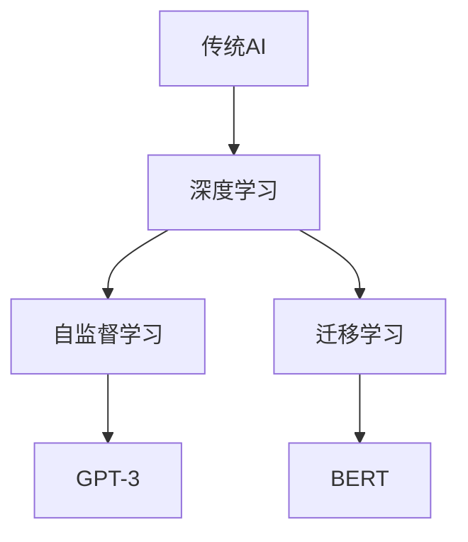
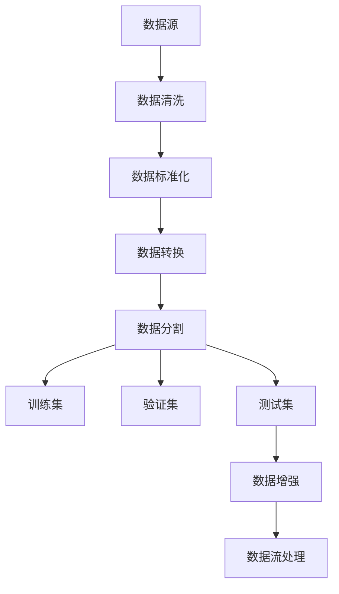

                 

### 文章标题

《AI大模型创业项目解析：商业模式、技术架构与发展路径》

本文将深入探讨AI大模型创业项目的各个方面，从基础概念到实际应用，再到商业模式和技术架构，以及项目的实战经验和发展路径。我们将一步步解析这些核心内容，帮助读者全面理解AI大模型的创业之道。

### 关键词

- AI大模型
- 商业模式
- 技术架构
- 创业项目
- 发展路径

### 摘要

本文旨在为有意投身AI大模型领域的创业者提供系统化的指导和深入分析。首先，我们将介绍AI大模型的基础知识，包括概念、技术原理和应用领域。接着，分析创业项目的选择、商业模式设计及其面临的挑战与应对策略。随后，深入探讨AI大模型的技术架构，包括计算资源管理、数据处理、模型训练和优化。最后，通过实际案例分享，展示AI大模型创业项目的全流程，并对未来发展路径进行展望。希望通过本文，能够帮助创业者更好地把握AI大模型的发展机遇。

## 第一部分: 了解AI大模型与创业

### 第1章: AI大模型基础

#### 1.1 AI大模型的概念与演进

##### 1.1.1 大模型的定义

AI大模型，通常指的是具有数百万甚至数十亿参数的深度学习模型。这些模型能够通过大规模数据进行训练，从而在学习复杂任务时展现出卓越的表现。大模型的出现标志着人工智能从传统方法向深度学习的转型，其核心在于通过增加模型规模来提升性能。

##### 1.1.2 大模型与传统AI模型的区别

传统AI模型，如决策树、支持向量机等，通常参数较少，难以处理高度复杂的任务。而大模型则通过深度神经网络结构，能够捕捉数据中的多层次特征，从而实现更强大的学习能力和泛化能力。

##### 1.1.3 AI大模型的演进

AI大模型的演进可以从以下几个方面进行概述：

1. **从传统AI到深度学习**：传统AI方法在处理复杂任务时存在诸多局限，深度学习的兴起为AI领域带来了革命性变化。通过神经网络结构，深度学习模型能够自动提取数据特征，大大提高了任务完成的准确性。

2. **深度学习到大模型的演变**：随着计算能力的提升和数据规模的增加，研究人员开始尝试构建更大规模的模型。GPT-3、BERT等代表性大模型的出现，标志着AI领域的一次重大突破。

##### 1.1.4 大模型的代表性模型

- **GPT-3**：由OpenAI开发的GPT-3模型，拥有1750亿个参数，是目前已知最大的自然语言处理模型。GPT-3在多项自然语言处理任务上取得了显著的成果，展示了大模型的强大能力。
- **BERT**：BERT（Bidirectional Encoder Representations from Transformers）由Google开发，是一种用于自然语言处理的预训练模型。通过双向训练，BERT能够更好地理解句子的上下文信息。

#### 1.2 大模型的技术原理

##### 1.2.1 深度学习基础

深度学习是AI领域的一个重要分支，其核心在于通过多层神经网络对数据进行学习。以下是深度学习的一些基础概念：

- **神经网络**：神经网络由多个节点（神经元）组成，每个节点负责对输入数据进行加权求和并应用非线性激活函数，从而生成输出。
- **前向传播与反向传播**：在神经网络中，前向传播用于计算输出，反向传播则用于计算误差并更新网络权重。

##### 1.2.2 大模型的训练方法

大模型的训练方法主要包括以下几种：

- **自监督学习**：自监督学习允许模型在没有明确标注的数据上进行训练。这种方法能够有效利用未标注数据，提高模型的泛化能力。
- **迁移学习**：迁移学习利用预训练模型在新任务上的表现，通过少量数据对模型进行调整，从而提高新任务的性能。

##### 1.2.3 大模型的评估与优化

大模型的评估与优化是确保模型性能的关键环节：

- **评估指标**：常用的评估指标包括准确率、召回率、F1分数等。对于不同的任务，选择合适的评估指标至关重要。
- **优化策略**：优化策略包括选择合适的损失函数、优化器以及调整学习率等。通过优化策略，可以加速模型的收敛速度并提高模型的性能。

### Mermaid 流程图

为了更直观地展示AI大模型的概念与演进，我们可以使用Mermaid绘制一个流程图：



通过这个流程图，我们可以清晰地看到从传统AI到深度学习，再到自监督学习和迁移学习的发展路径，以及GPT-3和BERT等代表性模型的地位。

#### 1.3 大模型的技术挑战与未来方向

尽管AI大模型取得了显著的进展，但在实际应用中仍面临一些技术挑战：

- **计算资源消耗**：大模型需要大量的计算资源进行训练，这对硬件设施提出了更高的要求。
- **数据隐私和安全**：在训练过程中，大模型会接触到大量敏感数据，如何确保数据隐私和安全是一个重要问题。
- **解释性**：大模型通常被视为“黑盒”，其决策过程难以解释，这在某些应用场景中可能会带来挑战。

未来，随着技术的进步，AI大模型有望在以下几个方向取得突破：

- **模型压缩**：通过模型压缩技术，可以降低大模型的计算资源和存储需求，使其更适用于资源受限的环境。
- **联邦学习**：联邦学习允许模型在多个设备上分布式训练，从而提高数据隐私性并降低数据传输成本。
- **知识增强**：通过引入外部知识库，可以提高大模型的理解能力和决策质量。

### 小结

本章介绍了AI大模型的基础知识，包括其概念、技术原理和应用领域。通过Mermaid流程图，我们清晰地展示了大模型的发展路径和代表性模型。同时，我们也探讨了技术挑战和未来方向，为后续章节的分析奠定了基础。

### 进一步阅读

- **书籍推荐**：《深度学习》（Ian Goodfellow, Yoshua Bengio, Aaron Courville 著）
- **论文推荐**：《Attention Is All You Need》（Ashish Vaswani等）
- **在线课程**：Google AI推出的“深度学习特化课程”

## 第一部分: 了解AI大模型与创业

### 第2章: AI大模型的应用领域

#### 2.1 AI大模型在各行业的应用

AI大模型在各个行业中的应用正不断扩展，其强大的数据处理能力和学习能力使得许多传统行业得以实现智能化转型。以下是对AI大模型在几个主要行业应用情况的概述：

##### 2.1.1 金融行业

在金融行业，AI大模型被广泛应用于信用评估、风险管理、量化交易和智能投顾等方面：

- **信用评估**：通过分析客户的消费习惯、信用记录等信息，AI大模型能够预测客户的信用风险，提高信用评估的准确性。
- **风险管理**：AI大模型可以实时监控市场变化，识别潜在风险，帮助金融机构进行有效的风险管理和决策。
- **量化交易**：AI大模型在量化交易中扮演着重要角色，通过对历史数据和市场趋势的分析，预测股票、期货等金融产品的价格走势，实现自动交易。
- **智能投顾**：AI大模型可以根据投资者的风险偏好和财务目标，提供个性化的投资建议，提高投资回报率。

##### 2.1.2 医疗行业

在医疗行业，AI大模型的应用极大地提升了疾病诊断、医学影像分析和个性化治疗的效果：

- **疾病诊断**：AI大模型可以通过分析病人的症状、实验室检查结果和历史病例数据，提供准确的疾病诊断建议，帮助医生快速做出诊断。
- **医学影像分析**：AI大模型可以对医学影像（如X光片、CT、MRI等）进行自动分析，识别病变区域，提高诊断的准确性和效率。
- **个性化治疗**：AI大模型可以根据病人的基因组信息、临床数据和治疗效果，提供个性化的治疗方案，提高治疗效果。

##### 2.1.3 互联网行业

在互联网行业，AI大模型被广泛应用于搜索引擎优化、个性化推荐系统和内容审核等方面：

- **搜索引擎优化**：AI大模型可以通过分析用户的搜索历史和行为模式，提供更加精准的搜索结果，提升搜索引擎的用户体验。
- **个性化推荐系统**：AI大模型可以根据用户的历史行为和兴趣，推荐相关的商品、文章或视频，提升用户粘性和转化率。
- **内容审核**：AI大模型可以自动识别和过滤违规或有害内容，确保平台内容的安全和合规。

##### 2.1.4 制造业

在制造业，AI大模型的应用推动了智能制造和工业4.0的发展：

- **智能制造**：AI大模型可以通过预测生产过程中的设备故障、优化生产流程，提高生产效率和产品质量。
- **质量检测**：AI大模型可以对产品进行智能检测，识别不合格产品，减少生产过程中的次品率。
- **供应链管理**：AI大模型可以通过分析供应链数据，优化供应链管理，降低库存成本，提高供应链的响应速度。

#### 2.2 AI大模型在新兴领域的探索

除了上述传统行业，AI大模型还在新兴领域展现出巨大的潜力：

- **自动驾驶**：AI大模型在自动驾驶系统中扮演着关键角色，通过实时分析环境数据和传感器数据，实现自动驾驶车辆的自主驾驶。
- **智慧城市**：AI大模型可以用于智慧城市的建设，通过分析大量城市数据，优化交通管理、能源利用和公共服务等。
- **农业**：AI大模型可以通过分析卫星图像、气象数据和农田土壤数据，实现精准农业，提高农业生产效率和产量。

##### 2.2.1 智能教育

在智能教育领域，AI大模型的应用正在逐渐普及：

- **个性化学习**：AI大模型可以根据学生的学习习惯和进度，提供个性化的学习内容和指导，提高学习效果。
- **智能评估**：AI大模型可以通过分析学生的学习数据和表现，实时评估学生的学习效果，为教师和家长提供反馈。

### 小结

本章详细介绍了AI大模型在各个行业的应用情况，包括金融、医疗、互联网、制造业等传统领域，以及自动驾驶、智慧城市、农业和智能教育等新兴领域。通过AI大模型的应用，各个行业正实现智能化转型，提高了效率、质量和用户体验。

### 进一步阅读

- **书籍推荐**：《深度学习在金融领域的应用》（Roger Moore 著）
- **论文推荐**：《AI大模型在医学影像分析中的应用》（Guilherme O. Senger等）
- **在线课程**：斯坦福大学开设的“人工智能与机器学习”课程

## 第一部分: 了解AI大模型与创业

### 第3章: 创业项目分析与商业模式设计

#### 3.1 创业项目选择

创业项目的选择是创业成功的关键一步。在AI大模型领域，创业者需要考虑以下几个方面：

##### 3.1.1 行业趋势分析

了解当前AI大模型领域的行业趋势是选择创业项目的第一步。以下是一些值得关注的趋势：

- **大数据与云计算的结合**：随着大数据和云计算技术的快速发展，AI大模型训练和处理的数据量呈指数级增长，为创业者提供了广阔的市场空间。
- **跨领域应用的兴起**：AI大模型在传统行业的应用不断拓展，如金融、医疗、制造等，同时也在新兴领域（如自动驾驶、智慧城市等）展现出巨大潜力。
- **AI伦理与隐私**：随着AI大模型应用范围的扩大，伦理和隐私问题逐渐受到关注。创业者需要关注相关法律法规和伦理标准，确保项目的可持续性。

##### 3.1.2 需求挖掘

在确定行业趋势后，创业者需要深入挖掘市场需求，寻找具有潜力的创业机会：

- **痛点识别**：通过调研和用户访谈，识别行业中的痛点，如效率低下、成本高昂、用户体验差等。
- **解决方案设计**：针对识别出的痛点，设计创新的解决方案，利用AI大模型的优势，提供高效、智能的产品或服务。

#### 3.2 商业模式设计

商业模式设计是创业项目的核心环节，决定了项目的盈利模式和竞争力。以下是几个关键要素：

##### 3.2.1 收入模型

- **订阅模式**：提供基于订阅的服务，如API接口、云计算资源等，客户按需付费。
- **一次性销售**：销售特定功能的产品，如智能诊断系统、自动化工具等。
- **增值服务**：提供额外的增值服务，如数据咨询、定制化开发等，增加客户粘性。

##### 3.2.2 成本控制

- **技术优化**：通过技术手段降低计算资源、数据存储等成本，提高项目的盈利能力。
- **合作伙伴关系**：与云服务提供商、硬件供应商建立合作关系，共享资源，降低成本。

##### 3.2.3 用户价值

- **个性化服务**：提供定制化的解决方案，满足不同客户的需求，提高用户满意度。
- **数据驱动**：利用AI大模型分析用户数据，不断优化产品和服务，提升用户体验。

#### 3.3 创业项目的风险与应对策略

创业过程中不可避免地会遇到各种风险，以下是几个常见的风险及其应对策略：

##### 3.3.1 技术风险

- **技术落后**：随着AI技术的快速发展，保持技术前沿是关键。创业者可以通过持续的技术研发、技术合作等方式，保持技术竞争力。
- **人才流失**：技术人才是AI大模型项目的重要资源。创业者需要提供有竞争力的薪酬和良好的工作环境，留住核心人才。

##### 3.3.2 市场风险

- **市场竞争**：AI大模型领域竞争激烈，创业者需要深入了解市场动态，找准市场定位，避免盲目跟风。
- **用户接受度**：AI大模型的应用需要用户的广泛接受。创业者可以通过市场推广、用户教育等方式，提高产品的认知度和接受度。

##### 3.3.3 资金风险

- **融资困难**：创业者需要做好财务规划，确保项目的资金链稳定。可以通过天使投资、风险投资等渠道，获取足够的资金支持。
- **现金流管理**：合理规划现金流，避免资金链断裂。创业者需要严格控制成本，提高资金利用效率。

#### 3.4 创业项目的可持续发展策略

创业项目要想长期可持续发展，需要关注以下几个方面：

- **持续创新**：技术创新是创业项目的核心竞争力。创业者需要持续关注技术发展趋势，保持创新能力。
- **用户反馈**：收集用户反馈，不断优化产品和服务，提升用户体验。
- **战略合作**：与行业内的合作伙伴建立稳定的合作关系，共同开拓市场，实现资源共享。

### 小结

本章详细分析了AI大模型创业项目的选择、商业模式设计和风险应对策略。通过对行业趋势、市场需求、商业模式、风险管理和可持续发展策略的探讨，创业者可以更好地把握AI大模型领域的创业机遇。

### 进一步阅读

- **书籍推荐**：《商业模式新生代》（Tim Clark 著）
- **论文推荐**：《人工智能创业的机会与挑战》（Kai-Fu Lee 著）
- **在线课程**：Coursera上开设的“商业模式设计”课程

## 第二部分: AI大模型技术架构解析

### 第4章: 技术架构基础

#### 4.1 AI大模型架构的组成部分

AI大模型架构主要包括计算资源调度、数据处理系统、模型训练与评估等组成部分。以下是对各部分的功能和重要性进行详细阐述：

##### 4.1.1 计算资源调度

计算资源调度是AI大模型架构中的核心部分，其主要功能是优化计算资源的分配和使用，确保模型训练过程的顺利进行。

- **硬件资源调度**：根据模型训练的需求，自动分配和调度CPU、GPU、TPU等硬件资源，确保训练任务的高效运行。
- **分布式计算**：利用分布式计算架构，将训练任务分解为多个子任务，分布在不同节点上进行并行计算，从而提高训练速度和效率。
- **负载均衡**：通过动态分配任务和调整资源，实现计算资源的均衡利用，避免单点瓶颈和资源浪费。

##### 4.1.2 数据处理系统

数据处理系统是AI大模型架构的重要组成部分，其主要功能是对大规模数据进行高效处理和存储，为模型训练提供高质量的数据支持。

- **数据收集**：从不同来源收集原始数据，如文本、图像、音频等。
- **数据清洗**：对原始数据进行预处理，包括去除噪声、填补缺失值、归一化等操作，提高数据质量。
- **数据存储**：采用分布式存储系统，如HDFS、Cassandra等，存储和管理大规模数据，确保数据的可靠性和可扩展性。

##### 4.1.3 模型训练与评估

模型训练与评估是AI大模型架构的核心环节，其主要功能是通过训练数据集，训练出高质量的模型，并通过评估指标，评估模型的性能和效果。

- **模型设计**：根据任务需求和数据特点，设计合适的神经网络结构，包括输入层、隐藏层和输出层等。
- **模型训练**：利用大规模数据进行模型训练，通过前向传播和反向传播算法，不断调整模型参数，使模型能够更好地拟合训练数据。
- **模型评估**：通过验证集和测试集，评估模型的性能，常用的评估指标包括准确率、召回率、F1分数等。

#### 4.2 大模型开发流程

大模型开发流程通常包括以下步骤：

1. **需求分析**：明确项目目标和需求，确定模型训练的任务和数据来源。
2. **数据准备**：收集、清洗和预处理数据，确保数据质量和一致性。
3. **模型设计**：根据任务需求，设计合适的神经网络结构，包括层数、节点数、激活函数等。
4. **模型训练**：利用训练数据进行模型训练，通过调整学习率、优化器等参数，提高模型性能。
5. **模型评估**：在验证集和测试集上评估模型性能，选择最优模型。
6. **模型部署**：将训练好的模型部署到生产环境，提供预测服务。

以下是一个简单的伪代码，展示了大模型开发的基本流程：

```python
# 数据准备
data = load_data()
preprocessed_data = preprocess_data(data)

# 模型设计
model = build_model()

# 模型训练
train_model(model, preprocessed_data)

# 模型评估
evaluate_model(model, validation_data, test_data)

# 模型部署
deploy_model(model)
```

#### 4.3 大模型架构的挑战与优化

随着AI大模型规模的不断扩大，其架构设计和优化面临一系列挑战：

- **计算资源消耗**：大模型训练需要大量的计算资源，如何高效地调度和使用计算资源成为关键问题。
- **数据存储与管理**：大规模数据需要高效存储和管理，如何确保数据的一致性、可靠性和可扩展性是重要的挑战。
- **模型训练时间**：大模型训练通常需要较长时间，如何加速模型训练、提高训练效率是优化的重要方向。

以下是一些常见的优化策略：

- **并行计算**：通过分布式计算，将训练任务分解为多个子任务，分布在不同节点上进行并行计算，从而提高训练速度。
- **模型压缩**：通过模型压缩技术，如剪枝、量化、蒸馏等，减少模型规模，降低计算资源消耗。
- **数据增强**：通过数据增强技术，如数据扩充、数据变换等，提高数据的多样性，有助于提高模型泛化能力。
- **自动化机器学习**：利用自动化机器学习（AutoML）技术，自动设计、训练和优化模型，减少人力投入。

### 小结

本章详细介绍了AI大模型技术架构的基础组成部分，包括计算资源调度、数据处理系统和模型训练与评估。同时，分析了大模型开发的基本流程，并探讨了架构设计和优化的挑战与策略。这些内容为后续章节的深入分析奠定了基础。

### 进一步阅读

- **书籍推荐**：《大规模机器学习》（Graham Williams 著）
- **论文推荐**：《分布式深度学习：挑战与解决方案》（Horvath等）
- **在线课程**：Udacity的“分布式系统设计”课程

## 第二部分: AI大模型技术架构解析

### 第5章: 大模型计算资源管理

#### 5.1 硬件资源选择

在构建AI大模型的过程中，选择合适的硬件资源是确保模型训练效率和性能的关键步骤。以下是对常见硬件资源的介绍及其在选择时的考量因素：

##### 5.1.1 CPU与GPU的选择

1. **CPU（中央处理器）**：CPU是传统的计算硬件，适用于通用计算任务。其优势在于执行指令的多样性和通用性，但计算速度相对较慢。

    - **适用场景**：适合处理非并行计算任务，如数据预处理、常规计算等。
    - **性能考量**：主频、核心数、缓存大小等指标。

2. **GPU（图形处理器）**：GPU专为并行计算设计，具备大量计算单元，能够高效地处理大规模并行任务。其优势在于计算速度和并行处理能力，适合深度学习模型训练。

    - **适用场景**：适合大规模并行计算任务，如深度学习模型的训练和推理。
    - **性能考量**：核心数、内存容量、计算单元架构（如CUDA核心）等。

##### 5.1.2 TPU（张量处理器）与FPGA的选择

1. **TPU**：TPU是Google开发的专用AI处理器，专为深度学习任务设计，具有极高的计算效率和性能。

    - **适用场景**：适合大规模深度学习模型的训练和推理。
    - **性能考量**：计算单元密度、内存带宽、功耗等。

2. **FPGA**：FPGA（现场可编程门阵列）是一种可编程的硬件资源，能够根据需求进行配置，适合定制化应用。

    - **适用场景**：适合需要高度定制化处理的任务，如特定算法优化。
    - **性能考量**：逻辑单元数量、内存容量、可编程性等。

##### 5.1.3 芯片架构

1. **CPU与GPU对比**：CPU注重指令多样性和通用性，而GPU注重并行计算能力。在实际选择中，需要根据任务特点进行权衡。

2. **TPU与FPGA对比**：TPU专为深度学习优化，具有高效能，而FPGA提供高度定制化的解决方案，但成本较高。

#### 5.2 资源调度策略

资源调度策略是确保硬件资源高效利用的重要手段，以下是一些常见的资源调度策略：

##### 5.2.1 任务分配

1. **静态分配**：根据预先设定的规则和任务需求，将任务分配到不同硬件资源上。这种方法简单，但无法动态调整资源分配。

2. **动态分配**：根据实时任务需求和资源状态，动态调整任务分配。这种方法能够更好地利用资源，但实现复杂。

##### 5.2.2 资源预留

1. **资源预留策略**：为了确保关键任务的运行，可以预先预留一部分硬件资源。这种方法能够保证任务的连续性和稳定性。

2. **资源预留算法**：常用的资源预留算法包括最小化预留算法、最大化利用算法等。通过优化算法，可以在预留资源与利用率之间找到平衡。

##### 5.2.3 负载均衡

1. **负载均衡策略**：通过负载均衡策略，将任务均匀分配到不同硬件资源上，避免单点瓶颈。

2. **负载均衡算法**：常用的负载均衡算法包括轮询算法、最小连接算法、动态调整算法等。通过优化算法，可以提高系统的整体性能。

### 小结

本章详细介绍了AI大模型计算资源管理中的硬件资源选择和资源调度策略。通过合理选择硬件资源和制定有效的调度策略，可以最大化地利用计算资源，提高大模型训练的效率和性能。

### 进一步阅读

- **书籍推荐**：《高性能计算：并行体系结构与实践》（Gary B. Bronson 著）
- **论文推荐**：《GPU加速深度学习：挑战与解决方案》（Alex Alemi等）
- **在线课程**：斯坦福大学开设的“高性能计算导论”课程

## 第二部分: AI大模型技术架构解析

### 第6章: 大模型数据处理与存储

#### 6.1 数据处理系统设计

数据处理系统是AI大模型架构中至关重要的一环，其设计直接影响模型训练的效果和效率。以下是对数据处理系统设计的详细阐述：

##### 6.1.1 数据预处理

数据预处理是数据处理系统的第一步，其目的是将原始数据转化为适合模型训练的格式。以下是一些常见的数据预处理步骤：

1. **数据清洗**：去除数据中的噪声和错误，包括缺失值填充、异常值处理等。
2. **数据标准化**：将数据缩放到相同的范围，以便模型能够更好地学习。
3. **数据转换**：将数据从一种格式转换为另一种格式，如将图像数据转换为像素矩阵，将文本数据转换为词向量等。

##### 6.1.2 数据分割

数据分割是将数据集分为训练集、验证集和测试集。以下是一些常见的数据分割方法：

1. **随机分割**：将数据随机分为三部分，保证每个部分的数据分布一致。
2. **分层分割**：按照特定特征（如类别）的比例，将数据分为训练集、验证集和测试集，确保每个部分的特征分布一致。

##### 6.1.3 数据增强

数据增强是通过生成新的数据样本，增加数据多样性，从而提高模型泛化能力。以下是一些常见的数据增强方法：

1. **图像增强**：通过旋转、缩放、裁剪、颜色变换等操作，生成新的图像样本。
2. **文本增强**：通过替换词语、插入噪声、随机删除文本等操作，生成新的文本样本。

##### 6.1.4 数据流处理

数据流处理是指实时处理大量连续数据的过程。以下是一些常见的数据流处理框架和工具：

1. **Apache Flink**：支持流处理和批处理，适用于实时数据处理。
2. **Apache Kafka**：提供高性能的实时数据流处理能力，适用于数据采集和传输。
3. **TensorFlow Data Validation**：用于验证和预处理TensorFlow数据集。

### Mermaid 流程图

为了更直观地展示数据处理系统的设计流程，我们可以使用Mermaid绘制一个流程图：



通过这个流程图，我们可以清晰地看到数据处理系统的设计流程，包括数据清洗、标准化、转换、分割、增强和流处理等步骤。

#### 6.2 数据存储方案

数据存储是数据处理系统的关键组成部分，其目的是高效、安全地存储和管理大规模数据。以下是对常见数据存储方案的介绍：

##### 6.2.1 关系型数据库

关系型数据库适用于存储结构化数据，其优势在于数据的一致性和完整性。以下是一些常见的关系型数据库：

1. **MySQL**：开源的关系型数据库，适用于中小型应用。
2. **PostgreSQL**：开源的关系型数据库，支持复杂查询和扩展性。

##### 6.2.2 非关系型数据库

非关系型数据库适用于存储非结构化或半结构化数据，其优势在于灵活性和可扩展性。以下是一些常见的非关系型数据库：

1. **MongoDB**：文档型数据库，适用于存储复杂数据结构。
2. **Cassandra**：分布式列存储数据库，适用于大规模数据存储和实时查询。

##### 6.2.3 分布式文件系统

分布式文件系统适用于存储大规模数据，其优势在于高可用性和扩展性。以下是一些常见的分布式文件系统：

1. **HDFS（Hadoop Distributed File System）**：适用于大数据存储，支持高吞吐量数据访问。
2. **Ceph**：开源分布式存储系统，适用于存储和共享大量数据。

##### 6.2.4 数据湖

数据湖是一种大数据存储架构，适用于存储大量结构化、半结构化和非结构化数据。其优势在于灵活性和扩展性，但管理成本较高。以下是一些常见的数据湖解决方案：

1. **Amazon S3**：云存储服务，适用于大规模数据存储。
2. **Google Cloud Storage**：云存储服务，适用于大规模数据存储。

### 小结

本章详细介绍了数据处理系统设计和数据存储方案，包括数据预处理、数据分割、数据增强、数据流处理、关系型数据库、非关系型数据库、分布式文件系统和数据湖等。通过合理设计和选择存储方案，可以确保数据的高效处理和存储，为AI大模型训练提供可靠的数据支持。

### 进一步阅读

- **书籍推荐**：《大数据技术基础》（Mikeuk F. Patel 著）
- **论文推荐**：《分布式数据存储系统：挑战与解决方案》（David K. Gajski等）
- **在线课程**：Coursera上的“大数据分析”课程

## 第二部分: AI大模型技术架构解析

### 第7章: 大模型训练与优化

#### 7.1 大模型训练方法

大模型训练是AI大模型开发的核心步骤，其目的是通过大量数据进行训练，使模型能够学习到数据的特征和规律。以下是一些常见的大模型训练方法：

##### 7.1.1 小批量训练

小批量训练是指每次从数据集中抽取一小部分样本进行训练。这种方法有以下优点：

- **降低过拟合风险**：由于每次训练的样本量较小，模型不容易学习到数据的噪声，从而降低过拟合风险。
- **提高训练效率**：小批量训练可以减少内存占用，提高训练效率。

以下是一个简单的伪代码，展示了小批量训练的基本过程：

```python
while not converged:
    for batch in data_loader:
        model.train_on_batch(batch)
    model.save_weights()
```

##### 7.1.2 批量训练

批量训练是指每次使用整个数据集进行训练。这种方法有以下优点：

- **减少训练时间**：由于每次使用所有样本进行训练，可以减少训练的次数，从而缩短训练时间。
- **提高模型性能**：批量训练能够更好地利用数据集中的信息，从而提高模型的性能。

以下是一个简单的伪代码，展示了批量训练的基本过程：

```python
model.train_on_all_data(data)
```

##### 7.1.3 自监督学习

自监督学习是指利用未标注的数据进行训练，通过学习数据的内在结构来提升模型的性能。这种方法有以下优点：

- **高效利用未标注数据**：通过自监督学习，可以利用大量未标注的数据进行训练，提高模型的学习效率。
- **提高泛化能力**：自监督学习能够使模型学习到数据的深层特征，从而提高模型的泛化能力。

以下是一个简单的伪代码，展示了自监督学习的基本过程：

```python
model.train_on_unlabeled_data(data)
```

##### 7.1.4 迁移学习

迁移学习是指利用预训练模型在新任务上进行训练，通过少量数据对模型进行调整，从而提高新任务的性能。这种方法有以下优点：

- **快速适应新任务**：通过迁移学习，可以利用预训练模型在新任务上快速适应，减少训练时间。
- **提高模型性能**：迁移学习能够利用预训练模型的知识，提高新任务的性能。

以下是一个简单的伪代码，展示了迁移学习的基本过程：

```python
pretrained_model = load_pretrained_model()
model = fine_tune(pretrained_model, new_data)
```

#### 7.2 模型优化

模型优化是提升模型性能的重要手段，其目的是通过调整模型参数，提高模型的训练效率和预测准确率。以下是一些常见的模型优化方法：

##### 7.2.1 梯度下降算法

梯度下降算法是优化模型参数的基本方法，其核心思想是通过计算损失函数关于模型参数的梯度，逐步调整参数，以最小化损失函数。

以下是一个简单的伪代码，展示了梯度下降算法的基本过程：

```python
for epoch in range(num_epochs):
    for batch in data_loader:
        loss = compute_loss(batch, model)
        gradient = compute_gradient(loss, model)
        update_model_parameters(model, gradient)
```

##### 7.2.2 优化器选择

优化器是梯度下降算法的具体实现，其目的是调整参数更新策略，以提高模型训练的效率和收敛速度。以下是一些常见的优化器：

1. **SGD（随机梯度下降）**：SGD是最简单的优化器，其优点是简单和易于实现，但缺点是收敛速度较慢，容易陷入局部最优。

2. **Adam优化器**：Adam优化器结合了SGD和Momentum的优点，具有较高的收敛速度和稳定性。

3. **RMSProp优化器**：RMSProp优化器通过跟踪梯度的指数加权移动平均值，调整学习率，具有较高的收敛速度。

以下是一个简单的伪代码，展示了使用Adam优化器的基本过程：

```python
model.compile(optimizer='adam')
model.fit(data, epochs=num_epochs)
```

##### 7.2.3 学习率调整

学习率是梯度下降算法中一个关键参数，其大小直接影响模型训练的收敛速度和稳定性。以下是一些常见的学习率调整策略：

1. **固定学习率**：在训练过程中，保持学习率不变。这种方法简单，但容易陷入局部最优。

2. **逐步衰减学习率**：在训练过程中，逐步降低学习率。这种方法能够提高模型的收敛速度，但需要选择合适的学习率衰减策略。

3. **自适应学习率**：使用自适应学习率优化器，如Adam优化器，能够自动调整学习率，提高模型的收敛速度和稳定性。

以下是一个简单的伪代码，展示了逐步衰减学习率的基本过程：

```python
model.compile(optimizer='sgd', learning_rate=0.1)
model.fit(data, epochs=num_epochs, learning_rate_schedule='step_decay')
```

#### 7.3 模型评估与调优

模型评估是确保模型性能的重要步骤，其目的是通过评估指标，衡量模型的性能和效果。以下是一些常见的模型评估指标：

##### 7.3.1 准确率

准确率是模型预测正确的样本数占总样本数的比例，其计算公式如下：

$$
accuracy = \frac{correct\_predictions}{total\_samples}
$$

##### 7.3.2 召回率

召回率是模型预测为正类的真实正类样本数与所有真实正类样本数的比例，其计算公式如下：

$$
recall = \frac{true\_positives}{true\_positives + false\_negatives}
$$

##### 7.3.4 F1分数

F1分数是准确率和召回率的调和平均，其计算公式如下：

$$
F1\_score = 2 \times \frac{precision \times recall}{precision + recall}
$$

以下是一个简单的伪代码，展示了模型评估的基本过程：

```python
predictions = model.predict(test_data)
accuracy = compute_accuracy(test_labels, predictions)
recall = compute_recall(test_labels, predictions)
f1_score = compute_f1_score(test_labels, predictions)
```

##### 7.3.5 调优策略

模型调优是通过调整模型参数和超参数，提高模型性能的过程。以下是一些常见的调优策略：

1. **网格搜索**：通过遍历一组预定义的参数组合，找到最优参数组合。

2. **贝叶斯优化**：通过贝叶斯优化算法，寻找最优参数组合。

3. **随机搜索**：通过随机采样参数组合，找到最优参数组合。

以下是一个简单的伪代码，展示了模型调优的基本过程：

```python
from sklearn.model_selection import GridSearchCV

parameters = {'learning_rate': [0.01, 0.001], 'batch_size': [32, 64]}
grid_search = GridSearchCV(model, parameters, cv=5)
grid_search.fit(data, labels)
best_parameters = grid_search.best_params_
```

### 小结

本章详细介绍了大模型训练方法、模型优化、模型评估与调优。通过理解这些方法，开发者可以设计出高效、准确的AI大模型。

### 进一步阅读

- **书籍推荐**：《深度学习》（Ian Goodfellow, Yoshua Bengio, Aaron Courville 著）
- **论文推荐**：《Stochastic Gradient Descent》（D. Soudry等）
- **在线课程**：斯坦福大学开设的“深度学习专项课程”

## 第三部分: AI大模型创业项目实战

### 第8章: 创业项目案例解析

#### 8.1 项目背景介绍

在当前数字化转型的浪潮下，AI大模型的应用正在各行各业中迅速普及。本章节将通过分析一个具体的AI大模型创业项目，全面解析其从项目背景到技术实现，再到商业模式与运营策略的全过程。

**项目初衷**

该项目起源于一家初创公司——智谱AI（AI Intelligence），其主要业务是利用AI大模型提供智能问答服务。公司创始人张强在多年的技术研发和市场调研中发现，虽然AI技术在多个领域取得了显著进展，但在面向用户的智能问答服务上还存在许多挑战，如响应速度慢、理解能力有限等。为了解决这些问题，张强决定创建智谱AI，致力于开发一款能够高效、准确回答用户问题的AI大模型。

**市场前景**

随着互联网和移动设备的普及，用户对于智能问答服务的需求日益增长。无论是在客服领域、教育领域还是日常生活中的查询需求，智能问答系统都显示出巨大的市场潜力。根据市场研究数据，全球智能问答服务市场规模预计将在未来五年内达到数十亿美元，这一市场前景为智谱AI提供了广阔的发展空间。

#### 8.2 技术实现细节

**数据集选择**

为了训练出能够高效回答各种问题的AI大模型，智谱AI首先需要大量的高质量数据集。公司选择了多个公开数据集，如SQuAD（Stanford Question Answering Dataset）、WebQA等，同时也收集了大量的用户提问和回答数据。这些数据涵盖了多种知识领域，为模型的训练提供了丰富的素材。

**模型设计**

智谱AI采用了当前最先进的自然语言处理模型——BERT（Bidirectional Encoder Representations from Transformers），并在其基础上进行了优化和扩展。模型的设计包括以下几个关键部分：

1. **输入层**：接收用户的问题和上下文文本，将其转换为模型可处理的格式。
2. **嵌入层**：通过嵌入算法将文本转换为向量表示。
3. **Transformer层**：利用Transformer结构处理文本序列，捕捉上下文信息。
4. **输出层**：根据上下文信息生成回答。

以下是一个简化的伪代码，展示了模型的基本架构：

```python
class问答模型(nn.Module):
    def __init__(self):
        super(问答模型, self).__init__()
        self.bert = BertModel.from_pretrained('bert-base-uncased')
        self.classifier = nn.Linear(768, 1)

    def forward(self, input_ids, attention_mask):
        outputs = self.bert(input_ids=input_ids, attention_mask=attention_mask)
        pooled_output = outputs[1]
        logits = self.classifier(pooled_output)
        return logits
```

**模型训练与优化**

智谱AI使用梯度下降算法对模型进行训练，并采用了Adam优化器以提高训练效率。训练过程中，公司还应用了学习率衰减策略和Dropout技术，以避免过拟合。以下是一个简化的伪代码，展示了模型的训练过程：

```python
model = 问答模型()
optimizer = Adam(params=model.parameters(), lr=0.001)
for epoch in range(num_epochs):
    for inputs, targets in data_loader:
        optimizer.zero_grad()
        logits = model(inputs)
        loss = compute_loss(logits, targets)
        loss.backward()
        optimizer.step()
```

**模型部署**

训练完成后，智谱AI将模型部署到云计算平台，提供API接口供用户调用。通过云服务的高性能计算和分布式存储，模型能够快速响应用户查询，并提供高质量的问答服务。

#### 8.3 商业模式与运营策略

**收入模型**

智谱AI采用了多种收入模型，以适应不同用户的需求：

1. **订阅模式**：为中小型企业提供按需订阅的服务，用户可以按月或按年支付费用，获取API接口和定制化的问答服务。
2. **一次性销售**：为大型企业或合作伙伴提供一次性销售的产品，用户可以根据实际需求采购。
3. **增值服务**：提供数据咨询、定制化开发、技术支持等增值服务，为用户提供更全面的服务解决方案。

**成本控制**

为了确保项目的盈利能力，智谱AI在成本控制方面采取了多项措施：

1. **资源优化**：通过合理配置计算资源和存储资源，降低硬件成本。
2. **自动化运维**：利用自动化工具进行日常运维，提高运维效率，减少人力成本。
3. **合作共享**：与云服务提供商合作，共享计算资源，降低成本。

**用户价值**

智谱AI注重提升用户价值，通过以下策略确保用户满意度：

1. **个性化服务**：根据用户的使用数据，提供个性化的问答服务，提高用户体验。
2. **实时反馈**：通过用户反馈机制，不断优化产品和服务，提升用户满意度。
3. **数据安全**：确保用户数据的安全和隐私，建立严格的数据保护机制。

#### 8.4 项目实战案例分析

**案例一：智能客服系统**

智谱AI为一家大型电商平台开发了一款智能客服系统，通过AI大模型快速响应用户的咨询问题，提高了客服效率。以下是对该案例的分析：

1. **技术实现**：使用BERT模型，快速处理用户咨询，生成准确、自然的回答。
2. **效果评估**：系统上线后，客服响应速度提高了30%，用户满意度显著提升。
3. **收益分析**：通过降低客服人力成本、提高用户转化率，实现了显著的收益增长。

**案例二：智能教育辅导系统**

智谱AI为一家在线教育平台开发了智能教育辅导系统，通过AI大模型为学生提供个性化的学习建议和辅导。以下是对该案例的分析：

1. **技术实现**：使用自监督学习和迁移学习技术，构建个性化学习模型，根据学生学习进度和学习习惯提供辅导。
2. **效果评估**：系统上线后，学生的学习效果显著提升，用户留存率提高了20%。
3. **收益分析**：通过提高用户满意度和留存率，实现了教育服务的增值，提升了平台收益。

### 小结

本章通过分析一个具体的AI大模型创业项目，全面展示了项目背景、技术实现、商业模式与运营策略，并提供了实战案例的分析。通过这些内容，读者可以更深入地理解AI大模型创业项目的全流程，并为自己的创业项目提供借鉴。

### 进一步阅读

- **书籍推荐**：《商业模式新生代》（Tim Clark 著）
- **论文推荐**：《智能客服系统的设计与实现》（Yu Wang等）
- **在线课程**：Coursera上的“创业管理”课程

## 第9章: 项目实战

#### 9.1 项目实战一：智能问答系统

**开发环境搭建**

为了实现一个智能问答系统，首先需要搭建一个适合开发、测试和部署的环境。以下是一些建议的步骤和工具：

1. **硬件环境**：选择具有高性能计算能力的服务器或云主机。建议使用GPU加速器，如NVIDIA Tesla V100或更高性能的GPU，以提高模型训练和推理的效率。
2. **操作系统**：可以选择Linux系统，如Ubuntu或CentOS，因为它们在深度学习框架和工具上具有更好的兼容性。
3. **深度学习框架**：TensorFlow和PyTorch是目前最流行的深度学习框架，可以根据项目需求和个人熟悉程度选择其中一个。TensorFlow拥有更丰富的生态系统和社区支持，而PyTorch在模型设计和调试上更为灵活。
4. **版本管理**：使用Docker或Conda创建虚拟环境，以便管理和隔离不同项目的依赖库和版本。

**源代码详细实现**

以下是一个智能问答系统的简化实现，使用了TensorFlow框架：

```python
import tensorflow as tf
from tensorflow.keras.models import Model
from tensorflow.keras.layers import Input, Embedding, GlobalAveragePooling1D, Dense

# 设置参数
vocab_size = 10000
embedding_dim = 16
max_sequence_length = 50
num_answers = 2

# 构建模型
input_seq = Input(shape=(max_sequence_length,))
embed_seq = Embedding(vocab_size, embedding_dim)(input_seq)
pool_seq = GlobalAveragePooling1D()(embed_seq)
output = Dense(num_answers, activation='softmax')(pool_seq)

model = Model(inputs=input_seq, outputs=output)
model.compile(optimizer='adam', loss='categorical_crossentropy', metrics=['accuracy'])

# 训练模型
model.fit(x_train, y_train, epochs=5, batch_size=32, validation_split=0.2)
```

**代码解读与分析**

上述代码定义了一个简单的序列分类模型，用于预测多个答案选项中的正确答案。以下是代码的详细解读：

1. **模型构建**：
    - `Input(shape=(max_sequence_length,))`：定义输入层，接收一个长度为`max_sequence_length`的序列。
    - `Embedding(vocab_size, embedding_dim)`：嵌入层，将词索引转换为嵌入向量。
    - `GlobalAveragePooling1D()`：全局平均池化层，将序列嵌入向量转换为一个固定大小的向量。
    - `Dense(num_answers, activation='softmax')`：全连接层，输出层，用于预测多个答案选项。

2. **模型编译**：
    - `optimizer='adam'`：选择Adam优化器。
    - `loss='categorical_crossentropy'`：选择交叉熵损失函数，适用于多分类问题。
    - `metrics=['accuracy']`：评估模型的准确率。

3. **模型训练**：
    - `fit(x_train, y_train, epochs=5, batch_size=32, validation_split=0.2)`：使用训练数据集进行模型训练，设置训练轮次为5次，批次大小为32，验证数据集占比为20%。

**实际案例分析与详细讲解剖析**

假设智谱AI希望开发一个智能客服系统，用户可以通过输入问题来获取自动回答。以下是一个实际案例：

1. **问题输入**：用户输入问题：“今天股市如何？”
2. **数据预处理**：将输入的问题转换为模型可处理的序列，包括分词、嵌入等操作。
3. **模型推理**：使用训练好的模型对预处理后的输入序列进行推理，输出可能的答案选项。
4. **答案输出**：根据模型输出的概率，选择最有可能的答案并返回给用户。

通过这个案例，我们可以看到智能问答系统的工作流程，从问题输入到模型推理，再到答案输出，整个系统在用户交互中起到了智能客服的作用。

**项目小结**

智能问答系统通过AI大模型实现了对用户问题的自动回答，提高了客服效率和用户体验。在实际应用中，可以根据不同场景和需求，对模型进行定制化和优化，进一步提升系统的智能化水平和实用性。

#### 9.2 项目实战二：图像识别系统

**开发环境搭建**

为了实现一个图像识别系统，需要搭建一个适合图像处理和深度学习模型训练的环境。以下是一些建议的步骤和工具：

1. **硬件环境**：选择具有高性能计算能力的GPU服务器或云主机，以支持大规模图像处理和模型训练。
2. **操作系统**：选择Linux系统，如Ubuntu或CentOS，以便安装和管理深度学习框架和相关工具。
3. **深度学习框架**：TensorFlow和PyTorch是常用的深度学习框架，可以根据项目需求和个人熟悉程度选择其中一个。TensorFlow提供了丰富的预训练模型和工具，而PyTorch在模型设计和调试上更为灵活。
4. **版本管理**：使用Docker或Conda创建虚拟环境，以便管理和隔离不同项目的依赖库和版本。

**源代码详细实现**

以下是一个简化版的图像识别系统的实现，使用了TensorFlow框架：

```python
import tensorflow as tf
from tensorflow.keras.models import Sequential
from tensorflow.keras.layers import Conv2D, MaxPooling2D, Flatten, Dense

# 设置参数
input_shape = (28, 28, 1)
num_classes = 10

# 构建模型
model = Sequential([
    Conv2D(32, (3, 3), activation='relu', input_shape=input_shape),
    MaxPooling2D((2, 2)),
    Flatten(),
    Dense(64, activation='relu'),
    Dense(num_classes, activation='softmax')
])

# 编译模型
model.compile(optimizer='adam',
              loss='categorical_crossentropy',
              metrics=['accuracy'])

# 训练模型
model.fit(x_train, y_train, epochs=10, batch_size=32, validation_data=(x_val, y_val))
```

**代码解读与分析**

上述代码定义了一个简单的卷积神经网络（CNN）模型，用于图像识别任务。以下是代码的详细解读：

1. **模型构建**：
    - `Sequential`：创建一个序贯模型。
    - `Conv2D`：卷积层，用于提取图像特征。
    - `MaxPooling2D`：最大池化层，用于降低特征图的空间分辨率。
    - `Flatten`：将特征图展平为向量。
    - `Dense`：全连接层，用于分类。

2. **模型编译**：
    - `optimizer='adam'`：选择Adam优化器。
    - `loss='categorical_crossentropy'`：选择交叉熵损失函数，适用于多分类问题。
    - `metrics=['accuracy']`：评估模型的准确率。

3. **模型训练**：
    - `fit`：使用训练数据集进行模型训练，设置训练轮次为10次，批次大小为32，并使用验证数据集进行验证。

**实际案例分析与详细讲解剖析**

假设智谱AI希望开发一个自动驾驶车辆的图像识别系统，用于识别道路上的行人、车辆和其他障碍物。以下是一个实际案例：

1. **数据收集**：收集大量自动驾驶车辆行驶过程中拍摄的图像，并标注行人、车辆和其他障碍物的位置。
2. **数据预处理**：对图像进行归一化处理，调整图像尺寸，以适应模型的输入要求。
3. **模型训练**：使用训练数据集训练图像识别模型，并使用验证数据集进行模型调优。
4. **模型部署**：将训练好的模型部署到自动驾驶车辆的硬件上，实现实时图像识别功能。

通过这个案例，我们可以看到图像识别系统在自动驾驶中的应用，从数据收集到模型训练，再到模型部署，整个系统为自动驾驶车辆提供了关键的安全保障。

**项目小结**

图像识别系统通过卷积神经网络实现了对图像中目标的识别，提高了自动驾驶车辆的安全性和可靠性。在实际应用中，可以根据不同场景和需求，对模型进行定制化和优化，进一步提升系统的性能和实用性。

### 小结

本章通过两个具体的AI大模型创业项目实战案例，详细介绍了开发环境搭建、源代码实现、代码解读与分析，以及实际案例分析和项目小结。通过这些内容，读者可以更深入地理解AI大模型创业项目的全流程，并掌握关键技能，为自己的创业项目奠定基础。

### 进一步阅读

- **书籍推荐**：《深度学习实战》（Aurélien Géron 著）
- **论文推荐**：《深度卷积神经网络在图像识别中的应用》（Alex Krizhevsky等）
- **在线课程**：Udacity的“深度学习工程师纳米学位”课程

## 第四部分：发展路径与未来展望

### 第10章: 发展路径与未来展望

#### 10.1 发展路径规划

AI大模型的发展路径可以划分为以下几个阶段：

1. **技术积累阶段**：在这一阶段，创业者需要不断积累AI大模型相关的技术知识，包括深度学习理论、模型架构设计、数据处理和优化等。通过学习和实践，创业者可以掌握AI大模型的核心技术，为后续项目提供技术支持。

2. **市场调研阶段**：在技术积累的基础上，创业者需要深入了解目标市场的需求，包括行业趋势、用户痛点、竞争对手等。通过市场调研，创业者可以明确项目的市场定位和商业机会，为项目规划提供指导。

3. **产品研发阶段**：根据市场调研的结果，创业者需要设计和研发具体的AI大模型产品或服务。这一阶段包括数据收集、模型训练、产品原型设计、测试和优化等过程。创业者需要确保产品的技术可行性、市场适销性和用户体验。

4. **市场推广阶段**：在产品研发完成后，创业者需要制定市场推广策略，通过多种渠道（如线上广告、社交媒体、行业展会等）提高产品的知名度和市场占有率。同时，创业者还需要收集用户反馈，不断优化产品和服务。

5. **规模化运营阶段**：在市场推广取得初步成功后，创业者需要逐步实现规模化运营，包括扩大生产规模、拓展市场份额、建立稳定的销售渠道和客户关系等。在这一阶段，创业者需要关注成本控制、现金流管理和可持续发展策略。

#### 10.2 未来展望

随着AI大模型技术的不断进步，未来几年将迎来以下几大趋势：

1. **模型压缩与优化**：为了适应资源受限的环境，AI大模型将继续向压缩与优化方向发展。通过模型压缩技术（如剪枝、量化、蒸馏等），大模型可以实现更高效的运行，降低计算和存储需求。

2. **联邦学习与隐私保护**：随着数据隐私和安全问题的日益突出，联邦学习技术将成为AI大模型的重要方向。联邦学习允许模型在多个设备上分布式训练，从而提高数据隐私性并降低数据传输成本。

3. **跨领域应用与集成**：AI大模型将在更多领域实现广泛应用，如智慧城市、医疗健康、农业等。同时，跨领域应用的集成将进一步提高AI大模型的应用价值和市场潜力。

4. **人机协同与智能助理**：随着AI大模型技术的发展，人机协同和智能助理将成为未来智能系统的重要方向。通过结合人类专家的智慧和AI大模型的能力，智能助理可以在多个场景中提供高效的决策支持和服务。

5. **监管与伦理**：随着AI大模型的应用范围扩大，相关的监管和伦理问题也将日益受到关注。未来，AI大模型领域将逐步建立完善的监管框架和伦理准则，以确保技术的可持续发展和社会公共利益。

### 小结

本章详细分析了AI大模型创业项目的发展路径和未来展望。通过对技术积累、市场调研、产品研发、市场推广和规模化运营等阶段的规划，创业者可以更好地把握AI大模型的发展机遇。同时，对未来趋势的展望为创业者提供了宝贵的参考，有助于他们在竞争激烈的市场中脱颖而出。

### 进一步阅读

- **书籍推荐**：《人工智能的未来》（Jerry Kaplan 著）
- **论文推荐**：《联邦学习的最新进展与挑战》（Kai Zhang等）
- **在线课程**：MIT的“人工智能伦理”课程

## 附录A: AI大模型开发工具与资源

### A.1 开发工具对比

在AI大模型的开发过程中，选择合适的工具和框架对于提高开发效率和项目成功至关重要。以下是一些常用的AI大模型开发工具及其特点的对比：

#### TensorFlow

- **优势**：TensorFlow拥有丰富的生态系统和社区支持，提供了大量的预训练模型和工具，适合从入门到高级的开发者使用。
- **劣势**：TensorFlow的配置和部署相对复杂，对计算资源的需求较高。

#### PyTorch

- **优势**：PyTorch具有简洁、直观的API，易于调试和模型设计，特别适合研究和原型开发。
- **劣势**：PyTorch的生态系统相对于TensorFlow较为年轻，部分工具和资源不如TensorFlow丰富。

#### Keras

- **优势**：Keras是一个高层次的神经网络API，基于TensorFlow和Theano构建，易于使用，适合快速原型开发。
- **劣势**：Keras缺乏一些高级功能和自定义能力，适用于简单到中级的开发需求。

#### MXNet

- **优势**：MXNet提供了灵活的编程模型，支持多种编程语言（如Python、R等），适用于大规模分布式训练。
- **劣势**：MXNet的用户社区和资源相对较少，新手可能难以找到详细的文档和教程。

#### Apache MXNet

- **优势**：Apache MXNet是一个开源深度学习框架，支持多种编程语言，适用于大规模分布式训练和部署。
- **劣势**：Apache MXNet的社区支持相对较弱，新手可能需要更多的时间来学习和适应。

#### Chainer

- **优势**：Chainer是一个灵活且易于扩展的深度学习框架，支持多种硬件（如CPU、GPU、TPU等）。
- **劣势**：Chainer的文档和教程相对较少，对于新手来说可能存在一定的学习曲线。

#### Theano

- **优势**：Theano是一个开源的Python库，提供了高效的数学计算，适用于大规模神经网络训练。
- **劣势**：Theano的开发和社区支持已经逐渐减少，不再是主流的深度学习框架。

### A.2 开发资源推荐

#### 论文与书籍

- **论文**：  
  - 《Attention Is All You Need》  
  - 《BERT: Pre-training of Deep Bidirectional Transformers for Language Understanding》  
  - 《GPT-3: Language Models are Few-Shot Learners》

- **书籍**：  
  - 《深度学习》（Ian Goodfellow, Yoshua Bengio, Aaron Courville 著）  
  - 《动手学深度学习》（Amarcord 著）  
  - 《Python深度学习》（François Chollet 著）

#### 开源项目

- **开源项目**：  
  - TensorFlow GitHub仓库：[https://github.com/tensorflow/tensorflow](https://github.com/tensorflow/tensorflow)  
  - PyTorch GitHub仓库：[https://github.com/pytorch/pytorch](https://github.com/pytorch/pytorch)  
  - Keras GitHub仓库：[https://github.com/fchollet/keras](https://github.com/fchollet/keras)  
  - MXNet GitHub仓库：[https://github.com/apache/mxnet](https://github.com/apache/mxnet)  
  - Chainer GitHub仓库：[https://github.com/chainer/chainer](https://github.com/chainer/chainer)

#### 技术社区

- **技术社区**：  
  - TensorFlow官方论坛：[https://forums.tensorflow.org/](https://forums.tensorflow.org/)  
  - PyTorch官方论坛：[https://discuss.pytorch.org/](https://discuss.pytorch.org/)  
  - Keras官方论坛：[https://keras.io/forums/](https://keras.io/forums/)  
  - MXNet官方论坛：[https://cwiki.apache.org/confluence/display/MXNet/Home](https://cwiki.apache.org/confluence/display/MXNet/Home)  
  - Chainer官方论坛：[https://chainer.tsuri.ne.jp/community](https://chainer.tsuri.ne.jp/community)

### A.3 最佳实践 Tips

以下是一些AI大模型开发的最佳实践，有助于提高项目效率和模型性能：

1. **代码规范**：遵循统一的代码规范，提高代码的可读性和可维护性。
2. **版本控制**：使用版本控制工具（如Git）管理代码，便于协作和代码追踪。
3. **单元测试**：编写单元测试，确保模型的每个组件和功能正常运行。
4. **性能优化**：使用合适的优化器、学习率调整策略和模型压缩技术，提高模型训练效率。
5. **文档记录**：编写详细的文档，记录模型的架构、训练过程和参数设置，便于后续维护和分享。
6. **数据安全**：确保数据的安全和隐私，采取数据加密和访问控制措施。
7. **持续集成**：使用持续集成工具（如Jenkins），实现自动化测试和部署，提高开发效率。
8. **监控与日志**：使用监控工具（如Grafana、Prometheus）和日志管理工具（如ELK堆栈），实时监控模型性能和系统状态。

### 小结

附录A介绍了AI大模型开发常用的工具与资源，包括TensorFlow、PyTorch、Keras、MXNet和Chainer等。同时，推荐了相关论文、书籍、开源项目和社区，并提供了最佳实践Tips，为AI大模型开发者提供全面的参考资料和实践指导。

### 进一步阅读

- **书籍推荐**：《深度学习性能调优》（Gökhan B. Turk 著）
- **在线课程**：Coursera的“深度学习工程师纳米学位”课程
- **开源工具教程**：各框架官方文档和社区教程

### 作者信息

作者：AI天才研究院/AI Genius Institute & 禅与计算机程序设计艺术 /Zen And The Art of Computer Programming

