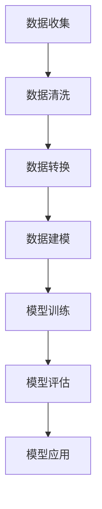

                 


### 文章标题: AI大模型在个性化学习领域的创新

> 关键词：AI大模型，个性化学习，教育科技，数据驱动，算法优化

> 摘要：
本文将深入探讨AI大模型在个性化学习领域的创新。通过回顾个性化学习的概念与重要性，分析AI大模型的核心概念与架构，本文将揭示AI大模型在个性化学习中的优势与应用场景，并展望其未来发展趋势。此外，本文还将探讨个性化学习面临的挑战与机遇，并提供一系列核心算法原理讲解、数学模型及项目实战案例，以期为教育科技的发展提供有价值的参考。

----------------------------------------------------------------

### 第一部分：AI大模型在个性化学习领域的概述

## 第1章: AI大模型在个性化学习领域的概述

### 1.1 个性化学习的概念与重要性

#### 1.1.1 个性化学习的定义

个性化学习是一种以学生为中心的教育模式，它根据学生的兴趣、学习速度、学习风格和知识水平等因素，提供个性化的学习资源和教学方法。个性化学习的目标是使每个学生都能获得最佳的学习体验，并实现其潜能的最大化。

#### 1.1.2 个性化学习的历史与发展

个性化学习的历史可以追溯到20世纪初的差异化教学。随着教育技术的不断发展，特别是互联网和人工智能技术的兴起，个性化学习得到了新的发展机遇。近年来，基于大数据和AI技术的个性化学习平台逐渐成为教育领域的研究热点和应用趋势。

#### 1.1.3 个性化学习在教育中的应用现状

目前，个性化学习在教育中的应用已相当广泛。在线教育平台、智能 tutoring 系统、自适应学习系统等都是个性化学习应用的典型代表。这些系统利用AI技术分析学生的学习行为和数据，为学生提供个性化的学习路径和资源。

### 1.2 AI大模型的核心概念与架构

#### 1.2.1 AI大模型的定义

AI大模型是指那些具有海量参数、可以处理大规模数据、并在特定任务上表现优异的人工智能模型。例如，基于Transformer架构的GPT系列模型就是典型的大模型。

#### 1.2.2 AI大模型的技术架构

AI大模型的技术架构通常包括前端的数据预处理模块、核心的模型训练模块和后端的推理部署模块。数据预处理模块负责清洗、转换和准备数据，模型训练模块利用大规模数据训练模型，推理部署模块则负责在应用场景中快速高效地执行模型推理。

#### 1.2.3 AI大模型的关键技术

AI大模型的关键技术包括深度学习、优化算法、模型压缩、推理加速等。其中，深度学习技术是实现AI大模型的核心，优化算法和模型压缩技术则有助于提高模型的效率和实用性。

### 1.3 AI大模型在个性化学习中的优势与应用场景

#### 1.3.1 AI大模型在个性化学习中的优势

AI大模型在个性化学习中的优势主要体现在以下几个方面：

1. **强大的数据分析和处理能力**：AI大模型可以处理海量的学生数据，从中挖掘出有用的信息，为个性化学习提供数据支持。
2. **自适应学习路径**：AI大模型可以根据学生的学习情况，动态调整学习路径和资源，实现真正的个性化学习。
3. **提高学习效率**：通过分析学习行为，AI大模型可以帮助学生找到学习中的难点和弱点，从而针对性地进行学习，提高学习效率。

#### 1.3.2 AI大模型在个性化学习中的应用场景

AI大模型在个性化学习中的应用场景包括：

1. **智能 Tutoring 系统**：利用AI大模型，可以为每个学生提供个性化的辅导，帮助学生在学习过程中克服困难，提高成绩。
2. **自适应学习平台**：基于AI大模型的自适应学习平台可以根据学生的学习情况，动态调整教学内容和难度，实现个性化的学习体验。
3. **在线教育平台**：AI大模型可以帮助在线教育平台分析学生的学习行为，推荐合适的学习资源，提高学习效果。

#### 1.3.3 AI大模型在个性化学习中的未来发展趋势

随着AI技术的不断发展，AI大模型在个性化学习中的应用前景将更加广阔。未来，AI大模型可能会在以下方面实现突破：

1. **更精准的学习预测**：通过结合多模态数据，AI大模型可以更准确地预测学生的学习行为和成绩，为个性化学习提供更精准的指导。
2. **跨学科的应用**：AI大模型不仅可以应用于传统的学科教育，还可以在艺术、体育等领域实现个性化指导。
3. **教育公平**：AI大模型可以帮助解决教育公平问题，通过个性化学习，为每个学生提供公平的学习机会。

### 1.3.4 个性化学习的挑战与机遇

尽管AI大模型在个性化学习领域具有巨大潜力，但也面临着一些挑战和机遇：

#### 挑战：

1. **数据隐私和安全**：个性化学习需要收集和处理大量的学生数据，如何保护数据隐私和安全是一个重要挑战。
2. **技术实现的复杂性**：构建和优化AI大模型需要高水平的技术能力和资源投入，这对于一些教育机构来说可能是一个障碍。
3. **教师角色的转变**：AI大模型的引入可能会改变传统的教学模式，对教师的角色和技能提出新的要求。

#### 机遇：

1. **教育创新**：AI大模型可以为教育创新提供新的思路和工具，促进教育模式的变革。
2. **教育公平**：通过个性化学习，可以更好地满足不同学生的学习需求，促进教育公平。
3. **教学质量提升**：AI大模型可以帮助教师更精准地了解学生的学习情况，从而提高教学质量。

## 附录

### 附录 A: AI大模型在教育领域的应用现状

AI大模型在教育领域的应用已经取得了一定的成果。例如，GPT系列模型被应用于智能 Tutoring 系统，可以帮助学生解决学习中的问题。此外，AI大模型还广泛应用于在线教育平台，通过推荐算法为学生提供个性化的学习资源。

### 附录 B: AI大模型在教育数据处理中的Mermaid流程图



### 附录 C: AI大模型在个性化学习中的核心算法原理讲解

#### 监督学习算法

##### 1.1.1 机器学习基本概念

机器学习是指让计算机通过学习数据，自动改进性能的过程。机器学习可以分为监督学习、无监督学习和强化学习三种类型。

##### 1.1.2 监督学习算法的基本流程

监督学习算法的基本流程包括以下几个步骤：

1. 数据收集：收集带有标签的数据。
2. 数据预处理：对数据进行清洗、归一化等处理。
3. 模型训练：利用训练数据训练模型。
4. 模型评估：使用验证数据评估模型性能。
5. 模型部署：将训练好的模型部署到实际应用场景。

##### 1.1.3 监督学习算法的伪代码

```python
# 伪代码：监督学习算法
data = 数据收集()
data = 数据预处理(data)
model = 模型训练(data)
performance = 模型评估(model)
if performance > 阈值:
    模型部署(model)
else:
    调整模型参数并重新训练
```

#### 无监督学习算法

##### 1.2.1 无监督学习算法的基本概念

无监督学习算法是指在没有标签的数据上学习的算法。无监督学习算法的目的是发现数据中的潜在结构和规律。

##### 1.2.2 无监督学习算法的算法流程

无监督学习算法的基本流程包括以下几个步骤：

1. 数据收集：收集无标签的数据。
2. 数据预处理：对数据进行清洗、归一化等处理。
3. 模型训练：利用训练数据训练模型。
4. 模型评估：使用验证数据评估模型性能。
5. 模型部署：将训练好的模型部署到实际应用场景。

##### 1.2.3 无监督学习算法的伪代码

```python
# 伪代码：无监督学习算法
data = 数据收集()
data = 数据预处理(data)
model = 模型训练(data)
performance = 模型评估(model)
if performance > 阈值:
    模型部署(model)
else:
    调整模型参数并重新训练
```

### 附录 D: AI大模型在个性化学习中的数学模型和数学公式

#### 监督学习中的损失函数

$$
\text{Loss} = \frac{1}{n}\sum_{i=1}^{n}(y_i - \hat{y_i})^2
$$

#### 无监督学习中的相似度度量

$$
\text{Similarity}(x, y) = \frac{x \cdot y}{\|x\|\|y\|}
$$

### 附录 E: AI大模型在个性化学习中的项目实战

#### 个性化学习系统搭建

##### 1.1 环境搭建

```bash
# 安装Python环境
pip install python==3.8

# 安装深度学习库
pip install tensorflow==2.6

# 安装其他依赖库
pip install numpy==1.21 scipy==1.7
```

##### 1.2 数据处理

```python
import pandas as pd

# 加载数据
data = pd.read_csv('student_data.csv')

# 数据预处理
data = data.dropna()
data = data[data['score'] != -1]
```

##### 1.3 模型训练

```python
from tensorflow.keras.models import Sequential
from tensorflow.keras.layers import Dense

# 构建模型
model = Sequential()
model.add(Dense(64, activation='relu', input_shape=(data.shape[1],)))
model.add(Dense(1, activation='sigmoid'))

# 编译模型
model.compile(optimizer='adam', loss='binary_crossentropy', metrics=['accuracy'])

# 训练模型
model.fit(data, epochs=10, batch_size=32)
```

##### 1.4 模型评估

```python
from sklearn.metrics import accuracy_score

# 预测
predictions = model.predict(data)

# 评估
accuracy = accuracy_score(data['label'], predictions)
print(f'Accuracy: {accuracy}')
```

##### 1.5 模型部署

```python
# 导出模型
model.save('student_model.h5')

# 加载模型
loaded_model = tf.keras.models.load_model('student_model.h5')

# 部署模型
loaded_model.predict(new_data)
```

### 附录 F: 个性化学习系统的进一步优化

##### 1.1 模型调参

```python
from tensorflow.keras.wrappers.scikit_learn import KerasClassifier
from sklearn.model_selection import GridSearchCV

# 定义模型
def create_model(optimizer='adam'):
    model = Sequential()
    model.add(Dense(64, activation='relu', input_shape=(data.shape[1],)))
    model.add(Dense(1, activation='sigmoid'))
    model.compile(optimizer=optimizer, loss='binary_crossentropy', metrics=['accuracy'])
    return model

model = KerasClassifier(build_fn=create_model, verbose=0)

# 设置参数网格
param_grid = {
    'optimizer': ['adam', 'rmsprop'],
    'epochs': [10, 20],
    'batch_size': [16, 32]
}

# 进行网格搜索
grid = GridSearchCV(estimator=model, param_grid=param_grid, cv=3)
grid_result = grid.fit(data, data['label'])

# 输出最佳参数
print(f'Best: {grid_result.best_score_} using {grid_result.best_params_}')
```

##### 1.2 模型优化算法

```python
# 使用遗传算法进行模型优化
from deap import base, creator, tools, algorithms

# 初始化遗传算法
creator.create("FitnessMax", base.Fitness, weights=(1.0,))
creator.create("Individual", list, fitness=creator.FitnessMax)

toolbox = base.Toolbox()
toolbox.register("attr_int", tools.randint, low=0, high=100)
toolbox.register("individual", tools.initRepeat, creator.Individual, toolbox.attr_int, n=2)
toolbox.register("population", tools.initRepeat, list, toolbox.individual)

# 定义适应度函数
def eval_i

