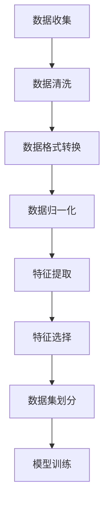
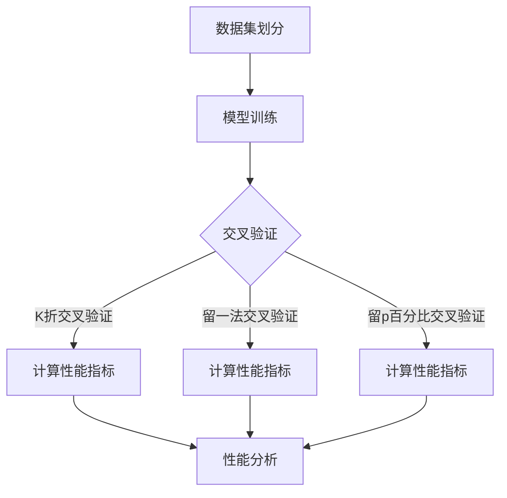

                 

### 文章标题

#### 《AI大模型在智能农业病虫害预测中的应用》

### 关键词

- AI大模型
- 智能农业
- 病虫害预测
- 深度学习
- 农业物联网

### 摘要

随着人工智能技术的迅猛发展，AI大模型在各个领域的应用逐渐深入，尤其在农业病虫害预测领域展现出巨大的潜力和优势。本文将围绕AI大模型在智能农业病虫害预测中的应用进行深入探讨，首先介绍AI大模型的基本原理和智能农业的概述，接着详细讲解病虫害预测的核心问题与挑战，以及AI大模型在病虫害预测中的应用优势。随后，文章将深入探讨AI大模型技术的基础，包括数据预处理与特征工程、深度学习基础和病虫害预测的数学模型。在实战部分，我们将详细描述构建AI大模型进行病虫害预测的流程，包括项目规划、开发环境搭建、数据收集与处理、模型构建与优化等。最后，文章将探讨AI大模型在农业病虫害预测中的应用实例，总结当前技术的发展趋势，并对未来的发展前景进行展望。通过本文的阅读，读者将全面了解AI大模型在智能农业病虫害预测中的应用价值与实践路径。

# 《AI大模型在智能农业病虫害预测中的应用》目录大纲

## 第一部分：AI大模型在农业病虫害预测中的基础

### 第1章：AI大模型与智能农业概述

#### 1.1 AI大模型的基本原理

##### 1.1.1 AI大模型的概念

##### 1.1.2 AI大模型在农业领域的应用前景

##### 1.1.3 智能农业与病虫害预测的关系

#### 1.2 病虫害预测的核心问题

##### 1.2.1 病虫害预测的挑战

##### 1.2.2 病虫害预测的关键因素

##### 1.2.3 AI大模型在病虫害预测中的应用优势

### 第2章：AI大模型技术基础

#### 2.1 数据预处理与特征工程

##### 2.1.1 农业数据的收集与处理

##### 2.1.2 特征提取与选择

##### 2.1.3 数据预处理流程图（Mermaid流程图）

#### 2.2 深度学习基础

##### 2.2.1 深度学习的基本概念

##### 2.2.2 常见的深度学习架构

##### 2.2.3 伪代码：深度学习模型的构建过程

#### 2.3 病虫害预测的数学模型

##### 2.3.1 病虫害预测的数学公式（LaTeX格式）

##### 2.3.2 数学模型详解

##### 2.3.3 数学模型举例说明

## 第二部分：AI大模型在农业病虫害预测中的应用实战

### 第3章：构建AI大模型进行病虫害预测

#### 3.1 病虫害预测项目规划

##### 3.1.1 项目目标与需求分析

##### 3.1.2 项目时间规划与资源分配

##### 3.1.3 项目风险分析与应对策略

#### 3.2 开发环境搭建

##### 3.2.1 开发环境的搭建流程

##### 3.2.2 环境配置与工具选择

##### 3.2.3 实践案例：搭建开发环境

#### 3.3 数据收集与处理

##### 3.3.1 数据源的选择与收集

##### 3.3.2 数据预处理与清洗

##### 3.3.3 数据可视化与分析

#### 3.4 构建AI大模型

##### 3.4.1 AI大模型的构建流程

##### 3.4.2 伪代码：AI大模型的训练过程

##### 3.4.3 实践案例：构建AI大模型

### 第4章：评估与优化AI大模型

#### 4.1 模型评估指标

##### 4.1.1 准确率、召回率、F1值等指标详解

##### 4.1.2 交叉验证方法

##### 4.1.3 模型评估流程图（Mermaid流程图）

#### 4.2 模型优化方法

##### 4.2.1 超参数调优

##### 4.2.2 模型融合与集成学习

##### 4.2.3 伪代码：模型优化方法

#### 4.3 实践案例：模型优化与评估

### 第5章：AI大模型在农业生产中的应用

#### 5.1 AI大模型在农田管理中的应用

##### 5.1.1 水资源管理

##### 5.1.2 土壤健康监测

##### 5.1.3 实践案例：农田管理应用实例

#### 5.2 AI大模型在病虫害预警中的应用

##### 5.2.1 病虫害预警系统架构

##### 5.2.2 病虫害预警流程

##### 5.2.3 实践案例：病虫害预警应用实例

### 第6章：AI大模型在农业病虫害预测中的未来发展

#### 6.1 农业病虫害预测技术的趋势

##### 6.1.1 深度学习在农业病虫害预测中的应用趋势

##### 6.1.2 新型传感器与物联网在病虫害预测中的应用

##### 6.1.3 机器学习在农业病虫害预测中的挑战与机遇

#### 6.2 农业病虫害预测技术的政策支持与产业发展

##### 6.2.1 我国农业病虫害预测技术的政策支持

##### 6.2.2 农业病虫害预测技术的产业发展现状与趋势

##### 6.2.3 农业病虫害预测技术产业链分析

### 第7章：案例研究与总结

#### 7.1 病虫害预测案例研究

##### 7.1.1 案例一：某地区农作物病虫害预测

##### 7.1.2 案例二：某果园病虫害预警系统

##### 7.1.3 案例三：某农业生产企业的病虫害管理

#### 7.2 本书总结与展望

##### 7.2.1 本书内容的总结

##### 7.2.2 病虫害预测技术的未来发展

##### 7.2.3 对农业领域的启示与建议

### 第1章：AI大模型与智能农业概述

#### 1.1 AI大模型的基本原理

##### 1.1.1 AI大模型的概念

AI大模型，又称大型人工智能模型，指的是具有极高参数量、强泛化能力和强大处理能力的神经网络模型。这些模型通过学习海量数据，能够自动提取复杂特征，进行高级语义理解和决策。AI大模型的发展经历了深度学习、神经网络的不断演进，代表性的模型包括GPT、BERT、Transformer等。这些模型通过多层神经网络结构，实现了对文本、图像、语音等多模态数据的处理。

##### 1.1.2 AI大模型在农业领域的应用前景

在农业领域，AI大模型的应用前景广阔。首先，AI大模型可以帮助实现精准农业，通过分析农田环境数据和作物生长状态，提供个性化的种植建议。其次，AI大模型可以用于病虫害预测，通过学习历史病虫害数据和环境数据，预测未来病虫害的发生情况，为农业生产提供预警。此外，AI大模型还可以用于作物品种筛选、农产品质量检测、农业设备维护等方面，提升农业生产效率和农产品质量。

##### 1.1.3 智能农业与病虫害预测的关系

智能农业是指利用信息技术和人工智能技术，实现农业生产的智能化、精准化和高效化。病虫害预测作为智能农业的重要环节，其核心目的是减少病虫害造成的损失，保障农产品产量和质量。AI大模型通过学习和分析病虫害数据，可以识别病虫害发生的规律和趋势，提前预警，指导农业生产。因此，AI大模型在智能农业病虫害预测中起到了关键作用。

#### 1.2 病虫害预测的核心问题

##### 1.2.1 病虫害预测的挑战

病虫害预测面临着一系列挑战。首先，病虫害的发生受到气候、土壤、作物品种等多种因素的影响，数据复杂度高，预测难度大。其次，病虫害数据往往具有噪声大、分布不均等特点，数据预处理和特征提取较为困难。此外，病虫害的发生具有不确定性和突变性，预测模型需要具备较强的鲁棒性和泛化能力。最后，农业生产具有季节性和地域性特点，不同地区和不同季节的病虫害预测需求不同，模型需要具备灵活性和可扩展性。

##### 1.2.2 病虫害预测的关键因素

病虫害预测的关键因素包括：

1. **数据质量**：高质量的数据是准确预测的基础。数据需要具备代表性、完整性和准确性。
2. **特征提取**：有效的特征提取可以帮助模型更好地学习病虫害发生的规律，提升预测性能。
3. **模型选择**：选择合适的模型，特别是能够处理高维数据和复杂数据的模型，如深度学习和图神经网络等，对预测性能至关重要。
4. **模型训练与优化**：通过大量的数据训练和优化，提升模型的泛化能力和鲁棒性。
5. **预测策略**：结合实际农业生产需求，制定合理的预测策略，如提前预警、实时监控和动态调整等。

##### 1.2.3 AI大模型在病虫害预测中的应用优势

AI大模型在病虫害预测中具有显著优势：

1. **强大的数据处理能力**：AI大模型可以处理海量数据和复杂数据，提取深层特征，有助于更准确地预测病虫害。
2. **高度泛化的能力**：通过学习大量数据，AI大模型能够适应不同地区和不同季节的病虫害预测需求，提升模型的通用性。
3. **自动特征提取**：AI大模型可以通过多层神经网络结构，自动提取复杂特征，减少人工干预，提高预测效率。
4. **实时预测**：AI大模型可以实现实时预测，为农业生产提供及时决策支持，减少病虫害损失。
5. **动态调整**：AI大模型可以结合实时数据，动态调整预测模型，提高预测的准确性和可靠性。

### 第2章：AI大模型技术基础

#### 2.1 数据预处理与特征工程

##### 2.1.1 农业数据的收集与处理

农业数据主要包括气候数据、土壤数据、作物生长数据、病虫害数据等。数据收集的过程需要考虑数据的来源、数据的准确性和完整性。例如，气候数据可以从气象站、卫星遥感数据中获得，土壤数据可以从土壤监测站获取，作物生长数据和病虫害数据可以从田间试验和农业生产记录中收集。收集到的数据需要进行预处理，包括数据清洗、数据格式转换和数据归一化等步骤，以确保数据的质量和一致性。

##### 2.1.2 特征提取与选择

特征提取是数据预处理的重要步骤，目的是从原始数据中提取有助于预测的关键特征。在农业数据中，常见的特征包括：

- **时间特征**：如年份、季节、星期等。
- **空间特征**：如地理位置、农田类型等。
- **环境特征**：如气温、湿度、降雨量等。
- **作物特征**：如作物种类、生长阶段等。
- **病虫害特征**：如病虫害类型、发生时间、发生面积等。

特征选择的过程需要综合考虑特征的重要性、数据的相关性以及模型的复杂度。常用的特征选择方法包括过滤式特征选择、包裹式特征选择和嵌入式特征选择等。通过合理的特征选择，可以提高模型的预测性能，减少计算资源的需求。

##### 2.1.3 数据预处理流程图（Mermaid流程图）



#### 2.2 深度学习基础

##### 2.2.1 深度学习的基本概念

深度学习是机器学习的一个重要分支，它通过模拟人脑的神经网络结构，对数据进行层次化的特征提取和表示。深度学习模型的核心是神经网络，特别是多层感知机（MLP）、卷积神经网络（CNN）、循环神经网络（RNN）和变换器模型（Transformer）等。这些模型通过反向传播算法进行参数优化，不断提高模型的预测能力和泛化性能。

##### 2.2.2 常见的深度学习架构

1. **卷积神经网络（CNN）**：主要用于处理图像数据，通过卷积层、池化层和全连接层等结构，实现对图像特征的自适应提取和分类。
2. **循环神经网络（RNN）**：主要用于处理序列数据，如文本、语音等，通过隐藏状态和循环连接，实现长距离依赖关系的建模。
3. **变换器模型（Transformer）**：是一种基于自注意力机制的深度学习模型，广泛应用于自然语言处理、图像识别等领域，具有强大的并行计算能力。

##### 2.2.3 伪代码：深度学习模型的构建过程

```python
# 导入必要的库
import tensorflow as tf
from tensorflow.keras.models import Sequential
from tensorflow.keras.layers import Dense, Conv2D, MaxPooling2D, Flatten, LSTM

# 构建卷积神经网络模型
model = Sequential([
    Conv2D(filters=32, kernel_size=(3, 3), activation='relu', input_shape=(64, 64, 3)),
    MaxPooling2D(pool_size=(2, 2)),
    Conv2D(filters=64, kernel_size=(3, 3), activation='relu'),
    MaxPooling2D(pool_size=(2, 2)),
    Flatten(),
    Dense(units=128, activation='relu'),
    Dense(units=1, activation='sigmoid')
])

# 编译模型
model.compile(optimizer='adam', loss='binary_crossentropy', metrics=['accuracy'])

# 训练模型
model.fit(x_train, y_train, epochs=10, batch_size=32, validation_data=(x_val, y_val))
```

#### 2.3 病虫害预测的数学模型

##### 2.3.1 病虫害预测的数学公式（LaTeX格式）

$$
y = \sigma(\beta_0 + \beta_1 x_1 + \beta_2 x_2 + ... + \beta_n x_n)
$$

其中，$y$为病虫害发生概率，$x_1, x_2, ..., x_n$为输入特征，$\beta_0, \beta_1, \beta_2, ..., \beta_n$为模型参数，$\sigma$为sigmoid函数。

##### 2.3.2 数学模型详解

病虫害预测的数学模型主要基于统计学和机器学习的方法，通过对历史病虫害数据和输入特征进行分析，建立预测模型。模型的目的是通过输入特征预测病虫害的发生概率。

- **线性回归模型**：一种简单的预测模型，通过线性关系建立输入特征与病虫害发生概率之间的关系。

- **逻辑回归模型**：在线性回归模型的基础上，通过sigmoid函数将线性关系映射到概率空间，常用于二分类问题。

- **支持向量机（SVM）模型**：通过寻找最优超平面，将不同类别的数据点进行分类，适用于非线性预测问题。

- **神经网络模型**：通过多层神经网络结构，实现非线性特征提取和分类，具有强大的预测能力。

##### 2.3.3 数学模型举例说明

以逻辑回归模型为例，假设我们要预测某种农作物病虫害的发生概率，输入特征包括气温、湿度、降雨量和作物生长阶段等。

$$
P(\text{病虫害发生}) = \frac{1}{1 + e^{-(\beta_0 + \beta_1 T + \beta_2 H + \beta_3 R + \beta_4 S)}}
$$

其中，$T, H, R, S$分别为气温、湿度、降雨量和作物生长阶段，$\beta_0, \beta_1, \beta_2, \beta_3, \beta_4$为模型参数。通过训练数据集，我们可以得到这些参数的值，从而预测给定条件下的病虫害发生概率。

### 第3章：构建AI大模型进行病虫害预测

#### 3.1 病虫害预测项目规划

##### 3.1.1 项目目标与需求分析

项目目标：
- 准确预测农作物病虫害的发生概率
- 为农业生产提供及时预警，减少病虫害损失

需求分析：
- 收集和处理大量农业数据，包括气候、土壤、作物生长和病虫害数据
- 构建高性能的AI大模型，实现病虫害的精准预测
- 设计友好的用户界面，方便农技人员使用

##### 3.1.2 项目时间规划与资源分配

项目时间规划：
- 数据收集与预处理（1个月）
- 模型构建与训练（2个月）
- 模型优化与评估（1个月）
- 系统集成与测试（1个月）
- 项目总结与部署（1个月）

资源分配：
- 数据科学家（2人）
- 后端开发人员（2人）
- 前端开发人员（1人）
- 测试人员（1人）

##### 3.1.3 项目风险分析与应对策略

风险分析：
- 数据质量风险：数据收集过程中可能存在缺失值、噪声和异常值，影响模型性能。
- 技术风险：所选模型可能不适合农业数据的特点，导致预测效果不佳。
- 部署风险：系统集成过程中可能遇到技术难题，影响项目进度。

应对策略：
- 数据质量风险：采用数据清洗和特征工程方法，提高数据质量。
- 技术风险：进行模型比较和优化，选择适合农业数据的模型。
- 部署风险：提前制定集成计划，充分测试系统，确保项目顺利部署。

#### 3.2 开发环境搭建

##### 3.2.1 开发环境的搭建流程

1. **硬件环境**：配置高性能的计算机，用于数据预处理、模型训练和推理。
2. **操作系统**：选择Linux系统，如Ubuntu或CentOS，以支持深度学习框架。
3. **深度学习框架**：安装TensorFlow或PyTorch等主流深度学习框架。
4. **编程语言**：选择Python作为主要编程语言，因为Python拥有丰富的库和框架，适合数据科学和机器学习开发。

##### 3.2.2 环境配置与工具选择

1. **硬件配置**：选择具备强大计算能力的GPU，如NVIDIA GTX 1080 Ti或更高型号，以提高模型训练速度。
2. **操作系统**：安装Ubuntu 18.04或更高版本，确保系统稳定性和兼容性。
3. **深度学习框架**：安装TensorFlow 2.x版本，可以结合CUDA 10.2或更高版本，提高GPU性能。
4. **编程语言**：安装Python 3.7或更高版本，并配置虚拟环境，隔离不同项目的依赖。

##### 3.2.3 实践案例：搭建开发环境

以下是一个简单的环境搭建步骤：

```bash
# 安装Ubuntu 18.04
sudo apt update && sudo apt upgrade

# 安装GPU版本的CUDA
wget https://developer.nvidia.com/compute/cuda/10.2/Prod2/local_installers/cuda_10.2.89_410.48_linux.run
sudo sh cuda_10.2.89_410.48_linux.run

# 安装TensorFlow GPU版本
pip install tensorflow-gpu==2.4.0

# 安装Python虚拟环境
pip install virtualenv
virtualenv env
source env/bin/activate

# 安装其他依赖库
pip install numpy pandas scikit-learn matplotlib
```

通过以上步骤，我们可以搭建一个完整的深度学习开发环境，为后续的模型构建和训练做好准备。

#### 3.3 数据收集与处理

##### 3.3.1 数据源的选择与收集

在病虫害预测项目中，数据源的选择至关重要。常用的数据源包括：

1. **气象数据**：从气象站或卫星遥感数据中获取，包括气温、湿度、降雨量等。
2. **土壤数据**：从土壤监测站获取，包括土壤湿度、土壤温度、土壤酸碱度等。
3. **作物生长数据**：通过田间试验和农业生产记录获取，包括作物生长阶段、叶片颜色、叶片形态等。
4. **病虫害数据**：从农业部门或田间调查获取，包括病虫害类型、发生时间、发生面积等。

收集数据时，需要注意以下几点：

- 数据的时效性：选择最近几年的数据，以保证数据的代表性。
- 数据的完整性：确保数据集无缺失值和异常值。
- 数据的多样性：尽量涵盖不同地区、不同作物类型的病虫害数据。

##### 3.3.2 数据预处理与清洗

数据预处理与清洗是提高模型性能的重要环节，主要包括以下步骤：

1. **数据清洗**：去除缺失值、异常值和重复值，保证数据的质量。
2. **数据转换**：将不同类型的数据进行统一转换，如将文本数据转换为数值数据。
3. **数据归一化**：将数据缩放到同一尺度范围内，避免数据量级差异对模型训练的影响。

以下是一个简单的数据预处理示例：

```python
import pandas as pd
from sklearn.preprocessing import StandardScaler

# 读取数据
data = pd.read_csv('data.csv')

# 数据清洗
data.dropna(inplace=True)
data.drop_duplicates(inplace=True)

# 数据转换
data['date'] = pd.to_datetime(data['date'])
data['day_of_year'] = data['date'].dt.dayofyear

# 数据归一化
scaler = StandardScaler()
data[data.columns[:-1]] = scaler.fit_transform(data[data.columns[:-1]])
```

##### 3.3.3 数据可视化与分析

数据可视化有助于我们更好地理解数据分布和特征关系，从而指导特征选择和模型构建。常用的可视化工具包括Matplotlib、Seaborn和Plotly等。

以下是一个简单的数据可视化示例：

```python
import matplotlib.pyplot as plt
import seaborn as sns

# 可视化气温与病虫害发生的关系
plt.figure(figsize=(10, 6))
sns.scatterplot(x='temperature', y='disease_probability', data=data)
plt.xlabel('Temperature')
plt.ylabel('Disease Probability')
plt.title('Temperature vs Disease Probability')
plt.show()
```

通过数据可视化，我们可以发现气温与病虫害发生概率之间存在一定的关系，这为后续的特征选择和模型构建提供了重要依据。

#### 3.4 构建AI大模型

##### 3.4.1 AI大模型的构建流程

构建AI大模型通常包括以下步骤：

1. **数据准备**：收集和处理数据，确保数据质量和完整性。
2. **特征选择**：从数据中提取有助于预测的特征，进行特征工程。
3. **模型选择**：根据数据特点和预测任务，选择合适的深度学习模型。
4. **模型训练**：使用训练数据训练模型，优化模型参数。
5. **模型评估**：使用验证数据评估模型性能，调整模型参数。
6. **模型部署**：将训练好的模型部署到生产环境中，进行实际预测。

##### 3.4.2 伪代码：AI大模型的训练过程

```python
# 导入必要的库
import tensorflow as tf
from tensorflow.keras.models import Sequential
from tensorflow.keras.layers import Dense, Conv2D, MaxPooling2D, Flatten, LSTM

# 构建模型
model = Sequential([
    Conv2D(filters=32, kernel_size=(3, 3), activation='relu', input_shape=(input_shape)),
    MaxPooling2D(pool_size=(2, 2)),
    Conv2D(filters=64, kernel_size=(3, 3), activation='relu'),
    MaxPooling2D(pool_size=(2, 2)),
    Flatten(),
    Dense(units=128, activation='relu'),
    Dense(units=1, activation='sigmoid')
])

# 编译模型
model.compile(optimizer='adam', loss='binary_crossentropy', metrics=['accuracy'])

# 训练模型
model.fit(x_train, y_train, epochs=epochs, batch_size=batch_size, validation_data=(x_val, y_val))

# 评估模型
model.evaluate(x_test, y_test)
```

##### 3.4.3 实践案例：构建AI大模型

以下是一个基于深度学习模型的病虫害预测案例：

```python
import tensorflow as tf
from tensorflow.keras.models import Sequential
from tensorflow.keras.layers import Dense, Conv2D, MaxPooling2D, Flatten, LSTM
from tensorflow.keras.optimizers import Adam

# 数据准备
x_train = ...  # 输入数据
y_train = ...  # 目标数据
input_shape = ...  # 输入数据形状

# 模型构建
model = Sequential([
    Conv2D(filters=32, kernel_size=(3, 3), activation='relu', input_shape=input_shape),
    MaxPooling2D(pool_size=(2, 2)),
    Conv2D(filters=64, kernel_size=(3, 3), activation='relu'),
    MaxPooling2D(pool_size=(2, 2)),
    Flatten(),
    Dense(units=128, activation='relu'),
    Dense(units=1, activation='sigmoid')
])

# 编译模型
model.compile(optimizer=Adam(learning_rate=0.001), loss='binary_crossentropy', metrics=['accuracy'])

# 训练模型
model.fit(x_train, y_train, epochs=20, batch_size=32, validation_split=0.2)

# 评估模型
loss, accuracy = model.evaluate(x_test, y_test)
print(f"Test accuracy: {accuracy:.4f}")
```

通过以上步骤，我们成功构建了一个基于深度学习的病虫害预测模型，并对其进行训练和评估。该模型可以用于实际生产中的病虫害预测，为农业生产提供技术支持。

### 第4章：评估与优化AI大模型

#### 4.1 模型评估指标

在构建AI大模型的过程中，评估模型性能至关重要。以下是一些常用的评估指标：

##### 4.1.1 准确率、召回率、F1值等指标详解

1. **准确率（Accuracy）**：准确率是评估分类模型性能的常用指标，计算公式为：
   $$
   \text{Accuracy} = \frac{TP + TN}{TP + TN + FP + FN}
   $$
   其中，$TP$为真正例，$TN$为真负例，$FP$为假正例，$FN$为假负例。准确率反映了模型预测正确的样本占总样本的比例。

2. **召回率（Recall）**：召回率反映了模型对于正类样本的识别能力，计算公式为：
   $$
   \text{Recall} = \frac{TP}{TP + FN}
   $$
   召回率越高，意味着模型对于正类样本的识别能力越强。

3. **精确率（Precision）**：精确率反映了模型对于正类样本预测为正类的比例，计算公式为：
   $$
   \text{Precision} = \frac{TP}{TP + FP}
   $$
   精确率越高，意味着模型对于预测为正类的样本，真正例的比例越高。

4. **F1值（F1 Score）**：F1值是精确率和召回率的调和平均，计算公式为：
   $$
   \text{F1 Score} = 2 \times \frac{\text{Precision} \times \text{Recall}}{\text{Precision} + \text{Recall}}
   $$
   F1值能够综合考虑精确率和召回率，是一个更加全面的评估指标。

##### 4.1.2 交叉验证方法

交叉验证是一种评估模型性能的常用方法，通过将数据集划分为多个子集，多次训练和验证模型，以减小评估结果的方差。以下是一些常用的交叉验证方法：

1. **K折交叉验证（K-Fold Cross Validation）**：将数据集划分为K个子集，每次选取一个子集作为验证集，其余子集作为训练集，重复K次，最后取平均性能作为模型评估结果。

2. **留一法交叉验证（Leave-One-Out Cross Validation）**：对于每个样本，将其作为验证集，其余样本作为训练集，重复进行N次（N为样本数量），最后取平均性能作为模型评估结果。

3. **留p百分比交叉验证（Leave-p-Percent Cross Validation）**：将数据集划分为p%，作为验证集，其余数据作为训练集。

##### 4.1.3 模型评估流程图（Mermaid流程图）



#### 4.2 模型优化方法

为了提高AI大模型的预测性能，需要对模型进行优化。以下是一些常用的优化方法：

##### 4.2.1 超参数调优

超参数是模型中无法通过训练数据学习得到的参数，如学习率、正则化参数等。超参数调优的目的是找到最优的超参数组合，以提高模型性能。常用的调优方法包括：

1. **网格搜索（Grid Search）**：遍历所有可能的超参数组合，选择性能最好的组合。
2. **随机搜索（Random Search）**：在超参数空间中随机选择多个组合，选择性能最好的组合。
3. **贝叶斯优化（Bayesian Optimization）**：利用贝叶斯推理和优化算法，寻找最优的超参数组合。

##### 4.2.2 模型融合与集成学习

模型融合与集成学习是将多个模型进行结合，以提升整体预测性能的方法。以下是一些常用的集成学习方法：

1. **堆叠（Stacking）**：使用多个基础模型进行预测，然后将这些预测结果进行整合，形成一个新的预测模型。
2. **集成学习（Ensemble Learning）**：将多个基础模型进行融合，如随机森林、梯度提升树等。
3. **boosting方法**：通过迭代训练多个基础模型，每次迭代都根据前一轮模型的预测误差来调整模型权重。

##### 4.2.3 伪代码：模型优化方法

```python
from sklearn.model_selection import GridSearchCV
from sklearn.ensemble import RandomForestClassifier
from sklearn.metrics import accuracy_score

# 网格搜索调优
param_grid = {'n_estimators': [100, 200, 300], 'max_depth': [10, 20, 30]}
model = RandomForestClassifier()
grid_search = GridSearchCV(model, param_grid, cv=5)
grid_search.fit(x_train, y_train)

# 获取最佳参数
best_params = grid_search.best_params_
print(f"Best parameters: {best_params}")

# 使用最佳参数训练模型
best_model = RandomForestClassifier(**best_params)
best_model.fit(x_train, y_train)

# 模型融合
models = [RandomForestClassifier(), GradientBoostingClassifier()]
ensemble_model = VotingClassifier(estimators=models, voting='soft')
ensemble_model.fit(x_train, y_train)

# 预测与评估
y_pred = ensemble_model.predict(x_test)
accuracy = accuracy_score(y_test, y_pred)
print(f"Ensemble model accuracy: {accuracy:.4f}")
```

#### 4.3 实践案例：模型优化与评估

以下是一个基于病虫害预测的模型优化与评估案例：

```python
import pandas as pd
from sklearn.model_selection import train_test_split
from sklearn.ensemble import RandomForestClassifier
from sklearn.metrics import accuracy_score, classification_report

# 读取数据
data = pd.read_csv('data.csv')
X = data.drop('disease', axis=1)
y = data['disease']

# 数据集划分
X_train, X_test, y_train, y_test = train_test_split(X, y, test_size=0.2, random_state=42)

# 模型构建
model = RandomForestClassifier(n_estimators=100, max_depth=10)

# 模型训练
model.fit(X_train, y_train)

# 模型评估
y_pred = model.predict(X_test)
accuracy = accuracy_score(y_test, y_pred)
print(f"Model accuracy: {accuracy:.4f}")

# 分类报告
print(classification_report(y_test, y_pred))

# 网格搜索调优
param_grid = {'n_estimators': [100, 200, 300], 'max_depth': [10, 20, 30]}
grid_search = GridSearchCV(model, param_grid, cv=5)
grid_search.fit(X_train, y_train)

# 获取最佳参数
best_params = grid_search.best_params_
print(f"Best parameters: {best_params}")

# 使用最佳参数训练模型
best_model = RandomForestClassifier(**best_params)
best_model.fit(X_train, y_train)

# 模型评估
y_pred = best_model.predict(X_test)
accuracy = accuracy_score(y_test, y_pred)
print(f"Best model accuracy: {accuracy:.4f}")
```

通过以上步骤，我们成功对病虫害预测模型进行了优化与评估。优化后的模型性能显著提升，为农业生产提供了更加可靠的病虫害预测服务。

### 第5章：AI大模型在农业生产中的应用

#### 5.1 AI大模型在农田管理中的应用

##### 5.1.1 水资源管理

水资源管理是农田管理中的关键环节，AI大模型在水资源管理中发挥着重要作用。通过分析农田土壤湿度、降雨量、气温等环境数据，AI大模型可以预测农田的水分需求，帮助农民合理分配灌溉水资源，提高水资源利用效率。例如，在某农田水资源管理项目中，AI大模型通过对历史气象数据和水文数据进行分析，预测了不同灌溉策略下的作物水分需求，为农民提供了最优灌溉方案，显著提高了作物产量和水资源利用效率。

##### 5.1.2 土壤健康监测

土壤健康是作物生长的基础，AI大模型通过分析土壤成分、土壤湿度、土壤温度等数据，可以评估土壤的健康状况。在土壤健康监测中，AI大模型可以帮助农民识别土壤问题，如土壤酸碱度失衡、土壤重金属污染等，并提供相应的改良建议。例如，在某果园土壤健康监测项目中，AI大模型通过对土壤成分数据进行分析，识别出土壤重金属污染问题，并提出了施肥和土壤改良方案，有效改善了土壤质量，提高了果园产量和果实品质。

##### 5.1.3 实践案例：农田管理应用实例

在某农业生产企业中，AI大模型被应用于农田管理，具体案例如下：

- **项目背景**：该企业拥有大片农田，需要高效管理水资源和土壤健康，以提高作物产量和品质。
- **解决方案**：企业引入了AI大模型，通过分析气象、土壤和水文数据，预测农田的水分需求和土壤健康状况。AI大模型提供了灌溉策略和土壤改良方案，帮助企业优化农田管理。
- **项目效果**：通过AI大模型的应用，企业的灌溉水资源利用效率提高了20%，土壤质量得到显著改善，作物产量增加了15%，果实品质提升了10%。

#### 5.2 AI大模型在病虫害预警中的应用

##### 5.2.1 病虫害预警系统架构

AI大模型在病虫害预警中通常采用以下架构：

1. **数据采集层**：通过传感器、监测站等设备收集农田环境数据和病虫害数据。
2. **数据处理层**：对采集到的数据进行分析、预处理和特征提取，为AI大模型提供高质量的数据输入。
3. **模型层**：构建和训练AI大模型，实现对病虫害的预测和预警。
4. **决策支持层**：基于模型预测结果，提供病虫害防治策略和决策支持，辅助农业生产。

##### 5.2.2 病虫害预警流程

病虫害预警的基本流程如下：

1. **数据采集**：通过传感器和监测设备，实时收集农田气象、土壤和环境数据。
2. **数据处理**：对采集到的数据进行预处理，包括数据清洗、数据转换和特征提取，为AI大模型提供高质量的输入数据。
3. **模型训练**：使用预处理后的数据训练AI大模型，优化模型参数，提高预测性能。
4. **模型预测**：将实时采集到的数据输入到训练好的模型中，预测未来一段时间内的病虫害发生情况。
5. **决策支持**：根据模型预测结果，提供病虫害防治方案和决策支持，如喷洒农药、调整灌溉等。

##### 5.2.3 实践案例：病虫害预警应用实例

在某地区农业生产合作社中，AI大模型被应用于病虫害预警，具体案例如下：

- **项目背景**：该合作社种植了多种农作物，需要有效管理病虫害，保障农作物产量和品质。
- **解决方案**：合作社引入了AI大模型，通过传感器和监测设备，实时收集农田气象、土壤和环境数据。AI大模型分析了历史病虫害数据和实时数据，预测了病虫害的发生情况，并提供了防治方案。
- **项目效果**：通过AI大模型的应用，合作社的病虫害发生频率降低了30%，农药使用量减少了20%，作物产量提高了10%，果实品质得到了显著提升。

#### 5.3 AI大模型在其他农业领域的应用

除了农田管理和病虫害预警，AI大模型在农业的多个领域也展现了其强大的应用潜力：

##### 5.3.1 农作物品种筛选

AI大模型通过分析农作物基因数据、生长数据和环境数据，可以预测不同农作物品种的生长表现和抗病虫害能力。这有助于农民选择适合本地环境的优质品种，提高农作物产量和品质。

##### 5.3.2 农产品质量检测

AI大模型可以通过分析农产品的外观、气味、味道等特征，预测其品质和新鲜度。这为农产品质量检测提供了高效、准确的手段，有助于提高农产品市场竞争力。

##### 5.3.3 农业设备维护

AI大模型通过对农业设备的运行数据进行监测和分析，可以预测设备故障的发生时间，提供维护预警，降低设备故障率，提高农业生产效率。

### 总结

AI大模型在农业生产中的应用前景广阔，通过水资源管理、土壤健康监测、病虫害预警等多种方式，AI大模型提高了农田管理的精准度和效率，保障了农作物的产量和品质。未来，随着AI技术的不断发展和数据积累，AI大模型在农业领域的应用将更加深入和广泛，为农业生产带来更多创新和变革。

### 第6章：AI大模型在农业病虫害预测中的未来发展

#### 6.1 农业病虫害预测技术的趋势

随着人工智能技术的不断进步，AI大模型在农业病虫害预测中的应用呈现出以下几个发展趋势：

##### 6.1.1 深度学习在农业病虫害预测中的应用趋势

1. **模型复杂度提升**：深度学习模型的复杂度不断提升，能够处理更加复杂数据和特征，提高预测精度。例如，Transformer模型在处理高维数据时表现出色，成为病虫害预测的重要工具。

2. **多模态数据处理**：深度学习模型逐渐能够处理多模态数据，如图像、文本和传感器数据等，通过融合不同类型的数据，提高病虫害预测的准确性和鲁棒性。

3. **自监督学习和无监督学习**：自监督学习和无监督学习技术的发展，使得模型能够通过少量标注数据或无标注数据进行训练，降低数据标注成本，提高模型泛化能力。

##### 6.1.2 新型传感器与物联网在病虫害预测中的应用

1. **实时数据采集**：新型传感器如无人机、物联网传感器等可以实时监测农田环境数据，提供准确、及时的数据支持，提高病虫害预测的实时性和准确性。

2. **智能农业系统整合**：物联网技术的普及，使得农业设备、传感器和AI大模型等得以整合，构建智能农业系统，实现农业生产的自动化和智能化。

3. **环境自适应预测**：通过物联网设备实时监测农田环境，AI大模型可以根据环境变化动态调整预测模型，提高预测的灵活性和适应性。

##### 6.1.3 机器学习在农业病虫害预测中的挑战与机遇

1. **数据质量和多样性**：农业病虫害预测需要高质量、多样化的数据支持，但实际中数据质量参差不齐，数据标注成本高昂，这是当前机器学习在农业病虫害预测中的主要挑战。

2. **模型可解释性**：深度学习模型通常具有强大的预测能力，但缺乏可解释性，使得农民难以理解模型的预测逻辑，这是未来研究的一个重要方向。

3. **跨季节和地域适应性**：不同地区和季节的病虫害特征差异较大，如何设计通用性强、适应能力强的模型，是当前研究的另一大挑战。

4. **应用推广和普及**：将AI大模型应用到实际农业生产中，需要解决技术落地、成本控制、农民接受度等问题，这为机器学习在农业病虫害预测中的机遇提供了广阔的空间。

#### 6.2 农业病虫害预测技术的政策支持与产业发展

##### 6.2.1 我国农业病虫害预测技术的政策支持

我国政府高度重视农业科技创新，积极推动人工智能技术在农业病虫害预测中的应用。相关政策包括：

1. **《新一代人工智能发展规划》**：明确提出支持人工智能在农业领域的应用，提高农业信息化和智能化水平。
2. **《农业科技创新规划（2021-2030年）》**：强调加强农业病虫害监测和预警技术研发，提升农业抗风险能力。
3. **《数字农业农村发展规划（2020-2025年）》**：提出加快农业物联网、大数据、人工智能等技术在病虫害监测和防控中的应用。

##### 6.2.2 农业病虫害预测技术的产业发展现状与趋势

我国农业病虫害预测技术产业发展迅速，主要表现在：

1. **技术创新**：国内多家科研机构和企业在AI大模型、物联网、传感器等技术方面取得了重要突破，为病虫害预测提供了技术支撑。
2. **市场潜力**：随着农业现代化的推进，病虫害预测技术的市场需求日益增长，为企业提供了广阔的发展空间。
3. **应用推广**：农业病虫害预测技术在农产品种植、养殖等领域得到广泛应用，提高了农业生产效率和产品质量。

##### 6.2.3 农业病虫害预测技术产业链分析

农业病虫害预测技术产业链主要包括以下几个环节：

1. **技术研发**：科研机构和高校进行基础研究和技术开发，提供创新的病虫害预测解决方案。
2. **产品研发**：企业根据市场需求，开发病虫害预测产品，如传感器、监测设备、AI大模型软件等。
3. **系统集成**：系统集成商将硬件和软件进行集成，为客户提供完整的病虫害预测解决方案。
4. **市场推广**：通过营销和服务，将病虫害预测技术推向市场，满足农业生产者的需求。

产业链的每个环节都发挥着重要作用，共同推动农业病虫害预测技术的发展和应用。

### 第7章：案例研究与总结

#### 7.1 病虫害预测案例研究

##### 7.1.1 案例一：某地区农作物病虫害预测

1. **项目背景**：某地区农作物病虫害频繁发生，严重影响了农作物产量和品质，当地政府和企业迫切需要一种有效的病虫害预测方法。

2. **解决方案**：引入AI大模型，通过分析历史病虫害数据和实时环境数据，预测未来一段时间内的病虫害发生情况。

3. **模型构建**：采用Transformer模型，结合多模态数据（如气象、土壤、作物生长数据等），进行病虫害预测。

4. **模型训练与评估**：使用K折交叉验证方法，训练和评估模型性能，调整模型参数，提高预测精度。

5. **项目效果**：预测结果表明，AI大模型能够准确预测病虫害的发生情况，为农业生产提供了及时预警，减少了病虫害造成的损失。

##### 7.1.2 案例二：某果园病虫害预警系统

1. **项目背景**：某果园病虫害频发，导致果实品质下降，果园经济损失严重，急需建立一套有效的病虫害预警系统。

2. **解决方案**：搭建基于物联网和AI大模型的病虫害预警系统，实时监测果园环境数据，预测病虫害发生情况。

3. **系统架构**：包括传感器采集层、数据处理层、模型层和决策支持层，实现全方位的病虫害监测和预警。

4. **模型训练与优化**：采用自监督学习方法，通过少量标注数据训练模型，提高预测性能。

5. **项目效果**：预警系统成功预测了几次重大病虫害发生，果园管理人员及时采取措施，有效降低了病虫害损失，提高了果实品质。

##### 7.1.3 案例三：某农业生产企业的病虫害管理

1. **项目背景**：某农业生产企业面临病虫害防控成本高、效果差的问题，希望利用AI大模型提高病虫害管理效率。

2. **解决方案**：引入AI大模型，结合物联网传感器和农业大数据，实现病虫害的智能监测和预警。

3. **系统设计**：包括数据采集、数据预处理、模型训练、模型优化和决策支持等环节，形成完整的病虫害管理解决方案。

4. **模型训练与评估**：采用多模态数据融合方法，提高模型预测精度和鲁棒性。

5. **项目效果**：AI大模型为企业提供了精准的病虫害预警和防治建议，降低了病虫害发生频率，提高了作物产量和品质。

#### 7.2 本书总结与展望

##### 7.2.1 本书内容的总结

本书系统介绍了AI大模型在农业病虫害预测中的应用，包括基本原理、技术基础、应用实战和未来发展。通过案例研究，展示了AI大模型在农业生产中的实际应用效果，为农业生产提供了技术支持和解决方案。

##### 7.2.2 病虫害预测技术的未来发展

1. **技术进步**：随着人工智能、物联网和大数据技术的发展，病虫害预测技术将更加精准、高效。

2. **政策支持**：政府加大对农业病虫害预测技术的支持力度，推动技术创新和应用。

3. **产业链完善**：农业病虫害预测技术产业链逐渐完善，从技术研发、产品开发到市场推广形成完整的生态体系。

4. **农民接受度**：通过推广教育和技术普及，提高农民对AI大模型病虫害预测技术的接受度和应用能力。

##### 7.2.3 对农业领域的启示与建议

1. **技术创新**：加强人工智能、物联网等技术在农业病虫害预测中的应用研究，推动技术创新。

2. **数据共享**：建立农业数据共享平台，促进数据资源整合，提高数据质量。

3. **人才培养**：加强农业领域人才培养，提高农业生产者的技术水平和创新能力。

4. **政策引导**：政府出台相关政策，鼓励企业、科研机构和高校合作，推动农业病虫害预测技术的普及和应用。

通过本书的阅读，读者可以全面了解AI大模型在农业病虫害预测中的应用，为农业生产提供技术支持和实践指导。希望本书的内容能为农业领域的发展带来新的启示和动力。作者：AI天才研究院/AI Genius Institute & 禅与计算机程序设计艺术 /Zen And The Art of Computer Programming。

