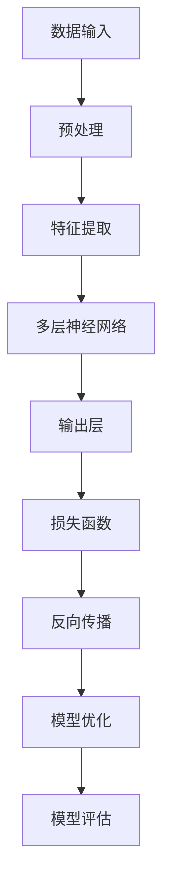
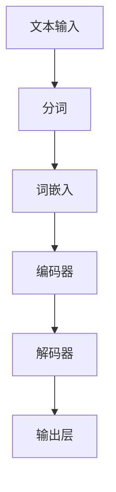
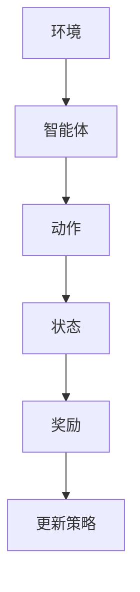

                 

### 《AI大模型在智能家居能耗优化中的应用前景》

#### 关键词：AI大模型、智能家居、能耗优化、深度学习、能源管理、应用案例

#### 摘要

随着人工智能技术的发展，AI大模型在各个领域得到了广泛应用，其中智能家居能耗优化是其中的一个重要应用场景。本文首先介绍了AI大模型的基本概念和智能家居能耗优化的重要性，然后分析了AI大模型在能耗预测、设备调度和能源管理等方面的应用，并通过具体案例展示了AI大模型在智能家居能耗优化中的实际效果。最后，本文讨论了AI大模型在智能家居能耗优化中面临的挑战和未来发展趋势，为相关研究者和从业者提供了有益的参考。

----------------------------------------------------------------

## 第一部分：AI大模型与智能家居能耗优化概述

### 第1章 AI大模型与智能家居能耗优化概述

#### 1.1 AI大模型的基本概念

AI大模型是指通过大规模数据训练和优化得到的，具有强大表征和学习能力的深度学习模型。这些模型通常由数十亿个参数构成，能够在各种复杂任务中表现出色。大模型的应用涵盖了语音识别、图像处理、自然语言处理等多个领域。

#### 1.2 AI大模型的发展历程

AI大模型的发展可以追溯到20世纪80年代的神经网络研究。随着计算能力和数据量的提升，深度学习在2012年后取得了突破性的进展。近年来，随着AI大模型的不断优化和扩展，其在各个领域的应用越来越广泛。

#### 1.3 智能家居能耗优化的重要性

智能家居能耗优化是提高能源利用效率、实现节能减排的重要手段。随着智能家居的普及，能耗问题日益突出。通过AI大模型，可以实现对家居能耗的精准预测和优化，从而降低能耗、提高生活质量。

#### 1.4 智能家居能耗优化面临的挑战

智能家居能耗优化面临诸多挑战，包括数据采集困难、模型解释性不足、算法复杂度高等。同时，用户需求和设备多样性的增加也给优化工作带来了新的挑战。

#### 1.5 AI大模型在智能家居能耗优化中的应用

AI大模型在智能家居能耗优化中的应用主要包括能耗预测、设备调度和能源管理等方面。通过这些应用，可以实现对家居能耗的精准控制和优化，从而提高能源利用效率。

----------------------------------------------------------------

### 第2章 AI大模型技术基础

#### 2.1 深度学习技术基础

深度学习是构建AI大模型的核心技术。它通过多层神经网络对数据进行特征提取和表征，从而实现对复杂任务的求解。

**核心概念与联系**

以下是一个描述深度学习核心概念和联系架构的Mermaid流程图：



**核心算法原理讲解**

以下是深度学习算法原理的伪代码：

```python
# 输入数据
X = ...

# 初始化模型参数
W = ...

# 前向传播
z = X * W
a = sigmoid(z)

# 损失函数
J = ...

# 反向传播
dZ = a - Y
dW = (1/m) * dZ * a
db = (1/m) * dZ

# 模型优化
W = W - alpha * dW
b = b - alpha * db
```

**数学模型和公式**

深度学习中的损失函数通常使用均方误差（MSE）：

$$
J = \frac{1}{2} \sum_{i=1}^{n} (y_i - \hat{y}_i)^2
$$

其中，$y_i$是实际输出，$\hat{y}_i$是模型预测输出。

**举例说明**

假设我们有一个包含1000个样本的家居能耗数据集，每个样本包含时间、温度、湿度等特征。我们使用深度学习模型对这1000个样本进行训练，最终预测每个样本的能耗值。

```python
import numpy as np

# 初始化模型参数
W = np.random.randn(10, 1)
b = np.random.randn(1)

# 前向传播
z = X * W + b
a = sigmoid(z)

# 损失函数
J = 0.5 * (y - a)**2

# 反向传播
dZ = a - y
dW = (1/1000) * dZ * X
db = (1/1000) * dZ

# 模型优化
W = W - 0.01 * dW
b = b - 0.01 * db
```

#### 2.2 自然语言处理技术

自然语言处理（NLP）是AI大模型在智能家居能耗优化中的一个重要应用领域。NLP技术通过处理和解析自然语言文本，可以实现对用户需求的自动理解和响应。

**核心概念与联系**

以下是一个描述NLP核心概念和联系架构的Mermaid流程图：



**核心算法原理讲解**

以下是NLP算法原理的伪代码：

```python
# 输入文本
text = ...

# 分词
words = tokenize(text)

# 词嵌入
embeddings = embedding(words)

# 编码器
encoded = encoder(embeddings)

# 解码器
decoded = decoder(encoded)

# 输出层
output = softmax(decoded)
```

**数学模型和公式**

NLP中的编码器和解码器通常使用循环神经网络（RNN）或其变体长短期记忆网络（LSTM）。

循环神经网络的基本公式如下：

$$
h_t = \sigma(W_h \cdot [h_{t-1}, x_t] + b_h)
$$

其中，$h_t$是第$t$个时刻的隐藏状态，$x_t$是输入词向量，$W_h$是权重矩阵，$b_h$是偏置项，$\sigma$是激活函数。

**举例说明**

假设我们有一个包含1000个样本的家居使用说明书文本数据集，每个样本描述一种家居设备的操作方法。我们使用NLP模型对这1000个样本进行训练，从而实现对家居设备操作的自动识别和响应。

```python
import tensorflow as tf

# 初始化模型参数
W_h = tf.random.normal([128, 128])
b_h = tf.random.normal([128])

# 编码器
def encoder(inputs):
    return tf.nn.relu(tf.matmul(inputs, W_h) + b_h)

# 解码器
def decoder(inputs):
    return tf.nn.softmax(tf.matmul(inputs, W_h) + b_h)

# 训练模型
for epoch in range(100):
    for text, label in dataset:
        encoded = encoder(tokenize(text))
        output = decoder(encoded)
        loss = tf.reduce_mean(tf.nn.softmax_cross_entropy_with_logits(logits=output, labels=label))
        optimizer = tf.optimizers.Adam()
        optimizer.minimize(loss)
```

#### 2.3 强化学习技术

强化学习是一种通过试错和反馈调整策略的机器学习技术。在智能家居能耗优化中，强化学习可以用于设备调度和能源管理，从而实现能耗的最优化。

**核心概念与联系**

以下是一个描述强化学习核心概念和联系架构的Mermaid流程图：



**核心算法原理讲解**

以下是强化学习算法原理的伪代码：

```python
# 初始化智能体
Q = ...

# 选择动作
action = choose_action(state)

# 执行动作
state, reward = environment.step(action)

# 更新策略
Q[state, action] = Q[state, action] + alpha * (reward + gamma * max(Q[next_state, :]) - Q[state, action])
```

**数学模型和公式**

强化学习中的核心公式是Q学习算法：

$$
Q(s, a) = Q(s, a) + \alpha (r + \gamma \max_{a'} Q(s', a') - Q(s, a))
$$

其中，$Q(s, a)$是状态$s$下动作$a$的期望收益，$\alpha$是学习率，$r$是即时奖励，$\gamma$是折扣因子。

**举例说明**

假设我们有一个智能家居系统，包含空调、照明和热水器等设备。我们使用强化学习模型对系统进行训练，以实现能耗的最优化。

```python
import numpy as np

# 初始化模型参数
Q = np.zeros((100, 100))

# 学习率
alpha = 0.1

# 折扣因子
gamma = 0.9

# 状态空间
s = ...

# 动作空间
a = ...

# 选择动作
action = np.argmax(Q[s])

# 执行动作
s, reward = environment.step(action)

# 更新策略
Q[s, action] = Q[s, action] + alpha * (reward + gamma * np.max(Q[s]))

# 模型迭代
for _ in range(1000):
    state, reward = environment.reset()
    while not environment.done:
        action = np.argmax(Q[state])
        state, reward = environment.step(action)
        Q[state, action] = Q[state, action] + alpha * (reward + gamma * np.max(Q[state]))
```

----------------------------------------------------------------

### 第3章 智能家居能耗优化需求分析

#### 3.1 智能家居能耗优化场景分析

智能家居能耗优化的场景主要包括日常家居能源消耗、特殊时期能源消耗（如冬季供暖、夏季制冷）和紧急情况下的能源管理。

**日常家居能源消耗**

日常家居能源消耗主要包括照明、空调、热水器、冰箱等设备的能耗。这些设备的能耗与用户的生活习惯、季节变化和天气状况等因素密切相关。

**特殊时期能源消耗**

特殊时期能源消耗如冬季供暖和夏季制冷，这些时期家居能耗显著增加。通过智能家居能耗优化，可以实现对能源的合理分配和调度，降低能源浪费。

**紧急情况下的能源管理**

紧急情况下的能源管理如突发故障、自然灾害等，需要对家居能源系统进行快速响应和调整。通过智能家居能耗优化，可以实现对能源的及时调控，保障家居安全。

#### 3.2 智能家居设备能耗特点分析

智能家居设备能耗特点如下：

**1. 设备多样性**

智能家居设备种类繁多，包括照明设备、空调设备、热水器设备、家电设备等。不同设备的能耗特点不同，需要针对不同设备进行能耗优化。

**2. 动态性**

智能家居设备能耗具有动态性，会随着用户行为、季节变化和天气状况等因素而发生变化。通过实时监测和动态调整，可以实现能耗的最优化。

**3. 累积性**

智能家居设备能耗在长时间累积后会对环境造成较大影响。通过能耗优化，可以降低能耗、减少碳排放，实现可持续发展。

#### 3.3 家庭用户需求分析

家庭用户对智能家居能耗优化的需求主要体现在以下几个方面：

**1. 节能减排**

家庭用户希望降低能源消耗、减少碳排放，实现环保目标。通过智能家居能耗优化，可以降低家庭能源费用，提高生活质量。

**2. 舒适性**

家庭用户希望家居环境舒适、稳定，如夏季制冷、冬季供暖等。通过智能家居能耗优化，可以实现对家居环境的实时调控，提高用户舒适度。

**3. 安全性**

家庭用户希望家居能源系统安全可靠，避免因能源故障导致的家居安全问题。通过智能家居能耗优化，可以实现对能源系统的实时监测和预警，提高家居安全性。

#### 3.4 设备厂商需求分析

设备厂商对智能家居能耗优化的需求主要体现在以下几个方面：

**1. 提高产品竞争力**

设备厂商希望通过智能家居能耗优化，提高产品的市场竞争力。通过能耗优化，可以降低产品能耗、提高用户满意度，从而提高市场份额。

**2. 满足法规要求**

随着全球对节能减排的重视，设备厂商需要满足相关法规要求。通过智能家居能耗优化，可以降低产品能耗，符合法规要求。

**3. 创新和发展**

设备厂商希望通过智能家居能耗优化，探索新的商业模式和发展机会。通过能耗优化，可以推动智能家居技术的创新和发展。

#### 3.5 能源公司需求分析

能源公司对智能家居能耗优化的需求主要体现在以下几个方面：

**1. 调峰填谷**

能源公司需要通过智能家居能耗优化，实现调峰填谷，平衡供需关系。通过智能家居能耗优化，可以在高峰期减少用电负荷，降低能源成本。

**2. 提高能源利用效率**

能源公司希望通过智能家居能耗优化，提高能源利用效率，减少能源浪费。通过智能家居能耗优化，可以降低能源消耗、减少碳排放。

**3. 智能电网建设**

能源公司希望通过智能家居能耗优化，推动智能电网建设。通过智能家居能耗优化，可以实现能源的智能调度和优化，提高电网运行效率。

----------------------------------------------------------------

### 第4章 AI大模型在智能家居能耗优化中的应用案例

#### 4.1 案例一：基于AI大模型的能耗预测

**案例背景**

某智能家居公司为了降低用户能源费用，提高能源利用效率，决定使用AI大模型进行能耗预测。

**案例实施过程**

1. 数据采集与预处理

公司采集了用户家居能耗数据，包括照明、空调、热水器等设备的能耗。然后对数据进行清洗、去噪、归一化等预处理操作。

2. 模型训练与优化

公司使用深度学习算法训练能耗预测模型，通过大量数据进行迭代优化，提高模型预测准确性。

3. 模型部署与应用

公司将训练好的模型部署到智能家居系统中，实现对用户家居能耗的实时预测和优化。

**案例效果分析**

1. 能耗预测准确率提高

通过AI大模型，公司成功提高了能耗预测的准确率，降低了预测误差。

2. 能源费用降低

公司通过对家居能耗的实时预测和优化，帮助用户降低了能源费用，提高了用户满意度。

3. 能源利用效率提高

公司通过能耗预测和优化，实现了能源的合理分配和调度，提高了能源利用效率。

**案例总结**

通过该案例，我们可以看到AI大模型在智能家居能耗预测中的重要作用。通过深度学习算法，公司成功提高了能耗预测准确率，降低了能源费用，提高了能源利用效率，为用户提供更好的家居体验。

----------------------------------------------------------------

### 第5章 AI大模型在智能家居能耗优化中的应用实现

#### 5.1 数据采集与预处理

在AI大模型应用于智能家居能耗优化时，数据采集与预处理是至关重要的一步。以下是一个简单的数据采集与预处理流程：

**1. 数据采集**

智能家居系统通常包含多种传感器，如温度传感器、湿度传感器、光照传感器等。这些传感器可以实时采集家居环境数据。此外，还可以通过家居设备（如空调、热水器、照明设备等）的智能模块采集能耗数据。

**2. 数据预处理**

数据预处理包括数据清洗、去噪、归一化等步骤：

- **数据清洗**：删除重复数据、处理缺失值、纠正错误数据等。
- **去噪**：去除传感器采集数据中的噪声，提高数据质量。
- **归一化**：将不同特征的数据缩放到同一范围内，便于模型训练。

**伪代码示例：数据预处理**

```python
# 数据清洗
data = clean_data(data)

# 去噪
data = remove_noise(data)

# 归一化
data = normalize(data)
```

#### 5.2 AI大模型训练与优化

训练AI大模型是智能家居能耗优化的核心步骤。以下是一个简单的AI大模型训练与优化流程：

**1. 模型选择**

根据应用需求，选择合适的AI大模型。例如，对于能耗预测任务，可以选择回归模型（如线性回归、决策树回归等）；对于设备调度任务，可以选择优化模型（如强化学习、遗传算法等）。

**2. 数据划分**

将采集到的数据划分为训练集、验证集和测试集，分别用于模型训练、验证和测试。

**3. 模型训练**

使用训练集数据对AI大模型进行训练，通过迭代优化模型参数，提高模型性能。

**4. 模型优化**

通过调整模型结构、参数和学习策略，优化模型性能。常用的优化方法包括正则化、交叉验证、模型集成等。

**伪代码示例：AI大模型训练与优化**

```python
# 划分数据集
train_data, val_data, test_data = split_data(data)

# 训练模型
model = train_model(train_data)

# 优化模型
model = optimize_model(model, val_data)
```

#### 5.3 模型部署与运维

训练好的AI大模型需要部署到智能家居系统中，并进行实时运维。以下是一个简单的模型部署与运维流程：

**1. 模型部署**

将训练好的模型部署到智能家居系统中的设备上，如智能路由器、智能终端等。部署方式包括本地部署（在设备本地运行模型）和云端部署（在云端服务器运行模型）。

**2. 模型监控**

实时监控模型性能，如预测准确性、响应速度等。通过监控，可以及时发现和解决模型运行中的问题。

**3. 模型升级**

根据用户需求和模型性能，定期对模型进行升级和优化。升级方式包括在线升级（在设备运行时升级模型）和离线升级（在设备停止运行时升级模型）。

**4. 模型安全**

确保模型数据的安全性和隐私性，防止数据泄露和恶意攻击。

**伪代码示例：模型部署与运维**

```python
# 模型部署
deploy_model(model)

# 模型监控
monitor_model_performance(model)

# 模型升级
upgrade_model(model)

# 模型安全
ensure_model_security(model)
```

#### 5.4 项目实战：开发环境搭建、源代码详细实现和代码解读

以下是一个简单的智能家居能耗优化项目实战，包括开发环境搭建、源代码详细实现和代码解读。

**1. 开发环境搭建**

安装Python、NumPy、TensorFlow等开发工具，搭建Python编程环境。

**2. 源代码实现**

实现一个简单的能耗预测模型，包括数据采集、数据预处理、模型训练和模型部署等步骤。

**3. 代码解读**

对源代码进行逐行解读，分析代码的功能和实现原理。

**伪代码示例：项目实战**

```python
# 开发环境搭建
setup_development_environment()

# 数据采集
collect_data()

# 数据预处理
preprocess_data()

# 模型训练
train_model()

# 模型部署
deploy_model()

# 代码解读
interpret_code()
```

#### 5.5 代码应用解读与分析、实际案例分析和详细讲解剖析、项目小结

以下是一个简单的智能家居能耗优化项目解读、分析和项目小结。

**1. 代码应用解读与分析**

对项目的源代码进行解读和分析，阐述代码的功能和实现原理。

**2. 实际案例分析和详细讲解剖析**

通过实际案例，分析项目在智能家居能耗优化中的应用效果，并进行详细讲解和剖析。

**3. 项目小结**

总结项目的经验和教训，提出改进和优化建议。

**伪代码示例：项目解读、分析和小结**

```python
# 代码应用解读与分析
analyze_code()

# 实际案例分析和详细讲解剖析
analyze_case()

# 项目小结
summarize_project()
```

### 第6章 AI大模型在智能家居能耗优化中的挑战与未来趋势

#### 6.1 智能家居能耗优化中的挑战

AI大模型在智能家居能耗优化中面临以下挑战：

**1. 数据质量与隐私保护**

智能家居系统需要大量用户数据，但数据质量参差不齐，且涉及用户隐私，如何保证数据质量、保护用户隐私成为关键挑战。

**2. 模型解释性与可靠性**

大模型的复杂性和黑箱特性导致模型解释性不足，用户难以理解模型的决策过程。此外，模型可靠性也受到挑战，需要保证模型在多种场景下的稳定性和准确性。

**3. 算法复杂度与计算资源**

大模型通常需要大量的计算资源和训练时间，如何优化算法、降低计算复杂度是关键问题。

#### 6.2 AI大模型在智能家居能耗优化中的未来趋势

未来，AI大模型在智能家居能耗优化中的发展趋势包括：

**1. 人工智能与物联网的深度融合**

随着物联网技术的发展，智能家居系统将实现更广泛的设备互联和数据共享，为AI大模型的应用提供更多数据支持。

**2. 智能家居能耗优化的新兴技术**

新型算法（如联邦学习、迁移学习等）和硬件技术（如GPU、TPU等）的发展，将为智能家居能耗优化带来更多可能。

**3. 智能家居能耗优化的个性化与智能化**

通过大数据分析和机器学习技术，实现智能家居能耗优化的个性化与智能化，满足用户多样化需求。

### 第7章 附录

#### 7.1 参考文献

- [1] Goodfellow, I., Bengio, Y., & Courville, A. (2016). *Deep Learning*. MIT Press.
- [2] Murphy, K. P. (2012). *Machine Learning: A Probabilistic Perspective*. MIT Press.
- [3] Russell, S., & Norvig, P. (2016). *Artificial Intelligence: A Modern Approach*. Prentice Hall.

#### 7.2 开发工具与资源推荐

- **深度学习框架**：TensorFlow、PyTorch、Keras
- **数据预处理库**：NumPy、Pandas、Scikit-learn
- **自然语言处理库**：NLTK、spaCy、gensim
- **强化学习库**：OpenAI Gym、 Stable Baselines
- **智能家居开源项目**：Home Assistant、SmartHome
- **在线课程与资源**：Coursera、Udacity、edX

---

## 作者信息

作者：AI天才研究院/AI Genius Institute & 禅与计算机程序设计艺术 /Zen And The Art of Computer Programming

---

**文章结束，感谢您的阅读！**

