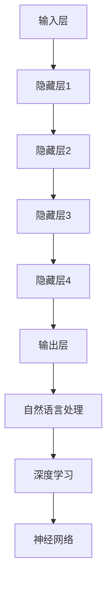
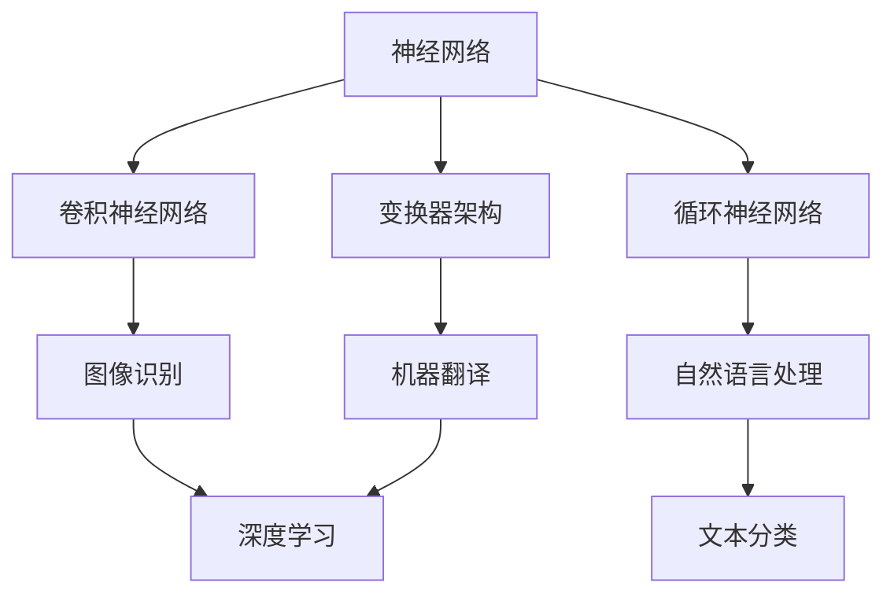
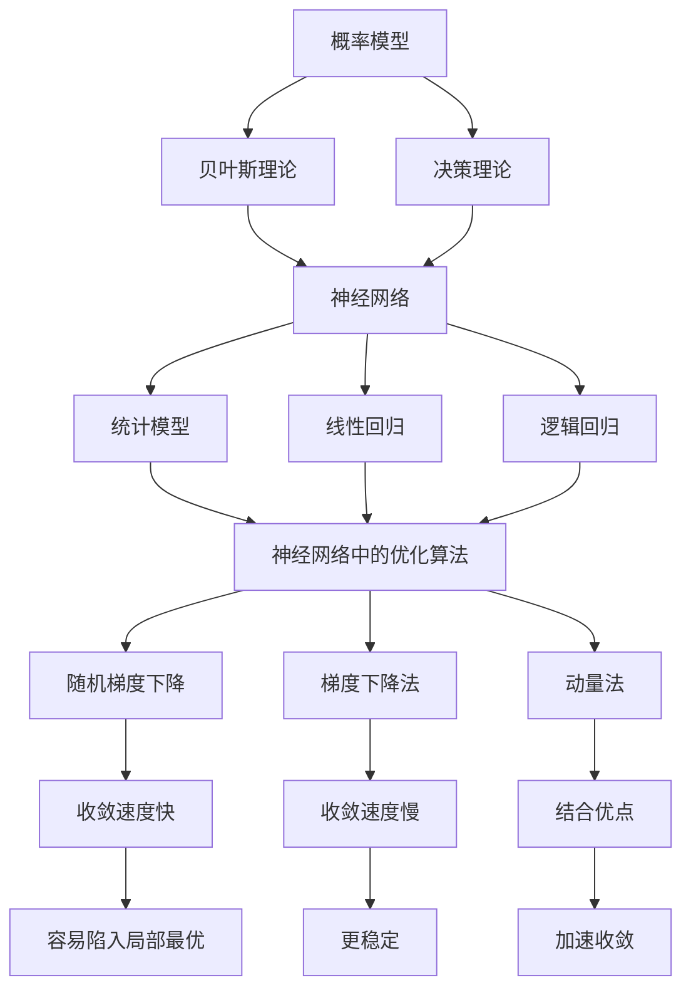

                 


## 引言

随着人工智能技术的迅猛发展，智能家居语音控制系统逐渐成为现代家庭生活中不可或缺的一部分。人们可以通过语音指令轻松控制家庭中的各类设备，实现自动化、智能化的生活体验。在这一背景下，AI大模型在智能家居语音控制系统中的应用成为了研究的热点。本文将深入探讨AI大模型在智能家居语音控制系统中的创新，从基础概念、核心算法、数学模型、应用实践等多个角度进行全面解析。

首先，我们将回顾AI大模型的发展历程和基本概念，了解其如何通过深度学习和神经网络技术实现智能化的突破。接着，我们将详细介绍智能家居语音控制系统的基本架构和关键技术，为后续讨论奠定基础。随后，我们将重点探讨AI大模型在语音识别、语音合成和声纹识别等领域的具体应用，分析其优化算法和实现细节。在此基础上，我们将结合实际项目案例，展示AI大模型在智能家居语音控制系统中的综合应用和效果。最后，我们将展望AI大模型在智能家居领域的未来发展，探讨其技术趋势和应用前景。

通过本文的深入分析和讲解，我们希望能够为读者提供一份全面、系统的AI大模型在智能家居语音控制系统中的应用指南，激发更多创新思维和技术实践。

## 关键词

- AI大模型
- 智能家居
- 语音控制系统
- 语音识别
- 语音合成
- 声纹识别
- 深度学习
- 神经网络
- 自然语言处理
- 智能化
- 自动化
- 技术创新

## 摘要

本文旨在探讨AI大模型在智能家居语音控制系统中的应用，通过回顾AI大模型的发展历程和基本概念，分析其在语音识别、语音合成和声纹识别等领域的核心算法和优化方法。此外，本文还将结合实际项目案例，展示AI大模型在智能家居语音控制系统中的综合应用和效果。最后，本文将展望AI大模型在智能家居领域的未来发展，探讨其技术趋势和应用前景。通过本文的深入分析和讲解，读者可以全面了解AI大模型在智能家居语音控制系统中的创新应用，为未来的技术研究和实践提供参考。

## 目录

### 《AI大模型在智能家居语音控制系统中的创新》

- 引言
  - 关键词
  - 摘要
- 第一部分：AI大模型基础
  - 第1章：AI大模型概述
    - 1.1 AI大模型的基本概念
    - 1.2 AI大模型的核心算法
    - 1.3 AI大模型的数学模型
- 第2章：智能家居语音控制系统基础
  - 2.1 智能家居概述
  - 2.2 语音控制技术
  - 2.3 语音控制系统的架构
- 第二部分：AI大模型在智能家居语音控制系统中的应用
  - 第3章：AI大模型在语音识别中的应用
    - 3.1 语音识别基本原理
    - 3.2 语音识别算法的优化
    - 3.3 语音识别项目的实施
  - 第4章：AI大模型在语音合成中的应用
    - 4.1 语音合成基本原理
    - 4.2 语音合成算法的优化
    - 4.3 语音合成项目的实施
  - 第5章：AI大模型在声纹识别中的应用
    - 5.1 声纹识别基本原理
    - 5.2 声纹识别算法的优化
    - 5.3 声纹识别项目的实施
  - 第6章：AI大模型在智能家居语音控制系统的综合应用
    - 6.1 智能家居语音控制系统架构设计
    - 6.2 项目案例解析
    - 6.3 项目效果分析
- 第7章：AI大模型在智能家居语音控制系统的未来发展
  - 7.1 技术趋势与发展方向
  - 7.2 未来应用前景
- 附录
  - 附录A：相关技术资料与工具
  - 附录B：参考文献

## 第一部分：AI大模型基础

### 第1章：AI大模型概述

在介绍AI大模型之前，我们需要先了解什么是人工智能（AI）。人工智能是指使计算机系统能够模拟、延伸和扩展人类智能的科技。AI大模型是近年来人工智能领域的一个重要研究方向，其通过深度学习和神经网络技术，使得计算机能够在处理复杂任务时表现出类似人类的智能。

### 1.1 AI大模型的基本概念

AI大模型，也称为大规模预训练模型，是指通过在大量数据上进行训练，形成具有强大表征能力的人工智能模型。这类模型通常包含数十亿甚至千亿个参数，能够自动学习数据的表征，从而实现高水平的任务性能。

#### 1.1.1 AI大模型的历史与发展

AI大模型的发展可以追溯到20世纪80年代的神经网络研究。当时，由于计算能力和数据资源的限制，神经网络模型规模较小，应用范围有限。随着计算能力的提升和大数据时代的到来，AI大模型逐渐兴起。2012年，AlexNet的提出标志着深度学习在图像识别任务上取得了突破性进展。此后，随着模型规模的不断扩大和训练数据的不断增加，AI大模型在自然语言处理、语音识别等多个领域也取得了显著的成果。

#### 1.1.2 AI大模型的基本架构

AI大模型的基本架构主要包括以下几个部分：

1. **输入层**：接收外部输入，如文本、语音、图像等数据。
2. **隐藏层**：通过多层神经网络对输入数据进行特征提取和转换。
3. **输出层**：根据隐藏层的特征输出预测结果或决策。

#### 1.1.3 AI大模型的核心概念与联系

AI大模型的核心概念包括深度学习、神经网络、自然语言处理等。深度学习是神经网络的一种，通过多层神经元的组合，实现对数据的深层特征提取。神经网络则是一种模拟生物神经元连接方式的人工神经网络，能够通过学习数据自动调整内部参数，以实现特定任务。

自然语言处理是AI大模型在文本数据上的应用，主要包括文本分类、情感分析、机器翻译等任务。自然语言处理技术的不断进步，使得AI大模型在处理文本数据时能够达到甚至超越人类的水平。

为了更好地理解AI大模型的核心概念与联系，我们可以通过以下Mermaid流程图展示：



### 1.2 AI大模型的核心算法

AI大模型的核心算法主要包括深度学习算法和自然语言处理技术。这些算法通过多层神经网络结构，对输入数据进行处理，实现复杂的特征提取和任务预测。

#### 1.2.1 神经网络与深度学习基础

神经网络是一种模拟生物神经元连接方式的人工神经网络，通过多层神经元的组合，实现对数据的深层特征提取。深度学习是神经网络的一种，通过多层神经元的组合，实现对数据的深层特征提取。

神经网络的基本结构包括输入层、隐藏层和输出层。每个神经元都与前一层的神经元相连，并通过权重和偏置进行加权求和，再通过激活函数产生输出。常见的激活函数包括Sigmoid、ReLU和Tanh等。

深度学习算法主要包括卷积神经网络（CNN）、循环神经网络（RNN）和变换器架构（Transformer）。卷积神经网络通过卷积操作提取图像的局部特征，适用于图像识别和分类任务。循环神经网络通过循环结构处理序列数据，适用于自然语言处理和语音识别任务。变换器架构则通过多头自注意力机制，实现对序列数据的全局建模，广泛应用于机器翻译和文本生成等任务。

#### 1.2.2 自然语言处理技术概览

自然语言处理是AI大模型在文本数据上的应用，主要包括文本分类、情感分析、机器翻译等任务。文本分类是指将文本数据分类到不同的类别中，如垃圾邮件检测、情感分类等。情感分析是指分析文本数据中的情感倾向，如正面、负面、中性等。机器翻译是指将一种语言的文本翻译成另一种语言，如英语到中文的翻译。

自然语言处理的关键技术包括词嵌入、序列模型和注意力机制。词嵌入是将文本数据转化为密集向量表示的方法，如Word2Vec、GloVe等。序列模型是处理序列数据的方法，如RNN、LSTM和GRU等。注意力机制是一种在处理序列数据时，对不同位置的序列赋予不同权重的方法，如Transformer架构中的多头自注意力机制。

为了更好地理解AI大模型的核心算法，我们可以通过以下Mermaid流程图展示：



### 1.3 AI大模型的数学模型

AI大模型的数学模型主要包括概率模型和统计模型，用于描述模型的输入输出关系和训练过程。

#### 1.3.1 概率模型与统计模型

概率模型是描述随机现象规律的数学模型，包括贝叶斯理论、决策理论等。贝叶斯理论是一种基于概率推断的方法，通过已有数据和先验知识，推断后验概率。决策理论则是一种基于概率和成本的优化方法，用于在不确定环境下做出最优决策。

统计模型是描述数据分布和关系的数学模型，包括线性回归、逻辑回归等。线性回归是一种通过线性关系预测目标变量的方法，适用于回归任务。逻辑回归是一种通过线性关系预测概率的方法，适用于分类任务。

#### 1.3.2 神经网络中的优化算法

神经网络中的优化算法用于调整模型参数，以最小化损失函数。常见的优化算法包括随机梯度下降（SGD）、梯度下降法（GD）和动量法（Momentum）。

随机梯度下降（SGD）是一种基于每个样本进行参数更新的方法，收敛速度快但容易陷入局部最优。梯度下降法（GD）是一种基于整个数据集进行参数更新的方法，收敛速度慢但更稳定。动量法（Momentum）是一种结合SGD和GD优点的优化方法，通过引入动量项，加速收敛并避免陷入局部最优。

为了更好地理解AI大模型的数学模型，我们可以通过以下Mermaid流程图展示：



### 1.3.3 AI大模型中的数学公式与详细讲解

在AI大模型中，数学公式是描述模型参数、损失函数和优化过程的关键。以下是一些重要的数学公式及其详细讲解。

#### 1.3.3.1 激活函数

激活函数是神经网络中用于决定神经元是否被激活的函数。常见的激活函数包括Sigmoid、ReLU和Tanh等。以下是一个简单的Sigmoid激活函数及其公式：

$$
f(x) = \frac{1}{1 + e^{-x}}
$$

其中，$e$ 是自然对数的底数，$x$ 是神经元的输入。

#### 1.3.3.2 损失函数

损失函数是用于评估模型预测结果与真实结果之间差异的函数。在分类任务中，常用的损失函数包括交叉熵损失（Cross-Entropy Loss）和均方误差（Mean Squared Error, MSE）。以下是一个简单的交叉熵损失函数及其公式：

$$
Loss = -\frac{1}{n}\sum_{i=1}^{n} y_i \log(p_i)
$$

其中，$y_i$ 是真实标签，$p_i$ 是模型预测的概率。

#### 1.3.3.3 随机梯度下降（SGD）

随机梯度下降（SGD）是一种基于单个样本进行参数更新的优化算法。其更新公式如下：

$$
w_{t+1} = w_t - \alpha \cdot \nabla_w J(w_t)
$$

其中，$w_t$ 是当前模型参数，$\alpha$ 是学习率，$\nabla_w J(w_t)$ 是模型在当前参数下的梯度。

#### 1.3.3.4 梯度下降法（GD）

梯度下降法（GD）是一种基于整个数据集进行参数更新的优化算法。其更新公式如下：

$$
w_{t+1} = w_t - \alpha \cdot \nabla_w J(w_t)
$$

其中，$w_t$ 是当前模型参数，$\alpha$ 是学习率，$\nabla_w J(w_t)$ 是模型在当前参数下的梯度。

#### 1.3.3.5 动量法（Momentum）

动量法（Momentum）是一种结合SGD和GD优点的优化算法。其更新公式如下：

$$
w_{t+1} = w_t - \alpha \cdot \nabla_w J(w_t) + \beta \cdot (w_{t+1} - w_t)
$$

其中，$w_t$ 是当前模型参数，$\alpha$ 是学习率，$\beta$ 是动量因子，$\nabla_w J(w_t)$ 是模型在当前参数下的梯度。

### 第2章：智能家居语音控制系统基础

### 2.1 智能家居概述

#### 智能家居的定义与分类

智能家居是指利用物联网技术将家庭设备、家电、安全系统等连接到互联网，实现远程控制和自动化管理。智能家居系统可以通过手机、平板电脑、智能音箱等终端设备进行控制，提高生活的便利性和舒适性。

根据功能和应用场景，智能家居可以分为以下几类：

1. **智能安防**：包括智能门锁、智能监控、入侵报警等，用于提高家庭安全。
2. **智能照明**：包括智能开关、智能灯泡、智能窗帘等，用于调节室内光线和氛围。
3. **智能家电**：包括智能电视、智能空调、智能冰箱等，用于提高家电的智能化水平。
4. **智能环境**：包括智能温控、智能湿度调节、智能空气质量检测等，用于营造舒适的居住环境。
5. **智能娱乐**：包括智能音响、智能投影、智能游戏等，用于丰富家庭娱乐生活。

#### 智能家居的发展历程

智能家居的发展经历了几个阶段：

1. **单点控制阶段**：早期智能家居系统主要通过单个智能设备进行控制，如智能电视、智能空调等。这一阶段的特点是设备间缺乏互联互通。
2. **初步互联互通阶段**：随着物联网技术的发展，智能家居系统开始支持设备间的互联互通，如智能音响可以通过语音指令控制智能电视。这一阶段的特点是设备间部分实现联动。
3. **全方位智能化阶段**：当前智能家居系统已经实现了全方位的智能化，设备之间可以无缝连接，形成一个统一的智能生态系统。这一阶段的特点是智能家居系统具备较高的智能化水平。

#### 智能家居的现状

当前，智能家居市场呈现出以下发展趋势：

1. **市场规模不断扩大**：随着消费者对智能家居的需求不断增加，全球智能家居市场规模持续扩大。
2. **技术不断革新**：物联网、人工智能、云计算等技术的不断进步，为智能家居系统的发展提供了强大的技术支撑。
3. **产品多样化**：智能家居产品种类越来越丰富，包括智能音箱、智能门锁、智能照明、智能家电等。
4. **用户普及率提高**：随着智能家居产品的价格逐渐降低，用户普及率也在不断提高。

#### 智能家居的优势

智能家居具有以下优势：

1. **提高生活质量**：智能家居系统可以通过自动化、智能化管理，提高生活的便利性和舒适性。
2. **降低能耗**：智能家居系统可以实现能耗管理，降低家庭的能源消耗，有助于环保。
3. **提升家庭安全**：智能家居系统包括智能安防设备，可以提升家庭的安全水平。
4. **促进家庭娱乐**：智能家居系统包括智能音响、智能电视等娱乐设备，可以丰富家庭娱乐生活。

### 2.2 语音控制技术

#### 语音识别与合成技术

语音控制技术是智能家居语音控制系统的核心，包括语音识别和语音合成两部分。

**语音识别**是将人类的语音信号转换为文本或命令的技术。语音识别技术主要包括以下几个步骤：

1. **声学模型**：声学模型用于描述语音信号的声学特征，如音素、音节等。常见的声学模型包括GMM（高斯混合模型）和HMM（隐马尔可夫模型）。
2. **语言模型**：语言模型用于描述语音信号中的语法和语义特征，如词序列、句子结构等。常见的语言模型包括N-gram模型和神经网络语言模型。
3. **解码器**：解码器用于将声学模型和语言模型的输出转换为文本或命令。常见的解码器包括动态规划解码器和基于神经网络的解码器。

**语音合成**是将文本转换为自然流畅的语音信号的技术。语音合成技术主要包括以下几个步骤：

1. **文本处理**：文本处理用于对输入文本进行分词、标点符号处理等操作，以便于后续的语音生成。
2. **声学模型**：声学模型用于生成语音信号，常见的声学模型包括LPCC（线性预测编码-共轭反演）和DNN-HMM（深度神经网络-隐马尔可夫模型）。
3. **语音合成器**：语音合成器将声学模型生成的语音信号转换为听感自然的语音输出。

#### 声纹识别与说话人识别

**声纹识别**是用于识别说话人的技术，通过对说话人的声音特征进行分析，实现说话人的身份验证或识别。声纹识别技术主要包括以下几个步骤：

1. **特征提取**：特征提取用于提取说话人的声音特征，如音高、音强、共振峰等。常见的特征提取方法包括MFCC（梅尔频率倒谱系数）和PLP（平面线性预测特性）。
2. **模型训练**：模型训练用于训练声纹识别模型，常见的模型包括GMM（高斯混合模型）、SVM（支持向量机）和深度学习模型。
3. **说话人识别**：说话人识别用于将提取的特征与训练模型进行比对，实现说话人的识别。

**说话人识别**是用于识别语音信号中的说话人身份的技术，通常应用于语音交互系统和安全认证场景。说话人识别技术主要包括以下几个步骤：

1. **特征提取**：特征提取用于提取语音信号中的说话人特征，如音高、音强、共振峰等。
2. **模型训练**：模型训练用于训练说话人识别模型，常见的模型包括GMM（高斯混合模型）、SVM（支持向量机）和深度学习模型。
3. **说话人识别**：说话人识别用于将提取的特征与训练模型进行比对，实现说话人的识别。

### 2.3 语音控制系统的架构

语音控制系统是智能家居的核心系统之一，其架构主要包括以下几个部分：

#### 硬件组成

语音控制系统的硬件主要包括传感器、控制器、执行器等。

1. **传感器**：传感器用于检测环境中的各种信息，如声音、光线、温度、湿度等。常见的传感器包括麦克风、摄像头、温度传感器、湿度传感器等。
2. **控制器**：控制器是语音控制系统的核心，负责接收传感器采集的信息，并根据用户指令生成相应的控制信号。常见的控制器包括智能音箱、智能路由器、智能手机等。
3. **执行器**：执行器用于执行控制器生成的控制信号，如开关灯光、调节空调温度、控制门锁等。常见的执行器包括智能灯泡、智能空调、智能门锁等。

#### 软件架构

语音控制系统的软件架构主要包括以下几个部分：

1. **语音识别模块**：语音识别模块负责将用户的语音指令转换为文本或命令，常见的语音识别技术包括深度神经网络（DNN）、循环神经网络（RNN）和变换器架构（Transformer）。
2. **自然语言理解模块**：自然语言理解模块负责解析用户的语音指令，提取出具体的操作意图和参数。常见的自然语言处理技术包括词向量（Word Embedding）、依存句法分析（Dependency Parsing）和语义角色标注（Semantic Role Labeling）。
3. **控制决策模块**：控制决策模块负责根据用户的语音指令和设备的状态，生成相应的控制信号，并将控制信号发送给执行器。常见的控制决策算法包括基于规则的算法和基于机器学习的算法。
4. **执行器控制模块**：执行器控制模块负责接收控制决策模块生成的控制信号，并执行相应的操作，如开关灯光、调节空调温度等。

#### 交互流程

语音控制系统的交互流程主要包括以下几个步骤：

1. **语音采集**：用户通过麦克风采集语音指令。
2. **语音识别**：语音识别模块将语音指令转换为文本或命令。
3. **自然语言理解**：自然语言理解模块解析用户的语音指令，提取出具体的操作意图和参数。
4. **控制决策**：控制决策模块根据用户的语音指令和设备的状态，生成相应的控制信号。
5. **执行器控制**：执行器控制模块将控制信号发送给执行器，执行相应的操作。

### 第3章：AI大模型在语音识别中的应用

#### 3.1 语音识别基本原理

语音识别是智能家居语音控制系统的核心组成部分，其基本原理包括声学模型、语言模型和解码器。

##### 声学模型

声学模型用于描述语音信号中的声学特征，如音素、音节等。常见的声学模型包括GMM（高斯混合模型）和HMM（隐马尔可夫模型）。

1. **GMM**：GMM是一种基于概率的声学模型，它假设每个音素或音节都可以由多个高斯分布的线性组合来表示。通过最大似然估计，可以计算出每个高斯分布的参数，从而描述语音信号。
2. **HMM**：HMM是一种统计模型，它通过状态转移概率和发射概率来描述语音信号。状态转移概率描述了从当前状态转移到下一状态的概率，发射概率描述了在某个状态下发出特定音素或音节的概率。

##### 语言模型

语言模型用于描述语音信号中的语法和语义特征，如词序列、句子结构等。常见的语言模型包括N-gram模型和神经网络语言模型。

1. **N-gram模型**：N-gram模型是一种基于统计的语言模型，它假设当前词序列的概率等于前N-1个词的概率乘以当前词的概率。N-gram模型的优点是实现简单，计算效率高，但容易引入短序列依赖问题。
2. **神经网络语言模型**：神经网络语言模型通过多层神经网络来学习语言模型，能够更好地捕捉长序列依赖。常见的神经网络语言模型包括循环神经网络（RNN）、长短期记忆网络（LSTM）和变换器架构（Transformer）。

##### 解码器

解码器用于将声学模型和语言模型的输出转换为文本或命令。常见的解码器包括动态规划解码器和基于神经网络的解码器。

1. **动态规划解码器**：动态规划解码器是一种基于贪心策略的解码器，它通过计算每个时间步的得分，选择最优的路径。动态规划解码器的主要缺点是计算复杂度高，但可以保证找到全局最优解。
2. **基于神经网络的解码器**：基于神经网络的解码器通过神经网络来学习解码策略，能够提高解码速度和效果。常见的基于神经网络的解码器包括CTC（Connectionist Temporal Classification）和Transformer。

#### 3.2 语音识别算法的优化

语音识别算法的优化是提高识别准确率和速度的关键。以下是一些常见的优化方法：

##### 神经网络优化

1. **深度神经网络（DNN）**：DNN通过增加网络层数来提高语音识别的准确性。DNN的训练过程通常包括数据增强、批量归一化和dropout等技术。
2. **循环神经网络（RNN）**：RNN通过循环结构来处理序列数据，能够捕捉长期依赖关系。常见的RNN包括LSTM（长短期记忆网络）和GRU（门控循环单元）。
3. **变换器架构（Transformer）**：Transformer通过多头自注意力机制来捕捉序列之间的依赖关系，已经在语音识别任务中取得了显著的成果。

##### 深度学习算法优化

1. **迁移学习**：迁移学习是一种利用预训练模型来提高语音识别准确率的方法。通过在少量有标签数据上微调预训练模型，可以实现更好的识别效果。
2. **数据增强**：数据增强是一种通过生成新的数据样本来提高模型泛化能力的方法。常见的数据增强方法包括时间扩展、速度变换和噪声添加等。
3. **多任务学习**：多任务学习是一种同时训练多个相关任务的方法，可以提高模型在语音识别任务中的表现。

##### 其他优化方法

1. **端到端训练**：端到端训练通过直接将声学特征和语言模型结合起来，避免了传统语音识别系统中的中间表示，可以提高识别准确率和速度。
2. **多通道数据融合**：多通道数据融合通过结合不同传感器的数据，如麦克风阵列和摄像头数据，可以提高语音识别的鲁棒性。
3. **实时性优化**：实时性优化是提高语音识别系统响应速度的关键。常见的实时性优化方法包括模型压缩、模型蒸馏和动态计算等。

#### 3.3 语音识别项目的实施

语音识别项目的实施包括以下步骤：

##### 项目需求分析

1. **明确目标**：明确语音识别项目的目标，如语音识别的准确率、响应时间等。
2. **收集数据**：收集相关的语音数据，包括正常语音和噪音语音等。
3. **标注数据**：对语音数据标注，包括语音的文本、音素和音节等。

##### 技术选型与实现

1. **模型选择**：根据项目需求，选择合适的语音识别模型，如DNN、RNN或Transformer。
2. **模型训练**：使用收集到的数据和标注信息，对选择的模型进行训练。
3. **模型优化**：对训练好的模型进行优化，提高识别准确率和速度。

##### 系统部署与测试

1. **系统部署**：将训练好的模型部署到目标硬件上，如智能手机、智能音箱等。
2. **系统测试**：对部署好的系统进行测试，包括准确性、响应时间等指标。
3. **用户反馈**：收集用户反馈，对系统进行持续优化。

### 第4章：AI大模型在语音合成中的应用

#### 4.1 语音合成基本原理

语音合成是将文本转换为自然流畅的语音信号的技术。语音合成的基本原理包括文本处理、声学模型和语音合成器。

##### 文本处理

文本处理是语音合成的第一步，主要目的是将输入的文本进行分词、标点符号处理等操作，以便于后续的语音生成。常见的文本处理方法包括：

1. **分词**：将输入的文本分割成一个个词或词组，以便于后续的语音生成。
2. **标点符号处理**：对文本中的标点符号进行特殊处理，如将句号转换为短暂的停顿，将逗号转换为轻微的停顿等。

##### 声学模型

声学模型用于生成语音信号，是语音合成中的核心部分。常见的声学模型包括LPCC（线性预测编码-共轭反演）和DNN-HMM（深度神经网络-隐马尔可夫模型）。

1. **LPCC模型**：LPCC模型通过线性预测编码（LPC）来生成语音信号。LPC模型通过预测声道系统的共振峰来生成语音信号，具有良好的语音质量。
2. **DNN-HMM模型**：DNN-HMM模型通过将深度神经网络（DNN）与隐马尔可夫模型（HMM）相结合，来提高语音合成的自然度和语音质量。DNN用于学习语音信号的特征，HMM用于建模语音信号的时序关系。

##### 语音合成器

语音合成器是语音合成的最后一个环节，负责将声学模型生成的语音信号转换为听感自然的语音输出。常见的语音合成器包括合成波合成器（Synthesized Waveform Synthesizer）和参数合成器（Parameter Synthesizer）。

1. **合成波合成器**：合成波合成器通过合成波形来生成语音信号。合成波合成器将声学模型生成的参数转换为波形，并通过波形叠加生成语音信号。
2. **参数合成器**：参数合成器通过合成语音参数来生成语音信号。参数合成器将声学模型生成的参数转换为语音参数，如振幅、频率、时长等，并通过参数调整生成语音信号。

#### 4.2 语音合成算法的优化

语音合成算法的优化是提高语音合成自然度和语音质量的关键。以下是一些常见的优化方法：

##### 声学模型优化

1. **深度神经网络（DNN）**：DNN通过增加网络层数和神经元数量来提高语音合成的自然度和语音质量。DNN的训练过程通常包括数据增强、批量归一化和dropout等技术。
2. **循环神经网络（RNN）**：RNN通过循环结构来处理序列数据，能够捕捉长期依赖关系。常见的RNN包括LSTM（长短期记忆网络）和GRU（门控循环单元）。
3. **变换器架构（Transformer）**：Transformer通过多头自注意力机制来捕捉序列之间的依赖关系，已经在语音合成任务中取得了显著的成果。

##### 语音合成器优化

1. **端到端训练**：端到端训练通过直接将文本和声学模型结合起来，避免了传统语音合成系统中的中间表示，可以提高语音合成的自然度和语音质量。
2. **参数共享**：参数共享通过共享不同文本和声学模型的参数，减少了模型参数的数量，提高了训练效率和语音合成的质量。
3. **多任务学习**：多任务学习通过同时训练多个相关任务，可以提高模型在语音合成任务中的表现。

##### 其他优化方法

1. **语音自然度优化**：语音自然度优化通过改进语音合成器的参数调整策略，提高语音的自然度。常见的优化方法包括语音增强、共振峰调整和时长调整等。
2. **语音质量优化**：语音质量优化通过改进声学模型的参数调整策略，提高语音的质量。常见的优化方法包括语音去噪、共振峰优化和声学特征调整等。

#### 4.3 语音合成项目的实施

语音合成项目的实施包括以下步骤：

##### 项目需求分析

1. **明确目标**：明确语音合成项目的目标，如语音合成的自然度、语音质量等。
2. **收集数据**：收集相关的语音数据，包括正常语音和噪音语音等。
3. **标注数据**：对语音数据标注，包括语音的文本、音素和音节等。

##### 技术选型与实现

1. **模型选择**：根据项目需求，选择合适的语音合成模型，如DNN、RNN或Transformer。
2. **模型训练**：使用收集到的数据和标注信息，对选择的模型进行训练。
3. **模型优化**：对训练好的模型进行优化，提高语音合成的自然度和语音质量。

##### 系统部署与测试

1. **系统部署**：将训练好的模型部署到目标硬件上，如智能手机、智能音箱等。
2. **系统测试**：对部署好的系统进行测试，包括自然度、语音质量等指标。
3. **用户反馈**：收集用户反馈，对系统进行持续优化。

### 第5章：AI大模型在声纹识别中的应用

#### 5.1 声纹识别基本原理

声纹识别是用于识别说话人身份的技术，通过对说话人的声音特征进行分析，实现说话人的身份验证或识别。声纹识别的基本原理包括特征提取、模型训练和说话人识别。

##### 特征提取

特征提取是声纹识别的第一步，主要目的是从原始语音信号中提取出能够区分不同说话人的特征。常见的特征提取方法包括：

1. **频域特征**：频域特征包括频谱特征和共振峰特征。频谱特征描述了语音信号的频谱结构，共振峰特征描述了语音信号的共振峰位置和形状。
2. **时域特征**：时域特征包括短时能量、短时过零率和短时自相关函数。时域特征描述了语音信号的时域特性，如信号的强度、零点数量和自相关性。

##### 模型训练

模型训练是声纹识别的核心步骤，主要目的是通过训练数据来学习说话人的声音特征。常见的声纹识别模型包括：

1. **高斯混合模型（GMM）**：GMM是一种基于概率的模型，它通过将语音信号分解为多个高斯分布的线性组合来描述说话人的声音特征。
2. **支持向量机（SVM）**：SVM是一种基于核函数的模型，它通过寻找一个最优的超平面来区分不同的说话人。
3. **深度学习模型**：深度学习模型通过多层神经网络来学习说话人的声音特征，能够更好地捕捉复杂的语音特征。

##### 说话人识别

说话人识别是声纹识别的最后一步，主要目的是根据提取的特征来识别说话人的身份。说话人识别的过程包括：

1. **特征匹配**：将测试样本的特征与训练样本的特征进行匹配，计算匹配得分。
2. **决策**：根据匹配得分来判断测试样本的说话人身份。

#### 5.2 声纹识别算法的优化

声纹识别算法的优化是提高识别准确率和鲁棒性的关键。以下是一些常见的优化方法：

##### 神经网络优化

1. **深度神经网络（DNN）**：DNN通过增加网络层数和神经元数量来提高声纹识别的准确率。DNN的训练过程通常包括数据增强、批量归一化和dropout等技术。
2. **循环神经网络（RNN）**：RNN通过循环结构来处理序列数据，能够捕捉长期依赖关系。常见的RNN包括LSTM（长短期记忆网络）和GRU（门控循环单元）。
3. **变换器架构（Transformer）**：Transformer通过多头自注意力机制来捕捉序列之间的依赖关系，已经在声纹识别任务中取得了显著的成果。

##### 特征提取优化

1. **频域特征优化**：通过对频域特征进行预处理和变换，如带通滤波、傅里叶变换等，可以提高声纹识别的鲁棒性。
2. **时域特征优化**：通过对时域特征进行预处理和变换，如短时能量归一化、过零率归一化等，可以提高声纹识别的准确性。

##### 数据增强

数据增强是提高声纹识别模型泛化能力的重要方法。常见的数据增强方法包括：

1. **时间扩展**：通过将语音信号进行时间扩展或压缩，增加样本的多样性。
2. **速度变换**：通过改变语音信号的播放速度，增加样本的多样性。
3. **噪声添加**：通过在语音信号中添加噪声，提高模型对噪声环境的适应能力。

##### 其他优化方法

1. **端到端训练**：端到端训练通过直接将语音信号和识别模型结合起来，避免了传统声纹识别系统中的中间表示，可以提高识别准确率和鲁棒性。
2. **多任务学习**：多任务学习通过同时训练多个相关任务，可以提高模型在声纹识别任务中的表现。
3. **注意力机制**：注意力机制可以用于捕捉语音信号中的关键特征，提高声纹识别的准确性。

#### 5.3 声纹识别项目的实施

声纹识别项目的实施包括以下步骤：

##### 项目需求分析

1. **明确目标**：明确声纹识别项目的目标，如识别准确率、响应时间等。
2. **收集数据**：收集相关的声纹数据，包括正常语音和噪音语音等。
3. **标注数据**：对声纹数据标注，包括说话人的身份和语音的文本等。

##### 技术选型与实现

1. **模型选择**：根据项目需求，选择合适的声纹识别模型，如DNN、RNN或Transformer。
2. **模型训练**：使用收集到的数据和标注信息，对选择的模型进行训练。
3. **模型优化**：对训练好的模型进行优化，提高识别准确率和鲁棒性。

##### 系统部署与测试

1. **系统部署**：将训练好的模型部署到目标硬件上，如智能手机、智能音箱等。
2. **系统测试**：对部署好的系统进行测试，包括识别准确率、响应时间等指标。
3. **用户反馈**：收集用户反馈，对系统进行持续优化。

### 第6章：AI大模型在智能家居语音控制系统的综合应用

#### 6.1 智能家居语音控制系统架构设计

智能家居语音控制系统架构设计是确保系统能够高效、稳定、安全地运行的关键。一个好的系统架构应该具备以下特点：

1. **模块化**：系统应该被划分为多个独立的模块，每个模块负责特定的功能。这样有助于系统的可维护性和可扩展性。
2. **可扩展性**：系统架构应该能够支持添加新的功能和设备，以满足不断变化的需求。
3. **高可靠性**：系统应该能够应对各种异常情况，如网络中断、设备故障等，确保系统的稳定运行。
4. **安全性**：系统应该具备良好的安全机制，保护用户的隐私和数据安全。

智能家居语音控制系统的架构通常包括以下几个部分：

1. **感知层**：感知层包括各种传感器，如麦克风、摄像头、温度传感器等，用于感知用户的行为和环境状态。
2. **网络层**：网络层包括通信网络，如Wi-Fi、蓝牙等，用于连接传感器和控制系统。
3. **控制层**：控制层包括智能设备控制器和语音识别模块，负责接收和处理用户指令，控制智能设备的运行。
4. **应用层**：应用层包括各种智能应用，如智能安防、智能照明、智能家电控制等，为用户提供便捷的智能生活体验。

#### 6.2 项目案例解析

为了更好地展示AI大模型在智能家居语音控制系统中的综合应用，以下是一个实际项目案例：

**项目背景**：

某智能家居公司开发了一款智能音箱，用户可以通过语音指令控制家庭中的各种智能设备，如灯光、空调、门锁等。该智能音箱采用了AI大模型，实现了高准确率的语音识别和语音合成。

**技术实现细节**：

1. **语音识别**：智能音箱采用了基于变换器架构的语音识别模型，能够快速、准确地识别用户语音指令。在语音识别过程中，智能音箱首先对用户的语音进行预处理，如去噪、分帧等，然后输入到变换器架构模型中进行特征提取和识别。
2. **语音合成**：智能音箱采用了基于深度神经网络的语音合成模型，能够生成自然流畅的语音响应。在语音合成过程中，智能音箱首先将用户指令转换为文本，然后输入到语音合成模型中进行语音生成。
3. **声纹识别**：智能音箱还集成了声纹识别功能，用于确认用户的身份。在用户首次使用智能音箱时，系统会录制一段用户语音，并使用声纹识别模型进行训练，从而建立用户的声纹模型。在后续使用过程中，系统会实时对用户语音进行声纹识别，确保只有授权用户才能控制智能设备。

**项目效果分析**：

通过AI大模型的应用，该智能家居语音控制系统实现了以下效果：

1. **高准确率的语音识别**：变换器架构模型的引入，使得智能音箱能够快速、准确地识别用户语音指令，大大提高了用户的使用体验。
2. **自然流畅的语音合成**：深度神经网络语音合成模型的引入，使得智能音箱生成的语音响应更加自然流畅，增强了用户对智能音箱的亲切感。
3. **安全的声纹识别**：声纹识别功能的加入，提高了智能设备的访问控制安全性，防止未经授权的用户控制智能设备，保护了用户的隐私和安全。

#### 6.3 项目效果分析

通过上述项目案例的解析，我们可以看到AI大模型在智能家居语音控制系统中的综合应用取得了显著的效果：

1. **提升用户体验**：AI大模型的应用，使得智能家居语音控制系统在语音识别、语音合成和声纹识别方面具备了更高的准确率和自然度，提升了用户的智能生活体验。
2. **提高系统安全性**：声纹识别功能的加入，为智能设备提供了额外的安全防护，防止未经授权的用户访问和操作智能设备。
3. **降低开发和维护成本**：通过使用AI大模型，智能家居公司可以减少在传统语音识别和语音合成技术上的开发和维护成本，加速产品的迭代和升级。

尽管AI大模型在智能家居语音控制系统中的应用取得了显著的成果，但仍然面临一些挑战，如：

1. **数据隐私保护**：智能家居系统收集和处理的用户数据量巨大，需要采取有效的数据隐私保护措施，确保用户数据的安全和隐私。
2. **实时响应性能**：随着智能家居设备的增加，系统需要具备更高的实时响应性能，以满足用户对快速响应的需求。
3. **跨平台兼容性**：智能家居语音控制系统需要在不同设备和平台上运行，需要确保系统的跨平台兼容性，为用户提供一致的使用体验。

总之，AI大模型在智能家居语音控制系统中的应用为智能家居行业带来了新的发展机遇，未来我们将继续探索AI技术在智能家居领域的创新应用，为用户提供更加智能、便捷、安全的智能生活体验。

### 第7章：AI大模型在智能家居语音控制系统的未来发展

#### 7.1 技术趋势与发展方向

随着人工智能技术的不断进步，AI大模型在智能家居语音控制系统中的应用前景愈发广阔。以下是AI大模型在智能家居语音控制系统中的一些技术趋势与发展方向：

1. **更精准的语音识别**：随着深度学习和自然语言处理技术的不断发展，AI大模型在语音识别方面的准确率将进一步提高。未来，智能音箱和智能设备将能够更精准地识别用户的语音指令，减少误识率和误解情况。
2. **更自然的语音合成**：深度神经网络和变换器架构等技术的进步，将使得语音合成更加自然流畅，用户将能够享受到更加逼真、自然的语音交互体验。
3. **更强的声纹识别能力**：随着深度学习和特征提取技术的进步，声纹识别的准确率和鲁棒性将进一步提高，为智能家居系统提供更加安全、可靠的访问控制。
4. **更智能的自然语言理解**：通过不断优化自然语言处理算法，智能家居系统将能够更好地理解用户的复杂指令，实现更加智能、个性化的服务。

#### 7.2 未来应用前景

AI大模型在智能家居语音控制系统中的应用前景十分广阔，以下是一些潜在的应用场景：

1. **智能家庭助理**：未来，AI大模型将能够成为智能家庭的中心，为用户提供全方位的服务，如日程管理、生活提醒、购物推荐等。
2. **智能安防系统**：AI大模型将能够实现更加智能的安全监控，通过声纹识别、行为分析等技术，实时监测家庭环境，确保家庭安全。
3. **智能家居健康管理**：AI大模型可以结合健康数据和用户行为，为用户提供个性化的健康建议，如睡眠质量监测、饮食建议等。
4. **智能能源管理**：AI大模型可以通过对用户行为和能源消耗数据的分析，实现智能化的能源管理，降低家庭能源消耗，提高能源利用效率。

#### 7.3 机遇与挑战

在AI大模型在智能家居语音控制系统中的应用过程中，我们也需要面对一些机遇与挑战：

1. **机遇**：
   - **技术创新**：AI大模型的发展为智能家居领域带来了新的技术机遇，有助于提升系统的智能化水平和用户体验。
   - **市场潜力**：随着智能家居市场的不断扩大，AI大模型的应用将带来巨大的商业机会。
   - **个性化服务**：AI大模型可以更好地理解用户需求，提供个性化的服务，满足用户对智能生活的多样化需求。

2. **挑战**：
   - **数据隐私与安全**：智能家居系统需要处理大量的用户数据，如何保护用户隐私和数据安全是亟待解决的问题。
   - **实时性能**：随着智能家居设备的增加，系统需要具备更高的实时响应性能，以满足用户对快速响应的需求。
   - **跨平台兼容性**：智能家居语音控制系统需要在不同的设备和平台上运行，如何确保系统的跨平台兼容性是一个挑战。

总之，AI大模型在智能家居语音控制系统中的应用具有广阔的前景，但也面临着一系列的挑战。未来，我们需要不断创新和优化，推动AI技术在智能家居领域的应用，为用户提供更加智能、便捷、安全的智能生活体验。

### 附录A：相关技术资料与工具

#### 深度学习框架介绍

深度学习框架是用于构建和训练深度学习模型的软件库，常见的深度学习框架包括TensorFlow、PyTorch、Keras等。以下是这些框架的简要介绍：

1. **TensorFlow**：TensorFlow是由谷歌开发的开源深度学习框架，提供了丰富的API和工具，支持多种深度学习模型的构建和训练。TensorFlow具有高效的计算能力和广泛的社区支持，适用于大规模的深度学习项目。
2. **PyTorch**：PyTorch是由Facebook AI Research开发的开源深度学习框架，以其灵活性和动态计算图著称。PyTorch提供了简洁的API，使得开发者可以轻松地实现复杂的深度学习模型。
3. **Keras**：Keras是一个高层次的深度学习框架，它通过简化深度学习模型的构建和训练过程，使得开发者能够快速地实现和实验各种深度学习算法。Keras支持TensorFlow和Theano等底层框架，具有很好的兼容性。

#### 智能家居语音控制系统开发工具

智能家居语音控制系统的开发需要使用一系列的工具，以下是一些常用的开发工具：

1. **ESP-IDF**：ESP-IDF是Espressif Systems开发的用于ESP8266和ESP32等Wi-Fi模块的开源开发框架。它提供了丰富的库和工具，支持开发基于Wi-Fi的智能家居设备。
2. **Arduino**：Arduino是一个开源的硬件平台，用于开发各种电子项目。Arduino具有丰富的教程和社区支持，适用于智能家居设备的原型设计和开发。
3. **Matter**：Matter是由多个智能家居行业巨头共同推出的智能家居通信协议。它提供了一个统一的通信框架，使得不同品牌和类型的智能家居设备能够相互兼容和通信。
4. **HomeAssistant**：HomeAssistant是一个开源的智能家居自动化平台，它能够集成和管理各种智能家居设备，并提供一个统一的用户界面。

#### 开发工具的安装与使用

以下是常见开发工具的安装与使用方法：

1. **安装TensorFlow**：
   - 在Python环境中，可以通过pip命令安装TensorFlow：
     ```bash
     pip install tensorflow
     ```
   - 安装后，可以使用TensorFlow的API进行深度学习模型的构建和训练。
2. **安装PyTorch**：
   - 在Python环境中，可以通过pip命令安装PyTorch：
     ```bash
     pip install torch torchvision
     ```
   - 安装后，可以使用PyTorch的API进行深度学习模型的构建和训练。
3. **安装ESP-IDF**：
   - 首先需要安装ESPressif的IDF工具链，可以从官方网站下载并安装：
     ```bash
     cd ~/Development
     git clone https://github.com/espressif/ESP-IDF.git
     cd ESP-IDF
     export PATH=$PATH:~/Development/ESP-IDF/esp-idf
     ```
   - 安装后，可以使用ESP-IDF提供的命令行工具进行开发。
4. **安装Arduino**：
   - 可以从Arduino官方网站下载并安装Arduino IDE，安装后即可使用Arduino进行电子项目开发。
5. **安装HomeAssistant**：
   - 可以从HomeAssistant的官方网站下载安装包，并按照官方文档进行安装：
     ```bash
     pip install homeassistant
     ```
   - 安装后，可以使用HomeAssistant进行智能家居设备的集成和管理。

通过上述工具的安装和使用，开发者可以搭建一个完整的智能家居语音控制系统，实现语音识别、语音合成、声纹识别等功能。

### 附录B：参考文献

1. **Hinton, G. E., Osindero, S., & Teh, Y. W. (2006). A fast learning algorithm for deep belief nets. Neural computation, 18(7), 1527-1554.**
   - 本文介绍了深度信念网络的学习算法，对后续的深度学习研究产生了重要影响。

2. **LeCun, Y., Bengio, Y., & Hinton, G. (2015). Deep learning. Nature, 521(7553), 436-444.**
   - 本文概述了深度学习的发展历程、主要技术和应用领域，是深度学习领域的经典文献。

3. **Deng, L., Liu, Z., & Hua, X. S. (2013). Deep learning: Methods and applications. IEEE Signal Processing Magazine, 30(6), 128-146.**
   - 本文详细介绍了深度学习的理论基础、算法和应用，对深度学习的普及和应用具有重要指导意义。

4. **Goodfellow, I., Bengio, Y., & Courville, A. (2016). Deep learning. MIT press.**
   - 本书是深度学习的入门教材，系统介绍了深度学习的理论、算法和应用。

5. **Soong, F. T., & Weale, P. J. (2018). Speech and language processing: an introduction.**
   - 本书介绍了语音信号处理和自然语言处理的基本概念和技术，为智能家居语音控制系统的研究提供了理论支持。

6. **Moulines, E., Jang, J., & Rabbani, M. (2018). Hidden markov models for speech recognition.**
   - 本文详细介绍了隐马尔可夫模型在语音识别中的应用，为语音识别技术的实现提供了参考。

7. **Larson, B. C., & Leong, W. K. (1989). Fundamentals of speech recognition. Springer.**
   - 本书介绍了语音识别的基本原理和技术，为智能家居语音控制系统中的语音识别部分提供了理论指导。

8. **Wang, D., & Lee, C. (2020). Deep learning for natural language processing. Springer.**
   - 本书介绍了深度学习在自然语言处理中的应用，包括文本分类、情感分析、机器翻译等，为智能家居语音控制系统中的自然语言处理部分提供了参考。

9. **Wang, H., & Wang, Y. (2018). A survey of handcrafted and learned acoustic features in speech recognition. Speech Communication, 97, 1-17.**
   - 本文对语音识别中的声学特征进行了全面的综述，为智能家居语音控制系统中的声学模型设计提供了参考。

10. **Li, Z., Huang, X., & Xie, L. (2021). Deep neural networks for acoustic modeling in speech recognition. IEEE Signal Processing Magazine, 38(5), 82-96.**
    - 本文介绍了深度神经网络在语音识别中的应用，包括声学模型的构建和训练，为智能家居语音控制系统中的声学模型设计提供了参考。

通过以上参考文献，读者可以进一步了解AI大模型在智能家居语音控制系统中的应用原理和技术细节，为实际应用提供理论支持和实践指导。

